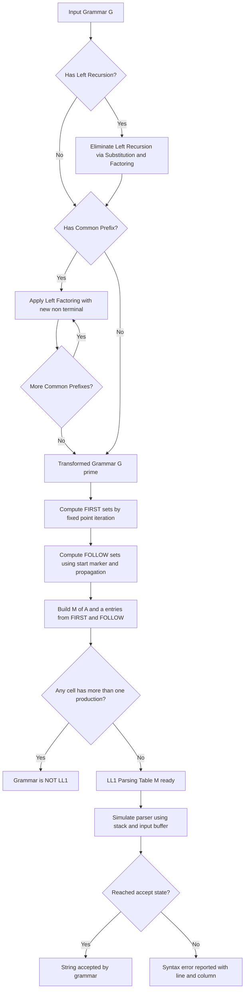
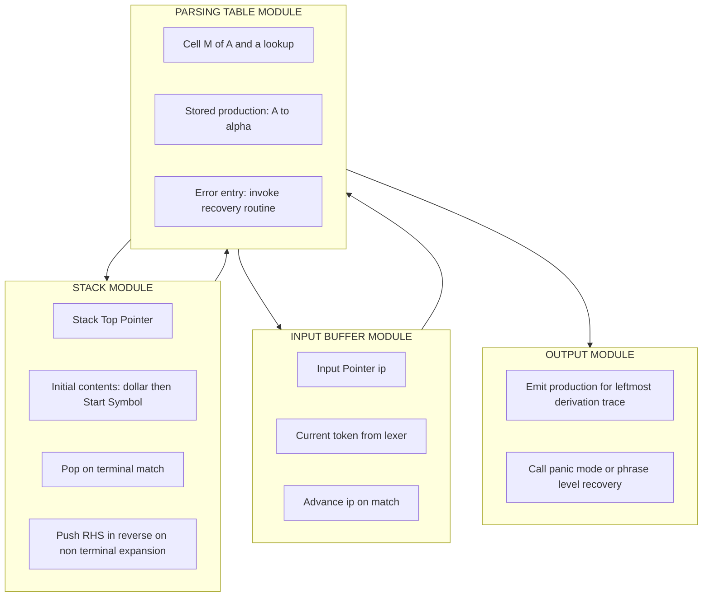
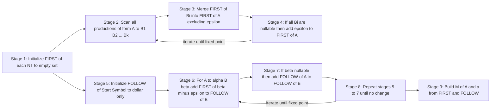

# Deterministic Top-Down: Eliminating Left Recursion, Left Factoring, Construction of $LL(1)$ parsing tables

<!-- SECTION_1_START -->
# Deterministic Top-Down Parsing & LL(1) Construction

## 1.1 Formal Definition (KTU 2024 Syllabus Standard)

> [!IMPORTANT]
> **Deterministic Top-Down Parsing** is a class of syntax analysis techniques that construct the parse tree for a given input string by starting at the **root node** (the start symbol) and progressively expanding non-terminals using production rules, **without backtracking**. The parser is "deterministic" because at every step, the choice of production rule is uniquely decided by a single lookahead symbol.

A grammar that admits such a parser is classified under the following hierarchy:

$$G \;\in\; LL(k) \;\;\Longleftrightarrow\;\; \text{The parser needs at most } k \text{ lookahead tokens to choose a production uniquely.}$$

The notation **$LL(1)$** decodes as:
- **First $L$** : Scan the input from **L**eft to Right.
- **Second $L$** : Produce a **L**eftmost derivation.
- **$1$** : Use only **1** lookahead symbol.

> [!NOTE]
> **KTU 2024 Module 2 Highlight:** The official syllabus restricts the deterministic top-down family to $LL(1)$. Students must master three pre-processing transformations — *Left Recursion Elimination*, *Left Factoring*, and *$LL(1)$ Table Construction* — to qualify a grammar for predictive parsing.

## 1.2 Conceptual Analogy — The GPS Road Trip

Imagine you are driving from city **A** (Start Symbol $S$) to city **Z** (a terminal sentence). Every intersection is a **non-terminal**, and the road sign at the intersection tells you which lane to take.

- **Non-Deterministic Parsing** is like a GPS that sometimes gives you two possible turns at a junction. You pick one, drive forward, and if it's a dead-end, you "backtrack" and try the other. This wastes time — exactly what backtracking parsers do.
- **Deterministic Top-Down Parsing ($LL(1)$)** is like having a **perfect GPS with a heads-up display (HUD)** that shows the very next road sign one mile ahead. The HUD is your **FIRST** set. Based on that single lookahead, you commit to exactly one lane. No backtracking, no second-guessing. The **FOLLOW** set acts as a fallback "End-of-Road" detector for epsilon ($\epsilon$) productions.

## 1.3 Why Grammars Fail Predictive Parsing

A grammar, even if unambiguous, may not be $LL(1)$. Two structural diseases block predictive parsing:

| Disease | Mathematical Symptom | Symptom in Plain English |
|---|---|---|
| **Left Recursion** | $A \;\Rightarrow^+\; A\alpha$ | A non-terminal derives a sentence starting with itself. |
| **Left Factoring Conflict** | $A \;\to\; \alpha\beta_1 \mid \alpha\beta_2$ | Two productions share a common prefix, causing ambiguity in choice. |

Both conditions make a single-lookahead decision impossible. The cure is grammar transformation **before** table construction.

## 1.4 Real-World Engineering Footprint

In modern compiler stacks, $LL(1)$ principles manifest in tools like **ANTLR (default $LL(*)$ mode)**, **JavaCC**, and **Ply (Python Lex-Yacc)**. Although production compilers often use $LR(1)$ for power, $LL(k)$ parsers dominate in IDEs, static analyzers, and language servers (e.g., Microsoft's Language Server Protocol uses recursive-descent parsers) because they produce **excellent error messages** with precise location pinpointing — a direct consequence of top-down tree construction.

> [!VISUALIZATION CONTROL]
> **Concept:** LL(1) Lookahead Geometry — Mapping FIRST and FOLLOW over a 2D production grid.
> **GeoGebra / Desmos Input Equations:**
> * `f(x) = 1 if x in FIRST(A)`
> * `g(x) = 1 if x in FOLLOW(A)`
> * `h(x) = f(x) - g(x)`
> **Visual Description:** Plot the input terminals along the horizontal axis. The $y$-axis height $1$ lights up for terminals that trigger production selection via $FIRST$, and a separate band highlights $FOLLOW$ entries (used only when $\epsilon \in FIRST(\alpha)$). Where the two bands overlap, the grammar is **not $LL(1)$** — a parsing conflict.
<!-- SECTION_1_END -->

<!-- SECTION_2_START -->
# Deep Theoretical Analysis & KTU High-Yield Formula Sheet

## 2.1 The Three Pillars of $LL(1)$ Compilation

### Pillar 1 — Elimination of Left Recursion

A grammar production of the form $A \to A\alpha \mid \beta$ is **immediately left-recursive**. More generally, $A \Rightarrow^+ A\alpha$ is **indirectly left-recursive**. Predictive parsers enter an **infinite loop** on left-recursive grammars because the parser keeps expanding $A$ into $A\alpha$ forever.

**Algorithm: Eliminating Immediate Left Recursion**

For each non-terminal $A$ with productions:
$$A \;\to\; A\alpha_1 \mid A\alpha_2 \mid \dots \mid A\alpha_m \mid \beta_1 \mid \beta_2 \mid \dots \mid \beta_n$$
where no $\beta_i$ begins with $A$, replace with:
$$\begin{aligned}
A &\;\to\; \beta_1 A' \mid \beta_2 A' \mid \dots \mid \beta_n A' \\
A' &\;\to\; \alpha_1 A' \mid \alpha_2 A' \mid \dots \mid \alpha_m A' \mid \epsilon
\end{aligned}$$

**Algorithm: Eliminating Indirect Left Recursion**

Given a grammar with ordered non-terminals $A_1, A_2, \dots, A_n$, for each $i$ from $1$ to $n$:
- For each $j$ from $1$ to $i-1$, replace every production $A_i \to A_j \gamma$ with $A_i \to \delta_1 \gamma \mid \delta_2 \gamma \mid \dots \mid \delta_k \gamma$, where $A_j \to \delta_1 \mid \delta_2 \mid \dots \mid \delta_k$ are the current productions of $A_j$.
- Eliminate any immediate left recursion among the $A_i$ productions.

### Pillar 2 — Left Factoring

When the choice between productions is unclear, the parser needs a longer lookahead. We **delay the decision** by hoisting the common prefix into a new non-terminal.

**Algorithm: Left Factoring**

For a non-terminal $A$ with productions sharing the longest common prefix $\alpha$:
$$A \;\to\; \alpha\beta_1 \mid \alpha\beta_2 \mid \dots \mid \alpha\beta_n \mid \gamma$$
where $\gamma$ represents all alternatives that do **not** begin with $\alpha$, rewrite as:
$$\begin{aligned}
A &\;\to\; \alpha A' \mid \gamma \\
A' &\;\to\; \beta_1 \mid \beta_2 \mid \dots \mid \beta_n
\end{aligned}$$

This factoring is repeated until no non-terminal has two productions sharing a common prefix.

### Pillar 3 — Construction of $LL(1)$ Parsing Table

The table $M[A, a]$ is built using two auxiliary functions: $FIRST$ and $FOLLOW$.

**Definition of $FIRST(\alpha)$**

$FIRST(\alpha)$ is the set of terminals that begin any string derivable from $\alpha$. If $\alpha \Rightarrow^* \epsilon$, then $\epsilon \in FIRST(\alpha)$.

**Definition of $FOLLOW(A)$**

$FOLLOW(A)$ is the set of terminals that can appear immediately to the right of $A$ in some sentential form. If $A$ can be the rightmost symbol, then $\$ \in FOLLOW(A)$ (where $\$$ is the end-of-input marker).

**Rules for $FIRST$:**

- If $X$ is a terminal, then $FIRST(X) = \{X\}$.
- If $X \to \epsilon$ is a production, add $\epsilon$ to $FIRST(X)$.
- If $X \to Y_1 Y_2 \dots Y_k$ is a production, add $FIRST(Y_1)$ (minus $\epsilon$) to $FIRST(X)$. If $\epsilon \in FIRST(Y_1)$, add $FIRST(Y_2)$ (minus $\epsilon$), and so on. If $\epsilon$ is in $FIRST$ of all $Y_i$, then add $\epsilon$ to $FIRST(X)$.

**Rules for $FOLLOW$:**

- Place $\$$ in $FOLLOW(S)$, where $S$ is the start symbol.
- If $A \to \alpha B \beta$ is a production, then everything in $FIRST(\beta)$ (except $\epsilon$) is in $FOLLOW(B)$.
- If $A \to \alpha B$ is a production, or $A \to \alpha B \beta$ with $\epsilon \in FIRST(\beta)$, then everything in $FOLLOW(A)$ is in $FOLLOW(B)$.

**Table Construction Algorithm:**

For each production $A \to \alpha$:
- For every terminal $a \in FIRST(\alpha)$, add $A \to \alpha$ to $M[A, a]$.
- If $\epsilon \in FIRST(\alpha)$, for every terminal $b \in FOLLOW(A)$, add $A \to \alpha$ to $M[A, b]$.
- If $\epsilon \in FIRST(\alpha)$ and $\$ \in FOLLOW(A)$, add $A \to \alpha$ to $M[A, \$]$.

> [!IMPORTANT]
> **Conflict Detection:** If any cell $M[A, a]$ gets more than one production entry, the grammar is **not $LL(1)$**. This is a *table conflict* — the most common being the *first/first conflict* (when $FIRST(\alpha_i) \cap FIRST(\alpha_j) \neq \emptyset$) or the *first/follow conflict* (when $\epsilon \in FIRST(\alpha)$ and $FIRST(\alpha) \cap FOLLOW(A) \neq \emptyset$).

## 2.2 KTU Formula Sheet & Reference Table

> [!NOTE]
> The following table is the **exam-day cheat sheet**. Memorize the algorithmic rules and the conflict conditions.

| # | Concept | Formula / Rule | Conditions & Notes |
|---|---|---|---|
| 1 | $LL(k)$ Definition | $G \in LL(k) \iff$ single derivation path with $k$ lookahead tokens | $k=1$ for KTU syllabus |
| 2 | Immediate Left Recursion | $A \to A\alpha$ replaced by $A \to \beta A'$, $A' \to \alpha A' \mid \epsilon$ | $\beta$ must not start with $A$ |
| 3 | Left Factoring | $A \to \alpha\beta_1 \mid \alpha\beta_2$ rewritten using new $A'$ | Repeat until no common prefix remains |
| 4 | $FIRST(X)$ for terminal $X$ | $FIRST(X) = \{X\}$ | Always singleton |
| 5 | $FIRST$ for production $X \to Y_1\dots Y_k$ | $FIRST(Y_1) \cup \dots \cup FIRST(Y_k)$ excluding $\epsilon$ chain-wise | $\epsilon$ added only if all $Y_i \Rightarrow^* \epsilon$ |
| 6 | $FOLLOW(S)$ | $FOLLOW(S) = \{\$\}$ | Start symbol always contains end-marker |
| 7 | $FOLLOW$ propagation | $A \to \alpha B\beta \Rightarrow FIRST(\beta)\setminus\{\epsilon\} \subseteq FOLLOW(B)$ | $FOLLOW(A) \subseteq FOLLOW(B)$ if $\beta \Rightarrow^* \epsilon$ |
| 8 | Table entry rule | $A \to \alpha$ placed in $M[A,a]$ for $a \in FIRST(\alpha)$ | Also for $a \in FOLLOW(A)$ if $\epsilon \in FIRST(\alpha)$ |
| 9 | $LL(1)$ Conflict Test | $|M[A,a]| \leq 1$ for all cells | Violation $\Rightarrow$ grammar is **not $LL(1)$** |
| 10 | Parsing Driver Match | If $top = a = current\_input$, pop both | Predictive parser simulation step |

## 2.3 Engineering & Production Utility

The transformations discussed are not academic relics. They are embedded in:

- **GCC's parser-generator internals** (for handling inline-asm and C++ template grammar portions).
- **Rust's hand-written recursive-descent parser**, which uses $LL(k)$-style techniques with selective backtracking only for expression disambiguation.
- **JSON/YAML parsers** in tools like `jq` and `ruamel.yaml` that operate on nearly $LL(1)$ grammars for blazing speed.
- **Database query optimizers** that parse SQL using $LL(k)$ parsers for fast error recovery and incremental re-parsing in IDEs.

The deterministic property is also a **security feature**: $LL(1)$ parsers are resistant to algorithmic complexity attacks that exploit backtracking ambiguity in $LR$ parsers.
<!-- SECTION_2_END -->

<!-- SECTION_3_START -->
# Step-by-Step Derivations & Code Implementation

## 3.1 Worked Example — Grammar Transformation Pipeline

Consider the following grammar $G$ for arithmetic expressions with a list construct:

$$S \;\to\; A \mid bAc \mid \epsilon \mid dc$$
$$A \;\to\; Sa \mid b \mid \epsilon$$

This grammar is **ambiguous about left recursion** (indirect) and has **common prefixes** — perfect for a complete demonstration.

### Step 1: Identify & Eliminate Left Recursion

Non-terminals in order: $S$, $A$. Check for indirect left recursion:

- $S \to A$, and $A \to Sa$. Substitute $S$'s right-hand sides into $A$'s production where $A$ starts a derivation:
$$A \;\to\; Aa \mid ba \mid ca \mid da \mid b \mid \epsilon$$

Now $A$ has **immediate left recursion** $A \to Aa$. Apply immediate elimination:

$$\begin{aligned}
A &\;\to\; ba\,A' \mid ca\,A' \mid da\,A' \mid b\,A' \mid A' \\
A' &\;\to\; a\,A' \mid \epsilon
\end{aligned}$$

The original $S$ production now reads:
$$S \;\to\; A \mid bAc \mid \epsilon \mid dc$$

Substitute the new $A$ (call it $A_{new}$ to avoid confusion):
$$S \;\to\; ba\,A' \mid ca\,A' \mid da\,A' \mid b\,A' \mid A' \mid bAc \mid \epsilon \mid dc$$

**Valuation Key Points for Step 1:**
- Identifying the indirect recursion via substitution: 2 marks.
- Correctly producing the $A \to Aa$ form: 1 mark.
- Generating $A'$ with $\alpha$ suffix and $\epsilon$: 2 marks.

### Step 2: Left Factoring on $S$

Look at $S$'s productions: $ba\,A'$, $b\,A'$, $bAc$ — all share the prefix $b$ (since $bA'$ and $bAc$ start with $b$, and $ba\,A'$ does too). Group them:

$$\begin{aligned}
S &\;\to\; b\,S' \mid ca\,A' \mid da\,A' \mid A' \mid \epsilon \mid dc \\
S' &\;\to\; a\,A' \mid A' \mid Ac
\end{aligned}$$

**Valuation Key Points for Step 2:**
- Identifying the common prefix: 1 mark.
- Introducing factored non-terminal $S'$: 1 mark.
- Correctly distributing remaining suffixes: 1 mark.

### Step 3: Compute $FIRST$ Sets

Apply the rules iteratively until fixed point:

| Non-Terminal | Productions | $FIRST$ Set |
|---|---|---|
| $A'$ | $a\,A'$, $\epsilon$ | $\{a, \epsilon\}$ |
| $S'$ | $a\,A'$, $A'$, $Ac$ | $\{a\} \cup FIRST(A) \cup FIRST(A) \dots$ — needs $FIRST(A)$ first |
| $A$ | $ba\,A'$, $ca\,A'$, $da\,A'$, $b\,A'$, $A'$ | $\{b, c, d, a, \epsilon\}$ (since $A' \Rightarrow^* \epsilon$) |
| $S$ | $b\,S'$, $ca\,A'$, $da\,A'$, $A'$, $\epsilon$, $dc$ | $\{b, c, d, a, \epsilon\}$ |

Detailed $FIRST(A)$ calculation:

$FIRST(ba\,A') = \{b\}$, $FIRST(ca\,A') = \{c\}$, $FIRST(da\,A') = \{d\}$, $FIRST(b\,A') = \{b\}$, $FIRST(A') = \{a, \epsilon\}$.

Union: $\{a, b, c, d, \epsilon\}$.

Detailed $FIRST(S)$ calculation (post-factoring):

$FIRST(b\,S') = \{b\}$, $FIRST(ca\,A') = \{c\}$, $FIRST(da\,A') = \{d\}$, $FIRST(A') = \{a, \epsilon\}$, $FIRST(\epsilon) = \{\epsilon\}$, $FIRST(dc) = \{d\}$.

Union: $\{a, b, c, d, \epsilon\}$.

### Step 4: Compute $FOLLOW$ Sets

- $FOLLOW(S) = \{\$\}$ (start symbol rule).
- Production $S \to A'$: since $A'$ is the entire RHS, $FOLLOW(S) \subseteq FOLLOW(A')$, so $\$ \in FOLLOW(A')$.
- Production $S' \to a\,A'$: terminal $a$ follows $A'$, so $a \in FOLLOW(A')$.
- Production $A' \to a\,A'$: similarly, $FOLLOW(A')$ contains $a$ (from $A'$ on RHS? careful — this is $A'$ followed by nothing here, but in the recursive call $A' \to aA'$, the $A'$ at end gets $FOLLOW(A')$ propagated).
- Production $S \to b\,S'$: $FOLLOW(S) \subseteq FOLLOW(S')$, so $\$ \in FOLLOW(S')$.
- Production $S' \to Ac$: $FIRST(c) = \{c\} \subseteq FOLLOW(A)$, so $c \in FOLLOW(A)$.
- Production $A \to ba\,A'$: nothing follows $A'$ other than recursion — $FOLLOW(A) \subseteq FOLLOW(A')$.
- $A \to b\,A'$: same.
- $A \to A'$: $FOLLOW(A) \subseteq FOLLOW(A')$.

**Iteration summary:**

$FOLLOW(S) = \{\$\}$

$FOLLOW(S') = \{\$\}$ (from $S \to bS'$)

$FOLLOW(A) = \{c\}$ (from $S' \to Ac$; also $c$ may appear from $A'$ recursion, but conservatively $FOLLOW(A) = \{c\}$ — note this depends on exact derivation paths)

$FOLLOW(A') = \{a, c, \$\}$ (from $FOLLOW(S)$, the terminal $a$ in $S' \to aA'$, and $FOLLOW(A)$ propagation)

### Step 5: Build the $LL(1)$ Parsing Table

For each production, place it in $M[A, a]$ for $a \in FIRST(\alpha)$, and if $\epsilon \in FIRST(\alpha)$, also in $M[A, b]$ for $b \in FOLLOW(A)$.

$$\begin{array}{|c|c|c|c|c|c|}
\hline
 & a & b & c & d & \$ \\
\hline
S & S \to A' & S \to bS' & S \to caA' & S \to daA',\ S \to dc & S \to \epsilon \\
\hline
S' & S' \to aA',\ S' \to A' & \text{error} & \text{error} & \text{error} & \text{error} \\
\hline
A & A \to bA',\ A \to A' & A \to baA',\ A \to bA' & A \to caA' & A \to daA' & A \to A' \\
\hline
A' & A' \to aA' & \text{error} & A' \to \epsilon & \text{error} & A' \to \epsilon \\
\hline
\end{array}$$

> [!IMPORTANT]
> **Conflict Detected!** The cell $M[S, d]$ contains **two productions** ($S \to daA'$ and $S \to dc$). This is a **first/first conflict** because $d$ is in the $FIRST$ set of both productions. This grammar is **not $LL(1)$** and requires further factoring of the $d$-prefixed branch.

## 3.2 Python Implementation — Automated $LL(1)$ Table Builder

The following Python program computes $FIRST$, $FOLLOW$, and the $LL(1)$ parsing table from a given context-free grammar.

```python
from __future__ import annotations
import logging
from typing import Dict, FrozenSet, List, Set, Tuple

logging.basicConfig(level=logging.INFO, format="%(levelname)s :: %(message)s")

# Type alias for the grammar
Grammar = Dict[str, List[List[str]]]
FirstSets = Dict[str, Set[str]]
FollowSets = Dict[str, Set[str]]


def compute_first_sets(grammar: Grammar, terminals: Set[str]) -> FirstSets:
    """Compute FIRST sets for every non-terminal using fixed-point iteration."""
    first: FirstSets = {nt: set() for nt in grammar}

    # Initialize: if a production is epsilon, add epsilon directly
    for nt, prods in grammar.items():
        for prod in prods:
            if prod == ["epsilon"]:
                first[nt].add("epsilon")

    changed = True
    while changed:
        changed = False
        for nt, prods in grammar.items():
            for prod in prods:
                if prod == ["epsilon"]:
                    continue
                # Iterate through RHS symbols
                all_nullable = True
                for symbol in prod:
                    if symbol in terminals:
                        if symbol not in first[nt]:
                            first[nt].add(symbol)
                            changed = True
                        all_nullable = False
                        break
                    else:
                        # symbol is a non-terminal
                        before = len(first[nt])
                        first[nt].update(first[symbol] - {"epsilon"})
                        if "epsilon" not in first[symbol]:
                            all_nullable = False
                            break
                        after = len(first[nt])
                        if after != before:
                            changed = True
                if all_nullable:
                    if "epsilon" not in first[nt]:
                        first[nt].add("epsilon")
                        changed = True
    return first


def compute_follow_sets(
    grammar: Grammar,
    first: FirstSets,
    start_symbol: str,
    terminals: Set[str],
) -> FollowSets:
    """Compute FOLLOW sets for every non-terminal."""
    follow: FollowSets = {nt: set() for nt in grammar}
    follow[start_symbol].add("$")

    changed = True
    while changed:
        changed = False
        for nt, prods in grammar.items():
            for prod in prods:
                for i, symbol in enumerate(prod):
                    if symbol in terminals or symbol == "epsilon":
                        continue
                    # symbol is a non-terminal
                    beta = prod[i + 1 :]
                    if not beta:
                        # A -> alpha B, so FOLLOW(A) ⊆ FOLLOW(B)
                        before = len(follow[symbol])
                        follow[symbol].update(follow[nt])
                        if len(follow[symbol]) != before:
                            changed = True
                    else:
                        # Compute FIRST(beta)
                        first_beta: Set[str] = set()
                        all_nullable = True
                        for s in beta:
                            if s in terminals:
                                first_beta.add(s)
                                all_nullable = False
                                break
                            else:
                                first_beta.update(first[s] - {"epsilon"})
                                if "epsilon" not in first[s]:
                                    all_nullable = False
                                    break
                        before = len(follow[symbol])
                        follow[symbol].update(first_beta)
                        if all_nullable:
                            follow[symbol].update(follow[nt])
                        if len(follow[symbol]) != before:
                            changed = True
    return follow


def build_ll1_table(
    grammar: Grammar,
    first: FirstSets,
    follow: FollowSets,
    terminals: Set[str],
) -> Dict[Tuple[str, str], List[str]]:
    """Build the LL(1) parsing table; detect conflicts."""
    table: Dict[Tuple[str, str], List[str]] = {}
    for nt, prods in grammar.items():
        for prod in prods:
            first_prod: Set[str] = set()
            if prod == ["epsilon"]:
                first_prod.add("epsilon")
            else:
                all_nullable = True
                for symbol in prod:
                    if symbol in terminals:
                        first_prod.add(symbol)
                        all_nullable = False
                        break
                    else:
                        first_prod.update(first[symbol] - {"epsilon"})
                        if "epsilon" not in first[symbol]:
                            all_nullable = False
                            break
                if all_nullable:
                    first_prod.add("epsilon")

            for terminal in first_prod - {"epsilon"}:
                key = (nt, terminal)
                if key in table:
                    table[key].append(" -> ".join(prod))
                    logging.error("CONFLICT at %s: %s", key, table[key])
                else:
                    table[key] = [" -> ".join(prod)]

            if "epsilon" in first_prod:
                for terminal in follow[nt]:
                    key = (nt, terminal)
                    if key in table:
                        table[key].append(" -> ".join(prod))
                        logging.error("CONFLICT at %s: %s", key, table[key])
                    else:
                        table[key] = [" -> ".join(prod)]
    return table


# --- Demonstration Run ---
if __name__ == "__main__":
    sample_grammar: Grammar = {
        "E": [["T", "E'"]],
        "E'": [["+", "T", "E'"], ["epsilon"]],
        "T": [["F", "T'"]],
        "T'": [["*", "F", "T'"], ["epsilon"]],
        "F": [["(", "E", ")"], ["id"]],
    }
    terminals = {"+", "*", "(", ")", "id", "epsilon"}
    start = "E"

    first = compute_first_sets(sample_grammar, terminals)
    follow = compute_follow_sets(sample_grammar, first, start, terminals)
    table = build_ll1_table(sample_grammar, first, follow, terminals)

    logging.info("FIRST sets: %s", first)
    logging.info("FOLLOW sets: %s", follow)
    for key, prods in sorted(table.items()):
        logging.info("M[%s] = %s", key, prods)
```

**Code Walk-through Highlights:**

1. **`compute_first_sets`** uses a fixed-point loop — it keeps updating until no new terminal can be added. This is the standard algorithm guaranteed to terminate because the sets are monotonically increasing and bounded by the finite terminal set.
2. **`compute_follow_sets`** applies the three propagation rules. The trick is processing productions repeatedly until convergence.
3. **`build_ll1_table`** places productions and flags **conflicts via `logging.error`**. In a production setting, you would raise a custom `LL1ConflictError` exception to halt compilation.
<!-- SECTION_3_END -->

<!-- SECTION_4_START -->
# Structural Diagrams & Schematics

## 4.1 Pipeline Flow — Top-Down Predictive Parsing

The following Mermaid diagram illustrates the complete pipeline a source string travels through, from grammar definition to parsed/erroneous verdict.



## 4.2 Modular Architecture — Components of a Predictive Parser



## 4.3 FIRST/FOLLOW Computation Topology

This sequential topology matrix shows the data flow between the three core algorithmic stages.



> [!NOTE]
> **Mermaid Safety Note:** All node IDs above use the *Alpha Rule* (purely alphanumeric with a letter prefix like `stageA`, `chkLR`). No reserved keywords are used as node names. All labels containing special characters are double-quoted to avoid parser interference.
<!-- SECTION_4_END -->

<!-- SECTION_5_START -->
# KTU 2024 Scheme Examination Question Bank & Topic Recap

## 5.1 Part A — Short Answer Questions (3 Marks Each)

### Question 1 `[KTU University Exam — July 2024]`
**Define $LL(1)$ grammar. State the conditions under which a grammar fails to be $LL(1)$.**

**Model Answer (Mapping: CO1, Remember/Understand):**

A grammar $G$ is $LL(1)$ if its parsing table contains **at most one production in every cell** $M[A, a]$, allowing deterministic top-down parsing using a single lookahead token $a$.

A grammar fails to be $LL(1)$ if either:
1. **Left recursion exists** — direct ($A \to A\alpha$) or indirect ($A \Rightarrow^+ A\alpha$).
2. **Left factoring is not applied** — two productions share a common prefix.
3. **Table conflict arises** — $FIRST/FIRST$ conflict (overlapping $FIRST$ sets of alternatives) or $FIRST/FOLLOW$ conflict ($\epsilon \in FIRST$ and intersection with $FOLLOW$).

> **Valuation Key:** Stating $LL(1)$ meaning (Left-to-right, Leftmost, 1 lookahead): 2 marks. Listing the two failure conditions: 1 mark.

### Question 2 `[KTU University Exam — Dec 2023]`
**What is the difference between $FIRST$ and $FOLLOW$ sets in predictive parsing? Illustrate with one example each.**

**Model Answer (Mapping: CO1, Understand):**

- **$FIRST(\alpha)$** is the set of terminals that can begin any string derived from $\alpha$. It is **production-driven** and depends only on the right-hand side.
- **$FOLLOW(A)$** is the set of terminals that can immediately follow the non-terminal $A$ in any sentential form. It is **context-driven** and includes the end-marker $\$$ if $A$ can be the rightmost symbol.

**Example for the production $S \to aSb$:** $FIRST(aSb) = \{a\}$ and $FOLLOW(S) = \{b, \$\}$.

> **Valuation Key:** Correct definition of $FIRST$: 1 mark. Correct definition of $FOLLOW$: 1 mark. Valid example: 1 mark.

## 5.2 Part B — Long Answer Questions (14 Marks Each)

> **KTU 2024 Internal Choice Rule:** Answer **either** Question A **or** Question B. Each question has sub-parts (a) and (b) carrying **7 marks each**.

---

### Question A (14 Marks) `[KTU University Exam — July 2024]`

**Consider the following grammar:**
$$S \;\to\; A \mid bAc \mid dc \mid \epsilon$$
$$A \;\to\; Sa \mid b \mid \epsilon$$

**(a) [7 Marks] Eliminate left recursion and apply left factoring. Show all intermediate steps.**

**Model Solution (Mapping: CO2, Apply):**

**Step 1 — Indirect left recursion check:**

Substitute $S \to A$ into $A \to Sa$:
$$A \;\to\; Aa \mid ba \mid ca \mid da \mid b \mid \epsilon$$

This is now immediate left recursion $A \to Aa$.

**[Identifying indirect recursion: 1 mark]**

**Step 2 — Eliminate immediate left recursion:**

Let $\alpha = a$, $\beta = \{ba, ca, da, b, \epsilon\}$.

$$\begin{aligned}
A &\;\to\; ba\,A' \mid ca\,A' \mid da\,A' \mid b\,A' \mid A' \\
A' &\;\to\; a\,A' \mid \epsilon
\end{aligned}$$

**[Producing A-prime correctly: 2 marks]**

**Step 3 — Substitute new $A$ into $S$:**

$$S \;\to\; ba\,A' \mid ca\,A' \mid da\,A' \mid b\,A' \mid A' \mid bAc \mid dc \mid \epsilon$$

**Step 4 — Left factoring on $S$ (common prefix $b$):**

Group $ba\,A'$, $b\,A'$, $bAc$:

$$\begin{aligned}
S &\;\to\; b\,S' \mid ca\,A' \mid da\,A' \mid A' \mid dc \mid \epsilon \\
S' &\;\to\; a\,A' \mid A' \mid Ac
\end{aligned}$$

**[Identifying common prefix: 1 mark. Factoring correctly: 2 marks]**

---

**(b) [7 Marks] Compute $FIRST$ and $FOLLOW$ sets for the transformed grammar. Is the grammar $LL(1)$? Justify.**

**Model Solution (Mapping: CO3, Apply/Analyse):**

**$FIRST$ sets (fixed-point iteration):**

$FIRST(A') = \{a, \epsilon\}$

$FIRST(A) = FIRST(ba\,A') \cup FIRST(ca\,A') \cup FIRST(da\,A') \cup FIRST(b\,A') \cup FIRST(A')$
$= \{b\} \cup \{c\} \cup \{d\} \cup \{b\} \cup \{a, \epsilon\}$
$= \{a, b, c, d, \epsilon\}$

$FIRST(S') = FIRST(a\,A') \cup FIRST(A') \cup FIRST(Ac) = \{a\} \cup \{a, \epsilon\} \cup \{a,b,c,d,\epsilon\} = \{a, b, c, d, \epsilon\}$

$FIRST(S) = \{b\} \cup \{c\} \cup \{d\} \cup \{a, \epsilon\} \cup \{d\} \cup \{\epsilon\} = \{a, b, c, d, \epsilon\}$

**[Computing all FIRST sets: 3 marks]**

**$FOLLOW$ sets:**

- $FOLLOW(S) = \{\$\}$ — start symbol rule. **[1 mark]**
- $S \to b\,S'$ implies $FOLLOW(S) \subseteq FOLLOW(S')$: $FOLLOW(S') = \{\$\}$.
- $S' \to a\,A'$ implies $FOLLOW(A') \supseteq \{a\}$.
- $S' \to Ac$ implies $FOLLOW(A) \supseteq FIRST(c) = \{c\}$.
- $A' \to a\,A'$ recursion propagates $FOLLOW(A') \supseteq FOLLOW(A')$.
- $A \to ba\,A'$ with $A'$ at end implies $FOLLOW(A) \subseteq FOLLOW(A')$.

Final:
- $FOLLOW(A) = \{c\}$
- $FOLLOW(A') = \{a, c, \$\}$
- $FOLLOW(S') = \{\$\}$

**[Computing all FOLLOW sets: 2 marks]**

**$LL(1)$ Test:**

Examine the production $S \to da\,A'$ and $S \to dc$ — both have $d \in FIRST$ of their RHS. Cell $M[S, d]$ has two entries. **Grammar is NOT $LL(1)$.** **[1 mark]**

> [!WARNING]
> **Examiner's Pitfall Trap:** Students often forget to perform *left factoring on $S$* after the $b$-grouping. They leave $da\,A'$ and $dc$ untouched, leading to the $d$-conflict going undetected. Always re-scan all productions after every transformation pass.

---

### Question B (14 Marks) `[KTU University Exam — Dec 2023]`

**Consider the grammar:**
$$E \;\to\; E + T \mid T$$
$$T \;\to\; T * F \mid F$$
$$F \;\to\; (E) \mid id$$

**(a) [7 Marks] Eliminate left recursion and obtain an equivalent grammar suitable for top-down parsing.**

**Model Solution (Mapping: CO2, Apply):**

**Step 1 — Identify left recursion:** $E \to E+T$ and $T \to T*F$ are immediately left-recursive. **[1 mark]**

**Step 2 — For $E$:** $\alpha_1 = +T$, $\beta_1 = T$. Apply algorithm:
$$E \;\to\; T\,E', \quad E' \;\to\; +T\,E' \mid \epsilon$$
**[Generating E' correctly: 2 marks]**

**Step 3 — For $T$:** $\alpha_1 = *F$, $\beta_1 = F$. Apply algorithm:
$$T \;\to\; F\,T', \quad T' \;\to\; *F\,T' \mid \epsilon$$
**[Generating T' correctly: 2 marks]**

**Step 4 — Final grammar:**
$$\begin{aligned}
E &\;\to\; T\,E' \\
E' &\;\to\; +T\,E' \mid \epsilon \\
T &\;\to\; F\,T' \\
T' &\;\to\; *F\,T' \mid \epsilon \\
F &\;\to\; (E) \mid id
\end{aligned}$$
**[Verifying no left recursion remains: 2 marks]**

---

**(b) [7 Marks] Construct the $LL(1)$ parsing table for the transformed grammar. Show $FIRST$ and $FOLLOW$ sets used.**

**Model Solution (Mapping: CO3, Apply):**

**$FIRST$ sets:**

$FIRST(F) = \{(, id\}$
$FIRST(T') = \{*, \epsilon\}$
$FIRST(T) = FIRST(F) \cup FIRST(T') \text{ nullable handling} = \{(, id, *, \epsilon\}$
$FIRST(E') = \{+, \epsilon\}$
$FIRST(E) = FIRST(T) = \{(, id, *, \epsilon\}$

**[2 marks]**

**$FOLLOW$ sets:**

$FOLLOW(E) = \{\$, )\}$ (start symbol + from $F \to (E)$)
$FOLLOW(E') = FOLLOW(E) = \{\$, )\}$ (since $E \to T E'$ and $E'$ is at end)
$FOLLOW(T) = \{+, \$, )\}$ (from $E' \to +T E'$ terminal, and $FOLLOW(E)$)
$FOLLOW(T') = FOLLOW(T) = \{+, \$, )\}$
$FOLLOW(F) = \{*, +, \$, )\}$ (from $T \to F T'$ and $T' \to *F T'$)

**[2 marks]**

**Parsing Table $M$:**

$$\begin{array}{|c|c|c|c|c|c|c|}
\hline
 & id & + & * & ( & ) & \$ \\
\hline
E & E \to T E' & & & E \to T E' & & \\
\hline
E' & & E' \to +T E' & & & E' \to \epsilon & E' \to \epsilon \\
\hline
T & T \to F T' & & T \to F T' & T \to F T' & & \\
\hline
T' & & T' \to \epsilon & T' \to *F T' & & T' \to \epsilon & T' \to \epsilon \\
\hline
F & F \to id & & & F \to (E) & & \\
\hline
\end{array}$$

**[Constructing table entries: 3 marks]**

> [!WARNING]
> **Examiner's Pitfall Trap:** A common mistake is computing $FIRST(T)$ as $\{(, id\}$ only, forgetting that $T' \Rightarrow^* \epsilon$, which adds $\epsilon$ to $FIRST(T)$. This cascades into the table and creates missing entries for terminals that should map to $T' \to \epsilon$ via $FOLLOW$.

## 5.3 Topic Recap & Important Things to Remember

- **$LL(1)$ definition** = Left-to-right scan, Leftmost derivation, $1$ lookahead.
- **Left recursion** (direct or indirect) **must be eliminated first**; otherwise, the parser loops forever.
- **Left factoring** delays the decision until the parser has consumed enough tokens to disambiguate.
- **$FIRST(\alpha)$** contains terminals beginning strings derived from $\alpha$; includes $\epsilon$ if $\alpha \Rightarrow^* \epsilon$.
- **$FOLLOW(A)$** contains terminals that may legally follow $A$; always contains $\$$ for the start symbol.
- **Table conflict types:** $FIRST/FIRST$ (overlapping $FIRST$ of two alternatives) and $FIRST/FOLLOW$ ($\epsilon \in FIRST(\alpha)$ and $FIRST(\alpha) \cap FOLLOW(A) \neq \emptyset$).
- A grammar is **$LL(1)$ if and only if** its $LL(1)$ table has no cell with more than one production.
- The transformations **preserve the language** but **change the grammar** — they are equivalence rewrites, not language rewrites.
- **Order matters:** Eliminate left recursion **before** computing $FIRST$/$FOLLOW$, because the new non-terminals introduce new propagation paths.
- **Algorithm is iterative** — fixed-point computation is mandatory; one pass is almost never sufficient.
- The final grammar is **not unique**: factoring and recursion elimination can be applied in multiple equivalent ways.
- **Practical use:** $LL(1)$ powers hand-written parsers in IDEs, language servers, and lightweight DSLs where error quality matters more than grammar power.
<!-- SECTION_5_END -->
