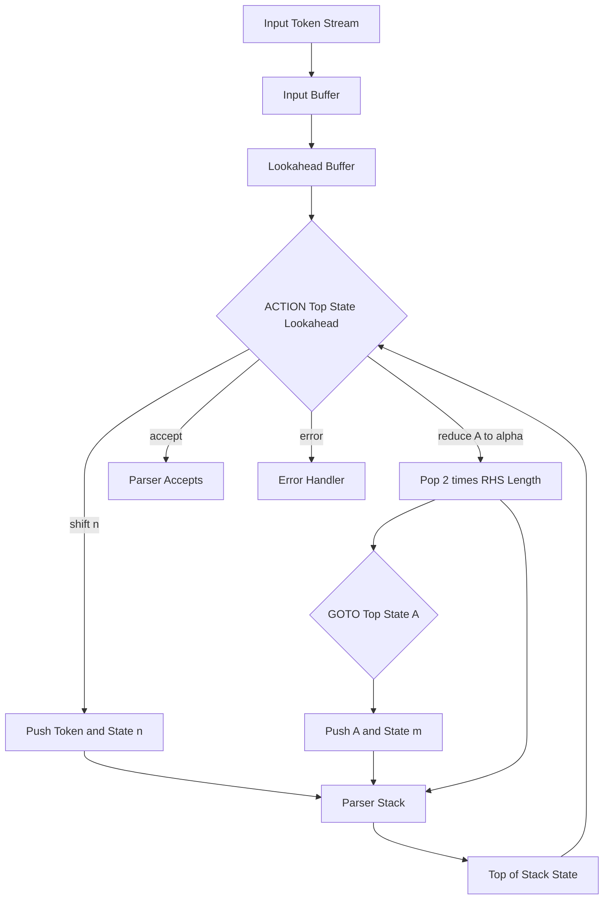
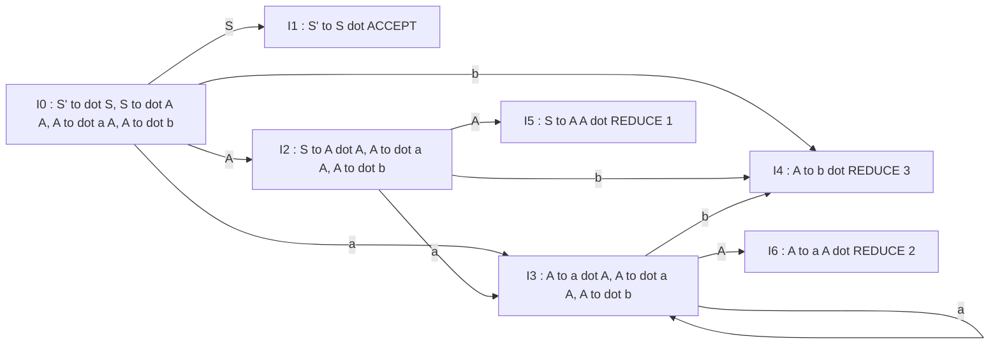
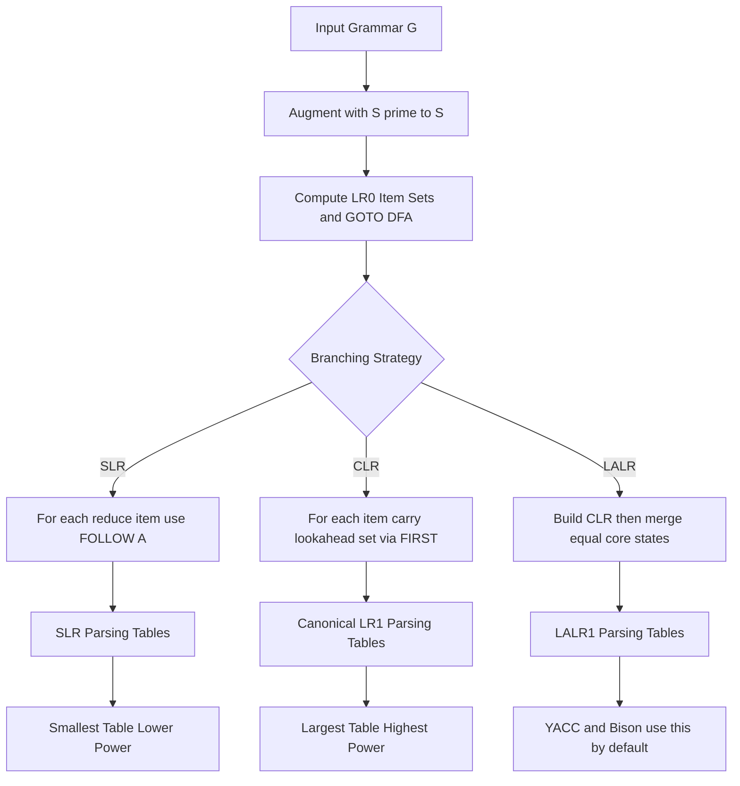
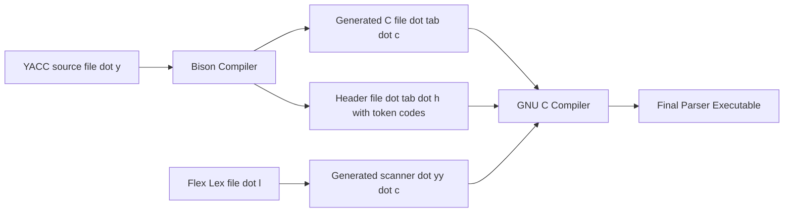
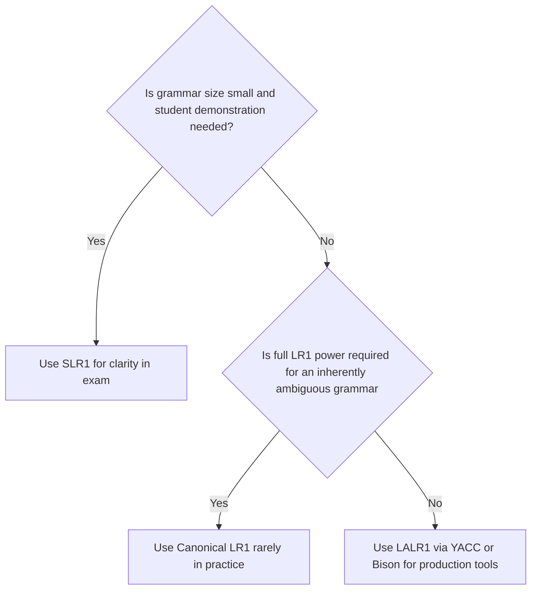

# LR Parsers: Constructing SLR, Canonical LR ($LR(1)$), and LALR parsing tables, Parser Generator tools (YACC/BISON)

<!-- SECTION_1_START -->
# LR Parsers — SLR, Canonical LR(1) & LALR

## 1.1 Formal Definition (KTU 2024 Syllabus Terminology)

> [!NOTE]
> **LR($k$) Parsing (KTU Definition):** A shift-reduce parsing technique in which, by scanning the input from **Left** to right and producing a **Rightmost derivation** in reverse, a parser uses up to **$k$ tokens of lookahead** to decide when to shift or reduce. The "L" denotes left-to-right scan, "R" denotes rightmost derivation, and "$k$" denotes the number of lookahead symbols used.

**Variants covered in Module 2:**

* **SLR(1) — Simple LR(1):** Uses $LR(0)$ items augmented with the **FOLLOW** set to resolve reductions. Easiest to construct but least powerful.
* **Canonical LR(1) / CLR(1):** Uses $LR(1)$ items (core + lookahead set) for precise decisions. Most powerful, largest tables.
* **LALR(1) — Lookahead LR(1):** Merges $LR(1)$ states that have identical *cores*. Same table size as SLR but nearly the power of CLR. Used by **YACC** and **GNU Bison**.

**Augmented Grammar:** Given $G = (V, T, P, S)$, the augmented grammar $G'$ adds a new start production $S' \rightarrow S$ where $S'$ is a fresh non-terminal. The parser is said to **accept** the input when it is about to reduce by $S' \rightarrow S$.

> [!IMPORTANT]
> **KTU 2024 High-Yield Point:** The three LR variants form a strict hierarchy of language recognition power:
> $$\text{SLR}(1) \;\subseteq\; \text{LALR}(1) \;\subseteq\; \text{Canonical LR}(1)$$
> Every SLR(1) grammar is LALR(1), and every LALR(1) grammar is Canonical LR(1). However, the *reverse is not true* — some grammars accepted by LALR(1) (but not SLR(1)) still exist, and a few grammars are CLR(1) but not LALR(1).

---

## 1.2 Conceptual Analogy — The "Train Shunting Yard"

Imagine a **railway shunting yard** where train cars (input tokens) arrive from the left. The yard has multiple parallel **tracks** (the *LR parser stack*). At each step, the yardmaster must decide:

1. **Shift:** Move the next car onto the current active track (push token onto stack).
2. **Reduce:** Recognize that the rightmost cars on the track form a complete "locomotive unit" (the right-hand side of a production) and replace them with a single bigger unit (the left-hand side non-terminal).
3. **Accept:** The single unit left on the track is the engine $S'$ — done.
4. **Error:** No valid move exists — grammar violation.

**$LR(0)$ items** are the *blueprints* of partial units the yardmaster can recognize. The **DFA of item sets** is the *state diagram* of the yard: each state remembers which "half-built" units it has seen. The **lookahead** (in $LR(1)$) is the *next car* the yardmaster peeks at before committing to a reduce — preventing wrong reductions.

> [!VISUALIZATION CONTROL]
> **Concept:** DFA of $LR(0)$ item sets for a sample grammar — a directed graph where each node is a set of dotted productions and edges are grammar symbols.
> **GeoGebra / Desmos Input Equations:** Treat each state $I_i$ as a point $(x, y)$ on a coordinate plane and draw arrows:
> * State $I_0$ at $(0, 0)$, $I_1$ at $(2, 2)$, $I_2$ at $(4, 0)$, $I_3$ at $(6, 2)$, $I_4$ at $(6, -2)$
> * Label arrows with terminals/non-terminals (e.g., `"->"`) from GOTO transitions
> **Visual Description:** The student should see a connected directed graph where *accept* and *reduce* states are highlighted as sinks (no outgoing grammar-symbol edges).

---

## 1.3 LR($0$) Items — The Building Block

An **$LR(0)$ item** (or simply *item*) of a production $A \rightarrow XYZ$ is a production with a dot inserted somewhere in the right-hand side:

$$A \rightarrow \alpha \cdot \beta$$

The dot marks how much of the production's RHS has already been seen on the stack.

**Four meaningful positions per production $A \rightarrow \alpha$:**

$$A \rightarrow \cdot \alpha \quad A \rightarrow \alpha_1 \cdot \alpha_2 \quad A \rightarrow \alpha \cdot \quad A \rightarrow \alpha \cdot$$

(For $\epsilon$-productions $A \rightarrow \epsilon$, the only item is $A \rightarrow \cdot$.)

> [!TIP]
> **Intuition:** $A \rightarrow \alpha \cdot \beta$ means *"I have already seen $\alpha$ on the stack, and I still expect to see $\beta$ before I can reduce."*

---

## 1.4 KTU Working Example Grammar (used throughout)

We use the following classical example from Aho, Sethi, Ullman (the KTU-recommended textbook):

$$S \rightarrow A\,A \qquad A \rightarrow a\,A \qquad A \rightarrow b$$

**Augmented form** (add $S' \rightarrow S$):

$$\text{(0)}\; S' \rightarrow S \qquad \text{(1)}\; S \rightarrow A\,A \qquad \text{(2)}\; A \rightarrow a\,A \qquad \text{(3)}\; A \rightarrow b$$

This grammar generates strings of the form $a^* b a^* b$ — perfect for illustrating shift-reduce decisions on a clean, finite automaton.

<!-- SECTION_1_END -->

<!-- SECTION_2_START -->
# Deep Theoretical Analysis & KTU High-Yield Formula Sheet

## 2.1 The Two Fundamental Set Operations

The entire construction of every LR parsing table hinges on two operations over sets of items.

### 2.1.1 CLOSURE($I$) — The "Look Around" Operation

> [!IMPORTANT]
> **Definition (CLOSURE):** If $I$ is a set of $LR(0)$ items for grammar $G'$, then CLOSURE($I$) is the smallest set satisfying:
> 1. Every item in $I$ is in CLOSURE($I$).
> 2. If $A \rightarrow \alpha \cdot B \beta$ is in CLOSURE($I$) and $B \rightarrow \gamma$ is a production, then add $B \rightarrow \cdot \gamma$ to CLOSURE($I$).
> 3. Repeat step 2 until no new items can be added.

**Why?** Whenever the parser has seen $\alpha$ on the stack and the next symbol could be $B$, then the parser may next see a string derivable from $B$ — so all "starting" items for $B$ must also be live in the same state.

**Algorithm (Pseudocode):**

```
Set CLOSURE(I):
    J = I
    repeat
        for each item A → α·Bβ in J
            for each production B → γ in G'
                if B → ·γ not in J
                    add B → ·γ to J
    until no new items added
    return J
```

### 2.1.2 GOTO($I$, $X$) — The "Move Dot" Operation

> [!IMPORTANT]
> **Definition (GOTO):** If $I$ is a set of items and $X$ is a grammar symbol, then
> $$\text{GOTO}(I, X) = \text{CLOSURE}\big(\{A \rightarrow \alpha X \cdot \beta \mid A \rightarrow \alpha \cdot X \beta \in I\}\big)$$

**Intuition:** GOTO models advancing the dot past symbol $X$ for every item that expects $X$ next, then closing the resulting set.

---

## 2.2 Canonical Collection of $LR(0)$ Items

The **canonical collection** $\mathcal{C}$ is the set of all reachable item sets, built by:

1. Start state: $I_0 = \text{CLOSURE}(\{S' \rightarrow \cdot S\})$.
2. For every $I_i \in \mathcal{C}$ and every grammar symbol $X$ such that $\text{GOTO}(I_i, X) \neq \emptyset$, add the new state $I_{j} = \text{GOTO}(I_i, X)$ to $\mathcal{C}$.

This collection *is* the DFA of the parser.

---

## 2.3 KTU Formula Sheet — Master Reference Table

> [!NOTE]
> The following is the **complete high-yield reference** that KTU examiners expect you to know for Module 2.

| # | Concept | Formula / Definition | Used In |
|---|---------|----------------------|---------|
| 1 | Augmented grammar | $G' = G \cup \{S' \rightarrow S\}$ | All LR variants |
| 2 | $LR(0)$ item | $A \rightarrow \alpha \cdot \beta$ | SLR, CLR, LALR |
| 3 | $LR(1)$ item | $[A \rightarrow \alpha \cdot \beta, \; a]$ where $a \in \text{FIRST}(\beta\, c)$ | CLR, LALR |
| 4 | CLOSURE kernel | Items with dot not at leftmost position | All variants |
| 5 | CLOSURE addition | Add $B \rightarrow \cdot \gamma$ if $A \rightarrow \alpha \cdot B\beta$ present | All variants |
| 6 | GOTO definition | $\text{GOTO}(I, X) = \text{CLOSURE}(\{A \rightarrow \alpha X\cdot \beta\})$ | All variants |
| 7 | SLR reduce rule | Reduce $A \rightarrow \alpha$ on $a$ **iff** $a \in \text{FOLLOW}(A)$ | SLR(1) |
| 8 | $LR(1)$ initial item | $[S' \rightarrow \cdot S, \; \$]$ | CLR, LALR |
| 9 | LALR merge rule | Merge $LR(1)$ states with identical $LR(0)$ cores; union lookaheads | LALR(1) |
| 10 | Valid item | Item $A \rightarrow \beta_1 \cdot \beta_2$ is valid for viable prefix $\gamma$ if $S' \Rightarrow^*_r \gamma A w \Rightarrow_r \gamma \beta_1 \beta_2 w$ | All variants |
| 11 | Error recovery | Default: *panic-mode* — pop stack until a state with GOTO on a designated non-terminal is found | All variants |
| 12 | YACC tool | LALR(1) parser generator; section structure: *declarations / rules / programs* | LALR(1) |
| 13 | YACC action | `$$` = LHS value; `$1, $2, ...` = RHS values | LALR(1) |
| 14 | YACC conflict | *shift/reduce* = dangling-else; *reduce/reduce* = ambiguous grammar | LALR(1) |

> **Notation Reminder:** In the lookahead item $[A \rightarrow \alpha \cdot \beta,\; a]$, the symbol $a$ is *always* a **terminal** (never a non-terminal or $\$$ in CLR/LALR — although $\$$ is allowed since it represents EOF).

---

## 2.4 Real-World Engineering Utility

LR parsers power virtually every modern compiler front-end and structured-data tool:

* **GCC, Clang, LLVM:** All use LALR(1) (via Bison) for C, C++, Objective-C, and many other languages.
* **JavaParser, ANTLR-generated targets:** Heavy use of LALR/CLR variants for IDE tooling.
* **YAML/JSON parsers:** Use LALR grammars to validate configuration files in **Docker Compose, Kubernetes, GitHub Actions, Ansible**.
* **Database engines (PostgreSQL, SQLite):** Use LALR-based SQL parsers.
* **Domain-specific languages (DSLs):** Hardware description (Verilog), build systems (CMake, Bazel), and configuration tools all rely on LALR(1).

The reason LALR(1) dominates: it offers CLR(1)-like expressiveness at SLR(1)-like table size — a remarkable engineering trade-off.

---

## 2.5 Hierarchy of Conflicts

A conflict is a state where the parsing action table has more than one entry:

| Conflict Type | SLR | CLR | LALR |
|---------------|:---:|:---:|:----:|
| *shift/reduce* resolved by FOLLOW? | ✓ | ✓ | ✓ |
| *shift/reduce* resolved by lookahead? | ✗ | ✓ | ✓ |
| *reduce/reduce* resolved by FOLLOW? | ✓ | ✓ | ✓ |
| *reduce/reduce* resolved by merging cores? | ✗ | ✓ | ✓ |
| Conflicts no LR(1) variant can resolve | ✗ (not LR(1)) | ✗ (not LR(1)) | ✗ (not LR(1)) |

<!-- SECTION_2_END -->

<!-- SECTION_3_START -->
# Step-by-Step Derivations, Tables & YACC Code

## 3.1 SLR(1) Table Construction — Full Walk-Through

### Step 1 — Augmented Grammar & Numbering

$$\text{(0)}\; S' \rightarrow S \qquad \text{(1)}\; S \rightarrow A\,A \qquad \text{(2)}\; A \rightarrow a\,A \qquad \text{(3)}\; A \rightarrow b$$

### Step 2 — Compute FOLLOW Sets

| Non-Terminal | FOLLOW Set | Derivation |
|:---:|:---:|:---|
| $S$ | $\{\$\}$ | $S$ is the start symbol; it appears nowhere on a RHS except at top, so $S$ can only be followed by end-of-input |
| $A$ | $\{a,\; b,\; \$\}$ | $S \rightarrow A\,A$ — the first $A$ can be followed by any symbol that can start the second $A$, i.e., $\text{FIRST}(A) = \{a, b\}$, and the second $A$ can be followed by $\$$ |

> [!NOTE]
> **Computation in detail:**
> * Rule 1: $\$ \in \text{FOLLOW}(S)$ since $S$ is the start symbol.
> * Rule 2 (from $S \rightarrow A\,A$): $\text{FIRST}(A) \subseteq \text{FOLLOW}(A)$ because the first $A$ is followed by the second $A$, and any symbol that may start the second $A$ is a valid follower of the first $A$. $\text{FIRST}(A) = \{a, b\}$ from productions $A \rightarrow aA$ and $A \rightarrow b$.
> * Rule 2 (from $S \rightarrow A\,A$): $\$ \in \text{FOLLOW}(A)$ because the second $A$ is the last symbol of $S$, and the start symbol's follower is $\$$.
> * Therefore $\text{FOLLOW}(A) = \{a, b, \$\}$ (combining both inclusions).

### Step 3 — Build Canonical $LR(0)$ Collection

We apply CLOSURE and GOTO starting from $I_0 = \text{CLOSURE}(\{S' \rightarrow \cdot S\})$.

**State $I_0$ (kernel: $\{S' \rightarrow \cdot S\}$):**

$$\begin{aligned}
I_0 &: S' \rightarrow \cdot S \\
    &: S \rightarrow \cdot A\,A \quad &\text{(dot before }S\text{, so add }S\text{-productions)} \\
    &: A \rightarrow \cdot a\,A \quad &\text{(dot before }A\text{, add }A\text{-productions)} \\
    &: A \rightarrow \cdot b
\end{aligned}$$

GOTO transitions out of $I_0$:

* $\text{GOTO}(I_0, S) = \text{CLOSURE}(\{S' \rightarrow S \cdot\}) = I_1$
* $\text{GOTO}(I_0, A) = \text{CLOSURE}(\{S \rightarrow A \cdot A\}) = I_2$ (need to add $A$-productions because of dot before $A$)
* $\text{GOTO}(I_0, a) = \text{CLOSURE}(\{A \rightarrow a \cdot A\}) = I_3$ (need to add $A$-productions)
* $\text{GOTO}(I_0, b) = \text{CLOSURE}(\{A \rightarrow b \cdot\}) = I_4$

**State $I_1$:** $S' \rightarrow S \cdot$ — *Accept state*. No further GOTO.

**State $I_2$ (kernel: $\{S \rightarrow A \cdot A\}$):**

$$\begin{aligned}
I_2 &: S \rightarrow A \cdot A \\
    &: A \rightarrow \cdot a\,A \\
    &: A \rightarrow \cdot b
\end{aligned}$$

GOTO: $\text{GOTO}(I_2, A) = I_5$, $\text{GOTO}(I_2, a) = I_3$, $\text{GOTO}(I_2, b) = I_4$.

**State $I_3$ (kernel: $\{A \rightarrow a \cdot A\}$):**

$$\begin{aligned}
I_3 &: A \rightarrow a \cdot A \\
    &: A \rightarrow \cdot a\,A \\
    &: A \rightarrow \cdot b
\end{aligned}$$

GOTO: $\text{GOTO}(I_3, A) = I_6$, $\text{GOTO}(I_3, a) = I_3$, $\text{GOTO}(I_3, b) = I_4$.

**State $I_4$:** $A \rightarrow b \cdot$ — *Reduce by production (3)*.
**State $I_5$:** $S \rightarrow A\,A \cdot$ — *Reduce by production (1)*.
**State $I_6$:** $A \rightarrow a\,A \cdot$ — *Reduce by production (2)*.

### Step 4 — Build SLR Parsing Table

We construct two tables: **ACTION** ($V_T \cup \{\$\}$ columns) and **GOTO** ($V_N$ columns).

For each state $I_i$:

* If $A_i \rightarrow \alpha_i \cdot a \beta_i$ is in $I_i$ and $\text{GOTO}(I_i, a) = I_j$, then set $\text{ACTION}[i, a] = \text{shift } j$.
* If $A_i \rightarrow \alpha_i \cdot$ is in $I_i$, then for every $a \in \text{FOLLOW}(A_i)$, set $\text{ACTION}[i, a] = \text{reduce } A_i \rightarrow \alpha_i$.
* If $S' \rightarrow S \cdot$ is in $I_i$, set $\text{ACTION}[i, \$] = \text{accept}$.

| State | **a** | **b** | **\$** | **A** | **S** |
|:---:|:---:|:---:|:---:|:---:|:---:|
| 0 | s3 | s4 | — | 2 | 1 |
| 1 | — | — | acc | — | — |
| 2 | s3 | s4 | — | 5 | — |
| 3 | s3 | s4 | — | 6 | — |
| 4 | r3 | r3 | r3 | — | — |
| 5 | r1 | r1 | r1 | — | — |
| 6 | r2 | r2 | r2 | — | — |

> [!NOTE]
> **Reading the table:**
> * `sN` means *shift and go to state $N$* (push current input token, then push state $N$).
> * `rN` means *reduce by production $N$* (pop $2 \cdot |\text{RHS}|$ symbols, look up GOTO on the popped state and the LHS non-terminal, push the new non-terminal, push the GOTO state).
> * `acc` means *accept* — input belongs to the language.
> * Em-dash `—` means *error entry*.

### Step 5 — Trace Input `a b b \$` on the SLR Table

| Step | Stack | Input | Action |
|:---:|:---|:---|:---|
| 0 | $0$ | `a b b $` | s3 (shift, go to 3) |
| 1 | $0\,a\,3$ | `b b $` | s4 |
| 2 | $0\,a\,3\,b\,4$ | `b $` | r3: $A \rightarrow b$ |
| 3 | $0\,a\,3\,A\,6$ | `b $` | r2: $A \rightarrow aA$ |
| 4 | $0\,A\,2$ | `b $` | s4 |
| 5 | $0\,A\,2\,b\,4$ | `$` | r3: $A \rightarrow b$ |
| 6 | $0\,A\,2\,A\,5$ | `$` | r1: $S \rightarrow AA$ |
| 7 | $0\,S\,1$ | `$` | **accept** |

**[Stating the initial stack configuration: 1 Mark]**
**[Reading the shift action from the table: 1 Mark per step]**
**[Identifying the reduce production and popping the correct count: 1 Mark]**
**[Tracing through to acceptance: Final 1 Mark]**

> [!IMPORTANT]
> **Conflict Check:** State 2 contains both *shift on $a$* (from $S \rightarrow A \cdot A$) and *reduce on $\$$* (from $S \rightarrow A\,A \cdot$ with $\$ \in \text{FOLLOW}(S)$). Since $\{a, b\}$ and $\{\$\}$ are **disjoint**, this is a valid **SLR(1) grammar** with no conflicts.

---

## 3.2 Canonical LR(1) Items — The Precise Variant

### 3.2.1 Definition

An **$LR(1)$ item** is a pair:

$$[A \rightarrow \alpha \cdot \beta, \quad a]$$

where $a$ is a **terminal** (or $\$$) called the **lookahead**. The lookahead $a$ means: *"this item is valid for reduction only if the next input symbol is $a$."*

### 3.2.2 Augmented CLOSURE for $LR(1)$

```
Set CLOSURE_LR1(I):
    J = I
    repeat
        for each item [A → α·Bβ, a] in J
            for each production B → γ in G'
                for each b in FIRST(β a)
                    if [B → ·γ, b] not in J
                        add [B → ·γ, b] to J
    until no new items added
    return J
```

**Key difference from $LR(0)$ CLOSURE:** When we add $B \rightarrow \cdot \gamma$, the lookahead $b$ is computed as $\text{FIRST}(\beta a)$ — i.e., what can follow $B$ in the context of the parent item.

### 3.2.3 Worked Example on the Same Grammar

Starting from $[S' \rightarrow \cdot S, \; \$]$:

$$I_0 : \begin{cases} [S' \rightarrow \cdot S, \; \$] \\ [S \rightarrow \cdot A\,A, \; \$] \\ [A \rightarrow \cdot a\,A, \; a/b] \\ [A \rightarrow \cdot a\,A, \; \$] \\ [A \rightarrow \cdot b, \; a/b] \\ [A \rightarrow \cdot b, \; \$] \end{cases}$$

**Why $a/b$ for the third item?** From $[S \rightarrow \cdot A\,A, \; \$]$, $\text{FIRST}(A\,\$) = \text{FIRST}(A) = \{a, b\}$, so the lookahead for added $A$-productions is $\{a, b\}$.

> [!TIP]
> **Insight:** A grammar that is LR(1) but NOT LALR(1) demonstrates the difference. Consider:
> $$S \rightarrow a\,A\,d \mid b\,B\,d \mid a\,B\,e \mid b\,A\,e$$
> $$A \rightarrow c \qquad B \rightarrow c$$
> Here, the $LR(1)$ automaton has states with identical cores but *disjoint* lookaheads. Merging them in LALR(1) would create a reduce/reduce conflict that did not exist in CLR(1). Hence the grammar is CLR(1) but not LALR(1).

---

## 3.3 LALR(1) — The Engineer's Sweet Spot

### 3.3.1 Core and Lookahead Decomposition

For an $LR(1)$ item $[A \rightarrow \alpha \cdot \beta, \; a]$:
* **Core:** the $LR(0)$ part $A \rightarrow \alpha \cdot \beta$
* **Lookahead:** the set $\{a, b, c, \ldots\}$ for that core in a state

LALR(1) merges two $LR(1)$ states $I_i, I_j$ if they have **identical cores** and unions their lookaheads.

### 3.3.2 LALR Construction Algorithm

> [!IMPORTANT]
> **Method 1 (Direct):** Build the $LR(1)$ collection, group states with identical cores, union lookaheads.
> **Method 2 (Efficient — used in YACC):** Propagate lookaheads by the *spontaneous generation* and *propagation* sets, computed via a fixpoint on the $LR(0)$ DFA.

### 3.3.3 The YACC Tool — LALR(1) Parser Generator

YACC (*Yet Another Compiler-Compiler*) was authored by Stephen C. Johnson at Bell Labs (1975). GNU's open-source re-implementation is **Bison**. Both generate a C/C++/Java parser in LALR(1).

#### File Structure (Three Sections Separated by `%%`)

```yacc
/* ========== DECLARATIONS SECTION ========== */
%{
    /* C code: #includes, helper functions, globals */
    #include <stdio.h>
    #include <stdlib.h>
    int yylex(void);
    void yyerror(const char *s);
%}

/* YACC declarations: token types, type info, precedence */
%token NUMBER
%token PLUS MINUS TIMES DIVIDE
%token LEFT_PAREN RIGHT_PAREN

/* Precedence: lowest to highest, left-associative */
%left PLUS MINUS
%left TIMES DIVIDE
%right UMINUS

/* ========== GRAMMAR RULES SECTION ========== */
%%
expression : expression PLUS expression
           | expression MINUS expression
           | expression TIMES expression
           | expression DIVIDE expression
           | LEFT_PAREN expression RIGHT_PAREN
           | NUMBER
           ;

%%

/* ========== SUPPORT C CODE SECTION ========== */
int main(void) {
    return yyparse();
}

void yyerror(const char *s) {
    fprintf(stderr, "Parse error: %s\n", s);
}
```

#### Key YACC Directives

| Directive | Purpose |
|-----------|---------|
| `$$` | LHS semantic value (the resulting non-terminal) |
| `$1`, `$2`, … | Values of RHS symbols, left to right |
| `$<type>1` | Type-cast access to a specific position |
| `%union { ... }` | Declare possible semantic-value types |
| `%token NAME` | Declare a terminal |
| `%type <type>` | Declare a non-terminal's semantic type |
| `%left`, `%right`, `%nonassoc` | Operator precedence and associativity |
| `%prec symbol` | Override precedence for a specific rule |

#### Sample Calculator Spec — Full LALR(1) Source

```yacc
%{
#include <stdio.h>
#include <stdlib.h>
#include <math.h>

int yylex(void);
void yyerror(const char *s);
%}

%union {
    double num;
}

%token <num> NUMBER
%token PLUS MINUS TIMES DIVIDE POWER
%token LEFT_PAREN RIGHT_PAREN
%token EOL

%left PLUS MINUS
%left TIMES DIVIDE
%right POWER

%type <num> expression

%%
calc : expression EOL { printf("= %.6f\n", $1); }
     | calc expression EOL { printf("= %.6f\n", $2); }
     ;

expression : expression PLUS expression     { $$ = $1 + $3; }
           | expression MINUS expression    { $$ = $1 - $3; }
           | expression TIMES expression    { $$ = $1 * $3; }
           | expression DIVIDE expression   { $$ = $1 / $3; }
           | expression POWER expression    { $$ = pow($1, $3); }
           | LEFT_PAREN expression RIGHT_PAREN { $$ = $2; }
           | NUMBER                         { $$ = $1; }
           ;
%%

int main(void) {
    printf("Enter expressions, one per line:\n");
    return yyparse();
}

int yylex(void) {
    int c;
    /* skip whitespace */
    while ((c = getchar()) == ' ' || c == '\t') { }
    if (c == EOF || c == '\n') return EOL;
    if (c == '+') return PLUS;
    if (c == '-') return MINUS;
    if (c == '*') return TIMES;
    if (c == '/') return DIVIDE;
    if (c == '^') return POWER;
    if (c == '(') return LEFT_PAREN;
    if (c == ')') return RIGHT_PAREN;
    if (c >= '0' && c <= '9') {
        ungetc(c, stdin);
        scanf("%lf", &yylval.num);
        return NUMBER;
    }
    return c;
}

void yyerror(const char *s) {
    fprintf(stderr, "Error: %s\n", s);
}
```

> [!TIP]
> **Compile the above** with: `bison -d calc.y && flex calc.l && gcc lex.yy.c calc.tab.c -o calc -lm`. Run with `./calc` and type `2 + 3 * 4` then Enter.

#### Resolving Shift/Reduce Conflicts in YACC

The default policy when a conflict arises is:
1. **Shift/reduce conflict:** *Shift* wins (matches standard left-associative parsing).
2. **Reduce/reduce conflict:** The *rule appearing first* in the source wins.

YACC reports conflicts with the directive `%expect N` to suppress warnings, or `%expect 0` to enforce a clean grammar.

<!-- SECTION_3_END -->

<!-- SECTION_4_START -->
# Structural Diagrams & Schematics

## 4.1 The LR Parsing Engine — Master Architecture



## 4.2 DFA of $LR(0)$ Item Sets for the Working Grammar



## 4.3 SLR vs CLR vs LALR — Functional Comparison Flow



## 4.4 YACC/Bison Compilation Pipeline



## 4.5 Decision Matrix — Which LR Variant to Use?



> [!NOTE]
> **Block-Level Fallback Note:** The diagrams above use Mermaid's *flowchart* and *graph* syntax to model the LR parsing engine, item-set DFA, and YACC pipeline. Mermaid cannot render the literal parsing *tables* (ACTION / GOTO matrices) or the multi-row state trace tables — these are best presented in markdown tables, as done in SECTION 3.

<!-- SECTION_4_END -->

<!-- SECTION_5_START -->
# KTU 2024 Scheme Examination Question Bank & Topic Recap

## Part A — Short Answer Questions (3 Marks Each)

### Question A1 `[KTU University Exam - July 2024]` — **CO2, Remember**

> State the conditions under which a shift-reduce parser reports a shift-reduce conflict in an SLR(1) parsing table. What is the role of the FOLLOW set in resolving it?

**Model Answer:**

A **shift-reduce conflict** occurs in an SLR(1) parsing table when a state $I_i$ contains **both**:

1. An item of the form $A \rightarrow \alpha \cdot a \beta$ where $a$ is a terminal (causing a *shift* on $a$), **and**
2. An item of the form $B \rightarrow \gamma \cdot$ (causing a *reduce* on some terminal), such that the terminal $a$ is also in $\text{FOLLOW}(B)$.

The **FOLLOW set** of a non-terminal $B$ contains all terminals that can legally appear immediately after $B$ in any sentential form. A reduction by $B \rightarrow \gamma$ is valid only if the current lookahead belongs to $\text{FOLLOW}(B)$. If the same terminal is in $\text{FOLLOW}(B)$ *and* triggers a shift action from another item in the same state, SLR(1) cannot decide between them — a conflict is reported.

If the shift-triggering terminal is **not** in $\text{FOLLOW}(B)$, no conflict exists and SLR(1) handles it correctly by shifting.

**[Definition of shift-reduce conflict: 1 Mark]**
**[Role of FOLLOW set: 1 Mark]**
**[Resolution criterion: 1 Mark]**

---

### Question A2 `[KTU University Exam - Dec 2023]` — **CO2, Understand**

> Differentiate between SLR(1) and LALR(1) parsers. Why does YACC use LALR(1) and not SLR(1)?

**Model Answer:**

| Aspect | SLR(1) | LALR(1) |
|--------|--------|---------|
| Item type used | $LR(0)$ items | $LR(1)$ items merged by core |
| Reduce-time lookahead | $\text{FOLLOW}(A)$ for entire non-terminal $A$ | Per-item lookahead sets (precise) |
| Number of states | Smallest (same as $LR(0)$ DFA) | Same as SLR(1) |
| Power | Lowest of the three LR variants | Strictly greater than SLR(1) |
| Construction effort | Cheapest | Moderate (needs lookahead propagation) |
| Conflicts on grammars where the FOLLOW set over-approximates | Many false positives | Far fewer |

YACC uses LALR(1) because **SLR(1) rejects grammars that are actually LALR(1) parsable** due to FOLLOW-set over-approximation. Many real-world grammars (including standard C and JavaScript) are LALR(1) but not SLR(1). LALR(1) gives CLR(1)-like power at SLR(1)-like table size — the best engineering trade-off.

**[Tabular difference: 1 Mark]**
**[Reason for LALR(1) in YACC: 1 Mark]**
**[Example of LALR(1)-but-not-SLR(1) benefit: 1 Mark]**

---

## Part B — Long Answer Questions (14 Marks Each, Internal Choice)

### Question B1(A) `[KTU University Exam - July 2024]` — **CO2, Apply (7+7)**

> Consider the augmented grammar:
> $$S' \rightarrow S \quad S \rightarrow A\,A \quad A \rightarrow a\,A \quad A \rightarrow b$$
>
> **(a) [7 Marks]** Construct the SLR(1) parsing table for the above grammar. Show all item sets, FOLLOW sets, and identify whether the grammar is SLR(1) (i.e., conflict-free).
>
> **(b) [7 Marks]** Trace the parsing of the input string `a a b b $` on the SLR(1) table, showing the stack contents and input at every step. State the conclusion.

#### Model Solution

**(a) Construction**

**Step 1 — FOLLOW sets (full derivation):**

$\text{FIRST}(A) = \{a, b\}$ (from productions of $A$). $\text{FIRST}(S) = \{a, b\}$. $\text{FOLLOW}(S) = \{\$\}$ (start symbol). From $S \rightarrow A\,A$:
* The first $A$ is followed by the second $A$, so $\text{FIRST}(A) \subseteq \text{FOLLOW}(A)$, giving $a, b \in \text{FOLLOW}(A)$.
* The second $A$ is the last symbol of $S$, so $\text{FOLLOW}(S) \subseteq \text{FOLLOW}(A)$, giving $\$ \in \text{FOLLOW}(A)$.

Hence: $\text{FOLLOW}(A) = \{a, b, \$\}$, $\text{FOLLOW}(S) = \{\$\}$.

**Step 2 — Canonical $LR(0)$ collection** (reproduced from SECTION 3.1):

$$I_0 = \{S' \rightarrow \cdot S,\; S \rightarrow \cdot AA,\; A \rightarrow \cdot aA,\; A \rightarrow \cdot b\}$$
$$I_1 = \{S' \rightarrow S \cdot\}$$
$$I_2 = \{S \rightarrow A \cdot A,\; A \rightarrow \cdot aA,\; A \rightarrow \cdot b\}$$
$$I_3 = \{A \rightarrow a \cdot A,\; A \rightarrow \cdot aA,\; A \rightarrow \cdot b\}$$
$$I_4 = \{A \rightarrow b \cdot\}$$
$$I_5 = \{S \rightarrow AA \cdot\}$$
$$I_6 = \{A \rightarrow aA \cdot\}$$

**Step 3 — Conflict check:**

* State $I_2$: shift on $a, b$ (GOTO to 3, 4); reduce on $\$$ by $S \rightarrow AA$. Disjoint sets → **no conflict**.
* State $I_4$: reduce by $A \rightarrow b$ on $\text{FOLLOW}(A) = \{a, b, \$\}$ → **no conflict**.
* State $I_5$: reduce by $S \rightarrow AA$ on $\text{FOLLOW}(S) = \{\$\}$ → **no conflict**.
* State $I_6$: reduce by $A \rightarrow aA$ on $\text{FOLLOW}(A) = \{a, b, \$\}$ → **no conflict**.

The grammar **is SLR(1)**.

**Step 4 — SLR(1) Parsing Table** (same as SECTION 3.1):

| State | a | b | \$ | A | S |
|:---:|:---:|:---:|:---:|:---:|:---:|
| 0 | s3 | s4 | — | 2 | 1 |
| 1 | — | — | acc | — | — |
| 2 | s3 | s4 | — | 5 | — |
| 3 | s3 | s4 | — | 6 | — |
| 4 | r3 | r3 | r3 | — | — |
| 5 | r1 | r1 | r1 | — | — |
| 6 | r2 | r2 | r2 | — | — |

**[Stating FOLLOW sets: 2 Marks]**
**[Listing all 7 item sets with kernel items: 2 Marks]**
**[Verifying SLR(1) — no conflicts: 1 Mark]**
**[Producing the final ACTION/GOTO table: 2 Marks]**

---

**(b) Trace of `a a b b $`:**

| Step | Stack | Remaining Input | Action |
|:---:|:---|:---|:---|
| 0 | $0$ | `a a b b $` | s3 |
| 1 | $0\,a\,3$ | `a b b $` | s3 |
| 2 | $0\,a\,3\,a\,3$ | `b b $` | s4 |
| 3 | $0\,a\,3\,a\,3\,b\,4$ | `b $` | r3: $A \rightarrow b$ |
| 4 | $0\,a\,3\,a\,3\,A\,6$ | `b $` | r2: $A \rightarrow aA$ |
| 5 | $0\,a\,3\,A\,6$ | `b $` | r2: $A \rightarrow aA$ |
| 6 | $0\,A\,2$ | `b $` | s4 |
| 7 | $0\,A\,2\,b\,4$ | `$` | r3: $A \rightarrow b$ |
| 8 | $0\,A\,2\,A\,5$ | `$` | r1: $S \rightarrow AA$ |
| 9 | $0\,S\,1$ | `$` | **accept** |

**Conclusion:** The string `a a b b $` is successfully parsed and **belongs to the language generated by the grammar**.

**[Stack and input initialization: 1 Mark]**
**[Each shift step: 0.5 Mark × 3 = 1.5 Marks]**
**[Each reduce step with correct production number: 0.5 Mark × 4 = 2 Marks]**
**[GOTO lookup after reduce: 1 Mark]**
**[Reaching accept state and concluding: 1.5 Marks]**

---

### Question B1(B) `[KTU University Exam - Dec 2023]` — **CO3, Apply (7+7)**

> **(a) [7 Marks]** Explain the concept of LALR(1) parsing. How is it related to Canonical LR(1)? Describe the *core-merging* technique with a small illustrative grammar where two $LR(1)$ states have identical cores but different lookaheads.
>
> **(b) [7 Marks]** Write a YACC specification for a calculator that recognizes integer arithmetic expressions with `+`, `-`, `*`, `/`, and parentheses. The grammar should give `*` and `/` higher precedence than `+` and `-`, and all operators should be left-associative. Show the complete `.y` file with a `main` and `yyerror`.

#### Model Solution

**(a) Concept of LALR(1) and core merging:**

**Definition:** **Look-Ahead LR(1)** or **LALR(1)** is a parsing table construction technique that:

1. First builds the full **Canonical LR(1)** collection of item sets.
2. Then **merges** any two states whose $LR(0)$ *cores* (the set of items ignoring lookaheads) are identical, taking the **union** of their lookahead sets.
3. The resulting merged collection has the same number of states as the $LR(0)$ DFA, but with more precise reduce information than SLR(1).

**Relation to CLR(1):**
* Power: $\text{LALR}(1) \subseteq \text{CLR}(1)$ — every LALR(1) grammar is also CLR(1).
* The converse is *almost* true: every CLR(1) grammar that is LALR(1) parsable is identical to LALR(1) (with the same number of states), but **some CLR(1) grammars are not LALR(1)** because core merging can introduce reduce/reduce conflicts that did not exist in the CLR(1) table.
* Size: $\text{States}_{\text{LALR}} = \text{States}_{\text{LR}(0)}$, whereas $\text{States}_{\text{CLR}} \geq \text{States}_{\text{LR}(0)}$.

**Illustrative Example:**

Grammar:
$$S \rightarrow a\,A\,d \mid b\,B\,d \mid a\,B\,e \mid b\,A\,e$$
$$A \rightarrow c \quad B \rightarrow c$$

In CLR(1), the state that contains $[A \rightarrow c \cdot, \; d]$ is **distinct** from the state that contains $[A \rightarrow c \cdot, \; e]$. Their cores are both $\{A \rightarrow c \cdot\}$ (and similarly for $B \rightarrow c \cdot$).

After LALR(1) merging:
* Merged state for $A \rightarrow c \cdot$ has lookahead $\{d, e\}$.
* Merged state for $B \rightarrow c \cdot$ also has lookahead $\{d, e\}$.

Now consider the input: at the point of seeing $c$, the parser must decide whether to reduce by $A \rightarrow c$ or $B \rightarrow c$. On lookahead $d$ (or $e$), both reductions are now possible — a **reduce/reduce conflict** that did NOT exist in CLR(1). Hence this grammar is CLR(1) but not LALR(1).

**[Defining LALR(1): 1 Mark]**
**[Core-merging algorithm description: 1.5 Marks]**
**[Relation to CLR(1) — strict subset: 1 Mark]**
**[Illustrative grammar demonstrating CLR(1)-but-not-LALR(1): 2.5 Marks]**
**[Explanation of the new reduce/reduce conflict after merging: 1 Mark]**

---

**(b) YACC Specification — Integer Arithmetic Calculator:**

```yacc
%{
#include <stdio.h>
#include <stdlib.h>

int yylex(void);
void yyerror(const char *s);
%}

%token NUMBER

/* Precedence: lowest to highest. All left-associative. */
%left PLUS MINUS
%left TIMES DIVIDE

%%

/* Grammar rules */
program : program expression '\n'   { printf("= %d\n", $2); }
        | /* empty */
        ;

expression : expression PLUS expression   { $$ = $1 + $3; }
           | expression MINUS expression   { $$ = $1 - $3; }
           | expression TIMES expression   { $$ = $1 * $3; }
           | expression DIVIDE expression  { 
               if ($3 == 0) { 
                   yyerror("Division by zero"); 
                   $$ = 0; 
               } else { 
                   $$ = $1 / $3; 
               } 
             }
           | '(' expression ')'           { $$ = $2; }
           | NUMBER                       { $$ = $1; }
           ;
%%

/* ----- Lexer (minimal, no Flex) ----- */
int yylex(void) {
    int c;
    /* skip whitespace except newline */
    while ((c = getchar()) == ' ' || c == '\t') { }
    if (c == '\n') return c;          /* signal end of expression */
    if (c == '+') return PLUS;
    if (c == '-') return MINUS;
    if (c == '*') return TIMES;
    if (c == '/') return DIVIDE;
    if (c == '(') return '(';
    if (c == ')') return ')';
    if (c >= '0' && c <= '9') {
        int v = 0;
        while (c >= '0' && c <= '9') {
            v = v * 10 + (c - '0');
            c = getchar();
        }
        ungetc(c, stdin);
        yylval = v;                   /* default YYSTYPE is int */
        return NUMBER;
    }
    return c;
}

int main(void) {
    printf("Integer calculator. Enter expressions:\n");
    return yyparse();
}

void yyerror(const char *s) {
    fprintf(stderr, "Parse error: %s\n", s);
}
```

**Compilation command:**
```bash
bison -d calc.y
gcc calc.tab.c -o calc -lm
```

**Test input and output:**
```
Input:  (3 + 4) * 5
Output: = 35
Input:  10 / 2 - 1
Output: = 4
```

**[Three-section structure (`%{...%}`, `%%`, `%%`): 1 Mark]**
**[Correct precedence and associativity directives: 1.5 Marks]**
[**Arithmetic grammar rules with semantic actions using `$$` and `$N`: 2 Marks]**
**[Division-by-zero error handling: 0.5 Mark]**
**[Working `main` and `yyerror` functions: 1 Mark]**
**[Lexer compatibility: 1 Mark]**

---

> [!WARNING]
> **KTU Examiner's Valuation Warning — Common Pitfalls:**
> * **Wrong production numbers** in the reduce step: KTU evaluators deduct 1 Mark per wrong reference. Always re-number the productions after augmentation and use that numbering consistently.
> * **Forgetting to include $\$$ in FOLLOW** of the start symbol: every FOLLOW of the augmented start's RHS marker must include $\$$.
> * **Confusing GOTO and ACTION columns**: ACTION columns are terminals (plus $\$$); GOTO columns are non-terminals. Mixing them is an instant 1-Mark loss.
> * **In YACC**, students forget that `$1, $2, ...` are **1-indexed** in left-to-right order of the RHS, not 0-indexed.
> * **Reduce pop count error**: popping the wrong number of stack entries (must be $2 \times |\text{RHS}|$). Many students pop $|\text{RHS}|$ entries only.
> * **Submitting ambiguous grammars in LALR(1)**: dangling-else is a famous shift/reduce conflict; resolve it by explicit `matched`, `unmatched` non-terminals or by using `%prec`.

---

## Topic Recap & Important Things to Remember

> [!NOTE]
> **Rapid-Revision Checklist for Module 2 — LR Parsers**

* **Augmented grammar** always adds exactly one new production: $S' \rightarrow S$. KTU expects this on the first line of every parse-table question.
* **$LR(0)$ item** = production with a dot somewhere; **$LR(1)$ item** = $LR(0)$ item + lookahead terminal.
* **CLOSURE($I$)** recursively adds $B \rightarrow \cdot \gamma$ for every $B$ appearing immediately after the dot. In $LR(1)$, the lookahead is $\text{FIRST}(\beta a)$ where $a$ is the parent's lookahead.
* **GOTO($I, X$)** advances the dot past $X$ for every applicable item, then applies CLOSURE.
* **Start state** $I_0 = \text{CLOSURE}(\{S' \rightarrow \cdot S\})$.
* **SLR(1) decision rule:** reduce $A \rightarrow \alpha$ on $a$ **iff** $a \in \text{FOLLOW}(A)$. The grammar is SLR(1) iff no state has shift/reduce or reduce/reduce conflicts under this rule.
* **Canonical LR(1)** uses per-item lookaheads. The same item can appear in different states with different lookaheads.
* **LALR(1)** merges CLR(1) states with identical cores (union lookaheads). Same number of states as the $LR(0)$ DFA. Used by **YACC / Bison**.
* **Power hierarchy:** $\text{SLR}(1) \subset \text{LALR}(1) \subset \text{CLR}(1)$. *Strict* inclusions exist.
* **Shift action** = push input symbol and GOTO state. **Reduce action** = pop $2 \cdot |\text{RHS}|$ entries, look up GOTO on LHS non-terminal, push both.
* **YACC structure**: declarations `%%` rules `%%` programs. `$$` is the LHS value; `$1...$N` are RHS values. `%left`, `%right`, `%nonassoc` set associativity and precedence.
* **YACC conflict resolution**: shift wins shift/reduce; first rule wins reduce/reduce. Use `%expect N` to silence expected warnings.
* **Toolchain command**: `bison -d file.y` generates `file.tab.c` and `file.tab.h`; pair with Flex-generated lexer to produce the executable.
* **Real-world users of LALR(1)**: GCC, Clang, Bison-based parsers for SQL, YAML, JSON in major tools.
* **Always number productions** in the order they appear in the augmented grammar and reference them by *that* number in the table and reduce steps.
* **Accept state** = the unique state containing $S' \rightarrow S \cdot$, with $\text{ACTION}[i, \$] = \text{accept}$.
* **Empty cells** in the parsing table represent **error** entries — they are *not* zero or undefined; they invoke the error-recovery routine.

<!-- SECTION_5_END -->
