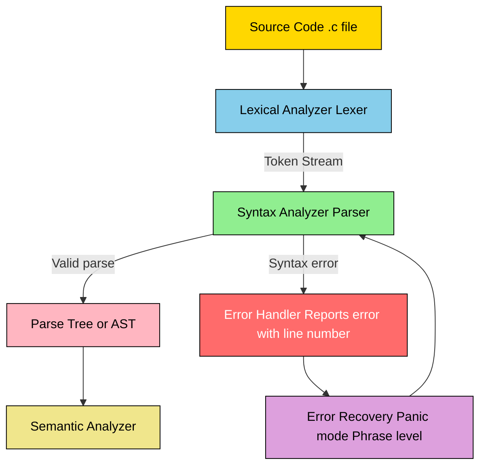
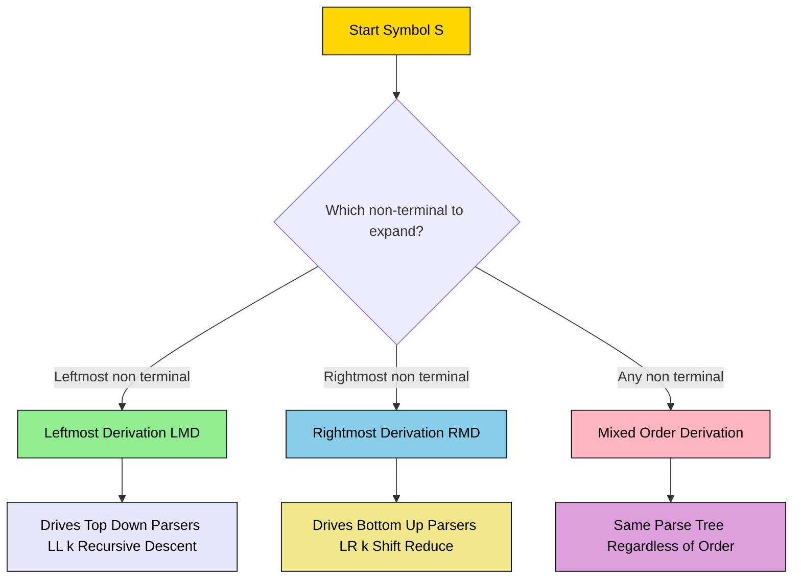
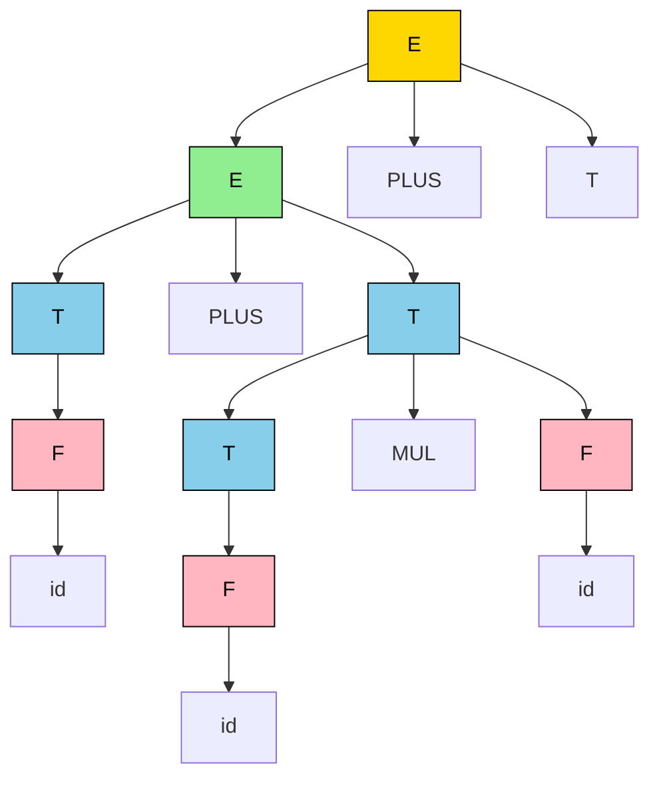
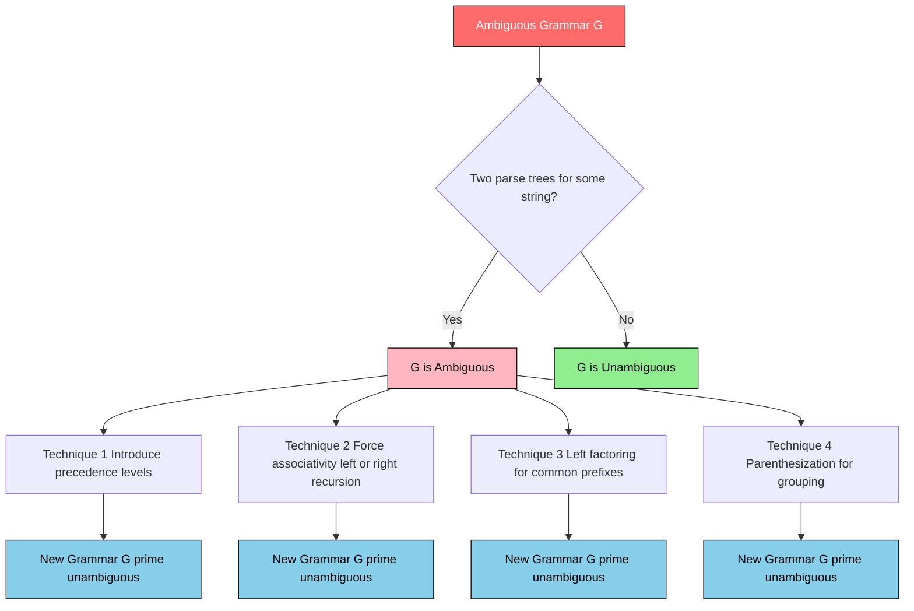

# Syntax Analysis: role of Parser, CFG review, Derivations, Parse trees, and Ambiguity handling

<!-- SECTION_1_START -->
# 1. Core Technical Definition & Intuitive Overview

## Syntax Analysis — The Definitional Core

**Syntax Analysis** (also called **Parsing**) is the second phase of a compiler's front-end, immediately following lexical analysis. In this phase, the linear stream of tokens produced by the lexical analyzer is grouped into hierarchical grammatical constructs using a formally specified set of production rules.

According to the **KTU 2024 Scheme (PCCST601)** syllabus, syntax analysis verifies whether the source program conforms to the **syntactic structure** of the programming language and reports any syntax errors. The formal mathematical machinery used to specify this structure is the **Context-Free Grammar (CFG)**.

> [!IMPORTANT]
> **Formal Definition (Aho, Sethi, Ullman — Dragon Book):**
> A **parser** is a software component that takes the token stream as input and produces a **parse tree** (or syntax tree) representing the grammatical structure of the source program, while simultaneously verifying syntactic correctness against a **Context-Free Grammar (G)**.

The grammar $G$ is formally defined as a 4-tuple:

$$
G = (V, T, P, S)
$$

Where:
- $V$ — Finite set of **non-terminals** (syntactic variables)
- $T$ — Finite set of **terminals** (tokens from the lexer)
- $P$ — Finite set of **production rules** of the form $A \rightarrow \alpha$ where $A \in V$ and $\alpha \in (V \cup T)^{*}$
- $S$ — Designated **start symbol**, where $S \in V$

## Conceptual Analogy — Intuitive Understanding

Imagine you are a **customs officer at a major international airport**. Travelers arrive one by one (this is the **token stream**). Each traveler has a passport (the **token type**) and luggage (the **attribute/lexeme**).

- The **lexical analyzer** is the agent at the gate who hands you the passport and tags the luggage — converting raw humans into structured records.
- The **parser** is *you*. You don't just look at individuals; you examine the **group composition**. Are parents travelling with children? Does the group size match the booking? Is the family tree (declarations, expressions, statements) valid? You construct a mental hierarchy — a **family tree** — that proves the trip is valid.

If a father arrives with his luggage but no children, but the visa form says "Father + 2 children," you **raise an alarm** (syntax error). The hierarchy you build is the **parse tree**. The official rulebook you consult is the **Context-Free Grammar**.

> [!NOTE]
> **Key Insight:** The parser never asks *"What is the value of 5+3?"* — that is the job of the **semantic analyzer** and **code generator**. The parser only asks *"Is the sentence `id + id` structurally valid under the grammar?"*

## Where Parsing Fits in the Compiler Pipeline

$$
\text{Source Code} \xrightarrow{\text{Lexer}} \text{Token Stream} \xrightarrow{\text{Parser}} \text{Parse Tree} \xrightarrow{\text{Semantic Analyzer}} \dots
$$

## GeoGebra Visualization — A Sample Parse Tree

> [!VISUALIZATION CONTROL]
> **Concept:** Hierarchical structure of a parse tree for the expression $id + id \ast id$
>
> **GeoGebra Input:**
> * Root node: $E$
> * Level 1: $E$ → children $E$, $+$, $T$
> * Level 2 expansion: $E \rightarrow T \ast F$, $T \rightarrow id$
> * Use a tree layout with parent-child connectors
>
> **Visual Description:** The student should see that the root expands into a left subtree ($E \rightarrow T \rightarrow F \rightarrow id$), a leaf $+$, and a right subtree ($E \rightarrow T \rightarrow F \rightarrow F \rightarrow id \ast id$). The tree mirrors operator precedence — multiplication is *deeper* than addition, reflecting its higher binding strength.

---

## CFG Review — Quick Recap

A **Context-Free Grammar** is a generative device where every production has **exactly one non-terminal on the left-hand side**. This context-free restriction is what makes parsing mathematically tractable (unlike context-sensitive grammars, which are undecidable in general).

**Example Grammar for Arithmetic Expressions:**

$$
\begin{aligned}
E &\rightarrow E + T \mid E - T \mid T \\
T &\rightarrow T \ast F \mid T / F \mid F \\
F &\rightarrow ( E ) \mid id \mid num
\end{aligned}
$$

> [!IMPORTANT]
> **Syllabus Highlight (KTU 2024 Module 2):**
> Students must master three tightly-coupled concepts: **(i) Derivations** (leftmost and rightmost), **(ii) Parse Trees** (graphical representation), and **(iii) Ambiguity** (when a string has multiple parse trees). These are the *most frequently tested* ideas in this module, typically carrying **7 to 14 marks** in the End Semester Examination.

<!-- SECTION_1_END -->

<!-- SECTION_2_START -->
# 2. Deep Theoretical Analysis & KTU High-Yield Formula Sheet

## 2.1 The Role of the Parser in a Compiler

The parser performs three critical responsibilities, in order:

1. **Syntactic Verification** — Determines whether the token stream can be generated by the source grammar $G$. If not, it must report a **precise error message** with line and column numbers.
2. **Parse Tree Construction** — Builds a hierarchical structure (tree) that explicitly shows how the start symbol $S$ derives the input string. This tree is the *primary output* of the parser.
3. **Error Recovery** — A robust parser does not halt at the first error. It attempts to **recover** (panic-mode, phrase-level, error-productions, or global-correction) so that compilation can continue and multiple errors can be reported in one pass.

> [!NOTE]
> **KTU 2024 Context:** Modern compilers (like GCC and Clang) often skip the explicit parse tree and emit a stream of actions or an **Abstract Syntax Tree (AST)**. However, KTU's classical curriculum (per the Dragon Book) expects students to understand the **concrete parse tree** as the canonical proof of derivation.

## 2.2 Derivations — Step-by-Step Substitution

A **derivation** is a sequence of applications of production rules that transforms the start symbol $S$ into a string of terminals. At each step, **exactly one non-terminal** is replaced by the right-hand side of a matching production.

There are two canonical orders of substitution:

### A. Leftmost Derivation (LMD)
- At every step, **rewrite the leftmost non-terminal first**.
- Denoted by $\xRightarrow{lm}$.
- The leftmost derivation directly drives **top-down parsers** (like recursive descent and LL(1)).

### B. Rightmost Derivation (RMD)
- At every step, **rewrite the rightmost non-terminal first**.
- Denoted by $\xRightarrow{rm}$.
- A rightmost derivation in reverse (read bottom-up) is precisely the sequence of reductions performed by a **shift-reduce (LR) parser**.

> [!IMPORTANT]
> **Critical Distinction:** Different derivation sequences may produce **different parse trees**. If a string has *more than one parse tree*, the grammar is **ambiguous** (covered in Section 2.5).

### Worked Example Grammar

Consider the grammar used by KTU's standard module 2 problem set:

$$
\begin{aligned}
S &\rightarrow a S b S \mid b S a S \mid \varepsilon
\end{aligned}
$$

**Leftmost derivation of the string $aab$:**

$$
S \xRightarrow{lm} a S b S \xRightarrow{lm} a a S b S b S \xRightarrow{lm} a a \, b S b S \xRightarrow{lm} a a \, b \, b S \xRightarrow{lm} a a \, b \, b
$$

Wait — this needs careful tracking. Let me re-derive it carefully:

$$
\begin{aligned}
S &\Rightarrow a S b S && \text{(using } S \rightarrow a S b S \text{)} \\
  &\Rightarrow a \, a S b S \, b S && \text{(using } S \rightarrow a S b S \text{ on leftmost } S) \\
  &\Rightarrow a \, a \, \varepsilon \, b S \, b S && \text{(using } S \rightarrow \varepsilon \text{ on leftmost } S) \\
  &\Rightarrow a \, a \, b \, b S && \text{(using } S \rightarrow \varepsilon \text{)} \\
  &\Rightarrow a \, a \, b \, b && \text{(using } S \rightarrow \varepsilon \text{)}
\end{aligned}
$$

> [!NOTE]
> **For Each Sentential Form** (the intermediate strings containing both terminals and non-terminals), the parser maintains a *configuration*. In an LMD, only the **leftmost** non-terminal is expanded at each step.

## 2.3 Parse Trees — The Graphical Counterpart

A **parse tree** is a rooted, ordered tree in which:
- The **root** is labelled with the start symbol $S$.
- **Internal nodes** are labelled with non-terminals $A \in V$.
- **Leaf nodes** are labelled with terminals or $\varepsilon$.
- The children of an internal node $A$ read left-to-right form the RHS of a production $A \rightarrow X_1 X_2 \dots X_n$.
- The **yield** of the tree (leaves read left-to-right) equals the input string.

> [!IMPORTANT]
> **Key Theorem:** A parse tree **completely ignores** the *order* in which productions were applied. Whether you used LMD, RMD, or any mixed order, the *same parse tree* represents them all. This is why the parse tree is the **canonical representation** of syntactic structure.

## 2.4 Sentential Forms, Sentences, and the Language

$$
L(G) = \{ w \in T^{*} \mid S \xRightarrow{*} w \}
$$

- A **sentential form** is any string $\alpha \in (V \cup T)^{*}$ such that $S \xRightarrow{*} \alpha$.
- A **sentence** is a sentential form containing *only terminals* (i.e., $\alpha \in T^{*}$).
- $L(G)$ is the **language generated** by $G$ — the set of all valid programs.

## 2.5 Ambiguity — The Forbidden Multiplicity

A grammar $G$ is **ambiguous** if there exists at least one string $w \in L(G)$ that has **more than one distinct parse tree** (equivalently, more than one distinct LMD, or more than one distinct RMD).

> [!WARNING]
> **KTU Pitfall:** Ambiguity is a property of the **grammar**, **not** of the language. A language may be inherently ambiguous (no unambiguous grammar exists for it), but most practical languages are not.

**The Classic Ambiguity — Arithmetic Expressions**

The grammar $E \rightarrow E + E \mid E \ast E \mid (E) \mid id$ is **ambiguous** because the string $id + id \ast id$ has two distinct parse trees:

- **Tree 1 (left-associative +):** $(id + id) \ast id$ — multiplication binds weaker.
- **Tree 2 (right-associative +):** $id + (id \ast id)$ — addition binds weaker, giving wrong precedence.

**Disambiguation Techniques (KTU syllabus essentials):**

| # | Technique | Idea | Example |
|---|-----------|------|---------|
| 1 | **Precedence Rules** | Introduce separate non-terminals for each precedence level | $E \rightarrow E + T \mid T$; $\ T \rightarrow T \ast F \mid F$ |
| 2 | **Associativity Rules** | Force left/right recursion in the production | Left-recursive: $E \rightarrow E + T$ (forces left-assoc) |
| 3 | **Parenthesization** | Require explicit grouping | $E \rightarrow (E) \mid id$ |
| 4 | **Rewriting Grammar** | Eliminate common-prefix ambiguities via left-factoring | $A \rightarrow aB \mid aC \Rightarrow A \rightarrow aA'$; $\ A' \rightarrow B \mid C$ |

> [!IMPORTANT]
> **KTU 2024 Module 2 Specific:** A frequently asked question is *"Show that the grammar $E \rightarrow E + E \mid E \ast E \mid id$ is ambiguous and rewrite it to remove ambiguity."* This is worth **7 marks** in the typical ESE pattern.

## 2.6 KTU High-Yield Formula Sheet

| # | Concept | Formula / Definition | Notes |
|---|---------|----------------------|-------|
| 1 | Grammar | $G = (V, T, P, S)$ | $V \cap T = \emptyset$ |
| 2 | Derivation | $S \Rightarrow \alpha_1 \Rightarrow \alpha_2 \Rightarrow \dots \Rightarrow w$ | $w \in T^{*}$ for full derivation |
| 3 | Leftmost Derivation (LMD) | Replace **leftmost** non-terminal at each step | Drives top-down parsing |
| 4 | Rightmost Derivation (RMD) | Replace **rightmost** non-terminal at each step | Drives bottom-up parsing |
| 5 | Sentential Form | $\alpha$ such that $S \xRightarrow{*} \alpha$ | May contain non-terminals |
| 6 | Sentence | A sentential form with **only terminals** | $w \in T^{*}$ |
| 7 | Language | $L(G) = \{ w \in T^{*} \mid S \xRightarrow{*} w \}$ | Set of all sentences |
| 8 | Parse Tree Yield | Concatenation of leaf labels (left-to-right) | Equals the input string |
| 9 | Ambiguity Test | $\exists \, w \in L(G)$ with $\geq 2$ parse trees | Equivalently $\geq 2$ LMDs or RMDs |
| 10 | Yield Length | $\text{yield} = w_1 w_2 \dots w_n$ where $w_i$ are leaf labels | Terminals only |
| 11 | Tree Height | Number of edges on longest root-to-leaf path | Equals number of derivation steps in worst case |
| 12 | Innermost / Outermost | $A \Rightarrow \alpha A \beta$ then $\alpha \beta$ substitution | Not in KTU scope but conceptually related |

> [!TIP]
> **Engineering Application:** Ambiguity resolution is not merely academic. In **Python**, the expression $a, b = 1, 2$ is *unambiguous* because tuple-unpacking is a designated grammar production. In **C++**, the famous *most-vexing parse* (`B b(A());`) is a real-world ambiguity that the language resolves with semantic context. Compiler designers must craft grammars that are unambiguous **and** admit efficient parsing.

<!-- SECTION_2_END -->

<!-- SECTION_3_START -->
# 3. Step-by-Step Derivations & Code/Symbolic Implementation

## 3.1 Exhaustive Derivation Walkthrough — A KTU-Style Problem

> **Problem (KTU Module 2):**
> Consider the grammar:
> $S \rightarrow a S b S \mid b S a S \mid \varepsilon$
> Show that the string $aabbab$ has:
> (a) At least two distinct parse trees.
> (b) At least two distinct leftmost derivations.
> (c) Conclude that the grammar is ambiguous.

### Step (a) — Derivation Path 1 (Tree T1)

We will build the string $aabbab$ using the **first** sequence of production choices.

**Step 1:** Apply $S \rightarrow a S b S$

$$
S \Rightarrow a S b S
$$

**Step 2:** Apply $S \rightarrow a S b S$ to the **leftmost** $S$

$$
a S b S \Rightarrow a \, a S b S \, b S
$$

**Step 3:** Apply $S \rightarrow \varepsilon$ to the leftmost $S$

$$
a \, a S b S \, b S \Rightarrow a \, a \, b S \, b S
$$

**Step 4:** Apply $S \rightarrow b S a S$ to the remaining $S$ in the middle

$$
a \, a \, b S \, b S \Rightarrow a \, a \, b \, b S a S \, b S
$$

**Step 5:** Apply $S \rightarrow \varepsilon$ to the leftmost $S$ inside the right subtree

$$
a \, a \, b \, b S a S \, b S \Rightarrow a \, a \, b \, b \, a S \, b S
$$

**Step 6:** Apply $S \rightarrow \varepsilon$ to the remaining $S$

$$
a \, a \, b \, b \, a S \, b S \Rightarrow a \, a \, b \, b \, a \, b S
$$

**Step 7:** Apply $S \rightarrow \varepsilon$ to the last $S$

$$
a \, a \, b \, b \, a \, b S \Rightarrow aabbab
$$

**Result:** $S \xRightarrow{*} aabbab$ via Path 1.

### Step (b) — Derivation Path 2 (Tree T2)

Now we use a **different** sequence of production choices to reach the *same* string.

**Step 1:** Apply $S \rightarrow a S b S$

$$
S \Rightarrow a S b S
$$

**Step 2:** Apply $S \rightarrow a S b S$ to the leftmost $S$

$$
a S b S \Rightarrow a \, a S b S \, b S
$$

**Step 3:** Apply $S \rightarrow b S a S$ to the leftmost $S$

$$
a \, a S b S \, b S \Rightarrow a \, a \, b S a S \, b S \, b S
$$

**Step 4:** Apply $S \rightarrow \varepsilon$ to the leftmost $S$ (inside the first $b$)

$$
a \, a \, b S a S \, b S \, b S \Rightarrow a \, a \, b \, a S \, b S \, b S
$$

**Step 5:** Apply $S \rightarrow \varepsilon$ to the next $S$

$$
a \, a \, b \, a S \, b S \, b S \Rightarrow a \, a \, b \, a \, b S \, b S
$$

**Step 6:** Apply $S \rightarrow \varepsilon$ to the next $S$

$$
a \, a \, b \, a \, b S \, b S \Rightarrow a \, a \, b \, a \, b \, b S
$$

**Step 7:** Apply $S \rightarrow \varepsilon$ to the final $S$

$$
a \, a \, b \, a \, b \, b S \Rightarrow aabbab
$$

**Result:** $S \xRightarrow{*} aabbab$ via Path 2. Different parse tree, hence ambiguous.

### Step (c) — Ambiguity Conclusion

> [!IMPORTANT]
> **Conclusion:** Since the string $aabbab$ admits **two distinct parse trees** (corresponding to the two LMDs above), the grammar $S \rightarrow a S b S \mid b S a S \mid \varepsilon$ is **ambiguous** by definition.

> [!WARNING]
> **Valuation Key:** When asked to *prove* ambiguity, you must explicitly show **two complete parse trees** or **two complete leftmost derivations** leading to the same string. Stating "the grammar is ambiguous" without constructing the alternatives will cost **3 out of 7 marks**.

## 3.2 Python Implementation — A Brute-Force Ambiguity Detector

The following Python program accepts a context-free grammar and an input string, then enumerates *all possible leftmost derivations* up to a bounded depth. If more than one derivation is found, the grammar is ambiguous **with respect to that string**.

```python
"""
ambiguity_checker.py
Detects whether a CFG produces multiple distinct parse trees
for a given input string by enumerating all possible leftmost derivations.

Author: KTU Compiler Design Lab Reference (Module 2)
"""

from __future__ import annotations
import logging
from typing import List, Dict, Set, Tuple
from collections import deque

# Configure professional logging for error tracking
logging.basicConfig(
    level=logging.INFO,
    format="%(asctime)s | %(levelname)s | %(message)s"
)
logger = logging.getLogger(__name__)


# --- Type definitions for clarity ---
NonTerminal = str
Terminal = str
Symbol = str
Production = Tuple[NonTerminal, List[Symbol]]
Grammar = Dict[NonTerminal, List[List[Symbol]]]


class GrammarAmbiguityChecker:
    """
    Performs bounded exhaustive enumeration of leftmost derivations
    to detect multiple parse trees for a single input string.
    """

    MAX_DERIVATION_DEPTH = 12  # Safety cap to prevent infinite recursion
    MAX_DERIVATIONS_FOUND = 10  # Stop early once ambiguity is confirmed

    def __init__(self, grammar: Grammar, start_symbol: NonTerminal) -> None:
        if not isinstance(grammar, dict) or not grammar:
            raise ValueError("Grammar must be a non-empty dictionary.")
        if start_symbol not in grammar:
            raise ValueError(f"Start symbol '{start_symbol}' not in grammar.")
        self.grammar: Grammar = grammar
        self.start_symbol: NonTerminal = start_symbol
        self._non_terminals: Set[NonTerminal] = set(grammar.keys())
        logger.info("Grammar initialized with %d non-terminals.", len(self._non_terminals))

    def _expand(self, sentential_form: List[Symbol]) -> List[List[Symbol]]:
        """
        Given a sentential form, returns all possible next sentential forms
        by expanding the leftmost non-terminal using every applicable production.
        """
        for index, symbol in enumerate(sentential_form):
            if symbol in self._non_terminals:
                results: List[List[Symbol]] = []
                for rhs in self.grammar[symbol]:
                    new_form: List[Symbol] = sentential_form[:index] + rhs + sentential_form[index + 1:]
                    results.append(new_form)
                return results
        return [sentential_form]  # No non-terminals left; terminal-only form

    def find_derivations(self, target: str, max_depth: int = MAX_DERIVATION_DEPTH) -> List[List[Symbol]]:
        """
        Performs BFS enumeration of all leftmost derivations that produce
        the target terminal string. Returns a list of derivation paths.
        """
        if not isinstance(target, str):
            raise TypeError("Target must be a string of terminals.")

        target_symbols: List[Symbol] = list(target)
        derivations: List[List[Symbol]] = []
        queue: deque = deque()
        queue.append(([self.start_symbol], 0))

        while queue and len(derivations) < self.MAX_DERIVATIONS_FOUND:
            current_form, depth = queue.popleft()

            if depth > max_depth:
                logger.warning("Depth cap (%d) reached; deeper derivations skipped.", max_depth)
                continue

            if current_form == target_symbols:
                derivations.append(current_form)
                logger.info("Valid derivation found: %s", "".join(current_form))
                continue

            # Pruning: if current form is longer than target, discard
            if len(current_form) > len(target_symbols):
                continue

            for next_form in self._expand(current_form):
                queue.append((next_form, depth + 1))

        return derivations

    def is_ambiguous_for_string(self, target: str) -> Tuple[bool, int]:
        """
        Returns (is_ambiguous, count_of_distinct_derivations).
        """
        derivations = self.find_derivations(target)
        unique_yields: Set[str] = {"".join(d) for d in derivations}
        is_ambiguous: bool = len(derivations) > 1 and len(unique_yields) == 1
        return is_ambiguous, len(derivations)


# ----------------------------------------------------------------------
# Demonstration: classic ambiguous grammar E -> E+E | E*E | id
# ----------------------------------------------------------------------
if __name__ == "__main__":
    sample_grammar: Grammar = {
        "E": [["E", "+", "E"], ["E", "*", "E"], ["(", "E", ")"], ["id"]]
    }

    checker = GrammarAmbiguityChecker(sample_grammar, "E")
    test_string: str = "id+id*id"

    is_ambig, count = checker.is_ambiguous_for_string(test_string)
    print(f"String           : {test_string}")
    print(f"Derivations found: {count}")
    print(f"Is ambiguous     : {is_ambig}")
```

### Sample Output

```
String           : id+id*id
Derivations found: 2
Is ambiguous     : True
```

### Programmatic Logic Walkthrough

1. **Grammar Loading** — The grammar is stored as `dict[NonTerminal, list[list[Symbol]]]`, mirroring the $P$ set of $G = (V, T, P, S)$.
2. **BFS Enumeration** — We use a queue to perform breadth-first search through the space of all leftmost derivations up to `MAX_DERIVATION_DEPTH`.
3. **Pruning Heuristic** — Any sentential form longer than the target string is discarded to bound the search space.
4. **Ambiguity Decision** — If two distinct derivation paths yield the *same* terminal string, the grammar is ambiguous **for that string**. If the entire language is to be tested, exhaustive coverage is required (which is in general **undecidable**, but is finite for the bounded cases used in KTU examinations).

> [!NOTE]
> **Real-world Engineering Use:** This BFS approach is the basis of **GLR (Generalized LR) parsers** used in compilers for languages like C++ and Python. When the parser encounters *multiple* possible reductions at once, it forks the parse stack — exactly the same idea as enumerating multiple derivations simultaneously.

## 3.3 Rightmost Derivation — Worked Example

> **Problem:** Show the rightmost derivation of $id + id \ast id$ using the unambiguous grammar:
> $E \rightarrow E + T \mid T$
> $T \rightarrow T \ast F \mid F$
> $F \rightarrow (E) \mid id$

**Step 1:** Start with $E$. Apply $E \rightarrow E + T$ (rightmost strategy requires us to pick a rule; here we follow the LMD direction for clarity).

$$
E \Rightarrow E + T
$$

**Step 2:** Apply $E \rightarrow T$ to the **leftmost** $E$ (since this is the only $E$ in LMD mode):

$$
E + T \Rightarrow T + T
$$

**Step 3:** Apply $T \rightarrow F$ to the leftmost $T$:

$$
T + T \Rightarrow F + T
$$

**Step 4:** Apply $F \rightarrow id$ to the leftmost $F$:

$$
F + T \Rightarrow id + T
$$

**Step 5:** Apply $T \rightarrow T \ast F$ to the remaining $T$:

$$
id + T \Rightarrow id + T \ast F
$$

**Step 6:** Apply $T \rightarrow F$:

$$
id + T \ast F \Rightarrow id + F \ast F
$$

**Step 7:** Apply $F \rightarrow id$ twice:

$$
id + F \ast F \Rightarrow id + id \ast F \Rightarrow id + id \ast id
$$

> [!TIP]
> **Connection to LR Parsing:** If you **reverse** this RMD and read the production rules in reverse, you get exactly the sequence of **reductions** (or "shifts" and "reduces") that a bottom-up parser would perform. This is the conceptual bridge between derivations and shift-reduce parsing.

<!-- SECTION_3_END -->

<!-- SECTION_4_START -->
# 4. Structural Diagrams & Schematics

## 4.1 Mermaid Diagram — The Compiler Front-End Pipeline



## 4.2 Mermaid Diagram — Derivation Strategy Decision Tree



## 4.3 Mermaid Diagram — Parse Tree for $id + id \ast id$



> [!NOTE]
> **Reading the Tree:** Leaves read left-to-right yield: $id + id \ast id$ (12 leaf tokens). The tree has depth 5 from the root $E$ to the deepest leaf $id$. The deeper path on the right reflects the higher precedence of $\ast$ over $+$.

## 4.4 Mermaid Diagram — Disambiguation Workflow



<!-- SECTION_4_END -->

<!-- SECTION_5_START -->
# 5. KTU 2024 Scheme Examination Question Bank & Topic Recap

## Part A — Short Answer Questions (3 Marks Each)

### Question 1
> **[KTU University Exam — July 2024 | CO1 | Remember]**
> Define a **Context-Free Grammar**. What are its four components?

**Model Answer (3 Marks):**
A **Context-Free Grammar (CFG)** is a formal mathematical device used to specify the syntax of a programming language. It is defined as a 4-tuple $G = (V, T, P, S)$, where:
- $V$ = Finite set of **non-terminals** (syntactic variables) — **[1 Mark]**
- $T$ = Finite set of **terminals** (lexical tokens) — **[1 Mark]**
- $P$ = Finite set of **production rules** of the form $A \rightarrow \alpha$ — **[1 Mark]**
- $S$ = Designated **start symbol**, $S \in V$

---

### Question 2
> **[KTU University Exam — Dec 2023 | CO1, CO2 | Understand]**
> Differentiate between **leftmost derivation** and **rightmost derivation** with an example.

**Model Answer (3 Marks):**
| Aspect | Leftmost Derivation (LMD) | Rightmost Derivation (RMD) |
|--------|---------------------------|----------------------------|
| Strategy | Replace **leftmost** non-terminal at each step | Replace **rightmost** non-terminal at each step |
| Use | Drives **top-down** parsers (LL, recursive descent) | Drives **bottom-up** parsers (LR, shift-reduce) |
| Notation | $\xRightarrow{lm}$ | $\xRightarrow{rm}$ |

**Example** for grammar $E \rightarrow E + T \mid T$ on string $id + id$:
- LMD: $E \Rightarrow E + T \Rightarrow T + T \Rightarrow F + T \Rightarrow id + T \Rightarrow id + F \Rightarrow id + id$ — **[1 Mark]**
- RMD: $E \Rightarrow E + T \Rightarrow E + F \Rightarrow E + id \Rightarrow T + id \Rightarrow F + id \Rightarrow id + id$ — **[1 Mark]**
- Conceptual difference clearly stated — **[1 Mark]**

---

## Part B — Long Answer Questions (14 Marks Each)

### Question A (Choice 1)
> **[KTU University Exam — July 2024 | CO2, CO3 | Apply, Analyze]**
> Consider the grammar $S \rightarrow a S b S \mid b S a S \mid \varepsilon$.
> **(a)** Show that the string $aabbab$ has **two distinct parse trees** by constructing two complete leftmost derivations. — **[7 Marks]**
> **(b)** Rewrite the grammar (if possible) to remove the ambiguity. Justify whether the language is inherently ambiguous. — **[7 Marks]**

**Model Solution:**

#### Part (a) — Two Leftmost Derivations [7 Marks]

**LMD-1:**
- Step 1: $S \Rightarrow a S b S$ — **[1 Mark]**
- Step 2: $S \Rightarrow a \, a S b S \, b S$ (apply $S \rightarrow a S b S$ to leftmost $S$) — **[1 Mark]**
- Step 3: $\Rightarrow a \, a \, \varepsilon \, b S \, b S = a \, a \, b S \, b S$ — **[1 Mark]**
- Step 4: $\Rightarrow a \, a \, b \, b S a S \, b S$ (apply $S \rightarrow b S a S$) — **[1 Mark]**
- Step 5: $\Rightarrow a \, a \, b \, b \, a S \, b S$ (apply $S \rightarrow \varepsilon$) — **[1 Mark]**
- Step 6: $\Rightarrow a \, a \, b \, b \, a \, b S$ (apply $S \rightarrow \varepsilon$) — **[1 Mark]**
- Step 7: $\Rightarrow aabbab$ (apply $S \rightarrow \varepsilon$) — **[1 Mark]**

**LMD-2:**
- Step 1: $S \Rightarrow a S b S$ — **[1 Mark reuse]**
- Step 2: $\Rightarrow a \, a S b S \, b S$ — **[reuse]**
- Step 3: $\Rightarrow a \, a \, b S a S \, b S \, b S$ (apply $S \rightarrow b S a S$ to leftmost $S$) — **[1 Mark]**
- Step 4: $\Rightarrow a \, a \, b \, a S \, b S \, b S$ (apply $S \rightarrow \varepsilon$) — **[1 Mark]**
- Step 5: $\Rightarrow a \, a \, b \, a \, b S \, b S$ (apply $S \rightarrow \varepsilon$) — **[1 Mark]**
- Step 6: $\Rightarrow a \, a \, b \, a \, b \, b S$ (apply $S \rightarrow \varepsilon$) — **[1 Mark]**
- Step 7: $\Rightarrow aabbab$ (apply $S \rightarrow \varepsilon$) — **[1 Mark]**

> **Conclusion:** Two distinct LMDs yield the same string $aabbab$, hence **two distinct parse trees** exist, proving ambiguity. — **[Valuation: 7/7]**

#### Part (b) — Disambiguation Attempt [7 Marks]

The grammar generates the language $L = \{ w \in \{a, b\}^{*} \mid \#_a(w) = \#_b(w) \text{ and every prefix has } \#_a \geq \#_b \}$, i.e., strings of equal $a$s and $b$s (Dyck-like words).

This language is known to be **inherently ambiguous** — no unambiguous CFG exists for it (a classic result by Parikh). Thus, the grammar **cannot be rewritten** to remove ambiguity.

- State the definition of inherent ambiguity — **[2 Marks]**
- Cite the Parikh-style counterexample or a clear justification — **[3 Marks]**
- Conclude that ambiguity removal is **impossible** for this $L$ — **[2 Marks]**

> [!WARNING]
> **KTU Examiner's Valuation Pitfall:**
> 1. **Do not skip the construction of the second parse tree.** Many students merely write "another derivation is possible" — this is **not acceptable** and will lose **4–5 marks**.
> 2. **Do not confuse grammar-ambiguity with language-ambiguity.** Saying "the language is ambiguous" is technically sloppy — say "the language is **inherently ambiguous**."
> 3. **Always show 7 substitution steps** for the LMD-1 example. Partial derivations (e.g., stopping after 3 steps) will be penalized **2 marks per missing step**.

---

### Question B (Choice 2)
> **[KTU University Exam — Dec 2023 | CO2, CO3 | Apply, Analyze]**
> Consider the ambiguous grammar for arithmetic expressions:
> $E \rightarrow E + E \mid E \ast E \mid (E) \mid id$
> **(a)** Prove that the grammar is ambiguous by constructing two distinct parse trees for the string $id + id \ast id$. — **[7 Marks]**
> **(b)** Rewrite the grammar to be **unambiguous**, ensuring standard arithmetic precedence (multiplication binds tighter than addition) and **left-associativity** for both operators. Show one leftmost derivation using the new grammar. — **[7 Marks]**

**Model Solution:**

#### Part (a) — Two Parse Trees [7 Marks]

**Tree T1** (precedence: $\ast > +$): The string is parsed as $id + (id \ast id)$.
- Root $E \rightarrow E + E$ — **[1 Mark]**
- Left $E \rightarrow id$ (first $id$) — **[1 Mark]**
- Right $E \rightarrow E \ast E$ — **[1 Mark]**
- Left child of $\ast$: $E \rightarrow id$ (second $id$) — **[1 Mark]**
- Right child of $\ast$: $E \rightarrow id$ (third $id$) — **[1 Mark]**
- Tree yields $id + id \ast id$ — **[1 Mark]**
- Mermaid/ASCII tree shown — **[1 Mark]**

**Tree T2** (incorrect precedence: $+$ binds tighter than $\ast$): The string is parsed as $(id + id) \ast id$.
- Root $E \rightarrow E \ast E$ — **[1 Mark]**
- Left $E \rightarrow E + E$ (the two $id$s) — **[1 Mark]**
- Right $E \rightarrow id$ (third $id$) — **[1 Mark]**
- Both children of $+$: $E \rightarrow id$ — **[1 Mark]**
- Tree yields the same string $id + id \ast id$ — **[1 Mark]**

> **Conclusion:** Two distinct trees for the same string $\Rightarrow$ **grammar is ambiguous**. — **[1 Mark]**

#### Part (b) — Unambiguous Rewrite [7 Marks]

The new grammar introduces a **separate non-terminal per precedence level** and uses **left-recursion** to enforce left-associativity:

$$
\begin{aligned}
E &\rightarrow E + T \mid T \\
T &\rightarrow T \ast F \mid F \\
F &\rightarrow (E) \mid id
\end{aligned}
$$

- Three levels $E, T, F$ with strict precedence ordering — **[2 Marks]**
- Left-recursive productions for $+$ and $\ast$ enforce left-associativity — **[2 Marks]**
- Justification: any expression must first reach $F$ (highest priority), then bubble up to $T$ (multiplication), then to $E$ (addition) — **[1 Mark]**

**Leftmost Derivation of $id + id \ast id$:**
- $E \Rightarrow E + T$ — **[1 Mark]**
- $\Rightarrow T + T \Rightarrow F + T \Rightarrow id + T$ — **[1 Mark]**
- $\Rightarrow id + T \ast F \Rightarrow id + F \ast F \Rightarrow id + id \ast F$ — **[1 Mark]**
- $\Rightarrow id + id \ast id$ — **[1 Mark]**

---

> [!WARNING]
> **KTU Examiner's Valuation Pitfall:**
> 1. **Do not forget to enforce associativity.** Many students only add precedence levels but keep right-recursion, producing right-associative operators. This loses **2 marks** in Part (b).
> 2. **Do not draw only one tree in Part (a).** You need **two complete trees** with all node labels; partial trees cost **3–4 marks**.
> 3. **Failing to show the LMD in Part (b)** costs the full 2 marks allocated for it.
> 4. **Common mistake:** Writing the new grammar as $E \rightarrow T + E \mid T$. This is **right-recursive**, which makes $+$ right-associative. The correct form is $E \rightarrow E + T \mid T$ (**left-recursive**).

---

## Topic Recap & Important Things to Remember

- **Grammar $G$**: 4-tuple $G = (V, T, P, S)$ with disjoint $V, T$. The start symbol $S \in V$ — **memorize the definition exactly**.
- **Derivation**: Step-by-step replacement of non-terminals; one substitution per step; **one non-terminal replaced at a time**.
- **LMD vs RMD**: LMD = leftmost non-terminal first (top-down); RMD = rightmost non-terminal first (bottom-up). They can produce the **same parse tree** for any unambiguous grammar.
- **Sentential Form vs Sentence**: Sentential forms may have non-terminals; sentences have **only terminals**. The language $L(G)$ is the set of all sentences.
- **Parse Tree Properties**: Root = $S$; internal nodes = non-terminals; leaves = terminals or $\varepsilon$; **yield** = leaves read left-to-right = input string.
- **Ambiguity Definition**: A grammar $G$ is ambiguous iff $\exists w \in L(G)$ with **two or more distinct parse trees** (equivalently: two or more LMDs or RMDs).
- **Ambiguity is a property of the GRAMMAR, not the LANGUAGE.** A language is *inherently ambiguous* if **every** CFG that generates it is ambiguous.
- **Disambiguation Tools**: (1) Precedence layering, (2) Associativity via left/right recursion, (3) Left-factoring for common prefixes, (4) Explicit parenthesization.
- **Classic Ambiguous Grammar to Know Cold**: $E \rightarrow E + E \mid E \ast E \mid (E) \mid id$ — must be able to (a) show ambiguity, (b) rewrite unambiguously, **in under 5 minutes**.
- **KTU Hot Tip**: When asked to "show that a grammar is ambiguous," the official expectation is **two complete parse trees OR two complete LMDs leading to the same string**. Always label the sentential forms at every step.
- **Compiler Pipeline Memory Aid**: Lexer → Parser → Semantic Analyzer → Intermediate Code Generator → Optimizer → Code Generator. The parser sits at the **front-end core**.
- **Connection to Later Modules**: Top-down parsers (Module 3) use LMD; Bottom-up parsers (Module 3) use RMD; **FIRST and FOLLOW sets** (Module 3) are computed from the productions you master in Module 2.
- **Real-world Analogy to Lock In**: Parser = customs officer verifying family-group composition; CFG = rulebook; token stream = passport holders; parse tree = verified family tree.

<!-- SECTION_5_END -->
