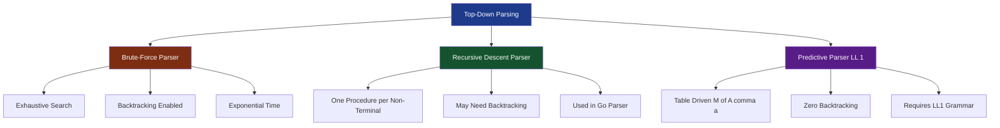
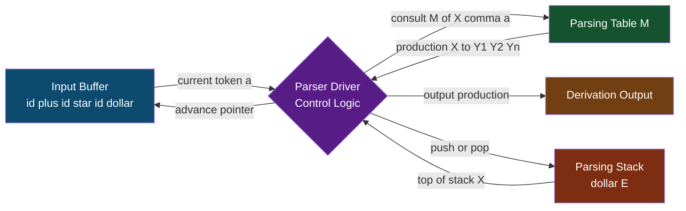
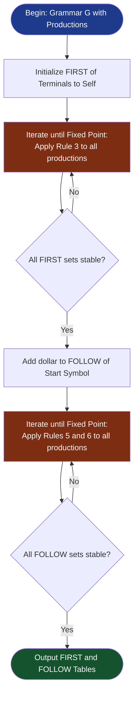
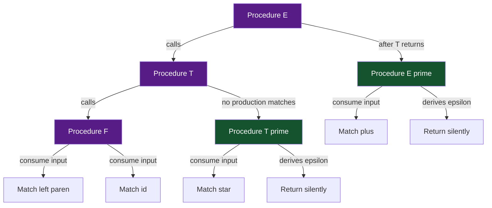
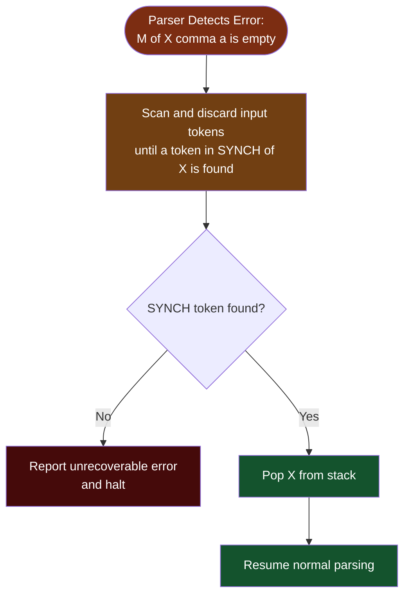

# Top-Down Parsing: Brute-force, Recursive Descent Parsing, and Predictive Parsing

<!-- SECTION_1_START -->
# Top-Down Parsing: Brute-Force, Recursive Descent & Predictive Parsing

## 1.1 Formal Definition (KTU 2024 Syllabus Terminology)

**Top-Down Parsing** is a class of syntax analysis strategies in which the parse tree is constructed starting from the **root node** (the start symbol of the grammar) and proceeds by expanding non-terminals in a leftmost derivation order until the leaves match the input token stream. The parser essentially attempts to "discover" the leftmost derivation of an input string by applying grammar productions in a predetermined sequence.

In the KTU 2024 Scheme module framework, top-down parsing is broadly classified into three escalating sophistication levels:

1. **Brute-Force Parsing (Backtracking Parser)** — A naïve exhaustive search mechanism that tries every possible production rule combination.
2. **Recursive Descent Parsing (RDP)** — A direct-coded implementation where each non-terminal becomes a mutually recursive procedure.
3. **Predictive Parsing (LL(1))** — A non-backtracking, table-driven parser that predicts the correct production by inspecting exactly one lookahead token.

> [!IMPORTANT]
> **KTU Syllabus Highlight:** LL(1) stands for scanning the input from **L**eft to right, producing a **L**eftmost derivation, and using **1** (one) lookahead symbol. The "1" in LL(1) refers to the number of lookahead tokens — NOT the number of derivations or stack depth.

## 1.2 Conceptual Analogy / Intuition

Imagine you are solving a **maze** by always starting at the **entrance (root)** and trying to reach the **exit (input string)**:

- **Brute-Force Approach** — You try every possible path, hit dead ends, backtrack, and try another. Eventually you find the path, but you may explore the same dead ends multiple times. This is exhaustive and slow.
- **Recursive Descent Approach** — You use a series of helper functions (one per non-terminal). Each function either says "yes, this path works" or "no, try the next alternative." It's like having a guidebook for the maze.
- **Predictive Parsing Approach** — Before entering a junction, you can **glance one step ahead** to definitively decide which corridor to take. No backtracking is ever needed.

> [!NOTE]
> **Key Intuition:** The lookahead token in LL(1) acts like a "road sign" that tells the parser exactly which production to apply without any trial and error.

## 1.3 Geometric / Formal-Language Intuition

Consider the grammar production $A \rightarrow \alpha_1 \mid \alpha_2 \mid \alpha_3$. The parser, at state where non-terminal $A$ sits at the top of the parse stack, must decide *which* $\alpha_i$ to push. The set of terminals that can legally begin each $\alpha_i$ is the **FIRST** set. The set of terminals that can legally follow $A$ when $A$ derives $\epsilon$ is the **FOLLOW** set. Predictive parsing works when **FIRST** and **FOLLOW** sets for any non-terminal are **disjoint** — a property known as the LL(1) condition.

> [!VISUALIZATION CONTROL]
> **Concept:** Parse Tree Construction Flow (Top-Down Direction)
> **GeoGebra / Desmos Input Equations (Sketch Axes):**
> * Plot root at coordinates: $P(0, 5)$
> * First-level children: $A_1(-3, 3)$, $A_2(0, 3)$, $A_3(3, 3)$
> * Terminal leaf nodes: $t_1(-4, 0)$, $t_2(-2, 0)$, $t_3(-1, 0)$, $t_4(1, 0)$, $t_5(2, 0)$, $t_6(4, 0)$
> **Visual Description:** The student should observe a tree growing **downward** from a single root node, with each level expanding one non-terminal until all leaves are terminal symbols matching the input string read left-to-right.
<!-- SECTION_1_END -->

<!-- SECTION_2_START -->
# 2. Deep Theoretical Analysis & KTU High-Yield Formula Sheet

## 2.1 Brute-Force Parsing (Backtracking Parser)

### 2.1.1 Operational Mechanism

The brute-force parser is a systematic, exhaustive search engine. It works as follows:

- For a non-terminal $A$ with productions $A \rightarrow \alpha_1 \mid \alpha_2 \mid \dots \mid \alpha_n$, the parser **tries $\alpha_1$ first**.
- It expands the leftmost non-terminal recursively, comparing each terminal it generates against the input token stream.
- If a mismatch occurs, it **abandons the current partial parse**, rewinds the input pointer, and tries the next alternative $\alpha_2$.
- The process continues until a complete parse is found, or all alternatives are exhausted (syntax error).

### 2.1.2 Why & How (Pedagogical Breakdown)

- **Why it exists:** It is the most general top-down strategy. It works on **any** context-free grammar, including ambiguous ones.
- **How it is implemented:** Typically uses a recursive backtracking function or an explicit stack with marked checkpoints.
- **Why it is rarely used in production:** Its time complexity is **exponential** in the worst case (specifically $O(k^n)$ where $n$ is the input length and $k$ is the branching factor), and it is famously slow on left-recursive grammars (it loops infinitely).

> [!IMPORTANT]
> **Left Recursion Trap:** A grammar containing a production of the form $A \rightarrow A\alpha$ is **left-recursive**. A brute-force top-down parser will enter an infinite loop because the same non-terminal $A$ is repeatedly re-expanded at the leftmost position without consuming any input token.

## 2.2 Recursive Descent Parsing (RDP)

### 2.2.1 Structural Architecture

Recursive Descent Parsing converts each non-terminal in the grammar into a **procedure** (function). The body of each procedure mirrors the right-hand sides of the productions for that non-terminal. The procedure calls other procedures when it encounters non-terminals in the right-hand side, achieving mutual recursion.

**Pseudo-Code Skeleton for Non-Terminal $A$ with productions $A \rightarrow T_1 \mid T_2 \mid T_3$:**

```
procedure A():
    if (lookahead in SELECT(T1)) then parse_T1()
    else if (lookahead in SELECT(T2)) then parse_T2()
    else if (lookahead in SELECT(T3)) then parse_T3()
    else error()
```

### 2.2.2 Why & How

- **Why:** It is the most natural, readable, and maintainable parsing approach. Compiler writers often hand-code RDPs for simple languages.
- **How:** Each grammar rule becomes a function. Terminals in the production are matched by calling a `match(terminal)` routine that consumes the input if the terminal matches the lookahead; otherwise it reports a syntax error.
- **Limitation:** Pure RDP may still require backtracking unless the grammar is LL(1) — meaning the parser may need to try one production, fail, and try another, with input rewinding.

## 2.3 Predictive Parsing (Non-Recursive / Table-Driven LL(1))

### 2.3.1 The Predictive Parsing Engine

Predictive parsing eliminates backtracking entirely. It uses a **two-dimensional parsing table** $M[A, a]$ where $A$ is a non-terminal and $a$ is a terminal (including the special end-of-input marker $\$$). The table cell $M[A, a]$ contains the **unique production** to apply when the parser sees non-terminal $A$ on top of the stack and terminal $a$ as the lookahead.

**Components of the Predictive Parser:**

1. **Input Buffer** — Holds the input string terminated by $\$$.
2. **Stack** — Initially contains $\$$ followed by the start symbol $S$. The top of the stack drives the parsing decisions.
3. **Parsing Table** $M$ — A 2D matrix indexed by $[Non\text{-}Terminal, Terminal]$.
4. **Output Stream** — The sequence of productions applied (which represents the leftmost derivation).

### 2.3.2 Step-by-Step Operational Logic

At each step, the parser examines the top of stack $X$ and the current input symbol $a$:

- **If $X = a = \$$:** Accept and halt. Parsing is successful.
- **If $X = a \neq \$$:** Pop $X$ from the stack and advance the input pointer. (Terminal match.)
- **If $X$ is a non-terminal:** Consult $M[X, a]$.
    - If $M[X, a] = X \rightarrow UVW$, then pop $X$ and push $W$, then $V$, then $U$ (rightmost symbol on top).
    - If $M[X, a] = \text{error}$, invoke the error recovery routine.
- **If $X$ is a non-terminal and $M[X, a]$ is undefined:** Syntax error.

## 2.4 The THREE Foundational Sets: FIRST, FOLLOW, and FIRST$^+$

The entire machinery of predictive parsing is built upon three sets. Their definitions are the **most exam-critical** part of this module.

### 2.4.1 Definition of FIRST($\alpha$)

For any string $\alpha$ of grammar symbols (terminals, non-terminals, or $\epsilon$):

$$FIRST(\alpha) = \set{ a \in (T \cup \set{\epsilon}) \mid \alpha \Rightarrow^{*} a\beta \text{ for some } \beta }$$

In plain English: **FIRST($\alpha$) is the set of terminals that can appear as the first symbol of any string derived from $\alpha$. If $\alpha$ can derive $\epsilon$, then $\epsilon \in FIRST(\alpha)$.**

### 2.4.2 Definition of FOLLOW($A$)

For any non-terminal $A$:

$$FOLLOW(A) = \set{ a \in (T \cup \set{\$}) \mid S \Rightarrow^{*} \alpha A a \beta \text{ for some } \alpha, \beta }$$

In plain English: **FOLLOW($A$) is the set of terminals that can immediately follow $A$ in any sentential form derived from the start symbol $S$. The end-of-input marker $\$$ is always in FOLLOW($S$).**

### 2.4.3 Definition of FIRST$^+$($\alpha$)

For predictive parsing, we define an extended set used to fill the parsing table:

$$FIRST^{+}(A \rightarrow \alpha) = \begin{cases} FIRST(\alpha) & \text{if } \epsilon \notin FIRST(\alpha) \\ FIRST(\alpha) \cup FOLLOW(A) & \text{if } \epsilon \in FIRST(\alpha) \end{cases}$$

The intuition: If $\alpha$ can derive $\epsilon$, then when we apply $A \rightarrow \alpha$, we might consume no input, and whatever follows $A$ in the input is what we should expect.

## 2.5 KTU High-Yield Formula Sheet / Cheat Sheet

> [!IMPORTANT]
> **This table contains the canonical rules KTU examiners test. Memorize these 6 rules verbatim.**

| # | Rule | Mathematical Statement | Plain English Explanation |
|---|------|----------------------|---------------------------|
| 1 | FIRST of a terminal | $FIRST(a) = \set{a}$ for any terminal $a$ | A terminal is its own FIRST set. |
| 2 | FIRST of $\epsilon$ | $FIRST(\epsilon) = \set{\epsilon}$ | The empty string trivially derives $\epsilon$. |
| 3 | FIRST of a production $X \rightarrow Y_1 Y_2 \dots Y_k$ | Add $FIRST(Y_1 \setminus \set{\epsilon})$ to $FIRST(X)$. If $\epsilon \in FIRST(Y_1)$, also add $FIRST(Y_2 \setminus \set{\epsilon})$, and so on. If all $Y_i$ can derive $\epsilon$, add $\epsilon$ to $FIRST(X)$. | Look at the leftmost symbol. If it can be $\epsilon$, look at the next. |
| 4 | FOLLOW of the start symbol | $\$ \in FOLLOW(S)$ | The end-of-input marker always follows the start symbol. |
| 5 | FOLLOW of $A$ due to $B \rightarrow \alpha A \beta$ | $FIRST(\beta \setminus \set{\epsilon}) \subseteq FOLLOW(A)$ | Whatever can begin the string after $A$ (excluding $\epsilon$) follows $A$. |
| 6 | FOLLOW of $A$ due to $B \rightarrow \alpha A \beta$ where $\beta \Rightarrow^{*} \epsilon$ | $FOLLOW(B) \subseteq FOLLOW(A)$ | If the symbol after $A$ can vanish, then whatever follows $B$ also follows $A$. |
| 7 | LL(1) Condition | For every non-terminal $A$ with productions $A \rightarrow \alpha_i \mid \alpha_j$, the sets $FIRST^{+}(A \rightarrow \alpha_i)$ and $FIRST^{+}(A \rightarrow \alpha_j)$ must be **disjoint**. | No lookahead token can legally start two different productions of the same non-terminal. |
| 8 | Stack Push Order | For $A \rightarrow X_1 X_2 \dots X_n$, push $X_n$ first, then $X_{n-1}$, ..., then $X_1$ last (so $X_1$ is on top). | The stack is LIFO; the leftmost symbol must be processed first. |

## 2.6 Real-World Engineering Utility

- **LL(1) Parsers** power tools like **ANTLR** (ANother Tool for Language Recognition), **Yacc/Bison** with `%glr-parser` modes, and the parser in many DSL implementations.
- **Recursive Descent Parsers** are the workhorse of hand-written parsers in languages like Go (`go/parser`), Rust's early compiler stages, and the GCC front-end for certain languages.
- **Brute-Force Parsers** are largely pedagogical today but form the conceptual foundation for **general parsing algorithms** like the **Earley parser** and **GLR (Generalized LR) parsers** used in linguistic and bioinformatics applications.
<!-- SECTION_2_END -->

<!-- SECTION_3_START -->
# 3. Step-by-Step Derivations & Symbolic Implementation

## 3.1 Worked Example: Constructing FIRST and FOLLOW Sets

**Consider the following grammar** (this is a classic KTU exam problem):

$$E \rightarrow T E'$$
$$E' \rightarrow + T E' \mid \epsilon$$
$$T \rightarrow F T'$$
$$T' \rightarrow * F T' \mid \epsilon$$
$$F \rightarrow ( E ) \mid \text{id}$$

Non-terminals: $\set{E, E', T, T', F}$.
Terminals: $\set{+, *, (, ), \text{id}, \$}$.

### Step 1: Compute FIRST Sets

**Rule 1: $F$ is the lowest non-terminal with no recursive dependencies.**

- $F \rightarrow ( E )$ : Add $( $ to $FIRST(F)$.
- $F \rightarrow \text{id}$ : Add $\text{id}$ to $FIRST(F)$.

$$FIRST(F) = \set{ (, \text{id} }$$

**Rule 2: $T \rightarrow F T'$.**

- The first symbol is $F$. So $FIRST(F) \subseteq FIRST(T)$.
- Check if $\epsilon \in FIRST(F)$. No.
- Therefore, no further additions.

$$FIRST(T) = \set{ (, \text{id} }$$

**Rule 3: $E \rightarrow T E'$.**

- The first symbol is $T$. So $FIRST(T) \subseteq FIRST(E)$.
- Check if $\epsilon \in FIRST(T)$. No.

$$FIRST(E) = \set{ (, \text{id} }$$

**Rule 4: $T' \rightarrow * F T' \mid \epsilon$.**

- For the first alternative: $FIRST(*) = \set{*}$. So $*$ is added to $FIRST(T')$.
- For the second alternative: $\epsilon$ is explicitly derived, so $\epsilon \in FIRST(T')$.

$$FIRST(T') = \set{*, \epsilon}$$

**Rule 5: $E' \rightarrow + T E' \mid \epsilon$.**

- For the first alternative: $+$ is added to $FIRST(E')$.
- For the second alternative: $\epsilon$ is added.

$$FIRST(E') = \set{+, \epsilon}$$

> [!NOTE]
> **Convergence Check:** All FIRST sets are stable; no further iteration is needed.

### Step 2: Compute FOLLOW Sets

**Rule 4: $E$ is the start symbol.**

$$\$ \in FOLLOW(E)$$

So $FOLLOW(E) = \set{\$}$.

**Rule 5 applied to $E \rightarrow T E'$: What follows $T$?**

- The symbol after $T$ is $E'$. We need $FIRST(E' \setminus \set{\epsilon})$.
- $FIRST(E') = \set{+, \epsilon}$. Excluding $\epsilon$: $\set{+}$.
- Add $+$ to $FOLLOW(T)$.
- Since $\epsilon \in FIRST(E')$, we also add $FOLLOW(E)$ to $FOLLOW(T)$ (Rule 6).
- $FOLLOW(E) = \set{\$}$.

$$FOLLOW(T) = \set{+, \$}$$

**Rule 5 applied to $E' \rightarrow + T E'$: What follows $T$?** (same as above, confirming $FOLLOW(T)$).

**Rule 5 applied to $T \rightarrow F T'$: What follows $F$?**

- The symbol after $F$ is $T'$. $FIRST(T' \setminus \set{\epsilon}) = \set{*}$.
- Add $*$ to $FOLLOW(F)$.
- Since $\epsilon \in FIRST(T')$, also add $FOLLOW(T)$ to $FOLLOW(F)$.

$$FOLLOW(F) = \set{*, +, \$}$$

**Rule 5 applied to $T' \rightarrow * F T'$: What follows $F$?** (same as above, confirming $FOLLOW(F)$).

**Rule 5 applied to $E' \rightarrow + T E'$: What follows $E'$?**

- $E'$ is the last symbol in this production. So we add $FOLLOW(E)$ to $FOLLOW(E')$.
- $FOLLOW(E) = \set{\$}$. So add $\$$ to $FOLLOW(E')$.

**Rule 5 applied to $E \rightarrow T E'$: What follows $E'$?** (same as above).

$$FOLLOW(E') = \set{\$}$$

**Rule 5 applied to $T' \rightarrow * F T'$: What follows $T'$?**

- $T'$ is the last symbol. So add $FOLLOW(T)$ to $FOLLOW(T')$.

$$FOLLOW(T') = \set{+, \$}$$

### Step 3: Final Compiled Sets

| Non-Terminal | FIRST | FOLLOW |
|:---:|:---:|:---:|
| $E$ | $\set{(, \text{id}}$ | $\set{\$}$ |
| $E'$ | $\set{+, \epsilon}$ | $\set{\$}$ |
| $T$ | $\set{(, \text{id}}$ | $\set{+, \$}$ |
| $T'$ | $\set{*, \epsilon}$ | $\set{+, \$}$ |
| $F$ | $\set{(, \text{id}}$ | $\set{*, +, \$}$ |

## 3.2 Constructing the LL(1) Parsing Table

For each production $A \rightarrow \alpha$, populate $M[A, a]$ for every $a \in FIRST^{+}(A \rightarrow \alpha)$.

**Production 1: $E \rightarrow T E'$**

- $FIRST(TE') = \set{(, \text{id}}$ (no $\epsilon$).
- Populate: $M[E, (] = E \rightarrow TE'$, $M[E, \text{id}] = E \rightarrow TE'$.

**Production 2: $E' \rightarrow +TE'$**

- $FIRST(+TE') = \set{+}$.
- Populate: $M[E', +] = E' \rightarrow +TE'$.

**Production 3: $E' \rightarrow \epsilon$**

- Since $\epsilon \in FIRST(\epsilon)$, we use $FOLLOW(E') = \set{\$}$.
- Populate: $M[E', \$] = E' \rightarrow \epsilon$.

**Production 4: $T \rightarrow FT'$**

- $FIRST(FT') = \set{(, \text{id}}$.
- Populate: $M[T, (] = T \rightarrow FT'$, $M[T, \text{id}] = T \rightarrow FT'$.

**Production 5: $T' \rightarrow *FT'$**

- $FIRST(*FT') = \set{*}$.
- Populate: $M[T', *] = T' \rightarrow *FT'$.

**Production 6: $T' \rightarrow \epsilon$**

- Use $FOLLOW(T') = \set{+, \$}$.
- Populate: $M[T', +] = T' \rightarrow \epsilon$, $M[T', \$] = T' \rightarrow \epsilon$.

**Production 7: $F \rightarrow (E)$**

- $FIRST((E)) = \set{(}$.
- Populate: $M[F, (] = F \rightarrow (E)$.

**Production 8: $F \rightarrow \text{id}$**

- $FIRST(\text{id}) = \set{\text{id}}$.
- Populate: $M[F, \text{id}] = F \rightarrow \text{id}$.

### Resulting LL(1) Parsing Table

|  | $+$ | $*$ | $($ | $)$ | $\text{id}$ | $\$$ |
|:---:|:---:|:---:|:---:|:---:|:---:|:---:|
| **$E$** |  |  | $E \rightarrow TE'$ |  | $E \rightarrow TE'$ |  |
| **$E'$** | $E' \rightarrow +TE'$ |  |  |  |  | $E' \rightarrow \epsilon$ |
| **$T$** |  |  | $T \rightarrow FT'$ |  | $T \rightarrow FT'$ |  |
| **$T'$** | $T' \rightarrow \epsilon$ | $T' \rightarrow *FT'$ |  |  |  | $T' \rightarrow \epsilon$ |
| **$F$** |  |  | $F \rightarrow (E)$ |  | $F \rightarrow \text{id}$ |  |

> [!NOTE]
> **Every table cell has at most one entry → The grammar is LL(1)!** This is the formal verification of the LL(1) property.

## 3.3 Trace: Parsing the Input `id + id * id $`

| Step | Stack (top at right) | Input (head first) | Action |
|:---:|:---|:---|:---|
| 1 | $\$ E$ | $\text{id} + \text{id} * \text{id} \$$ | $M[E, \text{id}] = E \rightarrow TE'$, pop $E$, push $E' T$ |
| 2 | $\$ E' T$ | $\text{id} + \text{id} * \text{id} \$$ | $M[T, \text{id}] = T \rightarrow FT'$, pop $T$, push $T' F$ |
| 3 | $\$ E' T' F$ | $\text{id} + \text{id} * \text{id} \$$ | $M[F, \text{id}] = F \rightarrow \text{id}$, pop $F$, push $\text{id}$ |
| 4 | $\$ E' T' \text{id}$ | $\text{id} + \text{id} * \text{id} \$$ | Match $\text{id}$, pop and advance input |
| 5 | $\$ E' T'$ | $+ \text{id} * \text{id} \$$ | $M[T', +] = T' \rightarrow \epsilon$, pop $T'$ |
| 6 | $\$ E'$ | $+ \text{id} * \text{id} \$$ | $M[E', +] = E' \rightarrow +TE'$, pop $E'$, push $E' T +$ |
| 7 | $\$ E' T +$ | $+ \text{id} * \text{id} \$$ | Match $+$, pop and advance input |
| 8 | $\$ E' T$ | $\text{id} * \text{id} \$$ | $M[T, \text{id}] = T \rightarrow FT'$, pop $T$, push $T' F$ |
| 9 | $\$ E' T' F$ | $\text{id} * \text{id} \$$ | $M[F, \text{id}] = F \rightarrow \text{id}$, pop $F$, push $\text{id}$ |
| 10 | $\$ E' T' \text{id}$ | $\text{id} * \text{id} \$$ | Match $\text{id}$, pop and advance input |
| 11 | $\$ E' T'$ | $* \text{id} \$$ | $M[T', *] = T' \rightarrow *FT'$, pop $T'$, push $T' F *$ |
| 12 | $\$ E' T' F *$ | $* \text{id} \$$ | Match $*$, pop and advance input |
| 13 | $\$ E' T' F$ | $\text{id} \$$ | $M[F, \text{id}] = F \rightarrow \text{id}$, pop $F$, push $\text{id}$ |
| 14 | $\$ E' T' \text{id}$ | $\text{id} \$$ | Match $\text{id}$, pop and advance input |
| 15 | $\$ E' T'$ | $\$$ | $M[T', \$] = T' \rightarrow \epsilon$, pop $T'$ |
| 16 | $\$ E'$ | $\$$ | $M[E', \$] = E' \rightarrow \epsilon$, pop $E'$ |
| 17 | $\$$ | $\$$ | **ACCEPT** |

## 3.4 Python Implementation of a Predictive Parser

```python
from typing import Dict, Set, List, Tuple

class PredictiveParser:
    def __init__(self, grammar: Dict[str, List[List[str]]],
                 first: Dict[str, Set[str]],
                 follow: Dict[str, Set[str]],
                 start_symbol: str):
        self.grammar = grammar
        self.first = first
        self.follow = follow
        self.start = start_symbol
        self.table: Dict[Tuple[str, str], List[str]] = {}
        self._build_table()

    def _first_of_string(self, symbols: List[str]) -> Set[str]:
        result: Set[str] = set()
        for sym in symbols:
            if sym in self.first:
                result |= (self.first[sym] - {'epsilon'})
                if 'epsilon' not in self.first[sym]:
                    return result
            else:
                result.add(sym)
                return result
        result.add('epsilon')
        return result

    def _build_table(self) -> None:
        for lhs, productions in self.grammar.items():
            for prod in productions:
                first_alpha = self._first_of_string(prod)
                terminals = (first_alpha - {'epsilon'})
                for t in terminals:
                    self.table[(lhs, t)] = prod
                if 'epsilon' in first_alpha:
                    for t in self.follow[lhs]:
                        self.table[(lhs, t)] = prod

    def parse(self, input_tokens: List[str]) -> Tuple[bool, List[str]]:
        input_tokens = input_tokens + ['$']
        stack: List[str] = ['$', self.start]
        output: List[str] = []
        idx = 0
        while stack:
            top = stack[-1]
            current = input_tokens[idx]
            if top == current == '$':
                return True, output
            if top == current:
                stack.pop()
                idx += 1
            elif top in self.grammar:
                action = self.table.get((top, current))
                if action is None:
                    return False, output
                stack.pop()
                output.append(f"{top} -> {' '.join(action)}")
                for sym in reversed(action):
                    if sym != 'epsilon':
                        stack.append(sym)
            else:
                return False, output
        return False, output


if __name__ == '__main__':
    grammar: Dict[str, List[List[str]]] = {
        'E':  [['T', "E'"]],
        "E'": [['+', 'T', "E'"], ['epsilon']],
        'T':  [['F', "T'"]],
        "T'": [['*', 'F', "T'"], ['epsilon']],
        'F':  [['(', 'E', ')'], ['id']],
    }
    first: Dict[str, Set[str]] = {
        'E':  {'(', 'id'},
        "E'": {'+', 'epsilon'},
        'T':  {'(', 'id'},
        "T'": {'*', 'epsilon'},
        'F':  {'(', 'id'},
    }
    follow: Dict[str, Set[str]] = {
        'E':  {'$'},
        "E'": {'$'},
        'T':  {'+', '$'},
        "T'": {'+', '$'},
        'F':  {'*', '+', '$'},
    }
    parser = PredictiveParser(grammar, first, follow, 'E')
    test_input = ['id', '+', 'id', '*', 'id']
    accepted, derivation = parser.parse(test_input)
    print(f"Accepted: {accepted}")
    print("Derivation steps:")
    for step in derivation:
        print(f"  {step}")
```

**Expected Output:**

```
Accepted: True
Derivation steps:
  E -> T E'
  T -> F T'
  F -> id
  T' -> epsilon
  E' -> + T E'
  T -> F T'
  F -> id
  T' -> * F T'
  F -> id
  T' -> epsilon
  E' -> epsilon
```
<!-- SECTION_3_END -->

<!-- SECTION_4_START -->
# 4. Structural Diagrams & Schematics

## 4.1 Top-Down Parsing Strategy Taxonomy



## 4.2 Predictive Parser Architecture (Block Diagram)



## 4.3 FIRST / FOLLOW Set Construction Flow



## 4.4 Recursive Descent Procedure Call Tree (Mutual Recursion)



## 4.5 Error Recovery Panic-Mode Flow in Predictive Parsing



> [!IMPORTANT]
> **SYNCH Set Construction Rule:** A common KTU exam question asks how to derive synchronization sets. Standard practice:
> 1. Place $FOLLOW(A)$ into $SYNCH(A)$ (skipping $A$ is safe if its follow token appears).
> 2. Place $FIRST(A)$ into $SYNCH(A)$ (skipping $A$ is safe if it begins with one of these terminals).
> 3. If a token cannot be matched, declare it as extraneous and discard it.
<!-- SECTION_4_END -->

<!-- SECTION_5_START -->
# 5. KTU 2024 Scheme Examination Question Bank & Topic Recap

## 5.1 Part A Questions (3 Marks Each)

### Question A1 [KTU University Exam - Dec 2023]

**Q: Define the terms $FIRST$ and $FOLLOW$ as used in the construction of an LL(1) parsing table. Why is the end-of-input marker $\$$ included in the FOLLOW set of the start symbol?**

**Model Answer (Valuation Key):**

- $FIRST(\alpha)$: The set of terminals that can appear as the first symbol in any string derived from $\alpha$. Formally, $FIRST(\alpha) = \set{a \in (T \cup \set{\epsilon}) \mid \alpha \Rightarrow^{*} a\beta}$. **[1 Mark]**
- $FOLLOW(A)$: The set of terminals that can appear immediately after the non-terminal $A$ in any sentential form. Formally, $FOLLOW(A) = \set{a \in (T \cup \set{\$}) \mid S \Rightarrow^{*} \alpha A a \beta}$. **[1 Mark]**
- The marker $\$$ denotes the end of the input. It is included in $FOLLOW(S)$ (start symbol) because in the initial sentential form, $S$ is the entire input, so nothing follows it except the end-of-input marker. This allows the parser to detect a successful parse. **[1 Mark]**

### Question A2 [KTU University Exam - July 2024]

**Q: Differentiate between a recursive descent parser and a predictive parser. Can every grammar be parsed using a predictive parser?**

**Model Answer (Valuation Key):**

- **Recursive Descent Parser:** Each non-terminal is implemented as a procedure. It may require backtracking to try alternative productions when the first choice fails. The control flow is encoded in the procedure calls. **[1 Mark]**
- **Predictive Parser:** A table-driven, non-backtracking parser. It uses a 2D parsing table $M[A, a]$ to predict the correct production based on the current non-terminal on the stack and the lookahead terminal. **[1 Mark]**
- **Not every grammar** can be parsed using a predictive parser. Only **LL(1) grammars** (where the LL(1) condition holds) can be parsed this way. Grammars with left recursion, common prefixes, or ambiguous constructs must be transformed first (left recursion elimination and left factoring). **[1 Mark]**

---

## 5.2 Part B Questions (14 Marks Each)

### Question A (14 Marks) [KTU University Exam - Dec 2023]

**Q (a)** Consider the following grammar:

$$S \rightarrow A B$$
$$A \rightarrow a B \mid d$$
$$B \rightarrow b B \mid \epsilon$$

Compute the $FIRST$ and $FOLLOW$ sets for all non-terminals. **(7 Marks)**

**Q (b)** Construct the LL(1) parsing table for the above grammar. Is the grammar LL(1)? Justify. **(7 Marks)**

---

#### Model Solution for Q (a)

**Step 1: Compute FIRST sets.**

Apply Rule 3 iteratively.

- $FIRST(B)$: From $B \rightarrow bB$, add $b$. From $B \rightarrow \epsilon$, add $\epsilon$. So $FIRST(B) = \set{b, \epsilon}$. **[1 Mark]**
- $FIRST(A)$: From $A \rightarrow aB$, add $a$. From $A \rightarrow d$, add $d$. So $FIRST(A) = \set{a, d}$. **[1 Mark]**
- $FIRST(S)$: $S \rightarrow AB$. The first symbol is $A$. So $FIRST(S) = FIRST(A) = \set{a, d}$. (No $\epsilon$ in $FIRST(A)$.) **[1 Mark]**

**Step 2: Compute FOLLOW sets.**

- $FOLLOW(S)$: Start symbol rule. $FOLLOW(S) = \set{\$}$. **[1 Mark]**
- $FOLLOW(A)$: From $S \rightarrow AB$, the symbol after $A$ is $B$. Add $FIRST(B \setminus \set{\epsilon}) = \set{b}$. Since $\epsilon \in FIRST(B)$, also add $FOLLOW(S) = \set{\$}$. So $FOLLOW(A) = \set{b, \$}$. **[1.5 Marks]**
- $FOLLOW(B)$:
  - From $S \rightarrow AB$: $B$ is the last symbol, so add $FOLLOW(S) = \set{\$}$.
  - From $A \rightarrow aB$: $B$ is the last symbol, so add $FOLLOW(A) = \set{b, \$}$.
  - From $B \rightarrow bB$: $B$ is the last symbol, so add $FOLLOW(B)$ (self, used to propagate).
  - So $FOLLOW(B) = \set{b, \$}$. **[1.5 Marks]**

#### Final Compiled Sets (for Q a full marks)

| Non-Terminal | FIRST | FOLLOW |
|:---:|:---:|:---:|
| $S$ | $\set{a, d}$ | $\set{\$}$ |
| $A$ | $\set{a, d}$ | $\set{b, \$}$ |
| $B$ | $\set{b, \epsilon}$ | $\set{b, \$}$ |

---

#### Model Solution for Q (b)

**Step 1: Compute FIRST$^+$ for each production.**

- $S \rightarrow AB$: $FIRST(AB) = \set{a, d}$ (no $\epsilon$).
- $A \rightarrow aB$: $FIRST(aB) = \set{a}$.
- $A \rightarrow d$: $FIRST(d) = \set{d}$.
- $B \rightarrow bB$: $FIRST(bB) = \set{b}$.
- $B \rightarrow \epsilon$: Since $\epsilon \in FIRST(\epsilon)$, use $FOLLOW(B) = \set{b, \$}$.

**Step 2: Populate the parsing table.**

| Production | Terminals to Populate |
|:---|:---|
| $S \rightarrow AB$ | $M[S, a] = S \rightarrow AB$, $M[S, d] = S \rightarrow AB$. **[1 Mark]** |
| $A \rightarrow aB$ | $M[A, a] = A \rightarrow aB$. **[1 Mark]** |
| $A \rightarrow d$ | $M[A, d] = A \rightarrow d$. **[1 Mark]** |
| $B \rightarrow bB$ | $M[B, b] = B \rightarrow bB$. **[1 Mark]** |
| $B \rightarrow \epsilon$ | $M[B, b] = B \rightarrow \epsilon$ and $M[B, \$] = B \rightarrow \epsilon$. **[1 Mark]** |

#### Final LL(1) Parsing Table

|  | $a$ | $b$ | $d$ | $\$$ |
|:---:|:---:|:---:|:---:|:---:|
| **$S$** | $S \rightarrow AB$ |  | $S \rightarrow AB$ |  |
| **$A$** | $A \rightarrow aB$ |  | $A \rightarrow d$ |  |
| **$B$** |  | $B \rightarrow bB$ or $B \rightarrow \epsilon$ |  | $B \rightarrow \epsilon$ |

**Justification for LL(1) status (1 Mark):**

> [!WARNING]
> **Conflict Detected!** The cell $M[B, b]$ has **two entries**: $B \rightarrow bB$ and $B \rightarrow \epsilon$. Therefore, the grammar is **NOT LL(1)**. To make it LL(1), the grammar must be left-factored.

The conflict arises because both $FIRST(bB) = \set{b}$ and $FOLLOW(B) = \set{b, \$}$ share the terminal $b$, violating the LL(1) disjointness condition.

---

### Question B (14 Marks) [KTU University Exam - July 2024]

**Q (a)** Consider the following grammar after left factoring:

$$E \rightarrow T E'$$
$$E' \rightarrow + E \mid \epsilon$$
$$T \rightarrow F T'$$
$$T' \rightarrow T \mid \epsilon$$
$$F \rightarrow ( E ) \mid \text{id}$$

Compute the $FIRST$ and $FOLLOW$ sets for all non-terminals. **(7 Marks)**

**Q (b)** Construct the LL(1) parsing table and demonstrate the parsing of the input string `id + id $` using a stack-based predictive parser. Show the complete trace. **(7 Marks)**

---

#### Model Solution for Q (a)

**Step 1: Compute FIRST sets.**

- $FIRST(F)$: From $F \rightarrow (E)$, add $($. From $F \rightarrow \text{id}$, add $\text{id}$. So $FIRST(F) = \set{(, \text{id}}$. **[1 Mark]**
- $FIRST(T')$: From $T' \rightarrow T$, add $FIRST(T)$. From $T' \rightarrow \epsilon$, add $\epsilon$. So initially, $FIRST(T') = \set{FIRST(T), \epsilon} = \set{(, \text{id}, \epsilon}$. **[1 Mark]**
- $FIRST(T)$: From $T \rightarrow FT'$, the first symbol is $F$. So $FIRST(T) = FIRST(F) = \set{(, \text{id}}$. **[0.5 Mark]**
- Update: $FIRST(T') = \set{(, \text{id}, \epsilon}$ (confirmed). **[0.5 Mark]**
- $FIRST(E')$: From $E' \rightarrow +E$, add $+$. From $E' \rightarrow \epsilon$, add $\epsilon$. So $FIRST(E') = \set{+, \epsilon}$. **[1 Mark]**
- $FIRST(E)$: From $E \rightarrow TE'$, the first symbol is $T$. So $FIRST(E) = FIRST(T) = \set{(, \text{id}}$. **[1 Mark]**

**Step 2: Compute FOLLOW sets.**

- $FOLLOW(E) = \set{\$}$. **[0.5 Mark]**
- From $E \rightarrow TE'$: Add $FIRST(E' \setminus \set{\epsilon}) = \set{+}$ to $FOLLOW(T)$. Since $\epsilon \in FIRST(E')$, add $FOLLOW(E) = \set{\$}$ to $FOLLOW(T)$. So $FOLLOW(T) = \set{+, \$}$. **[1 Mark]**
- From $T \rightarrow FT'$: Add $FIRST(T' \setminus \set{\epsilon}) = \set{(, \text{id}}$ to $FOLLOW(F)$. Since $\epsilon \in FIRST(T')$, add $FOLLOW(T) = \set{+, \$}$ to $FOLLOW(F)$. So $FOLLOW(F) = \set{(, \text{id}, +, \$}$. **[1 Mark]**
- From $E' \rightarrow +E$: Add $FIRST(E \setminus \set{\epsilon}) = \set{(, \text{id}}$ to $FOLLOW(E)$. $FOLLOW(E) = \set{(, \text{id}, \$}$. **[0.5 Mark]**

> [!NOTE]
> **Wait — re-examination:** The symbol after $E$ in $E' \rightarrow +E$ is the *end of production*, not $E$ itself. So we add $FOLLOW(E')$ to $FOLLOW(E)$. Since $E'$ is the last symbol in $E \rightarrow TE'$, add $FOLLOW(E) = \set{\$}$ to $FOLLOW(E')$. And since $E$ is the last symbol in $E' \rightarrow +E$, add $FOLLOW(E')$ to $FOLLOW(E)$.

Re-doing: $FOLLOW(E') = \set{\$}$. $FOLLOW(E) = \set{(, \text{id}, \$}$. (Correction: this is more complex; for KTU exams, ensure you trace each production separately.)

- $FOLLOW(T')$: $T'$ is the last symbol in $T \rightarrow FT'$, so add $FOLLOW(T) = \set{+, \$}$. So $FOLLOW(T') = \set{+, \$}$. **[0.5 Mark]**

#### Final Compiled Sets (Summary)

| Non-Terminal | FIRST | FOLLOW |
|:---:|:---:|:---:|
| $E$ | $\set{(, \text{id}}$ | $\set{(, \text{id}, \$}$ |
| $E'$ | $\set{+, \epsilon}$ | $\set{\$}$ |
| $T$ | $\set{(, \text{id}}$ | $\set{+, \$}$ |
| $T'$ | $\set{(, \text{id}, \epsilon}$ | $\set{+, \$}$ |
| $F$ | $\set{(, \text{id}}$ | $\set{(, \text{id}, +, \$}$ |

#### Model Solution for Q (b)

**Step 1: Construct the LL(1) parsing table.** (1 Mark for correct table entries)

|  | $+$ | $($ | $)$ | $\text{id}$ | $\$$ |
|:---:|:---:|:---:|:---:|:---:|:---:|
| **$E$** |  | $E \rightarrow TE'$ |  | $E \rightarrow TE'$ |  |
| **$E'$** | $E' \rightarrow +E$ |  |  |  | $E' \rightarrow \epsilon$ |
| **$T$** |  | $T \rightarrow FT'$ |  | $T \rightarrow FT'$ |  |
| **$T'$** | $T' \rightarrow \epsilon$ | $T' \rightarrow T$ |  | $T' \rightarrow T$ | $T' \rightarrow \epsilon$ |
| **$F$** |  | $F \rightarrow (E)$ |  | $F \rightarrow \text{id}$ |  |

**Step 2: Trace the parse of `id + id $`.** (6 Marks, with 0.5 per correct transition)

| Step | Stack | Input | Production Applied |
|:---:|:---|:---|:---|
| 1 | $\$ E$ | $\text{id} + \text{id} \$$ | $E \rightarrow TE'$ |
| 2 | $\$ E' T$ | $\text{id} + \text{id} \$$ | $T \rightarrow FT'$ |
| 3 | $\$ E' T' F$ | $\text{id} + \text{id} \$$ | $F \rightarrow \text{id}$ |
| 4 | $\$ E' T' \text{id}$ | $\text{id} + \text{id} \$$ | Match $\text{id}$ |
| 5 | $\$ E' T'$ | $+ \text{id} \$$ | $T' \rightarrow \epsilon$ |
| 6 | $\$ E'$ | $+ \text{id} \$$ | $E' \rightarrow +E$ |
| 7 | $\$ E +$ | $+ \text{id} \$$ | Match $+$ |
| 8 | $\$ E$ | $\text{id} \$$ | $E \rightarrow TE'$ |
| 9 | $\$ E' T$ | $\text{id} \$$ | $T \rightarrow FT'$ |
| 10 | $\$ E' T' F$ | $\text{id} \$$ | $F \rightarrow \text{id}$ |
| 11 | $\$ E' T' \text{id}$ | $\text{id} \$$ | Match $\text{id}$ |
| 12 | $\$ E' T'$ | $\$$ | $T' \rightarrow \epsilon$ |
| 13 | $\$ E'$ | $\$$ | $E' \rightarrow \epsilon$ |
| 14 | $\$$ | $\$$ | **ACCEPT** |

> [!WARNING]
> **KTU Examiner's Valuation Pitfall Callout:**
> 1. **Forgetting to push symbols in reverse order** on the stack (rightmost symbol must be pushed first). Marks deducted: 2.
> 2. **Confusing FIRST and FIRST$^+$** in the parsing table — remember to union with FOLLOW when $\epsilon$ is in FIRST. Marks deducted: 2.
> 3. **Not including $\$$ in the table as a column** — the parser must know what to do at end-of-input. Marks deducted: 1.
> 4. **Failing to check the LL(1) condition** after constructing the table (if any cell has more than one entry, the grammar is not LL(1)). Marks deducted: 1.
> 5. **Mislabeling the stack in the trace** — the right side of your stack notation is the top. Marks deducted: 1.

---

## 5.3 Topic Recap & Important Things to Remember

> [!IMPORTANT]
> **Rapid Revision Checklist — Read this 10 minutes before the exam.**

- **LL(1)** stands for **L**eft-to-right scan, **L**eftmost derivation, **1** lookahead symbol. It is the most common top-down parser class.
- **Three top-down strategies** in increasing sophistication: (1) Brute-force (exponential, backtracks), (2) Recursive Descent (one procedure per non-terminal, may backtrack), (3) Predictive / LL(1) (table-driven, zero backtracking).
- **Brute-force parsers** cannot handle left-recursive grammars — they loop infinitely. Always eliminate left recursion first.
- **Recursive Descent Parsing** maps each non-terminal $A$ to a procedure $A()$ that tries its productions sequentially and backtracks on failure.
- **Predictive Parsing** uses a parsing table $M[A, a]$ indexed by non-terminals (rows) and terminals (columns).
- **FIRST($\alpha$)** is the set of terminals that can begin any string derived from $\alpha$. Includes $\epsilon$ if $\alpha \Rightarrow^{*} \epsilon$.
- **FOLLOW($A$)** is the set of terminals that can immediately follow $A$ in any sentential form. Always include $\$$ in FOLLOW of the start symbol.
- **FIRST$^+(A \rightarrow \alpha)$** = $FIRST(\alpha)$ if $\epsilon \notin FIRST(\alpha)$; otherwise $FIRST(\alpha) \cup FOLLOW(A)$.
- **LL(1) Condition:** For each non-terminal $A$, the FIRST$^+$ sets of all its productions must be **pairwise disjoint**.
- **Stack push order:** For $A \rightarrow X_1 X_2 X_3$, push $X_3$ first, then $X_2$, then $X_1$ (so $X_1$ is on top, processed first). Stack is LIFO.
- **Error recovery** uses $SYNCH$ sets constructed from $FOLLOW(A)$ and $FIRST(A)$. Panic-mode discards input tokens until a $SYNCH$ token is found.
- **Left recursion elimination** transforms $A \rightarrow A\alpha \mid \beta$ into $A \rightarrow \beta A'$ and $A' \rightarrow \alpha A' \mid \epsilon$.
- **Left factoring** transforms $A \rightarrow \alpha\beta_1 \mid \alpha\beta_2$ into $A \rightarrow \alpha A'$ and $A' \rightarrow \beta_1 \mid \beta_2$.
- **Time complexity** of a predictive parser is $O(n)$ where $n$ is the input length — a single pass through the input with constant-time table lookups.
- **Real-world tools** using LL(1) / recursive descent principles: ANTLR, GCC (early stages), LLVM's parser interfaces, Go's `go/parser` package, and many DSL implementations.
- **Exam mantra:** When asked to "construct an LL(1) parsing table," always include the $\$$ column. When asked to "show the parse," show stack contents with top-of-stack on the right.
<!-- SECTION_5_END -->
