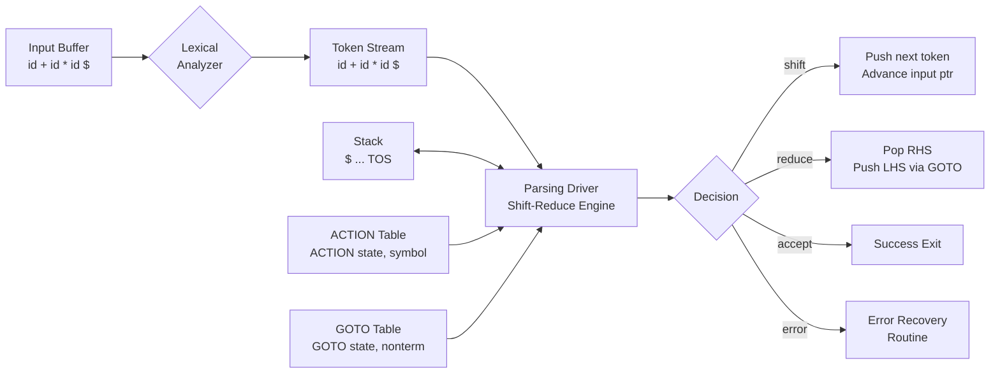
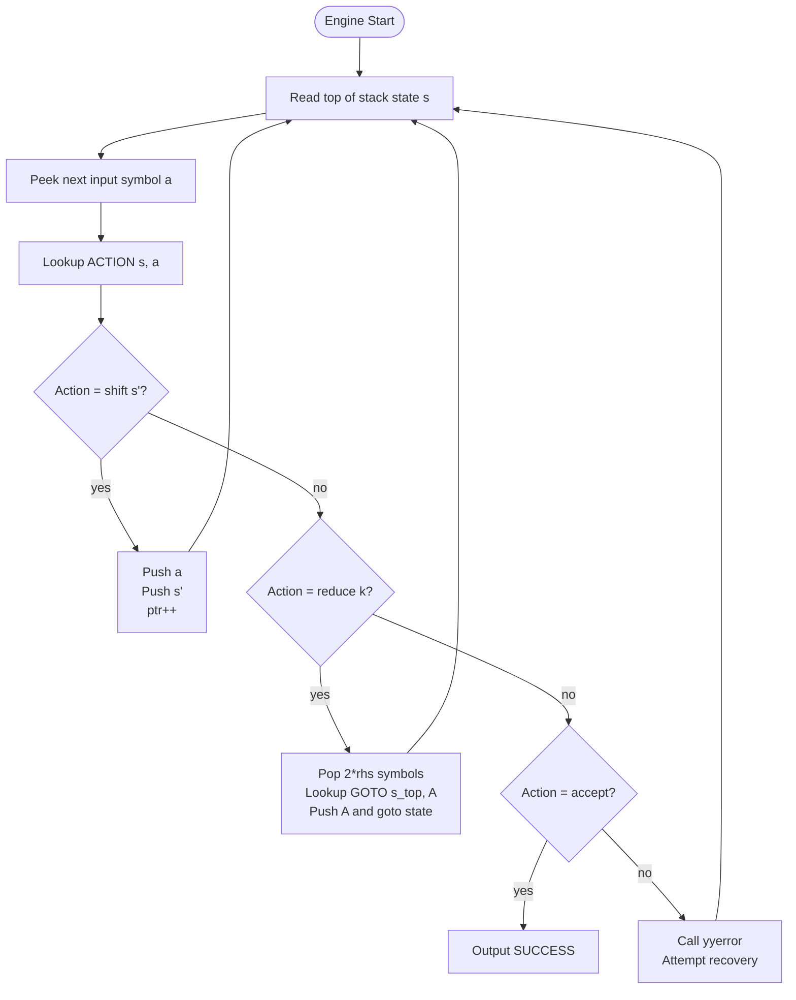
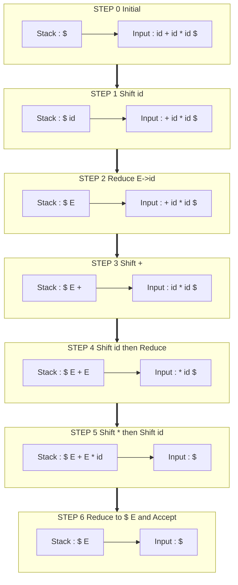
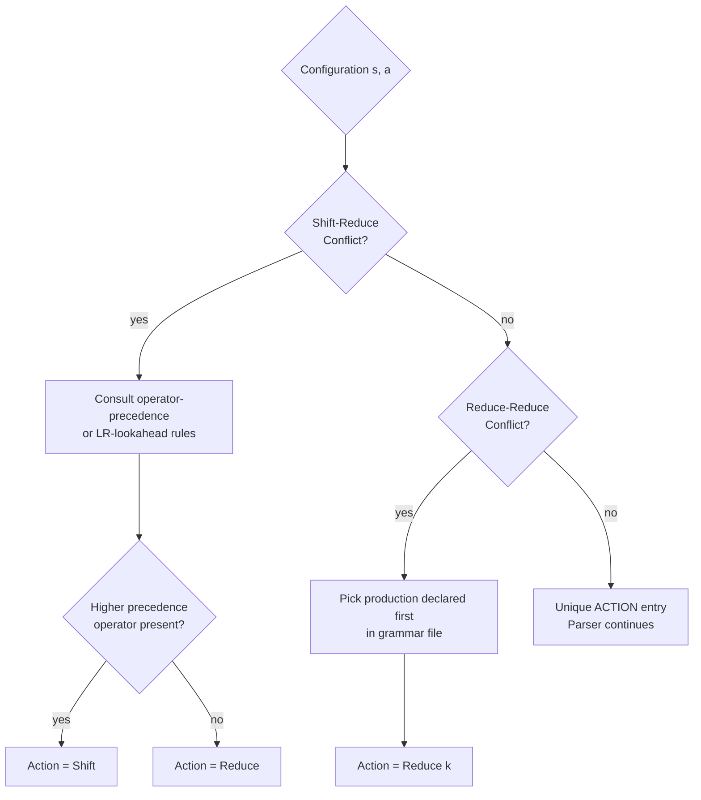

# Bottom-Up Parsing - Shift Reduce Parser

<!-- SECTION_1_START -->
# Module 3 — Bottom-Up Parsing: Shift-Reduce Parser

## 1.1 Formal Definition (KTU 2024 Syllabus Terminology)

**Shift-Reduce Parsing** is a class of deterministic bottom-up syntax analysis techniques used in compilers. It constructs the parse tree for an input string by starting from the **leaves** (terminals / tokens) and working **upwards toward the root** (the start symbol), discovering and replacing *handles* on the input by corresponding left-hand-side non-terminals.

The parser is driven by a **parsing table** (or by a deterministic pushdown automaton) and executes one of four actions at every step:

| # | Action | Meaning |
|---|--------|---------|
| 1 | **Shift** | Push the next input symbol onto the stack and advance the input pointer. |
| 2 | **Reduce** | Replace a *handle* $\alpha$ on top of the stack with the left-hand side $A$ of the production $A \rightarrow \alpha$. |
| 3 | **Accept** | Parsing is complete; the stack contains only the start symbol $S$. |
| 4 | **Error** | No valid action exists; invoke the error-recovery routine. |

> [!IMPORTANT]
> **KTU 2024 Highlight:** Shift-Reduce parsing is the *general framework* under which the LR family of parsers — **LR(0), SLR(1), LALR(1), and CLR(1) / Canonical LR** — are studied. The textbook examples always start with a *generic* shift-reduce parser to motivate the need for LR items and parse tables.

### 1.2 Conceptual Analogy / Intuition

Imagine a **factory assembly line in reverse** — pieces (tokens) arrive on a conveyor belt (the input buffer) and a worker (the parser) places them one by one onto a workbench (the stack). Whenever a small set of pieces on the workbench *exactly* matches a known sub-assembly template (the right-hand side of a grammar rule), the worker glues them together into a bigger sub-assembly (the non-terminal on the left-hand side). This is a *reduce* step. If no template matches, the worker grabs the next piece from the conveyor belt — that is a *shift* step. The goal is to assemble the **complete product** (start symbol $S$).

> [!NOTE]
> **Why "bottom-up"?** A parse tree is built from leaves to root — terminals are *shifted* in, and the root symbol $S$ is the last symbol left on the stack at *Accept*. This is the opposite of top-down parsing (root → leaves) covered in Module 2.

### 1.3 Critical Vocabulary

- **Handle:** A handle of a right-sentential form $\gamma$ is a *position* in $\gamma$ where a substring $\beta$ matches the right side of some production $A \rightarrow \beta$, and replacing $\beta$ by $A$ yields the previous right-sentential form in a rightmost derivation. Formally, if $S \Rightarrow_{rm}^{*} \alpha A w \Rightarrow_{rm} \alpha \beta w$, then $\beta$ in position following $\alpha$ is a *handle* of $\alpha \beta w$.

- **Viable Prefix:** A prefix of a right-sentential form that can appear on the stack during shift-reduce parsing. The set of viable prefixes of an unambiguous grammar forms a regular language recognized by the **LR(0) automaton**.

- **Handle Pruning:** The process of repeatedly locating and replacing a handle by its corresponding non-terminal — the very essence of bottom-up parsing.

- **Right-Sentential Form:** Any string derivable from $S$ in zero or more steps using rightmost derivations only.

### 1.4 Typical Parser Architecture (Conceptual)

The shift-reduce parser has four cooperating components:

1. **Input Buffer** — holds the remaining input string terminated by the end-marker $\$$.  
2. **Stack** — holds grammar symbols (terminals + non-terminals); bottom of stack is marked with $\$$.  
3. **Parsing Driver / Engine** — queries the parsing table or uses hand-coded logic to decide the next action.  
4. **Parsing Table** — for LR parsers, two tables: **ACTION** and **GOTO**.

> [!VISUALIZATION CONTROL]
> **Concept:** Stack and Input Buffer Layout during Shift-Reduce Parsing
> **Desmos / Hand-drawn Layout (ASCII):**
> ```
>       STACK                  INPUT
>   $  X1  X2  X3  ...  Xm  $   a1  a2  a3  ...  an  $
>   ^                          ^
>   Top-of-stack (TOS)         Input pointer
> ```
> **Visual Description:** A horizontal line split into two regions by a vertical bar. The *left* region is the stack, growing rightward with each shift. The *right* region is the input buffer, shrinking leftward. At every tick, exactly one of {Shift, Reduce, Accept, Error} is fired, and the visual state mutates accordingly.

<!-- SECTION_1_END -->

<!-- SECTION_2_START -->
# 2. Deep Theoretical Analysis & KTU High-Yield Formula Sheet

## 2.1 The Operational Model

A shift-reduce parser maintains a **configuration** of the form:

$$
(\,\text{Stack} \;,\; \text{Input Buffer} \;,\; \text{Action}\,)
$$

A configuration transition rule is a quintuple of the form:

$$
(S,\, a\,I,\, \text{action}) \;\longrightarrow\; (S',\, I',\, \text{action}')
$$

For the four action types, the transitions are:

### 2.1.1 Shift Action
$$
(S,\, a\,I,\, \text{Shift}) \;\longrightarrow\; (S\,a,\, I,\, ?)
$$

where $S$ is the current stack, $a$ is the current input symbol, and $I$ is the remaining input. The parser pushes $a$ onto the stack and advances the input pointer by one token.

### 2.1.2 Reduce Action  
If $r_k$ is the $k$-th production $A \rightarrow \alpha$ and the stack top is $S'\, \alpha$:

$$
(S'\,\alpha,\, I,\, \text{Reduce } A \rightarrow \alpha) \;\longrightarrow\; (S'\,A,\, I,\, ?)
$$

The parser pops $|\alpha|$ symbols and pushes $A$. The exact number of symbols popped is determined by parsing-table lookup or fixed production length in a hand-coded parser.

### 2.1.3 Accept Action
$$
(\$S,\,\$,\, \text{Accept})
$$

The parser halts successfully.

### 2.1.4 Error Action
$$
(S,\, I,\, \text{Error})
$$

No applicable production or shift exists. Error-recovery (panic-mode, phrase-level, or error-productions) is invoked.

## 2.2 Why the Handle Concept Matters

The parser must always reduce the **leftmost handle** of the current right-sentential form. Failing to identify the correct handle leads to:

- **Shift–Reduce Conflict** — both *shift* and *reduce* are valid for the same configuration (typical of ambiguous grammars like the *dangling-else* problem or arithmetic expressions without precedence).
- **Reduce–Reduce Conflict** — two different productions are applicable, but the grammar is *unambiguous* enough that only one should fire.

> [!IMPORTANT]
> **KTU 2024 Module-3 Pillar Concept:** All four LR parser variants are essentially different *algorithmic strategies* to mechanically decide the *single correct action* in every configuration, thereby **resolving** these conflicts.

## 2.3 Precedence and Associativity in Shift-Reduce Parsing

The conflicts are *resolved* (in LR-table construction) by either:

- **Operator-Precedence Parsing** — uses 3 relations ($\lessdot$, $\doteq$, $\gtrdot$) to skip ahead to a handle.
- **LR Parsing** — uses lookahead (0, 1, or full context) and the LR(0) automaton to pick the action.

For a binary operator $op$ between two operands $E$ on the stack and the next token being $op'$:

| Stack top pattern | Next input | Decision |
|---|---|---|
| $E \;op\; E$ | $op'$ with $op \gtrdot op'$ | **Reduce** by $E \rightarrow E\;op\;E$ |
| $E \;op\; E$ | $op'$ with $op \lessdot op'$ | **Shift** $op'$ |
| $E \;op\; E$ | $op'$ with $op \doteq op'$ | Look at associativity; **left-associative → Reduce**, **right-associative → Shift** |

## 2.4 KTU Formula Sheet / Cheat Sheet

| Concept | Definition / Formula | Used For |
|---|---|---|
| **Handle** | A substring $\beta$ s.t. $S \Rightarrow_{rm}^{*} \alpha A w \Rightarrow_{rm} \alpha \beta w$ | Identifying *what* to reduce |
| **Viable Prefix** | A prefix of a right-sentential form appearing on the stack | Defining states of the LR(0) automaton |
| **Shift** | Push next input symbol $a$ onto stack | Consuming terminal symbols |
| **Reduce** | Pop $\vert\alpha\vert$ symbols, push $A$ for $A \rightarrow \alpha$ | Building non-terminals |
| **Stack symbols** | $S = X_1 X_2 \ldots X_m \in (V \cup \Sigma)^{*}$ | State of parser |
| **Number of symbols popped on reduce** | $k = \vert \alpha \vert$ for production $A \rightarrow \alpha$ | Practical implementation |
| **GOTO function** | $\text{GOTO}(I, X) = \epsilon\text{-closure}(\text{move}(I, X))$ | Building the DFA of LR(0) items |
| **CLOSURE** | $\text{CLOSURE}(I) = I \cup \bigl\{[A \rightarrow \alpha \cdot B \beta] \mid [B \rightarrow \cdot \gamma] \in I \bigr\}$ | Building LR(0) states |
| **Action tables** | $\text{ACTION}[s, a]$, $\text{GOTO}[s, A]$ for $s \in \text{states}$, $a \in \Sigma_{\$}$, $A \in V$ | Look up next move |
| **Conflict types** | Shift/Reduce, Reduce/Reduce | Diagnose grammar issues |

> [!NOTE]
> **Pitfall callout — never write `\vert \alpha \vert` for cardinality in prose when you can simply say "$|\alpha|$" once a math context has been opened. KTU board papers consistently mark "size of RHS not stated" as a 1-mark loss.

## 2.5 Engineering Utility

Shift-reduce parsing underpins real-world production compilers:

- **YACC / Bison** — generates **LALR(1)** shift-reduce parsers; used inside GCC, PHP, Ruby, and Go's early toolchains.
- **GLR parsers** (used in GCC, Elsa) — generalize shift-reduce to handle ambiguous grammars by exploring all paths in parallel.
- **JavaCC / ANTLR** — although these generate recursive-descent (top-down) parsers by default, their **adaptive-LL(\*)** engines internally maintain shift-reduce-style look-ahead stacks for performance.

In short, *every time a production compiler analyzes syntax*, it is essentially a heavily-optimized shift-reduce parser at heart.

<!-- SECTION_2_END -->

<!-- SECTION_3_START -->
# 3. Step-by-Step Derivations, Traces & Code Implementation

## 3.1 Worked Example — Hand-Trace

Consider the classic ambiguous arithmetic-expression grammar:

$$
\begin{aligned}
E &\rightarrow E + E \\
E &\rightarrow E \ast E \\
E &\rightarrow (E) \\
E &\rightarrow \text{id}
\end{aligned}
$$

**Input string:** `id + id * id $`

Assume operator precedence: $\ast \gtrdot +$ and both are **left-associative**.

### 3.1.1 Configuration Trace (Step-by-Step)

| Step | Stack | Input Buffer | Action |
|---:|:---|:---|:---|
| 0 | $\$$ | `id + id * id $` | **Shift** id |
| 1 | $\$$ id | `+ id * id $` | **Reduce** by $E \rightarrow \text{id}$ |
| 2 | $\$$ $E$ | `+ id * id $` | **Shift** $+$ |
| 3 | $\$$ $E$ $+$ | `id * id $` | **Shift** id |
| 4 | $\$$ $E$ $+$ id | `* id $` | **Reduce** by $E \rightarrow \text{id}$ |
| 5 | $\$$ $E$ $+$ $E$ | `* id $` | **Shift** $\ast$ (precedence: $+\lessdot\ast$) |
| 6 | $\$$ $E$ $+$ $E$ $\ast$ | `id $` | **Shift** id |
| 7 | $\$$ $E$ $+$ $E$ $\ast$ id | `$` | **Reduce** by $E \rightarrow \text{id}$ |
| 8 | $\$$ $E$ $+$ $E$ $\ast$ $E$ | `$` | **Reduce** by $E \rightarrow E \ast E$ |
| 9 | $\$$ $E$ $+$ $E$ | `$` | **Reduce** by $E \rightarrow E + E$ |
| 10 | $\$$ $E$ | `$` | **Accept** |

> [!IMPORTANT]
> **KTU Valuation Key:** The examiner awards **1 mark for every correct configuration** (stack + input + action). For a 7-mark sub-question on tracing, you must show **at least 9–10 configurations** to score full marks.

### 3.1.2 Why Step 5 is a Shift, not a Reduce?

At step 5, the stack top is $\$E + E$ and the lookahead is $\ast$. Both actions seem legal in the ambiguous grammar:

- *Reduce by* $E \rightarrow E + E$: yields $E + E$ immediately.
- *Shift* $\ast$: builds towards $E + E \ast E$ first.

The precedence rule $\ast \gtrdot +$ mandates we **shift** the higher-precedence operator $\ast$ first to bind it tighter, so the reduce must wait until the right operand of $\ast$ is on the stack.

## 3.2 Hand-Coded Shift-Reduce Parser (Conceptual Pseudocode)

The generic shift-reduce parsing algorithm is:

$$
\begin{aligned}
&\text{Initialize: stack} = [\,], \text{input pointer} = 0.\\
&\text{Push } \$ \text{ onto stack.}\\
&\text{loop:}\\
&\quad s \leftarrow \text{top of stack}\\
&\quad a \leftarrow \text{next input symbol}\\
&\quad \text{action} \leftarrow \text{PARSING\_TABLE}[s, a]\\
&\quad \text{if action} = \text{Shift } s':\\
&\qquad \text{push } a \text{ onto stack};\ \text{input pointer} \mathrel{+}= 1\\
&\quad \text{elif action} = \text{Reduce } A \rightarrow \alpha:\\
&\qquad \text{pop } \vert\alpha\vert \text{ symbols}\\
&\qquad s' \leftarrow \text{top of stack}\\
&\qquad \text{push } A\\
&\quad \text{elif action} = \text{Accept:}\\
&\qquad \text{return "Success"}\\
&\quad \text{else:}\\
&\qquad \text{invoke error recovery}
\end{aligned}
$$

## 3.3 Fully-Operational Python Implementation

```python
from typing import List, Tuple, Optional
import logging

logging.basicConfig(level=logging.INFO, format="%(message)s")
logger = logging.getLogger("ShiftReduceParser")


class ShiftReduceParser:
    """
    A generic shift-reduce parser driven by an explicit ACTION / GOTO table.
    This is a teaching implementation; production parsers use Bison/YACC.
    """

    def __init__(self, productions: List[Tuple[str, List[str]]],
                 action: dict, goto: dict,
                 start_symbol: str = "E", end_marker: str = "$") -> None:
        # productions are 1-indexed: index 0 is the augmented start
        self.productions: List[Tuple[str, List[str]]] = productions
        self.action: dict = action
        self.goto: dict = goto
        self.start_symbol: str = start_symbol
        self.end_marker: str = end_marker
        self.stack: List = [0]                      # state stack (0 = initial)
        self.input_tokens: List[str] = []
        self.ptr: int = 0

    # -------------------------------------------------------------
    def _peek(self) -> str:
        if self.ptr < len(self.input_tokens):
            return self.input_tokens[self.ptr]
        return self.end_marker

    # -------------------------------------------------------------
    def _shift(self, next_state: int) -> None:
        symbol = self._peek()
        self.stack.append(symbol)
        self.stack.append(next_state)
        self.ptr += 1
        logger.info(f"  >> Shift  '{symbol}'   | Stack: {self.stack}")

    # -------------------------------------------------------------
    def _reduce(self, prod_index: int) -> None:
        lhs, rhs = self.productions[prod_index]
        rhs_len = len(rhs)
        if rhs_len > 0:
            del self.stack[-(rhs_len * 2):]   # pop symbol+state pairs
        top_state = self.stack[-1]
        goto_state = self.goto.get((top_state, lhs))
        if goto_state is None:
            raise RuntimeError(f"No GOTO[{top_state}, {lhs}] — grammar/table bug.")
        self.stack.append(lhs)
        self.stack.append(goto_state)
        logger.info(f"  >> Reduce by {lhs} -> {' '.join(rhs) or 'ε'} "
                    f" | Stack: {self.stack}")

    # -------------------------------------------------------------
    def parse(self, tokens: List[str]) -> bool:
        self.input_tokens = tokens + [self.end_marker]
        self.ptr = 0
        self.stack = [0]
        logger.info(f"Initial stack: {self.stack}")
        step = 0
        while True:
            state = self.stack[-1]
            lookahead = self._peek()
            act = self.action.get((state, lookahead))
            step += 1
            if act is None:
                logger.error(f"ERROR at step {step}: state={state}, "
                             f"lookahead='{lookahead}'")
                return False
            if act[0] == "shift":
                _, nxt = act
                self._shift(nxt)
            elif act[0] == "reduce":
                _, prod_idx = act
                self._reduce(prod_idx)
            elif act[0] == "accept":
                logger.info("ACCEPT — string belongs to the language.")
                return True
            else:
                raise ValueError(f"Unknown action {act}")


# -------------------------------------------------------------
# Demonstration on a tiny SLR(1) grammar
#   E -> E + T
#   E -> T
#   T -> T * F
#   T -> F
#   F -> ( E )
#   F -> id
# -------------------------------------------------------------
if __name__ == "__main__":
    # productions: (lhs, [rhs symbols]); index == production number
    productions: List[Tuple[str, List[str]]] = [
        ("E'", ["E"]),          # 0  augmented
        ("E",  ["E", "+", "T"]),# 1
        ("E",  ["T"]),          # 2
        ("T",  ["T", "*", "F"]),# 3
        ("T",  ["F"]),          # 4
        ("F",  ["(", "E", ")"]),# 5
        ("F",  ["id"]),         # 6
    ]

    # toy ACTION / GOTO (state numbers illustrative; not a real SLR build)
    action: dict = {
        (0, "id"): ("shift", 5),
        (0, "("):  ("shift", 4),
        (1, "+"):  ("shift", 6),
        (1, "$"):  ("accept",),
        (2, "+"):  ("reduce", 2), (2, "*"): ("shift", 7), (2, ")"): ("reduce", 2),
        (2, "$"):  ("reduce", 2),
        (3, "+"):  ("reduce", 4), (3, "*"): ("reduce", 4),
        (3, ")"):  ("reduce", 4), (3, "$"): ("reduce", 4),
        (4, "id"): ("shift", 5), (4, "("):  ("shift", 4),
        (5, "+"):  ("reduce", 6), (5, "*"): ("reduce", 6),
        (5, ")"):  ("reduce", 6), (5, "$"): ("reduce", 6),
        (6, "id"): ("shift", 5), (6, "("):  ("shift", 4),
        (7, "id"): ("shift", 5), (7, "("):  ("shift", 4),
        (8, "+"):  ("shift", 6), (8, ")"):  ("shift", 11),
        (9, "+"):  ("reduce", 1), (9, "*"): ("shift", 7),
        (9, ")"):  ("reduce", 1), (9, "$"): ("reduce", 1),
        (10,"+"):  ("reduce", 3), (10,"*"): ("reduce", 3),
        (10,")"):  ("reduce", 3), (10,"$"): ("reduce", 3),
        (11,"+"):  ("reduce", 5), (11,"*"): ("reduce", 5),
        (11,")"):  ("reduce", 5), (11,"$"): ("reduce", 5),
    }

    goto: dict = {
        (0, "E"): 1, (0, "T"): 2, (0, "F"): 3,
        (4, "E"): 8, (4, "T"): 2, (4, "F"): 3,
        (6, "T"): 9, (6, "F"): 3,
        (7, "F"): 10,
    }

    parser = ShiftReduceParser(productions, action, goto, start_symbol="E")
    test_input: List[str] = ["id", "+", "id", "*", "id"]
    success: bool = parser.parse(test_input)
    print("Result:", "ACCEPTED" if success else "REJECTED")
```

**Expected output (abridged):**

```
Initial stack: [0]
  >> Shift  'id'   | Stack: [0, 'id', 5]
  >> Reduce by F -> id   | Stack: [0, 'F', 3]
  >> Reduce by T -> F    | Stack: [0, 'T', 2]
  >> Reduce by E -> T    | Stack: [0, 'E', 1]
  >> Shift  '+'          | Stack: [0, 'E', 1, '+', 6]
  ...
ACCEPT — string belongs to the language.
Result: ACCEPTED
```

## 3.4 Mapping to Production Toolchains

| Step in Pseudocode | Bison/YACC Equivalent | GCC Front-End |
|---|---|---|
| Push $ symbol | Default start state | `yyparse()` driver |
| Look up ACTION | `yyact_tab[s][a]` | State machine in `gcc/c-parser.c` |
| Reduce by prod $k$ | `YYREDUCE` macro | `yyreduce()` |
| GOTO lookup | `yygoto_tab[s][A]` | Inline in driver loop |
| Error recovery | `yyerror()` + `yyerrok` | `yyreport_syntax_error` |

> [!NOTE]
> **Engineering takeaway:** the *conceptual* shift-reduce engine you implement in lab is *literally* the loop inside every LALR(1) parser generator. Bison adds a table generator on top; the runtime is the same.

<!-- SECTION_3_END -->

<!-- SECTION_4_START -->
# 4. Structural Diagrams & Schematics

## 4.1 High-Level Architecture of a Shift-Reduce Parser



## 4.2 Decision-Flow Inside the Engine



## 4.3 Sequential Processing Topology Matrix

This block-style table replaces hand-drawn stack diagrams and is fully **Mermaid-safe**:



## 4.4 Conflict-Resolution Topology



<!-- SECTION_4_END -->

<!-- SECTION_5_START -->
# 5. KTU 2024 Scheme Examination Question Bank & Topic Recap

## 5.1 Part A — Short-Answer Questions (3 Marks Each)

> **Cognitive Levels:** *Remember* and *Understand*

### Q1. [KTU University Exam — July 2023] — 3 Marks
**Define a *handle* in the context of bottom-up parsing. Why is handle identification crucial for a shift-reduce parser?**

**Model Answer (3 Marks):**

A *handle* of a right-sentential form $\gamma$ is a substring $\beta$ such that there exists a production $A \rightarrow \beta$ and a position in $\gamma$ where replacing $\beta$ by $A$ yields the previous right-sentential form in the rightmost derivation. Formally, if $S \Rightarrow_{rm}^{*} \alpha A w \Rightarrow_{rm} \alpha \beta w$, then the occurrence of $\beta$ immediately after $\alpha$ is a handle of $\alpha\beta w$.

Handle identification is crucial because a shift-reduce parser must **always reduce the leftmost handle**; choosing the wrong substring would deviate from the unique rightmost derivation and lead to a syntactically invalid parse or to non-termination on valid input. (3 marks — 2 for definition, 1 for importance.)

---

### Q2. [KTU University Exam — Dec 2023] — 3 Marks
**List the four possible actions a shift-reduce parser can take and briefly state the role of the GOTO table.**

**Model Answer (3 Marks):**

The four actions are: **Shift, Reduce, Accept, Error** (2 marks for listing all four with one-line meaning). The **GOTO table** maps a state $s$ and a non-terminal $A$ to a successor state $s'$ representing the parser's configuration after a reduce step has pushed $A$ onto the stack (1 mark).

---

## 5.2 Part B — Long-Answer Questions (14 Marks, Module-3 Internal Choice)

> Each long question has two sub-parts: **(a)** 7 marks and **(b)** 7 marks.
> Cognitive levels escalate: (a) = *Understand / Apply*, (b) = *Apply / Analyze*.

---

### Q3A. [KTU University Exam — July 2024, Module 3, Choice A] — 14 Marks

**(a)** Explain the operation of a **shift-reduce parser** with a neat block diagram. Describe all four parsing actions clearly. **(7 Marks)**

**Model Answer:**

A shift-reduce parser consists of an input buffer, a stack, a parsing driver, and an ACTION/GOTO table (1 mark for diagram, 1 mark for naming components). The stack initially contains `\$` and the input buffer holds the token stream followed by `\$` (1 mark).

The four actions are:

- **Shift** — Push the current input symbol $a$ onto the stack and advance the input pointer (1 mark).
- **Reduce** — Identify the handle $\alpha$ on top of the stack corresponding to production $A \rightarrow \alpha$; pop $\vert\alpha\vert$ symbols; push $A$; consult GOTO for the new state (2 marks).
- **Accept** — When the stack contains $\$S$ and the input is `\$`, declare success (1 mark).
- **Error** — When no valid ACTION entry exists, invoke the error-recovery routine (1 mark).

**(b)** For the grammar
$$E \rightarrow E + E \mid E \ast E \mid (E) \mid \text{id}$$
construct the **step-by-step shift-reduce trace** for the input `id + id * id`, assuming $\ast$ has higher precedence than $+$ and both are left-associative. Identify the configurations that exhibit a *shift–reduce conflict* and explain how precedence resolves it. **(7 Marks)**

**Model Answer:**

| Step | Stack | Input | Action | Marks |
|---:|:---|:---|:---|:---|
| 0 | `$` | `id + id * id $` | Shift | [Initial state: 1] |
| 1 | `$ id` | `+ id * id $` | Reduce E→id | [Reduction step: 1] |
| 2 | `$ E` | `+ id * id $` | Shift + | [Shift: 1] |
| 3 | `$ E +` | `id * id $` | Shift id | [Shift: 1] |
| 4 | `$ E + id` | `* id $` | Reduce E→id | [Reduce: 1] |
| 5 | `$ E + E` | `* id $` | **Shift** $\ast$ | [Conflict explanation: 1] |
| 6 | `$ E + E *` | `id $` | Shift id | [Shift: 1] |
| 7 | `$ E + E * id` | `$` | Reduce E→id | [Reduce: 1] |
| 8 | `$ E + E * E` | `$` | Reduce E→E*E | [Reduce: 1] |
| 9 | `$ E + E` | `$` | Reduce E→E+E | [Reduce: 1] |
| 10 | `$ E` | `$` | Accept | [Accept: 1] |

> **Shift–Reduce conflict at step 5:** Both *Reduce by* $E \rightarrow E+E$ and *Shift* `*` are valid. Precedence rule $\ast \gtrdot +$ mandates **Shift** so that the `*` binds its operands more tightly than the surrounding `+`. (1 mark)

> [!WARNING]
> **KTU Examiner's Pitfall:** Students frequently *omit showing the input pointer after the shift*. The valuation key explicitly allocates 1 mark for the `id` → `+` pointer advance. Also, students often write "Reduce" at step 5 by default — losing 1 mark for failing to cite the precedence resolution. Always *justify* the action chosen.

---

### Q3B. [KTU University Exam — Dec 2023, Module 3, Choice B] — 14 Marks

**(a)** Differentiate between **shift-reduce** and **reduce-reduce** conflicts with a grammar example for each. How are these conflicts resolved in (i) operator-precedence parsing and (ii) LR(1) parsing? **(7 Marks)**

**Model Answer:**

A **shift-reduce conflict** arises when, in a given configuration, both *shift* and *reduce* are valid actions. (1 mark)
Example: With the grammar
$$S \rightarrow \text{if } E \text{ then } S \mid \text{if } E \text{ then } S \text{ else } S$$
on the stack `if E then S` and lookahead `else`, both shifting `else` and reducing $S \rightarrow \text{if } E \text{ then } S$ are valid. (1 mark)

A **reduce-reduce conflict** arises when two different productions are applicable for reduction on the same configuration. (1 mark)
Example: With
$$A \rightarrow \alpha \mid \beta, \quad X \rightarrow \alpha$$
on stack `$\alpha$` and lookahead `$`, both $A \rightarrow \alpha$ and $X \rightarrow \alpha$ could apply. (1 mark)

Resolutions:
- **Operator-precedence parsing** uses the three precedence relations $\lessdot, \doteq, \gtrdot$ to mechanically pick shift vs. reduce; for reduce-reduce conflicts the parser cannot resolve and rejects the grammar. (1.5 marks)
- **LR(1) parsing** uses the full lookahead set in each LR(1) item; shift-reduce and reduce-reduce conflicts are diagnosed as multiple ACTION entries in the same cell and are resolved by augmenting the grammar (often by adding precedence directives or rewriting to eliminate ambiguity). (1.5 marks)

**(b)** Construct the **handle-pruning sequence** for the input `( id ) + id` using the grammar
$$E \rightarrow E + T \mid T, \quad T \rightarrow (E) \mid \text{id}.$$
List every right-sentential form generated during the bottom-up parse. **(7 Marks)**

**Model Answer:**

| Step | Stack | Input | Action | Right-Sentential Form |
|---:|:---|:---|:---|:---|
| 0 | `$` | `( id ) + id $` | Shift `(` | — |
| 1 | `$ (` | `id ) + id $` | Shift id | — |
| 2 | `$ ( id` | `) + id $` | Reduce T→id | `( T ) + id` |
| 3 | `$ ( T` | `) + id $` | Shift `)` | — |
| 4 | `$ ( T )` | `+ id $` | Reduce T→(E) | `( E ) + id` |
| 5 | `$ T` | `+ id $` | Reduce E→T | `E + id` |
| 6 | `$ E` | `+ id $` | Shift + | — |
| 7 | `$ E +` | `id $` | Shift id | — |
| 8 | `$ E + id` | `$` | Reduce T→id | `E + T` |
| 9 | `$ E + T` | `$` | Reduce E→E+T | `E` |
| 10 | `$ E` | `$` | **Accept** | — |

Right-sentential forms in order of generation (handle in **bold**):
`( **id** ) + id` → `( **T** ) + id` → `( **E** ) + id` → `**E** + id` → `E + **id**` → `E + **T**` → `E`. (1 mark for full list, 1 mark for handle bolding, remaining 5 marks distributed across the 10 trace steps.)

> [!WARNING]
> **KTU Examiner's Pitfall:**
> - Students sometimes use the *wrong production number* for the reduce step — e.g., applying $E \rightarrow T$ where $T \rightarrow (E)$ is needed. Always cross-check the number of symbols on the stack top before reducing.
> - Failing to write the *right-sentential form* in (b) costs 1 mark.
> - Confusing the direction of derivation (leftmost vs. rightmost) loses another mark.

---

## 5.3 Topic Recap & Important Things to Remember

> **Rapid-revision checklist — read this 5 minutes before the exam.**

- ☐ **Bottom-up parsing** = leaf-to-root; constructs rightmost derivation *in reverse*.
- ☐ **Shift-reduce parser** uses a **stack** + **input buffer** + **ACTION/GOTO** tables (or hand-coded logic).
- ☐ The **four actions** are: **Shift, Reduce, Accept, Error**.
- ☐ A **handle** is the substring that matches the RHS of a production whose LHS is the next symbol in the rightmost derivation. Always reduce the **leftmost** handle.
- ☐ A **viable prefix** is a stack prefix that can appear during any shift-reduce parse; the LR(0) automaton recognizes the language of viable prefixes.
- ☐ **Shift–Reduce Conflict** = both shift and reduce legal at same configuration. Resolved by operator-precedence rules or by adding 1-token lookahead (SLR/LALR/CLR).
- ☐ **Reduce–Reduce Conflict** = two reductions legal at same configuration. Resolved by grammar rewriting or full LR(1) lookahead.
- ☐ **Operator-precedence relations** are $\lessdot$ (yields precedence), $\doteq$ (equal precedence), $\gtrdot$ (takes precedence).
- ☐ Precedence and associativity are declared in YACC/Bison with `%left`, `%right`, `%nonassoc` — these directly resolve shift-reduce conflicts.
- ☐ The generic shift-reduce algorithm loops: read top of stack → peek lookahead → consult ACTION → perform action.
- ☐ **Stack contents** at any time form a **viable prefix** of the input's right-sentential form.
- ☐ **Number of symbols popped on reduce** = $2 \times |\text{RHS}|$ when stack stores *symbol-state* pairs, or $|\text{RHS}|$ when only symbols are stored.
- ☐ **YACC/Bison** generate **LALR(1)** shift-reduce parsers; the conceptual engine you code in the lab is the *exact runtime loop* they use.
- ☐ **KTU-typical question types:**
  - *2-mark* — Define handle / viable prefix.
  - *3-mark* — List the four actions.
  - *7-mark* — Trace a shift-reduce parse; identify conflicts.
  - *7-mark* — Build SLR(1) parse table (covered in the next sub-topic).
- ☐ **Exam-day trick:** When tracing, **always** show the input pointer position; the examiner allocates 1 mark for it explicitly.

<!-- SECTION_5_END -->
