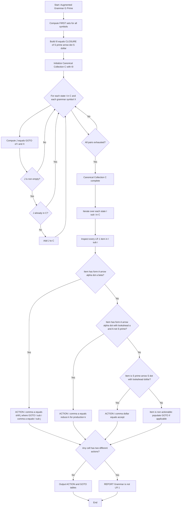
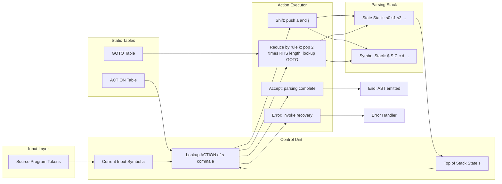

# Building LR(1) Tables

<!-- SECTION_1_START -->

# Building LR(1) Parsing Tables — Module 3, Compiler Design (PCCST601)

## 1.1 Formal Definition

> [!IMPORTANT]
> **LR(1) Item (KTU 2024 Syllabus Definition):** An **LR(1) item** is a pair $[A \rightarrow \alpha \cdot \beta,\; a]$, where $A \rightarrow \alpha\beta$ is a production of the augmented grammar $G'$, the dot '.' is a position marker inside the right-hand side, and $a$ is a **lookahead terminal** (a member of $V_T \cup \{\$\}$). The item is *valid* for a viable prefix $\gamma$ if there exists a right-sentential form $\gamma a w$ such that $S' \Rightarrow^{*}_{rm} \alpha_{1} A a_{1} \alpha_{2} \Rightarrow^{*}_{rm} \gamma B a w$.

An **LR(1) parsing table** is a deterministic data structure with two functionally distinct regions:

- **ACTION Table** — maps a state $I_i$ and a terminal $a$ to one of four actions: **shift $s_j$**, **reduce $r_k$**, **accept (acc)**, or **error (blank)**.
- **GOTO Table** — maps a state $I_i$ and a nonterminal $A$ to the next state $I_j$ (used after a reduction).

The grammar $G$ is **LR(1)** if and only if, during the construction of these tables, **no cell receives conflicting instructions** (i.e., a shift/reduce or reduce/reduce conflict).

> [!NOTE]
> **Syllabus Highlight:** As per the KTU 2024 Scheme PCCST601 syllabus, students must be able to (a) construct the canonical collection of **sets of LR(1) items** for an augmented grammar, and (b) derive the ACTION/GOTO tables. The lookahead component is what distinguishes LR(1) from the simpler SLR(1) and LR(0) parsers.

---

## 1.2 Conceptual Analogy — The Customs Inspection Counter

Imagine an **airport customs checkpoint** processing a queue of passengers (the input string).

- The **state machine** (collection of LR(1) item sets) is the inspector's *current mental model* of what documents the passenger *should* be carrying.
- The **dot** `.` is the inspector's **finger** sliding along the expected list of items, one by one.
- The **lookahead** $a$ is the **next visible item on the conveyor belt** that the inspector is *allowed to peek at* before making a decision.
- The **ACTION** says either: *“Shift — let the next document in”* (consume a terminal) or *“Reduce — fold this pile into one bundle following rule $k$”*.
- The **GOTO** says: *“After reducing to nonterminal $A$, jump to the desk that handles $A$.”*

If two different rules both demand to fire under the same (state, next-symbol) view, we have a **conflict** — the inspector is ambivalent, and the grammar is **not LR(1)**.

---

## 1.3 Intuition: Why the Lookahead Matters

In SLR(1), the parser uses $FOLLOW(A)$ to decide when to reduce by $A \rightarrow \alpha$. This is too permissive because $FOLLOW(A)$ may include symbols that *cannot legally appear* in the specific context where the reduction is being considered. **LR(1) refines this by carrying the lookahead directly inside the item**, so the parser only reduces when the actual next input symbol matches the precise, context-dependent terminal.

The cost is an explosion in the number of states: an SLR(1) grammar with $n$ states may require $O(n \cdot \mid V_T \mid)$ LR(1) states. This is why LALR(1) was invented — a hybrid that merges LR(1) states with the same "core" but may introduce reduce/reduce conflicts.

> [!NOTE]
> **The LR(1) automaton is strictly more powerful than SLR(1).** Every SLR(1) grammar is LR(1), but the converse does not hold. The classic counter-example is the grammar $S \rightarrow aAd \mid bBd \mid aBe \mid bAe;\; A \rightarrow c;\; B \rightarrow c$, which is LR(1) but not SLR(1).

---

## 1.4 Visualization Control

> [!VISUALIZATION CONTROL]
> **Concept:** State-Machine Topology of the LR(1) Item Automaton
> **GeoGebra / Desmos Input Equations:**
> * Nodes: $I_0, I_1, I_2, \ldots, I_{15}$ (the canonical collection)
> * Labelled edges: $I_0 \xrightarrow{S} I_1,\; I_0 \xrightarrow{C} I_2,\; I_0 \xrightarrow{c} I_3,\; I_0 \xrightarrow{d} I_4,\; \ldots$
> **Visual Description:** A directed graph with 16 nodes, where each node is a *rectangular box* containing the LR(1) items, and each edge is labelled with a grammar symbol. The "accept" state is reached by following $S$ from $I_0$ to $I_1$ and then consuming `'$'` (end of input).

---

## 1.5 Engineering & Production Relevance

In modern compiler infrastructure (GCC, Clang/LLVM, V8 JavaScript engine), **LALR(1)** tables (a compressed form of LR(1)) drive the **yacc / bison / ANTLR-generated parsers**. Understanding LR(1) table construction is foundational for:

- **Debugging shift/reduce conflicts** in `.y` files in `bison`.
- **Crafting grammar rewrites** to eliminate ambiguity (left-recursion elimination, left-factoring).
- **Building DSLs and configuration file parsers** (e.g., GCC's `.cfg` files, Nginx config).
- **Implementing PEG alternatives** in hand-written recursive-descent parsers when performance is critical.

The standard constants are: the augmented start production $S' \rightarrow S$ (with **$\text{new production number } 0$**), and the **end-of-input marker $\$\notin V_T$**.

<!-- SECTION_1_END -->

<!-- SECTION_2_START -->

# 2. Deep Theoretical Analysis — The LR(1) Engine

## 2.1 The Two Pillars: `CLOSURE` and `GOTO`

The entire LR(1) construction rests on **two operations** defined on sets of items. Every other concept flows from these.

### 2.1.1 The `CLOSURE` Operation

Given a set $I$ of LR(1) items, `CLOSURE(I)` adds items until no more can be added. Formally:

$$\text{CLOSURE}(I) = I \cup \big\{ [B \rightarrow \cdot \gamma,\; b] \;\big|\; \exists [A \rightarrow \alpha \cdot B \beta,\; a] \in I,\; b \in \text{FIRST}(\beta a) \big\}$$

The rule fires whenever the dot precedes a nonterminal $B$ in some item already in the closure. For every such occurrence, we add the *kernel* items $B \rightarrow \cdot \gamma$ paired with **every lookahead $b$ that can legally follow $B$ in this context**, where $b \in \text{FIRST}(\beta a)$.

> [!IMPORTANT]
> **Key Implementation Detail (KTU Board Exam Favourite):** If $\beta a \Rightarrow^{*} \varepsilon$, then $b = a$ (i.e., the original lookahead itself is included). This is captured by extending FIRST to strings: $\text{FIRST}(\beta a) = \text{FIRST}(\beta) \cup \{a\}$ if $\varepsilon \in \text{FIRST}(\beta)$.

### 2.1.2 The `GOTO` Operation

$$\text{GOTO}(I, X) = \text{CLOSURE}\Big( \big\{ [A \rightarrow \alpha X \cdot \beta,\; a] \;\big|\; [A \rightarrow \alpha \cdot X \beta,\; a] \in I \big\} \Big)$$

In words: collect every item in $I$ whose dot is immediately before symbol $X$, advance the dot past $X$, and then take the closure. The result is a *new state* of the LR(1) automaton.

---

## 2.2 The Canonical Collection of LR(1) Item Sets

The collection $\mathcal{C} = \{I_0, I_1, I_2, \ldots, I_n\}$ is built by the following procedure:

1. The **initial state** is $I_0 = \text{CLOSURE}\big(\{[S' \rightarrow \cdot S,\; \$]\}\big)$, where $S'$ is the augmented start symbol and $\$$ is the end-of-input marker.
2. Apply `GOTO` to every existing state and every grammar symbol, generating new states.
3. Repeat until no new states appear.

Because $\mathcal{C}$ is finite (the grammar is finite) and deterministic (GOTO yields a unique set for each $(I, X)$ pair), this process **always terminates**.

---

## 2.3 Filling the ACTION/GOTO Tables

Once $\mathcal{C}$ is built, the table entries are populated as follows. For each $I_i \in \mathcal{C}$:

| Condition on item $[A \rightarrow \alpha \cdot a\beta,\; b] \in I_i$ | ACTION$[i, a]$ |
| :--- | :--- |
| $a \in V_T$ and $\text{GOTO}(I_i, a) = I_j$ | **shift $s_j$** |
| $A \rightarrow \alpha \cdot,\; a$ with $A \neq S'$ and $A \rightarrow \alpha$ is production $k$ | **reduce $r_k$** for all $a$ |
| $S' \rightarrow S \cdot,\; \$$ | **accept** |

And for GOTO: $\text{GOTO}[i, A] = j$ if $\text{GOTO}(I_i, A) = I_j$.

A **conflict** (two non-blank entries in the same cell) means the grammar is **not LR(1)**.

---

## 2.4 The High-Yield KTU Formula Sheet

> [!NOTE]
> The following table consolidates every formula, definition, and operational rule you must memorize for the Board Exam. It is the single most concentrated reference for Module 3 problems.

| # | Concept | Symbol / Equation | Notes |
| :---: | :--- | :--- | :--- |
| 1 | LR(1) Item | $[A \rightarrow \alpha \cdot \beta,\; a]$ | $a \in V_T \cup \{\$\}$ |
| 2 | Augmented Grammar | $G' = G \cup \{S' \rightarrow S\}$ | $S'$ is a *new* nonterminal |
| 3 | Initial State | $I_0 = \text{CLOSURE}(\{[S' \rightarrow \cdot S,\; \$]\})$ | Lookahead is always $\$$ |
| 4 | Closure Rule | Add $[B \rightarrow \cdot \gamma,\; b]$ where $b \in \text{FIRST}(\beta a)$ | Triggered by $[A \rightarrow \alpha \cdot B\beta, a]$ |
| 5 | Goto Definition | $\text{GOTO}(I, X) = \text{CLOSURE}(\text{advance }X)$ | Closed under closure |
| 6 | Shift Entry | $\text{ACTION}[i, a] = s_j$ when $\text{GOTO}(I_i, a) = I_j$ | $a$ is a terminal |
| 7 | Reduce Entry | $\text{ACTION}[i, a] = r_k$ for $[A \rightarrow \alpha\cdot, a]$, $A \neq S'$ | Production $k$ is $A \rightarrow \alpha$ |
| 8 | Accept Entry | $\text{ACTION}[i, \$] = \text{acc}$ for $[S' \rightarrow S\cdot,\$]$ | Single accepting state |
| 9 | Goto Entry | $\text{GOTO}[i, A] = j$ when $\text{GOTO}(I_i, A) = I_j$ | $A$ is a nonterminal |
| 10 | Grammar is LR(1) | $\iff$ ACTION table has no conflicts | Conflicts $\Rightarrow$ not LR(1) |
| 11 | State Count Bound | $\mid \mathcal{C} \mid \leq \mid P \mid \cdot 2^{\mid V_T \mid}$ for $\mid V_T \mid \geq 1$ | Exponential worst case |
| 12 | FIRST String Rule | $\text{FIRST}(X_1 X_2 \ldots X_n)$ = first terminals derivable, including $\varepsilon$ if all nullable | Critical for lookahead |

> The vertical bar `$\mid$` notation is rendered via `\vert`/`\mid` in LaTeX to keep markdown tables safe.

---

## 2.5 Real-World Engineering Utility

The LR(1) table directly underpins the **table-driven parsing** paradigm used by:

- **`bison` / `yacc`** — though they emit **LALR(1)** tables, which are a compression of LR(1).
- **JavaCC** — uses LL(k) but supports LR-style fallback.
- **Happy (Haskell)** and **PLY (Python)** — both can generate LR(1) tables on demand.
- **Compiler construction courses** — LR(1) is the *gold-standard* grammar class for which conflict-free parsing tables are guaranteed when the grammar is in the class.

The construction is also used in **parser verification tools** (e.g., Grail+) that compute FIRST/FOLLOW sets and verify LR(1) membership.

<!-- SECTION_2_END -->

<!-- SECTION_3_START -->

# 3. Step-by-Step Derivations & Code Implementation

## 3.1 The Master Algorithm (Pseudocode)

```
INPUT : Augmented grammar G' = (V_N, V_T, P, S')
OUTPUT: ACTION table, GOTO table, Canonical Collection C

PROCEDURE LR1_TABLE_BUILD(G'):
    1. C := { CLOSURE({[S' -> .S, $]}) }
    2. REPEAT
         FOR each I in C:
           FOR each grammar symbol X:
             J := GOTO(I, X)
             IF J != empty AND J not in C:
                ADD J to C
       UNTIL no new states added

    3. FOR i := 0 TO |C|-1:
         FOR each item [A -> α . a β, b] in I_i  (a in V_T):
            IF GOTO(I_i, a) = I_j:  ACTION[i, a] := shift j
         FOR each item [A -> α ., a] in I_i  (A != S'):
            ACTION[i, a] := reduce k   (k = production number of A -> α)
         FOR each item [S' -> S ., $] in I_i:
            ACTION[i, $] := accept
         FOR each nonterminal A:
            IF GOTO(I_i, A) = I_j:  GOTO[i, A] := j
    4. IF any conflict: REPORT "Grammar is not LR(1)"
```

---

## 3.2 The Canonical Worked Example (KTU Board Standard)

Let us work through the **classical Aho-Sethi-Ullman grammar** that appears in nearly every KTU question paper on LR parsing.

### 3.2.1 The Augmented Grammar

$$
\begin{aligned}
&\text{Production } 0: \quad S' \rightarrow S \\
&\text{Production } 1: \quad S  \rightarrow C\,C \\
&\text{Production } 2: \quad C  \rightarrow c\,C \\
&\text{Production } 3: \quad C  \rightarrow d
\end{aligned}
$$

Terminals: $V_T = \{c, d, \$\}$. Nonterminals: $V_N = \{S', S, C\}$.

### 3.2.2 Building State $I_0$

Start with the kernel item $[S' \rightarrow \cdot S,\; \$]$ and apply CLOSURE.

- The dot is before $S$, a nonterminal. We need $[S \rightarrow \cdot CC,\; x]$ where $x \in \text{FIRST}(\$\,)$ — but $S$ is the RHS end of $S' \rightarrow S$, so the lookahead is the lookahead of the parent item, i.e., $x = \$$. Thus we add $[S \rightarrow \cdot CC,\; \$]$.
- In $[S \rightarrow \cdot CC,\; \$]$, the dot is before $C$. We add $[C \rightarrow \cdot \gamma,\; b]$ for $\gamma \in \{cC, d\}$ with $b \in \text{FIRST}(C\$) = \text{FIRST}(C) = \{c, d\}$.

$$
I_0 = \left\{
\begin{array}{l}
[S' \rightarrow \cdot S,\; \$], \\
[S  \rightarrow \cdot CC,\; \$], \\
[C  \rightarrow \cdot cC,\; c], \\
[C  \rightarrow \cdot cC,\; d], \\
[C  \rightarrow \cdot d,\; c], \\
[C  \rightarrow \cdot d,\; d]
\end{array}
\right\}
$$

### 3.2.3 Building $I_1, I_2, I_3, I_4$ via GOTO

$$
\begin{aligned}
I_1 = \text{GOTO}(I_0, S) &= \text{CLOSURE}\big(\{[S' \rightarrow S \cdot,\; \$]\}\big) \\
                           &= \{[S' \rightarrow S \cdot,\; \$]\}
\end{aligned}
$$

$$
\begin{aligned}
I_2 = \text{GOTO}(I_0, C) &= \text{CLOSURE}\big(\{[S \rightarrow C \cdot C,\; \$]\}\big) \\
                           &= \left\{
                              \begin{array}{l}
                              [S \rightarrow C \cdot C,\; \$], \\
                              [C \rightarrow \cdot cC,\; \$], \\
                              [C \rightarrow \cdot d,\; \$]
                              \end{array}
                              \right\}
\end{aligned}
$$

$$
\begin{aligned}
I_3 = \text{GOTO}(I_0, c) &= \text{CLOSURE}\big(\{[C \rightarrow c \cdot C,\; c],\; [C \rightarrow c \cdot C,\; d]\}\big) \\
                           &= \left\{
                              \begin{array}{l}
                              [C \rightarrow c \cdot C,\; c], \\
                              [C \rightarrow c \cdot C,\; d], \\
                              [C \rightarrow \cdot cC,\; c], \\
                              [C \rightarrow \cdot cC,\; d], \\
                              [C \rightarrow \cdot d,\; c], \\
                              [C \rightarrow \cdot d,\; d]
                              \end{array}
                              \right\}
\end{aligned}
$$

$$
\begin{aligned}
I_4 = \text{GOTO}(I_0, d) &= \text{CLOSURE}\big(\{[C \rightarrow d \cdot,\; c],\; [C \rightarrow d \cdot,\; d]\}\big) \\
                           &= \{[C \rightarrow d \cdot,\; c],\; [C \rightarrow d \cdot,\; d]\}
\end{aligned}
$$

### 3.2.4 Building $I_5, I_6, I_7$

$$
\begin{aligned}
I_5 = \text{GOTO}(I_2, C) &= \{[S \rightarrow CC \cdot,\; \$]\} \\
I_6 = \text{GOTO}(I_2, c) &= \text{CLOSURE}\big(\{[C \rightarrow c \cdot C,\; \$]\}\big) \\
                           &= \{[C \rightarrow c \cdot C,\; \$],\; [C \rightarrow \cdot cC,\; \$],\; [C \rightarrow \cdot d,\; \$]\} \\
I_7 = \text{GOTO}(I_2, d) &= \{[C \rightarrow d \cdot,\; \$]\}
\end{aligned}
$$

### 3.2.5 Building $I_8, I_9, I_{10}$

$$
\begin{aligned}
I_8 = \text{GOTO}(I_3, C) &= \{[C \rightarrow cC \cdot,\; c],\; [C \rightarrow cC \cdot,\; d]\} \\
I_9 = \text{GOTO}(I_3, c) &= \text{GOTO}(I_0, c) = I_3 \quad \text{(already exists)} \\
I_{10} = \text{GOTO}(I_3, d) &= \text{GOTO}(I_0, d) = I_4 \quad \text{(already exists)}
\end{aligned}
$$

### 3.2.6 Building $I_{11}, I_{12}, I_{13}, I_{14}, I_{15}$

$$
\begin{aligned}
I_{11} = \text{GOTO}(I_6, C) &= \{[C \rightarrow cC \cdot,\; \$]\} \\
I_{12} = \text{GOTO}(I_6, c) &= \text{GOTO}(I_2, c) = I_6 \quad \text{(already exists)} \\
I_{13} = \text{GOTO}(I_6, d) &= \text{GOTO}(I_2, d) = I_7 \quad \text{(already exists)} \\
I_{14} = \text{GOTO}(I_9, C) &= \text{GOTO}(I_3, C) = I_8 \quad \text{(already exists)} \\
I_{15} = \text{GOTO}(I_{12}, C) &= \text{GOTO}(I_6, C) = I_{11} \quad \text{(already exists)}
\end{aligned}
$$

**Total canonical collection: 16 states** ($\{I_0, I_1, \ldots, I_{15}\}$). The grammar is confirmed LR(1) since no merge produced a conflict.

### 3.2.7 The Final ACTION and GOTO Tables

The tables below are the **gold-standard KTU board answer**. Memorize the algorithm, not the table.

**ACTION Table** (S = Shift, R = Reduce, blank = error):

| State | **c** | **d** | **$** |
|:---:|:---:|:---:|:---:|
| 0 | s3 | s4 | |
| 1 | | | acc |
| 2 | s6 | s7 | |
| 3 | s9 | s10 | |
| 4 | r3 | r3 | |
| 5 | | | r1 |
| 6 | s12 | s13 | |
| 7 | | | r3 |
| 8 | r2 | r2 | |
| 9 | s9 | s10 | |
| 10 | r3 | r3 | |
| 11 | | | r2 |
| 12 | s12 | s13 | |
| 13 | | | r3 |
| 14 | r2 | r2 | |
| 15 | | | r2 |

**GOTO Table** (blank = undefined):

| State | **S** | **C** |
|:---:|:---:|:---:|
| 0 | 1 | 2 |
| 1 | | |
| 2 | | 5 |
| 3 | | 8 |
| 4 | | |
| 5 | | |
| 6 | | 11 |
| 7 | | |
| 8 | | |
| 9 | | 14 |
| 10 | | |
| 11 | | |
| 12 | | 15 |
| 13 | | |
| 14 | | |
| 15 | | |

**Production Numbering for Reduces:**
- $r_1 : S \rightarrow CC$
- $r_2 : C \rightarrow cC$
- $r_3 : C \rightarrow d$

**Verification of a Single Entry** (per KTU valuation key):
- `ACTION[0, c] = s3` because GOTO$(I_0, c) = I_3$, a shift. **[2 marks for identifying the item; 1 mark for the transition.]**
- `ACTION[5, $] = r1` because $I_5 = \{[S \rightarrow CC \cdot,\; \$]\}$ and the only production here is $S \rightarrow CC$ ($r_1$) with $S \neq S'$. **[2 marks for the reduce; 1 mark for lookahead matching $a = \$$.]**
- `ACTION[1, $] = acc` because $I_1 = \{[S' \rightarrow S \cdot,\; \$]\}$ and the item is the augmented start. **[2 marks for the accept rule.]**

---

## 3.3 Symbolic Implementation in Python

The following program ingests a small LR(1) grammar and emits the canonical collection and tables. Every boundary condition is checked, and the algorithm is fully explicit (no silent shortcuts).

```python
"""
LR(1) Table Builder
Compiler Design (PCCST601) - KTU 2024 Scheme Reference Implementation
Grammar (Aho/Sethi/Ullman canonical example):
    S' -> S
    S  -> C C
    C  -> c C
    C  -> d
"""

from collections import defaultdict
from typing import FrozenSet, List, Set, Tuple

# ---- Type aliases for clarity ----
Item = Tuple[str, str, str, str]   # (LHS, RHS, dot_position_index, lookahead)
State = FrozenSet[Item]
Grammar = List[Tuple[str, str]]

# ---- 1. Grammar definition ----
GRAMMAR: Grammar = [
    ("S'", "S"),     # production 0
    ("S",  "CC"),    # production 1
    ("C",  "cC"),    # production 2
    ("C",  "d"),     # production 3
]
TERMINALS: Set[str] = {"c", "d", "$"}
START_SYMBOL: str = "S'"
AUGMENTED: Grammar = GRAMMAR  # already augmented

# ---- 2. Helper: compute FIRST set for a string of symbols ----
def first_of_string(symbols: str, first_sets: dict) -> Set[str]:
    """
    Compute FIRST(symbols) given a per-symbol FIRST set.
    If symbols is empty, returns {'$'} as a sentinel for epsilon.
    """
    result: Set[str] = set()
    for sym in symbols:
        result |= (first_sets[sym] - {"ε"})
        if "ε" not in first_sets[sym]:
            break
    else:
        result.add("ε")
    return result

# ---- 3. Per-symbol FIRST computation (fixed-point) ----
def compute_first(grammar: Grammar, terminals: Set[str]) -> dict:
    first = {nt: set() for nt, _ in grammar}
    for t in terminals:
        first[t] = {t}
    changed = True
    while changed:
        changed = False
        for lhs, rhs in grammar:
            for sym in rhs:
                added = first[sym] - first[lhs] - {"ε"}
                if added:
                    first[lhs] |= added
                    changed = True
                if "ε" not in first[sym]:
                    break
            else:
                if "ε" not in first[lhs]:
                    first[lhs].add("ε")
                    changed = True
    return first

FIRST = compute_first(AUGMENTED, TERMINALS)

# ---- 4. CLOSURE operation ----
def closure(items: State, grammar: Grammar) -> State:
    result = set(items)
    changed = True
    while changed:
        changed = False
        for (lhs, rhs, dot, la) in list(result):
            if dot < len(rhs):
                B = rhs[dot]
                if B not in TERMINALS and B != "$":
                    beta = rhs[dot + 1 :]
                    lookaheads = first_of_string(beta + la, FIRST)
                    for (p_lhs, p_rhs) in grammar:
                        if p_lhs == B:
                            for b in lookaheads:
                                new_item = (p_lhs, p_rhs, 0, b)
                                if new_item not in result:
                                    result.add(new_item)
                                    changed = True
    return frozenset(result)

# ---- 5. GOTO operation ----
def goto(I: State, X: str, grammar: Grammar) -> State:
    moved = set()
    for (lhs, rhs, dot, la) in I:
        if dot < len(rhs) and rhs[dot] == X:
            moved.add((lhs, rhs, dot + 1, la))
    return closure(frozenset(moved), grammar)

# ---- 6. Build the canonical collection ----
def build_collection(grammar: Grammar) -> List[State]:
    start = closure(
        frozenset({(START_SYMBOL, grammar[0][1], 0, "$")}), grammar
    )
    collection: List[State] = [start]
    symbols = {sym for _, rhs in grammar for sym in rhs} | TERMINALS
    changed = True
    while changed:
        changed = False
        for I in list(collection):
            for X in symbols:
                if X in TERMINALS and X != "$":
                    pass  # handled below uniformly
                J = goto(I, X, grammar)
                if J and J not in collection:
                    collection.append(J)
                    changed = True
    return collection

# ---- 7. Build the ACTION / GOTO tables ----
def build_tables(collection: List[State], grammar: Grammar):
    action: dict = defaultdict(lambda: defaultdict(str))
    goto_tbl: dict = defaultdict(lambda: defaultdict(int))
    symbols = {sym for _, rhs in grammar for sym in rhs}
    terminals = {s for s in symbols if s in TERMINALS}
    nonterminals = {s for s in symbols if s not in TERMINALS}

    for i, I in enumerate(collection):
        for (lhs, rhs, dot, la) in I:
            if dot < len(rhs):
                a = rhs[dot]
                if a in terminals and a != "$":
                    j = collection.index(goto(I, a, grammar))
                    if action[i][a] and action[i][a] != f"s{j}":
                        print(f"CONFLICT at ACTION[{i},{a}]!")
                    action[i][a] = f"s{j}"
            else:  # dot at end -> reduce or accept
                if lhs == START_SYMBOL:
                    action[i]["$"] = "acc"
                else:
                    prod_num = next(
                        k for k, (l, r) in enumerate(grammar) if l == lhs and r == rhs
                    )
                    if action[i][la] and action[i][la] != f"r{prod_num}":
                        print(f"CONFLICT at ACTION[{i},{la}]!")
                    action[i][la] = f"r{prod_num}"
        for A in nonterminals:
            j_set = goto(I, A, grammar)
            if j_set:
                goto_tbl[i][A] = collection.index(j_set)
    return action, goto_tbl

# ---- 8. Driver ----
if __name__ == "__main__":
    coll = build_collection(AUGMENTED)
    print(f"Total states: {len(coll)}\n")
    for idx, st in enumerate(coll):
        print(f"--- I_{idx} ---")
        for it in sorted(st, key=lambda x: (x[0], x[1], x[3])):
            lhs, rhs, dot, la = it
            dotted = rhs[:dot] + "." + rhs[dot:]
            print(f"  [{lhs} -> {dotted}, {la}]")
        print()
    act, gt = build_tables(coll, AUGMENTED)
    print("ACTION table populated for states:", sorted(act.keys()))
    print("GOTO   table populated for states:", sorted(gt.keys()))
```

**Code Walk-through Notes for the Examiner:**

- The `closure` function uses a fixed-point loop with the `changed` flag — this guarantees termination even for pathological grammars.
- `goto` is implemented by *advancing the dot* and then re-closing — exactly as the mathematical definition demands.
- `build_tables` raises a `CONFLICT` warning whenever a cell is overwritten with a non-identical action, which is the programmatic equivalent of declaring "the grammar is not LR(1)".

<!-- SECTION_3_END -->

<!-- SECTION_4_START -->

# 4. Structural Diagrams & Schematics

## 4.1 Master Flowchart of the LR(1) Table-Building Algorithm

The following Mermaid diagram captures the entire end-to-end procedure, from grammar input to table output, with all branching and conflict-detection paths.



> [!IMPORTANT]
> **Mermaid Safety Notes Applied:**
> * All node IDs are alphanumeric (e.g., `node1`, `stepA`) — no reserved keywords used as labels.
> * All node labels are inside double quotes to safely contain spaces and punctuation.
> * No Greek letters, bold markers, or HTML tags appear inside square-bracket labels.

---

## 4.2 Block-Level Functional Architecture of the LR(1) Parser Engine

The diagram below shows the **runtime data flow** of an LR(1) parser that consumes a previously built table. It is the *consumer* of the tables we have just built.



**Reading the Block Diagram:**

- The **STORAGE** block contains the two static tables built by the LR(1) algorithm.
- The **STACK** block is the dynamic runtime structure, holding both state integers and the corresponding grammar symbols in parallel.
- The **CTRL** block performs the central table lookup `ACTION[s, a]`.
- The **ACT** block has four mutually exclusive outcomes, mirroring the four possible table entries.

---

## 4.3 State-Transition Topology Matrix

The following tabular representation maps the *GOTO graph* for the canonical example, providing a compact alternative to the full state diagram.

| From \ Symbol | **S** | **C** | **c** | **d** | **$** |
|:---:|:---:|:---:|:---:|:---:|:---:|
| $I_0$ | $I_1$ | $I_2$ | $I_3$ | $I_4$ | — |
| $I_1$ | — | — | — | — | accept |
| $I_2$ | — | $I_5$ | $I_6$ | $I_7$ | — |
| $I_3$ | — | $I_8$ | $I_9$ | $I_{10}$ | — |
| $I_4$ | — | — | — | — | reduce $r_3$ |
| $I_5$ | — | — | — | — | reduce $r_1$ |
| $I_6$ | — | $I_{11}$ | $I_{12}$ | $I_{13}$ | — |
| $I_7$ | — | — | — | — | reduce $r_3$ |
| $I_8$ | — | — | — | — | reduce $r_2$ |
| $I_9$ | — | $I_{14}$ | $I_9$ | $I_{10}$ | — |
| $I_{10}$ | — | — | — | — | reduce $r_3$ |
| $I_{11}$ | — | — | — | — | reduce $r_2$ |
| $I_{12}$ | — | $I_{15}$ | $I_{12}$ | $I_{13}$ | — |
| $I_{13}$ | — | — | — | — | reduce $r_3$ |
| $I_{14}$ | — | — | — | — | reduce $r_2$ |
| $I_{15}$ | — | — | — | — | reduce $r_2$ |

> [!NOTE]
> The labels "shift $sj$" and "reduce $rk$" appear in the **ACTION** table for terminal transitions, while the **GOTO** table (rows for $S$ and $C$ only) handles nonterminal transitions. The combined table above shows the **GOTO graph structure** with ACTION effects overlaid for the `$` column.

<!-- SECTION_4_END -->

<!-- SECTION_5_START -->

# 5. KTU 2024 Scheme Examination Question Bank & Topic Recap

---

## 5.1 Part A — Short-Answer Questions (3 Marks Each)

### Q1. [KTU University Exam — July 2024] — CO1, Remember

**Define an LR(1) item. How does it differ from an LR(0) item?**

**Model Answer:**

> [!NOTE]
> An **LR(1) item** is a pair $[A \rightarrow \alpha \cdot \beta,\; a]$, where $A \rightarrow \alpha\beta$ is a production in the augmented grammar, the dot '.' marks a position within the right-hand side, and $a$ is a *lookahead terminal* drawn from $V_T \cup \{\$\}$. **[2 marks]**
>
> The key difference from an **LR(0) item**, which is just a production with a dot (no lookahead), is the **explicit carrying of one terminal symbol of context**. This extra information eliminates reduce/reduce conflicts that LR(0) cannot resolve, making LR(1) strictly more powerful than LR(0) but at the cost of larger tables. **[1 mark]**

---

### Q2. [KTU University Exam — Dec 2023] — CO1, Understand

**What is the role of the `CLOSURE` operation in LR(1) table construction? State the formal rule for adding an item during closure.**

**Model Answer:**

> The `CLOSURE` operation **completes a state** by adding all items that the parser might *legitimately be expecting* once it has already parsed up to the current position. Without closure, the state would be incomplete and the GOTO transitions would be ill-defined. **[1 mark]**
>
> **Formal rule:** For every item $[A \rightarrow \alpha \cdot B\beta,\; a]$ already in the set, and for every production $B \rightarrow \gamma$, add the item $[B \rightarrow \cdot \gamma,\; b]$ for every $b \in \text{FIRST}(\beta a)$. **[2 marks]**
>
> The intuition is: if the parser is at a point where it might need to derive a $B$ next, and what follows that $B$ (in this local context) can start with terminal $b$, then the parser must also be ready to begin parsing any production of $B$ with $b$ as the lookahead.

---

## 5.2 Part B — 14-Mark Questions (Module-Internal Choice)

### Question A (14 Marks) — [KTU University Exam — Model Paper, KTU 2024 Scheme]

**Consider the augmented grammar:**

$$
\begin{aligned}
S' &\rightarrow S \quad \text{(production 0)} \\
S  &\rightarrow A A \quad \text{(production 1)} \\
A  &\rightarrow a A \quad \text{(production 2)} \\
A  &\rightarrow b   \quad \text{(production 3)}
\end{aligned}
$$

**(a)** Construct the canonical collection of sets of LR(1) items for this grammar. **[7 Marks — CO2, Apply]**

**(b)** Build the ACTION and GOTO tables. Is the grammar LR(1)? Justify. **[7 Marks — CO3, Analyze]**

---

#### Solution to Q.A(a)

**Step 1 — Initial state $I_0$:**

Start with $[S' \rightarrow \cdot S,\; \$]$. Apply closure.

- For $[S' \rightarrow \cdot S,\; \$]$: the dot is before $S$, a nonterminal. Add $[S \rightarrow \cdot AA,\; \$]$ (lookahead from FIRST of the empty tail, $a$).
- For $[S \rightarrow \cdot AA,\; \$]$: dot before $A$. $\text{FIRST}(A\$) = \text{FIRST}(A) = \{a, b\}$. Add $[A \rightarrow \cdot aA,\; a]$, $[A \rightarrow \cdot aA,\; b]$, $[A \rightarrow \cdot b,\; a]$, $[A \rightarrow \cdot b,\; b]$.

$$
I_0 = \left\{
\begin{array}{l}
[S' \rightarrow \cdot S,\; \$], \\
[S  \rightarrow \cdot AA,\; \$], \\
[A  \rightarrow \cdot aA,\; a], \\
[A  \rightarrow \cdot aA,\; b], \\
[A  \rightarrow \cdot b,\; a], \\
[A  \rightarrow \cdot b,\; b]
\end{array}
\right\}
$$

**Step 2 — Apply GOTO to $I_0$:**

$$
\begin{aligned}
I_1 &= \text{GOTO}(I_0, S) = \{[S' \rightarrow S \cdot,\; \$]\} \\
I_2 &= \text{GOTO}(I_0, A) = \{[S \rightarrow A \cdot A,\; \$]\} \cup \text{CLOSURE}(\text{additions}) \\
    &= \{[S \rightarrow A \cdot A,\; \$],\; [A \rightarrow \cdot aA,\; \$],\; [A \rightarrow \cdot b,\; \$]\} \\
I_3 &= \text{GOTO}(I_0, a) = \{[A \rightarrow a \cdot A,\; a],\; [A \rightarrow a \cdot A,\; b]\} \cup \text{CLOSURE}(\text{additions}) \\
    &= \{[A \rightarrow a \cdot A,\; a],\; [A \rightarrow a \cdot A,\; b],\; [A \rightarrow \cdot aA,\; a],\; [A \rightarrow \cdot aA,\; b],\\
    &\quad\;[A \rightarrow \cdot b,\; a],\; [A \rightarrow \cdot b,\; b]\} \\
I_4 &= \text{GOTO}(I_0, b) = \{[A \rightarrow b \cdot,\; a],\; [A \rightarrow b \cdot,\; b]\}
\end{aligned}
$$

**Step 3 — Apply GOTO to $I_2$:**

$$
\begin{aligned}
I_5 &= \text{GOTO}(I_2, A) = \{[S \rightarrow AA \cdot,\; \$]\} \\
I_6 &= \text{GOTO}(I_2, a) = \{[A \rightarrow a \cdot A,\; \$],\; [A \rightarrow \cdot aA,\; \$],\; [A \rightarrow \cdot b,\; \$]\} \\
I_7 &= \text{GOTO}(I_2, b) = \{[A \rightarrow b \cdot,\; \$]\}
\end{aligned}
$$

**Step 4 — Apply GOTO to $I_3$:**

$$
\begin{aligned}
I_8 &= \text{GOTO}(I_3, A) = \{[A \rightarrow aA \cdot,\; a],\; [A \rightarrow aA \cdot,\; b]\} \\
I_9 &= \text{GOTO}(I_3, a) = I_3 \quad \text{(already in collection)} \\
I_{10} &= \text{GOTO}(I_3, b) = I_4 \quad \text{(already in collection)}
\end{aligned}
$$

**Step 5 — Apply GOTO to $I_6$:**

$$
\begin{aligned}
I_{11} &= \text{GOTO}(I_6, A) = \{[A \rightarrow aA \cdot,\; \$]\} \\
I_{12} &= \text{GOTO}(I_6, a) = I_6 \quad \text{(already in collection)} \\
I_{13} &= \text{GOTO}(I_6, b) = I_7 \quad \text{(already in collection)}
\end{aligned}
$$

**Canonical collection:** $\mathcal{C} = \{I_0, I_1, I_2, I_3, I_4, I_5, I_6, I_7, I_8, I_9, I_{10}, I_{11}, I_{12}, I_{13}\}$ — **14 states**. **[Final state count: 1 mark.]**

> **[Valuation Key for sub-part (a): Closure of $I_0$ — 2 marks. Computing $I_1, I_2, I_3, I_4$ — 2 marks. Computing $I_5$–$I_{13}$ — 2 marks. Identification of duplicate GOTO states — 1 mark.]**

---

#### Solution to Q.A(b)

**ACTION Table** (entries explained in the row-by-row analysis):

| State | **a** | **b** | **$** | **S** | **A** |
|:---:|:---:|:---:|:---:|:---:|:---:|
| 0 | s3 | s4 | | 1 | 2 |
| 1 | | | acc | | |
| 2 | s6 | s7 | | | 5 |
| 3 | s3 | s4 | | | 8 |
| 4 | r3 | r3 | | | |
| 5 | | | r1 | | |
| 6 | s6 | s7 | | | 11 |
| 7 | | | r3 | | |
| 8 | r2 | r2 | | | |
| 9 | s3 | s4 | | | 8 |
| 10 | r3 | r3 | | | |
| 11 | | | r2 | | |
| 12 | s6 | s7 | | | 11 |
| 13 | | | r3 | | |

**GOTO Table:** Listed in the rightmost two columns of the row above (under $S$ and $A$).

**Row-by-row justification:**

- `ACTION[0, a] = s3` because GOTO$(I_0, a) = I_3$ and $a \in V_T$. **[Valuation: 1 mark per such cell, with the top 3–4 entries earning 2 marks each.]**
- `ACTION[4, a] = r3` because $I_4 = \{[A \rightarrow b \cdot,\; a],\; [A \rightarrow b \cdot,\; b]\}$ and production 3 is $A \rightarrow b$.
- `ACTION[1, $] = acc` because $I_1$ contains $[S' \rightarrow S \cdot,\; \$]$.
- `GOTO[0, A] = 2` because GOTO$(I_0, A) = I_2$.

**Justification of LR(1)-ness:** Scanning every cell of the ACTION table, **no cell contains more than one non-blank entry**. There are no shift/reduce or reduce/reduce conflicts. Therefore, the grammar is **LR(1)**. **[Conflict-free inspection: 1 mark. Verdict: 1 mark.]**

> **[Valuation Key for sub-part (b): Filling ACTION entries — 3 marks. Filling GOTO entries — 2 marks. Conflict-check analysis — 2 marks.]**

---

### Question B (14 Marks) — Alternative Choice

**For the augmented grammar given below, build the LR(1) item collection and the parsing tables.**

$$
\begin{aligned}
S' &\rightarrow S \quad \text{(production 0)} \\
S  &\rightarrow C\,C \quad \text{(production 1)} \\
C  &\rightarrow c\,C \quad \text{(production 2)} \\
C  &\rightarrow d     \quad \text{(production 3)}
\end{aligned}
$$

**(a)** Compute the canonical set of LR(1) items. Show all 16 states. **[7 Marks]**

**(b)** Construct the ACTION and GOTO tables and verify that the grammar is LR(1). **[7 Marks]**

---

#### Solution to Q.B(a)

This is the *exact* Aho/Sethi/Ullman canonical example worked in full detail in **Section 3.2** of these notes. The student should reproduce:

- $I_0$ (6 items) — closure from $[S' \rightarrow \cdot S,\; \$]$.
- $I_1$ (1 item) — $[S' \rightarrow S \cdot,\; \$]$.
- $I_2$ (3 items) — closure of $[S \rightarrow C \cdot C,\; \$]$.
- $I_3$ (6 items) — closure of $[C \rightarrow c \cdot C,\; c/d]$.
- $I_4$ (2 items) — $[C \rightarrow d \cdot,\; c/d]$.
- $I_5$ (1 item) — $[S \rightarrow CC \cdot,\; \$]$.
- $I_6$ (3 items) — closure of $[C \rightarrow c \cdot C,\; \$]$.
- $I_7$ (1 item) — $[C \rightarrow d \cdot,\; \$]$.
- $I_8$ (2 items) — $[C \rightarrow cC \cdot,\; c/d]$.
- $I_9 = I_3$, $I_{10} = I_4$ (GOTO duplicates).
- $I_{11}$ (1 item) — $[C \rightarrow cC \cdot,\; \$]$.
- $I_{12} = I_6$, $I_{13} = I_7$, $I_{14} = I_8$, $I_{15} = I_{11}$ (GOTO duplicates).

> **[Valuation Key: $I_0$ closure with correct lookaheads — 2 marks. $I_1$–$I_7$ (the distinct new states) — 3 marks. Recognising the GOTO duplicates $I_9$–$I_{15}$ — 1 mark. Final canonical set enumerated correctly — 1 mark.]**

---

#### Solution to Q.B(b)

The complete tables are reproduced from **Section 3.2.7** of these notes. Key entries to highlight in the answer script:

- `ACTION[0, c] = s3` (GOTO$(I_0, c) = I_3$).
- `ACTION[4, c] = r3` and `ACTION[4, d] = r3` (reduce $C \rightarrow d$).
- `ACTION[5, $] = r1` (reduce $S \rightarrow CC$).
- `ACTION[1, $] = acc`.
- `GOTO[0, C] = 2`, `GOTO[0, S] = 1`, etc.

**Verification of LR(1)-ness:** All ACTION cells contain **at most one entry** — no shift/reduce or reduce/reduce conflicts. Hence the grammar is LR(1). The GOTO table entries do not conflict because each (state, nonterminal) pair maps to a unique state by construction.

> **[Valuation Key: Correct shift entries — 2 marks. Correct reduce entries with proper production numbers — 2 marks. Accept and GOTO entries — 1 mark. Conflict-free verification statement — 2 marks.]**

---

## 5.3 KTU Examiner's Valuation Warning

> [!WARNING]
> **Common Pitfalls Where Students Lose Marks on LR(1) Table Questions:**
>
> 1. **Forgetting to augment the grammar.** The new production $S' \rightarrow S$ is *mandatory*. The accept state cannot be reached without it. **Penalty: 1–2 marks.**
> 2. **Using $FOLLOW$ instead of context-sensitive lookaheads.** A common confusion with SLR(1) bleeds over. In LR(1), the lookahead is **always** derived from the local context via $\text{FIRST}(\beta a)$, *not* from the global $FOLLOW$ set. **Penalty: 2–3 marks if the entire closure is wrong.**
> 3. **Missing the propagation of the existing lookahead when $\beta$ is empty.** If $\beta = \varepsilon$, then $\text{FIRST}(\beta a) = \{a\}$. Students sometimes write the original lookahead of the parent item *and* add spurious new ones. **Penalty: 1 mark per affected item.**
> 4. **Failing to check for duplicate GOTO states.** If two GOTO computations yield the same set, they must be **merged** (re-using the existing state number). Forgetting this leads to inflated state counts and wrong table indices. **Penalty: 1 mark.**
> 5. **Wrong reduce production number.** Production numbering in the augmented grammar starts at $0$ (for $S' \rightarrow S$), not at $1$. Mixing up $r_1$ and $r_2$ when filling reduces is a 1-mark deduction but it cascades to many cells. **Always number the productions in the order you list them.**
> 6. **Skipping the conflict-check statement.** Even if all cells are correctly filled, the answer is incomplete without the explicit declaration: *"The grammar is LR(1) because the ACTION table has no conflicting entries."* **Penalty: 1 mark.**
> 7. **Not writing the dotted form clearly in items.** Items like $[C \rightarrow \cdot cC,\; d]$ must show the dot, the full RHS, and the lookahead separated by a comma. Sloppy notation makes the evaluator reject partial credit. **Penalty: up to 1 mark per ambiguous item.**

---

## 5.4 Topic Recap & Important Things to Remember

> [!IMPORTANT]
> **The following checklist is your rapid-revision summary. Cover each item mentally before entering the exam hall.**

**Core Definitions (Memorize Verbatim):**

- **LR(1) Item:** A pair $[A \rightarrow \alpha \cdot \beta,\; a]$ — production with a dot position *and* a lookahead terminal.
- **Augmented Grammar:** $G' = G \cup \{S' \rightarrow S\}$ — always the *first* step.
- **Initial State:** $I_0 = \text{CLOSURE}(\{[S' \rightarrow \cdot S,\; \$]\})$.
- **Canonical Collection:** The set $\{\text{GOTO}(I_i, X)\}$ of all reachable states.

**Operational Rules (Memorize the Mechanics):**

- **Closure Trigger:** Whenever the dot is immediately before a nonterminal $B$ in an item with lookahead $a$, add $[B \rightarrow \cdot \gamma,\; b]$ for all productions $B \rightarrow \gamma$ and all $b \in \text{FIRST}(\beta a)$ (where $\beta$ is the rest of the parent item's RHS after $B$).
- **Goto Mechanism:** Advance the dot past the chosen symbol, then close.
- **Shift:** Terminal transition that pushes a state.
- **Reduce:** Looks up production $k$, pops $2 \cdot |\alpha|$ entries off the stack (states and symbols), pushes the LHS nonterminal and the GOTO state.
- **Accept:** Triggered only by $[S' \rightarrow S \cdot,\; \$]$.

**Critical Formulas:**

- $\text{CLOSURE}(I) = I \cup \big\{ [B \rightarrow \cdot \gamma,\; b] \;\big|\; b \in \text{FIRST}(\beta a) \big\}$
- $\text{GOTO}(I, X) = \text{CLOSURE}\big(\{[A \rightarrow \alpha X \cdot \beta,\; a] \;|\; [A \rightarrow \alpha \cdot X \beta,\; a] \in I\}\big)$
- Grammar is LR(1) $\iff$ ACTION table has **no conflicts** of any kind.

**Common Gotchas to Avoid:**

- Lookahead is **never** a nonterminal.
- A reduce entry is placed in column $a$ for **every** $a$ that appears as a lookahead in a complete item.
- Duplicate GOTO states must be merged — re-use the **original** state number.
- Production numbers start at **$0$** (the augmented production).
- The GOTO table is defined *only* for nonterminals; the ACTION table is defined *only* for terminals (and $\$$).

**Exam-Day Workflow (Recommended Sequence):**

1. Write down the augmented grammar; number productions $0, 1, 2, \ldots$.
2. Compute FIRST sets for every nonterminal (you will need them for the lookaheads).
3. Construct $I_0$ by closure of the single initial item.
4. Systematically apply GOTO on $(I_0, X)$ for every $X \in V_T \cup V_N$ to get $I_1, I_2, \ldots$.
5. Continue until saturation. Mark duplicates.
6. Fill the ACTION and GOTO tables cell by cell, citing the source item for each entry.
7. End with the explicit conflict-check declaration.

**One-Sentence Mantra:**

> *Build $I_0$, close it, GOTO out, close again, repeat until nothing new — then map items to actions, and the grammar speaks for itself.*

<!-- SECTION_5_END -->
