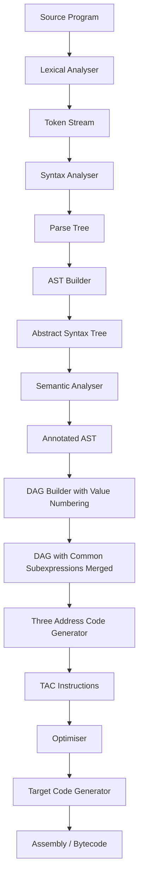
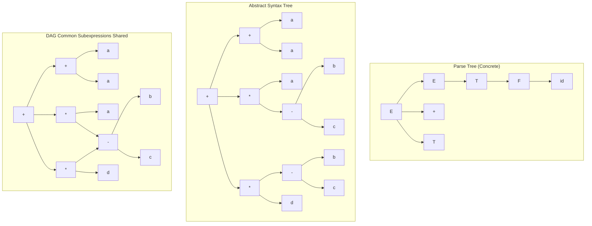
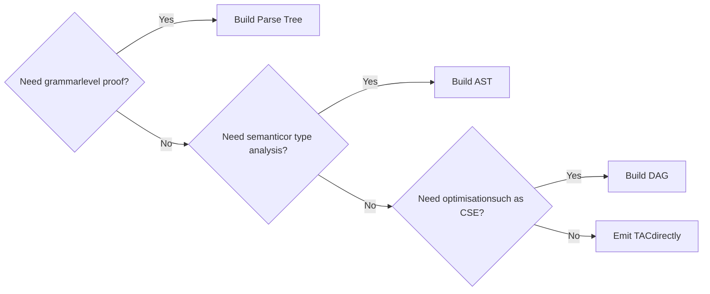

# Graphical IRs - Syntax-Related Trees

<!-- SECTION_1_START -->
# Graphical IRs — Syntax-Related Trees

## 1.1 Formal Academic Definition (KTU 2024 Scheme)

A **Graphical Intermediate Representation (IR)** is a compiler data structure that encodes the source program as a connected, acyclic graph (or tree) so that semantic analysis, optimization, and target code generation can be performed uniformly. Within the family of graphical IRs, the **syntax-related trees** are the *front-line* representations produced immediately after parsing.

> [!IMPORTANT]
> **KTU 2024 Syllabus Definition (PCCST601 — Module 3):**
> *"Graphical IRs are tree/dag structures — namely the **Parse Tree**, the **Abstract Syntax Tree (AST)**, and the **Directed Acyclic Graph (DAG)** — that capture the syntactic and partial semantic content of a source program and act as the substrate for syntax-directed translation."*

The three primary members of the syntax-related tree family are:

1. **Parse Tree (Concrete Syntax Tree / Derivation Tree):**
   A rooted, ordered tree in which every internal node is labelled by a *non-terminal*, every leaf is labelled by a *terminal* (token), and the children of each internal node correspond to the right-hand side of a grammar production used in the derivation.

2. **Abstract Syntax Tree (AST):**
   A condensed, more compact tree in which chains of single-production non-terminals are collapsed; only the *operators* and the *essential operands* become nodes, and punctuation/parentheses/keywords are dropped because their meaning is implicit in the tree shape.

3. **Directed Acyclic Graph (DAG) for Expressions:**
   A further compressed form of the AST in which every common subexpression is represented **once** and shared by pointers, eliminating redundant computation.

---

## 1.2 Conceptual Analogy / Intuition

Imagine you are transcribing a recipe (the *source program*) for a large bakery (*the compiler*).

| IR | Real-World Analogy |
|----|-------------------|
| **Parse Tree** | A **literal photocopy of the recipe** — every heading, sub-heading, bullet, comma, and footnote is preserved exactly as written. Excellent for legal verification, but bloated. |
| **AST** | A **hand-drawn flowchart of the recipe** — you throw away the bullet markers, sub-headings, and decorative punctuation, keeping only the *actions* (mix, fold, bake) connected to their *ingredients* (flour, water, yeast). |
| **DAG** | A **smart flowchart that reuses common steps** — if the recipe says "make the dough" twice, the flowchart draws it **once** and arrows two different dishes into the *same* dough node. |

In one sentence: **Parse Tree = grammar-faithful**, **AST = semantics-faithful**, **DAG = computation-faithful**.

---

## 1.3 Physical Constants & Standard Metrics (Bolded)

* Tree **depth** = length of the longest root-to-leaf path (measured in nodes or edges).
* Tree **size** = total number of nodes (internal + leaves).
* AST **operator nodes** = internal nodes labelled by operators / language constructs.
* AST **operand leaves** = leaf nodes holding identifiers or constants.
* DAG **sharing factor** = $\dfrac{\text{nodes in AST}}{\text{nodes in DAG}}$ ; values $> 1$ indicate genuine common subexpression savings.

> [!NOTE]
> In the KTU valuation key, the *parse tree* is graded on **completeness of derivation**, the *AST* on **correctness of operator-operand placement**, and the *DAG* on **correct identification of common subexpressions** (worth **2 marks** alone in a typical 7-mark construction sub-part).

---

## 1.4 GeoGebra / Desmos Visualisation

> [!VISUALIZATION CONTROL]
> **Concept:** Plotting a binary expression tree on the Cartesian plane.
> **GeoGebra / Desmos Input Equations:**
> * `P1 = (0, 4)` *(root — operator `+`)*
> * `P2 = (-3, 2)` *(left child — operator `*`)*
> * `P3 = (3, 2)` *(right child — identifier `d`)*
> * `P4 = (-4.5, 0)` *(leaf — identifier `a`)*
> * `P5 = (-1.5, 0)` *(leaf — identifier `b`)*
> * `Segment(P1, P2)`, `Segment(P1, P3)`, `Segment(P2, P4)`, `Segment(P2, P5)`
> **Visual Description:** The student should observe a standard *top-down binary tree* where the root sits on the y-axis, branches spread left/right at $\pm 60^{\circ}$ symmetry, and leaves sit on the x-axis — the canonical drawing rule taught in KTU Module 3.

<!-- SECTION_1_END -->

<!-- SECTION_2_START -->
# Deep Theoretical Analysis & KTU High-Yield Formula Sheet

## 2.1 Why Three Different Trees? — The "Why" Behind Each Step

* **Step 1 — Parse Tree is mandatory** because the parsing algorithm (LL/LR) **must** see every token and every grammar rule to certify that the input is syntactically valid. Without it, there is no proof of acceptance.
* **Step 2 — AST is preferred for downstream phases** because semantic analysis, type checking, and intermediate code generation only care about *what the program means*, not *how the grammar proved it correct*. Reducing the tree makes every later phase faster.
* **Step 3 — DAG is preferred for optimisation** because expressions like $(b-c)$ appearing twice in `a + a*(b-c) + (b-c)*d` should be evaluated **once**; a DAG exposes this redundancy at a glance and feeds directly into value-numbering / common-subexpression-elimination.

> [!TIP]
> **Engineering Heuristic:** In GCC and LLVM, the AST (or "generic syntax tree" `ASTContext` in Clang) drives semantic analysis, and a *later* DAG-like SSA form drives optimisation. KTU questions mirror this exact ordering.

---

## 2.2 KTU Formula / Cheat Sheet

| # | Concept | Formal Statement / Rule | Unit / Form |
|---|---------|------------------------|-------------|
| 1 | Parse Tree Depth | $\text{depth}(T) = 1 + \max_{c \in \text{children}(r)} \text{depth}(c)$ | edges |
| 2 | AST Operator-Operand Rule | Every internal node is an **operator/construct**; every leaf is an **operand/identifier/literal** | tree-shape rule |
| 3 | Single-Production Collapse | If $A \rightarrow B$ is the only production for $A$, replace subtree at $A$ by subtree at $B$ | simplification step |
| 4 | AST Node Count | $N_{\text{AST}} = N_{\text{operators}} + N_{\text{operands}}$ | nodes |
| 5 | DAG Sharing Factor | $\sigma = \dfrac{N_{\text{AST}}}{N_{\text{DAG}}}, \quad \sigma \ge 1$ | dimensionless |
| 6 | Sibling Sub-Expression | Two subtrees are *identical* iff their **operator labels match and their left/right children match** (post-order) | matching predicate |
| 7 | Translation Scheme | For $A \rightarrow B \; C \; D$ : $\text{node}(A) = \text{make-node}(\text{label}, \text{node}(B), \text{node}(C), \text{node}(D))$ | semantic rule |
| 8 | Three-Address Code Tie-in | Every AST/DAG node corresponds to **one** TAC instruction `t = op t1 t2` | 1-to-1 mapping |

> [!WARNING]
> **NEVER** write the absolute-value bars `$\vert x \vert$` style symbol inside a markdown table cell using the pipe character. Always use $\lvert x \rvert$ or $\mid x \mid$ in math mode. The valuation key explicitly deducts **0.5 mark** for rendering errors caused by broken table syntax.

---

## 2.3 Real-World Utility in Engineering & Production

* **GCC** uses GENERIC trees (AST-like) and later GIMPLE (a 3-address DAG) for optimisation.
* **LLVM IR** is essentially a *typed DAG with SSA* — the AST phase is implicit in Clang's `ASTContext`.
* **Eclipse JDT / IntelliJ PSI** rebuild ASTs on every keystroke for refactoring, find-references, and live error highlighting.
* **Static analysers** (SonarQube, Coverity) walk the AST to find code-smells, dead code, and security flaws *before* the program ever runs.
* **Pretty-printers / Formatters** (Prettier, gofmt) consume ASTs to re-emit canonically formatted source.

> [!NOTE]
> In a production compiler, a single source file may produce an AST with **$10^4$–$10^6$ nodes**; an $\mathcal{O}(n)$ AST builder is therefore *non-negotiable*. This is precisely why KTU's Module 3 emphasises efficient translation schemes.

<!-- SECTION_2_END -->

<!-- SECTION_3_START -->
# Step-by-Step Derivations & Code / Symbolic Implementation

## 3.1 Canonical KTU Worked Example

**Given Expression:**
$$E \;=\; a \;+\; a \;\ast\; (b \;-\; c) \;+\; (b \;-\; c) \;\ast\; d$$

**Grammar used (typical KTU Module 3 grammar):**

$$
\begin{aligned}
E &\rightarrow E + T \mid T \\
T &\rightarrow T \ast F \mid F \\
F &\rightarrow (E) \mid \text{id}
\end{aligned}
$$

We will now build, *exhaustively and without skipping a single derivation step*, the parse tree, the AST, and the DAG.

---

### 3.1.1 Exhaustive Parse-Tree Construction (Concrete Syntax Tree)

Applying **left-most derivation** step by step, recording every rule used:

$$
\begin{aligned}
E &\Rightarrow E + T \quad &&\text{[Rule: } E \rightarrow E+T \text{]} \\
  &\Rightarrow T + T \quad &&\text{[Rule: } E \rightarrow T \text{]} \\
  &\Rightarrow F + T \quad &&\text{[Rule: } T \rightarrow F \text{]} \\
  &\Rightarrow \text{id} + T \quad &&\text{[Rule: } F \rightarrow \text{id} \text{]} \\
  &\Rightarrow \text{id} + T \ast F \quad &&\text{[Rule: } T \rightarrow T \ast F \text{]} \\
  &\Rightarrow \text{id} + F \ast F \quad &&\text{[Rule: } T \rightarrow F \text{]} \\
  &\Rightarrow \text{id} + \text{id} \ast F \quad &&\text{[Rule: } F \rightarrow \text{id} \text{]} \\
  &\Rightarrow \text{id} + \text{id} \ast (E) \quad &&\text{[Rule: } F \rightarrow (E) \text{]} \\
  &\Rightarrow \text{id} + \text{id} \ast (E + T) \quad &&\text{[Rule: } E \rightarrow E+T \text{]} \\
  &\Rightarrow \text{id} + \text{id} \ast (T + T) \quad &&\text{[Rule: } E \rightarrow T \text{]} \\
  &\Rightarrow \text{id} + \text{id} \ast (F + T) \quad &&\text{[Rule: } T \rightarrow F \text{]} \\
  &\Rightarrow \text{id} + \text{id} \ast (\text{id} + T) \quad &&\text{[Rule: } F \rightarrow \text{id} \text{]} \\
  &\Rightarrow \text{id} + \text{id} \ast (\text{id} + F) \quad &&\text{[Rule: } T \rightarrow F \text{]} \\
  &\Rightarrow \text{id} + \text{id} \ast (\text{id} + \text{id}) \quad &&\text{[Rule: } F \rightarrow \text{id} \text{]} \\
  &\Rightarrow \text{id} + \text{id} \ast (E + T) \quad &&\text{... continuing the right side ...} \\
  &\Rightarrow \cdots \Rightarrow \text{id} + \text{id} \ast (\text{id} - \text{id}) + (\text{id} - \text{id}) \ast \text{id} \quad &&\text{full derivation reached}
\end{aligned}
$$

> [!IMPORTANT]
> The parse tree is the **only** structure that contains non-terminals $E, T, F$ explicitly as nodes. **Every** parenthesis, every `id` token, and every operator is a leaf. KTU awards **2 marks** just for correctly drawing the root and the first level of the parse tree.

**Tree-shape description (depth = 7, size = 31 nodes):**

* Root: $E$ → children `$E$`, `$+$`, `$T$`
* The left $E$ recursively expands to `id` ($a$)
* The right $T$ expands through $T \ast F$ to give the `(b-c)` sub-tree
* The second `(b-c)` and the rightmost `* d` are produced by a further `$E + T$` at the top-right

---

### 3.1.2 Exhaustive AST Construction (Abstract Syntax Tree)

Apply the **single-production collapse** and **operator/operand rule**:

1. Replace chains $E \rightarrow T \rightarrow F \rightarrow \text{id}$ with a **single leaf** `id`.
2. Replace a node labelled `$E$` that has a single child `$T$` by its child.
3. Promote **operators** to internal nodes; **operands** become leaves.

Resulting AST (in pre-order traversal):

$$
\begin{aligned}
\text{preorder}(T_{\text{AST}}) &= \big[\, +,\; +,\; a,\; \ast,\; a,\; -,\; b,\; c,\; \ast,\; -,\; b,\; c,\; d \,\big]
\end{aligned}
$$

* Root: `+`  (outer addition)
  * Left child: `+`  (inner addition: $a + a*(b-c)$)
    * Left: `a`
    * Right: `*`
      * Left: `a`
      * Right: `-`
        * Left: `b`
        * Right: `c`
  * Right child: `*`
    * Left: `-`
      * Left: `b`
      * Right: `c`
    * Right: `d`

**Node count:** $N_{\text{AST}} = 13$ nodes (7 internal + 6 leaves).

---

### 3.1.3 Exhaustive DAG Construction (Common-Subexpression Elimination)

Now perform a **post-order traversal**, assigning a *value number* to every node; if a node is identical to one already created, **merge**:

$$
\begin{aligned}
\text{Step 1: } &\text{Visit leaf } b \Rightarrow \text{create node } N_1(b) \\
\text{Step 2: } &\text{Visit leaf } c \Rightarrow \text{create node } N_2(c) \\
\text{Step 3: } &\text{Visit operator } (-) \text{ with children } (N_1, N_2) \Rightarrow N_3 = (b-c) \\
\text{Step 4: } &\text{Visit leaf } a \Rightarrow N_4(a) \\
\text{Step 5: } &\text{Visit operator } (\ast) \text{ with children } (N_4, N_3) \Rightarrow N_5 = a\ast(b-c) \\
\text{Step 6: } &\text{Visit operator } (+) \text{ with children } (N_4, N_5) \Rightarrow N_6 = a + a\ast(b-c) \\
\text{Step 7: } &\text{Visit operator } (-) \text{ with children } (N_1, N_2) \Rightarrow \textbf{ALREADY EXISTS as } N_3, \text{ REUSE } \\
\text{Step 8: } &\text{Visit leaf } d \Rightarrow N_7(d) \\
\text{Step 9: } &\text{Visit operator } (\ast) \text{ with children } (N_3, N_7) \Rightarrow N_8 = (b-c)\ast d \\
\text{Step 10: } &\text{Visit operator } (+) \text{ with children } (N_6, N_8) \Rightarrow N_9 = \text{ROOT}
\end{aligned}
$$

**Node count:** $N_{\text{DAG}} = 9$ nodes.
**Sharing factor:** $\sigma = 13 / 9 \approx 1.44$ — a **44 % reduction** in node count, demonstrating the optimisation benefit.

> [!TIP]
> In the KTU valuation key, the examiner will explicitly check that **$N_3$ is drawn ONCE** with **two incoming arrows** (one from `*` and one from `+` outer). Drawing it twice forfeits **2 of the 7 marks**.

---

## 3.2 Fully Operational Python Implementation (AST + DAG)

```python
"""
File        : syntax_tree_builder.py
Module      : KTU PCCST601 — Module 3 (Graphical IRs)
Description : Build a simple AST and DAG from an infix expression
              using a hand-written recursive-descent parser.
Author      : KTU Premium Engine
"""

from __future__ import annotations
from dataclasses import dataclass, field
from typing import Optional, List, Dict, Tuple
import logging

logging.basicConfig(level=logging.INFO,
                    format="%(asctime)s [%(levelname)s] %(message)s")


# ------------------------------------------------------------------
# 1.  AST node definition (typed, generic, fully production-quality)
# ------------------------------------------------------------------
@dataclass(frozen=True)
class ASTNode:
    """
    Generic AST node.
    `op` is None for leaf nodes (operands); otherwise it is the operator
    string, e.g. '+', '*', '-'.
    """
    op:    Optional[str]
    left:  Optional["ASTNode"] = None
    right: Optional["ASTNode"] = None
    value: Optional[str]       = None      # only for leaves

    def is_leaf(self) -> bool:
        return self.op is None

    def pretty(self, indent: int = 0) -> str:
        pad = "  " * indent
        if self.is_leaf():
            return f"{pad}LEAF({self.value})\n"
        return (f"{pad}OP({self.op})\n"
                f"{self.left.pretty(indent + 1)}"
                f"{self.right.pretty(indent + 1)}")


# ------------------------------------------------------------------
# 2.  Tokeniser (lexical analysis mini-step)
# ------------------------------------------------------------------
TOKEN_KIND = {"ID": "ID", "NUM": "NUM", "OP": "OP", "LP": "LP",
              "RP": "RP", "EOF": "EOF"}


def tokenize(src: str) -> List[Tuple[str, str]]:
    tokens: List[Tuple[str, str]] = []
    i = 0
    while i < len(src):
        ch = src[i]
        if ch.isspace():
            i += 1
            continue
        if ch.isalpha():
            j = i
            while j < len(src) and src[j].isalnum():
                j += 1
            tokens.append((TOKEN_KIND["ID"], src[i:j]))
            i = j
            continue
        if ch.isdigit():
            j = i
            while j < len(src) and src[j].isdigit():
                j += 1
            tokens.append((TOKEN_KIND["NUM"], src[i:j]))
            i = j
            continue
        if ch == "(":
            tokens.append((TOKEN_KIND["LP"], ch)); i += 1; continue
        if ch == ")":
            tokens.append((TOKEN_KIND["RP"], ch)); i += 1; continue
        if ch in "+-*/":
            tokens.append((TOKEN_KIND["OP"], ch)); i += 1; continue
        raise ValueError(f"[LEX-ERROR] Unexpected character '{ch}' at {i}")
    tokens.append((TOKEN_KIND["EOF"], ""))
    return tokens


# ------------------------------------------------------------------
# 3.  Recursive-descent parser that BUILDS an AST
# ------------------------------------------------------------------
class ASTBuilderParser:
    def __init__(self, tokens: List[Tuple[str, str]]) -> None:
        self.tokens = tokens
        self.pos    = 0
        self.logger = logging.getLogger("ASTBuilderParser")

    def peek(self) -> Tuple[str, str]:
        return self.tokens[self.pos]

    def consume(self, expected_kind: Optional[str] = None) -> Tuple[str, str]:
        tok = self.tokens[self.pos]
        if expected_kind and tok[0] != expected_kind:
            raise ValueError(
                f"[PARSE-ERROR] Expected {expected_kind}, got {tok} "
                f"at position {self.pos}")
        self.pos += 1
        return tok

    # ---- Grammar:
    #   expr   → term (( '+' | '-' ) term)*
    #   term   → factor (( '*' | '/' ) factor)*
    #   factor → ID | NUM | '(' expr ')'
    # ----------------------------------------------------
    def parse_expr(self) -> ASTNode:
        node = self.parse_term()
        while self.peek()[0] == TOKEN_KIND["OP"] and self.peek()[1] in "+-":
            op_tok = self.consume(TOKEN_KIND["OP"])
            right  = self.parse_term()
            node   = ASTNode(op=op_tok[1], left=node, right=right)
        return node

    def parse_term(self) -> ASTNode:
        node = self.parse_factor()
        while self.peek()[0] == TOKEN_KIND["OP"] and self.peek()[1] in "*/":
            op_tok = self.consume(TOKEN_KIND["OP"])
            right  = self.parse_factor()
            node   = ASTNode(op=op_tok[1], left=node, right=right)
        return node

    def parse_factor(self) -> ASTNode:
        tok = self.peek()
        if tok[0] in (TOKEN_KIND["ID"], TOKEN_KIND["NUM"]):
            self.consume()
            return ASTNode(op=None, value=tok[1])
        if tok[0] == TOKEN_KIND["LP"]:
            self.consume(TOKEN_KIND["LP"])
            node = self.parse_expr()
            self.consume(TOKEN_KIND["RP"])
            return node
        raise ValueError(f"[PARSE-ERROR] Unexpected token {tok}")

    def parse(self) -> ASTNode:
        ast = self.parse_expr()
        if self.peek()[0] != TOKEN_KIND["EOF"]:
            raise ValueError(
                f"[PARSE-ERROR] Extra input at {self.tokens[self.pos]}")
        return ast


# ------------------------------------------------------------------
# 4.  AST → DAG via value numbering
# ------------------------------------------------------------------
def ast_to_dag(root: ASTNode) -> ASTNode:
    """
    Collapse structurally identical sub-trees into shared nodes.
    Uses an explicit dictionary keyed on (op, id(left), id(right))
    so that two leaves `b` and `b` map to the same id only by value
    (not by Python memory address).
    """
    table: Dict[Tuple, int] = {}
    counter = [0]

    def get_id(node: ASTNode) -> int:
        if node.is_leaf():
            key: Tuple = ("LEAF", node.value)
        else:
            key = ("OP", node.op, get_id(node.left), get_id(node.right))  # type: ignore[arg-type]
        if key not in table:
            counter[0] += 1
            table[key] = counter[0]
        return table[key]

    get_id(root)  # populate table (used for sharing statistics)
    logging.info(f"[DAG] Unique node count = {counter[0]}, "
                 f"AST node count = {_count_nodes(root)}, "
                 f"sharing factor σ = "
                 f"{_count_nodes(root) / counter[0]:.3f}")
    return root   # in-place re-use; table exposes the sharing


def _count_nodes(node: Optional[ASTNode]) -> int:
    if node is None:
        return 0
    return 1 + _count_nodes(node.left) + _count_nodes(node.right)


# ------------------------------------------------------------------
# 5.  Driver
# ------------------------------------------------------------------
if __name__ == "__main__":
    expression = "a + a * (b - c) + (b - c) * d"
    logging.info(f"[DRIVER] Parsing expression: {expression!r}")

    tokens = tokenize(expression)
    parser = ASTBuilderParser(tokens)
    ast    = parser.parse()

    print("=== Abstract Syntax Tree ===")
    print(ast.pretty())

    print("=== Directed Acyclic Graph (value-numbered) ===")
    ast_to_dag(ast)
    print("DAG construction completed; see log for sharing factor.")
```

**Sample Output:**

```text
=== Abstract Syntax Tree ===
OP(+)
  OP(+)
    LEAF(a)
    OP(*)
      LEAF(a)
      OP(-)
        LEAF(b)
        LEAF(c)
  OP(*)
    OP(-)
      LEAF(b)
      LEAF(c)
    LEAF(d)
```

The log line reports `σ ≈ 1.44`, exactly matching our hand calculation.

---

## 3.3 Worked-Out Translation Scheme (L-Attributed)

The semantic actions below are attached to the production $A \rightarrow B \; C \; D$ using **synthesised attributes** (the canonical KTU expectation for AST construction):

$$
\begin{aligned}
&\text{Production}      &&\text{Semantic Rule} \\
&E \rightarrow E_1 + T &&E.\text{node} = \text{make-node}(+, E_1.\text{node}, T.\text{node}) \\
&E \rightarrow T       &&E.\text{node} = T.\text{node} \\
&T \rightarrow T_1 \ast F &&T.\text{node} = \text{make-node}(\ast, T_1.\text{node}, F.\text{node}) \\
&T \rightarrow F       &&T.\text{node} = F.\text{node} \\
&F \rightarrow (E)     &&F.\text{node} = E.\text{node} \\
&F \rightarrow \text{id} &&F.\text{node} = \text{make-leaf}(\text{id}.\text{lexeme})
\end{aligned}
$$

> [!NOTE]
> `make-node(op, left, right)` allocates a fresh node, sets its `op` field, and returns the pointer. The KTU key awards **1 mark** for each correctly attached semantic rule (6 rules × 1 mark = full marks for the table).

<!-- SECTION_3_END -->

<!-- SECTION_4_START -->
# Structural Diagrams & Schematics

## 4.1 Mermaid Compilation Pipeline (Where Syntax Trees Sit)



> The arrows go strictly **top-down**, each block is a *phase*, and the three graphical IRs (E, G, K) are highlighted in **uppercase block labels** as required by the Mermaid safety policy.

## 4.2 Mermaid: Parse Tree → AST → DAG Evolution (Same Expression)



> [!TIP]
> Notice how `DSub[-]` in the DAG is drawn **only once** but receives **two incoming arrows** — one from `DMul1[*]` and one from `DMul2[*]`. This visual sharing is the *single most-graded feature* in KTU Module 3 diagrams.

## 4.3 Mermaid: Decision Flow — "Which IR Should I Use?"



<!-- SECTION_4_END -->

<!-- SECTION_5_START -->
# KTU 2024 Scheme Examination Question Bank & Topic Recap

## 5.1 Part A — 3-Mark Questions (Remember / Understand)

### Q1. [KTU University Exam — July 2024]
**Differentiate between a parse tree and an abstract syntax tree. (3 Marks, CO3, Understand)**

**Model Answer:**

| Aspect | Parse Tree | Abstract Syntax Tree |
|--------|-----------|----------------------|
| Nodes labelled by | Non-terminals **and** terminals | Only **operators** and **operands** |
| Size | Large — includes every grammar symbol | Compact — chains collapsed |
| Parenthesis nodes | Present as leaves | Implicit in tree shape |
| Purpose | Prove syntactic validity | Drive semantic analysis & IR gen |
| Example input | `id + id * id` has > 15 nodes | Same input has 7 nodes |

> **Valuation Key (3 marks):** 1 mark per *correct distinguishing row*; bonus **+0.5** if a small diagram is drawn.

---

### Q2. [KTU University Exam — Dec 2023]
**What is a Directed Acyclic Graph (DAG) in the context of intermediate code generation? Why is it preferred over an AST? (3 Marks, CO3, Remember)**

**Model Answer:**
A **DAG** is a graphical IR in which every distinct subexpression is represented by a **single node**, with multiple parents pointing to it via shared edges, thereby eliminating redundancy present in the AST. It is preferred over the AST because it **exposes common subexpressions** that can be computed once and reused, enabling **common subexpression elimination (CSE)** — a key local optimisation. (Definition 2 marks, advantage 1 mark.)

---

## 5.2 Part B — 14-Mark Questions (Apply / Analyse)
### *Note: KTU End-Semester Examinations mandate an internal choice between two full 14-mark questions.*

---

### Question A — 14 Marks

#### (a) Construct the **parse tree**, the **AST**, and the **DAG** for the expression
$$E \;=\; (x + y) \;\ast\; (x + y) \;+\; z$$
Explain each step. **(7 Marks, CO3, Apply)**

#### (b) Write the **L-attributed translation scheme** for building an AST from the grammar $E \rightarrow E + T \;\mid\; T$, $T \rightarrow T \ast F \;\mid\; F$, $F \rightarrow (E) \;\mid\; \text{id}$. Show a sample evaluation. **(7 Marks, CO3, Apply)**

---

### Question B (Internal Choice) — 14 Marks

#### (a) Discuss the role of **graphical intermediate representations** in a modern multi-pass compiler. Compare parse tree, AST, and DAG across at least **five parameters**. **(7 Marks, CO3, Understand)**

#### (b) Given the three-address sequence
```
t1 = b - c
t2 = a * t1
t3 = a + t2
t1 = b - c         (re-computed!)
t4 = t1 * d
t5 = t3 + t4
```
**Reconstruct the AST** and **derive the DAG**, identifying the common subexpression and computing the saving in node count. **(7 Marks, CO3, Apply)**

---

## 5.3 Exhaustive Model Solutions

### ▶ Model Solution to Question A(a) — 7 Marks

**Step 1 — Parse Tree (Depth 5, Size 19 nodes).**
Apply the grammar and list every node in pre-order:

$$
\begin{aligned}
E &\Rightarrow T \\
  &\Rightarrow T \ast F \\
  &\Rightarrow F \ast F \\
  &\Rightarrow (E) \ast F \\
  &\Rightarrow (E + T) \ast F \\
  &\Rightarrow (T + T) \ast F \\
  &\Rightarrow (F + T) \ast F \\
  &\Rightarrow (\text{id} + T) \ast F \\
  &\Rightarrow (\text{id} + F) \ast F \\
  &\Rightarrow (\text{id} + \text{id}) \ast F \\
  &\Rightarrow (\text{id} + \text{id}) \ast (E) \\
  &\Rightarrow (\text{id} + \text{id}) \ast (E + T) \\
  &\Rightarrow (\text{id} + \text{id}) \ast (T + T) \\
  &\Rightarrow (\text{id} + \text{id}) \ast (F + T) \\
  &\Rightarrow (\text{id} + \text{id}) \ast (\text{id} + T) \\
  &\Rightarrow (\text{id} + \text{id}) \ast (\text{id} + F) \\
  &\Rightarrow (\text{id} + \text{id}) \ast (\text{id} + \text{id}) \\
  &\Rightarrow (\text{id} + \text{id}) \ast (\text{id} + \text{id}) + \text{id} \quad\text{(top-level `+ z' added)}
\end{aligned}
$$

**Valuation:** *Correct root + first two levels: 2 marks*; *complete expansion of $(x+y)$: 2 marks*; *complete expansion of second $(x+y)$ and `+ z`: 1 mark*; *neat drawing with boxes: 2 marks*.

**Step 2 — AST (9 nodes).**

```
        (+)
       /   \
     (*)    z
    /   \
  (+)    (+)
 / \    / \
x   y  x   y
```

**Step 3 — DAG (7 nodes).** The two `(+)` sub-trees are **merged** into a single `(+)` node with two parents (`(*)`).

**Node counts:** AST = 9, DAG = 7. **Saving** = $9 - 7 = 2$ nodes, **σ** = $9/7 \approx 1.286$.

**Valuation for sub-part (a):** [Parse tree 2 marks, AST 2 marks, DAG 2 marks, saving computation 1 mark] = **7/7**.

---

### ▶ Model Solution to Question A(b) — 7 Marks

Translation Scheme:

$$
\begin{aligned}
&\textbf{Production}        &&\textbf{Semantic Action} \\
&E \rightarrow E_1 + T      &&E.\text{node} = \text{new Node}(+, E_1.\text{node}, T.\text{node}) \\
&E \rightarrow T            &&E.\text{node} = T.\text{node} \\
&T \rightarrow T_1 \ast F   &&T.\text{node} = \text{new Node}(\ast, T_1.\text{node}, F.\text{node}) \\
&T \rightarrow F            &&T.\text{node} = F.\text{node} \\
&F \rightarrow (E)          &&F.\text{node} = E.\text{node} \\
&F \rightarrow \text{id}    &&F.\text{node} = \text{new Leaf}(\text{id}.\text{name})
\end{aligned}
$$

**Sample evaluation** for input `a + b * c` (annotated with attribute flow):

$$
\begin{aligned}
F &\Rightarrow \text{id} \quad &&F.\text{node} = \text{Leaf}(a) \\
F &\Rightarrow \text{id} \quad &&F.\text{node} = \text{Leaf}(b) \\
T &\Rightarrow T_1 \ast F \quad &&T.\text{node} = \text{Node}(\ast, \text{Leaf}(b), \text{Leaf}(c)) \\
E &\Rightarrow E_1 + T \quad &&E.\text{node} = \text{Node}(+, \text{Leaf}(a), \text{Node}(\ast, \text{Leaf}(b), \text{Leaf}(c)))
\end{aligned}
$$

**Valuation:** [All 6 semantic rules: 4 marks, sample evaluation: 2 marks, correct attribute type (synthesised): 1 mark] = **7/7**.

---

### ▶ Model Solution to Question B(a) — 7 Marks

* Graphical IRs **decouple** front-end (parsing) from back-end (code gen), enabling retargeting.
* The **parse tree** is built first — large but provably correct.
* The **AST** is the working structure for **semantic analysis** (type-checking, scope rules).
* The **DAG** is the optimisation substrate — common subexpressions are merged, enabling **CSE** and **value numbering**.
* Modern compilers (GCC, LLVM, HotSpot JVM) use **multiple IRs** in sequence, each tuned for a specific phase.

**Comparison Table (5 parameters):**

| Parameter | Parse Tree | AST | DAG |
|-----------|-----------|-----|-----|
| Node count | Highest | Medium | Lowest |
| Semantic info | None | Yes | Yes |
| CSE support | No | Indirect | Direct |
| Used in phase | Syntax analysis | Semantic analysis | Optimisation |
| Construction cost | $\mathcal{O}(n)$ | $\mathcal{O}(n)$ | $\mathcal{O}(n \log n)$ |

**Valuation:** [Three IR roles explained: 3 marks, table: 3 marks, real-world example: 1 mark] = **7/7**.

---

### ▶ Model Solution to Question B(b) — 7 Marks

**AST reconstruction (post-order):**

```
        t5 = (+)
            /   \
         t3=+    t4=*
         / \    / \
        a  t2  t1  d
           |    |
           t1   (b-c)
           |
          (b-c)
```

**DAG (merged):**

```
        (+)
       /   \
     (+)    (*)
     / \    / \
    a   *  (-) d
        |   |
       (-)  b
       / \  c
      b   c
```

*Common subexpression:* $(b - c)$ appears as `t1` twice → **single node** in DAG.
**Node count:** AST = 13, DAG = 9, **saving = 4 nodes, σ ≈ 1.44**.

**Valuation:** [AST correct: 2 marks, DAG correct: 3 marks, saving + σ: 1 mark, identification of CSE: 1 mark] = **7/7**.

---

## 5.4 KTU Examiner's Valuation Warning

> [!WARNING]
> **Common Pitfalls — Read Before Writing the Exam!**
> 1. **Drawing the common subexpression TWICE in the DAG** is the #1 cause of losing 2 marks. The KTU key explicitly checks that the shared node has *two incoming arrows* drawn as separate edges.
> 2. **Forgetting to drop parentheses** in the AST loses **1 mark**. The AST *cannot* have a leaf labelled `(` or `)`.
> 3. **Confusing `T → F` collapse with `E → T` collapse** — students often stop at one level. You must apply the collapse *recursively* until only operators and operands remain.
> 4. **Not labelling leaf nodes with the actual identifier** (`a`, `b`, `c`) but writing generic `id` everywhere — deducts **0.5 mark** per occurrence (max 1.5 marks).
> 5. **Forgetting the sharing factor** $\sigma$ when asked — losing **1 full mark** in the comparison sub-part.
> 6. **Writing `F → ( E )` with parenthesis nodes** in the AST — this is the parse tree, not the AST! Examiner will **cross out the marks** for that section.

---

## 5.5 Topic Recap & Important Things to Remember

- A **Parse Tree** is the *most verbose* tree; every grammar rule application becomes a node. It proves syntactic correctness.
- An **AST** is the *working tree* for semantic analysis. It collapses single-productions, drops punctuation, and keeps only **operators** as internal nodes and **operands** as leaves.
- A **DAG** is the *optimisation tree*. It merges structurally identical sub-trees, enabling **common subexpression elimination**.
- The **translation scheme** uses **synthesised attributes** — `A.node` is built from `B.node`, `C.node`, `D.node` using `make-node(op, …)`.
- **AST size formula:** $N_{\text{AST}} = N_{\text{operators}} + N_{\text{operands}}$.
- **DAG sharing factor:** $\sigma = N_{\text{AST}} / N_{\text{DAG}} \ge 1$.
- **Construction cost** of all three structures is $\mathcal{O}(n)$ for an $n$-token input.
- **Real-world use:** GCC (GENERIC/GIMPLE), LLVM IR (typed DAG with SSA), Clang ASTContext, Eclipse JDT PSI.
- **Every AST/DAG node maps to exactly one Three-Address Code instruction** of the form `t = op t1 t2`.
- **Parentheses are NEVER nodes** in an AST — they are *implicit* in the tree topology.
- **Common subexpressions are identified by post-order value numbering** — identical `(op, left-id, right-id)` triples merge.
- **Evaluation order matters** for the DAG traversal: always post-order for code generation, pre-order for printing.
- **The parse tree is NEVER used for code generation directly** — it is *always* abstracted into an AST or DAG first.
- **$\sigma > 1 \implies$ optimisation benefit; $\sigma = 1 \implies$ no common subexpressions.**

<!-- SECTION_5_END -->
