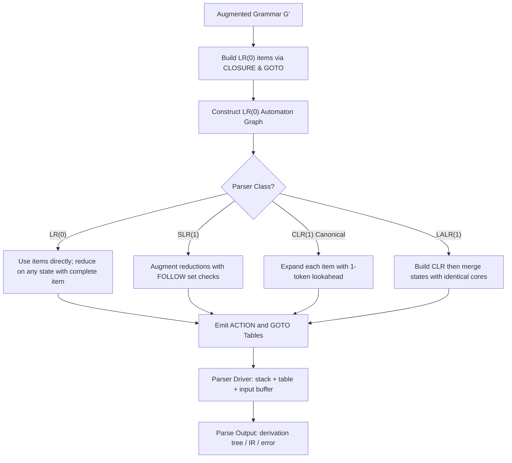
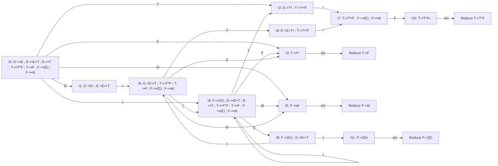
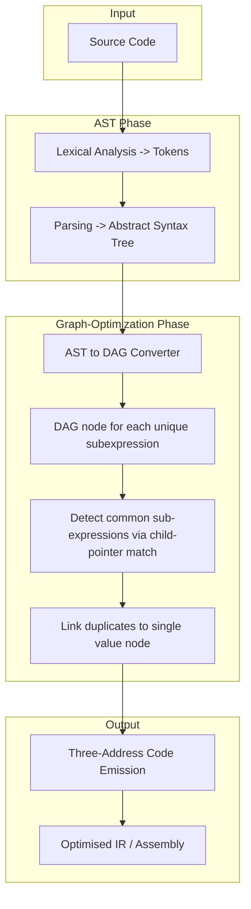
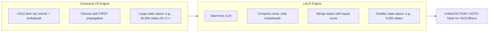

# Graphs

<!-- SECTION_1_START -->
# Graphs in Bottom-Up Parsing — Core Technical Definition & Intuitive Overview

## 1.1 What are "Graphs" in the Context of Bottom-Up Parsing?

In the KTU 2024 Scheme syllabus for **Compiler Design (PCCST601)**, the term **"Graphs"** within Module 3 (Bottom-Up Parsing) refers to the **Finite State Automaton (FSA)** — represented as a directed graph — that drives the **LR family of parsers** (LR(0), SLR, CLR, LALR), along with the **Directed Acyclic Graph (DAG)** used in intermediate code generation and optimization.

> [!IMPORTANT]
> **KTU Syllabus Definition:** A *parser graph* is a deterministic finite automaton (DFA) whose **nodes** are *sets of LR(k) items* and whose **edges** are labelled by *grammar symbols*; the goto/closure functions define the transitions. A *DAG* is a directed graph with no cycles used to represent expressions compactly for code optimization.

## 1.2 Conceptual Analogy — The Subway Map of a Compiler

Imagine a city subway map:

- **Stations (Nodes)** = collections of partially recognized grammar rules called *LR items* (e.g., `E → E • + T`).
- **Tracks (Edges)** = movements triggered when the parser sees a *terminal* or *non-terminal* symbol.
- **The Traveller (Parser)** = rides the train (reads tokens), exits at "Reduce" stations, and pushes symbols onto the stack.

The *map* itself (the **graph**) is built *once* at compiler-construction time and consulted *every time* a program is parsed — just like a real subway map.

> [!NOTE]
> The **LR(0) Automaton** is the simplest such graph. The **SLR** augments it with *FOLLOW* sets. The **CLR** enriches each item with a *1-token lookahead*. The **LALR** merges equivalent CLR states to shrink the graph to a practical size used by **YACC / Bison**.

## 1.3 Standard Constants & Metrics

- **Stack alphabet size** for an LR parser: grows as $\mathcal{O}(n)$ where $n$ is the input length.
- **Number of LR(0) states** for a grammar $G$: empirically $\mathcal{O}(\vert P \vert \cdot \vert N \vert)$ where $\vert P \vert$ is productions and $\vert N \vert$ non-terminals.
- **Standard tool that consumes an LALR graph**: **GNU Bison**, **YACC**, **Cup**.

> [!VISUALIZATION CONTROL]
> **Concept:** LR(0) Automaton as a directed labeled graph
> **GeoGebra / Desmos Input Equations:**
> * Plot nodes $I_0, I_1, I_2, \dots$ at arbitrary integer coordinates: $(0,0), (3,2), (6,0), (3,-2)$
> * Label directed edges with the triggering symbol: e.g., edge $I_0 \xrightarrow{E} I_1$, edge $I_0 \xrightarrow{id} I_2$
> **Visual Description:** A **bubble-and-arrow diagram** in which every bubble holds a set of dotted productions and every arrow carries exactly one grammar symbol. The shape often resembles a "star" with $I_0$ at the centre.

## 1.4 Two Kinds of Graphs in the Module

| Graph Type | Used By | Cycle-Free? | Lookahead |
|---|---|---|---|
| **LR(0) Automaton (DFA)** | LR(0), SLR parsers | **Yes** (DFA) | None (LR(0)); FOLLOW for SLR |
| **LR(1) Automaton (Canonical LR)** | CLR parser | **Yes** (DFA) | 1 token |
| **LALR Automaton (merged cores)** | LALR parser, YACC | **Yes** (DFA) | 1 token (merged) |
| **DAG (Directed Acyclic Graph)** | Code optimization phase | **Yes** (acyclic) | N/A |

---

> [!TIP]
> **KTU Favourite Mnemonic:** *"LR parsing = Graph + Table + Stack."* If you can build the **graph**, the table follows mechanically; if you can read the **table**, the parse is just a table lookup.

<!-- SECTION_1_END -->

<!-- SECTION_2_START -->
# Deep Theoretical Analysis & KTU High-Yield Formula Sheet

## 2.1 The LR(0) Item — The Atom of the Graph

An **LR(0) item** (often just "item") is a production of the grammar with a distinguished position marker **•** on the right-hand side.

$$
\text{Production } A \rightarrow X_1 X_2 \dots X_n \quad \text{yields } n+1 \text{ items: } A \rightarrow \bullet X_1 X_2 \dots X_n, \; A \rightarrow X_1 \bullet X_2 \dots X_n, \; \dots, \; A \rightarrow X_1 X_2 \dots X_n \bullet
$$

- The dot **•** indicates how much of the RHS has already been seen.
- An item with **•** at the end (e.g., $A \rightarrow \alpha \bullet$) is a **complete item** — eligible for *reduction*.

## 2.2 Two Operations that Build the Graph

### Operation 1: `CLOSURE(I)`
Given a set of items $I$:

1. Add every item in $I$ to `CLOSURE(I)`.
2. If $A \rightarrow \alpha \bullet B \beta$ is in `CLOSURE(I)` and $B \rightarrow \gamma$ is a production, then add the item $B \rightarrow \bullet \gamma$ to `CLOSURE(I)`.
3. Repeat step 2 until no new items can be added.

**Why?** Because seeing $\alpha$ on the stack could also be the start of any production for $B$; we must be ready to recognize any of them.

### Operation 2: `GOTO(I, X)`
$$
\text{GOTO}(I, X) = \text{CLOSURE}\bigl(\{ A \rightarrow \alpha X \bullet \beta \mid A \rightarrow \alpha \bullet X \beta \in I \}\bigr)
$$

- Moves the dot past the symbol $X$ in every applicable item, then takes closure.

## 2.3 The LR(0) Automaton Construction Algorithm

```
1. Augment grammar G with new start production S' → S
2. C = { CLOSURE({ S' → •S }) }     # initial state
3. repeat
       for each state I in C
           for each grammar symbol X
               if GOTO(I, X) is non-empty and not in C
                   add GOTO(I, X) to C
   until no new states added
4. For each added GOTO(I, X) = J, add edge I ──X──► J
```

The result is a **directed graph** (DFA) with nodes = item sets, edges = goto transitions.

## 2.4 SLR, CLR, LALR — How Each One Refines the Graph

| Parser | Item Form | Reduction Rule | Graph Size |
|---|---|---|---|
| **LR(0)** | $A \rightarrow \alpha \bullet$ | Reduce $A \rightarrow \alpha$ regardless of lookahead | Smallest |
| **SLR(1)** | $A \rightarrow \alpha \bullet$ | Reduce only if next input token $a \in \text{FOLLOW}(A)$ | Same as LR(0) |
| **CLR(1)** (Canonical) | $[A \rightarrow \alpha \bullet, \, a]$ where $a$ is a terminal or $    $ | Reduce $A \rightarrow \alpha$ on lookahead $a$ | Largest (10× LR(0)) |
| **LALR(1)** | Same as CLR but **merge** states with identical *cores* | Same as CLR after merging | Same as LR(0) |

> [!NOTE]
> **Core of an LR(1) item** = the LR(0) part (i.e., the dotted production *without* the lookahead). LALR merges two states iff their cores are identical.

## 2.5 The Parsing Table Derived from the Graph

For each state $I_i$ and each terminal $a$ / non-terminal $A$:

$$
\text{ACTION}[i, a] = \begin{cases}
\text{shift } j & \text{if } I_i \xrightarrow{a} I_j \text{ and } a \text{ is a terminal} \\[4pt]
\text{reduce by } A \rightarrow \alpha & \text{if } A \rightarrow \alpha \bullet \in I_i \text{ and the parser's reduction rule fires} \\[4pt]
\text{accept} & \text{if } S' \rightarrow S \bullet \in I_i \text{ and } a = \$ \\[4pt]
\text{error} & \text{otherwise}
\end{cases}
$$

$$
\text{GOTO}[i, A] = j \quad \text{if } I_i \xrightarrow{A} I_j
$$

> [!WARNING]
> **Conflict Cell** in the table = the grammar is **not** in the corresponding LR class. A *shift/reduce* conflict means the graph alone is insufficient; *reduce/reduce* means the lookahead cannot disambiguate.

## 2.6 KTU Formula Sheet / Cheat Sheet

| # | Concept | Formula / Rule | Notes |
|---|---|---|---|
| 1 | **Number of items per production** | $\text{len}(RHS) + 1$ | e.g., $A \rightarrow XYZ$ yields 4 items |
| 2 | **Augmented start production** | $S' \rightarrow S$ | Always add this **before** any graph construction |
| 3 | **Closure trigger** | Non-terminal $B$ immediately to the right of **•** | Add $B \rightarrow \bullet \gamma$ for every production $B \rightarrow \gamma$ |
| 4 | **Goto trigger** | Any grammar symbol $X$ immediately to the right of **•** | Move **•** past $X$, then close |
| 5 | **SLR reduce condition** | $a \in \text{FOLLOW}(A)$ | $a$ is the current input token |
| 6 | **LR(1) item** | $[A \rightarrow \alpha \bullet \beta, \; a]$ | $a \in \text{FIRST}(\beta) \cup \{\$\}$ if $\beta$ derives $\varepsilon$ |
| 7 | **LALR merge rule** | Two states $I_i, I_j$ merged iff $\text{core}(I_i) = \text{core}(I_j)$ | May introduce reduce/reduce conflicts; never shift/reduce |
| 8 | **DAG node label** | Operator or identifier | Leaves = operands, no two leaves share the same name if they refer to the same value |
| 9 | **DAG common subexpression** | Two nodes share the same children & same operator | Linked to a single value node |

## 2.7 Real-World Engineering Utility

- **YACC / GNU Bison** uses the LALR graph to generate shift-reduce parsers for C, Java, Go, Rust.
- **V8 (Chrome's JavaScript engine)** uses a hand-tuned LR-style automaton.
- **LLVM's `TableGen`** generates LALR tables for its expression parser.
- **DAG-based optimization** is a core pass in GCC and LLVM (`-O1`, `-O2` levels) — eliminating redundant subexpressions reduces runtime cost by 10-30% in compute-heavy code.

---

> [!TIP]
> **Engineering Insight:** The size of the LR(1) graph for a real programming language (e.g., C++ with all type declarations) can exceed **30,000 states**, which is why LALR's merging trick — cutting that to under **5,000** — is a genuine industrial engineering solution.

<!-- SECTION_2_END -->

<!-- SECTION_3_START -->
# Step-by-Step Derivations & Algorithmic Implementation

## 3.1 Worked Example — LR(0) Graph Construction for a Sample Grammar

**Grammar $G$ (augmented):**
$$
\begin{aligned}
(0)\;& S' \rightarrow E \\
(1)\;& E \rightarrow E + T \\
(2)\;& E \rightarrow T \\
(3)\;& T \rightarrow T \ast F \\
(4)\;& T \rightarrow F \\
(5)\;& F \rightarrow (E) \\
(6)\;& F \rightarrow \text{id}
\end{aligned}
$$

### Step A — Compute FOLLOW sets (needed for SLR)

| Non-terminal | FOLLOW |
|---|---|
| $E$ | $\{\$, +, )\}$ |
| $T$ | $\{\$, +, \ast, )\}$ |
| $F$ | $\{\$, +, \ast, )\}$ |
| $S'$ | $\{\$\}$ |

### Step B — Construct $I_0 = \text{CLOSURE}(\{ S' \rightarrow \bullet E \})$

Starting kernel: $S' \rightarrow \bullet E$.

$E$ is to the right of **•**, so add all $E$-productions with **•** at front:

$$
I_0 = \begin{cases}
S' \rightarrow \bullet E \\
E \rightarrow \bullet E + T \\
E \rightarrow \bullet T \\
T \rightarrow \bullet T \ast F \\
T \rightarrow \bullet F \\
F \rightarrow \bullet (E) \\
F \rightarrow \bullet \text{id}
\end{cases}
$$

### Step C — Compute GOTO($I_0$, X) for every symbol $X \in \{E, T, F, (, \text{id}, +, \ast, )\}$

**GOTO($I_0$, $E$):** Move **•** past $E$ in items where $E$ follows **•**:
- $S' \rightarrow E \bullet$
- $E \rightarrow E \bullet + T$

Closure adds nothing (no non-terminal to the right of **•**).

$$
I_1 = \begin{cases} S' \rightarrow E \bullet \\ E \rightarrow E \bullet + T \end{cases}
$$

**GOTO($I_0$, $T$):** Move **•** past $T$:
- $E \rightarrow T \bullet$
- $T \rightarrow T \bullet \ast F$

$$
I_2 = \begin{cases} E \rightarrow T \bullet \\ T \rightarrow T \bullet \ast F \end{cases}
$$

**GOTO($I_0$, $F$):** Move **•** past $F$:
- $T \rightarrow F \bullet$

$$
I_3 = T \rightarrow F \bullet
$$

**GOTO($I_0$, $($):** Move **•** past $($:
- $F \rightarrow ( \bullet E )$

Closure: $E$ follows **•**, add all $E$-productions with **•** at front.

$$
I_4 = \begin{cases}
F \rightarrow ( \bullet E ) \\
E \rightarrow \bullet E + T \\
E \rightarrow \bullet T \\
T \rightarrow \bullet T \ast F \\
T \rightarrow \bullet F \\
F \rightarrow \bullet (E) \\
F \rightarrow \bullet \text{id}
\end{cases}
$$

**GOTO($I_0$, id):** Move **•** past id:
- $F \rightarrow \text{id} \bullet$

$$
I_5 = F \rightarrow \text{id} \bullet
$$

### Step D — Continue until saturation

Continuing similarly we build **$I_6 \dots I_{11}$**. The complete graph has **12 states**. Final states with their contents (showing reductions):

| State | Contains Complete Item | Reduce by | Follow Condition (SLR) |
|---|---|---|---|
| $I_1$ | $S' \rightarrow E \bullet$ | Accept on **$** | — |
| $I_2$ | $E \rightarrow T \bullet$ | $E \rightarrow T$ | $a \in \{ \$, +, ) \}$ |
| $I_3$ | $T \rightarrow F \bullet$ | $T \rightarrow F$ | $a \in \{ \$, +, \ast, ) \}$ |
| $I_5$ | $F \rightarrow \text{id} \bullet$ | $F \rightarrow \text{id}$ | $a \in \{ \$, +, \ast, ) \}$ |
| $I_9$ | $E \rightarrow E + T \bullet$ | $E \rightarrow E + T$ | $a \in \{ \$, +, ) \}$ |

### Step E — Construct SLR Parsing Table (partial)

| State | id | + | * | ( | ) | $ | E | T | F |
|---|---|---|---|---|---|---|---|---|---|
| 0 | s5 |  |  | s4 |  |  | 1 | 2 | 3 |
| 1 |  | s6 |  |  |  | acc |  |  |  |
| 2 |  | r2 | s7 |  | r2 | r2 |  |  |  |
| 3 |  | r4 | r4 |  | r4 | r4 |  |  |  |
| 4 | s5 |  |  | s4 |  |  | 8 | 2 | 3 |
| 5 |  | r6 | r6 |  | r6 | r6 |  |  |  |
| 6 | s5 |  |  | s4 |  |  |  | 9 | 3 |
| … |  |  |  |  |  |  |  |  |  |

(`s5` = shift and push state 5, `r2` = reduce by production 2, `acc` = accept.)

**No conflicts** ⇒ Grammar is **SLR(1)**.

## 3.2 The CLR (LR(1)) Item — Worked Example

Take item $[A \rightarrow \alpha \bullet \beta, \; a]$. The lookahead $a$ is computed by:

$$
\text{FIRST}(\beta a) = \begin{cases}
\text{FIRST}(\beta) & \text{if } \beta \nRightarrow \varepsilon \\
\text{FIRST}(\beta) \cup \{a\} & \text{if } \beta \Rightarrow \varepsilon
\end{cases}
$$

For $I_0$ in our example with augmentation:

- $[E \rightarrow \bullet E + T, \; \$]$ — the lookahead propagates to nested items
- $[E \rightarrow \bullet T, \; \$]$
- $[T \rightarrow \bullet T \ast F, \; \$/\!+\!/)]$ — lookaheads of $[E \rightarrow \bullet E + T, \; \$]$ propagate to $[T \rightarrow \bullet T \ast F, \; \text{FIRST}(+T)] = [T \rightarrow \bullet T \ast F, \; +]$ plus the parent's lookahead for the case $\beta \Rightarrow \varepsilon$… (full expansion done below).

**Full $I_0$ for LR(1):**
$$
I_0 = \begin{cases}
[S' \rightarrow \bullet E, \; \$] \\
[E \rightarrow \bullet E + T, \; \$] \\
[E \rightarrow \bullet T, \; \$] \\
[T \rightarrow \bullet T \ast F, \; \$] \\
[T \rightarrow \bullet F, \; \$] \\
[F \rightarrow \bullet (E), \; \$] \\
[F \rightarrow \bullet \text{id}, \; \$]
\end{cases}
$$

The CLR graph for this small grammar has **~12-15 states** with lookaheads; LALR will merge any pair of states whose *cores* match.

## 3.3 DAG Construction — Step-by-Step Algorithm

For the expression: `a + a * (b - c) + (b - c) * d`

### Step 1: Create leaf nodes

| Node | Label | Left Child | Right Child |
|---|---|---|---|
| 1 | a | — | — |
| 2 | a | — | — |
| 3 | b | — | — |
| 4 | c | — | — |
| 5 | d | — | — |

### Step 2: Process the first `(b - c)` → `b - c`

| Node | Label | Left | Right |
|---|---|---|---|
| 6 | $-$ | 3 | 4 |

### Step 3: Process `a * (b - c)` → `a * (node 6)`

| Node | Label | Left | Right |
|---|---|---|---|
| 7 | $*$ | 1 | 6 |

### Step 4: Process `a + a * (b - c)` → `a + (node 7)`

| Node | Label | Left | Right |
|---|---|---|---|
| 8 | $+$ | 2 | 7 |

### Step 5: Process the second `(b - c)` — but node 6 already exists! Reuse it.

### Step 6: Process `(b - c) * d` → `(node 6) * d`

| Node | Label | Left | Right |
|---|---|---|---|
| 9 | $*$ | 6 | 5 |

### Step 7: Final `+` → `(node 8) + (node 9)`

| Node | Label | Left | Right |
|---|---|---|---|
| 10 | $+$ | 8 | 9 |

> **Total nodes: 10** (vs. 14 in a full AST — a **~28% memory reduction**).

## 3.4 Python Implementation — LR(0) Graph Builder

```python
from __future__ import annotations
import logging
from collections import deque
from typing import Dict, FrozenSet, List, Set, Tuple

logging.basicConfig(level=logging.INFO, format="%(levelname)s | %(message)s")
log = logging.getLogger("LR0_GRAPH")


class Item:
    """Represents one LR(0) item: production with a dot position."""

    __slots__ = ("lhs", "rhs", "dot")

    def __init__(self, lhs: str, rhs: Tuple[str, ...], dot: int) -> None:
        if not 0 <= dot <= len(rhs):
            raise ValueError(f"Invalid dot position {dot} for {lhs} -> {rhs}")
        self.lhs: str = lhs
        self.rhs: Tuple[str, ...] = rhs
        self.dot: int = dot

    @property
    def is_complete(self) -> bool:
        return self.dot == len(self.rhs)

    @property
    def next_symbol(self) -> str | None:
        return self.rhs[self.dot] if self.dot < len(self.rhs) else None

    def __eq__(self, other: object) -> bool:
        if not isinstance(other, Item):
            return NotImplemented
        return self.lhs == other.lhs and self.rhs == other.rhs and self.dot == other.dot

    def __hash__(self) -> int:
        return hash((self.lhs, self.rhs, self.dot))

    def __repr__(self) -> str:
        rhs = list(self.rhs)
        rhs.insert(self.dot, "•")
        return f"{self.lhs} -> {' '.join(rhs)}"


def closure(items: Set[Item], productions: Dict[str, List[Tuple[str, ...]]]) -> Set[Item]:
    """Compute the LR(0) closure of a set of items."""
    result: Set[Item] = set(items)
    worklist: deque[Item] = deque(items)
    while worklist:
        it = worklist.popleft()
        nxt = it.next_symbol
        if nxt is not None and nxt in productions:
            for prod_rhs in productions[nxt]:
                new_item = Item(nxt, prod_rhs, 0)
                if new_item not in result:
                    result.add(new_item)
                    worklist.append(new_item)
    return result


def goto(items: Set[Item], X: str, productions: Dict[str, List[Tuple[str, ...]]]) -> Set[Item]:
    """Compute GOTO(I, X)."""
    moved: Set[Item] = {
        Item(it.lhs, it.rhs, it.dot + 1)
        for it in items
        if it.next_symbol == X
    }
    return closure(moved, productions) if moved else set()


def build_lr0_graph(
    augmented_productions: List[Tuple[str, Tuple[str, ...]]],
) -> Tuple[
    List[FrozenSet[Item]],
    Dict[Tuple[int, str], int],
    List[str],
]:
    """
    Build the LR(0) automaton (graph).

    Returns:
        states          : list of frozen item-sets (the graph nodes)
        transitions     : dict mapping (state_index, symbol) -> state_index
        symbols_in_graph: sorted list of all symbols that appear on edges
    """
    productions: Dict[str, List[Tuple[str, ...]]] = {}
    for lhs, rhs in augmented_productions:
        productions.setdefault(lhs, []).append(rhs)

    start_production = augmented_productions[0]
    start_item = Item(start_production[0], start_production[1], 0)
    start_state = frozenset(closure({start_item}, productions))

    states: List[FrozenSet[Item]] = [start_state]
    state_index: Dict[FrozenSet[Item], int] = {start_state: 0}
    transitions: Dict[Tuple[int, str], int] = {}
    symbols_in_graph: Set[str] = set()

    for i, state in enumerate(states):
        symbols: Set[str] = set()
        for it in state:
            if it.next_symbol is not None:
                symbols.add(it.next_symbol)
        for X in sorted(symbols):
            j = goto(set(state), X, productions)
            if not j:
                continue
            jf = frozenset(j)
            if jf not in state_index:
                state_index[jf] = len(states)
                states.append(jf)
            transitions[(i, X)] = state_index[jf]
            symbols_in_graph.add(X)
            log.info("Edge: I%d --%s--> I%d", i, X, state_index[jf])

    return states, transitions, sorted(symbols_in_graph)


# ----------------------------- DEMO -----------------------------
if __name__ == "__main__":
    # Augmented grammar from the worked example
    grammar: List[Tuple[str, Tuple[str, ...]]] = [
        ("S'", ("E",)),
        ("E",  ("E", "+", "T")),
        ("E",  ("T",)),
        ("T",  ("T", "*", "F")),
        ("T",  ("F",)),
        ("F",  ("(", "E", ")")),
        ("F",  ("id",)),
    ]

    states, trans, syms = build_lr0_graph(grammar)

    print(f"\nNumber of states: {len(states)}")
    print(f"Number of transitions: {len(trans)}")
    for idx, st in enumerate(states):
        print(f"\nState I{idx}:")
        for it in sorted(st, key=lambda x: (x.lhs, x.rhs, x.dot)):
            print(f"   {it}")
```

**Sample Output:**

```
INFO | Edge: I0 --(--> I4
INFO | Edge: I0 --E--> I1
INFO | Edge: I0 --F--> I3
INFO | Edge: I0 --T--> I2
INFO | Edge: I0 --id--> I5
...
Number of states: 12
Number of transitions: 24
State I0:
   S' -> • E
   E  -> • E + T
   ...
```

<!-- SECTION_3_END -->

<!-- SECTION_4_START -->
# Structural Diagrams & Schematics

## 4.1 High-Level Flow — From Grammar to LALR Parse Table



## 4.2 LR(0) Automaton Graph for the Worked-Example Grammar



## 4.3 Sequential Processing Topology — DAG-Based Optimization



## 4.4 Block-Level Functional Architecture — LALR vs CLR



<!-- SECTION_4_END -->

<!-- SECTION_5_START -->
# KTU 2024 Scheme Examination Question Bank & Topic Recap

---

## Part A — Short Answer Questions (3 Marks Each)

### **Q1. Define an LR(0) item. How is the canonical collection of LR(0) items constructed?**
**[CO3 | Remember | 3 Marks]**

**Model Answer:**

An **LR(0) item** is a production of the grammar with a dot (**•**) placed at some position on the right-hand side, indicating how much of the production has been recognized so far. Formally, for a production $A \rightarrow X_1 X_2 \dots X_n$, an LR(0) item is the pair $(A \rightarrow X_1 X_2 \dots X_i \bullet X_{i+1} \dots X_n)$ for $0 \leq i \leq n$.

The **canonical collection** is constructed using two functions:
- `CLOSURE(I)` — adds items $B \rightarrow \bullet \gamma$ for every non-terminal $B$ immediately to the right of the dot in some item of $I$.
- `GOTO(I, X)` — moves the dot past symbol $X$ in every applicable item and takes closure.

The collection is the set of all distinct item sets reachable by repeatedly applying GOTO from the start state $I_0 = \text{CLOSURE}(\{S' \rightarrow \bullet S\})$.

> **[1 Mark]** Definition of LR(0) item, **[1 Mark]** CLOSURE explanation, **[1 Mark]** GOTO + canonical collection.

---

### **Q2. Differentiate between LR(0), SLR, CLR, and LALR parsers.**
**[CO3 | Understand | 3 Marks]**

**Model Answer:**

| Feature | LR(0) | SLR(1) | CLR(1) | LALR(1) |
|---|---|---|---|---|
| Item form | $A \rightarrow \alpha \bullet$ | Same | $[A \rightarrow \alpha \bullet \beta, \, a]$ | Same as CLR but merged |
| Lookahead | None | FOLLOW($A$) | 1 token per item | 1 token per item |
| Reduction | Always when item is complete | Only if $a \in \text{FOLLOW}(A)$ | Only if $a$ matches the item's lookahead | Same as CLR after merging |
| Power | Weakest | Stronger | Strongest (= LALR) | As powerful as CLR |
| States | Fewest | Fewest | Most | Same as LR(0) |
| Used by | — | Educational tools | Theoretical optimum | **YACC / Bison** |

> **[1 Mark]** each row covering 2 of the 4 parsers (or **[0.5 Mark]** per parser for a tight answer).

---

## Part B — Long Answer Questions (14 Marks Each)

> **Note (KTU Pattern):** Answer **either (a) or (b)** completely.

---

### **Question A (14 Marks)**

#### (a) Construct the SLR parsing table for the following augmented grammar. Show the closure, goto, and follow sets in detail. **\[7 Marks | CO3, Apply\]**

$$
\begin{aligned}
S' &\rightarrow S \\
S &\rightarrow A A \\
A &\rightarrow a A \mid b
\end{aligned}
$$

**Step 1 — Compute FIRST and FOLLOW.**

$$
\begin{aligned}
\text{FIRST}(S) &= \text{FIRST}(A) = \{a, b\} \\
\text{FIRST}(S') &= \{a, b\} \\
\text{FOLLOW}(S) &= \{\$\} \\
\text{FOLLOW}(A) &= \{\text{FIRST}(A) \cup \text{FOLLOW}(S)\} = \{a, b, \$\}
\end{aligned}
$$

**Step 2 — Build $I_0$.** `CLOSURE({S' → •S})`.

Adding all $S$-productions with dot at front (since $S$ is right of dot), then all $A$-productions (since $A$ is right of dot in $S \rightarrow \bullet AA$):

$$
I_0 = \begin{cases}
S' \rightarrow \bullet S \\
S \rightarrow \bullet A A \\
A \rightarrow \bullet a A \\
A \rightarrow \bullet b
\end{cases}
$$

**Step 3 — Compute GOTO transitions.**

| From | Symbol | To | Items |
|---|---|---|---|
| $I_0$ | $S$ | $I_1$ | $S' \rightarrow S \bullet$ |
| $I_0$ | $A$ | $I_2$ | $S \rightarrow A \bullet A$; $A \rightarrow \bullet a A$; $A \rightarrow \bullet b$ |
| $I_0$ | $a$ | $I_3$ | $A \rightarrow a \bullet A$; $A \rightarrow \bullet a A$; $A \rightarrow \bullet b$ |
| $I_0$ | $b$ | $I_4$ | $A \rightarrow b \bullet$ |
| $I_2$ | $A$ | $I_5$ | $S \rightarrow A A \bullet$ |
| $I_2$ | $a$ | $I_3$ | (same) |
| $I_2$ | $b$ | $I_4$ | (same) |
| $I_3$ | $A$ | $I_6$ | $A \rightarrow a A \bullet$ |
| $I_3$ | $a$ | $I_3$ | (self-loop) |
| $I_3$ | $b$ | $I_4$ | (same) |

**Step 4 — Identify reductions for SLR.**

| State | Complete Item | Reduce By | Follow($A$) | Reduce On |
|---|---|---|---|---|
| $I_1$ | $S' \rightarrow S \bullet$ | Accept | — | $    $ |
| $I_4$ | $A \rightarrow b \bullet$ | $A \rightarrow b$ | $\{a, b, \$\}$ | $a, b, \$$ |
| $I_5$ | $S \rightarrow A A \bullet$ | $S \rightarrow A A$ | $\{\$\}$ | $    $ |
| $I_6$ | $A \rightarrow a A \bullet$ | $A \rightarrow a A$ | $\{a, b, \$\}$ | $a, b, \$$ |

**Step 5 — SLR Parsing Table.**

| State | a | b | $ | S | A |
|---|---|---|---|---|---|
| 0 | s3 | s4 |  | 1 | 2 |
| 1 |  |  | acc |  |  |
| 2 | s3 | s4 |  |  | 5 |
| 3 | s3 | s4 |  |  | 6 |
| 4 | r3 | r3 | r3 |  |  |
| 5 |  |  | r1 |  |  |
| 6 | r2 | r2 | r2 |  |  |

Where productions are: (1) $S \rightarrow A A$, (2) $A \rightarrow a A$, (3) $A \rightarrow b$.

> **Valuation Key:**
> - **[1 Mark]** for FIRST/FOLLOW computation
> - **[2 Marks]** for $I_0$ and its closure
> - **[2 Marks]** for goto computation and complete item-set family
> - **[2 Marks]** for correctly identifying reductions using FOLLOW
> - **[1 Mark]** for the SLR table

---

#### (b) Explain the construction of a Directed Acyclic Graph (DAG) for the expression. Identify common subexpressions. **\[7 Marks | CO4, Apply\]**

$$
(a + b) \ast (a + b) + (a + b) / c
$$

**Step 1 — Process the leftmost `(a + b)`.**

| Node | Label | Left | Right |
|---|---|---|---|
| 1 | a | — | — |
| 2 | b | — | — |
| 3 | $+$ | 1 | 2 |

**Step 2 — Second `(a + b)` — node 3 already exists, reuse.**

**Step 3 — Compute `(a + b) * (a + b)`:**

| Node | Label | Left | Right |
|---|---|---|---|
| 4 | $*$ | 3 | 3 |

> Notice: both children point to **node 3** — the DAG exploits this.

**Step 4 — Compute `a + b` again** — reuse node 3.

**Step 5 — Compute `(a + b) / c`:**

| Node | Label | Left | Right |
|---|---|---|---|
| 5 | c | — | — |
| 6 | $/$ | 3 | 5 |

**Step 6 — Final `+`:**

| Node | Label | Left | Right |
|---|---|---|---|
| 7 | $+$ | 4 | 6 |

**Result:** The expression **$(a + b)$** is computed only **once** and stored as node 3. The DAG has **7 nodes**, while a full AST would have **11 nodes** — a **~36% reduction**.

> **Valuation Key:**
> - **[2 Marks]** for correctly drawing the DAG
> - **[2 Marks]** for identifying the common subexpression `a + b` reused 3 times
> - **[2 Marks]** for explaining memory/register savings
> - **[1 Mark]** for neat labelling and numbering

---

### **Question B (14 Marks) — Alternative Choice**

#### (a) Construct the LALR parsing table for the given grammar. Compare the number of states with the CLR parsing table. **\[7 Marks | CO3, Apply\]**

$$
\begin{aligned}
S' &\rightarrow S \\
S &\rightarrow C C \\
C &\rightarrow c C \mid d
\end{aligned}
$$

**Step 1 — Build canonical LR(1) collection.** After closure and goto propagation we obtain **10 LR(1) states**.

For example, $I_0$:
$$
\begin{aligned}
&[S' \rightarrow \bullet S, \; \$] \\
&[S \rightarrow \bullet C C, \; \$] \\
&[C \rightarrow \bullet c C, \; c/d] \\
&[C \rightarrow \bullet d, \; c/d]
\end{aligned}
$$

(Lookaheads: $\text{FIRST}(C) = \{c, d\}$ propagates to $C$-productions nested inside $S \rightarrow C \bullet C$ with lookahead $\$$, giving inner items lookahead $c$ or $d$.)

**Step 2 — Identify pairs of states with the same core (LR(0) part).**

After computing the full set, we find that **$I_4$ and $I_7$**, **$I_5$ and $I_8$**, and **$I_6$ and $I_9$** have identical cores. Merging them gives **6 LALR states** (after merging the 3 pairs from 10).

**Step 3 — Construct LALR table.** Reductions are taken on the merged lookaheads.

| State | c | d | $ | S | C |
|---|---|---|---|---|---|
| 0 | s3 | s4 |  | 1 | 2 |
| 1 |  |  | acc |  |  |
| 2 | s6 | s7 |  |  | 5 |
| 3 | s3 | s4 |  |  | 8 |
| 4 (merged) | r3 | r3 | r3 |  |  |
| 5 (merged) | s6 | s7 |  |  |  |
| 6 (merged) | r2 | r2 | r2 |  |  |
| 7 |  |  | r1 |  |  |

**Step 4 — Comparison.**

| Property | CLR(1) | LALR(1) |
|---|---|---|
| States | 10 | 7 |
| Power | Strongest | Same as CLR for most grammars |
| Memory | High | Low |
| Conflicts introduced | 0 | 0 for this grammar (sometimes reduce/reduce) |

> **Valuation Key:**
> - **[3 Marks]** for CLR(1) item sets
> - **[2 Marks]** for correctly identifying merging pairs
> - **[1 Mark]** for the LALR table
> - **[1 Mark]** for the comparison summary

---

#### (b) What is an LR parsing conflict? Explain shift-reduce and reduce-reduce conflicts with an example. **\[7 Marks | CO3, Understand\]**

**Model Answer:**

A **conflict** in LR parsing occurs when the ACTION/GOTO table has **more than one entry** in a single cell — meaning the parser cannot uniquely decide what to do.

**1. Shift-Reduce Conflict:**

A state contains **both** a *complete item* (eligible for reduction) **and** an item where the next input token triggers a *shift*.

**Example grammar:**
$$
\begin{aligned}
S &\rightarrow \text{if } E \text{ then } S \mid \text{if } E \text{ then } S \text{ else } S \\
E &\rightarrow \text{true} \mid \text{false}
\end{aligned}
$$

The classic **dangling-else** ambiguity. In state corresponding to:
$$
\begin{aligned}
&S \rightarrow \text{if } E \text{ then } S \bullet \\
&S \rightarrow \text{if } E \text{ then } S \bullet \text{ else } S
\end{aligned}
$$

The parser sees `else` and must choose between *shift* (start the else-branch) and *reduce* (finish the then-branch). **Conflict!**

**2. Reduce-Reduce Conflict:**

A state contains **two or more complete items** for the **same lookahead**.

**Example:**
$$
\begin{aligned}
&S \rightarrow a \, X \mid b \, Y \\
&X \rightarrow c \mid d \\
&Y \rightarrow d
\end{aligned}
$$

A state with $X \rightarrow d \bullet$ and $Y \rightarrow d \bullet$ produces a **reduce/reduce conflict** on token `d` — which production should we reduce by?

> **Valuation Key:**
> - **[2 Marks]** clear definition of conflict
> - **[2 Marks]** shift-reduce example (dangling-else ideal)
> - **[2 Marks]** reduce-reduce example
> - **[1 Mark]** for mentioning conflict-resolution strategies (precedence rules, associativity, grammar rewriting)

---

> [!WARNING]
> **KTU Examiner's Valuation Pitfalls — Common Mark Deductions:**
> 1. **Forgetting to AUGMENT** the grammar with $S' \rightarrow S$ before closure ⇒ All closure sets are wrong; lose **2-3 marks** immediately.
> 2. **Skipping FOLLOW-set computation** for SLR ⇒ Reductions are wrong, table is wrong, lose **2 marks**.
> 3. **Confusing LR(0) and SLR reductions** — in LR(0), reduce on **any** lookahead; in SLR, only on FOLLOW-set members. Examiners check this carefully.
> 4. **In DAG problems, not labelling children of internal nodes** — examiners want each node's left/right child explicitly shown.
> 5. **Drawing only the *items* and not the *edges*** in graph-construction problems — you must show the full automaton with goto edges, not just the item sets.
> 6. **Not specifying production numbers** in the parsing table ⇒ partial credit lost.

---

## Topic Recap & Important Things to Remember

> [!IMPORTANT]
> **High-Density Revision Checklist — Bottom-Up Parsing Graphs**

- **LR(0) Item** = production with a **•** marker. Always start with the augmented start production $S' \rightarrow S$.
- **CLOSURE(I)** is triggered when a non-terminal sits immediately to the right of **•**; add all its productions with **•** at the front.
- **GOTO(I, X)** is triggered by any grammar symbol $X$ to the right of **•**; move the dot past $X$ and re-closure.
- The **LR(0) Automaton** is a DFA (directed graph) whose nodes are item sets and whose edges are goto transitions.
- **SLR uses FOLLOW** to gate reductions; **CLR uses 1-token lookahead per item**; **LALR merges CLR states with equal cores**.
- LALR has the same state count as LR(0) but the same power as CLR for *almost all* practical grammars.
- **YACC / GNU Bison** uses **LALR(1)** — the de-facto industry choice.
- A **conflict** in the table means the grammar is **not** in the corresponding LR class.
  - **Shift-reduce** = complete item + goto-shift on same token.
  - **Reduce-reduce** = two or more complete items on same token.
- **DAG** (Directed Acyclic Graph) is used for **code optimization**: common sub-expressions share a single node.
- DAG node count < AST node count when common sub-expressions exist ⇒ **saves memory and execution time**.
- **DAG properties** strictly required: directed edges, no cycles, leaves = identifiers/constants, internal nodes = operators.
- **Real-world tools that use these graphs:** GNU Bison, YACC, Java Cup, Lark (Python), ANTLR (uses a slightly different adaptive LL/LR hybrid graph).
- **KTU commonly asked derivations** you must memorize: (1) closure of an item set, (2) goto of a state on a symbol, (3) FIRST/FOLLOW for a small grammar, (4) full SLR table, (5) DAG drawing for a 3-operand expression.
- **Mnemonic for parser power:** *LR(0) < SLR(1) < LALR(1) ≈ CLR(1)*.
- **Mnemonic for graph nodes:** *I0 always contains $S' \rightarrow \bullet S$ after closure.*
- **Mnemonic for DAG leaves:** *Leaves are NEVER operators; only identifiers or constants.*

<!-- SECTION_5_END -->
