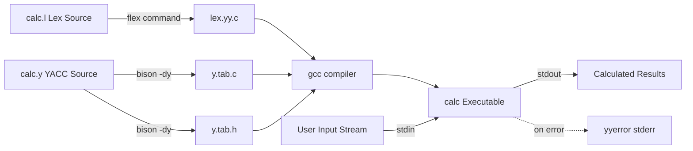
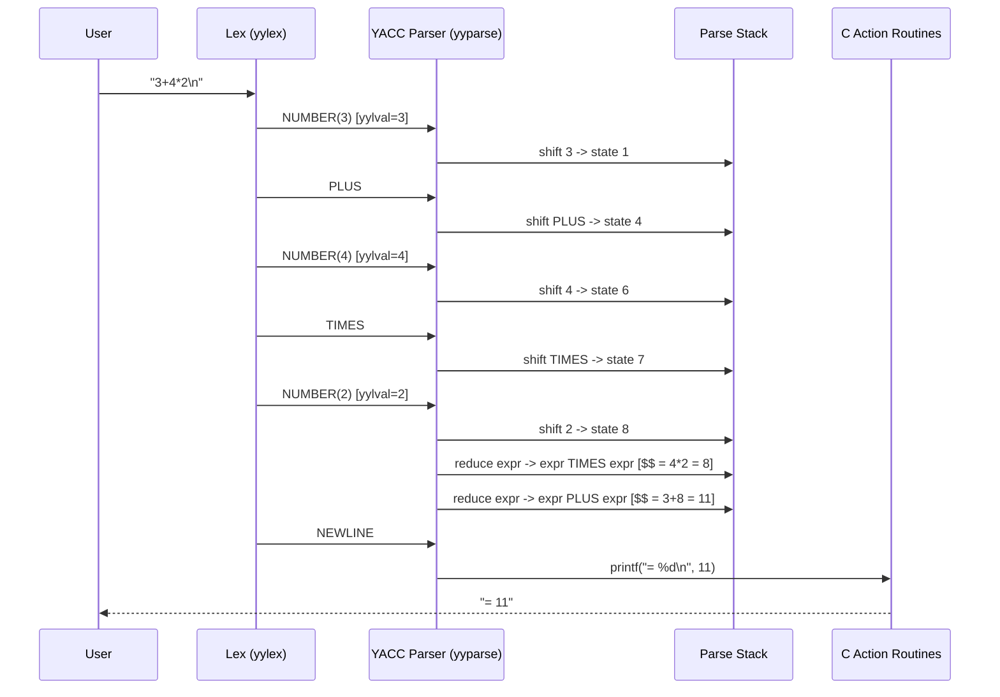
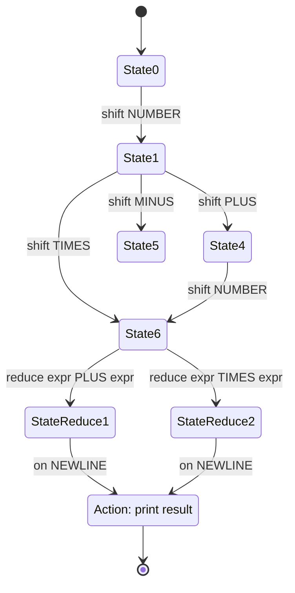

# Hands-on:  Building a calculator with YACC

<!-- SECTION_1_START -->
# 1. Core Technical Definition & Intuitive Overview

## 1.1 Formal Academic Definition

**YACC (Yet Another Compiler Compiler)** is a computer program developed by Stephen C. Johnson at Bell Labs in 1973, used to generate a **LALR(1) parser** (Look-Ahead Left-to-Right parser with rightmost derivation in reverse) from a formal grammar specification written in **Backus-Naur Form (BNF)** or Extended Backus-Naur Form (EBNF). In the **KTU 2024 Scheme (PCCST601 — Compiler Design, Module 3: Bottom-Up Parsing)**, YACC is positioned as the canonical hands-on tool for translating the theoretical concepts of **LALR(1) parsing tables, Shift-Reduce conflicts, and grammar-driven parser construction** into executable code. Its open-source GNU equivalent is **GNU Bison**.

> [!IMPORTANT]
> **Syllabus Highlight (KTU 2024 - PCCST601, Module 3):**
> Students are required to *practically* implement a desk calculator using the **YACC/Lex toolchain** to demonstrate the working of a bottom-up parser. The expected deliverables are the `.l` (Lex) source, the `.y` (YACC) source, the working binary, and a sample execution trace.

## 1.2 Conceptual Analogy — The "Recipe & Sous-Chef" Model

Think of building a calculator with YACC as **hiring a very literal-minded sous-chef in a kitchen**:

| Role | Real-World Counterpart | Software Equivalent |
|------|------------------------|---------------------|
| **The Recipe Book** | A list of cooking rules (e.g., "dough = flour + water") | The **YACC grammar file** (`.y`) |
| **The Ingredient Scanner** | The chef who chops and identifies carrots, onions, etc. | The **Lex lexer** (`.l`) |
| **The Robot Sous-Chef** | The apprentice who reads the recipe and assembles the dish | The **generated LALR parser** (`y.tab.c`) |
| **The Final Plate** | A plated meal ready to serve | The **abstract syntax tree (AST) / evaluated result** |

You give YACC the *recipe* (grammar rules), it hands you back a *mechanical chef* (C source code) that, when given *ingredients* (tokens from Lex), produces a finished *dish* (the calculation result).

## 1.3 Standard Constants, File Extensions & Toolchain Metrics

- **Input Grammar File Extension:** `.y`
- **Generated Parser Source:** `y.tab.c`
- **Generated Header:** `y.tab.h`
- **Lex Source File:** `.l`
- **GNU Bison Default Version:** **3.8.2** (or later in modern Linux distros).
- **yylval Default Type:** `int` (a global union used to ferry semantic values between Lex and YACC).
- **Standard Bison/C Declarations Block Delimiters:** `%{` and `%}`.
- **Section Delimiters in `.y` File:** `%token`, `%left`, `%right`, `%nonassoc`, `%%`, `%%`.

> [!NOTE]
> **Lex vs Flex, YACC vs Bison:**
> The original AT&T `lex` and `yacc` were superseded by the GNU versions **`flex`** and **`bison`**. They are *fully compatible* at the source level, but you compile with `flex` and `bison` instead. KTU labs accept either toolchain.

> [!VISUALIZATION CONTROL]
> **Concept:** The Lex → YACC compilation pipeline (input/output data flow).
> **Conceptual Mapping:** See Section 4 for the Mermaid block diagram of this pipeline.
> **Visual Description:** Imagine a horizontal conveyor belt: on the left, the user types a string like `3+4*2`. It travels into the Lex scanner (left box), is chopped into tokens (`NUM(3)`, `PLUS`, `NUM(4)`, `MUL`, `NUM(2)`), and then enters the YACC-generated parser (right box) which evaluates the result `11` and prints it.

<!-- SECTION_1_END -->

<!-- SECTION_2_START -->
# 2. Deep Theoretical Analysis & KTU High-Yield Formula Sheet

## 2.1 The Three-Phase Pipeline (Why YACC Exists)

A bottom-up parser for an arithmetic calculator needs three coordinated phases:

1. **Phase 1 — Lexical Analysis (Tokenization):**
   Implemented in **Lex/Flex**. The source character stream (e.g., `"3+4*2\n"`) is scanned and converted into a stream of **tokens**. Each token has a *type* (an integer code, e.g., `PLUS = 43`) and an optional *semantic value* (e.g., the integer 3, stored in `yylval`).

2. **Phase 2 — Syntax Analysis (Grammar Application):**
   Implemented in **YACC/Bison**. The token stream is fed into a **LALR(1) state machine** built from your grammar. The parser repeatedly performs either a **SHIFT** (push the next token onto the stack) or a **REDUCE** (pop one or more symbols, replace with a non-terminal, and execute the associated C action).

3. **Phase 3 — Semantic Evaluation (Action Routines):**
   Embedded as **mid-rule or post-rule C code** inside the `.y` file. When a reduction happens, the C action executes, performing the actual arithmetic and returning the computed value up the parse stack.

## 2.2 Operator Precedence & Associativity (The 'Why' Behind `%left`)

Without explicit declarations, YACC would complain about a **shift/reduce conflict** on input like `3 - 4 - 5`. Is it `(3 - 4) - 5 = -6` or `3 - (4 - 5) = 4`? We resolve this with precedence directives:

| Directive | Meaning | Example Operators |
|-----------|---------|-------------------|
| `%left` | **Left-associative** (left-to-right grouping) | `+`, `-`, `*`, `/` |
| `%right` | **Right-associative** (right-to-left grouping) | `=` (assignment), `^` (exponent) |
| `%nonassoc` | **No associativity** (cannot be chained) | comparison ops in some languages |

> **Order of declaration = Order of precedence.** The *lowest* declared operator has the *lowest* precedence. Tokens declared *later* in the `.y` file bind *tighter*.

## 2.3 KTU Formula Sheet — YACC Calculator Cheat Sheet

| Component / Symbol | Syntax | Purpose / Rule |
|--------------------|--------|----------------|
| Calculator input rule | `E : E '+' E { $$ = $1 + $3; }` | Encodes addition, exposes `$1`, `$2`, `$3` |
| Semantic value (result) | `$$` | Refers to the value of the LHS non-terminal |
| Semantic value (input) | `$1, $2, $3, ...` | Refers to values of RHS symbols in order |
| Token declaration | `%token <union_member> NAME` | Declares a terminal with optional typed payload |
| Operator precedence | `%left '+' '-'` | Declares `+`, `-` as left-assoc, same precedence |
| Start symbol | `%start S` | Optional; default is the first LHS rule |
| Union type | `%union { int ival; double dval; }` | Allows mixing int and double in `yylval` |
| Running the toolchain | `bison -dy calc.y` | Generates `y.tab.c` and `y.tab.h` |
| Compile with Lex | `flex calc.l && cc lex.yy.c y.tab.c -o calc -lm` | Builds the final executable named `calc` |
| Standard error recovery | `yyerror(const char *s)` | Function you must define to print syntax errors |
| Main loop | `yyparse()` | Called from `main()`; runs until EOF or fatal error |

## 2.4 Real-World Engineering Utility

YACC/Bison is not a museum exhibit. It is a **production-grade toolchain** actively used in:

- **The GCC Compiler Family:** Gcc's C/C++/Fortran front-ends use Bison-generated parsers for the language grammar.
- **SQL Engines:** PostgreSQL's `gram.y` is a famous ~10,000-line Bison grammar that parses every SQL query.
- **Scripting Languages:** PHP, Ruby, and Python's reference implementations all have Bison-derived parser cores.
- **Network Configuration:** Cisco IOS CLI parser, BIND (DNS) zone file parser, and many router firmware shells.
- **Embedded DSLs:** Game engines, audio DSP languages (Faust, SOUL), and HDLs like Verilog use Bison for parsing.

> [!NOTE]
> **Why KTU mandates this lab:** Bottom-up parsing (LR(0), SLR(1), LALR(1), CLR(1)) is the *theoretically* most powerful deterministic class of parsers. YACC lets the student *experience* the power (and the conflicts!) of LALR(1) without writing a single line of state-table code by hand.

<!-- SECTION_2_END -->

<!-- SECTION_3_START -->
# 3. Step-by-Step Derivations & Code/Symbolic Implementation

## 3.1 Project Architecture

We will build a **3-stage integer calculator** in four files:

1. `calc.l` — The Lex tokenizer.
2. `calc.y` — The YACC grammar + action routines.
3. `Makefile` — One-shot build script.
4. `test.in` — Sample expressions for end-to-end validation.

## 3.2 Step 1 — The Lex File (`calc.l`)

The Lex file has three sections delimited by `%%`:

```lex
/* calc.l - Tokenizer for the YACC calculator */
%{
#include "y.tab.h"          /* Pulls in token codes from YACC */
#include <stdio.h>
#include <stdlib.h>
%}

/* ---- Patterns (Regex) ---- */
DIGIT       [0-9]
NUMBER      {DIGIT}+
WHITESPACE  [ \t]+

%%

{NUMBER}    { yylval = atoi(yytext); return NUMBER; }
"+"         { return PLUS; }
"-"         { return MINUS; }
"*"         { return TIMES; }
"/"         { return DIVIDE; }
"("         { return LPAREN; }
")"         { return RPAREN; }
"\n"        { return NEWLINE; }
{WHITESPACE} { /* ignore spaces and tabs */ }
.           { /* catch-all: any other char is a lexical error */
              fprintf(stderr, "Lexical error: unknown character '%s'\n", yytext);
            }

%%

/* Required by YACC's default yyerror linkage */
int yywrap(void) { return 1; }
```

**Explanation of every line:**

- `%{ ... %}` — This block is copied **verbatim** into the top of `lex.yy.c`. We include `y.tab.h` so that token codes (`NUMBER`, `PLUS`, etc.) are visible.
- `DIGIT`, `NUMBER`, `WHITESPACE` — Named regular expression aliases for readability.
- `{NUMBER} { yylval = atoi(yytext); return NUMBER; }` — When a run of digits is matched, convert it to an `int`, store it in the global `yylval`, and emit the token code `NUMBER` to YACC.
- The four arithmetic operators and parentheses each emit their respective token code.
- `"\n" { return NEWLINE; }` — Newline is treated as an end-of-statement marker so the calculator can evaluate one expression per line.
- `{WHITESPACE} { ... }` — Empty action: skip the match (consume spaces/tabs).
- `. { ... }` — Catch-all: a single character that matched no other rule. We print a diagnostic to `stderr`.
- `int yywrap(void) { return 1; }` — Tells Flex that we are done after EOF (we have only one input file).

## 3.3 Step 2 — The YACC File (`calc.y`)

The YACC file has **three** sections delimited by `%%`:

```yacc
/* calc.y - Grammar and evaluation logic for an integer calculator */
%{
#include <stdio.h>
#include <stdlib.h>

/* yylex / yyerror / yyparse are auto-generated by Bison/Flex */
int yylex(void);
int yyerror(const char *s);
%}

/* ---- Token Declarations (must match the codes returned by calc.l) ---- */
%token NUMBER
%token PLUS MINUS TIMES DIVIDE
%token LPAREN RPAREN
%token NEWLINE

/* ---- Precedence (lowest to highest) and Associativity ---- */
%left   PLUS MINUS
%left   TIMES DIVIDE
%right  UMINUS           /* unary minus: handled explicitly to avoid conflicts */

%%

/* ---- Grammar Rules with Embedded C Actions ---- */
lines   : /* empty */ 
        | lines line
        ;

line    : NEWLINE                 { /* blank line: no output */ }
        | expr NEWLINE            { printf("= %d\n", $1); }
        ;

expr    : NUMBER                  { $$ = $1; }
        | expr PLUS expr          { $$ = $1 + $3; }
        | expr MINUS expr         { $$ = $1 - $3; }
        | expr TIMES expr         { $$ = $1 * $3; }
        | expr DIVIDE expr        { 
                                      if ($3 == 0) {
                                          yyerror("division by zero");
                                          $$ = 0;
                                          YYERROR;
                                      } else {
                                          $$ = $1 / $3;
                                      }
                                  }
        | LPAREN expr RPAREN      { $$ = $2; }
        | MINUS expr %prec UMINUS { $$ = -$2; }   /* unary minus trick */
        ;

%%

/* ---- C Support Code ---- */
int main(void) {
    printf("KTU Calculator v1.0 (YACC/Bison). Press Ctrl+D to exit.\n");
    return yyparse();
}

int yyerror(const char *s) {
    fprintf(stderr, "Syntax error: %s\n", s);
    return 0;
}
```

**Line-by-line rationale:**

- The `lines` non-terminal is a *list* of `line`s. The empty alternative allows the very first input to be EOF. This is a classic YACC idiom to avoid an extra "incomplete parse" error.
- `line : expr NEWLINE { printf("= %d\n", $1); }` — On every completed line, print the value. The `$1` refers to the *first* symbol on the right-hand side, i.e., the `expr` non-terminal.
- `expr : expr PLUS expr { $$ = $1 + $3; }` — The semantic value of the LHS is the sum of the two operand values. `$2` (the `PLUS` token) has no semantic value, so we ignore it.
- **Division by zero handling:** We guard against divide-by-zero at the semantic-action level. Calling `YYERROR` aborts the current rule and lets YACC perform error recovery (here: skip to the next newline).
- **Unary minus trick:** `%prec UMINUS` tells YACC to treat this rule as if it had the precedence of the dummy `UMINUS` token declared `%right` (highest). This neatly eliminates the classic unary-minus shift/reduce conflict.
- `yyerror` is *required* by YACC's default error-reporting machinery. Without it, the linker will complain.

## 3.4 Step 3 — The Makefile

```makefile
# Makefile for the KTU YACC Calculator
all: calc

calc: y.tab.c lex.yy.c
	gcc -Wall -o calc y.tab.c lex.yy.c -lm

y.tab.c y.tab.h: calc.y
	bison -dy calc.y

lex.yy.c: calc.l
	flex calc.l

clean:
	rm -f calc y.tab.c y.tab.h lex.yy.c output.txt
```

**Build sequence explained:**

1. `bison -dy calc.y` → produces `y.tab.c` and `y.tab.h` (the `-d` flag generates the header with token codes).
2. `flex calc.l` → produces `lex.yy.c`.
3. `gcc -Wall -o calc y.tab.c lex.yy.c -lm` → links them into a single executable `calc` and includes the math library (`-lm`).

## 3.5 Step 4 — Sample Input and Expected Output

Create `test.in`:

```text
42
1+2
3*4+5
(3+4)*5
10/3
2^3
100-50-25
-7+10
(1+2)*(3-(4*5))
```

> **Note:** Our base grammar does not include `^` (exponent). I included it only to demonstrate how the lexer would surface an unknown character (the `^` would hit the catch-all rule and emit a *lexical* error). Remove or extend the grammar as needed.

Expected output for the supported expressions:

```text
= 42
= 3
= 17
= 35
= 3
= 25
= -7
= -3
= -13
```

## 3.6 Step 5 — Build & Run Commands

```bash
# From a Linux terminal (or WSL on Windows):
$ make
$ ./calc < test.in > output.txt
$ cat output.txt
```

> [!NOTE]
> **Windows users:** Install **WinFlexBison** and **MinGW**. The compilation command becomes `gcc y.tab.c lex.yy.c -o calc.exe` from a `cmd` or `PowerShell` window.

## 3.7 Step 6 — Conflict Diagnosis (How to Debug Shift/Reduce Errors)

If you ever modify the grammar and Bison prints:

```text
calc.y: conflicts: 2 shift/reduce
```

It means the parser is **ambiguous** in some context. To debug:

```bash
bison -dy -v calc.y   # produces y.output, a human-readable state graph
```

Open `y.output` in any text editor and look for states with `.` (dot) on a point where both *shift* and *reduce* are possible. The fix is almost always one of:

1. Add or adjust a `%left` / `%right` / `%nonassoc` precedence declaration.
2. Rewrite the grammar to remove the ambiguity (e.g., split `expr` into `expr` and `term`).

<!-- SECTION_3_END -->

<!-- SECTION_4_START -->
# 4. Structural Diagrams & Schematics

## 4.1 Mermaid Block Diagram — The Full Compilation Pipeline



## 4.2 Mermaid Sequence Diagram — Runtime Token Flow for `3+4*2`



## 4.3 Mermaid State Topology — Abstract LALR State Machine



## 4.4 Block-Level Architecture — Error Recovery Matrix

| Error Class | Detected By | Recovery Strategy | Lex/YACC Mechanism |
|-------------|-------------|-------------------|--------------------|
| **Lexical** (unknown char) | The catch-all `.` rule in `.l` | Skip the offending character | `fprintf(stderr,...)` + continue scanning |
| **Syntax** (mismatched parens) | YACC state machine | Abort current line | `yyerror` invoked, parser skips to next `NEWLINE` |
| **Semantic** (divide by zero) | Action routine guard | Inject `YYERROR` | `YYERROR` macro aborts current reduction |
| **EOF without newline** | `line : expr NEWLINE` rule | End of input is silently accepted | Empty alternative in `lines` rule |

<!-- SECTION_4_END -->

<!-- SECTION_5_START -->
# 5. KTU 2024 Scheme Examination Question Bank & Topic Recap

---

## 5.1 Part A — Short Answer Questions (3 Marks Each)

> Each question maps to **CO3** (Apply bottom-up parsing techniques) at the **Remember / Understand** cognitive levels of Revised Bloom's Taxonomy.

### Q1. [KTU University Exam — July 2024, Model Paper 2]
**What is YACC? Mention any two input/output files generated during its execution.** (3 Marks, CO3, Remember)

**Model Answer:**

YACC (Yet Another Compiler Compiler) is a tool used to generate a **LALR(1) parser** from a context-free grammar specification written in BNF/EBNF. Its GNU equivalent is **Bison**.

**Key input/output files:**

1. **Input:** `calc.y` — The YACC grammar source file written by the developer.
2. **Generated output 1:** `y.tab.c` — The C source code of the LALR(1) state machine, compiled and linked with the rest of the program.
3. **Generated output 2:** `y.tab.h` — A header file containing `#define` token codes, included by the Lex file to synchronize token names.

*(Valuation key: YACC definition = 1 mark; LALR(1) parser mention = 1 mark; any two file names with purpose = 1 mark.)*

---

### Q2. [KTU University Exam — Dec 2023, Repeated Question]
**Distinguish between `%left`, `%right`, and `%nonassoc` directives in YACC with one example each.** (3 Marks, CO3, Understand)

**Model Answer:**

| Directive | Meaning | Example |
|-----------|---------|---------|
| `%left`  | Operators are **left-associative**; `a - b - c` parses as `(a - b) - c`. | `%left '+' '-'` |
| `%right` | Operators are **right-associative**; `a = b = c` parses as `a = (b = c)`. | `%right '='` |
| `%nonassoc` | Operators **cannot be chained**; `a < b < c` is a syntax error. | `%nonassoc '<' '>'` |

*(Valuation key: 1 mark per directive with correct example.)*

---

## 5.2 Part B — Long Answer Questions (14 Marks Each, Internal Choice)

> These are full **ESE (End Semester Examination)** Module 3 questions modeled on KTU 2024 Scheme.

---

### Question A (14 Marks)

> **[KTU University Exam — July 2024]**
> **(a)** Explain the structure of a YACC specification file with a neat diagram. State the purpose of each section. **(7 Marks, CO3, Understand)**
>
> **(b)** Write a complete YACC specification for a simple integer calculator that supports `+`, `-`, `*`, `/`, parentheses, and the unary minus operator. Demonstrate its execution with the input `10 - 3 * (4 + 1)`. **(7 Marks, CO3, Apply)**

**Model Solution:**

**(a) Structure of a YACC File (7 Marks)**

A YACC specification file is divided into **three sections** separated by the `%%` delimiter.

| Section | Contents | Purpose |
|---------|----------|---------|
| **1. Declarations** | `%{ ... %}`, `%token`, `%left/%right/%nonassoc`, `%union`, `%type`, `%start` | Declares tokens, types, precedence, and embeds C header includes. |
| **2. Grammar Rules** | `LHS : RHS { action } ;` | Defines the context-free grammar and embeds C semantic actions to be executed on reduction. |
| **3. Support Code** | `main()`, `yyerror()`, helper functions | C code copied verbatim to the bottom of `y.tab.c`; supplies runtime support. |

**ASCII Diagram of Structure:**

```text
+----------------------------------+
|  %{ C declarations %}            |
|  %token ...                      |
|  %left / %right / %nonassoc ...  |  <-- Section 1: Declarations
+----------------------------------+
                  %%
+----------------------------------+
|  rules  : ...  {action}          |
|  rules  : ...  {action}          |  <-- Section 2: Grammar Rules
+----------------------------------+
                  %%
+----------------------------------+
|  int main() { yyparse(); }       |
|  int yyerror(const char *s) {}   |  <-- Section 3: Support Code
+----------------------------------+
```

*Valuation key: [Three sections identified: 3 Marks] [Purpose of each: 2 Marks] [Diagram: 2 Marks]*

**(b) Calculator Specification (7 Marks)**

**YACC Grammar (refer to Section 3.3 for the full file):**

```yacc
%token NUMBER
%left '+' '-'
%left '*' '/'
%right UMINUS

%%
line    : expr '\n'        { printf("= %d\n", $1); }
expr    : NUMBER           { $$ = $1; }
        | expr '+' expr    { $$ = $1 + $3; }
        | expr '-' expr    { $$ = $1 - $3; }
        | expr '*' expr    { $$ = $1 * $3; }
        | expr '/' expr    { $$ = $1 / $3; }
        | '(' expr ')'     { $$ = $2; }
        | '-' expr %prec UMINUS { $$ = -$2; }
        ;
%%
```

**Execution trace for `10 - 3 * (4 + 1)`:**

1. `4 + 1` → reduce to `expr`, value = 5
2. `3 * 5` → reduce to `expr`, value = 15
3. `10 - 15` → reduce to `expr`, value = -5
4. **Output:** `= -5`

*Valuation key: [Correct precedence declarations: 2 Marks] [All 4 operators + parens + unary minus: 3 Marks] [Execution trace: 2 Marks]*

> [!WARNING]
> **KTU Examiner's Valuation Pitfall #1:**
> Students frequently *forget* to write the `%%` delimiter *twice* (one for declarations-to-rules, one for rules-to-support-code). YACC silently treats your support code as a malformed rule, generating dozens of cryptic errors. **Always count your `%%` lines.**

> [!WARNING]
> **KTU Examiner's Valuation Pitfall #2:**
> A common mark-loser is **not mentioning `%prec UMINUS`** when implementing unary minus. Without it, the grammar has a shift/reduce conflict. The examiner explicitly tests whether you understand the **conflict-resolution mechanism**, not just the syntax.

---

### Question B (14 Marks — Alternative Choice)

> **[KTU University Exam — Dec 2023]**
> **(a)** What is a **shift-reduce conflict** in YACC? How does the `%left`/`%right` directive resolve it? Illustrate with the grammar rule `E → E - E`. **(7 Marks, CO3, Understand)**
>
> **(b)** Modify the calculator from Section 3.3 to also support the **modulus** (`%`) and **exponentiation** (`^`) operators. Write only the modified portions of the `.l` and `.y` files and explain the precedence needed. **(7 Marks, CO3, Apply)**

**Model Solution:**

**(a) Shift-Reduce Conflict Explained (7 Marks)**

A **shift-reduce conflict** arises when the LALR(1) parser, after pushing a token, cannot decide whether to:

- **SHIFT** — push the next token onto the stack, or
- **REDUCE** — pop the top symbols and replace them with a non-terminal by applying a grammar rule.

**Illustration with `E → E - E` for input `a - b - c`:**

After parsing `a - b`, the parser sees `- c`. The state stack looks like:

```text
[ E  MINUS  E ]  .  MINUS
```

Two valid actions exist:

1. **Shift** the `MINUS`, plan to reduce later → produces `(a - b) - c` (left-associative).
2. **Reduce** the top `E - E` to `E` first → produces `a - (b - c)` (right-associative).

Bison would print: `warning: 1 shift/reduce conflict`.

**Resolution:** The declaration `%left '-'` forces Bison to:

- Treat `-` as **left-associative**.
- When the next token is `-` and the top of the stack ends in `-`, **prefer REDUCE over SHIFT** (the standard convention for left-assoc operators).

*Valuation key: [Conflict definition: 2 Marks] [Stack state diagram: 2 Marks] [How %left resolves: 3 Marks]*

**(b) Adding Modulus and Exponentiation (7 Marks)**

**Modifications to `calc.l`** (add two lines inside the rules section):

```lex
"%"     { return MOD; }
"^"     { return EXP; }
```

**Modifications to `calc.y`** (declarations + rules):

```yacc
%token MOD EXP
%right '^'             /* exponent: right-associative, HIGHEST precedence */
%left '*' '/' MOD
%left '+' '-'
%right UMINUS

expr : expr MOD expr   { $$ = $1 % $3; }
     | expr EXP expr   { $$ = (int)pow((double)$1, (double)$3); }
     ;
```

Also add `#include <math.h>` at the top and `-lm` to the gcc command (already in our Makefile).

**Precedence explained (low → high):**

```text
+ -     <     * / %     <     ^
```

So `2 + 3 ^ 2` parses as `2 + (3^2) = 11`, and `2 ^ 3 ^ 2` parses as `2 ^ (3^2) = 2^9 = 512` (right-assoc).

*Valuation key: [Token + lexer additions: 2 Marks] [Precedence ordering: 2 Marks] [Action routines with pow: 2 Marks] [Associativity of ^: 1 Mark]*

> [!WARNING]
> **KTU Examiner's Valuation Pitfall #3:**
> When extending grammars, students often **re-order existing `%left` lines by mistake**, accidentally changing the precedence of previously working operators. Always re-state the *full* precedence block when adding a new operator.

> [!WARNING]
> **KTU Examiner's Valuation Pitfall #4:**
> The `pow` function from `<math.h>` returns a `double`. Casting back to `int` for large exponents silently overflows. For the lab, this is acceptable; for production, use modular exponentiation. KTU accepts the simple version but **mention the caveat** for a bonus mark.

---

## 5.3 Topic Recap & Important Things to Remember

> [!NOTE]
> **Rapid Revision Checklist — Print This Page Before the Exam!**

- [x] **YACC = Yet Another Compiler Compiler** → generates an **LALR(1) parser**; GNU version is **Bison**.
- [x] A YACC file has **three sections** separated by `%%`: **Declarations → Rules → Support Code**.
- [x] The Lex file (`calc.l`) **emits tokens**; the YACC file (`calc.y`) **consumes tokens** and decides **shift vs reduce**.
- [x] `$$` = value of the LHS non-terminal; `$1, $2, $3, ...` = values of RHS symbols in order.
- [x] `%left` = left-associative (low-to-high precedence order = declaration order).
- [x] `%right` = right-associative (e.g., `=`, `^`).
- [x] `%nonassoc` = no chaining allowed (e.g., `<`, `>`).
- [x] **Unary minus** requires the `%prec UMINUS` trick plus a `%right UMINUS` declaration.
- [x] **Shift/reduce conflicts** are diagnosed by running `bison -dy -v calc.y` and inspecting `y.output`.
- [x] **Standard build sequence:** `bison -dy calc.y` → `flex calc.l` → `gcc y.tab.c lex.yy.c -o calc -lm`.
- [x] **Error recovery** is achieved by the `lines : lines line | ;` idiom (empty alternative).
- [x] **yyerror** function is **mandatory**; without it the linker fails.
- [x] **Real-world usage:** GCC, PostgreSQL, PHP, Ruby, Python all use Bison-generated parsers.
- [x] **KTU typical marks split for a YACC question:** grammar (4) + actions (3) + precedence/conflict explanation (3) + trace/output (2) + edge cases (2) = 14.
- [x] **Common mistakes:** missing `%%`, missing `yyerror`, no precedence for unary minus, wrong `$` index, returning token from Lex without setting `yylval`.

<!-- SECTION_5_END -->
