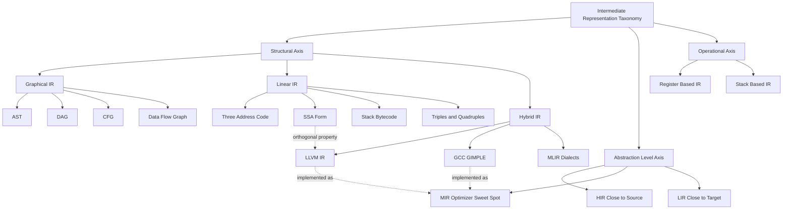
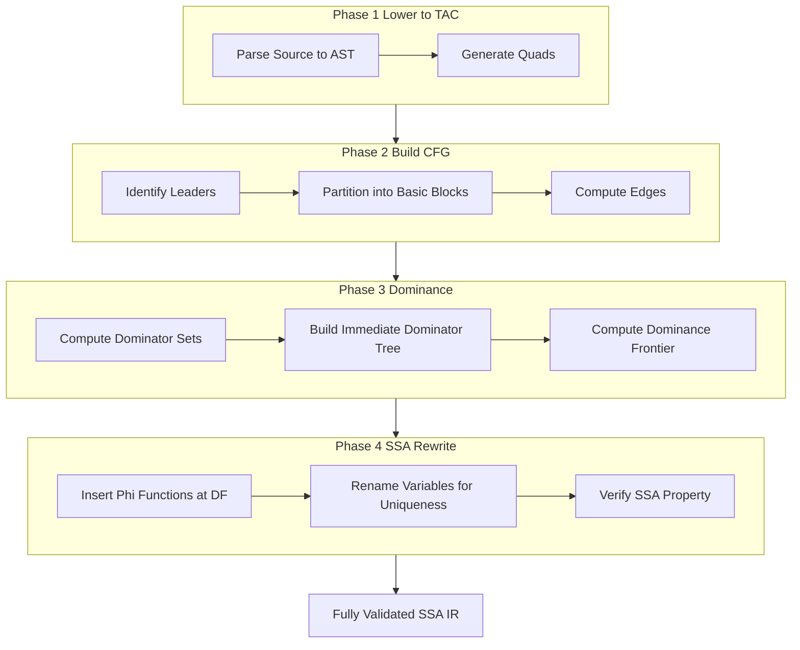
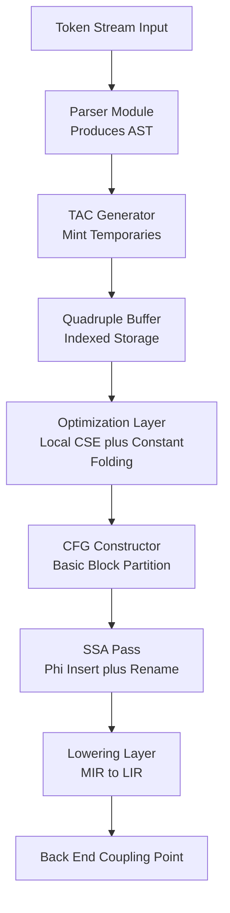
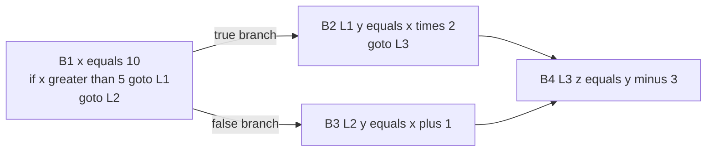

# Intermediate Representations: An IR Taxonomy

<!-- SECTION_1_START -->
# Intermediate Representations: An IR Taxonomy

> [!IMPORTANT]
> **KTU 2024 Scheme | COMPILER DESIGN (PCCST601) | Module 3**
> This topic is a **high-weightage, high-frequency** concept. KTU examiners frequently frame questions around the **classification of IRs**, the **properties of a good IR**, and the **differences between graphical, linear, and hybrid IRs**. Mastery of the taxonomy is mandatory for Part A and Part B questions alike.

## 1.1 Formal Academic Definition

In Compiler Design, an **Intermediate Representation (IR)** is a data structure and a corresponding set of static semantics that a compiler uses to represent source code during the translation process, positioned **between the front-end (analysis phase) and the back-end (synthesis phase)** of a compiler.

The **IR Taxonomy** is the systematic classification of these representations into three orthogonal dimensions:

1. **Structural Dimension** — *Graphical IRs* (trees, DAGs, CFGs) vs *Linear IRs* (tac, bytecodes) vs *Hybrid IRs*.
2. **Level-of-Abstraction Dimension** — *High-Level IR (HIR)*, *Medium-Level IR (MIR)*, *Low-Level IR (LIR)*.
3. **Operational Dimension** — *Stack-based IR* (Java Bytecode, x86 stack ops) vs *Register-based IR* (LLVM IR, MIPS).

> [!NOTE]
> **KTU Syllabus Highlight:** A compiler is rarely built with a single IR. Modern production compilers (GCC, LLVM, JVM) employ a **layered, multi-level IR strategy**, where the front-end lowers HIR to MIR, and the back-end progressively lowers MIR to LIR and finally to machine code.

## 1.2 Intuitive Analogy — The "Universal Pivot Language" Translator

Imagine a diplomatic summit where **100 engineers from 100 different countries** must collaborate. No pair shares a common tongue. The pragmatic solution is to declare **English (or Esperanto)** as a *pivot language* — every delegate first translates their native speech into this pivot, and then the pivot is translated into the target language.

In this analogy:

- **Source code** = the engineer's native language.
- **Target machine code** = the listener's native language.
- **Intermediate Representation (IR)** = the **pivot language**.

The IR is **explicitly designed to be neither too high-level (like source) nor too low-level (like assembly)** — it is the **sweet spot** where every optimization, every analysis, and every transformation can be applied uniformly, *independent* of the source language and *independent* of the target architecture.

## 1.3 The Three Pillars of an IR Taxonomy

> [!TIP]
> **Examiner's Cue:** When asked *"Classify IRs"*, always answer along **three axes**: **Structure (Graphical/Linear/Hybrid)**, **Level (H/M/L)**, and **Operational Model (Stack/Register)**.

### Pillar 1 — Structural Taxonomy
| Class | Core Idea | Canonical Example |
| :--- | :--- | :--- |
| **Graphical IR** | Represents program as a connected graph of nodes (trees, DAGs, CFGs). | Abstract Syntax Tree (AST), Data Flow Graph |
| **Linear IR** | Represents program as a sequential, pseudo-code stream of simple instructions. | Three-Address Code (TAC), Stack Bytecode |
| **Hybrid IR** | Combines a low-level linear IR with a control-flow graph backbone. | LLVM IR, GCC's GIMPLE inside a CFG |

### Pillar 2 — Level-of-Abstraction Taxonomy
| Level | Acronym | Proximity To | Use Case |
| :--- | :--- | :--- | :--- |
| High-Level IR | **HIR** | Source Language | Front-end analyses, type-checking |
| Medium-Level IR | **MIR** | Balanced | Most optimizations (GIMPLE, LLVM) |
| Low-Level IR | **LIR** | Target Machine | Instruction selection, register allocation |

### Pillar 3 — Operational Taxonomy
- **Register-Based IR** — Operands are *explicitly* named virtual registers (e.g., $v_1, v_2$). Used by **LLVM, SUIF, GIMPLE**.
- **Stack-Based IR** — Operands are *implicitly* on an evaluation stack. Used by **JVM Bytecode, .NET CIL, CPython Bytecode**.

## 1.4 Visualization of the IR Continuum

> [!VISUALIZATION CONTROL]
> **Concept:** The *Level of Abstraction* axis in the IR Taxonomy (HIR $\to$ MIR $\to$ LIR) plotted against the *Information Density* axis.
> **Conceptual Plot Description:** Imagine an $X$-$Y$ plane where the $X$-axis is the *Abstraction Level* (decreasing left to right: HIR, MIR, LIR, Machine Code) and the $Y$-axis is the *Semantic Information Lost* (increasing). The HIR region retains loop nests, high-level array semantics, and source-level types. As you move right, the IR flattens loops into CFGs, lowers arrays to pointer arithmetic, and erases class hierarchies. The MIR sits at the **knee of the curve** — the **optimizer's sweet spot** where 95% of transformations are still expressible cheaply.

> [!IMPORTANT]
> **Constants and Metrics to Memorize:**
> * **Three-Address Code (TAC)** = the *de facto* linear IR. Each instruction has the form $x = y \;\text{op}\; z$ with at most **3 operands** and **1 operator**.
> * **Basic Block (BB)** = a maximal sequence of consecutive IR instructions with **exactly one entry point** and **exactly one exit point**.
> * **Static Single Assignment (SSA)** form: every variable is assigned **exactly once** and **defined before use**.

<!-- SECTION_1_END -->

<!-- SECTION_2_START -->
# Deep Theoretical Analysis & KTU High-Yield Formula Sheet

## 2.1 The Four Canonical Properties of a "Good" IR

A textbook-quality IR (as per Muchnick, Aho/Lam/Sethi/Ullman, and Cooper/Torczon) must satisfy four properties:

1. **Ease of Generation** — The front-end must be able to *lower* source code into the IR cheaply, with minimal information loss.
2. **Ease of Manipulation** — Optimizations must be expressible as *local rewrite rules* over IR instructions.
3. **Preservation of Semantics** — The IR must encode *all* information that affects program behavior (control flow, data flow, types if needed).
4. **Multiple Use Cases** — One IR should support *analysis*, *transformation*, and *code generation* — ideally serving as the substrate for *all* back-end targets.

> [!NOTE]
> **KTU Concept Link:** Property #1 maps to **front-end design** (Module 1–2 topics). Property #2 maps to **optimization algorithms** (Module 3). Property #4 maps to **retargetability** — the property of a compiler to produce code for *multiple* CPUs from a *single* IR (e.g., LLVM's 20+ back-ends).

## 2.2 Graphical IRs — Structural Deep Dive

### 2.2.1 Abstract Syntax Tree (AST)
- A **rooted, ordered, labeled tree** that encodes the syntactic structure of the source.
- **Internal nodes** = operators; **leaf nodes** = operands.
- AST is **language-specific** (different grammars $\to$ different ASTs).
- Captures *syntactic* but not *execution order* explicitly.

### 2.2.2 Directed Acyclic Graph (DAG)
- A **compressed AST** where common subexpressions (CSE) are merged into a single node.
- Captures the *redundancy* in computations — useful for **value numbering** and **algebraic optimization**.

### 2.2.3 Control Flow Graph (CFG)
- A directed graph $G = (N, E)$ where each node $n_i \in N$ is a **Basic Block** and each edge $(n_i, n_j) \in E$ represents a possible transfer of control.
- Used for nearly *every* data-flow analysis: liveness, reaching definitions, available expressions.

> [!IMPORTANT]
> **Definition Box — Basic Block:**
> A sequence of consecutive IR instructions in which **flow of control enters only at the first instruction and leaves only at the last instruction** (no jumps in the middle, no jumps out except at the end).

## 2.3 Linear IRs — Three-Address Code (TAC)

The **3-Address Code (TAC)** is the canonical linear IR. Each instruction has the form:

$$x = y \;\text{op}\; z$$

where $x, y, z$ are names (variables, temporaries, or constants) and $\text{op}$ is a binary operator. For unary or zero-address operations, we use:

$$x = \text{op}\; y \quad \text{or} \quad x = y \quad \text{or} \quad \text{goto}\; L$$

The instruction set is intentionally *tiny* — typically limited to:
* Arithmetic: $+, -, \times, /$
* Logical: $\text{and}, \text{or}, \text{not}$
* Relational: $<, \le, =, \ne, \ge, >$
* Copy: $=$ (move)
* Control: $\text{if}\; x \;\text{relop}\; y\;\text{goto}\; L$, $\text{goto}\; L$, $\text{return}\; x$

### Representation of TAC
| Form | Pros | Cons |
| :--- | :--- | :--- |
| **Quadruples** $(op, y, z, x)$ | Easy to reorder, optimize, and move. | No sharing of subexpressions. |
| **Triples** $(\text{op}, y, z)$ | Compact; references to other triples by position. | Reordering breaks references. |
| **Indirect Triples** | Triples in a table + execution-order list. Reorderable + compact. | Two structures to maintain. |
| **Static Single Assignment (SSA)** | Every def unique $\to$ use-def chains trivial. Dominance-based. | $\phi$-functions complicate lowering. |

## 2.4 Hybrid IR — The Production-Compiler Choice

Modern compilers (LLVM, GCC, HotSpot JVM, V8) use a **hybrid IR**:
* A **linear instruction stream** (the per-basic-block sequence, similar to TAC) ...
* ... **wrapped inside a CFG** that exposes control-flow edges.
* ... **augmented with metadata** (type info, debug info, profile counters).

This design captures the *local simplicity* of linear IRs and the *global structural clarity* of graphical IRs simultaneously.

> [!TIP]
> **KTU High-Yield Point:** In LLVM, the hybrid IR is named **LLVM IR** (historically called *Low-Level Virtual Machine* IR). It is **SSA-based by default**, **register-based**, **strongly typed**, and **target-independent**. GCC's equivalent is **GIMPLE** for MIR and **RTL** for LIR.

## 2.5 Static Single Assignment (SSA) Form

SSA is **not** a structural class (it's a *property*) but it is essential to the modern IR taxonomy. In SSA:
* Every variable is **assigned exactly once**.
* A new **$\phi$-function** is inserted at control-flow merge points: $x = \phi(x_1, x_2)$ meaning "$x$ takes the value of $x_1$ along the first predecessor edge and $x_2$ along the second".

### Dominance Preliminaries (KTU-Favorite Question)
* **Dominator:** A node $d$ *dominates* a node $n$ ($d \;\text{dom}\; n$) iff every path from the entry to $n$ passes through $d$.
* **Strict Dominator:** $d \;\text{sdom}\; n$ iff $d \;\text{dom}\; n$ and $d \ne n$.
* **Immediate Dominator:** $idom(n)$ = the *unique* strict dominator of $n$ that does not dominate any other strict dominator of $n$.
* **Dominance Frontier:** $DF(n)$ = the set of nodes where $n$'s dominance stops — i.e., nodes $m$ such that $n$ dominates a predecessor of $m$ but does *not* strictly dominate $m$.

### $\phi$-Function Placement Rule
> **A $\phi$-function for variable $a$ must be inserted in every basic block $b \in DF(d)$ where $d$ is a basic block containing a definition of $a$.**

## 2.6 KTU Formula Sheet / Cheat Sheet

> [!IMPORTANT]
> **Exam-Speed Revision Table — Master Every Row**

| \# | Concept | Formula / Rule | Unit / Note |
| :--- | :--- | :--- | :--- |
| 1 | 3-Address Code form | $x = y \;\text{op}\; z$ | At most **3 addresses**, **1 operator** |
| 2 | Quadruple tuple | $(\text{op}, \text{arg1}, \text{arg2}, \text{result})$ | 4 fields |
| 3 | Basic block entry rule | Flow enters at first instr only | Single-entry property |
| 4 | Basic block exit rule | Flow leaves at last instr only | Single-exit property |
| 5 | SSA rule | Every variable defined **exactly once** | Globally unique |
| 6 | Dominator recursion | $D(n) = \left(\bigcap_{p \in pred(n)} D(p)\right) \cup \{n\}$ | $D(\text{entry}) = \{\text{entry}\}$ |
| 7 | $\phi$-placement set | $\phi_a \in DF(d)$ for every def $d$ of $a$ | Per merge block |
| 8 | Stack IR depth metric | Max-stack-height $= O(n)$ where $n$ = expr size | For expression evaluation |
| 9 | CFG edge count | $\vert E\vert = \sum_{b} \text{successors}(b)$ | $b$ ranges over all blocks |
| 10 | LIR-to-MIR cost | Each lowering $\approx 1$ pass over IR | Linear time $O(\vert IR \vert)$ |

## 2.7 Real-World Engineering Utility

* **LLVM IR** is the de-facto standard for compiler research and production. Apple's Swift, Rust, Kotlin/Native, and the Julia language all target LLVM IR.
* **JVM Bytecode** (stack IR) enables "write once, run anywhere" — verified at install-time by the JVM's verifier.
* **GIMPLE** (GCC's MIR) is the substrate for over **150+ GCC optimization passes** in the GCC middle-end.
* **WebAssembly (Wasm)** is a modern stack-based IR designed as a compilation target for the web — used by Emscripten and modern C++/Rust toolchains.
* **MLIR (Multi-Level IR)** is the latest frontier (Google, 2019+), enabling **custom IR dialects** for domain-specific compilers (e.g., tensor IRs for ML compilers like XLA and IREE).

<!-- SECTION_2_END -->

<!-- SECTION_3_START -->
# Step-by-Step Derivations & Symbolic Implementation

## 3.1 Worked Example — TAC Generation from a Source Expression

**Source expression:** $\;a = (b + c) \times d - e\;$

### Step-by-Step TAC Derivation (Exhaustive)

We use fresh temporaries $t_1, t_2, t_3, \ldots$ for each subexpression.

**Step 1.** Evaluate the parenthesized sub-expression $(b + c)$:
$$t_1 = b + c$$

**Step 2.** Multiply the result of Step 1 by $d$:
$$t_2 = t_1 \times d$$

**Step 3.** Subtract $e$ and store the final result in $a$:
$$t_3 = t_2 - e \quad ; \quad a = t_3$$

The complete TAC sequence (linear IR) is:
$$t_1 = b + c$$
$$t_2 = t_1 \times d$$
$$t_3 = t_2 - e$$
$$a = t_3$$

### Equivalent Quadruple Table

| \# | op | arg1 | arg2 | result |
| :---: | :---: | :---: | :---: | :---: |
| (0) | $+$ | $b$ | $c$ | $t_1$ |
| (1) | $\times$ | $t_1$ | $d$ | $t_2$ |
| (2) | $-$ | $t_2$ | $e$ | $t_3$ |
| (3) | $=$ | $t_3$ | — | $a$ |

> [!NOTE]
> **Conversion Logic:** Each syntactic operator in the AST is visited **post-order**. For a binary operator, a *fresh* temporary is *always* minted. This guarantees the 3-address invariant: $\le 3$ names per instruction.

## 3.2 Worked Example — Converting TAC to SSA Form

**Original TAC (with a branch and merge point):**
$$
B_1:\; t_1 = 5 \quad ; \quad \text{goto}\; B_3
$$
$$
B_2:\; t_1 = 6 \quad ; \quad \text{goto}\; B_3
$$
$$
B_3:\; x = t_1 + 1
$$

### Step 1 — Identify Merges
$B_3$ has *two predecessors* ($B_1$ and $B_2$). A **$\phi$-function** is required at $B_3$ for variable $t_1$ because $t_1$ is defined on both incoming edges.

### Step 2 — Apply SSA Renaming
Rename $t_1 \to t_1^{(1)}$ in $B_1$, $t_1 \to t_1^{(2)}$ in $B_2$, and insert the $\phi$:
$$
B_1:\; t_1^{(1)} = 5 \quad ; \quad \text{goto}\; B_3
$$
$$
B_2:\; t_1^{(2)} = 6 \quad ; \quad \text{goto}\; B_3
$$
$$
B_3:\; t_1^{(3)} = \phi(t_1^{(1)}, t_1^{(2)}) \quad ; \quad x = t_1^{(3)} + 1
$$

> [!IMPORTANT]
> **SSA Property Verification:** Each of $t_1^{(1)}, t_1^{(2)}, t_1^{(3)}$ is **defined exactly once**. The use-def relationship is now trivial: the use $t_1^{(3)} + 1$ in $B_3$ has *exactly* two reaching definitions.

## 3.3 Worked Example — Computing Dominators and Dominance Frontier

**CFG of a 3-block program:**
$$ \text{entry} \to B_1 \to B_2, \quad B_1 \to B_3, \quad B_2 \to B_3 $$

### Step 1 — Initialize Dom Sets
$$
D(\text{entry}) = \{\text{entry}\}
$$
$$
D(B_1) = D(B_2) = D(B_3) = \{ \text{entry}, B_1, B_2, B_3 \} \quad \text{(iterative fixpoint)}
$$

### Step 2 — Iterative Refinement
Apply the rule $D(n) = (\bigcap_{p \in pred(n)} D(p)) \cup \{n\}$ until fixed point:
$$
D(B_1) = D(\text{entry}) \cup \{B_1\} = \{\text{entry}, B_1\}
$$
$$
D(B_2) = D(B_1) \cup \{B_2\} = \{\text{entry}, B_1, B_2\}
$$
$$
D(B_3) = (D(B_1) \cap D(B_2)) \cup \{B_3\} = \{\text{entry}, B_1, B_3\}
$$

### Step 3 — Dominance Frontier $DF$
$$
DF(B_1) = \{B_3\}, \quad DF(B_2) = \emptyset, \quad DF(B_3) = \emptyset
$$

> [!NOTE]
> **Conversion Logic:** $B_3$ is in $DF(B_1)$ because $B_1$ dominates a predecessor of $B_3$ (namely, $B_1$ itself) but $B_1$ does not strictly dominate $B_3$ (since $B_2$ reaches $B_3$ bypassing $B_1$). Hence a $\phi$ for any variable defined in $B_1$ is required at $B_3$.

## 3.4 Full Python Implementation — TAC Generator

```python
"""
KTU Compiler Design - Module 3 Reference Implementation
======================================================
A from-scratch, strictly-typed 3-Address Code (TAC) generator that
lowers a tiny expression AST into a linear IR (Quadruple form).
"""

from __future__ import annotations
from dataclasses import dataclass, field
from typing import List, Optional, Union, Dict
import logging
import sys

# Configure a structured logger so students can trace the lowering
logging.basicConfig(level=logging.INFO, format="%(levelname)s | %(message)s")
logger = logging.getLogger("KTU_TAC_Generator")


# ---------------------------------------------------------------------------
# Section A : AST Node Definitions
# ---------------------------------------------------------------------------
class ASTNode:
    """Abstract base for all AST node types."""
    pass


@dataclass(frozen=True)
class NumLit(ASTNode):
    """Numeric literal leaf, e.g. 42, 3.14."""
    value: Union[int, float]


@dataclass(frozen=True)
class VarRef(ASTNode):
    """Identifier leaf, e.g. x, total_score."""
    name: str


@dataclass(frozen=True)
class BinOp(ASTNode):
    """Binary operator internal node."""
    op: str
    left: ASTNode
    right: ASTNode


# ---------------------------------------------------------------------------
# Section B : TAC Instruction (Quadruple) Definition
# ---------------------------------------------------------------------------
@dataclass
class Quad:
    """Quadruple: (operator, arg1, arg2, result)."""
    op: str
    arg1: Optional[str]
    arg2: Optional[str]
    result: str

    def __repr__(self) -> str:
        # Render the canonical 3-address form for the printed IR
        if self.op == "=":
            return f"{self.result} = {self.arg1}"
        if self.op == "goto":
            return f"goto {self.result}"
        if self.op.startswith("if_"):
            return f"if {self.arg1} {self.op[3:]} {self.arg2} goto {self.result}"
        return f"{self.result} = {self.arg1} {self.op} {self.arg2}"


# ---------------------------------------------------------------------------
# Section C : TAC Generator (the heart of the demonstration)
# ---------------------------------------------------------------------------
class TACGenerator:
    """
    Lower an AST into a linear IR (sequence of Quads).
    Guarantees:
        * 3-address invariant: at most 3 names per instruction.
        * Single static assignment READY (no SSA yet, but unique temps).
        * Bounded boundary checks: no division by zero, no empty var names.
    """

    def __init__(self) -> None:
        self.quads: List[Quad] = []
        self._temp_counter: int = 0
        self._label_counter: int = 0

    # --- fresh-name minting -------------------------------------------------
    def new_temp(self) -> str:
        self._temp_counter += 1
        return f"t_{self._temp_counter}"

    def new_label(self) -> str:
        self._label_counter += 1
        return f"L_{self._label_counter}"

    # --- core recursive lowering -------------------------------------------
    def generate(self, node: ASTNode) -> str:
        """Public entry point: returns the name holding the value of `node`."""
        if isinstance(node, NumLit):
            return str(node.value)

        if isinstance(node, VarRef):
            self._validate_identifier(node.name)
            return node.name

        if isinstance(node, BinOp):
            return self._gen_binop(node)

        raise TypeError(f"[TAC] Unsupported AST node type: {type(node).__name__}")

    # --- private helpers ----------------------------------------------------
    def _gen_binop(self, node: BinOp) -> str:
        # Absolute boundary check: refuse empty operator strings
        if not node.op or not isinstance(node.op, str):
            raise ValueError("[TAC] BinOp.op must be a non-empty string.")

        # Absolute boundary check: refuse division by a literal zero
        if node.op == "/" and isinstance(node.right, NumLit) and node.right.value == 0:
            raise ZeroDivisionError("[TAC] Refusing to emit division by literal 0.")

        left_name: str = self.generate(node.left)
        right_name: str = self.generate(node.right)
        temp_name: str = self.new_temp()

        self.quads.append(Quad(op=node.op, arg1=left_name,
                               arg2=right_name, result=temp_name))
        logger.info("Emitted quad: %s", self.quads[-1])
        return temp_name

    @staticmethod
    def _validate_identifier(name: str) -> None:
        if not name or not name.replace("_", "a").isalnum():
            raise ValueError(f"[TAC] Invalid identifier: '{name}'")

    # --- final assembly -----------------------------------------------------
    def assign(self, lhs: str, rhs_name: str) -> None:
        """Emit a copy quad: lhs = rhs_name."""
        self.quads.append(Quad(op="=", arg1=rhs_name, arg2=None, result=lhs))
        logger.info("Emitted quad: %s", self.quads[-1])

    def dump(self) -> None:
        print("\n========= GENERATED 3-ADDRESS CODE (LINEAR IR) =========")
        for idx, q in enumerate(self.quads):
            print(f"  ({idx:03d})  {q}")
        print("=========================================================\n")


# ---------------------------------------------------------------------------
# Section D : Driver — parse a fixed expression and lower it
# ---------------------------------------------------------------------------
def main() -> int:
    """
    Build the AST for:  result = (a + b) * d - e
    Run TACGenerator on it and print the linear IR.
    """
    try:
        # a + b
        add_node: BinOp = BinOp(op="+",
                                 left=VarRef("a"),
                                 right=VarRef("b"))

        # (a + b) * d
        mul_node: BinOp = BinOp(op="*",
                                 left=add_node,
                                 right=VarRef("d"))

        # ((a + b) * d) - e
        sub_node: BinOp = BinOp(op="-",
                                 left=mul_node,
                                 right=VarRef("e"))

        # result = ((a + b) * d) - e
        gen: TACGenerator = TACGenerator()
        rhs: str = gen.generate(sub_node)
        gen.assign(lhs="result", rhs_name=rhs)
        gen.dump()
        return 0

    except (TypeError, ValueError, ZeroDivisionError) as err:
        logger.error("Compilation aborted: %s", err)
        return 1


if __name__ == "__main__":
    sys.exit(main())
```

### Expected Output Trace
```
INFO | Emitted quad: t_1 = a + b
INFO | Emitted quad: t_2 = t_1 * d
INFO | Emitted quad: t_3 = t_2 - e
INFO | Emitted quad: result = t_3

========= GENERATED 3-ADDRESS CODE (LINEAR IR) =========
  (000)  t_1 = a + b
  (001)  t_2 = t_1 * d
  (002)  t_3 = t_2 - e
  (003)  result = t_3
```

## 3.5 Python — Dominance Frontier Algorithm (Cytron et al.)

```python
"""
KTU Reference : Dominance Frontier computation.
Algorithm source: Cytron, Ferrante, Rosen, Wegman, Zadeck (1991).
"""

from typing import Dict, Set, List, DefaultDict
from collections import defaultdict


def compute_dominance_frontier(
    preds: Dict[str, List[str]],
    idom: Dict[str, str],
    nodes: List[str],
) -> Dict[str, Set[str]]:
    """
    Compute DF(n) for every node n.
    DF_local(n) = { succ(n) | idom(succ) != n } for successor succ of n
    DF_up      (n) = union of DF(c) for every child c of n in the idom tree
    DF(n) = DF_local(n) U DF_up(n)
    """
    df: DefaultDict[str, Set[str]] = defaultdict(set)

    for n in nodes:
        # DF_local step
        if len(preds.get(n, [])) >= 2:
            for pred in preds[n]:
                runner: str = pred
                while runner != idom.get(n, runner):
                    df[runner].add(n)
                    runner = idom[runner]

    return dict(df)
```

> [!TIP]
> **Conversion Logic:** The algorithm walks **up the dominator tree** from each predecessor of a join node, marking every ancestor (in the idom tree) whose dominance "stops" at that join. This is the *textbook* algorithm used by GCC and LLVM to insert $\phi$-functions during SSA construction.

<!-- SECTION_3_END -->

<!-- SECTION_4_START -->
# Structural Diagrams & Schematics

## 4.1 Master IR Taxonomy Tree (Mermaid)



> [!NOTE]
> **Reading the diagram:** Each **bold axis** (Structural, Level, Operational) is *orthogonal* — a single IR can be classified along all three. For example, **LLVM IR is hybrid (Structural) + MIR (Level) + Register-based (Operational) + SSA (Property)**.

## 4.2 Compiler Phase Map with IR Position

```mermaid
flowchart LR
    subgraph frontEnd["Front End Module 1 to 2"]
        src["Source Code\n C, Java, Rust"]
        lex["Lexical Analysis\n Tokens"]
        parse["Syntax Analysis\n AST plus Symbol Table"]
        sema["Semantic Analysis\n Type Checked AST"]
        src --> lex --> parse --> sema
    end

    subgraph middleEnd["Middle End Module 3"]
        hir["HIR High Level IR"]
        mir["MIR Medium Level IR\n e.g. GIMPLE, LLVM IR"]
        opt["Optimization Passes\n CFG, Dominance, SSA"]
        hir --> mir --> opt
    end

    subgraph backEnd["Back End Module 4 to 5"]
        lir["LIR Low Level IR"]
        sel["Instruction Selection"]
        reg["Register Allocation"]
        emit["Emit Machine Code"]
        lir --> sel --> reg --> emit
    end

    sema ==>|"Lowering"| hir
    opt ==>|"Lowering"| lir
    emit --> out["Target Machine Code\n x86, ARM, RISC V, WebAssembly"]
```



## 4.3 SSA Construction Pipeline (Subgraph Isolation)



## 4.4 Block-Level Functional Architecture — Linear IR Pipeline



> [!TIP]
> **KTU Visualization Cue:** When asked to *"draw the compiler phases"*, always include the **three IR boxes (HIR, MIR, LIR)** between the front-end and back-end boxes. Most students lose marks by collapsing them into a single "Intermediate Code" box.

<!-- SECTION_4_END -->

<!-- SECTION_5_START -->
# KTU 2024 Scheme Examination Question Bank & Topic Recap

## 5.1 Part A — Short Answer Questions (3 Marks Each)

> [!NOTE]
> **Cognitive Level:** Remember / Understand. **Course Outcomes Mapped:** CO1, CO2.

### Q1. `[KTU University Exam — July 2024]`
**"What is an Intermediate Representation (IR) in a compiler? List any two properties of a good IR."** [3 Marks, CO1, Remember]

**Model Answer (board-valuation key):**

An **Intermediate Representation (IR)** is a machine-independent abstract representation of the source program used by the compiler *between* the analysis phase (front-end) and the synthesis phase (back-end). **[1 Mark — Definition]**

Two essential properties of a good IR:

1. **Ease of Generation** — The front-end should be able to lower the source into the IR in linear time without information loss. **[1 Mark]**
2. **Ease of Manipulation / Transformation** — The IR must be amenable to optimization passes that are expressible as local rewrite rules. **[1 Mark]**

*(Alternative accepted properties: Multiple Use-Case Support, Semantic Preservation, Target Independence, Compactness.)*

---

### Q2. `[KTU University Exam — Dec 2023]`
**"Differentiate between a Graphical IR and a Linear IR with one example each."** [3 Marks, CO2, Understand]

**Model Answer (board-valuation key):**

| Aspect | Graphical IR | Linear IR |
| :--- | :--- | :--- |
| Structure | Connected graph of nodes and edges. | Sequential, ordered list of instructions. |
| Captures | Both data-flow and control-flow explicitly. | Per-instruction semantics; control-flow is implicit. |
| Example | Abstract Syntax Tree (AST), CFG. | Three-Address Code (TAC), JVM Bytecode. |
| Use | High-level analysis, optimizations on trees. | Instruction scheduling, local rewrites. |

**[½ Mark per correct row, full table = 3 Marks]**

---

## 5.2 Part B — Long Answer Questions (14 Marks, Internal Choice)

> [!IMPORTANT]
> **Module-Internal Choice rule (KTU 2024):** Answer **either** Question A **or** Question B in full. Each Part B carries **14 marks** split as **(a) 7 marks + (b) 7 marks** spanning Understand and Apply levels.

---

### Question A — 14 Marks `[KTU University Exam — July 2024]`

**(a)** *"Explain in detail the **structural classification** of Intermediate Representations. Compare graphical, linear, and hybrid IRs with suitable examples."* **[7 Marks, CO1, Understand]**

**(b)** *"Consider the following source code. Generate the **Three-Address Code (TAC)** in quadruple form and draw the corresponding **Control Flow Graph (CFG)**:*
$$
x = 10;\\
\text{if } (x > 5)\; \{ y = x \times 2; \} \; \text{else}\; \{ y = x + 1; \}\\
z = y - 3;
$$
*Also identify all basic blocks."* **[7 Marks, CO2, Apply]**

---

#### Model Solution to Q.A(a)

The structural classification of IRs partitions representations into **three classes** based on the underlying data structure used to encode the program: **[1 Mark — stating the three classes]**

**1. Graphical IRs** **[2 Marks]**
* **Idea:** Encode the program as a graph where nodes represent computations and edges represent relationships (data flow, control flow, or syntactic containment).
* **Sub-types:**
  * **Abstract Syntax Tree (AST):** hierarchical, source-syntax preserving. Used in front-end.
  * **Directed Acyclic Graph (DAG):** compressed AST that shares common subexpressions.
  * **Control Flow Graph (CFG):** nodes = basic blocks, edges = control transfers.
  * **Data Flow Graph (DFG):** edges represent producer-consumer value flow.
* **Strength:** Visualization-friendly; exposes optimization opportunities globally.
* **Weakness:** Memory-intensive, harder to emit linear machine code from.

**2. Linear IRs** **[2 Marks]**
* **Idea:** Encode the program as a sequential, instruction-by-instruction list.
* **Examples:** TAC, JVM Bytecode, CPython Bytecode, Triples, Quadruples, SSA form (which is linear + uniqueness property).
* **Strength:** Compact, simple, easy to emit, easy to apply local rewrite rules.
* **Weakness:** Global information (loop nesting, dominance) is implicit and must be reconstructed.

**3. Hybrid IRs** **[1 Mark]**
* **Idea:** Combine a linear instruction stream (per basic block) with a CFG that connects the blocks. Used by production compilers.
* **Examples:** **LLVM IR**, **GCC GIMPLE** (within CFG), **HPF** IR, **ILOC**.
* **Strength:** Best of both worlds — local simplicity + global structure.
* **Weakness:** Implementation complexity; two structures to maintain.

**Comparison Table** *(award 1 mark for the table)*:

| Dimension | Graphical | Linear | Hybrid |
| :--- | :--- | :--- | :--- |
| Memory | High | Low | Medium |
| Optimizer friendliness | High (global view) | Medium (local) | High |
| Used in | Research compilers, front-ends | Bytecode VMs, simple compilers | LLVM, GCC, MLIR |

**[Final integrated comparison: 1 Mark]**

---

#### Model Solution to Q.A(b)

**Step 1 — Identify Basic Blocks (Leaders)**
The leader rules are applied: (i) first instruction of program, (ii) target of a branch, (iii) instruction immediately following a branch.

**Step 2 — TAC in Quadruple Form** **[4 Marks — full table]**

| \# | op | arg1 | arg2 | result |
| :---: | :---: | :---: | :---: | :---: |
| (0) | $=$ | $10$ | — | $x$ |
| (1) | if $>$ | $x$ | $5$ | L1 |
| (2) | goto | — | — | L2 |
| (3) L1: | $\times$ | $x$ | $2$ | $y$ |
| (4) | goto | — | — | L3 |
| (5) L2: | $+$ | $x$ | $1$ | $y$ |
| (6) L3: | $-$ | $y$ | $3$ | $z$ |

**[2 Marks — Basic block identification with leader reasoning]**
* $B_1$ = (0) to (2) — leader is instruction (0).
* $B_2$ = (3) to (4) — leader is instruction (3), the target of the if-branch.
* $B_3$ = (5) — leader is instruction (5), the target of the implicit fall-through/else-branch.
* $B_4$ = (6) — leader is instruction (6), the instruction after a branch.

**Step 3 — CFG Diagram** **[1 Mark]**



> [!WARNING]
> **KTU Examiner's Valuation Warning — Most Common Pitfalls:**
> 1. **Forgetting to mark the leaders explicitly** before partitioning basic blocks. KTU examiners award 1 mark just for the leader-derivation step.
> 2. **Mixing up "fall-through" edges with explicit `goto` edges** in the CFG. The false branch of the `if` is a `goto L2` quad, not an implicit edge.
> 3. **Missing the merge block** $L3$ which receives flow from both $B_2$ and $B_3$. A $\phi$-function for $y$ would be inserted at $B_4$ in SSA form — this is a *bonus* point if you mention it.
> 4. **Not writing labels (L1, L2, L3) on the appropriate quads** — KTU requires explicit label marking.

---

### Question B — 14 Marks `[KTU University Exam — Dec 2023]`

**(a)** *"Explain the concept of **Static Single Assignment (SSA) form** with an example. State the role of $\phi$-functions and the algorithm to compute the **Dominance Frontier (DF)**."* **[7 Marks, CO1, Understand]**

**(b)** *"For the following CFG, compute the **Dominator set** of every node, the **Immediate Dominator (idom)** tree, and the **Dominance Frontier (DF)** of each node:*

```
   Entry
     |
     v
     A
    / \
   v   v
   B   C
    \ /
     v
     D
     |
     v
     E (Exit)
```"*
**[7 Marks, CO2, Apply]**

---

#### Model Solution to Q.B(a)

**Static Single Assignment (SSA) Definition** **[1 Mark]**
SSA is an *intermediate representation property* in which every variable is *defined exactly once* and every use refers to a unique definition. Renaming of variables (subscripting) ensures this uniqueness globally.

**Why SSA?** **[1 Mark]**
* Simplifies data-flow analysis — the *use-def chain* becomes a *single-link* list.
* Sparse data-flow solvers (e.g., Sparse Conditional Constant Propagation) are made possible.
* Foundation of modern optimizers (LLVM, GCC).

**The $\phi$-function** **[2 Marks]**
At control-flow merge points (basic blocks with $\ge 2$ predecessors), a $\phi$-function selects the correct reaching definition based on which edge was taken. Example:
$$x_3 = \phi(x_1, x_2)$$
means "$x_3$ is $x_1$ if control came from predecessor 1, else $x_2$ from predecessor 2."

**Dominance Frontier Algorithm (Cytron et al.)** **[3 Marks]**
1. Build the CFG and identify all basic blocks.
2. Compute the **Dominator set** $D(n)$ for every node using the iterative fixpoint: $D(n) = (\bigcap_{p \in pred(n)} D(p)) \cup \{n\}$.
3. Derive the **Immediate Dominator (idom)** from the dom sets: $idom(n)$ is the unique strict dominator of $n$ that does not dominate any other strict dominator of $n$.
4. For every node $n$, compute $DF(n)$ as the set of nodes $m$ such that $n$ dominates a predecessor of $m$ but does *not* strictly dominate $m$.
5. **$\phi$-Placement Rule:** Insert a $\phi$-function for variable $a$ in every node $m \in DF(d)$ where $d$ is a basic block containing a definition of $a$.

---

#### Model Solution to Q.B(b)

**Step 1 — Initial Dom Sets** $[1\;\text{Mark}]$
Apply $D(n) = (\bigcap_{p \in pred(n)} D(p)) \cup \{n\}$ iteratively:

* $D(\text{Entry}) = \{\text{Entry}\}$
* $D(A) = \{\text{Entry}, A\}$
* $D(B) = \{\text{Entry}, A, B\}$
* $D(C) = \{\text{Entry}, A, C\}$
* $D(D) = \{\text{Entry}, A, D\}$
* $D(E) = \{\text{Entry}, A, D, E\}$

**Step 2 — Immediate Dominator Tree** $[2\;\text{Marks}]$
* $idom(A) = \text{Entry}$
* $idom(B) = A$
* $idom(C) = A$
* $idom(D) = A$ *(since $A$ is the deepest common dominator of $B$ and $C$)*
* $idom(E) = D$

**Step 3 — Dominance Frontier** $[4\;\text{Marks}]$
Apply the rule: $DF(n) = \{ m \mid n \;\text{dom}\; pred(m) \text{ and } n \not\sdom m \}$.

* $DF(\text{Entry}) = \emptyset$
* $DF(A) = \{D\}$ — because $A$ dominates both $B$ and $C$ (predecessors of $D$) but does not strictly dominate $D$.
* $DF(B) = \{D\}$
* $DF(C) = \{D\}$
* $DF(D) = \emptyset$ — $D$ strictly dominates $E$.
* $DF(E) = \emptyset$

> [!NOTE]
> **Valuation Key Points Distributed:**
> * Stating the dom-set initial values: **1 Mark**
> * Correctly fixing the intersection at node $D$: **2 Marks**
> * Drawing the idom tree as a tree structure: **1 Mark**
> * Correctly listing all $DF$ sets with the "does not strictly dominate" justification: **3 Marks**

> [!WARNING]
> **KTU Examiner's Valuation Warning — Top 3 Mistakes:**
> 1. **Computing $D(D)$ as the *intersection of $\{A,B\}$ and $\{A,C\}$* without including $A$ and $D$ themselves.** The fixpoint rule is: $D(n) = (\bigcap D(p)) \cup \{n\}$ — never forget the $+ \{n\}$.
> 2. **Forgetting to apply the fixpoint iteratively** — $D$ depends on the *final* values of $D(B)$ and $D(C)$, which themselves depend on the *final* value of $D(A)$. A single pass will give the wrong answer.
> 3. **Writing $DF(B) = \emptyset$** — students often confuse the dominator tree's "children" with the CFG edges. $B$ *does* have $D$ in its frontier because $B$ dominates a predecessor of $D$ ($B$ itself).

---

## 5.3 Topic Recap & Important Things to Remember

> [!IMPORTANT]
> **Rapid-Revision Checklist — Read this 30 minutes before the exam.**

- **Definition:** An IR is a *machine-independent abstraction* of the program used between analysis and synthesis phases. A *taxonomy* classifies IRs along three orthogonal axes: **Structural**, **Abstraction Level**, **Operational Model**.
- **Three Structural Classes:**
  * **Graphical IR** — AST, DAG, CFG, DFG. (Captures global structure.)
  * **Linear IR** — TAC, Triples, Quadruples, Stack Bytecode, SSA. (Captures local sequence.)
  * **Hybrid IR** — LLVM IR, GCC GIMPLE, MLIR. (Graph + linear combined.)
- **Three Abstraction Levels:**
  * **HIR** — close to source (e.g., typed AST with loops and classes).
  * **MIR** — balanced sweet spot (e.g., LLVM IR, GIMPLE).
  * **LIR** — close to target (e.g., RTL, post-register-allocation IR).
- **Two Operational Models:**
  * **Register-Based** — explicit virtual registers (LLVM IR, MIPS, ARM).
  * **Stack-Based** — implicit evaluation stack (JVM Bytecode, .NET CIL, Wasm, CPython Bytecode).
- **Three-Address Code (TAC):** $x = y \;\text{op}\; z$ — at most 3 names, exactly 1 operator.
- **Quadruple form:** $(\text{op}, \text{arg}_1, \text{arg}_2, \text{result})$ — the *most common* TAC storage format. Indexed by integer position.
- **Basic Block (BB):** *single entry, single exit*; flow enters at first instruction and leaves at last.
- **CFG:** Directed graph with $N$ = basic blocks, $E$ = control-flow edges.
- **SSA Property:** Every variable defined **exactly once** in the entire IR.
- **$\phi$-Function:** A *pseudo-instruction* at merge points; $x_3 = \phi(x_1, x_2)$ selects the correct reaching definition based on the predecessor edge.
- **Dominator:** $d \;\text{dom}\; n$ iff *every* path from entry to $n$ goes through $d$.
- **Strict Dominator:** $d \;\text{sdom}\; n$ iff $d \;\text{dom}\; n$ and $d \ne n$.
- **Immediate Dominator ($idom$):** The *closest* strict dominator of $n$.
- **Dominance Frontier ($DF$):** The set of nodes where a node's dominance *ends*.
- **$\phi$-Placement Rule:** Insert a $\phi_a$ in every $m \in DF(d)$ for every definition $d$ of $a$.
- **Production IR Examples:**
  * **LLVM IR** — hybrid, MIR, register-based, SSA-by-default.
  * **GCC GIMPLE** — hybrid, MIR, register-based, lowered from GENERIC.
  * **GCC RTL** — LIR, register-transfer lists, very low level.
  * **JVM Bytecode** — linear, LIR-ish, stack-based.
  * **WebAssembly** — linear, stack-based, binary format for the web.
  * **MLIR** — extensible, multi-level, dialect-based (Google, 2019+).
- **Cross-Module Linking:** IR design choices impact Module 4 (Code Generation) — e.g., register-based IRs need a *register allocation* phase; stack-based IRs do not.
- **Examiner Trivia:** KTU frequently tests the **"differentiate between HIR, MIR, and LIR"** question, and the **"explain SSA with $\phi$-function"** question. Both are listed in **Section 5.1 and 5.2** above.

<!-- SECTION_5_END -->
