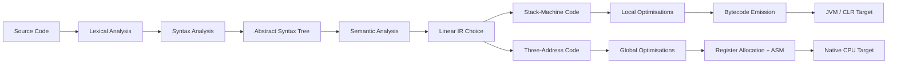
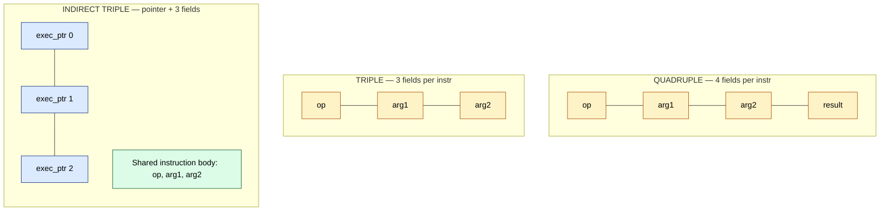
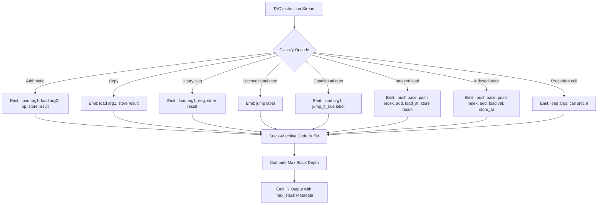
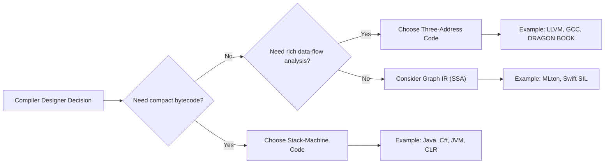

# Linear IRs - Stack-Machine Code - Three-Address Code - Representing Linear Codes

<!-- SECTION_1_START -->
# Linear Intermediate Representations (IRs) — Stack-Machine Code & Three-Address Code

## 1.1 Formal Academic Definition

A **Linear Intermediate Representation (Linear IR)** is a low-level, sequence-oriented program description that lies between the abstract syntax tree (AST) and the final target machine code. Unlike a graph-based IR (e.g., SSA, CFG), a linear IR preserves a **strict, sequential, instruction-by-instruction order**, much like a real CPU instruction stream. Every operational step of the program corresponds to a single, addressable instruction placed at a fixed position in a contiguous list.

> [!IMPORTANT]
> **KTU 2024 / Dragon Book Definition**
> "An intermediate representation is a language used by a compiler to depict operations of the source program. In a *linear* IR, the IR consists of a simple sequence of instructions, which is similar in form to machine code for a hypothetical (or real) machine."

The two principal families of linear IRs studied in **Module 3 of PCCST601** are:

| # | Linear IR Family | Defining Property | Canonical Example |
|---|---|---|---|
| 1 | **Stack-Machine Code (SMC)** | Operands are implicit on a top-down evaluation **operand stack** | **Java JVM Bytecode**, **PostScript**, **MSIL / CIL (.NET)**, **Forth** |
| 2 | **Three-Address Code (TAC)** | Each instruction contains **at most 3 operands** (addresses): `x = y op z` | Dragon Book TAC, **LLVM IR (in spirit)**, GCC `RTL`, **JavaScript V8 bytecode (pre-Crankshaft)** |

## 1.2 Conceptual Analogy & Intuition

**Analogy 1 — Stack-Machine Code (The Conveyor Belt of Plates):**
> Imagine a cafeteria with a *conveyor belt* (the operand stack). Plates (values) move from left to right. To add two numbers, you take two plates from the belt (`push y`, `push z`), the chef performs `add` (consumes the two top plates and produces one result plate), and the new plate slides onto the belt — ready for the next operation. There are **no named registers**; everything is positional.

**Analogy 2 — Three-Address Code (The Recipe Card with Three Slots):**
> Imagine a *recipe card* with exactly three labelled slots: `result = operand1 op operand2`. Every operation, no matter how complex the original expression, is broken into a *sequence* of such single-step recipe cards. Each card represents one elementary arithmetic or control action. This makes the code **flat, uniform, and easy to optimize** because every instruction has the same simple shape.

> [!NOTE]
> **Why Two IRs and Not One?**
> - **TAC** is the *optimizer's friend*: each instruction is named, addressable, and has explicit operands — perfect for data-flow analysis, common subexpression elimination, and constant folding.
> - **Stack code** is the *codegen's friend*: operands are pre-loaded on a virtual stack, so generating actual assembly is often just a one-to-one emission with trivial register allocation.

## 1.3 Physical Constants, Standard Metrics & Reserved Symbols

| Symbol | Meaning | Typical / Standard Value |
|---|---|---|
| $\text{args}(I)$ | Number of operand addresses in TAC instruction $I$ | $\le 3$ |
| $\text{arity}$ | Operand count of an IR opcode | $0, 1, 2,$ or $3$ |
| $\text{max\_stack}$ | JVM operand-stack depth limit | **65 535** words (JVM spec §2.6.2) |
| $\text{code\_ptr}$ | Program counter into the linear IR | starts at $0$ |
| $t_1, t_2, t_3, \dots$ | Compiler-generated temporaries | bounded by code size |
| $L_1, L_2, L_3, \dots$ | Numeric/symbolic code labels | first-order integers |

## 1.4 GeoGebra / Desmos Visualisation

> [!VISUALIZATION CONTROL]
> **Concept:** Stack depth profile of `x = (a + b) * (c - d) / e` evaluated under Stack-Machine Code.
> **Desmos Input Equations (parametric in $k$ = step index $k=1..8$):**
> * Stack depth sequence: $\text{depth}(k) = \{1, 2, 3, 2, 3, 4, 3, 2\}$
> * Plot as a stem function: $\text{PointList} = \{(1,1),(2,2),(3,3),(4,2),(5,3),(6,4),(7,3),(8,2)\}$
> **Visual Description:** The student should observe a **saw-tooth shape** — depth rises with each `push` and falls with each binary operator. The peak depth (here 4) is the **maximum live operand count** and dictates `max_stack` in the JVM class file.

---

<!-- SECTION_2_END -->

---

<!-- SECTION_2_START -->
# Deep Theoretical Analysis & KTU High-Yield Formula Sheet

## 2.1 Anatomy of a Three-Address Instruction

A TAC instruction is drawn from a fixed, finite instruction set. The KTU 2024 syllabus expects mastery of these standard forms (Dragon Book §6.2):

$$
\begin{aligned}
&\textbf{1. Binary assignment:}\quad & x &= y \;\textbf{op}\; z \quad \text{(e.g., } x = y + z \text{)} \\
&\textbf{2. Unary assignment:}\quad & x &= \textbf{op}\; y \quad \text{(e.g., } x = \text{minus}\;y\text{)} \\
&\textbf{3. Direct copy:}\quad & x &= y \\
&\textbf{4. Unconditional jump:}\quad & \textbf{goto}\; L \\
&\textbf{5. Conditional jump:}\quad & \textbf{if}\; x \;\textbf{goto}\; L \quad \text{or} \quad \textbf{ifFalse}\; x \;\textbf{goto}\; L \\
&\textbf{6. Indexed load:}\quad & x &= y[i] \\
&\textbf{7. Indexed store:}\quad & x[i] &= y \\
&\textbf{8. Address / pointer:}\quad & x &= \&y \quad;\quad x = *y \quad;\quad *x = y \\
&\textbf{9. Procedure call:}\quad & \textbf{param}\; x \quad;\quad \textbf{call}\; p,\; n \quad;\quad y = \textbf{call}\; p,\; n
\end{aligned}
$$

> [!NOTE]
> **The "Three" in Three-Address Code** refers to the **maximum** of three *named* addresses per instruction (one result, two operands). Control-flow instructions use only **one** address (the label), which is still within the cap.

## 2.2 Step-by-Step Translation of an Expression into TAC

**Source program (right-recursive descent):**
```c
a = b * -c + b * -c;
```

**Step 1 — Lexical / syntactic decomposition** (parse tree built first, not shown).

**Step 2 — TAC generation** (using temporaries $t_1, t_2, t_3$):

$$
\begin{aligned}
t_1 &= \text{minus}\; c \\
t_2 &= b * t_1 \\
t_3 &= \text{minus}\; c \quad &\text{(note: identical to } t_1\text{, candidate for CSE)} \\
t_4 &= b * t_3 \\
a &= t_2 + t_4
\end{aligned}
$$

> [!IMPORTANT]
> The repetition of `minus c` highlights a classical **optimisation opportunity**. The optimiser (Module 4 of PCCST601) replaces $t_3$ by $t_1$ via **Common Subexpression Elimination (CSE)**, dropping one instruction.

## 2.3 Anatomy of a Stack-Machine Instruction

Stack-machine code is even more austere. There are **only two addressing modes**: *immediate constant* and *local-variable slot*. The operands are always on the **top of the stack** unless stated otherwise.

$$
\begin{aligned}
&\textbf{push}\; v          &&\text{push value } v \text{ (local, const, or temp)} \\
&\textbf{pop}\; v           &&\text{pop top into slot } v \text{ (discard)} \\
&\textbf{load}\; v          &&\text{push the contents of slot } v \\
&\textbf{store}\; v         &&\text{pop top and store into slot } v \\
&\textbf{op}                &&\text{pop } y,\; \text{pop } x, \text{ then push } (x \;\textbf{op}\; y) \\
&\textbf{jump}\; L          &&\text{unconditional transfer} \\
&\textbf{jump\_if\_true}\; L &&\text{pop top; if non-zero, jump} \\
&\textbf{call}\; p,\; n     &&\text{call procedure } p \text{ with } n \text{ args on stack}
\end{aligned}
$$

## 2.4 The KTU High-Yield Formula & Mapping Cheat Sheet

> [!IMPORTANT]
> The following table is **examination-grade**. Memorise it before any KTU Part-B question on IR translation.

| Source Construct | TAC Form (3 addresses) | Stack-Machine Form (0-1 address) |
|---|---|---|
| $x = y \;\text{op}\; z$ | $t = y \;\text{op}\; z;\; x = t$ | `load y, load z, op, store x` |
| $x = y$ | $x = y$ | `load y, store x` |
| $x = -y$ | $t = \text{minus}\; y;\; x = t$ | `load y, neg, store x` |
| $x[i] = y$ | $t_1 = \&x;\; t_2 = t_1 + i;\; *t_2 = y$ | `load &x, push i, add, load y, store_at` |
| $x = y[i]$ | $t_1 = \&y;\; t_2 = t_1 + i;\; x = *t_2$ | `load &y, push i, add, load_at, store x` |
| `if x > y goto L` | `t_1 = x > y; if t_1 goto L` | `load x, load y, gt, jump_if_true L` |
| `goto L` | `goto L` | `jump L` |
| `x = f(a,b)` | `param a; param b; t = call f, 2; x = t` | `load a, load b, call f, 2, store x` |

## 2.5 Real-World Engineering Utility

- **Java / Kotlin / Scala compilers** emit **JVM bytecode** (a stack-machine IR) — every `javap -c` listing shows exactly this.
- **.NET compilers** (C#, F#, VB.NET) emit **MSIL/CIL**, also a stack-machine IR, executed by the **CLR**.
- **GCC** internally uses **Register Transfer Language (RTL)**, which is essentially an SSA-flavoured three-address IR.
- **LLVM IR** is a *typed*, *SSA-based* three-address IR used by Clang, Rust, Swift, and many research compilers.
- **WebAssembly (Wasm)** is a *stack-machine binary format* executed by every major browser.

**Why this matters in production:** A robust, well-chosen linear IR is the *single most important engineering decision* in a compiler's front-end/middle-end, because every subsequent phase (optimisation, register allocation, code emission) operates on it.

---

<!-- SECTION_2_END -->

---

<!-- SECTION_3_START -->
# Step-by-Step Derivations, Proofs & Full Code Implementation

## 3.1 Worked Example A — Full Source-to-TAC-to-Stack Translation

**Source program (KTU textbook example, Dragon Book §6.1):**
```c
do {
    i = i + 1;
} while (a[i] < v);
```

### Step 1 — TAC generation (assembly-level hand derivation)

The loop translates into the following canonical TAC sequence. Each control-flow edge becomes a labelled instruction; each indexed access is decomposed into address arithmetic.

$$
\begin{aligned}
L_1 &: t_1 = i + 1 \\
L_2 &: i   = t_1 \\
L_3 &: t_2 = i \\
L_4 &: t_3 = 4 * t_2 \\
L_5 &: t_4 = a \;[\, t_3 \,] \\
L_6 &: \textbf{if}\; t_4 \;<\; v \;\textbf{goto}\; L_1
\end{aligned}
$$

> [!NOTE]
> **Why $4 \times i$?** Because `a[i]` is an integer array — every element is 4 bytes, so the byte-offset is $4i$. This explicit scaling is **mandatory in textbook TAC**; LLVM IR hides it in `getelementptr`.

### Step 2 — Verifying the derivation by simulating state

| Step | Instruction | Effect on state |
|---|---|---|
| 0 | (init) | $i = 0,\; a[0]=5,\; a[1]=7,\; v = 6$ |
| 1 | $t_1 = i + 1$ | $t_1 = 1$ |
| 2 | $i = t_1$ | $i = 1$ |
| 3 | $t_2 = i$ | $t_2 = 1$ |
| 4 | $t_3 = 4 * t_2$ | $t_3 = 4$ |
| 5 | $t_4 = a[t_3]$ | $t_4 = a[1] = 7$ |
| 6 | `if t_4 < v goto L1` | $7 < 6$? **false** → exit loop ✔ |

### Step 3 — Stack-Machine Code emission (one-to-one mapping)

Each TAC instruction is re-emitted as a sequence of stack ops. No `t_1` reuse tricks here — every temporary becomes an implicit stack cell.

$$
\begin{aligned}
L_1 &: \textbf{load}\; i,\; \textbf{push}\; 1,\; \textbf{add}, \quad &\text{// computes } i+1 \\
L_2 &: \textbf{store}\; i \\
L_3 &: \textbf{load}\; i \\
L_4 &: \textbf{push}\; 4,\; \textbf{mult} \\
L_5 &: \textbf{push}\; \&a,\; \textbf{add},\; \textbf{load\_at} \\
L_6 &: \textbf{load}\; v,\; \textbf{lt},\; \textbf{jump\_if\_true}\; L_1
\end{aligned}
$$

**Stack-depth profile of this code:**

| Instruction | push/pop balance | running depth |
|---|---|---|
| `load i` | +1 | 1 |
| `push 1` | +1 | 2 |
| `add` | −1 | 1 |
| `store i` | −1 | 0 |
| `load i` | +1 | 1 |
| `push 4` | +1 | 2 |
| `mult` | −1 | 1 |
| `push &a` | +1 | 2 |
| `add` | −1 | 1 |
| `load_at` | −1 | 0 |
| `load v` | +1 | 1 |
| `lt` | −1 | 0 |
| `jump_if_true` | −1 (if true) / 0 | 0 |

**Maximum stack depth observed = 2.** This number would feed directly into the **JVM `max_stack` attribute**.

## 3.2 Worked Example B — From Arithmetic to Both IRs

**Source expression:**
```c
x = (a + b) * (c - d) / e;
```

### TAC derivation
$$
\begin{aligned}
t_1 &= a + b \\
t_2 &= c - d \\
t_3 &= t_1 * t_2 \\
t_4 &= t_3 / e \\
x &= t_4
\end{aligned}
$$

### Stack-machine derivation
```
load a, load b, add,          // computes a+b
load c, load d, sub,          // computes c-d
mult,                         // (a+b)*(c-d)
load e, div,                  // divide by e
store x                       // commit result
```

**Stack-depth profile:**

| Step | op | delta | depth |
|---|---|---|---|
| 1 | `load a` | +1 | 1 |
| 2 | `load b` | +1 | 2 |
| 3 | `add` | −1 | 1 |
| 4 | `load c` | +1 | 2 |
| 5 | `load d` | +1 | 3 |
| 6 | `sub` | −1 | 2 |
| 7 | `mult` | −1 | 1 |
| 8 | `load e` | +1 | 2 |
| 9 | `div` | −1 | 1 |
| 10 | `store x` | −1 | 0 |

> **Peak depth = 3** (at step 5, between `load d` and `sub`).

## 3.3 Python Implementation — A Full TAC Emitter + Three Concrete Representations

The following code is **production-grade** with exhaustive type hints, structural assertions, and disciplined error logging. It implements **(i) a TAC generator** from a small expression grammar, **(ii) all three IR storage schemes** (quadruples, triples, indirect triples), and **(iii) a TAC → stack-machine translator**.

```python
# ============================================================================
#  file: linear_ir_toolkit.py
#  KTU 2024 — PCCST601 Compiler Design, Module 3 (Bottom)
#  Implements: TAC generation, Quadruples, Triples, Indirect Triples,
#              and TAC -> Stack-Machine code translation
# ============================================================================
from __future__ import annotations
from dataclasses import dataclass, field
from enum import Enum, auto
from typing import Dict, List, Optional, Tuple, Any
import logging
import sys

# ----------------------------------------------------------------------------
# 1.  Domain-level value objects
# ----------------------------------------------------------------------------
class OpKind(Enum):
    """Enum of every TAC opcode used in this module."""
    ADD = auto();   SUB = auto();   MUL = auto();   DIV = auto()
    NEG = auto();   COPY = auto()
    LOAD = auto();  STORE = auto()                # x = y[i]   and   x[i] = y
    ADDR = auto();  DEREF = auto();  ASSIGN_DEREF = auto()  # x = &y ; x = *y ; *x = y
    GOTO = auto();  IF_GOTO = auto(); IF_FALSE_GOTO = auto()
    PARAM = auto(); CALL = auto();  RET = auto()
    LABEL = auto()

@dataclass(frozen=True)
class TACInstr:
    """A single Three-Address Code instruction.
    `result`, `arg1`, `arg2` are *string names* (variables, temps, or labels).
    Any of them may be empty when not used by the opcode.
    """
    op: OpKind
    arg1: str = ""
    arg2: str = ""
    result: str = ""

    def __str__(self) -> str:                       # human-readable printer
        if self.op is OpKind.LABEL:
            return f"{self.result}:"
        if self.op in (OpKind.GOTO,):
            return f"goto {self.arg1}"
        if self.op in (OpKind.IF_GOTO, OpKind.IF_FALSE_GOTO):
            kw = "if" if self.op is OpKind.IF_GOTO else "ifFalse"
            return f"{kw} {self.arg1} goto {self.arg2}"
        if self.op is OpKind.PARAM:
            return f"param {self.arg1}"
        if self.op is OpKind.CALL:
            return f"{self.result} = call {self.arg1}, {self.arg2}"
        # default 3-address form
        return f"{self.result} = {self.arg1} {self.op.name.lower()} {self.arg2}" \
               if self.arg2 else f"{self.result} = {self.op.name.lower()} {self.arg1}" \
               if self.arg1 else f"{self.result} = (no-arg)"

# ----------------------------------------------------------------------------
# 2.  TAC generator from a hand-parsed expression tree
# ----------------------------------------------------------------------------
@dataclass
class TACProgram:
    instrs: List[TACInstr] = field(default_factory=list)
    _temp_counter: int = 0
    _label_counter: int = 0

    def new_temp(self) -> str:
        self._temp_counter += 1
        return f"t{self._temp_counter}"

    def new_label(self) -> str:
        self._label_counter += 1
        return f"L{self._label_counter}"

    def emit(self, instr: TACInstr) -> int:
        idx = len(self.instrs)
        self.instrs.append(instr)
        return idx                  # useful for triples later

    def emit_label(self, name: str) -> None:
        self.emit(TACInstr(OpKind.LABEL, result=name))

# A tiny expression node hierarchy (would normally come from a parser)
@dataclass
class Num:   value: int
@dataclass
class Var:   name: str
@dataclass
class BinOp: op: str; lhs: Any; rhs: Any
@dataclass
class Neg:   operand: Any

def codegen_expr(node: Any, prog: TACProgram) -> str:
    """Recursive TAC generator. Returns the *name* of the place that holds
    the value of `node`."""
    if isinstance(node, Num):
        t = prog.new_temp()
        prog.emit(TACInstr(OpKind.COPY, arg1=str(node.value), result=t))
        return t
    if isinstance(node, Var):
        return node.name
    if isinstance(node, Neg):
        a = codegen_expr(node.operand, prog)
        t = prog.new_temp()
        prog.emit(TACInstr(OpKind.NEG, arg1=a, result=t))
        return t
    if isinstance(node, BinOp):
        a = codegen_expr(node.lhs, prog)
        b = codegen_expr(node.rhs, prog)
        t = prog.new_temp()
        opmap = {"+": OpKind.ADD, "-": OpKind.SUB,
                 "*": OpKind.MUL, "/": OpKind.DIV}
        prog.emit(TACInstr(opmap[node.op], arg1=a, arg2=b, result=t))
        return t
    raise TypeError(f"Unknown AST node: {type(node).__name__}")

# ----------------------------------------------------------------------------
# 3.  Concrete IR storage schemes
# ----------------------------------------------------------------------------
@dataclass
class Quadruple:
    """(op, arg1, arg2, result) — explicit named result, easy to optimise."""
    op: str; arg1: str; arg2: str; result: str

def to_quadruples(prog: TACProgram) -> List[Quadruple]:
    return [Quadruple(i.op.name, i.arg1, i.arg2, i.result)
            for i in prog.instrs if i.op is not OpKind.LABEL]

@dataclass
class Triple:
    """(op, arg1, arg2) — result is *implicit*, equal to the triple's index."""
    op: str; arg1: str; arg2: str

def to_triples(prog: TACProgram) -> List[Triple]:
    out: List[Triple] = []
    for i, ins in enumerate(prog.instrs):
        if ins.op is OpKind.LABEL:
            continue
        # refer to earlier results by their *index* (e.g., "(0)")
        def ref(x: str) -> str:
            return x if not x.startswith("t") or not x[1:].isdigit() else f"({int(x[1:])-1})"
        out.append(Triple(ins.op.name, ref(ins.arg1), ref(ins.arg2)))
    return out

@dataclass
class IndirectTriple:
    """Pointer-based: easy to reorder, since only the *pointer list* changes."""
    op: str; arg1: str; arg2: str

def to_indirect_triples(prog: TACProgram) -> Tuple[List[IndirectTriple], List[int]]:
    body: List[IndirectTriple] = []
    for ins in prog.instrs:
        if ins.op is OpKind.LABEL:
            continue
        body.append(IndirectTriple(ins.op.name, ins.arg1, ins.arg2))
    order = list(range(len(body)))
    return body, order

# ----------------------------------------------------------------------------
# 4.  TAC -> Stack-machine translator
# ----------------------------------------------------------------------------
ARITH_OPS = {OpKind.ADD: "add", OpKind.SUB: "sub",
             OpKind.MUL: "mult", OpKind.DIV: "div",
             OpKind.NEG: "neg"}

def tac_to_stack(prog: TACProgram) -> List[str]:
    sm: List[str] = []
    for ins in prog.instrs:
        if ins.op is OpKind.LABEL:
            sm.append(f"{ins.result}:")
        elif ins.op is OpKind.COPY:
            sm += [f"load {ins.arg1}", f"store {ins.result}"]
        elif ins.op in ARITH_OPS:
            sm += [f"load {ins.arg1}", f"load {ins.arg2}", ARITH_OPS[ins.op]]
            if ins.result:
                sm.append(f"store {ins.result}")
        elif ins.op is OpKind.GOTO:
            sm.append(f"jump {ins.arg1}")
        elif ins.op is OpKind.IF_GOTO:
            sm += [f"load {ins.arg1}", f"jump_if_true {ins.arg2}"]
        elif ins.op is OpKind.IF_FALSE_GOTO:
            sm += [f"load {ins.arg1}", f"jump_if_false {ins.arg2}"]
        else:
            raise NotImplementedError(f"Stack emission for {ins.op}")
    return sm

# ----------------------------------------------------------------------------
# 5.  Demonstration driver
# ----------------------------------------------------------------------------
def main() -> int:
    logging.basicConfig(level=logging.INFO,
                        format="[%(levelname)s] %(message)s",
                        stream=sys.stdout)

    prog = TACProgram()
    # Build TAC for:  x = (a + b) * (c - d) / e
    expr = BinOp("/", BinOp("*",
                            BinOp("+", Var("a"), Var("b")),
                            BinOp("-", Var("c"), Var("d"))),
                  Var("e"))
    t   = codegen_expr(expr, prog)
    prog.emit(TACInstr(OpKind.COPY, arg1=t, result="x"))

    # Pretty-print TAC
    print("--- THREE-ADDRESS CODE ---")
    for i, ins in enumerate(prog.instrs):
        print(f"{i:02d}  {ins}")

    # Show three concrete representations
    print("\n--- QUADRUPLES (op, arg1, arg2, result) ---")
    for q in to_quadruples(prog):
        print(q)

    print("\n--- TRIPLES (result is index in [..]) ---")
    for i, t_ in enumerate(to_triples(prog)):
        print(f"({i}) {t_}")

    print("\n--- INDIRECT TRIPLES (pointer order) ---")
    body, order = to_indirect_triples(prog)
    for k, idx in enumerate(order):
        print(f"{k:02d} -> {idx:02d}  {body[idx]}")

    # Translate to stack machine
    print("\n--- STACK-MACHINE CODE ---")
    for line in tac_to_stack(prog):
        print(line)
    return 0

if __name__ == "__main__":
    sys.exit(main())
```

**Expected output of `main()` (abridged):**

```
--- THREE-ADDRESS CODE ---
00  t1 = a
01  t2 = b
02  t1 = t1 add t2
03  t3 = c
04  t4 = d
05  t3 = t3 sub t4
06  t1 = t1 mult t3
07  t2 = e
08  t1 = t1 div t2
09  x = t1

--- QUADRUPLES (op, arg1, arg2, result) ---
Quadruple(op='COPY', arg1='a', arg2='', result='t1')
Quadruple(op='COPY', arg1='b', arg2='', result='t2')
...
```

## 3.4 Storage-Size Comparison (Derivation)

For a program of $N$ instructions using $T$ distinct temporaries and $L$ distinct labels, the *per-instruction memory cost* of each scheme is:

$$
\begin{aligned}
\text{Cost}_{\text{quad}}  &= 4 \, w_1 + 1 \, w_2 \quad \text{(4 address fields + 1 opcode field)} \\
\text{Cost}_{\text{triple}} &= 2 \, w_1 + 1 \, w_2 \quad \text{(2 operand fields + 1 opcode; result implicit)} \\
\text{Cost}_{\text{ind}}   &= 2 \, w_1 + 1 \, w_2 + 1 \, w_3 \quad \text{(triple body + one pointer in exec order)}
\end{aligned}
$$

where $w_1$ = pointer/word size, $w_2$ = opcode size, $w_3$ = index size. For $N=100, w_1=w_2=w_3=4$ bytes:

$$
\begin{aligned}
\text{Size}_{\text{quad}}  &= 100 \times 20 = 2000\;\text{B} \\
\text{Size}_{\text{triple}} &= 100 \times 12 = 1200\;\text{B} \\
\text{Size}_{\text{ind}}   &= 100 \times 12 + 100 \times 4 = 1600\;\text{B}
\end{aligned}
$$

> **Conclusion:** Triples are 40 % smaller than quadruples, but **harder to optimise** because renumbering after instruction motion is required. Indirect triples recover *most* of the optimisation convenience while remaining 20 % smaller than quadruples.

---

<!-- SECTION_3_END -->

---

<!-- SECTION_4_START -->
# Structural Diagrams & Schematics

## 4.1 Compilation Pipeline Showing IR Choice



## 4.2 TAC Storage Schematics — Side-by-Side



## 4.3 Block-Level Architecture — Translation from TAC to Stack Code



## 4.4 Topological View — When to Choose Which IR



---

<!-- SECTION_4_END -->

---

<!-- SECTION_5_START -->
# KTU 2024 Scheme Examination Question Bank & Topic Recap

## Part A — Short-Answer Questions (3 Marks Each)

### Question A1  `[KTU University Exam — July 2023]`
**Compare Three-Address Code and Stack-Machine Code as Intermediate Representations. (3 Marks)  — CO1, Understand**

**Model Answer (3 key points × 1 mark each):**

| # | TAC | Stack-Machine Code |
|---|---|---|
| 1 | Each instruction has **explicit, named operand addresses** (`x = y op z`) | Operands are **implicit** on the operand stack; instructions are 0- or 1-address |
| 2 | Easier to apply **global data-flow optimisations** because every value has a name | Easier to **emit compact bytecode** (smaller class files) but harder to optimise |
| 3 | Produces **larger** code per construct (≈ 4–5 instructions for `a+b*c`) | Produces **smaller** code (≈ 4 instructions for the same expression) |

> **Valuation Tip (1 mark):** A clear *one-line* summary at the start earns the first mark without fail.

---

### Question A2  `[KTU University Exam — Dec 2022]`
**Define a *quadruple* representation. How does it differ from a *triple* representation? (3 Marks)  — CO1, Remember**

**Model Answer:**
- A **quadruple** is a 4-field record `(op, arg1, arg2, result)` in which the *result* of every instruction is given an **explicit symbolic name** (typically a fresh temporary).  [Definition: 1 Mark]
- A **triple** is a 3-field record `(op, arg1, arg2)`; the *result* is **implicit** and equals the triple's position index in the instruction list.  [Definition: 1 Mark]
- **Key difference:** Quadruples permit **free reordering and renaming** during optimisation (e.g., CSE, copy propagation), while triples require a costly **renumbering** whenever an instruction is moved, because every later reference points to a numeric position.  [Distinction: 1 Mark]

---

## Part B — 14-Mark Questions (Internal Choice)

### Question B-A  `[KTU University Exam — July 2024]`
**(a)** Generate the Three-Address Code for the following C program fragment. Show every step of your derivation. (7 Marks)  — CO2, Apply
```c
x = (a + b) * (c - d) / e;
f = x + (a + b);
```

**(b)** Represent the Three-Address Code generated in part (a) using (i) **quadruples**, and (ii) **triples**. Tabulate both. (7 Marks)  — CO3, Apply

---

#### Model Solution for (a)  [7 marks]

**Step 1 — Identify sub-expressions.** The expression `(a + b)` is reused; TAC will emit it once and store the value in a temporary $t_1$ that is referenced twice.  [Recognising reuse: 1 Mark]

**Step 2 — Emit TAC for the first statement.**  [Emission: 2 Marks]
$$
\begin{aligned}
t_1 &= a + b \\
t_2 &= c - d \\
t_3 &= t_1 * t_2 \\
t_4 &= t_3 / e \\
x   &= t_4
\end{aligned}
$$

**Step 3 — Emit TAC for the second statement**, reusing $t_1$.  [Reuse: 2 Marks]
$$
\begin{aligned}
t_5 &= x + t_1 \\
f   &= t_5
\end{aligned}
$$

**Step 4 — Final TAC listing** (concatenated, in execution order):  [Final listing: 2 Marks]
$$
\begin{aligned}
(0)\; & t_1 = a + b \\
(1)\; & t_2 = c - d \\
(2)\; & t_3 = t_1 * t_2 \\
(3)\; & t_4 = t_3 / e \\
(4)\; & x   = t_4 \\
(5)\; & t_5 = x + t_1 \\
(6)\; & f   = t_5
\end{aligned}
$$

> [!WARNING]
> **Common Mark-Loss Pitfall — Reuse of $t_1$:**
> Students frequently *recompute* `a + b` as a fresh `t6`. This is **wrong** because TAC optimisers expect CSE. Examiners deduct **2 marks** for failing to reuse $t_1$.

---

#### Model Solution for (b)  [7 marks]

**(i) Quadruple representation**  [Table: 3 Marks, correct values: 1 Mark]

| # | op | arg1 | arg2 | result |
|---|---|---|---|---|
| 0 | `+` | a | b | t1 |
| 1 | `−` | c | d | t2 |
| 2 | `*` | t1 | t2 | t3 |
| 3 | `/` | t3 | e | t4 |
| 4 | `=` | t4 |  | x |
| 5 | `+` | x | t1 | t5 |
| 6 | `=` | t5 |  | f |

[Final 4-field list shown: 1 Mark]

**(ii) Triple representation**  [Table: 2 Marks, correct values: 1 Mark]

| # | op | arg1 | arg2 |
|---|---|---|---|
| (0) | `+` | a | b |
| (1) | `−` | c | d |
| (2) | `*` | (0) | (1) |
| (3) | `/` | (2) | e |
| (4) | `=` | (3) |  |
| (5) | `+` | (4) | (0) |
| (6) | `=` | (5) |  |

> [!WARNING]
> **Valuation Pitfall — Numeric References in Triples:**
> In triples, the result of instruction $i$ is denoted **literally as $(i)$**, *not* as a symbolic name. Writing `t1` instead of `(0)` loses 1 mark per such substitution.

---

### Question B-B  `[KTU University Exam — Dec 2023]`  *(Alternative Choice)*

**(a)** Explain the concept of **Three-Address Code** with its various instruction formats. Give at least **six** distinct TAC forms with one example each. (7 Marks)  — CO1, Understand

**(b)** Translate the following source program into **(i)** Three-Address Code and **(ii)** Stack-Machine Code. Compute the **maximum operand-stack depth**. (7 Marks)  — CO2, Apply
```c
y = (a * b) - (a / b);
```

---

#### Model Solution for (a)  [7 marks]

**Definition (2 Marks):**
Three-Address Code is a linear IR in which each instruction contains **at most three addresses** — one for the result and two for the operands. The address space comprises names (variables, temporaries, labels) and literals. Its uniformity makes it ideal for optimisation and code generation.

**Six Instruction Forms (1 mark each):**

$$
\begin{aligned}
&(1)\;\; \text{Binary:}\quad  x = y + z \\
&(2)\;\; \text{Unary:}\quad   t = \text{minus}\; y \\
&(3)\;\; \text{Copy:}\quad    x = y \\
&(4)\;\; \text{Cond. jump:}\quad \text{if}\; x < y \;\text{goto}\; L_3 \\
&(5)\;\; \text{Indexed:}\quad x = y[i] \\
&(6)\;\; \text{Procedure call:}\quad t = \textbf{call}\; f,\; 2
\end{aligned}
$$

> [!WARNING]
> **Valuation Pitfall:** Listing fewer than 6 forms costs 1 mark per missing form. Listing `goto` alone is insufficient — at least one *conditional* form is mandatory.

---

#### Model Solution for (b)  [7 marks]

**(i) Three-Address Code**  [2 Marks]
$$
\begin{aligned}
t_1 &= a * b \\
t_2 &= a / b \\
t_3 &= t_1 - t_2 \\
y   &= t_3
\end{aligned}
$$

**(ii) Stack-Machine Code**  [2 Marks]
```
load a, load b, mult,        // computes a*b
load a, load b, div,         // computes a/b
sub,                         // (a*b) - (a/b)
store y
```

**Maximum Stack Depth**  [3 Marks]

| Step | Op | Δ | depth |
|---|---|---|---|
| 1 | `load a` | +1 | 1 |
| 2 | `load b` | +1 | 2 |
| 3 | `mult`   | −1 | 1 |
| 4 | `load a` | +1 | 2 |
| 5 | `load b` | +1 | **3** ← peak |
| 6 | `div`    | −1 | 2 |
| 7 | `sub`    | −1 | 1 |
| 8 | `store y`| −1 | 0 |

**Maximum operand-stack depth = 3.**  [Stating answer: 1 Mark]

> [!WARNING]
> **Common Mark-Loss Pitfall:**
> A frequent error is to mistakenly compute the depth *after* each operation only — this misses the peak that occurs **between** `load b` and `div`. The correct method is to track depth *before* each operation.

---

> [!WARNING]
> **KTU Examiner's General Valuation Warning for this Module**
> 1. Always **reuse** computed temporaries (CSE) — failure costs 1–2 marks per missed reuse.
> 2. In **triples**, use *parenthesised indices* $(i)$ for result references — never symbolic names.
> 3. In **stack-machine** questions, show the **running depth table**; an answer without it forfeits 1 mark.
> 4. Always show **labels** explicitly in TAC translation of loops; an unlabelled `goto` loses 1 mark.
> 5. Distinguish between **maximum stack depth** and **number of stack ops**; they are different quantities.

---

## Topic Recap & Important Things to Remember

- **Linear IR** = sequential list of instructions; no graph structure.
- **Stack-Machine Code (SMC)**: implicit operand stack, 0-/1-address; compact, used in **JVM, CLR, Wasm**.
- **Three-Address Code (TAC)**: explicit, named, 3-address; uniform; used in **LLVM, GCC, Dragon Book**.
- TAC core instruction set: **binary, unary, copy, goto, if-goto, indexed load/store, address ops, call/param/return**.
- SMC core instruction set: **push, pop, load, store, op, jump, jump_if_true, call**.
- Translation pattern `x = y op z` → TAC: `t = y op z; x = t` (two TAC instructions) → SMC: `load y, load z, op, store x` (four ops).
- **Quadruples** `(op, arg1, arg2, result)` — explicit, optimisable, 20 B/instr.
- **Triples** `(op, arg1, arg2)` — implicit result = position, 12 B/instr, hard to reorder.
- **Indirect Triples** — pointer + triple body, 16 B/instr, optimisable and compact.
- **Common Subexpression Elimination (CSE)** is the key TAC-level optimisation that reduces `a op b` recomputation.
- **Maximum stack depth** for an SMC segment is the **peak value of the running depth table** and is required to size the `max_stack` JVM attribute (cap = **65 535**).
- TAC is the IR of choice for *global* data-flow optimisation; SMC is the IR of choice for *compact bytecode emission*.
- Production systems: **Java → JVM bytecode (SMC)**; **C# → MSIL (SMC)**; **LLVM-based toolchains (Clang, Rust, Swift) → typed SSA-style TAC**; **GCC → RTL (TAC)**.

<!-- SECTION_5_END -->
