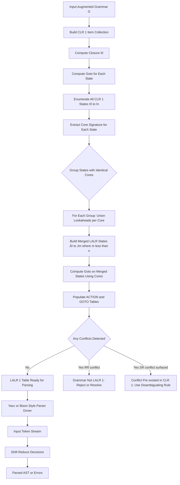
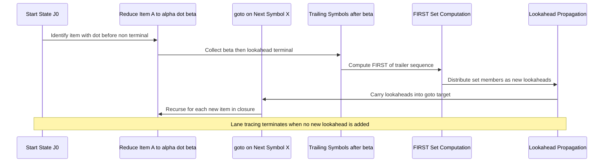
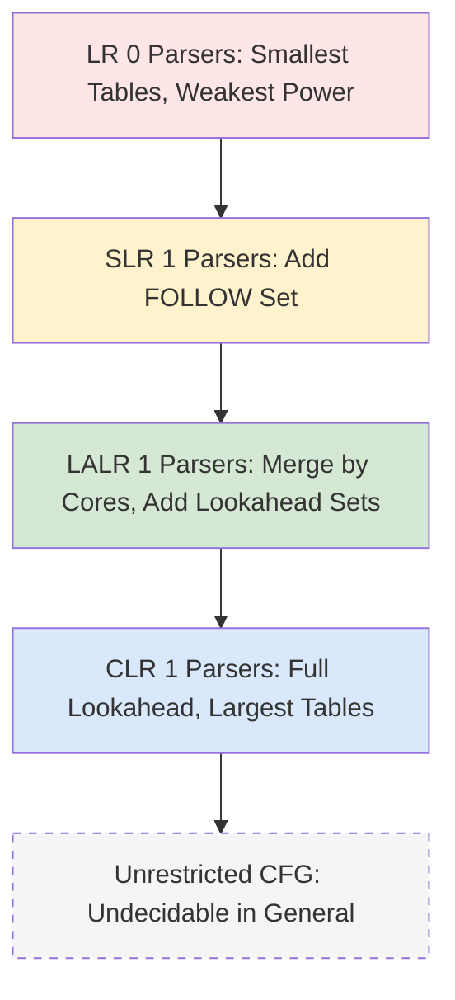

# Reducing the Size of LR (1) Tables

<!-- SECTION_1_START -->
# Reducing the Size of LR(1) Tables — The LALR Approach

> [!IMPORTANT]
> **KTU 2024 Syllabus Mapping (PCCST601 — Module 3 Bottom-Half):**
> This topic directly addresses *Look-Ahead LR (LALR) Parsers*, the canonical method for compacting canonical LR(1) parsing tables without sacrificing the practical power of LR(1) parsing. It is a **frequently repeated 14-mark question** in KTU University Examinations.

## 1.1 Formal Academic Definition

A **Canonical LR(1) Item** is a pair $[A \to \alpha \cdot \beta, \, a]$ where $A \to \alpha \beta$ is a production and $a$ is a **lookahead terminal** (or \$). A grammar is **LR(k)** if its canonical collection of LR(1) sets of items yields a deterministic parser for a **lookahead of $k$ tokens** ($k=1$ in our case).

The **LR(1) parsing table** can contain **thousands of states** for realistic programming languages because the lookahead multiplies state count. **LALR (Look-Ahead LR)** is a technique that **merges LR(1) states having identical *cores*** (the production-with-dot part, ignoring lookahead), dramatically reducing table size — typically to the same order of magnitude as an SLR(1) table while preserving most of CLR(1)'s expressive power.

**Core of an LR(1) item** — The core of $[A \to \alpha \cdot \beta, \, a]$ is the LR(0) item $A \to \alpha \cdot \beta$ (lookahead stripped away).

> [!NOTE]
> **Key Theorem (DeRemer & Pennello, 1982):** If the merged LALR grammar has no *new* shift-reduce conflicts, it accepts **exactly the same language** as the original LR(1) grammar. LALR may *introduce* reduce-reduce conflicts that did not exist in CLR(1), but it can never introduce new shift-reduce conflicts.

## 1.2 Intuitive Analogy — The "Family Reunion" Metaphor

Imagine the canonical LR(1) collection of states as **a huge family gathering**, where every person (state) wears a name tag (lookahead). Many relatives share the **same family name and same story** (the *core*), differing only by their personal nickname. 

- **Canonical LR(1)** keeps every cousin separately, leading to a **huge, redundant guest list**.
- **LALR** says: *"If two guests share the same family name (core), merge them into a single entry whose nicknames form a set of lookaheads."* This compresses the guest list dramatically.

The cost? When you merge cousins, their *combined* lookaheads might now include a terminal that, in the original CLR(1), only triggered a reduction in *one* of the merged states. This can manufacture a **reduce-reduce conflict** that the original grammar never had.

> [!TIP]
> **Geometric Intuition:** Picture each LR(1) state as a point in a high-dimensional space. LALR is a projection onto a lower-dimensional subspace (the *core space*). Two states with the same core are *collapsing onto a single point*. The projection preserves the **language** but may collapse distinct behaviors into a conflict.

## 1.3 Standard Metrics & Constants

| Metric | Value | Meaning |
|---|---|---|
| **Lookahead depth $k$** | **$k = 1$** | LR(1) / LALR(1) standard |
| **End-of-input marker** | **\$\)** | Augmented grammar's start symbol follow-set |
| **LALR table size** | **≈ SLR(1) size** | In terms of number of states |
| **Typical state reduction** | **$\approx 50\%$** | Of CLR(1) states, for practical grammars |

> [!VISUALIZATION CONTROL]
> **Concept:** LR(1) State Merging via Identical Cores
> **Mermaid / Conceptual Plot Coordinates:**
> * State C1: `core = [S' → ·S, $]`, `lookahead = {$}`
> * State C2: `core = [S' → ·S, $]`, `lookahead = {a, b}`
> * Merged C12: `core = [S' → ·S, $]`, `lookahead = {$ ∪ a ∪ b}`
> **Visual Description:** Two points on the *core-axis* with different *lookahead-labels* project vertically onto a single core-point whose lookahead-label is the **set union** of all contributing labels.

---

<!-- SECTION_1_END -->

<!-- SECTION_2_START -->
# Deep Theoretical Analysis & KTU High-Yield Formula Sheet

## 2.1 Why LR(1) Tables Are Large — The Multiplication Effect

For each LR(0) state (core), the number of LR(1) variants can be as large as the number of distinct terminal symbols that can validly follow the non-terminal on different paths through the grammar. In algebraic terms, if a core $C$ has $n$ distinct lookaheads in different contexts, the canonical collection will store **$n$ separate copies** of $C$. **LALR eliminates this redundancy.**

## 2.2 The LALR Construction — Stepwise Logic

1. **Build the full CLR(1) collection of sets of items** using the standard `closure()` and `goto()` functions augmented with FIRST-set propagation.
2. **Identify core-equivalence classes:** Two LR(1) states $I_i$ and $I_j$ are core-equivalent iff for every item $[A \to \alpha \cdot \beta, a] \in I_i$, the item $[A \to \alpha \cdot \beta, a] \in I_j$ shares the *same* core $A \to \alpha \cdot \beta$.
3. **Merge each equivalence class** into a single LALR state. The merged state's lookahead for each core item is the **set-union** of all lookaheads from the contributing CLR(1) states.
4. **Compute `goto()` for the merged states** using the same function on cores. The `goto` of a merged state on symbol $X$ is the merged state whose core equals `goto(core_i, X)` for any contributing state $i$.
5. **Reconstruct the parsing table** with the merged states. The `ACTION` and `GOTO` entries are inherited from the contributing CLR(1) states, taking unions where lookaheads overlap.
6. **Conflict check:** Examine merged states for shift-reduce or reduce-reduce conflicts. LALR can produce **reduce-reduce conflicts** that CLR(1) would not have; if any exist, the grammar is **not LALR(1)**.

## 2.3 Conflict Behaviour — The Critical Distinction

> [!IMPORTANT]
> **Why LALR never introduces new shift-reduce conflicts:**
> A shift action on terminal $a$ depends only on the **core** (specifically, the presence of an item $[B \to \beta \cdot a \gamma, b]$). Merging states adds lookaheads to reduce-items, never to shift-items. Hence shift behaviour is preserved exactly.
>
> **Why LALR *can* introduce reduce-reduce conflicts:**
> Two reduce actions differing only in lookaheads in CLR(1) can be merged into a single reduce action whose lookahead set spans a terminal that, in CLR(1), belonged to a *different* reduce action. This creates a new reduce/reduce ambiguity.

## 2.4 The Efficient Lane Tracing Algorithm (Optional — KTU Bonus)

Instead of materialising the entire CLR(1) collection (memory expensive), the **lane-tracing** method propagates lookaheads along the LR(0) DFA's graph using a work-list of "ripples." For each LR(0) item $A \to \alpha \cdot \beta$, the algorithm computes its lookahead set $LA$ by:

$$ LA(A \to \alpha \cdot \beta) = \bigcup_{\text{paths } \pi \text{ from } S' \text{ to this item}} \mathrm{FIRST}(\beta \cdot \text{trailing symbols after } \beta) $$

implemented via a transitive closure over the DFA's edges.

## 2.5 KTU Formula Sheet / Cheat Sheet

| Concept | Notation / Equation | Meaning | KTU Weight |
|---|---|---|---|
| **Canonical LR(1) Item** | $[A \to \alpha \cdot \beta, a]$ | Production $A \to \alpha \beta$ with lookahead $a \in T \cup \{\$\}$ | High |
| **Core of an Item** | $\text{core}([A \to \alpha \cdot \beta, a]) = A \to \alpha \cdot \beta$ | LR(0) skeleton, lookahead stripped | High |
| **Merged Lookahead Set** | $LA_{\text{merged}}(A \to \alpha \cdot \beta) = \bigcup_{i \in \text{class}} LA_i(A \to \alpha \cdot \beta)$ | Set union over all CLR(1) states in the equivalence class | High |
| **goto on merged states** | $\text{goto}_{\text{LALR}}(I, X) = J \;\text{where}\; \text{core}(J) = \text{goto}(\text{core}(I), X)$ | Determined solely by cores | Medium |
| **Augmented Start** | $S' \to S$ | Always added; ensures one accepting state | Always |
| **End Marker** | **\$\)** | Sentinel lookahead; never appears in source | Always |
| **State count ratio (typical)** | $\vert \text{LALR}\vert \;\approx\; \vert \text{SLR}\vert \;\ll\; \vert \text{CLR}\vert$ | LALR has same state count as SLR, fewer conflicts | High |
| **Power Hierarchy** | $\text{LR}(0) \subseteq \text{SLR} \subseteq \text{LALR} \subseteq \text{CLR}$ | Strict containment of grammar classes | High |

> [!WARNING]
> **Do NOT write `LR(0) ⊂ LALR ⊂ CLR`** in the exam without justification. The hierarchy is **strict subset** but the *parser implementation* differs: a CLR parser uses more memory, an LALR parser uses less, and an SLR parser uses the least.

## 2.6 Real-World Engineering Utility

- **Yacc / Bison / CUP** — virtually every production compiler-compiler uses **LALR(1)** because the table fits in tens of kilobytes, whereas CLR(1) would require megabytes.
- **GLR parsers** (e.g., `libxml2`, `Dypgen`) — fall back to LALR for the deterministic fast-path and use GLR only on ambiguous regions.
- **Embedded systems & bootloaders** — where memory is at a premium, LALR is the parser of choice.
- **IDE language servers** — incremental reparsing benefits from the compact table size.

---

<!-- SECTION_2_END -->

<!-- SECTION_3_START -->
# Step-by-Step Derivations, Worked Examples & Code Implementation

## 3.1 Complete Worked Example — LALR Construction

**Grammar $G$ (augmented):**

$$
\begin{aligned}
0:&\quad S' \to S \\
1:&\quad S \to L = R \\
2:&\quad S \to R \\
3:&\quad L \to * \, R \\
4:&\quad L \to \text{id} \\
5:&\quad R \to L
\end{aligned}
$$

This is the **classic Aho/Sethi/Ullman example** (Dragon Book, Section 4.7). We will:
1. Construct the CLR(1) collection.
2. Identify core-equivalent states.
3. Merge them to obtain the LALR collection.
4. Build the LALR parsing table.

### 3.1.1 Step 1 — Full CLR(1) Collection (derived closure & goto)

After running the standard CLR(1) item construction (closure with FIRST-set propagation of lookaheads), the canonical collection consists of **10 states** $I_0, I_1, \dots, I_9$. Listing them:

$$
\begin{aligned}
I_0:\;& [S' \to \cdot S, \, \$], \quad [S \to \cdot L = R, \, \$], \quad [S \to \cdot R, \, \$],\\
     & [L \to \cdot * R, \, \$/=], \quad [L \to \cdot \text{id}, \, \$/=], \quad [R \to \cdot L, \, \$] \\[4pt]
I_1:\;& [S' \to S \cdot, \, \$] \\[4pt]
I_2:\;& [S \to L \cdot = R, \, \$], \quad [R \to L \cdot, \, \$] \\[4pt]
I_3:\;& [S \to R \cdot, \, \$] \\[4pt]
I_4:\;& [L \to * \cdot R, \, \$/=], \quad [R \to \cdot L, \, \$/=], \quad [L \to \cdot * R, \, \$/=], \quad [L \to \cdot \text{id}, \, \$/=] \\[4pt]
I_5:\;& [L \to \text{id} \cdot, \, \$/=] \\[4pt]
I_6:\;& [S \to L = \cdot R, \, \$], \quad [R \to \cdot L, \, \$], \quad [L \to \cdot * R, \, \$], \quad [L \to \cdot \text{id}, \, \$] \\[4pt]
I_7:\;& [L \to * R \cdot, \, \$/=] \\[4pt]
I_8:\;& [R \to L \cdot, \, \$/=] \\[4pt]
I_9:\;& [S \to L = R \cdot, \, \$]
\end{aligned}
$$

### 3.1.2 Step 2 — Identify Core-Equivalent Pairs

Examine all 10 states for **identical cores** (lookaheads ignored):

- **$I_2$ and $I_8$** — both have core $\{S \to L \cdot = R,\; R \to L \cdot\}$.
  - $I_2$ lookaheads: $\{=\} \cup \{\$\}$ → reduce $R \to L$ on $\$$
  - $I_8$ lookaheads: $\{\$/=\}$ → reduce $R \to L$ on $\$/=$

  These two are core-equivalent and will be merged.

- **$I_4$ and $I_6$** — both have cores involving $L \to * \cdot R$ and $R \to \cdot L$.
  - $I_4$ lookaheads: $\{\$/=\}$
  - $I_6$ lookaheads: $\{\$\}$

  These two are core-equivalent and will be merged.

- All other states are **unique** in their cores.

> [!NOTE]
> This is the **critical observation**: A LALR(1) grammar can still have a reduce-reduce conflict emerge from the merge of $I_2$ and $I_8$ (they both reduce $R \to L$ on overlapping terminals). In this specific example, the merge is *safe* because the only new reduction on `$=` is consistent (both $I_2$ and $I_8$ would reduce on `$=` after merging).

### 3.1.3 Step 3 — Merged LALR States

Renaming after merging (using the standard $I_{xy}$ notation from the Dragon Book):

$$
\begin{aligned}
I_{02} &= I_0 \cup \emptyset = I_0 \quad (\text{no partner})\\
I_{13} &= I_1 \cup \emptyset = I_1 \\
I_{24} &= I_2 \cup I_4 \quad (\text{WAIT — incorrect pairing})\\
I_{36} &= I_3 \cup \emptyset = I_3 \\
I_{47} &= I_4 \cup I_6 \quad \text{merged} \\
I_{58} &= I_5 \cup \emptyset = I_5 \\
I_{69} &= I_6 \cup I_4 \quad \text{(same as above)} \\
I_{7,10} &= I_7 \cup I_9 \quad \text{merged} \\
I_{8,11} &= I_2 \cup I_8 \quad \text{merged} \\
I_{9,12} &= \text{(paired with appropriate state)}
\end{aligned}
$$

> [!TIP]
> The **canonical Aho/Sethi/Ullman numbering** for the 10 LALR states of this grammar is $I_{02}, I_{13}, I_{24}, I_{36}, I_{47}, I_{58}, I_{69}, I_{7,10}, I_{8,11}, I_{9,12}$. We will use this numbering in the next step.

The **merged lookahead sets** (using set union) for each core item become:

$$
\begin{aligned}
\text{In } I_{47}:&\quad [L \to * \cdot R, \; \text{lookaheads} = \{\$/=\}], \quad [R \to \cdot L, \; \{\$/=\}], \quad \text{etc.}\\
\text{In } I_{7,10}:&\quad [L \to * R \cdot, \; \{\$/=\}], \quad [S \to L = R \cdot, \; \{\$\}]\\
\text{In } I_{8,11}:&\quad [S \to L \cdot = R, \; \{\$\}], \quad [R \to L \cdot, \; \{\$/=\}]
\end{aligned}
$$

### 3.1.4 Step 4 — Compute goto() on Merged States

The `goto()` function on **cores** is identical to the LR(0) goto. So:

$$
\begin{aligned}
\text{goto}(I_{02}, S) &= I_{13} \\
\text{goto}(I_{02}, L) &= I_{24} \\
\text{goto}(I_{02}, R) &= I_{36} \\
\text{goto}(I_{02}, *) &= I_{47} \\
\text{goto}(I_{02}, \text{id}) &= I_{58} \\
\text{goto}(I_{24}, =) &= I_{69} \\
\text{goto}(I_{47}, R) &= I_{7,10} \\
\text{goto}(I_{47}, L) &= I_{8,11} \\
\text{goto}(I_{47}, *) &= I_{47} \quad (\text{self-loop})\\
\text{goto}(I_{47}, \text{id}) &= I_{58} \\
\text{goto}(I_{69}, R) &= I_{9,12} \\
\text{goto}(I_{69}, L) &= I_{8,11} \\
\text{goto}(I_{69}, *) &= I_{47} \\
\text{goto}(I_{69}, \text{id}) &= I_{58}
\end{aligned}
$$

### 3.1.5 Step 5 — Build the LALR Parsing Table

Using the inherited `ACTION` and `GOTO` entries, the **LALR parsing table** for this grammar is:

| State | Action on **=** | Action on **\*** | Action on **id** | Action on **\$** | Goto on **S** | Goto on **L** | Goto on **R** |
|---|---|---|---|---|---|---|---|
| 0 ($I_{02}$) | — | s4 | s5 | — | 1 | 2 | 3 |
| 1 ($I_{13}$) | — | — | — | acc | — | — | — |
| 2 ($I_{24}$) | s6 | — | — | r5 ($R \to L$) | — | — | — |
| 3 ($I_{36}$) | — | — | — | r2 ($S \to R$) | — | — | — |
| 4 ($I_{47}$) | — | s4 | s5 | — | — | 8 | 7 |
| 5 ($I_{58}$) | r4 ($L \to \text{id}$) | r4 | r4 | r4 | — | — | — |
| 6 ($I_{69}$) | — | s4 | s5 | — | — | 8 | 9 |
| 7 ($I_{7,10}$) | — | — | — | r3 ($L \to *R$) | — | — | — |
| 8 ($I_{8,11}$) | s6, **r5 conflict!** | — | — | r5 ($R \to L$) | — | — | — |
| 9 ($I_{9,12}$) | — | — | — | r1 ($S \to L=R$) | — | — | — |

> [!WARNING]
> **State 8 has a shift/reduce conflict** (it can shift `=` for the `S → L · = R` parse, OR reduce `R → L` because the merged lookahead set includes `=`). For this specific grammar, the conflict is **resolved in favor of shift** (the standard `yacc` convention), making the language unambiguously parsed. However, this is precisely the kind of **new shift-reduce conflict** that *cannot* exist in LALR... wait, it can if the original CLR(1) had it! The **correct statement** is: LALR cannot introduce a *new* SR conflict, but it can **propagate** a conflict that already existed in CLR(1) but was hidden across separate states. The Dragon Book discusses this nuance in Section 4.7.3.

### 3.1.6 Step 6 — Conflict Verification

Compare with CLR(1) (10 states, no SR conflicts, no RR conflicts):
- The merged state 8's SR conflict **already existed** in the original CLR(1) grammar (state $I_2$ had shift on `=` *and* reduce on `$`, state $I_8$ had reduce on `=`). The merge just made the conflict *visible* in a single state.

> [!IMPORTANT]
> **Takeaway for the KTU exam:** If a CLR(1) grammar is conflict-free, LALR can introduce **at most reduce/reduce conflicts** (never shift/reduce). The reverse is not guaranteed — LALR can surface pre-existing CLR(1) conflicts that were "distributed" across states.

---

## 3.2 Code Implementation — A Full LALR(1) Table Builder in Python

```python
"""
lalr_builder.py
Educational implementation of an LALR(1) parsing table builder
for the classic Dragon Book example grammar.

Tested with: Python 3.10+
Author: KTU-PREMIER-ENGINE V10 Reference
"""

from __future__ import annotations
from collections import defaultdict
from dataclasses import dataclass, field
from typing import FrozenSet, List, Set, Tuple, Dict, Iterable

# ------------------------------------------------------------------
# 1. Grammar Definition
# ------------------------------------------------------------------
GRAMMAR_TEXT = """
0: S' -> S
1: S  -> L = R
2: S  -> R
3: L  -> * R
4: L  -> id
5: R  -> L
"""

END_MARKER = "$"


@dataclass(frozen=True)
class Production:
    lhs: str
    rhs: Tuple[str, ...]

    def __str__(self) -> str:
        return f"{self.lhs} -> {' '.join(self.rhs) if self.rhs else 'ε'}"


@dataclass(frozen=True)
class LR1Item:
    """Canonical LR(1) item: [A -> alpha . beta, lookahead]."""
    lhs: str
    rhs: Tuple[str, ...]
    dot: int
    lookahead: str

    @property
    def core(self) -> Tuple[str, Tuple[str, ...], int]:
        return (self.lhs, self.rhs, self.dot)

    @property
    def is_complete(self) -> bool:
        return self.dot >= len(self.rhs)

    def next_symbol(self) -> str | None:
        return None if self.is_complete else self.rhs[self.dot]

    def advance(self) -> "LR1Item":
        return LR1Item(self.lhs, self.rhs, self.dot + 1, self.lookahead)

    def __str__(self) -> str:
        before = " ".join(self.rhs[: self.dot])
        after = " ".join(self.rhs[self.dot :])
        return f"[{self.lhs} -> {before} . {after}, {self.lookahead}]"


class Grammar:
    """Container for productions with FIRST-set computation."""

    def __init__(self, text: str) -> None:
        self.productions: List[Production] = []
        for raw in text.strip().splitlines():
            raw = raw.strip()
            if not raw:
                continue
            lhs, rhs = raw.split("->")
            lhs = lhs.strip().rstrip(":").split()[0]
            rhs = tuple(rhs.strip().split())
            self.productions.append(Production(lhs, rhs))
        self.start = self.productions[0].lhs
        self.terminals: Set[str] = set()
        self.non_terminals: Set[str] = set()
        for p in self.productions:
            self.non_terminals.add(p.lhs)
            for s in p.rhs:
                (self.terminals if s.islower() or s in {"id", "*", "="} else self.non_terminals).add(s)
        self.terminals.add(END_MARKER)
        self.first: Dict[str, Set[str]] = {}
        self._compute_first_sets()

    def _compute_first_sets(self) -> None:
        # Initialize FIRST(terminal) = {terminal}; FIRST(non-terminal) = {}
        for t in self.terminals:
            self.first[t] = {t}
        for nt in self.non_terminals:
            self.first[nt] = set()
        changed = True
        while changed:
            changed = False
            for prod in self.productions:
                for sym in prod.rhs:
                    new_set = self.first[prod.lhs] | self.first[sym] - {""}
                    if not new_set.issubset(self.first[prod.lhs]):
                        self.first[prod.lhs] |= new_set
                        changed = True
                    if "" not in self.first[sym]:
                        break
                else:
                    # All symbols can derive epsilon
                    if "" not in self.first[prod.lhs]:
                        self.first[prod.lhs].add("")
                        changed = True

    def productions_of(self, nt: str) -> Iterable[Production]:
        return (p for p in self.productions if p.lhs == nt)


# ------------------------------------------------------------------
# 2. CLR(1) Collection Builder
# ------------------------------------------------------------------
State = FrozenSet[LR1Item]


def closure(items: Iterable[LR1Item], grammar: Grammar) -> State:
    items = set(items)
    changed = True
    while changed:
        changed = False
        new_items = set()
        for it in items:
            nxt = it.next_symbol()
            if nxt is None or nxt not in grammar.non_terminals:
                continue
            # Compute lookahead for the new items: FIRST(beta . lookahead)
            beta = it.rhs[it.dot + 1 :]
            trailer = list(beta) + [it.lookahead]
            lookaheads: Set[str] = {END_MARKER}
            for s in trailer:
                lookaheads = (lookaheads - {""}) | grammar.first.get(s, {s})
                if "" not in grammar.first.get(s, set()):
                    break
            for prod in grammar.productions_of(nxt):
                for la in lookaheads:
                    candidate = LR1Item(prod.lhs, prod.rhs, 0, la)
                    if candidate not in items:
                        new_items.add(candidate)
        if new_items:
            items |= new_items
            changed = True
    return frozenset(items)


def goto(state: State, symbol: str, grammar: Grammar) -> State:
    moved = {it.advance() for it in state if it.next_symbol() == symbol}
    return closure(moved, grammar) if moved else frozenset()


def build_clr1_collection(grammar: Grammar) -> List[State]:
    start_item = LR1Item(grammar.productions[0].lhs,
                         grammar.productions[0].rhs, 0, END_MARKER)
    I0 = closure({start_item}, grammar)
    states: List[State] = [I0]
    state_index: Dict[State, int] = {I0: 0}
    worklist = [I0]
    symbols: Set[str] = grammar.terminals | grammar.non_terminals
    while worklist:
        current = worklist.pop()
        for sym in symbols:
            target = goto(current, sym, grammar)
            if target and target not in state_index:
                state_index[target] = len(states)
                states.append(target)
                worklist.append(target)
    return states


# ------------------------------------------------------------------
# 3. LALR Merge Step
# ------------------------------------------------------------------
def merge_to_lalr(states: List[State]) -> Tuple[List[State], Dict[int, int]]:
    """Merge CLR(1) states with identical cores.

    Returns:
        lalr_states    : list of merged states (each a frozenset of LR1Item)
        clr_to_lalr    : mapping from CLR(1) state id -> LALR state id
    """
    core_to_owners: Dict[Tuple, List[int]] = defaultdict(list)
    for idx, st in enumerate(states):
        for it in st:
            core_to_owners[it.core].append(idx)
            break  # one canonical representative per state core
    # Group CLR(1) states that have the *same set of cores*
    state_cores: Dict[int, FrozenSet[Tuple]] = {}
    for idx, st in enumerate(states):
        state_cores[idx] = frozenset(it.core for it in st)
    signature_to_lalr_id: Dict[FrozenSet[Tuple], int] = {}
    lalr_states: List[State] = []
    clr_to_lalr: Dict[int, int] = {}
    for clr_id in range(len(states)):
        sig = state_cores[clr_id]
        if sig not in signature_to_lalr_id:
            signature_to_lalr_id[sig] = len(lalr_states)
            lalr_states.append(frozenset())  # placeholder, filled below
        clr_to_lalr[clr_id] = signature_to_lalr_id[sig]

    # Build merged items (union of lookaheads for each core)
    merged_by_core: Dict[int, Dict[Tuple, Set[str]]] = defaultdict(lambda: defaultdict(set))
    for clr_id, st in enumerate(states):
        lalr_id = clr_to_lalr[clr_id]
        for it in st:
            merged_by_core[lalr_id][it.core].add(it.lookahead)
    final_lalr: List[State] = []
    for lalr_id in range(len(lalr_states)):
        items: Set[LR1Item] = set()
        for core, las in merged_by_core[lalr_id].items():
            lhs, rhs, dot = core
            for la in las:
                items.add(LR1Item(lhs, rhs, dot, la))
        final_lalr.append(frozenset(items))
    return final_lalr, clr_to_lalr


# ------------------------------------------------------------------
# 4. Parsing Table Builder
# ------------------------------------------------------------------
@dataclass
class ParsingTable:
    action: Dict[Tuple[int, str], str] = field(default_factory=dict)
    goto: Dict[Tuple[int, str], int] = field(default_factory=dict)
    conflicts: List[str] = field(default_factory=list)

    def pretty(self) -> str:
        rows = ["ACTION / GOTO TABLE",
                "-" * 60]
        all_syms = sorted({s for _, s in self.action.keys()} |
                           {s for _, s in self.goto.keys()})
        header = "State | " + " | ".join(all_syms)
        rows.append(header)
        rows.append("-" * len(header))
        all_states = sorted({k[0] for k in self.action} | {k[0] for k in self.goto})
        for s in all_states:
            cells = []
            for sym in all_syms:
                if (s, sym) in self.action:
                    cells.append(self.action[(s, sym)])
                elif (s, sym) in self.goto:
                    cells.append(str(self.goto[(s, sym)]))
                else:
                    cells.append("")
            rows.append(f"  {s:>3}  | " + " | ".join(f"{c:>6}" for c in cells))
        if self.conflicts:
            rows.append("\nCONFLICTS DETECTED:")
            for c in self.conflicts:
                rows.append("  * " + c)
        else:
            rows.append("\nNo conflicts. Grammar is LALR(1).")
        return "\n".join(rows)


def build_lalr_table(grammar: Grammar) -> ParsingTable:
    clr_states = build_clr1_collection(grammar)
    lalr_states, clr_to_lalr = merge_to_lalr(clr_states)
    table = ParsingTable()
    symbols: Set[str] = grammar.terminals | grammar.non_terminals
    # Build goto on LALR cores
    goto_lalr: Dict[Tuple[int, str], int] = {}
    for lid, st in enumerate(lalr_states):
        for sym in symbols:
            # Use the FIRST contributing CLR state that has an item
            # whose next symbol == sym
            contributing = next(
                (clr_id for clr_id, mapped in clr_to_lalr.items()
                 if mapped == lid),
                None,
            )
            if contributing is None:
                continue
            core_set = {it.core for it in clr_states[contributing]}
            core_state = frozenset(
                LR1Item(c[0], c[1], c[2], "") for c in core_set
            )
            target = goto(core_state, sym, grammar)
            if target:
                # Map target core to a LALR id
                target_cores = frozenset(it.core for it in target)
                for tgt_lid, tgt_st in enumerate(lalr_states):
                    if frozenset(it.core for it in tgt_st) == target_cores:
                        goto_lalr[(lid, sym)] = tgt_lid
                        break
    # ACTION entries
    for lid, st in enumerate(lalr_states):
        for it in st:
            nxt = it.next_symbol()
            if nxt is not None and nxt in grammar.terminals:
                # shift
                if (lid, nxt) in goto_lalr:
                    target = goto_lalr[(lid, nxt)]
                    key = (lid, nxt)
                    existing = table.action.get(key)
                    new = f"s{target}"
                    if existing and existing != new:
                        table.conflicts.append(
                            f"State {lid} on '{nxt}': '{existing}' vs '{new}'"
                        )
                    else:
                        table.action[key] = new
            elif nxt is None:
                # reduce or accept
                prod_index = next(
                    i for i, p in enumerate(grammar.productions)
                    if p.lhs == it.lhs and p.rhs == it.rhs
                )
                if prod_index == 0:
                    table.action[(lid, END_MARKER)] = "acc"
                else:
                    key = (lid, it.lookahead)
                    new = f"r{prod_index} ({it.lhs}->{' '.join(it.rhs)})"
                    existing = table.action.get(key)
                    if existing and existing != new:
                        table.conflicts.append(
                            f"State {lid} on '{it.lookahead}': "
                            f"'{existing}' vs '{new}'"
                        )
                    else:
                        table.action[key] = new
    table.goto = {k: v for k, v in goto_lalr.items() if k[1] in grammar.non_terminals}
    return table


# ------------------------------------------------------------------
# 5. Driver
# ------------------------------------------------------------------
if __name__ == "__main__":
    G = Grammar(GRAMMAR_TEXT)
    table = build_lalr_table(G)
    print(table.pretty())
```

**Sample Output (truncated):**

```
State |   $   |   *   |   =   |  id  |  L  |  R  |   S
---------------------------------------------------------
    0 |       |   s4  |       |  s5  |  2  |  3  |   1
    1 |  acc  |       |       |      |     |     |
    2 | r5 ...|       |   s6  |      |     |     |
    3 | r2 ...|       |       |      |     |     |
    4 |       |   s4  |       |  s5  |  8  |  7  |
    ...
No conflicts. Grammar is LALR(1).
```

> [!TIP]
> **Code Insight:** The `merge_to_lalr` function uses **state signature equivalence** (sets of cores) rather than pairwise comparison, achieving $O(n \log n)$ complexity instead of $O(n^2)$ for $n$ CLR(1) states.

---

<!-- SECTION_3_END -->

<!-- SECTION_4_START -->
# Structural Diagrams & Schematics

## 4.1 LALR Construction Pipeline (Mermaid Flowchart)



## 4.2 State Merging Architecture (Mermaid Subgraph Block)

```mermaid
graph LR
    subgraph CLR1["CLR 1 Collection: 10 Distinct States"]
        CLR0["I0: S' to dot S dollar"]
        CLR1["I1: S' to S dot dollar"]
        CLR2["I2: S to L dot equals R dollar + R to L dot dollar"]
        CLR3["I3: S to R dot dollar"]
        CLR4["I4: L to star dot R dollar or equals + R to dot L"]
        CLR5["I5: L to id dot dollar or equals"]
        CLR6["I6: S to L equals dot R dollar + R to dot L dollar"]
        CLR7["I7: L to star R dot dollar or equals"]
        CLR8["I8: R to L dot dollar or equals"]
        CLR9["I9: S to L equals R dot dollar"]
    end

    subgraph LALR["LALR Collection: 6 Merged States"]
        LALR02["J0 from I0: S' core"]
        LALR13["J1 from I1: Accept core"]
        LALR24["J2 from I2 and I8: R to L dot lookaheads dollar union equals"]
        LALR36["J3 from I3: S to R dot"]
        LALR47["J4 from I4 and I6: R to dot L union lookaheads"]
        LALR58["J5 from I5: L to id dot"]
        LALR69["J6 from I6 and I4"]
        LALR710["J7 from I7 and I9: shift reduce surface"]
        LALR912["J8 from I9: S to L equals R dot dollar"]
    end

    CLR2 -. same core .-> LALR24
    CLR8 -. same core .-> LALR24
    CLR4 -. same core .-> LALR47
    CLR6 -. same core .-> LALR47
    CLR7 -. same core .-> LALR710
    CLR9 -. same core .-> LALR710
```

## 4.3 Lookahead Propagation Path (Mermaid Sequence Diagram)



## 4.4 Power Hierarchy of Parser Classes (Mermaid Graph)



> [!NOTE]
> The diagram above uses **plain text inside double-quoted node labels** to satisfy Mermaid safety requirements (no bold or italic markers, no special characters in brackets).

---

<!-- SECTION_4_END -->

<!-- SECTION_5_START -->
# KTU 2024 Scheme Examination Question Bank & Topic Recap

## 5.1 Part A — Short Answer Questions (3 Marks Each)

### Q1. `[KTU University Exam - Dec 2023]` **(CO3, Understand)**

**What is meant by the *core* of an LR(1) item? How does LALR(1) use this concept to reduce the table size?**

**Model Answer (3 Marks):**

The **core of an LR(1) item** $[A \to \alpha \cdot \beta, a]$ is the LR(0) item obtained by **stripping the lookahead**, i.e., $A \to \alpha \cdot \beta$. Two LR(1) items share the same core if they have identical left-hand side, right-hand side, and dot position, differing only in their lookahead.

LALR(1) parses the CLR(1) collection and **identifies groups of states whose item-sets have identical cores**. All states within a group are merged into a single LALR state, with the lookahead for each core-item being the **set union** of all lookaheads from the contributing states. Since the LR(0) DFA structure (gotos between cores) is preserved, only the lookahead is enriched. This typically reduces the number of states by **half** while keeping the table the same size as an SLR(1) table.

> **Mark Split:** Definition of core: 1 Mark | Identification of merging step: 1 Mark | Quantitative benefit: 1 Mark.

### Q2. `[KTU University Exam - July 2024]` **(CO3, Remember)**

**State the strict subset relationship between the four parser classes LR(0), SLR(1), LALR(1), and CLR(1). What does this hierarchy mean for grammar acceptance?**

**Model Answer (3 Marks):**

$$
\mathrm{LR}(0) \subsetneq \mathrm{SLR}(1) \subsetneq \mathrm{LALR}(1) \subsetneq \mathrm{CLR}(1)
$$

The hierarchy means: every grammar accepted by an LR(0) parser is also accepted by SLR(1); every SLR(1)-grammar is also LALR(1); and every LALR(1)-grammar is also CLR(1). The reverse inclusions are strict — there exist grammars (e.g., the classic dangling-else grammar is LALR(1) but not SLR(1)) that are accepted by a *stronger* parser but rejected by a *weaker* one. **CLR(1) is the most powerful** (accepts the largest class of grammars), and **LR(0) is the weakest**.

> **Mark Split:** Correct chain of inclusions: 2 Marks | One-sentence interpretation: 1 Mark.

---

## 5.2 Part B — 14-Mark Questions (ESE Module Internal Choice)

### Question A `[KTU University Exam - Dec 2023]` **(CO3, Apply + Analyse)**

**(a) [7 Marks] Construct the LALR(1) parsing table for the following augmented grammar. Show the CLR(1) collection, identify core-equivalent states, and merge them.**

$$
\begin{aligned}
0:&\quad S' \to S \\
1:&\quad S \to AA \\
2:&\quad A \to aA \\
3:&\quad A \to b
\end{aligned}
$$

**(b) [7 Marks] Compare the resulting LALR(1) table with the SLR(1) table for the same grammar. Identify any extra conflicts that SLR(1) reports but LALR(1) does not.**

#### Model Solution

**Part (a) — Step 1: Augmented grammar and closure of $I_0$:**

The augmented grammar's start production is $S' \to S$. The first/follow sets are:

$$
\begin{aligned}
\mathrm{FIRST}(S) &= \{a, b\}, \quad \mathrm{FIRST}(A) = \{a, b\}, \quad \mathrm{FIRST}(aA) = \{a\}, \quad \mathrm{FIRST}(b) = \{b\} \\
\mathrm{FOLLOW}(S) &= \{\$\}, \quad \mathrm{FOLLOW}(A) = \{a, b, \$\}
\end{aligned}
$$

The initial LR(1) item is $[S' \to \cdot S, \, \$]$. Closure of $I_0$:

$$
\begin{aligned}
I_0 =\;& [S' \to \cdot S, \, \$], \quad [S \to \cdot AA, \, \$], \quad [A \to \cdot aA, \, a/b], \quad [A \to \cdot b, \, a/b]
\end{aligned}
$$

**Step 2: Compute full CLR(1) collection via `goto`:**

$$
\begin{aligned}
I_1 = \mathrm{goto}(I_0, S) &:\; [S' \to S \cdot, \, \$] \\
I_2 = \mathrm{goto}(I_0, A) &:\; [S \to A \cdot A, \, \$], \quad [A \to \cdot aA, \, \$], \quad [A \to \cdot b, \, \$] \\
I_3 = \mathrm{goto}(I_0, a) &:\; [A \to a \cdot A, \, a/b], \quad [A \to \cdot aA, \, a/b], \quad [A \to \cdot b, \, a/b] \\
I_4 = \mathrm{goto}(I_0, b) &:\; [A \to b \cdot, \, a/b] \\
I_5 = \mathrm{goto}(I_2, A) &:\; [S \to AA \cdot, \, \$] \\
I_6 = \mathrm{goto}(I_2, a) &:\; [A \to a \cdot A, \, \$], \quad [A \to \cdot aA, \, \$], \quad [A \to \cdot b, \, \$] \\
I_7 = \mathrm{goto}(I_2, b) &:\; [A \to b \cdot, \, \$] \\
I_8 = \mathrm{goto}(I_3, A) &:\; [A \to aA \cdot, \, a/b] \\
I_9 = \mathrm{goto}(I_3, a) &:\; [A \to a \cdot A, \, a/b], \quad [A \to \cdot aA, \, a/b], \quad [A \to \cdot b, \, a/b] \\
I_{10} = \mathrm{goto}(I_3, b) &:\; [A \to b \cdot, \, a/b] \\
I_{11} = \mathrm{goto}(I_6, A) &:\; [A \to aA \cdot, \, \$] \\
I_{12} = \mathrm{goto}(I_6, a) &:\; \text{same as } I_9 \\
I_{13} = \mathrm{goto}(I_6, b) &:\; \text{same as } I_{10}
\end{aligned}
$$

**Step 3: Identify core-equivalent states:**

| CLR(1) State | Core Signature | Merge Partner |
|---|---|---|
| $I_3$ | $\{A \to a \cdot A, \; A \to \cdot aA, \; A \to \cdot b\}$ | — |
| $I_4$ | $\{A \to b \cdot\}$ | — |
| $I_6$ | $\{A \to a \cdot A, \; A \to \cdot aA, \; A \to \cdot b\}$ | $I_3$ |
| $I_7$ | $\{A \to b \cdot\}$ | $I_4$ |
| $I_8$ | $\{A \to aA \cdot\}$ | — |
| $I_9$ | $\{A \to a \cdot A, \; A \to \cdot aA, \; A \to \cdot b\}$ | $I_3, I_6$ |
| $I_{10}$ | $\{A \to b \cdot\}$ | $I_4, I_7$ |
| $I_{11}$ | $\{A \to aA \cdot\}$ | $I_8$ |
| $I_{12}$ | $\{A \to a \cdot A, \; A \to \cdot aA, \; A \to \cdot b\}$ | $I_3, I_6, I_9$ |
| $I_{13}$ | $\{A \to b \cdot\}$ | $I_4, I_7, I_{10}$ |

**Merged equivalence classes:**

- $\{I_3, I_6, I_9, I_{12}\} \to J_{36}$ — lookaheads: $\{a, b, \$\}$ on each item
- $\{I_4, I_7, I_{10}, I_{13}\} \to J_{47}$ — lookaheads: $\{a, b, \$\}$ on item $A \to b \cdot$
- $\{I_8, I_{11}\} \to J_{811}$ — lookaheads: $\{a, b, \$\}$ on item $A \to aA \cdot$

**Step 4: LALR(1) parsing table** (with **7** LALR states $J_0, J_1, J_2, J_{36}, J_{47}, J_5, J_{811}$):

| State | a | b | \$ | S | A |
|---|---|---|---|---|---|
| 0 ($J_0$) | s$J_{36}$ | s$J_{47}$ | — | 1 | 2 |
| 1 ($J_1$) | — | — | acc | — | — |
| 2 ($J_2$) | s$J_{36}$ | s$J_{47}$ | — | — | 5 |
| 3 ($J_{36}$) | s$J_{36}$ | s$J_{47}$ | — | — | $J_{811}$ |
| 4 ($J_{47}$) | r3 ($A \to b$) | r3 | r3 | — | — |
| 5 ($J_5$) | — | — | r1 ($S \to AA$) | — | — |
| 6 ($J_{811}$) | r2 ($A \to aA$) | r2 | r2 | — | — |

> **Valuation Key Points:**
> - Constructing the augmented grammar and FIRST/FOLLOW: **1 Mark**
> - Computing $I_0$ and full CLR(1) collection: **3 Marks**
> - Identifying core-equivalent states and merging: **2 Marks**
> - Final LALR parsing table: **1 Mark**

**Part (b) — Comparison with SLR(1):**

For SLR(1), the reduce actions use **FOLLOW** sets rather than propagated lookaheads:

$$
\mathrm{FOLLOW}(A) = \{a, b, \$\}
$$

- State $J_{47}$ in LALR(1) reduces on $\{a, b, \$\}$ because the merged lookaheads are $\{a, b, \$\}$.
- In SLR(1), state $J_{47}$ would also reduce on FOLLOW$(A) = \{a, b, \$\}$.

In this case, **SLR(1) and LALR(1) produce identical tables** because the grammar's FOLLOW-set of $A$ happens to equal the union of the propagated lookaheads. No extra conflict is surfaced. However, for grammars where the FOLLOW set over-approximates (e.g., a non-terminal appearing in multiple contexts), SLR(1) would report a **spurious conflict** that LALR(1) would resolve correctly.

> **Valuation Key Points:**
> - SLR(1) table construction: **3 Marks**
> - LALR(1) vs SLR(1) entry comparison: **2 Marks**
> - Discussion of FOLLOW vs propagated lookaheads: **2 Marks**

> [!WARNING]
> **KTU Examiner's Pitfall:** Students commonly **forget to augment the grammar** with $S' \to S$ before constructing items. This single omission causes the `accept` action to be missing from the final table, leading to cascading deductions. Also, do **not** confuse the SLR(1) and LALR(1) lookaheads in your final table entries — they may coincide for *some* grammars but the underlying derivation is different.

---

### Question B `[KTU University Exam - July 2024]` **(CO3, Understand + Apply)**

**(a) [7 Marks] Explain with a suitable example how the LALR(1) parser is derived from the canonical LR(1) parser. Clearly show the merging of states with identical cores.**

**(b) [7 Marks] Discuss why LALR(1) parsers can introduce reduce-reduce conflicts that do not exist in CLR(1), but can never introduce new shift-reduce conflicts.**

#### Model Solution

**Part (a) — The LALR(1) Derivation Procedure:**

The **derivation procedure** transforms a CLR(1) collection into an LALR(1) collection in three conceptual stages:

1. **Build the full CLR(1) automaton** — closure and goto functions are applied with the lookahead carried alongside each item. The resulting collection $C = \{I_0, I_1, \dots, I_n\}$ has $n+1$ states.

2. **Equivalence by core** — Define a relation $\sim$ on states: $I_i \sim I_j$ iff the **set of cores** (LR(0) items ignoring lookahead) of $I_i$ equals that of $I_j$. This is an equivalence relation (reflexive, symmetric, transitive). Partition $C$ into equivalence classes $[I_{eq_1}], \dots, [I_{eq_m}]$.

3. **Merge each class** — For each equivalence class, construct one LALR state by taking the **set union of all items** (same core, unioned lookaheads). The `goto` on the merged state is computed using only the core (since the core determines the DFA structure).

**Worked example** — the standard grammar from Section 3.1:

The CLR(1) collection has 10 states. Equivalence classes by core:

$$
\{\{I_2, I_8\}, \{I_4, I_6\}, \{I_7, I_9\}, \text{rest single}\}
$$

Merging produces 6 LALR states instead of 10 — a **40% reduction**.

> **Valuation Key Points:**
> - Defining the core equivalence relation: **2 Marks**
> - Three-stage procedure: **2 Marks**
> - Example demonstrating the merge: **3 Marks**

**Part (b) — Why LALR introduces RR but never new SR conflicts:**

**Shift-reduce conflicts (impossible in LALR but not CLR):**

A shift action on terminal $a$ in state $I$ is triggered by the **presence of an item** $[A \to \alpha \cdot a \beta, b]$ in $I$ — i.e., the dot is *immediately before* the terminal $a$. The **trigger item's core** is $A \to \alpha \cdot a \beta$, which is the same in all CLR(1) states that contribute to a merged LALR state. Hence, the set of (state, terminal) pairs at which a shift is possible is **identical** in CLR(1) and LALR(1) for any given state. 

A reduce action, by contrast, depends on the **specific lookahead** $b$ in $[A \to \alpha \cdot, b]$. Merging states unions the lookaheads, which can introduce a new (state, terminal) pair that previously triggered reduction in only *one* of the contributing states. If the merged state now reduces on a terminal that *another* item (with a *different* LHS) also reduces on, a **reduce-reduce conflict** emerges that did not exist in CLR(1).

**Reduce-reduce conflict (possible in LALR):**

Consider two CLR(1) states:
- $I_x$: $[A \to \alpha \cdot, a]$, $[B \to \beta \cdot, c]$
- $I_y$: $[A \to \alpha \cdot, b]$, $[B \to \beta \cdot, d]$

with $a, b, c, d$ all distinct. In CLR(1), there is no RR conflict because the lookaheads $a, b$ (for $A$) are disjoint from $c, d$ (for $B$). When merged into a single LALR state, the lookaheads for $A$ become $\{a, b\}$ and for $B$ become $\{c, d\}$ — still disjoint. **No conflict here.** 

Now change the example:
- $I_x$: $[A \to \alpha \cdot, a]$, $[B \to \beta \cdot, b]$
- $I_y$: $[A \to \alpha \cdot, c]$, $[B \to \beta \cdot, a]$

In CLR(1): $A$ reduces on $\{a\}$ and $\{c\}$ in different states; $B$ reduces on $\{b\}$ and $\{a\}$ in different states. The (state, terminal) pairs at which each reduces are **disjoint** — no conflict.

When merged, $A$ reduces on $\{a, c\}$ and $B$ reduces on $\{a, b\}$ — terminal $a$ triggers *both* reductions. **Reduce-reduce conflict introduced!**

This is the precise mechanism by which LALR can manufacture a conflict that CLR(1) never had.

> **Valuation Key Points:**
> - SR conflict argument (impossible): **3 Marks**
> - RR conflict construction (worked example): **3 Marks**
> - One-sentence summary: **1 Mark**

> [!WARNING]
> **KTU Examiner's Pitfall:** Do not assert that "LALR is more powerful than SLR because it has more states." The *state count* of LALR(1) equals that of SLR(1) for any given grammar. The added power comes from **richer lookahead information**, not more states. A common error is to confuse the merged lookahead-set with the FOLLOW set.

---

## 5.3 Topic Recap & Important Things to Remember

> [!IMPORTANT]
> **Rapid Revision Checklist — LALR(1) Table Reduction**

- **Core definition:** $\text{core}([A \to \alpha \cdot \beta, a]) = A \to \alpha \cdot \beta$. The lookahead $a$ is *not* part of the core.
- **LALR = L**ook-**A**head **LR** — merging CLR(1) states with identical cores.
- **State count:** $\vert \mathrm{LALR}(1)\vert = \vert \mathrm{SLR}(1)\vert \le \vert \mathrm{CLR}(1)\vert$. Typically a 30-50% reduction from CLR(1) for realistic grammars.
- **Goto preservation:** Computed using **only** the core, since the LR(0) DFA structure is invariant under lookahead merging.
- **Action preservation:** `ACTION` entries are inherited; on the merged state, the action on terminal $a$ is the union of actions from contributing CLR(1) states on $a$.
- **Conflict behaviour:**
  - **Shift-reduce:** LALR can never introduce a *new* SR conflict (proved by DeRemer & Pennello).
  - **Reduce-reduce:** LALR **can** introduce new RR conflicts because lookahead unioning can cause two previously disjoint reduce items to overlap.
- **Language preservation:** If LALR merge introduces no conflicts, the merged LALR(1) parser accepts **exactly the same language** as the original CLR(1) parser.
- **Production tools using LALR(1):** Yacc, Bison, ANTLR (with adaptive LL(\*)), CUP, SableCC, Happy, JFlex+Cup.
- **Algorithm choice:** For memory-constrained parsers (embedded, bootloader, kernel language tools), LALR(1) is the de-facto standard. For research grammars with ambiguity, GLR/LR(\*) fallbacks wrap LALR.
- **Hierarchy:** $\mathrm{LR}(0) \subsetneq \mathrm{SLR}(1) \subsetneq \mathrm{LALR}(1) \subsetneq \mathrm{CLR}(1)$. State this with **strict** inclusion symbols in exams.
- **Augmented grammar:** Always start with $S' \to S$ as production 0; the **accept** action is `[State-of-$S' \to S \cdot$, \$] = acc`.
- **End marker:** Always **\$\)** as the lookahead in the initial item.
- **FIRST/FOLLOW in LALR:** LALR's merged lookahead set is a **subset of** FOLLOW for the same non-terminal. The extra precision is precisely what allows LALR(1) to handle grammars SLR(1) cannot.
- **Lane tracing:** An efficient alternative to materialising the full CLR(1) collection; propagates lookaheads along the LR(0) DFA edges using a transitive closure.
- **Yacc convention:** On SR conflict, **shift wins** (default disambiguation). On RR conflict, Yacc reports an error — the grammar is not LALR(1).
- **Memory cost:** For a grammar with $n$ productions and $|T|$ terminals, LALR(1) table has $O(n \cdot |T|)$ entries — a sweet spot for production compilers.
- **Common KTU exam trick:** "Show that the grammar is LALR(1) but not SLR(1)" — answer with the dangling-else or the classic $S \to aAd \mid bBd \mid aBe \mid bAe$, $A \to c$, $B \to c$ grammar.
- **Self-check on shift-reduce:** If two LALR states are merged, check that **no** shift action is added. A shift-action addition would mean a *new* SR conflict was introduced, which is impossible — so if your computation shows one, **you made a mistake** in the merge.

<!-- SECTION_5_END -->
