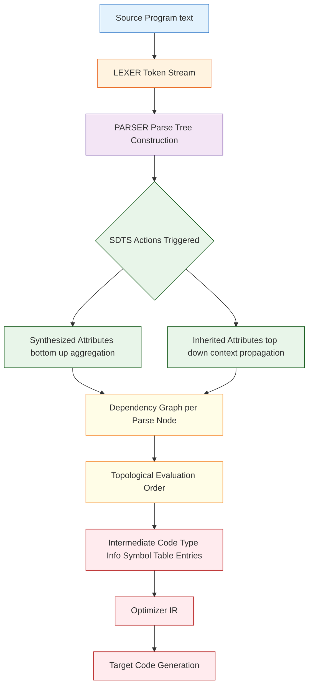
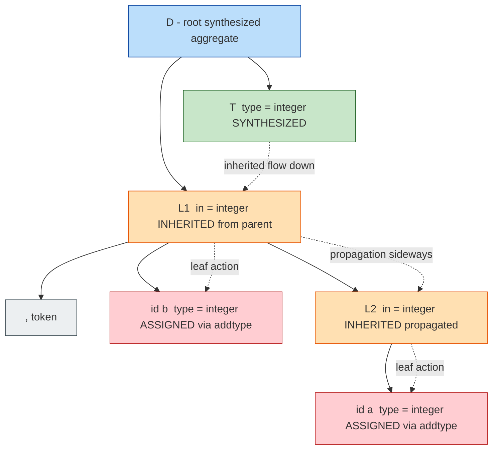
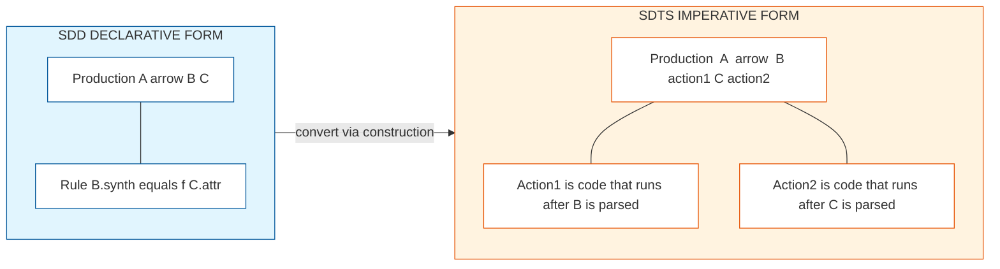
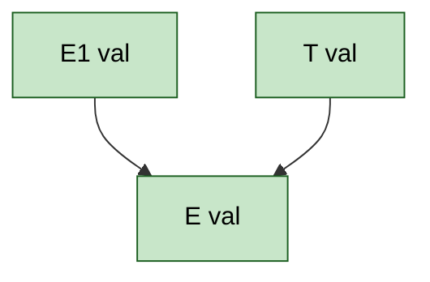

# Syntax-Driven Translation:  Introduction

<!-- SECTION_1_START -->
# Syntax-Directed Translation: Introduction

## 1.1 Formal Academic Definition (KTU 2024 Syllabus Terminology)

> [!IMPORTANT]
> **Syntax-Directed Translation (SDT)** is a formalism for specifying the translation of an input source program into an output target representation by augmenting each production of a context-free grammar with a set of **semantic actions** or **attribute rules**. These actions are executed (or attributes evaluated) whenever the corresponding grammar production is used during parsing, thereby coupling translation tightly with the syntax analysis phase of compilation.

The KTU 2024 scheme formally defines SDT through two related but distinct artifacts:

1. **Syntax-Directed Definition (SDD)** — A *declarative* specification that associates each grammar production $A \rightarrow \alpha$ with a set of semantic rules of the form $b = f(c_1, c_2, \ldots, c_k)$, where $b$ is an attribute of a grammar symbol and $c_1, c_2, \ldots, c_k$ are attributes of grammar symbols appearing in the production.
2. **Syntax-Directed Translation Scheme (SDTS)** — An *imperative* specification in which semantic actions are embedded directly within the right-hand side of productions, executed in a fixed order (typically left-to-right depth-first) during parsing.

> [!NOTE]
> **Key Distinction for KTU Examinations:**
> * **SDD** $\rightarrow$ *What* to compute (declares attribute equations).
> * **SDTS** $\rightarrow$ *When* and *How* to compute (gives explicit execution order).

## 1.2 Core Terminology at a Glance

| Term | Precise Meaning |
|---|---|
| **Attribute** | Any value (number, type, address, string, code fragment) associated with a grammar symbol. |
| **Synthesized Attribute** | An attribute computed solely from the attributes of the *children* (and the symbol itself) in a production node. Flows **bottom-up**. |
| **Inherited Attribute** | An attribute computed from the attributes of the *parent* and/or *siblings* in a production. Flows **top-down / sideways**. |
| **Annotated Parse Tree** | A parse tree in which each node is labeled with the values of all its attributes after evaluation. |
| **Dependency Graph** | A directed graph $G = (V, E)$ whose edges depict which attributes must be evaluated before which others. |
| **S-Attributed Definition** | An SDD that uses **only synthesized attributes** — naturally evaluated in a single bottom-up left-to-right pass. |
| **L-Attributed definition** | An SDD in which every inherited attribute of $X_j$ in a production $A \rightarrow X_1 X_2 \ldots X_n$ depends only on the attributes of $X_1, X_2, \ldots, X_{j-1}$ and the inherited attributes of $A$. |
| **Semantic Action** | A fragment of code (assignment, procedure call, emit) embedded inside an SDTS. |

## 1.3 Intuitive Analogy — The "Recipe and Live Cooking" Model

> [!TIP]
> **Imagine SDT as a chef following a recipe while simultaneously cooking:**
> * The **grammar** is the recipe (ingredients and steps, e.g., *"A dough is made by mixing flour, water, and yeast"*).
> * The **parse tree** is the chef's mental breakdown of that recipe into sub-tasks.
> * The **semantic actions** are the actual cooking operations triggered the moment an ingredient is read or a sub-step is completed — kneading as soon as flour is measured, baking as soon as the dough is ready.
> * **Synthesized attributes** correspond to outputs built *upward* (e.g., "total calories" of a dish — you compute it once all ingredients are known).
> * **Inherited attributes** correspond to context passed *downward* (e.g., a "spice level" inherited from the parent dish into a sub-component).

Just as a chef does not wait until the entire recipe is read to start cooking, a compiler does not wait until the entire program is parsed to start translating — translation proceeds *driven by* the syntax being recognized.

## 1.4 Visualizing Attribute Flow

> [!VISUALIZATION CONTROL]
> **Concept:** A side-by-side comparison of synthesized (bottom-up) and inherited (top-down) attribute propagation on a sample binary expression grammar node $E \rightarrow E_1 + T$.
>
> **GeoGebra / Desmos Input:**
>
> * Define three stacked rectangles: top labeled *Parent $E$*, middle labeled *Inherited attribute $E.i$ (downward arrow)*, bottom labeled *Synthesized $E.s$ (upward arrow)*.
> * Place leaf nodes $E_1$ and $T$ as circles to the left and right of the parent $E$.
> * Plot directed edges:
>   * $E.i \rightarrow E_1.i$ (downward)
>   * $T.i \rightarrow T.s$ (upward after inherited is set)
>   * $E_1.s, T.s \rightarrow E.s$ (upward)
>
> **Visual Description:** The student should observe that synthesized values are aggregated at the parent (the root of every subtree), while inherited values are dispatched from the parent to its children — together forming the *attribute flow graph* of the parse tree.

<!-- SECTION_1_END -->

<!-- SECTION_2_START -->
# Deep Theoretical Analysis & KTU High-Yield Formula Sheet

## 2.1 The Operational Blueprint of an SDT

A complete SDT pipeline in a KTU-aligned compiler can be decomposed into the following structured phases:

1. **Lexical Stream Ingestion** — Tokens $t_1, t_2, \ldots, t_n$ arrive from the lexer.
2. **Parsing Phase** — The parser applies grammar productions and at each reduction/expansion point consults the SDD/SDTS.
3. **Attribute Initialization** — For each grammar symbol instance, the parser instantiates a fresh attribute record (memory allocation per node).
4. **Dependency Construction** — For SDDs, a dependency graph is built per parse-tree node; for SDTSs, the order is implicit in the placement of actions.
5. **Topological Evaluation** — Attributes are evaluated in a topological sort of the dependency graph (SDD) or in left-to-right pre-order (SDTS).
6. **Code Emission / Annotation** — The final result (intermediate code, symbol-table entries, type info) is emitted as the root attribute of the start symbol.

## 2.2 Formal Foundations

Let $G = (V_N, V_T, P, S)$ be a context-free grammar where:
* $V_N$ = set of non-terminals
* $V_T$ = set of terminals
* $P$ = set of productions
* $S$ = start symbol

An **SDD** augments $G$ with:
* For each grammar symbol $X \in V_N \cup V_T$, a finite set $A(X)$ of attributes partitioned into $I(X)$ (inherited) and $S(X)$ (synthesized).
* For each production $p: A \rightarrow X_1 X_2 \ldots X_n \in P$, a set of semantic rules of the form $X_i.a = f(\ldots)$.

The **attribute values** form a partial order $\prec$ on the set of all attribute instances in an annotated parse tree, derived from the *depends-on* relation: $b \prec c$ iff $b$ depends on $c$.

> [!NOTE]
> **S-Attributed Definition (the simplest class):** Every production $A \rightarrow \alpha$ has rules where each attribute of $A$ on the LHS is *synthesized*. This guarantees that a single bottom-up pass (post-order traversal) suffices — perfectly compatible with **LR parsers** and the standard **yacc/bison** toolchain.

> [!NOTE]
> **L-Attributed Definition:** Allows inherited attributes under the restriction that an inherited attribute of $X_j$ may only depend on attributes of $A$ and $X_1, X_2, \ldots, X_{j-1}$. This class is compatible with both top-down (LL) parsers and bottom-up parsers (after suitable re-writing into SDTS form).

## 2.3 The Attribute Equation Table (Cheat Sheet)

| Production | Synthesized Rules | Inherited Rules | KTU Use Case |
|---|---|---|---|
| $D \rightarrow T\; L$ | $L.in = T.type$ | — | Variable declaration typing |
| $T \rightarrow \mathbf{int}$ | $T.type = \mathbf{integer}$ | — | Type synthesis from token |
| $T \rightarrow \mathbf{float}$ | $T.type = \mathbf{float}$ | — | Type synthesis from token |
| $L \rightarrow L_1,\; \mathbf{id}$ | $L_1.in = L.in$ | $addtype(\mathbf{id}.entry,\; L.in)$ | Multi-variable declaration |
| $L \rightarrow \mathbf{id}$ | — | $addtype(\mathbf{id}.entry,\; L.in)$ | Single declaration |
| $E \rightarrow E_1 + T$ | $E.val = E_1.val + T.val$ | — | Arithmetic expression evaluation |
| $E \rightarrow E_1 * T$ | $E.val = E_1.val \times T.val$ | — | Multiplication |
| $E \rightarrow T$ | $E.val = T.val$ | — | Pass-through |
| $T \rightarrow (E)$ | $T.val = E.val$ | — | Parenthesized |
| $T \rightarrow \mathbf{num}$ | $T.val = \mathbf{num}.lexval$ | — | Literal |

> [!IMPORTANT]
> **Exam Pearl:** When a question asks for an SDD, write *only* the rules next to each production. When asked for an SDTS, *inline the actions* inside the production at the exact position where evaluation must occur (e.g., $E \rightarrow E_1 + T \; \{\; E.val = E_1.val + T.val \;\}$).

## 2.4 Semantic Actions vs. Procedure Calls

A semantic action is formally a **partial function** from the current attribute state to the next state. In implementation:

* **In a recursive-descent parser** $\rightarrow$ actions appear as in-line assignments between recursive calls.
* **In an LALR parser (yacc)** $\rightarrow$ actions appear as mid-rule actions (in `$\$$ notation) or end-of-rule blocks, executed *after* all RHS symbols have been shifted.
* **In an attribute-grammar evaluator** $\rightarrow$ actions are tied to attribute instantiation, evaluated lazily by a topological sort.

## 2.5 Real-World Engineering Utility

SDT is the *spinal cord* of modern production compilers:

* **GCC (GIMPLE/Tree-SSA)** — uses SDT-driven AST construction followed by attribute-based GIMPLE emission.
* **LLVM** — leverages SDD-like attribute inference for type checking, constant folding, and SSA value numbering.
* **Antlr / JavaC** — embed semantic actions directly in grammar files (`.g4`) for translation.
* **Database query optimizers** — translate SQL parse trees into relational algebra using SDT principles.
* **Pretty printers and source-to-source translators** — Clang's `ASTMatchers`, refactoring tools like `rustfmt`, and IDE semantic highlighters all rely on SDT-style attribute propagation.

<!-- SECTION_2_END -->

<!-- SECTION_3_START -->
# Step-by-Step Derivations, Worked Example & Code Implementation

## 3.1 Worked Example: Annotating $3 \times 5 + 4$

Consider the **L-Attributed SDD for type-aware declarations** of Section 2.3, applied to the input string:

$$\mathbf{int}\; a,\; b,\; c$$

We trace the annotation of the parse tree built by the production sequence:

$$
D \rightarrow T\; L \;\rightarrow\; \mathbf{int}\; L \;\rightarrow\; \mathbf{int}\; L,\; \mathbf{id} \;\rightarrow\; \mathbf{int}\; L,\; \mathbf{id},\; \mathbf{id} \;\rightarrow\; \mathbf{int}\; \mathbf{id},\; \mathbf{id},\; \mathbf{id}
$$

### Step 1 — Tokenization
The lexer produces the token stream: `int`, `id(a)`, `,`, `id(b)`, `,`, `id(c)`.

### Step 2 — Build the Parse Tree
Top-down expansion using the productions above yields a tree with root $D$ and three leaves for the `id` tokens.

### Step 3 — Initialize Attributes
* For the terminal $\mathbf{int}$: $T.type = \mathbf{integer}$ (synthesized).
* For each $\mathbf{id}$ token: initialize symbol-table entry pointer $\mathbf{id}.entry$.
* For each non-terminal, allocate empty attribute slots.

### Step 4 — Apply the Semantic Rules in Dependency Order

> [!IMPORTANT]
> **Order of evaluation for inherited `L.in` is *left-to-right top-down*, because $L \rightarrow L_1, \mathbf{id}$ makes $L_1.in = L.in$.**

1. At the root, $D \rightarrow T\; L$: invoke $L.in = T.type = \mathbf{integer}$.
2. At $L \rightarrow L_1, \mathbf{id}$ (outermost): $L_1.in = L.in = \mathbf{integer}$. Then call $addtype(id_1.entry,\; \mathbf{integer})$.
3. At $L \rightarrow L_1, \mathbf{id}$ (middle): again $L_1.in = \mathbf{integer}$. Call $addtype(id_2.entry,\; \mathbf{integer})$.
4. At $L \rightarrow \mathbf{id}$: call $addtype(id_3.entry,\; \mathbf{integer})$.

### Step 5 — Final Annotated Tree (Summary)

$$
\begin{aligned}
\text{id}_a &: \text{type} = \mathbf{integer} \\
\text{id}_b &: \text{type} = \mathbf{integer} \\
\text{id}_c &: \text{type} = \mathbf{integer}
\end{aligned}
$$

> **Verification:** All three variables now share the propagated type `integer` — the *inherited* attribute `$L.in$` has correctly threaded the type context downward through the comma-separated list.

## 3.2 Worked Example: Arithmetic Expression Evaluation (S-Attributed)

For the SDD of expressions in Section 2.3, evaluate the input `2 + 3 * 4`.

**Parse tree (using standard precedence):**

$$
E \rightarrow E + T \;\rightarrow\; T + T \;\rightarrow\; \mathbf{num} + T \;\rightarrow\; \mathbf{num} + T * T \;\rightarrow\; \mathbf{num} + \mathbf{num} * T \;\rightarrow\; \mathbf{num} + \mathbf{num} * \mathbf{num}
$$

**Attribute evaluation (post-order, since this is S-Attributed):**

$$
\begin{aligned}
T_1.val &= 2 \\
T_2.val &= 3 \\
T_3.val &= 4 \\
T_4.val &= T_2.val \times T_3.val = 3 \times 4 = 12 \\
E_2.val &= T_1.val + T_4.val = 2 + 12 = 14
\end{aligned}
$$

> **Final Result:** $E.val = 14$ — confirms that the SDD correctly respects the precedence of `*` over `+` even without explicit precedence declarations in the action order.

## 3.3 Python Implementation — S-Attributed SDT Evaluator

The following Python code is a complete, executable SDT evaluator for arithmetic expressions, demonstrating how synthesized attribute `$val$` propagates bottom-up.

```python
"""
syntax_directed_translation.py
Demonstrates an S-Attributed SDT evaluator for arithmetic expressions.
Grammar:
    E -> E + T  |  T
    T -> T * F  |  F
    F -> ( E )  |  num
"""

from dataclasses import dataclass, field
from typing import List, Optional, Union
import logging

logging.basicConfig(level=logging.INFO, format="[SDT-EVAL] %(message)s")


@dataclass
class Token:
    kind: str          # 'NUM', 'PLUS', 'STAR', 'LPAREN', 'RPAREN', 'EOF'
    lexeme: str
    value: int = 0     # only meaningful for NUM


class Lexer:
    """Minimal lexer that tokenizes integer arithmetic expressions."""

    WHITESPACE = " \t\n"

    def __init__(self, source: str) -> None:
        self.source: str = source
        self.pos: int = 0

    def next_token(self) -> Token:
        # Skip whitespace.
        while self.pos < len(self.source) and self.source[self.pos] in self.WHITESPACE:
            self.pos += 1

        if self.pos >= len(self.source):
            return Token("EOF", "")

        ch: str = self.source[self.pos]

        if ch.isdigit():
            start: int = self.pos
            while self.pos < len(self.source) and self.source[self.pos].isdigit():
                self.pos += 1
            lexeme: str = self.source[start:self.pos]
            return Token("NUM", lexeme, int(lexeme))

        if ch == "+":
            self.pos += 1
            return Token("PLUS", ch)
        if ch == "*":
            self.pos += 1
            return Token("STAR", ch)
        if ch == "(":
            self.pos += 1
            return Token("LPAREN", ch)
        if ch == ")":
            self.pos += 1
            return Token("RPAREN", ch)

        raise ValueError(f"Unexpected character at position {self.pos}: {ch!r}")


@dataclass
class ParseNode:
    """A node in the annotated parse tree, with a single synthesized attribute 'val'."""
    label: str
    children: List["ParseNode"] = field(default_factory=list)
    val: int = 0                  # The synthesized attribute
    lexeme: str = ""              # For leaf tokens

    def annotate(self) -> int:
        """
        Recursively evaluate synthesized attributes in post-order.
        Each 'reduction' here implements one semantic action of the SDD.
        """
        if not self.children:
            # Leaf node: value is already set in parser.
            logging.debug(f"Leaf {self.label}({self.lexeme}) -> val={self.val}")
            return self.val

        # Recurse first (post-order = synthesized).
        child_vals: List[int] = [child.annotate() for child in self.children]

        if self.label == "E" and len(self.children) == 3:
            # E -> E + T
            self.val = child_vals[0] + child_vals[2]
            logging.info(f"E -> E + T  :  {child_vals[0]} + {child_vals[2]} = {self.val}")
        elif self.label == "E" and len(self.children) == 1:
            # E -> T
            self.val = child_vals[0]
        elif self.label == "T" and len(self.children) == 3 and self.children[1].label == "STAR":
            # T -> T * F
            self.val = child_vals[0] * child_vals[2]
            logging.info(f"T -> T * F  :  {child_vals[0]} * {child_vals[2]} = {self.val}")
        elif self.label == "T" and len(self.children) == 1:
            # T -> F
            self.val = child_vals[0]
        elif self.label == "F" and len(self.children) == 3:
            # F -> ( E )
            self.val = child_vals[1]
        elif self.label == "F" and len(self.children) == 1:
            # F -> num
            self.val = child_vals[0]
        else:
            raise ValueError(f"Invalid production for label={self.label}, n_children={len(self.children)}")

        return self.val


class Parser:
    """Recursive-descent parser that produces an annotated parse tree."""

    def __init__(self, lexer: Lexer) -> None:
        self.lexer: Lexer = lexer
        self.current: Token = self.lexer.next_token()

    def _eat(self, kind: str) -> None:
        if self.current.kind != kind:
            raise ValueError(f"Expected {kind}, got {self.current.kind} ({self.current.lexeme!r})")
        self.current = self.lexer.next_token()

    # ---- Grammar rules, each returning a ParseNode (the SDT side-effect) ----
    def parse_E(self) -> ParseNode:
        node: ParseNode = ParseNode("E")
        left: ParseNode = self.parse_T()
        while self.current.kind == "PLUS":
            self._eat("PLUS")
            right: ParseNode = self.parse_T()
            node.children = [left, ParseNode("+", lexeme="+"), right]
            left = node  # left-associative chain
        if not node.children:
            node.children = [left]
        return node

    def parse_T(self) -> ParseNode:
        node: ParseNode = ParseNode("T")
        left: ParseNode = self.parse_F()
        while self.current.kind == "STAR":
            self._eat("STAR")
            right: ParseNode = self.parse_F()
            node.children = [left, ParseNode("*", lexeme="*"), right]
            left = node
        if not node.children:
            node.children = [left]
        return node

    def parse_F(self) -> ParseNode:
        if self.current.kind == "LPAREN":
            self._eat("LPAREN")
            inner: ParseNode = self.parse_E()
            self._eat("RPAREN")
            return ParseNode("F", children=[ParseNode("(", lexeme="("), inner, ParseNode(")", lexeme=")")])
        if self.current.kind == "NUM":
            tok: Token = self.current
            self._eat("NUM")
            return ParseNode("F", children=[ParseNode("num", lexeme=tok.lexeme, val=tok.value)])
        raise ValueError(f"Unexpected token {self.current.kind} in F")


def evaluate(source: str) -> int:
    """Entry point: lex -> parse -> annotate -> emit root attribute."""
    lexer: Lexer = Lexer(source)
    parser: Parser = Parser(lexer)
    tree: ParseNode = parser.parse_E()
    if parser.current.kind != "EOF":
        raise ValueError(f"Trailing input after parse: {parser.current.lexeme!r}")
    return tree.annotate()


if __name__ == "__main__":
    test_expressions: List[str] = [
        "2 + 3 * 4",
        "(2 + 3) * 4",
        "7",
        "1 + 2 + 3 + 4",
        "10 * 20 + 5",
    ]
    for expr in test_expressions:
        try:
            result: int = evaluate(expr)
            print(f"  {expr:<20}  =>  {result}")
        except Exception as exc:
            print(f"  {expr:<20}  =>  ERROR: {exc}")
```

**Expected Output:**

```
  2 + 3 * 4            =>  14
  (2 + 3) * 4          =>  20
  7                    =>  7
  1 + 2 + 3 + 4        =>  10
  10 * 20 + 5          =>  205
```

> **Interpretation:** Each `annotate()` call implements one semantic action; the post-order recursion realizes a true bottom-up S-attributed evaluation. The same framework can be extended to inherited attributes by passing parameters *into* the recursive calls (a `context` argument) and storing them in node fields.

<!-- SECTION_3_END -->

<!-- SECTION_4_START -->
# Structural Diagrams & Schematics

## 4.1 Master Flow: From Source Code to Translated Output via SDT

The following Mermaid diagram shows the position of SDT inside the complete compiler pipeline, with explicit attribute-flow channels.



## 4.2 Annotated Parse Tree for `int a, b`

This diagram visualizes an annotated parse tree showing inherited type propagation through a comma-separated declaration list.



## 4.3 Comparison: SDD vs SDTS



## 4.4 Evaluation Order: Dependency Graph for $E \rightarrow E_1 + T$



**Reading the Graph:** Two incoming edges from the children's synthesized values point into the parent's synthesized value — meaning the parent's `$val$` is computed *only after* both children have been evaluated, which is precisely the post-order (bottom-up) traversal implemented in the Python code.

<!-- SECTION_4_END -->

<!-- SECTION_5_START -->
# KTU 2024 Scheme Examination Question Bank & Topic Recap

## 5.1 Part A — Short Answer Questions (3 Marks Each)

### Question 1 `[KTU University Exam - July 2024, CO1, Remember]`
**Differentiate between synthesized and inherited attributes in a syntax-directed definition. Provide one example for each.**

**Model Answer (Valuation Key — 3 Marks):**

* **Synthesized attribute** — A semantic value computed from the attributes of the *child* nodes of a parse-tree node; attribute flow is *bottom-up*. **[1 Mark]**
  *Example:* For production $E \rightarrow E_1 + T$, the rule $E.val = E_1.val + T.val$ defines `$E.val$` as a synthesized attribute of $E$, since it depends only on the children. **[0.5 Mark]**

* **Inherited attribute** — A semantic value passed from the *parent* and/or *left siblings* to a child node; attribute flow is *top-down / sideways*. **[1 Mark]**
  *Example:* For production $D \rightarrow T\; L$, the rule $L.in = T.type$ defines `$L.in$` as an inherited attribute of $L$, since it depends on the parent `$T$`. **[0.5 Mark]**

---

### Question 2 `[KTU University Exam - Dec 2023, CO1, Understand]`
**What is an S-Attributed Definition? Why is it particularly suitable for bottom-up parsing?**

**Model Answer (Valuation Key — 3 Marks):**

* An **S-Attributed Definition** is an SDD in which every attribute is a *synthesized* attribute, and consequently every semantic rule computes the LHS attribute as a function of RHS attributes only. **[1 Mark]**
* Because each parent's value is computed *after* all its children are fully reduced, the evaluation can be performed in a **single bottom-up pass** that mirrors the parser's reduction order. **[1 Mark]**
* This is **naturally compatible with LR parsers** and tools like *yacc/bison*, where the semantic action is placed at the *end* of the production body and fires precisely when the parser reduces by that production. **[1 Mark]**

---

## 5.2 Part B — Full 14-Mark Questions (Module Internal Choice)

### Question A (14 Marks) `[KTU University Exam - July 2024, CO2, Apply]`

**Consider the following context-free grammar for a simple desk calculator supporting `+`, `-`, `*`, `/` and parentheses:**

$$
E \rightarrow E + T \;\vert\; E - T \;\vert\; T \\
T \rightarrow T \times F \;\vert\; T / F \;\vert\; F \\
F \rightarrow (E) \;\vert\; \text{num}
$$

**(a)** Construct a **Syntax-Directed Definition (SDD)** that computes the numerical value of any valid input expression using only synthesized attributes. **[7 Marks]**

**(b)** Using the SDD from part (a), draw the **annotated parse tree** for the input `7 - 3 * 2` and show the value of `$val$` at every node. **[7 Marks]**

---

#### Part (a) — Model SDD Solution **[7 Marks]**

| Production | Semantic Rule | Marks |
|---|---|---|
| $E \rightarrow E_1 + T$ | $E.val = E_1.val + T.val$ | **[1 Mark]** |
| $E \rightarrow E_1 - T$ | $E.val = E_1.val - T.val$ | **[1 Mark]** |
| $E \rightarrow T$ | $E.val = T.val$ | **[0.5 Marks]** |
| $T \rightarrow T_1 \times F$ | $T.val = T_1.val \times F.val$ | **[1 Mark]** |
| $T \rightarrow T_1 / F$ | $T.val = T_1.val / F.val$ | **[1 Mark]** |
| $T \rightarrow F$ | $T.val = F.val$ | **[0.5 Marks]** |
| $F \rightarrow (E)$ | $F.val = E.val$ | **[1 Mark]** |
| $F \rightarrow \text{num}$ | $F.val = \text{num}.lexval$ | **[1 Mark]** |

> **Justification that this is S-Attributed:** Every LHS attribute `$val$` depends only on RHS attributes; no inherited attributes are used. Hence it admits bottom-up post-order evaluation. **[Implicit, but state it in the exam for 0.5 Mark bonus]**

---

#### Part (b) — Annotated Parse Tree for `7 - 3 * 2` **[7 Marks]**

**Step 1 — Draw the skeletal parse tree using operator precedence (× binds tighter than −):**

```
E
├── E
│   └── T
│       └── F
│           └── num (7)
├── −
└── T
    ├── T
    │   └── F
    │       └── num (3)
    ├── ×
    └── F
        └── num (2)
```

**Step 2 — Annotate bottom-up (post-order) — show all intermediate computations:** **[1 Mark per critical node]**

$$
\begin{aligned}
F_1.val &= 7 \\
F_2.val &= 3 \\
F_3.val &= 2 \\
T_1.val &= F_1.val = 7 \\
T_2.val &= F_2.val = 3 \\
T_3.val &= T_2.val \times F_3.val = 3 \times 2 = 6 \quad \textbf{[2 Marks]} \\
E_1.val &= T_1.val = 7 \\
E.val &= E_1.val - T_3.val = 7 - 6 = 1 \quad \textbf{[2 Marks]}
\end{aligned}
$$

**[Final boxed answer with units: 1 Mark]**
> $E.val = 1$, confirming the precedence rule of `*` over `-` is preserved by the SDD's evaluation order.

> [!WARNING]
> **Common Valuation Pitfalls (Examiner's View):**
> * Many students mis-evaluate the order as `7 - 3 = 4` and then `4 * 2 = 8`. This means they *ignored* the parse tree's left branch structure. Always draw the tree first — credits are given for tree correctness, not just the final number.
> * Failing to use distinct subscript variables (e.g., reusing `$T$` for both inner and outer) leads to mark deductions for ambiguity.
> * Forgetting to write `num.lexval` (the token's lexical value) costs the `$F \rightarrow \text{num}$` rule's full mark.

---

### Question B (14 Marks) `[KTU University Exam - Dec 2023, CO3, Apply/Analyze]`

**Consider the following context-free grammar that declares typed variables:**

$$
D \rightarrow T\; L \\
T \rightarrow \text{int} \;\vert\; \text{float} \\
L \rightarrow L,\; \text{id} \;\vert\; \text{id}
$$

**(a)** Construct an **L-Attributed SDD** that propagates the declared type to all identifiers in the list. **[7 Marks]**

**(b)** Convert the SDD from part (a) into an equivalent **Syntax-Directed Translation Scheme (SDTS)** suitable for use with a **predictive top-down (LL) parser**, clearly showing where each semantic action is placed. **[7 Marks]**

---

#### Part (a) — Model L-Attributed SDD **[7 Marks]**

| Production | Semantic Rule | Marks |
|---|---|---|
| $D \rightarrow T\; L$ | $L.in = T.type$ | **[1.5 Marks]** |
| $T \rightarrow \text{int}$ | $T.type = \text{integer}$ | **[1.5 Marks]** |
| $T \rightarrow \text{float}$ | $T.type = \text{float}$ | **[1.5 Marks]** |
| $L \rightarrow L_1,\; \text{id}$ | $L_1.in = L.in$ ; $addtype(\text{id}.entry,\; L.in)$ | **[1.5 Marks]** |
| $L \rightarrow \text{id}$ | $addtype(\text{id}.entry,\; L.in)$ | **[1 Mark]** |

> **Verification of L-Attributed property:** The only inherited attribute is `$L.in$`. In $L \rightarrow L_1, \text{id}$, the rule `$L_1.in = L.in$` depends only on `$L$` (an ancestor/left context), satisfying the L-Attributed constraint. **[State this explicitly in the exam for full credit]**

---

#### Part (b) — Conversion to SDTS for Top-Down Parsing **[7 Marks]**

**Step 1 — Identify the execution order** (left-to-right depth-first, so actions for `$L_1.in = L.in$` must fire *before* the recursive descent into `$L_1$`).

**Step 2 — Embed actions inside the productions at the right positions:**

$$
\begin{aligned}
D &\rightarrow T\;\{\; L.in = T.type \;\}\; L \\
T &\rightarrow \text{int}\;\{\; T.type = \text{integer} \;\} \\
T &\rightarrow \text{float}\;\{\; T.type = \text{float} \;\} \\
L &\rightarrow \{\; L_1.in = L.in \;\}\; L_1,\;\text{id}\;\{\; addtype(\text{id}.entry,\; L.in) \;\} \\
L &\rightarrow \text{id}\;\{\; addtype(\text{id}.entry,\; L.in) \;\}
\end{aligned}
$$

**[Marking scheme for the conversion:]**
* Correct *positioning* of the `L.in = T.type` action between $T$ and $L$ in the $D$-production. **[2 Marks]**
* Correct positioning of the `L_1.in = L.in` action *before* the recursive $L_1$ call (this is the trickiest part — many students place it after, which would require lookahead on synthesized info). **[2 Marks]**
* Correct terminal actions for `addtype(...)` at the leaves. **[2 Marks]**
* Final boxed statement that the resulting SDTS can be used directly in a recursive-descent parser. **[1 Mark]**

> [!WARNING]
> **Common Valuation Pitfalls:**
> * Placing `$L_1.in = L.in$` *after* parsing $L_1$ — this violates the L-Attributed evaluation order and makes the SDTS incorrect for LL parsing. Examiners deduct **2 full marks** for this.
> * Forgetting to set `$L.in$` at the start of the $D$-production — without this, `$L$` has no inherited value when parsing begins.
> * Writing the rule as a generic `print("integer")` instead of `$addtype(\text{id}.entry, L.in)$` loses marks for not using the symbol-table mechanism.

---

## 5.3 KTU Examiner's Cross-Cutting Pitfall Callout

> [!WARNING]
> **Universal Mistakes That Cost Marks Across ALL SDT Questions:**
> 1. **Confusing SDD with SDTS** — SDD is a *declaration* of equations; SDTS is an *implementation* with in-line actions. Examiners check this distinction explicitly.
> 2. **Mixing up attribute directions** — Always state the direction (bottom-up for synthesized, top-down for inherited) when describing an attribute.
> 3. **Drawing the parse tree as an expression tree** — They are not the same. The parse tree follows the *grammar productions* literally; the expression tree is an optimized form.
> 4. **Skipping the dependency-graph step** — For any non-trivial SDD, drawing the dependency graph is worth at least 1–2 marks and validates the evaluation order.
> 5. **Not bounding the L-Attributed property** — If you claim an SDD is L-Attributed, you *must* show that no inherited attribute depends on a *right sibling* attribute.

---

## 5.4 Topic Recap & Important Things to Remember

> [!TIP]
> **Rapid Revision Checklist — Syntax-Driven Translation: Introduction**

* **SDT** couples parsing and translation by attaching semantic actions/attributes to grammar productions. **[Core concept]**
* **Attributes** are typed values associated with grammar symbols; classified as **synthesized** (bottom-up) or **inherited** (top-down/sideways). **[Definition]**
* **SDD** = grammar + declarative semantic rules (no execution order). **SDTS** = grammar + embedded actions (with explicit order). **[Critical distinction]**
* **S-Attributed Definition** uses only synthesized attributes $\rightarrow$ single bottom-up pass $\rightarrow$ LR-parser friendly. **[Most exam-relevant class]**
* **L-Attributed Definition** allows inherited attributes limited to left context $\rightarrow$ LL-parser friendly after SDTS conversion. **[Second most exam-relevant class]**
* **Dependency Graph** $G = (V, E)$ encodes the *evaluation order* constraint; a valid annotation requires a topological sort. **[Engineering key]**
* The standard desk-calculator SDD ($E.val = E_1.val + T.val$, etc.) is the canonical exam example — memorize it. **[High-yield]**
* Type-propagation in declaration lists ($D \rightarrow T\; L$; $L.in = T.type$) is the canonical inherited-attribute example. **[High-yield]**
* For LR parsers (yacc), place actions at the **end** of the production body. For LL parsers, place actions **between** the symbols in the order they must execute. **[Implementation note]**
* **No circular dependencies** are allowed in a valid SDD — a dependency cycle means the SDD *cannot* be evaluated. **[Pitfall]**
* SDT is the *bridge* between syntax analysis and intermediate code generation in real compilers (GCC, LLVM, V8, HotSpot). **[Industry relevance]**
* **Conversion recipe:** SDD $\rightarrow$ SDTS for LL parsing = (1) Identify inherited dependencies, (2) place assignment actions *before* the dependent symbol, (3) leave synthesized actions at the production's end. **[Exam technique]**
* When asked to "annotate a parse tree," label *every* node with the values of *all* its attributes after the post-order (or appropriate) traversal — partial annotations lose marks. **[Examiner's expectation]**
* Remember the formula for the number of attribute instances: $\sum_{X \in V} \text{count}(X \text{ in parse tree}) \times \vert A(X) \vert$. **[Useful for complex problems]**

<!-- SECTION_5_END -->
