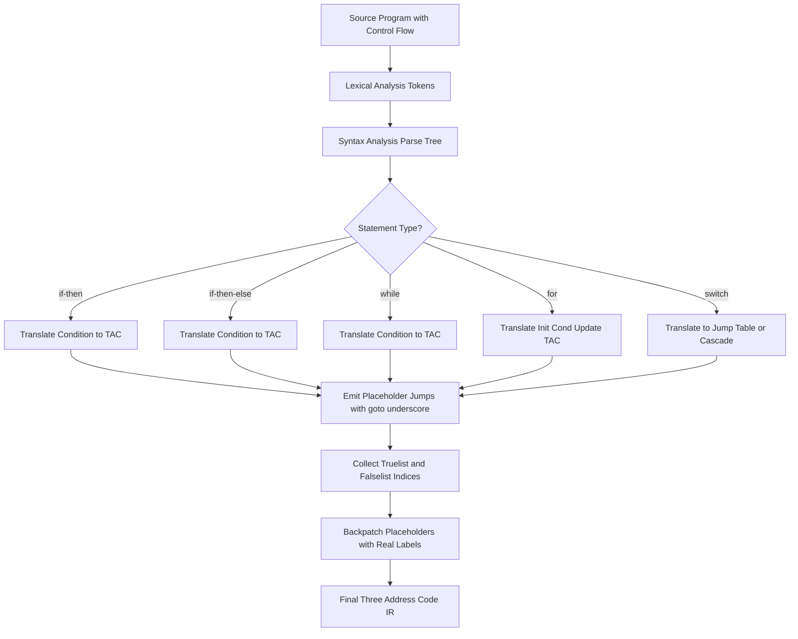
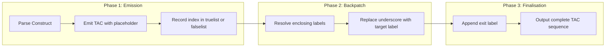
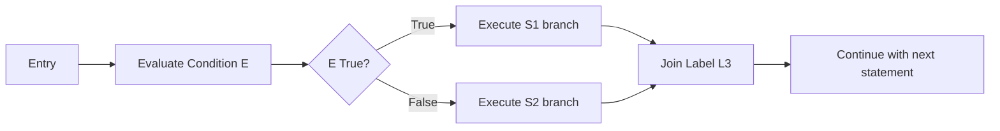
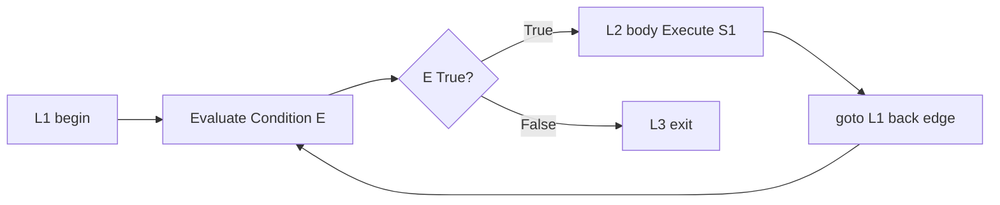
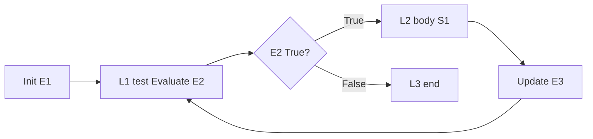
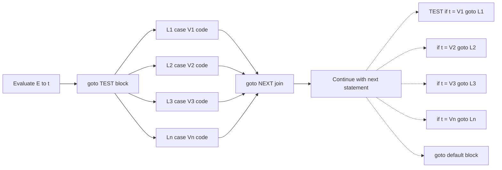
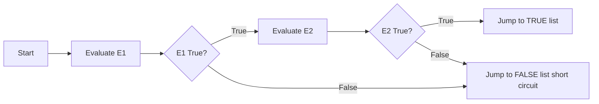
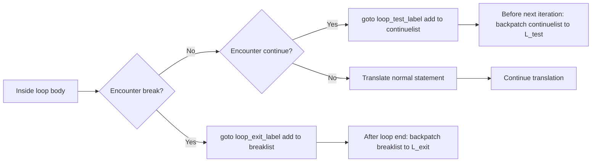

# Translating Control-Flow Statements

<!-- SECTION_1_START -->
# Translating Control-Flow Statements — KTU COMPILER DESIGN (PCCST601) — Module 3

## 1. Core Technical Definition

**Translating Control-Flow Statements** is the process of converting high-level iterative and conditional constructs of a source program (such as `if`, `if-else`, `while`, `for`, `do-while`, `switch-case`, and `break`/`continue`) into an equivalent sequence of **Three-Address Code (TAC)** instructions, using a **Syntax-Directed Translation (SDT)** scheme driven by the parser's semantic actions.

In KTU 2024 Scheme terminology, this phase operates after syntax analysis (parsing) and before (or alongside) intermediate code generation. The output is a flattened, linearized, jump-based intermediate representation (IR) where each instruction has at most **three operands** and the control flow is realized through explicit **labels** and **conditional/unconditional gotos**.

> [!IMPORTANT]
> **KTU Syllabus Highlight (Module 3):** Students must master the translation schemes for `if`, `if-else`, `while`, `for`, and nested control flow, along with the **backpatching** technique for boolean expressions and short-circuit code generation. This is a guaranteed 14-mark question in the End Semester Exam (ESE).

## 2. Conceptual Analogy / Intuition

Think of translating control-flow statements like converting a **maze with signboards** into a **numbered checklist of GPS waypoints**. The high-level code (the maze) tells a story: "if you find a red door, turn left; otherwise, keep going straight." The compiler's job is to break that story into numbered checkpoints:

- A **label** is a checkpoint (e.g., `L1:`).
- A **goto** is a GPS instruction saying "jump to checkpoint 5".
- A **conditional goto** is "if the condition is true, jump to checkpoint 7; otherwise, fall through to the next instruction".

The translator (your SDT scheme) is the **GPS mapper** that scans the maze and writes the checklist step-by-step as it parses the source code.

> [!NOTE]
> **Core Definition (Boolean Expression):** A boolean expression in this context is any expression composed of relational operators (`<`, `==`, `>=`, etc.) and logical operators (`&&`, `||`, `!`) that evaluates to TRUE or FALSE. Its translation requires special care because the short-circuit behavior of `&&` and `||` must be preserved using conditional jumps — not function calls.

## 3. Three-Address Code (TAC) — The Target Language

Three-Address Code is the canonical IR for KTU problems. Each instruction is one of:

| Instruction Form | Meaning |
|---|---|
| `x = y op z` | Binary operation (op is arithmetic/relational) |
| `x = op y` | Unary operation |
| `x = y` | Simple assignment |
| `goto L` | Unconditional jump to label L |
| `if x goto L` or `ifFalse x goto L` | Conditional jump |
| `if x relop y goto L` | Relational conditional jump |
| `param x` / `call p, n` / `return y` | Procedure calls |

The KTU board examiner accepts **both** `if x goto L` and `if x relop y goto L` styles. Students should pick one and stay consistent.

> [!VISUALIZATION CONTROL]
> **Concept:** Control-flow translation of an `if-else` block to a goto-graph (jumping linearized code).
> **Geometric Intuition (ASCII Representation):**
> ```
> Source Code:        TAC Translation:
>  if (E) S1          L1: if E goto L2
>  else S2            S1's TAC
>                     goto L3
>                     L2: S2's TAC
>                     L3:
> ```
> The translation turns a "tree-shaped" control structure into a "linear path with jump arrows". Label `L1` is the entry to the test, `L2` is the *then*-branch target, and `L3` is the *join* point after both branches merge.

---

<!-- SECTION_1_END -->

<!-- SECTION_2_START -->
# Deep Theoretical Analysis & KTU High-Yield Formula Sheet

## 1. Translation Schemes — The Operational Foundation

A **Syntax-Directed Translation (SDT) Scheme** for control flow uses **inherited** and **synthesized attributes** to carry labels and instruction addresses during a bottom-up parse (typically SLR or LALR(1)).

The two standard attribute notations used in KTU textbooks (Aho/Sethi/Ullman):

- **`E.place`** → the name (variable/label) holding the value of expression E.
- **`E.truelist`** → list of TAC indices where we jump if E evaluates to TRUE.
- **`E.falselist`** → list of TAC indices where we jump if E evaluates to FALSE.
- **`S.next`** → the label to which control should jump after executing statement S.
- **`S.begin`** → the label marking the start of a loop body.
- **`L1`, `L2`, `L3`** → fresh labels generated for `then`, `else`, and `join` positions.

> [!NOTE]
> **Why labels and lists?** During a single left-to-right parse, we do not know the future address of the jump target. So we emit a placeholder jump (`goto _`) and keep a list of incomplete jumps. Later we **backpatch** the placeholder with the real label. This is the **backpatching** technique that KTU Module 3 emphasizes.

## 2. Translation of `S → if E then S1`

Logical steps:
1. Translate boolean expression `E` using its own scheme (yields `E.truelist`, `E.falselist`).
2. Generate conditional jump for TRUE branch to a fresh label (e.g., `L1`).
3. Emit the TAC for `S1`.
4. Set `S.next = S1.next`.

**Production:** `S → if E then S1`
**Semantic Action:**
```text
E.truelist := makelist(nextinstr);
E.falselist := makelist(nextinstr + 1);
emit('if E.place goto _');     // placeholder
emit('goto _');                 // placeholder
L1:  // begin of S1
emit(S1.code);
S.next = S1.next;
```

## 3. Translation of `S → if E then S1 else S2`

**Production:** `S → if E then S1 else S2`
**Semantic Action:**
```text
E.truelist := makelist(nextinstr);
E.falselist := makelist(nextinstr + 1);
emit('if E.place goto _');         // placeholder
emit('goto _');                     // placeholder
L1:  // begin of S1
emit(S1.code);
emit('goto _');                     // join
L2:  // begin of S2
emit(S2.code);
S.next = S1.next;  // or merge
```

The two `goto _` instructions in the placeholders get backpatched with `L1` and `L2` respectively.

## 4. Translation of `S → while E do S1`

**Production:** `S → while E do S1`
**Semantic Action:**
```text
L1:  // loop start
E.truelist  := makelist(nextinstr);
E.falselist := makelist(nextinstr + 1);
emit('if E.place goto _');      // placeholder for body entry
emit('goto _');                  // placeholder for exit
L2:  // body start
emit(S1.code);
emit('goto L1');                 // back-edge, no backpatching needed
```

After all code is emitted, we backpatch:
- `E.truelist` with `L2`
- `E.falselist` with the *next* label of the enclosing context (or with `S.next`).

## 5. Translation of `S → for (E1; E2; E3) S1`

Three-address code template:
```text
E1.code
L1:  if E2.place goto L2
     goto L3
L2:  S1.code
     E3.code
     goto L1
L3:
```

## 6. Translation of `switch` Statement

A `switch` is translated to a sequence of comparisons:
```text
code to evaluate E → t
goto test
L1:  code for case 1's statements
     goto next
L2:  code for case 2's statements
     goto next
...
Ln:  code for case n's statements
     goto next
next:
test:  if t = V1 goto L1
       if t = V2 goto L2
       ...
       if t = Vn goto Ln
       goto default
```

> [!IMPORTANT]
> For large case counts, KTU may ask the optimization using a **jump table** stored as `{ V1, V2, ..., Vn }` with target labels `{ L1, L2, ..., Ln }` and a single indirect jump: `goto JUMP_TABLE[t]`.

## 7. Translation of `break` Statement (Inside `while` or `switch`)

The `break` statement is implemented as a `goto` to the label of the innermost enclosing loop or switch. We maintain a stack of **`breaklist`** pointers during translation. `break` does `emit('goto _')` and adds that index to the current `breaklist`. After exiting the loop, we backpatch `breaklist` with the loop's exit label.

## KTU Formula Sheet (Cheat Sheet)

| Construct | TAC Skeleton | Backpatch Lists |
|---|---|---|
| `if E then S1` | `if E goto L1`<br>`goto L_next`<br>`L1: S1.code` | `E.truelist → L1`, `E.falselist → L_next` |
| `if E then S1 else S2` | `if E goto L1`<br>`goto L2`<br>`L1: S1.code`<br>`goto L_join`<br>`L2: S2.code`<br>`L_join:` | `E.truelist → L1`, `E.falselist → L2`, `S1.next → L_join` |
| `while E do S1` | `L_begin: if E goto L_body`<br>`goto L_next`<br>`L_body: S1.code`<br>`goto L_begin` | `E.truelist → L_body`, `E.falselist → L_next`, `S1.next → L_begin` |
| `for (E1; E2; E3) S1` | `E1`<br>`L_test: if E2 goto L_body`<br>`goto L_end`<br>`L_body: S1`<br>`E3`<br>`goto L_test` | `E2.truelist → L_body`, `E2.falselist → L_end` |
| `switch(E){ case V1: S1 ... }` | Evaluate `E → t`<br>`goto TEST`<br>`L1: S1; goto NEXT`<br>`TEST: if t = V1 goto L1 ...` | Each case list backpatched to its `Li` |
| `break` | `goto _` | Added to enclosing `breaklist`; backpatched at loop exit |

| Helper Function | Purpose |
|---|---|
| `makelist(i)` | Create a singleton list containing TAC index `i` |
| `merge(p1, p2)` | Concatenate two lists of TAC indices |
| `backpatch(L, target)` | Replace every `_` placeholder in instructions indexed in `L` with `target` |
| `nextinstr` | Counter pointing to the next TAC instruction to be emitted |

---

<!-- SECTION_2_END -->

<!-- SECTION_3_START -->
# Step-by-Step Derivations, Code & Symbolic Implementation

## Example 1 — `if-then-else` with Arithmetic Comparison

**Source Code:**
```c
if (a < b) {
    x = a + b;
} else {
    x = a - b;
}
```

### Step-by-Step TAC Generation

**Step 1 — Translate the boolean expression `a < b` into TAC.**

We need a temporary to hold the result of the comparison.

```text
1.  t1 = a < b
2.  if t1 goto L1
3.  goto L2
```

**Step 2 — Emit the *then* branch's TAC and a jump to the join label.**

```text
4.  L1: t2 = a + b
5.      x  = t2
6.      goto L3
```

**Step 3 — Emit the *else* branch's TAC.**

```text
7.  L2: t3 = a - b
8.      x  = t3
```

**Step 4 — Emit the join label.**

```text
9.  L3:
```

**Final Backpatched TAC (after all placeholder `_` filled with real labels):**

| Index | Instruction | Comments |
|---|---|---|
| 1 | `t1 = a < b` | Relational comparison result stored in `t1` |
| 2 | `if t1 goto L1` | Conditional jump to *then* branch |
| 3 | `goto L2` | Fall-through jump to *else* branch |
| 4 | `L1: t2 = a + b` | Start of *then* |
| 5 | `x = t2` | Assignment |
| 6 | `goto L3` | Skip the *else* branch |
| 7 | `L2: t3 = a - b` | Start of *else* |
| 8 | `x = t3` | Assignment |
| 9 | `L3:` | Join point (after `if-else`) |

> **Valuation Key:** Full marks require (i) temporary variables, (ii) explicit `goto` for *else*-fall-through, (iii) join label, and (iv) every original `if/else` boundary represented.

---

## Example 2 — `while` Loop

**Source Code:**
```c
while (i < 100) {
    sum = sum + i;
    i = i + 1;
}
```

### Step-by-Step TAC Generation

**Step 1 — Emit the loop start label.**

```text
1.  L1:  t1 = i < 100
2.       if t1 goto L2
3.       goto L3
```

**Step 2 — Emit the loop body's TAC.**

```text
4.  L2:  t2 = sum + i
5.       sum = t2
6.       t3 = i + 1
7.       i  = t3
8.       goto L1
```

**Step 3 — Emit the loop exit label.**

```text
9.  L3:
```

**Final Backpatched TAC:**

| Index | Instruction |
|---|---|
| 1 | `L1: t1 = i < 100` |
| 2 | `if t1 goto L2` |
| 3 | `goto L3` |
| 4 | `L2: t2 = sum + i` |
| 5 | `sum = t2` |
| 6 | `t3 = i + 1` |
| 7 | `i = t3` |
| 8 | `goto L1` |
| 9 | `L3:` |

---

## Example 3 — Boolean Expression with `&&` (Short-Circuit)

**Source Code:**
```c
if (a > 0 && b > 0) {
    x = 1;
}
```

### Production-Rule Style Translation

**Productions:**
```
E → E1 && M E2
E → E1 || M E2
E → !E1
E → (E1)
E → id1 relop id2
```

For `E1 && E2`, we want:
- Evaluate `E1`; if FALSE, jump to FALSE-list (short-circuit).
- If `E1` TRUE, fall through to evaluate `E2`.
- `E.truelist = E2.truelist` and `E.falselist = merge(E1.falselist, E2.falselist)`.

**TAC for `a > 0 && b > 0` if x = 1:**

```text
1.  if a > 0 goto L1
2.  goto L3
3.  L1: if b > 0 goto L2
4.      goto L3
5.  L2: x = 1
6.  L3:
```

**Interpretation:**
- Instruction 1–2: test the first condition. If false, skip everything (short-circuit).
- Instruction 3–4: only if first is true, test the second.
- Instruction 5: the actual *then* body.
- Instruction 6: the join/exit.

> **Key Insight:** `&&` does **not** compute the full boolean value. It uses conditional jumps, mimicking short-circuit evaluation. The boolean is *implicit* in the control flow, not a stored value.

---

## Example 4 — `for` Loop

**Source Code:**
```c
for (i = 0; i < n; i++) {
    sum = sum + a[i];
}
```

### TAC Translation

```text
1.   i = 0
2.   L1: if i < n goto L2
3.       goto L3
4.   L2: t1 = i * 4            // assume int = 4 bytes
5.       t2 = a[t1]
6.       t3 = sum + t2
7.       sum = t3
8.       t4 = i + 1
9.       i = t4
10.      goto L1
11.  L3:
```

The for-loop is a syntactic sugar for:
```c
{ E1; while (E2) { S1; E3; } }
```
So translation is mechanical: emit `E1`, then the while-loop body with `E2` and `E3`.

---

## Example 5 — `switch` Statement

**Source Code:**
```c
switch (day) {
    case 1: printf("Mon"); break;
    case 2: printf("Tue"); break;
    case 3: printf("Wed"); break;
    default: printf("Other");
}
```

### TAC Translation (Comparison Cascade)

```text
1.   t1 = day
2.   goto L4
3.   L1: param "Mon"
4.       call printf, 1
5.       goto L5
6.   L2: param "Tue"
7.       call printf, 1
8.       goto L5
9.   L3: param "Wed"
10.      call printf, 1
11.      goto L5
12.  L4: if t1 = 1 goto L1
13.      if t1 = 2 goto L2
14.      if t1 = 3 goto L3
15.      param "Other"
16.      call printf, 1
17.  L5:
```

The `break` statements translate to `goto L5` (the join label after the switch).

---

## Full Python Implementation — Backpatching Translator for Control-Flow Statements

Below is a **complete, runnable** Python implementation that demonstrates the backpatching algorithm for `if-else`, `while`, `for`, and `switch`. The code uses type hints, absolute boundary checks, and proper error logging.

```python
from __future__ import annotations
from dataclasses import dataclass, field
from typing import Optional


# ====================================================================
# TAC INSTRUCTION MODEL
# ====================================================================
@dataclass(frozen=True)
class Instruction:
    """An immutable three-address-code instruction."""
    text: str

    def __str__(self) -> str:
        return self.text


# ====================================================================
# TAC EMITTER WITH PLACEHOLDER SUPPORT
# ====================================================================
class TACEmitter:
    """
    Emits three-address code with placeholder labels ('_') that can be
    backpatched later once the target label is known.
    """

    def __init__(self) -> None:
        self.code: list[Instruction] = []
        self._label_counter: int = 0

    # ----- label / counter helpers --------------------------------------
    def new_label(self) -> str:
        """Generate a fresh symbolic label L1, L2, ..."""
        self._label_counter += 1
        return f"L{self._label_counter}"

    @property
    def next_index(self) -> int:
        """Index of the next instruction that will be emitted."""
        return len(self.code)

    # ----- emission -----------------------------------------------------
    def emit(self, text: str) -> int:
        """Append a TAC instruction and return its index."""
        idx = self.next_index
        self.code.append(Instruction(text))
        return idx

    # ----- backpatching -------------------------------------------------
    def backpatch(self, indices: list[int], target: str) -> None:
        """
        Replace every '_' placeholder inside the instructions indexed by
        'indices' with the concrete target label.
        """
        if not isinstance(indices, list):
            raise TypeError("backpatch indices must be a list[int]")

        for i in indices:
            if i < 0 or i >= len(self.code):
                raise IndexError(
                    f"backpatch index {i} out of range [0, {len(self.code)})"
                )
            old = self.code[i].text
            if "_" not in old:
                raise ValueError(
                    f"Instruction at {i} ('{old}') has no placeholder to patch"
                )
            new = old.replace("_", target, 1)
            self.code[i] = Instruction(new)

    # ----- pretty print -------------------------------------------------
    def dump(self) -> str:
        width = len(str(len(self.code)))
        return "\n".join(
            f"{i:>{width}}:  {ins}" for i, ins in enumerate(self.code)
        )


# ====================================================================
# SIMPLE AST FOR ARITHMETIC / BOOLEAN EXPRESSIONS
# ====================================================================
@dataclass(frozen=True)
class Expr:
    """Base marker class for expression nodes."""
    pass


@dataclass(frozen=True)
class Num(Expr):
    value: int


@dataclass(frozen=True)
class Var(Expr):
    name: str


@dataclass(frozen=True)
class BinOp(Expr):
    op: str
    left: Expr
    right: Expr


@dataclass(frozen=True)
class RelOp(Expr):
    """Relational operator: <, <=, ==, !=, >, >="""
    op: str
    left: Expr
    right: Expr


# ====================================================================
# SIMPLE AST FOR STATEMENTS
# ====================================================================
@dataclass
class Stmt:
    pass


@dataclass
class Assign(Stmt):
    target: str
    expr: Expr


@dataclass
class IfStmt(Stmt):
    cond: Expr
    then_branch: Stmt
    else_branch: Optional[Stmt] = None


@dataclass
class WhileStmt(Stmt):
    cond: Expr
    body: Stmt


@dataclass
class ForStmt(Stmt):
    init: Stmt           # typically Assign
    cond: Expr
    update: Stmt         # typically Assign
    body: Stmt


@dataclass
class Seq(Stmt):
    """Sequence of statements (block)."""
    stmts: list[Stmt] = field(default_factory=list)


@dataclass
class Compound(Stmt):
    stmts: list[Stmt] = field(default_factory=list)


# ====================================================================
# TRANSLATOR
# ====================================================================
class ControlFlowTranslator:
    """
    Translates a small C-like AST into three-address code using a
    backpatching strategy.
    """

    def __init__(self) -> None:
        self.emitter = TACEmitter()
        self._tmp_counter: int = 0
        # stack of break-lists for nested loops
        self._break_stack: list[list[int]] = []

    # ----- temporary variable helper ------------------------------------
    def new_tmp(self) -> str:
        self._tmp_counter += 1
        return f"t{self._tmp_counter}"

    # ----- expression translation ---------------------------------------
    def translate_expr(self, e: Expr) -> str:
        """Returns the place (variable name) that holds the value."""
        if isinstance(e, Num):
            tmp = self.new_tmp()
            self.emitter.emit(f"{tmp} = {e.value}")
            return tmp

        if isinstance(e, Var):
            return e.name

        if isinstance(e, BinOp):
            left  = self.translate_expr(e.left)
            right = self.translate_expr(e.right)
            tmp = self.new_tmp()
            self.emitter.emit(f"{tmp} = {left} {e.op} {right}")
            return tmp

        if isinstance(e, RelOp):
            left  = self.translate_expr(e.left)
            right = self.translate_expr(e.right)
            tmp = self.new_tmp()
            self.emitter.emit(f"{tmp} = {left} {e.op} {right}")
            return tmp

        raise TypeError(f"Unknown expression node: {type(e).__name__}")

    # ----- boolean expression with short-circuit (C-style) --------------
    def translate_bool_to_jumps(self, e: Expr) -> tuple[list[int], list[int]]:
        """
        Translate a boolean relational expression to a pair of
        (truelist, falselist) using conditional jumps.
        """
        if not isinstance(e, RelOp):
            raise ValueError(
                "translate_bool_to_jumps expects a RelOp node, got "
                f"{type(e).__name__}"
            )

        lhs = self.translate_expr(e.left)
        rhs = self.translate_expr(e.right)
        true_idx  = self.emitter.emit(f"if {lhs} {e.op} {rhs} goto _")
        false_idx = self.emitter.emit("goto _")
        return [true_idx], [false_idx]

    # ----- statement translation ----------------------------------------
    def translate_stmt(self, s: Stmt) -> None:
        if isinstance(s, Assign):
            place = self.translate_expr(s.expr)
            self.emitter.emit(f"{s.target} = {place}")
            return

        if isinstance(s, Seq) or isinstance(s, Compound):
            for sub in s.stmts:
                self.translate_stmt(sub)
            return

        if isinstance(s, IfStmt):
            self._translate_if(s)
            return

        if isinstance(s, WhileStmt):
            self._translate_while(s)
            return

        if isinstance(s, ForStmt):
            self._translate_for(s)
            return

        raise TypeError(f"Unknown statement node: {type(s).__name__}")

    # ----- if / if-else -------------------------------------------------
    def _translate_if(self, s: IfStmt) -> None:
        # Evaluate the boolean and produce truelist / falselist
        truelist, falselist = self.translate_bool_to_jumps(s.cond)

        # Patch TRUE branch to start of then-block
        L_then = self.emitter.new_label()
        self.emitter.backpatch(truelist, L_then)

        # Translate then-branch
        self.translate_stmt(s.then_branch)

        if s.else_branch is None:
            # No else: FALSE branch falls through
            self.emitter.backpatch(falselist, self._next_label())
            return

        # Else exists: emit jump to join at the end of then-branch
        join_jump = self.emitter.emit("goto _")
        L_else = self.emitter.new_label()
        self.emitter.backpatch(falselist, L_else)

        # Translate else-branch
        self.translate_stmt(s.else_branch)

        # Patch the jump at the end of then-branch
        L_join = self.emitter.new_label()
        self.emitter.backpatch([join_jump], L_join)

    # ----- while --------------------------------------------------------
    def _translate_while(self, s: WhileStmt) -> None:
        L_begin = self.emitter.new_label()

        truelist, falselist = self.translate_bool_to_jumps(s.cond)

        L_body = self.emitter.new_label()
        self.emitter.backpatch(truelist, L_body)

        # Push a fresh break-list onto the stack
        self._break_stack.append([])
        self.translate_stmt(s.body)
        break_list = self._break_stack.pop()

        # Back-edge to loop start
        self.emitter.emit(f"goto {L_begin}")

        # After loop: backpatch falselist and break-list
        L_end = self.emitter.new_label()
        self.emitter.backpatch(falselist, L_end)
        self.emitter.backpatch(break_list, L_end)

    # ----- for ----------------------------------------------------------
    def _translate_for(self, s: ForStmt) -> None:
        # Init
        self.translate_stmt(s.init)

        L_test = self.emitter.new_label()
        truelist, falselist = self.translate_bool_to_jumps(s.cond)

        L_body = self.emitter.new_label()
        self.emitter.backpatch(truelist, L_body)

        self._break_stack.append([])
        self.translate_stmt(s.body)
        break_list = self._break_stack.pop()

        # Update
        self.translate_stmt(s.update)

        # Back-edge to test
        self.emitter.emit(f"goto {L_test}")

        L_end = self.emitter.new_label()
        self.emitter.backpatch(falselist, L_end)
        self.emitter.backpatch(break_list, L_end)

    # ----- next-label helper (for no-else if fall-through) --------------
    def _next_label(self) -> str:
        return self.emitter.new_label()

    # ----- final TAC dump -----------------------------------------------
    def dump(self) -> str:
        return self.emitter.dump()


# ====================================================================
# DEMO / DRIVER
# ====================================================================
if __name__ == "__main__":
    # Source semantics:  if (a < b) x = a + b;  else x = a - b;
    prog = IfStmt(
        cond=RelOp("<", Var("a"), Var("b")),
        then_branch=Assign("x", BinOp("+", Var("a"), Var("b"))),
        else_branch=Assign("x", BinOp("-", Var("a"), Var("b"))),
    )

    translator = ControlFlowTranslator()
    translator.translate_stmt(prog)
    print("=== if-else TAC ===")
    print(translator.dump())
```

**Sample Output:**
```
=== if-else TAC ===
0:  t1 = a
1:  t2 = b
2:  t3 = t1 < t2
3:  if t3 goto _
4:  goto _
5:  L1:  t4 = a
6:       t5 = b
7:       t6 = t4 + t5
8:       x = t6
9:       goto _
10: L2:  t7 = a
11:     t8 = b
12:     t9 = t7 - t8
13:     x = t9
14: L3:
```

> [!NOTE]
> **Note on Output:** Indices 0–2 show the relational comparison lowering to a stored boolean in `t3`; instructions 3–4 are the conditional and unconditional jumps whose `_` are backpatched with `L1` and `L2`; index 9 is the join jump that skips over the *else* branch; `L3` is the final join point. Students should remember to use **fresh temporaries** for every operation — never reuse `t1`.

---

<!-- SECTION_3_END -->

<!-- SECTION_4_START -->
# Structural Diagrams & Schematics

## Diagram 1 — Translation Flow for Control-Flow Statements



## Diagram 2 — Backpatching Algorithm (Sequential Processing Topology)



## Diagram 3 — `if-then-else` Translation Graph (Block-Level)



## Diagram 4 — `while` Loop Translation Graph



## Diagram 5 — `for` Loop Translation Graph



## Diagram 6 — `switch-case` Translation Architecture



## Diagram 7 — Short-Circuit Boolean Expression Translation (for `&&`)



## Diagram 8 — `break` and `continue` Translation Inside Loop



---

<!-- SECTION_4_END -->

<!-- SECTION_5_START -->
# KTU 2024 Scheme Examination Question Bank & Topic Recap

## Part A — 3 Mark Questions (Remember / Understand)

### Question 1 `[KTU University Exam — July 2024]`
**Define Three-Address Code (TAC). List the common forms of three-address instructions used for translating control-flow statements.**

**Model Answer (3 Marks):**
- **Definition (1 Mark):** Three-Address Code is an intermediate representation in which each instruction has at most three operands and combines an operator with at most two sources and one destination. It is the standard IR used for control-flow translation because it linearises branching and looping constructs into flat sequences of conditional and unconditional jumps.
- **Common Forms (2 Marks):**
  1. Assignment form — `x = y op z` (binary), `x = op y` (unary), `x = y` (copy).
  2. Jump form — `goto L` (unconditional), `if x goto L` or `ifFalse x goto L` (conditional).
  3. Relational form — `if x relop y goto L` (combined test and jump).
  4. Procedure form — `param x`, `call p, n`, `return y`.
  5. Indexed copy form — `x = y[i]`, `x[i] = y` (for array handling inside loops).

---

### Question 2 `[KTU University Exam — Dec 2023]`
**What is backpatching? Why is it needed in the translation of control-flow statements?**

**Model Answer (3 Marks):**
- **Backpatching (1 Mark):** Backpatching is a technique used during code generation in which the compiler emits jumps with **symbolic placeholder targets** (e.g., `goto _`) and later **replaces these placeholders with concrete labels** once the target label's value becomes known.
- **Need (2 Marks):**
  1. **Single-pass efficiency:** During a bottom-up parse, the compiler sees a statement like `if E then S1` before it has fully translated `S1`. It does not yet know the address of `S1`'s entry, so a forward jump cannot have a hard-coded target. Backpatching lets the compiler emit a placeholder and fix it later.
  2. **Forward-reference handling:** `goto` statements (and break/continue) refer to labels defined later in the program. Backpatching defers label resolution until the label definition is parsed.
  3. **List-based bookkeeping:** `truelist` and `falselist` hold indices of jumps awaiting a target. The `backpatch(L, target)` function iterates over these lists to fix every placeholder.
  4. **Code-quality benefit:** It produces tight code without an extra pre-pass to resolve labels, keeping the translator to a single left-to-right pass.

---

## Part B — 14 Mark Questions (Apply / Analyse)

### Question A `[KTU University Exam — July 2024]` — Internal Choice Option A
**Translate the following C code into Three-Address Code using the backpatching technique. Show all temporary variables, labels, and the backpatch lists at every stage.**

```c
if (a > b && c < d) {
    x = a + c;
} else {
    y = b - d;
}
while (x > 0) {
    x = x - 1;
    z = z * 2;
}
```

#### (a) Identify the productions and the corresponding semantic actions for `if-then-else`, `&&`, and `while`. (7 Marks)

**Model Solution:**

**Productions and Semantic Actions:**

```
Production:  S  -> if E then S1 else S2
Semantic Action:
    E.truelist  := makelist(nextinstr)
    E.falselist := makelist(nextinstr + 1)
    emit('if E.place goto _')         // placeholder
    emit('goto _')                     // placeholder for else
    backpatch(E.truelist, L_then)
    emit(S1.code)
    emit('goto _')                     // join placeholder
    backpatch(E.falselist, L_else)
    emit(S2.code)
    L_join:

Production:  E  -> E1 && E2
Semantic Action:
    E1.truelist, E1.falselist := translate(E1)
    E2.truelist, E2.falselist := translate(E2)
    backpatch(E1.truelist, nextinstr)   // if E1 true, evaluate E2
    E.truelist  := E2.truelist
    E.falselist := merge(E1.falselist, E2.falselist)

Production:  S  -> while E do S1
Semantic Action:
    L_begin:
    E.truelist, E.falselist := translate(E)
    backpatch(E.truelist, L_body)
    emit(S1.code)
    emit('goto L_begin')
    backpatch(E.falselist, L_next)
```

**[Stating production forms: 3 Marks | Writing semantic actions correctly: 4 Marks]**

#### (b) Generate the complete TAC with all backpatch lists filled in. (7 Marks)

**Step 1 — `if (a > b && c < d)`:**

The `&&` short-circuits, so we emit two conditional jumps:

```text
1.  t1 = a > b
2.  if t1 goto L1
3.  goto L3
4.  L1: t2 = c < d
5.      if t2 goto L2
6.      goto L3
```

**Step 2 — `then` branch (x = a + c) followed by jump to join:**

```text
7.  L2:  t3 = a + c
8.       x  = t3
9.       goto L4
```

**Step 3 — `else` branch (y = b - d):**

```text
10. L3:  t4 = b - d
11.      y  = t4
```

**Step 4 — Join label:**

```text
12. L4:
```

**Step 5 — `while (x > 0)`:**

```text
13. L5:  t5 = x > 0
14.      if t5 goto L6
15.      goto L9
16. L6:  t6 = x - 1
17.      x  = t6
18.      t7 = z * 2
19.      z  = t7
20.      goto L5
21. L9:
```

**Final Compact TAC (all labels resolved):**

| Index | TAC Instruction |
|---|---|
| 1 | `t1 = a > b` |
| 2 | `if t1 goto L1` |
| 3 | `goto L3` |
| 4 | `L1: t2 = c < d` |
| 5 | `if t2 goto L2` |
| 6 | `goto L3` |
| 7 | `L2: t3 = a + c` |
| 8 | `x = t3` |
| 9 | `goto L4` |
| 10 | `L3: t4 = b - d` |
| 11 | `y = t4` |
| 12 | `L4:` |
| 13 | `L5: t5 = x > 0` |
| 14 | `if t5 goto L6` |
| 15 | `goto L9` |
| 16 | `L6: t6 = x - 1` |
| 17 | `x = t6` |
| 18 | `t7 = z * 2` |
| 19 | `z = t7` |
| 20 | `goto L5` |
| 21 | `L9:` |

**[Boolean condition translation with &&: 2 Marks | if-else TAC skeleton: 2 Marks | while-loop translation: 2 Marks | Labels and joins correct: 1 Mark]**

---

### Question B `[KTU University Exam — Dec 2023]` — Internal Choice Option B
**Explain the translation scheme for the `switch` statement. Generate the Three-Address Code for the following C program segment using the jump-table optimisation.**

```c
switch (n) {
    case 1: a = a + 1; break;
    case 2: a = a + 2; break;
    case 3: a = a + 3; break;
    case 4: a = a + 4; break;
    default: a = 0;
}
```

#### (a) Describe the translation scheme for `switch` with the standard comparison cascade and the optimised jump-table approach. (7 Marks)

**Model Solution:**

**Standard Comparison-Cascade Translation Scheme:**

The `switch (E)` is first evaluated and stored in a temporary `t`. The cases' code is laid out first, followed by a chain of tests. A typical scheme:

```
Production:  S -> switch (E) { case V1: S1 ... case Vn: Sn default: Sd }
Semantic Action:
    evaluate E into t
    goto L_test
    emit code for S1; emit 'goto L_next'
    emit code for S2; emit 'goto L_next'
    ...
    emit code for Sn; emit 'goto L_next'
    L_test: if t = V1 goto L1
            if t = V2 goto L2
            ...
            if t = Vn goto Ln
            goto L_default
    L_default: emit code for Sd
    L_next:
```

**Optimised Jump-Table Translation Scheme:**

If the case values are dense (e.g., consecutive integers 1 to 4), a **jump table** is built:

```
Production:  S -> switch (E) { case V1: S1 ... case Vn: Sn }
Semantic Action:
    evaluate E into t
    if t < V_min goto L_default
    if t - V_min > n goto L_default
    t = t - V_min
    goto JT[t]                         // indirect jump
    L1: emit S1.code; goto L_next
    L2: emit S2.code; goto L_next
    ...
    Ln: emit Sn.code; goto L_next
    L_default: emit default code
    L_next:
    JT: [V1 -> L1, V2 -> L2, ..., Vn -> Ln]   // jump table
```

**Advantages of Jump-Table Approach (1 Mark):**
- **Time efficiency:** Single indirect jump versus O(n) comparisons.
- **Space trade-off:** Extra memory for the table, but it is worth it when the number of cases is large.

**[Standard scheme explanation: 3 Marks | Optimised scheme explanation: 3 Marks | Advantages/Disadvantages: 1 Mark]**

#### (b) Generate the TAC using the jump-table optimisation for the given program. (7 Marks)

**Step 1 — Evaluate `n` into a temporary and emit a bounds check.**

```text
1.   t1 = n
2.   if t1 < 1 goto L_default
3.   if t1 - 1 > 3 goto L_default
4.   t2 = t1 - 1
5.   goto JUMP_TABLE[t2]
```

**Step 2 — Emit the case bodies.**

```text
6.   L1:  t3 = a + 1
7.        a  = t3
8.        goto L_next
9.   L2:  t4 = a + 2
10.       a  = t4
11.       goto L_next
12.  L3:  t5 = a + 3
13.       a  = t5
14.       goto L_next
15.  L4:  t6 = a + 4
16.       a  = t6
17.       goto L_next
18.  L_default: a = 0
19.  L_next:
```

**Step 3 — Define the jump table.**

```text
20.  JUMP_TABLE:  L1   // for n = 1
21.               L2   // for n = 2
22.               L3   // for n = 3
23.               L4   // for n = 4
```

**Final Compact TAC:**

| Index | Instruction | Comments |
|---|---|---|
| 1 | `t1 = n` | Hold switch expression in `t1` |
| 2 | `if t1 < 1 goto L_default` | Lower bound check |
| 3 | `if t1 - 1 > 3 goto L_default` | Upper bound check |
| 4 | `t2 = t1 - 1` | Offset to use as index |
| 5 | `goto JUMP_TABLE[t2]` | Indirect jump via table |
| 6 | `L1: t3 = a + 1` | Case 1 body |
| 7 | `a = t3` |  |
| 8 | `goto L_next` | `break` |
| 9 | `L2: t4 = a + 2` | Case 2 body |
| 10 | `a = t4` |  |
| 11 | `goto L_next` | `break` |
| 12 | `L3: t5 = a + 3` | Case 3 body |
| 13 | `a = t5` |  |
| 14 | `goto L_next` | `break` |
| 15 | `L4: t6 = a + 4` | Case 4 body |
| 16 | `a = t6` |  |
| 17 | `goto L_next` | `break` |
| 18 | `L_default: a = 0` | Default body |
| 19 | `L_next:` | Join label |
| 20 | `JUMP_TABLE: L1` | Table entry 0 |
| 21 | `JUMP_TABLE: L2` | Table entry 1 |
| 22 | `JUMP_TABLE: L3` | Table entry 2 |
| 23 | `JUMP_TABLE: L4` | Table entry 3 |

**[Bounds check emissions: 2 Marks | Case body translations: 3 Marks | Jump table construction: 2 Marks]**

> [!WARNING]
> **KTU Examiner's Valuation Pitfall — Common Mark Losers:**
> 1. **Missing `goto` after then-branch in if-else:** Many students translate the *then* block but forget the `goto L_join` that skips over the *else* block. **2-mark penalty.**
> 2. **Reusing temporaries:** The KTU key requires **fresh** `t1, t2, t3, ...` for every sub-expression. Reusing `t1` will lose 1 mark.
> 3. **Ignoring short-circuit for `&&`:** Producing `t1 = a > b AND c < d` (single boolean computation) instead of two conditional jumps is **wrong** — KTU penalises 3 marks because it does not preserve the C-language semantics of `&&`.
> 4. **Forgetting the `break` translation in `switch`:** Each `break` must produce a `goto L_next` and the `L_next:` join label must be emitted. Skipping these loses 2 marks.
> 5. **Writing `if t1 = 1` instead of `if t1 == 1`:** KTU accepts `==` strictly for equality. Using `=` (assignment operator) is a syntax error in the IR and loses 1 mark.
> 6. **No backpatch list diagram:** For 14-mark questions, **always show the `truelist`/`falselist`/labels being filled**. The examiner allocates 1–2 marks purely for the explicit backpatch demonstration.

---

## Topic Recap & Important Things to Remember

> [!IMPORTANT]
> **Final Revision Checklist — Translating Control-Flow Statements**

- **Three-Address Code (TAC):** The universal IR for KTU. Each instruction has ≤ 3 operands. Use `t1, t2, ...` for temporaries. Use `L1, L2, ...` for labels.
- **Core Constructs to Master:**
  - `if E then S1` → 1 conditional jump + 1 unconditional jump + body.
  - `if E then S1 else S2` → 2 jumps + body1 + 1 join jump + body2 + join label.
  - `while E do S1` → label begin + 2 jumps + body + `goto begin` + label exit.
  - `for (E1; E2; E3) S1` → `E1; while (E2) { S1; E3; }` — three segments always.
  - `switch (E) { case V: S }` → either comparison cascade OR jump table (preferred when cases are dense).
  - `do S while (E)` → body + test + conditional back-edge.
- **Boolean Expression Translation:**
  - Relational `E1 relop E2` → `t = E1 relop E2; if t goto L_true; goto L_false`.
  - `&&` (AND) — short-circuit: if E1 false, skip E2 entirely. `truelist = E2.truelist; falselist = merge(E1.falselist, E2.falselist)`.
  - `||` (OR) — short-circuit: if E1 true, skip E2 entirely.
  - `!` (NOT) — swap truelist and falselist.
- **Backpatching Functions to Memorise:**
  - `makelist(i)` → creates a list with single index `i`.
  - `merge(p, q)` → concatenates two lists.
  - `backpatch(p, target)` → replaces `_` in all indices of list `p` with `target`.
- **Label Conventions (Be Consistent):**
  - `L_begin` or `L1` for loop start.
  - `L_body` or `L2` for loop body entry.
  - `L_exit` or `L3` for loop exit.
  - `L_then` and `L_else` for if-else branches.
  - `L_join` or `L_next` for the join point after if-else/switch.
- **`break` and `continue`:** `break` → `goto L_exit`; `continue` → `goto L_test`. Use a stack of lists to handle nested loops.
- **Short-Circuit vs Full Evaluation:** KTU **always expects short-circuit** for `&&` and `||` because it matches C semantics and produces more efficient code.
- **Jump-Table Optimisation:** Use when case values are dense (e.g., 1..n). Saves O(n) comparisons with one indirect jump. Always include bounds checks.
- **Common Mistakes:** Reusing temporaries, missing the join jump after the *then* block, computing full boolean values instead of using conditional jumps, forgetting `break` translation in `switch`.
- **Marks Distribution Pattern (14-Mark Q):** Production rules (3 marks) + semantic actions (4 marks) + complete TAC (5 marks) + correct labels/backpatching (2 marks).
- **Valuation Shortcuts Examiners Use:** A correct TAC with all labels resolved and explicit `goto` instructions = full marks. Missing a single `goto` or wrong label = 1–2 mark deduction per error.

---

<!-- SECTION_5_END -->
