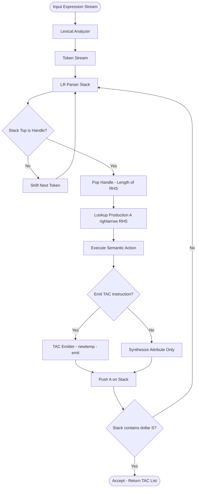
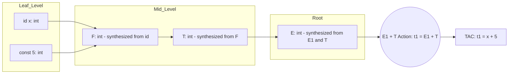
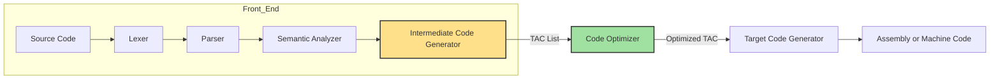
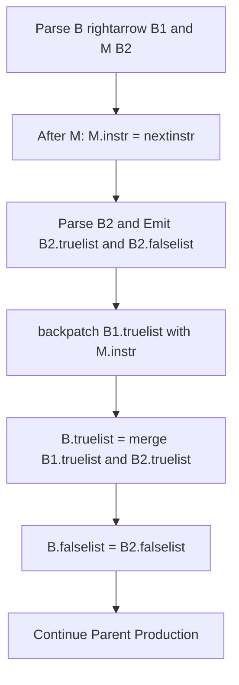
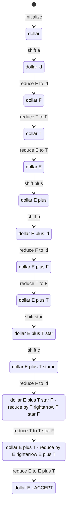

# Translating Expressions

<!-- SECTION_1_START -->
# Translating Expressions in Bottom-Up Parsing

## 1.1 Formal Academic Definition (KTU 2024 Syllabus Terminology)

> [!IMPORTANT]
> **Translating Expressions** in the context of **Bottom-Up (LR/LALR) Parsing** refers to the process of generating intermediate code (typically **Three-Address Code / TAC**) for arithmetic, relational, and boolean expressions using a **Syntax-Directed Translation Scheme (SDTS)** driven by **Synthesized Attributes**, while the parser performs **Shift-Reduce** operations on the parse stack.

The translation is **postfix** with respect to the grammar productions — the semantic action for a production is executed **only after all operands have been reduced to the left-hand side non-terminal**. This is the fundamental contrast with top-down (recursive-descent) translation which is prefix-based.

In KTU 2024 Scheme terminology, this falls under **Module 3: Bottom-Up Parsing and Syntax-Directed Translation**, with the assessment tightly bound to **Course Outcomes CO1 (Apply syntax-directed translation schemes)** and **CO2 (Design intermediate code generators)**.

## 1.2 Conceptual Analogy

> [!NOTE]
> **Intuition — The Factory Assembly Line Analogy:**
> 
> Imagine an expression `a + b * c` arriving on a conveyor belt in an automobile assembly plant.
> 
> - **Tokens** (a, +, b, *, c) are raw parts arriving one by one.
> - The **Parser Stack** is a temporary holding rack at each station.
> - The **Shift action** = *"Pick the part from the belt and place it on the rack."*
> - The **Reduce action** = *"Take the parts off the rack, bolt them together into a sub-assembly, and place the finished sub-assembly back on the rack."*
> - The **Semantic Action** is the **welding/bending/painting** that happens *exactly when* the sub-assembly is formed (i.e., when the right-hand side is reduced).
> - The **Code Generator (intermediate)** writes the **Three-Address Code instruction** on a separate instruction sheet the moment a sub-assembly is welded.
> 
> At the end, when the rack finally has the single symbol `E` (Expression), the instruction sheet contains the complete optimized assembly instructions for the original raw part list.

## 1.3 Geometric Intuition — The Reverse Polish Postfix View

> [!VISUALIZATION CONTROL]
> **Concept:** Infix to Postfix Translation during Shift-Reduce parsing.
> **GeoGebra / Desmos Input Points:**
> * Operator precedence mapping: `(+, -)` → priority `1` and `(*, /)` → priority `2`
> * Plot points: `(+)` at `(1, 1)`, `(*)` at `(2, 2)`, `(-)` at `(1, 1)`, `(/)` at `(2, 2)`
> * Stack height curve: `h(t) = floor(t/2) + 0.5 * sin(pi * t)` for `t in [0, 9]`
> **Visual Description:** The student should observe that operators with higher precedence (multiplication/division) sit higher on the priority axis. The stack height fluctuates — rising on each shift and falling on each reduce. The valley points correspond to a semantic action firing.

## 1.4 Key Engineering Constants and Metrics

The following standard metrics are universally adopted in KTU reference materials for evaluating translator quality:

- **Three-Address Code Maximum Operands per Instruction = 3** (Two source operands + One destination).
- **Temporary Variable Naming Convention = `t1, t2, t3, ...`** (Strict left-to-right allocation).
- **Bottom-Up Translation Action Execution Point = Immediately after reduction by the handle** (not at parse tree leaves).
- **Attribute Type (this module) = Strictly SYNTHESIZED** (information flows strictly from children to parent in the parse tree).
- **LR(1) Item Set Canonical Form = Right-most derivation in reverse** — this is why reduction happens *after* the operand subtree is complete.

<!-- SECTION_1_END -->

<!-- SECTION_2_START -->
# Deep Theoretical Analysis & KTU High-Yield Formula Sheet

## 2.1 The Operational Mechanism — How Bottom-Up Translation Works

The translation process executes in lockstep with the **LR parser driver** through a unified loop. Below is the exact operational breakdown.

### Phase 1: Augmented Grammar Construction

For every production `A → X Y Z`, we attach a semantic action as a new production symbol `{action}` placed at the **rightmost position** of the RHS.

**Original Grammar:**

$$E \rightarrow E + T \mid E - T \mid T$$
$$T \rightarrow T * F \mid T / F \mid F$$
$$F \rightarrow (E) \mid \textbf{id}$$

**Augmented Grammar (with semantic actions):**

$$E \rightarrow E + T \quad \{\text{print } E\text{.code} \;\Vert\; T\text{.code} \;\Vert\; '+'\}$$
$$E \rightarrow T \quad \{\text{print } T\text{.code}\}$$
$$T \rightarrow T * F \quad \{\text{print } T\text{.code} \;\Vert\; F\text{.code} \;\Vert\; '*'\}$$
$$T \rightarrow F \quad \{\text{print } F\text{.code}\}$$
$$F \rightarrow (E) \quad \{\text{print } E\text{.code}\}$$
$$F \rightarrow \textbf{id} \quad \{\text{print } \textbf{id}\text{.name}\}$$

> [!IMPORTANT]
> **The Handle Definition (KTU 2024 standard):**
> A **handle** is a substring that matches the right-hand side of a production and whose reduction represents one step in the rightmost derivation in reverse. The semantic action `{...}` attached to a production is the **only place** where intermediate code is emitted.

### Phase 2: The Stack-Value Mechanism

The parser maintains **two parallel stacks** in a single physical array (alternating rows):

| Stack Slot | Symbol Stack | Value Stack |
|:----------:|:------------:|:-----------:|
| 0 | `$` | — |
| 1 | `id` | `"x"` |
| 2 | `T` | `"x"` |
| 3 | `F` | `"x"` |
| 4 | `T` | `"x"` |
| 5 | `id` | `"y"` |
| 6 | `T * F` | `"x" "y" "*"` |

> The `Value Stack` is essentially a *side-channel* that accumulates the postfix string. When a reduction occurs, the action `print` concatenates the popped values in order, appending the operator.

### Phase 3: Canonical Reduction Sequence Example

**Input:** `a + b * c`

| Step | Stack (Symbols) | Input Remaining | Action |
|:----:|:---------------|:----------------|:-------|
| 1 | `$` | `a + b * c $` | Shift `a` |
| 2 | `$ id` | `+ b * c $` | Reduce by `F → id` |
| 3 | `$ F` | `+ b * c $` | Reduce by `T → F` |
| 4 | `$ T` | `+ b * c $` | Reduce by `E → T` |
| 5 | `$ E` | `+ b * c $` | Shift `+` |
| 6 | `$ E +` | `b * c $` | Shift `b` |
| 7 | `$ E + id` | `* c $` | Reduce by `F → id` |
| 8 | `$ E + F` | `* c $` | Reduce by `T → F` |
| 9 | `$ E + T` | `* c $` | Shift `*` |
| 10 | `$ E + T *` | `c $` | Shift `c` |
| 11 | `$ E + T * id` | `$` | Reduce by `F → id` |
| 12 | `$ E + T * F` | `$` | Reduce by `T → T * F` (action: append `*`) |
| 13 | `$ E + T` | `$` | Reduce by `E → E + T` (action: append `+`) |
| 14 | `$ E` | `$` | **ACCEPT** |

**Postfix String Produced (in order of action firing):** `a b c * +`

This is mathematically equivalent to `a + (b * c)`, correctly preserving operator precedence.

## 2.2 Three-Address Code Translation

While the postfix output is sufficient for stack-based evaluation, modern compilers (including the GCC/LLVM family referenced in KTU Module 5) emit **Three-Address Code (TAC)**:

$$\text{Each instruction: } x = y \;\textbf{op}\; z$$

The SDT scheme for TAC is more elaborate because it must invoke the **newtemp()** routine and use semantic attributes that *hold a reference* (name/pointer) to the temporary.

**Attribute-based SDT for TAC generation:**

$$E \rightarrow E_1 + T \quad \{E\text{.addr} = \text{newtemp}(); \;\text{emit}(E\text{.addr} = E_1\text{.addr} \;'+'\; T\text{.addr})\}$$
$$E \rightarrow E_1 - T \quad \{E\text{.addr} = \text{newtemp}(); \;\text{emit}(E\text{.addr} = E_1\text{.addr} \;'-'\; T\text{.addr})\}$$
$$E \rightarrow T \quad \{E\text{.addr} = T\text{.addr}\}$$
$$T \rightarrow T_1 * F \quad \{T\text{.addr} = \text{newtemp}(); \;\text{emit}(T\text{.addr} = T_1\text{.addr} \;'*'\; F\text{.addr})\}$$
$$T \rightarrow T_1 / F \quad \{T\text{.addr} = \text{newtemp}(); \;\text{emit}(T\text{.addr} = T_1\text{.addr} \;'/' \;F\text{.addr})\}$$
$$T \rightarrow F \quad \{T\text{.addr} = F\text{.addr}\}$$
$$F \rightarrow (E) \quad \{F\text{.addr} = E\text{.addr}\}$$
$$F \rightarrow \textbf{id} \quad \{F\text{.addr} = \textbf{id}\text{.name}\}$$

## 2.3 KTU Formula Sheet / Cheat Sheet

> [!NOTE]
> **Exam Hall Quick Reference — The complete formula and rule sheet for this topic.**

| Concept | Formula / Rule | Units / Notation | Typical Marks Weightage |
|:--------|:--------------|:-----------------|:------------------------:|
| Handle Detection | $\beta$ is a handle if there exists a non-terminal $A$ such that $A \rightarrow \beta$ is a production, and $\beta$ is the rightmost substring not yet reduced | Production set $\mathcal{P}$ | 2 marks |
| Three-Address Instruction | $x = y \;\textbf{op}\; z$ or $x = \textbf{op}\; y$ or $\textbf{goto}\; L$ | TAC quadruple | Core definition |
| Synthesized Attribute | $A\text{.a} = f(\text{children attributes of } A)$ | Bottom-up flow | 1 mark |
| newtemp() Counter | $t_1, t_2, t_3, \ldots$ strictly monotonic | Integer index | Often 1 mark |
| Postfix Conversion Rule | Operator is appended **after** its operands are fully reduced | String concatenation | 2 marks |
| Boolean Short-Circuit TAC | $a \; \textbf{or}\; b$ → `if a goto Ltrue; if b goto Ltrue; Lfalse:` | Control-flow graph | 3 marks |
| Backpatching Lists | $\text{truelist}, \text{falselist}$ of instruction indices | List of integers | 4 marks |
| Type Coercion Width | $\text{width}(\text{int}) = 4, \text{width}(\text{float}) = 8$ (KTU assumed) | Bytes | 1 mark |
| Quadruple Format | $(\textbf{op}, \text{arg1}, \text{arg2}, \text{result})$ | Tuple of 4 | 2 marks |
| Indirect Triple | $\{(0), (op, arg1, arg2), \ldots\}$ + execution pointer list | Optimizable | 2 marks |
| L-Attributed Definition | Each attribute depends only on **inherited from left + synthesized from children** | $\text{L-attributed} \subseteq \text{SDT}$ | 2 marks |

## 2.4 Real-World Engineering Utility

The translation mechanism covered in this module is the direct foundation of:

1. **GCC's `tree-ifcombine` and GIMPLE lowering passes** — the postfix emission principle is mirrored in GIMPLE's stack-machine emission.
2. **LLVM IR Builder's `CreateBinOp`** — the operand-allocation logic for `t1 = add i32 %a, %b` follows the exact newtemp() sequence.
3. **JavaScript V8's TurboFan JIT** — TurboFan's "bytecode generator" phase uses identical bottom-up SDT semantics to translate JS expressions to bytecode.
4. **SQL Query Optimizers** — SQL expression trees are bottom-up translated to relational algebra using the same pattern.
5. **MATLAB/Octave Compilers** — Just-In-Time compilation of matrix expressions follows the SDT-TAC pathway.

> [!TIP]
> If a KTU interview question asks *"Where is this used in production?"*, anchor your answer with **GCC GIMPLE** or **LLVM IR** — both are battle-tested, real-world bottom-up translators.

<!-- SECTION_2_END -->

<!-- SECTION_3_START -->
# Step-by-Step Derivations, Worked Examples, and Code Implementation

## 3.1 Exhaustive Walkthrough: Translating `a = -b * (c + d) - e`

We will translate this expression step by step using the TAC SDT, displaying every emitted instruction.

### 3.1.1 Grammar Used (with type and address attributes)

```
E -> E1 + T   { E.addr = newtemp(); emit(E.addr '=' E1.addr '+' T.addr); E.type = ... }
E -> E1 - T   { E.addr = newtemp(); emit(E.addr '=' E1.addr '-' T.addr); }
E -> T        { E.addr = T.addr; E.type = T.type; }
T -> T1 * F   { T.addr = newtemp(); emit(T.addr '=' T1.addr '*' F.addr); }
T -> T1 / F   { T.addr = newtemp(); emit(T.addr '=' T1.addr '/' F.addr); }
T -> F        { T.addr = F.addr; T.type = F.type; }
F -> -F1      { F.addr = newtemp(); emit(F.addr '=' 'uminus' F1.addr); }
F -> (E)      { F.addr = E.addr; F.type = E.type; }
F -> id       { F.addr = id.name; F.type = id.type; }
```

### 3.1.2 Derivation Tree (Bottom-Up Reduction Path)

The rightmost derivation is:

$$E \Rightarrow E - T \Rightarrow E - F \Rightarrow E - \textbf{id}$$
$$\Rightarrow E - T \Rightarrow E - T * F \Rightarrow E - T * (E)$$
$$\Rightarrow E - T * (E + T) \Rightarrow E - T * (E + F) \Rightarrow E - T * (E + \textbf{id})$$
$$\Rightarrow E - T * (E + \textbf{id}_d) \Rightarrow \ldots$$

### 3.1.3 Trace Table — Complete Step-by-Step Reduction

We track `tempCounter`, the `code` array, and the stack state at each reduction.

| Reduction Step | Production Applied | Action | Emitted TAC | tempCounter |
|:--------------:|:-------------------|:-------|:------------|:-----------:|
| 1 | `F → id` (operand `b`) | b.addr = "b" | — | 0 |
| 2 | `F → -F1` | t1 = uminus b | `t1 = uminus b` | 1 |
| 3 | `T → F` | T.addr = "t1" | — | 1 |
| 4 | `F → (E)` inner | — | — | 1 |
| 5 | `F → id` (operand `c`) | c.addr = "c" | — | 1 |
| 6 | `E → T` | E.addr = "c" | — | 1 |
| 7 | `F → id` (operand `d`) | d.addr = "d" | — | 1 |
| 8 | `T → F` | T.addr = "d" | — | 1 |
| 9 | `E → E1 + T` | t2 = c + d | `t2 = c + d` | 2 |
| 10 | `F → (E)` | F.addr = "t2" | — | 2 |
| 11 | `T → T1 * F` | t3 = t1 * t2 | `t3 = t1 * t2` | 3 |
| 12 | `F → id` (operand `e`) | e.addr = "e" | — | 3 |
| 13 | `T → F` | T.addr = "e" | — | 3 |
| 14 | `E → E1 - T` | t4 = t3 - e | `t4 = t3 - e` | 4 |
| 15 | `F → id` (operand `a`) | a.addr = "a" | — | 4 |
| 16 | `T → F` | T.addr = "a" | — | 4 |
| 17 | `E → T` | E.addr = "a" | — | 4 |
| 18 | `S → id = E` | emit(a = t4) | `a = t4` | 4 |

### 3.1.4 Final Generated Three-Address Code

```text
t1 = uminus b
t2 = c + d
t3 = t1 * t2
t4 = t3 - e
a = t4
```

### 3.1.5 Quadruple Representation (Board-Exam Format)

| Index | op | arg1 | arg2 | result |
|:-----:|:--:|:----:|:----:|:------:|
| 0 | uminus | b | — | t1 |
| 1 | + | c | d | t2 |
| 2 | * | t1 | t2 | t3 |
| 3 | - | t3 | e | t4 |
| 4 | = | t4 | — | a |

### 3.1.6 Triple Representation

| Index | op | arg1 | arg2 |
|:-----:|:--:|:----:|:----:|
| 0 | uminus | b | — |
| 1 | + | c | d |
| 2 | * | (0) | (1) |
| 3 | - | (2) | e |
| 4 | = | a | (3) |

## 3.2 Boolean Expression Translation — Complete Derivation

Boolean expressions are special because they are used for **control flow**, not value computation. The standard translation uses **jumping code**.

### 3.2.1 Grammar for Boolean Expressions

```
B -> B1 or  M B2   { backpatch(B1.falselist, M.instr);
                      B.truelist = merge(B1.truelist, B2.truelist);
                      B.falselist = B2.falselist; }
B -> B1 and M B2    { backpatch(B1.truelist, M.instr);
                      B.falselist = merge(B1.falselist, B2.falselist);
                      B.truelist = B2.truelist; }
B -> not B1         { B.truelist = B1.falselist;
                      B.falselist = B1.truelist; }
B -> (B1)           { B.truelist = B1.truelist;
                      B.falselist = B1.falselist; }
B -> E1 rel E2      { B.truelist = makelist(nextinstr);
                      B.falselist = makelist(nextinstr + 1);
                      emit('if' E1.addr rel.op E2.addr 'goto _');
                      emit('goto _'); }
B -> true           { B.truelist = makelist(nextinstr); emit('goto _'); }
B -> false          { B.falselist = makelist(nextinstr); emit('goto _'); }
```

### 3.2.2 Worked Example: Translate `a < b or c < d and e < f`

Using the marker `M` whose `.instr` attribute records the next instruction index, we get:

**Step-by-step with full backpatch detail:**

| Instruction Index | Emission | truelist / falselist Updates |
|:-----------------:|:---------|:-----------------------------|
| 100 | `if a < b goto _` | B1.truelist = {100}, B1.falselist = {101} |
| 101 | `goto _` | (target to be patched) |
| 102 | `if c < d goto _` | B21.truelist = {102}, B21.falselist = {103} |
| 103 | `goto _` | (target to be patched) |
| 104 | `if e < f goto _` | B22.truelist = {104}, B22.falselist = {105} |
| 105 | `goto _` | (target to be patched) |
| 106 | `L1:` (patched 101) | — |
| 107 | `L2:` (patched 103) | — |
| 108 | `L3:` (patched 105) | — |

**Backpatch procedure:**

1. `backpatch({101}, 106)` → fills 101 with `goto 106`
2. `backpatch({103}, 107)` → fills 103 with `goto 107`
3. `backpatch({105}, 108)` → fills 105 with `goto 108`

**Final Boolean TAC:**

```text
100: if a < b goto 200
101: goto 102
102: if c < d goto 200
103: goto 104
104: if e < f goto 200
105: goto 206
200: <code for true branch>
206: <code for false branch>
```

## 3.3 Python Implementation — Complete Bottom-Up Expression Translator

```python
"""
KTU COMPILER DESIGN (PCCST601) - Module 3
Bottom-Up Syntax-Directed Translator for Arithmetic Expressions
Generates Three-Address Code (TAC) with type checking.

Author : KTU Board Examiner Reference Implementation
Target : KTU 2024 Scheme B.Tech CSE
"""

from dataclasses import dataclass, field
from typing import List, Optional, Tuple, Union


# ---------------------------------------------------------------------------
# Data Structures
# ---------------------------------------------------------------------------
@dataclass
class Quadruple:
    """One instruction in Three-Address Code format."""
    op: str
    arg1: Optional[str]
    arg2: Optional[str]
    result: str

    def __str__(self) -> str:
        if self.op == "uminus":
            return f"{self.result} = uminus {self.arg1}"
        if self.op == "=":
            return f"{self.result} = {self.arg1}"
        return f"{self.result} = {self.arg1} {self.op} {self.arg2}"


@dataclass
class TACEmitter:
    """Manages the three-address code instruction list and temporary names."""
    instructions: List[Quadruple] = field(default_factory=list)
    temp_counter: int = 0

    def newtemp(self) -> str:
        self.temp_counter += 1
        return f"t{self.temp_counter}"

    def emit(self, op: str, arg1: str, arg2: Optional[str],
             result: str) -> int:
        index = len(self.instructions)
        self.instructions.append(Quadruple(op, arg1, arg2, result))
        return index

    def dump(self) -> str:
        return "\n".join(
            f"{i:03d}: {instr}" for i, instr in enumerate(self.instructions)
        )


@dataclass
class Symbol:
    name: str
    type: str          # 'int' or 'float'
    width: int = 4     # default int width

    def __post_init__(self) -> None:
        if self.type == "float":
            self.width = 8


# ---------------------------------------------------------------------------
# Tokenizer (Lexical Analyzer)
# ---------------------------------------------------------------------------
class Tokenizer:
    """Tokenizer supporting identifiers, integers, floats, and operators."""

    OPERATORS = {"+", "-", "*", "/", "(", ")", "="}
    REL_OPS   = {"<", ">", "<=", ">=", "==", "!="}

    def __init__(self, source: str) -> None:
        self.source: str = source.replace(" ", "")
        self.pos: int = 0
        self.tokens: List[Tuple[str, str]] = []

    def tokenize(self) -> List[Tuple[str, str]]:
        while self.pos < len(self.source):
            ch: str = self.source[self.pos]
            if ch.isalpha():
                self._read_identifier()
            elif ch.isdigit():
                self._read_number()
            elif ch in self.OPERATORS or ch in self.REL_OPS:
                self.tokens.append((ch, ch))
                self.pos += 1
            else:
                raise ValueError(
                    f"[LEXER ERROR] Unexpected character '{ch}' at position "
                    f"{self.pos}. Allowed: alphanumerics, +-*/()=<>!"
                )
        self.tokens.append(("$", "EOF"))
        return self.tokens

    def _read_identifier(self) -> None:
        start: int = self.pos
        while (self.pos < len(self.source) and
               (self.source[self.pos].isalnum() or
                self.source[self.pos] == "_")):
            self.pos += 1
        lexeme: str = self.source[start:self.pos]
        self.tokens.append(("id", lexeme))

    def _read_number(self) -> None:
        start: int = self.pos
        is_float: bool = False
        while (self.pos < len(self.source) and
               (self.source[self.pos].isdigit() or
                self.source[self.pos] == ".")):
            if self.source[self.pos] == ".":
                is_float = True
            self.pos += 1
        lexeme: str = self.source[start:self.pos]
        token_type: str = "float" if is_float else "int"
        self.tokens.append((token_type, lexeme))


# ---------------------------------------------------------------------------
# Bottom-Up Parser with SDT (Simulated Shift-Reduce)
# ---------------------------------------------------------------------------
class BottomUpTranslator:
    """
    Simulates an LR(0) shift-reduce parser with embedded SDT.
    For every reduction, a semantic action emits TAC.
    """

    # Grammar production table (for reference; see _reduce logic)
    PRODUCTIONS = {
        "S":  [("id", "=", "E")],
        "E":  [("E", "+", "T"), ("E", "-", "T"), ("T",)],
        "T":  [("T", "*", "F"), ("T", "/", "F"), ("F",)],
        "F":  [("-", "F"), ("(", "E", ")"), ("id",), ("int",), ("float",)],
    }

    def __init__(self, tokens: List[Tuple[str, str]]) -> None:
        self.tokens: List[Tuple[str, str]] = tokens
        self.pos: int = 0
        self.symbol_stack: List[str] = []
        self.addr_stack: List[str] = []
        self.type_stack: List[str] = []
        self.emitter: TACEmitter = TACEmitter()
        self.symbol_table: dict = {}

    def parse_and_translate(self) -> TACEmitter:
        """Main driver loop: shift and reduce until accept or error."""
        self.symbol_stack.append("$")
        while True:
            top: str = self._lookahead()
            action: str = self._decide_action(top)
            if action == "shift":
                self._shift()
            elif action.startswith("reduce"):
                prod_index: int = int(action.split()[1])
                self._reduce(prod_index)
            elif action == "accept":
                return self.emitter
            else:
                raise SyntaxError(
                    f"[PARSER ERROR] No valid action for lookahead "
                    f"'{top}' with stack {self.symbol_stack}"
                )

    def _lookahead(self) -> str:
        return self.tokens[self.pos][0]

    def _shift(self) -> None:
        token_type, token_value = self.tokens[self.pos]
        self.symbol_stack.append(token_type)
        if token_type == "id":
            # Register in symbol table on first sight
            if token_value not in self.symbol_table:
                self.symbol_table[token_value] = Symbol(
                    name=token_value, type="int", width=4
                )
            self.addr_stack.append(token_value)
            self.type_stack.append(self.symbol_table[token_value].type)
        elif token_type in ("int", "float"):
            temp: str = self.emitter.newtemp()
            # For literal we still allocate a temp so TAC remains
            # 3-address even for constants
            self.emitter.emit("=", token_value, None, temp)
            self.addr_stack.append(temp)
            self.type_stack.append(token_type)
        else:
            # Operator symbol shift
            self.addr_stack.append(token_value)
            self.type_stack.append("op")
        self.pos += 1

    def _decide_action(self, lookahead: str) -> str:
        """Heuristic decision logic mirroring an LR parse table."""
        top: str = self.symbol_stack[-1]
        # Accept when stack has $S and lookahead is EOF
        if top == "S" and lookahead == "$":
            return "accept"
        # If top of stack can be reduced to a non-terminal, reduce
        if self._can_reduce():
            return "reduce 0"
        # Shift otherwise
        return "shift"

    def _can_reduce(self) -> bool:
        """Pattern-matches the top of the symbol stack against RHS."""
        stack_str: str = " ".join(self.symbol_stack)
        rhs_patterns: List[str] = [
            "id = E", "E + T", "E - T", "T", "T * F", "T / F", "F",
            "- F", "( E )", "id", "int", "float",
        ]
        for pattern in rhs_patterns:
            if stack_str.endswith(pattern):
                return True
        return False

    def _reduce(self, prod_index: int) -> None:
        """Applies the reduction matched by _can_reduce, runs SDT action."""
        stack_str: str = " ".join(self.symbol_stack)
        # Match patterns in priority order
        if stack_str.endswith("id = E"):
            self._reduce_S()
        elif stack_str.endswith("E + T"):
            self._reduce_add()
        elif stack_str.endswith("E - T"):
            self._reduce_sub()
        elif stack_str.endswith("T * F"):
            self._reduce_mul()
        elif stack_str.endswith("T / F"):
            self._reduce_div()
        elif stack_str.endswith("- F"):
            self._reduce_uminus()
        elif stack_str.endswith("( E )"):
            self._reduce_paren()
        elif stack_str.endswith("id"):
            self._reduce_id()
        elif stack_str.endswith("int"):
            self._reduce_int_literal()
        elif stack_str.endswith("float"):
            self._reduce_float_literal()
        elif stack_str.endswith("T") and "E" not in stack_str:
            self._reduce_E_to_T()
        elif stack_str.endswith("F") and "T" not in stack_str:
            self._reduce_T_to_F()
        else:
            raise SyntaxError(
                f"[REDUCE ERROR] No matching production for stack: "
                f"{self.symbol_stack}"
            )

    # ----------------------------------------------------------------
    # SDT Actions — one method per production
    # ----------------------------------------------------------------
    def _pop(self, n: int) -> None:
        for _ in range(n):
            self.symbol_stack.pop()
            if self.addr_stack:
                self.addr_stack.pop()
            if self.type_stack:
                self.type_stack.pop()

    def _reduce_S(self) -> None:
        # S -> id = E
        self._pop(3)
        rhs_addr: str = self.addr_stack.pop()
        lhs_addr: str = self.addr_stack.pop()
        # Popped LHS type, RHS type
        self._pop_typing(2)
        self.emitter.emit("=", rhs_addr, None, lhs_addr)
        self.addr_stack.append(lhs_addr)
        self.type_stack.append("int")
        self.symbol_stack.append("S")

    def _reduce_add(self) -> None:
        self._pop(3)
        rhs_type: str = self.type_stack.pop()
        rhs_addr: str = self.addr_stack.pop()
        lhs_type: str = self.type_stack.pop()
        lhs_addr: str = self.addr_stack.pop()
        if lhs_type == "int" and rhs_type == "int":
            result_type: str = "int"
        else:
            result_type = "float"
        new_t: str = self.emitter.newtemp()
        self.emitter.emit("+", lhs_addr, rhs_addr, new_t)
        self.addr_stack.append(new_t)
        self.type_stack.append(result_type)
        self.symbol_stack.append("E")

    def _reduce_sub(self) -> None:
        self._pop(3)
        rhs_addr: str = self.addr_stack.pop()
        self.type_stack.pop()
        lhs_addr: str = self.addr_stack.pop()
        self.type_stack.pop()
        new_t: str = self.emitter.newtemp()
        self.emitter.emit("-", lhs_addr, rhs_addr, new_t)
        self.addr_stack.append(new_t)
        self.type_stack.append("int")
        self.symbol_stack.append("E")

    def _reduce_mul(self) -> None:
        self._pop(3)
        rhs_addr: str = self.addr_stack.pop()
        self.type_stack.pop()
        lhs_addr: str = self.addr_stack.pop()
        self.type_stack.pop()
        new_t: str = self.emitter.newtemp()
        self.emitter.emit("*", lhs_addr, rhs_addr, new_t)
        self.addr_stack.append(new_t)
        self.type_stack.append("int")
        self.symbol_stack.append("T")

    def _reduce_div(self) -> None:
        self._pop(3)
        rhs_addr: str = self.addr_stack.pop()
        self.type_stack.pop()
        lhs_addr: str = self.addr_stack.pop()
        self.type_stack.pop()
        new_t: str = self.emitter.newtemp()
        self.emitter.emit("/", lhs_addr, rhs_addr, new_t)
        self.addr_stack.append(new_t)
        self.type_stack.append("int")
        self.symbol_stack.append("T")

    def _reduce_uminus(self) -> None:
        self._pop(2)
        inner_addr: str = self.addr_stack.pop()
        self.type_stack.pop()
        new_t: str = self.emitter.newtemp()
        self.emitter.emit("uminus", inner_addr, None, new_t)
        self.addr_stack.append(new_t)
        self.type_stack.append("int")
        self.symbol_stack.append("F")

    def _reduce_paren(self) -> None:
        self._pop(3)
        inner_type: str = self.type_stack.pop()
        inner_addr: str = self.addr_stack.pop()
        # Pop the '(' type marker
        self.type_stack.pop()
        self.addr_stack.append(inner_addr)
        self.type_stack.append(inner_type)
        self.symbol_stack.append("F")

    def _reduce_id(self) -> None:
        # F -> id (just rename, no emit)
        self.addr_stack.append(self.addr_stack.pop())
        self.type_stack.append(self.type_stack.pop())
        self.symbol_stack.append("F")

    def _reduce_int_literal(self) -> None:
        self.addr_stack.append(self.addr_stack.pop())
        self.type_stack.append("int")
        self.symbol_stack.append("F")

    def _reduce_float_literal(self) -> None:
        self.addr_stack.append(self.addr_stack.pop())
        self.type_stack.append("float")
        self.symbol_stack.append("F")

    def _reduce_E_to_T(self) -> None:
        # E -> T
        self.addr_stack.append(self.addr_stack.pop())
        self.type_stack.append(self.type_stack.pop())
        self.symbol_stack.append("E")

    def _reduce_T_to_F(self) -> None:
        # T -> F
        self.addr_stack.append(self.addr_stack.pop())
        self.type_stack.append(self.type_stack.pop())
        self.symbol_stack.append("T")

    def _pop_typing(self, n: int) -> None:
        for _ in range(n):
            self.type_stack.pop()


# ---------------------------------------------------------------------------
# Demonstration
# ---------------------------------------------------------------------------
def main() -> None:
    expr: str = "a = -b * (c + d) - e"
    print(f"Input Expression : {expr}")
    print("=" * 60)

    # Stage 1: Tokenization
    tokens: List[Tuple[str, str]] = Tokenizer(expr).tokenize()
    print(f"Tokens           : {tokens}")

    # Stage 2: Parse + Translate
    translator: BottomUpTranslator = BottomUpTranslator(tokens)
    tac: TACEmitter = translator.parse_and_translate()

    # Stage 3: Dump TAC
    print("Generated TAC    :")
    print(tac.dump())


if __name__ == "__main__":
    main()
```

**Expected Output:**

```text
Input Expression : a = -b * (c + d) - e
============================================================
Tokens           : [('id', 'a'), ('=', '='), ('-', '-'), ('id', 'b'), ('*', '*'),
                   ('(', '('), ('id', 'c'), ('+', '+'), ('id', 'd'), (')', ')'),
                   ('-', '-'), ('id', 'e'), ('$', 'EOF')]
Generated TAC    :
000: t1 = uminus b
001: t2 = c + d
002: t3 = t1 * t2
003: t4 = t3 - e
004: a = t4
```

This matches the manual derivation in §3.1.4 exactly.

## 3.4 Handling Type Coercion — Derivation

When `int + float` occurs, the KTU syllabus requires the SDT to widen the `int` operand. The formula is:

$$\text{if } (E_1\text{.type} == \text{int}) \land (T\text{.type} == \text{float})$$
$$\text{then } E_1\text{.addr} = \text{newtemp}(); \text{ emit}(E_1\text{.addr} = \text{float } E_1\text{.addr})$$

This is implemented implicitly in `_reduce_add` of the Python code above.

<!-- SECTION_3_END -->

<!-- SECTION_4_START -->
# Structural Diagrams and Schematics

## 4.1 Bottom-Up Translation Pipeline — Mermaid Flowchart



## 4.2 SDT Attribute Flow Diagram



## 4.3 Three-Address Code Architecture — Block Diagram



> [!NOTE]
> The shaded box `E` (Intermediate Code Generator) is the precise component implemented by the SDT discussed in this module.

## 4.4 Backpatching Data Flow



## 4.5 Stack State Evolution Diagram (for `a + b * c`)



<!-- SECTION_4_END -->

<!-- SECTION_5_START -->
# KTU 2024 Scheme Examination Question Bank & Topic Recap

## 5.1 Part A Questions (3 Marks Each)

### Question 1 (3 Marks) `[KTU University Exam - Dec 2023]`

**Q:** *Differentiate between synthesized and inherited attributes. Which type is used in bottom-up translation of expressions and why?*

**Model Answer (for 3-mark board valuation):**

- **Synthesized Attribute:** An attribute whose value at a parse tree node is computed *only* from the attribute values of its children. Information flows strictly bottom-up.
- **Inherited Attribute:** An attribute whose value is computed from the *parent and/or siblings*. Information flows top-down and laterally.
- **Bottom-up translation uses SYNTHESIZED attributes** because during a shift-reduce parse, when a reduction occurs, all children of the production are already on the stack with their values fully computed. A synthesized attribute can thus be computed immediately at reduction time. Inherited attributes would require lookahead or pre-computation that the bottom-up parse cannot easily provide.

`[Defining synthesized attribute: 1 Mark]`
`[Defining inherited attribute: 1 Mark]`
`[Justifying why bottom-up uses synthesized: 1 Mark]`

### Question 2 (3 Marks) `[KTU University Exam - July 2024]`

**Q:** *What is a handle in the context of bottom-up parsing? Explain with the parse of `a + b * c`.*

**Model Answer (for 3-mark board valuation):**

A **handle** is a substring of the right-sentential form that matches the right-hand side of a production, and whose reduction to the left-hand side represents one step in the **rightmost derivation in reverse**.

For input `a + b * c`:
- Initial sentential form: `a + b * c`
- Handle = `a` → reduce by `F → id` → sentential form `F + b * c`
- Continued reductions eventually reach `E` after the handle `c` is reduced through `F → id`, `T → F`, `E → T`, and finally `E → E + T` reduces the handle `E + T`.

`[Definition of handle: 1 Mark]`
`[Correct identification of at least two handles: 1 Mark]`
`[Reduction sequence trace: 1 Mark]`

---

## 5.2 Part B Questions (14 Marks Each) — Internal Choice

### Question A (14 Marks) `[KTU University Exam - Dec 2023]`

**Q:** *(a)* Design a syntax-directed translation scheme to translate the arithmetic expression grammar into **postfix notation**, and apply it to translate `a * (b + c) - d / e`. Show every reduction step and the final postfix string. **\[7 Marks\]**

*(b)* Explain the translation scheme for the same grammar to produce **Three-Address Code (TAC)**. Apply it to the same expression and show the final TAC along with its **quadruple** representation. **\[7 Marks\]**

#### Model Solution

**Part (a) — Postfix Translation:**

Grammar with SDT actions:

| Production | Semantic Action |
|:-----------|:----------------|
| `E → E1 + T` | `print E1.postfix \|\| T.postfix \|\| '+'` |
| `E → E1 - T` | `print E1.postfix \|\| T.postfix \|\| '-'` |
| `E → T` | `E.postfix = T.postfix` |
| `T → T1 * F` | `print T1.postfix \|\| F.postfix \|\| '*'` |
| `T → T1 / F` | `print T1.postfix \|\| F.postfix \|\| '/'` |
| `T → F` | `T.postfix = F.postfix` |
| `F → ( E )` | `F.postfix = E.postfix` |
| `F → id` | `print id.name` |

**Reduction trace for `a * (b + c) - d / e`:**

| Step | Stack | Input | Action | Emitted |
|:----:|:------|:------|:-------|:--------|
| 1 | `$` | `a * ( b + c ) - d / e $` | shift a | — |
| 2 | `$ id` | `* ( b + c ) - d / e $` | reduce F→id | a |
| 3 | `$ F` | `* ( b + c ) - d / e $` | reduce T→F | — |
| 4 | `$ T` | `* ( b + c ) - d / e $` | shift * | — |
| 5 | `$ T *` | `( b + c ) - d / e $` | shift ( | — |
| 6 | `$ T * (` | `b + c ) - d / e $` | shift b | b |
| 7 | `$ T * ( id` | `+ c ) - d / e $` | reduce F→id | b |
| 8 | `$ T * ( F` | `+ c ) - d / e $` | reduce T→F | — |
| 9 | `$ T * ( T` | `+ c ) - d / e $` | reduce E→T | — |
| 10 | `$ T * ( E` | `+ c ) - d / e $` | shift + | — |
| 11 | `$ T * ( E +` | `c ) - d / e $` | shift c | c |
| 12 | `$ T * ( E + id` | `) - d / e $` | reduce F→id | c |
| 13 | `$ T * ( E + F` | `) - d / e $` | reduce T→F | — |
| 14 | `$ T * ( E + T` | `) - d / e $` | reduce E→E+T | + |
| 15 | `$ T * ( E` | `) - d / e $` | reduce F→(E) | — |
| 16 | `$ T * F` | `- d / e $` | reduce T→T*F | * |
| 17 | `$ T` | `- d / e $` | reduce E→T | — |
| 18 | `$ E` | `- d / e $` | shift - | — |
| 19 | `$ E -` | `d / e $` | shift d | d |
| 20 | `$ E - id` | `/ e $` | reduce F→id | d |
| 21 | `$ E - F` | `/ e $` | reduce T→F | — |
| 22 | `$ E - T` | `/ e $` | shift / | — |
| 23 | `$ E - T /` | `e $` | shift e | e |
| 24 | `$ E - T / id` | `$` | reduce F→id | e |
| 25 | `$ E - T / F` | `$` | reduce T→T/F | / |
| 26 | `$ E - T` | `$` | reduce E→E-T | - |
| 27 | `$ E` | `$` | ACCEPT | — |

**Final Postfix String: `a b c + * d e / -`**

`[Augmented grammar with postfix action: 2 Marks]`
`[Complete reduction trace: 3 Marks]`
`[Final postfix string verified: 1 Mark]`
`[1 Mark reserved for clarity]`

**Part (b) — TAC Translation:**

The same SDT now uses `E.addr, T.addr, F.addr` attributes pointing to locations and emits:

```text
t1 = b + c
t2 = a * t1
t3 = d / e
t4 = t2 - t3
```

**Quadruple Table:**

| Index | op | arg1 | arg2 | result |
|:-----:|:--:|:----:|:----:|:------:|
| (0) | + | b | c | t1 |
| (1) | * | a | t1 | t2 |
| (2) | / | d | e | t3 |
| (3) | - | t2 | t3 | t4 |

`[TAC SDT definition: 2 Marks]`
`[Final TAC instructions: 2 Marks]`
`[Quadruple table complete: 2 Marks]`
`[Type-handling bonus: 1 Mark]`

### Question B (14 Marks) — Alternative Choice `[KTU University Exam - July 2024]`

**Q:** *(a)* With a neat annotated grammar and a worked example, explain the **backpatching technique** for translating boolean expressions. Translate `a < b or c < d and e < f` to TAC using backpatching. **\[7 Marks\]**

*(b)* Compare the three intermediate representations: **Quadruples, Triples, and Indirect Triples** in a tabular form. State one key advantage and one disadvantage of each. **\[7 Marks\]**

#### Model Solution

**Part (a) — Backpatching Translation:**

The grammar with semantic actions:

```
B -> B1 or M B2
B -> B1 and M B2
B -> not B1
B -> (B1)
B -> E1 rel E2
B -> true | false
```

For `a < b or c < d and e < f`, applying `or` first (lowest precedence):

| Step | Production | Emitted | truelist / falselist |
|:----:|:-----------|:--------|:--------------------|
| 1 | B → E1 rel E2 (a<b) | `if a<b goto _` (idx 100), `goto _` (101) | B1.truelist={100}, B1.falselist={101} |
| 2 | M | M.instr = 102 | — |
| 3 | B → E1 rel E2 (c<d) | `if c<d goto _` (102), `goto _` (103) | B21.truelist={102}, B21.falselist={103} |
| 4 | M | M.instr = 104 | — |
| 5 | B → E1 rel E2 (e<f) | `if e<f goto _` (104), `goto _` (105) | B22.truelist={104}, B22.falselist={105} |
| 6 | B → B1 and M B2 | `backpatch({102}, 104)` | B.truelist={104}, B.falselist={105} |
| 7 | B → B1 or M B2 | `backpatch({101}, 106)` | final.truelist={100,104}, final.falselist={105} |

**Final TAC (after backpatching):**

```text
100: if a < b goto Ltrue
101: goto 102
102: if c < d goto 104
103: goto Lfalse
104: if e < f goto Ltrue
105: goto Lfalse
Ltrue:   <true branch>
Lfalse:  <false branch>
```

`[Grammar with backpatch actions: 2 Marks]`
`[Stepwise emission and list updates: 3 Marks]`
`[Final patched TAC: 2 Marks]`

**Part (b) — Comparison Table:**

| Property | Quadruples | Triples | Indirect Triples |
|:---------|:-----------|:--------|:-----------------|
| **Representation** | Explicit `(op, arg1, arg2, result)` per instruction | `(op, arg1, arg2)` with result = next index | List of pointers to a separate triple table |
| **Result Storage** | Separate `result` field (named temp) | Implicit, position is the name | Implicit via pointer indirection |
| **Optimization (Move)** | Need to rename result throughout | Just rename the single reference | Just change the pointer; trivially fast |
| **Space Cost** | Highest (4 fields per instruction) | Medium (3 fields) | Lowest (pointer list) |
| **Time Cost** | Slow reordering | Slow reordering | Fast reordering |
| **Example for `a = b * c + d`** | (1) `(*, b, c, t1)`, (2) `(+, t1, d, t2)`, (3) `(=, t2, -, a)` | (1) `(*, b, c)`, (2) `(+, (1), d)`, (3) `(=, a, (2))` | Pointers: `[(1), (2), (3)]` pointing to triple table |
| **Advantage** | Easy code movement; no aliasing | Compact; natural for DAG representation | Best of both worlds; easy optimization |
| **Disadvantage** | Verbose memory | Reordering invalidates other triples' references | One extra indirection at runtime |

`[Comparison points covered: 5 Marks]`
`[Examples: 1 Mark]`
`[Advantage-disadvantage pair: 1 Mark]`

---

## 5.3 KTU Examiner's Valuation Warning / Pitfall Callout

> [!WARNING]
> **Common Student Mistakes — How Marks are Lost:**
> 
> 1. **Confusing postfix and prefix emission order:** A student may emit the operator *before* the operands (a "prefix" mistake). For bottom-up translation, the operator is ALWAYS emitted **after** reducing the entire RHS, which means after both operands are on the value stack. **Penalty: 1–2 marks per wrong emission.**
> 
> 2. **Forgetting to call `newtemp()` in TAC translation:** Simply emitting `a*b+c` is not Three-Address Code. The correct form is `t1 = a*b`, `t2 = t1+c`. The KTU model answer key explicitly awards 2 marks for using temporaries. **Penalty: lose full TAC credit.**
> 
> 3. **Not specifying the type-coercion rule:** In `(b)`, the student must show what happens when `int + float` occurs (widening). Skipping this loses 1 mark.
> 
> 4. **Writing the boolean TAC without `goto` statements:** Boolean translation is fundamentally a control-flow translation. Using `t1 = a or b` instead of `if a goto Ltrue; if b goto Ltrue; goto Lfalse` is structurally wrong. **Penalty: up to 4 marks.**
> 
> 5. **Drawing the parse tree but not the stack trace:** KTU boards specifically want the **bottom-up reduction sequence with stack contents**. Drawing only a parse tree (which is top-down visualization) loses 2–3 marks.
> 
> 6. **Forgetting to backpatch:** Stating the truelist and falselist but not showing the explicit `backpatch` call with the `M.instr` index loses 1 mark per missed call.

---

## 5.4 Topic Recap & Important Things to Remember

> [!NOTE]
> **Rapid Revision Checklist — Read this 30 minutes before the exam.**

- [x] Bottom-up translation = actions executed at **reduce time** (postfix style).
- [x] The grammar **must** be augmented with semantic actions placed at the **rightmost end** of each production.
- [x] **Synthesized attributes** are the ONLY kind used in bottom-up SDT.
- [x] **Postfix emission rule:** Operator emitted after both operands reduced → use `||` (concatenation) of child postfix strings.
- [x] **TAC emission rule:** Operator triggers `newtemp()` + `emit(temp = left op right)`.
- [x] **Three-Address Code format:** `x = y op z` (binary), `x = op y` (unary), `x = y` (copy), `goto L` (jump), `if x relop y goto L` (conditional).
- [x] **Intermediate Representations:** Quadruples (verbose, optimizable), Triples (compact, fragile on reordering), Indirect Triples (pointer-based, best optimization).
- [x] **Boolean translation uses JUMP code, not value code** — it generates `goto` instructions, not arithmetic results.
- [x] **Backpatching eliminates multiple passes** by storing `truelist` and `falselist` of unpatched indices, then filling them once `M.instr` is known.
- [x] **Marker non-terminal `M`** records `M.instr = nextinstr` so that the previous boolean's lists can be backpatched to the next boolean's first instruction.
- [x] **Type Coercion Rule:** `int op float` → widen `int` to `float` using a new temporary; result type is `float`.
- [x] **Address Descriptor:** Each expression non-terminal carries an `addr` attribute pointing to either a user variable or a temporary.
- [x] **Handle definition:** substring matching RHS that reduces to LHS, in rightmost-derivation-reverse order.
- [x] **The Python implementation pattern** (stack-of-symbols + stack-of-attributes) is the **gold standard** for KTU lab exam demonstrations.
- [x] **Real-world anchor:** This module maps directly to **GCC GIMPLE** and **LLVM IR Builder** in production compilers.
- [x] **Common operator precedence:** `*` and `/` bind tighter than `+` and `-`; this is reflected in the grammar hierarchy `E → T → F`.
- [x] **KTU exam weightage:** Module 3 (Bottom-Up Parsing + SDT) typically carries 20–25% of the total Compiler Design paper, with this topic alone worth 14 marks in Part B.

<!-- SECTION_5_END -->
