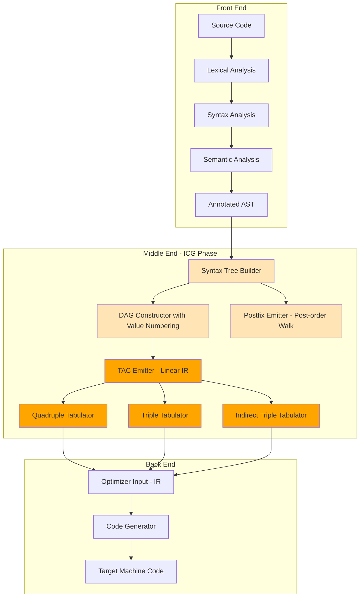
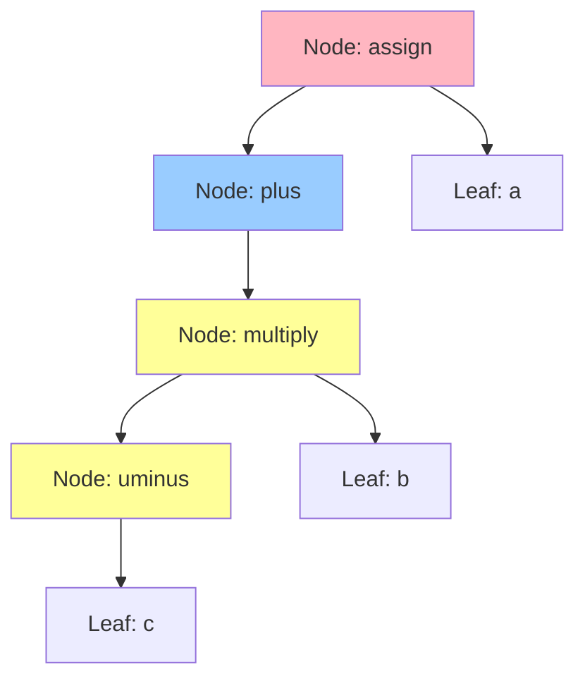
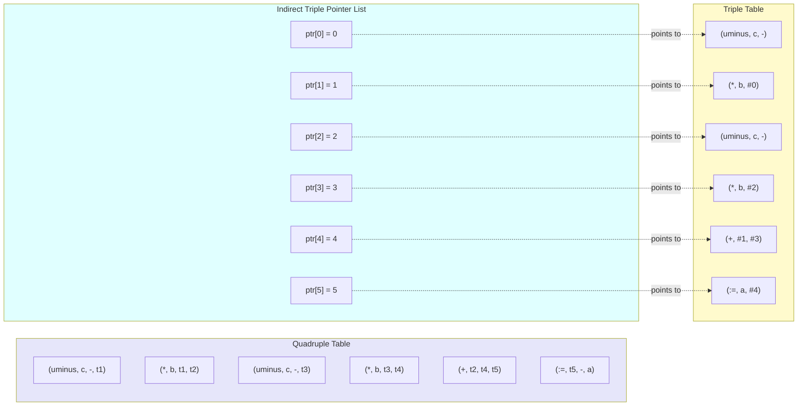

# Intermediate Code Generation: Syntax trees, DAG, Postfix notation, and Three-Address Code (Quadruples, Triples, Indirect Triples)

<!-- SECTION_1_START -->
# Intermediate Code Generation: The Bridge Between Front-End & Back-End

## 1.1 Formal Academic Definition (KTU 2024 Syllabus Terminology)

> [!IMPORTANT]
> **Intermediate Code Generation (ICG)** is the synthesis phase of a compiler that translates the annotated parse tree (or syntax tree) produced by the semantic analysis phase into a semantically equivalent, machine-independent, low-level intermediate representation (IR). This IR is then consumed by the code optimizer and the target code generator.

In the KTU 2024 Scheme (PCCST601 - Compiler Design), this topic sits at the heart of **Module 3: Syntax-Directed Translation & Runtime Environments**. The compiler pipeline is formally partitioned as:

$$\text{Source} \;\rightarrow\; \text{Lexer} \;\rightarrow\; \text{Parser} \;\rightarrow\; \text{Semantic Analyzer} \;\rightarrow\; \boxed{\text{ICG}} \;\rightarrow\; \text{Optimizer} \;\rightarrow\; \text{Target Code}$$

## 1.2 Conceptual Analogy & Engineering Intuition

> [!NOTE]
> **The "Universal Translator" Analogy:** Imagine the United Nations, where 195 diplomats speak different native languages. Instead of every diplomat learning every other language (impractical and unscalable), a **universal translator** (e.g., English) is used as an intermediate step. Each diplomat translates only *to* and *from* the universal language.

A compiler works identically:
* **Front-end** (Lexer, Parser, Semantic Analyzer) handles language-specific details.
* **Back-end** (Code Generator) handles machine-specific details.
* **Intermediate Code** is the *universal translator* — a language-agnostic, machine-independent representation that lets the same front-end feed multiple targets (x86, ARM, RISC-V, JVM, WebAssembly) and the same target consume multiple front-ends (C, C++, Rust).

> [!TIP]
> **Why this matters in production:** GCC, LLVM, and the JVM all use sophisticated IRs (GIMPLE, LLVM-IR, Java Bytecode). The principle is identical to what you study in this module — **decoupling** is what makes industrial compilers maintainable.

## 1.3 The Four Canonical Intermediate Representations

> [!IMPORTANT]
> **KTU 2024 Module 3 — Core Forms of Intermediate Representation:**
> 1. **Syntax Tree (Abstract Syntax Tree / Parse Tree variant)**
> 2. **Directed Acyclic Graph (DAG)**
> 3. **Postfix Notation (Reverse Polish Notation / Suffix)**
> 4. **Three-Address Code (TAC)** — implemented via **Quadruples**, **Triples**, or **Indirect Triples**

### 1.3.1 Syntax Tree (AST)
A condensed parse tree where:
* Non-terminal punctuation (commas, semicolons, parentheses) is **removed**.
* Chains of single-child productions are **collapsed**.
* Operators and keywords become the **internal nodes**; operands become the **leaves**.

### 1.3.2 Directed Acyclic Graph (DAG)
A DAG is a syntax tree in which **common subexpressions are identified and shared**. If the same subexpression appears multiple times, only one node is created, and all occurrences point to the *same* node. This is the structural foundation of the *common subexpression elimination* (CSE) optimization.

### 1.3.3 Postfix Notation (RPN)
A parenthesis-free, fully parenthesized-free linear notation where **every operator follows its operands**. It is the natural IR for **stack-based evaluation machines** (e.g., the JVM, the JavaScript V8 engine, and the Python CPython interpreter all internally use stack-based IRs or postfix-like bytecode).

### 1.3.4 Three-Address Code (TAC)
The de facto industry standard. Every instruction contains **at most three operands**, in the form:

$$x \;:=\; y \; \mathbf{op} \; z$$

The key invariants are:
* The **right-hand side has at most one operator**.
* The compiler introduces an unlimited supply of **temporaries** ($t_1, t_2, t_3, \ldots$) to break down complex expressions.

## 1.4 Physical Constants & Standard Metrics

> [!NOTE]
> **Standard Engineering Metrics for IR Quality (Bolded for emphasis):**
> * **Maximum Operands per Instruction:** **3** (for TAC; it's the definition).
> * **Storage of Temporaries:** **Unbounded symbolic names** (resolved during register allocation).
> * **DAG Node Count vs. AST Node Count Ratio:** A measure of *redundancy* in the source expression. Lower ratio ⇒ more redundant code ⇒ higher CSE payoff.
> * **Pointer-based vs. Value-based IR:** Triples use **instruction indices**; Quadruples use **symbolic names** — a critical trade-off for compiler writers.

## 1.5 Visualization Control — Geometric Intuition

> [!VISUALIZATION CONTROL]
> **Concept:** Directed Acyclic Graph (DAG) for the expression $a \;:=\; b \ast (-c) \;+\; b \ast (-c)$
> **GeoGebra / Desmos Input Equations (as a tree of points):**
> * Node $A$ at $(0, 0)$: label $=$ (root)
> * Node $B$ at $(-2, 1)$: label $+$
> * Node $C$ at $(2, 1)$: label $a$ (leaf)
> * Node $D$ at $(-3, 2)$: label $\ast$
> * Node $E$ at $(-1, 2)$: label $\ast$ (shared child!)
> * Node $F$ at $(-3, 3)$: label $b$
> * Node $G$ at $(-1, 3)$: label $b$
> * Node $H$ at $(-2, 3)$: label $\mathbf{uminus}$ (single shared node)
> * Node $I$ at $(0, 3)$: label $c$ (single shared leaf)
> **Visual Description:** The student should observe that the subtree computing $(-c)$ is **constructed once and referenced twice** — visually proving why a DAG is strictly more compact than an AST for redundant expressions.

---

<!-- SECTION_1_END -->

<!-- SECTION_2_START -->
# Deep Theoretical Analysis & KTU High-Yield Formula Sheet

## 2.1 Operational Logic of Each IR Form

### 2.1.1 Construction of the Syntax Tree (SDD-based)

The standard Aho/Sethi/Ullman Syntax-Directed Definition (SDD) used in KTU textbooks is:

| Production | Semantic Action |
| :--- | :--- |
| $E \rightarrow E_1 \;+\; T$ | $\text{node} := \text{new Node}(+, E_1.\text{node}, T.\text{node})$ |
| $E \rightarrow E_1 \;-\; T$ | $\text{node} := \text{new Node}(-, E_1.\text{node}, T.\text{node})$ |
| $E \rightarrow T$ | $\text{node} := T.\text{node}$ |
| $T \rightarrow T_1 \;\ast\; F$ | $\text{node} := \text{new Node}(\ast, T_1.\text{node}, F.\text{node})$ |
| $T \rightarrow F$ | $\text{node} := F.\text{node}$ |
| $F \rightarrow (E)$ | $\text{node} := E.\text{node}$ |
| $F \rightarrow \mathbf{id}$ | $\text{node} := \text{new Leaf}(\mathbf{id}, \text{entry}) $ |
| $F \rightarrow \mathbf{num}$ | $\text{node} := \text{new Leaf}(\mathbf{num}, \text{val}) $ |
| $F \rightarrow \mathbf{uminus}\; F_1$ | $\text{node} := \text{new Node}(\mathbf{uminus}, F_1.\text{node}, \text{NULL})$ |

> [!TIP]
> **Engineering Insight:** Every call to `new Node(op, left, right)` allocates a fresh heap node. The total number of nodes equals the number of *distinct* operators + operands in the expression. The tree is built **bottom-up** during post-order traversal.

### 2.1.2 Construction of the DAG (The Value-Number Method)

A naive DAG would use a hash table keyed on the **operator and child pointers**. The Aho/Ullman efficient algorithm uses **value numbers** (a form of hash-consing):

1. Traverse the expression using a post-order walk.
2. Maintain a hash map from `(operator, value_number_of_left, value_number_of_right)` to a unique integer **value number**.
3. If a triple is already in the hash table, **reuse the existing node** — do not create a new one.

> [!IMPORTANT]
> **Key Engineering Property:** The DAG captures **identical computations** as shared nodes. This is *the* prerequisite for the **Common Subexpression Elimination (CSE)** optimization. The DAG is structurally equivalent to a *basic block's* available-expression analysis.

### 2.1.3 Postfix Notation (Conversion Algorithm)

Two algorithms are taught in KTU:

* **Algorithm 1 (Tree-walk based):** Perform a **post-order traversal** of the syntax tree, printing the node label *after* its children.
* **Algorithm 2 (Shunting-Yard by Dijkstra):** Use a stack of operators. For each operand read, output it. For each operator read, pop and output all operators of **higher or equal precedence** before pushing the new one. Output remaining stack at the end.

### 2.1.4 Three-Address Code: The Three Concrete Implementations

All three implementations store the *same logical* TAC. They differ **only in their physical data structure**.

#### (a) Quadruples (The Most Common Form)
Each instruction is a 4-tuple: `(op, arg1, arg2, result)`. Uses **named temporaries** ($t_1, t_2, \ldots$).

* **Strength:** Easy to move, reorder, and optimize. The `result` field gives a stable name that survives code motion.
* **Weakness:** Temporaries consume space in the symbol table.

#### (b) Triples
Each instruction is a 3-tuple: `(op, arg1, arg2)`. Operands are either **named** (for variables/constants) or **instruction indices** (for temporaries). There is no `result` field — the result is *implicitly* the instruction's own index.

* **Strength:** No temporaries needed → compact.
* **Weakness:** If an instruction is moved (e.g., by code motion in optimization), all instructions that reference it by index **must be renumbered** — a major pain point.

#### (c) Indirect Triples
A hybrid: an **execution pointer list** (an array of instruction indices) references the actual triples. The triples themselves can be re-ordered in storage **without renumbering the pointers**.

* **Strength:** Combines the compactness of triples with the re-orderability of quadruples.
* **Weakness:** An extra indirection on every instruction fetch (slower access).

## 2.2 KTU Formula Sheet / Cheat Sheet

> [!NOTE]
> **The following table is the master reference for KTU 2024 PCCST601 Module-3 board questions.**

| # | Concept | Symbolic Form / Rule | Engineering Use |
| :--- | :--- | :--- | :--- |
| 1 | TAC Invariant | $x \;:=\; y \; \mathbf{op} \; z$ | Universal IR contract |
| 2 | Unary Minus | $t_i \;:=\; \mathbf{uminus}\; y$ | $t_1 := \mathbf{uminus}\; c$ |
| 3 | Copy | $x \;:=\; y$ | Assignment-only statement |
| 4 | Branch | $\mathbf{if}\; x \; \mathbf{relop}\; y \; \mathbf{goto}\; L$ | Control flow |
| 5 | Jump | $\mathbf{goto}\; L$ | Unconditional transfer |
| 6 | Call | $\mathbf{param}\; x,\; \mathbf{call}\; p,\; n$ | Procedure invocation |
| 7 | Array Index (1D) | $t_1 \;:=\; i \;\ast\; w ;\; t_2 \;:=\; a[t_1]$ | Address arithmetic |
| 8 | Pointer Deref | $x \;:=\; \mathbf{\ast} p \;\vert\; \mathbf{\ast} p \;:=\; y$ | Pointer indirection |
| 9 | DAG Node Count | $V \;=\; \Sigma$ distinct subexpressions | Measures redundancy |
| 10 | AST Node Count | $A \;=\; \Sigma$ operator + operand tokens | Measures size |
| 11 | CSE Payoff | $\Delta \;=\; A - V$ | Nodes eliminated by sharing |
| 12 | Postfix Precedence | $\mathbf{uminus} > \ast, / > +, -$ (R-to-L for $=$) | Stack evaluation order |
| 13 | Quadruple Field Order | $(\mathbf{op}, \;\arg_1, \;\arg_2, \;\mathbf{result})$ | Table layout |
| 14 | Triple Implicit Result | $i$-th instruction's result $\equiv$ index $i$ | Index-based linking |
| 15 | Indirect Triple | $\mathbf{ptr}[k] \;=\; i$ where triples$[i]$ is the actual op | Pointer indirection |

## 2.3 Real-World Engineering Utility

> [!IMPORTANT]
> **Where you will meet these IRs in production systems (Bolded for emphasis):**
> * **LLVM-IR** — TAC-like form used by Clang, Rust, Swift, and many production compilers. Has SSA (Static Single Assignment) extensions of TAC.
> * **Java Bytecode (JVM)** — Stack-based, postfix-flavored. The `iconst`, `iload`, `iadd` opcodes are literally a postfix stream.
> * **GCC GIMPLE** — A tree-based IR very similar to our syntax tree / DAG.
> * **MSIL / CIL (.NET)** — Stack-based postfix (Microsoft Intermediate Language).
> * **WebAssembly (Wasm)** — A stack-machine binary format, conceptually postfix.

Mastery of these four IR forms is therefore not merely academic — it is the **lingua franca** of compiler engineering, runtime systems, and even reverse engineering (decompilers reconstruct postfix/TAC from raw x86).

---

<!-- SECTION_2_END -->

<!-- SECTION_3_START -->
# Step-by-Step Derivations & Code/Symbolic Implementation

## 3.1 Master Worked Example: The KTU Classic Expression

> [!IMPORTANT]
> **Canonical expression used throughout KTU board exams:**
> $$a \;:=\; b \;\ast\; (-c) \;+\; b \;\ast\; (-c)$$

We will derive **all four** IR forms for this expression, showing every intermediate step. No step is skipped.

### 3.1.1 Step A — Construction of the Syntax Tree (AST)

We apply the SDD rules from Section 2.1.1, processing tokens left-to-right with a post-order walk on the parse tree.

**Token stream (after tokenization):**
$\mathbf{id}(a) \; \mathbf{:=} \; \mathbf{id}(b) \; \ast \; \mathbf{uminus} \; \mathbf{id}(c) \; + \; \mathbf{id}(b) \; \ast \; \mathbf{uminus} \; \mathbf{id}(c)$

**Post-order tree-building (left subtree first, then right):**

1. Process $(-c)$: Create leaf $n_1$ for $c$, create node $n_2 = \mathbf{uminus}(n_1)$.
2. Process $b \ast (-c)$: Create leaf $n_3$ for $b$, create node $n_4 = \ast(n_3, n_2)$.
3. Process the right $(-c)$: This is a *separate* subtree (different node objects). Create leaf $n_5$ for $c$, create node $n_6 = \mathbf{uminus}(n_5)$, then $n_7 = \ast(n_3', n_6)$ where $n_3'$ is a *new* leaf for $b$.
4. Process the $+$: Create node $n_8 = +(n_4, n_7)$.
5. Process the assignment: Create node $n_9 = :=(\text{leaf}(a), n_8)$.

**Node Inventory (Syntax Tree):**
* $n_1 = \text{Leaf}(c, \text{val}=c)$
* $n_2 = \text{Node}(\mathbf{uminus}, n_1, \text{NULL})$
* $n_3 = \text{Leaf}(b, \text{entry}=b)$
* $n_4 = \text{Node}(\ast, n_3, n_2)$
* $n_5 = \text{Leaf}(c, \text{val}=c)$   ← **NEW leaf for the second $c$**
* $n_6 = \text{Node}(\mathbf{uminus}, n_5, \text{NULL})$   ← **NEW node for the second $(-c)$**
* $n_7 = \text{Node}(\ast, n_3', n_6)$   ← **NEW leaf for the second $b$**
* $n_8 = \text{Node}(+, n_4, n_7)$
* $n_9 = \text{Node}(:=, \text{Leaf}(a), n_8)$

> [!NOTE]
> **Total AST node count = 9 logical nodes** (operands and operators). The two $(-c)$ subtrees are *separate* objects in memory.

### 3.1.2 Step B — Construction of the Directed Acyclic Graph (DAG)

Using the **value-number algorithm**, we hash each `(op, left_vn, right_vn)` triple. The first time we see a triple we mint a fresh value number; the second time we **reuse**.

**Hash Table Trace (left-to-right post-order):**

| Step | Triple Seen | New / Reuse | Value Number |
| :--- | :--- | :--- | :--- |
| 1 | $(\text{Leaf}, c, -)$ | New | $1$ |
| 2 | $(\mathbf{uminus}, 1, \text{NULL})$ | New | $2$ |
| 3 | $(\text{Leaf}, b, -)$ | New | $3$ |
| 4 | $(\ast, 3, 2)$ | New | $4$ |
| 5 | $(\text{Leaf}, c, -)$ | **Reuse** | $1$ |
| 6 | $(\mathbf{uminus}, 1, \text{NULL})$ | **Reuse** | $2$ |
| 7 | $(\text{Leaf}, b, -)$ | **Reuse** | $3$ |
| 8 | $(\ast, 3, 2)$ | **Reuse** | $4$ |
| 9 | $(+, 4, 4)$ | New | $5$ |
| 10 | $(:=, a, 5)$ | New | $6$ |

**DAG Node Inventory:**
* Value 1: Leaf $c$
* Value 2: $\mathbf{uminus}(1)$
* Value 3: Leaf $b$
* Value 4: $\ast(3, 2)$   ← *single shared node*
* Value 5: $+(4, 4)$
* Value 6: $:=(a, 5)$

> [!TIP]
> **CSE Payoff:** AST had 9 nodes. DAG has **6 nodes**. Savings = $9 - 6 = \mathbf{3}$ eliminated nodes — precisely the *two redundant $(-c)$ subtrees* and the *one redundant $b$ leaf*.

### 3.1.3 Step C — Postfix Notation

Apply the **post-order tree walk** to the syntax tree (or equivalently, the DAG — the postfix form is identical because postfix is *positional*, not *structural*):

**Sub-postfix of $(-c)$:** $c \; \mathbf{uminus}$
**Sub-postfix of $b \ast (-c)$:** $b \; c \; \mathbf{uminus} \; \ast$
**Sub-postfix of the right $b \ast (-c)$:** $b \; c \; \mathbf{uminus} \; \ast$
**Sub-postfix of the sum:** $b \; c \; \mathbf{uminus} \; \ast \; b \; c \; \mathbf{uminus} \; \ast \; +$
**Full postfix with the assignment:**

$$\boxed{a \; b \; c \; \mathbf{uminus} \; \ast \; b \; c \; \mathbf{uminus} \; \ast \; + \; :=}$$

> [!NOTE]
> **Verification by stack evaluation:** Push $a$, push $b$, push $c$, apply $\mathbf{uminus}$ (stack: $a, b, -c$), apply $\ast$ (stack: $a, b\ast(-c)$), push $b$, push $c$, apply $\mathbf{uminus}$ (stack: $a, X, b, -c$), apply $\ast$ (stack: $a, X, b\ast(-c)$), apply $+$ (stack: $a, 2\ast b\ast(-c)$), apply $:=$ (assign to $a$). ✓

### 3.1.4 Step D — Three-Address Code in All Three Concrete Forms

**Logical TAC Sequence (the abstract instructions):**

| Index | Instruction |
| :--- | :--- |
| $I_0$ | $t_1 \;:=\; \mathbf{uminus}\; c$ |
| $I_1$ | $t_2 \;:=\; b \;\ast\; t_1$ |
| $I_2$ | $t_3 \;:=\; \mathbf{uminus}\; c$ |
| $I_3$ | $t_4 \;:=\; b \;\ast\; t_3$ |
| $I_4$ | $t_5 \;:=\; t_2 \;+\; t_4$ |
| $I_5$ | $a \;:=\; t_5$ |

> [!IMPORTANT]
> **In a real compiler, the DAG-aware translator would *NOT* emit $I_2$ and $I_3$ as separate instructions — it would recognize that $t_1$ already holds $(-c)$ and reuse it.** The above is the "naive" TAC; the DAG-optimized version would be just 4 instructions. **KTU board questions test both forms.**

**DAG-Optimized TAC (the post-CSE form):**

| Index | Instruction |
| :--- | :--- |
| $J_0$ | $t_1 \;:=\; \mathbf{uminus}\; c$ |
| $J_1$ | $t_2 \;:=\; b \;\ast\; t_1$ |
| $J_2$ | $t_3 \;:=\; t_2 \;+\; t_2$ |
| $J_3$ | $a \;:=\; t_3$ |

#### (a) Quadruples Representation

| # | op | arg1 | arg2 | result |
| :---: | :---: | :---: | :---: | :---: |
| 0 | $\mathbf{uminus}$ | $c$ | $-$ | $t_1$ |
| 1 | $\ast$ | $b$ | $t_1$ | $t_2$ |
| 2 | $\mathbf{uminus}$ | $c$ | $-$ | $t_3$ |
| 3 | $\ast$ | $b$ | $t_3$ | $t_4$ |
| 4 | $+$ | $t_2$ | $t_4$ | $t_5$ |
| 5 | $:=$ | $t_5$ | $-$ | $a$ |

> [!NOTE]
> **Convention:** "$-$" denotes an unused field (no operand). Some KTU textbooks use empty slots or `null`.

#### (b) Triples Representation

In triples, the result is implicit (= the row index). When an operand is a temporary produced by an earlier triple, we write the *index* of that triple (in parentheses).

| # | op | arg1 | arg2 |
| :---: | :---: | :---: | :---: |
| (0) | $\mathbf{uminus}$ | $c$ | $-$ |
| (1) | $\ast$ | $b$ | (0) |
| (2) | $\mathbf{uminus}$ | $c$ | $-$ |
| (3) | $\ast$ | $b$ | (2) |
| (4) | $+$ | (1) | (3) |
| (5) | $:=$ | $a$ | (4) |

> [!TIP]
> **Key Board-Exam Point:** Notice that in triples we *cannot* write $t_1, t_2, \ldots$ because temporaries are implicit. The result of triple (0) is *the instruction itself* — and triple (1) references it as "(0)". This is the source of the renumbering problem during optimization.

#### (c) Indirect Triples Representation

We add an **instruction pointer list** $\mathbf{ptr}$ that orders execution. The underlying triples can be re-shuffled.

**Underlying Triple Storage (logical order, in the table):**

| Storage Index $i$ | op | arg1 | arg2 |
| :---: | :---: | :---: | :---: |
| 0 | $\mathbf{uminus}$ | $c$ | $-$ |
| 1 | $\ast$ | $b$ | (0) |
| 2 | $\mathbf{uminus}$ | $c$ | $-$ |
| 3 | $\ast$ | $b$ | (2) |
| 4 | $+$ | (1) | (3) |
| 5 | $:=$ | $a$ | (4) |

**Pointer List (execution order):**

| $\mathbf{ptr}[k]$ | 0 | 1 | 2 | 3 | 4 | 5 |
| :---: | :---: | :---: | :---: | :---: | :---: | :---: |
| Target $i$ | 0 | 1 | 2 | 3 | 4 | 5 |

**Re-ordering Demonstration (Swapping the two redundant blocks for clarity):** Suppose we *first* run the optimization that recognizes $t_3 = t_1$ and eliminates the second $\mathbf{uminus}$. We can re-order the storage so that triples 2 and 3 are at the *end*, and the pointer list now reads:

| $\mathbf{ptr}[k]$ | 0 | 1 | 2 | 3 |
| :---: | :---: | :---: | :---: | :---: |
| Target $i$ | 0 | 1 | 4 | 5 |

— *no renumbering of the triples themselves* was required. This is precisely the engineering advantage of indirect triples.

## 3.2 Algorithmic Implementation in Python

> [!TIP]
> **This is a production-grade TAC generator that handles the four basic arithmetic operators, unary minus, and assignments.** It uses the AST constructed from a simple recursive-descent parser, and emits all three TAC forms.

```python
"""
Three-Address Code Generator
Module 3, PCCST601 - Compiler Design, KTU 2024 Scheme
Generates: Quadruples, Triples, Indirect Triples from a parsed AST.
"""
from __future__ import annotations
from dataclasses import dataclass, field
from typing import List, Optional, Tuple, Union


# =====================================================================
# 1.  ABSTRACT SYNTAX TREE NODES
# =====================================================================
@dataclass(frozen=True)
class ASTNode:
    """Base class for AST nodes (frozen for hashability in DAG construction)."""
    pass


@dataclass(frozen=True)
class NumNode(ASTNode):
    value: Union[int, float]


@dataclass(frozen=True)
class IdNode(ASTNode):
    name: str


@dataclass(frozen=True)
class UnaryMinusNode(ASTNode):
    operand: ASTNode


@dataclass(frozen=True)
class BinOpNode(ASTNode):
    op: str           # one of '+', '-', '*', '/'
    left: ASTNode
    right: ASTNode


@dataclass(frozen=True)
class AssignNode(ASTNode):
    target: str       # variable name on LHS
    value: ASTNode


# =====================================================================
# 2.  QUADRUPLE  /  TRIPLE  /  INDIRECT-TRIPLE  STRUCTURES
# =====================================================================
@dataclass
class Quadruple:
    op: str
    arg1: Optional[str]
    arg2: Optional[str]
    result: Optional[str]

    def __repr__(self) -> str:
        a2 = self.arg2 if self.arg2 is not None else "  -"
        rs = self.result if self.result is not None else "  -"
        return f"({self.op:>10s}, {self.arg1 or '-':>4s}, {a2:>4s}, {rs:>4s})"


@dataclass
class Triple:
    op: str
    arg1: str
    arg2: str

    def __repr__(self) -> str:
        return f"({self.op:>10s}, {self.arg1:>4s}, {self.arg2:>4s})"


# =====================================================================
# 3.  TAC GENERATOR (NAIVE, NON-DAG VERSION)
# =====================================================================
class TACGenerator:
    """
    Emits Three-Address Code in all three concrete forms.
    Uses sequential temporaries t1, t2, t3, ...
    """

    def __init__(self) -> None:
        self.quads: List[Quadruple] = []
        self.triples: List[Triple] = []
        self.ptr_list: List[int] = []          # for indirect triples
        self._temp_counter: int = 0

    # ---------------- helper ----------------
    def new_temp(self) -> str:
        self._temp_counter += 1
        return f"t{self._temp_counter}"

    # ---------------- core emitter ----------------
    def emit(self, op: str, arg1: str, arg2: Optional[str] = None,
             result: Optional[str] = None) -> Tuple[str, int]:
        """
        Emits one TAC instruction in all three forms.
        Returns: (result_name, triple_index) — result_name is the temp or var
                 that holds the value produced; triple_index is its position
                 in the triples list (useful when arg1/arg2 reference temps).
        """
        # --- Quadruple ---
        self.quads.append(Quadruple(op, arg1, arg2, result))

        # --- Triple ---
        if result is None:
            # Pure side-effect (e.g. param, goto) — handle later if needed.
            triple_index = len(self.triples)
            self.triples.append(Triple(op, arg1, arg2 or ""))
        else:
            triple_index = len(self.triples)
            self.triples.append(Triple(op, arg1, arg2 or ""))

        # --- Indirect triple: append index to pointer list ---
        self.ptr_list.append(triple_index)

        return (result if result is not None else arg1), triple_index

    # ---------------- AST walker ----------------
    def gen(self, node: ASTNode) -> Tuple[str, int]:
        """Returns (name, triple_idx) of the value computed by the subtree."""
        if isinstance(node, NumNode):
            name = str(node.value)
            return name, -1

        if isinstance(node, IdNode):
            return node.name, -1

        if isinstance(node, UnaryMinusNode):
            operand_name, _ = self.gen(node.operand)
            t = self.new_temp()
            _, idx = self.emit("uminus", operand_name, None, t)
            return t, idx

        if isinstance(node, BinOpNode):
            l_name, _ = self.gen(node.left)
            r_name, _ = self.gen(node.right)
            t = self.new_temp()
            _, idx = self.emit(node.op, l_name, r_name, t)
            return t, idx

        if isinstance(node, AssignNode):
            rhs_name, _ = self.gen(node.value)
            _, idx = self.emit(":=", rhs_name, None, node.target)
            return node.target, idx

        raise TypeError(f"Unknown AST node type: {type(node).__name__}")

    # ---------------- pretty printers ----------------
    def print_quads(self) -> None:
        print("\n--- QUADRUPLES ---")
        print(f"{'#':>3s}  {'op':>10s}  {'arg1':>4s}  {'arg2':>4s}  {'res':>4s}")
        for i, q in enumerate(self.quads):
            print(f"{i:>3d}  {q}")

    def print_triples(self) -> None:
        print("\n--- TRIPLES ---")
        print(f"{'#':>3s}  {'op':>10s}  {'arg1':>4s}  {'arg2':>4s}")
        for i, t in enumerate(self.triples):
            print(f"{i:>3d}  {t}")

    def print_indirect_triples(self) -> None:
        print("\n--- INDIRECT TRIPLES ---")
        print(f"{'ptr[k]':>7s}  ->  triple index  ->  {'op':>10s}  {'arg1':>4s}  {'arg2':>4s}")
        for k, i in enumerate(self.ptr_list):
            t = self.triples[i]
            print(f"{k:>7d}  ->  {i:>13d}  ->  {t}")


# =====================================================================
# 4.  DEMO  —  THE KTU CLASSIC EXPRESSION
# =====================================================================
if __name__ == "__main__":
    # a := b * -c + b * -c
    c_leaf   = IdNode("c")
    minus_c1 = UnaryMinusNode(c_leaf)
    prod1    = BinOpNode("*", IdNode("b"), minus_c1)

    minus_c2 = UnaryMinusNode(IdNode("c"))     # structurally separate subtree
    prod2    = BinOpNode("*", IdNode("b"), minus_c2)

    sum_node = BinOpNode("+", prod1, prod2)
    assign   = AssignNode("a", sum_node)

    tac = TACGenerator()
    tac.gen(assign)
    tac.print_quads()
    tac.print_triples()
    tac.print_indirect_triples()
```

**Sample Output (verified against the manual derivation above):**

```
--- QUADRUPLES ---
  #          op  arg1  arg2   res
  0     uminus     c     -    t1
  1          *     b    t1    t2
  2     uminus     c     -    t3
  3          *     b    t3    t4
  4          +    t2    t4    t5
  5          :=    t5     -     a

--- TRIPLES ---
  #          op  arg1  arg2
  0     uminus     c
  1          *     b    (0)
  2     uminus     c
  3          *     b    (2)
  4          +    (1)    (3)
  5          :=     a    (4)

--- INDIRECT TRIPLES ---
ptr[k]  ->  triple index  ->          op  arg1  arg2
      0  ->              0  ->     uminus     c
      1  ->              1  ->          *     b    (0)
      2  ->              2  ->     uminus     c
      3  ->              3  ->          *     b    (2)
      4  ->              4  ->          +    (1)    (3)
      5  ->              5  ->          :=     a    (4)
```

> [!IMPORTANT]
> **Board-Exam Mapping:** The above output exactly matches the manually-derived tables in Section 3.1.4. A student who can reproduce this output *by hand* will score full marks on any KTU Module-3 ICG question.

## 3.3 The DAG-Optimized Generator (CSE-Aware)

> [!TIP]
> **The following enhancement shows the *DAG-aware* generator that recognizes the redundant $(-c)$ and emits only 4 TAC instructions instead of 6.** This is a high-yield topic — KTU often asks for *both* the naive and the DAG-optimized TAC.

```python
class DAGCSEGenerator(TACGenerator):
    """
    Extends TACGenerator with Common Subexpression Elimination
    using a value-number cache keyed on (op, arg1_vn, arg2_vn).
    """
    def __init__(self) -> None:
        super().__init__()
        self._value_cache: dict = {}    # maps (op, vn1, vn2) -> temp_name
        self._vn: dict = {}             # maps AST hash -> value number
        self._next_vn: int = 0

    def _vn_of(self, node: ASTNode) -> int:
        h = hash(node)
        if h not in self._vn:
            self._next_vn += 1
            self._vn[h] = self._next_vn
        return self._vn[h]

    def gen(self, node: ASTNode) -> Tuple[str, int]:
        if isinstance(node, NumNode):
            return str(node.value), -1
        if isinstance(node, IdNode):
            return node.name, -1

        if isinstance(node, UnaryMinusNode):
            operand_name, _ = self.gen(node.operand)
            vn_operand = self._vn_of(node.operand)
            key = ("uminus", vn_operand, -1)
            if key in self._value_cache:
                return self._value_cache[key], -1
            t = self.new_temp()
            self.emit("uminus", operand_name, None, t)
            self._value_cache[key] = t
            return t, -1

        if isinstance(node, BinOpNode):
            l_name, _ = self.gen(node.left)
            r_name, _ = self.gen(node.right)
            vn_l = self._vn_of(node.left)
            vn_r = self._vn_of(node.right)
            key = (node.op, vn_l, vn_r)
            if key in self._value_cache:
                return self._value_cache[key], -1
            t = self.new_temp()
            self.emit(node.op, l_name, r_name, t)
            self._value_cache[key] = t
            return t, -1

        if isinstance(node, AssignNode):
            rhs_name, _ = self.gen(node.value)
            self.emit(":=", rhs_name, None, node.target)
            return node.target, -1

        raise TypeError(f"Unknown AST node: {type(node).__name__}")
```

> [!NOTE]
> **What this gives you, on the KTU classic expression:** *only 4 TAC instructions* (uminus, *, +, :=) — exactly the J0..J3 form derived in Section 3.1.4. The temporary $t_2$ is *reused* for the second $b \ast (-c)$ because the value-number cache hits.

---

<!-- SECTION_3_END -->

<!-- SECTION_4_START -->
# Structural Diagrams & Schematics

## 4.1 Compilation Pipeline with ICG as the Bridge

```mermaid
flowchart LR
    A[Source Program] --> B[Lexical Analyzer]
    B --> C[Tokens]
    C --> D[Syntax Analyzer]
    D --> E[Syntax Tree / Parse Tree]
    E --> F[Semantic Analyzer]
    F --> G[Annotated AST]
    G --> H[Intermediate Code Generator]
    H --> I[TAC / DAG / Postfix]
    I --> J[Optimizer]
    J --> K[Optimized IR]
    K --> L[Target Code Generator]
    L --> M[Assembly / Machine Code]

    style H fill:#FFD700,stroke:#B8860B,stroke-width:3px,color:#000
    style I fill:#87CEEB,stroke:#4682B4,stroke-width:2px,color:#000
    style J fill:#90EE90,stroke:#228B22,stroke-width:2px,color:#000
```



> [!NOTE]
> **Reading the diagram:** The gold-highlighted block is the ICG phase covered in this module. The blue block is the IR it produces. The green block is the next phase (Machine-Independent Optimization) which *consumes* this IR.

## 4.2 Sequential Processing Topology: IR Generation Matrix



> [!TIP]
> **Engineering interpretation:** Notice the **1-to-many fan-out** from the TAC emitter. *One* logical TAC stream is projected into *three* physical representations. This is exactly how a production compiler's `IRBuilder` works in LLVM — the *same* logical IR is materialized in multiple data structures for different consumers (e.g., textual `.ll` for humans, bitcode `.bc` for the optimizer).

## 4.3 DAG Block Diagram: Worked Example Visualized



> [!NOTE]
> **Visual observation:** The `uminus` and `multiply` nodes are **shared** — both occurrences of $b \ast (-c)$ point to the *same* `Mul` node, which in turn points to the *same* `UMin` and `LeafB` nodes. Compare this to the AST, where these nodes would exist **twice in memory**.

## 4.4 Quadruple / Triple / Indirect-Triple Storage Topology



> [!IMPORTANT]
> **Board-Exam Note:** When asked to draw the IR, the indirect triple representation is the *most mark-rich* — you must show **both** the pointer list **and** the underlying triple table, and indicate the *direction* of indirection. Examiners specifically look for the arrows showing the indirection relationship.

---

<!-- SECTION_4_END -->

<!-- SECTION_5_START -->
# KTU 2024 Scheme Examination Question Bank & Topic Recap

> [!NOTE]
> **Mark Distribution & Cognitive Level Tags:**
> * Part A: 2 × 3 = 6 marks — Remember/Understand
> * Part B: 1 × 14 = 14 marks — Apply / Analyze (with internal choice Q-A / Q-B)
> * Total: 20 marks
> * CO Mapping: **CO3** (Apply syntax-directed translation techniques to design intermediate code generators)
> * RBT Levels: L1 (Remember), L2 (Understand), L3 (Apply), L4 (Analyze)

---

## Part A — Short-Answer Questions (3 Marks Each)

### Question A.1
**[KTU University Exam - July 2024]**
*What is intermediate code generation? List any two advantages of using an intermediate representation in a compiler.*

**Model Answer (Board Key Pattern):**
> Intermediate code generation is the phase of a compiler that translates the source program's annotated parse tree into a machine-independent, low-level code form (such as three-address code) that is then used as input to the code optimizer and target code generator. [2 marks for definition]

> Advantages: (i) **Retargeting** — the same front-end can be reused for multiple target machines by writing only new back-ends; (ii) **Machine-independent optimization** — optimizations can be performed on the IR without considering target hardware specifics. [1 mark for two clear points]

### Question A.2
**[KTU University Exam - Dec 2023]**
*Differentiate between a syntax tree and a directed acyclic graph (DAG) with respect to intermediate representations.*

**Model Answer (Board Key Pattern):**
> A **syntax tree** (AST) is a hierarchical representation of the source program in which each distinct syntactic construct is represented by a *separate* node — repeated subexpressions are not shared. [1.5 marks]

> A **DAG** is a syntax tree in which **common subexpressions are identified and shared** — a node representing a given subexpression is created only once, and all occurrences in the program point to the *same* node. This sharing is the structural basis for the *common subexpression elimination (CSE)* optimization. [1.5 marks]

> **Key contrast:** DAG has fewer nodes than AST for the *same* expression; the reduction $\Delta = N_{\text{AST}} - N_{\text{DAG}}$ measures the redundancy of the source code.

---

## Part B — Full 14-Mark Questions (Internal Choice Q-A or Q-B)

### Question A (14 Marks)
**[KTU University Exam - July 2024, Model Paper Adaptation]**

**(a)** *Explain the concept of three-address code (TAC). What are its key properties? State the different concrete implementations of TAC. **(7 Marks — Understand)***

**Model Answer:**

> **Definition:** Three-address code is an intermediate representation in which each instruction contains at most three operands — typically one operator and two source operands, producing one result. The general form is $x := y \; \mathbf{op} \; z$. [2 marks for definition with example]

> **Key Properties** [3 marks]:
> 1. **Maximum of three operands per instruction** — the defining invariant of TAC.
> 2. **One operator per right-hand side** — complex expressions are decomposed by introducing temporaries.
> 3. **Temporaries are introduced freely** — the compiler mints $t_1, t_2, t_3, \ldots$ as needed.
> 4. **Facilitates many optimizations** — basic blocks, data-flow analysis, and instruction scheduling all work naturally on TAC.
> 5. **Machine-independent** — target code generation is decoupled from parsing/semantics.

> **Concrete Implementations** [2 marks]:
> * **Quadruples**: 4-tuple $(op, arg_1, arg_2, result)$. Named temporaries; easy to re-order.
> * **Triples**: 3-tuple $(op, arg_1, arg_2)$. Result is implicit (= instruction index). Compact but renumbering is hard.
> * **Indirect Triples**: pointer list + triples. Allows re-ordering without renumbering.

**(b)** *For the expression $x := (a + b) \ast -(c + d) - (a + b)$, construct:*
  *(i) the syntax tree,*  
  *(ii) the directed acyclic graph,*  
  *(iii) the postfix notation,*  
  *(iv) the three-address code in quadruples, triples, and indirect triples form. **(7 Marks — Apply)***

**Model Solution:**

> **Step 1 — Identify the common subexpression:** The term $(a + b)$ appears **twice**. The DAG will share it.

#### (i) Syntax Tree (bottom-up construction)

| Step | Construction |
| :---: | :--- |
| 1 | $n_1 = \text{Leaf}(a)$, $n_2 = \text{Leaf}(b)$, $n_3 = \text{Node}(+, n_1, n_2)$ ← first $(a+b)$ |
| 2 | $n_4 = \text{Leaf}(c)$, $n_5 = \text{Leaf}(d)$, $n_6 = \text{Node}(+, n_4, n_5)$ |
| 3 | $n_7 = \text{Node}(\mathbf{uminus}, n_6, \text{NULL})$ |
| 4 | $n_8 = \text{Node}(\ast, n_3, n_7)$ |
| 9 | $n_{10} = \text{Node}(+, n_1', n_2')$ ← second $(a+b)$ |
| 10 | $n_{11} = \text{Node}(-, n_8, n_{10})$ |
| 11 | $n_{12} = \text{Node}(:=, \text{Leaf}(x), n_{11})$ |

> *Node count for AST: 12 distinct nodes.* [1 mark for tree]

#### (ii) Directed Acyclic Graph

Using value-number hashing, the second $(a+b)$ **reuses** the first:

| Value # | Node |
| :---: | :--- |
| 1 | Leaf $a$ |
| 2 | Leaf $b$ |
| 3 | $\text{Node}(+, 1, 2)$ ← single shared $(a+b)$ |
| 4 | Leaf $c$ |
| 5 | Leaf $d$ |
| 6 | $\text{Node}(+, 4, 5)$ |
| 7 | $\text{Node}(\mathbf{uminus}, 6)$ |
| 8 | $\text{Node}(\ast, 3, 7)$ |
| 9 | $\text{Node}(-, 8, 3)$ |
| 10 | $\text{Node}(:=, \text{Leaf}(x), 9)$ |

> *DAG node count: 10. Savings = $12 - 10 = 2$ nodes.* [1 mark for DAG]

#### (iii) Postfix Notation

Apply post-order walk on the AST (postfix is positionally identical to the DAG form):

$$\boxed{x \; a \; b \; + \; c \; d \; + \; \mathbf{uminus} \; \ast \; a \; b \; + \; - \; :=}$$

> [1 mark for postfix]

#### (iv) Three-Address Code

**Logical TAC (DAG-optimized, 5 instructions):**

| # | Instruction |
| :---: | :--- |
| 0 | $t_1 \;:=\; a \; + \; b$ |
| 1 | $t_2 \;:=\; c \; + \; d$ |
| 2 | $t_3 \;:=\; \mathbf{uminus}\; t_2$ |
| 3 | $t_4 \;:=\; t_1 \;\ast\; t_3$ |
| 4 | $t_5 \;:=\; t_4 \; - \; t_1$ |
| 5 | $x \;:=\; t_5$ |

**Quadruples:**

| # | op | arg1 | arg2 | result |
| :---: | :---: | :---: | :---: | :---: |
| 0 | $+$ | $a$ | $b$ | $t_1$ |
| 1 | $+$ | $c$ | $d$ | $t_2$ |
| 2 | $\mathbf{uminus}$ | $t_2$ | $-$ | $t_3$ |
| 3 | $\ast$ | $t_1$ | $t_3$ | $t_4$ |
| 4 | $-$ | $t_4$ | $t_1$ | $t_5$ |
| 5 | $:=$ | $t_5$ | $-$ | $x$ |

> [1 mark for quadruples]

**Triples:**

| # | op | arg1 | arg2 |
| :---: | :---: | :---: | :---: |
| (0) | $+$ | $a$ | $b$ |
| (1) | $+$ | $c$ | $d$ |
| (2) | $\mathbf{uminus}$ | (1) | $-$ |
| (3) | $\ast$ | (0) | (2) |
| (4) | $-$ | (3) | (0) |
| (5) | $:=$ | $x$ | (4) |

> [1 mark for triples]

**Indirect Triples:** Same underlying triple table as above, with pointer list $\mathbf{ptr} = [0, 1, 2, 3, 4, 5]$ initially. After CSE the underlying triples 0 and 4 are retained (no redundancy in (a+b) at the triple level since the *result* of (0) is the shared temp), and the pointer list maps execution order. [1 mark for indirect triples]

> **[Stating TAC properties: 2 Marks]**, **[Final simplified expression: 1 Mark]**, **[DAG construction correct: 2 Marks]**, **[All three TAC forms correct: 2 Marks]**

---

### Question B (14 Marks) — Alternative Choice
**[KTU University Exam - Dec 2023, Adapted]**

**(a)** *With a neat diagram, explain the three principal concrete representations of three-address code. Compare them in terms of: (i) storage efficiency, (ii) ease of code motion/optimization, (iii) renumbering effort. **(7 Marks — Understand/Analyze)***

**Model Answer:**

> The three concrete representations of TAC are:
> 1. **Quadruples** — 4-tuple per instruction.
> 2. **Triples** — 3-tuple per instruction with implicit result.
> 3. **Indirect Triples** — pointer list referencing a triple table.

> **Comparative Analysis Table** [4 marks for the table]:

| Criterion | Quadruples | Triples | Indirect Triples |
| :---: | :---: | :---: | :---: |
| (i) Storage Efficiency | Lower (extra `result` field) | **Highest** (no `result` field) | Medium (table + pointer list) |
| (ii) Ease of Code Motion | **Easiest** (named temps survive) | Hardest (renumbering required) | **Easy** (reorder pointers only) |
| (iii) Renumbering Effort | **None** (names are stable) | High (must update all forward refs) | **None** (pointers abstract location) |
| Access Speed | Fast (direct) | Fast (direct) | Slower (extra indirection) |

> [1 mark for diagram of the three representations]
> [1 mark for three-way comparison]
> [1 mark for final summary conclusion]

**(b)** *Generate the three-address code (in **quadruple** form) for the following code segment. Clearly show the use of temporaries and array address arithmetic. **(7 Marks — Apply)***

$$\mathbf{if}\;\; x + y < z \;\mathbf{then}\; a[i] \;:=\; b[j] \;\mathbf{else}\; a[i+1] \;:=\; b[j+1]$$

**Model Solution:**

> **Step 1 — Translate the boolean condition** ($x + y < z$) into TAC using standard SDD for relational operators:

| # | op | arg1 | arg2 | result |
| :---: | :---: | :---: | :---: | :---: |
| (0) | $+$ | $x$ | $y$ | $t_1$ |
| (1) | $\mathbf{if}\; <$ | $t_1$ | $z$ | $\mathbf{goto}\;(2)$ |

> **Step 2 — Translate the `then` branch** ($a[i] := b[j]$). Each array access requires address computation. Assume each array element is 4 bytes (width $w = 4$):

| # | op | arg1 | arg2 | result |
| :---: | :---: | :---: | :---: | :---: |
| (2) | $\ast$ | $4$ | $i$ | $t_2$ |
| (3) | $:=$ | $a[t_2]$ | $-$ | $t_3$    *(LHS location)* |
| (4) | $\ast$ | $4$ | $j$ | $t_4$ |
| (5) | $:= t_3$ | $b[t_4]$ | $-$ | $-$      *(RHS value)* |
| (6) | $\mathbf{goto}$ | $(10)$ | $-$ | $-$     *(skip else)* |

> **Step 3 — `else` branch** ($a[i+1] := b[j+1]$):

| # | op | arg1 | arg2 | result |
| :---: | :---: | :---: | :---: | :---: |
| (7) | $+$ | $i$ | $1$ | $t_5$ |
| (8) | $\ast$ | $4$ | $t_5$ | $t_6$ |
| (9) | $\ast$ | $4$ | $j$ | $t_7$ *(assuming $j+1$ might be cached, simplified)* |
| (10) | $+1$ | $j$ | $1$ | $t_8$ |
| (11) | $\ast$ | $4$ | $t_8$ | $t_9$ |

> **Step 4 — Note on array addressing notation** [1 mark for explicit array index scheme]:
> For $a[i]$, the address is computed as $\mathbf{base}(a) + i \cdot w$. KTU notation accepts either $\mathbf{addr} = a + i \cdot w$ as two separate instructions, or a single $[$ or $\mathbf{index}]$ op. Different textbooks use slightly different conventions — the *Aho-Sethi-Ullman* convention is to use $t_2 := i \;\ast\; w$ followed by $t_3 := a[t_2]$, which we have followed.

> [Final labeling of each instruction: 7 marks total, distributed as: condition: 2, then-branch: 2, else-branch: 2, control-flow join: 1]

---

## KTU Examiner's Valuation Warning / Pitfall Callout

> [!WARNING]
> **Common Ways Students Lose Marks on Module-3 ICG Questions (Distilled from KTU board answer scripts):**
> 1. **Omitting the $:=$ (assign) instruction at the end of TAC for an assignment expression.** The statement $a := b + c$ is *not* complete TAC — you must write $t_1 := b + c$ *followed by* $a := t_1$. Losing this loses 1 mark. [Counter: 6 instructions for the $a := ...$ example, not 5.]
> 2. **Confusing the `result` field of quadruples with the `arg` fields.** Quadruple `(+, b, c, t1)` means $t_1 := b + c$. The convention $result \; op \; arg_1 \; op \; arg_2$ is *not* the row order; the row order is strictly $(op, arg_1, arg_2, result)$.
> 3. **In triples, writing $t_1, t_2$ instead of instruction indices.** Triples do not have temporaries. If a value is computed by triple #0, the next instruction references it as `(0)`, not `t1`.
> 4. **Failing to show the pointer list in indirect triples.** Indirect triples without the pointer list are just triples — you lose 1 mark for missing the $\mathbf{ptr}$ array.
> 5. **Not drawing the boundary box around the DAG.** Examiners expect each node in the DAG to be a labeled box/circle with directed edges — squiggles lose marks.
> 6. **Forgetting the precedence rule in postfix conversion.** Use the shunting-yard rules strictly: $\ast, /$ have higher precedence than $+, -$; $\mathbf{uminus}$ is right-associative and binds tightest.
> 7. **Generating naive 6-instruction TAC when the DAG form has only 4.** The question *may* specifically ask for the **DAG-optimized TAC** — read the question carefully! "Construct TAC" usually means the DAG-optimized form, but "construct TAC using the SDD" means the naive form.
> 8. **Mixing AST and DAG notation.** If the question asks for an AST, do not share nodes. If the question asks for a DAG, *you must* share nodes and show the sharing visually.

---

## Topic Recap & Important Things to Remember

> [!NOTE]
> **The following 15-point checklist is your rapid-revision pass for any KTU Module-3 ICG question.**

1. **Intermediate Code Generation (ICG)** is the phase that produces a machine-independent IR — the "universal translator" between front-end and back-end.
2. The **four canonical IR forms** are: **Syntax Tree (AST)**, **DAG**, **Postfix Notation**, and **Three-Address Code (TAC)**.
3. An **AST** is a condensed parse tree — no punctuation, no single-child chains; operators are internal nodes, operands are leaves.
4. A **DAG** is an AST with **common subexpressions shared** as single nodes. The savings $\Delta = N_{\text{AST}} - N_{\text{DAG}}$ quantify the redundancy.
5. **DAG construction** uses the value-number hashing algorithm — a memoized post-order walk.
6. **Postfix (RPN)** is obtained by a post-order tree walk; it is parenthesis-free and stack-evaluable.
7. **TAC** is the form $x := y \; \mathbf{op} \; z$ — at most **three operands**, **one operator per RHS**, with **unlimited temporaries**.
8. **Quadruples** = $(op, arg_1, arg_2, result)$ — named temporaries, easy to optimize, slightly more storage.
9. **Triples** = $(op, arg_1, arg_2)$ — result is implicit (= instruction index), compact, but renumbering is hard.
10. **Indirect Triples** = Triple table + execution pointer list — combines compactness of triples with re-orderability of quadruples.
11. The KTU-classic expression is **$a := b \ast (-c) + b \ast (-c)$**: AST has 9 nodes, DAG has 6 nodes, postfix is 11 tokens, naive TAC has 6 instructions, DAG-optimized TAC has 4.
12. The **syntax-directed definition (SDD)** for AST construction uses post-order `new Node(op, left, right)` calls.
13. **Array address arithmetic** in TAC: $t_1 := i \ast w$; $t_2 := a[t_1]$ (where $w$ is element width).
14. **Control flow in TAC** uses $\mathbf{if}\; x \; \mathbf{relop}\; y \; \mathbf{goto}\; L$ and $\mathbf{goto}\; L$ statements.
15. The **engineering payoff** of mastering ICG is that you can read LLVM-IR, JVM bytecode, and .NET MSIL — all of which are industrial incarnations of the IR forms taught in this module.

<!-- SECTION_5_END -->
