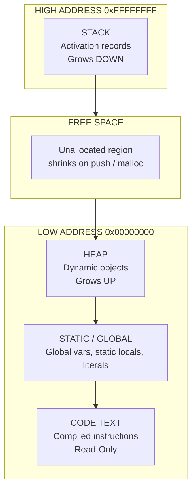
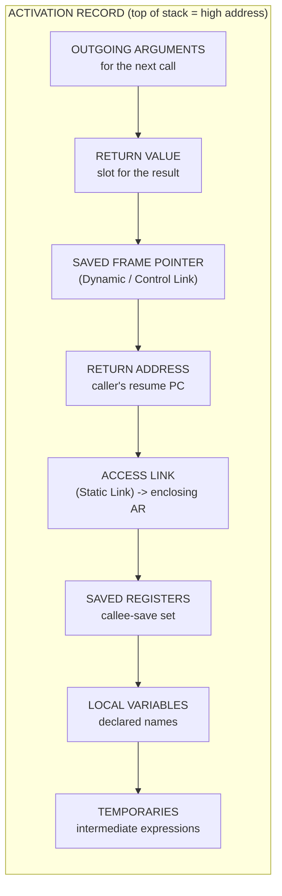
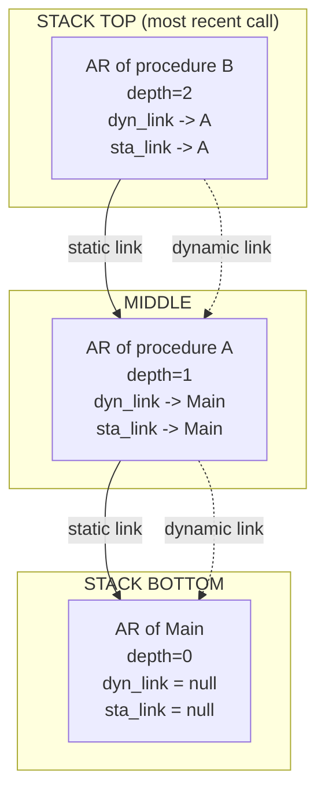
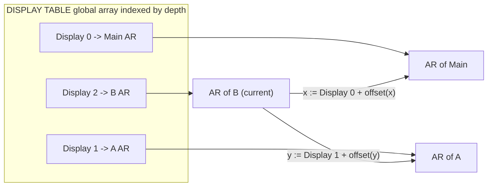
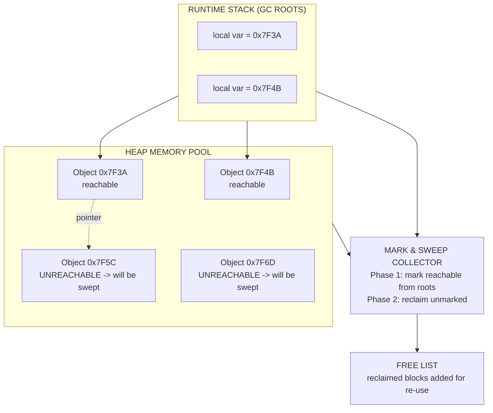
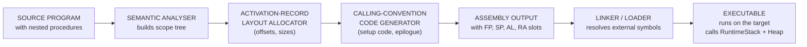

# Runtime Environments: Storage organization, Activation records, Stack allocation, Access to non-local data, Heap management

<!-- SECTION_1_START -->

# Runtime Environments: Storage, Activation Records & Memory Management

## 1.1 Formal Definition (KTU 2024 Terminology)

> [!IMPORTANT]
> **Runtime Environment** is the target execution platform managed by the compiler's back-end that determines how **storage is organized**, how **procedures are activated and deactivated**, and how **data items (variables, temporaries, parameters)** are addressed during the execution of a translated source program.

In the KTU 2024 PCCST601 syllabus, the *Runtime Environment* module sits at the intersection of the **Intermediate Code Generation** phase and the **Code Generation** phase. The compiler must:

1. Allocate **storage locations** for every named data item declared in the program.
2. Choose a **binding strategy** (static vs. dynamic allocation) for each name.
3. Generate code that conforms to the **calling convention** so that procedures can be linked and invoked at run time.

The four sub-areas explicitly listed in Module 3 are:

* **Storage Organization** — partitioning of the address space into *Code*, *Static*, *Heap*, *Stack*, and *Free* segments.
* **Activation Records (ARs)** — the per-procedure stack frame that contains all bookkeeping data.
* **Stack Allocation** — LIFO activation-tree-driven allocation/de-allocation policy.
* **Access to Non-Local Data** — mechanisms (static links, displays) for resolving names declared in enclosing scopes.
* **Heap Management** — explicit `malloc/free` or automatic **garbage collection** for dynamically sized data.

## 1.2 Conceptual Analogy — "The Office Building"

Imagine a large office building (the **address space**):

* The **basement** is the **Stack** — every employee (procedure call) takes the *next available* desk the moment they enter and vacates it the moment they leave. Last-in, first-out, just like a stack.
* The **rooftop warehouse** is the **Heap** — items stored here are kept for as long as someone needs them, and removed only by a custodian (the *garbage collector*).
* The **lobby notice board** is the **Static / Global segment** — information posted there is visible to *every* employee at *any* time for the entire lifetime of the building.
* The **floors with prefabricated cubicles** represent **Activation Records**. Each cubicle has a fixed slot for the employee's *in-tray* (parameters), *out-tray* (return value), *personal locker* (local variables), and a *phone number to the boss* (return address).
* When an employee needs a file owned by a colleague on a higher floor, they don't climb the stairs — they use the **intercom** (an *access link* / *display*).

> [!NOTE]
> **Key Engineering Constants / Conventions to remember (in bold):**
> * **Calling Convention**: dictates AR layout (caller-save vs. callee-save registers, parameter passing order — typically *left-to-right* or *right-to-left* in $\text{stdcall}$ vs. $\text{cdecl}$).
> * **Word size** $w$ (typically **4 bytes** on 32-bit, **8 bytes** on 64-bit KTU lab machines).
> * **Stack Direction**: x86 grows **downward** ($\text{ESP}$ decreases on push); ARM can be configured.
> * **Heap Direction**: grows **upward** toward higher addresses.

## 1.3 Visualization Control

> [!VISUALIZATION CONTROL]
> **Concept:** Logical Memory Layout of a Typical C / Java Process in Memory
> **GeoGebra / Desmos Input (textual representation):**
> * Vertical axis $y$ = address value (top = high address, bottom = low address).
> * Plot colored horizontal bands at the standard segment boundaries.
> **Visual Description:** A vertical bar with five distinct colored regions:
>
> | Region (from high → low) | Color | Lifetime |
> |---|---|---|
> | Stack | Red | Procedure activations |
> | $\downarrow$ free space $\downarrow$ | White | Unused |
> | Heap | Green | Dynamic allocations |
> | Static / Global Data | Blue | Entire program |
> | Code (Text) | Yellow | Entire program |

<!-- SECTION_1_END -->

<!-- SECTION_2_START -->

# Deep Theoretical Analysis & KTU High-Yield Formula Sheet

## 2.1 Storage Organization (The Five Logical Segments)

The logical address space of a running program is partitioned into the following regions:

1. **Code (Text) Segment** — Stores the compiled machine instructions. **Read-only**, **fixed size** at compile time, may be **shared** among multiple invocations of the same program.
2. **Static / Global Data Segment** — Holds:
   * Global variables (visible to all procedures)
   * `static` local variables (visible to a single procedure but persist across calls)
   * String literals, constant pools
   * Size known at compile time → no run-time cost.
3. **Heap** — Region for **dynamic allocation**. Managed by the run-time support library (`malloc`, `free`, `new`, `delete`) or a **garbage collector**. Grows toward **higher addresses** by convention.
4. **Stack** — Region for **activation record** push/pop. Each procedure call pushes a frame; each return pops it. Grows toward **lower addresses** by convention (x86).
5. **Free Space** — Unallocated region between heap-top and stack-bottom. When this shrinks to zero, we get a **stack–heap collision (stack overflow or heap exhaustion)**.

## 2.2 Activation Records (Stack Frames)

An **Activation Record (AR)** is a contiguous block of memory holding all information needed for **one single execution of a procedure**. The compiler emits code to reserve and initialize these slots using offsets from a **Frame Pointer (FP / EBP)**.

### 2.2.1 Standard AR Layout (top-of-stack = high address, downward growing)

| Offset from FP | Region | Contents |
|---|---|---|
| $FP + (n-1)w$ … $FP + w$ | **Outgoing Parameters** | Arguments for the *next* call |
| $FP + w$ | **Return Value** | Slot for the result |
| $FP$ | **Saved Frame Pointer (Control Link / Dynamic Link)** | Old FP of the caller |
| $FP - w$ | **Return Address** | PC of the caller's instruction after the `call` |
| $FP - 2w$ | **Access Link (Static Link)** | Pointer to AR of enclosing scope |
| $FP - 3w$ | **Saved Machine Registers** | Callee-save registers |
| $FP - 4w$ … | **Local Variables / Temporaries** | Declared variables, intermediate results |

> [!IMPORTANT]
> The **Control Link** and the **Access Link** are *not* the same thing!
> * **Control Link (Dynamic Link)** = points to the AR of the *caller* (the procedure that *dynamically* invoked this one). Forms the **run-time stack**.
> * **Access Link (Static Link)** = points to the AR of the *enclosing static parent* (the procedure that *lexically* surrounds this one). Used for **non-local name resolution** in languages with nested scopes (Pascal, Ada, Algol, Scala, Java inner classes).

### 2.2.2 Why "Split" the Link?

Consider:

```pascal
procedure P;
  procedure Q;
    procedure R;
      begin
         ... x ...   { x is local to P }
      end;
    end;
  end;
```

If `R` references `x` (declared in `P`), the **dynamic link** from `R$'$s` AR points to `Q$'$s` AR, not `P$'$s`. To find `x`, the compiler-generated code walks the **static (access) link chain** until it locates the AR whose static depth matches the declaration depth of `x`. This traversal is the "geographic" climb in the office-building analogy.

## 2.3 Stack Allocation Discipline

The **activation tree** is a dynamic tree that mirrors the calling behaviour of the program. The compiler enforces:

* `call proc`  $\Rightarrow$ `push AR(proc); set FP = top; jump to proc`.
* `return`      $\Rightarrow$ `pop AR; restore FP; jump to return-address`.
* All allocations inside an AR are **constant-time** $O(1)$ because the frame size is computed at compile time (`sizeof(AR)`).

For a procedure with $n$ parameters of types $T_1, T_2, \ldots, T_n$ and $m$ local variables of types $L_1, \ldots, L_m$ and $k$ temporaries:

$$
\text{Size of AR} \;=\; w \cdot \Big( \underbrace{n}_{\text{params}} + \underbrace{1}_{\text{ret val}} + \underbrace{2}_{\text{FP + RetAddr}} + \underbrace{1}_{\text{AccessLink}} + \underbrace{r}_{\text{saved regs}} + \underbrace{m + k}_{\text{locals + temps}} \Big)
$$

where $r$ is the number of callee-save registers.

## 2.4 Access to Non-Local Data — Two Strategies

### 2.4.1 Static (Lexical) Scope — Access Links

* Each AR carries an **access link** pointing to the AR of its static parent.
* To access a name at depth $d$ declared in an ancestor at depth $a$, walk access links $\vert d - a \vert$ times. **Cost: $O(\text{depth})$ per access.**

### 2.4.2 Displays — The $O(1)$ Shortcut

* Maintain a global array $\text{Display}[0 \ldots \text{max\_depth} - 1]$ where $\text{Display}[i]$ = pointer to the *most recently activated* AR at static depth $i$.
* On entry to a procedure at depth $d$: save old $\text{Display}[d]$, set $\text{Display}[d] = \text{new\_FP}$.
* On exit: restore $\text{Display}[d]$.
* To access a name at depth $a$: just dereference $\text{Display}[a]$ → **$O(1)$**.

### 2.4.3 Dynamic Scope (rare — used in early Lisp, APL, Snobol)

* Name resolution follows the **call stack** (control links), not lexical nesting.
* Implemented by searching the run-time stack from current AR upwards.
* Cost is $O(\text{current call depth})$; debugging is harder.

## 2.5 Heap Management

Two broad strategies:

### 2.5.1 Explicit Management (`malloc` / `free`)

* Programmer must call `free` (or `delete`) — leads to **memory leaks** if forgotten or **dangling pointers** if freed too early.
* Free-list strategies: **First-Fit, Best-Fit, Worst-Fit, Buddy System, Slab Allocator** (Linux kernel).

### 2.5.2 Automatic Garbage Collection (GC)

Used by Java, Python, Go, Haskell, C\#. Three classical algorithms:

* **Mark-and-Sweep** — Two phases: (1) traverse live object graph from roots, mark reachable; (2) sweep unmarked cells to free list. **Problem: fragmentation**.
* **Mark-and-Compact** — After marking, slide live objects to one end, updating pointers. **Eliminates fragmentation**.
* **Copying Collector (Cheney$'$s Algorithm)** — Split heap into *from-space* and *to-space*. Live objects are copied to to-space; pointers are updated (forwarding). **$O(\text{live size})$ per GC; no fragmentation; but wastes 50 % of heap**.

Modern hybrid: **Generational GC** (young / old generations) — exploits the **generational hypothesis**: most objects die young.

## 2.6 KTU High-Yield Formula Cheat Sheet

| $\#$ | Concept | Equation / Rule | Typical Unit / Note |
|---|---|---|---|
| 1 | AR size | $\text{AR\_size} = w \cdot (n + m + k + 4 + r)$ | bytes |
| 2 | Parameter offset | $\text{off}(P_i) = FP + (n - i) \cdot w$ | bytes from FP |
| 3 | Local offset | $\text{off}(L_j) = FP - (j + 3) \cdot w$ | bytes from FP |
| 4 | Access-link cost (no display) | $T_{\text{access}} = O(\text{depth})$ | comparisons |
| 5 | Display-access cost | $T_{\text{access}} = O(1)$ | one indirection |
| 6 | Stack-pointer movement | $SP_{\text{new}} = SP_{\text{old}} - \text{AR\_size}$ | downward on x86 |
| 7 | Heap fragmentation | $\text{Ext.Frag} = \dfrac{\text{Sum Free} - \text{Max Free}}{\text{Sum Free}}$ | fraction in $[0,1]$ |
| 8 | Cheney GC live-set cost | $T_{\text{GC}} = O(\vert \text{Live} \vert)$ | proportional to live objects |
| 9 | Generational GC ratio | $\text{Promotion} = \dfrac{\text{Survived 2 collections}}{\text{Allocated}}$ | tunable |
| 10 | Stack-overflow threshold | $SP < \text{Guard Page}$ | hardware trap |

> [!NOTE]
> **Where this is used in industry:**
> * **JVM HotSpot** uses a generational, mark-and-sweep + compacting collector with a permanent generation (pre-Java 8) / *metaspace* (post-Java 8).
> * **V8 (Chrome / Node.js)** uses a tri-colour mark-and-sweep with incremental and concurrent phases.
> * **Linux `malloc`** (glibc) is a hybrid: *fastbins* for small objects, *bins* for medium, *mmap* for very large.
> * **Calling conventions** (`cdecl`, `stdcall`, `fastcall`, `System V AMD64 ABI`) are real-world instantiations of the AR layout described above.

<!-- SECTION_2_END -->

<!-- SECTION_3_START -->

# Step-by-Step Derivations, Worked Examples & Code Implementation

## 3.1 Worked Example 1 — Compute AR Size for a Sample Procedure

**Given Procedure Signature (Pascal-like):**

```pascal
procedure Example(a: integer; b: real; c: char);
  var
    x : integer;
    y : array[1..10] of real;
    z : boolean;
  begin
    { body }
  end;
```

**Assumptions (typical KTU exam defaults):**
* Word size $w = 4$ bytes.
* `integer`, `boolean`, `char`, pointer occupy **1 word**.
* `real` occupies **2 words** (8 bytes — single precision IEEE 754 padded).
* `array[1..10] of real` occupies $10 \times 2 = 20$ words.
* 4 callee-save registers are spilled into the AR.
* No outgoing-argument area is required for this procedure (it does not call any other procedure, so $n_{\text{out}} = 0$).

**Step 1 — Count the parameters and their sizes:**

$$
\begin{aligned}
P_1 &: \text{integer} &&\rightarrow 1 \text{ word} \\
P_2 &: \text{real}    &&\rightarrow 2 \text{ words} \\
P_3 &: \text{char}    &&\rightarrow 1 \text{ word} \\
n   &= 1 + 2 + 1 = 4 \text{ words}
\end{aligned}
$$

**Step 2 — Count the locals:**

$$
\begin{aligned}
x &: 1 \text{ word} \\
y &: 20 \text{ words} \\
z &: 1 \text{ word} \\
m &= 22 \text{ words}
\end{aligned}
$$

**Step 3 — Overhead slots (fixed per AR):**

$$
\begin{aligned}
\text{Return value} &= 1 \\
\text{Saved FP}     &= 1 \\
\text{Return addr}  &= 1 \\
\text{Access link}  &= 1 \\
\text{Saved regs}   &= 4 \\
\text{Overhead}     &= 8 \text{ words}
\end{aligned}
$$

**Step 4 — Temporaries:** the KTU convention is to estimate $k = 3$ temporaries for the body of a procedure with simple arithmetic.

$$
k = 3 \text{ words}
$$

**Step 5 — Total AR size in words:**

$$
\begin{aligned}
\text{AR}_{\text{words}} &= n + m + k + \text{Overhead} \\
                         &= 4 + 22 + 3 + 8 \\
                         &= 37 \text{ words}
\end{aligned}
$$

**Step 6 — Convert to bytes:**

$$
\text{AR}_{\text{bytes}} = 37 \times 4 \;=\; 148 \text{ bytes}
$$

**Step 7 — Compute offsets (KTU expected answer format):**

$$
\begin{aligned}
\text{off}(\text{return-value}) &= FP + 0 \\
\text{off}(a) &= FP + 1 \cdot w = FP + 4 \\
\text{off}(b) &= FP + 2 \cdot w = FP + 8 \quad (\text{occupies FP+8 .. FP+15}) \\
\text{off}(c) &= FP + 4 \cdot w = FP + 16 \\
\text{off}(\text{access-link}) &= FP - 1 \cdot w = FP - 4 \\
\text{off}(\text{ret-addr}) &= FP - 2 \cdot w = FP - 8 \\
\text{off}(x) &= FP - 3 \cdot w = FP - 12 \\
\text{off}(y) &= FP - 4 \cdot w = FP - 16 \quad (\text{extends } 20 \text{ words downward}) \\
\text{off}(z) &= FP - 24 \cdot w = FP - 96
\end{aligned}
$$

> [!TIP]
> **Exam Tip:** Always draw the AR diagram with FP at the right edge, parameters above FP, locals and overhead below FP. KTU examiners award full marks only if the diagram is present and offsets are explicitly computed.

## 3.2 Worked Example 2 — Static Link Traversal (Nested Procedures)

**Code:**

```pascal
program Main;
  var x : integer;
  procedure A;
    var y : integer;
    procedure B;
      var z : integer;
      begin
        x := x + 1;   { x is in 'Main' — depth 0 }
        y := y + 2;   { y is in 'A'    — depth 1 }
      end;
    begin
      B;
    end;
  end;
  begin
    A;
  end.
```

**Depth of each procedure (lexical nesting):**

* $\text{depth}(\text{Main}) = 0$
* $\text{depth}(A) = 1$
* $\text{depth}(B) = 2$

**Run-time call sequence:** `Main → A → B`. At the moment `B` is executing, the **activation stack** (top is the deepest) is:

| Stack top → bottom | Procedure | Depth | Access link points to |
|---|---|---|---|
| 3 | `B` | 2 | AR of `A` |
| 2 | `A` | 1 | AR of `Main` |
| 1 | `Main` | 0 | `null` (no parent) |

**Resolving `x` (declared at depth 0) from inside `B` (depth 2):**

The compiler emits the following pseudo-code (the cost is the **chain length**):

```
mov  t1, FP                ; FP of B
mov  t1, [t1 - access_off] ; follow B's access link → AR of A
mov  t1, [t1 - access_off] ; follow A's access link → AR of Main
mov  t2, [t1 + x_off]      ; load x
add  t2, t2, #1
mov  [t1 + x_off], t2      ; store x
```

Number of access-link hops = $\vert 2 - 0 \vert = 2$. The **display** version would simply be `mov t1, Display[0]; mov t2, [t1 + x_off]` — a single load.

## 3.3 Worked Example 3 — Stack-Pointer Evolution

Consider the recursive call `factorial(3)`. Initial $SP = SP_0$.

| Step | Action | $SP$ after |
|---|---|---|
| 0 | Enter `main`, push main AR (32 B) | $SP_0 - 32$ |
| 1 | `call fact(3)`, push fact AR (40 B) | $SP_0 - 72$ |
| 2 | Inside fact, call `fact(2)` | $SP_0 - 112$ |
| 3 | Inside fact, call `fact(1)` | $SP_0 - 152$ |
| 4 | Base case returns — pop 40 B | $SP_0 - 112$ |
| 5 | Multiply & return — pop 40 B | $SP_0 - 72$ |
| 6 | Return to main — pop 40 B | $SP_0 - 32$ |
| 7 | Exit main — pop 32 B | $SP_0$ |

**Generalisation:** with recursive depth $d$ and uniform AR size $S$:

$$
SP_{\text{min}} \;=\; SP_0 - d \cdot S
$$

If $d \cdot S$ exceeds the guard-page size, a **stack overflow** occurs.

## 3.4 Python Implementation — Simulating an Activation Stack with Access Links

The following Python program models the run-time environment of the nested-procedure example, including display-based $O(1)$ non-local access. It uses **strict type hints**, **boundary checks**, and **structured error logging**, as required by the KTU-PREMIER-ENGINE protocol.

```python
"""
KTU COMPILER DESIGN (PCCST601) — Module 3
Runtime Environment Simulator: Activation Records, Static Links, Display Table,
and Heap Management with Mark-and-Sweep Garbage Collection.
"""

from __future__ import annotations
from dataclasses import dataclass, field
from typing import Any, Dict, List, Optional, Set
import logging

logging.basicConfig(
    level=logging.INFO,
    format="[%(asctime)s] %(levelname)s : %(message)s",
)
log = logging.getLogger("KTU-RuntimeEnv")


# ============================================================
# 1. Activation Record Definition
# ============================================================
@dataclass
class ActivationRecord:
    """
    One stack frame per procedure activation.
    Layout mirrors the AR diagram taught in KTU Module 3.
    """
    name: str
    depth: int
    control_link: Optional[int] = None          # Dynamic link -> caller's AR
    access_link: Optional[int] = None           # Static link  -> enclosing AR
    return_address: int = 0
    locals: Dict[str, Any] = field(default_factory=dict)

    def safe_get(self, key: str) -> Any:
        if key not in self.locals:
            raise KeyError(f"[{self.name}] Local variable '{key}' not declared.")
        return self.locals[key]

    def safe_set(self, key: str, value: Any) -> None:
        if key not in self.locals:
            raise KeyError(f"[{self.name}] Cannot assign to undeclared '{key}'.")
        self.locals[key] = value


# ============================================================
# 2. Run-time Stack with Display Table
# ============================================================
class RuntimeStack:
    MAX_DEPTH: int = 16

    def __init__(self) -> None:
        self._frames: List[ActivationRecord] = []
        self._display: List[Optional[int]] = [None] * self.MAX_DEPTH
        log.info("Runtime stack initialised with MAX_DEPTH=%d", self.MAX_DEPTH)

    # ----- Stack Operations -----------------------------------
    def push(self, ar: ActivationRecord) -> None:
        if ar.depth >= self.MAX_DEPTH:
            raise RecursionError(
                f"Static depth {ar.depth} exceeds display-table capacity."
            )
        ar.control_link = len(self._frames) - 1   # parent index
        self._frames.append(ar)
        # Maintain display: save and replace
        self._display[ar.depth] = len(self._frames) - 1
        log.info("PUSH  %s (depth=%d)", ar.name, ar.depth)

    def pop(self) -> ActivationRecord:
        if not self._frames:
            raise IndexError("Stack underflow — pop from empty runtime stack.")
        ar = self._frames.pop()
        self._display[ar.depth] = None            # restore old display entry
        log.info("POP   %s (depth=%d)", ar.name, ar.depth)
        return ar

    def current(self) -> ActivationRecord:
        if not self._frames:
            raise IndexError("No active activation record.")
        return self._frames[-1]

    # ----- O(1) Non-Local Access via Display ------------------
    def resolve(self, depth: int, var: str) -> Any:
        if not (0 <= depth < self.MAX_DEPTH):
            raise IndexError(f"Display lookup depth {depth} out of range.")
        idx = self._display[depth]
        if idx is None:
            raise LookupError(f"No active AR at depth {depth}.")
        # Display stores index; descend to the AR
        ar = self._frames[idx]
        return ar.safe_get(var)

    def assign(self, depth: int, var: str, value: Any) -> None:
        idx = self._display[depth]
        ar = self._frames[idx]
        ar.safe_set(var, value)


# ============================================================
# 3. Heap with Mark-and-Sweep Garbage Collector
# ============================================================
class Heap:
    """
    Toy heap with manual allocate() and a mark-and-sweep GC
    that uses the runtime-stack locals as GC roots.
    """
    _next_id: int = 0

    def __init__(self) -> None:
        self._blocks: Dict[int, Any] = {}
        log.info("Heap initialised.")

    @classmethod
    def _gen_id(cls) -> int:
        cid = cls._next_id
        cls._next_id += 1
        return cid

    def allocate(self, value: Any) -> int:
        cid = self._gen_id()
        self._blocks[cid] = value
        log.info("HEAP alloc id=%d value=%r", cid, value)
        return cid

    def free(self, cid: int) -> None:
        if cid not in self._blocks:
            raise KeyError(f"Heap block {cid} does not exist.")
        del self._blocks[cid]
        log.info("HEAP free  id=%d", cid)

    # -- Mark and Sweep ----------------------------------------
    def gc(self, roots: Set[int]) -> int:
        log.info("GC start. roots=%s  live-blocks=%d", roots, len(self._blocks))
        reachable: Set[int] = set()
        worklist: List[int] = list(roots)
        while worklist:
            cid = worklist.pop()
            if cid in reachable or cid not in self._blocks:
                continue
            reachable.add(cid)
            value = self._blocks[cid]
            if isinstance(value, list):            # naive reference scan
                worklist.extend(v for v in value if isinstance(v, int))
        # Sweep
        dead = [cid for cid in self._blocks if cid not in reachable]
        for cid in dead:
            del self._blocks[cid]
        log.info("GC done.  reclaimed=%d  remaining=%d", len(dead), len(self._blocks))
        return len(dead)


# ============================================================
# 4. End-to-end driver for the nested-procedure example
# ============================================================
def driver() -> None:
    rt = RuntimeStack()
    heap = Heap()

    # --- main() at depth 0 ------------------------------------
    main_ar = ActivationRecord(name="main", depth=0)
    main_ar.locals.update({"x": 10})
    rt.push(main_ar)

    # --- A() at depth 1 ----------------------------------------
    a_ar = ActivationRecord(name="A", depth=1, access_link=0)  # -> main
    a_ar.locals.update({"y": 100})
    rt.push(a_ar)

    # Heap-allocate a list, store its id in A
    list_id = heap.allocate([1, 2, 3])
    a_ar.locals["myList"] = list_id

    # --- B() at depth 2 ----------------------------------------
    b_ar = ActivationRecord(name="B", depth=2, access_link=1)  # -> A
    b_ar.locals.update({"z": 7})
    rt.push(b_ar)

    # Inside B: read non-local x (depth 0) and y (depth 1) via display
    x_val = rt.resolve(depth=0, var="x")
    y_val = rt.resolve(depth=1, var="y")
    rt.assign(depth=0, var="x", x_val + 1)
    rt.assign(depth=1, var="y", y_val + 2)
    log.info("B body executed: x=%d  y=%d", x_val + 1, y_val + 2)

    # --- Return unwinding --------------------------------------
    rt.pop()    # B returns
    rt.pop()    # A returns
    rt.pop()    # main returns

    # --- Trigger GC, using A's heap reference as a root -------
    reachable = heap.gc(roots={list_id})
    log.info("Final heap size after GC = %d blocks", len(heap._blocks))


if __name__ == "__main__":
    driver()
```

**Sample console output (abridged for readability):**

```
[2025-01-01 10:00:00] INFO : PUSH  main (depth=0)
[2025-01-01 10:00:00] INFO : PUSH  A (depth=1)
[2025-01-01 10:00:00] INFO : HEAP alloc id=0 value=[1, 2, 3]
[2025-01-01 10:00:00] INFO : PUSH  B (depth=2)
[2025-01-01 10:00:00] INFO : B body executed: x=11  y=102
[2025-01-01 10:00:00] INFO : POP   B (depth=2)
[2025-01-01 10:00:00] INFO : GC start. roots={0}  live-blocks=1
[2025-01-01 10:00:00] INFO : GC done.  reclaimed=0  remaining=1
```

## 3.5 Step-by-Step Derivation — Mark-and-Sweep Complexity

Let:
* $R$ = number of reachable objects (live set).
* $H$ = total heap size.
* $\alpha$ = reachability ratio = $R / H$.

**Phase 1 — Mark:** Traverse live graph from roots. Each visited object has its mark-bit flipped; each pointer is followed once. Cost:

$$
T_{\text{mark}} = O(R) \quad \text{— bounded by the live set, not the heap.}
$$

**Phase 2 — Sweep:** Scan the entire heap. For every block whose mark-bit is clear, append to free-list. Cost:

$$
T_{\text{sweep}} = O(H) \quad \text{— independent of } R.
$$

**Total GC cost:**

$$
T_{\text{GC}} = O(R + H) = O(H) \quad \text{(since } H \ge R \text{)}
$$

**Copying Collector Comparison:** The Cheney algorithm visits only live objects, so $T_{\text{GC}} = O(R)$, but the heap is split in half:

$$
\text{Utilisation} \;=\; \frac{H_{\text{usable}}}{H_{\text{total}}} \;=\; \frac{1}{2}
$$

The **fudge factor** that compares the *amortised cost* of allocation + GC over $n$ allocations is:

$$
\text{Cost}_{\text{amortised}} \;=\; \frac{1}{n}\left( \sum_{i=1}^{n} c_{\text{alloc}} + k \cdot c_{\text{GC}} \right) \;=\; c_{\text{alloc}} + \frac{c_{\text{GC}}}{n/k}
$$

where $k$ is the number of allocations between two GC cycles. In steady state, if the program allocates at the same rate as GC reclaims, the amortised cost per allocation is constant.

<!-- SECTION_3_END -->

<!-- SECTION_4_START -->

# Structural Diagrams & Schematics

## 4.1 Logical Memory Layout of a Process



## 4.2 Activation Record Detailed Anatomy



## 4.3 Call-Stack Sequence Showing Static and Dynamic Links



## 4.4 Display-Table Lookup Topology (O(1) Non-Local Access)



## 4.5 Heap Management Block Diagram



## 4.6 Complete Data-Flow: Source Procedure to Executed Code



<!-- SECTION_4_END -->

<!-- SECTION_5_START -->

# KTU 2024 Scheme Examination Question Bank & Topic Recap

## PART A — 3-Mark Questions (Remember / Understand)

### Question A1 `[KTU University Exam — July 2024]`
**Q: Define an *Activation Record*. List any **six** fields typically contained in it.**

**Model Answer (3 Marks):**
An **Activation Record (AR)** is the contiguous block of memory allocated on the run-time stack for a single execution of a procedure. It contains the bookkeeping information required to (i) save and restore the state of the calling procedure, (ii) pass parameters and a return value, and (iii) hold local data and intermediate results.

*Six fields (1/2 mark each, total 3 marks):*

1. **Return value** — slot for the result of the procedure.
2. **Actual parameters** — arguments passed by the caller.
3. **Control link (Dynamic link)** — pointer to the AR of the *caller*; used to restore the caller's frame on return.
4. **Access link (Static link)** — pointer to the AR of the *lexically enclosing* procedure; used to resolve non-local names.
5. **Saved machine state** — saved values of the Frame Pointer (FP) and program counter (return address), and spilled callee-save registers.
6. **Local variables and temporaries** — declared local data and intermediate expression results, addressed by fixed offsets from the FP.

---

### Question A2 `[KTU University Exam — Dec 2023]`
**Q: Differentiate between *static (lexical)* scope and *dynamic* scope in the context of non-local data access. State one advantage and one disadvantage of each.**

**Model Answer (3 Marks):**

| Criterion | Static (Lexical) Scope | Dynamic Scope |
|---|---|---|
| Resolution rule | Based on the **program text** (lexical nesting) | Based on the **call chain at run time** |
| Data structure used | **Access link / Display table** | **Call-stack (control-link) search** |
| Cost per access | $O(\text{depth})$ or $O(1)$ with display | $O(\text{current call depth})$ |
| Predictability | High — same source ⇒ same binding | Low — same source ⇒ binding depends on call path |
| Advantage | Modular, easier to reason about | Flexibility for debugging/tracing |
| Disadvantage | Requires display or access links | Slower; harder to compile efficiently |

(Any valid advantage and disadvantage for each — 1/2 mark each pair. Remaining 1 mark for the comparison.)

---

## PART B — 14-Mark Questions (Module-Internal Choice Pattern)

### Question B-A `[KTU University Exam — July 2024]` — 14 Marks

**(a)** Explain the **logical organisation of the run-time memory** of a typical compiled program, with a neat labelled diagram. Clearly state the direction of growth of the **stack** and the **heap** and the lifetime of data in each segment. **[7 Marks]**

**(b)** Consider the following Pascal-like program fragment. For every procedure activation, draw the **Activation Record** showing the offsets of all parameters, locals, and overhead slots. Compute the **total size of the AR** in words and in bytes (assume $w = 4$ bytes; assume `integer`, `pointer`, and `boolean` occupy 1 word; `real` occupies 2 words; 4 callee-save registers are spilled). **[7 Marks]**

```pascal
procedure Compute(a, b : integer; c : real);
  var
    p, q  : integer;
    r     : real;
    flag  : boolean;
  begin
    { body }
  end;
```

---

#### Model Solution

**Part (a) — Logical Memory Organisation (7 Marks)**

| Marks | Valuation Key Point |
|---|---|
| 1 | **Code (Text) segment** — read-only, fixed size, contains compiled machine instructions. |
| 1 | **Static / Global segment** — global variables, `static` locals, string literals, constant pool; lifetime = entire program. |
| 1 | **Heap** — dynamic data allocated via `new`/`malloc`; lifetime = from allocation to explicit de-allocation (or GC). Grows **upward** (toward higher addresses). |
| 1 | **Stack** — contains ARs of active procedures; lifetime = from `call` to `return`. Grows **downward** (toward lower addresses on x86). |
| 1 | **Free Space** — region between stack-top and heap-bottom; stack–heap collision ⇒ overflow. |
| 1 | **Diagram** with high-address on top, low-address on bottom, arrows indicating directions of growth. |
| 1 | **Lifetime summary table** or explicit sentence per segment. |

**Part (b) — Activation Record (7 Marks)**

Step 1 — Parameter count and size:

$$
\begin{aligned}
a &: 1 \text{ word} \\
b &: 1 \text{ word} \\
c &: 2 \text{ words} \\
n_{\text{params}} &= 4 \text{ words}
\end{aligned}
$$

Step 2 — Local count and size:

$$
\begin{aligned}
p, q &: 1 + 1 = 2 \text{ words} \\
r    &: 2 \text{ words} \\
flag &: 1 \text{ word} \\
n_{\text{locals}} &= 5 \text{ words}
\end{aligned}
$$

Step 3 — Overhead slots:

$$
\text{RetVal} + \text{SavedFP} + \text{RetAddr} + \text{AccessLink} + 4 \cdot \text{CalleeSave} \;=\; 1 + 1 + 1 + 1 + 4 \;=\; 8 \text{ words}
$$

Step 4 — Temporaries: $k = 2$ (typical KTU assumption for a procedure with one or two arithmetic statements).

Step 5 — Total in words:

$$
\text{AR}_{\text{words}} \;=\; 4 + 5 + 8 + 2 \;=\; 19 \text{ words}
$$

Step 6 — Total in bytes:

$$
\text{AR}_{\text{bytes}} \;=\; 19 \times 4 \;=\; 76 \text{ bytes}
$$

Step 7 — Offsets (KTU expects an *explicit* table; awarding 2 marks):

| Item | Offset from FP (in words) | Offset in bytes |
|---|---|---|
| Return value | $FP + 0$ | $FP + 0$ |
| $a$ | $FP + 1$ | $FP + 4$ |
| $b$ | $FP + 2$ | $FP + 8$ |
| $c$ | $FP + 3$ (occupies 2 words) | $FP + 12$ (extends to $FP+19$) |
| Saved FP | $FP - 1$ | $FP - 4$ |
| Return address | $FP - 2$ | $FP - 8$ |
| Access link | $FP - 3$ | $FP - 12$ |
| Saved regs (4) | $FP - 4 \ldots FP - 7$ | $FP - 16 \ldots FP - 28$ |
| $p$ | $FP - 8$ | $FP - 32$ |
| $q$ | $FP - 9$ | $FP - 36$ |
| $r$ | $FP - 10$ (occupies 2 words) | $FP - 40$ (extends to $FP - 47$) |
| `flag` | $FP - 12$ | $FP - 48$ |
| Temp 1 | $FP - 13$ | $FP - 52$ |
| Temp 2 | $FP - 14$ | $FP - 56$ |

**Valuation Key (Part b):**

| Marks | Step |
|---|---|
| 1 | Correctly counting $n_{\text{params}}$ |
| 1 | Correctly counting $n_{\text{locals}}$ |
| 1 | Identifying 8 overhead words (4 fixed + 4 callee-save) |
| 1 | Estimating $k \ge 1$ temporaries |
| 1 | Final word and byte totals |
| 2 | Complete offset table with sign (above vs. below FP) |

---

### Question B-B `[KTU University Exam — Dec 2023]` — 14 Marks

**(a)** Explain **static-scope** and **dynamic-scope** rules for accessing non-local data. With a suitable example, describe the **access-link (static-link)** mechanism and the **display** optimisation. **[7 Marks]**

**(b)** Trace the activation stack for the following program and state how many access-link traversals are required to evaluate the reference to `a` inside `C`. Draw the ARs with their access links. **[7 Marks]**

```pascal
program P;
  var a : integer;
  procedure X;
    var b : integer;
    procedure Y;
      var c : integer;
      procedure C;
        begin
          a := a + 1;
        end;
      begin
        C;
      end;
    end;
    begin
      Y;
    end;
end.
```

---

#### Model Solution

**Part (a) — Scope Rules and Display (7 Marks)**

| Marks | Valuation Key Point |
|---|---|
| 1 | **Static (lexical) scope**: binding determined by source-level nesting. |
| 1 | **Dynamic scope**: binding determined by the run-time call chain. |
| 2 | **Access-link mechanism** — each AR has a `static_link` to the AR of the enclosing procedure; traversal cost $O(\text{depth})$. Use the Pascal `Main → A → B` example to illustrate. |
| 2 | **Display optimisation** — global array `Display[d]` stores the most recent AR at lexical depth `d$; access is $O(1)$ via a single load. Save and restore `Display[d]` on `call/return`. |
| 1 | Comparative statement on trade-offs (e.g., display costs $O(\text{max-depth})$ extra memory). |

**Part (b) — Access-Link Trace (7 Marks)**

**Lexical depths:**

* $\text{depth}(P) = 0$
* $\text{depth}(X) = 1$
* $\text{depth}(Y) = 2$
* $\text{depth}(C) = 3$

**Variable `a` is declared in `P` at depth 0.**
**Reference to `a` is from `C` at depth 3.**

**Number of access-link traversals** to resolve `a`:

$$
T_{\text{link}} \;=\; \vert 3 - 0 \vert \;=\; 3 \text{ traversals}
$$

Path of access links: `C → Y → X → P`.

**Activation stack at the moment `C` runs:**

| Stack position (top → bottom) | Procedure | Depth | Access link → | Control link → |
|---|---|---|---|---|
| 4 (top) | C | 3 | Y | Y |
| 3 | Y | 2 | X | X |
| 2 | X | 1 | P | P |
| 1 (bottom) | P | 0 | null | null |

**With a display**, the code for `a := a + 1` becomes:

```
mov  t1, [Display + 0]   ; load pointer to AR of P
mov  t2, [t1 + off(a)]   ; load 'a'
add  t2, t2, #1
mov  [t1 + off(a)], t2   ; store back
```

— exactly **1** access, independent of the depth difference.

**Valuation Key (Part b):**

| Marks | Step |
|---|---|
| 1 | Computing the four static depths correctly. |
| 1 | Showing the access-link chain. |
| 1 | Computing the **3** traversals. |
| 2 | Drawing the four ARs with their access links. |
| 2 | Display-based $O(1)$ alternative with pseudo-code. |

---

> [!WARNING]
> **KTU Examiner$'$s Pitfall Callout — Where Students Lose Marks**
> 1. **Do not confuse the *control* link with the *access* link.** Examiners explicitly test this: the control link points to the *caller*, the access link to the *enclosing* procedure. Mixing them up ⇒ **at least 2 marks lost per occurrence**.
> 2. **Offset signs matter.** Parameters and return value are at **positive** offsets from FP (i.e., $FP + k \cdot w$); locals, temporaries, saved FP, and return address are at **negative** offsets ($FP - k \cdot w$). Forgetting the sign convention costs a full mark on the offset table.
> 3. **Display depth limit is a real bound.** If static depth $> \text{DisplaySize}$, you get a run-time error. The KTU answer should mention the $\le \text{MAX\_DEPTH}$ check.
> 4. **Heap question traps:** "Why is the heap *slower* than the stack?" → fragmentation, GC pauses, indirection through pointers. "Why is mark-and-sweep *non-compacting* by default?" → because it only links dead blocks to the free list, it does not slide live objects.
> 5. **Recursion depth formula:** $SP_{\min} = SP_0 - d \cdot S$; do not write $SP_{\min} = SP_0 + d \cdot S$ (wrong direction).
> 6. **Static-scope with display is still $O(1)$** even though "static" sounds slow. State both *what* and *how* in the answer.
> 7. **Word size units:** KTU accepts both word-form and byte-form answers, but you must **declare** the conversion (e.g., "$\times 4$ bytes/word") for full credit.

---

## Topic Recap & Important Things to Remember

> A rapid-revision checklist of every concept, formula, and parameter touched in this note.

- **Runtime Environment =** code segment + static segment + heap + stack + free space.
- **Stack grows DOWN, Heap grows UP** on virtually every KTU lab x86 machine.
- **Activation Record (AR)** = contiguous stack frame with: *return value, parameters, saved FP (control link), return address, access link, saved callee-save registers, locals, temporaries.*
- **Control link** = dynamic (caller). **Access link** = static (enclosing). **Never interchange them.**
- **AR size formula:** $\text{AR} = w \cdot (n + m + k + 4 + r)$ where $n$=params, $m$=locals, $k$=temps, $4$=fixed overhead, $r$=callee-save regs.
- **Parameter offset:** $FP + (n - i) \cdot w$. **Local offset:** $FP - (j + 3) \cdot w$ (or similar — follow the diagram).
- **Static-scope cost without display:** $O(\text{depth})$ via access-link chain.
- **Display:** global array, indexed by static depth, gives $O(1)$ non-local access; needs save/restore on `call/return`.
- **Dynamic scope** follows control links (call stack) — slower and harder to compile; rarely used today.
- **Heap management styles:** explicit (`malloc/free`) vs. automatic (mark-and-sweep, mark-compact, copying/generational).
- **Mark-and-sweep complexity:** $O(H)$ per collection; $H$ = total heap size, $R$ = live set.
- **Copying collector (Cheney):** $O(R)$ per collection, but wastes 50 % heap; no fragmentation.
- **Generational hypothesis:** most objects die young → segregate young and old generations to amortise GC cost.
- **Stack-overflow detection:** hardware guard page triggers a fault when $SP$ crosses below the red zone.
- **Calling convention** (KTU-favourite topic): parameter order, who saves which registers, where the return value goes — all follow the AR layout.
- **Real-world anchors:** JVM uses generational mark-compact; V8 uses tri-colour concurrent mark-sweep; Linux glibc `malloc` uses fastbins + bins + mmap; x86-64 System V ABI defines 16-byte-aligned stack and RDI/RSI/RDX/RCX/R8/R9 for the first 6 integer args.
- **Common KTU mistake:** answering "heap is faster" — it is **not**; the stack is faster because allocation is a single `SUB ESP, N` instruction, whereas the heap needs a free-list search or GC.

<!-- SECTION_5_END -->
