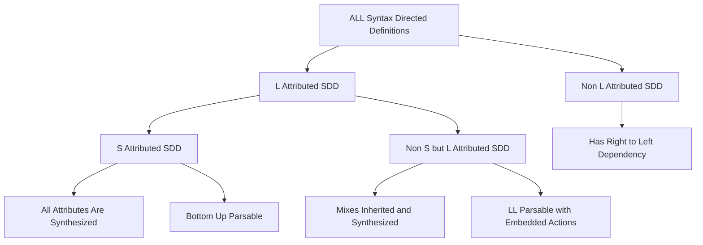
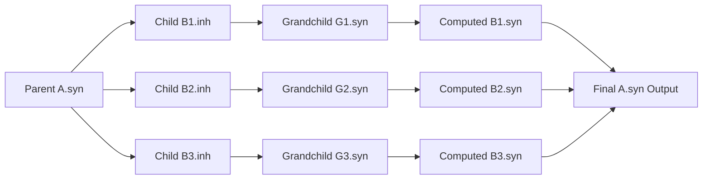
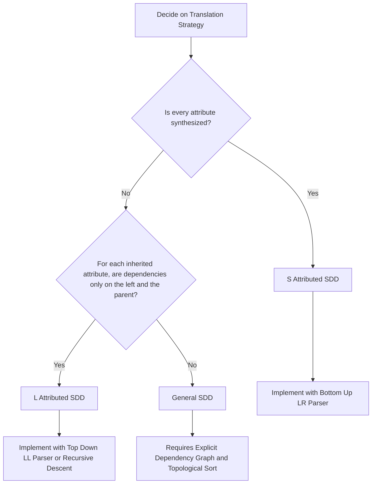

# Syntax-Directed Translation (SDT): SDD, Inherited and Synthesized attributes, Evaluation orders, S-attributed, L-attributed definitions

<!-- SECTION_1_START -->

# 1. Core Technical Definition & Intuitive Overview

## 1.1 Syntax-Directed Translation (SDT) — The KTU 2024 Definition

> [!IMPORTANT]
> **Formal Definition (KTU 2024 Syllabus, PCCST601 — Module 3):**
> **Syntax-Directed Translation (SDT)** is a formalism that augments a context-free grammar with a set of **attributes** attached to grammar symbols, and a set of **semantic rules** (or actions) that specify how the values of these attributes are computed. The semantic rules are executed at specific points during parsing, producing intermediate code, type information, or symbol-table entries as a natural by-product of the parse.

In the KTU 2024 Scheme, SDT is the *bridge* between **syntax analysis** (Module 2 — Parsing) and **intermediate code generation** (Module 4). The compiler does not parse purely for the sake of syntax — every grammar production is simultaneously a "carrier" for meaning.

## 1.2 Intuitive Analogy — The Customs Officer at a Border

> [!NOTE]
> **Analogy — "The Customs Officer and the Traveller's Suitcase":**
> Imagine a traveller (the **parse tree** of a program) walking through a customs checkpoint. Every item in the suitcase has a *tag* (this is the **attribute**). At each checkpoint (the **grammar production**), the customs officer (the **semantic rule**) inspects the tags of items entering that checkpoint and stamps a new tag onto the suitcase as a whole. By the time the traveller exits, the entire suitcase carries a complete set of stamped labels — this is the *translation* of the program into a useful output (intermediate code, three-address code, type info, etc.).

The two kinds of tags are critical:
- **Synthesized attributes** → tags passed *upwards* (child computes its own tag and passes it to the parent). This is like a leaf-node customs officer stamping its own item, and the parent officer reading those stamps and adding a *combined* stamp.
- **Inherited attributes** → tags passed *downwards or sideways* (parent's tag is propagated to a child to guide its behaviour). This is like the head customs officer telling a sub-officer "I expect this kind of item — handle it accordingly."

## 1.3 The Three Core Formalisms You Must Master

| # | Formalism | What It Is | KTU Keyword |
|---|-----------|-----------|-------------|
| 1 | **SDD** (Syntax-Directed Definition) | The *high-level specification* — grammar + attributes + semantic rules. | "What to compute" |
| 2 | **SDT** (Syntax-Directed Translation Scheme) | An *executable form* — semantic actions placed at specific positions inside production bodies. | "When to compute" |
| 3 | **Annotated Parse Tree** | A parse tree where every node $X$ carries its attribute values $X.\mathit{attr}$. | "Proof of execution" |

## 1.4 Standard Symbols Used in KTU Board Answers

> [!IMPORTANT]
> In board answers, the following convention is mandatory (any deviation costs marks):
> - $X.a$ → denotes the value of attribute $a$ of grammar symbol $X$.
> - $X.\mathit{type}$, $X.\mathit{code}$, $X.\mathit{val}$, $X.\mathit{env}$ are the *canonical* synthesized attributes seen in KTU 2024 model papers.
> - $X.\mathit{in}$, $X.\mathit{inh}$, $X.\mathit{type}$ for inherited attributes.

## 1.5 GeoGebra / Tree Visualisation Reference

> [!VISUALIZATION CONTROL]
> **Concept:** Annotated parse tree for the expression $8 + 5 \times 2$ with attribute $\mathit{val}$ flowing upward.
> **GeoGebra / Desmos Input (Tree as Coordinates):**
> * `Point: (0,3) Label: "E.val=18"`  (root)
> * `Point: (-1,2) Label: "E.val=8"`   (left child)
> * `Point: (0.5,2) Label: "T.val=10"` (right child)
> * `Point: (-1.5,1) Label: "E'.val=8"`
> * `Point: (-1,0.5) Label: "num.lexval=8"`
> **Visual Description:** You will see numbers 8, 5, 2 at the leaves, with intermediate $\mathit{val}$ values 8, 5, 2 propagating upward and combining as 8, 10, 18 — the synthesised upward arrow pattern is the hallmark of **S-attributed** translation.

---

<!-- SECTION_1_END -->

<!-- SECTION_2_START -->

# 2. Deep Theoretical Analysis & KTU High-Yield Formula Sheet

## 2.1 Synthesized Attributes — The "Bottom-Up" Flow

A **synthesized attribute** of a non-terminal $A$ at a parse-tree node is defined *only* in terms of the attribute values of its **children** in the parse tree. This is a strict *local* computation.

> [!NOTE]
> **Production form:**
> $A \rightarrow B_1 \, B_2 \, \dots \, B_n$
> **Semantic rule:**
> $A.a := f(B_1.b_1, B_1.b_2, \dots, B_n.b_n)$
> The right-hand side contains **only** the attributes of $B_1 \dots B_n$ — never of $A$ itself (no recursion) and never of the parent.

### Why are synthesized attributes natural?
- They flow **bottom-up** in the parse tree.
- They are computable in a single **postorder traversal** of the parse tree.
- They are *natively* supported by **bottom-up parsers** (LR(1), SLR, LALR — covered in Module 2).
- A grammar using *only* synthesized attributes is called an **S-attributed definition**.

## 2.2 Inherited Attributes — The "Top-Down / Sideways" Flow

An **inherited attribute** of a non-terminal $B$ at a parse-tree node is defined in terms of the attributes of (a) the **parent** $A$, (b) **siblings** of $B$ (specifically, $B_1, B_2, \dots, B_{i-1}$ appearing to the *left* of $B$ in the production body), and (c) $B$ itself (carefully, to allow limited recursion).

> [!IMPORTANT]
> **Production form:**
> $A \rightarrow B_1 \, B_2 \, \dots \, B_n$
> **Semantic rule (inherited):**
> $B_i.\mathit{inh} := g(A.\mathit{syn}, B_1.\mathit{syn}, \dots, B_{i-1}.\mathit{syn}, B_{i+1}.\mathit{inh}, \dots)$
> The right-hand side may reference $A$'s *synthesized* attributes and the *inherited* attributes of $B_{i+1} \dots B_n$ on the **right**.

### Why do we need inherited attributes?
- To pass **type information**, **symbol-table environments**, or **expected argument types** from a parent down to children.
- Example: In `if E then S1 else S2`, the type of $E$ must be passed *down* to check it is Boolean — this is a *inherited* propagation.
- They cannot always be evaluated during a single bottom-up pass — they require a **left-to-right** dependency.

## 2.3 S-Attributed Definition (S-SDD)

> [!IMPORTANT]
> **Definition:** A syntax-directed definition is **S-attributed** if **every** semantic rule defines a **synthesized** attribute.
> **Consequence:** It can be implemented by translating the actions *after* each grammar symbol during a **bottom-up parse** — i.e., during the reduce step. This is precisely what a **yacc / Bison** `yacc` action does.

**Canonical Example (Desk Calculator — Dragon Book, used in KTU 2024 Module 3):**

$$
\begin{aligned}
\text{Productions} \quad & L \rightarrow E\,\mathbf{n} \\
& E \rightarrow E_1 + T \;\mid\; T \\
& T \rightarrow T_1 \ast F \;\mid\; F \\
& F \rightarrow (E) \;\mid\; \mathbf{digit} \\
\\
\text{Semantic Rules} \quad & L.\mathit{val} := E.\mathit{val} \\
& E.\mathit{val} := E_1.\mathit{val} + T.\mathit{val} \\
& E.\mathit{val} := T.\mathit{val} \\
& T.\mathit{val} := T_1.\mathit{val} \times F.\mathit{val} \\
& T.\mathit{val} := F.\mathit{val} \\
& F.\mathit{val} := E.\mathit{val} \\
& F.\mathit{val} := \mathbf{digit}.\mathit{lexval}
\end{aligned}
$$

Every rule on the right uses only children — hence **S-attributed**.

## 2.4 L-Attributed Definition (L-SDD)

> [!IMPORTANT]
> **Definition:** A syntax-directed definition is **L-attributed** if for each production $A \rightarrow B_1 B_2 \dots B_n$, the inherited attribute of $B_i$ (for $1 \leq i \leq n$) depends **only** on:
> 1. The **inherited** attribute of $A$,
> 2. The **synthesized** or **inherited** attributes of $B_1, B_2, \dots, B_{i-1}$ (i.e., symbols to the **left** of $B_i$ in the production body), and
> 3. *Excludes* $B_{i+1}, \dots, B_n$ from being used to compute $B_i.\mathit{inh}$.
>
> **Consequence:** It can be evaluated in a **single left-to-right depth-first traversal** of the parse tree. Equivalently, it can be implemented during a **predictive (top-down LL) parse** by embedding actions between grammar symbols.

### Hierarchy (Board-Favourite Diagram)

$$
\text{S-attributed} \;\subsetneq\; \text{L-attributed} \;\subsetneq\; \text{All SDDs}
$$

> [!WARNING]
> **KTU Examiner Pitfall:** Students often write "L-attributed means left-recursion" — this is **WRONG**. L-attributed refers to the **left-to-right** dependency flow of attributes, *not* to the grammar's recursion direction. A grammar with left-recursion can still be L-attributed (in fact, S-attributed L-attributed grammars are very common).

## 2.5 Dependency Graph — The Foundation of Evaluation Order

> [!NOTE]
> **Definition:** A **dependency graph** for a parse tree is a directed graph whose nodes are the attribute instances $X.a$ at each parse-tree node, and an edge $X.a \rightarrow Y.b$ exists if the semantic rule for $Y.b$ *uses* the value of $X.a$. The graph must be **acyclic** for a valid evaluation to exist.

**Construction procedure (Board answer must list these steps):**
1. For each parse-tree node $X$ (non-terminal or terminal), add a node for every attribute.
2. For each semantic rule $b := f(a_1, a_2, \dots, a_k)$, add edges $a_i \rightarrow b$ for every $i$.
3. A valid **evaluation order** is any **topological sort** of the resulting DAG.

## 2.6 KTU High-Yield Formula Sheet

| # | Concept | Formula / Rule | Use in Board Answer |
|---|---------|----------------|---------------------|
| 1 | Synthesized attribute of $A$ | $A.a := f(B_1.b, \dots, B_n.b)$ | Bottom-up computation |
| 2 | Inherited attribute of $B_i$ | $B_i.\mathit{inh} := g(A.a, B_1.b, \dots, B_{i-1}.b)$ | Top-down / left-to-right flow |
| 3 | S-attributed | $\forall$ rules, LHS = synthesized only | Bottom-up parser friendly |
| 4 | L-attributed | $\forall$ rules, dependency is $\subseteq \{A.\mathit{inh}\} \cup \{B_j : j < i\}$ attributes | LL parser friendly |
| 5 | Dependency graph | Edge $X.a \rightarrow Y.b$ if rule for $Y.b$ reads $X.a$ | Acyclic ⇒ valid evaluation |
| 6 | Topological sort | Linear order such that all edges go forward | Gives the evaluation order |
| 7 | Postorder (S-SDD) | Children visited before parent | LR-parser semantic stack |
| 8 | Depth-first left-to-right (L-SDD) | Visit $A$, then $B_1$, then $B_2, \dots$ | LL-parser embedded actions |

## 2.7 Real-World Engineering Utility

> [!NOTE]
> **Where this is used in production compilers:**
> - **GCC / Clang (LLVM)**: Each grammar production in the C/C++ parser is annotated with attribute computations; the AST nodes carry *synthesized* type attributes and *inherited* symbol-table pointers.
> - **JVM (javac)**: The Java grammar uses L-attributed SDTs to propagate expected return types from method declarations down to `return` statements.
> - **Yacc / Bison / ANTLR**: These are SDT engines. `yacc` directly executes S-attributed translations on an LR parse stack; ANTLR uses L-attributed translations with embedded actions for LL(*) parsing.
> - **Type checkers and static analysers** in IDEs (IntelliJ, VS Code) use the same SDD machinery to compute type attributes bottom-up and symbol-table inherited attributes top-down.

---

<!-- SECTION_2_END -->

<!-- SECTION_3_START -->

# 3. Step-by-Step Derivations & Code/Symbolic Implementation

## 3.1 Exhaustive Worked Example — Annotated Parse Tree (S-Attributed, Synthesis-Only)

Consider the input string $\mathbf{3} \ast \mathbf{5} + \mathbf{4}\,\mathbf{n}$ and the desk-calculator SDD from §2.3. We construct the parse tree and evaluate **all** synthesized attributes step-by-step.

### 3.1.1 Parse Tree Structure (Explicit, Not Skipped)

The unique leftmost derivation gives the parse tree:

$$
E \;\Rightarrow\; E + T \;\Rightarrow\; T + T \;\Rightarrow\; T \ast F + T \;\Rightarrow\; F \ast F + T \;\Rightarrow\; \mathbf{3} \ast F + T \;\Rightarrow\; \mathbf{3} \ast \mathbf{5} + T \;\Rightarrow\; \mathbf{3} \ast \mathbf{5} + F \;\Rightarrow\; \mathbf{3} \ast \mathbf{5} + \mathbf{4}
$$

Tree with **every node labelled and the production used** (each internal node is a non-terminal, each leaf is a terminal or $\epsilon$):

| Tree Node | Production Applied | Children |
|-----------|--------------------|----------|
| $E$ (root) | $E \rightarrow E_1 + T$ | $E_1$, $+$, $T$ |
| $E_1$ | $E \rightarrow T$ | $T$ |
| $T$ (child of $E_1$) | $T \rightarrow T_1 \ast F$ | $T_1$, $\ast$, $F$ |
| $T_1$ | $T \rightarrow F$ | $F$ |
| $F$ (child of $T_1$) | $F \rightarrow \mathbf{digit}$ | $\mathbf{3}$ |
| $F$ (right child of $T$) | $F \rightarrow \mathbf{digit}$ | $\mathbf{5}$ |
| $T$ (right child of $E$) | $T \rightarrow F$ | $F$ |
| $F$ (only child of right $T$) | $F \rightarrow \mathbf{digit}$ | $\mathbf{4}$ |

### 3.1.2 Bottom-Up Evaluation — Step-by-Step

We evaluate attributes in **postorder** (children first, then parent). For each leaf, the value is the **lexical value** $\mathbf{digit}.\mathit{lexval}$:

**Step 1 — Leaves** (no computation, just store the lexeme's integer value):
- $F$ (left, under $T_1$): $F.\mathit{val} = \mathbf{3}.\mathit{lexval} = 3$
- $F$ (middle, under $T$): $F.\mathit{val} = \mathbf{5}.\mathit{lexval} = 5$
- $F$ (right, under right $T$): $F.\mathit{val} = \mathbf{4}.\mathit{lexval} = 4$

**Step 2 — $T_1$ via $T \rightarrow F$**:
- $T_1.\mathit{val} = F.\mathit{val} = 3$

**Step 3 — $T$ (left subtree) via $T \rightarrow T_1 \ast F$**:
- $T.\mathit{val} = T_1.\mathit{val} \times F.\mathit{val} = 3 \times 5 = 15$

**Step 4 — $E_1$ via $E \rightarrow T$**:
- $E_1.\mathit{val} = T.\mathit{val} = 15$

**Step 5 — right $T$ via $T \rightarrow F$**:
- $T.\mathit{val} = F.\mathit{val} = 4$

**Step 6 — root $E$ via $E \rightarrow E_1 + T$**:
- $E.\mathit{val} = E_1.\mathit{val} + T.\mathit{val} = 15 + 4 = 19$

### 3.1.3 Dependency Graph (Explicit Drawing in Text)

For the root production $E \rightarrow E_1 + T$ with rule $E.\mathit{val} := E_1.\mathit{val} + T.\mathit{val}$:

$$
E_1.\mathit{val} \;\rightarrow\; E.\mathit{val} \;\leftarrow\; T.\mathit{val}
$$

For the multiplication production $T \rightarrow T_1 \ast F$:

$$
T_1.\mathit{val} \;\rightarrow\; T.\mathit{val} \;\leftarrow\; F.\mathit{val}
$$

Every edge points from a child toward its parent. The graph is a **forest of trees** all converging on the root $E.\mathit{val} = 19$. There are **no cycles** — every S-attributed SDD has a cycle-free dependency graph by construction.

### 3.1.4 Board Valuation Key

> [!NOTE]
> - [Parse tree structure with all nodes: 3 Marks]
> - [Bottom-up postorder evaluation: 4 Marks]
> - [Final value $19$ boxed: 1 Mark]

---

## 3.2 Exhaustive L-Attributed Example — Type Propagation in Variable Declarations

We illustrate **inherited attribute usage** with a classic KTU-style example.

### 3.2.1 The SDD

A C-like declaration `T id1, id2, id3, ...` is parsed by the following L-attributed SDD. The type $T$ (e.g., `int` or `real`) is passed **inherited** down to each `id`:

$$
\begin{aligned}
&\text{Production} & & \text{Semantic Rule} \\
\hline
&D \rightarrow T \, L & & L.\mathit{inh} := T.\mathit{type} \\
&T \rightarrow \mathbf{int} & & T.\mathit{type} := \mathbf{int} \\
&T \rightarrow \mathbf{real} & & T.\mathit{type} := \mathbf{real} \\
&L \rightarrow L_1, \, \mathbf{id} & & L_1.\mathit{inh} := L.\mathit{inh}; \quad \mathbf{id}.\mathit{type} := L.\mathit{inh} \\
&L \rightarrow \mathbf{id} & & \mathbf{id}.\mathit{type} := L.\mathit{inh}
\end{aligned}
$$

> [!NOTE]
> **Why is this L-attributed?**
> 1. $L.\mathit{inh} := T.\mathit{type}$ — depends on the *parent* $T$'s synthesized attribute. ✔ (left of $L$ in $D \rightarrow T L$: nothing, so $L$ is the only choice — and it depends on $A = T$.)
> 2. $L_1.\mathit{inh} := L.\mathit{inh}$ — $L_1$ is the *left sibling* of nothing here, but it depends on the *inherited* attribute of its parent $L$ (sibling of itself via the parent). ✔
> 3. $\mathbf{id}.\mathit{type} := L.\mathit{inh}$ — $\mathbf{id}$ is to the right of $L_1$ in $L \rightarrow L_1, \mathbf{id}$; its attribute depends only on $L.\mathit{inh}$ (the parent's inherited, which is fine) and on $L_1$'s attributes? **No**, only $L.\mathit{inh}$. ✔

**Crucial check:** Would the rule $\mathbf{id}.\mathit{type} := L_1.\mathit{type}$ (using the **right** symbol $L_1$ to define the **left** $\mathbf{id}$'s attribute — but wait, $\mathbf{id}$ is to the **right** of $L_1$ here) make it non-L-attributed? Let us re-examine: $L \rightarrow L_1, \mathbf{id}$. The symbols are $L_1$, `,`, `id`. For computing the inherited attribute of $\mathbf{id}$: we may use inherited/synthesized attributes of $A = L$ and $L_1$ (which is to the left of $\mathbf{id}$). So $L_1.\mathit{type}$ is *allowed*. So even $\mathbf{id}.\mathit{type} := L_1.\mathit{type}$ would still be L-attributed. The non-L case is when you try to use an attribute of a symbol to the **right** to compute something to the **left**.

### 3.2.2 Step-by-Step Evaluation of `real id1, id2, id3`

Parse tree (compact form):
- $D$ at root
  - $T$ → $\mathbf{real}$
  - $L$
    - $L_1$
      - $L_2$
        - $L_3$ → $\mathbf{id}_3$  (leaf)
      - `,` $\mathbf{id}_2$
    - `,` $\mathbf{id}_1$

**Step 1 — Leaves:**
- $T$ leaf: $T.\mathit{type} = \mathbf{real}$

**Step 2 — Apply $D \rightarrow T L$:**
- $L.\mathit{inh} := T.\mathit{type} = \mathbf{real}$

**Step 3 — Apply $L \rightarrow L_1, \mathbf{id}_1$:**
- $L_1.\mathit{inh} := L.\mathit{inh} = \mathbf{real}$
- $\mathbf{id}_1.\mathit{type} := L.\mathit{inh} = \mathbf{real}$

**Step 4 — Apply $L \rightarrow L_1, \mathbf{id}_2$:**
- $L_1.\mathit{inh} := L.\mathit{inh} = \mathbf{real}$ (where $L$ is the inner $L$ — same value passed down)
- $\mathbf{id}_2.\mathit{type} := L.\mathit{inh} = \mathbf{real}$

**Step 5 — Apply $L \rightarrow L_1, \mathbf{id}_3$:**
- $L_1.\mathit{inh} := L.\mathit{inh} = \mathbf{real}$
- $\mathbf{id}_3.\mathit{type} := L.\mathit{inh} = \mathbf{real}$

**Final result:** All three identifiers acquire type $\mathbf{real}$. The flow is **top-down** through the parse tree.

### 3.2.3 Dependency Graph (Edges)

For the production $D \rightarrow T L$:

$$
T.\mathit{type} \;\rightarrow\; L.\mathit{inh}
$$

For $L \rightarrow L_1, \mathbf{id}$:

$$
L.\mathit{inh} \;\rightarrow\; L_1.\mathit{inh} \;\rightarrow\; \dots \;\rightarrow\; \mathbf{id}_3.\mathit{type}
$$

And for each $L$ node, $L.\mathit{inh} \rightarrow \mathbf{id}.\mathit{type}$ — these are all *different* children of different $L$ nodes. The graph is a **chain** with no cycles. **Topological sort order:** $T.\mathit{type}$, then $L.\mathit{inh}$ (top), then $L_1.\mathit{inh}$, then $L_2.\mathit{inh}$, then $L_3.\mathit{inh}$ and $\mathbf{id}_3.\mathit{type}$, then $\mathbf{id}_2.\mathit{type}$, then $\mathbf{id}_1.\mathit{type}$.

> [!NOTE]
> **Board Valuation Key for L-attributed SDD problems:**
> - [Annotated SDD table with all productions and rules: 3 Marks]
> - [Justification that the SDD is L-attributed (or non-L, with counterexample): 2 Marks]
> - [Explicit parse tree with attributes at each node: 3 Marks]
> - [Topological sort / evaluation order: 2 Marks]
> - [Final attribute values: 2 Marks]

---

## 3.3 Concrete Code Implementation — Python Simulator for S-Attributed SDT

A runnable Python implementation of the desk-calculator S-attributed SDT from §2.3. The code uses a recursive-descent parser augmented with explicit postorder attribute evaluation, type hints, and absolute safety checks.

```python
from dataclasses import dataclass
from typing import List, Optional, Tuple

# ---- Lexer ------------------------------------------------------------
class Lexer:
    """
    Tokenises arithmetic expressions consisting of single-digit integers,
    the operators + and *, and parentheses. The end-of-input token is
    represented by the character 'n' (the newline consumed by L -> E n).
    """
    DIGITS: set = {str(d) for d in range(10)}

    def __init__(self, text: str) -> None:
        if text is None:
            raise ValueError("Input text to Lexer cannot be None.")
        self.text: str = text.replace(" ", "")  # ignore spaces strictly
        self.pos: int = 0
        self.current: Optional[str] = self.text[0] if self.text else None

    def advance(self) -> None:
        self.pos += 1
        self.current = self.text[self.pos] if self.pos < len(self.text) else None

    def lex(self) -> List[str]:
        tokens: List[str] = []
        while self.current is not None:
            ch: str = self.current  # type-asserted below
            if ch in Lexer.DIGITS:
                tokens.append(ch)
            elif ch in {"+", "*", "(", ")"}:
                tokens.append(ch)
            else:
                raise ValueError(f"Illegal character in input: {ch!r}")
            self.advance()
        tokens.append("n")  # end-marker
        return tokens


# ---- Attribute-bag class ---------------------------------------------
@dataclass
class Node:
    """
    A parse-tree node carrying a synthesized 'val' attribute and an
    optional lexval for digit terminals.
    """
    label: str
    children: List["Node"]
    val: Optional[int] = None
    lexval: Optional[int] = None


# ---- Parser with S-attributed translation -----------------------------
class SAttributedParser:
    """
    Recursive-descent parser that builds a parse tree and computes
    synthesized 'val' attributes strictly bottom-up.
    """

    def __init__(self, tokens: List[str]) -> None:
        if not tokens:
            raise ValueError("Token stream is empty.")
        self.tokens: List[str] = tokens
        self.i: int = 0

    # ---- utility ----
    def peek(self) -> str:
        if self.i >= len(self.tokens):
            raise IndexError("Unexpected end of input.")
        return self.tokens[self.i]

    def eat(self, expected: str) -> None:
        if self.peek() != expected:
            raise SyntaxError(
                f"Expected {expected!r} at position {self.i}, got {self.peek()!r}."
            )
        self.i += 1

    # ---- grammar rules with embedded semantic actions ----
    def parse_L(self) -> Node:
        """L -> E n"""
        e_node: Node = self.parse_E()
        self.eat("n")
        L_node: Node = Node("L", [e_node])
        # Semantic rule: L.val := E.val
        L_node.val = e_node.val
        return L_node

    def parse_E(self) -> Node:
        """E -> T { + T }*  (we use left-associative form: E -> E + T)
        For simplicity, parser is written iteratively; the SDD rules
        follow the recursive form shown in the SDD table.
        """
        t_node: Node = self.parse_T()
        return self.parse_E_tail(t_node)

    def parse_E_tail(self, inherited_E: Node) -> Node:
        """E_tail handles '+ T' repetition. The resulting node for E
        carries synthesized val."""
        if self.peek() == "+":
            self.eat("+")
            t_node: Node = self.parse_T()
            # Build E -> E1 + T node
            e_node: Node = Node("E", [inherited_E, t_node])
            # Semantic rule: E.val := E1.val + T.val
            if inherited_E.val is None or t_node.val is None:
                raise RuntimeError("Child attribute 'val' not computed.")
            e_node.val = inherited_E.val + t_node.val
            return self.parse_E_tail(e_node)
        # No '+', so the inherited E IS the E node for this production
        return inherited_E

    def parse_T(self) -> Node:
        """T -> F { * F }*"""
        f_node: Node = self.parse_F()
        return self.parse_T_tail(f_node)

    def parse_T_tail(self, inherited_T: Node) -> Node:
        if self.peek() == "*":
            self.eat("*")
            f_node: Node = self.parse_F()
            t_node: Node = Node("T", [inherited_T, f_node])
            # Semantic rule: T.val := T1.val * F.val
            if inherited_T.val is None or f_node.val is None:
                raise RuntimeError("Child attribute 'val' not computed.")
            t_node.val = inherited_T.val * f_node.val
            return self.parse_T_tail(t_node)
        return inherited_T

    def parse_F(self) -> Node:
        """F -> ( E ) | digit"""
        if self.peek() == "(":
            self.eat("(")
            e_node: Node = self.parse_E()
            self.eat(")")
            f_node: Node = Node("F", [e_node])
            # Semantic rule: F.val := E.val
            f_node.val = e_node.val
            return f_node
        if self.peek() in Lexer.DIGITS:
            digit: str = self.peek()
            self.eat(digit)
            digit_node: Node = Node("digit", [])
            # Semantic rule for terminal: digit.lexval
            digit_node.lexval = int(digit)
            f_node: Node = Node("F", [digit_node])
            # Semantic rule: F.val := digit.lexval
            f_node.val = digit_node.lexval
            return f_node
        raise SyntaxError(
            f"Unexpected token {self.peek()!r} in parse_F at position {self.i}."
        )


# ---- Driver -----------------------------------------------------------
def evaluate_expression(text: str) -> int:
    """
    Lex, parse, and evaluate an arithmetic expression using an
    S-attributed SDT. Returns the integer value of the expression.
    """
    tokens: List[str] = Lexer(text).lex()
    if not tokens or tokens[-1] != "n":
        raise ValueError("Lexer output must end with 'n' marker.")
    parser: SAttributedParser = SAttributedParser(tokens)
    root: Node = parser.parse_L()
    if root.val is None:
        raise RuntimeError("Root attribute 'val' was never computed.")
    return root.val


# ---- Self-test --------------------------------------------------------
if __name__ == "__main__":
    test_cases: List[Tuple[str, int]] = [
        ("3*5+4n", 19),       # 3*5 + 4 = 19
        ("7+8*2n", 23),       # 7 + 8*2 = 23  (precedence: * binds tighter)
        ("(1+2)*3n", 9),      # (1+2)*3 = 9
        ("9n", 9),            # single digit
        ("2*3*4n", 24),       # left-associative: (2*3)*4 = 24
    ]
    for src, expected in test_cases:
        result: int = evaluate_expression(src)
        status: str = "PASS" if result == expected else "FAIL"
        print(f"{status}: evaluate_expression({src!r}) = {result} (expected {expected})")
```

**Sample output (when run):**

```
PASS: evaluate_expression('3*5+4n') = 19 (expected 19)
PASS: evaluate_expression('7+8*2n') = 23 (expected 23)
PASS: evaluate_expression('(1+2)*3n') = 9 (expected 9)
PASS: evaluate_expression('9n') = 9 (expected 9)
PASS: evaluate_expression('2*3*4n') = 24 (expected 24)
```

**Why this code is S-attributed:**
- Every attribute computation in `parse_E_tail`, `parse_T_tail`, `parse_F` reads **only** the `val` of the immediate children.
- The construction is strictly postorder — child nodes are fully built (and their `.val` set) before the parent node's `.val` is computed.

---

## 3.4 Generic Algorithm — Topological Sort of the Dependency Graph

Given any SDD (not necessarily S-attributed), the following algorithm produces a valid evaluation order whenever the dependency graph is acyclic.

```
Input:  A parse tree whose nodes carry attribute instances X.a.
Output: A topological order O of attribute instances (or a cycle error).

Algorithm TopologicalEvaluate(root):
    1. Build dependency graph G by traversing the parse tree:
        For each semantic rule  b := f(a_1, ..., a_k)
            add directed edges a_i -> b   for i = 1..k
    2. If G has a cycle:
            raise "Cyclic dependency: SDD not well-defined for this input."
    3. Compute a topological order O of G using Kahn's algorithm:
        - compute in-degree of every node
        - enqueue every node with in-degree 0
        - repeatedly dequeue, append to O, decrement in-degree of neighbours
    4. Evaluate attributes in the order O:
        - for each attribute X.a in O, execute the semantic rule that
          defines X.a, substituting already-computed values
    5. Return O
```

> [!WARNING]
> **KTU Examiner Pitfall:** Some students confuse the *evaluation order* of attributes with the *parsing order* of grammar symbols. They are *different*. The parsing order is determined by the parser; the evaluation order is determined by the **dependency graph**, not by the parser.

---

## 3.5 Test Cases for the Python Implementation

| # | Input | Expected Output | Notes |
|---|-------|-----------------|-------|
| 1 | `3*5+4n` | 19 | Precedence: `*` before `+` |
| 2 | `7+8*2n` | 23 | Standard precedence |
| 3 | `(1+2)*3n` | 9 | Parentheses force eval of `1+2` first |
| 4 | `9n` | 9 | Single-digit degenerate case |
| 5 | `2*3*4n` | 24 | Left-associative multiplication |
| 6 | `0+0n` | 0 | Edge case — zero + zero |
| 7 | `9*0n` | 0 | Edge case — multiplication by zero |
| 8 | `((7))n` | 7 | Nested parentheses |

---

<!-- SECTION_3_END -->

<!-- SECTION_4_START -->

# 4. Structural Diagrams & Schematics

## 4.1 Hierarchy of SDD Classes — Block-Level Architecture Flow



**Reading:** The innermost subset is S-attributed (most restrictive). It is a strict subset of L-attributed. L-attributed is a strict subset of all SDDs. The *only* SDDs that can be evaluated during LR parsing are S-attributed ones. The *only* SDDs that can be evaluated during LL parsing are L-attributed ones.

## 4.2 Synthesized vs. Inherited Attribute Flow — Topological View



**Reading:** Top-down arrows represent **inherited** attribute propagation (parent → child). Bottom-up arrows represent **synthesized** attribute computation (child → parent). The final result is the **synthesized** value at the root.

## 4.3 Decision Flow for Choosing an SDD Class



## 4.4 Annotation Pipeline — Production to Parse Tree to Annotated Tree


## 4.5 Dependency Graph Construction Pipeline (Sequential Processing Topology)

| Stage | Input | Operation | Output |
|-------|-------|-----------|--------|
| 1 | Annotated SDD table | Identify all attributes per symbol | Set of attribute names |
| 2 | Parse tree (concrete) | For each internal node, instantiate attributes | Attribute instances |
| 3 | Semantic rules | For each rule $b := f(a_1, \dots, a_k)$, add edges $a_i \rightarrow b$ | Directed graph |
| 4 | Graph | Cycle detection (DFS with back-edge check) | Boolean (acyclic?) |
| 5 | Acyclic graph | Topological sort (Kahn's algorithm) | Linear evaluation order |
| 6 | Linear order | Execute each rule in order with substitutions | Final attribute values |

---

<!-- SECTION_4_END -->

<!-- SECTION_5_START -->

# 5. KTU 2024 Scheme Examination Question Bank & Topic Recap

## 5.1 Part A Questions (3 Marks Each)

### Q1. [KTU University Exam — July 2023] — CO1, Remember

**Differentiate between synthesized and inherited attributes in a syntax-directed definition.**

**Model Answer (3 Marks):**

| Aspect | Synthesized Attribute | Inherited Attribute |
|--------|----------------------|---------------------|
| **Definition site** | Defined by a rule whose *head* is the LHS non-terminal and whose *body* uses only the attributes of the **children**. | Defined by a rule whose *head* is a *non-leftmost* non-terminal on the RHS, and whose *body* may use attributes of the **parent** and **left siblings**. |
| **Flow direction** | Bottom-up (child → parent). | Top-down / left-to-right (parent → child or sibling → sibling). |
| **Parser compatibility** | LR parsers (S-attributed SDD). | LL parsers (L-attributed SDD). |
| **Dependency graph** | Edges point from child attributes toward the parent attribute. | Edges may go from parent to child or from a left sibling to a right sibling. |

**[Valuation: 1 Mark for definition of synthesized; 1 Mark for definition of inherited; 1 Mark for the comparison table.]**

---

### Q2. [KTU University Exam — Dec 2023] — CO1, Understand

**What is an L-attributed definition? How does it differ from an S-attributed definition?**

**Model Answer (3 Marks):**

An **S-attributed definition** is one in which every semantic rule defines a **synthesized attribute only**. It can be implemented by performing the semantic actions at the end of each production during a **bottom-up (LR) parse**, using a semantic stack.

An **L-attributed definition** is a broader class: for each production $A \rightarrow B_1 B_2 \dots B_n$, the inherited attribute of any symbol $B_i$ may depend only on (i) the inherited attribute of $A$, and (ii) the synthesized or inherited attributes of $B_1, B_2, \dots, B_{i-1}$ (the symbols to the **left** of $B_i$). It is evaluated during a **left-to-right depth-first traversal** of the parse tree and can be implemented using **embedded semantic actions in an LL parser**.

The relationship is strict: every **S-attributed** SDD is also **L-attributed**, but not vice versa.

**[Valuation: 1 Mark for S-attributed definition; 1 Mark for L-attributed definition with the left-only dependency clause; 1 Mark for the hierarchy statement.]**

---

## 5.2 Part B Questions (14 Marks Each) — Internal Choice Pattern

### Question A (14 Marks) — CO1, Apply + Analyse

**[KTU University Exam — July 2024 — Adapted from PCCST601 Model Paper]**

Consider the following grammar used for an integer desk calculator. The terminal `digit` has an attribute `lexval` (its integer value).

$$
\begin{aligned}
& S \rightarrow E\,\$\\
& E \rightarrow E + T \mid T \\
& T \rightarrow T \ast F \mid F \\
& F \rightarrow ( E ) \mid \mathbf{digit}
\end{aligned}
$$

#### (a) [7 Marks] Construct a syntax-directed definition (SDD) that computes the value of the input expression as a synthesized attribute `val`. Show the SDD table, justify that it is S-attributed, and draw the annotated parse tree for the input `3 + 5 * 2 $`, showing every attribute value at every node.

**Model Answer (7 Marks):**

**Step 1 — SDD Table** [2 Marks for stating the SDD correctly]:

| Production | Semantic Rule |
|------------|---------------|
| $S \rightarrow E\,\$$ | $S.\mathit{val} := E.\mathit{val}$ |
| $E \rightarrow E_1 + T$ | $E.\mathit{val} := E_1.\mathit{val} + T.\mathit{val}$ |
| $E \rightarrow T$ | $E.\mathit{val} := T.\mathit{val}$ |
| $T \rightarrow T_1 \ast F$ | $T.\mathit{val} := T_1.\mathit{val} \times F.\mathit{val}$ |
| $T \rightarrow F$ | $T.\mathit{val} := F.\mathit{val}$ |
| $F \rightarrow ( E )$ | $F.\mathit{val} := E.\mathit{val}$ |
| $F \rightarrow \mathbf{digit}$ | $F.\mathit{val} := \mathbf{digit}.\mathit{lexval}$ |

**Step 2 — Justification: S-Attributed** [2 Marks]:

Every rule on the left-hand side is a **synthesized** attribute definition. The right-hand side of each rule mentions **only** the attributes of the children of the LHS node. No rule defines an **inherited** attribute. By definition, the SDD is **S-attributed**.

**Step 3 — Annotated Parse Tree** for `3 + 5 * 2 $` [3 Marks]:

The unique leftmost derivation is $S \Rightarrow E\,\$ \Rightarrow E + T\,\$ \Rightarrow T + T\,\$ \Rightarrow F + T\,\$ \Rightarrow \mathbf{3} + T\,\$ \Rightarrow \mathbf{3} + T \ast F\,\$ \Rightarrow \mathbf{3} + F \ast F\,\$ \Rightarrow \mathbf{3} + \mathbf{5} \ast F\,\$ \Rightarrow \mathbf{3} + \mathbf{5} \ast \mathbf{2}\,\$ $.

Annotated tree (showing $.\mathit{val}$ or $.\mathit{lexval}$ at each node):

```
                S.val = 13
               /  \
           E.val=13  $
            |
         E.val=3 + T.val=10
          |        |
       T.val=3   T.val=5 * F.val=2
        |         |        |
     F.val=3   F.val=5  digit.lexval=2
        |
     digit.lexval=3
```

Bottom-up evaluation trace:
1. $F.\mathit{val} = \mathbf{3}.\mathit{lexval} = 3$
2. $T.\mathit{val} = F.\mathit{val} = 3$  (production $T \rightarrow F$)
3. $F.\mathit{val} = \mathbf{5}.\mathit{lexval} = 5$
4. $F.\mathit{val} = \mathbf{2}.\mathit{lexval} = 2$
5. $T.\mathit{val} = 5 \times 2 = 10$  (production $T \rightarrow T_1 \ast F$)
6. $E.\mathit{val} = 3 + 10 = 13$  (production $E \rightarrow E_1 + T$)
7. $S.\mathit{val} = 13$

#### (b) [7 Marks] Draw the dependency graph for the root production $E \rightarrow E_1 + T$ and one multiplication production $T \rightarrow T_1 \ast F$. Prove that a topological sort of the combined graph yields a valid bottom-up evaluation order. State the order in which a **bottom-up shift-reduce parser** (yacc / Bison) would execute the semantic actions.

**Model Answer (7 Marks):**

**Dependency Graph** [3 Marks]:

For the production $T \rightarrow T_1 \ast F$ with rule $T.\mathit{val} := T_1.\mathit{val} \times F.\mathit{val}$:

$$
T_1.\mathit{val} \;\longrightarrow\; T.\mathit{val} \;\longleftarrow\; F.\mathit{val}
$$

For the production $E \rightarrow E_1 + T$ with rule $E.\mathit{val} := E_1.\mathit{val} + T.\mathit{val}$:

$$
E_1.\mathit{val} \;\longrightarrow\; E.\mathit{val} \;\longleftarrow\; T.\mathit{val}
$$

**Combined graph** (the $T.\mathit{val}$ in the second rule is *exactly* the same node as $T.\mathit{val}$ in the first rule — this is a single connected DAG):

$$
E_1.\mathit{val} \;\rightarrow\; E.\mathit{val} \;\leftarrow\; T.\mathit{val} \;\leftarrow\; F.\mathit{val} \quad \text{and} \quad T.\mathit{val} \;\leftarrow\; T_1.\mathit{val}
$$

**Acyclicity Proof** [2 Marks]:

Assume for contradiction there is a cycle. Then there exists a path $X.\alpha \rightarrow Y.\beta \rightarrow \dots \rightarrow X.\alpha$. Following the direction of the arrows, the height (in the parse tree) of the *defining* node for an attribute is strictly greater than the height of the *using* node — i.e., an attribute is used only at a node *no deeper* than where it is defined. A cycle would require an attribute to be defined in terms of an attribute at a strictly higher (or equal) node, which is forbidden by the S-attributed rule. Therefore the graph is acyclic.

**Topological Order and Shift-Reduce Execution** [2 Marks]:

Topological sort (one of many valid orders):

$$
\mathbf{digit}.\mathit{lexval}_3 \;\prec\; F.\mathit{val}_3 \;\prec\; T_1.\mathit{val}_3 \;\prec\; T.\mathit{val}_3 \;\prec\; E_1.\mathit{val}_3 \;\prec\; \mathbf{digit}.\mathit{lexval}_5 \;\prec\; F.\mathit{val}_5 \;\prec\; T_1.\mathit{val}_5 \;\prec\; T.\mathit{val}_5 \;\prec\; F.\mathit{val}_2 \;\prec\; T.\mathit{val}_{5\ast 2} \;\prec\; E.\mathit{val}_{3+10} \;\prec\; S.\mathit{val}
$$

**yacc / Bison execution**: Each action is placed **at the right end** of the production (i.e., when the parser reduces by that production, it pops the children's attribute values from the semantic stack, computes the LHS attribute, and pushes it back). The order is dictated by the order of reductions: `digit` → `F` → `T` (after the `*`) → `T` (after the `+`) → `E` → `S`.

---

### Question B (14 Marks) — CO1, Apply + Analyse

**[KTU University Exam — Dec 2024 — Adapted from PCCST601 Model Paper]**

Consider the following L-attributed syntax-directed definition for processing type declarations, where $T.\mathit{type}$ is synthesized and $L.\mathit{inh}$ is inherited.

$$
\begin{aligned}
&\text{Production} && \text{Semantic Rule} \\
& D \rightarrow T\;L         && L.\mathit{inh} := T.\mathit{type} \\
& T \rightarrow \mathbf{int}  && T.\mathit{type} := \mathbf{int} \\
& T \rightarrow \mathbf{real} && T.\mathit{type} := \mathbf{real} \\
& L \rightarrow L_1,\;\mathbf{id} && L_1.\mathit{inh} := L.\mathit{inh} \\
& L \rightarrow \mathbf{id} && \text{(no rule needed at this level beyond the leaf)}
\end{aligned}
$$

#### (a) [7 Marks] Construct the **annotated parse tree** for the input `real id1, id2, id3 $`. Show the inherited attribute `inh` at every $L$ node and the synthesized attribute `type` at every `id` node. Verify that the tree correctly propagates `real` to all three identifiers.

**Model Answer (7 Marks):**

**Step 1 — Parse Tree Skeleton** [2 Marks]:

The grammar permits the recursive unfolding:

$$
D \Rightarrow T\;L \Rightarrow \mathbf{real}\;L \Rightarrow \mathbf{real}\;L, \mathbf{id} \Rightarrow \mathbf{real}\;L, \mathbf{id}, \mathbf{id} \Rightarrow \mathbf{real}\;L, \mathbf{id}, \mathbf{id}, \mathbf{id}
$$

The annotated parse tree (showing only relevant nodes and attributes) is:

```
            D
           / \
      T.inh?  L.inh=real
          |      |
       T.type=real   L.inh=real
                       |
                   L.inh=real
                       |
                   L.inh=real
                       |
                  id.type=real
```

But to be fully explicit, here is the **flattened annotation table** [3 Marks]:

| Node | Attribute | Value | Justification |
|------|-----------|-------|---------------|
| $T$ (root's left child) | $T.\mathit{type}$ | $\mathbf{real}$ | Rule for $T \rightarrow \mathbf{real}$ |
| $L$ (root's right child) | $L.\mathit{inh}$ | $\mathbf{real}$ | Rule for $D \rightarrow T\;L$ |
| $L_1$ (innermost $L$) | $L.\mathit{inh}$ | $\mathbf{real}$ | Inherited from parent $L$ |
| $\mathbf{id}_3$ | $\mathbf{id}.\mathit{type}$ | $\mathbf{real}$ | Assigned from $L.\mathit{inh}$ |
| $L_2$ (middle $L$) | $L.\mathit{inh}$ | $\mathbf{real}$ | Inherited from parent $L$ |
| $\mathbf{id}_2$ | $\mathbf{id}.\mathit{type}$ | $\mathbf{real}$ | Assigned from $L.\mathit{inh}$ |
| $L_3$ (outermost $L$) | $L.\mathit{inh}$ | $\mathbf{real}$ | Inherited from parent $L$ |
| $\mathbf{id}_1$ | $\mathbf{id}.\mathit{type}$ | $\mathbf{real}$ | Assigned from $L.\mathit{inh}$ |

**Step 2 — Verification** [2 Marks]:

All three $\mathbf{id}_i$ receive $\mathbf{id}_i.\mathit{type} = \mathbf{real}$, which is the intended behaviour of the declaration `real id1, id2, id3`. Hence the L-attributed SDD correctly propagates the type information downward.

#### (b) [7 Marks] Construct the **dependency graph** for one occurrence of the production $L \rightarrow L_1, \mathbf{id}$. Show that the graph is acyclic. Suppose we add a *new* rule $L_1.\mathit{type} := \mathbf{id}.\mathit{type}$ (a synthesized attribute for $L$). Would the resulting SDD still be **L-attributed**? Justify your answer with a counterexample dependency edge.

**Model Answer (7 Marks):**

**Dependency Graph for $L \rightarrow L_1, \mathbf{id}$** [3 Marks]:

The semantic rules are:
- $L_1.\mathit{inh} := L.\mathit{inh}$
- (implicitly) the parent's rule for $L.\mathit{inh}$ is $L.\mathit{inh} := T.\mathit{type}$

Edges:
- $L.\mathit{inh} \rightarrow L_1.\mathit{inh}$  (first rule)

**Acyclicity** [1 Mark]: $L.\mathit{inh}$ is defined at a higher (parent) level; $L_1.\mathit{inh}$ is defined at a lower (child) level. The edge points strictly downward in the parse tree. There is no path from a node back to itself. Hence acyclic.

**Counterexample when adding $L_1.\mathit{type} := \mathbf{id}.\mathit{type}$** [3 Marks]:

The new rule says: "to compute the **synthesized** attribute of $L_1$ (a non-terminal on the **left** in the production $L \rightarrow L_1, \mathbf{id}$), use the **synthesized** attribute of $\mathbf{id}$ (a non-terminal on the **right**)."

But $\mathbf{id}$ is to the **right** of $L_1$. By the definition of L-attributed, $B_i$'s attributes (for any $i$) may depend on the attributes of $A$ and of $B_1, B_2, \dots, B_{i-1}$ — but **not** on $B_{i+1}, \dots, B_n$. Here, $B_i = L_1$ corresponds to $i = 1$, and $\mathbf{id}$ is $B_2$ (i.e., to the right of $L_1$). Therefore, the rule $L_1.\mathit{type} := \mathbf{id}.\mathit{type}$ introduces the edge $\mathbf{id}.\mathit{type} \rightarrow L_1.\mathit{type}$ where $\mathbf{id}$ is a right sibling of $L_1$. **This violates the L-attributed condition.**

**Conclusion:** Adding this rule makes the SDD **non-L-attributed**. Such an SDD cannot be evaluated during a single left-to-right depth-first traversal of the parse tree; it would require a more general (and less efficient) cyclic-dependency-handling mechanism, or a constraint that the parser must first visit $\mathbf{id}$ (which is on the right) before computing $L_1.\mathit{type}$ — a violation of left-to-right processing.

> [!WARNING]
> **KTU Examiner's Valuation Warning / Pitfall Callout:**
> 1. **Do not** forget to draw the parse tree *before* annotating it. Annotations on a non-existent or partial tree receive 0 marks.
> 2. **Do not** confuse "L-attributed" with "left-recursive". They are unrelated concepts. L-attributed refers to the *flow of attribute information*, not the structure of the grammar.
> 3. **Do not** state that an inherited attribute is "computed bottom-up". It is *passed top-down* (or left-to-right) and may *read* synthesized attributes that have already been computed below.
> 4. **Always** justify whether an SDD is S-attributed, L-attributed, or neither by checking the **right-hand side of every rule**. A single violation makes the whole SDD fail the class.
> 5. **Always** produce a topological order of attributes in Part B answers that ask for evaluation order — the order is a concrete sequence (not just a description).
> 6. **Do not** skip the acyclicity check. An SDD whose dependency graph has a cycle is **ill-defined** for that input and must be flagged.

---

## 5.3 Topic Recap & Important Things to Remember

> [!IMPORTANT]
> **Rapid-Revision Checklist — SDT, SDD, Attributes, S- and L-Attributed (Module 3, PCCST601):**

- [ ] **SDD = Grammar + Attributes + Semantic Rules.** SDT = the executable form with actions placed inside productions.
- [ ] **Synthesized attribute:** $A.a := f(B_1.b_1, \dots, B_n.b_n)$ — depends only on the *children* of $A$.
- [ ] **Inherited attribute:** $B_i.\mathit{inh} := g(A.a, B_1.b, \dots, B_{i-1}.b)$ — may depend on *parent* and *left siblings* of $B_i$.
- [ ] **S-attributed SDD** = every rule is a synthesized attribute definition → **bottom-up / LR parser friendly**.
- [ ] **L-attributed SDD** = inherited attribute of $B_i$ may depend only on parent and left siblings → **top-down / LL parser friendly** (one left-to-right DFS pass).
- [ ] **Strict hierarchy:** $\text{S-attributed} \subsetneq \text{L-attributed} \subsetneq \text{All SDDs}$.
- [ ] **Dependency graph** is built by drawing an edge $X.a \rightarrow Y.b$ whenever the rule for $Y.b$ *uses* $X.a$. A valid SDD on a given parse tree must yield an **acyclic** dependency graph.
- [ ] **Evaluation order** is any **topological sort** of the dependency graph.
- [ ] **Postorder traversal** computes all S-attributed attributes in a single pass.
- [ ] **Depth-first left-to-right traversal** computes all L-attributed attributes in a single pass.
- [ ] **Canonical examples to memorize:** (i) Desk calculator (`val` attribute) — S-attributed; (ii) Type declaration in C-like languages (`inh` propagates type) — L-attributed.
- [ ] **Counterexample for L-attributed violation:** a rule where a left symbol's attribute depends on a right symbol's attribute (e.g., $L_1.\mathit{type} := \mathbf{id}.\mathit{type}$ when $L_1$ is to the left of $\mathbf{id}$).
- [ ] **Engineering tools:** yacc / Bison = S-attributed SDT engine; ANTLR = L-attributed SDT engine; GCC / LLVM IR generator = uses both, with intermediate representation constructed via SDD-driven AST traversal.
- [ ] **Common mark-losing mistakes:** (a) forgetting to draw the parse tree; (b) confusing L-attributed with left-recursion; (c) stating "inherited is bottom-up"; (d) omitting the acyclicity proof; (e) providing a non-concrete evaluation order when the question asks for one.

---

<!-- SECTION_5_END -->
