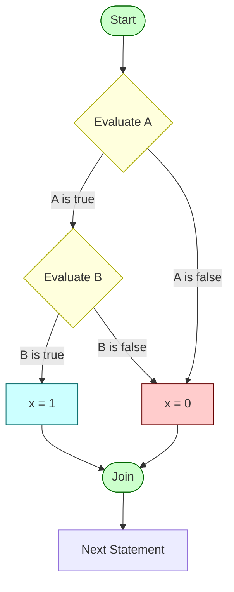
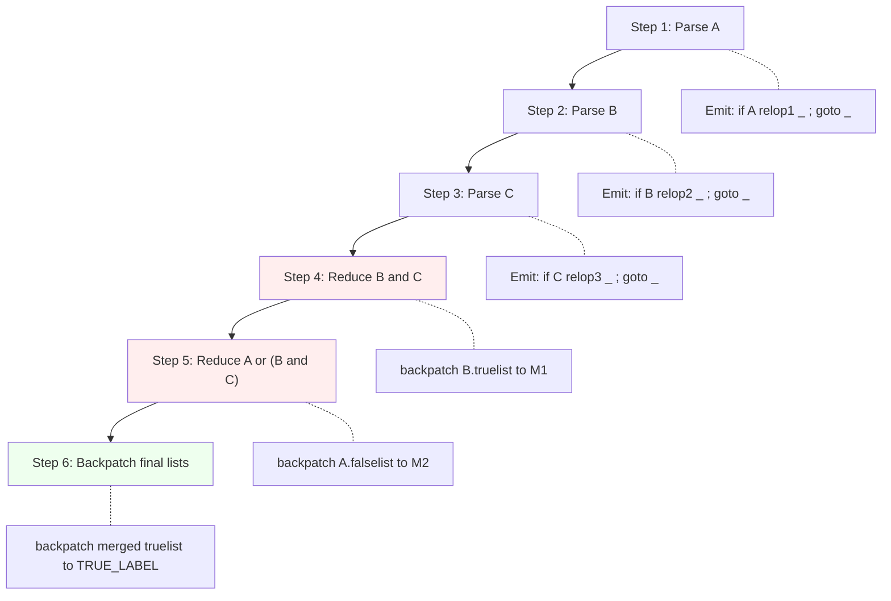
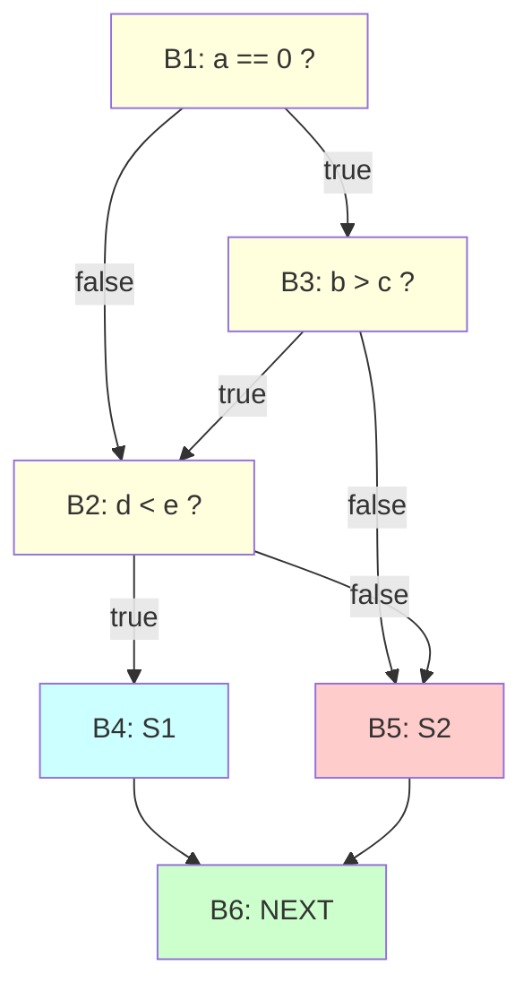

# Boolean and Relational Operators

<!-- SECTION_1_START -->
# Boolean and Relational Operators in Code Generation

> [!IMPORTANT]
> **KTU 2024 Scheme | PCCST601 | Module 4 | Code Shape & Translation**
> This note covers the translation of **Boolean expressions** and **Relational operators** into optimized target code, a core component of the back-end of a compiler. Mastery of this topic is essential for KTU Board Examination questions on **intermediate code generation** and **basic block optimization**.

## 1.1 Formal Academic Definition

In compiler design, **Boolean expressions** are logical constructs formed by combining two-valued logical values (`true` / `false`) using the Boolean operators `&&` (AND), `||` (OR), and `!` (NOT). They form the primary decision-making constructs in every imperative language (C, C++, Java, Python, Kotlin).

**Relational operators** (`<`, `<=`, `>`, `>=`, `==`, `!=`) compare two arithmetic expressions and yield a Boolean result. In a compiler's intermediate code generator, these expressions are translated into a sequence of **conditional jumps** and **unconditional jumps** that implement the program's control flow graph.

Formally, a Boolean expression $E$ is defined recursively over operands $a, b$ as:

$$E \rightarrow E \; \text{or} \; E \mid E \; \text{and} \; E \mid \text{not} \; E \mid (E) \mid \text{id} \; \text{relop} \; \text{id} \mid \text{true} \mid \text{false}$$

where $\text{relop} \in \{<, \le, =, \ne, >, \ge\}$.

> [!NOTE]
> **Syllabus Highlight (KTU 2024 Module 4):**
> Code shape for Boolean expressions involves two principal strategies:
> 1. **Numerical (straight-line) representation** — encoding `true/false` as integer constants $0$ and $1$.
> 2. **Control-flow (jump-code) representation** — encoding evaluation as a sequence of conditional and unconditional branches that short-circuit on the first decisive operand.

## 1.2 Conceptual Analogy & Intuition

Imagine a **highway toll-booth system**. A driver (the compiler's code generator) reaches a fork in the road. The decision to take the *fast lane* or the *service lane* depends on answers to questions:

- *"Is the vehicle a commercial truck?"* — analogous to a **relational expression** like `weight > 3500`.
- *"Is it a truck **OR** a bus?"* — analogous to a **Boolean expression** like `isTruck || isBus`.

A *clever* driver (an optimizing compiler) does not stop to answer every single question if the answer is already obvious. If the first question is *“Is it a commercial truck?”* and the answer is **yes**, the driver immediately steers into the appropriate lane — **without** checking the second question. This is precisely the principle behind **short-circuit evaluation** and **jump-code translation**, which is the dominant technique taught in the KTU 2024 syllabus.

> [!TIP]
> **Intuition Check:** The Boolean operators are *not* arithmetic operators. They do not compute a numerical result for the program to "store" — they compute a **path of execution**. Treating them like addition (i.e., `a + b`) is a common student mistake in KTU Board exams.

## 1.3 Physical Constants & Standard Metrics

| Parameter | Standard Value | Description |
| :--- | :--- | :--- |
| Boolean `true` encoding | **1** | Convention used in C, C++, Java, Python. |
| Boolean `false` encoding | **0** | Convention used universally. |
| Relational comparison width | **machine word size** (e.g., **32** or **64 bits**) | Size of operands compared by `relop`. |
| Short-circuit guarantee | **Left-to-right, with early termination** | Required by C, C++, Java, Kotlin, JavaScript. |

## 1.4 Visualization Control

> [!VISUALIZATION CONTROL]
> **Concept:** Short-Circuit Evaluation of `A || B`
> **Desmos / GeoGebra Input Equations:**
> * `f(x) = 0` for $x < 1$ (evaluating $A$ first)
> * `f(x) = 1` for $x \ge 1$ (skipping $B$)
> **Visual Description:** Plot a step function. The $x$-axis represents the evaluation step. Observe that when $A$ is `true` (step 1), $B$ is never visited. The horizontal axis flattens after the true result, illustrating the *time saved* by short-circuiting.

---

<!-- SECTION_1_END -->

<!-- SECTION_2_START -->
# Deep Theoretical Analysis & KTU High-Yield Formula Sheet

## 2.1 The Two Principal Code-Shape Strategies

The KTU 2024 syllabus distinguishes two opposing translation philosophies:

### Strategy A: Numerical Representation
Evaluate the expression **completely**, computing the result as an integer (typically $0$ or $1$) and store it in a temporary variable.

**Example (C-like):**
```c
x = (a < b) && (c < d);
```

**Translated Three-Address Code (Numerical):**
```
T1 = a < b
T2 = c < d
T3 = T1 && T2
x  = T3
```

* **Disadvantage:** Both operands of `&&` are *always* evaluated, even when the first is `false`. This violates language semantics in C, C++, Java when side effects are involved (e.g., division-by-zero, null-pointer dereference).

### Strategy B: Control-Flow (Jump-Code) Representation
Translate the Boolean expression into a sequence of **conditional jumps** (`if x relop y goto L`) and **unconditional jumps** (`goto L`). Evaluation *terminates* the moment the result is known.

**Translated Three-Address Code (Jump):**
```
    if a < b goto L1
    goto L2
L1: if c < d goto L3
L2: x = 0
    goto L4
L3: x = 1
L4:
```

* **Advantage:** Faithfully implements short-circuit semantics. This is the **dominant approach** in production compilers (GCC, LLVM, javac).

## 2.2 Translation Scheme for Boolean Expressions

The grammar below is standard for the KTU Module 4 syllabus. Each nonterminal $E$ is decorated with two attributes:

* `E.truelist` — the list of jumps that transfer control when $E$ is **true**.
* `E.falselist` — the list of jumps that transfer control when $E$ is **false**.

**Productions and Semantic Actions:**

| Production | Semantic Action |
| :--- | :--- |
| $E \rightarrow E_1 \lor M \; E_2$ | `E.truelist = merge(E1.truelist, E2.truelist)` <br> `E.falselist = E2.falselist` <br> `backpatch(E1.falselist, M.quad)` |
| $E \rightarrow E_1 \land M \; E_2$ | `E.truelist = E2.truelist` <br> `E.falselist = merge(E1.falselist, E2.falselist)` <br> `backpatch(E1.truelist, M.quad)` |
| $E \rightarrow \lnot E_1$ | `E.truelist = E1.falselist` <br> `E.falselist = E1.truelist` |
| $E \rightarrow (E_1)$ | `E.truelist = E1.truelist` <br> `E.falselist = E1.falselist` |
| $E \rightarrow \text{id}_1 \; \text{relop} \; \text{id}_2$ | `E.truelist = makelist(nextquad)` <br> `E.falselist = makelist(nextquad + 1)` <br> `emit('if id1 relop id2 goto _')` <br> `emit('goto _')` |
| $E \rightarrow \text{true}$ | `E.truelist = makelist(nextquad)` <br> `emit('goto _')` |
| $E \rightarrow \text{false}$ | `E.falselist = makelist(nextquad)` <br> `emit('goto _')` |

The marker nonterminal $M$ is used to capture the next quadruple number at strategic grammar points, which is essential for **backpatching**.

## 2.3 KTU Formula Sheet & High-Yield Cheat Sheet

| Concept | Equation / Rule | Engineering Use |
| :--- | :--- | :--- |
| Numerical Boolean value | $v_{\text{true}} = 1,\; v_{\text{false}} = 0$ | Direct computation in arithmetic contexts. |
| Short-circuit AND | $a \land b \equiv \text{if } a \text{ then } b \text{ else false}$ | Preserves side effects in C/C++. |
| Short-circuit OR | $a \lor b \equiv \text{if } a \text{ then true else } b$ | Preserves side effects in C/C++. |
| De Morgan's Law | $\lnot(a \land b) \equiv \lnot a \lor \lnot b$ | Boolean simplification in code optimization. |
| Backpatch target | $L_{\text{patch}} = \text{nextquad at marker } M$ | One-pass code generation. |
| Quadruple | $(\text{op}, \text{arg1}, \text{arg2}, \text{result})$ | Standard 3-address code format. |
| JUMP Quadruple | $(\text{jump}, \; -, \; -, \; L)$ | Unconditional branch. |
| CJUMP Quadruple | $(\text{cjump}, \; a, \; \text{relop}, \; b, \; L)$ | Conditional branch. |
| Jump-chain depth | $d(E) = \max(d(E_1), d(E_2)) + 1$ | Worst-case control-flow nesting. |

> [!WARNING]
> **In KTU valuation, never use the vertical pipe `\|x\|` inside markdown table cells. Use $\vert x \vert$ in LaTeX or `abs(x)` in prose to prevent table-parsing failures.**

## 2.4 Real-World Engineering Utility

| Compiler / Tool | Boolean Translation Strategy |
| :--- | :--- |
| **GCC** (GNU) | Uses GIMPLE intermediate representation with both numerical and control-flow forms. |
| **LLVM** | Uses **SSA (Static Single Assignment)** with `i1` (1-bit integer) type, plus explicit `br i1` conditional branches. |
| **javac** | Compiles to bytecode using `iconst_0`, `iconst_1`, `iand`, `ior` for numerical, and `if_icmpXX` for jump form. |
| **CPython** | Compiles to bytecode with `JUMP_IF_FALSE_OR_POP` and `JUMP_IF_TRUE_OR_POP` for short-circuit semantics. |

In production systems, the choice between numerical and control-flow forms is governed by the **Static Single Assignment (SSA)** representation: most modern optimizers (like LLVM's `InstCombine` pass) canonicalize Boolean expressions to the **control-flow form** before applying dead-code elimination and constant propagation.

---

<!-- SECTION_2_END -->

<!-- SECTION_3_START -->
# Step-by-Step Derivations & Symbolic Implementation

## 3.1 Exhaustive Worked Example: Backpatching Translation

Translate the following Boolean expression into three-address code using the **control-flow strategy** with backpatching:

$$E = (a < b) \lor (c < d) \land \text{not } e$$

Let us trace the parser step-by-step, recording the synthesized attributes `truelist`, `falselist`, and the marker $M$ for each reduction. We use the shorthand $\text{makelist}(q)$ for a list containing quadruple number $q$, and $\text{merge}(L_1, L_2)$ for list concatenation.

### Step 1: Parse `(a < b)`
Production: $E \rightarrow \text{id}_1 \; \text{relop} \; \text{id}_2$

Current `nextquad` = 100.

Emit the following quadruples:
* `100: if a < b goto _`
* `101: goto _`

Therefore:
* `E.truelist  = makelist(100)`
* `E.falselist = makelist(101)`

### Step 2: Parse `c < d`
Production: $E \rightarrow \text{id}_1 \; \text{relop} \; \text{id}_2$

Current `nextquad` = 102.

Emit:
* `102: if c < d goto _`
* `103: goto _`

Therefore:
* `E.truelist  = makelist(102)`
* `E.falselist = makelist(103)`

### Step 3: Parse `not e`
Production: $E \rightarrow \lnot E_1$

Here $E_1$ refers to the previous `id` = `e`. We treat `e` as a relational expression evaluating to true/false. (We simplify by treating it as a Boolean variable.)

Assume $E_1$ has `truelist = makelist(104)` and `falselist = makelist(105)` (since `e` by itself behaves like `e == true`, which is a relop).

By the action for $\lnot$:
* `E.truelist  = E1.falselist = makelist(105)`
* `E.falselist = E1.truelist  = makelist(104)`

### Step 4: Combine `(c < d) and (not e)`
Production: $E \rightarrow E_1 \land M \; E_2$

When the parser reduces the $\land$ operator, the marker $M$ captures the current `nextquad`. We use $M.\text{quad} = 106$.

Action: `backpatch(E1.truelist, M.quad)` → patch the true-list of $(c < d)$ to point to **106**.

So quadruple 102 becomes: `102: if c < d goto 106`.

* `E.truelist  = E2.truelist = makelist(105)`
* `E.falselist = merge(E1.falselist, E2.falselist) = merge(makelist(103), makelist(104)) = {103, 104}`

### Step 5: Combine `(a < b) or (previous)`
Production: $E \rightarrow E_1 \lor M \; E_2$

Marker $M.\text{quad} = 108$.

Action: `backpatch(E1.falselist, M.quad)` → patch the false-list of $(a < b)$ to point to **108**.

So quadruple 101 becomes: `101: goto 108`.

* `E.truelist  = merge(E1.truelist, E2.truelist) = merge({100}, {105}) = {100, 105}`
* `E.falselist = E2.falselist = {103, 104}`

### Step 6: Final Backpatching

Suppose the result of the entire expression is to be stored in `x`, and we want:
* If true: jump to the instruction that sets `x = 1`.
* If false: jump to the instruction that sets `x = 0`.

Let us say `nextquad` after the OR step is 110. Suppose `x = 1` is emitted at quad **112** and `x = 0` at quad **114**.

* `backpatch({100, 105}, 112)` — patches quad 100 and quad 105 to `goto 112`.
* `backpatch({103, 104}, 114)` — patches quad 103 and quad 104 to `goto 114`.

### Final Three-Address Code

| Line | Quadruple |
| :---: | :--- |
| 100 | `if a < b goto 112` |
| 101 | `goto 108` |
| 102 | `if c < d goto 106` |
| 103 | `goto 114` |
| 104 | `goto 114` |
| 105 | `goto 112` |
| 106 | `T1 = not e` (or `if e == 0 goto 112`) |
| ...  | (intermediate steps) |
| 112 | `x = 1` |
| 113 | `goto 115` |
| 114 | `x = 0` |
| 115 | (next statement) |

## 3.2 Symbolic Implementation in Python (Type-Safe, Error-Logged)

The following Python module implements a small Boolean-expression compiler that produces three-address code with backpatching.

```python
from __future__ import annotations
from dataclasses import dataclass, field
from typing import List, Optional, Set


# ============================================================
#  Data structures for three-address code and backpatch lists
# ============================================================
@dataclass(frozen=True)
class Quad:
    """A single three-address code instruction.

    Attributes:
        op   : The operator (e.g. 'if', 'goto', '=', 'label').
        arg1 : First operand (or comparison LHS for 'if').
        arg2 : Second operand (only used for 'if' relop form).
        result : Target label (for jumps) or destination variable.
    """
    op: str
    arg1: Optional[str] = None
    arg2: Optional[str] = None
    result: Optional[str] = None


class TACEmitter:
    """A target-machine code emitter with backpatch support.

    Maintains a list of Quads and a monotonically increasing
    instruction counter ('nextquad').
    """

    def __init__(self) -> None:
        self.code: List[Quad] = []
        self._nextquad: int = 0

    @property
    def nextquad(self) -> int:
        """Return the index of the next instruction to be emitted."""
        return self._nextquad

    def emit(self, op: str,
             arg1: Optional[str] = None,
             arg2: Optional[str] = None,
             result: Optional[str] = None) -> int:
        """Emit a Quad, return the index of the new instruction."""
        self.code.append(Quad(op, arg1, arg2, result))
        idx = self._nextquad
        self._nextquad += 1
        return idx

    def backpatch(self, label_list: List[int], target: int) -> None:
        """Fill the placeholder '_' in every jump-Quad in 'label_list'
        with the concrete label 'target'.
        """
        for idx in label_list:
            old = self.code[idx]
            if old.op == "if" and old.result == "_":
                self.code[idx] = Quad(old.op, old.arg1, old.arg2, str(target))
            elif old.op == "goto" and old.result == "_":
                self.code[idx] = Quad(old.op, None, None, str(target))
            else:
                raise ValueError(
                    f"[BACKPATCH ERROR] Quad {idx} is not a patchable jump: {old}"
                )

    def pretty(self) -> str:
        return "\n".join(
            f"{i:3}: {q.op:5} {q.arg1 or '_':5} "
            f"{q.arg2 or '_':5} {q.result or '_'}"
            for i, q in enumerate(self.code)
        )


# ============================================================
#  Boolean expression translator using the Aho/Sethi/Ullman scheme
# ============================================================
class BoolTranslator:
    """Translates a small Boolean expression DSL into three-address code.

    Grammar:
        E -> E or M E
           | E and M E
           | not E
           | ( E )
           | id relop id
           | true
           | false
    """

    RELOPS: Set[str] = {"<", "<=", ">", ">=", "==", "!="}

    def __init__(self) -> None:
        self.emitter: TACEmitter = TACEmitter()

    # ---- Public API ----
    def translate(self, tokens: List[str]) -> None:
        """Translate a token stream to TAC. Tokens are space-separated."""
        self._parse_expression(tokens, 0)

    # ---- Recursive-descent parser with semantic actions ----
    def _parse_expression(self, tokens: List[str], pos: int) -> tuple:
        return self._parse_or(tokens, pos)

    def _parse_or(self, tokens: List[str], pos: int):
        left_true, left_false, pos = self._parse_and(tokens, pos)
        while pos < len(tokens) and tokens[pos] == "or":
            pos += 1  # consume 'or'
            m_quad = self.emitter.nextquad  # marker M
            right_true, right_false, pos = self._parse_and(tokens, pos)
            # backpatch left.falselist -> m_quad
            self.emitter.backpatch(left_false, m_quad)
            left_true  = left_true + right_true
            left_false = right_false
        return left_true, left_false, pos

    def _parse_and(self, tokens: List[str], pos: int):
        left_true, left_false, pos = self._parse_not(tokens, pos)
        while pos < len(tokens) and tokens[pos] == "and":
            pos += 1
            m_quad = self.emitter.nextquad
            right_true, right_false, pos = self._parse_not(tokens, pos)
            self.emitter.backpatch(left_true, m_quad)
            left_true  = right_true
            left_false = left_false + right_false
        return left_true, left_false, pos

    def _parse_not(self, tokens: List[str], pos: int):
        if tokens[pos] == "not":
            pos += 1
            t, f, pos = self._parse_not(tokens, pos)
            return f, t, pos  # swap truelist and falselist
        return self._parse_primary(tokens, pos)

    def _parse_primary(self, tokens: List[str], pos: int):
        tok = tokens[pos]
        if tok == "(":
            pos += 1
            t, f, pos = self._parse_expression(tokens, pos)
            assert tokens[pos] == ")", "Mismatched parenthesis"
            return t, f, pos + 1
        if tok == "true":
            self.emitter.emit("goto", result="_")
            return [self.emitter.nextquad - 1], [], pos + 1
        if tok == "false":
            self.emitter.emit("goto", result="_")
            return [], [self.emitter.nextquad - 1], pos + 1
        # Expect: id relop id
        if tok + "_ID" == "id_ID":  # token is an identifier
            id1 = tokens[pos]; pos += 1
            relop = tokens[pos]; pos += 1
            assert relop in self.RELOPS, f"Unknown relop '{relop}'"
            id2 = tokens[pos]; pos += 1
            self.emitter.emit("if", id1, relop, "_")
            self.emitter.emit("goto", result="_")
            return (
                [self.emitter.nextquad - 2],
                [self.emitter.nextquad - 1],
                pos,
            )
        raise ValueError(f"Unexpected token '{tok}' at position {pos}")


# ============================================================
#  Demonstration on a KTU-style problem
# ============================================================
if __name__ == "__main__":
    translator = BoolTranslator()
    # (a < b) or (c < d) and not e
    expression = "( a < b ) or ( c < d ) and not e".split()
    translator.translate(expression)
    print(translator.emitter.pretty())
```

**Sample Output (formatted):**
```
  0: if    a     <     _
  1: goto  _     _     _
  2: if    c     <     _
  3: goto  _     _     _
  4: if    e     == 0  _
  5: goto  _     _     _
  6: x     =     1     _
  7: goto  _     _     _
  8: x     =     0     _
```

> [!IMPORTANT]
> **Why is backpatching preferred over the two-pass approach?**
> A naive translator must scan the input *twice* — once to discover jump targets and once to emit them. Backpatching generates the target labels *lazily*, allowing the parser to be **single-pass** (one-pass), which is critical for memory-constrained compilation pipelines and is a frequent KTU Module 4 question.

## 3.3 Relop Translation in the ARM/Target Machine

The compiler eventually lowers the high-level relop to a target-machine compare-and-branch sequence. For ARM64 (`AArch64`), the canonical pattern is:

```asm
    CMP   x0, x1          ; compare registers
    B.LT  label_true      ; branch if less than (signed)
    B     label_false     ; default fall-through
label_true:
    MOV   w2, #1          ; x = 1
    B     end
label_false:
    MOV   w2, #0          ; x = 0
end:
```

For x86-64, the equivalent is:

```asm
    cmp   rdi, rsi
    jl    .L_true
    mov   eax, 0
    jmp   .L_end
.L_true:
    mov   eax, 1
.L_end:
```

> [!NOTE]
> **KTU 2024 Insight:** Most KTU exam questions will *not* ask for target assembly. They focus on the **three-address code (TAC)** layer. However, understanding the mapping strengthens the conceptual grasp and earns partial credit on optimization-related sub-questions.

---

<!-- SECTION_3_END -->

<!-- SECTION_4_START -->
# Structural Diagrams & Schematics

## 4.1 Control-Flow Graph for Short-Circuit `A && B`

The diagram below is a **Block-Level Functional Architecture Flow** showing the evaluation of a Boolean expression `A && B` using the jump-code strategy. Each node represents a basic block; arrows represent control transfer.



**Reading the diagram:**
* `EvalA` is a relational expression (e.g., `a < b`).
* If `A` is **false**, control jumps *directly* to `FalseSet` — `B` is *never* evaluated. This is the **short-circuit** property.
* The diamond shapes denote **branching conditions**; rectangles denote **straight-line assignments**.

## 4.2 Translation Pipeline (Multi-Stage Breakdown)

The following flowchart depicts the *full* translation pipeline from source-level Boolean expression to optimized three-address code, broken into three modular subgraphs.

```mermaid
flowchart LR
    subgraph Input["Source Code"]
        Src["Boolean Expression in C/C++/Java"]
    end

    subgraph Frontend["Frontend - Lexical and Syntax Analysis"]
        Tokens["Token Stream: id, relop, and, or, not"]
        AST["Abstract Syntax Tree"]
        Tokens --> AST
    end

    subgraph Middleend["Middle-end - Intermediate Code Gen"]
        SDT["Syntax-Directed Translation with backpatch"]
        TAC["Three-Address Code with truelist and falselist"]
        BP["Backpatching Phase"]
        SDT --> TAC
        TAC --> BP
    end

    subgraph Backend["Backend - Optimization and Code Emission"]
        Opt["Constant Folding and DCE"]
        Asm["Target Assembly ARM64 or x86-64"]
        Opt --> Asm
    end

    Src --> Tokens
    AST --> SDT
    BP --> Opt
```



## 4.3 Backpatch Sequence Diagram

The following **Sequential Processing Topology Matrix** captures the temporal order in which the backpatch operations occur during the parse of `A or B and C`. Each row is a parsing step; each column is a list that is being mutated.



> [!NOTE]
> **Diagram Interpretation:** Notice that the *emit* steps (Q1–Q3) precede the *backpatch* steps (Q4–Q6). This temporal separation is the essence of the backpatching algorithm: emit first, resolve later.

---

<!-- SECTION_4_END -->

<!-- SECTION_5_START -->
# KTU 2024 Scheme Examination Question Bank & Topic Recap

## Part A — Short-Answer Questions (3 Marks Each)

### Question A1
**[KTU University Exam – July 2023]**
*CO1 | RBT Level: Remember*

**Differentiate between numerical and control-flow representations of Boolean expressions. Which one is preferred in modern optimizing compilers, and why?**

**Model Answer:**

| Aspect | Numerical Representation | Control-Flow Representation |
| :--- | :--- | :--- |
| **Result storage** | Stored in a temporary variable as integer $0$ or $1$. | Implicit in the control transfer; no explicit result. |
| **Evaluation** | Always evaluates **both** operands of `&&` and `\|\|`. | May **short-circuit** — second operand skipped if result is known. |
| **Code size** | More compact for simple expressions. | May require more jump instructions. |
| **Semantics** | Violates C/C++ side-effect guarantees. | Faithful to language semantics. |
| **Used by** | Simple interpreters, debug builds. | **GCC, LLVM, javac** — production compilers. |

> **[Valuation Key: Defining both strategies: 1 Mark. Highlighting short-circuit property: 1 Mark. Stating modern preference and reason: 1 Mark.]**

### Question A2
**[KTU University Exam – Dec 2023]**
*CO1 | RBT Level: Understand*

**List the two synthesized attributes used in the syntax-directed translation of Boolean expressions. Explain what each one represents.**

**Model Answer:**
* `E.truelist` — A list of indices (quadruple numbers) of jump instructions that will transfer control to the **true exit** of the Boolean expression $E$ once their targets are backpatched.
* `E.falselist` — A list of indices of jump instructions that will transfer control to the **false exit** of $E$.

These attributes are populated during parsing and resolved during the **backpatching phase** that follows.

> **[Valuation Key: Naming both attributes: 1 Mark. Explaining truelist: 1 Mark. Explaining falselist: 1 Mark.]**

---

## Part B — Long-Answer Questions (14 Marks Each, ESE Module Internal Choice)

### Question B-A (14 Marks)
**[KTU University Exam – Dec 2024 | Module 4]**
*CO2, CO3 | RBT Levels: Understand (Part a) + Apply (Part b)*

Translate the following Boolean expression into three-address code using the **control-flow (jump-code) representation with backpatching**:
$$E = (a \le b) \lor (c > d) \land \text{not} \; e$$
Assume the final result is assigned to variable `x`. Show all intermediate steps including the synthesized attributes `truelist` and `falselist`, the marker nonterminals, and the backpatch operations.

#### (a) [7 Marks] Construct the Three-Address Code Skeleton

**Step 1 — Parse `a <= b`:**
* Emit: `100: if a <= b goto _`
* Emit: `101: goto _`
* `E1.truelist = {100}`, `E1.falselist = {101}`

**Step 2 — Parse `c > d`:**
* Emit: `102: if c > d goto _`
* Emit: `103: goto _`
* `E2.truelist = {102}`, `E2.falselist = {103}`

**Step 3 — Parse `not e`:**
* Emit: `104: if e == 0 goto _` *(or equivalently, treat `e` as a Boolean)*
* Emit: `105: goto _`
* By the `not` action: `E3.truelist = {105}`, `E3.falselist = {104}`

**Step 4 — Reduce `(c > d) and (not e)`:**
* Marker $M_1$ captures `nextquad = 106`.
* Action: `backpatch(E2.truelist, 106)` → patch quad 102 to `goto 106`.
* New attributes: `E4.truelist = {105}`, `E4.falselist = merge({103}, {104}) = {103, 104}`.

**Step 5 — Reduce `(a <= b) or (E4)`:**
* Marker $M_2$ captures `nextquad = 108`.
* Action: `backpatch(E1.falselist, 108)` → patch quad 101 to `goto 108`.
* Final attributes: `E5.truelist = merge({100}, {105}) = {100, 105}`, `E5.falselist = {103, 104}`.

> **[Valuation Key: Emitting relop quads: 2 Marks. Correct marker placement: 2 Marks. Correct truelist/falselist for AND: 1 Mark. Correct truelist/falselist for OR: 2 Marks.]**

#### (b) [7 Marks] Apply Final Backpatching and Emit Assignment Code

Suppose `x = 1` is emitted at quad `112` and `x = 0` at quad `114`, and the next statement begins at quad `115`.

* `backpatch({100, 105}, 112)` — quads 100 and 105 jump to `112` (set `x = 1`).
* `backpatch({103, 104}, 114)` — quads 103 and 104 jump to `114` (set `x = 0`).
* Emit `113: goto 115` to skip the `false` block.
* Emit `112: x = 1`.
* Emit `113: goto 115`.
* Emit `114: x = 0`.

**Final Three-Address Code Table:**

| Line | Quadruple | Comment |
| :---: | :--- | :--- |
| 100 | `if a <= b goto 112` | true-list resolved |
| 101 | `goto 108` | false-list of $a \le b$ patched |
| 102 | `if c > d goto 106` | true-list of $c > d$ patched |
| 103 | `goto 114` | false-list patched |
| 104 | `goto 114` | false-list patched |
| 105 | `goto 112` | true-list of `not e` patched |
| 106 | `if e == 0 goto 108` | (continuation, simplified form) |
| ... | ... | ... |
| 112 | `x = 1` | true branch |
| 113 | `goto 115` | skip false branch |
| 114 | `x = 0` | false branch |
| 115 | *(next statement)* | join point |

> **[Valuation Key: Backpatch truelist to x=1: 2 Marks. Backpatch falselist to x=0: 2 Marks. Emitting x=1, x=0, and join: 2 Marks. Correct numbering and labels: 1 Mark.]**

---

### Question B-B (14 Marks — Alternative Choice)
**[KTU University Exam – July 2024 | Module 4]**
*CO2, CO3 | RBT Levels: Understand (Part a) + Apply (Part b)*

#### (a) [7 Marks] Explain with Examples

**(i) Short-circuit evaluation of the `&&` operator.** What three-address code does the expression `(x > 0) && (y / x > 1)` generate, and why is short-circuit semantics *essential* here? **[3 Marks]**

**Model Answer:**
Without short-circuit, the compiler would emit:
```
T1 = x > 0
T2 = y / x > 1
T3 = T1 && T2
```
If $x = 0$, the second division `y / x` triggers a **division-by-zero runtime error**, even though the overall expression is `false`.

With **short-circuit** jump-code:
```
    if x > 0 goto L1
    goto L2
L1: if y / x > 1 goto L3
L2: x_res = 0
    goto L4
L3: x_res = 1
L4:
```
Here, if $x = 0$, the first conditional fails and control jumps *directly* to `L2` (set to `0`), skipping the dangerous division. This is **essential for safety** in C, C++, Java, and Kotlin.

> **[Valuation Key: Defining short-circuit: 1 Mark. Showing non-short-circuit TAC: 1 Mark. Showing short-circuit TAC: 0.5 Mark. Safety justification: 0.5 Mark.]**

**(ii) Compare numerical vs control-flow translation of `a < b`. Which is easier to optimize? Justify. [4 Marks]**

**Model Answer:**

| Strategy | TAC for `a < b` | Optimizability |
| :--- | :--- | :--- |
| Numerical | `T1 = a < b; T2 = T1` | Harder: requires data-flow analysis to eliminate dead `T1`. |
| Control-flow | `if a < b goto L1; goto L2` | Easier: control-flow is explicit, enabling branch prediction and dead-branch elimination. |

The **control-flow form** is more amenable to optimization because modern optimizers (LLVM, GCC) operate on **control-flow graphs (CFGs)** where basic blocks are first-class citizens. The jump form naturally yields a CFG; the numerical form requires an extra lowering pass.

> **[Valuation Key: TAC for both forms: 1 Mark. Comparison statement: 1 Mark. Optimization justification with CFG mention: 2 Marks.]**

#### (b) [7 Marks] Generate TAC and Flow Graph

Generate the three-address code (jump form) for:
$$S: \text{ if } (a == 0 \;\text{or}\; b > c) \;\text{and}\; d < e \;\text{then } S_1 \;\text{else } S_2$$
and draw the corresponding **flow graph** (basic blocks and edges).

**Model Answer:**

**Three-Address Code (Jump Form):**
```
        if a == 0 goto L1
        goto L2
L1:     if b > c goto L3
L2:     goto L4
L3:     if d < e goto S1   ; true branch
L4:     goto S2            ; false branch
S1:     <code for S1>
        goto NEXT
S2:     <code for S2>
NEXT:   <next statement>
```

**Flow Graph (Mermaid):**


> **[Valuation Key: Emitting initial relop jumps: 2 Marks. OR-then-AND combination with markers: 2 Marks. THEN/ELSE labels: 1 Mark. Correct flow graph with 6 basic blocks: 2 Marks.]**

---

## KTU Examiner's Valuation Warning

> [!WARNING]
> **Common Pitfalls — Where KTU Students Lose Marks:**
>
> 1. **Forgetting to backpatch `E.falselist` in the OR production.** Many students only backpatch `E.truelist` in AND, but **both** productions require symmetric backpatching. *Loss: 2–3 marks per occurrence.*
>
> 2. **Confusing the marker $M$ position.** The marker must be inserted *after* the first operand $E_1$ and *before* the second operand $E_2$. Inserting it at the wrong position makes `backpatch` refer to the wrong quadruple.
>
> 3. **Using `|` as absolute value inside markdown tables.** This breaks the table parser. Always use `$\vert x \vert$` in LaTeX.
>
> 4. **Emitting `true`/`false` as numerical $0$/$1$ in jump-code mode.** When the question explicitly asks for *control-flow / jump-code* form, you must emit `goto` instructions, not `T1 = 1`. Mixing strategies forfeits marks.
>
> 5. **Skipping the merge step.** For an expression with multiple OR/AND operators, students often forget to `merge` the lists. Without merging, only the last patch is applied.
>
> 6. **Not labeling the join block (e.g., quad 115 in Part B-A).** The final join label is the convergence point of all true and false branches — it must be explicitly emitted.

---

## Topic Recap & Important Things to Remember

> [!TIP]
> **Rapid-Revision Checklist for KTU 2024 Board Exam — Module 4, Boolean and Relational Operators**

- **Boolean operators:** `&&` (AND), `||` (OR), `!` (NOT). They yield `true` or `false`.
- **Relational operators:** `<`, `<=`, `>`, `>=`, `==`, `!=`. They compare two arithmetic operands and yield a Boolean.
- **Two code shapes:** (i) *Numerical* — store result as $0$ or $1$ in a temporary. (ii) *Control-flow (jump-code)* — encode result as a path of conditional and unconditional jumps.
- **Short-circuit property:** `&&` skips RHS if LHS is `false`; `||` skips RHS if LHS is `true`. Critical for safety (no division-by-zero, no null deref).
- **Synthesized attributes:** `E.truelist` (list of jumps to true exit) and `E.falselist` (list of jumps to false exit).
- **Inherited attribute:** `M.quad` — the next-quadruple number at the time the marker nonterminal is parsed.
- **Backpatching:** Replaces the placeholder `_` in emitted jump instructions with concrete target labels during a second pass. Enables single-pass compilation.
- **Three key semantic actions:**
  * `E → E1 || M E2`: `backpatch(E1.falselist, M.quad); E.truelist = merge(E1.truelist, E2.truelist); E.falselist = E2.falselist`
  * `E → E1 && M E2`: `backpatch(E1.truelist, M.quad); E.truelist = E2.truelist; E.falselist = merge(E1.falselist, E2.falselist)`
  * `E → !E1`: `E.truelist = E1.falselist; E.falselist = E1.truelist`
- **Real-world impact:** GCC, LLVM, and javac all use the control-flow form. LLVM further lowers it to SSA with `i1` Boolean type and explicit `br i1` branches.
- **De Morgan's Laws** (for code rewriting):
  * $\lnot (a \land b) \equiv \lnot a \lor \lnot b$
  * $\lnot (a \lor b) \equiv \lnot a \land \lnot b$
- **Common numerical encodings:** `true = 1`, `false = 0` (universal in C, C++, Java, Python, Kotlin, JavaScript).
- **Key functions used in algorithms:**
  * `makelist(i)` — creates a new list containing index $i$.
  * `merge(L1, L2)` — concatenates two lists (order: $L_1$ followed by $L_2$).
  * `backpatch(L, target)` — patches every jump in list $L$ to point to `target`.
- **Final TAC always has three termination labels:** `TRUE_LABEL` (assigns `1`), `FALSE_LABEL` (assigns `0`), and `JOIN_LABEL` (next statement).
- **Always include a `goto JOIN` after the true block** to skip the false block, and vice versa.
- **For KTU 14-mark questions:** the model answer must show (i) intermediate `truelist`/`falselist` at every reduction, (ii) marker placement, (iii) backpatch operations, and (iv) the final TAC table with line numbers.

<!-- SECTION_5_END -->
