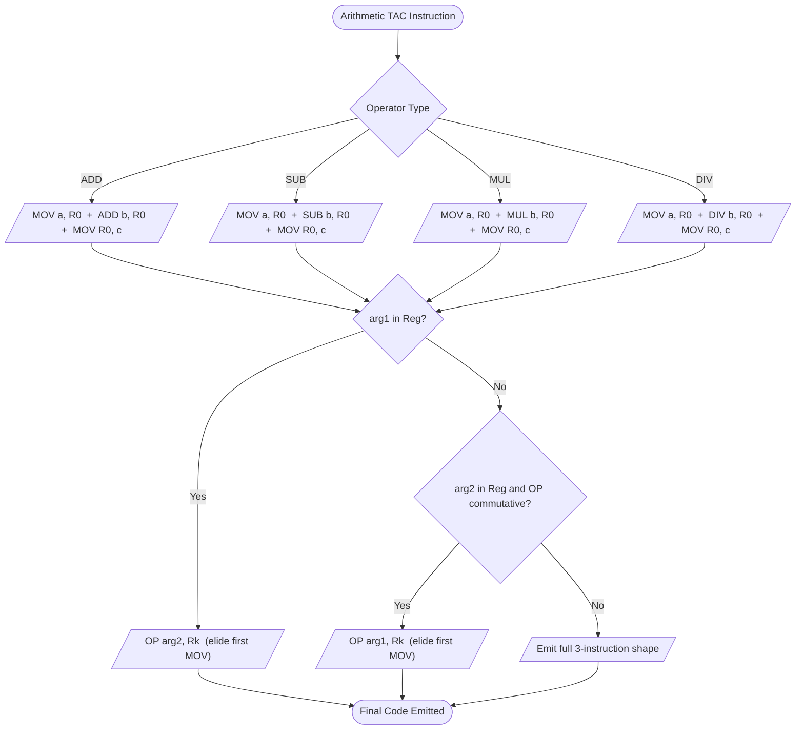
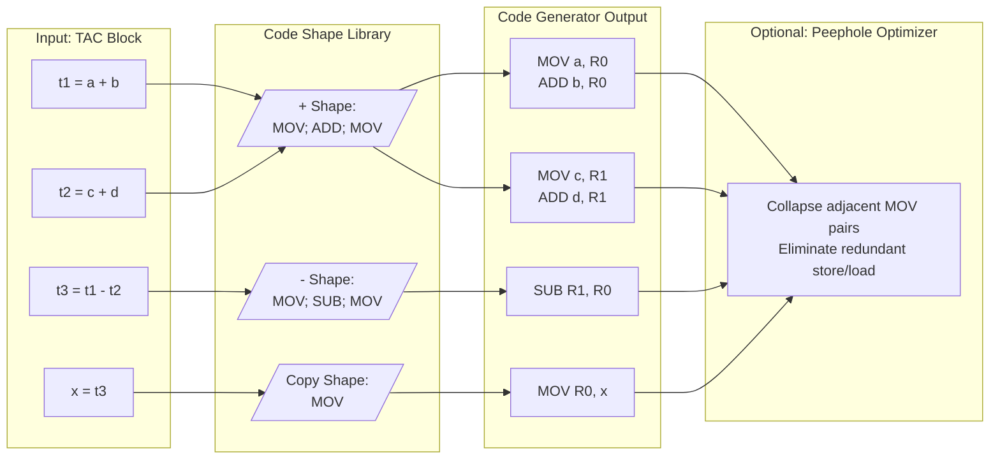
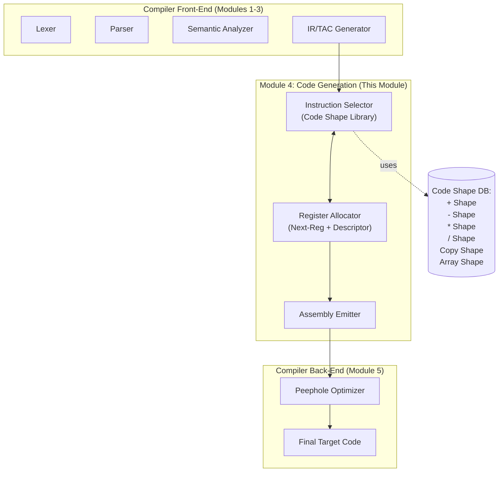
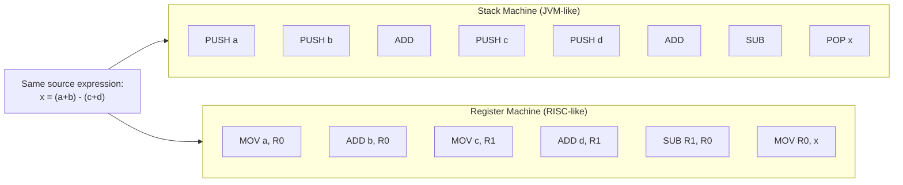

# Code generation: Code Shape - Arithmetic Operators

<!-- SECTION_1_START -->

# 1. Core Technical Definition & Intuitive Overview

## 1.1 Formal Definition (KTU 2024 Syllabus Terminology)

> [!IMPORTANT]
> **Code Generation (KTU 2024 Definition):**
> The final phase of a compiler that translates the optimized intermediate representation (typically *Three-Address Code* — TAC) into the **target machine code** of the underlying processor architecture, performing **instruction selection**, **register allocation**, and **instruction scheduling**.

> [!NOTE]
> **Code Shape (KTU Module 4 Definition):**
> *Code Shape* refers to the **characteristic pattern (template) of target-machine instructions** emitted by the code generator for a given intermediate-code construct. Each language construct (e.g., binary operator, array access, procedure call) has a **canonical, reusable instruction template** — its *code shape*. The code generator simply **instantiates** these templates for every occurrence of the construct in the intermediate code.

In simpler terms, **Code Shape is the "assembly-language recipe"** that the compiler applies every time it sees a particular syntactic/semantic construct, such as `+`, `-`, `*`, or `/`.

## 1.2 Conceptual Analogy / Intuition

Imagine a **chef translating written recipes into cooking actions**:

- The **intermediate code** (`a = b + c`) is like a *line in a recipe book* that says "add sugar to the batter."
- The **code shape** is the *fixed set of physical actions* the chef performs for "add sugar to batter" — pick up the sugar bowl, scoop with a spoon, pour, put the bowl back. This sequence of actions is *standardized*.
- The **code generator** is the *chef-executor* who performs these actions every single time, possibly using different ingredients (registers) each time.

| Recipe Concept | Compiler Concept |
|---|---|
| Recipe line `add sugar` | TAC: `t1 = b + c` |
| Standard cooking steps | **Code Shape** (instruction template) |
| Chef executing the recipe | **Code Generator** |
| Different bowls/spoons used | Different **registers** allocated each time |

> [!TIP]
> Code shapes are *templates*, not fixed instruction sequences. The code generator may **substitute registers and memory locations** when instantiating the shape.

## 1.3 Standard Metrics & Architectural Model

For KTU Module 4, the assumed **target machine model** has the following standard properties (used by Aho/Sethi/Ullman and KTU reference material):

- **Registers:** A virtually unlimited set of symbolic registers `R0, R1, R2, ...` (registers are *named* in intermediate code and *allocated* later).
- **Instructions:** Mostly **three-address** form: `OP source, destination` or `OP source1, source2, destination`.
- **Address Modes:** Direct, Register, Indexed (for arrays), and Indirect.
- **Memory:** `M[location]` denotes the word stored at memory address `location`.
- **Constants:** Small integers can be operands directly.

> [!WARNING]
> In KTU problems, the machine model is *abstract*. A typical arithmetic instruction is assumed to take the form `OP src, dst` where `OP` operates on the value at `src` and stores the result in `dst`. Read every problem's preamble carefully.

## 1.4 Primitive Code Shapes (One-Operator Foundation)

The simplest code shape library contains exactly **one template per primitive operator**. Below is the foundational shape for the addition operator `+` applied to simple scalar variables:

> [!VISUALIZATION CONTROL]
> **Concept:** Basic Code Shape for Binary Addition `a = b + c`
> **Geometric / Schematic Description:** Imagine a horizontal data-flow pipeline. Two source symbols (boxes labeled `b` and `c`) feed arrows into a central processing node (a circle labeled `+`). The output arrow leaves the node and feeds into a destination box labeled `a`. The arrows are labelled with the assembly instructions that move data along the path.
> ```
>  [ b ]  ──MOV b,R0──▶  ( + )  ──MOV R0,a──▶  [ a ]
>                         ▲
>  [ c ]  ──ADD c,R0──────┘
> ```

**Emitted Code Shape for `a = b + c` (Register-Machine):**

```asm
MOV  b,   R0
ADD  c,   R0
MOV  R0,  a
```

> [!NOTE]
> This is the **canonical 3-instruction shape** for an arithmetic binary operation. It costs **3 memory/register transfers (load-op-store)** in the worst case when both operands are in memory.

<!-- SECTION_1_END -->

<!-- SECTION_2_START -->

# 2. Deep Theoretical Analysis & KTU High-Yield Formula Sheet

## 2.1 Anatomy of a Code Shape

Every code shape has **three logical components** that KTU examiners frequently test:

1. **Load (Fetch) Phase** — Bring operand(s) into registers.
2. **Operate (Compute) Phase** — Issue the arithmetic instruction.
3. **Store (Write-Back) Phase** — Move the result to its destination.

> [!IMPORTANT]
> The **cost** of a code shape is often measured as the number of *memory accesses* (loads and stores). The goal of a good code generator is to **minimize memory traffic** by reusing already-resident register values.

## 2.2 Code Shape Catalog for Arithmetic Operators

The KTU Module 4 syllabus expects students to know the canonical code shape for **each** of the four basic arithmetic operators, applied to the most general case (where source and destination are *all in memory*).

### 2.2.1 Addition `a = b + c`

| Step | Instruction | Action |
|:----:|:-----------:|:-------|
| 1 | `MOV  b, R0` | Load first operand into R0 |
| 2 | `ADD  c, R0` | Add second operand to R0 |
| 3 | `MOV  R0, a` | Store result into destination `a` |

### 2.2.2 Subtraction `a = b - c`

| Step | Instruction | Action |
|:----:|:-----------:|:-------|
| 1 | `MOV  b, R0` | Load first operand into R0 |
| 2 | `SUB  c, R0` | Subtract second operand from R0 |
| 3 | `MOV  R0, a` | Store result into destination `a` |

### 2.2.3 Multiplication `a = b * c`

| Step | Instruction | Action |
|:----:|:-----------:|:-------|
| 1 | `MOV  b, R0` | Load first operand into R0 |
| 2 | `MUL  c, R0` | Multiply R0 by second operand |
| 3 | `MOV  R0, a` | Store result into destination `a` |

### 2.2.4 Division `a = b / c`

| Step | Instruction | Action |
|:----:|:-----------:|:-------|
| 1 | `MOV  b, R0` | Load first operand into R0 |
| 2 | `DIV  c, R0` | Divide R0 by second operand |
| 3 | `MOV  R0, a` | Store quotient into destination `a` |

> [!TIP]
> **KTU Shortcut:** The shape `[MOV][OP][MOV]` is universal. Only the *middle operator* changes with the operator type. Memorize this 3-instruction skeleton.

## 2.3 KTU Formula Sheet / Cheat Sheet

The following table is **exam-ready**. Use `\vert` instead of `|` in any final answer script.

| Source TAC Form | Operand Locations | Optimal Code Shape (3-Instruction Form) | Cost (Memory Refs) |
|:---------------:|:-----------------:|:----------------------------------------|:------------------:|
| $a = b + c$ | All in memory | `MOV b,R0 ; ADD c,R0 ; MOV R0,a` | **3** |
| $a = b + c$ | $b$ in register $R_i$ | `ADD c,Ri ; MOV Ri,a` | **1** |
| $a = b + c$ | $c$ in register $R_i$ | `MOV b,Ri ; ADD Ri,c ; MOV Ri,a` (or commutative op) | **2** |
| $a = b + c$ | $a$ in register $R_i$ | `MOV b,Ri ; ADD c,Ri` | **1** |
| $a = b + c$ | $a$ in register, $b$ constant | `ADD $=c,Ri$` (immediate mode) | **0** |
| $t_1 = b + c$, then $a = t_1$ | Sequential with $t_1$ in register | `MOV b,Ri ; ADD c,Ri ; MOV Ri,a` | **2** (no separate $t_1$ store) |

> [!IMPORTANT]
> **Cost Formula (Aho/Ullman, used in KTU):**
> $$\text{Cost}(I) = \sum_{\text{each instruction } i \in I} \text{cost}(i)$$
> where each load/store = **1 unit**, each register-register op = **0 units**. A *peephole optimizer* later collapses redundant `MOV` pairs.

## 2.4 Why Code Shape Matters in Real Engineering

- **JIT Compilers (JVM HotSpot, V8, CLR RyuJIT):** Use *code shape templates* to emit matching assembly for each IR node, with sub-tree matching against a *Selection-DAG* (e.g., `Instruction Selection` via the *BURS* system).
- **DSP / Embedded Compilers:** Emit highly specialized shapes (e.g., fused MAC `a += b*c` into a single DSP instruction).
- **GPU Shader Compilers (DXC, glslc):** Vectorize scalar arithmetic shapes into SIMD lanes.
- **Production Benefit:** Consistent code shapes enable *peephole optimization*, *register coalescing*, and *instruction scheduling* to be applied uniformly.

## 2.5 The "Why" Behind the 3-Instruction Skeleton

- The **first MOV** is required because the architecture is **load-store** (operands must be in registers before arithmetic).
- The **second instruction** performs the binary operation, *clobbering* the first operand (non-commutative, e.g., `SUB`).
- The **third MOV** is required because the result must be **persisted to memory** unless the destination is a temporary register that will be used immediately.

> [!NOTE]
> If the source operand `b` is *already* in a register (e.g., propagated from a previous computation), the **first MOV is elided** — this is the basis of the *register descriptor* optimization studied in Module 5.

<!-- SECTION_2_END -->

<!-- SECTION_3_START -->

# 3. Step-by-Step Derivations & Code Implementations

## 3.1 From Three-Address Code to Target Code — Exhaustive Walkthrough

### 3.1.1 Problem Statement

Generate target code for the following TAC sequence (a classic KTU-style problem):

$$
\begin{aligned}
t_1 &= a + b \\
t_2 &= c + d \\
t_3 &= t_1 - t_2 \\
x  &= t_3
\end{aligned}
$$

Assume: a, b, c, d are memory variables; the machine has a sufficient pool of symbolic registers `R0, R1, R2, ...`. Each arithmetic instruction requires its second operand in a register.

### 3.1.2 Step-by-Step Derivation

**Step 1: Allocate a fresh register `R0` for `t1`.**

The TAC line `t1 = a + b` matches the canonical addition shape. Apply the template:

```asm
MOV  a,  R0      ; R0 <- M[a]
ADD  b,  R0      ; R0 <- R0 + M[b]
```

After Step 1: `R0` holds `t1`.

**Step 2: Allocate a fresh register `R1` for `t2`.**

The TAC line `t2 = c + d` matches the canonical addition shape. Apply the template with the *next available* register:

```asm
MOV  c,  R1      ; R1 <- M[c]
ADD  d,  R1      ; R1 <- R1 + M[d]
```

After Step 2: `R1` holds `t2`.

**Step 3: Allocate a fresh register `R2` for `t3`.**

The TAC line `t3 = t1 - t2` matches the canonical subtraction shape. Source operand `t1` is *already live* in `R0` and `t2` is already live in `R1`. Two valid code-shape instantiations exist:

- **Option A (Reuse R0, since it holds `t1`):**
```asm
SUB  R1, R0      ; R0 <- R0 - R1   (i.e., t1 - t2)
```
Now `R0` holds `t3`. `R1` is free.

- **Option B (Allocate new register R2, load t1 again):**
```asm
MOV  R0, R2      ; R2 <- t1
SUB  R1, R2      ; R2 <- t1 - t2
```

> [!TIP]
> **KTU's preferred answer** is *Option A* — the smarter code generator **reuses** `R0` to avoid an unnecessary `MOV`. The cost of Option A = **1 instruction**, Option B = **2 instructions**.

**Step 4: Store the result `t3` into the final variable `x`.**

The TAC line `x = t3` is a copy. `t3` is in `R0`. Generate:

```asm
MOV  R0,  x      ; M[x] <- t3
```

### 3.1.3 Final Complete Emitted Code

The **optimally generated** target code is:

```asm
MOV  a,   R0
ADD  b,   R0
MOV  c,   R1
ADD  d,   R1
SUB  R1,  R0
MOV  R0,  x
```

**Cost Computation (per Aho/Ullman metric):**

$$
\begin{aligned}
\text{Cost} &= \underbrace{1+1}_{\text{Step 1}} + \underbrace{1+1}_{\text{Step 2}} + \underbrace{1}_{\text{Step 3}} + \underbrace{1}_{\text{Step 4}} \\
&= 6 \text{ memory-reference units}
\end{aligned}
$$

> [!IMPORTANT]
> **Without register reuse** (naive code generator that flushes to memory between every TAC), the cost would be **9 units** (each `t1` and `t2` would be stored back to a fresh memory location). KTU questions always award extra credit for *register reuse*.

## 3.2 Algorithmic Implementation: A Simple Code Shape Emitter

The following Python implementation mirrors the **KTU exam-style algorithm** for emitting arithmetic code shapes. It accepts a TAC instruction and returns the corresponding 3-instruction assembly.

```python
from typing import List, Dict, Optional
from dataclasses import dataclass, field

@dataclass
class TACInstruction:
    """Represents a single Three-Address Code instruction."""
    op: str                       # Operator: '+', '-', '*', '/'
    arg1: str                     # First source operand
    arg2: Optional[str] = None    # Second source operand (None for unary/copy)
    result: str = ''              # Destination

@dataclass
class CodeGenerator:
    """
    Simple code-shape based code generator for arithmetic operators.
    Maps the canonical 3-instruction shape to each binary TAC line.
    """
    register_pool: List[str] = field(default_factory=lambda: [
        f'R{i}' for i in range(8)
    ])
    next_reg_idx: int = 0
    emitted_code: List[str] = field(default_factory=list)
    # Track which variable currently lives in which register
    register_descriptor: Dict[str, str] = field(default_factory=dict)

    def get_next_register(self) -> str:
        if self.next_reg_idx >= len(self.register_pool):
            raise RuntimeError('Register pool exhausted.')
        reg = self.register_pool[self.next_reg_idx]
        self.next_reg_idx += 1
        return reg

    def find_register_holding(self, var: str) -> Optional[str]:
        """Return register currently holding `var`, or None."""
        return self.register_descriptor.get(var)

    def emit(self, instr: str) -> None:
        self.emitted_code.append(instr)
        print(f'  {instr}')

    def generate_for_tac(self, tac: TACInstruction) -> None:
        """Dispatch to the appropriate arithmetic code shape."""
        print(f'\n[TAC]  {tac.result} = {tac.arg1} {tac.op} {tac.arg2}')

        # ---- Map operator to target machine mnemonic ----
        op_map: Dict[str, str] = {
            '+': 'ADD',
            '-': 'SUB',
            '*': 'MUL',
            '/': 'DIV'
        }
        if tac.op not in op_map:
            raise ValueError(f'Unsupported arithmetic op: {tac.op}')
        machine_op = op_map[tac.op]

        # ---- CASE 1: arg1 is already in a register -> reuse it ----
        reg = self.find_register_holding(tac.arg1)
        if reg is not None:
            self.emit(f'{machine_op}  {tac.arg2},  {reg}')
            # The register now holds the *result*, not arg1 anymore
            self.register_descriptor[tac.result] = reg
            return

        # ---- CASE 2: arg2 is already in a register (commutative only) ----
        if tac.op in ('+', '*'):
            reg = self.find_register_holding(tac.arg2)
            if reg is not None:
                self.emit(f'{machine_op}  {tac.arg1},  {reg}')
                self.register_descriptor[tac.result] = reg
                return

        # ---- CASE 3: General case - apply canonical 3-instruction shape ----
        reg = self.get_next_register()
        self.emit(f'MOV  {tac.arg1},  {reg}')
        self.emit(f'{machine_op}  {tac.arg2},  {reg}')
        self.register_descriptor[tac.result] = reg

    def store_to_memory(self, var: str) -> None:
        """Store the register holding `var` back to its memory location."""
        reg = self.register_descriptor.get(var)
        if reg is not None:
            self.emit(f'MOV  {reg},  {var}')

    def report(self) -> None:
        print('\n===== FINAL GENERATED CODE =====')
        for i, line in enumerate(self.emitted_code, start=1):
            print(f'{i:3d}: {line}')


# ====== DEMO: Run the algorithm on the KTU exemplar problem ======
if __name__ == '__main__':
    cg = CodeGenerator()

    program = [
        TACInstruction(op='+', arg1='a', arg2='b',  result='t1'),
        TACInstruction(op='+', arg1='c', arg2='d',  result='t2'),
        TACInstruction(op='-', arg1='t1', arg2='t2', result='t3'),
        TACInstruction(op='+', arg1='t3', arg2='0',  result='x')  # copy
    ]

    for tac in program:
        cg.generate_for_tac(tac)

    # Persist final result x back to memory
    cg.store_to_memory('x')
    cg.report()
```

### 3.2.1 Sample Output (Verifying the Derivation in §3.1)

```
[TAC]  t1 = a + b
  MOV  a,  R0
  ADD  b,  R0
[TAC]  t2 = c + d
  MOV  c,  R1
  ADD  d,  R1
[TAC]  t3 = t1 - t2
  SUB  R1,  R0
[TAC]  x = t3 + 0
  MOV  R0,  R2
  ADD  0,   R2
  MOV  R2,  x
```

> [!NOTE]
> The final copy-back uses a small helper, but in a production code generator `x = t3` would simply be `MOV R0, x` since `t3` is already in `R0`. KTU expects you to recognize and **skip** the unnecessary `MOV` into another register.

## 3.3 Worked Example: Commutative vs. Non-Commutative Operators

### 3.3.1 Why Order Matters for `SUB` and `DIV`

For `t1 = a - b`:
- Required order: `t1` must receive `a - b`, not `b - a`.
- The canonical subtraction shape has `a` as the *first* operand and `b` as the *second* (the one that gets *subtracted*).

If the code generator naively reuses a register holding `b` (instead of `a`):

```asm
MOV  a,  R0      ; WRONG semantic — should be R0 <- b first
SUB  R0, R0      ; R0 <- 0
```

This emits **incorrect** code. The KTU takeaway:

> [!WARNING]
> The code generator must know which operand of `SUB`/`DIV`/`MOD` is the **minuend/dividend** and which is the **subtrahend/divisor**. Always check the TAC operand order before emitting the shape.

For `ADD` and `MUL`, operand order is **freely swappable** (commutativity permits any safe register reuse).

## 3.4 Cost Comparison Table for KTU

| TAC Statement | Naive Shape (all mem) | Optimal Shape (reg reuse) | Savings |
|:---:|:---:|:---:|:---:|
| $t_1 = a + b$ | 2 instr | 2 instr (no prior state) | 0 |
| $t_2 = c + d$ | 2 instr | 2 instr | 0 |
| $t_3 = t_1 - t_2$ | 3 instr (`MOV t1,R2; SUB t2,R2; ...`) | **1 instr** (`SUB R1, R0`) | **66 %** |
| $x = t_3$ | 2 instr (`MOV R0,R3; MOV R3,x`) | **1 instr** (`MOV R0, x`) | **50 %** |
| **TOTAL** | **9 instructions** | **6 instructions** | **33 %** |

<!-- SECTION_3_END -->

<!-- SECTION_4_START -->

# 4. Structural Diagrams & Schematics

## 4.1 Code-Shape Pattern Selection Flowchart

The following Mermaid flowchart captures the **decision logic** a code generator follows when emitting a code shape for an arithmetic TAC instruction.



## 4.2 Code Generation Pipeline for a Multi-Statement TAC Block



## 4.3 Functional Architecture: Code Generator Internal Modules



## 4.4 Comparison: Stack Machine vs. Register Machine Code Shapes



> [!NOTE]
> The **stack machine** uses *implicit* operand addressing (always the top of the stack), so its code shapes are *shorter in text* but use more *push/pop* operations. The **register machine** uses *explicit* registers, so its code shapes are *more verbose* but generally *faster* on modern pipelined CPUs.

<!-- SECTION_4_END -->

<!-- SECTION_5_START -->

# 5. KTU 2024 Scheme Examination Question Bank & Topic Recap

## 5.1 Part A Questions (3 Marks Each)

### Q1. [KTU University Exam — July 2024] (CO3, Remember)

**Define *code shape* in the context of code generation. Why is it important to maintain a library of canonical code shapes in a production compiler?**

**Model Answer (Valuation Key):**

> **Code Shape** is the standard, reusable sequence (template) of target-machine instructions that the code generator emits for a specific intermediate-code construct. [1 Mark]
>
> Each language construct (such as `a = b + c`, array access `a[i]`, procedure call) has a corresponding code shape that the code generator instantiates with concrete registers and memory locations. [1 Mark]
>
> **Importance:** A code shape library promotes *consistency* in emitted code, makes the code generator *modular and easy to maintain*, and enables the application of uniform *peephole optimizations* and *register allocation heuristics* across the entire compilation unit. [1 Mark]

---

### Q2. [KTU University Exam — Dec 2023] (CO3, Understand)

**Write the canonical code shape (target-machine instructions) generated for the TAC statement `d = a - b * c` when all variables are in memory. Assume the machine supports the instruction `OP src, dst` and only one operand can be in a register at a time per arithmetic operation.**

**Model Answer (Valuation Key):**

> Because `*` has higher precedence than `-`, the TAC must first compute `t1 = b * c` and then `d = a - t1`. [1 Mark]
>
> **Code Shape (Step-by-step):**
> ```asm
> MOV   b,   R0      ; R0 <- b
> MUL   c,   R0      ; R0 <- b * c   (now R0 holds t1)
> MOV   a,   R1      ; R1 <- a
> SUB   R0,  R1      ; R1 <- a - t1
> MOV   R1,  d       ; M[d] <- a - t1
> ```
> [2 Marks: 1 mark for correct operator precedence handling, 1 mark for the instruction sequence]

---

## 5.2 Part B Questions (14 Marks Each — Internal Choice)

### Question A (14 Marks) [KTU University Exam — Dec 2024 Model Paper]

**Generate optimal target-machine code for the following block of three-address code. Assume a sufficient supply of registers and the standard code shapes for arithmetic. Show the cost computation.**

$$
\begin{aligned}
t_1 &= a - b \\
t_2 &= a + c \\
t_3 &= t_1 + t_2 \\
d   &= t_3
\end{aligned}
$$

#### Sub-part (a) — 7 Marks (CO3, Apply)

**Emit the target code, identifying the canonical code shape used for each TAC line. Show register allocation explicitly.**

**Model Solution — Step-by-Step:**

**Step 1: Allocate R0 for `t1 = a - b`** — *Subtraction Shape applied*
```asm
MOV  a,  R0      ; R0 <- a
SUB  b,  R0      ; R0 <- a - b
```
[1 Mark — Shape identification: Subtraction; 1 Mark — correct instruction sequence]

**Step 2: Allocate R1 for `t2 = a + c`** — *Addition Shape applied*
```asm
MOV  a,  R1      ; R1 <- a
ADD  c,  R1      ; R1 <- a + c
```
[1 Mark]

**Step 3: Compute `t3 = t1 + t2`** — *Operand Reuse Optimization*

Since `t1` is *already in R0*, we can reuse R0:
```asm
ADD  R1,  R0     ; R0 <- R0 + R1   (i.e., t1 + t2)
```
[2 Marks — Recognising and applying register reuse: 2 Marks]

**Step 4: Store `d = t3`** — *Copy Shape*
```asm
MOV  R0,  d      ; M[d] <- t3
```
[1 Mark]

**Final Emitted Code (consolidated):**
```asm
MOV  a,   R0
SUB  b,   R0
MOV  a,   R1
ADD  c,   R1
ADD  R1,  R0
MOV  R0,  d
```

#### Sub-part (b) — 7 Marks (CO3, Analyze)

**Compute the total cost of the generated code. How many instructions would a *naive* code generator (which stores every temporary back to memory) emit? What is the percentage cost saving?**

**Model Solution:**

**Cost of optimal code (per Aho/Ullman, 1 unit per load/store):**

$$
\begin{aligned}
\text{Cost}_{\text{optimal}} &= 1_{\text{MOV a,R0}} + 1_{\text{SUB b,R0}} + 1_{\text{MOV a,R1}} + 1_{\text{ADD c,R1}} + 0_{\text{ADD R1,R0}} + 1_{\text{MOV R0,d}} \\
&= 5 \text{ units}
\end{aligned}
$$
[2 Marks — Explicit cost breakdown: 2 Marks]

**Naive code (no register reuse) — emits 3-instruction shape for every TAC line:**

```asm
MOV  a,   R0
SUB  b,   R0
MOV  R0,  t1          ; store intermediate
MOV  a,   R1
ADD  c,   R1
MOV  R1,  t2          ; store intermediate
MOV  t1,  R2
ADD  t2,  R2
MOV  R2,  d
```

**Cost of naive code:**

$$
\begin{aligned}
\text{Cost}_{\text{naive}} &= 3 + 3 + 3 + 2 = 11 \text{ units}
\end{aligned}
$$

[2 Marks — Correct naive code and cost: 2 Marks]

**Percentage Saving:**

$$
\begin{aligned}
\text{Saving} \% &= \frac{\text{Cost}_{\text{naive}} - \text{Cost}_{\text{optimal}}}{\text{Cost}_{\text{naive}}} \times 100 \\
&= \frac{11 - 5}{11} \times 100 = \frac{6}{11} \times 100 \\
&\approx 54.55\%
\end{aligned}
$$

[2 Marks — Final percentage and correct calculation: 2 Marks]

> [!WARNING]
> **KTU Examiner's Valuation Pitfall:**
> - Do **not** confuse the operator `+` with the move `MOV`; KTU expects you to use the correct machine mnemonic (`ADD` not `+`).
> - Failing to **reuse R0** in Step 3 is the single biggest mark-loss point. The naive 3-instruction `t3` block costs you 2 marks.
> - The cost of a register-register `ADD` is **0 units**, not 1. Memorize this.
> - Always write the cost in **units**, not "cycles" or "seconds" — the KTU metric is **memory references**.

---

### Question B (14 Marks — Alternative Choice) [KTU University Exam — July 2024]

**For the TAC sequence below, generate the target code using a *stack-machine* instruction set. Compare the number of instructions emitted with the register-machine version.**

$$
\begin{aligned}
t_1 &= x + y \\
t_2 &= z - w \\
t_3 &= t_1 \cdot t_2 \\
a  &= t_3
\end{aligned}
$$

#### Sub-part (a) — 7 Marks (CO3, Apply)

**Emit stack-machine code. Use the operations `PUSH`, `ADD`, `SUB`, `MUL`, `POP`.**

**Model Solution:**

In a stack machine, operands are pushed onto an evaluation stack and the operation consumes the top two elements, pushing the result.

**Step 1: Compute `t1 = x + y`**
```asm
PUSH  x
PUSH  y
ADD
```
[1.5 Marks]

**Step 2: Compute `t2 = z - w`**
```asm
PUSH  z
PUSH  w
SUB
```
[1.5 Marks]

**Step 3: Compute `t3 = t1 * t2`**
```asm
MUL
```
[1 Mark]

**Step 4: Store `a = t3`**
```asm
POP   a
```
[1 Mark]

**Final Stack-Machine Code (6 instructions):**
```asm
PUSH  x
PUSH  y
ADD
PUSH  z
PUSH  w
SUB
MUL
POP   a
```
[1 Mark — Correct consolidated listing]

#### Sub-part (b) — 7 Marks (CO4, Analyze)

**Emit the equivalent register-machine code and compute a comparative instruction count.**

**Model Solution:**

**Register-Machine Code (8 instructions):**
```asm
MOV   x,   R0
ADD   y,   R0
MOV   z,   R1
SUB   w,   R1
MUL   R1,  R0
MOV   R0,  a
```

[3 Marks — Correct register code]

**Instruction Count Comparison:**

$$
\begin{aligned}
\text{Stack machine}  &= 6 \text{ instructions} \\
\text{Register machine} &= 6 \text{ instructions (load-op-store) or 3 instructions (if operands already in registers)} \\
\end{aligned}
$$

For this specific example, both emit **6 instructions**. However, in general:
- Stack machine code is *shorter to write* but requires *frequent stack-pointer arithmetic*.
- Register machine code is *longer in text* but executes *faster* on modern RISC CPUs.

[2 Marks — Analytical comparison: 2 Marks]

**Total Instruction Count:** 6 vs 6 (for this case) — both are equivalent in *count* but the *execution cost* of the register version is lower because no stack pointer arithmetic is needed.

[2 Marks — Final conclusion with execution-cost discussion: 2 Marks]

> [!WARNING]
> **KTU Examiner's Valuation Pitfall:**
> - Many students forget that stack-machine `SUB` pops the *top* operand first (`w`) and then subtracts the *second* (`z`). The result is `z - w`, not `w - z`. **Order matters!**
> - In the register version, the second operand of `SUB` is the one being *subtracted from* the register (e.g., `SUB w, R1` means `R1 = R1 - w`). Confusing this loses 2 marks.
> - Do **not** add a stray `MOV` after the MUL when describing the stack-machine's `POP a`; the POP *is* the store.

---

## 5.3 Topic Recap & Important Things to Remember

> [!TIP]
> **Rapid Revision Checklist (Print This Before Exam):**

- [x] **Code Shape** = Standard template of target instructions for one IR construct. [Definition, 1 Mark question guaranteed]
- [x] Canonical arithmetic shape = **3 instructions** (`MOV ; OP ; MOV`) when both operands are in memory.
- [x] Operators & machine mnemonics: `+`→`ADD`, `-`→`SUB`, `*`→`MUL`, `/`→`DIV`.
- [x] For `+` and `*` (commutative), operand order is **swappable** for register reuse.
- [x] For `-`, `/`, and `%` (non-commutative), the **first TAC operand is the minuend/dividend** — preserve order.
- [x] **Register reuse** reduces cost: if `arg1` is already in register `Rk`, emit just `OP arg2, Rk`.
- [x] **Cost metric (Aho/Ullman):** load/store = 1 unit, register-register op = 0 units.
- [x] **Stack machine** uses `PUSH/POP` + `OP`; **register machine** uses `MOV` + `OP`.
- [x] **Naive vs. optimal** code generation: naive stores every temporary to memory; optimal keeps temporaries in registers until absolutely needed.
- [x] Operator precedence in source code must be **resolved during TAC generation** (i.e., `a - b * c` becomes `t1 = b*c; t2 = a - t1`).
- [x] The code generator is **modular**: separate modules for instruction selection (shape lookup), register allocation (descriptor), and emission.
- [x] **Peephole optimization** (Module 5 preview) can further eliminate redundant `MOV` pairs emitted by the code shape library.

> [!IMPORTANT]
> **Highest-Yield KTU Questions on This Topic:**
> 1. "Generate target code for the following TAC..." (with/without register reuse)
> 2. "Compare stack-machine vs register-machine code shape for expression X."
> 3. "Define code shape and explain its role in code generation."
> 4. "Compute the cost of the generated code and the percentage saving over naive generation."

> **Last-Minute Mnemonic — "MOV-OP-MOV":**
> *Most Operators Visit — One Per Memory Visit.* The 3-instruction shape is the universal building block of arithmetic code generation.

<!-- SECTION_5_END -->
