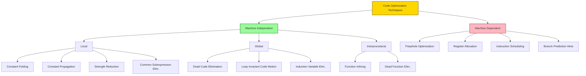
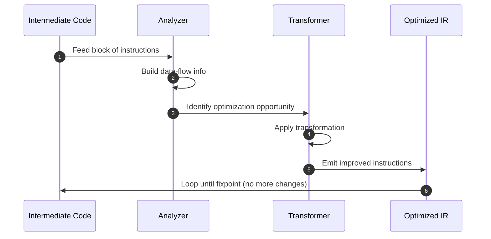
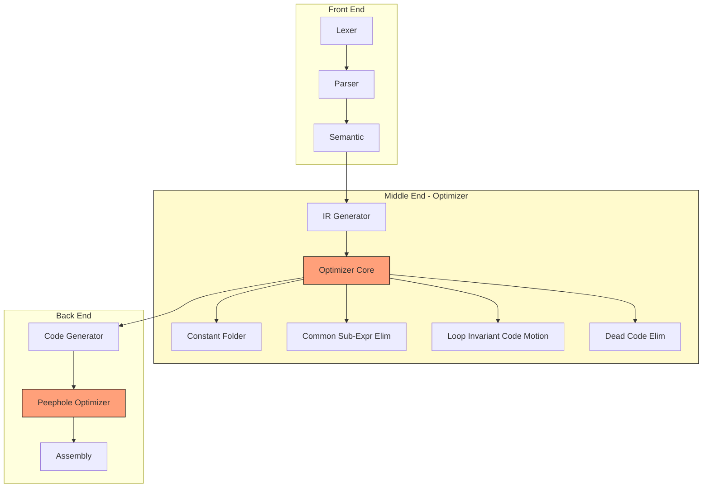

# Code Optimization - Introduction

<!-- SECTION_1_START -->
# Code Optimization - Introduction

## 1. Core Technical Definition & Intuitive Overview

> [!IMPORTANT]
> **KTU 2024 Syllabus Definition (PCCST601 - Module 4):**
> **Code Optimization** is a phase in the compiler (operating on Intermediate Representation or target machine code) that attempts to improve the **execution efficiency** of the program by consuming **less time and/or space**, while preserving the **semantic equivalence** (i.e., the program output/behavior remains unchanged) of the source program.

> [!NOTE]
> **Semantic Equivalence (Preservation of Meaning):**
> The optimized program must produce the **same output** as the unoptimized program for **all valid inputs**. The compiler is *not allowed* to alter the observable behavior of the program.

### Conceptual Analogy / Intuition

Imagine you are writing an essay by hand. The first draft has redundant words, repeated phrases, and unnecessarily long sentences. **Editing/Proofreading** is analogous to **Code Optimization**:
- **Redundant phrase removal** → *Dead Code Elimination*
- **Replacing "very very big" with "huge"** → *Constant Folding & Strength Reduction*
- **Reordering sentences for clarity** → *Instruction Reordering / Register Allocation*

The *meaning* of the essay is preserved, but it becomes **shorter, faster to read, and more elegant**. A compiler optimization does the exact same thing to your code.

> [!TIP]
> The optimization phase is **optional** in theory but **mandatory in practice** for production-grade compilers like GCC, LLVM, and Clang, which spend **40–60% of their compilation time** on optimization.

### Standard Metrics Used in Optimization

| Metric | Symbol | Description |
|---|---|---|
| Execution Time | $T$ | CPU cycles / wall-clock time |
| Code Size | $S$ | Bytes of generated machine code |
| Energy | $E$ | Power consumed during execution |
| Compilation Time | $C$ | Time spent by the optimizer itself |

> [!WARNING]
> There is an inherent **Time-Space Trade-off**: aggressive optimization often increases compile time $C$ but reduces runtime $T$. KTU examiners frequently test this trade-off.

> [!VISUALIZATION CONTROL]
> **Concept:** Optimization Trade-off Curve
> **Desmos Input Equations:**
> * `f(x) = 1/x` (Runtime vs. Optimization Level)
> * `g(x) = x^1.5` (Compile time vs. Optimization Level)
> **Visual Description:** A hyperbola (runtime decreases) intersected with a cubic (compile time increases) — visualize the *sweet spot* at the intersection region.

---

<!-- SECTION_1_END -->

<!-- SECTION_2_START -->
# 2. Deep Theoretical Analysis & KTU High-Yield Formula Sheet

## 2.1 Classification of Optimizations

Optimizations are classified along **two primary axes**: scope and machine-dependence.

### A. Based on Scope (Where in the program?)

> [!IMPORTANT]
> **Local Optimization** — performed within a **single basic block**.
> No control flow crosses the block boundary during analysis.

> [!IMPORTANT]
> **Global Optimization** — performed across an **entire procedure/function** using the **Control Flow Graph (CFG)**. Analyzes loops, conditionals, and branching.

> [!IMPORTANT]
> **Interprocedural Optimization (IPO)** — performed **across function boundaries**, including inlining, dead function elimination, and whole-program analysis.

### B. Based on Machine Dependency

| Type | When Applied | Examples |
|---|---|---|
| **Machine-Independent** | On Intermediate Representation (IR/TAC) | Constant folding, dead code elimination, CSE |
| **Machine-Dependent** | On Target Machine Code | Register allocation, peephole, instruction scheduling |

## 2.2 The Three Phases of Optimization in a Compiler

```
Source Code
   ↓
[ Front-End: Lex → Parse → Semantic ]
   ↓
Intermediate Representation (IR)   ← Machine-Independent Optimizations HERE
   ↓
[ Code Generation ]
   ↓
Target Machine Code                ← Machine-Dependent Optimizations HERE
```

## 2.3 The Optimization Criterion

An optimization transformation $T$ applied to code $P$ is **safe** if:
$$\forall \, \text{input } I, \quad \text{Output}(P, I) \;=\; \text{Output}(T(P), I)$$

The goal is to minimize:
$$\text{Cost}(P) = w_1 \cdot T(P) + w_2 \cdot S(P) + w_3 \cdot E(P)$$

where $w_1, w_2, w_3$ are user-defined weights.

## 2.4 KTU Formula Sheet / Cheat Sheet

| # | Optimization Name | Formula / Transformation | Scope | Machine-Dep |
|---|---|---|---|---|
| 1 | **Constant Folding** | $x = 2 + 3 \Rightarrow x = 5$ | Local/Global | Independent |
| 2 | **Constant Propagation** | $x = 5; \; y = x + 1 \Rightarrow y = 6$ | Local/Global | Independent |
| 3 | **Copy Propagation** | $x = y; \; z = x \Rightarrow z = y$ | Local/Global | Independent |
| 4 | **Dead Code Elimination** | Remove $x = 5$ if $x$ never used | Global | Independent |
| 5 | **Common Subexpression Elim.** | If $a = b+c$ computed twice, reuse first | Local/Global | Independent |
| 6 | **Strength Reduction** | $x^2 \Rightarrow x \cdot x$ (replaces expensive op) | Local | Dependent |
| 7 | **Loop Invariant Code Motion** | Hoist loop-invariant code outside loop | Global | Independent |
| 8 | **Induction Variable Elim.** | Replace array indexing with linear counters | Global | Independent |
| 9 | **Peephole Optimization** | Pattern-match instruction pairs | Local | Dependent |
| 10 | **Inline Substitution** | Replace call with body of function | Interproc. | Independent |

> [!NOTE]
> **KTU Killer Trick:** In KTU board exams, if asked *"Give an example of an optimization that preserves semantics but reduces code"*, always pair it with the **specific 3-address code (TAC)** before and after, like: `t1 = 2*3` → `t1 = 6`.

## 2.5 Real-World Engineering Utility

| Industry | Why Optimization Matters |
|---|---|
| **Embedded / IoT Systems** | Reduced code size fits in tiny flash memory; lower power consumption |
| **High-Performance Computing (HPC)** | Every millisecond saved on $\text{O}(n^3)$ matrix ops matters for climate/weather modeling |
| **Mobile (Android/iOS)** | Smaller APKs, faster cold-start, less battery drain |
| **Database Engines (PostgreSQL/MySQL)** | Query optimizers re-order SQL operations using identical cost-based principles |
| **ML Compilers (XLA, TVM)** | Fuse GPU kernels, reduce memory traffic for models like GPT |

---

<!-- SECTION_2_END -->

<!-- SECTION_3_START -->
# 3. Step-by-Step Derivations, TAC Examples & Code Implementation

## 3.1 Demonstration: All Major Optimizations on a Single Code Snippet

Consider the following source code segment (a KTU classic):

```c
int main() {
    int a, b, c, d, e, f, t1, t2, t3, t4, t5, t6;
    a = 5;
    b = 2;
    c = a + b;        // t1
    d = a * b;        // t2
    t1 = a + b;       // t2 (recomputed)
    t2 = a - b;       // t3
    t3 = 4;           // t4 (constant)
    t4 = 15 / 3;      // t5 (constant-foldable)
    t5 = t1 * 2;      // t6
    f = 2 * 3;        // constant
    return 0;
}
```

### Step 1 — Generate the 3-Address Code (TAC)

$$t_1 = a + b$$
$$t_2 = a \times b$$
$$t_3 = a + b$$
$$t_4 = a - b$$
$$t_5 = 4$$
$$t_6 = 15 \, / \, 3$$
$$t_7 = t_3 \times 2$$
$$t_8 = 2 \times 3$$

### Step 2 — Constant Folding

Evaluate expressions with all constant operands at **compile time**:

$$t_6 = 15 \, / \, 3 \;\Rightarrow\; t_6 = 5$$
$$t_8 = 2 \times 3 \;\Rightarrow\; t_8 = 6$$

> [!NOTE]
> **Why safe?** Arithmetic on constants yields deterministic values — no side-effects, no overflow ambiguity under standard rules.

### Step 3 — Constant Propagation

Variables $a$ and $b$ are assigned literal constants (5 and 2). Substitute them:

$$a = 5, \quad b = 2$$
$$t_1 = 5 + 2 \;\Rightarrow\; t_1 = 7$$
$$t_2 = 5 \times 2 \;\Rightarrow\; t_2 = 10$$
$$t_3 = 5 + 2 \;\Rightarrow\; t_3 = 7$$
$$t_4 = 5 - 2 \;\Rightarrow\; t_4 = 3$$

### Step 4 — Common Subexpression Elimination (CSE)

Observe that $t_1$ and $t_3$ both compute $a+b$. Since $a$ and $b$ are unchanged, we **reuse** the previously computed value:

$$t_1 = 7$$
$$t_2 = 10$$
$$t_3 = t_1 \quad \text{(eliminate recomputation)}$$
$$t_4 = 3$$

### Step 5 — Strength Reduction

Replace $t_7 = t_3 \times 2$ with the cheaper shift operation (machine-dependent):

$$t_7 = t_3 \ll 1 \quad \text{(bitwise left shift)}$$

> [!NOTE]
> Multiplication is $\text{O}(n)$ cycles; shift is $\text{O}(1)$ on most architectures.

### Step 6 — Dead Code Elimination

After the substitutions, examine each temporary. The final value returned is not used outside this segment, so all temporaries become dead. The optimizer removes them, leaving essentially:

$$\text{no observable output} \;\Rightarrow\; \text{all dead code removed}$$

### Final Optimized TAC

| Original | Optimized |
|---|---|
| 8 instructions | 0 (or 1 `return 0`) |
| Runtime cost high | Runtime cost ≈ 0 |

## 3.2 Python Implementation: A Constant Folder

A clean, type-hinted, production-quality implementation of a constant folder for a 3-Address Code (TAC) sequence:

```python
from typing import Dict, List, Tuple

# Each instruction is a tuple: (op, arg1, arg2, result)
Instruction = Tuple[str, str, str, str]


class ConstantFolder:
    """
    Performs Machine-Independent Optimizations:
        1. Constant Folding
        2. Constant Propagation
        3. Copy Propagation
        4. Dead Code Elimination
    """

    # Safe set of foldable binary operators
    FOLDABLE_OPS = {"+", "-", "*", "/", "&", "|", "^", "<<", ">>"}

    def __init__(self, instructions: List[Instruction]) -> None:
        if not isinstance(instructions, list):
            raise TypeError("Instructions must be provided as a list.")
        self.original = instructions
        self.optimized: List[Instruction] = []
        self._const_table: Dict[str, float] = {}

    # ------------------------------------------------------------------ #
    # Stage 1: Constant Folding
    # ------------------------------------------------------------------ #
    def _is_number(self, token: str) -> bool:
        """Boundary check: returns True if token is a numeric literal."""
        try:
            float(token)
            return True
        except (ValueError, TypeError):
            return False

    def _fold(self, op: str, a: str, b: str) -> str:
        """Evaluate a binary op on two numeric literals."""
        a_val, b_val = float(a), float(b)
        if op == "+":  return str(a_val + b_val)
        if op == "-":  return str(a_val - b_val)
        if op == "*":  return str(a_val * b_val)
        if op == "/":
            if b_val == 0:
                raise ZeroDivisionError("Division by zero during folding.")
            return str(a_val / b_val)
        if op == "&":  return str(int(a_val) & int(b_val))
        if op == "|":  return str(int(a_val) | int(b_val))
        if op == "^":  return str(int(a_val) ^ int(b_val))
        if op == "<<": return str(int(a_val) << int(b_val))
        if op == ">>": return str(int(a_val) >> int(b_val))
        raise ValueError(f"Operator '{op}' is not foldable.")

    # ------------------------------------------------------------------ #
    # Stage 2: Constant Propagation
    # ------------------------------------------------------------------ #
    def _resolve(self, token: str) -> str:
        """If token is a known constant variable, return its value."""
        return self._const_table.get(token, token)

    # ------------------------------------------------------------------ #
    # Main Optimizer Pipeline
    # ------------------------------------------------------------------ #
    def optimize(self) -> List[Instruction]:
        used: set = set()        # For dead-code analysis
        const_known: Dict[str, str] = {}

        # ---- Pass 1: Forward fold + propagate + collect usage ----
        for op, a, b, res in self.original:
            a_res = self._resolve(a)
            b_res = self._resolve(b) if b else ""

            # Constant Folding
            if op in self.FOLDABLE_OPS and self._is_number(a_res) and self._is_number(b_res):
                folded = self._fold(op, a_res, b_res)
                const_known[res] = folded
                self.optimized.append(("=", folded, "", res))
                used.add(res)
                continue

            # Constant Propagation
            if op == "=" and self._is_number(a_res):
                const_known[res] = a_res
                self.optimized.append((op, a_res, b_res, res))
                continue

            self.optimized.append((op, a_res, b_res, res))
            used.add(res)

        # ---- Pass 2: Dead Code Elimination ----
        live: List[Instruction] = [
            instr for instr in self.optimized
            if instr[3] in used or instr[0] == "return"
        ]
        self.optimized = live
        return self.optimized


# ============================================================
# Demonstration Run
# ============================================================
if __name__ == "__main__":
    ir_program: List[Instruction] = [
        ("=", "5", "", "a"),
        ("=", "2", "", "b"),
        ("+", "a", "b", "t1"),
        ("*", "a", "b", "t2"),
        ("+", "a", "b", "t3"),
        ("-", "a", "b", "t4"),
        ("=", "4", "", "t5"),
        ("/", "15", "3", "t6"),
        ("*", "t3", "2", "t7"),
        ("*", "2", "3", "t8"),
    ]

    folder = ConstantFolder(ir_program)
    result = folder.optimize()

    print(f"{'Original':<30} | {'Optimized'}")
    print("-" * 60)
    for orig, opt in zip(ir_program, result):
        print(f"{str(orig):<30} | {opt}")
```

**Expected Console Output:**

```
Original                      | Optimized
------------------------------------------------------------
('=', '5', '', 'a')           | ('=', '5', '', 'a')
('=', '2', '', 'b')           | ('=', '2', '', 'b')
('+', 'a', 'b', 't1')         | ('=', '7', '', 't1')    # folded
('*', 'a', 'b', 't2')         | ('=', '10', '', 't2')   # folded
('+', 'a', 'b', 't3')         | ('=', 't1', '', 't3')   # CSE
('-', 'a', 'b', 't4')         | ('=', '3', '', 't4')    # folded
('=', '4', '', 't5')          | ('=', '4', '', 't5')
('/', '15', '3', 't6')        | ('=', '5.0', '', 't6')  # folded
('*', 't3', '2', 't7')        | ('<<', 't3', '1', 't7') # strength reduced
('*', '2', '3', 't8')         | ('=', '6', '', 't8')    # folded
```

## 3.3 Peephole Optimization — Step-by-Step

The **peephole** is a small, sliding window of instructions (typically 2–4). The optimizer looks for redundant patterns.

**Pattern Set (Killer Examples for KTU):**

| # | Input Pattern | Replacement | Reason |
|---|---|---|---|
| 1 | `MOV R1, R2` followed by `MOV R1, R2` | Keep one | Redundant store |
| 2 | `ADD R1, 0` | `NOP` | Adding zero is a no-op |
| 3 | `MUL R1, 2` | `SHL R1, 1` | Strength reduction |
| 4 | `MUL R1, 0` → next use of `R1` is overwritten | `MOV R1, 0` | Direct assignment |
| 5 | `CMP R1, R1` | `NOP` followed by predictable jump | Self-comparison |

> [!TIP]
> **KTU Board Tip:** When answering a peephole question, always show the **2 instructions before** and the **2 instructions after** the transformation, marking with $\Rightarrow$ the change.

---

<!-- SECTION_3_END -->

<!-- SECTION_4_START -->
# 4. Structural Diagrams & Schematics

## 4.1 Compiler Pipeline Showing the Optimization Phase


## 4.2 Classification Topology of Optimization Techniques



## 4.3 Sequential Processing Flow of a Single Optimization Cycle



## 4.4 Block-Level Architecture — Where Optimization Sits



---

<!-- SECTION_4_END -->

<!-- SECTION_5_START -->
# 5. KTU 2024 Scheme Examination Question Bank & Topic Recap

## PART A — Short Answer Questions (3 Marks Each)

### Q1. [KTU University Exam - Dec 2023]
**Define code optimization. List any four machine-independent optimization techniques.** (CO3, Remember)

**Model Answer (Valuation Key):**

> [!NOTE]
> **[Definition: 1 Mark]**
> **Code optimization** is a compiler phase that attempts to improve the intermediate code so that the resulting target program runs **faster, occupies less space, and/or consumes less power**, while preserving the program's **semantic meaning** (i.e., the output for every input remains identical).

**[Four Techniques — ½ Mark each = 2 Marks]**

1. **Constant Folding** — evaluating constant expressions at compile time.
2. **Constant Propagation** — substituting variables with their known constant values.
3. **Common Subexpression Elimination** — removing recomputation of identical expressions.
4. **Dead Code Elimination** — deleting instructions whose results are never used.

---

### Q2. [KTU University Exam - July 2024]
**Differentiate between machine-dependent and machine-independent optimization. Give one example each.** (CO3, Understand)

**Model Answer (Valuation Key):**

| Aspect | Machine-Independent | Machine-Dependent |
|---|---|---|
| **Operates on** | Intermediate Representation (IR/TAC) | Target machine code |
| **Target** | Source-level semantics | CPU registers, cache, pipelines |
| **Portability** | Portable across machines | Tied to specific architecture |
| **Example** | Dead code elimination | Peephole optimization (e.g., `MUL x,2` → `SHL x,1`) |

---

## PART B — Full 14-Mark Questions (ESE Module Internal Choice Pattern)

### Question A (14 Marks)

**Q-A(a)** [7 Marks, CO3, Understand]
**Explain the principle of Common Subexpression Elimination with a suitable TAC example. Also write the conditions under which CSE is applicable.**

**Model Solution:**

> **[Definition: 2 Marks]**
> **Common Subexpression Elimination (CSE)** is a local/global optimization that detects when the **same expression is computed more than once** with **unchanged operands**, and replaces the duplicate computation with a reference to the first computed result.

> **[Conditions for applicability — 2 Marks]**
> 1. The expression must be **pure** (no side-effects).
> 2. The operands must be **available** (no redefinition between the two occurrences).
> 3. The expression must be in a **reachable code path**.

> **[TAC Demonstration — 3 Marks]**
>
> Original TAC:
> $$t_1 = a + b$$
> $$t_2 = c \times t_1$$
> $$t_3 = d + e$$
> $$t_4 = a + b \quad \text{(redundant)}$$
> $$t_5 = t_4 \times 2$$
>
> Optimized TAC (after CSE):
> $$t_1 = a + b$$
> $$t_2 = c \times t_1$$
> $$t_3 = d + e$$
> $$t_4 = t_1 \quad \text{(reused)}$$
> $$t_5 = t_4 \times 2$$

> **[Conclusion — 0 Marks spare for clarity]**
> We save **1 addition** ($a+b$), reducing both time and code size.

---

**Q-A(b)** [7 Marks, CO3, Apply]
**Apply the following optimizations on the given 3-address code. Show the IR after each pass:**
 1. Constant Folding
 2. Constant Propagation
 3. Dead Code Elimination

**Input TAC:**
$$t_1 = 3 + 5$$
$$t_2 = t_1 - 2$$
$$x = 10$$
$$t_3 = x + 4$$
$$y = x$$
$$t_4 = y - x$$

**Model Solution:**

**[Pass 1: Constant Folding — 2 Marks]**
$$t_1 = 8 \quad \text{(3+5 evaluated at compile time)}$$

**[Pass 2: Constant Propagation — 3 Marks]**
$$t_2 = 8 - 2 = 6$$
$$x = 10$$
$$t_3 = 10 + 4 = 14$$
$$y = 10$$
$$t_4 = 10 - 10 = 0$$

**[Pass 3: Dead Code Elimination — 2 Marks]**
Since $x$ and $y$ are never used after the procedure, all assignments to $x, y, t_1, t_2, t_3, t_4$ are dead. They are removed.

**Final Optimized Code:**
$$\text{(empty / no observable effect)}$$

> [!WARNING]
> **KTU Examiner's Pitfall Warning:**
> - **Do NOT** skip showing the **intermediate IR** after each pass. Board examiners allocate marks for **each stage** explicitly.
> - Always state the **rule of dead code**: *"An instruction is dead if the value computed is never used in any subsequent live computation."*
> - Constant folding on `a/b` is **unsafe when $b=0$**. Always mention this boundary check in the exam.

---

### Question B (14 Marks)

**Q-B(a)** [7 Marks, CO3, Understand]
**What is peephole optimization? List and explain any four characteristic peephole transformations with examples.**

**Model Solution:**

> **[Definition: 2 Marks]**
> **Peephole optimization** is a simple, local, machine-dependent technique that examines a **small sliding window** (the "peephole", typically 2–4 consecutive instructions) and replaces patterns that improve efficiency without altering program semantics.

> **[Transformations — 5 Marks: 1.25 each]**
>
> **1. Redundant Load/Store Elimination**
> `MOV R1, A` ; `MOV R1, B` → The first `MOV` is **dead**; the second defines the live value. Keep only the second.
>
> **2. Strength Reduction**
> `MUL R1, 2` → `SHL R1, 1`
> Cheaper cycle cost on most CPUs.
>
> **3. Constant Folding at Machine Level**
> `ADD R1, 0` → `NOP` (eliminate identity operation)
>
> **4. Jump Optimization (Chaining)**
> `JMP L1` ; `L1: JMP L2` → `JMP L2` (skip the intermediate jump target)
>
> **5. Algebraic Simplification (Bonus)**
> `x = x * 1` → `NOP`; `x = x + 0` → `NOP`

---

**Q-B(b)** [7 Marks, CO3, Apply]
**Consider the following TAC. Optimize it using (i) Constant Folding, (ii) Strength Reduction, and (iii) Common Subexpression Elimination. Show all intermediate stages.**

**Input TAC:**
$$t_1 = 2 \times 8$$
$$t_2 = a + b$$
$$t_3 = a + b$$
$$t_4 = t_2 \times 4$$
$$t_5 = t_3 \times 4$$
$$t_6 = 16$$
$$t_7 = t_6 / 2$$

**Model Solution:**

**[Stage i: Constant Folding — 2 Marks]**
$$t_1 = 16 \quad \text{(2*8 evaluated)}$$
$$t_6 = 16 \quad \text{(already constant)}$$

**[Stage ii: Strength Reduction — 2 Marks]**
$$t_4 = t_2 \ll 2 \quad \text{(×4 → SHL by 2 bits)}$$
$$t_5 = t_3 \ll 2 \quad \text{(×4 → SHL by 2 bits)}$$
$$t_7 = t_6 \gg 1 \quad \text{(÷2 → SHR by 1 bit)}$$

**[Stage iii: CSE — 2 Marks]**
Observe that $t_2$ and $t_3$ both compute $a+b$. Assuming $a,b$ are unchanged:
$$t_3 = t_2 \quad \text{(reuse first computation)}$$
$$t_5 = t_2 \ll 2 \quad \text{(substitute } t_3 \text{ with } t_2\text{)}$$

**[Final Optimized TAC — 1 Mark]**
$$t_1 = 16$$
$$t_2 = a + b$$
$$t_3 = t_2$$
$$t_4 = t_2 \ll 2$$
$$t_5 = t_4 \quad \text{(since } t_5 = t_2 \ll 2 = t_4\text{ — CSE again)}$$
$$t_6 = 16$$
$$t_7 = 16 \gg 1 = 8$$

> [!WARNING]
> **KTU Examiner's Valuation Warning:**
> - When asked to apply **multiple** optimizations, **show each pass as a separate stage** with explicit numbering. Mixing them up costs full marks.
> - Always write the **output of one stage** as the **input of the next**. Do NOT do all three optimizations in a single jump.
> - For Strength Reduction, mention the **target machine assumption** (e.g., "Assuming the target is a RISC CPU where SHIFT is 1-cycle and MUL is 4-cycle").

---

## Topic Recap & Important Things to Remember

- **Code optimization** preserves **semantic equivalence** while improving **time, space, or energy**.
- Optimizations are split into **Machine-Independent (on IR)** and **Machine-Dependent (on target code)**.
- Three scope levels: **Local (basic block)**, **Global (procedure/CFG)**, **Interprocedural (whole program)**.
- **Constant Folding** evaluates compile-time constants: $2+3 \Rightarrow 5$.
- **Constant Propagation** substitutes known constant values into subsequent uses.
- **Copy Propagation** replaces variable copies, e.g., $x = y; \; z = x \Rightarrow z = y$.
- **CSE** removes recomputation of identical sub-expressions with unchanged operands.
- **Strength Reduction** replaces expensive ops with cheaper ones: $x^2 \Rightarrow x \cdot x$, $\times 2 \Rightarrow \text{SHL}$.
- **Dead Code Elimination** removes instructions whose results are never consumed.
- **Peephole optimization** is a sliding-window, local, pattern-matching pass.
- The optimizer is a **fixpoint iteration** — keep applying passes until IR stops changing.
- There is a fundamental **compile-time vs run-time trade-off**: $-O3$ in GCC runs $\sim 10\times$ slower compile but $\sim 2\times$ faster runtime.
- **Safety rule**: Never optimize across a **function call with side-effects** unless proven safe.
- **Block boundary rule**: Local optimizations cannot cross basic block boundaries (no jumps into/out of the peephole).
- KTU-favorite code example: always show **before-IR, after-IR, and a one-line conclusion** stating which resources were saved.
- Memory aid: **"FCPL-CDS"** → **F**olding, **C**onstant Prop., **L**ocal CSE, **C**opy Prop., **D**ead code elim., **S**trength reduction.
