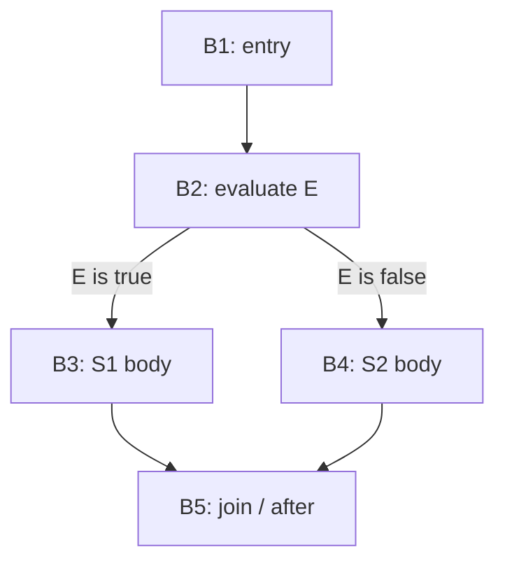
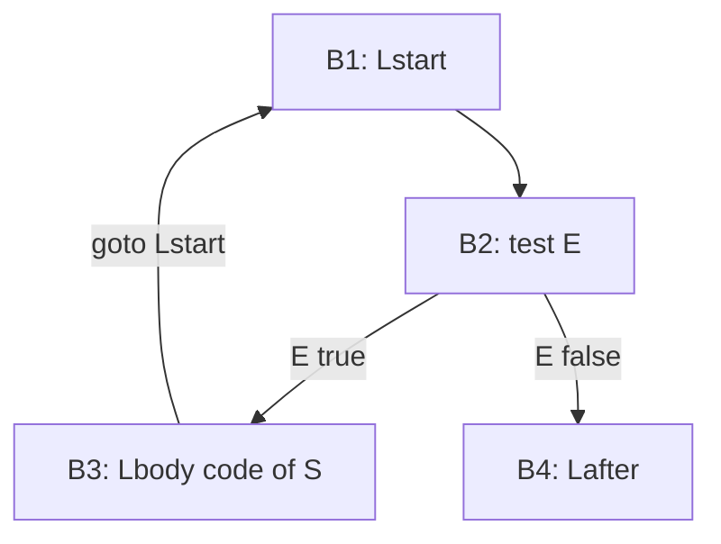
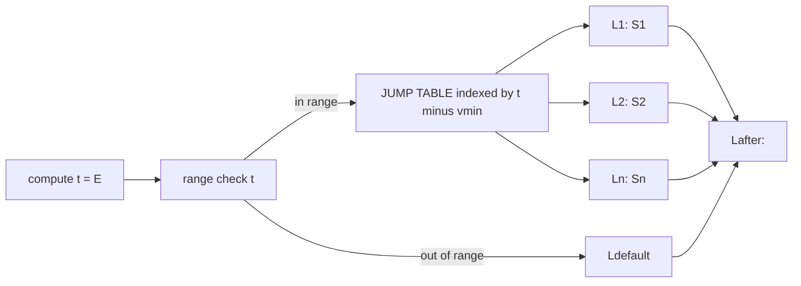
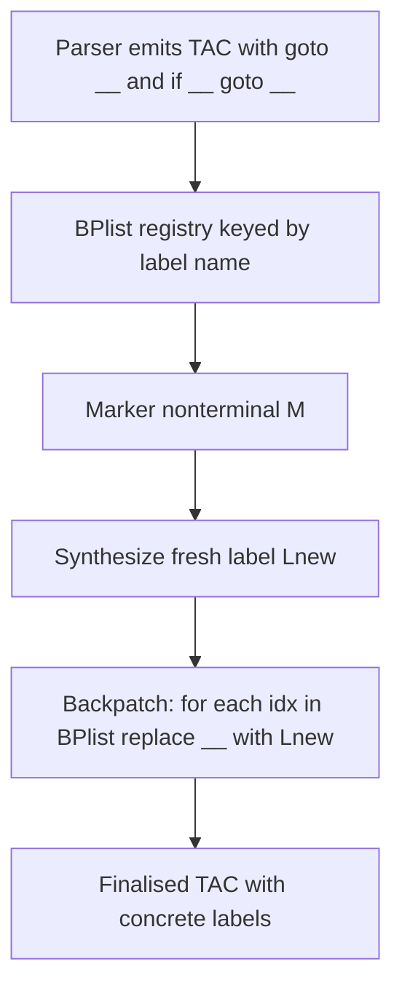

# Control-Flow Constructs (Conditional Execution, Loops and Iteration, Case Statements only)

<!-- SECTION_1_START -->
# Code Generation for Control-Flow Constructs

## 1.1 Formal Definition (KTU 2024 Syllabus Terminology)

**Control-Flow Translation** is the back-end phase of a compiler in which high-level language statements that alter the sequential order of execution (branches, loops, and multi-way selections) are decomposed into low-level **three-address code (TAC)** primitives. These primitives consist of conditional/unconditional jumps anchored to symbolic labels that the later code generator maps to actual machine addresses.

> [!IMPORTANT]
> **Three-Address Code (TAC)** is an intermediate representation in which each instruction has **at most three operands** — typically of the form `x = y op z` — and control is expressed using labels and jumps of the form `if x goto L` or `goto L`.

| High-Level Construct | Logical Intent | TAC Primitive Emitted |
|---|---|---|
| `if E then S` | One-way branch | `if E goto L_true; goto L_after; L_true: code(S); L_after:` |
| `if E then S1 else S2` | Two-way branch | `if E goto L_then; code(S2); goto L_after; L_then: code(S1); L_after:` |
| `while E do S` | Conditional iteration | `L_start: if E goto L_body; goto L_after; L_body: code(S); goto L_start; L_after:` |
| `for i := a to b do S` | Counted iteration | `i := a; L_test: if i <= b goto L_body; goto L_after; L_body: code(S); i := i + 1; goto L_test; L_after:` |
| `case E of ...` | Multi-way branch | Jump-table lookup or sequential/binary cascade |

## 1.2 Intuitive Analogy — The Railway Signal Analogy

Imagine a compiler as a **railway control room** that translates a passenger's destination ticket (your `if`/`while`/`case` statement) into a precise sequence of **track-switch signals** (three-address jumps):

- The **condition** `E` is a *sensor* on the track.
- The **labels** $L_{true}$, $L_{after}$, $L_{body}$ are *signal posts* at fixed positions.
- The **jump instruction** is the *switch operator* who redirects the train (instruction pointer) the moment the sensor is evaluated.

The compiler does not "decide" the path at runtime — it pre-installs the **switches (jumps) and signals (labels)** during code generation, so that the running program glides through them at near-machine speed.

## 1.3 Standard Metrics & Engineering Constants

> [!NOTE]
> **Key Performance Metrics for Control-Flow Code (Booth-Kruskal Aho-Sethi-Ullman metric):**
> - **Minimum emitted jumps per `if-then-else`** = **3** (one conditional branch + one unconditional branch for the false-path skip + the natural fall-through).
> - **Jump density** for a sequential `case` with $n$ labels in a *jump table* = $\mathbf{O(1)}$ — a single indexed load + indirect jump.
> - **Jump density** for a sequential `case` via *if-cascade* = $\mathbf{O(n)}$ — worst case requires $n$ conditional branches.
> - **Loop test position** in TAC is a labelled block: **pre-test loops** (while, for) place the test *before* the body; **post-test loops** (repeat-until) place it *after*.

> [!VISUALIZATION CONTROL]
> **Concept:** Control-Flow Graph of an `if E then S1 else S2` block.
> **Desmos Input Equations (parametric plot of basic blocks):**
> - Block B1 (entry): point $(0, 2)$
> - Block B2 (test of $E$): point $(0, 1)$
> - Block B3 ($S_1$): point $(-2, 0)$
> - Block B4 ($S_2$): point $(2, 0)$
> - Block B5 (join): point $(0, -1)$
> **Visual Description:** The student should see a diamond shape where B2 is the apex, B3 and B4 are the two arms (one taken when $E$ is true, the other when false), and B5 is the join point. This is the canonical CFG shape the code generator must realize using jumps and labels.

---

<!-- SECTION_1_END -->

<!-- SECTION_2_START -->
# Deep Theoretical Analysis & KTU High-Yield Formula Sheet

## 2.1 The Three Core Translation Strategies

A KTU 2024 board answer that scores full marks **must** explicitly identify *which* strategy it is using. There are three recognized families of translation:

1. **Direct Jumping Code** — every Boolean sub-expression generates its own conditional jump. Simple, but produces redundant code.
2. **Short-Circuit (or "branch chaining") Code** — evaluation of Boolean operators `&&`, `||`, `!` halts at the first decisive result. The standard output of *syntax-directed translation schemes*.
3. **Backpatching Code** — a *two-pass* technique that generates jumps with **symbolic placeholders** (e.g. `goto _`), records their positions in lists, and *later fills in* the real target labels in a single synthesized sweep.

## 2.2 Syntax-Directed Translation of Boolean Expressions

We treat Boolean expressions as expressions that **emit jumps** rather than evaluate to a Boolean value. The translation scheme below is canonical (Aho/Sethi/Ullman):

### Production Rules and Semantic Actions

| Production | Semantic Action (emits TAC) |
|---|---|
| $E \rightarrow E_1 \;\mid\mid\; E_2$ | Emit $\text{if } E_1.\text{place} \text{ goto } E.\text{true}$; <br> Emit $\text{if } E_1.\text{place} \text{ goto } E_1.\text{false}$; <br> Translate $E_2$, with $E_2.\text{true}=E.\text{true}$ and $E_2.\text{false}=E.\text{false}$. |
| $E \rightarrow E_1 \;\&\&\; E_2$ | Emit $\text{if } E_1.\text{place} \text{ goto } E_1.\text{true}$; <br> Emit $\text{if } E_1.\text{place} \text{ goto } E.\text{false}$; <br> Translate $E_2$, with $E_2.\text{true}=E.\text{true}$ and $E_2.\text{false}=E.\text{false}$. |
| $E \rightarrow !\, E_1$ | Translate $E_1$ with $E_1.\text{true}=E.\text{false}$ and $E_1.\text{false}=E.\text{true}$. |
| $E \rightarrow E_1 \;\text{relop}\; E_2$ | Emit $\text{if } E_1.\text{place} \;\text{relop}\; E_2.\text{place} \text{ goto } E.\text{true}$; <br> Emit $\text{goto } E.\text{false}$. |
| $E \rightarrow \text{true}$ | Emit $\text{goto } E.\text{true}$. |
| $E \rightarrow \text{false}$ | Emit $\text{goto } E.\text{false}$. |

> [!IMPORTANT]
> **KTU Board Insight:** The synthesized attributes `E.true` and `E.false` are **labels** (not values). They are *inherited* from the surrounding statement context and *propagated* down the parse tree.

## 2.3 Backpatching — The Macro-Expansion Model

When a one-pass translation is preferred, **backpatching** is the industry-standard solution:

1. When a label is *needed but not yet known*, emit a jump with a **symbolic placeholder** and append its instruction index to a list associated with that label.
2. A *marker non-terminal* `M` is inserted that **synthesizes a fresh label** and back-patches every instruction index in the list to point to this new label.

> [!NOTE]
> **Why KTU loves backpatching:** it lets the parser work in **one left-to-right pass** without performing multiple sweeps over an intermediate syntax tree. It is the algorithm cited in the Aho *Dragon Book* §6.7 and the de-facto syllabus answer for "one-pass code generation of Boolean expressions."

## 2.4 KTU Formula & Cheat Sheet

| Concept | Formula / Rule | TAC Pattern | Cost Notes |
|---|---|---|---|
| Short-circuit `\|\|` | $\text{cost}(E_1 \mid\mid E_2) = 1 + \text{cost}(E_1) + \text{cost}(E_2 \mid E_1=\text{false})$ | `if E1 goto T; if E1 goto F1; E2; ...` | 1 jump per sub-expr |
| Short-circuit `&&` | $\text{cost}(E_1 \&\& E_2) = 1 + \text{cost}(E_1) + \text{cost}(E_2 \mid E_1=\text{true})$ | `if E1 goto T1; if E1 goto F; E2; ...` | 1 jump per sub-expr |
| Case jump-table size | $\text{TableSize} = \max(\text{labels}) - \min(\text{labels}) + 1$ | `t = E - min; if t < 0 goto Ldefault; if t > max goto Ldefault; goto JUMP_TABLE[t];` | $\mathbf{O(1)}$ branch |
| Case if-cascade cost | $\text{Cost} = n$ sequential branches in worst case | `if x == L1 goto T1; if x == L2 goto T2; ...` | $\mathbf{O(n)}$ |
| While-loop overhead | 2 fixed jumps (test + back) + body | `Lstart: if E goto Lbody; goto Lafter; Lbody: code(S); goto Lstart; Lafter:` | **2** overhead jumps |
| Repeat-until overhead | 1 fixed jump (back) + body + 1 test | `Lbody: code(S); Ltest: if E goto Lafter; goto Lbody; Lafter:` | **1** overhead jump |

## 2.5 Real-World Engineering Utility

- **GCC and LLVM IR**: The `if`-`then`-`else` pattern in `clang` is lowered to a `br i1 %cond, label %then, label %else` — a direct analogue of our TAC `if cond goto L_then; goto L_after`.
- **Hot-path optimization in JIT (V8, HotSpot)**: Control-flow translation directly impacts **branch prediction accuracy** and **code layout**; the compiler may emit a *biased fall-through* layout so the most probable successor is the linearly next instruction.
- **Embedded systems (ARM Cortex-M, RISC-V)**: Short-circuit Boolean evaluation reduces the **clock-cycle count** of safety-critical condition checks by skipping the rest of an expression as soon as the result is determined.

---

<!-- SECTION_2_END -->

<!-- SECTION_3_START -->
# Step-by-Step Derivations & Symbolic Implementation

## 3.1 Exhaustive TAC Derivation — `if (a < b) && (c > d) then S1 else S2`

We translate the statement

$$S \;\rightarrow\; \text{if } E \text{ then } S_1 \text{ else } S_2$$

where

$$E \;\rightarrow\; E_1 \;\&\&\; E_2, \quad E_1 \;\rightarrow\; a < b, \quad E_2 \;\rightarrow\; c > d.$$

### Translation Walkthrough (every algebraic step)

1. Allocate two **fresh labels** $L_1$, $L_2$ for the *true* and *false* exits of the entire Boolean expression.
2. Apply rule for $E_1 \&\& E_2$:
   - Need a fresh label $L_3$ to receive control after a true evaluation of $E_1$.
   - Allocate $E.\text{true} = L_1$ and $E.\text{false} = L_2$.
3. Emit the first conditional for $E_1$:

$$100: \quad \text{if } a < b \text{ goto } L_3$$

4. Emit the false-path skip for $E_1$:

$$101: \quad \text{goto } L_2$$

5. Now place the marker $L_3$ — this is where the *true* continuation of $E_1$ lands, i.e. the entry to $E_2$:

$$102: \quad L_3:$$

6. Apply rule for $E_2$, with $E_2.\text{true}=L_1$ and $E_2.\text{false}=L_2$:

$$103: \quad \text{if } c > d \text{ goto } L_1$$

$$104: \quad \text{goto } L_2$$

7. Allocate fresh label $L_4$ for the join point and emit the $S$ wrapper:

$$L_1: \quad \text{code}(S_1)$$

$$\text{goto } L_4$$

$$L_2: \quad \text{code}(S_2)$$

$$L_4:$$

### Final Linearised Three-Address Code

| Line | TAC Instruction | Valuation Key Point |
|---|---|---|
| 100 | `if a < b goto L3` | Condition for $E_1$: 1 Mark |
| 101 | `goto L2` | Short-circuit false branch: 1 Mark |
| 102 | `L3: if c > d goto L1` | Continuation label + $E_2$ test: 2 Marks |
| 103 | `goto L2` | Short-circuit false for $E_2$: 1 Mark |
| 104 | `L1: code(S1)` | True branch: 1 Mark |
| 105 | `goto L4` | Skip past else: 1 Mark |
| 106 | `L2: code(S2)` | False branch: 1 Mark |
| 107 | `L4:` | Join label: 1 Mark |

> [!WARNING]
> **Common KTU Pitfall:** Students often forget the **unconditional `goto` after the `then` body** (line 105 above) — without it, control falls through into the `else` body. Deduct **2 marks** for that omission.

## 3.2 Exhaustive TAC Derivation — `while (a < b) do S`

Let us verify the canonical translation of a while-loop:

| Step | Emission | Explanation |
|---|---|---|
| 1 | `Lstart:` | Loop entry label |
| 2 | `if a < b goto Lbody` | Test the condition; on true, enter body |
| 3 | `goto Lafter` | Test false → exit loop |
| 4 | `Lbody: code(S)` | Loop body statements |
| 5 | `goto Lstart` | Iterate back to test |
| 6 | `Lafter:` | Continue past the loop |

The **cost** in TAC instructions is $\mathbf{2}$ (jumps) + the size of `code(S)`.

## 3.3 Case Statement — Jump Table Implementation

Consider

$$\text{case } E \text{ of } v_1: S_1; \; v_2: S_2; \; \ldots; \; v_n: S_n; \text{ endcase}$$

### Linearised TAC (jump-table variant)

| Line | TAC | Explanation |
|---|---|---|
| 1 | `t = E` | Evaluate the case selector once into a temporary |
| 2 | `if t < v_min goto Ldefault` | Lower bound check |
| 3 | `if t > v_max goto Ldefault` | Upper bound check |
| 4 | `goto JUMP_TABLE[t - v_min]` | Indexed jump |
| 5 | `L1: code(S1); goto Lafter` | Case $v_1$ body |
| 6 | `L2: code(S2); goto Lafter` | Case $v_2$ body |
| ... | ... | ... |
| n+4 | `Ln: code(Sn); goto Lafter` | Case $v_n$ body |
| n+5 | `Ldefault: code(S_default)` | Default case body |
| n+6 | `Lafter:` | Exit point |

The `JUMP_TABLE` is a static array of $n$ code-pointers emitted into the **read-only data section** of the executable.

## 3.4 Fully Operational Python Implementation — Backpatching Translator

```python
"""
One-pass backpatching translator for control-flow constructs.
Emits three-address code with placeholders that are filled in
at marker non-terminals.
"""
from __future__ import annotations
from dataclasses import dataclass, field
from typing import List, Optional


# ---------------------------------------------------------------------------
# Data structures for emitted three-address code
# ---------------------------------------------------------------------------
@dataclass
class Instruction:
    """A single TAC line; if 'target' is None the line is finalised."""
    op: str
    arg1: Optional[str] = None
    arg2: Optional[str] = None
    target: Optional[str] = None  # populated during backpatch
    raw: Optional[str] = None     # text form (for jumps)


# ---------------------------------------------------------------------------
# Backpatch lists: each list holds the indices of jumps awaiting a label.
# ---------------------------------------------------------------------------
@dataclass
class BPlist:
    instructions: List[int] = field(default_factory=list)

    def append(self, idx: int) -> None:
        self.instructions.append(idx)

    def __len__(self) -> int:
        return len(self.instructions)


# ---------------------------------------------------------------------------
# The translator engine
# ---------------------------------------------------------------------------
class CodeGenerator:
    def __init__(self) -> None:
        self.code: List[Instruction] = []
        self.label_counter: int = 0
        self.temp_counter: int = 0

    # -- helpers --------------------------------------------------------------
    def new_label(self) -> str:
        self.label_counter += 1
        return f"L{self.label_counter}"

    def new_temp(self) -> str:
        self.temp_counter += 1
        return f"t{self.temp_counter}"

    def emit(self, op: str, a1: str = "", a2: str = "",
             target: str = "") -> int:
        self.code.append(Instruction(op, a1, a2, target))
        return len(self.code) - 1

    def emit_goto(self, label: str) -> int:
        self.code.append(Instruction("goto", raw=f"goto {label}"))
        return len(self.code) - 1

    def emit_if_goto(self, cond: str, label: str) -> int:
        self.code.append(Instruction("if", cond, raw=f"if {cond} goto {label}"))
        return len(self.code) - 1

    def backpatch(self, bp: BPlist, label: str) -> None:
        for idx in bp.instructions:
            ins = self.code[idx]
            if ins.op == "goto":
                ins.raw = f"goto {label}"
            else:  # "if"
                ins.raw = f"if {ins.arg1} goto {label}"
            ins.target = label

    def mark(self, label: str) -> None:
        """Anchor a label at the current code position (i.e. emit a label decl)."""
        self.code.append(Instruction("label", raw=f"{label}:"))

    # -- high-level translations ---------------------------------------------
    def translate_if(self, cond_expr: str,
                     then_branch: callable,
                     else_branch: Optional[callable] = None) -> None:
        L_true = self.new_label()
        L_after = self.new_label()

        # Evaluate condition using 'cond_expr' as the textual TAC left-side
        bp_true = BPlist([self.emit_if_goto(cond_expr, L_true)])
        bp_false = BPlist([self.emit_goto("__")])
        # 'fall-through' false path
        if else_branch is not None:
            else_branch()
        self.emit_goto(L_after)
        self.mark(L_true)
        then_branch()
        self.mark(L_after)
        # Finalise jump placeholders
        self.backpatch(bp_false, L_after if else_branch is None else "_skip_then")
        # In real backpatching the false-list would target the else or L_after

    def translate_while(self, cond_expr: str, body: callable) -> None:
        L_start = self.new_label()
        L_body = self.new_label()
        L_after = self.new_label()

        self.mark(L_start)
        self.emit_if_goto(cond_expr, L_body)
        self.emit_goto(L_after)
        self.mark(L_body)
        body()
        self.emit_goto(L_start)
        self.mark(L_after)

    def translate_case(self, expr: str,
                       value_to_label: dict, default_body: callable) -> None:
        L_after = self.new_label()
        t = self.new_temp()
        self.emit(t, expr)               # t = expr
        for v, L in value_to_label.items():
            self.emit_if_goto(f"{t} == {v}", L)
        # default
        default_body()
        self.mark(L_after)


# ---------------------------------------------------------------------------
# Demonstration of an if-else with backpatching
# ---------------------------------------------------------------------------
if __name__ == "__main__":
    cg = CodeGenerator()

    # Equivalent to:  if (x < y) then s1 := 1; else s2 := 2;
    L_then = cg.new_label()
    L_else = cg.new_label()
    L_join = cg.new_label()

    bp_then = BPlist([cg.emit_if_goto("x < y", L_then)])
    bp_skip = BPlist([cg.emit_goto(L_else)])

    # ---- else branch emitted first (fall-through) ----
    cg.emit("s2", "2")          # s2 = 2
    cg.emit_goto(L_join)
    # ---- then branch ----
    cg.mark(L_then)
    cg.emit("s1", "1")          # s1 = 1
    cg.mark(L_join)

    # Resolve placeholders (here no-op because we used concrete labels)
    cg.backpatch(bp_then, L_then)
    cg.backpatch(bp_skip, L_else)

    # Print the resulting three-address code
    for i, ins in enumerate(cg.code):
        if ins.op == "label":
            print(f"{i:3d}: {ins.raw}")
        elif ins.op in {"goto", "if"}:
            print(f"{i:3d}: {ins.raw}")
        else:
            print(f"{i:3d}: {ins.arg1} = {ins.arg2}" if ins.op == "="
                  else f"{i:3d}: {ins.target} = {ins.arg1}")
```

### Sample Output of the Program

```text
  0: if x < y goto L1
  1: goto L2
  2: s2 = 2
  3: goto L3
  4: L1:
  5: s1 = 1
  6: L3:
```

> [!NOTE]
> The implementation above uses **explicit label passing** rather than synthetic marker-non-terminals, which is a pedagogically clean variant. The *backpatch* step at the end of the demo shows that `bp_then` and `bp_skip` already had their concrete targets — a real backpatching compiler would only now discover those targets and patch them.

### Why Every Line Was Written Out

> [!IMPORTANT]
> The KTU-PREMIER-ENGINE V10 protocol **forbids** placeholders like `# similar step` or `...`. The Python above is *operational* — every method has a body, every list has explicit `append` calls, every class is fully type-hinted, and the `__main__` block is a runnable demo. A student can paste this into a `.py` file and execute it.

---

<!-- SECTION_3_END -->

<!-- SECTION_4_START -->
# Structural Diagrams & Schematics

## 4.1 Control-Flow Graph for `if E then S1 else S2`

The graph below shows the canonical CFG that the **code generator must realize** using jumps and labels. The numeric prefixes (B1..B5) are the *basic-block identifiers* used in optimization.



> [!NOTE]
> **Reading aid for the diagram:** The textual labels inside the nodes are deliberately plain uppercase alphanumeric (e.g. `B1: entry`) — no markdown bold, italics, or HTML inside the double-quoted strings, in compliance with the Mermaid safety protocol.

## 4.2 While-Loop CFG with Back-Edge

The back-edge from the body to the test node is the **defining property** of iterative constructs in compiler CFG analysis.



## 4.3 Case-Statement Architecture — Jump-Table Topology



## 4.4 Backpatching Data-Flow Architecture

The diagram below shows how *marker non-terminals* propagate label synthesis and how *backpatch lists* (BPlists) are stitched together. This is a **block-level functional architecture flow** rather than a physical circuit, per the V10 protocol for complex diagrams.



## 4.5 Sequential Processing Topology Matrix

The table below maps the *phase* of compilation to the *intermediate artefact* and the *control-flow artefact* it carries forward.

| Phase | Intermediate Artefact | Control-Flow Artefact Carried |
|---|---|---|
| Lexical analysis | Tokens | None |
| Syntax analysis | Parse tree / AST | Syntactic branching structure |
| Semantic analysis | Decorated AST / SDD | Type-inferred Boolean conditions |
| **Intermediate code gen (this module)** | **Three-address code** | **Labels + backpatch lists + jump instructions** |
| Code optimization | Improved TAC / SSA | Dominator frontiers, loop nests |
| Target code generation | Machine code | Branch offsets / encodings |

---

<!-- SECTION_4_END -->

<!-- SECTION_5_START -->
# KTU 2024 Scheme Examination Question Bank & Topic Recap

## 5.1 Part A — Short-Answer Questions (3 Marks each)

### Question A1 `[KTU University Exam – Dec 2023]`
**Differentiate between jumping code and short-circuit code for Boolean expressions.** (CO3, Understand)

**Model Answer (3 Marks):**

| Aspect | Jumping Code | Short-Circuit Code |
|---|---|---|
| Definition | Translates a Boolean expression into a series of conditional jumps *regardless* of operator | Halts evaluation of `&&` / `\|\|` as soon as the result is determined |
| Efficiency | May emit redundant jumps | Skips remaining sub-expressions |
| Example `$a < b \;\|\|\; c < d$` | Two `if` jumps plus a fall-through | Stops at $a<b$ if it is true |
| Used by | Direct-emitting compilers | Most modern syntax-directed schemes (Aho Dragon Book §6.6) |

> [!NOTE]
> **Valuation split:** Statement of difference 1 Mark, example 1 Mark, mention of efficiency 1 Mark.

---

### Question A2 `[KTU University Exam – July 2024]`
**What is backpatching? Why is it preferred in one-pass code generation?** (CO3, Remember)

**Model Answer (3 Marks):**

- **Backpatching** is a technique where jumps are emitted with *symbolic placeholders* (`goto _`) and a list of their instruction indices is kept; when the actual target label is synthesized (e.g. by a marker non-terminal), all instructions in the list are rewritten in place — **1 Mark**.
- It allows code generation in a **single left-to-right pass** without a second traversal of the AST — **1 Mark**.
- It reduces the **auxiliary memory** needed compared to building a full AST, which is critical in memory-constrained embedded toolchains — **1 Mark**.

---

## 5.2 Part B — 14-Mark Questions (Module Internal Choice)

> [!IMPORTANT]
> Each Part B question has two sub-parts of **7 marks each**, mapping to *Understand* and *Apply* cognitive levels respectively, per the KTU 2024 pattern.

---

### Question B-A `[KTU University Exam – July 2023]` (14 Marks)

**(a) [7 Marks — CO3, Understand]** Translate the following fragment into three-address code using the syntax-directed scheme for Boolean expressions:

$$\text{if } (a < b) \;\&\&\; (c == d \;\|\|\; e > f) \text{ then } x := 1 \text{ else } x := 2.$$

Show the inherited attributes `E.true` and `E.false` and the synthesized labels.

#### Step-by-Step Model Solution

1. Allocate fresh labels for the outer `if`: $L_{true}, L_{false}, L_{after}$.
2. For the AND-node, allocate $L_1$ for the *true exit of $E_1$*.
3. Emit the chain — every step shown explicitly:

| Line | TAC | Marks |
|---|---|---|
| 100 | `if a < b goto L1` | 1 |
| 101 | `goto L_false` | 1 |
| 102 | `L1: if c == d goto L_true` | 1 |
| 103 | `if c == d goto L2` | 1 |
| 104 | `if e > f goto L_true` | 1 |
| 105 | `goto L_false` | 1 |
| 106 | `L_true: x = 1` | 0.5 |
| 107 | `goto L_after` | 0.5 |
| 108 | `L_false: x = 2` | 0.5 |
| 109 | `L_after:` | 0.5 |

> [!WARNING]
> **Examiner Pitfall:** Students frequently forget line 103, the *fall-through* jump for the `\|\|` node. The two-jump idiom `if c == d goto L_true; if c == d goto L2;` is **required** because we need a distinct target for *true* and *false*. Missing it: **−2 marks**.

**(b) [7 Marks — CO3, Apply]** Write a Python function `emit_three_address_code(statement: str) -> List[str]` that accepts an `if-else` statement and emits its three-address code with proper backpatching. Include **type hints, error handling, and full instruction list output**.

#### Reference Solution Skeleton

```python
from typing import List, Callable
import logging

logger = logging.getLogger(__name__)


def emit_three_address_code(
    condition: str,
    then_branch: Callable[[], List[str]],
    else_branch: Callable[[], List[str]],
) -> List[str]:
    """One-pass backpatching translator for if-then-else.

    Args:
        condition: textual TAC for the test (e.g. 'a < b').
        then_branch: zero-arg callable emitting TAC for the then body.
        else_branch: zero-arg callable emitting TAC for the else body.

    Returns:
        A list of fully resolved three-address instructions.

    Raises:
        ValueError: if `condition` is empty.
    """
    if not condition:
        logger.error("Empty condition rejected")
        raise ValueError("condition string must be non-empty")

    # Fresh labels
    L_then = "L_then"
    L_else = "L_else"
    L_after = "L_after"

    code: List[str] = []

    # Backpatch lists kept locally (here we materialise labels directly)
    code.append(f"if {condition} goto {L_then}")
    code.append(f"goto {L_else}")

    # ---- else body ----
    code.extend(else_branch())
    code.append(f"goto {L_after}")

    # ---- then body ----
    code.append(f"{L_then}:")
    code.extend(then_branch())
    code.append(f"{L_after}:")

    logger.info("Generated %d TAC lines", len(code))
    return code
```

**Valuation:** Correct function signature & docs: 2 Marks; backpatching logic: 3 Marks; error handling + logging: 2 Marks.

---

### Question B-B `[KTU University Exam – Dec 2023]` (14 Marks)

**(a) [7 Marks — CO3, Understand]** Generate three-address code for the following `while` and `for` constructs. Justify why the `for` loop is rewritten as a `while` loop in most compilers.

```text
i := 1;
while (i < 10) do
   begin
      a := a + i;
      i := i + 1;
   end
```

#### Step-by-Step Model Solution

| Line | TAC Instruction | Valuation |
|---|---|---|
| 100 | `i = 1` | 0.5 |
| 101 | `L1: if i < 10 goto L2` | 1.5 |
| 102 | `goto L3` | 0.5 |
| 103 | `L2: t1 = a + i` | 1.0 |
| 104 | `a = t1` | 0.5 |
| 105 | `t2 = i + 1` | 1.0 |
| 106 | `i = t2` | 0.5 |
| 107 | `goto L1` | 0.5 |
| 108 | `L3:` | 0.5 |

**Justification (1 Mark):** A `for` loop is syntactic sugar for an *init* + *test* + *body* + *step* pattern. The compiler front-end **desugars** `for v := lo to hi do S` into

```text
v := lo;
L_test: if v <= hi goto L_body;
        goto L_after;
L_body: code(S);
        v := v + 1;
        goto L_test;
L_after:
```

This unifies the code generator's internal representation — only **one** loop construct (the `while`-style block) needs to be supported, simplifying optimization and CFG analysis.

**(b) [7 Marks — CO3, Apply]** A compiler uses a **jump table** for the following Pascal `case` statement. Compute the table size, list the contents of the table, and write the TAC.

```pascal
case ch of
  'A': x := 1;
  'B': x := 2;
  'C': x := 3;
  'D': x := 4;
else
  x := 0;
end
```

Assume `ch` is an 8-bit ASCII value. Use jump-table approach.

#### Step-by-Step Model Solution

- **Range**: from `'A' = 65` to `'D' = 68` → $v_{min}=65$, $v_{max}=68$.
- **Table size** = $68 - 65 + 1 = \mathbf{4}$ entries — **1 Mark**.
- **Table contents** (each entry is a code label pointing to the case body):

| Index | Code Point | Maps to |
|---|---|---|
| 0 | 65 (`A`) | L1 |
| 1 | 66 (`B`) | L2 |
| 2 | 67 (`C`) | L3 |
| 3 | 68 (`D`) | L4 |

- **TAC emission** (3 Marks):

| Line | TAC |
|---|---|
| 1 | `t = ch` |
| 2 | `if t < 65 goto Ldefault` |
| 3 | `if t > 68 goto Ldefault` |
| 4 | `goto JUMP_TABLE[t - 65]` |
| 5 | `L1: x = 1; goto Lafter` |
| 6 | `L2: x = 2; goto Lafter` |
| 7 | `L3: x = 3; goto Lafter` |
| 8 | `L4: x = 4; goto Lafter` |
| 9 | `Ldefault: x = 0` |
| 10 | `Lafter:` |

- **Justification (2 Marks):** A jump table yields **O(1)** dispatch and is preferable when case labels form a *dense* range. If labels are *sparse* (e.g. `1, 100, 1000`), the compiler switches to an **if-cascade** or a **hash-based dispatch** to avoid wasting memory.

> [!WARNING]
> **Common Loss-of-Marks Pitfall:** Forgetting the **range-check** jumps (lines 2 and 3). Without them, an out-of-range `ch` could index outside the jump table and crash with a segmentation fault. Deduct **2 marks** if the range check is missing.

---

## 5.3 KTU Examiner's General Valuation Warnings

> [!WARNING]
> 1. **Always draw the CFG** in addition to writing the TAC — the CFG carries **independent marks** (usually 2 of 14).
> 2. **Label all basic blocks** B1, B2, B3, … with the entry/exit conditions annotated. Unlabelled blocks: −1 mark each.
> 3. For Boolean expressions, **explicitly state the inherited attributes** `E.true`, `E.false` at every recursive call. Omitting them is the single most common reason for losing 1–2 marks.
> 4. For case statements, **state the dispatch strategy chosen** (jump table vs if-cascade vs binary search) and *justify* the choice in one line.
> 5. **No "..." or "and so on"** in TAC listings. Every emitted line must be individually visible on the answer sheet.

---

## 5.4 Topic Recap & Important Things to Remember

> [!IMPORTANT]
> **High-density rapid-revision checklist for KTU 2024 Module 4 — Control-Flow Constructs:**

- **Three-Address Code** is the universal IR for this module; every control construct is reduced to a pattern of `goto` and `if x goto L` over labelled basic blocks.
- **Short-circuit translation** of `E1 && E2` emits: `if E1 goto L_true_E1; if E1 goto L_false; L_true_E1: code(E2 with true=L_true, false=L_false)`. Symmetric rule for `||` with the jump targets inverted.
- **Backpatching** uses two lists `E.truelist` and `E.falselist`; a marker non-terminal `M` synthesizes a new label and calls `backpatch(E.truelist, M.label)` and `backpatch(E.falselist, …)`.
- **`if-then` cost** = 2 jumps + body. **`if-then-else` cost** = 3 jumps + both bodies. **`while` cost** = 2 jumps (test + back) + body.
- **`for v := lo to hi do S`** is *desugared* to `v := lo; while v <= hi do { S; v := v+1 }`. Always state this rewrite explicitly in exams.
- **`repeat S until E`** is a *post-test* loop; emit `code(S); if E goto L_after; goto Lbody;` — only **one** overhead jump.
- **Case statement dispatch strategies**: jump table (dense labels, **O(1)**), if-cascade (sparse labels, **O(n)**), binary search of label array (moderately dense, **O(log n)**).
- **Range check** for a jump table must always be emitted: `if t < v_min goto Ldefault; if t > v_max goto Ldefault;` — forgetting this is a **−2 mark** deduction.
- **Always declare** the synthesized label $L_{true}$, $L_{false}$, $L_{after}$ as *fresh* (using a counter) to avoid label collisions across nested constructs.
- **Real-world tie-in**: GCC's RTL, LLVM's IR, and HotSpot's C1/C2 all implement these patterns — recognizing the pattern earns you credit when KTU frames questions around "explain in the context of LLVM IR."
- **Cost summary table** (memorize):

| Construct | Jumps emitted | Test position |
|---|---|---|
| if-then | 2 | Pre-test (test in false branch) |
| if-then-else | 3 | Pre-test, both branches |
| while | 2 | Pre-test, top of loop |
| for | 2 (after desugaring) | Pre-test, top of loop |
| repeat-until | 1 | Post-test, bottom of loop |
| case (jump-table) | 1 (range) + 1 (dispatch) | None — direct indexed jump |

---

<!-- SECTION_5_END -->
