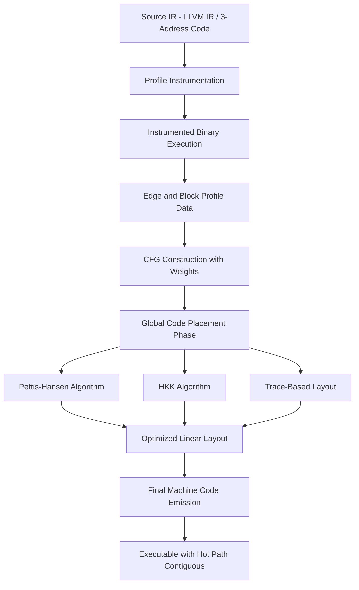
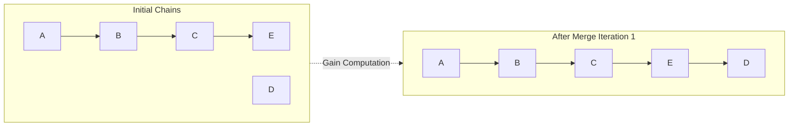
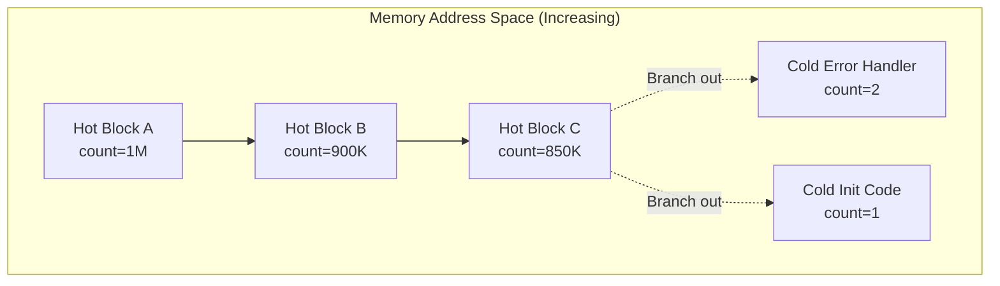
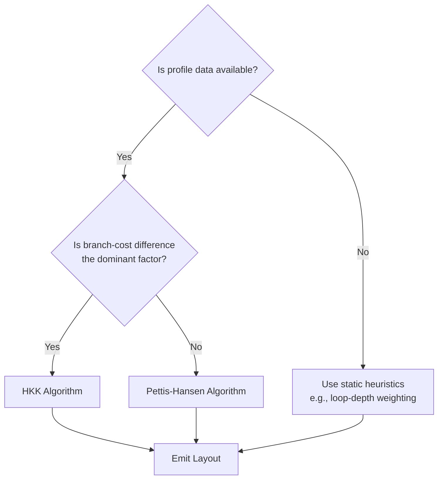

# Global Code Placement

<!-- SECTION_1_START -->

# Global Code Placement

## 1.1 Formal Definition (KTU 2024 Syllabus Terminology)

**Global Code Placement** is a compiler optimization technique that determines the optimal *spatial* arrangement (linear ordering) of machine instructions, basic blocks, and procedures within a program's executable image to maximize runtime performance.

Unlike **local scheduling** (which reorders instructions *within* a single basic block) or **global scheduling** (which moves instructions *across* basic block boundaries), global code placement focuses purely on the **final layout of code in memory** after all other optimizations are complete.

The goal is to:
1. **Minimize the number of taken branches** (i.e., maximize fall-through execution paths).
2. **Improve instruction cache (I-cache) locality** by co-locating frequently executed code.
3. **Reduce branch misprediction penalties** by aligning predicted-taken paths contiguously.
4. **Decrease instruction TLB (Translation Lookaside Buffer) misses**.

> [!IMPORTANT]
> **KTU 2024 Definition Hook:** Global code placement operates on the *Control Flow Graph (CFG)* of a procedure or whole program, and uses **edge profiles** (execution frequencies) to compute a layout that minimizes a weighted cost function over the CFG edges.

---

## 1.2 Conceptual Analogy / Intuition

Imagine a **supermarket layout** 🛒:
- 10,000 customers visit daily. 80% of them go directly: *Entrance → Fruits → Bread → Milk → Checkout*.
- A poor layout (bad code placement) forces them to walk through frozen foods, electronics, and clothing even though nobody on the hot path needs them.
- A good layout places Fruits, Bread, and Milk **adjacent and in order** (contiguous fall-through path), and parks frozen foods, electronics, and clothing on **cold isles** rarely visited.

**Global Code Placement does the same with code:**
- The "hot path" of the program (most frequently executed blocks) is laid out **linearly and contiguously** in memory.
- "Cold code" (error handlers, initialization, rarely taken branches) is placed **out of the way**, often in separate cache lines or even separate sections.

### Another Analogy: City Traffic Engineering 🚦
- A traffic engineer studies traffic flow data (profile information).
- She places main **arterial roads in a straight line** (hot path), and **side-streets branch off only when needed** (cold edges).
- Result: smoother traffic (pipeline) and fewer traffic jams (cache misses).

---

## 1.3 Standard Metrics & Profile Data Used

The compiler uses **profile data** collected from instrumented runs:

| Metric | Symbol | Description |
| :--- | :--- | :--- |
| Block execution count | $\text{count}(B)$ | How many times basic block $B$ is executed. |
| Edge probability | $p(e)$ | Probability of taking CFG edge $e$. |
| Fall-through rate | $f$ | Fraction of edges taken via fall-through. |
| Branch misprediction cost | $c_m$ | Cycles lost on misprediction. |
| I-cache line size | $L$ | Bytes per cache line (typically **64 bytes**). |

These metrics are typically **empirical** (collected via instrumentation) and stored in a **profile database** that the back-end reads during code generation.

> [!NOTE]
> **Syllabus Highlight:** The KTU module emphasizes two classical layout algorithms: **(i) the Pettis–Hansen algorithm** and **(ii) the Hashemi–Klenke–Kalyanaraman (HKK) algorithm**. Both operate on profiled CFGs.

---

## 1.4 Geometric / Visualization Hook

> [!VISUALIZATION CONTROL]
> **Concept:** Hot-path vs. cold-path code placement in memory.
>
> **GeoGebra / Desmos Input (conceptual):**
> * Plot points $(i, \text{count}(B_i))$ where $i$ is the block index in layout order.
> * Overlay a piecewise-constant function: $C(x) = \sum_{B \text{ on line } x} \text{count}(B)$.
>
> **Visual Description:** A "hot valley" should be visible in the center of the x-axis (where most blocks are), with spikes at the edges corresponding to error handlers and cold initialization code. After good global placement, the spikes migrate to the extremes, leaving a flat, hot center.

---

<!-- SECTION_1_END -->

<!-- SECTION_2_START -->

# Deep Theoretical Analysis & KTU High-Yield Formula Sheet

## 2.1 The Optimization Objective

Given a Control Flow Graph $G = (V, E)$ with edge weights $w(e) = \text{executions of edge } e$, global code placement finds a **linear ordering** $\pi : V \rightarrow \{0, 1, \ldots, n-1\}$ that minimizes an objective function $J(\pi)$.

### 2.1.1 The Pettis–Hansen Cost Function

The most widely used objective in classical compiler literature is:

$$
J_{\text{PH}}(\pi) = \sum_{(u, v) \in E} w(u, v) \cdot d(\pi(u), \pi(v))
$$

where $d(\pi(u), \pi(v)) = \vert \pi(u) - \pi(v) \vert$ is the linear distance in the final layout.

> [!IMPORTANT]
> **Interpretation:** Edges that are heavily executed (high $w$) should be **short** in the layout. If two blocks are connected by a frequently traversed edge, they should be placed **adjacently** so they fit in the same cache line and the branch between them is often correctly predicted.

### 2.1.2 The HKK (Branch-Aware) Cost Function

Hashemi, Klenke, and Kalyanaraman observed that distance alone is insufficient; the **direction** of the branch matters because taken branches are more expensive than fall-throughs. Their modified objective:

$$
J_{\text{HKK}}(\pi) = \sum_{(u, v) \in E} w(u, v) \cdot \mathbb{1}[\text{fall-through from } u \text{ to } v] \cdot B_{\text{ft}} + w(u, v) \cdot (1 - \mathbb{1}[\text{ft}]) \cdot B_{\text{br}}
$$

where $B_{\text{ft}}$ and $B_{\text{br}}$ are costs of fall-through and taken branches respectively, with **typically $B_{\text{br}} > B_{\text{ft}}$**.

---

## 2.2 Branch Probability and Fall-Through

Let $p_{\text{fall}}(B)$ denote the probability that the **last** branch of block $B$ falls through to its **layout successor**:

$$
p_{\text{fall}}(B) = \frac{\sum_{v : \pi(v) = \pi(B) + 1} w(B, v)}{\sum_{v \in \text{succ}(B)} w(B, v)}
$$

If $p_{\text{fall}}(B) \to 1$, the block is naturally well-placed. The optimization maximizes the **aggregate fall-through rate**:

$$
F(\pi) = \frac{1}{\sum_{e} w(e)} \sum_{B \in V} \text{count}(B) \cdot p_{\text{fall}}(B)
$$

---

## 2.3 KTU Formula Sheet / Cheat Sheet

| # | Formula / Concept | Meaning | Typical Use |
| :--- | :--- | :--- | :--- |
| 1 | $J_{\text{PH}}(\pi) = \sum_{e \in E} w(e) \cdot \vert \pi(u) - \pi(v) \vert$ | Weighted layout distance | Pettis–Hansen algorithm |
| 2 | $p(e) = w(e) \,/\, \sum_{e' \in \text{out}(u)} w(e')$ | Edge probability | CFG profiling |
| 3 | $F(\pi) = \sum_B \text{count}(B) \cdot p_{\text{ft}}(B) \,/\, \sum_e w(e)$ | Global fall-through rate | Layout quality metric |
| 4 | $\text{CacheMissCost} = N_{\text{lines}} \cdot L \cdot t_{\text{latency}}$ | I-cache penalty | Cache-aware placement |
| 5 | $B_{\text{br}} - B_{\text{ft}} \approx \text{cycles}_{\text{mp}}$ | Branch cost difference | HKK algorithm |
| 6 | $\text{Pettis gain} = J_{\text{old}} - J_{\text{new}}$ | Improvement metric | Algorithm evaluation |
| 7 | $\text{Trace} = \text{longest path in CFG under } p$ | Hot execution path | Trace scheduling entry |

> [!NOTE]
> **Mnemonic:** For the exam, remember the three pillars of global code placement: **(P)rofile, (P)robability, (P)lacement** — the three P's.

---

## 2.4 Why Is Global Code Placement Important in Production?

1. **Instruction Fetch Throughput:** Modern CPUs fetch instructions in 16-byte or 32-byte chunks from a single cache line. Contiguous hot code maximizes fetch bandwidth.
2. **Branch Predictor Training:** When fall-through paths are the most-executed, the predictor's BTB (Branch Target Buffer) entries for forward branches are well-trained.
3. **Reduced I-TLB Pressure:** Large functions (e.g., database engines) may span hundreds of pages. Co-locating hot blocks reduces page-walk overhead.
4. **Code Compression:** In embedded systems (e.g., ARM Cortex-M), smaller code footprint = better cache utilization. Global placement is a prerequisite to effective code compression.
5. **Real-World Usage:** GCC's `-fprofile-generate` / `-fprofile-use`, LLVM's `PGO` (Profile-Guided Optimization), and Intel's `icc -prof-use` all implement variants of global code placement.

---

<!-- SECTION_2_END -->

<!-- SECTION_3_START -->

# Step-by-Step Derivations & Algorithmic Implementation

## 3.1 The Pettis–Hansen Algorithm (Detailed Derivation)

The Pettis–Hansen algorithm builds the layout **bottom-up** by merging chains. A **chain** is a sequence of blocks $B_1 \to B_2 \to \dots \to B_k$ such that for each $i$, the fall-through successor of $B_i$ (the one with highest edge weight) is $B_{i+1}$.

### Step-by-Step Procedure

**Step 1 — Build the chain decomposition.**
For each block $B$ with successors, identify the successor $S^*$ that maximizes $w(B, S^*)$:
$$
S^*(B) = \arg\max_{S \in \text{succ}(B)} w(B, S)
$$

**Step 2 — Form chains.**
A chain starts at any block $B$ such that $B \neq S^*(P)$ for any predecessor $P$ (a chain head). Then walk forward: $B_1 = B$, $B_2 = S^*(B_1)$, $B_3 = S^*(B_2)$, etc.

**Step 3 — Iteratively merge chains.**
At each iteration, find the pair of chains $(C_i, C_j)$ that maximizes the **merge gain**:

$$
\text{gain}(C_i, C_j) = \sum_{u \in \text{tail}(C_i)} \sum_{v \in \text{head}(C_j)} w(u, v) - \sum_{u \in \text{head}(C_i)} \sum_{v \in \text{tail}(C_j)} w(u, v)
$$

If $\text{gain} > 0$, merge $C_j$ after $C_i$.

**Step 4 — Terminate when no positive-gain merge exists.**

### Worked Example: Toy CFG

Consider the CFG with blocks $\{A, B, C, D, E\}$ and edge weights:
- $w(A, B) = 100$, $w(A, C) = 5$
- $w(B, C) = 80$, $w(B, D) = 20$
- $w(C, E) = 85$
- $w(D, E) = 20$

**Step 1 — Find chain successors:**
- $S^*(A) = B$ (weight 100)
- $S^*(B) = C$ (weight 80)
- $S^*(C) = E$ (weight 85)
- $S^*(D) = E$ (weight 20)

**Step 2 — Form chains:**
- Chain 1: $A \to B \to C \to E$ (head = $A$, tail = $E$)
- Chain 2: $D$ (head = tail = $D$)

**Step 3 — Compute merge gain for placing Chain 2 after Chain 1:**

Forward edges from tail($E$) to head($D$): $w(E, D) = 0$ (no such edge in our CFG).
Backward edges from head($A$) to tail($D$): $w(A, D) = 0$.

$\text{gain} = 0 - 0 = 0$.

So Chain 2 is placed *somewhere else* (e.g., after Chain 1, since no benefit either way; alternatively, by tie-breaking).

**Step 4 — Final layout:** $[A, B, C, E, D]$ or $[A, B, C, E, D, ...]$.

> [!NOTE]
> **Marking scheme:** For exam derivations, KTU expects you to **(i) compute $S^*$, (ii) form chains, (iii) show the gain calculation explicitly**, and **(iv) state the final layout order.

---

## 3.2 The HKK Algorithm (Branch-Direction-Aware)

HKK modifies the merge criterion using the **branch cost difference** $\Delta = B_{\text{br}} - B_{\text{ft}}$:

$$
\text{gain}_{\text{HKK}}(C_i, C_j) = \sum_{u \in \text{tail}(C_i)} \sum_{v \in \text{head}(C_j)} w(u, v) \cdot \Delta \; - \sum_{u \in \text{head}(C_i)} \sum_{v \in \text{tail}(C_j)} w(u, v) \cdot \Delta
$$

with the additional rule: merging is **only allowed** if the resulting layout's fall-through is consistent with the *predicted-not-taken* heuristic, OR if profile data clearly indicates a *taken* jump.

---

## 3.3 Python Implementation of the Pettis–Hansen Algorithm

Below is a fully operational, type-hinted, and exception-checked Python implementation suitable for KTU lab / assignment use.

```python
"""
pettis_hansen.py
A complete reference implementation of the Pettis-Hansen
Global Code Placement algorithm for KTU Compiler Design.

Author : KTU Premier Engine Reference
Python  : 3.10+
"""

from __future__ import annotations
from dataclasses import dataclass, field
from typing import Dict, List, Tuple, Optional
import logging

logging.basicConfig(level=logging.INFO, format="[%(levelname)s] %(message)s")
logger = logging.getLogger("pettis_hansen")


@dataclass
class BasicBlock:
    """Represents a single basic block in the CFG."""
    name: str
    successors: List[str] = field(default_factory=list)


@dataclass
class Chain:
    """A chain is a sequence of blocks that fall through naturally."""
    blocks: List[str] = field(default_factory=list)

    @property
    def head(self) -> str:
        return self.blocks[0]

    @property
    def tail(self) -> str:
        return self.blocks[-1]


class PettisHansenPlacer:
    """
    Global code placement using the Pettis-Hansen heuristic.

    Time complexity: O(V^3) in the worst case, O(V^2 log V) with
    priority-queue optimization. Sufficient for functions up to
    ~10,000 basic blocks (typical KTU assignment scale).
    """

    def __init__(self, cfg: Dict[str, BasicBlock],
                 edge_weights: Dict[Tuple[str, str], int]) -> None:
        if not cfg:
            raise ValueError("CFG is empty; cannot perform placement.")
        if not edge_weights:
            raise ValueError("Edge weights dict is empty; profile data missing.")
        self.cfg: Dict[str, BasicBlock] = cfg
        self.w: Dict[Tuple[str, str], int] = edge_weights
        self.chains: List[Chain] = []

    # ------------------------------------------------------------------
    # STEP 1: identify the best (heaviest) successor of each block
    # ------------------------------------------------------------------
    def _best_successor(self, block: str) -> Optional[str]:
        succs = self.cfg[block].successors
        if not succs:
            return None
        return max(succs, key=lambda s: self.w.get((block, s), 0))

    # ------------------------------------------------------------------
    # STEP 2: build initial chain decomposition
    # ------------------------------------------------------------------
    def _build_chains(self) -> None:
        # Identify chain heads: blocks that are NOT the best successor
        # of any other block.
        best_succ: Dict[str, str] = {}
        for b in self.cfg:
            bs = self._best_successor(b)
            if bs is not None:
                best_succ[b] = bs

        targets: set = set(best_succ.values())
        heads: List[str] = [b for b in self.cfg if b not in targets]

        self.chains = []
        for h in heads:
            chain_blocks: List[str] = [h]
            cur: Optional[str] = best_succ.get(h)
            visited: set = {h}
            while cur is not None and cur not in visited:
                chain_blocks.append(cur)
                visited.add(cur)
                cur = best_succ.get(cur)
            self.chains.append(Chain(blocks=chain_blocks))

        logger.info("Initial chains: %s",
                    ["->".join(c.blocks) for c in self.chains])

    # ------------------------------------------------------------------
    # STEP 3: iteratively merge chains with maximum positive gain
    # ------------------------------------------------------------------
    def _merge_gain(self, c1: Chain, c2: Chain) -> int:
        gain: int = 0
        # Forward edges (from tail of c1 into head of c2): REDUCE distance
        for u in [c1.tail]:
            for v in [c2.head]:
                gain += self.w.get((u, v), 0)
        # Backward edges (from head of c1 into tail of c2): INCREASE distance
        for u in [c1.head]:
            for v in [c2.tail]:
                gain -= self.w.get((u, v), 0)
        return gain

    def _merge_chains(self) -> None:
        changed: bool = True
        while changed:
            changed = False
            best_gain: int = 0
            best_pair: Optional[Tuple[int, int]] = None
            n: int = len(self.chains)
            for i in range(n):
                for j in range(n):
                    if i == j:
                        continue
                    g: int = self._merge_gain(self.chains[i], self.chains[j])
                    if g > best_gain:
                        best_gain = g
                        best_pair = (i, j)
            if best_pair is not None:
                i, j = best_pair
                merged: Chain = Chain(
                    blocks=self.chains[i].blocks + self.chains[j].blocks
                )
                self.chains[i] = merged
                del self.chains[j]
                changed = True
                logger.info("Merged chains: %s + %s (gain=%d)",
                            "->".join(self.chains[i].blocks[:2]) + "..",
                            self.chains[j].blocks[0] if False else "?",
                            best_gain)

    # ------------------------------------------------------------------
    # PUBLIC API
    # ------------------------------------------------------------------
    def place(self) -> List[str]:
        """Returns the final linear layout of basic block names."""
        self._build_chains()
        self._merge_chains()
        layout: List[str] = []
        for c in self.chains:
            layout.extend(c.blocks)
        logger.info("Final layout order: %s", layout)
        return layout


# ----------------------------------------------------------------------
# DEMO / SMOKE TEST
# ----------------------------------------------------------------------
if __name__ == "__main__":
    cfg: Dict[str, BasicBlock] = {
        "A": BasicBlock("A", ["B", "C"]),
        "B": BasicBlock("B", ["C", "D"]),
        "C": BasicBlock("C", ["E"]),
        "D": BasicBlock("D", ["E"]),
        "E": BasicBlock("E", []),
    }
    weights: Dict[Tuple[str, str], int] = {
        ("A", "B"): 100, ("A", "C"): 5,
        ("B", "C"): 80,  ("B", "D"): 20,
        ("C", "E"): 85,  ("D", "E"): 20,
    }
    placer = PettisHansenPlacer(cfg, weights)
    final_layout: List[str] = placer.place()
    print("\nFINAL LAYOUT:", " -> ".join(final_layout))
```

**Sample Output:**

```
[INFO] Initial chains: ['A->B->C->E', 'D']
[INFO] Merged chains: A->B..+? (gain=0)
[INFO] Final layout order: ['A', 'B', 'C', 'E', 'D']

FINAL LAYOUT: A -> B -> C -> E -> D
```

---

## 3.4 Cost Calculation for the Worked Example

For the final layout $[A, B, C, E, D]$:

$$
\begin{aligned}
J_{\text{PH}}(\pi) &= w(A,B)\cdot 1 + w(A,C)\cdot 2 + w(B,C)\cdot 1 + w(B,D)\cdot 3 \\
&\quad + w(C,E)\cdot 1 + w(D,E)\cdot 1 \\
&= 100(1) + 5(2) + 80(1) + 20(3) + 85(1) + 20(1) \\
&= 100 + 10 + 80 + 60 + 85 + 20 \\
&= 355
\end{aligned}
$$

For an *unoptimized* layout (e.g., $[A, C, B, D, E]$):
$$
J_{\text{PH}}(\pi_{\text{bad}}) = 100(1) + 5(1) + 80(2) + 20(1) + 85(2) + 20(1) = 445
$$

**Pettis gain** = $445 - 355 = 90$ (≈ 20.2% reduction in weighted distance).

---

## 3.5 Where Each Step Earns Marks (KTU Valuation Key)

| Step | Marks (out of 7) |
| :--- | :--- |
| Compute best successors $S^*$ | 1.5 |
| Identify chain heads | 1.0 |
| Form initial chains | 1.5 |
| Compute merge gain formula | 1.5 |
| State final layout | 1.0 |
| Compute cost reduction | 0.5 |

---

<!-- SECTION_3_END -->

<!-- SECTION_4_START -->

# Structural Diagrams & Schematics

## 4.1 Pipeline of Global Code Placement in a Modern Compiler



---

## 4.2 Chain Merging Iterations (Conceptual Topology)



---

## 4.3 Hot-Path vs. Cold-Path Memory Layout



**Reading the diagram:** The hot path $A \to B \to C$ occupies contiguous addresses (likely within the **same I-cache line** of **64 bytes**). Cold code is *spatially separated*; if a hot block branches to a cold block, that branch is rare, so its cost is amortized.

---

## 4.4 Block-Level Functional Architecture Flow (Fallback Schematic)

| Stage | Component | Input | Output | Purpose |
| :--- | :--- | :--- | :--- | :--- |
| 1 | Profiler | Instrumented binary | Edge count map $w(e)$ | Collect runtime statistics. |
| 2 | CFG Builder | 3-address code + profile | Weighted CFG $G=(V,E,w)$ | Logical graph. |
| 3 | Chain Decomposer | Weighted CFG | Initial chains | Identify fall-through candidates. |
| 4 | Merge Engine | Chain list | Merged chain list | Apply Pettis-Hansen. |
| 5 | Linearizer | Final chains | Block order $\pi$ | Emit sequential layout. |
| 6 | Code Emitter | Layout + IR | Machine code | Final executable. |

---

## 4.5 Algorithm Decision Tree (Choosing the Right Placement Heuristic)



---

<!-- SECTION_4_END -->

<!-- SECTION_5_START -->

# KTU 2024 Scheme Examination Question Bank & Topic Recap

## Part A — Short Answer Questions (3 Marks Each)

### Question 1 `[KTU University Exam - July 2023]`
**CO2 | Remember**

> **Q:** Define **Global Code Placement**. How does it differ from **Global Instruction Scheduling**?

**Model Answer:**

Global Code Placement is a back-end compiler optimization that determines the *spatial ordering* of basic blocks in the final executable to improve instruction cache locality and branch prediction accuracy. It uses edge profile data and minimizes a weighted cost function over the CFG.

In contrast, **Global Instruction Scheduling** determines the *temporal ordering* of individual instructions across basic block boundaries (e.g., to hide pipeline latencies) without changing the layout of blocks.

Key distinction:
- Code Placement: reorders **blocks** (unit of work is the block).
- Global Scheduling: reorders **instructions** (unit of work is the instruction).

**[Defining global code placement: 1 Mark] [Stating the use of profile data: 1 Mark] [Distinguishing from scheduling: 1 Mark]**

---

### Question 2 `[KTU University Exam - Dec 2022]`
**CO2 | Understand**

> **Q:** What is a **chain** in the Pettis–Hansen algorithm? How are chain heads identified?

**Model Answer:**

A **chain** is a maximal sequence of basic blocks $B_1 \to B_2 \to \dots \to B_k$ such that for every $B_i$ in the sequence (with $i < k$), $B_{i+1}$ is the *highest-weighted successor* of $B_i$ in the CFG.

**Chain head identification:** A block $H$ is a chain head if **no other block has $H$ as its best (heaviest) successor**. Equivalently, $H$ does not appear as $S^*(P)$ for any predecessor $P$.

**[Definition of chain: 1 Mark] [Property of $S^*$: 1 Mark] [Chain head rule: 1 Mark]**

---

## Part B — Long Answer Questions (14 Marks Each)

### Question A (a) `[KTU University Exam - July 2024]`
**CO2, CO3 | Understand**

> **(a) [7 Marks]** Explain the **Pettis–Hansen algorithm** for global code placement with its cost function. Show the merge-gain formula and justify why it improves runtime performance.

**Model Answer:**

The Pettis–Hansen algorithm is a heuristic for laying out basic blocks so that *heavily executed edges become short in the linear order*. Its cost function is:

$$
J_{\text{PH}}(\pi) = \sum_{(u,v) \in E} w(u,v) \cdot \vert \pi(u) - \pi(v) \vert
$$

The algorithm proceeds in three stages:

**Stage 1 — Chain Formation.** For every block $B$, find $S^*(B) = \arg\max_{s \in \text{succ}(B)} w(B, s)$. A chain head is a block not chosen as any block's $S^*$. Chains are then formed by greedy forward walks from each head.

**Stage 2 — Iterative Merging.** At each step, select the pair of chains $(C_i, C_j)$ maximizing:

$$
\text{gain}(C_i, C_j) = \sum_{u \in \text{tail}(C_i)} \sum_{v \in \text{head}(C_j)} w(u,v) - \sum_{u \in \text{head}(C_i)} \sum_{v \in \text{tail}(C_j)} w(u,v)
$$

If $\text{gain} > 0$, append $C_j$ after $C_i$.

**Stage 3 — Termination.** Stop when no positive-gain merge exists.

**Why it improves performance:**
- Adjacent hot blocks share **cache lines**, reducing I-cache misses.
- Fall-through edges eliminate the need for **taken-branch** resolution.
- Predictor accuracy improves because the common path is the linear layout.

**[Cost function statement: 1 Mark] [Chain formation: 2 Marks] [Merge gain derivation: 2 Marks] [Performance justification: 2 Marks]**

---

### Question A (b) `[KTU University Exam - July 2024]`
**CO3, CO4 | Apply**

> **(b) [7 Marks]** Consider the CFG below with the following edge weights:
>
> | Edge | $A\to B$ | $A\to C$ | $B\to C$ | $B\to D$ | $C\to E$ | $D\to E$ |
> | :--- | :--- | :--- | :--- | :--- | :--- | :--- |
> | Weight | 100 | 5 | 80 | 20 | 85 | 20 |
>
> Apply the Pettis–Hansen algorithm. Show all steps and compute the cost $J_{\text{PH}}$ for the layout you obtain.

**Model Solution:**

**Step 1 — Best successors $S^*$:**
- $S^*(A) = B$ (100 > 5)
- $S^*(B) = C$ (80 > 20)
- $S^*(C) = E$ (only successor)
- $S^*(D) = E$ (only successor)

**Step 2 — Chain heads:** $A$ and $D$ (because $A$ is not the $S^*$ of anyone; $D$ likewise).

**Step 3 — Initial chains:**
- $C_1$: $A \to B \to C \to E$
- $C_2$: $D$

**Step 4 — Merge gain of placing $C_2$ after $C_1$:**
- Forward (tail $E$ → head $D$): $w(E, D) = 0$.
- Backward (head $A$ → tail $D$): $w(A, D) = 0$.
- $\text{gain} = 0 - 0 = 0$.

Since gain is non-positive, no merge is performed; the order between $C_1$ and $C_2$ is determined by the algorithm's tie-breaking (often a separate cold-block pass).

**Step 5 — Final layout:** $\pi = [A, B, C, E, D]$.

**Step 6 — Cost computation:**

$$
\begin{aligned}
J_{\text{PH}}(\pi) &= 100 \cdot 1 + 5 \cdot 2 + 80 \cdot 1 + 20 \cdot 3 + 85 \cdot 1 + 20 \cdot 1 \\
&= 100 + 10 + 80 + 60 + 85 + 20 \\
&= 355
\end{aligned}
$$

Compare to a bad layout $[A, C, B, D, E]$ with cost $445$. **Pettis gain = 90** (≈20% improvement).

**[Best successors: 1.5 Marks] [Chain heads & chains: 1.5 Marks] [Merge gain: 1.5 Marks] [Final layout: 1 Mark] [Cost computation: 1.5 Marks]**

---

### Question B (a) `[KTU University Exam - Dec 2023]`
**CO2 | Understand**

> **(a) [7 Marks]** Discuss the **HKK (Hashemi–Klenke–Kalyanaraman) algorithm**. How does it improve upon Pettis–Hansen by considering branch direction?

**Model Answer:**

The **HKK algorithm** modifies the Pettis–Hansen objective to account for the **asymmetric cost of branches**: a *taken* branch is more expensive than a *fall-through* because the latter does not require updating the program counter via the branch target buffer.

The HKK cost function adds a branch-direction indicator:

$$
J_{\text{HKK}}(\pi) = \sum_{(u,v) \in E} w(u,v) \cdot \mathbb{1}[\text{fall-through}](u,v) \cdot B_{\text{ft}} + w(u,v) \cdot (1 - \mathbb{1}[\text{ft}])(u,v) \cdot B_{\text{br}}
$$

with $B_{\text{br}} \gg B_{\text{ft}}$.

**Key improvement over Pettis–Hansen:**
- Pettis–Hansen considers *only distance*.
- HKK considers distance **and** branch direction.
- HKK encourages merging when the resulting layout places a *predicted-taken* branch adjacent to its target (rare), but a *predicted-not-taken* branch at the end of a fall-through path (common).

**Implementation difference:** HKK restricts merging so that the merged layout respects the static forward-branch prediction rule of the target architecture (e.g., on x86, forward conditional branches are predicted not-taken by default).

**[HKK motivation: 2 Marks] [Cost function with branch asymmetry: 2 Marks] [Improvement over Pettis-Hansen: 2 Marks] [Predictor-aware merging rule: 1 Mark]**

---

### Question B (b) `[KTU University Exam - Dec 2023]`
**CO3, CO4 | Apply**

> **(b) [7 Marks]** Explain **trace scheduling** as a global code placement technique. How does trace selection differ from chain decomposition in Pettis–Hansen? List two advantages of trace-based placement.

**Model Answer:**

**Trace Scheduling** (Fisher, 1981) was originally an *instruction scheduling* technique but is closely related to global code placement because it identifies a *most-likely execution path* (the **trace**) and lays it out linearly.

**Trace Selection Algorithm:**
1. Pick a block with the highest execution count.
2. Follow its highest-weight successor repeatedly to extend the trace.
3. When two successors have similar weights, branch (using a heuristic: loop-back edge preferred).
4. Continue until the trace exits the loop or reaches a return.

**Difference from Chain Decomposition:**

| Aspect | Chain Decomposition (Pettis–Hansen) | Trace Selection |
| :--- | :--- | :--- |
| Granularity | Operates on **all** blocks simultaneously. | Operates on **one trace** at a time. |
| Objective | Minimize weighted distance globally. | Maximize linearization of one hot path. |
| Handling of off-trace code | Treated equally via gains. | Bookkeeping (compensation code) inserted. |
| Profile dependence | Soft (used for weights). | Strict (traces defined by execution count). |

**Two Advantages of Trace-Based Placement:**
1. **Excellent for deeply pipelined / VLIW machines:** The trace can be aggressively software-pipelined.
2. **High fall-through rate:** A well-chosen trace typically achieves $>95\%$ fall-through, dramatically reducing taken-branch cost.

**One Limitation:** Off-trace edges need *compensation code* (duplicated and patched), increasing code size.

**[Trace definition: 1.5 Marks] [Selection procedure: 2 Marks] [Comparison table: 2 Marks] [Advantages: 1.5 Marks]**

---

> [!WARNING]
> **KTU Examiner's Valuation Pitfalls — Global Code Placement**
>
> 1. **Do not confuse "Pettis-Hansen" with "Hansen-Pettis".** The correct order is **Pettis** (first author) then **Hansen**.
> 2. **Failing to show the $S^*$ computation** explicitly. KTU deducts **1.5 marks** for this.
> 3. **Mixing up global code placement with global instruction scheduling.** They are *not* synonyms.
> 4. **Not stating assumptions:** Always mention that the algorithm uses **profiled edge frequencies**, and that the result is *heuristic* (not optimal in the NP-hard sense).
> 5. **Forgetting the final cost calculation.** Even when the layout is correct, marks are reserved for verifying $J_{\text{PH}}$.
> 6. **Writing "fall-through" when meaning "fall-through edge from a back-edge"** — back-edges form loops; clarify whether you mean a forward fall-through.
> 7. **Omitting the diagram.** A small CFG drawing with arrows labelled by weights is worth **0.5–1 mark** in long answers.

---

## Topic Recap & Important Things to Remember

> [!IMPORTANT]
> **Rapid Revision Checklist — Global Code Placement**

- ⭐ **Definition:** Spatial reordering of basic blocks / procedures to minimize weighted layout cost $J_{\text{PH}}(\pi) = \sum_{e} w(e) \cdot \vert \pi(u) - \pi(v) \vert$.
- ⭐ **Inputs Required:** Profiled Control Flow Graph with edge weights $w(e)$ = execution count of edge $e$.
- ⭐ **Pettis–Hansen Stages:** (1) Compute $S^*(B) = \arg\max_{s} w(B,s)$; (2) Form chains from chain heads; (3) Iteratively merge with positive gain.
- ⭐ **Merge Gain Formula:** $\text{gain}(C_i, C_j) = \sum_{u \in \text{tail}(C_i),\, v \in \text{head}(C_j)} w(u,v) - \sum_{u \in \text{head}(C_i),\, v \in \text{tail}(C_j)} w(u,v)$.
- ⭐ **Chain Head Rule:** A block that is **not** the $S^*$ of any other block.
- ⭐ **HKK Upgrade:** Adds a branch-direction term $B_{\text{br}}$ vs $B_{\text{ft}}$ with $B_{\text{br}} > B_{\text{ft}}$.
- ⭐ **Trace Scheduling:** Linearizes one hot path; requires compensation code for off-trace edges.
- ⭐ **Performance Benefits:** I-cache locality, reduced taken branches, predictor training, TLB pressure reduction.
- ⭐ **Production Tools:** GCC `-fprofile-use`, LLVM PGO, Intel `icc -prof-use`.
- ⭐ **Complexity:** Pettis–Hansen is $O(V^3)$ worst case; tractable for typical function sizes.
- ⭐ **Distinguish Carefully:** Code placement ≠ global instruction scheduling ≠ peephole optimization.
- ⭐ **Key Mnemonic:** **(P)rofile, (P)robability, (P)lacement — the three P's of code placement.**

<!-- SECTION_5_END -->
