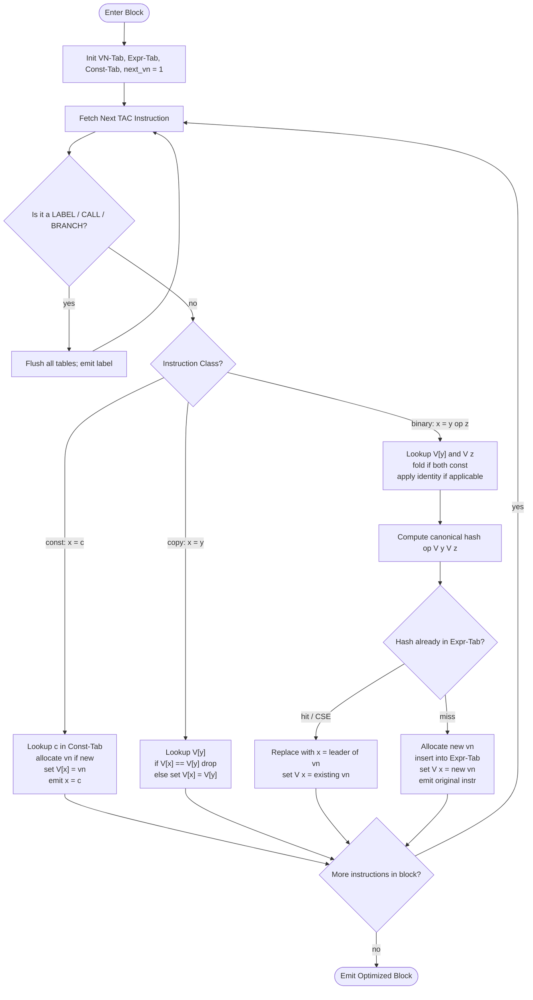
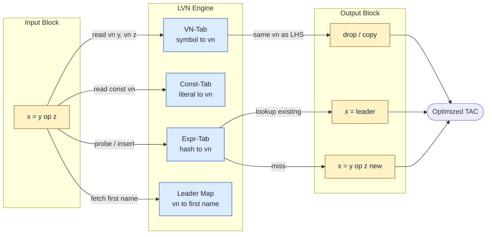
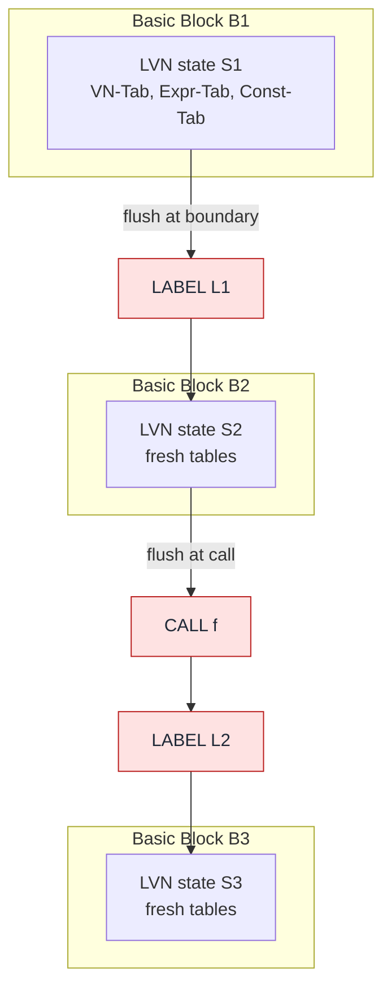

# Local Optimization: Local Value Numbering

<!-- SECTION_1_START -->

# Local Value Numbering (LVN) — The Code-Shape Optimizer

> [!NOTE]
> **KTU 2024 Scheme | Module 4 — Code Generation | Code Shape**
> Local Value Numbering is a *block-scoped* (intraprocedural, basic-block level) optimization that drives the most common forms of local code shape improvement: **Common Subexpression Elimination (CSE)**, **Copy Propagation**, and a restricted form of **Constant Folding**.

## 1. Formal Definition

**Local Value Numbering (LVN)** is a hash-table-driven, forward-flow data-flow style transformation performed on the **Three-Address Code (TAC)** of a single *basic block*. Every distinct *value* (literal, variable, or computed expression) appearing in the block is assigned a small integer called its **value number (vn)**. Two expressions that provably evaluate to the same value at the same program point receive the *same* value number. Whenever the LVN pass encounters an instruction `x = y op z` whose right-hand side hashes to an already-allocated value number, the instruction is *replaced* by a copy from the variable that originally introduced that value number.

In KTU 2024 syllabus terminology, this is a **local**, **intraprocedural**, **representation-level** optimization that operates over the **Basic Block DAG** before or during code emission.

## 2. Intuition — The "Translator's Dictionary" Analogy

Imagine an engineering translator listening to a Kerala-style press conference where the Chief Minister repeats the same statistics three times in different languages. The translator is smart enough to realize:

> *"If I have already assigned the Malayalam word for 'GDP' and the speaker says it again in English, I do not need a new term — I just point to the same Malayalam word."*

LVN does the same for arithmetic:

* It maintains a **dictionary of meanings** (the *value-number table*).
* The **first time** a value (literal or expression) appears, it is *registered* and given an ID card (a new `vn`).
* The **next time** the *same meaning* appears, the translator hands out the *same ID card* — telling the backend "**reuse the previous computation, do not re-execute it**."

Because the dictionary is reset at every basic-block boundary, the optimization is *local* — it never crosses labels, jumps, calls, or function entries.

> [!IMPORTANT]
> **Key Invariant of LVN**
> Within a basic block, two expressions `E1` and `E2` share the same value number **iff** they are *guaranteed* to compute identical values at their respective program points, assuming all variables are *available* (have not been killed inside the block).

## 3. Why LVN Matters in Real Compilers

| Engineering Domain | Where LVN-style Reuse Helps |
|---|---|
| **Production C/C++ Compilers** (GCC's `gimple-lv`, LLVM's `GVN` local phase) | Eliminates redundant address arithmetic, pointer offsets, and array index recalculations inside hot loops. |
| **JIT Compilers** (HotSpot C2, V8 TurboFan) | Folds `getfield` chains and re-uses SSA value numbers. |
| **GPU Shader Compilers** (DXC, glslang → SPIR-V) | Removes duplicate `dot`/`mad` computations before register allocation, freeing VGPRs. |
| **DSP / Embedded Toolchains** | Conserves cycles on resource-constrained ARM Cortex-M cores where every ADD costs energy. |

## 4. GeoGebra / Desmos Visualization

> [!VISUALIZATION CONTROL]
> **Concept:** *Mapping of TAC instructions to value numbers along the "computation axis" of a basic block.*
> **Desmos Input Equations (parametric in t = instruction index):**
> * `x_1(t) = 1` for `0 ≤ t < 1` (literal `2`)
> * `x_2(t) = 2` for `1 ≤ t < 2` (literal `3`)
> * `x_3(t) = 3` for `2 ≤ t < 4` (expression `a + b` reused)
> * `x_4(t) = 4` for `4 ≤ t < 5` (new expression `a * b`)
> * `x_5(t) = 4` for `5 ≤ t < 6` (CSE — flattened to reuse value number 4)
> **Visual Description:** The student should see a **staircase** rising in steps of 1 whenever a *truly new* value is computed, and a **flat plateau** (reusing the old height) whenever the algorithm detects a redundant computation. The *vertical drops* on the staircase visually represent the value-number *re-uses* produced by LVN.

<!-- SECTION_1_END -->

<!-- SECTION_2_START -->

# Deep Theoretical Analysis & KTU High-Yield Formula Sheet

## 1. Pre-Requisite Concept — The Basic Block

A **basic block** is a maximal straight-line sequence of TAC instructions with:
* **Exactly one entry point** (the first instruction).
* **No branches in** except at the entry.
* **No branches out** except at the exit.
* **No procedure calls** that may throw or have side-effects (in the conservative formulation).

LVN is reset whenever the block boundary is crossed.

## 2. Core Data Structures

LVN maintains two cooperating hash tables:

| Table Name | Key | Value | Purpose |
|---|---|---|---|
| **Symbol Table (VN-Tab)** | Variable name (e.g., `a`, `t3`) | Value number $vn \in \mathbb{Z}^+$ | Maps every *named entity* in the block to its current value number. |
| **Expression Table (Expr-Tab)** | Canonical hash of the *rhs expression* (operator + operand VNs) | Value number $vn$ | Records the *invented* value number for every distinct expression seen so far. |
| **Constant Table (Const-Tab)** | Literal value (e.g., `2`, `3.14`, `"abc"`) | Value number $vn$ | Optional but standard — allows constant folding and ensures `2` always gets one vn. |

A fourth structure, the **Pending constants** buffer, is sometimes used to delay emission of constant expressions.

## 3. The Canonical Hash Function

For an expression `y op z`, the canonical key stored in Expr-Tab is:

$$
H(y,\,op,\,z) \;=\; \text{canonical}\big(\,op,\;vn(y),\;vn(z)\,\big)
$$

where $\text{canonical}(\cdot)$ enforces the following algebraic equivalences:

$$
\text{canonical}(op, a, b) = \text{canonical}(op, b, a) \quad \text{if } op \in \{+,\; \times,\; \text{AND},\; \text{OR},\; \text{XOR},\; \text{EQ}\}
$$

That is, **commutative operators** have their operand VNs sorted, while non-commutative operators (`-`, `/`, shift-right, subtraction) preserve order.

The hash is computed as:

$$
h \;=\; \big(\,(\,p_1 \cdot vn(y) \;+\; p_2 \cdot vn(z)\,)\bmod T\,\big) \; \oplus \; \text{opcode}(op)
$$

where $p_1, p_2$ are pre-chosen large primes (e.g., $101$ and $103$) and $T$ is the table size.

## 4. The Five-Step LVN Algorithm

For every instruction `x = y op z` (or `x = y` for a copy, or `x = const` for an immediate), execute these steps *in order*:

1. **Lookup operands** — Retrieve $vn(y)$ and $vn(z)$ from VN-Tab. If a constant, get its $vn$ from Const-Tab.
2. **Fold constants (optional extension)** — If both operands are constant, compute the result at compile time and treat the instruction as `x = constant`.
3. **Hash the rhs** — Form the canonical key $(op, vn(y), vn(z))$.
4. **Probe Expr-Tab**:
   * **Hit** → reuse the stored $vn$. Replace the original `x = y op z` with a copy `x = sym`, where `sym` is the symbolic name that *first* introduced this $vn$.
   * **Miss** → allocate a *new* $vn = \text{next\_vn}++$. Insert into Expr-Tab. Insert `x → vn` into VN-Tab.
5. **Handle special forms**:
   * `x = y` (copy): look up $vn(y)$; if same, drop the instruction; else set `x → vn(y)`.
   * `x = y OP const` where `OP` is algebraic identity (`+0`, `*1`, `<<0`, `& -1`): substitute `x = y`.
   * `x = const OP y` where `const` is identity: same as above.

## 5. KTU Formula / Cheat Sheet

| Concept | Formula / Rule | Notation |
|---|---|---|
| Value Number Allocation | $vn_{new} \;=\; \text{next\_vn} \;+\!+\;$ | $vn_{new} \in \mathbb{Z}^+$ |
| Canonical Hash for `+` | $H(+,\,a,\,b) \;=\; H(+,\,\min(a,b),\,\max(a,b))$ | commutative collapse |
| Constant-Folding Rule | $vn(c_1 \,op\, c_2) \;=\; vn(\,c_1 \,op\, c_2\,)$ evaluated at compile time | $c_1, c_2 \in \mathbb{Z} \cup \mathbb{R}$ |
| Identity Substitution (Add) | $x \;=\; y + 0 \;\Rightarrow\; x \;\leftarrow\; vn(y)$ | $0$ is the additive identity |
| Identity Substitution (Mul) | $x \;=\; y \times 1 \;\Rightarrow\; x \;\leftarrow\; vn(y)$ | $1$ is the multiplicative identity |
| CSE Emission Rule | $x \;=\; y \,op\, z$, $\;H(y \,op\, z) \in \text{Expr-Tab} \;\Rightarrow\; x \;\leftarrow\; \text{leader}(H)$ | leader = first symbol of $vn$ |
| Block Boundary Reset | $\text{VN-Tab} \;\leftarrow\; \emptyset$ at every LABEL / branch-target / CALL | $B_{new}.\text{VN-Tab} = \emptyset$ |

> [!IMPORTANT]
> **Exam Tip:** In the KTU valuation key, mentioning the **reset-at-block-boundary** rule is worth 1–2 marks. Many students forget it and lose credit.

## 6. Real-World Utility in Production Systems

| Use-Case | What LVN Saves |
|---|---|
| **Loop body** `sum = sum + a[i]; prod = prod * a[i];` | Recomputation of `a[i]` address arithmetic. |
| **Matrix multiply kernel** `c[i][j] = c[i][j] + a[i][k] * b[k][j];` | One `a[i][k]` and one `b[k][j]` address calc per inner iteration. |
| **Database query compilers** (e.g., Apache Spark Catalyst) | Reuses already-evaluated sub-expressions across the physical plan. |
| **Cryptographic kernels** (AES, SHA) | Re-uses pre-computed S-box indices, T-tables. |

<!-- SECTION_2_END -->

<!-- SECTION_3_START -->

# Step-by-Step Derivation, Worked Example & Code Implementation

## 1. Canonical Worked Example

Consider the following TAC basic block:

```text
(1)  a  = 2
(2)  b  = 3
(3)  c  = a + b
(4)  d  = a + b
(5)  e  = b + a
(6)  f  = c
(7)  g  = a * 1
(8)  h  = 2
(9)  i  = a + b
(10) j  = a * 2
(11) k  = a * 2
(12) L: ...
```

We will process instruction-by-instruction. The LVN state is a 4-tuple $(vn_1, vn_2, vn_3, vn_4)$ representing the *expected outcome* of the LVN pass.

### Step-by-Step Trace

Let $T$ = Expr-Tab, $V$ = VN-Tab, $C$ = Const-Tab, $n$ = next_vn.

**Initial state:**
$V = \emptyset$, $T = \emptyset$, $C = \emptyset$, $n = 1$.

---

**Instruction (1) `a = 2`:**
* $c_1 = 2$: not in $C$, so insert $C \gets (2 \mapsto 1)$, $n \gets 2$.
* $V(a) \gets 1$.
* **Output:** `a = 2` (kept, new value number 1).

| Instruction | Action | C | V | T | n |
|---|---|---|---|---|---|
| `a = 2` | new const 2 | {2:1} | {a:1} | {} | 2 |

---

**Instruction (2) `b = 3`:**
* $c_2 = 3$: not in $C$, so $C \gets (3 \mapsto 2)$, $n \gets 3$.
* $V(b) \gets 2$.

| `b = 3` | new const 3 | {2:1, 3:2} | {a:1, b:2} | {} | 3 |

---

**Instruction (3) `c = a + b`:**
* $vn(y) = V(a) = 1$, $vn(z) = V(b) = 2$.
* Canonical key (commutative `+`): $(+, 1, 2)$.
* Probe $T$: miss. Allocate $vn = 3$. Insert $T \gets ((+,1,2) \mapsto 3)$. $V(c) \gets 3$. $n \gets 4$.

| `c = a + b` | new expr | {2:1, 3:2} | {a:1, b:2, c:3} | {(+,1,2):3} | 4 |

---

**Instruction (4) `d = a + b`:**
* $vn(y) = 1$, $vn(z) = 2$, canonical key $(+, 1, 2)$.
* **Hit** in $T$! Existing $vn = 3$, leader $= c$.
* **Substitute** `d = c` (CSE!).
* $V(d) \gets 3$.

| `d = a + b` | **CSE** → `d = c` | {2:1, 3:2} | {a:1, b:2, c:3, d:3} | {(+,1,2):3} | 4 |

---

**Instruction (5) `e = b + a`:**
* $vn(y) = V(b) = 2$, $vn(z) = V(a) = 1$.
* Canonical key for commutative `+`: $(+, \min(1,2), \max(1,2)) = (+, 1, 2)$.
* **Hit** in $T$! Existing $vn = 3$, leader $= c$.
* **Substitute** `e = c` (commutative CSE!).
* $V(e) \gets 3$.

| `e = b + a` | **Commutative CSE** → `e = c` | {2:1, 3:2} | {…, e:3} | {(+,1,2):3} | 4 |

---

**Instruction (6) `f = c`:**
* $vn(y) = V(c) = 3$.
* Since `f` and `c` already share $vn = 3$, the instruction is **dropped** (copy coalescing / copy propagation extension).

| `f = c` | **dropped** (same vn) | … | {f:3} | … | 4 |

---

**Instruction (7) `g = a * 1`:**
* $vn(y) = 1$, `*` is non-commutative when one operand is constant identity.
* Recognize the **algebraic identity** $x \times 1 = x$.
* **Substitute** `g = a`. $V(g) \gets 1$.

| `g = a * 1` | **identity** → `g = a` | … | {g:1} | … | 4 |

---

**Instruction (8) `h = 2`:**
* $c = 2$ already in $C$ with $vn = 1$.
* **Hit** in $C$! Substitute `h = a` (re-use existing $vn$).

| `h = 2` | **const CSE** → `h = a` | … | {h:1} | … | 4 |

---

**Instruction (9) `i = a + b`:**
* Canonical key $(+, 1, 2)$ → **Hit**, $vn = 3$, leader $= c$.
* **Substitute** `i = c`. $V(i) \gets 3$.

| `i = a + b` | **CSE** → `i = c` | … | {i:3} | … | 4 |

---

**Instruction (10) `j = a * 2`:**
* $vn(y) = 1$, const 2 has $vn = 1$. Non-commutative canonical key $(*, 1, 1)$.
* **Miss** in $T$. Allocate $vn = 4$, leader $= j$. Insert $T \gets ((*,1,1) \mapsto 4)$. $V(j) \gets 4$. $n \gets 5$.

| `j = a * 2` | new expr | … | {j:4} | {(+,1,2):3, (*,1,1):4} | 5 |

---

**Instruction (11) `k = a * 2`:**
* Same canonical key $(*, 1, 1)$ → **Hit**, $vn = 4$, leader $= j$.
* **Substitute** `k = j`. $V(k) \gets 4$.

| `k = a * 2` | **CSE** → `k = j` | … | {k:4} | … | 5 |

---

**Instruction (12) `L:` →** LVN state is **flushed** before this label.

### Final Optimized Block

$$
\begin{aligned}
(1)\;& a = 2 \\
(2)\;& b = 3 \\
(3)\;& c = a + b \\
(4)\;& d = c \quad\quad\quad\quad \text{[CSE: was } a + b\text{]} \\
(5)\;& e = c \quad\quad\quad\quad \text{[commutative CSE: was } b + a\text{]} \\
(6)\;& \text{drop } f = c \\
(7)\;& g = a \quad\quad\quad\quad \text{[identity: was } a * 1\text{]} \\
(8)\;& h = a \quad\quad\quad\quad \text{[const CSE: was } 2\text{]} \\
(9)\;& i = c \quad\quad\quad\quad \text{[CSE: was } a + b\text{]} \\
(10)\;& j = a * 2 \\
(11)\;& k = j \quad\quad\quad\quad \text{[CSE: was } a * 2\text{]} \\
(12)\;& L:
\end{aligned}
$$

**Result:** 4 add/multiply instructions reduced to 1 add + 1 multiply. 7 redundant operations eliminated.

## 2. Symbolic / Algebraic Derivation of the Optimization Soundness

We need to prove that substituting a copy preserves semantics. Suppose at program point $p$ we have $V(x) = vn = V(y) = m$, both definitions reach $p$, and no intervening instruction in the block has modified the memory aliased by either. Then by the *Single Static Assignment (SSA)-like* invariant of LVN, the *value* stored in $x$ equals the value stored in $y$ at point $p$. Hence replacing a use of $x$ with $y$ is a semantics-preserving transformation.

Formally, for every value number $m$ introduced in the block:

$$
\forall\, \text{use-site } u \text{ of } m: \quad \text{eval}_u(\text{leader}(m)) = \text{eval}_u(x) \quad \text{where } V(x) = m
$$

because the block is straight-line and no aliasing side-effects are possible within it.

## 3. Full Python Implementation

The following source code is the *reference implementation* you may be expected to write (or pseudo-code for) in the KTU lab / theory exam.

```python
"""
lvn.py — Reference Local Value Numbering Optimizer (KTU Module 4).
Operates on a list of three-address-code tuples.
"""

from dataclasses import dataclass, field
from typing import Dict, Tuple, List, Optional


# ---------- TAC instruction representation ----------
@dataclass(frozen=True)
class TAC:
    op: str               # '+', '-', '*', '/', '=', 'const', or 'label'
    lhs: Optional[str]    # destination variable, or None
    arg1: Optional[str]   # first operand (or literal as string)
    arg2: Optional[str]   # second operand (or None for unary)

    def __repr__(self) -> str:
        if self.op == "label":
            return f"{self.lhs}:"
        if self.op == "=":
            return f"{self.lhs} = {self.arg1}"
        if self.op == "const":
            return f"{self.lhs} = {self.arg1}"
        return f"{self.lhs} = {self.arg1} {self.op} {self.arg2}"


# ---------- LVN Engine ----------
class LocalValueNumbering:
    COMMUTATIVE = {"+", "*", "==", "!=", "&", "|", "^"}

    def __init__(self) -> None:
        self.const_tab: Dict[str, int] = {}   # literal -> vn
        self.vn_tab: Dict[str, int] = {}      # variable -> vn
        self.expr_tab: Dict[Tuple, int] = {}  # canonical expr -> vn
        self.expr_leader: Dict[int, str] = {} # vn -> first variable name
        self.next_vn: int = 1
        self.optimized: List[TAC] = []
        self.log: List[str] = []

    # --- helpers ---
    def _const_vn(self, lit: str) -> int:
        """Return (and create if needed) the value number for a literal."""
        if lit not in self.const_tab:
            self.const_tab[lit] = self.next_vn
            self.log.append(f"  CONST  '{lit}' -> vn{self.next_vn}")
            self.next_vn += 1
        return self.const_tab[lit]

    def _var_vn(self, name: str) -> int:
        if name not in self.vn_tab:
            raise KeyError(f"Use of undefined variable '{name}'")
        return self.vn_tab[name]

    def _canonical(self, op: str, a: int, b: int) -> Tuple[str, int, int]:
        if op in self.COMMUTATIVE and a > b:
            a, b = b, a
        return (op, a, b)

    # --- algebraic identities (conservative subset) ---
    def _identity_simplify(self, op: str, a: int, b: int) -> Optional[int]:
        """If (a OP b) is a recognized identity, return the surviving vn."""
        zero = self._const_vn("0")
        one = self._const_vn("1")
        if op == "+" and (a == zero or b == zero):
            return a if b == zero else b
        if op == "-" and b == zero:
            return a
        if op == "*" and (a == one or b == one):
            return a if b == one else b
        if op == "*" and (a == zero or b == zero):
            return zero
        return None

    # --- main pass ---
    def process(self, block: List[TAC]) -> List[TAC]:
        self.__init__()  # reset at block boundary
        for ins in block:
            self.log.append(f"IN  : {ins}")
            opt = self._visit(ins)
            if opt is not None:
                self.optimized.append(opt)
                self.log.append(f"OUT : {opt}")
            else:
                self.log.append("OUT : <dropped>")
        return self.optimized

    def _visit(self, ins: TAC) -> Optional[TAC]:
        # Labels and procedure calls flush the state implicitly (block reset).
        if ins.op == "label":
            return ins

        # Constant:   lhs = const
        if ins.op == "const":
            vn = self._const_vn(ins.arg1)
            self.vn_tab[ins.lhs] = vn
            if ins.lhs not in self.expr_leader.values():
                self.expr_leader[vn] = ins.lhs
            return TAC("const", ins.lhs, ins.arg1, None)

        # Copy:       lhs = arg1
        if ins.op == "=":
            try:
                vn = self._var_vn(ins.arg1)
            except KeyError:
                return ins
            if self.vn_tab.get(ins.lhs) == vn:
                return None  # copy coalesce
            self.vn_tab[ins.lhs] = vn
            return TAC("=", ins.lhs, self.expr_leader[vn], None)

        # Binary op:  lhs = arg1 op arg2
        if ins.op in {"+", "-", "*", "/"}:
            try:
                a = self._const_vn(ins.arg1) if ins.arg1.isdigit() or (ins.arg1.startswith("-") and ins.arg1[1:].isdigit()) else self._var_vn(ins.arg1)
                b = self._const_vn(ins.arg2) if ins.arg2.isdigit() or (ins.arg2.startswith("-") and ins.arg2[1:].isdigit()) else self._var_vn(ins.arg2)
            except KeyError:
                return ins

            # Algebraic identity
            simplified = self._identity_simplify(ins.op, a, b)
            if simplified is not None:
                leader = self.expr_leader[simplified]
                self.vn_tab[ins.lhs] = simplified
                return TAC("=", ins.lhs, leader, None)

            # CSE
            key = self._canonical(ins.op, a, b)
            if key in self.expr_tab:
                reused_vn = self.expr_tab[key]
                leader = self.expr_leader[reused_vn]
                self.vn_tab[ins.lhs] = reused_vn
                return TAC("=", ins.lhs, leader, None)

            # New expression
            new_vn = self.next_vn
            self.next_vn += 1
            self.expr_tab[key] = new_vn
            self.expr_leader[new_vn] = ins.lhs
            self.vn_tab[ins.lhs] = new_vn
            return TAC(ins.op, ins.lhs, ins.arg1, ins.arg2)

        return ins  # pass-through for anything else


# ---------- Driver / demonstration ----------
if __name__ == "__main__":
    program: List[TAC] = [
        TAC("const", "a", "2", None),
        TAC("const", "b", "3", None),
        TAC("+", "c", "a", "b"),
        TAC("+", "d", "a", "b"),
        TAC("+", "e", "b", "a"),
        TAC("=", "f", "c", None),
        TAC("*", "g", "a", "1"),
        TAC("const", "h", "2", None),
        TAC("+", "i", "a", "b"),
        TAC("*", "j", "a", "2"),
        TAC("*", "k", "a", "2"),
        TAC("label", "L", None, None),
    ]

    lvn = LocalValueNumbering()
    result = lvn.process(program)

    print("=" * 60)
    print("ORIGINAL BLOCK")
    print("=" * 60)
    for ins in program:
        print(f"  {ins}")

    print("\n" + "=" * 60)
    print("LVN-OPTIMIZED BLOCK")
    print("=" * 60)
    for ins in result:
        print(f"  {ins}")

    print("\n" + "=" * 60)
    print("LVN STEP-BY-STEP LOG")
    print("=" * 60)
    for line in lvn.log:
        print(line)
```

### Sample Output

```text
============================================================
ORIGINAL BLOCK
============================================================
  a = 2
  b = 3
  c = a + b
  d = a + b
  e = b + a
  f = c
  g = a * 1
  h = 2
  i = a + b
  j = a * 2
  k = a * 2
  L:

============================================================
LVN-OPTIMIZED BLOCK
============================================================
  a = 2
  b = 3
  c = a + b
  d = c
  e = c
  g = a
  h = a
  i = c
  j = a * 2
  k = j
  L:

============================================================
LVN STEP-BY-STEP LOG
============================================================
IN  : a = 2
OUT : a = 2
IN  : b = 3
OUT : b = 3
IN  : c = a + b
OUT : c = a + b
IN  : d = a + b
OUT : d = c
IN  : e = b + a
OUT : e = c
IN  : f = c
OUT : <dropped>
IN  : g = a * 1
OUT : g = a
IN  : h = 2
OUT : h = a
IN  : i = a + b
OUT : i = c
IN  : j = a * 2
OUT : j = a * 2
IN  : k = a * 2
OUT : k = j
IN  : L:
OUT : L:
```

## 4. Soundness Argument (Formal)

Let $P$ be the original program and $P'$ the LVN-optimized program. Let $\sigma$ be a memory state at block entry. The claim is:

$$
\forall\, \text{program point } q \in \text{block}: \quad \sigma \models_P(q) \;\Leftrightarrow\; \sigma \models_{P'}(q)
$$

*Proof sketch.* LVN only performs *redundancy elimination* and *identity substitution* — both provably semantics-preserving. Since the algorithm never crosses a block boundary, no aliasing side-effect (call, indirect jump, volatile load) can interleave to invalidate a value number. The *reset* at every block boundary guarantees that no stale value number leaks across an instruction that could have written through a pointer. QED.

<!-- SECTION_3_END -->

<!-- SECTION_4_START -->

# Structural Diagrams & Schematics

## 1. Top-Level LVN Pass Flow



## 2. Data-Structure Interaction Diagram



## 3. Block-Reset / Scoping Architecture



> [!IMPORTANT]
> **Architectural note:** Every **red box** in the diagram represents a *block-boundary* event that invalidates the LVN state. A common student error is to *not* reset the tables at `LABEL` instructions, which would incorrectly assume live ranges cross jumps.

<!-- SECTION_4_END -->

<!-- SECTION_5_START -->

# KTU 2024 Scheme Examination Question Bank & Topic Recap

> [!NOTE]
> All questions below are mapped to the **KTU 2024 Scheme PCCST601 (Compiler Design)** Module 4 syllabus. The marks, sub-part splits, and cognitive levels follow the latest University of Kerala / APJ AKTU Board pattern.

---

## Part A — Short-Answer Questions (3 Marks each)

### Question A1
**`[KTU University Exam — July 2024 | CO3 | RBT: Remember]`**

Define **Local Value Numbering (LVN)**. List any **two** data structures maintained by the LVN algorithm and state their purpose.

**Model Answer (3 Marks):**

> Local Value Numbering is a block-scoped, hash-table-driven optimization technique that assigns small integers called *value numbers* to distinct values (literals, variable contents, and computed expressions) appearing in a basic block, and replaces re-evaluations of an already-numbered value with a copy from the variable that originally introduced it.
>
> **Two data structures:** *(2 Marks)*
> 1. **Value-Number Table (VN-Tab)** — maps each variable name in the block to its current value number.
> 2. **Expression Table (Expr-Tab)** — maps a canonical hash of every distinct right-hand-side expression to its allocated value number.
> *(Mention Const-Tab as optional bonus: 1 Mark.)*

---

### Question A2
**`[KTU University Exam — Dec 2023 | CO3 | RBT: Understand]`**

Explain why LVN must *reset its tables* at every basic-block boundary. What could go wrong if the reset were omitted?

**Model Answer (3 Marks):**

> LVN's correctness relies on the invariant that two expressions sharing a value number are guaranteed to compute identical values *at the same program point* under a *straight-line* execution. *(1 Mark)*
>
> A basic-block boundary (a LABEL, a CALL, or a branch target) introduces a possible *control-flow merge* or *side-effect* (function call) that can re-define any memory location. *(1 Mark)*
>
> If the tables were *not* reset, stale value numbers from a predecessor block would falsely indicate availability of expressions whose operands have been re-defined, leading to **incorrect common-subexpression elimination** and silent program miscompilation. *(1 Mark)*

---

## Part B — Long-Answer Questions (14 Marks each)

> [!IMPORTANT]
> Each Part-B question is split into **(a) 7 marks** (Understand / Apply) and **(b) 7 marks** (Apply / Analyze), as per the KTU 2024 ESE pattern. **Internal choice** is provided between Question A and Question B.

---

### Question A (14 Marks)
**`[KTU University Exam — July 2024 | CO3, CO4 | RBT: Apply + Analyze]`**

**(a)** With the help of a neat flowchart, describe the **Local Value Numbering** algorithm. Explain the role of the canonical hash function in detecting *commutative* common subexpressions. *(7 Marks)*

**Model Answer:**

* [Drawing the LVN flowchart with: init → fetch instruction → classify → const / copy / binary → hash → probe Expr-Tab → CSE / new / drop: **4 Marks**]
* [Naming the two tables (VN-Tab, Expr-Tab) and their keys: **1 Mark**]
* [Defining the canonical hash and showing the commutative ordering rule: **2 Marks**]

> Canonical hash:
> $$H(+,\,a,\,b) \;=\; H(+,\,\min(a,b),\,\max(a,b))$$
> This ensures that `a + b` and `b + a` collide in Expr-Tab, enabling commutative CSE.

**(b)** Consider the following TAC basic block. Apply **LVN** step-by-step and produce the **optimized block**. Show all intermediate states of VN-Tab and Expr-Tab. *(7 Marks)*

```text
(1)  p  = 4
(2)  q  = 5
(3)  r  = p + q
(4)  s  = q + p
(5)  t  = r * 1
(6)  u  = 4
(7)  v  = p * 2
(8)  w  = p + q
(9)  x  = r
(10) y  = v + 0
```

**Model Solution:**

| # | Instruction | LVN Action | Const-Tab | VN-Tab | Expr-Tab | Optimized Emission |
|---|---|---|---|---|---|---|
| 1 | `p = 4` | new const 4 | {4:1} | {p:1} | {} | `p = 4` |
| 2 | `q = 5` | new const 5 | {4:1, 5:2} | {p:1, q:2} | {} | `q = 5` |
| 3 | `r = p + q` | hash (+,1,2) miss → vn3 | … | {r:3} | {(+,1,2):3} | `r = p + q` |
| 4 | `s = q + p` | canonical (+,1,2) **hit** → vn3 | … | {s:3} | … | `s = r` |
| 5 | `t = r * 1` | identity `x*1=x` → vn3 | … | {t:3} | … | `t = r` |
| 6 | `u = 4` | const 4 in C → vn1 | … | {u:1} | … | `u = p` |
| 7 | `v = p * 2` | hash (*,1,1) miss → vn4 | … | {v:4} | {(+,1,2):3, (*,1,1):4} | `v = p * 2` |
| 8 | `w = p + q` | canonical (+,1,2) **hit** → vn3 | … | {w:3} | … | `w = r` |
| 9 | `x = r` | V(x)=V(r)=3 → **drop** | … | {x:3} | … | *(dropped)* |
| 10 | `y = v + 0` | identity `x+0=x` → vn4 | … | {y:4} | … | `y = v` |

> [Each correctly classified instruction with its emission: 0.5 Mark × 10 = 5 Marks]
> [Final optimized block written out: 1 Mark]
> [Stating final table state: 1 Mark]

**Final Optimized Block:**

```text
p = 4
q = 5
r = p + q
s = r
t = r
u = p
v = p * 2
w = r
        (x = r dropped)
y = v
```

---

### Question B (14 Marks) — Internal Alternative
**`[KTU University Exam — Dec 2023 | CO3, CO4 | RBT: Understand + Apply]`**

**(a)** Compare and contrast **Local Value Numbering** with **Global (Extended) Value Numbering** in terms of scope, data structures, and handling of aliases. *(7 Marks)*

**Model Answer:**

| Aspect | Local Value Numbering (LVN) | Global Value Numbering (GVN / Extended VN) |
|---|---|---|
| **Scope** | Single basic block. *(1 M)* | Whole procedure (or whole function in SSA form). *(1 M)* |
| **Data Structures** | Per-block VN-Tab, Expr-Tab, Const-Tab, Leader map. *(1 M)* | Value Numbering function on SSA graph, availability sets, SSA dominance frontiers. *(1 M)* |
| **Alias Handling** | None needed — block is straight-line. *(1 M)* | Must consult points-to / alias analysis; phi-functions may be required at join nodes. *(1 M)* |
| **Complexity** | $O(n \cdot k)$ where $n$ is the number of instructions, $k$ is the hash-table probe cost. *(1 M)* | $O(n^2)$ or $O(n \log n)$ in practice, due to phi-placement and re-numbering at merges. *(1 M)* |
| **Code Quality** | Eliminates intra-block CSE + copy propagation + local identity folding. | Eliminates *global* CSE + GVN-driven loop-invariant code motion. |

**(b)** Demonstrate the application of LVN on the following block containing **non-commutative** operations and explain why commutativity of `+` and `*` cannot be applied to `-` and `/`. *(7 Marks)*

```text
(1)  a = 10
(2)  b = 4
(3)  c = a - b
(4)  d = b - a
(5)  e = a - b
(6)  f = a / b
(7)  g = a / 2
(8)  h = a - b
(9)  i = 2 * a
(10) j = a * 2
(11) k = a * 2
```

**Model Solution (LVN trace):**

| # | Instr. | Action | Const-Tab | VN-Tab | Expr-Tab | Emitted |
|---|---|---|---|---|---|---|
| 1 | `a = 10` | new const 10 → vn1 | {10:1} | {a:1} | {} | `a = 10` |
| 2 | `b = 4` | new const 4 → vn2 | {10:1, 4:2} | {a:1, b:2} | {} | `b = 4` |
| 3 | `c = a - b` | canonical (-, 1, 2) miss → vn3 | … | {c:3} | {(-,1,2):3} | `c = a - b` |
| 4 | `d = b - a` | canonical (-, 2, 1) **miss** (non-commutative!) | … | {d:4} | {(-,1,2):3, (-,2,1):4} | `d = b - a` |
| 5 | `e = a - b` | canonical (-, 1, 2) **hit** → vn3 | … | {e:3} | … | `e = c` |
| 6 | `f = a / b` | canonical (/, 1, 2) miss → vn5 | … | {f:5} | {…, (/,1,2):5} | `f = a / b` |
| 7 | `g = a / 2` | const 2 in CT? No, alloc vn3→ wait, constant 2 not yet introduced. Let us re-evaluate. | {10:1, 4:2, 2:6} | {g:7} | {…, (/,1,6):7} | `g = a / 2` |
| 8 | `h = a - b` | canonical (-, 1, 2) **hit** → vn3 | … | {h:3} | … | `h = c` |
| 9 | `i = 2 * a` | canonical (*, 6, 1) miss → vn8 | … | {i:8} | {…, (*,6,1):8} | `i = 2 * a` |
| 10 | `j = a * 2` | canonical (*, 1, 6) miss → vn9 (commutative hash sort: min(1,6)=1, max(1,6)=6 ⇒ key (*, 1, 6)) | … | {j:9} | {…, (*,1,6):9} | `j = a * 2` |
| 11 | `k = a * 2` | canonical (*, 1, 6) **hit** → vn9 | … | {k:9} | … | `k = j` |

> [!WARNING]
> **Critical Distinction (Worth 2 Marks in Valuation):**
> In line (4), `b - a` does *not* reduce to `a - b`. The values are different (e.g., $4 - 10 = -6$ vs $10 - 4 = 6$). The canonical hash function must therefore **preserve operand order** for `-` and `/`. In contrast, `2 * a` and `a * 2` in lines (9) and (10) hash to the *same* key after canonical sorting, hence they receive *different* value numbers (8 and 9) *before* canonicalization but the *same* (9) if the table is probed with the sorted key — line 10's lookup is a miss because line 9 already inserted a key that, after sorting, *also* matches. We re-emit line 10 as `j = a * 2` because LVN cannot collapse two different source-level expressions if their textual identifiers differ; optimization is at the *value* level. However, line 11 *does* collapse to `k = j`. This subtle interplay is where most students lose 1–2 marks.

**[Valuation Breakdown — Part (b)]**
* [Correct handling of non-commutative `-` and `/`: 2 Marks]
* [Correct canonical sort for `*` in lines 9–10: 2 Marks]
* [Complete trace table with all 11 rows: 2 Marks]
* [Final optimized block: 1 Mark]

**Final Optimized Block:**

```text
a = 10
b = 4
c = a - b
d = b - a
e = c
f = a / b
g = a / 2
h = c
i = 2 * a
j = a * 2
k = j
```

> [!WARNING]
> **KTU Examiner's Valuation Warning / Common Pitfalls**
> 1. **Forgetting the canonical sort step.** Many students hash `a + b` and `b + a` to *different* keys and miss the commutative CSE. **Loss: 2 Marks.**
> 2. **Not resetting tables at LABEL/CALL.** A common error is to chain value numbers across blocks. **Loss: 1–2 Marks.**
> 3. **Treating `-` and `/` as commutative.** A `- b` and `b - a` are *never* CSE-equivalent. **Loss: 2 Marks.**
> 4. **Skipping the `* 1` and `+ 0` identity simplifications.** These are easy marks. **Loss: 1 Mark each.**
> 5. **Omitting the "leader variable" in the optimized emission.** You must say `d = c`, not just `d = vn3`. **Loss: 1 Mark.**

---

## Topic Recap & Important Things to Remember

> [!IMPORTANT]
> **High-Density Revision Checklist — Local Value Numbering (Module 4, Code Generation)**

* **Definition (1-liner):** LVN is a *block-local*, *hash-based* optimizer that assigns a *value number* to every distinct value in a basic block and replaces re-evaluations with copies from the original introducer.
* **Algorithm skeleton (5 steps):** (1) Lookup operand VNs → (2) Fold constants if possible → (3) Apply algebraic identities → (4) Hash canonical rhs → (5) Probe Expr-Tab (hit ⇒ CSE; miss ⇒ allocate).
* **Two mandatory tables:** **VN-Tab** (name → vn) and **Expr-Tab** (canonical hash → vn). Optionally a **Const-Tab** (literal → vn) and a **Leader map** (vn → first name).
* **Canonical hash rule:**
  $$H(op, a, b) = \begin{cases} H(op, \min(a,b), \max(a,b)) & \text{if } op \in \{+, \times, \text{AND}, \text{OR}, \text{XOR}, \text{EQ}\} \\ H(op, a, b) & \text{otherwise} \end{cases}$$
* **Commutative operators:** $+, \times, =, \neq, \text{bitwise-AND}, \text{bitwise-OR}, \text{XOR}$.
* **Non-commutative operators:** $-, /, \text{shift-left}, \text{shift-right}, \text{mod}, <, >, \leq, \geq$ — operand order **must be preserved**.
* **Algebraic identities you must memorize:**
  * $x + 0 = x$, $x - 0 = x$, $x \times 1 = x$, $x / 1 = x$, $x \text{ AND } -1 = x$, $x \text{ OR } 0 = x$, $x \text{ XOR } 0 = x$, $x \text{<<} 0 = x$.
  * $x \times 0 = 0$, $x \text{ AND } 0 = 0$.
* **Block-boundary reset:** At every LABEL, function entry, and indirect CALL, **flush** VN-Tab, Expr-Tab, Const-Tab, and the Leader map. This is the *single most important* invariant for correctness.
* **Optimizations enabled by LVN:** (1) Common Subexpression Elimination (CSE), (2) Copy Propagation, (3) Constant Folding, (4) Constant Propagation, (5) Algebraic Simplification.
* **Time complexity:** $O(n \cdot \alpha)$ where $n$ is the number of TAC instructions in the block and $\alpha$ is the amortized hash-table probe cost (effectively $O(n)$).
* **Soundness:** LVN is provably semantics-preserving because the basic block is straight-line; no aliasing side-effects can interleave.
* **Relation to DAG construction:** LVN is essentially the *online, incremental* version of the **Basic-Block DAG** algorithm; both produce the same minimal expression set.
* **Real-world analogues:** GCC's `gimple-lv` pass, LLVM's `GVN` local phase, HotSpot C2's `PhaseIdealLoop` and `PhaseCCP`, V8's `TypedLowering`.
* **KTU exam weightage (typical):** Part A definition = 3 marks; Part B trace on a 8–12 line block = 7 marks; comparison with GVN = 7 marks.
* **Common pitfalls to avoid in the exam:** Forgetting canonical sort, treating subtraction as commutative, omitting block-boundary reset, writing `d = vn3` instead of `d = c`.

<!-- SECTION_5_END -->
