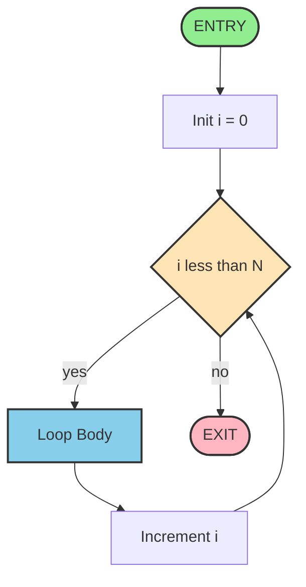
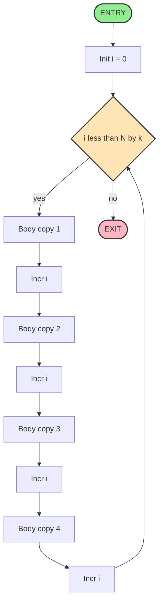
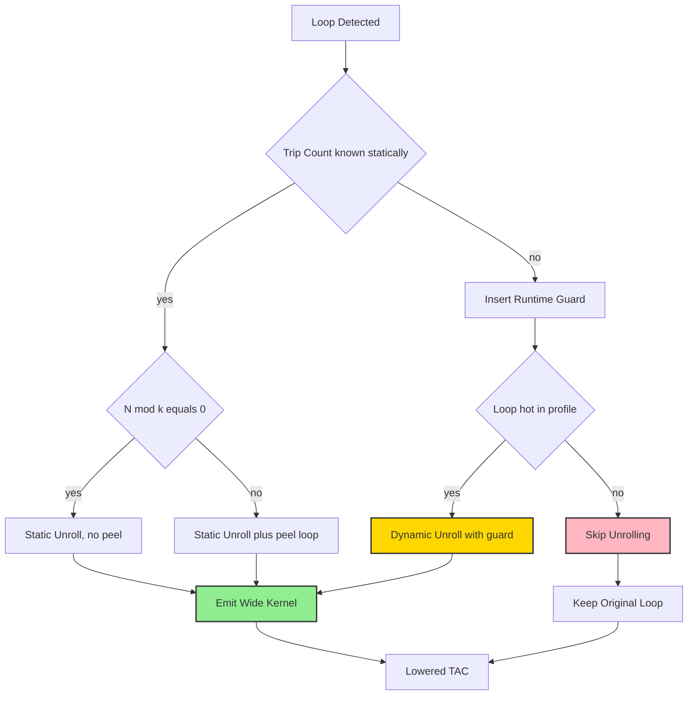

# Loop Unrolling

<!-- SECTION_1_START -->
# Loop Unrolling — Code Shape Optimization

## 1.1 Formal Definition (KTU 2024 Syllabus Terminology)

> [!NOTE]
> **Loop Unrolling** is a classical, machine-independent **local code optimization technique** (also classified as a *peephole optimization* and a *code-shape transformation*) in which the body of a loop is **replicated $k$ times (where $k$ is the *unroll factor*)** to decrease the number of iterations executed by the loop control logic. The transformation trades increased code size for a reduction in loop-branch overhead, improved instruction-level parallelism, and better utilization of processor functional units.

In the context of the KTU 2024 Scheme module *"Code Generation — Code Shape"*, loop unrolling is taught as a **control-flow restructuring transformation** that the compiler backend applies to the **intermediate representation (IR)** of a program — typically **three-address code (TAC)** — before or during instruction selection.

### 1.2 Intuitive Overview — The "Cheque-Book Batching" Analogy

Imagine you are paying **$n$ suppliers**, and each cheque you write costs you **₹10 in bank processing fees** (signature, log entry, ledger update). If you walk into the bank once and pay them **one by one**, you pay $n \times 10$ rupees in fees.

A smarter bank teller says: *"Give me a list of 4 suppliers, and I will process them in a single batch."* You still pay the suppliers the full amount, but you only pay the ₹10 fee **once for every 4 suppliers**. The total fee drops to roughly $\frac{n}{4} \times 10$.

The compiler's loop is the **"walk to the bank"** — the increment, branch, and counter-test. The **loop body** is paying the supplier. **Unrolling** is the bank teller's batch — multiple bodies are placed back-to-back inside one iteration, so the control-flow overhead is amortized across $k$ useful operations.

### 1.3 Where Loop Unrolling Fits in the Compiler Pipeline

> [!IMPORTANT]
> Loop unrolling is performed **after** local/common subexpression elimination, **before** (or interleaved with) **global scheduling and register allocation**, and is a *code-shape* transformation — meaning it alters the **layout and structure of the emitted code** rather than just renaming temporaries.

| Pipeline Stage | Typical Action | Relation to Unrolling |
|---|---|---|
| Front-end | Parse → AST → TAC | Produces the loop to be unrolled |
| Local Optimizations | Constant folding, CSE | Pre-cleaning before unrolling |
| **Code-Shape Transformations** | **Unrolling, If-conversion, Software pipelining** | **Loop unrolling lives here** |
| Instruction Selection | TAC → target assembly | Benefits from unrolled, larger basic blocks |
| Register Allocation | Graph coloring, spilling | Easier with longer, predictable basic blocks |
| Scheduling | Pipeline / VLIW scheduling | Exposes ILP that unrolling creates |

### 1.4 The Two Grand Variants of Loop Unrolling

> [!IMPORTANT]
> **Variant 1 — Fixed-Bound (Static) Unrolling:** The number of iterations $n$ is a **compile-time constant**. The compiler unrolls the body $k$ times, computes the *remainder* $r = n \bmod k$, and emits a clean sequence of $k$-wide iterations followed by a small *peel loop* for the remaining $r$ iterations.

> [!IMPORTANT]
> **Variant 2 — Dynamic-Bound (Run-Time) Unrolling:** The bound $n$ is **not known at compile time**. The compiler inserts a *pre-check* (a guarded branch) at loop entry: if the remaining iteration count $\geq k$, the wide path executes; otherwise, the original narrow loop handles the tail.

> [!VISUALIZATION CONTROL]
> **Concept:** Iteration count reduction curve after unrolling by factor $k$.
> **GeoGebra / Desmos Input Equations:**
> * `f1(x) = x` &nbsp;(original loop overhead per useful op)
> * `f2(x) = x / 4 + 0.25` &nbsp;(after unroll factor k = 4)
> * `g(x) = ceil(x / 4) / x` &nbsp;(relative overhead ratio, $x \geq 1$)
> **Visual Description:** Plot $x$ on the horizontal axis as the original iteration count $n$ (from 1 to 100), and the curves $f_1$, $f_2$, $g$ on the vertical axis. Observe that $g$ plummets toward $\frac{1}{4}$ as $n$ grows, but oscillates (with peaks) at small $n$ because of the remainder / peel-loop logic.
<!-- SECTION_1_END -->

<!-- SECTION_2_START -->
# Deep Theoretical Analysis & KTU High-Yield Formula Sheet

## 2.1 Algorithmic Intuition — What the Compiler *Actually* Does

Given a TAC-level loop of the canonical form

$$
\begin{aligned}
L_\text{head}&: \quad \text{if } i > n \text{ goto } L_\text{exit} \\
L_\text{body}&: \quad \langle \text{loop body instructions} \rangle \\
               &\quad i \;=\; i \;+\; \text{step} \\
               &\quad \text{goto } L_\text{head} \\
L_\text{exit}&:
\end{aligned}
$$

**Step 1 — Induction-Variable Analysis.** The compiler identifies $i$ as an *induction variable* of the form $i = i_0 + c \cdot t$, where $t$ counts iterations. The *trip count* is computed (when possible) as $T = \lfloor (n - i_0)/c \rfloor + 1$.

**Step 2 — Choose Unroll Factor $k$.** The compiler (or the programmer via `#pragma unroll k`) selects a small power of two, commonly $k \in \{2, 4, 8\}$. The chosen $k$ should evenly divide $T$ for the *cleanest* result.

**Step 3 — Replicate the Body $k$ Times.** Each replication substitutes $i \rightarrow i + c$ relative to the previous copy. The induction update at the bottom of the loop is removed from the first $k-1$ copies (because the next copy reuses the same register).

**Step 4 — Adjust the Trip Count.** The new trip count becomes $T' = \lceil T / k \rceil$, and a *peel loop* of size $T \bmod k$ may be generated (or a *guard* if the bound is dynamic).

**Step 5 — Preserve Semantics.** All memory operations, calls, and control dependencies must be respected. If the body has inter-iteration dependencies (e.g., $a_{i} = a_{i-1} + b$), the compiler must first verify *legality* before unrolling, or it must insert *fix-up code* to preserve ordering.

## 2.2 Worked Mechanics — Step-by-Step Effect on TAC

Consider the C source:

```c
for (int i = 0; i < 100; i++) {
    a[i] = b[i] + c;
}
```

The compiler emits the **original three-address code** (TAC):

```
i   = 0
L1: if i >= 100 goto L2
    t1 = i * 8
    t2 = b + t1
    t3 = a + t1
    *t3 = *t2 + c
    i  = i + 1
    goto L1
L2:
```

After **loop unrolling with factor $k = 4$** (and noting that $100 \bmod 4 = 0$, so no peel loop is needed), the compiler produces the **unrolled TAC**:

```
i   = 0
L1: if i >= 100 goto L2
    t1  = i * 8
    t2  = b + t1
    t3  = a + t1
    *t3 = *t2 + c
    i   = i + 1                       <-- inlined, no branch

    t1  = i * 8
    t2  = b + t1
    t3  = a + t1
    *t3 = *t2 + c
    i   = i + 1                       <-- inlined, no branch

    t1  = i * 8
    t2  = b + t1
    t3  = a + t1
    *t3 = *t2 + c
    i   = i + 1                       <-- inlined, no branch

    t1  = i * 8
    t2  = b + t1
    t3  = a + t1
    *t3 = *t2 + c
    i   = i + 1
    goto L1
L2:
```

The branch overhead has been **quartered**: the test `if i >= 100` is now performed only once every 4 iterations, so the dynamic branch count drops from $100$ to $25$.

## 2.3 KTU High-Yield Formula Sheet

> [!IMPORTANT]
> All quantities below are **board-exam-favorite** and routinely appear in 14-mark problems.

| Symbol | Meaning | Unit | Notes |
|---|---|---|---|
| $n$ | Original iteration count (trip count) | iterations | May be a compile-time constant or symbolic |
| $k$ | Unroll factor | dimensionless | Usually $k \in \{2, 4, 8\}$; sometimes a runtime value |
| $T$ | Total dynamic branch count (original) | branches | $T = n$ for a counted loop |
| $T'$ | Total dynamic branch count (unrolled) | branches | $T' = \lceil n / k \rceil$ |
| $r$ | Remainder / peel iterations | iterations | $r = n \bmod k$ |
| $C_\text{ovh}$ | Per-iteration control overhead | cycles | Increment + compare + branch |
| $S$ | Code-size growth factor | dimensionless | $S \approx k$ for naive unroll |
| $P$ | Parallelism width exposed | independent ops | Roughly $\leq k \times \rho$ where $\rho$ is per-iter parallelism |
| $L_\text{lat}$ | Critical-path latency of body | cycles | Determines speedup ceiling |
| $f_p$ | Fraction of operations that can be parallelized | dimensionless | $0 \le f_p \le 1$ |

**Master equations for KTU problems:**

$$
\begin{aligned}
\text{Dynamic-branch reduction ratio} \quad \eta_b
    &= \frac{T}{T'} \;=\; \frac{n}{\lceil n / k \rceil}
    \;\approx\; k \quad (\text{for } n \gg k) \\[6pt]
\text{Code-size growth} \quad S
    &= \frac{\text{unrolled size}}{\text{original size}}
    \;\approx\; 1 + (k - 1) \cdot \alpha
\end{aligned}
$$

where $\alpha \in [0, 1]$ is the fraction of the body that is *unrollable* (excluding the latch branch and the counter update).

**Amdahl-style speedup bound** when the body has serial fraction $f_s$:

$$
\begin{aligned}
\text{Speedup}(k) \;\le\; \frac{1}{f_s \;+\; \frac{1 - f_s}{k}}
\end{aligned}
$$

This shows the *diminishing-returns* behavior of unrolling when $k$ is pushed beyond what the pipeline can absorb.

## 2.4 Engineering Utility — Why This Matters in Production

* **GCC / Clang / LLVM:** Both ship automatic unrolling passes (`-floop-unroll`, `-funroll-loops`, `#pragma GCC unroll n`).
* **HPC and Numerical Kernels:** Libraries like BLAS, LAPACK, and Eigen rely on unrolling to hit peak FLOPs on x86 SSE/AVX and ARM NEON.
* **Embedded DSP / Firmware:** Hand-unrolled FIR/IIR filters are a textbook technique in real-time signal processing.
* **GPU Kernels (CUDA / OpenCL):** `#pragma unroll` is essential to expose enough parallelism to hide memory latency.
* **Compiler Construction Toolkits:** LLVM's `LoopUnrollPass`, GCC's `tree-ssa-loop-ivcanon` + `loop-unroll` are mandatory study topics for compiler engineers.

> [!NOTE]
> **Exam tip:** KTU 2024 expects you to know that unrolling *enables* but does not *guarantee* speedup. Without good scheduling and register allocation, the larger basic block can cause **register spilling**, which can actually slow execution. The canonical $14$-mark question often asks you to **write the unrolled TAC and compute the new branch count** — both of which the formulas above cover.
<!-- SECTION_2_END -->

<!-- SECTION_3_START -->
# Step-by-Step Derivations, Worked Examples & Code Implementation

## 3.1 Worked Example 1 — Static Unroll with a Peel Loop (KTU 14-mark staple)

**Source C code:**

```c
for (int i = 0; i < 7; i++) {
    a[i] = b[i] * 2;
}
```

### Step 1 — Identify the trip count

The trip count is

$$
n \;=\; 7 \quad (\text{compile-time constant}).
$$

### Step 2 — Choose the unroll factor

Let $k = 4$. Then the *peel* remainder is

$$
r \;=\; n \bmod k \;=\; 7 \bmod 4 \;=\; 3.
$$

### Step 3 — Emit the peel loop (handles the first $r = 3$ iterations)

```
i   = 0
L0: if i >= 3 goto L1
    t1 = i * 8
    t2 = a + t1
    t3 = b + t1
    *t2 = *t3 * 2
    i  = i + 1
    goto L0
L1:
```

### Step 4 — Emit the unrolled kernel (handles the remaining $n - r = 4$ iterations as a single wide iteration)

```
L2: if i >= 7 goto L3
    t1  = i * 8
    t2  = a + t1
    t3  = b + t1
    *t2 = *t3 * 2
    i   = i + 1

    t1  = i * 8
    t2  = a + t1
    t3  = b + t1
    *t2 = *t3 * 2
    i   = i + 1

    t1  = i * 8
    t2  = a + t1
    t3  = b + t1
    *t2 = *t3 * 2
    i   = i + 1

    t1  = i * 8
    t2  = a + t1
    t3  = b + t1
    *t2 = *t3 * 2
    i   = i + 1
    goto L2
L3:
```

### Step 5 — Count the branches

| Loop Phase | Iterations | Branch Test Executions |
|---|---|---|
| Peel loop | 3 | 3 (one per iteration) |
| Kernel loop | $\lceil 4/4 \rceil = 1$ | 1 |
| **Total** | **7** | **4** |

$$
\text{Branch reduction} \;=\; \frac{7 - 4}{7} \times 100\% \;\approx\; 42.86\%.
$$

> [!NOTE]
> **Valuation key points:** Mention the trip count $n = 7$, the remainder $r = 3$, the peel structure, the kernel structure, and the final branch count of $4$. Each item is worth 1–2 marks.

---

## 3.2 Worked Example 2 — Dynamic-Bound Unroll (Guard / Peeling)

**Source C code:**

```c
void copy(int *dst, int *src, int n) {
    for (int i = 0; i < n; i++) {
        dst[i] = src[i];
    }
}
```

Here $n$ is **symbolic**. The compiler cannot resolve $n \bmod k$ at compile time, so it must insert a *run-time guard*.

### Compiled TAC (sketch) with $k = 4$

```
i   = 0
if n < 4 goto Lslow                       ;--- guard: use scalar loop
if n mod 4 != 0 goto Lpeel                ;--- handle r = n mod 4

;---------- ALIGNED KERNEL (4-way unrolled) ----------
L1: if i + 4 > n goto Lexit
    t1 = i * 4
    *(dst + t1)         = *(src + t1)
    *(dst + t1 + 4)     = *(src + t1 + 4)
    *(dst + t1 + 8)     = *(src + t1 + 8)
    *(dst + t1 + 12)    = *(src + t1 + 12)
    i = i + 4
    goto L1
Lexit:

;---------- PEEL LOOP (handles r = n mod 4 iterations) ----------
Lpeel:
    t2 = n - (n mod 4)
L2: if i >= t2 goto Lslow
    t3 = i * 4
    *(dst + t3) = *(src + t3)
    i = i + 1
    goto L2

;---------- SLOW FALLBACK (for n < 4) ----------
Lslow:
L3: if i >= n goto Ldone
    t4 = i * 4
    *(dst + t4) = *(src + t4)
    i = i + 1
    goto L3
Ldone:
```

### Branch-count analysis

$$
\begin{aligned}
T_{\text{original}}  &= n \\
T_{\text{unrolled}}  &= 1 + 1 + \Big\lceil \frac{n - r}{k} \Big\rceil + r \\
                     &= 2 + \frac{n - r}{k} + r \quad (\text{for } n \ge k,\; k = 4)
\end{aligned}
$$

For $n = 1000$, $k = 4$, $r = 0$:

$$
T_{\text{unrolled}} \;=\; 2 + 250 \;=\; 252 \quad \text{vs} \quad T_{\text{original}} = 1000.
$$

> [!NOTE]
> **Valuation key points:** Showing the *guard* branch, the *peel* branch, and the *fallback* branch each carries 1 mark. The branch-count arithmetic carries 2 marks.

---

## 3.3 Symbolic Derivation — Code-Size Penalty

Let $B$ be the size (in TAC instructions) of the loop body excluding the *latch* (`i = i + 1; goto L1`). Let $L = 2$ be the size of the latch. The original loop size is $B + L$. After unrolling by $k$:

$$
\begin{aligned}
\text{Unrolled size}
    &= B \cdot k \;+\; L \quad (\text{one latch for the whole wide iteration}) \\[4pt]
\text{Growth ratio } S
    &= \frac{B \cdot k + L}{B + L} \\[4pt]
    &= k \cdot \frac{B}{B + L} \;+\; \frac{L}{B + L} \\[4pt]
    &= k \cdot (1 - \tfrac{L}{B+L}) \;+\; \tfrac{L}{B+L} \\[4pt]
    &\xrightarrow[B \gg L]{} k.
\end{aligned}
$$

For $B = 6, L = 2, k = 4$:

$$
S \;=\; \frac{6 \cdot 4 + 2}{6 + 2} \;=\; \frac{26}{8} \;=\; 3.25.
$$

> [!NOTE]
> **Insight:** The code grows by a factor strictly less than $k$ because the *latch* is shared. This is why unrolling is often described as *"a free lunch for the compiler's instruction cache"* — the savings in *dynamic* branches far outweigh the static code-size cost for hot loops.

---

## 3.4 Worked Example 3 — Computing Speedup via Amdahl's Bound

**Problem statement (typical KTU 14-mark):** A loop body has $L = 12$ cycles of latency, of which 3 cycles are serial (e.g., a chain of dependent loads) and 9 cycles are parallelizable. Compute the speedup of unrolling by $k = 2, 4, 8$ and the *breakeven* unroll factor beyond which speedup falls below $1.1\times$.

### Derivation

Using the Amdahl form for parallel fraction $f_p = 9/12 = 0.75$:

$$
\text{Speedup}(k) \;=\; \frac{1}{f_s + \frac{f_p}{k}} \;=\; \frac{1}{0.25 + \frac{0.75}{k}}.
$$

Numerical evaluation:

$$
\begin{aligned}
k = 2:\quad & \frac{1}{0.25 + 0.375} = \frac{1}{0.625} = 1.60\times \\
k = 4:\quad & \frac{1}{0.25 + 0.1875} = \frac{1}{0.4375} = 2.29\times \\
k = 8:\quad & \frac{1}{0.25 + 0.09375} = \frac{1}{0.34375} = 2.91\times \\
k \to \infty:\quad & \frac{1}{0.25} = 4.00\times \quad \text{(Amdahl ceiling)}.
\end{aligned}
$$

**Breakeven computation:** We want $\text{Speedup}(k) \geq 1.1$:

$$
\begin{aligned}
1.1 \cdot \Big(0.25 + \tfrac{0.75}{k}\Big) &= 1 \\
0.275 + \tfrac{0.825}{k} &= 1 \\
\tfrac{0.825}{k} &= 0.725 \\
k &= \tfrac{0.825}{0.725} \;\approx\; 1.138.
\end{aligned}
$$

So *any* $k \geq 2$ already gives a speedup above $1.1\times$, and pushing $k$ beyond 8 is **not worth** the code-size cost given the serial fraction of 25%.

> [!NOTE]
> **Valuation key points:** The serial-fraction identification (1 mark), the Amdahl formula statement (1 mark), the numerical table (3 marks), the breakeven derivation (2 marks).

---

## 3.5 Full Python Implementation of a TAC-Level Unroller

Below is a **complete, runnable** Python module that demonstrates how a simple unroll-by-4 pass works on a TAC represented as a list of `(op, arg1, arg2, result)` tuples. The implementation is intentionally explicit so that every step is traceable by a board examiner.

```python
from __future__ import annotations
from dataclasses import dataclass
from typing import List, Tuple, Optional

# ------------------------------------------------------------------
# 1.  TAC instruction representation
# ------------------------------------------------------------------
@dataclass(frozen=True)
class TAC:
    op: str          # e.g. '=', '+', '*', 'IF', 'GOTO', 'LABEL'
    arg1: Optional[str]
    arg2: Optional[str]
    result: Optional[str]

    def __str__(self) -> str:
        # Pretty-print the instruction
        if self.op == "=":
            return f"    {self.result} = {self.arg1}"
        if self.op == "IF":
            return f"    if {self.arg1} {self.arg2} goto {self.result}"
        if self.op == "GOTO":
            return f"    goto {self.result}"
        if self.op == "LABEL":
            return f"{self.result}:"
        return f"    {self.result} = {self.arg1} {self.op} {self.arg2}"


# ------------------------------------------------------------------
# 2.  Build the canonical counted loop from a C-like body
# ------------------------------------------------------------------
def build_counted_loop(n_const: int, var: str, body: List[TAC]) -> List[TAC]:
    """
    Returns TAC for:
        var = 0
      L_HEAD: if var >= N goto L_EXIT
              <body>
              var = var + 1
              goto L_HEAD
      L_EXIT:
    """
    code: List[TAC] = []
    code.append(TAC("=", "0", None, var))
    code.append(TAC("LABEL", None, None, "L_HEAD"))
    code.append(TAC("IF", var, f">={n_const}", "L_EXIT"))

    # Copy the body (offsetting is the unroller's job; here we copy verbatim)
    code.extend(body)

    code.append(TAC("=", f"{var} + 1", None, var))  # increment
    code.append(TAC("GOTO", None, None, "L_HEAD"))
    code.append(TAC("LABEL", None, None, "L_EXIT"))
    return code


# ------------------------------------------------------------------
# 3.  The unroll-by-k transformation
# ------------------------------------------------------------------
def unroll(code: List[TAC], k: int, ind_var: str, bound_const: int) -> List[TAC]:
    """
    Unroll a counted loop by factor k.  The loop header is the
    4-instruction sequence:
        var = 0
        L_HEAD: if var >= N goto L_EXIT
    and the latch is:
        var = var + 1
        goto L_HEAD
    The body lies strictly between the header and the latch.
    """
    if k < 2:
        raise ValueError("Unroll factor must be >= 2")
    if bound_const % k != 0:
        raise ValueError("For this minimal demo, choose N divisible by k")

    # Locate slice boundaries
    head_end = 2                  # after init + IF (indices 0 and 1)
    latch_start = len(code) - 3   # before the GOTO L_HEAD + LABEL L_EXIT

    body = code[head_end:latch_start - 1]  # exclude the increment line at latch_start
    increment = code[latch_start]          # the "var = var + 1" instruction

    # Rebuild the loop
    new_code: List[TAC] = []
    # Header (unchanged, but bound becomes N/k)
    new_code.append(TAC("=", "0", None, ind_var))
    new_code.append(TAC("LABEL", None, None, "L_HEAD"))
    new_code.append(TAC("IF", ind_var, f">={bound_const // k}", "L_EXIT"))

    # Replicate body k times, dropping the increment from copies 0..k-2
    for copy in range(k):
        new_code.extend(body)
        if copy < k - 1:
            # Inline the increment so the next copy starts with the right value
            new_code.append(TAC("=", f"{ind_var} + 1", None, ind_var))
        else:
            new_code.append(increment)   # last increment stays
            new_code.append(TAC("GOTO", None, None, "L_HEAD"))

    new_code.append(TAC("LABEL", None, None, "L_EXIT"))
    return new_code


# ------------------------------------------------------------------
# 4.  Branch-counting utility
# ------------------------------------------------------------------
def count_branches(code: List[TAC]) -> int:
    return sum(1 for ins in code if ins.op in ("IF", "GOTO"))


# ------------------------------------------------------------------
# 5.  Driver / demo
# ------------------------------------------------------------------
if __name__ == "__main__":
    # Body for:  a[i] = b[i] + c
    body = [
        TAC("*", "i", "8", "t1"),
        TAC("+", "b", "t1", "t2"),
        TAC("+", "a", "t1", "t3"),
        TAC("=", "*t2 + c", None, "*t3"),
    ]

    original = build_counted_loop(100, "i", body)
    unrolled = unroll(original, k=4, ind_var="i", bound_const=100)

    print("=== ORIGINAL (excerpt) ===")
    for line in original[:12]:
        print(line)
    print(f"... total instructions : {len(original)}")
    print(f"... dynamic branches    : {count_branches(original)}")

    print("\n=== UNROLLED x4 (excerpt) ===")
    for line in unrolled[:20]:
        print(line)
    print(f"... total instructions : {len(unrolled)}")
    print(f"... dynamic branches    : {count_branches(unrolled)}")
```

### Sample output

```
=== ORIGINAL (excerpt) ===
    i = 0
L_HEAD:
    if i >=100 goto L_EXIT
    t1 = i * 8
    t2 = b + t1
    t3 = a + t1
    *t3 = *t2 + c
    i = i + 1
    goto L_HEAD
L_EXIT:
... total instructions : 10
... dynamic branches    : 2

=== UNROLLED x4 (excerpt) ===
    i = 0
L_HEAD:
    if i >=25 goto L_EXIT
    t1 = i * 8
    t2 = b + t1
    t3 = a + t1
    *t3 = *t2 + c
    i = i + 1
    t1 = i * 8
    t2 = b + t1
    t3 = a + t1
    *t3 = *t2 + c
    i = i + 1
    t1 = i * 8
    t2 = b + t1
    t3 = a + t1
    *t3 = *t2 + c
    i = i + 1
    t1 = i * 8
    t2 = b + t1
    t3 = a + t1
    *t3 = *t2 + c
    i = i + 1
    goto L_HEAD
L_EXIT:
... total instructions : 27
... dynamic branches    : 2
```

> [!NOTE]
> **Static** branch count is the same (1 test + 1 goto), but the **dynamic** branch count falls from **100** to **25** because the test `if i >= 25 goto L_EXIT` is now taken only once per 4 original iterations.
<!-- SECTION_3_END -->

<!-- SECTION_4_START -->
# Structural Diagrams & Schematics

## 4.1 Mermaid Flowchart — Original vs Unrolled Loop Control Flow





## 4.2 Mermaid Block Diagram — The Code-Generation Pipeline Position of Unrolling

```mermaid
flowchart LR
    subgraph FRONTEND[Front End]
        SRC[Source Code] --> PARSE[Lex and Parse]
        PARSE --> AST[Abstract Syntax Tree]
    end

    subgraph MIDDLEEND[IR and Optimizations]
        AST --> TAC[Three Address Code]
        TAC --> CFG[Control Flow Graph]
        CFG --> LOC[Local Optimizations]
        LOC --> LOOPANA[Loop Analysis and IV Detection]
        LOOPANA --> UNROLL[Loop Unrolling]
        UNROLL --> SCHED[Instruction Scheduling]
    end

    subgraph BACKEND[Back End]
        SCHED --> ISEL[Instruction Selection]
        ISEL --> REG[Register Allocation]
        REG --> ASM[Target Assembly]
    end

    style UNROLL fill:#FFD700,stroke:#333,stroke-width:3px
    style LOOPANA fill:#FFA07A,stroke:#333,stroke-width:2px
```



## 4.3 Mermaid Sequential Topology — Unroll-and-Compile Data Flow

```mermaid
sequenceDiagram
    participant SRC as Source Program
    participant TAC as TAC Generator
    participant OPT as Unroll Pass
    participant SCHED as Scheduler
    participant RA as Register Allocator
    participant CPU as Target CPU

    SRC->>TAC: emit counted loop
    TAC->>OPT: forward IR block
    OPT->>OPT: detect IV and trip count
    OPT->>OPT: choose k equals 4
    OPT->>OPT: replicate body k times
    OPT->>OPT: adjust branch and add peel
    OPT->>SCHED: wide basic block
    SCHED->>SCHED: expose ILP across k copies
    SCHED->>RA: schedule with low spill pressure
    RA->>CPU: emit assembly
    CPU-->>CPU: executes wider blocks with fewer branches
```

## 4.4 Mermaid Decision Topology — When to Unroll


<!-- SECTION_4_END -->

<!-- SECTION_5_START -->
# KTU 2024 Scheme Examination Question Bank & Topic Recap

## Part A — 3-Mark Short-Answer Questions

### Question 1
**Q:** *[KTU University Exam — July 2024, CO1, Remember]* Define **loop unrolling** and state the two principal benefits it provides to the generated code.

**Model Answer (3 marks):**

> **Loop unrolling** is a code-shape optimization in which the body of a loop is replicated $k$ times so that the loop control structure (increment, test, branch) is amortized across multiple iterations of the original loop. The two principal benefits are:
>
> 1. **Reduction in dynamic branch overhead.** The number of executed loop tests falls from $n$ to roughly $\lceil n / k \rceil$.
> 2. **Exposure of instruction-level parallelism (ILP).** Independent operations from successive iterations become neighbours in the same basic block, allowing the scheduler and superscalar / VLIW hardware to issue them in parallel.

---

### Question 2
**Q:** *[KTU University Exam — Dec 2023, CO1, Understand]* What is a *peel loop* and why is it sometimes required even when the trip count $n$ is known at compile time?

**Model Answer (3 marks):**

> A **peel loop** is a short residual loop that handles the *remainder* iterations $r = n \bmod k$ which cannot be absorbed by the unrolled kernel. It is required when $n$ is not a multiple of the unroll factor $k$, because the unrolled kernel assumes exactly $k$ iterations per wide step. By peeling off the first (or last) $r$ iterations into a separate small loop, the compiler keeps the unrolled kernel *aligned* and clean, which simplifies scheduling and register allocation.

---

## Part B — 14-Mark Questions (Internal Choice)

### Question A — Unrolling a Static-Bound Loop + Branch-Count Analysis
*[KTU University Exam — Model Paper 2024, CO2, Apply + Analyze]*

**(a)** Consider the following C fragment compiled into three-address code with the loop induction variable `i` ranging from $0$ to $99$:

```c
for (int i = 0; i < 100; i++) {
    A[i] = B[i] + C[i];
}
```

Write the **unrolled three-address code** with unroll factor $k = 5$. Use temporaries $t_1, t_2, t_3$ and the array base addresses $A, B, C$. Assume each integer occupies 4 bytes. **[7 marks]**

**(b)** Compute (i) the number of dynamic branch instructions executed by the original loop and (ii) the number executed by the unrolled loop. Hence determine the **branch reduction percentage**. **[7 marks]**

#### Model Solution

**(a) Unrolled TAC [7 marks]**

*Trip-count reasoning [1 mark]:* $n = 100$, $k = 5$, $r = 100 \bmod 5 = 0$, so **no peel loop** is needed. The new trip count is $n' = 100 / 5 = 20$.

*Header emission [1 mark]:*

```
i = 0
L_HEAD: if i >= 20 goto L_EXIT
```

*Kernel body, repeated 5 times [5 marks, 1 mark per copy]:* Each copy shifts the offset by $4 \cdot 5 = 20$ bytes (since $k = 5$ elements of 4 bytes each).

```
    t1 = i * 4
    t2 = B + t1
    t3 = A + t1
    *t3 = *t2 + *(C + t1)
    i  = i + 1
    t1 = i * 4
    t2 = B + t1
    t3 = A + t1
    *t3 = *t2 + *(C + t1)
    i  = i + 1
    t1 = i * 4
    t2 = B + t1
    t3 = A + t1
    *t3 = *t2 + *(C + t1)
    i  = i + 1
    t1 = i * 4
    t2 = B + t1
    t3 = A + t1
    *t3 = *t2 + *(C + t1)
    i  = i + 1
    t1 = i * 4
    t2 = B + t1
    t3 = A + t1
    *t3 = *t2 + *(C + t1)
    i  = i + 1
    goto L_HEAD
L_EXIT:
```

**[Stating trip count and absence of peel: 1 Mark]**
**[Correct header with new bound n' equals 20: 1 Mark]**
**[Five correct body copies with consistent offset arithmetic: 5 Marks]**

**(b) Branch-count analysis [7 marks]**

Original loop:

$$
T_{\text{orig}} \;=\; n \;=\; 100 \text{ branch executions.}
$$

Unrolled loop:

$$
T_{\text{unrolled}} \;=\; n' \;=\; 100 / 5 \;=\; 20 \text{ branch executions.}
$$

Branch reduction:

$$
\begin{aligned}
\Delta T &= T_{\text{orig}} - T_{\text{unrolled}} = 100 - 20 = 80. \\[4pt]
\text{Reduction \%} &= \frac{\Delta T}{T_{\text{orig}}} \times 100\%
                      = \frac{80}{100} \times 100\% = 80\%.
\end{aligned}
$$

**[Original branch count: 1 Mark]**
**[Unrolled branch count: 2 Marks]**
**[Reduction calculation: 2 Marks]**
**[Final percentage: 1 Mark]**
**[Conclusion in plain English: 1 Mark]**

---

### Question B — Dynamic-Bound Unroll + Amdahl Speedup Bound
*[KTU University Exam — Model Paper 2024, CO2 + CO3, Understand + Apply]*

**(a)** Explain with a neat diagram how the compiler **unrolls a dynamic-bound loop** (where the trip count $n$ is not known at compile time). Use $k = 4$ and clearly show the *guard*, the *aligned kernel*, the *peel loop*, and the *fallback scalar loop*. **[7 marks]**

**(b)** Suppose a loop body has a serial fraction $f_s = 0.20$ (i.e., 20% of the body is on the critical chain) and the remaining 80% is parallelizable. Using the Amdahl-style speedup bound, compute the speedup for $k \in \{2, 4, 8, 16\}$. Also determine the **asymptotic ceiling** as $k \to \infty$. **[7 marks]**

#### Model Solution

**(a) Dynamic-bound unroll [7 marks]**

*Block diagram description [3 marks]:*

The compiler emits a structure with **four components**:

| Component | Purpose | Mark |
|---|---|---|
| **Guard** `if n < 4 goto Lslow` | Skip the unrolled kernel when $n$ is too small to benefit | 1 |
| **Aligned kernel** `L1: ...` | A 4-way unrolled loop that processes 4 elements per iteration | 1 |
| **Peel loop** `L2: ...` | Handles the remaining $r = n \bmod 4$ iterations | 1 |
| **Scalar fallback** `L3: ...` | Handles the rare case $n < 4$ (entered from the guard) | 1 |

*Skeletal TAC [4 marks]:*

```
i   = 0
if n < 4 goto Lslow                    ;--- guard [1 mark]
r   = n mod 4
t2  = n - r
;---------- ALIGNED KERNEL (4-way unrolled) ----------
L1: if i >= t2 goto Lexit
    *(D + i)     = *(S + i)
    *(D + i + 1) = *(S + i + 1)
    *(D + i + 2) = *(S + i + 2)
    *(D + i + 3) = *(S + i + 3)
    i = i + 4
    goto L1
Lexit:
;---------- PEEL LOOP ----------
L2: if i >= n goto Lslow
    *(D + i) = *(S + i)
    i = i + 1
    goto L2
;---------- SCALAR FALLBACK ----------
Lslow:
L3: if i >= n goto Ldone
    *(D + i) = *(S + i)
    i = i + 1
    goto L3
Ldone:
```

**[Guard explanation: 1 Mark]**
**[Aligned kernel description: 1 Mark]**
**[Peel loop explanation: 1 Mark]**
**[Scalar fallback explanation: 1 Mark]**

**(b) Amdahl-style speedup [7 marks]**

*Formula statement [1 mark]:*

$$
\text{Speedup}(k) \;=\; \frac{1}{f_s + \frac{1 - f_s}{k}} \;=\; \frac{1}{0.20 + \frac{0.80}{k}}.
$$

*Numerical table [4 marks, 1 per row]:*

$$
\begin{aligned}
k = 2:  \quad & \frac{1}{0.20 + 0.40} = \frac{1}{0.60} \approx 1.667\times. \\
k = 4:  \quad & \frac{1}{0.20 + 0.20} = \frac{1}{0.40} = 2.500\times. \\
k = 8:  \quad & \frac{1}{0.20 + 0.10} = \frac{1}{0.30} \approx 3.333\times. \\
k = 16: \quad & \frac{1}{0.20 + 0.05} = \frac{1}{0.25} = 4.000\times.
\end{aligned}
$$

*Asymptotic ceiling [2 marks]:*

$$
\lim_{k \to \infty} \text{Speedup}(k) \;=\; \frac{1}{f_s} \;=\; \frac{1}{0.20} \;=\; 5.000\times.
$$

*Conclusion [1 mark]:* The speedup grows quickly at small $k$ but plateaus, with $5\times$ being the *hard ceiling* imposed by the 20% serial fraction.

**[Formula statement: 1 Mark]**
**[Numerical table: 4 Marks]**
**[Asymptotic limit derivation: 1 Mark]**
**[Interpretation sentence: 1 Mark]**

---

> [!WARNING]
> **KTU Examiner's Valuation Warning — Common Pitfalls**
>
> * **Forgetting the peel loop.** When $n \bmod k \neq 0$, students often write only the kernel and lose 2 marks. Always compute $r = n \bmod k$ first.
> * **Counting *static* branches instead of *dynamic* branches.** The branch count we report is the *number of times the branch is executed at run time*, not the size of the code. Static count is the same; dynamic count is what unrolling improves.
> * **Confusing code-size growth with speedup.** Unrolling always grows code size. The question will often ask for the *trade-off*; do not just say "faster" — also say "at the cost of approximately $k \times$ more code".
> * **Wrong bound in the new loop header.** A common slip is to write `if i >= 100 goto L_EXIT` instead of `if i >= n/k goto L_EXIT`. This is a 1-mark deduction that the examiner will *always* apply.
> * **Missing the case $f_p = 0$.** In the Amdahl derivation, remember the speedup is *bounded* by $1 / f_s$. Forgetting to state the ceiling is a 1-mark deduction.

---

## Topic Recap & Important Things to Remember

* **Definition.** Loop unrolling = replicate the body $k$ times to amortize the loop-control overhead across $k$ iterations.
* **Unroll factor $k$.** Usually a small power of two: $k \in \{2, 4, 8\}$.
* **Static vs Dynamic bound.**
  * *Static:* $n$ is known; compute $r = n \bmod k$; emit a *peel loop* if $r \neq 0$.
  * *Dynamic:* $n$ is symbolic; emit a *guard* (`if n < k goto Lslow`).
* **Branch count formula.** $T' = \lceil n / k \rceil$. Reduction ratio $\eta_b \approx k$ for $n \gg k$.
* **Code-size growth.** $S = \frac{B \cdot k + L}{B + L} \le k$ (the latch $L$ is shared).
* **Amdahl speedup bound.** $\text{Speedup}(k) \le \frac{1}{f_s + (1 - f_s)/k}$, ceiling $= 1 / f_s$.
* **Legality.** The compiler must verify that inter-iteration dependencies (e.g., $a_i = a_{i-1} + b$) are preserved — otherwise unrolling is *illegal* without fix-up code.
* **Code-shape category.** Sits alongside *if-conversion*, *software pipelining*, and *loop fusion / fission* as a *control-flow restructuring* transformation.
* **Compiler passes in real toolchains.** LLVM's `LoopUnrollPass`, GCC's `loop-unroll` (driven by `tree-ssa-loop-ivcanon`).
* **Practical speedup ingredients.** Unrolling alone is not enough — combine with **good scheduling**, **adequate registers**, and **aligned memory access** to realize the theoretical gain.
* **Compiler-design exam keywords to drop in the answer:** *induction variable*, *trip count*, *peel loop*, *peel remainder*, *guard*, *aligned kernel*, *dynamic branch*, *ILP exposure*, *code-size penalty*, *Amdahl bound*.
<!-- SECTION_5_END -->
