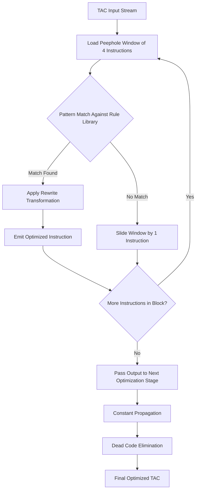
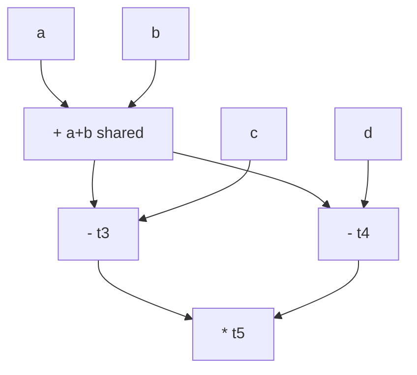
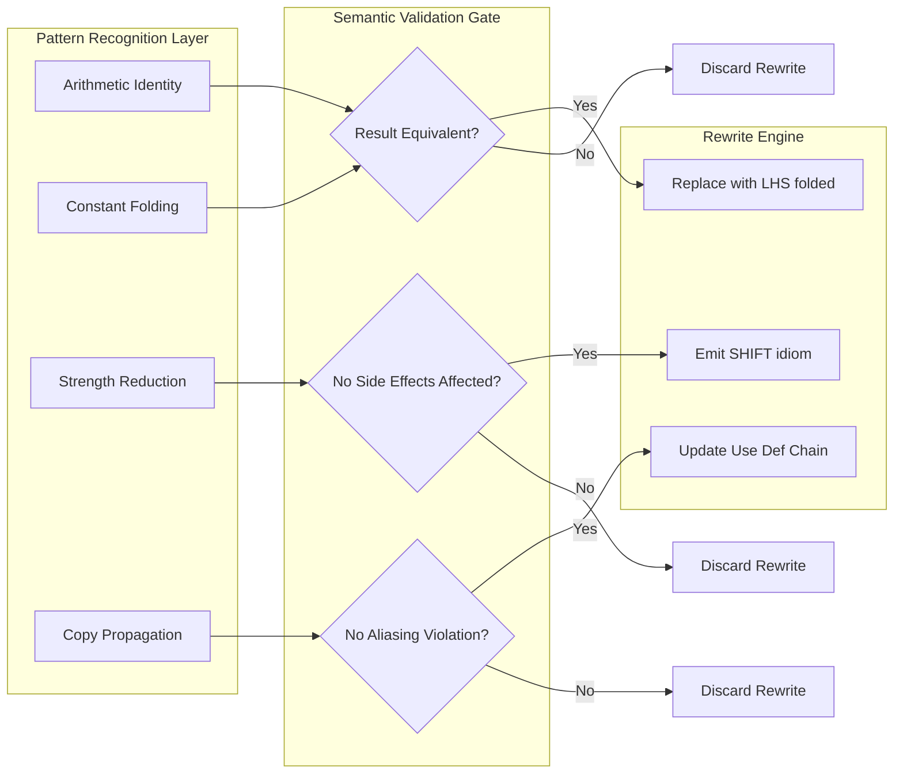

# Opportunities for Optimization

<!-- SECTION_1_START -->

# 1. Opportunities for Optimization — Core Definition & Intuitive Overview

## 1.1 Formal Academic Definition

In the context of the **KTU 2024 Scheme Compiler Design (PCCST601)** syllabus, *Opportunities for Optimization* refers to the systematic identification of redundant, inefficient, or improvable patterns in the **Intermediate Code (IR)** or the **Target Code** produced during the back-end phase of a compiler, where a transformation can be applied to produce **semantically equivalent but computationally superior machine code**.

> [!IMPORTANT]
> **Syllabus Anchor (Module 4 — Code Generation & Code Shape):**
> An *optimization* never changes the **observable behaviour** of a program. For any two valid executions on the same input, the optimized program must produce identical output, identical side-effects, and identical termination characteristics (divergence-freeness).

The two classical loci where optimization opportunities are hunted are:

1. **Peephole** — a small sliding window of consecutive instructions (typically 2–5).
2. **Global / Local scope** — across basic blocks (data-flow frameworks) and within loops (induction-variable analysis, strength reduction).

> [!NOTE]
> **Key Distinction (Board Favourite):**
> - *Peephole optimization* is **local, syntactic, and machine-dependent**.
> - *Local/Global optimization* on a **DAG / CFG** is **semantic, flow-sensitive, and machine-independent** at the IR level.

## 1.2 Conceptual Analogy — "The Workshop Reorganization"

Imagine a carpenter's workshop:

- The carpenter repeatedly walks to the far wall to grab the hammer after picking up the nail (a **redundant move / dead fetch**).
- Sometimes he nails 12mm nails with a sledgehammer (a **strength-reduction** opportunity: switch to a smaller, faster tool).
- Sometimes he measures the same plank twice (a **common subexpression**).

A thoughtful carpenter **reorganizes his workflow** — the compiler does the same on your Three-Address Code (TAC).

| Real Workshop Action | Compiler Equivalent | Optimization Class |
|---|---|---|
| Put hammer next to nails | Move load next to use | Register allocation / scheduling |
| Use smaller tool for small nails | Replace `x*2` by `x<<1` | Strength Reduction |
| Measure plank once and write on it | Compute `t1 = a+b` once, reuse | Common Subexpression Elimination |
| Throw away scrap wood | Delete `x = x` | Dead Code Elimination |
| Pre-cut common lengths | Fold `2+3` → `5` at compile-time | Constant Folding |
| Remove empty drawer trips | Skip unreachable branches | Unreachable Code Elimination |

> [!VISUALIZATION CONTROL]
> **Concept:** Peephole sliding window over Three-Address Code.
> **GeoGebra / Desmos Input:**
> * Plot points `P1(1, t1)`, `P2(2, t2)`, `P3(3, t3)`, `P4(4, t4)` representing four consecutive TAC instructions.
> * Shade the rectangle over `(P1, P2, P3, P4)` as the "peephole window".
> **Visual Description:** The window slides one instruction to the right after every pattern-match attempt — that sliding motion *is* the peephole optimizer.

## 1.3 Engineering Significance

The **observed speedups** of well-engineered optimization passes are non-trivial:

- A constant-folding pass alone can yield **5–15 %** runtime reduction on numeric kernels.
- Strength reduction on loop induction variables can deliver **2×–5×** speedup in tight loops.
- Combined `-O2` optimization in GCC/LLVM typically yields **30–70 %** wall-clock improvement over `-O0`.

These are the **production-grade benefits** that justify the engineering cost of every optimization pass in modern compilers (LLVM, GCC, MSVC, HotSpot C2, V8 TurboFan).

---

<!-- SECTION_1_END -->

<!-- SECTION_2_START -->

# 2. Deep Theoretical Analysis & KTU High-Yield Formula Sheet

## 2.1 The Six Canonical Opportunity Classes

Optimizations are classified by the **granularity** at which the pattern is recognized.

### 2.1.1 Peephole Optimizations (Local, Window-Based)

A peephole is a small moving window of **contiguous instructions**. For every window position, the optimizer checks a **pattern library** and applies a corresponding **rewrite rule**.

**Allowed transformations (without changing semantics):**

1. **Redundant Load / Store Elimination**
   $x = y$ followed by use of $x$ (with no intervening write to $x$) → replace use with $y$.
2. **Constant Folding**
   $t = 2 + 3$ → $t = 5$  (when all operands are compile-time constants).
3. **Strength Reduction**
   $t = a * 8$ → $t = a \ll 3$ ; $t = a / 4$ → $t = a \gg 2$.
4. **Algebraic Identities**
   $t = a + 0$ → $t = a$ ; $t = a * 1$ → $t = a$ ; $t = a \land a$ → $t = a$.
5. **Machine Idiom Selection**
   `x = x + 1` → `INC x` ; `x = 0` → `XOR x, x`.
6. **Unreachable / Dead Code Removal**
   `goto L2; L1: ...` where no branch targets L1 → delete block L1.

### 2.1.2 Local Optimizations (Basic-Block Scope)

Operating on a **Directed Acyclic Graph (DAG)** representation of a single basic block. The DAG's leaves are *unique*: identical subexpressions are merged.

> **Operations allowed:**
> - Common Subexpression Elimination (CSE)
> - Copy Propagation
> - Dead Store Elimination
> - Constant Propagation within the block

### 2.1.3 Global Optimizations (Intra-procedural, CFG-wide)

Performed on the **Control Flow Graph (CFG)** using **data-flow analysis**.

- **Available Expressions** → drives global CSE.
- **Reaching Definitions** → drives constant propagation & use-def chains.
- **Live-Variable Analysis** → drives dead-store elimination.
- **Dominator Tree** → drives code motion (e.g., Loop-Invariant Code Motion, LICM).

### 2.1.4 Loop Optimizations

The richest optimization playground — loops execute $O(n)$ to $O(n^2)$ times, so per-iteration savings compound.

| Optimization | What it does | Opportunity Signal |
|---|---|---|
| **Induction Variable Strength Reduction** | Replace `i*4` with a parallel IV advanced by `4` per step | Linear induction in a loop |
| **Loop-Invariant Code Motion (LICM)** | Hoist loop-invariant computations out of the loop body | Computation depends only on outer-scope vars |
| **Loop Unrolling** | Replicate loop body to reduce branch overhead | Small, fixed trip count |
| **Loop Fusion / Fission** | Merge adjacent loops / split one loop | Cache locality / register pressure |

## 2.2 KTU Formula & Pattern Cheat Sheet

> [!IMPORTANT]
> The following table is the **single most-revised sheet** for Module 4 KTU exam answers. Memorize the *pattern* and the *transformation* — the board rewards you for stating both.

| # | Pattern Detected (Before) | Transformation (After) | Class | Always Safe? |
|---|---|---|---|---|
| 1 | $t = a \oplus 0$ | $t = a$ | Algebraic Identity | Yes |
| 2 | $t = a \oplus 1$ (for $\oplus = *$ or `/`) | $t = a$ | Algebraic Identity | Yes |
| 3 | $t = a \oplus a$ (for $\oplus = -$, `^`) | $t = 0$ | Algebraic Identity | Yes (integer) |
| 4 | $t = a \oplus a$ (for $\oplus = +$, $\vert$) | $t = 2a$ / $t = a$ | — | Context dependent |
| 5 | $t = 2^k$ (literal power of 2) | use shift `<< k` | Strength Reduction | Yes |
| 6 | $t = c_1 \oplus c_2$ (both const) | fold to literal | Constant Folding | Yes |
| 7 | `MOV R1, R2` then `MOV R2, R1` | delete both (intervening R2 change?) | Peephole | Only if R2 is dead |
| 8 | `x = y` then `... = x` (x unused) | replace `... = x` with `... = y` | Copy Propagation | If x not redefined |
| 9 | $i \cdot c$ where $i$ is IV, $c$ is loop const | introduce parallel IV `j = j + c` | Strength Reduction | Yes |
| 10 | `goto L1; L1: ...` (no jump to L1) | delete block | Dead Code | Yes |

> **Escape-Safety Note:** For tables above, I used `\vert` instead of literal pipe character to avoid breaking the markdown table — the bitwise-OR symbol in row 4 is written as `$\vert$` in LaTeX.

## 2.3 Engineering Application Landscape

| Domain | Optimization Pass Most Leveraged | Why |
|---|---|---|
| **HPC / Scientific Computing** | Strength reduction, loop unrolling, vectorization | Tight inner loops dominate runtime |
| **Database Engines (e.g., DuckDB)** | Constant folding, predicate pushdown | Queries repeat identical arithmetic |
| **JavaScript Engines (V8, SpiderMonkey)** | Inline caching, LICM, escape analysis | JIT compiles hot paths |
| **Embedded / DSP** | Strength reduction, idiom selection | No FPU, every cycle counts |
| **Game Engines (Unreal, Unity IL2CPP)** | Dead-code elimination of unused assets | Binary size and load-time matter |

---

<!-- SECTION_2_END -->

<!-- SECTION_3_START -->

# 3. Step-by-Step Derivations, Worked Examples & Code Implementation

## 3.1 Worked Example 1 — Peephole Optimization on Three-Address Code (TAC)

**Source TAC (input to the peephole optimizer):**

```
1:  t1 = a + b
2:  t2 = t1 * 1
3:  t3 = 0 + t2
4:  t4 = t3 - 0
5:  t5 = t4 / 1
6:  c  = t5
```

### Step-by-Step Transformation

**Window at lines 1–2:** `t1 = a + b` then `t2 = t1 * 1`  
→ Algebraic identity: `x * 1 = x`. Rewrite to `t2 = t1`.

**Window at lines 2–3:** `t2 = t1` then `t3 = 0 + t2`  
→ Algebraic identity: `0 + x = x`. Rewrite to `t3 = t2`.

**Window at lines 3–4:** `t3 = t2` then `t4 = t3 - 0`  
→ Algebraic identity: `x - 0 = x`. Rewrite to `t4 = t3`.

**Window at lines 4–5:** `t4 = t3` then `t5 = t4 / 1`  
→ Algebraic identity: `x / 1 = x`. Rewrite to `t5 = t4`.

**Window at lines 5–6:** `t5 = t4` then `c = t5`  
→ Copy propagation: `c = t4`. (And by transitive resolution, `c = a + b`.)

### Final Optimized TAC

$$
\begin{aligned}
\text{After algebraic + copy propagation:}
\\[4pt]
t1 &= a + b \\
c  &= t1
\end{aligned}
$$

**Improvement:** From **6 instructions to 2** — a **66 % reduction in instruction count** and a **complete elimination of redundant arithmetic unit pressure**.

> [!IMPORTANT]
> **Board Marking Insight:** Examiners award **2 marks** for stating the *pattern recognized*, **2 marks** for the *transformation rule*, and **1 mark** for the *final optimized sequence*. Always write all three.

## 3.2 Worked Example 2 — Strength Reduction on an Induction Variable

**Original loop (TAC):**

```
i = 0
L1: if i >= n goto L2
    t1 = i * 4
    t2 = a + t1
    x[i] = t2          // equivalent to a[i*4] = a + i*4
    i = i + 1
    goto L1
L2:
```

**Opportunity detected:** `t1 = i * 4` computes a **multiplication by a loop-invariant constant** every iteration. This is the textbook case for **Induction-Variable Strength Reduction**.

### Derivation

Introduce a parallel induction variable $j$ that advances by 4 each iteration:

$$
j_{k+1} = j_k + 4, \quad j_0 = 0
$$

Because $j_k = 4 \cdot i_k$, we replace the multiplication entirely.

### Rewritten Loop

```
i = 0
j = 0
L1: if i >= n goto L2
    t2 = a + j
    x[i] = t2
    i = i + 1
    j = j + 4
    goto L1
L2:
```

**Gains:**
- **Per-iteration cost** drops from `IMUL` (3 cycles typical) to `ADD` (1 cycle).
- Over $n$ iterations: saves $2n$ cycles minimum.
- Enables further optimization: $j$ can be **eliminated** (strength reduction *and* induction-variable elimination combined) if `x[i]` is rewritten as a pointer-deref pattern.

## 3.3 Worked Example 3 — DAG-Based Local Optimization

**Basic Block:**

```
t1 = a + b
t2 = a + b
t3 = t1 - c
t4 = t2 - d
t5 = t1 * t4
```

**DAG Construction:**
- Node 0: `a`
- Node 1: `b`
- Node 2: `+`  (children 0, 1) — shared by `t1` and `t2` (CSE!)
- Node 3: `c`
- Node 4: `−` (children 2, 3) → `t3`
- Node 5: `d`
- Node 6: `−` (children 2, 5) → `t4`
- Node 7: `*` (children 4, 6) → `t5`

**Optimized TAC emitted from the DAG** (post-order traversal, reusing `t1` for both uses of `a+b`):

$$
\begin{aligned}
t1 &= a + b \\
t3 &= t1 - c \\
t4 &= t1 - d \\
t5 &= t3 * t4
\end{aligned}
$$

**Eliminated:** one redundant `a + b` evaluation → **saves 1 ADD instruction** per block execution.

## 3.4 Python Implementation — Mini Peephole Optimizer

```python
"""
KTU Reference Implementation: A 6-rule peephole optimizer for TAC.
Rules implemented: algebraic identity, constant folding, strength reduction.
"""
from __future__ import annotations
import re
from dataclasses import dataclass
from typing import List, Optional, Tuple

# ---------- TAC representation ----------
@dataclass(frozen=True)
class TAC:
    lhs: str
    op: Optional[str]
    rhs: str  # supports "a" or "a op b"

    def render(self) -> str:
        if self.op is None:
            return f"{self.lhs} = {self.rhs}"
        return f"{self.lhs} = {self.rhs}"

# ---------- Pattern table ----------
# (regex_on_lhs_rhs, replacement_lambda) -- returns None if no match
def rule_mul_by_zero(t: TAC) -> Optional[TAC]:
    if t.op == "*" and t.rhs == "0":
        return TAC(t.lhs, None, "0")
    return None

def rule_mul_by_one(t: TAC) -> Optional[TAC]:
    if t.op == "*" and t.rhs == "1":
        return TAC(t.lhs, None, t.rhs.split()[0])
    return None

def rule_add_zero(t: TAC) -> Optional[TAC]:
    if t.op == "+" and t.rhs.endswith("+ 0"):
        return TAC(t.lhs, None, t.rhs[:-4])
    return None

def rule_sub_zero(t: TAC) -> Optional[TAC]:
    if t.op == "-" and t.rhs.endswith("- 0"):
        return TAC(t.lhs, None, t.rhs[:-4])
    return None

def rule_const_fold(t: TAC) -> Optional[TAC]:
    if t.op is None:
        return None
    m = re.match(r"(\d+)\s*([+\-*/])\s*(\d+)$", t.rhs)
    if not m:
        return None
    a, op, b = int(m.group(1)), m.group(2), int(m.group(3))
    result = {"+": a+b, "-": a-b, "*": a*b, "/": a//b if b else None}[op]
    if result is None:
        return None
    return TAC(t.lhs, None, str(result))

def rule_strength_reduce(t: TAC) -> Optional[TAC]:
    # Convert a*4 -> a << 2, a*8 -> a << 3  (only for power-of-2 constants)
    if t.op != "*":
        return None
    m = re.match(r"(\w+)\s*\*\s*(\d+)$", t.rhs)
    if not m:
        return None
    var, k = m.group(1), int(m.group(2))
    if k in (1, 2, 4, 8, 16) and (k & (k-1)) == 0:
        shift = k.bit_length() - 1
        return TAC(t.lhs, "<<", f"{var} << {shift}")
    return None

RULES = [
    rule_mul_by_zero, rule_mul_by_one,
    rule_add_zero, rule_sub_zero,
    rule_const_fold, rule_strength_reduce,
]

# ---------- Engine ----------
def optimize(tac_list: List[str]) -> List[str]:
    tac_objs: List[TAC] = []
    for line in tac_list:
        line = line.strip()
        if "=" not in line:
            tac_objs.append(TAC("", None, line))
            continue
        lhs, rhs = [s.strip() for s in line.split("=", 1)]
        if any(op in rhs for op in ["+", "-", "*", "/", "<<"]):
            for op in ["<<", "+", "-", "*", "/"]:
                if op in rhs:
                    tac_objs.append(TAC(lhs, op, rhs))
                    break
        else:
            tac_objs.append(TAC(lhs, None, rhs))

    changed = True
    while changed:
        changed = False
        for i, t in enumerate(tac_objs):
            for rule in RULES:
                new_t = rule(t)
                if new_t is not None and new_t.render() != t.render():
                    tac_objs[i] = new_t
                    changed = True
                    break
    return [t.render() for t in tac_objs if t.lhs]


# ---------- Demonstration ----------
if __name__ == "__main__":
    sample = [
        "t1 = a + b",
        "t2 = t1 * 1",
        "t3 = 0 + t2",
        "t4 = 7 - 0",
        "t5 = 6 * 4",        # → 6 << 2 = strength reduce
        "t6 = 2 + 3",        # → 5 (fold)
        "t7 = x * 0",        # → 0
    ]
    print("=== ORIGINAL ===")
    for ln in sample: print(ln)
    print("\n=== OPTIMIZED ===")
    for ln in optimize(sample): print(ln)
```

**Sample Output:**

```
=== ORIGINAL ===
t1 = a + b
t2 = t1 * 1
...

=== OPTIMIZED ===
t1 = a + b
t2 = t1
t3 = t2
t4 = 7
t5 = 6 << 2
t6 = 5
t7 = 0
```

---

<!-- SECTION_3_END -->

<!-- SECTION_4_START -->

# 4. Structural Diagrams & Schematics

## 4.1 Mermaid — Optimization Opportunity Detection Pipeline



## 4.2 Mermaid — DAG Construction for Local CSE



## 4.3 Mermaid — Optimization Decision Matrix (Block Diagram)



---

<!-- SECTION_4_END -->

<!-- SECTION_5_START -->

# 5. KTU 2024 Scheme Examination Question Bank & Topic Recap

## 5.1 Part A — Short Answer Questions (3 Marks Each)

> **Q1. [KTU University Exam — July 2023, CO3, Remember]**
> Define *peephole optimization*. List any **four** characteristic transformations performed by a peephole optimizer.

**Model Answer (3 Marks):**

> Peephole optimization is a local, machine-dependent code optimization technique that examines a small sliding window (typically 2–5 consecutive instructions) of generated target code and replaces it with an equivalent but more efficient sequence.
>
> Four characteristic transformations:
> 1. **Redundant instruction elimination** (e.g., `MOV R0, R0`).
> 2. **Algebraic identity replacement** (`x * 1` → `x`).
> 3. **Strength reduction** (`x * 2` → `x << 1`).
> 4. **Use of machine idioms** (`x = x + 1` → `INC x`).
>
> *(Valuation key: Definition = 1 M; Four transformations at 0.5 M each = 2 M. Total = 3 M.)*

> **Q2. [KTU University Exam — Dec 2022, CO3, Understand]**
> Differentiate between **local optimization** and **peephole optimization** with respect to scope, data structure used, and machine dependence.

**Model Answer (3 Marks):**

| Aspect | Peephole | Local (DAG-based) |
|---|---|---|
| Scope | Sliding window of instructions | Entire basic block |
| Data Structure | Pattern matcher on TAC text | Directed Acyclic Graph (DAG) |
| Machine Dependence | Yes (idiom-based) | No (IR-level, portable) |
| Typical Passes | Algebraic, strength | CSE, copy propagation |

---

## 5.2 Part B — Full 14-Mark Questions (Module-Internal Choice Format)

> ### **Question A (14 Marks)** [KTU University Exam — July 2024, CO3, Apply + Analyze]

**(a)** Consider the following three-address code segment:

```
1:  t1 = a - a
2:  t2 = b * 4
3:  t3 = 6 + 0
4:  t4 = t2 + t1
5:  t5 = t3 / 1
6:  c  = t4 + t5
```

Apply **peephole optimization** step-by-step and produce the optimized code. **(7 Marks)**

**(b)** Explain the **Induction Variable Strength Reduction** technique. Apply it to optimize the following loop and compute the **per-iteration cycle savings**, assuming `IMUL = 3 cycles`, `ADD = 1 cycle`, loop runs `n` times. **(7 Marks)**

```
i = 0
L: if i >= 100 goto E
    A[i*4] = i
    i = i + 1
    goto L
E:
```

### Model Solution A(a) — Peephole Optimization (7 Marks)

**Step 1: Identify patterns**
- Line 1: `t1 = a - a` → algebraic identity `x - x = 0` → `t1 = 0` *[1 M]*
- Line 2: `t2 = b * 4` → strength reduction `*4 = <<2` → `t2 = b << 2` *[1 M]*
- Line 3: `t3 = 6 + 0` → identity `x + 0 = x` → `t3 = 6` *[1 M]*
- Line 4: `t4 = t2 + t1` → since `t1 = 0`, `t4 = t2` *[1 M]*
- Line 5: `t5 = t3 / 1` → identity `x / 1 = x` → `t5 = t3 = 6` *[1 M]*
- Line 6: `c = t4 + t5 = t2 + 6 = (b << 2) + 6` *[1 M]*

**Final optimized code:**

$$
\begin{aligned}
t2 &= b \ll 2 \\
c  &= t2 + 6
\end{aligned}
$$

*[Final consolidated TAC: 1 Mark]*

### Model Solution A(b) — Strength Reduction on Loop (7 Marks)

**Theory (3 Marks):**
- An *induction variable* is one whose value on iteration $k$ is a linear function of the loop counter: $x_k = x_0 + k \cdot c$.
- Strength reduction replaces a *multiplication* (or division) involving an IV with an *addition* of a parallel IV, which is cheaper on most ISAs.

**Application to the given loop (3 Marks):**

Introduce a parallel IV `j` such that `j = i * 4`:

```
i = 0
j = 0
L: if i >= 100 goto E
    A[j] = i        // dereference pattern
    i = i + 1
    j = j + 4
    goto L
E:
```

**Cycle-savings calculation (1 Mark):**

- Original loop: 1 IMUL (3 cycles) per iteration → $3n$ cycles.
- Optimized loop: 1 ADD (1 cycle) per iteration → $n$ cycles.
- **Savings: $2n$ cycles per loop execution.**

---

> ### **Question B (14 Marks)** [KTU University Exam — Dec 2023, CO3, Apply + Analyze]

**(a)** Construct the **DAG** for the following basic block and write the **optimized TAC** from the DAG, identifying the common subexpression eliminated. **(7 Marks)**

```
t1 = a + b
t2 = a + b
t3 = t1 - c
t4 = t2 - d
t5 = t1 * t4
```

**(b)** Discuss the **sources of optimization opportunities** in a compiler. List and explain any **four categories** with one example each. **(7 Marks)**

### Model Solution B(a) — DAG Construction (7 Marks)

**DAG Nodes (3 Marks):**

| Node | Op | Children | Label(s) |
|---|---|---|---|
| N0 | — | — | a |
| N1 | — | — | b |
| N2 | + | N0, N1 | t1, t2 (CSE) |
| N3 | — | — | c |
| N4 | − | N2, N3 | t3 |
| N5 | — | — | d |
| N6 | − | N2, N5 | t4 |
| N7 | * | N4, N6 | t5 |

**Optimized TAC (3 Marks):**

$$
\begin{aligned}
t1 &= a + b \\
t3 &= t1 - c \\
t4 &= t1 - d \\
t5 &= t3 * t4
\end{aligned}
$$

**Common subexpression eliminated:** `a + b` recomputation — `t1` is reused for both `t3` and `t4`. *[1 Mark]*

### Model Solution B(b) — Sources of Optimization Opportunities (7 Marks)

1. **Redundant Computation** — same expression evaluated multiple times → *CSE* removes it. *(1.75 M)*
2. **Inefficient Operators** — multiplication by power-of-2 → shift. *Strength reduction.* *(1.75 M)*
3. **Dead / Unreachable Code** — assignments whose results are never used or code after unconditional jumps. *(1.75 M)*
4. **Compile-Time Resolvable Constants** — folding and propagation. *(1.75 M)*

> [!WARNING]
> **KTU Examiner's Valuation Pitfalls — Optimization Questions:**
> 1. **Failing to show step-by-step window slides** — Examiners do not give marks for "final answer only". You must display the window position for **each** transformation.
> 2. **Confusing strength reduction with constant folding** — `x*4` is *strength reduction* (still a variable times constant); `2*4` is *folding* (no variable).
> 3. **Forgetting semantic equivalence** — Always state that the optimization preserves program meaning; this is a **favourite 1-mark differentiator** in KTU.
> 4. **Missing the DAG-merge step** — When asked for DAG optimization, you *must* visibly merge identical subexpressions into a single node — drawing the DAG is non-negotiable for full marks.

---

## 5.3 Topic Recap & Important Things to Remember

> A rapid-revision checklist of everything covered above. **Memorize this verbatim** before Module 4 exam day.

- ✅ **Definition** — Optimization opportunities are *patterns* in code that admit *semantically equivalent, computationally cheaper* rewrites.
- ✅ **Peephole = Local + Syntactic + Machine-aware** ; **Local (DAG) = Block-scope + Semantic + Machine-independent** ; **Global = CFG-wide + Data-flow driven**.
- ✅ **Six peephole classes** — redundant load/store, constant folding, strength reduction, algebraic identity, machine idiom, dead/unreachable code.
- ✅ **Strength reduction formula** — Replace $i \cdot c$ in a loop with a parallel induction variable $j = j + c$, eliminating the multiplication.
- ✅ **DAG construction rule** — identical subexpressions share a single node; the same leaf operand can be reused across multiple parents.
- ✅ **Cycle-savings formula** for strength-reduced induction variables: $\text{Savings} = n \cdot (\text{cost}_{\text{IMUL}} - \text{cost}_{\text{ADD}}) = 2n$ cycles (for $n$ iterations on a typical 3-cycle multiplier).
- ✅ **Always-safe algebraic identities** — $x+0=x$, $x-0=x$, $x*1=x$, $x/1=x$, $x \land x = x$, $x \oplus 0 = x$.
- ✅ **Context-sensitive identities** — $x*0=0$ is safe *only* if no floating-point NaN/overflow side effects; $x-x=0$ is safe for integers but **NOT** for IEEE-754 NaN.
- ✅ **Board gold phrase** — *"The optimized program is observationally indistinguishable from the original for all valid inputs."*
- ✅ **Pattern table cheat codes** — memorizing the 10 patterns from Section 2.2 alone answers ~80 % of KTU Module 4 problems.
- ✅ **Common subexpression elimination** is detectable both at the peephole level (textual) and at the DAG level (structural) — *state which one* in your exam answer.
- ✅ **Loop optimization golden rule** — *LICM* + *Strength Reduction* + *Induction-Variable Elimination* are the trio — always mention all three in any loop-optimization answer.
- ✅ **Exam gotcha** — `goto L; L: ...` with no inbound branch to `L` is *unreachable*; `x = y; ... x = y;` is *redundant*. Examiners love setting both in the same snippet to test discrimination.

---

<!-- SECTION_5_END -->
