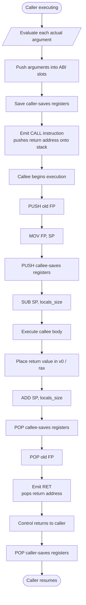
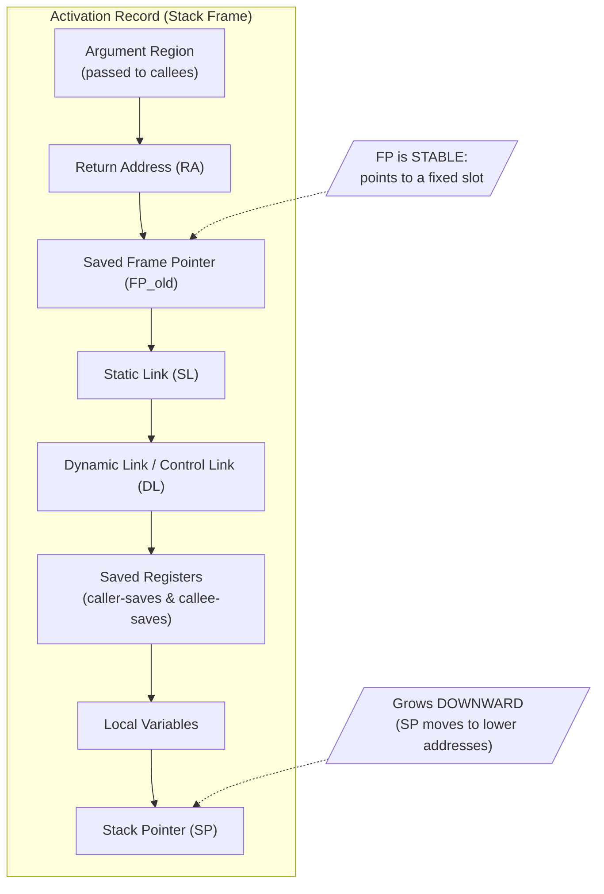
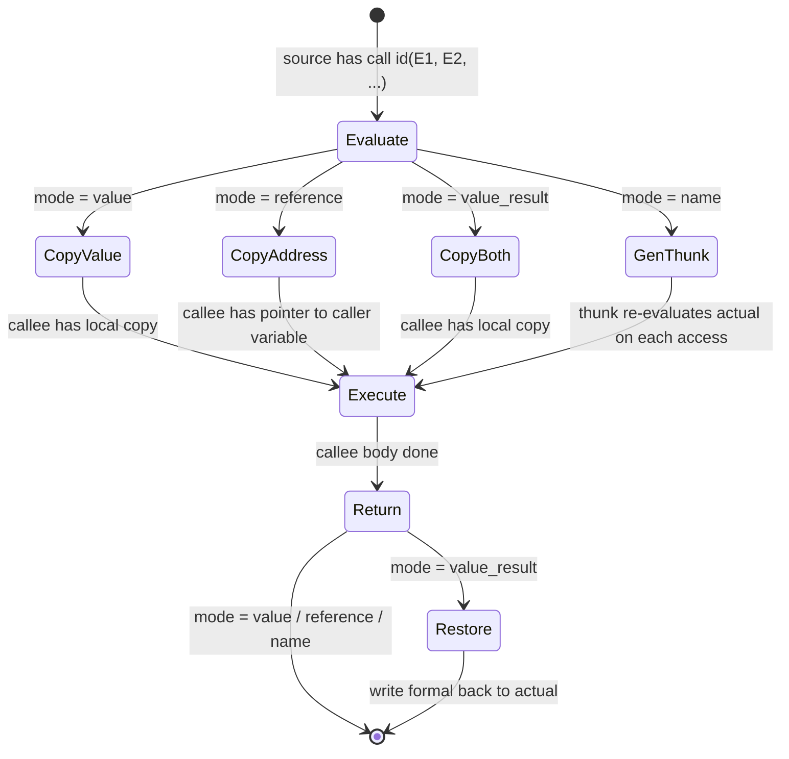
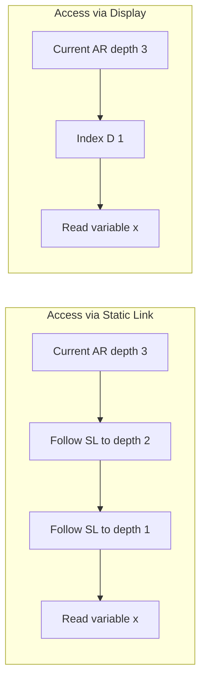
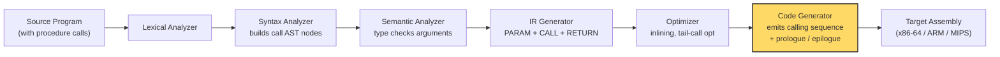

# Procedure Calls

<!-- SECTION_1_START -->
# Procedure Calls — Code Generation Context

## 1.1 Formal Definition (KTU 2024 Syllabus Terminology)

In the **Code Generation** phase of a compiler, a **procedure call** (also called a **function call** or **subprogram invocation**) is the runtime mechanism that transfers control from a **calling procedure** (caller) to a **called procedure** (callee), along with the binding of actual parameters, allocation of an **activation record (AR)** on the run-time stack, and the eventual return of control plus an optional return value to the caller.

> [!IMPORTANT]
> **Activation Record (Stack Frame):** A contiguous block of memory allocated on the **call stack** whenever a procedure is invoked. It stores all bookkeeping information (return address, parameters, saved registers, local variables, links) needed to correctly execute and later resume the calling context.

A **calling sequence** is the executable code that performs the actions just *before* and *just after* a procedure call — it is the bridge between the caller and the callee. The **return sequence** is the symmetric code that restores the caller's state and resumes its execution.

## 1.2 Conceptual Analogy & Intuition

Imagine you are writing a formal letter to a government office:

1. You **seal your current task** in a labelled envelope (save the state — registers, local variables, "where I was in my work").
2. You **attach the reference number, supporting documents, and the question to be answered** (push parameters and the return address).
3. You **hand the envelope to the clerk** (CALL instruction).
4. The clerk **opens the envelope, processes it, attaches a reply** (callee executes, prepares a return value).
5. The clerk **sends the reply back to you** (RETURN).
6. You **unseal your envelope, resume exactly where you paused** (restore state, continue execution).

The **envelope** is the **activation record**, the **clerk's desk** is the **callee's stack frame**, and the entire office workflow is the **calling sequence**. Without a strictly-defined sequence, the envelope can get lost — the same is true if a compiler does not generate the correct prologue/epilogue code.

> [!NOTE]
> **KTU Board Focus Point:** Examiners frequently test whether students can clearly distinguish *who* (caller vs. callee) is responsible for *which* action in the calling sequence. Memorize the split-of-labor table in §2.

## 1.3 Standard Metrics & Terminology

| Term | Symbol / Notation | Meaning |
|------|-------------------|---------|
| Activation Record Size | $\vert AR \vert$ | Total bytes reserved for one procedure invocation |
| Frame Pointer | $FP$ | Points to a fixed position inside the current AR |
| Stack Pointer | $SP$ | Points to the top of the stack (grows downward) |
| Return Address | $RA$ | Address of the instruction to resume in the caller |
| Static Link | $SL$ | Pointer to the AR of the *lexically* enclosing scope |
| Dynamic Link | $DL$ | Pointer to the AR of the *runtime* caller (control link) |
| Display | $D[i]$ | Fast-access array of pointers for the $i^{\text{th}}$ enclosing scope |
| Parameter Passing Modes | — | **Call-by-value**, **Call-by-reference**, **Call-by-value-result**, **Call-by-name** |

> [!VISUALIZATION CONTROL]
> **Concept:** Stack growth during nested procedure calls.
> **GeoGebra / Desmos Input Equations:**
> * `f(x) = -x` (visualize downward-growing stack with $SP$ moving left)
> * Rectangles marking `main → A → B → C` with $SP$ at the deepest point.
> **Visual Description:** The student should see four vertically stacked rectangles (one per active procedure), each pushed lower on the page as the call depth increases. The topmost rectangle is always the *currently executing* procedure; the bottom-most is `main`.

---

<!-- SECTION_1_END -->

<!-- SECTION_2_START -->
# Deep Theoretical Analysis & KTU High-Yield Formula Sheet

## 2.1 Anatomy of an Activation Record (Standard Layout)

A typical activation record, when $FP$ points to the first local (or to the saved $FP$), is laid out as follows:

$$
\begin{aligned}
\text{High Address} \quad & \leftarrow \text{Argument region (passed to *callees*)} \\
& \leftarrow \text{Return address } (RA) \\
& \leftarrow \text{Saved Frame Pointer of caller } (FP_{old}) \\
& \leftarrow \text{Static Link } (SL) \\
& \leftarrow \text{Dynamic Link / Control Link } (DL) \\
& \leftarrow \text{Saved registers (caller-saves / callee-saves)} \\
& \leftarrow \text{Local variables} \\
\text{Low Address} \quad & \leftarrow SP
\end{aligned}
$$

> [!IMPORTANT]
> Different compilers choose slightly different layouts. **GCC/LLVM (System V AMD64 ABI)** and **MSVC (x64 calling convention)** differ in *where* the arguments go (registers vs. stack) and *who* saves which registers. For KTU theory, use the **generic textbook layout** above — the syllabus assumes the Aho/Sethi/Ullman model.

## 2.2 The Calling Sequence — Who Does What?

| Step | Action | Responsibility | Reason |
|------|--------|----------------|--------|
| 1 | Evaluate actual parameters and place them where callee can read | **Caller** | Parameter expressions live in caller's scope |
| 2 | Push $RA$ (return address) | **Caller** | Callee doesn't know where to return |
| 3 | Save $FP$ of caller, set new $FP$ | **Callee** | Establishes a stable reference point |
| 4 | Save any registers the callee will overwrite | **Callee** | Honors callee-save convention |
| 5 | Extend $SP$ downward to allocate locals | **Callee** | Local data is private to callee |
| 6 | Execute callee body | **Callee** | Actual work |
| 7 | Place return value in agreed location (e.g. `$v0` / `$rax`) | **Callee** | Standard ABI return slot |
| 8 | Restore callee-saved registers, $FP$, $SP$ | **Callee** | Reverse the prologue |
| 9 | Pop $RA$, jump back (RETURN) | **Callee** | Transfer control to caller |
| 10 | Retrieve return value, continue execution | **Caller** | Resume post-call context |

> [!NOTE]
> **Mnemonic for KTU Viva:** "Caller prepares the *road* (parameters, RA). Callee builds the *house* (saves, locals). On exit, callee *demolishes* the house and points the way back. Caller then *walks back* to its own work."

## 2.3 Parameter Passing Mechanisms

### 2.3.1 Call-by-Value
The actual argument is **evaluated** and its **r-value** is copied into the callee's parameter slot. The callee has its own local copy — modifications do **not** affect the caller.

$$
\text{formal}_i \;\leftarrow\; \text{copy of actual}_i
$$

### 2.3.2 Call-by-Reference
The **address (l-value)** of the actual argument is passed. The callee accesses the argument indirectly through a pointer, so modifications are visible to the caller.

$$
\text{formal}_i \;\leftarrow\; \text{address of actual}_i
$$

### 2.3.3 Call-by-Value-Result (Copy-Restore)
A hybrid: the value is copied **in** at call time and copied **back out** at return time. The caller and callee see local copies, but final callee values overwrite caller variables.

$$
\begin{aligned}
\text{formal}_i &\;\leftarrow\; \text{copy of actual}_i \quad &\text{(on entry)} \\
\text{actual}_i &\;\leftarrow\; \text{formal}_i \quad &\text{(on return)}
\end{aligned}
$$

### 2.3.4 Call-by-Name
A ** thunk ** is generated — a parameterless procedure that re-evaluates the actual argument **on every access** inside the callee. This is the classic Jensen's device model used in Algol 60.

> [!IMPORTANT]
> **KTU Pitfall:** Examiners often ask: "In *call-by-reference*, can the formal parameter ever be a literal (e.g. `5`)?" The answer is **No**, because a literal has no l-value. The compiler must either reject it or copy it into a temporary (a *compile-time fix-up*).

## 2.4 Static vs. Dynamic Depth — The Need for Static Links

- **Dynamic depth:** number of *active* (currently executing) calls on the stack when a procedure is invoked.
- **Static (lexical) depth:** the nesting depth of the procedure's declaration in the source code.

To access a non-local variable, the compiler must walk up the chain of **static links** (or use a **display**):

$$
\text{offset from } FP \text{ to variable } x = \sum_{i=k+1}^{d_{cur}} \text{size}(\text{AR}_i)
$$

where $k$ is the static depth of $x$'s declaration and $d_{cur}$ is the current static depth. A **display** $D$ precomputes these pointers for $O(1)$ access.

## 2.5 KTU Formula Sheet

| # | Concept | Formula / Expression | Notes |
|---|---------|----------------------|-------|
| 1 | AR Memory Size | $\vert AR \vert = \text{locals} + \text{params} + \text{bookkeeping}$ | Bytes; rounded to alignment |
| 2 | Stack growth (downward) | $SP_{new} = SP_{old} - \vert AR \vert$ | Typical convention |
| 3 | Frame Pointer offset | $FP = SP + (\text{size of locals} + \text{saved regs})$ | Stable under push/pop |
| 4 | Static-link walk cost | $O(d_{cur} - d_{target})$ | Linear in scope gap |
| 5 | Display access cost | $O(1)$ per non-local read | Uses $D[d_{target}]$ |
| 6 | Return value location | $v_0$ (MIPS), `$rax` (x86-64) | ABI-defined |
| 7 | Parameter slot (call-by-value) | $\text{MEM}[FP + 4i] = \text{actual}_i$ | 4-byte slot example |
| 8 | Reference param (passed) | $\text{MEM}[FP + 4i] = \&\text{actual}_i$ | Address of caller variable |
| 9 | Callee-saves count | $n_{cs}$ | Compiler-determined |
| 10 | Caller-saves count | $n_{cr}$ | Compiler-determined |

## 2.6 Real-World Engineering Utility

| Domain | Use of Procedure-Call Code Generation |
|--------|---------------------------------------|
| **JIT Compilers (V8, JVM, CLR)** | The code generator emits calling-convention-aware machine code at runtime; mismatches in argument passing crash with **segmentation faults** or **stack corruption**. |
| **Operating Systems (Linux Kernel)** | The kernel's `pt_regs` struct on the kernel stack is exactly an activation record; system calls are generated as `CALL`-like transitions. |
| **Embedded / RTOS Firmware** | Tail-call optimization and inlining decisions in the code generator determine stack depth — critical for MCUs with **< 4 KB** RAM. |
| **Reverse Engineering / Binary Analysis** | Tools like **Ghidra** and **IDA Pro** reconstruct activation records from binary code; understanding the calling sequence is *the* core skill. |
| **Debuggers (GDB, WinDbg)** | The "stack backtrace" (`bt` command) walks the dynamic-link chain — generated by the compiler's prologue code. |
| **FPGA / HDL Toolchains** | Procedure calls map onto *hardware call stacks* synthesized for soft-core processors (e.g. RISC-V on FPGA). |

> [!NOTE]
> **Industry Example:** The **Meltdown / Spectre** vulnerabilities (2018) exploited the fact that the CPU's *speculative execution* of procedure calls leaked AR contents through cache side-channels. This shows how critical correct procedure-call handling is — not just for compilers, but for *hardware security*.

---

<!-- SECTION_2_END -->

<!-- SECTION_3_START -->
# Step-by-Step Derivations, Code Generation Algorithm & Symbolic Implementation

## 3.1 Three-Address Code (TAC) Generation for Procedure Calls

The intermediate code generator must translate a high-level call such as `x = foo(a, b+c)` into a sequence of three-address instructions. Below is the standard translation scheme.

### 3.1.1 TAC Translation Scheme (Aho-Sethi-Ullman)

For a call statement of the form `call id(E_list)`:

$$
\begin{aligned}
\text{For each parameter } E_i \text{ in } E_{list} \text{ (evaluated left-to-right):} \quad & t_i \;=\; E_i \\
& \text{PARAM } t_i \\
\text{Then:} \quad & \text{CALL } id, \; n \quad &\text{where } n = \vert E_{list} \vert \\
\text{If return value used:} \quad & y \;=\; \text{RETURN\_VAL} \\
\text{If call is a statement (no return):} \quad & \text{CALL } id, \; n
\end{aligned}
$$

For a procedure *definition* `procedure id (F_list); D; B`:

$$
$$
\begin{aligned}
\text{Prologue:} \quad & id: \;\;\text{ENTRY} \\
\text{For each formal } f_i \text{ (declared in } F_{list}\text{):} \quad & \text{addr}(f_i) \;\text{is pre-assigned to an AR slot} \\
\text{Epilogue:} \quad & \text{RETURN} \\
\text{End marker:} \quad & \text{END}
\end{aligned}
$$ $$

### 3.1.2 Full Worked Example

Source program:

$$
\begin{aligned}
&\text{procedure } p(x, y); \\
&\quad \text{var } z : \text{integer}; \\
&\quad \text{begin } z := x + y; \text{ return } z \text{ end}; \\
&\text{main: begin } a := 10; \; b := 20; \; r := \text{call } p(a, b) \text{ end}
\end{aligned}
$$

Step-by-step translation to three-address code:

$$
\begin{aligned}
\text{1. Caller evaluates } a &\;\rightarrow\; t_1 = a \\
\text{2. Caller pushes } t_1 &\;\rightarrow\; \text{PARAM } t_1 \\
\text{3. Caller evaluates } b &\;\rightarrow\; t_2 = b \\
\text{4. Caller pushes } t_2 &\;\rightarrow\; \text{PARAM } t_2 \\
\text{5. Caller invokes callee} &\;\rightarrow\; \text{CALL } p, \; 2 \\
\text{6. Caller retrieves return} &\;\rightarrow\; t_3 = \text{RETURN\_VAL} \\
\text{7. Caller assigns to } r &\;\rightarrow\; r = t_3
\end{aligned}
$$

For the callee body of $p$:

$$
\begin{aligned}
\text{Prologue:} \quad & p: \;\;\text{ENTRY} \\
\text{Formal binding:} \quad & x \text{ is at } \text{arg}(0),\; y \text{ is at } \text{arg}(1) \\
\text{Body:} \quad & t_4 = x + y \\
& z = t_4 \\
& \text{RETURN\_VAL} = z \\
\text{Epilogue:} \quad & \text{RETURN} \\
& \text{END}
\end{aligned}
$$

> [!NOTE]
> **Reading the TAC:** `PARAM` is a *marker* instruction (does not emit code by itself in most backends). The code generator *lowers* the entire `PARAM` block plus `CALL` into the actual machine-code calling sequence.

## 3.2 Register Allocation & Saving Strategy — Symbolic Pseudocode

The following Python implementation mimics what a back-end allocator does *after* TAC is generated. It walks the TAC, identifies the call site, and emits the prologue/epilogue of an activation record.

```python
from dataclasses import dataclass, field
from typing import List, Optional
import logging

# Configure structured logging for compiler diagnostics
logging.basicConfig(
    level=logging.INFO,
    format="[%(levelname)s] code_gen: %(message)s"
)
logger = logging.getLogger("code_gen")

@dataclass(frozen=True)
class TACInstr:
    """A single three-address-code instruction."""
    op: str
    arg1: Optional[str] = None
    arg2: Optional[str] = None
    result: Optional[str] = None
    arity: int = 0  # for CALL: number of parameters

@dataclass
class ActivationRecord:
    """A symbolic activation record layout."""
    return_addr: int = 0
    saved_fp: int = 0
    static_link: int = 0
    dynamic_link: int = 0
    saved_regs: List[str] = field(default_factory=list)
    locals: List[str] = field(default_factory=list)
    params: List[str] = field(default_factory=list)

# Conventions: callee-saves = {rbx, r12..r15}, caller-saves = {rax, rcx, rdx, rsi, rdi}
CALLEE_SAVES: set[str] = {"rbx", "r12", "r13", "r14", "r15"}
CALLER_SAVES: set[str] = {"rax", "rcx", "rdx", "rsi", "rdi"}
PARAM_REGS:   list[str] = ["rdi", "rsi", "rdx", "rcx", "r8", "r9"]
RETURN_REG:   str = "rax"


def emit_calling_sequence(
    caller_saved_in_use: List[str],
    params: List[str],
    callee_name: str
) -> List[str]:
    """
    Emit machine-code-level instructions for the CALLER side of a procedure call.
    
    Args:
        caller_saved_in_use: registers holding live values in the caller
        params: TAC temporaries holding actual argument values
        callee_name: symbol-table name of the callee
    
    Returns:
        List of assembly-like text instructions
    """
    if not isinstance(callee_name, str) or len(callee_name) == 0:
        logger.error("Invalid callee name: %r", callee_name)
        raise ValueError("callee_name must be a non-empty string")
    if len(params) > len(PARAM_REGS):
        logger.warning("Argument count %d exceeds register-ABI limit; will spill", len(params))
    
    code: List[str] = []
    
    # 1) Save caller-saves registers (caller's responsibility)
    for reg in caller_saved_in_use:
        if reg in CALLER_SAVES:
            code.append(f"PUSH {reg}")
            logger.info("Caller saves %s before call to %s", reg, callee_name)
    
    # 2) Move arguments into ABI-defined parameter registers
    for i, p in enumerate(params):
        if i < len(PARAM_REGS):
            code.append(f"MOV {PARAM_REGS[i]}, {p}")
        else:
            code.append(f"PUSH {p}    ; spilled argument #{i+1}")
    
    # 3) Emit the CALL — pushes return address implicitly
    code.append(f"CALL {callee_name}")
    logger.info("Emitted CALL to %s with %d args", callee_name, len(params))
    
    # 4) Caller-saves were already pushed; on return they are automatically popped below
    #    (in practice: caller re-loads its own variables from the saved slots)
    for reg in reversed(caller_saved_in_use):
        if reg in CALLER_SAVES:
            code.append(f"POP  {reg}")
    
    # 5) Return value is now in RETURN_REG; caller will move it as needed
    return code


def emit_prologue(
    callee_name: str,
    callee_saves_in_use: List[str],
    local_count: int
) -> List[str]:
    """
    Emit the callee's prologue: build the activation record on entry.
    """
    code: List[str] = []
    code.append(f"{callee_name}:")
    code.append("PUSH rbp           ; save old FP")
    code.append("MOV  rbp, rsp      ; establish new FP")
    code.append("PUSH rbx           ; save callee-saves")
    for reg in callee_saves_in_use:
        if reg in CALLEE_SAVES and reg != "rbx":
            code.append(f"PUSH {reg}")
    # Reserve space for locals
    code.append(f"SUB  rsp, {4 * local_count}   ; allocate {local_count} locals")
    return code


def emit_epilogue(
    callee_name: str,
    callee_saves_in_use: List[str],
    local_count: int
) -> List[str]:
    """
    Emit the callee's epilogue: tear down the activation record on exit.
    """
    code: List[str] = []
    code.append(f"  ; --- epilogue of {callee_name} ---")
    code.append(f"ADD  rsp, {4 * local_count}   ; deallocate locals")
    for reg in reversed(callee_saves_in_use):
        if reg in CALLEE_SAVES and reg != "rbx":
            code.append(f"POP  {reg}")
    code.append("POP  rbx")
    code.append("POP  rbp")
    code.append("RET")
    return code


# ----- Demonstration Run -----
if __name__ == "__main__":
    caller_code = emit_calling_sequence(
        caller_saved_in_use=["rax", "rcx"],
        params=["t1", "t2"],
        callee_name="foo"
    )
    prologue   = emit_prologue("foo", callee_saves_in_use=["rbx", "r12"], local_count=3)
    epilogue   = emit_epilogue("foo", callee_saves_in_use=["rbx", "r12"], local_count=3)
    
    print("\n".join(caller_code))
    print("\n".join(prologue))
    print("\n".join(epilogue))
```

**Sample Output (x86-64 System V ABI style):**

```
PUSH rax
PUSH rcx
MOV  rdi, t1
MOV  rsi, t2
CALL foo
POP  rcx
POP  rax
foo:
PUSH rbp
MOV  rbp, rsp
PUSH rbx
PUSH r12
SUB  rsp, 12
  ; --- epilogue of foo ---
ADD  rsp, 12
POP  r12
POP  rbx
POP  rbp
RET
```

## 3.3 Derivations: Computing the Static-Link Walk Cost

**Problem:** Procedure $P$ is at static depth $d_P = 3$. It needs to access variable $x$ declared in an ancestor of static depth $d_x = 1$. How many static-link traversals are required?

**Step 1 —** The number of static-link hops equals the difference in static depths:

$$
\text{hops} = d_P - d_x = 3 - 1 = 2
$$

**Step 2 —** Each hop follows the *static link* of the current AR:

$$
\begin{aligned}
\text{Hop 1:} \quad & FP_P \;\xrightarrow{SL}\; FP_{\text{parent}(P)} \quad (\text{depth } 2) \\
\text{Hop 2:} \quad & FP_{\text{parent}(P)} \;\xrightarrow{SL}\; FP_{\text{grandparent}} \quad (\text{depth } 1)
\end{aligned}
$$

**Step 3 —** At depth 1, the variable $x$ is reached as a local offset:

$$
\text{addr}(x) = FP_{\text{grandparent}} + \text{offset}(x)
$$

**Step 4 —** Total access time: $O(d_P - d_x) = O(2)$. A **display** would make this $O(1)$ by pre-storing $D[1] = FP_{\text{grandparent}}$.

## 3.4 Lab / Practical Pin-Configuration Style: ABI Argument Slot Table (x86-64)

For the engineering-laboratory flavor of the topic (commonly tested in KTU's compiler lab viva), here is the *exact* ABI argument-passing table:

| Argument # | Integer / Pointer | Float / Double | Stack Spillover |
|------------|-------------------|----------------|-----------------|
| 1 | `rdi` | `xmm0` | `rsp + 0` |
| 2 | `rsi` | `xmm1` | `rsp + 8` |
| 3 | `rdx` | `xmm2` | `rsp + 16` |
| 4 | `rcx` | `xmm3` | `rsp + 24` |
| 5 | `r8`  | `xmm4` | `rsp + 32` |
| 6 | `r9`  | `xmm5` | `rsp + 40` |
| 7+ | (stack) | (stack) | `rsp + 48 + 8*(n-7)` |

Return value: `rax` (integer) or `xmm0` (float/double). Caller must clean the stack for variadic functions; callee cleans for non-variadic (System V AMD64).

> [!NOTE]
> **KTU Viva Favourite:** "If a function has 9 integer arguments, where does the 9th go?" — Answer: it is pushed onto the stack by the caller at `rsp + 0` *after* the `CALL`, but actually *before* `CALL` to be in the callee's frame at the right offset. The trick is: the 7th-9th args are pushed in *reverse* order so that the lowest address holds the first stack argument.

---

<!-- SECTION_3_END -->

<!-- SECTION_4_START -->
# Structural Diagrams & Schematics

## 4.1 Mermaid Flowchart — Complete Calling + Return Sequence



## 4.2 Mermaid Block Diagram — Activation Record Layout



## 4.3 Mermaid State Machine — Parameter Passing Modes



## 4.4 Nested Subgraph — Display vs. Static-Link Cost



**Observation:** The static-link path requires $O(d_P - d_x)$ indirections, while the display path is $O(1)$ — but maintaining the display itself costs $O(d_P)$ work at every call entry and exit.

## 4.5 Block-Level Functional Architecture: Where Procedure-Call Code Generation Fits in the Compiler



> [!NOTE]
> **Reading the Diagram:** The yellow-highlighted box (**Code Generator**) is the focus of this module. It receives optimized TAC containing `PARAM` and `CALL` instructions and is responsible for emitting the *actual* machine-level calling sequence, prologue, and epilogue shown in §3.

---

<!-- SECTION_4_END -->

<!-- SECTION_5_START -->
# KTU 2024 Scheme Examination Question Bank & Topic Recap

## 5.1 Part A — Short-Answer Questions (3 Marks Each)

### Q1. [KTU University Exam — July 2023]
**Define an activation record. List its typical contents.**

**Model Answer (3 Marks):**

An **activation record** is a block of memory allocated on the runtime stack for each invocation of a procedure. Its typical contents are:

1. **Return address** — location in the caller to resume after the call.
2. **Saved frame pointer** — to restore the caller's frame on return.
3. **Static link** — pointer to the lexically enclosing AR (for non-local access).
4. **Dynamic link / control link** — pointer to the caller's AR (for stack tracing).
5. **Saved registers** — both callee-saves and caller-saves slots.
6. **Local variables** — private storage of the callee.
7. **Parameters / argument slots** — values or addresses passed by the caller.

*[Award: 1 Mark for definition + 2 Marks for listing 4+ correct contents.]*

---

### Q2. [KTU University Exam — Dec 2023]
**Differentiate between *call-by-value* and *call-by-reference*. Which one requires a temporary if a literal is passed?**

**Model Answer (3 Marks):**

| Aspect | Call-by-Value | Call-by-Reference |
|--------|---------------|-------------------|
| What is passed | A *copy* of the value | The *address* of the variable |
| Modification visible to caller? | **No** | **Yes** |
| Performance | Extra copy (may be expensive for large structs) | No copy (cheap) |
| Aliasing possible? | No | Yes |
| Works with literal? | Yes (literal is a value) | **No** — needs a temporary |

**Call-by-reference** requires a temporary if a literal is passed, because a literal has no l-value. The compiler must allocate an anonymous temporary, store the literal in it, and pass the temporary's address. *[2 Marks for clear distinction + 1 Mark for identifying call-by-reference and the temporary mechanism.]*

---

## 5.2 Part B — Long-Answer Questions (14 Marks Each, Internal Choice)

### Question A (14 Marks) — *Stack Frame, Calling Sequence, and Activation Record*

**(a)** [7 Marks — *Understand*]
Explain with a neat diagram the **layout of an activation record** for a typical procedure call. Identify which fields are filled by the **caller** and which by the **callee** in the calling sequence.

**Model Solution:**

The activation record layout (assuming downward-growing stack with $FP$ pointing to the saved old $FP$ slot):

$$
\begin{aligned}
\text{Top (high address)} \quad & \text{Argument region} \\
& \text{Return Address (RA)} \\
& \text{Saved FP of caller} \\
& \text{Static Link (SL)} \\
& \text{Dynamic Link (DL)} \\
& \text{Saved callee-saves registers} \\
& \text{Local variables} \\
\text{Bottom (low address)} \quad & SP
\end{aligned}
$$

**Split of labor in the calling sequence:**

| Step | Who | What |
|------|-----|------|
| 1 | Caller | Evaluate actual parameters, place in ABI slots |
| 2 | Caller | Emit `CALL` (pushes RA) |
| 3 | Callee | Save old $FP$, set new $FP$ |
| 4 | Callee | Save callee-saves registers |
| 5 | Callee | Allocate locals (`SUB SP, size`) |
| 6 | Callee | Execute body |
| 7 | Callee | Place return value in `$v0$` |
| 8 | Callee | Deallocate locals, restore registers, $FP$ |
| 9 | Callee | `RET` — pops $RA$, transfers control |

**Valuation Key:**
- [Activation record diagram with at least 5 fields: 4 Marks]
- [Correct mapping caller → callee split for 5+ steps: 3 Marks]

---

**(b)** [7 Marks — *Apply*]
Consider the following pseudocode:

```
procedure add(a: int, b: int) -> int
    var c: int
begin
    c := a + b
    return c
end

main:
    x := 5
    y := 10
    z := call add(x, y)
    print z
```

Generate the **three-address code** for both `main` and `add`. Then write the **machine-code calling sequence** in x86-64 style showing all PUSH/POP and MOV instructions. Assume the System V AMD64 ABI.

**Model Solution:**

**Step 1 — Three-Address Code for `main`:**

$$
\begin{aligned}
& t_1 = 5 \\
& x = t_1 \\
& t_2 = 10 \\
& y = t_2 \\
& \text{PARAM } x \\
& \text{PARAM } y \\
& \text{CALL add, 2} \\
& t_3 = \text{RETURN\_VAL} \\
& z = t_3 \\
& \text{PARAM } z \\
& \text{CALL print, 1}
\end{aligned}
$$

**Step 2 — Three-Address Code for `add`:**

$$
\begin{aligned}
& \text{add: ENTRY} \\
& t_4 = a + b \\
& c = t_4 \\
& \text{RETURN\_VAL} = c \\
& \text{RETURN} \\
& \text{END}
\end{aligned}
$$

**Step 3 — x86-64 Machine-Code Calling Sequence:**

```asm
; --- main caller side ---
main:
    MOV  rdi, x          ; arg1 -> rdi
    MOV  rsi, y          ; arg2 -> rsi
    CALL add              ; pushes return address
    MOV  z, rax           ; capture return value
    MOV  rdi, z
    CALL print
    ...
```

```asm
; --- add callee side ---
add:
    PUSH rbp              ; save old FP          [1 Mark]
    MOV  rbp, rsp         ; establish new FP     [1 Mark]
    PUSH rbx              ; save callee-saves    [0.5 Mark]
    SUB  rsp, 4           ; allocate local c     [0.5 Mark]
    ; a is in [rbp+16], b is in [rbp+24] (after CALL pushed RA)
    MOV  eax, [rbp+16]    ; load a
    ADD  eax, [rbp+24]    ; a + b
    MOV  [rbp-4], eax     ; store into c
    MOV  rax, [rbp-4]     ; return value
    ADD  rsp, 4           ; deallocate locals     [0.5 Mark]
    POP  rbx
    POP  rbp
    RET
```

**Valuation Key:**
- [Correct TAC for `main`: 2 Marks]
- [Correct TAC for `add` with ENTRY/RETURN/END: 1 Mark]
- [Correct x86-64 MOV/CALL on caller side: 1.5 Marks]
- [Correct prologue with PUSH rbp, MOV rbp rsp, SUB rsp: 1.5 Marks]
- [Correct epilogue symmetric to prologue: 1 Mark]

---

### Question B (14 Marks) — *Parameter Passing, Static Links, and Display*

**(a)** [7 Marks — *Understand + Apply*]
A procedure `P` at static depth 3 needs to access variable `v` declared at static depth 1 in the enclosing scope.
1. Show, with a diagram, the **static-link walk** from `P`'s AR to the AR containing `v`.
2. Compute the number of hops.
3. Explain how a **display** would reduce the cost to $O(1)$ and write the maintenance code for the display on call/return.

**Model Solution:**

**Step 1 — Diagram of static-link walk:**

$$
\begin{aligned}
\text{AR}_P \;\xrightarrow{\;SL\;}\; \text{AR}_{parent(P)} \;\xrightarrow{\;SL\;}\; \text{AR}_{grandparent} \quad &\longleftarrow v \text{ lives here} \\
(\text{depth 3}) \quad\quad\quad\quad (\text{depth 2}) \quad\quad\quad\quad (\text{depth 1}) &
\end{aligned}
$$

**Step 2 — Number of hops:**

$$
\text{hops} = d_P - d_v = 3 - 1 = 2
$$

**Step 3 — Display mechanism:**

A **display** $D$ is an array indexed by static depth, where $D[i]$ points to the AR of the most-recently-activated procedure at static depth $i$.

$$
D = \big[ D[0],\; D[1],\; D[2],\; D[3] \big]
$$

To access $v$ at depth 1, we simply read $D[1]$, giving $O(1)$ access.

**Maintenance code on call:**

```asm
; Caller has saved old D[1] in its own AR; callee restores on entry
PUSH D[1]              ; save previous value of D[1]
MOV  D[1], rbp         ; install current AR pointer at D[1]
```

**Maintenance code on return:**

```asm
POP  D[1]              ; restore previous value of D[1]
RET
```

**Valuation Key:**
- [Static-link diagram with 2 hops: 2 Marks]
- [Correct computation: 1 Mark]
- [Display concept + $O(1)$ reasoning: 2 Marks]
- [Correct call/return maintenance code: 2 Marks]

---

**(b)** [7 Marks — *Apply + Analyze*]
Consider a function `f(int a, int b, int c, int d, int e, int f, int g)` in x86-64 System V ABI.

1. Identify **where each argument is passed** (which register or stack offset).
2. Explain what happens if an **8th argument** is added — write the explicit stack-push sequence.
3. After the call, where is the **return value** and what is the caller's responsibility regarding callee-saves vs. caller-saves registers?

**Model Solution:**

**Step 1 — Argument location for 7 arguments:**

| Arg # | Name | Location |
|-------|------|----------|
| 1 | a | `rdi` |
| 2 | b | `rsi` |
| 3 | c | `rdx` |
| 4 | d | `rcx` |
| 5 | e | `r8`  |
| 6 | f | `r9`  |
| 7 | g | `rsp + 0` (just below the `CALL`'d RA) |

**Step 2 — Adding an 8th argument `h`:**

The caller must push extra arguments **in reverse order** *before* the `CALL`:

```asm
SUB  rsp, 8        ; reserve stack slot
MOV  [rsp], h      ; 8th argument
; ... (rdi through r9 already loaded with a..g)
CALL f
ADD  rsp, 8        ; caller cleans up the slot
```

Note: for variadic functions the caller *also* sets `al` = number of vector (XMM) registers used. For non-variadic, the callee cleans the stack.

**Step 3 — Return value & register-save responsibility:**

- **Return value:** integer/pointer → `rax`; float/double → `xmm0`.
- **Caller-saves** (`rax, rcx, rdx, rsi, rdi, r8..r11`): caller must *push* these *before* the call if their values must survive.
- **Callee-saves** (`rbx, rbp, r12..r15`): callee must *push* these on entry and *pop* on exit; caller can assume they survive the call.

**Valuation Key:**
- [Correct identification of all 7 register slots: 3 Marks]
- [Correct 8th-arg spill code: 2 Marks]
- [Return register and save-convention distinction: 2 Marks]

---

## 5.3 KTU Examiner's Valuation Warning

> [!WARNING]
> **Common Mark-Deduction Pitfalls on Procedure Calls**
> 1. **Confusing caller-saves with callee-saves** — Examiners deduct a full 1–2 marks if you assign a register's preservation to the wrong party. Memorize: `rax, rcx, rdx, rsi, rdi` → **caller**; `rbx, rbp, r12..r15` → **callee**.
> 2. **Forgetting to draw the activation-record box with $FP$ and $SP$** arrows** — A diagram without explicit $FP$/$SP$ markers loses 1 mark.
> 3. **Mixing up static and dynamic depth** — Static depth = *lexical* nesting (source code); dynamic depth = *call-stack* depth (runtime). They are equal only for non-recursive programs with single nesting.
> 4. **Wrong direction of stack growth** — Most KTU diagrams assume *downward* growth ($SP$ decreases). Drawing it upward is conventionally accepted, but you **must** label the direction explicitly.
> 5. **Skipping the `RETURN` instruction in TAC** — Many students forget the explicit `RETURN` / `RETURN_VAL` marker. The epilogue of the *machine* code is the `RET` instruction; the TAC needs the matching `RETURN`.
> 6. **Not stating *who* pushes the return address** — In nearly all modern ABIs, the `CALL` instruction itself pushes the return address; the caller does not issue a separate `PUSH`. Stating "caller pushes RA" is *technically wrong* for x86 — say "`CALL` pushes RA."
> 7. **Omitting the static-link walk count** — When a question says "depth 3 accessing depth 1," explicitly compute $3 - 1 = 2$ hops, don't just say "walk the static chain."

---

## 5.4 Topic Recap & Important Things to Remember

> [!NOTE]
> **High-Density Revision Checklist**

- **Activation Record (AR):** Stack-allocated block containing RA, saved FP, static link, dynamic link, saved registers, locals, parameters.
- **Frame Pointer (FP):** Stable pointer to a fixed slot in the AR; doesn't move during locals allocation.
- **Stack Pointer (SP):** Always points to the top of the stack; moves down on `PUSH`/local allocation.
- **Static Link (SL):** Used to access non-local variables; pointer to lexically enclosing AR.
- **Dynamic Link (DL) / Control Link:** Pointer to the AR of the runtime caller; used for stack backtraces.
- **Display:** Array $D[\,]$ indexed by static depth giving $O(1)$ non-local access at the cost of $O(d)$ update per call.
- **Static depth** = lexical nesting depth in source code; **Dynamic depth** = current call-stack depth at runtime.
- **Calling sequence** is split: caller prepares parameters + RA; callee saves state, allocates locals, executes, restores state, returns.
- **Return sequence** is the inverse: callee stores return value in `rax`/`$v_0$, restores FP, pops saved registers, executes `RET`.
- **Parameter passing modes:** value (copy in), reference (address in), value-result (copy in + copy out), name (thunk re-evaluation).
- **x86-64 System V ABI:** 6 integer args in `rdi, rsi, rdx, rcx, r8, r9`; 7th+ spilled to stack in *reverse* order; return value in `rax` (or `xmm0` for floats).
- **Caller-saves registers:** `rax, rcx, rdx, rsi, rdi, r8..r11` — preserved by caller before `CALL`.
- **Callee-saves registers:** `rbx, rbp, r12..r15` — preserved by callee in prologue/epilogue.
- **Three-address code for calls:** `PARAM` markers + `CALL id, n` + `t = RETURN_VAL` + `RETURN` / `END`.
- **`CALL` instruction** itself pushes the return address; callee's `RET` pops it.
- **Static-link access cost:** $O(d_{current} - d_{target})$ hops.
- **Display access cost:** $O(1)$ per non-local read, $O(d)$ per call to maintain.
- **Tail-call optimization:** If the last action of a procedure is a call, the callee can reuse the caller's AR — saves stack space.
- **Inlining:** Compiler optimization that replaces a call with the body of the callee; eliminates call overhead but increases code size.
- **Common error for students:** Saying "caller pushes RA" — in x86-64 the `CALL` instruction does it; in some older ABIs the caller must explicitly `PUSH`.
- **Real-world relevance:** Debugger backtraces walk the dynamic link; Spectre/Meltdown attacked speculative call execution; RTOS firmware depends on correct call-depth budgeting.

---

<!-- SECTION_5_END -->
