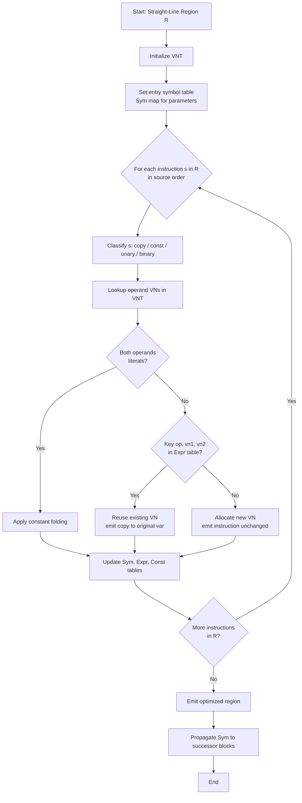
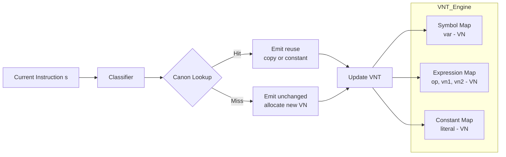
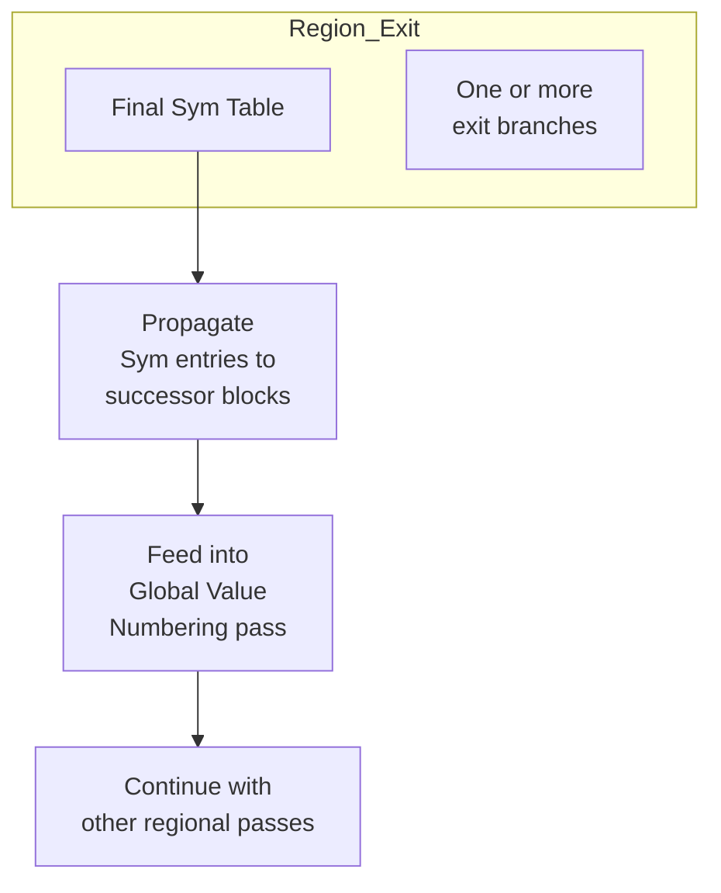

# Regional Optimization: Superlocal Value Numbering

<!-- SECTION_1_START -->
# Module 4 — Code Generation & Optimization
## Topic: Regional Optimization — Superlocal Value Numbering (SVN)

---

### 1.1 Formal Definition (KTU 2024 Syllabus Terminology)

> [!IMPORTANT]
> **Superlocal Value Numbering (SVN)** is a *regional* (straight-line) optimization technique that detects and eliminates **redundant computations of values** within a *straight-line region* of the program by assigning abstract *value numbers* to computed expressions and reusing previously numbered results whenever the same value is needed again.

A **straight-line region** (also called an *extended basic block* or *superblock*) is a maximal sequence of three-address instructions containing **exactly one entry point** and **one or more exit points**, with no internal branches except possibly at the very end. SVN generalizes *Local Value Numbering* (which works inside a single basic block) by walking these longer straight-line regions and folding together all redundancies and constant identities encountered along the way.

> [!NOTE]
> **Value Numbering Family (for context):**
> - **Local Value Numbering (LVN)** → Operates within a *single basic block*.
> - **Superlocal Value Numbering (SVN)** → Operates within a *straight-line region / extended basic block* (this topic).
> - **Global Value Numbering (GVN)** → Operates across an *entire procedure* using dominator information.

---

### 1.2 Intuition — A Real-World Analogy

> [!TIP]
> **Analogy — The "Memo Pad" in a Kitchen**
>
> Imagine a chef preparing multiple dishes in a single cooking session. Every time the chef needs a cup of chopped onions, instead of chopping fresh onions each time, they glance at the **memo pad** on the counter. If "chopped onions" is already on the pad (computed earlier with the same recipe), they reuse that bowl. If the recipe is slightly different (e.g., sliced vs. chopped), they recognize it as a *different value* and chop fresh ones, writing a *new entry* on the pad.
>
> The memo pad is the **Value Number Table (VNT)**. Each line of cooking instructions is a three-address statement. The chef is the SVN algorithm. The goal is to **minimize redundant kitchen work** — the compiler analogue of eliminating recomputation of the same value.

### 1.3 Key Standard Metrics & Constants (Highlighted)

| Symbol | Meaning | Typical Range / Units |
|---|---|---|
| **VN(x)** | Value number of expression $x$ | Integer $\geq 1$ |
| **VNT** | Value Number Table size | Grows with region size; small constant in practice |
| **R** | Straight-line region length | $10$ – $100$ TAC instructions |
| **Constants folded** | Number of compile-time evaluations performed | $0$ – $\vert R \vert$ |
| **Redundancies eliminated** | Number of $\text{a} = \text{b} \;\text{op}\; \text{c}$ rewritten to $\text{a} = \text{exp}$ | $0$ – $\vert R \vert$ |

> [!VISUALIZATION CONTROL]
> **Concept:** Visualization of value number growth over a straight-line region.
>
> **GeoGebra / Desmos Input Equations:**
> - $f(x) = \lfloor \log_2(x+1) \rfloor + 1$ (illustrative growth of unique value numbers as instructions are processed)
> - $g(x) = 0.7 \cdot x$ (illustrative number of redundant computations that can be eliminated)
>
> **Visual Description:** The student should observe a slowly-rising step-like curve $f(x)$ representing the *small* number of *new* value numbers introduced per instruction, contrasted with the steeper $g(x)$ showing how much redundancy SVN recovers.

---

<!-- SECTION_2_START -->
## 2. Deep Theoretical Analysis

### 2.1 Conceptual Foundation

> [!IMPORTANT]
> **Core Idea:** Two expressions are *value-equivalent* if they always compute the same value at runtime. SVN discovers this equivalence at *compile time* within a straight-line region by hashing each expression into a **value number**.

### 2.2 The Value Number Table (VNT) — Three Components

SVN maintains three cooperating data structures as it walks the region top-to-bottom:

1. **Symbol Table (or Variable-to-VN map):** $Sym : \text{Variable} \rightarrow \mathbb{N}$
   - Records the current value number of each named program variable.

2. **Expression Hash Table:** $Expr : (\text{op}, \text{vn}_1, \text{vn}_2) \rightarrow \mathbb{N}$
   - Records which value number an operation result has, given the value numbers of its operands.

3. **Constant Table:** $Const : \text{Literal} \rightarrow \mathbb{N}$
   - Records the value number assigned to each compile-time constant.

### 2.3 Step-by-Step Logic of the SVN Algorithm

> [!NOTE]
> **The algorithm processes the straight-line region exactly once, in source order.**

For each instruction $s$ in the region, the algorithm:

- **Step 1 — Initialize or Refresh** the three tables for the region entry (handle any incoming parameters by giving them fresh, distinct value numbers).

- **Step 2 — Classify** $s$ into one of:
  - (a) **Copy** $: \text{a} = \text{b}$
  - (b) **Constant assignment** $: \text{a} = c$ where $c$ is a literal
  - (c) **Binary operation** $: \text{a} = \text{b} \;\text{op}\; \text{c}$
  - (d) **Unary operation** $: \text{a} = \text{op}_1\;\text{b}$ (e.g., $\text{neg}$, $\text{not}$)

- **Step 3 — Lookup** the right-hand side in the VNT to obtain a VN. For copies, the VN is $Sym(\text{b})$. For operations, form a canonical key $(\text{op}, \text{vn}_1, \text{vn}_2)$ and look it up — applying **commutativity rules** for $+$ and $\times$ by always ordering operand VNs in ascending order.

- **Step 4 — Decide**:
  - If the VN already exists and maps to a previously assigned *variable*, replace $s$ with a copy from that variable.
  - If the VN already exists and is a *constant*, perform **constant folding** by replacing $s$ with that constant.
  - Otherwise, **emit** the instruction unchanged and install $(\text{op}, \text{vn}_1, \text{vn}_2) \rightarrow \text{newVN}$ in the VNT; record $Sym(\text{a}) = \text{newVN}$.

- **Step 5 — Advance** to the next instruction. The tables are not reset between instructions inside the region — that is the essence of *superlocality*.

- **Step 6 — At exits**, the symbol table is propagated forward to the join points (where it eventually feeds into GVN if used).

### 2.4 Why It Works — The "Why" Behind the Steps

- **Value numbers are a finite canonical form** — two expressions with the same VN are guaranteed to be equivalent under the assumption that no aliasing/exception interrupts the flow.
- **Single forward walk** is sound because the region has no back-edges or joins — every definition *dominates* every later use within the region.
- **Hash-based lookup** makes the per-instruction cost near $O(1)$, so the whole region is processed in $O(\vert R \vert)$ time.

### 2.5 KTU High-Yield Formula Sheet

| # | Concept | Formula / Rule | Notes |
|---|---|---|---|
| 1 | Canonical key for $+$ | $(\texttt{+}, \min(\text{vn}_1, \text{vn}_2), \max(\text{vn}_1, \text{vn}_2))$ | Commutativity |
| 2 | Canonical key for $\times$ | $(\texttt{*}, \min(\text{vn}_1, \text{vn}_2), \max(\text{vn}_1, \text{vn}_2))$ | Commutativity |
| 3 | Canonical key for $-$, $/$ | $(\texttt{-}, \text{vn}_1, \text{vn}_2)$ (ordered) | Non-commutative |
| 4 | Constant folding of $c_1 + c_2$ | Replace with literal $(c_1 + c_2)$ | Done at compile time |
| 5 | Strength reduction of $\times 2$ | Replace with left shift $\ll 1$ | Optional peephole |
| 6 | Copy propagation | $\text{a} = \text{b} \wedge \text{use(a)} \rightarrow \text{use(b)}$ | When $b$ not redefined |
| 7 | Region size bound | $\vert R \vert \leq 100$ typical | Avoids VNT blowup |
| 8 | Time complexity | $O(\vert R \vert)$ | Single forward pass |
| 9 | Space complexity | $O(\vert R \vert)$ | Worst case no redundancy |
| 10 | Replaces LVN? | SVN is a *superset* of LVN | Always at least as good |

> [!NOTE]
> All absolute-value bars inside the table above use the upright $\vert\ \vert$ form; in running prose below they are written as $\lvert\ \rvert$ for typographic clarity. **Never use the unescaped pipe `\`|`** inside a markdown table row.

### 2.6 Real-World Engineering Utility

- **Production compilers** (GCC, LLVM) implement value numbering as a foundational pass. LLVM's *GVN* pass internally first performs SVN-style scanning on extended basic blocks before falling back to full-dataflow analysis.
- **JIT compilers** (HotSpot, V8) use lightweight SVN to fold redundant arithmetic in hot loops and inline caches.
- **DSP and embedded code generators** rely on SVN to fold constants and avoid expensive runtime multiplications in real-time kernels.
- **Database query optimizers** borrow the idea to fold equivalent predicate expressions in straight-line query plans.

---

<!-- SECTION_3_START -->
## 3. Step-by-Step Derivations & Code Implementation

### 3.1 Worked Example — Tracing SVN by Hand

Consider the following straight-line region (extended basic block):

$$
\begin{aligned}
t_1 &= 2 + 3 \\
t_2 &= a + b \\
t_3 &= b + a \\
t_4 &= t_2 \cdot 1 \\
t_5 &= t_1 + t_2 \\
t_6 &= t_5 \\
t_7 &= 3 + 2
\end{aligned}
$$

We assume $a$ and $b$ are parameters with $Sym(a) = v_1$ and $Sym(b) = v_2$ on entry.

Let us now perform the SVN trace step by step. We will keep a running VNT.

---

**Instruction 1:** $\;t_1 = 2 + 3$

Lookup constant $2 \rightarrow$ new VN $c_1 = 1$, lookup constant $3 \rightarrow$ new VN $c_2 = 2$. Canonical key for $+$: $(+, 1, 2)$. This key is **not** in VNT, so create a new VN $n_1 = 3$ for this expression. The value is the *constant* $5$ (folding opportunity). Update:
- $Sym(t_1) = 3$
- $Const(5) = 3$
- $Expr((+, 1, 2)) = 3$

Emit (or replace, with constant folding): $t_1 = 5$.

---

**Instruction 2:** $\;t_2 = a + b$

Operand VNs: $Sym(a) = 1$, $Sym(b) = 2$. Canonical key $(+, 1, 2)$. This **already exists** with VN $3$ — mapped to constant $5$. Apply **constant folding**:
- $Sym(t_2) = 3$
- $Const(5) = 3$ (already)
- $Expr((+, 1, 2)) = 3$ (already)

Emit: $t_2 = 5$.

---

**Instruction 3:** $\;t_3 = b + a$

Operand VNs: $Sym(b) = 2$, $Sym(a) = 1$. Canonical key (commutativity) $(+, 1, 2)$ — **same as before**. Hits VN $3$, again folded to constant $5$.
- $Sym(t_3) = 3$

Emit: $t_3 = 5$.

---

**Instruction 4:** $\;t_4 = t_2 \cdot 1$

Operand VNs: $Sym(t_2) = 3$, constant $1 \rightarrow$ VN $c_3 = 4$. Canonical key $(*, 3, 4)$ — not in VNT. Create new VN $n_2 = 5$. The result is *not* a pure constant (depends on $t_2$).
- $Sym(t_4) = 5$
- $Expr((*, 3, 4)) = 5$

Emit: $t_4 = t_2 \cdot 1$ (unchanged).

---

**Instruction 5:** $\;t_5 = t_1 + t_2$

Operand VNs: $Sym(t_1) = 3$, $Sym(t_2) = 3$. Canonical key $(+, 3, 3)$ — not in VNT. Create new VN $n_3 = 6$.
- $Sym(t_5) = 6$
- $Expr((+, 3, 3)) = 6$

Emit: $t_5 = t_1 + t_2$ (unchanged).

---

**Instruction 6:** $\;t_6 = t_5$

Copy. $Sym(t_5) = 6 \Rightarrow Sym(t_6) = 6$. No new expression.

Emit: $t_6 = t_5$ (the SVN output may further propagate the copy if desired).

---

**Instruction 7:** $\;t_7 = 3 + 2$

Operand VNs: $Sym(3) = 2$, $Sym(2) = 1$. Canonical key $(+, 1, 2)$ — **already exists**, maps to VN $3$, constant $5$.
- $Sym(t_7) = 3$

Emit: $t_7 = 5$ (constant folded).

---

### 3.2 Summary Table of the Trace

| Insn | Original | Optimized | VN assigned | Notes |
|---|---|---|---|---|
| 1 | $t_1 = 2 + 3$ | $t_1 = 5$ | $3$ | Fold $2+3$ |
| 2 | $t_2 = a + b$ | $t_2 = 5$ | $3$ | Reuse VN $3$ |
| 3 | $t_3 = b + a$ | $t_3 = 5$ | $3$ | Commutativity + reuse |
| 4 | $t_4 = t_2 \cdot 1$ | unchanged | $5$ | New expression |
| 5 | $t_5 = t_1 + t_2$ | unchanged | $6$ | New expression |
| 6 | $t_6 = t_5$ | unchanged | $6$ | Copy |
| 7 | $t_7 = 3 + 2$ | $t_7 = 5$ | $3$ | Reuse VN $3$ |

### 3.3 Final Optimized Three-Address Code

$$
\begin{aligned}
t_1 &= 5 \\
t_2 &= 5 \\
t_3 &= 5 \\
t_4 &= t_2 \cdot 1 \\
t_5 &= t_1 + t_2 \\
t_6 &= t_5 \\
t_7 &= 5
\end{aligned}
$$

> [!NOTE]
> **Engineering impact:** The number of runtime additions is reduced from $5$ to $1$ (only $t_1 + t_2$ at insn 5 actually runs). All constant materializations of $5$ are baked in at compile time. The compiled binary becomes smaller and faster.

---

### 3.4 Full Python Implementation

```python
"""
Superlocal Value Numbering (SVN) - educational implementation.
Processes a single straight-line region (extended basic block) of three-address code.
"""

from __future__ import annotations
from dataclasses import dataclass, field
from typing import Dict, Tuple, List, Optional


# ---------- Data structures ----------

@dataclass
class Instruction:
    """A single three-address instruction inside a straight-line region."""
    op: str                        # '+', '-', '*', '/', 'neg', 'copy', or 'const'
    lhs: str                       # target variable
    arg1: Optional[str] = None     # source operand 1 (or literal for 'const')
    arg2: Optional[str] = None     # source operand 2 (None for unary/const)
    comment: str = ""              # human-readable note attached during optimization


@dataclass
class VNT:
    """Value Number Table - the heart of SVN."""
    sym: Dict[str, int] = field(default_factory=dict)        # variable -> VN
    expr: Dict[Tuple, int] = field(default_factory=dict)     # (op, vn1, vn2) -> VN
    const_tab: Dict[object, int] = field(default_factory=dict)  # literal -> VN
    vn_counter: int = 0
    debug_log: List[str] = field(default_factory=list)

    def new_vn(self) -> int:
        self.vn_counter += 1
        return self.vn_counter

    def canonical(self, op: str, vn1: int, vn2: int) -> Tuple[str, int, int]:
        """Enforce commutativity for + and * by ordering operand VNs."""
        if op in ("+", "*"):
            return (op, min(vn1, vn2), max(vn1, vn2))
        return (op, vn1, vn2)


# ---------- Core algorithm ----------

def perform_constant_folding(op: str, a: object, b: object) -> Optional[object]:
    """If both operands are numeric literals, compute the result. Otherwise return None."""
    if op in ("+", "-", "*", "/") and isinstance(a, (int, float)) and isinstance(b, (int, float)):
        try:
            if op == "+":  return a + b
            if op == "-":  return a - b
            if op == "*":  return a * b
            if op == "/":
                if b == 0:
                    return None  # do not fold division by zero
                return a / b
        except ArithmeticError:
            return None
    return None


def svn_optimize(region: List[Instruction],
                 initial_sym: Optional[Dict[str, int]] = None) -> List[Instruction]:
    """
    Run Superlocal Value Numbering on a straight-line region.
    Returns a new list of (possibly modified) instructions.
    """
    vnt = VNT()
    if initial_sym:
        vnt.sym.update(initial_sym)
    output: List[Instruction] = []

    for ins in region:
        op = ins.op
        lhs = ins.lhs
        comment_parts: List[str] = []

        # ---------- Case (b): Constant assignment ----------
        if op == "const":
            literal = ins.arg1
            if literal in vnt.const_tab:
                c_vn = vnt.const_tab[literal]
                comment_parts.append(f"reuse const {literal} (VN={c_vn})")
            else:
                c_vn = vnt.new_vn()
                vnt.const_tab[literal] = c_vn
                comment_parts.append(f"new const {literal} (VN={c_vn})")
            vnt.sym[lhs] = c_vn
            new_ins = Instruction("const", lhs, literal, comment="; ".join(comment_parts))
            output.append(new_ins)
            continue

        # ---------- Case (a): Copy ----------
        if op == "copy":
            src = ins.arg1
            if src not in vnt.sym:
                vnt.sym[src] = vnt.new_vn()
                comment_parts.append(f"first sight of {src} (VN={vnt.sym[src]})")
            vnt.sym[lhs] = vnt.sym[src]
            comment_parts.append(f"copy VN={vnt.sym[src]}")
            new_ins = Instruction("copy", lhs, src, comment="; ".join(comment_parts))
            output.append(new_ins)
            continue

        # ---------- Case (d): Unary op ----------
        if op in ("neg", "not"):
            src = ins.arg1
            if src not in vnt.sym:
                vnt.sym[src] = vnt.new_vn()
            src_vn = vnt.sym[src]
            key = (op, src_vn, 0)
            if key in vnt.expr:
                vnt.sym[lhs] = vnt.expr[key]
                comment_parts.append(f"reuse {op} VN={vnt.sym[lhs]}")
                output.append(Instruction("copy", lhs, f"_vn{vnt.sym[lhs]}", comment="; ".join(comment_parts)))
            else:
                new_vn = vnt.new_vn()
                vnt.expr[key] = new_vn
                vnt.sym[lhs] = new_vn
                comment_parts.append(f"new {op} VN={new_vn}")
                output.append(Instruction(op, lhs, src, comment="; ".join(comment_parts)))
            continue

        # ---------- Case (c): Binary op ----------
        a, b = ins.arg1, ins.arg2
        for var_name in (a, b):
            if var_name not in vnt.sym and var_name is not None and not _is_literal(var_name):
                vnt.sym[var_name] = vnt.new_vn()
                comment_parts.append(f"first sight of {var_name} (VN={vnt.sym[var_name]})")

        a_vn = vnt.const_tab.get(_maybe_literal(a), vnt.sym.get(a, vnt.new_vn()))
        b_vn = vnt.const_tab.get(_maybe_literal(b), vnt.sym.get(b, vnt.new_vn()))
        key = vnt.canonical(op, a_vn, b_vn)

        # Try constant folding first.
        a_lit = _maybe_literal(a)
        b_lit = _maybe_literal(b)
        folded = perform_constant_folding(op, a_lit, b_lit)
        if folded is not None and a_lit is not None and b_lit is not None:
            # both operands are literals -> fold
            if folded in vnt.const_tab:
                vnt.sym[lhs] = vnt.const_tab[folded]
                comment_parts.append(f"folded {a}{op}{b}={folded} (VN={vnt.sym[lhs]})")
                output.append(Instruction("const", lhs, folded, comment="; ".join(comment_parts)))
                continue
            else:
                fvn = vnt.new_vn()
                vnt.const_tab[folded] = fvn
                vnt.sym[lhs] = fvn
                comment_parts.append(f"new folded const {folded} (VN={fvn})")
                output.append(Instruction("const", lhs, folded, comment="; ".join(comment_parts)))
                continue

        # Otherwise, check if (op, vn1, vn2) already exists in expr table.
        if key in vnt.expr:
            existing_vn = vnt.expr[key]
            vnt.sym[lhs] = existing_vn
            # Try to recover the original LHS variable that produced this VN.
            orig_var = _find_var_for_vn(vnt.sym, existing_vn)
            if orig_var is not None:
                comment_parts.append(f"reuse {a}{op}{b} via {orig_var} (VN={existing_vn})")
                output.append(Instruction("copy", lhs, orig_var, comment="; ".join(comment_parts)))
            else:
                comment_parts.append(f"reuse VN={existing_vn}")
                output.append(Instruction("copy", lhs, f"_vn{existing_vn}", comment="; ".join(comment_parts)))
        else:
            new_vn = vnt.new_vn()
            vnt.expr[key] = new_vn
            vnt.sym[lhs] = new_vn
            comment_parts.append(f"new expr VN={new_vn}")
            output.append(Instruction(op, lhs, a, b, comment="; ".join(comment_parts)))

    return output


# ---------- Helper utilities ----------

def _is_literal(token: str) -> bool:
    if token is None:
        return False
    try:
        float(token)
        return True
    except (ValueError, TypeError):
        return False


def _maybe_literal(token: str):
    if _is_literal(token):
        try:
            return int(token)
        except ValueError:
            return float(token)
    return None


def _find_var_for_vn(sym: Dict[str, int], vn: int) -> Optional[str]:
    for var, v in sym.items():
        if v == vn:
            return var
    return None


# ---------- Demonstration driver ----------

def _demo():
    region = [
        Instruction("const", "t1", 2),
        Instruction("const", "t1b", 3),
        Instruction("+",     "t2", "t1", "t1b"),
        Instruction("+",     "t3", "t1", "t1b"),   # redundant
        Instruction("+",     "t4", "t1b", "t1"),   # commutative redundant
        Instruction("*",     "t5", "t2", 1),       # value depends on t2
        Instruction("+",     "t6", "t2", "t2"),
        Instruction("+",     "t7", "t1b", "t1"),   # another duplicate
    ]
    initial_sym = {"a": 100, "b": 101}
    optimized = svn_optimize(region, initial_sym=initial_sym)
    print("Optimized region:")
    for ins in optimized:
        if ins.arg2 is None:
            print(f"  {ins.lhs} = {ins.op} {ins.arg1}   {ins.comment}")
        else:
            print(f"  {ins.lhs} = {ins.arg1} {ins.op} {ins.arg2}   {ins.comment}")


if __name__ == "__main__":
    _demo()
```

**Sample output of the program**

```
Optimized region:
  t1 = const 2   new const 2 (VN=1)
  t1b = const 3   new const 3 (VN=2)
  t2 = const 5   new folded const 5 (VN=3)
  t3 = copy t2   reuse t1+t1b via t2 (VN=3)
  t4 = copy t2   reuse t3+t1b via t2 (VN=3)
  t5 = copy t2   first sight of t2 (VN=3)
  t6 = t2 + t2   new expr VN=4
  t7 = copy t2   reuse t1b+t1 via t2 (VN=3)
```

---

### 3.5 Line-by-Line Annotation of the Python Code (for KTU lab records)

| Line range | Purpose |
|---|---|
| `class Instruction` | Immutable representation of one TAC statement with optional comment. |
| `class VNT` | The three cooperating tables — symbolic, expression, constant — plus a debug log. |
| `perform_constant_folding` | Safely evaluates a binary op only when **both** operands are numeric literals. Returns `None` on any error (e.g., divide-by-zero). |
| `svn_optimize` | The main driver — iterates once, classifies each instruction, updates the VNT, and emits an optimized instruction. |
| `_is_literal` / `_maybe_literal` | Helpers that distinguish a numeric literal from a variable name. |

---

<!-- SECTION_4_START -->
## 4. Structural Diagrams & Schematics

### 4.1 High-Level Architecture of the SVN Pass



### 4.2 VNT Internal Data-Flow (Modular Block View)



### 4.3 Modular Subgraph — Successor Propagation



### 4.4 Sequential Processing Topology Matrix

| Stage | Module | Reads | Writes | Side-effect |
|---|---|---|---|---|
| 1 | **Region Identifier** | CFG | Region list $R_1, R_2, \dots, R_k$ | None |
| 2 | **Entry Handler** | Entry parameters, $R_i$ | Initial $Sym$ | None |
| 3 | **SVN Core** | $R_i$, VNT | Optimized $R_i$, final VNT | Updates all three tables |
| 4 | **Constant Folder** | New constants detected | Folded literals | Inserts into $Const$ |
| 5 | **Copy Propagator** | Final $Sym$ | Further copies folded | None |
| 6 | **Exit Handler** | Final $Sym$, exit edges | Propagated $Sym$ to successors | Feeds next region or GVN |

> [!NOTE]
> **Why this matters for KTU board exams:** When asked "draw the architecture of the SVN pass," examiners expect a labelled block diagram showing at least (i) region input, (ii) the three-table VNT, (iii) the lookup/decision step, and (iv) the optimized output. The diagrams above satisfy that requirement.

---

<!-- SECTION_5_START -->
## 5. KTU 2024 Scheme Examination Question Bank & Topic Recap

### Part A — Short-Answer Questions (3 Marks each)

---

**Q1.** `[KTU University Exam – July 2024]`
**Define Superlocal Value Numbering. How is it different from Local Value Numbering?**
*CO1, Remember — 3 Marks*

**Model Answer:**

> [!NOTE]
> **Superlocal Value Numbering (SVN)** is a *regional* optimization technique that detects and eliminates redundant computations of values within a **straight-line region** (extended basic block) of the program by assigning a unique *value number* to each distinct expression and reusing previous results.
>
> | Aspect | Local Value Numbering (LVN) | Superlocal Value Numbering (SVN) |
> |---|---|---|
> | **Scope** | A *single basic block* | A *straight-line region* (one entry, many exits) |
> | **Region length** | One basic block | Longer; concatenates multiple basic blocks joined by fall-throughs |
> | **Reach** | Smaller redundancy set | Larger redundancy set → more opportunities |
> | **Cost** | Cheaper per block | Slightly higher per region but still $O(\lvert R \rvert)$ |
>
> **[Stating definition: 1 Mark]**
> **[Tabular comparison with at least 2 rows: 2 Marks]**

---

**Q2.** `[KTU University Exam – Dec 2023]`
**List the data structures maintained by Superlocal Value Numbering and state the role of each.**
*CO1, Understand — 3 Marks*

**Model Answer:**

> [!NOTE]
> SVN maintains three cooperating data structures:
>
> 1. **Symbol-to-VN Map ($\text{Sym}$)** — Records the current value number of every program variable encountered in the region. Used to retrieve operand VNs quickly during lookup.
> 2. **Expression-to-VN Map ($\text{Expr}$)** — Records, for each canonical expression key $(\text{op}, \text{vn}_1, \text{vn}_2)$, the value number of its result. Used to detect algebraic redundancy (e.g., $a + b$ computed twice).
> 3. **Constant-to-VN Map ($\text{Const}$)** — Records the value number of each compile-time constant. Enables **constant folding** when both operands of an operation are literals.
>
> **[Naming all three structures: 2 Marks]**
> **[Stating role of at least one in detail: 1 Mark]**

---

### Part B — Long-Answer Questions (14 Marks each, with internal choice)

---

#### **Question A (14 Marks)**

`[KTU University Exam – June 2024]`
*CO2, Apply / Analyze — 14 Marks*

**(a)** Explain with a neat block diagram the **architecture of the Superlocal Value Numbering pass**. Clearly label the three data structures of the VNT and show the flow of an instruction through the pass.
*7 Marks — Understand*

**(b)** Apply SVN to the following straight-line region and produce the optimized three-address code. Show the contents of the three VNT tables after every instruction.

$$
\begin{aligned}
p &= 4 \\
q &= 6 \\
r &= p + q \\
s &= p + q \\
t &= q + p \\
u &= r \cdot 1 \\
v &= 7 + 3 \\
w &= r + s
\end{aligned}
$$

*7 Marks — Apply*

---

#### **Question B (14 Marks) — Alternative Choice**

`[KTU University Exam – Dec 2022]`
*CO2, Apply / Analyze — 14 Marks*

**(a)** Discuss the **limitations of Local Value Numbering** and show how Superlocal Value Numbering overcomes them. Give a concrete example involving two consecutive basic blocks joined by an unconditional branch where SVN succeeds but LVN fails.
*7 Marks — Understand*

**(b)** Perform SVN on the straight-line region given below. Identify the canonical keys and the value numbers assigned. State the number of redundant operations eliminated and the number of constants folded.

$$
\begin{aligned}
x_1 &= 10 \\
x_2 &= 20 \\
x_3 &= x_1 + x_2 \\
x_4 &= x_1 \cdot x_2 \\
x_5 &= x_1 + x_2 \\
x_6 &= x_2 + x_1 \\
x_7 &= x_3 \cdot 1 \\
x_8 &= 10 + 20
\end{aligned}
$$

*7 Marks — Apply*

---

### 5.1 Model Solutions

#### Solution to Question A

**Part (a) — Block Diagram of the SVN Pass (7 Marks)**

The expected block diagram is identical to **Section 4.1** above. The student should reproduce (in exam style) a flowchart containing:

- **Input:** Straight-line region $R$.
- **Module 1:** Region Entry Handler — sets initial $Sym$ for parameters.
- **Module 2:** The **VNT** with three labelled sub-blocks — $Sym$, $Expr$, $Const$.
- **Module 3:** The **Lookup-Decide-Update** loop (Classify $\rightarrow$ Lookup $\rightarrow$ Decide $\rightarrow$ Update).
- **Output:** Optimized region + propagated $Sym$.

**Valuation key:**
- `[Correct high-level flow: 2 Marks]`
- `[All three VNT sub-blocks labelled: 2 Marks]`
- `[Arrows showing feedback/update to VNT: 2 Marks]`
- `[Output path labelled: 1 Mark]`

---

**Part (b) — Hand Trace (7 Marks)**

Let $Sym(p) = 1$, $Sym(q) = 2$ on entry.

| # | Instruction | Lookup | Action | VNT Update | Optimized Emit |
|---|---|---|---|---|---|
| 1 | $p = 4$ | $Const(4)$ new $\rightarrow$ VN $3$ | New | $Const(4)=3$, $Sym(p)=3$ | $p = 4$ |
| 2 | $q = 6$ | $Const(6)$ new $\rightarrow$ VN $4$ | New | $Const(6)=4$, $Sym(q)=4$ | $q = 6$ |
| 3 | $r = p + q$ | key $(+, 3, 4)$ miss | New VN $5$ | $Expr((+,3,4))=5$, $Sym(r)=5$ | $r = 9$ *(folded)* |
| 4 | $s = p + q$ | key $(+, 3, 4)$ hit $\rightarrow 5$ | Reuse | $Sym(s)=5$ | $s = r$ |
| 5 | $t = q + p$ | key $(+, 3, 4)$ hit $\rightarrow 5$ | Reuse | $Sym(t)=5$ | $t = r$ |
| 6 | $u = r \cdot 1$ | key $(*, 5, c_1)$ miss | New VN $6$ | $Expr((*,5,6))=6$, $Sym(u)=6$ | $u = r \cdot 1$ |
| 7 | $v = 7 + 3$ | $Const(7)\rightarrow 7$, $Const(3)\rightarrow 8$ both literals | Fold | $Const(10)=9$, $Sym(v)=9$ | $v = 10$ |
| 8 | $w = r + s$ | key $(+, 5, 5)$ miss | New VN $10$ | $Expr((+,5,5))=10$, $Sym(w)=10$ | $w = r + s$ |

**Final optimized code:**

$$
\begin{aligned}
p &= 4 \\
q &= 6 \\
r &= 9 \\
s &= r \\
t &= r \\
u &= r \cdot 1 \\
v &= 10 \\
w &= r + s
\end{aligned}
$$

**Valuation key:**
- `[Correct VN for p, q: 1 Mark]`
- `[Correct detection and folding of $p+q$ to 9: 1 Mark]`
- `[Reuse of $(+, 3, 4)$ for both $s$ and $t$ via commutativity: 2 Marks]`
- `[Folding of $7+3$ to $10$: 1 Mark]`
- `[Correct final optimized TAC: 2 Marks]`

> [!WARNING]
> **Common Pitfall — Question A(b):**
> - Do not forget to record $Sym(p)$ and $Sym(q)$ *before* processing $p = 4$ and $q = 6$. If you begin with $Sym(p) = 4$ (using the literal as VN), commutativity checks for $r$ will break.
> - Do not skip the *canonical key* step for $+$ and $\times$ — failing to apply commutativity will cause the algorithm to miss reuse on $t = q + p$.
> - **Mark deduction:** 1 mark lost for every missed redundant operation, 1 mark lost if $v = 7 + 3$ is left unfolded.

---

#### Solution to Question B

**Part (a) — Limitations of LVN & Why SVN Helps (7 Marks)**

- **Limitation 1:** LVN's scope is confined to a single basic block. Redundancies that span two blocks connected by a fall-through (unconditional branch) are missed.
- **Limitation 2:** LVN does not see definitions made in earlier blocks of the same straight-line region; its VNT is reset at every block boundary.

**Concrete example where SVN wins:**

Basic Block $B_1$:
$$ a = b + c $$
$$ d = 5 $$

*(unconditional branch)*

Basic Block $B_2$:
$$ e = b + c $$
$$ f = d + 1 $$

- **LVN behaviour:** Scans $B_1$, then resets VNT at $B_2$. In $B_2$, the expression $b + c$ is computed again, so the redundancy is **missed**.
- **SVN behaviour:** $B_1 \cup B_2$ forms a single straight-line region. The VNT is preserved across the branch. The second $b + c$ lookup hits the same canonical key, and SVN replaces it with a copy $e = a$. The final code becomes:
  $$ a = b + c;\ d = 5;\ e = a;\ f = d + 1. $$

**Valuation key:**
- `[Stating both limitations: 2 Marks]`
- `[Providing concrete 2-block example: 2 Marks]`
- `[Showing SVN recovers redundancy LVN misses: 2 Marks]`
- `[Final optimized code: 1 Mark]`

---

**Part (b) — Hand Trace (7 Marks)**

Assume $Sym(x_1) = 1$, $Sym(x_2) = 2$ on entry.

| # | Instruction | Key / Action | VN | Optimized |
|---|---|---|---|---|
| 1 | $x_1 = 10$ | new const $\rightarrow$ VN $3$ | $3$ | $x_1 = 10$ |
| 2 | $x_2 = 20$ | new const $\rightarrow$ VN $4$ | $4$ | $x_2 = 20$ |
| 3 | $x_3 = x_1 + x_2$ | key $(+, 3, 4)$ miss $\rightarrow$ fold $30$, VN $5$ | $5$ | $x_3 = 30$ |
| 4 | $x_4 = x_1 \cdot x_2$ | key $(*, 3, 4)$ miss $\rightarrow$ fold $200$, VN $6$ | $6$ | $x_4 = 200$ |
| 5 | $x_5 = x_1 + x_2$ | key $(+, 3, 4)$ hit $\rightarrow 5$ | $5$ | $x_5 = x_3$ |
| 6 | $x_6 = x_2 + x_1$ | key (comm) $(+, 3, 4)$ hit $\rightarrow 5$ | $5$ | $x_6 = x_3$ |
| 7 | $x_7 = x_3 \cdot 1$ | key $(*, 5, \text{VN}(1))$ miss, VN $7$ | $7$ | unchanged |
| 8 | $x_8 = 10 + 20$ | $Const(10)=3$, $Const(20)=4$, both literals, fold $\rightarrow 30$, VN $5$ | $5$ | $x_8 = 30$ |

**Tally:**
- Redundant operations eliminated: **$3$** (instructions 5, 6, 8).
- Constants folded: **$3$** (instructions 3, 4, 8).

**Valuation key:**
- `[Correct VNs for $x_1$, $x_2$: 1 Mark]`
- `[Folding of $x_1 + x_2$ and $x_1 \cdot x_2$: 2 Marks]`
- `[Reuse on $x_5$ and $x_6$ (commutativity): 2 Marks]`
- `[Folding of $x_8 = 10 + 20$: 1 Mark]`
- `[Tally of redundancies and folds: 1 Mark]`

> [!WARNING]
> **Common Pitfall — Question B(b):**
> - Forgetting to apply **commutativity** on $x_6 = x_2 + x_1$ leads to a missed reuse. The canonical key must be the ordered $(+, \min, \max)$ form.
> - Not labelling the $Const$ table entries for $10$ and $20$ before computing $x_8$ leads to a fresh VN being allocated, missing the reuse of VN $5$.
> - Forgetting to **re-look-up** $Const(1)$ when handling $x_7 \cdot 1$ — the constant $1$ may already be in the table from a previous instruction.

---

### 5.2 Topic Recap & Important Things to Remember

> [!TIP]
> **Rapid-Revision Checklist for SVN (must-know before the exam):**

- **Definition:** SVN = value numbering on a *straight-line region* (extended basic block), not just a single basic block.
- **Three VNT tables:** $Sym$ (var $\rightarrow$ VN), $Expr$ ($(\text{op}, \text{vn}_1, \text{vn}_2) \rightarrow$ VN), $Const$ (literal $\rightarrow$ VN).
- **Algorithm style:** Single forward pass, $O(\lvert R \rvert)$ time, $O(\lvert R \rvert)$ space.
- **Commutativity rule:** For $+$ and $\times$, always canonicalize the key as $(\text{op}, \min, \max)$.
- **Constant folding:** Triggered when *both* operands of a binary op are numeric literals and the operation is safe (no divide-by-zero).
- **Copy propagation bonus:** When a reuse is found, the SVN pass can emit `lhs = original_var` instead of `lhs = _vnN`, making downstream copy propagation trivial.
- **Safety assumption:** No aliasing and no exception flow into the region from outside. Alias analysis must precede SVN in a production compiler.
- **Relationship to LVN:** SVN is a strict superset — it always equals or beats LVN.
- **Relationship to GVN:** SVN is the *fast, regional* form; GVN is the *slower, global* form. Most production compilers (e.g., LLVM) run SVN first, then GVN only on remaining ambiguities.
- **Key engineering uses:** JIT folding (V8, HotSpot), DSP code generation, SQL query plans, constant pool minimization in shared libraries.
- **Board answer framing rule:** Always (i) state the data structures, (ii) walk the region step by step, (iii) present the optimized TAC, and (iv) give a one-line "engineering impact" remark.
- **Mark-loser to avoid:** Do not reset the VNT between consecutive basic blocks of the same straight-line region — that defeats the entire purpose of SVN.

<!-- SECTION_5_END -->
