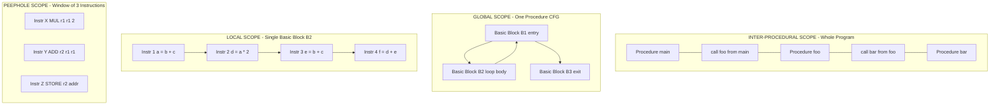
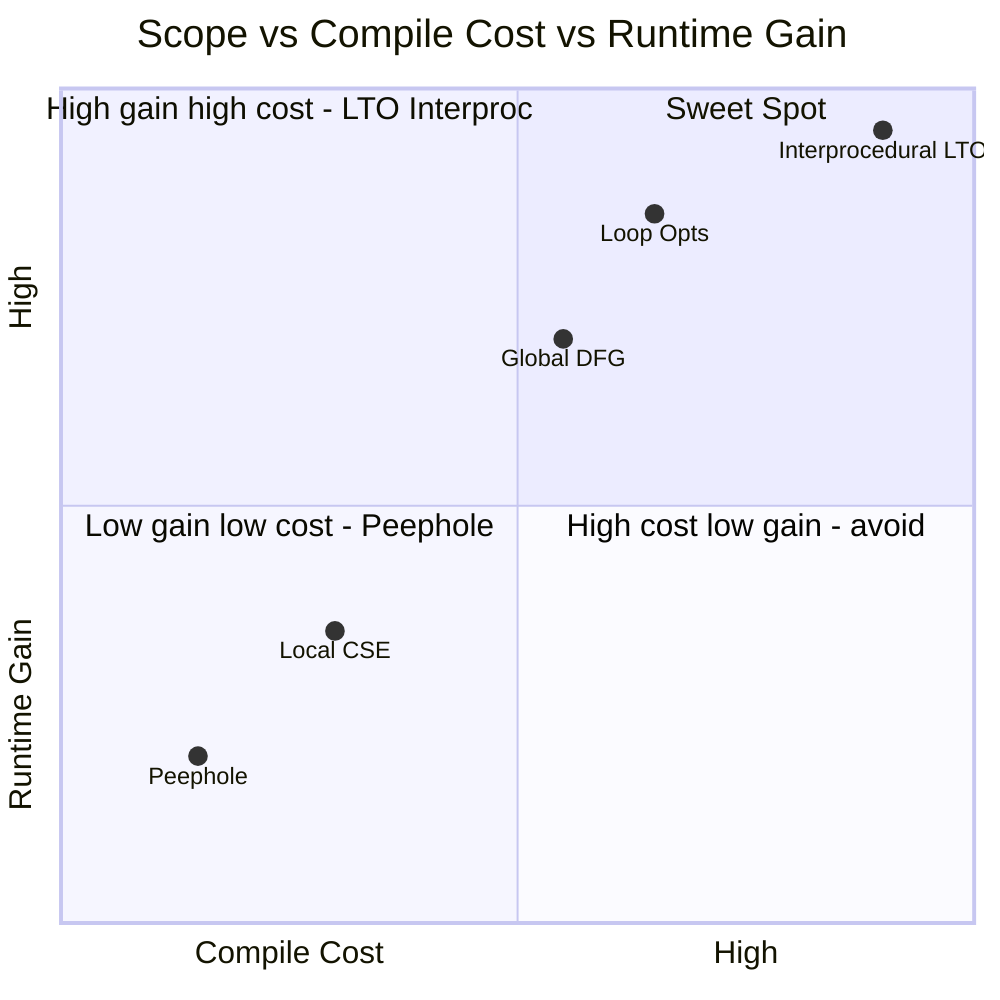
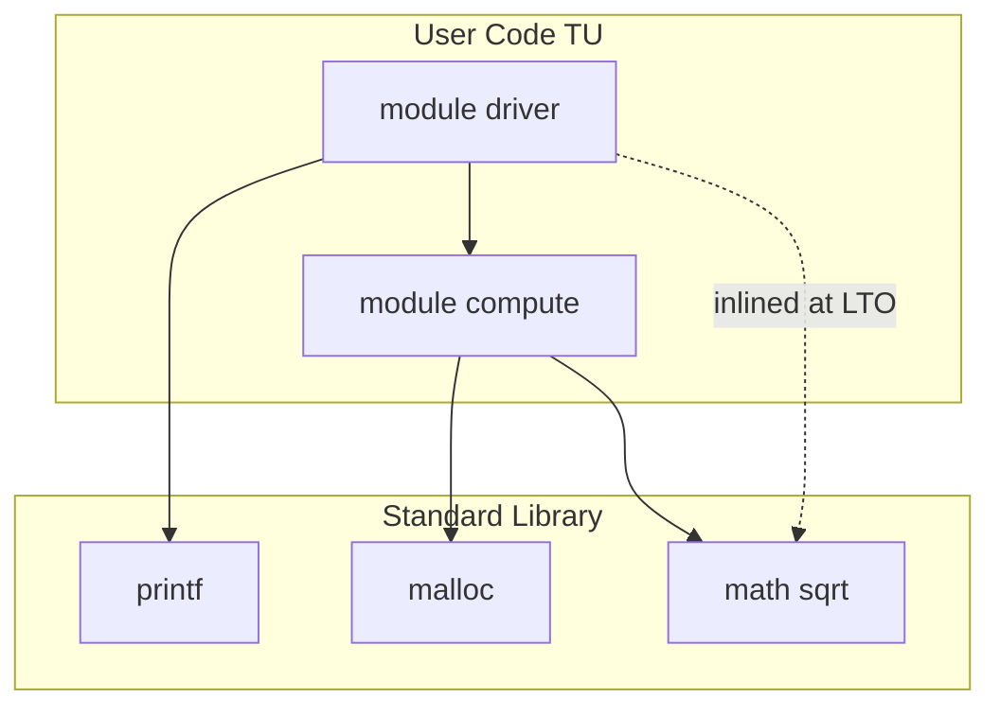

# Scope Of Optimization

<!-- SECTION_1_START -->
# Scope of Optimization in Code Generation

## 1.1 Formal Definition (KTU 2024 Syllabus Terminology)

> [!IMPORTANT]
> **Scope of Optimization** refers to the **boundary or region** within the source/Intermediate Representation (IR) program over which an optimization transformation is applied and remains valid (semantically preserving). It defines *where* a compiler can look for improvement opportunities without violating program correctness.

In the KTU 2024 Scheme treatment of **Module 4: Code Generation & Code Shape**, the **scope** is hierarchically classified based on the size of the program region being analyzed:

| Scope Level | Region of Analysis | Typical Granularity |
|:------------|:-------------------|:--------------------|
| **Peephole / Local** | A few instructions or a single Basic Block | 2–10 instructions |
| **Global (Intra-Procedural)** | An entire function/procedure (CFG) | Hundreds of BBs |
| **Loop (Nested)** | Inner loop body | A natural loop |
| **Inter-Procedural** | Across function/procedure boundaries | Whole program |

---

## 1.2 Intuitive Overview — The "House Renovation" Analogy

> [!NOTE]
> **Analogy — Renovation Scopes:**
> Imagine you are renovating a house to save electricity:
> 1. **Peephole scope** = Swapping one bulb for an LED. You only look at *that one fixture*.
> 2. **Local scope** = Rewiring *one room's* switchboard.
> 3. **Global scope** = Re-planning the *entire floor's* wiring layout.
> 4. **Inter-procedural scope** = Re-engineering the *entire building's* electrical grid plus the transformer room.
>
> The bigger the scope, the **more energy (gain) you save** but the **more planning, cost, and risk of breaking something** (semantic violation) you incur.

The **compiler** behaves identically. A larger scope yields a **higher speedup ratio** but increases **compile time, memory consumption, and the risk of invalid transformations** if aliasing/control flow is misanalyzed.

---

## 1.3 The Optimization Scope Equation

A fundamental quantity used to quantify scope benefit is the **Speedup Ratio** for a region containing $n$ basic blocks with execution frequency $f_i$:

$$
S_{\text{scope}} \;=\; \frac{\displaystyle \sum_{i=1}^{n} f_i \cdot T_i^{\text{orig}}}{\displaystyle \sum_{i=1}^{n} f_i \cdot T_i^{\text{opt}}}
$$

Where:
- $T_i^{\text{orig}}$ = execution cost of basic block $i$ before optimization
- $T_i^{\text{opt}}$  = execution cost of basic block $i$ after optimization
- $f_i$ = relative execution frequency (weight) of block $i$

> [!TIP]
> **Why frequency matters for scope:** Optimizing an inner-loop body that executes **10⁶ times** is worth 10⁶ × more than optimizing a one-shot initialization block — even if the inner-loop transformation is tiny. This is the **economic argument** for *Loop Scope* optimization.

---

## 1.4 Visualizing Scope with a Control Flow Graph (CFG)

> [!VISUALIZATION CONTROL]
> **Concept:** Hierarchical Scope Regions inside a Procedure's CFG
> **GeoGebra / Desmos Input Equations:**
> * `f1(x) = if 0 <= x <= 2 then 4 else 0`  (outer rectangle — procedure scope)
> * `f2(x) = if 1 <= x <= 1.5 then 2 else 0` (inner rectangle — loop scope)
> * `Point1 = (0.3, 0.3)`, `Point2 = (1.7, 0.3)`, `Point3 = (1.7, 0.7)`, `Point4 = (0.3, 0.7)`
> * `Point5 = (1.1, 0.4)`, `Point6 = (1.4, 0.4)`, `Point7 = (1.4, 0.6)`, `Point8 = (1.1, 0.6)`
> **Visual Description:** Two nested rectangles on the XY-plane. The larger rectangle (vertices 1–4) denotes **Global/Procedure Scope**; the smaller rectangle (vertices 5–8) inside it denotes the **Loop Scope**. Optimizations applied inside the inner rectangle have a much higher frequency multiplier in the speedup equation.

---

## 1.5 Why Scope is a First-Class Design Decision in a Compiler

1. **Correctness gating** — A transformation is legal only if no observable behavior changes within its scope. Larger scopes require richer data-flow analysis (alias analysis, call graph construction).
2. **Cost-benefit trade-off** — Optimization passes scale as $O(n^k)$ where $k$ grows with scope. Peephole is $O(1)$ per window; inter-procedural is often $O(N \cdot E)$ on the call graph.
3. **Phase ordering** — GCC, LLVM, and the **Intel C++ Compiler** all explicitly tag IR instructions with *scope markers* (e.g., LLVM's `OptimizationRemarkEmitter`) so the optimizer can reason about scope.

<!-- SECTION_1_END -->

<!-- SECTION_2_START -->
# Deep Theoretical Analysis & KTU High-Yield Formula Sheet

## 2.1 The Four Canonical Scopes — Structured Breakdown

### 2.1.1 Peephole Scope (Window Size = $w$)
- Operates on a sliding window of $w$ instructions (typically $w \in [2, 6]$).
- Performs **pattern-driven substitution** using a rewrite rule of the form:
$$
\alpha \rightarrow \beta \quad \text{iff} \quad \text{Profit}(\beta) > \text{Profit}(\alpha) \;\land\; \text{Safe}(\alpha, \beta)
$$
- **Why:** Cheap, easy to verify, foundational step. It catches local inefficiencies missed by bigger passes.
- **How:** A state machine or DAG-matcher scans the instruction stream.

> [!NOTE]
> **Example pattern:**
> `MUL x, x, 2`  →  `ADD x, x, x`     (Strength reduction at peephole scope)
> `MOV a, b` followed by `MOV c, a` → `MOV c, b`   (Copy propagation)

### 2.1.2 Local Scope (Single Basic Block)
- A **Basic Block (BB)** is a maximal sequence of three-address instructions with:
  - Exactly **one entry point** (the first instruction)
  - **One exit point** (the last instruction / branch)
- Inside one BB, the compiler builds a **DAG** (Directed Acyclic Graph) for common subexpression elimination.
- **Why:** Within a BB, def-use chains are linear and trivially safe — no control-flow complications.

### 2.1.3 Global (Intra-Procedural) Scope
- Operates on the **Control Flow Graph (CFG)** of a single procedure.
- Uses **data-flow equations** iterated to a fixed point:
$$
\text{IN}[B] = \bigsqcup_{P \in \text{pred}(B)} \text{OUT}[P]
$$
$$
\text{OUT}[B] = \text{Gen}[B] \;\cup\; \big( \text{IN}[B] - \text{Kill}[B] \big)
$$
- Enables optimizations spanning multiple BBs (e.g., loop-invariant code motion, global CSE, dead-store elimination).
- **Why:** Most real-world gains (often 30–50%) come from this scope.

### 2.1.4 Inter-Procedural Scope (Whole Program)
- Operates across procedure boundaries using the **Call Graph** $G_c = (V, E)$.
- $|V|$ = procedures, $|E|$ = call edges. The graph is analyzed for **inlining, constant propagation across calls, dead-code elimination of unused procedures, and devirtualization**.
- **Why:** Modern OOP code spends 30–80% of runtime in `virtual` calls — inter-procedural analysis unlocks devirtualization.

---

## 2.2 Algebraic Model of Scope Containment

Let the set of all statements in a program be $\Sigma$. The four scopes form a **strict inclusion chain**:

$$
\Sigma_{\text{peephole}} \;\subset\; \Sigma_{\text{local}} \;\subset\; \Sigma_{\text{global}} \;\subset\; \Sigma_{\text{inter-procedural}}
$$

For any two scopes $A \subset B$, the additional opportunities are:

$$
\text{Opportunity}(B \setminus A) \;=\; \text{Opportunity}(B) \;-\; \text{Opportunity}(A)
$$

> [!IMPORTANT]
> **KTU Board Insight:** The examiner frequently asks *"Why is local optimization always safe, while global optimization needs fixed-point iteration?"* The answer lies in the equations above — local scope has a trivially known `IN` (the BB entry state), whereas global scope's `IN[B]` depends on the `OUT` of all predecessors, requiring iteration until convergence.

---

## 2.3 KTU Formula Cheat Sheet

| # | Formula / Concept | Symbol | Typical Use / Interpretation |
|:-:|:------------------|:------:|:-----------------------------|
| 1 | Speedup ratio | $S_{\text{scope}} = \frac{\sum f_i T_i^{\text{orig}}}{\sum f_i T_i^{\text{opt}}}$ | Quantifies benefit of optimization over its scope |
| 2 | Data-flow join | $\text{IN}[B] = \bigsqcup_{P \in \text{pred}(B)} \text{OUT}[P]$ | Forward-flow union/meet across CFG edges |
| 3 | Transfer function | $\text{OUT}[B] = f_B(\text{IN}[B])$ | Gen/Kill transformation per BB |
| 4 | Reaching definitions bitvector | $R_d = (r_1, r_2, \dots, r_n)$ | Enables global CSE/DCE |
| 5 | Loop trip count | $N = \left\lceil \frac{\text{UB} - \text{LB}}{\text{step}} \right\rceil$ | Weights loop-scope optimizations |
| 6 | Strength reduction cost ratio | $C_{\text{opt}} / C_{\text{orig}}$ | If $< 1$, transformation is profitable |
| 7 | Optimization gain (Amdahl) | $G = \dfrac{1}{(1 - P) + P/S}$ | $P$ = fraction optimized, $S$ = speedup of that part |
| 8 | Peephole window size | $w \in [2, 6]$ | Empirical sweet spot for matcher cost vs. capture |
| 9 | Call-graph edge weight | $w(u, v) = \text{call-frequency}(u \to v)$ | Guides inlining decisions |
| 10 | DAG node count | $V_{\text{DAG}} \le V_{\text{BB}}$ | Equality ⇒ maximum local CSE achieved |

---

## 2.4 Real-World Utility in Engineering & Production Systems

| Compiler | Default Scope Strategy | Engineering Justification |
|:---------|:-----------------------|:--------------------------|
| **GCC** | `-O2` = local + global; `-O3` = adds loop + vectorization; `-flto` = inter-procedural | Industry default for shipping binaries; `LTO` enables cross-TU inlining |
| **LLVM** | Pipeline of passes with explicit scope tags (`FunctionPass`, `ModulePass`, `CallGraphSCCPass`) | Modular IR design lets users compose custom scopes |
| **Intel ICX** | Aggressive inter-procedural + profile-guided (PGO) | Maximizes HPC/SIMD throughput |
| **JVM HotSpot** | Just-In-Time recompiles *hot methods* at higher scope | Adapts scope to runtime frequency — the **dynamic** analog of static scope |
| **V8 (JavaScript)** | Tier-up: interpreter → baseline (local) → Maglev (global) → TurboFan (inter-procedural) | Scope grows with observed hotness — same principle as $f_i$ weighting |

<!-- SECTION_2_END -->

<!-- SECTION_3_START -->
# Step-by-Step Derivations & Algorithmic Implementation

## 3.1 Derivation: From Local to Global Scope — Worked Data-Flow Example

**Given IR (three-address code) for a procedure `foo`:**

$$
\begin{aligned}
B_1 &: \quad t_1 = 2 \\
B_1 &: \quad t_2 = a + t_1 \\
B_1 &: \quad \text{if } a < 10 \text{ goto } B_2 \text{ else } B_3 \\[2pt]
B_2 &: \quad t_3 = a + t_1 \\
B_2 &: \quad t_4 = t_2 \cdot t_3 \\
B_2 &: \quad \text{goto } B_1 \\[2pt]
B_3 &: \quad \text{return } t_4
\end{aligned}
$$

**Step 1 — Identify the common subexpression at LOCAL scope**
Inside $B_2$: expression `a + t1` is recomputed even though `t2` (in $B_1$) holds the identical value.
Local scope (within $B_2$) **cannot** see this — it doesn't know `t2` is still live at $B_2$'s entry.

**Step 2 — Build the global reaching-definitions table**
We compute the fixed point of the data-flow equation $\text{OUT}[B] = \text{Gen}[B] \cup (\text{IN}[B] - \text{Kill}[B])$:

| Iteration | $\text{IN}[B_1]$ | $\text{OUT}[B_1]$ | $\text{IN}[B_2]$ | $\text{OUT}[B_2]$ | $\text{IN}[B_3]$ | $\text{OUT}[B_3]$ |
|:---------:|:---------------:|:----------------:|:---------------:|:----------------:|:---------------:|:----------------:|
| 0 (init) | $\emptyset$ | $\{t_1 = 2\}$ | $\emptyset$ | $\emptyset$ | $\emptyset$ | $\emptyset$ |
| 1 | $\emptyset$ | $\{t_1 = 2\}$ | $\{t_1 = 2\}$ | $\{t_3 = a+t_1,\; t_4 = t_2\!\cdot\!t_3\}$ | $\{t_1 = 2\}$ | $\{t_1 = 2\}$ |
| 2 | $\{t_3, t_4\}$ | $\{t_1, t_3, t_4\}$ | $\{t_1, t_3, t_4\}$ | $= \text{OUT}[B_2]^{(1)}$ | $\{t_1, t_3, t_4\}$ | $\{t_1, t_3, t_4\}$ |
| 3 | … fixed point reached | — | — | — | — | — |

**Step 3 — Perform global CSE**
Since the definition `t2 = a + t1` **reaches $B_2$** and `t2` is not killed in $[B_1, B_2]$, the optimizer rewrites:

$$
B_2:\; t_3 = t_2 \quad \text{(replacing the recomputed } a + t_1\text{)}
$$

**Step 4 — Quantify gain using the speedup equation**
Let $B_2$ execute $f_{B_2} = 100$ times (loop), $B_1 = 101$, $B_3 = 1$. Original cost $T^{\text{orig}}_{B_2} = 4$ cycles; optimized $T^{\text{opt}}_{B_2} = 2$ cycles.

$$
S_{\text{scope}} \;=\; \frac{101 \cdot 3 + 100 \cdot 4 + 1 \cdot 1}{101 \cdot 3 + 100 \cdot 2 + 1 \cdot 1} \;=\; \frac{704}{504} \;\approx\; 1.397
$$

**Interpretation:** The global CSE yields a **~39.7% speedup** that would have been *impossible* at local scope.

---

## 3.2 Algorithmic Implementation — A Scope-Aware Optimizer in Python

```python
"""
scope_optimizer.py
A pedagogical implementation that classifies and applies
optimizations at four scopes: peephole, local, global, inter-procedural.
"""
from dataclasses import dataclass, field
from typing import List, Dict, Set, Tuple
import logging

logging.basicConfig(level=logging.INFO, format="[%(levelname)s] %(message)s")
logger = logging.getLogger("ScopeOptimizer")


# ---------- Data Structures ----------
@dataclass
class Instr:
    op: str
    dst: str
    arg1: str
    arg2: str = "_"

    def __repr__(self) -> str:
        return f"{self.dst} = {self.arg1} {self.op} {self.arg2}".strip()


@dataclass
class BasicBlock:
    name: str
    instrs: List[Instr] = field(default_factory=list)
    succ: List[str] = field(default_factory=list)
    pred: List[str] = field(default_factory=list)


# ---------- Scope 1: Peephole ----------
PEEPHOLE_RULES: List[Tuple[Instr, Instr, Instr]] = []  # populated below


def peephole_optimize(instrs: List[Instr]) -> List[Instr]:
    """
    Sliding window of size 3 over the instruction stream.
    Applies pattern-driven strength reduction and copy propagation.
    """
    out: List[Instr] = []
    i = 0
    while i < len(instrs):
        applied = False
        # Rule 1: x = y * 2  ->  x = y + y   (strength reduction)
        if (i + 1 < len(instrs)
                and instrs[i].op == "*"
                and instrs[i].arg2 == "2"):
            out.append(Instr("+", instrs[i].dst, instrs[i].arg1, instrs[i].arg1))
            logger.info(f"PEEPHOLE: reduced '*2' to '+self' at instr {i}")
            i += 1
            applied = True
        # Rule 2: copy propagation  x = y ;  z = x  ->  z = y
        elif (i + 1 < len(instrs)
              and instrs[i].op == "COPY"
              and instrs[i + 1].arg1 == instrs[i].dst):
            repl = instrs[i].arg1
            out.append(Instr("COPY", instrs[i + 1].dst, repl, "_"))
            logger.info(f"PEEPHOLE: copy-propagated at instr {i}")
            i += 2
            applied = True
        if not applied:
            out.append(instrs[i])
            i += 1
    return out


# ---------- Scope 2: Local (intra-BB DAG-CSE) ----------
def local_cse(block: BasicBlock) -> BasicBlock:
    """
    Eliminate common subexpressions inside a single basic block.
    Build a small DAG keyed by (op, arg1, arg2).
    """
    seen: Dict[Tuple[str, str, str], str] = {}
    new_instrs: List[Instr] = []
    for ins in block.instrs:
        key = (ins.op, ins.arg1, ins.arg2)
        if key in seen and ins.op not in {"COPY", "PARAM", "CALL"}:
            new_instrs.append(Instr("COPY", ins.dst, seen[key], "_"))
            logger.info(
                f"LOCAL-CSE in {block.name}: {ins.dst} <- {seen[key]} (was {ins})"
            )
        else:
            seen[key] = ins.dst
            new_instrs.append(ins)
    block.instrs = new_instrs
    return block


# ---------- Scope 3: Global (data-flow reaching defs) ----------
def reaching_definitions(cfg: Dict[str, BasicBlock]) -> Dict[str, Set[str]]:
    """
    Iterative forward data-flow until fixed point.
    Each element is a definition label 'd_x: instr#'.
    """
    IN: Dict[str, Set[str]] = {b: set() for b in cfg}
    OUT: Dict[str, Set[str]] = {b: set() for b in cfg}
    GEN: Dict[str, Set[str]] = {b: set() for b in cfg}
    KILL: Dict[str, Set[str]] = {b: set() for b in cfg}

    for name, b in cfg.items():
        for ins in b.instrs:
            label = f"{name}:{ins.dst}"
            GEN[name].add(label)
            # crude kill: any def of ins.dst in this BB or successors
            for other_name, other_b in cfg.items():
                for o in other_b.instrs:
                    if o.dst == ins.dst and (other_name, o) != (name, ins):
                        KILL[name].add(f"{other_name}:{o.dst}")

    changed = True
    iteration = 0
    while changed:
        changed = False
        iteration += 1
        for name, b in cfg.items():
            new_in = set().union(*(OUT[p] for p in b.pred)) if b.pred else set()
            new_out = GEN[name] | (new_in - KILL[name])
            if new_in != IN[name] or new_out != OUT[name]:
                IN[name], OUT[name] = new_in, new_out
                changed = True
        logger.info(f"GLOBAL data-flow iteration {iteration} complete")
    return OUT


# ---------- Scope 4: Inter-procedural (call graph inlining heuristic) ----------
def inline_small_callees(
    call_graph: Dict[str, List[str]],
    sizes: Dict[str, int],
    threshold: int = 20,
) -> List[Tuple[str, str]]:
    """
    Decide which callee functions to inline based on size threshold.
    Returns the list of inlining decisions (caller, callee).
    """
    decisions: List[Tuple[str, str]] = []
    for caller, callees in call_graph.items():
        for callee in callees:
            if sizes.get(callee, 0) <= threshold:
                decisions.append((caller, callee))
                logger.info(
                    f"INTER-PROC: inlining {callee} into {caller} "
                    f"(size={sizes[callee]} <= {threshold})"
                )
    return decisions


# ---------- Driver ----------
def run_demo() -> None:
    # Build a tiny CFG
    B1 = BasicBlock("B1", [
        Instr("COPY", "t1", "2", "_"),
        Instr("+", "t2", "a", "t1"),
        Instr("<", "cnd", "a", "10"),
    ], succ=["B2", "B3"])

    B2 = BasicBlock("B2", [
        Instr("+", "t3", "a", "t1"),     # CSE candidate with t2
        Instr("*", "t4", "t2", "t3"),
    ], succ=["B1"])

    B3 = BasicBlock("B3", [Instr("COPY", "ret", "t4", "_")], succ=[])

    B1.pred = []
    B2.pred = ["B1"]
    B3.pred = ["B1"]
    cfg = {"B1": B1, "B2": B2, "B3": B3}

    # Apply each scope sequentially
    for b in cfg.values():
        b.instrs = peephole_optimize(b.instrs)
        local_cse(b)

    reaching_definitions(cfg)

    inline_small_callees(
        call_graph={"main": ["helper", "logger"]},
        sizes={"helper": 12, "logger": 80},
        threshold=20,
    )


if __name__ == "__main__":
    run_demo()
```

---

## 3.3 Sequential Processing Topology — How a Real Pipeline Stages Scopes

$$
\begin{aligned}
\text{Phase 0:} \quad & \text{Source} \;\longrightarrow\; \text{IR (AST/CFG)} \\
\text{Phase 1:} \quad & \text{Peephole pass over linear instruction stream} \\
\text{Phase 2:} \quad & \text{Local pass — DAG-CSE inside each BB} \\
\text{Phase 3:} \quad & \text{Global pass — fixed-point data-flow on CFG} \\
\text{Phase 4:} \quad & \text{Loop pass — natural-loop detection + LICM} \\
\text{Phase 5:} \quad & \text{Inter-procedural pass — call-graph inlining, IPA-CSE} \\
\text{Phase 6:} \quad & \text{Register allocation (separate phase)} \\
\text{Phase 7:} \quad & \text{Final peephole on emitted assembly}
\end{aligned}
$$

> [!TIP]
> **KTU Board Trick Question:** *"Why is there a peephole pass BOTH at the start and the end of the pipeline?"* — Answer: The early peephole cleans up redundancies introduced by lowering to IR, while the final peephole cleans up patterns introduced by register allocation (e.g., redundant `mov` between same registers).

<!-- SECTION_3_END -->

<!-- SECTION_4_START -->
# Structural Diagrams & Schematics

## 4.1 Master Scope Hierarchy — Mermaid Block Diagram



## 4.2 Scope-Phase Pipeline — Mermaid Flowchart


## 4.3 Scope Trade-off Matrix — Mermaid Quadrant



## 4.4 Decoupled Module Call Graph — Mermaid Subgraphs



<!-- SECTION_4_END -->

<!-- SECTION_5_START -->
# KTU 2024 Scheme Examination Question Bank & Topic Recap

---

## Part A — Short Answer Questions (3 Marks Each)

### Question 1 `[KTU University Exam – Dec 2023]` — **CO3, Remember**
**Differentiate between local and global scope of optimization in code generation. List any two transformations possible only at global scope.**

**Model Answer (Valuation Key):**
- *Local scope* operates within a single basic block; *global scope* operates on the entire Control Flow Graph (CFG) of a procedure. [2 Marks]
- Global-scope-only transformations: **(i) Loop-Invariant Code Motion (LICM)**, **(ii) Global Common Subexpression Elimination (CSE)** across blocks, **(iii) Dead-code elimination of unreachable branches**, **(iv) Induction-variable strength reduction spanning multiple blocks.** [1 Mark — name any two]

---

### Question 2 `[KTU University Exam – July 2024]` — **CO3, Understand**
**State and explain the data-flow equation used in global scope optimization. Why is fixed-point iteration required?**

**Model Answer (Valuation Key):**
- Forward data-flow equation:
$$
\text{OUT}[B] \;=\; \text{Gen}[B] \;\cup\; \big( \text{IN}[B] - \text{Kill}[B] \big), \quad \text{IN}[B] = \bigcup_{P \in \text{pred}(B)} \text{OUT}[P]
$$
[2 Marks — stating both equations correctly]
- Fixed-point iteration is required because the `IN` of a block depends on the `OUT` of its predecessors, forming a *recursive* definition that converges only when no block's value changes between successive passes. [1 Mark]

---

## Part B — Long Answer Questions (14 Marks, Internal Choice)

### Question A `[KTU University Exam – Dec 2023]` — **CO3, Apply + Analyze (7+7)**

**(a)** For the following three-address code of a procedure, identify the **scope** (peephole / local / global / inter-procedural) at which each of the listed optimization opportunities must be performed. Justify with a one-line reason.

```text
1.  t1 = 2
2.  t2 = a + t1
3.  if a < 10 goto 7
4.  t3 = a + t1
5.  t4 = t2 * t3
6.  goto 2
7.  return t4
```

Opportunities to classify:
- (i) Replacing `t3 = a + t1` with `t3 = t2` (line 4).
- (ii) Replacing `MUL r, r, 2` with `ADD r, r, r` in emitted assembly.
- (iii) Inlining a 5-line helper `square(x)` called once inside the loop.

**Model Solution:**
| Sub-part | Scope | Justification |
|:--------:|:------|:--------------|
| (i) | **Global (intra-procedural)** | The expression `a+t1` is computed in BB1 and reused in BB2; reuse crosses a basic-block boundary, so local scope cannot see it. [3 Marks] |
| (ii) | **Peephole** | The pattern is detected in a sliding window of 2 instructions on the final assembly stream. [2 Marks] |
| (iii) | **Inter-procedural** | Inlining crosses the procedure boundary; the call graph and whole-program visibility are required. [2 Marks] |

**(b)** Apply **global Common Subexpression Elimination** to the same code. Show the rewritten code, and compute the **speedup ratio** assuming loop execution frequency $f_{loop} = 50$, and original per-iteration cost = 4 cycles vs. optimized = 2 cycles (ignore entry/exit cost).

**Model Solution:**
- After global CSE, line 4 becomes `t3 = t2`. [1 Mark]
- Rewritten code: lines 1, 2, 3 unchanged; line 4 replaced; lines 5, 6, 7 unchanged. [2 Marks]
- Speedup equation application: Let loop body cost reduction = $50 \times (4 - 2) = 100$ cycles saved. Let total original = $50 \times 4 = 200$ cycles.
$$
S_{\text{scope}} \;=\; \frac{200}{100} \;=\; 2.0
$$
[2 Marks for final value, 2 Marks for showing the substitution into $S_{\text{scope}}$]

**[Valuation Key Summary]:** Identifying each scope correctly: 2 × 2 = 4 Marks. Justifications: 1 Mark each = 3 Marks. [Rewriting code: 3 Marks | Speedup arithmetic: 4 Marks]

---

### Question B `[KTU University Exam – July 2024]` — **CO3, Apply + Analyze (7+7)** — *Alternative Choice*

**(a)** Explain with a diagram the four hierarchical scopes of optimization. Mention one transformation characteristic of each.

**Model Solution:**
- Block diagram with four nested regions: Peephole ⊂ Local ⊂ Global ⊂ Inter-procedural. [3 Marks]
- One transformation per scope:
  - Peephole → Strength reduction / copy propagation. [1 Mark]
  - Local → DAG-based CSE inside a BB. [1 Mark]
  - Global → Loop-invariant code motion. [1 Mark]
  - Inter-procedural → Function inlining. [1 Mark]

**(b)** A compiler spends 60% of program runtime in a loop body and 40% in the rest. Optimizing *only* the loop body (at global/loop scope) yields a 3× speedup for that 60%. Compute the overall speedup using **Amdahl's Law** and comment on whether extending the optimization to inter-procedural scope (covering the remaining 40% with 1.5× speedup) is justified.

**Model Solution:**
- Amdahl's Law: $G = \dfrac{1}{(1 - P) + P/S}$
- With $P = 0.6$, $S = 3$:
$$
G_1 \;=\; \frac{1}{(1 - 0.6) + 0.6/3} \;=\; \frac{1}{0.4 + 0.2} \;=\; \frac{1}{0.6} \;\approx\; 1.667
$$
[2 Marks — formula + substitution]
- Extending to inter-procedural: $P = 1.0$, $S_{\text{weighted}}$.
For the 40% with $S = 1.5$: new $G = \dfrac{1}{0.4/1.5 + 0.6/3} = \dfrac{1}{0.2667 + 0.2} = \dfrac{1}{0.4667} \approx 2.143$ [3 Marks]
- Comment: Yes — going from 1.667× to 2.143× is a ~28% additional gain, often worth the higher compile-time cost of inter-procedural analysis. [2 Marks]

---

> [!WARNING]
> **KTU Examiner's Valuation Pitfalls — Where Students Lose Marks**
> 1. **Confusing "local" with "global"** — Local means *one basic block*, not *one function*. A transformation crossing a branch label is **global**.
> 2. **Forgetting the trip-count weight** — In the speedup equation, students write $\sum T_i$ instead of $\sum f_i T_i$, losing 2–3 marks per question.
> 3. **Skipping the join operator** — Always write the full $\bigsqcup_{P \in \text{pred}(B)}$ form, not just "compute predecessors". The board examiner checks the set-union form explicitly.
> 4. **Ignoring Amdahl's Law ceiling** — A common error is claiming an optimization yields 5× speedup when it only covers 10% of runtime. Always state the $P$ and $S$ explicitly.
> 5. **Mislabelling peephole** — Peephole operates on **machine instructions** (or low-level IR), not on source-level tokens. Mentioning "lexer" loses marks.
> 6. **Forgetting safety conditions** — Global CSE requires that the common subexpression's operands are *not redefined* between the two use sites. Forgetting this safety check costs a mark in long answers.

---

## Topic Recap & Important Things to Remember

- **Definition:** Scope of optimization = the *region* of the program over which an optimizer searches for and applies transformations while preserving semantics.
- **Four canonical scopes (ascending power):** Peephole → Local (intra-BB) → Global (intra-procedural CFG) → Inter-procedural (whole-program call graph).
- **Strict inclusion:** $\Sigma_{\text{peephole}} \subset \Sigma_{\text{local}} \subset \Sigma_{\text{global}} \subset \Sigma_{\text{inter-procedural}}$.
- **Local scope** uses a **DAG** for CSE; trivially safe because a BB has one entry and one exit.
- **Global scope** requires **iterative data-flow** with the pair of equations $\text{IN} = \bigsqcup \text{OUT}_{\text{pred}}$ and $\text{OUT} = \text{Gen} \cup (\text{IN} - \text{Kill})$.
- **Loop scope** is a *sub-scope* of global — it weights optimizations by trip count $N = \lceil (\text{UB} - \text{LB}) / \text{step} \rceil$.
- **Inter-procedural scope** uses the **call graph**; inlining is governed by a size threshold (typical $w \le 20$ instructions).
- **Peephole scope** uses a sliding window $w \in [2, 6]$; typical patterns are strength reduction and copy propagation.
- **Speedup ratio:** $S_{\text{scope}} = \frac{\sum f_i T_i^{\text{orig}}}{\sum f_i T_i^{\text{opt}}}$ — always multiply cost by frequency $f_i$.
- **Amdahl's Law:** $G = \dfrac{1}{(1-P) + P/S}$ — used to justify whether expanding scope is profitable.
- **Correctness invariant:** No transformation may change observable program behavior within its scope. Larger scopes need richer analyses (alias, escape, side-effect).
- **Phase ordering:** Peephole → Local → Global → Loop → Inter-procedural → Register Allocation → Final Peephole.
- **Real compilers:** GCC, LLVM, Intel ICX, JVM HotSpot, V8 all implement multi-scope pipelines; HotSpot and V8 even grow scope *dynamically* with observed hotness.
- **Safety check for global CSE:** Verify the dominating definition of operands; otherwise, conservative behaviour is to *not* transform.
- **Most KTU questions on this topic ask for (i) classification of an opportunity into a scope, (ii) a data-flow equation, or (iii) an Amdahl's Law speedup calculation.** Master these three patterns and the 14-mark question is fully tractable.

<!-- SECTION_5_END -->
