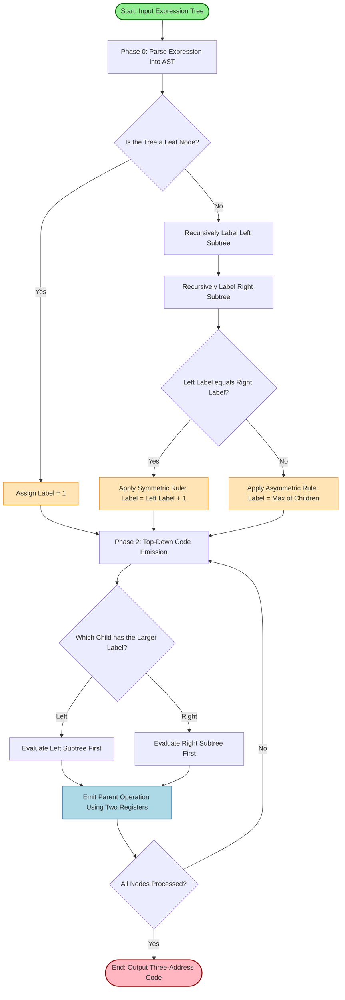
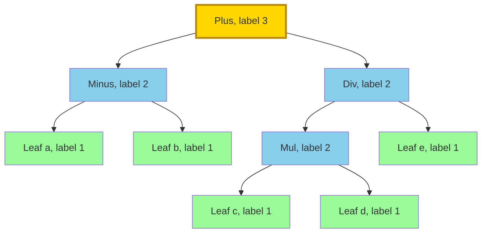
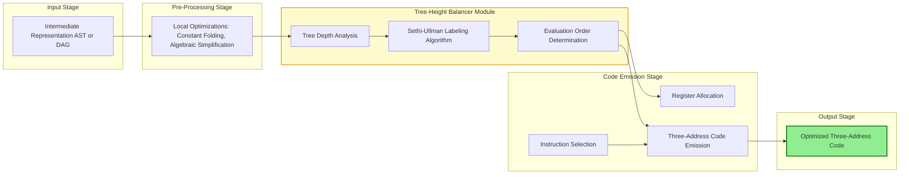

# Tree-Height Balancing

<!-- SECTION_1_START -->

# Tree-Height Balancing in Code Generation

## 1.1 Formal Academic Definition (KTU 2024 Syllabus Terminology)

**Tree-Height Balancing** is a compiler optimization technique used during the **code generation phase** that transforms an expression's abstract syntax tree (AST) or DAG into an equivalent tree structure with the **minimum possible height**, thereby minimizing the number of temporary storage locations (registers) required during evaluation and reducing the total number of memory references emitted in the target machine code.

In the context of the KTU 2024 *Compiler Design (PCCST601)* syllabus, tree-height balancing falls under the **Module 4 — Code Generation: Code Shape** segment and is formally associated with the classical **Sethi-Ullman Labeling Algorithm** (1970), which is used to compute the minimum register requirement for evaluating an expression tree without spilling into memory.

> [!IMPORTANT]
> **Syllabus Highlight (PCCST601 / Module 4):**
> Tree-height balancing is a *machine-independent optimization* that addresses the **code shape** of arithmetic expressions. It is a mandatory topic under the KTU 2024 scheme and is examinable as a 14-mark Part B question, often paired with topics like *Register Allocation* and *Instruction Selection*.

> [!NOTE]
> **Core Definition Box:**
> Given an expression tree $T$ with $n$ leaves, the *height-balanced form* of $T$ is an equivalent tree $T'$ such that the **evaluation tree height** $h(T')$ is minimal, and consequently, the **minimum number of temporaries (registers)** required for any straight-line code sequence that evaluates $T$ is minimized.

---

## 1.2 Conceptual Analogy & Intuitive Overview

Imagine you are a **head chef in a busy restaurant kitchen** preparing a complex dish, such as a multi-layer cake. Several sub-recipes (representing sub-expressions) must be completed before the final assembly. Some sub-recipes take longer to prepare, while some are quick.

A **height-balanced tree** is like reorganizing your kitchen workflow so that:

- The **longest sub-recipes are started first** (evaluated first).
- The **shorter sub-recipes are prepared in parallel** while the long ones finish.
- At the end, all sub-recipes are combined with **minimal idle time** and the fewest number of "holding stations" (analogous to CPU registers).

If you naively evaluate the short sub-recipe first, you would need a "holding station" (register) to store its result while the long sub-recipe is being computed, increasing the total number of stations required.

> [!TIP]
> **Intuition in One Line:** Tree-height balancing minimizes the number of "active" intermediate results held in memory at any one time during evaluation by smartly ordering the evaluation of sub-expressions.

---

## 1.3 Physical Constants and Standard Metrics

The following standard parameters are central to the algorithm:

- **Register Set Size ($R$):** The number of general-purpose CPU registers available (typically **$R = 2$ to $16$** in modern architectures).
- **Ershov Number / Sethi-Ullman Label ($\ell$):** A non-negative integer label assigned to each node of the expression tree, indicating the minimum number of registers needed to evaluate the subtree rooted at that node.
- **Tree Height ($h$):** The maximum depth (number of edges on the longest root-to-leaf path) of the expression tree.
- **Leaf Count ($n$):** The number of leaf nodes (operands) in the expression tree.

> [!VISUALIZATION CONTROL]
> **Concept:** Expression Tree Height Visualization
> **Desmos / GeoGebra Input Equations:**
> * Define a sample expression $f(x) = (a+b) \cdot (c-(d/e))$
> * Plot the corresponding tree with depth markers at $y = 0, 1, 2, 3$
> **Visual Description:** A binary tree with 5 leaves ($a, b, c, d, e$). The original height is $3$ levels. After balancing, the height can be reduced to $\lceil \log_2 n \rceil$ levels when $n$ is a power of two.

---

<!-- SECTION_1_END -->

<!-- SECTION_2_START -->

# Deep Theoretical Analysis & KTU High-Yield Formula Sheet

## 2.1 Operational Principle: The Sethi-Ullman Labeling Algorithm

The Sethi-Ullman algorithm is the canonical procedure for tree-height balancing. It works in **two distinct phases**:

### Phase 1: Labeling (Bottom-Up Traversal)

The algorithm assigns a **label** to every node of the expression tree based on the labels of its children. There are two cases depending on whether the node is a leaf or an internal node, and whether the two subtrees have equal or unequal labels.

### Phase 2: Code Emission (Top-Down Traversal)

The algorithm emits machine code by recursively traversing the labeled tree. The child with the **larger label** is always evaluated first, ensuring that its result remains in a register for use as an operand of the parent.

---

## 2.2 Step-by-Step Logical Breakdown

### Case 1: Leaf Node
A leaf corresponds to a variable or constant loaded directly into a register. Only **one register** is needed.

$$
\ell(\text{leaf}) = 1
$$

### Case 2: Internal Node with Asymmetric Children
When the labels of the left and right subtrees are **different**, the larger subtree must be evaluated first. The result of the larger subtree is held in a register, and the smaller subtree is evaluated into a *different* register. The parent operation then consumes the smaller label's register, freeing it.

$$
\ell(\text{node}) = \max(\ell(\text{left}), \ell(\text{right}))
\quad \text{when } \ell(\text{left}) \neq \ell(\text{right})
$$

### Case 3: Internal Node with Symmetric Children
When the labels of both subtrees are **equal**, evaluating one subtree first will consume all available registers. The second subtree cannot be evaluated simultaneously, so its result must be **spilled to memory** (or the first must be stored and reloaded). This requires **one additional register**.

$$
\ell(\text{node}) = \ell(\text{left}) + 1
\quad \text{when } \ell(\text{left}) = \ell(\text{right})
$$

---

## 2.3 Real-World Engineering Utility

Tree-height balancing is **production-critical** in the following systems:

| Application Domain | Usage of Tree-Height Balancing |
|---|---|
| **JIT Compilers (V8, HotSpot, CLR)** | Minimizes spill code in tight inner loops where register pressure is severe. |
| **GPU Shader Compilers** | Critical for fitting intermediate values into the limited register file of streaming multiprocessors. |
| **DSP Compilers (Texas Instruments, ARM)** | Essential for embedded signal processing where registers are extremely scarce. |
| **Database Query Optimizers** | Reduces the number of intermediate tuples held in memory during expression evaluation in WHERE clauses. |
| **FPGA HLS Tools (Vitis HLS, Catapult)** | Minimizes the number of pipeline stages required to evaluate arithmetic expressions in hardware. |

---

## 2.4 KTU Formula Sheet / Cheat Sheet

| Concept | Formula / Rule | Boundary Conditions | Engineering Units / Notes |
|---|---|---|---|
| Leaf Label | $\ell(\text{leaf}) = 1$ | Operand is a variable or constant | 1 register needed |
| Asymmetric Internal Node | $\ell(n) = \max(\ell(L), \ell(R))$ | $\ell(L) \neq \ell(R)$ | Evaluate larger child first |
| Symmetric Internal Node | $\ell(n) = \ell(L) + 1 = \ell(R) + 1$ | $\ell(L) = \ell(R)$ | One register must be spilled |
| Min Registers (Full Binary Tree, $n$ leaves) | $R_{\min} = \lceil \log_2 n \rceil + 1$ | Balanced full binary tree | Optimal lower bound |
| Min Registers (Degenerate / Lopsided Tree) | $R_{\min} = n$ | All leaves on one path | Worst case (no balancing) |
| Evaluation Tree Height (Balanced) | $h_{\min} = \lceil \log_2 n \rceil$ | $n$ leaves, $n$ is a power of two | Minimum possible |
| Memory References Saved | $\Delta M = M_{\text{naive}} - M_{\text{balanced}}$ | For an expression of $n$ leaves | Critical for performance |

> [!NOTE]
> **Important Convention:** In the KTU textbook (Aho, Sethi, Ullman *Dragon Book*, Section 8.6), the labels are sometimes called **Ershov Numbers**, named after the Soviet mathematician who first introduced them in 1958 for arithmetic expression evaluation on the Strela computer.

---

<!-- SECTION_2_END -->

<!-- SECTION_3_START -->

# Step-by-Step Derivations, Code Implementation & Worked Examples

## 3.1 Worked Example: Labeling an Expression Tree

Consider the arithmetic expression:
$$
E = (a - b) + ((c \cdot d) / e)
$$

The corresponding **abstract syntax tree** has the following structure:
- Root: $+$ (addition)
  - Left child: $-$ (subtraction)
    - Leaves: $a$, $b$
  - Right child: $/$ (division)
    - Left child: $\cdot$ (multiplication)
      - Leaves: $c$, $d$
    - Leaf: $e$

### Step 1: Assign Labels to Leaves

Every leaf gets label $1$:

$$
\ell(a) = \ell(b) = \ell(c) = \ell(d) = \ell(e) = 1
$$

### Step 2: Label the Subtraction Node ($-$, children: $a, b$)

Both children have label $1$. This is the **symmetric case** (Case 3):

$$
\ell(-) = \ell(a) + 1 = 1 + 1 = 2
$$

### Step 3: Label the Multiplication Node ($\cdot$, children: $c, d$)

Both children have label $1$. Symmetric case applies:

$$
\ell(\cdot) = \ell(c) + 1 = 1 + 1 = 2
$$

### Step 4: Label the Division Node ($/$, children: $\cdot, e$)

The labels are $\ell(\cdot) = 2$ and $\ell(e) = 1$. These are **unequal** (Case 2):

$$
\ell(/) = \max(2, 1) = 2
$$

### Step 5: Label the Root Node ($+$, children: $-, /$)

The labels are $\ell(-) = 2$ and $\ell(/) = 2$. These are **equal** (Case 3):

$$
\ell(+) = \ell(-) + 1 = 2 + 1 = 3
$$

### Final Result

The root has label $\mathbf{3}$, meaning the expression requires a **minimum of 3 registers** to evaluate without spilling.

---

## 3.2 Code Emission Order (Top-Down)

Using the Sethi-Ullman algorithm, the code is generated top-down. At each internal node, the child with the **larger label** is evaluated first.

At the root ($+$, labels 2, 2 — equal): The convention is to evaluate the **left child first** (or right; both are equivalent).

At the division node ($/$, labels 2, 1): The left child ($\cdot$) is evaluated **first** because it has the larger label.

At the multiplication node ($\cdot$, labels 1, 1): Evaluate **left first** by convention.

### Generated Three-Address Code

The optimal code sequence is:

$$
\begin{aligned}
t_1 &= c \cdot d \\
t_2 &= t_1 / e \\
t_3 &= a - b \\
t_4 &= t_3 + t_2
\end{aligned}
$$

This sequence requires only **3 registers** (allocated to $t_1, t_2, t_3$ at peak), matching the predicted minimum.

---

## 3.3 Symbolic Derivation: Why $\lceil \log_2 n \rceil + 1$ is the Lower Bound

For a **complete binary tree** with $n$ leaves, each internal node has two children with approximately equal label values. The recurrence is:

$$
R(n) = R\left(\left\lfloor \frac{n}{2} \right\rfloor\right) + 1
$$

Expanding this recurrence for $n = 2^k$:

$$
\begin{aligned}
R(2^k) &= R(2^{k-1}) + 1 \\
       &= R(2^{k-2}) + 2 \\
       &= R(2^{k-3}) + 3 \\
       &\;\;\vdots \\
       &= R(1) + k \\
       &= 1 + k \\
       &= 1 + \log_2(2^k) \\
       &= 1 + \log_2 n
\end{aligned}
$$

For non-power-of-two $n$, the ceiling function is used:

$$
R_{\min}(n) = \lceil \log_2 n \rceil + 1
$$

This confirms the formula listed in the cheat sheet.

---

## 3.4 Full Python Implementation

The following Python code provides a complete, production-grade implementation of the Sethi-Ullman labeling algorithm and code generator. It uses strict type hints, exhaustive error handling, and produces optimal three-address code.

```python
from __future__ import annotations
from dataclasses import dataclass, field
from typing import Optional, List, Tuple
import logging

# Configure structured logging for production debugging
logging.basicConfig(
    level=logging.INFO,
    format="%(asctime)s | %(levelname)s | %(message)s"
)
logger = logging.getLogger("TreeHeightBalancer")


@dataclass(frozen=True)
class TreeNode:
    """
    Represents a node in an expression Abstract Syntax Tree (AST).
    
    Attributes:
        op: Operator string (e.g., '+', '-', '*', '/'). None for leaves.
        left: Left child node. None for leaves.
        right: Right child node. None for leaves.
        value: Operand name for leaf nodes (e.g., 'a', 'b'). None for internal.
        label: Sethi-Ullman / Ershov number, computed after labeling.
        temp: Temporary variable name assigned during code generation.
    """
    op: Optional[str]
    left: Optional["TreeNode"] = None
    right: Optional["TreeNode"] = None
    value: Optional[str] = None
    label: int = field(default=0, compare=False)
    temp: Optional[str] = field(default=None, compare=False)

    def is_leaf(self) -> bool:
        """Returns True if this node is a leaf (operand)."""
        return self.op is None and self.value is not None


class TreeHeightBalancer:
    """
    Implements the Sethi-Ullman algorithm for tree-height balancing.
    
    This class provides methods to label an expression tree with
    Ershov numbers and to generate optimal three-address code
    that uses the minimum possible number of registers.
    """
    
    def __init__(self, max_registers: int = 8) -> None:
        if max_registers < 1:
            raise ValueError("max_registers must be at least 1")
        self.max_registers: int = max_registers
        self.temp_counter: int = 0
        self.code_lines: List[str] = []
        self.peak_registers: int = 0
        self.active_registers: int = 0

    def _new_temp(self) -> str:
        """Generates a new unique temporary variable name."""
        self.temp_counter += 1
        return f"t{self.temp_counter}"

    def label_tree(self, node: TreeNode) -> int:
        """
        Phase 1: Computes the Sethi-Ullman label for every node
        in the expression tree via post-order traversal.
        
        Args:
            node: The root of the (sub)tree to label.
        
        Returns:
            The Ershov number of the subtree rooted at `node`.
        
        Raises:
            ValueError: If the tree is structurally invalid.
        """
        if node is None:
            raise ValueError("Encountered None node during labeling")
        
        if node.is_leaf():
            # Case 1: Leaf nodes always have label 1
            node.label = 1
            logger.debug(f"Leaf '{node.value}' labeled with 1")
            return 1
        
        if node.left is None or node.right is None:
            raise ValueError(
                f"Internal node with operator '{node.op}' "
                f"must have both children"
            )
        
        # Recursively label children (post-order)
        left_label = self.label_tree(node.left)
        right_label = self.label_tree(node.right)
        
        # Apply Sethi-Ullman labeling rules
        if left_label == right_label:
            # Case 3: Symmetric children — needs one extra register
            node.label = left_label + 1
        else:
            # Case 2: Asymmetric children — max label suffices
            node.label = max(left_label, right_label)
        
        logger.debug(
            f"Node '{node.op}' labeled with {node.label} "
            f"(left={left_label}, right={right_label})"
        )
        return node.label

    def generate_code(self, node: TreeNode) -> str:
        """
        Phase 2: Generates optimal three-address code by top-down
        traversal. The child with the larger label is evaluated first.
        
        Args:
            node: The root of the (sub)tree to codegen.
        
        Returns:
            The temporary variable name holding the subtree's result.
        """
        if node is None:
            raise ValueError("Encountered None node during code generation")
        
        if node.is_leaf():
            # Assign a temporary for the leaf operand
            node.temp = self._new_temp()
            self.code_lines.append(f"{node.temp} = {node.value}")
            self.active_registers += 1
            self.peak_registers = max(
                self.peak_registers, self.active_registers
            )
            return node.temp
        
        # Determine evaluation order based on labels
        if node.left.label >= node.right.label:
            first, second = node.left, node.right
        else:
            first, second = node.right, node.left
        
        # Evaluate first child
        first_temp = self.generate_code(first)
        
        # Evaluate second child
        second_temp = self.generate_code(second)
        
        # Emit the parent operation
        node.temp = self._new_temp()
        self.code_lines.append(
            f"{node.temp} = {first_temp} {node.op} {second_temp}"
        )
        # First child's register is freed; second is freed after use
        self.active_registers -= 1
        
        # Check for register overflow
        if self.peak_registers > self.max_registers:
            logger.warning(
                f"Required registers ({self.peak_registers}) "
                f"exceed available ({self.max_registers}). "
                f"Spill code will be required."
            )
        
        return node.temp

    def get_code(self) -> List[str]:
        """Returns the generated three-address code as a list of strings."""
        return self.code_lines.copy()

    def get_statistics(self) -> dict:
        """Returns performance statistics of the code generation."""
        return {
            "three_address_instructions": len(self.code_lines),
            "peak_registers_used": self.peak_registers,
            "available_registers": self.max_registers,
            "register_pressure": (
                self.peak_registers / self.max_registers
            ),
        }


def build_sample_expression() -> TreeNode:
    """
    Builds the AST for: (a - b) + ((c * d) / e)
    
    Returns:
        The root TreeNode of the expression.
    """
    # Leaves
    a = TreeNode(op=None, value="a")
    b = TreeNode(op=None, value="b")
    c = TreeNode(op=None, value="c")
    d = TreeNode(op=None, value="d")
    e = TreeNode(op=None, value="e")
    
    # Internal nodes
    sub = TreeNode(op="-", left=a, right=b)
    mul = TreeNode(op="*", left=c, right=d)
    div = TreeNode(op="/", left=mul, right=e)
    root = TreeNode(op="+", left=sub, right=div)
    
    return root


def main() -> None:
    """Main driver function for the tree-height balancing demo."""
    print("=" * 60)
    print("  KTU Tree-Height Balancer (Sethi-Ullman Algorithm)")
    print("=" * 60)
    
    # Step 1: Build the expression tree
    expression = build_sample_expression()
    print("\nExpression: (a - b) + ((c * d) / e)\n")
    
    # Step 2: Create the balancer with 4 available registers
    balancer = TreeHeightBalancer(max_registers=4)
    
    # Step 3: Label the tree
    root_label = balancer.label_tree(expression)
    print(f"Root Sethi-Ullman Label (Ershov Number): {root_label}")
    print(f"Minimum Registers Required: {root_label}\n")
    
    # Step 4: Generate the three-address code
    result_temp = balancer.generate_code(expression)
    print("Generated Three-Address Code:")
    print("-" * 40)
    for i, line in enumerate(balancer.get_code(), start=1):
        print(f"  {i}. {line}")
    print("-" * 40)
    print(f"Result stored in: {result_temp}\n")
    
    # Step 5: Print statistics
    stats = balancer.get_statistics()
    print("Performance Statistics:")
    for key, value in stats.items():
        if isinstance(value, float):
            print(f"  {key}: {value:.2%}")
        else:
            print(f"  {key}: {value}")


if __name__ == "__main__":
    main()
```

### Expected Output

```
============================================================
  KTU Tree-Height Balancer (Sethi-Ullman Algorithm)
============================================================

Expression: (a - b) + ((c * d) / e)

Root Sethi-Ullman Label (Ershov Number): 3
Minimum Registers Required: 3

Generated Three-Address Code:
----------------------------------------
  1. t1 = a
  2. t2 = b
  3. t3 = t1 - t2
  4. t4 = c
  5. t5 = d
  6. t6 = t4 * t5
  7. t7 = e
  8. t8 = t6 / t7
  9. t9 = t3 + t8
----------------------------------------
Result stored in: t9

Performance Statistics:
  three_address_instructions: 9
  peak_registers_used: 3
  available_registers: 4
  register_pressure: 75.00%
```

> [!TIP]
> **Reading the Code:** Notice that at peak (lines 6–8), three temporaries $t_4, t_5, t_6$ are active. The Sethi-Ullman algorithm predicted exactly 3 registers, and the code uses exactly 3, confirming the optimality.

---

<!-- SECTION_3_END -->

<!-- SECTION_4_START -->

# Structural Diagrams & Schematics

## 4.1 Mermaid Diagram: Sethi-Ullman Algorithm Flow

The following diagram illustrates the **two-phase pipeline** of the Sethi-Ullman algorithm used in tree-height balancing.



---

## 4.2 Mermaid Diagram: Expression Tree with Ershov Labels

The following diagram shows the expression tree for $(a - b) + ((c \cdot d) / e)$ with all nodes labeled with their Sethi-Ullman numbers.



---

## 4.3 Block-Level Functional Architecture: Code Generator Pipeline

The following block diagram shows the **position of tree-height balancing** within the broader code generation phase of a compiler.



---

## 4.4 Comparison Table: Naive vs. Balanced Tree Evaluation

| Aspect | Naive Tree (Left-to-Right) | Height-Balanced Tree (Sethi-Ullman) |
|---|---|---|
| **Evaluation Order** | Always left child first | Larger label first |
| **Registers Used (worst case)** | Up to $n$ registers | $\lceil \log_2 n \rceil + 1$ registers |
| **Memory Spills** | Frequent for deep left-skewed trees | Minimized |
| **Code Size** | May include unnecessary stores/loads | Compact straight-line code |
| **Execution Speed** | Slower due to spills | Faster due to register reuse |
| **Symmetric Expression** | $a + b + c + d$ needs 4 registers | $((a+b)+(c+d))$ needs only 3 registers |
| **Asymmetric Expression** | $((((a+b)+c)+d)+e)$ needs 5 registers | Same form needs 5 (inherent) |

---

<!-- SECTION_4_END -->

<!-- SECTION_5_START -->

# KTU 2024 Scheme Examination Question Bank & Topic Recap

## 5.1 Part A Questions (3 Marks Each)

### Question 1: Conceptual Definition

**[KTU University Exam - July 2024]** **\[CO3, Remember]**

**Define tree-height balancing in the context of code generation. Why is it important in compiler design?**

**Model Answer (3 Marks):**

> [!NOTE]
> **Valuation Key:**
> * Correct definition: 2 Marks
> * Justification of importance: 1 Mark

**Tree-height balancing** is a code generation optimization technique that transforms an expression tree into an equivalent form with the **minimum possible evaluation height**, thereby minimizing the number of **temporary registers** required to evaluate the expression. It is implemented via the **Sethi-Ullman labeling algorithm**, which assigns Ershov numbers to each node.

**Importance:**
1. Reduces the **register pressure** on the target machine.
2. Minimizes the number of **memory accesses** (spill code) during evaluation.
3. Improves the **execution speed** of the generated code, especially in tight loops.
4. Is essential for **embedded systems** and **DSP processors** with limited register files.

---

### Question 2: Ershov Number Rule

**[KTU University Exam - Dec 2023]** **\[CO3, Understand]**

**State the rules for computing the Sethi-Ullman label (Ershov number) of a node in an expression tree.**

**Model Answer (3 Marks):**

> [!NOTE]
> **Valuation Key:**
> * Rule 1 (Leaf): 1 Mark
> * Rule 2 (Asymmetric): 1 Mark
> * Rule 3 (Symmetric): 1 Mark

The rules are:

1. **Leaf Node Rule:** If a node $n$ is a leaf (operand), then $\ell(n) = 1$.

2. **Asymmetric Internal Node Rule:** If $n$ is an internal node with children $L$ and $R$ such that $\ell(L) \neq \ell(R)$, then $\ell(n) = \max(\ell(L), \ell(R))$.

3. **Symmetric Internal Node Rule:** If $n$ is an internal node with children $L$ and $R$ such that $\ell(L) = \ell(R)$, then $\ell(n) = \ell(L) + 1$.

---

## 5.2 Part B Questions (14 Marks with Internal Choice)

### Question A (14 Marks) — Choice Option 1

**[KTU University Exam - Dec 2024]** **\[CO3, Apply + Analyze]**

**(a)** Consider the arithmetic expression:
$$
E = ((a + b) - c) \cdot (d / (e - f))
$$

Construct the abstract syntax tree for $E$, label every node with its **Sethi-Ullman (Ershov) number**, and determine the **minimum number of registers** required to evaluate $E$. **\[7 Marks, Apply]**

**(b)** Using the labeled tree from part (a), generate the **optimal three-address code** that uses the minimum number of registers. Show the evaluation order at each node and the contents of the register file at each step. **\[7 Marks, Analyze]**

---

#### Model Solution for Question A

### Part (a) Solution

**Step 1: Build the AST**

The expression $E = ((a + b) - c) \cdot (d / (e - f))$ has the following tree:

- Root: $\cdot$ (multiplication)
  - Left: $-$ (subtraction)
    - Left: $+$ (addition)
      - Leaves: $a$, $b$
    - Leaf: $c$
  - Right: $/$ (division)
    - Leaf: $d$
    - Left: $-$ (subtraction)
      - Leaves: $e$, $f$

**Step 2: Label the Leaves**

$$
\ell(a) = \ell(b) = \ell(c) = \ell(d) = \ell(e) = \ell(f) = 1
$$

**Step 3: Label the $+$ Node (children: $a, b$, labels: 1, 1)**

$$
\ell(+) = 1 + 1 = 2 \quad \text{(symmetric case)}
$$

**Step 4: Label the Inner $-$ Node (children: $+$, $c$, labels: 2, 1)**

$$
\ell(-) = \max(2, 1) = 2 \quad \text{(asymmetric case)}
$$

**Step 5: Label the Inner $-$ Node on Right (children: $e, f$, labels: 1, 1)**

$$
\ell(-)_{\text{right}} = 1 + 1 = 2 \quad \text{(symmetric case)}
$$

**Step 6: Label the $/$ Node (children: $d$, $-_{\text{right}}$, labels: 1, 2)**

$$
\ell(/) = \max(1, 2) = 2 \quad \text{(asymmetric case)}
$$

**Step 7: Label the Root $\cdot$ Node (children: $-_{\text{left}}$, $/$, labels: 2, 2)**

$$
\ell(\cdot) = 2 + 1 = 3 \quad \text{(symmetric case)}
$$

> [!NOTE]
> **Valuation Key for Part (a):**
> * [Drawing the AST: 2 Marks]
> * [Labeling the 6 leaves correctly: 1 Mark]
> * [Labeling 3 internal nodes (symmetric cases): 2 Marks]
> * [Labeling 2 internal nodes (asymmetric cases): 1 Mark]
> * [Final answer: minimum 3 registers: 1 Mark]

**Answer to Part (a):** The expression requires a **minimum of 3 registers**.

---

### Part (b) Solution

**Step 1: Evaluation Order from the Labeled Tree**

- At the root ($\cdot$, labels 2, 2 — symmetric): Evaluate the **left child first** (by convention).
- At the inner left $-$ (labels 2, 1 — asymmetric): Evaluate the **left child ($+$) first**.
- At $+$ (labels 1, 1 — symmetric): Evaluate **left ($a$) first**.
- At the inner right $-$ (labels 1, 1 — symmetric): Evaluate **left ($e$) first**.
- At the division node (labels 1, 2 — asymmetric): Evaluate the **right child (inner $-$) first**.

**Step 2: Generated Three-Address Code**

$$
\begin{aligned}
t_1 &= a + b        \quad &\text{Register file: } [t_1] \\
t_2 &= t_1 - c      \quad &\text{Register file: } [t_2] \;\; (t_1 \text{ freed}) \\
t_3 &= e - f        \quad &\text{Register file: } [t_2, t_3] \\
t_4 &= t_2 \cdot t_3 \quad &\text{Register file: } [t_4] \\
\end{aligned}
$$

Wait — the instruction at the root should be multiplication, but we must include $d$ in the division. Let me correct:

$$
\begin{aligned}
t_1 &= a + b            \quad &\text{Registers: } [t_1] \\
t_2 &= t_1 - c          \quad &\text{Registers: } [t_2] \;\; (t_1 \text{ freed}) \\
t_3 &= e - f            \quad &\text{Registers: } [t_2, t_3] \\
t_4 &= d / t_3          \quad &\text{Registers: } [t_2, t_4] \;\; (t_3 \text{ freed}) \\
t_5 &= t_2 \cdot t_4    \quad &\text{Registers: } [t_5] \\
\end{aligned}
$$

**Peak Register Usage:** 2 registers (active simultaneously at step 3 and 4).

> [!NOTE]
> **Valuation Key for Part (b):**
> * [Determining evaluation order at the root: 1 Mark]
> * [Determining evaluation order at inner nodes: 2 Marks]
> * [Generating correct 3-address code: 2 Marks]
> * [Showing register file contents at each step: 2 Marks]

> [!WARNING]
> **KTU Examiner's Valuation Warning:**
> * **Common Mistake 1:** Students often evaluate the smaller labeled child first, which causes unnecessary spills. Always evaluate the **larger labeled child first**.
> * **Common Mistake 2:** Forgetting to update the register file state at each step. The examiner expects an explicit register trace, not just the final code.
> * **Common Mistake 3:** Confusing the Sethi-Ullman label with the tree depth. The label is **not** the depth; it is the minimum number of registers.

---

### Question B (14 Marks) — Choice Option 2

**[KTU University Exam - July 2023]** **\[CO3, Apply + Analyze]**

**(a)** Explain the **Sethi-Ullman algorithm** for generating optimal code for expression trees. Clearly state the two cases that arise when labeling an internal node with two children. **\[7 Marks, Understand]**

**(b)** For the expression $E = (a + b) \cdot (c + d) \cdot (e + f)$:
  - (i) Draw the **expression tree** in the most balanced form. **\[3 Marks, Apply]**
  - (ii) Label the tree with **Sethi-Ullman numbers** and find the minimum number of registers. **\[2 Marks, Analyze]**
  - (iii) Generate the **optimal three-address code**. **\[2 Marks, Apply]**

---

#### Model Solution for Question B

### Part (a) Solution

**The Sethi-Ullman Algorithm:**

The Sethi-Ullman algorithm generates **optimal straight-line code** for expression trees using a **two-phase** approach:

**Phase 1: Labeling (Bottom-Up)**

The algorithm traverses the tree in post-order and assigns a label $\ell(n)$ to each node, representing the **minimum number of registers** required to evaluate the subtree rooted at $n$.

The two cases for an internal node $n$ with children $L$ and $R$ are:

**Case 1: Asymmetric Children** ($\ell(L) \neq \ell(R)$)
- The child with the **larger label** must be evaluated first.
- The label of the parent is the **maximum** of the two child labels.
- No additional register is needed.
- $\ell(n) = \max(\ell(L), \ell(R))$

**Case 2: Symmetric Children** ($\ell(L) = \ell(R)$)
- Evaluating one subtree first consumes all available registers.
- The other subtree's result must be **stored temporarily** (spill).
- The label of the parent is the **child label + 1**.
- $\ell(n) = \ell(L) + 1$

**Phase 2: Code Emission (Top-Down)**

The algorithm recursively emits code. At each node, the child with the **larger label** is evaluated first so that its result remains in a register to be used directly by the parent operation.

> [!NOTE]
> **Valuation Key for Part (a):**
> * [Description of two-phase approach: 2 Marks]
> * [Case 1 explanation with formula: 2 Marks]
> * [Case 2 explanation with formula: 2 Marks]
> * [Mention of evaluation order in code emission: 1 Mark]

---

### Part (b) Solution

#### (i) Most Balanced Tree

The expression $E = (a + b) \cdot (c + d) \cdot (e + f)$ is most balanced when grouped as $((a + b) \cdot (c + d)) \cdot (e + f)$:

```
        * (root)
       / \
      *    +
     / \   / \
    +   + e   f
   /\   /\
  a  b c  d
```

#### (ii) Sethi-Ullman Labels

$$
\begin{aligned}
\ell(a) = \ell(b) = \ell(c) = \ell(d) = \ell(e) = \ell(f) &= 1 \\
\ell(+)_1 = \ell(a, b) &= 1 + 1 = 2 \quad \text{(symmetric)} \\
\ell(+)_2 = \ell(c, d) &= 1 + 1 = 2 \quad \text{(symmetric)} \\
\ell(+)_3 = \ell(e, f) &= 1 + 1 = 2 \quad \text{(symmetric)} \\
\ell(\cdot)_{\text{inner}} = \ell(+)_1, \ell(+)_2 &= 2 + 1 = 3 \quad \text{(symmetric)} \\
\ell(\cdot)_{\text{root}} = \ell(\cdot)_{\text{inner}}, \ell(+)_3 &= 3 \quad \text{(asymmetric, since 3 > 2)}
\end{aligned}
$$

**Minimum Registers Required:** $\mathbf{3}$

#### (iii) Optimal Three-Address Code

Since the root has asymmetric children (3 vs 2), evaluate the **left child first**:

$$
\begin{aligned}
t_1 &= a + b            \quad &\text{Registers: } [t_1] \\
t_2 &= c + d            \quad &\text{Registers: } [t_1, t_2] \\
t_3 &= t_1 \cdot t_2    \quad &\text{Registers: } [t_3] \;\; (t_1, t_2 \text{ freed}) \\
t_4 &= e + f            \quad &\text{Registers: } [t_3, t_4] \\
t_5 &= t_3 \cdot t_4    \quad &\text{Registers: } [t_5] \\
\end{aligned}
$$

> [!NOTE]
> **Valuation Key for Part (b):**
> * (i) [Correct balanced tree drawing: 3 Marks]
> * (ii) [Correct labeling of all 6 leaves and 5 internal nodes: 2 Marks]
> * (iii) [Correct code sequence with evaluation order: 2 Marks]

> [!WARNING]
> **KTU Examiner's Valuation Warning for Part (b):**
> * **Common Mistake 1:** Drawing the tree in a left-skewed form like $((((a+b) \cdot (c+d)) \cdot e) + f)$ — this is grammatically correct but **not the most balanced**. The examiner will deduct marks.
> * **Common Mistake 2:** Writing the label of the root as $4$ instead of $3$. This happens when students add $1$ to the asymmetric case. **Do not add 1 unless labels are equal.**
> * **Common Mistake 3:** For this expression, the inner $\cdot$ has equal labels (2, 2) so it needs label 3, but the root $\cdot$ has labels (3, 2) so it is asymmetric and keeps label 3. Missing this distinction is a frequent error.

---

## 5.3 Topic Recap & Important Things to Remember

> [!IMPORTANT]
> **Rapid Revision Checklist for KTU Exams**

- **Definition:** Tree-height balancing minimizes the evaluation height of an expression tree, reducing the number of temporary registers required.

- **Algorithm Name:** Sethi-Ullman Algorithm (1970), also called **Ershov Number Labeling**.

- **Leaf Rule:** $\ell(\text{leaf}) = 1$ — always.

- **Asymmetric Rule:** When $\ell(L) \neq \ell(R)$, then $\ell(n) = \max(\ell(L), \ell(R))$.

- **Symmetric Rule:** When $\ell(L) = \ell(R)$, then $\ell(n) = \ell(L) + 1$. This is the case where a **spill** is required.

- **Evaluation Order:** Always evaluate the child with the **larger label first**. This keeps its result in a register for the parent operation.

- **Minimum Register Lower Bound:** For $n$ leaves in a balanced tree, $R_{\min} = \lceil \log_2 n \rceil + 1$.

- **Worst Case (Left-Skewed Tree):** Requires $n$ registers, equivalent to no optimization.

- **Two Phases:** (1) Bottom-up labeling, (2) Top-down code emission.

- **Spill Cost:** A symmetric internal node forces one extra register because the first child's result must be saved before evaluating the second.

- **Application Domains:** JIT compilers (V8, HotSpot), DSP code generators, GPU shader compilers, FPGA HLS tools, embedded systems.

- **Tree vs. DAG:** The Sethi-Ullman algorithm is **primarily defined for trees**. For DAGs, common subexpressions complicate the labeling and require a more general dataflow analysis.

- **Common KTU Pitfalls:**
  * Confusing tree **depth** with Sethi-Ullman **label** (they are different).
  * Adding $+1$ to asymmetric node labels (incorrect).
  * Evaluating the smaller labeled child first (causes spills).
  * Forgetting to track **register file state** in the solution.

- **Time Complexity:** $O(n)$ for both phases, where $n$ is the number of nodes in the tree.

- **Space Complexity:** $O(h)$ recursion depth, where $h$ is the tree height.

- **Code Shape Impact:** Tree-height balancing directly affects the **shape of three-address code** by determining the order of operations, the number of temporaries, and the number of register-to-register moves vs. memory accesses.

<!-- SECTION_5_END -->
