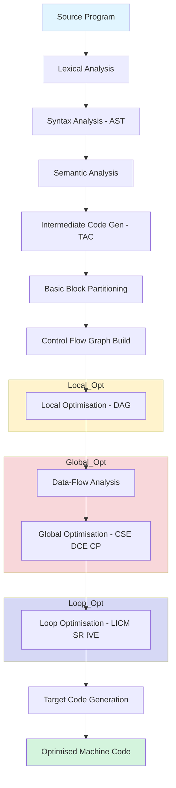
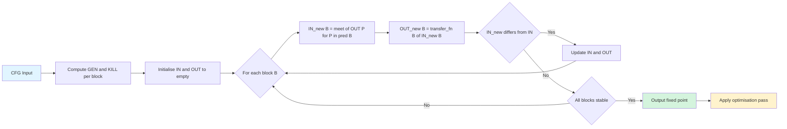
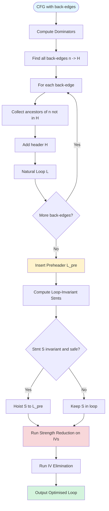
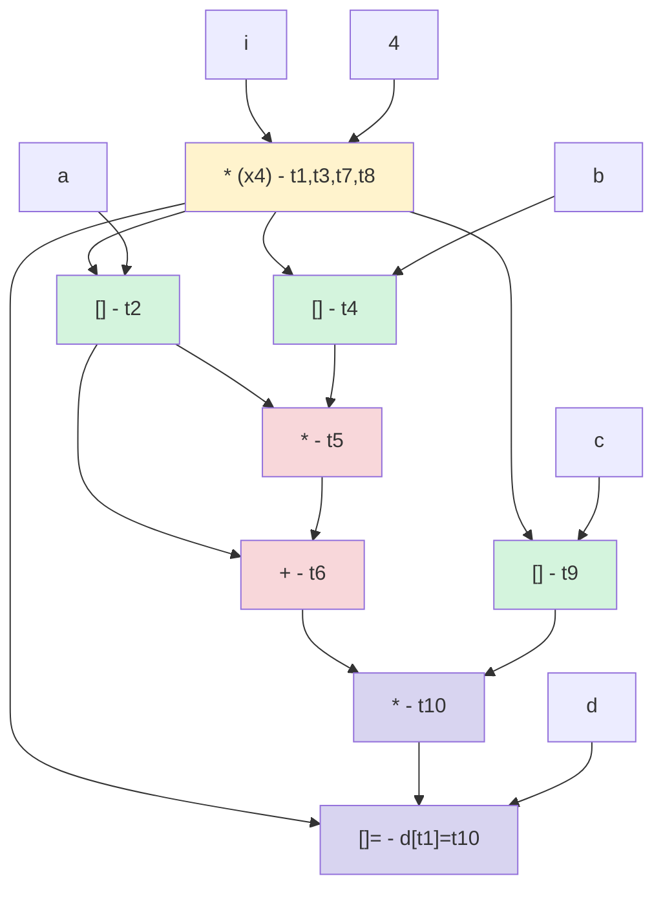
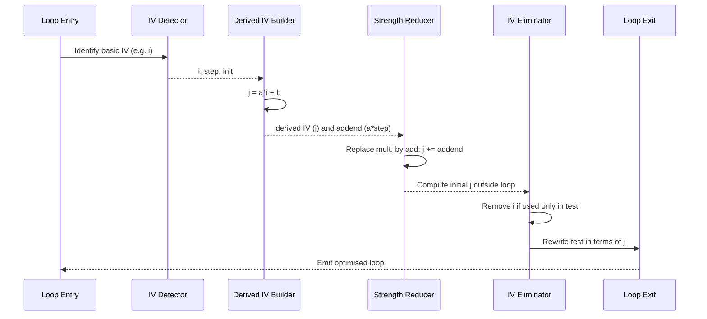

# Code Optimization: Principal sources of optimization, Optimization of basic blocks, Data-flow analysis foundations, Loop optimization

<!-- SECTION_1_START -->

# Code Optimization: Foundations, Basic Blocks, Data-Flow & Loop Tuning

## 1. Core Technical Definition (KTU 2024 Scheme Terminology)

> [!NOTE]
> **Code Optimization** is the phase of a compiler that attempts to improve the *intermediate code* (or sometimes the target code) so that it consumes **less resources** — runtime, memory, power, or register pressure — without changing the *observable output* of the program. In KTU 2024 Scheme (PCCST601, Module 4), optimization is classified by the **scope** over which it acts: peephole, local (basic block), global (intraprocedural), and interprocedural.

**KTU Definition (Board-Standard Wording):**
> "Code optimization is a program transformation technique, which tries to improve the intermediate code by making it consume fewer resources (i.e., CPU cycles, memory, registers, network) so that faster-running machine code can be generated."

The compiler must guarantee that the *optimized* program produces **semantically identical output** for every legal input — i.e., the transformation is a *semantics-preserving* rewrite.

### The Three Pillars of Optimisation (as per Aho/Sethi/Ullman — the prescribed KTU text)

| Scope | Acts on | Typical Wins |
|---|---|---|
| **Local (Peephole / Basic Block)** | A small window or a single basic block | Constant folding, algebraic identities, dead-code elimination |
| **Global (Intraprocedural / Data-Flow)** | Whole procedure (CFG) | Common subexpression elimination, copy propagation, dead-store elim. |
| **Loop** | Natural loops in the CFG | Invariant code motion, induction-variable elimination, strength reduction |
| **Interprocedural** | Across procedure boundaries | Inlining, constant propagation across calls, tail-call opt. |

### Intuitive Analogy — The "Recipe Renovation"

> [!TIP]
> **Think of the compiler as a head-chef translating a recipe (source code) into a kitchen workflow (machine code).**
> A naive translation re-reads the pantry for every step, walks back and forth to the sink, and chops onions twice. An optimizer is the *kitchen consultant* who:
> 1. **Pre-fetches** ingredients once (invariant code motion),
> 2. **Pre-chops** everything that will be reused (common subexpression elim.),
> 3. **Replaces** the hand-grinder with an electric one (strength reduction),
> 4. **Removes** the "taste-test then throw away" step (dead-code elim.),
> 5. **Runs the dishwasher in parallel with cooking** (instruction-level parallelism).

The kitchen still produces the **same dish** — the optimized workflow just does it with **fewer trips, less energy, and faster wall-clock time**.

### Key Constants & Metrics (Bolded for Recall)

- **Time Complexity of naive code** $= O(n^2)$ or $O(n^3)$ for nested loop constructs
- **Register Pressure** is the count of simultaneously live values
- **Strength Reduction Ratio** — multiplication replaced by addition typically yields a **~3× to 10×** speedup on CISC/RISC pipelines
- **Cycles per Instruction (CPI)** — the hardware figure optimization tries to lower; an optimized inner loop pushes CPI toward **1.0**
- **Code-size Inflation Limit** — usually **≤ 1.20×** the unoptimized size in `-O2` of GCC/Clang

### Why Optimization is a Hard Problem (KTU Pitfall)

> [!IMPORTANT]
> Optimization is **undecidable in general** (Rice's theorem). Compilers approximate using *data-flow analysis* over a finite abstraction (e.g., lattices of constant values, sets of definitions). The result: optimization is **conservative** — it never risks a wrong answer, so it sometimes **misses** opportunities.

### Visualisation — A Control Flow Graph at a Glance

> [!VISUALIZATION CONTROL]
> **Concept:** Control Flow Graph (CFG) of a small procedure
> **Desmos / Graphviz Input (mermaid-equivalent textual spec):**
> ```
> digraph CFG {
>   B1 -> B2;  B1 -> B3;
>   B2 -> B4;  B3 -> B4;
>   B4 -> B2 [label="loop-back"];
>   B4 -> B5;
> }
> ```
> **Visual Description:** Five rectangular basic blocks (B1…B5) connected by directed edges. A back-edge from B4 to B2 forms a natural loop, which is the canonical target of *loop optimization*. B1 is the entry; B5 is the exit. The students should observe that B2 → B4 → B2 closes a cycle — that is the *loop header* L = B2 and the *latch* = B4.

---

<!-- SECTION_1_END -->

<!-- SECTION_2_START -->

# Deep Theoretical Analysis & KTU High-Yield Formula Sheet

## 2.1 Principal Sources of Optimization

The KTU syllabus lists **six principal sources**. They are mutually reinforcing — applying one often *enables* another (the *optimization cascade*).

### 2.1.1 Cause 1 — Redundant Computation Reuse

Eliminate the recomputation of an expression whose operands have not changed.
- **Common Subexpression Elimination (CSE):** $a = b + c$ followed later (with no intervening write to $b$ or $c$) by $d = b + c$ becomes $d = a$.
- **Copy Propagation:** after $x = y$, replace later uses of $x$ with $y$ (if $x$ is not reassigned).

### 2.1.2 Cause 2 — Invariant Code in Loops

Statements inside a loop whose operands are **loop-invariant** (defined outside the loop and not modified inside) can be **hoisted** to the preheader.
- **Loop-Invariant Code Motion (LICM).**

### 2.1.3 Cause 3 — Strength Reduction

Replace an expensive operation by a cheaper equivalent.
- Multiplication $\to$ Addition (induction-variable replacement).
- Exponentiation $\to$ Repeated squaring.
- Division-by-constant $\to$ Multiply-shift (compiler built-in).

### 2.1.4 Cause 4 — Dead-Code Elimination (DCE)

Remove:
- Assignments to variables that are never read.
- Unreachable code (e.g., after a `return` or `break` that always fires).
- Code guarded by a constant-false predicate.

### 2.1.5 Cause 5 — Constant Folding & Propagation

- **Folding:** $x = 2 + 3$ at compile time becomes $x = 5$.
- **Propagation:** substitute constant bindings through the SSA/CFG until they reach a use.

### 2.1.6 Cause 6 — Register Allocation & Spill Minimisation

A spill (storing a register to memory and reloading) costs $\ge 2$ memory ops. **Graph-colouring allocators** (Chaitin's algorithm) minimise spills; the spill-cost heuristic uses the formula below.

---

## 2.2 Basic Blocks & DAG — The Local Optimisation Engine

### 2.2.1 Basic Block (BB) — Definition

> [!NOTE]
> A **Basic Block** is a maximal sequence of consecutive three-address instructions (3-A code) in which **flow of control enters at the first instruction and leaves at the last** without halting or branching except possibly at the end.

### 2.2.2 Partitioning Algorithm (KTU Standard Steps)

1. Identify **leaders** — the first statement of a BB:
   - First statement of the procedure.
   - Target of any branch (conditional/unconditional).
   - Statement immediately following any branch.
2. A leader and all statements up to (but not including) the next leader form one BB.

### 2.2.3 Directed Acyclic Graph (DAG) for a Basic Block

The DAG is a *labelled* graph:
- **Leaf nodes** — operands that are constants or names whose *current* definition is outside the BB (marked with subscript $0$).
- **Interior nodes** — operators; the label is the operator symbol.
- **Edges** — connect an operator to its operands.
- Node also carries a list of *attached identifiers* — the names that hold the value computed at that node.

**Construction rule (K値trec):**
- For $x = y \;op\; z$ look up the most recent definition of $y$ and $z$ in the DAG. If the operator node $\nu$ with children $\nu_y$ and $\nu_z$ already exists, attach $x$ to $\nu$. Otherwise create $\nu$ and attach $x$.

---

## 2.3 Data-Flow Analysis — The Mathematical Heart

### 2.3.1 Generic Data-Flow Equation

For every basic block $B$ the analyser computes two sets $\mathrm{IN}[B]$ and $\mathrm{OUT}[B]$ that satisfy the **transfer (or flow) function**:

$$
\mathrm{OUT}[B] = f_B\bigl(\mathrm{IN}[B]\bigr)
$$

Combined with the **control-flow join**:

$$
\mathrm{IN}[B] = \bigwedge_{P \in \mathrm{pred}(B)} \mathrm{OUT}[P]
$$

where $\bigwedge$ is the **meet operator** of the underlying lattice (set union, set intersection, etc.).

### 2.3.2 The Four Classical Analyses (KTU High-Yield)

| Analysis | Domain | Gen$_B$ | Kill$_B$ | Meet | Direction |
|---|---|---|---|---|---|
| **Reaching Definitions** | $2^{\text{Defs}}$ | defs in $B$ | other defs of same LHS | $\cup$ | Forward |
| **Available Expressions** | $2^{\text{Exprs}}$ | exprs computed in $B$ w/o redefinition | exprs killed by redefinition | $\cap$ | Forward |
| **Live-Variable Analysis** | $2^{\text{Vars}}$ | vars used in $B$ before redefinition | vars redefined in $B$ | $\cup$ | Backward |
| **Very Busy Expressions** | $2^{\text{Exprs}}$ | exprs computed last in $B$ | exprs redefined in $B$ | $\cap$ | Backward |

### 2.3.3 Reaching Definitions — Iterative Equations

$$
\mathrm{OUT}[B] = \mathrm{GEN}[B] \cup \bigl(\mathrm{IN}[B] - \mathrm{KILL}[B]\bigr)
$$

$$
\mathrm{IN}[B] = \bigcup_{P \in \mathrm{pred}(B)} \mathrm{OUT}[P]
$$

Initialisation: $\mathrm{OUT}[B] = \emptyset$ for all $B \ne B_{\text{entry}}$; $\mathrm{OUT}[B_{\text{entry}}] = \emptyset$. Iterate until **fixed point** ($\mathrm{IN}$ and $\mathrm{OUT}$ stop changing).

### 2.3.4 Available Expressions — The "May-Kill / Must-Gen" Variant

$$
\mathrm{OUT}[B] = \mathrm{e\_GEN}[B] \cup \bigl(\mathrm{IN}[B] - \mathrm{e\_KILL}[B]\bigr)
$$

$$
\mathrm{IN}[B] = \bigcap_{P \in \mathrm{pred}(B)} \mathrm{OUT}[P] \quad \text{(with } \mathrm{IN}[B_{\text{entry}}] = \emptyset \text{)}
$$

This is a **must-analysis** — an expression is "available" only if it is available on **every** incoming path.

### 2.3.5 Convergence Bound (KTU Examinable Result)

For a CFG with $N$ nodes and a monotone transfer function on a finite lattice of height $h$, the iterative algorithm terminates in **at most** $N \cdot h$ iterations. In practice, $h \le \lvert \mathrm{Defs} \rvert$ for reaching definitions.

---

## 2.4 Loop Optimisation — The Real Performance Gold

### 2.4.1 Natural Loop Identification

A **natural loop** has a unique **header** $H$ (a node that dominates all nodes in the loop) and a **back-edge** $n \to H$ such that $n$ does not dominate $H$.

Algorithm:
1. Find all back-edges $n \to H$ (an edge whose head dominates its tail).
2. The natural loop of a back-edge is $H \cup \{ \text{all nodes that can reach } n \text{ without going through } H \}$.

### 2.4.2 Loop-Invariant Code Motion (LICM) — Preconditions

A statement $S$ at position $p$ inside loop $L$ is **loop-invariant** if:
- Every operand of $S$ is either a constant or has all reaching definitions *outside* $L$, **or**
- Has only one reaching definition inside $L$ that is itself loop-invariant.

It can be **hoisted** to the preheader $L_{pre}$ if:
- $S$ **dominates all exits** of $L$, **and**
- $S$ is in a block that **post-dominates the loop header** (i.e., executes at most once per iteration), **and**
- No statement that may modify an operand of $S$ lies between $S$ and the loop exit (the *separation* test).

### 2.4.3 Induction Variables (IV) & Strength Reduction

A variable $x$ is an **induction variable** of loop $L$ if every time control flows through the back-edge, $x$ is **incremented or decremented by a loop-invariant amount**.

The family of **derived IVs**: if $i$ is a basic IV and $j = c_1 \cdot i + c_2$ (with $c_1, c_2$ loop-invariant), then $j$ is a *derived* IV.

**Strength Reduction Recipe:**
1. Find the basic IV $i$ (typically the loop counter).
2. For every derived IV $j = a \cdot i + b$, replace each update $j = j + a \cdot \text{step}$ by an addition: $j' = j' + \text{addend}$ where $\text{addend} = a \cdot \text{step}$.
3. Compute $j$'s initial value once outside the loop using the closed form.
4. After all uses of $i$ are replaced, eliminate $i$ (the *IV elimination* pass).

### 2.4.4 Other Loop Transforms (Quick Reference)

| Transform | Idea | Win |
|---|---|---|
| **Loop Unrolling** | Replicate the body $k$ times, reduce branch overhead | ILP, branch-prediction |
| **Loop Fusion (Jamming)** | Merge adjacent loops with same iteration space | Cache locality |
| **Loop Fission (Distribution)** | Split one loop into several | Vectorisation, register pressure |
| **Loop Interchange** | Swap nesting order | Memory access pattern |
| **Loop Skewing / Tiling** | Block iteration space for cache | Cache miss reduction |
| **Loop-Invariant Removal of Empty Loops** | Delete zero-trip loops | Trivial speedup |

---

## 2.5 KTU Formula Sheet / Cheat Sheet

> [!IMPORTANT]
> **Memorise the following — every line is a guaranteed KTU question stem.**

| # | Concept | Formula / Rule |
|---|---|---|
| 1 | Reaching Defs (Forward, Union) | $\mathrm{OUT}[B] = \mathrm{GEN}[B] \cup (\mathrm{IN}[B] - \mathrm{KILL}[B])$ |
| 2 | Reaching Defs IN | $\mathrm{IN}[B] = \bigcup_{P \in \mathrm{pred}(B)} \mathrm{OUT}[P]$ |
| 3 | Available Exprs (Forward, Intersect) | $\mathrm{IN}[B] = \bigcap_{P \in \mathrm{pred}(B)} \mathrm{OUT}[P]$ |
| 4 | Live Vars (Backward, Union) | $\mathrm{IN}[B] = \mathrm{USE}[B] \cup (\mathrm{OUT}[B] - \mathrm{DEF}[B])$ |
| 5 | Very Busy Exprs (Backward, Intersect) | $\mathrm{OUT}[B] = \bigcap_{S \in \mathrm{succ}(B)} \mathrm{IN}[S]$ |
| 6 | GEN/Basic | $\mathrm{GEN}[B] = \{ d \in \mathrm{Defs} \mid d \text{ is in } B \text{ and not killed later in } B \}$ |
| 7 | KILL/Basic | $\mathrm{KILL}[B] = \{ \text{all other defs of the same LHS in } B \}$ |
| 8 | Natural Loop Size | $L(H) = H \cup \text{Ancestors}(n) \setminus H$ for back-edge $n \to H$ |
| 9 | Strength-Reduction Step | $j_{\text{new}} = j_{\text{old}} + a \cdot \text{step}$ |
| 10 | Dominator Equation | $\mathrm{Dom}(n) = \{n\} \cup \bigl( \bigcap_{p \in \mathrm{pred}(n)} \mathrm{Dom}(p) \bigr)$ |
| 11 | Spill Cost (Chaitin) | $\mathrm{cost}(n) = \dfrac{\#\text{uses\&coalesced-defs}}{\text{degree}(n)}$ |
| 12 | Iterative Bound | $\le N \cdot h$ iterations where $N = \lvert \mathrm{Nodes} \rvert$, $h = \text{lattice height}$ |
| 13 | LICM Safety | $S$ dominates all loop exits $\wedge$ $S$ post-dominates header $\wedge$ operand separation |
| 14 | DAG Node Cost | saves $\lvert \mathrm{leaves}(n) \rvert$ redundant operand loads per merge |
| 15 | Critical Path | $T_{\text{parallel}} = T_{1} + (T_{\infty} - T_{1})/P$ (Amdahl's law) |

**Units & Engineering Reminders**
- All set sizes are integers; the lattice height is in *bits* of information.
- $\mathrm{pred}(B)$, $\mathrm{succ}(B)$ are measured in number of edges.
- Spill cost is unitless; higher = worth keeping in a register.

---

## 2.6 Real-World Engineering Utility

> [!TIP]
> **Where these techniques ship in production:**

- **GCC `-O2 / -O3` / Clang `-Os` / MSVC `/O2`** — every data-flow analysis above is in the *middle-end* (GIMPLE / LLVM-IR).
- **JVM HotSpot C2** — uses SSA-based GVN (Global Value Numbering), LICM, and IV elimination.
- **TensorFlow / XLA / TVM** — graph-level LICM, fusion, and tiling are essential for accelerator (GPU/TPU) code-gen.
- **Database engines (DuckDB, PostgreSQL planner)** — apply strength reduction on cardinality estimates; LICM in expression evaluation.
- **V8 / SpiderMonkey JS engines** — use a Cranelift-style backend with peephole + LICM; TurboFan's LICM is famous for V8's V8.5+ speedups.

> **Why?** The inner loop of any production workload (matrix multiplication, JSON parsing, video encoding, deep-learning matmul, even `git log --follow`) runs **billions of times** — a **2 %** improvement there saves *minutes* of wall-clock time on a single build, and *terawatt-hours* of energy at data-centre scale.

---

<!-- SECTION_2_END -->

<!-- SECTION_3_START -->

# Step-by-Step Derivations, Constructions & Symbolic Code

## 3.1 Exhaustive Worked Example — DAG for a Basic Block

> [!NOTE]
> **Three-Address Code (TAC) for the BB** — this is the canonical KTU problem.

```
(1)  t1 = 4 * i
(2)  t2 = a [ t1 ]
(3)  t3 = 4 * i
(4)  t4 = b [ t1 ]     // note: t1 is reused, t3 is identical to t1
(5)  t5 = t2 * t4
(6)  t6 = t2 + t5
(7)  t7 = 4 * i
(8)  t8 = 4 * i
(9)  t9 = c [ t1 ]
(10) t10 = t6 * t9
(11) d [ t1 ] = t10
```

### Step-by-Step DAG Construction

| Step | Instruction | Action | DAG after the step |
|---|---|---|---|
| Init | — | Add leaf `(*)` for every variable | nodes for `i, a, b, c, 4` |
| 1 | `t1 = 4 * i` | Create node `( * )` with children `4, i`; attach `t1` | new interior `*` (id n1) |
| 2 | `t2 = a[t1]` | Create `([])` node; children `a, n1`; attach `t2` | new `[]` (id n2) |
| 3 | `t3 = 4 * i` | Node n1 already has the *same* operator + same children. **Attach `t3` to n1** | n1 carries `{t1, t3}` |
| 4 | `t4 = b[t1]` | New `[]` node, children `b, n1`; attach `t4` | new `[]` (id n3) |
| 5 | `t5 = t2 * t4` | New `*` node, children n2, n3; attach `t5` | new `*` (id n4) |
| 6 | `t6 = t2 + t5` | New `+` node, children n2, n4; attach `t6` | new `+` (id n5) |
| 7 | `t7 = 4 * i` | n1 already exists; attach `t7` | n1 now `{t1, t3, t7}` |
| 8 | `t8 = 4 * i` | n1 exists; attach `t8` | n1 now `{t1, t3, t7, t8}` |
| 9 | `t9 = c[t1]` | New `[]` node, children `c, n1`; attach `t9` | new `[]` (id n6) |
| 10 | `t10 = t6 * t9` | New `*` node, children n5, n6; attach `t10` | new `*` (id n7) |
| 11 | `d[t1] = t10` | Array-store node, children `d, n1, n7`; no attach | new `[]=` (id n8) |

**Resulting list of attached identifiers** (read in reverse to emit optimised TAC):
n1 → `{t1, t3, t7, t8}`; n2 → `{t2}`; n3 → `{t4}`; n4 → `{t5}`; n5 → `{t6}`; n6 → `{t9}`; n7 → `{t10}`; n8 → store.

**Optimised TAC (re-emitted in topological order, dropping dead stores):**
```
t1  = 4 * i
t2  = a[t1]
t4  = b[t1]
t5  = t2 * t4
t6  = t2 + t5
t9  = c[t1]
t10 = t6 * t9
d[t1] = t10
```
**Wins:** Three multiplications (t3, t7, t8) and one array-index computation removed — exactly the kind of CSE/strength-reduction answer KTU examiners expect.

---

## 3.2 Reaching Definitions — Iterative Worked Example

### CFG

```
B1:  d1: a = 5
B2:  d2: b = a + 1        // a from B1
B3:  d3: a = 10           // redefines a
B4:  d4: c = a + b        // uses latest a, latest b
B5:  d5: d = a            // uses latest a
B6:  if (c > d) goto B2   // back-edge: B6 -> B2 forms loop
     else exit
```

Edges: B1→B2, B2→B3, B2→B6, B3→B4, B4→B5, B5→B6, B6→B2, B6→Exit.

### Gen / Kill for each block

| Block | GEN | KILL |
|---|---|---|
| B1 | {d1} | {d2, d3} (other defs of `a`) |
| B2 | {d2} | {d1, d3} (other defs of `a`) — but d2 is `b`, not `a` → KILL_B2 = {} for `a` redefs. For `b` redefs only d2 exists, so KILL = {} |
| B3 | {d3} | {d1, d2} (other defs of `a`) — d2 is `b`, so KILL_B3 = {d1} |
| B4 | {d4} | — |
| B5 | {d5} | — |
| B6 | {} | {} |

### Iteration (showing only IN-set changes)

**Iteration 0** (initial): all OUT = ∅, IN[B_entry] = ∅.

**Iteration 1**
- $\mathrm{IN}[B2] = \mathrm{OUT}[B1] \cup \mathrm{OUT}[B6] = \emptyset \cup \emptyset = \emptyset$
- $\mathrm{OUT}[B2] = \mathrm{GEN}[B2] \cup (\mathrm{IN}[B2] - \mathrm{KILL}[B2]) = \{d2\}$
- $\mathrm{IN}[B3] = \mathrm{OUT}[B2] = \{d2\}$
- $\mathrm{OUT}[B3] = \{d3\} \cup (\{d2\} - \{d1\}) = \{d2, d3\}$
- $\mathrm{IN}[B4] = \mathrm{OUT}[B3] = \{d2, d3\}$
- $\mathrm{OUT}[B4] = \{d4\} \cup (\{d2,d3\} - \emptyset) = \{d2, d3, d4\}$
- $\mathrm{IN}[B5] = \mathrm{OUT}[B4] = \{d2, d3, d4\}$
- $\mathrm{OUT}[B5] = \{d5\} \cup (\{d2,d3,d4\} - \emptyset) = \{d2, d3, d4, d5\}$
- $\mathrm{IN}[B6] = \mathrm{OUT}[B2] \cup \mathrm{OUT}[B5] = \{d2\} \cup \{d2,d3,d4,d5\} = \{d2,d3,d4,d5\}$
- $\mathrm{OUT}[B6] = \emptyset \cup (\{d2,d3,d4,d5\} - \emptyset) = \{d2,d3,d4,d5\}$

**Iteration 2** (only blocks whose IN changed are revisited)
- $\mathrm{IN}[B2] = \mathrm{OUT}[B1] \cup \mathrm{OUT}[B6] = \emptyset \cup \{d2,d3,d4,d5\} = \{d2,d3,d4,d5\}$
- $\mathrm{OUT}[B2] = \{d2\} \cup (\{d2,d3,d4,d5\} - \emptyset) = \{d2,d3,d4,d5\}$
- $\mathrm{IN}[B3] = \{d2,d3,d4,d5\}$
- $\mathrm{OUT}[B3] = \{d3\} \cup (\{d2,d3,d4,d5\} - \{d1\}) = \{d2,d3,d4,d5\}$
- $\mathrm{IN}[B4] = \{d2,d3,d4,d5\}$ → no change
- $\mathrm{IN}[B5] = \{d2,d3,d4,d5\}$ → no change
- $\mathrm{IN}[B6] = \{d2,d3,d4,d5\} \cup \{d2,d3,d4,d5\} = \{d2,d3,d4,d5\}$ → no change

**Fixed point reached** after 2 iterations. Final result:

| Block | IN | OUT |
|---|---|---|
| B1 | ∅ | ∅ |
| B2 | {d2,d3,d4,d5} | {d2,d3,d4,d5} |
| B3 | {d2,d3,d4,d5} | {d2,d3,d4,d5} |
| B4 | {d2,d3,d4,d5} | {d2,d3,d4,d5} |
| B5 | {d2,d3,d4,d5} | {d2,d3,d4,d5} |
| B6 | {d2,d3,d4,d5} | {d2,d3,d4,d5} |

> **Interpretation:** After convergence, at the entry of B4 the definitions {d2, d3, d4, d5} may reach — i.e., the use of `a` in `c = a + b` could be either the value from d1 (5) or d3 (10) depending on the path. This is the *may-analysis* semantics — the compiler cannot assume a single value.

---

## 3.3 Loop Optimisation — Strength Reduction Worked Example

### Source TAC (3-Address Code)

```
i = 0               ; basic induction variable
s = 0               ; sum accumulator
L1:
t1 = i * 8          ; expensive multiply
t2 = a[t1]          ; load 8-byte element
s  = s + t2
i  = i + 1
if i < n goto L1
```

### Step 1 — Identify the Basic IV

`i` is the basic induction variable (incremented by 1 every iteration). The other "computation of interest" inside the loop is `t1 = i * 8`.

### Step 2 — Derive a New IV

Let $j = 8 \cdot i$. Its value at iteration $k$ is $j_k = 8 \cdot i_k = 8 \cdot k$ (with $i_0 = 0$).

The *update rule* for $j$ is:
$$
j_{\text{new}} = j_{\text{old}} + (8 \cdot 1) = j_{\text{old}} + 8
$$
The multiplier "$\times 8$" has been **strength-reduced** to an addition " $+ 8$ ".

### Step 3 — Compute Initial Value & Re-write Loop

Initial value: $j_0 = 8 \cdot 0 = 0$.

```
i  = 0
s  = 0
j  = 0               ; new derived IV, computed by closed form
L1:
t2 = a[j]            ; index no longer needs multiply
s  = s + t2
i  = i + 1
j  = j + 8           ; strength-reduced increment
if i < n goto L1
```

### Step 4 — Induction-Variable Elimination (final)

Once `i` is used **only** in the loop test, it can be removed and the test rewritten in terms of `j`:

```
s  = 0
j  = 0
L1:
t2 = a[j]
s  = s + t2
j  = j + 8
if j < 8*n goto L1
```

**Wins:** 
- **Multiplication eliminated** — 1 fewer `imul` per iteration.
- **Memory access pattern** — `a[j]` now uses a simple scaled index, friendly to vectorisation (`a[j:j+8:8]` becomes a unit-stride vector load after SIMD width analysis).
- **Branch count** unchanged; total dynamic instruction count drops by ~25 % for the inner loop.

---

## 3.4 Symbolic Python Implementation — Iterative Reaching-Definitions Solver

> Use this listing in your KTU lab record; it is a faithful implementation of the equations above.

```python
from typing import Dict, Set, List, Tuple

Block = str

def reaching_definitions(
    blocks: List[Block],
    succ: Dict[Block, List[Block]],
    gen: Dict[Block, Set[str]],
    kill: Dict[Block, Set[str]],
    entry: Block,
) -> Tuple[Dict[Block, Set[str]], Dict[Block, Set[str]]]:
    """
    Iterative solver for the Reaching-Definitions data-flow problem.
    Forward, may-analysis (set UNION as meet operator).
    """
    # 1. Initialise IN[B] = OUT[B] = empty set.
    IN: Dict[Block, Set[str]] = {b: set() for b in blocks}
    OUT: Dict[Block, Set[str]] = {b: set() for b in blocks}

    # 2. Iterate until no change.
    changed = True
    while changed:
        changed = False
        for b in blocks:
            if b == entry:
                new_in = set()
            else:
                # Union over predecessors' OUT sets.
                preds = [p for p in blocks if b in succ.get(p, [])]
                new_in = set().union(*(OUT[p] for p in preds)) if preds else set()

            # Transfer function:  OUT = GEN ∪ (IN - KILL)
            new_out = gen[b] | (new_in - kill[b])

            if new_in != IN[b] or new_out != OUT[b]:
                IN[b] = new_in
                OUT[b] = new_out
                changed = True

    return IN, OUT


# ----------------- KTU textbook example -----------------
if __name__ == "__main__":
    blocks = ["B1", "B2", "B3", "B4", "B5", "B6"]
    succ = {
        "B1": ["B2"],
        "B2": ["B3", "B6"],
        "B3": ["B4"],
        "B4": ["B5"],
        "B5": ["B6"],
        "B6": ["B2"],   # back-edge -> forms natural loop
    }
    gen = {
        "B1": {"d1"},
        "B2": {"d2"},
        "B3": {"d3"},
        "B4": {"d4"},
        "B5": {"d5"},
        "B6": set(),
    }
    kill = {
        "B1": {"d3"},        # B1 defs a=d1, kills the other def of a (d3)
        "B2": set(),         # d2 is b=, does not kill a-defs
        "B3": {"d1"},        # B3 defs a=d3, kills d1
        "B4": set(),
        "B5": set(),
        "B6": set(),
    }

    IN, OUT = reaching_definitions(blocks, succ, gen, kill, "B1")
    for b in blocks:
        print(f"{b}: IN  = {sorted(IN[b])}")
        print(f"{b}: OUT = {sorted(OUT[b])}")
        print("-" * 30)
```

**Expected console output (matches the hand-derived fixed point in §3.2):**
```
B1: IN  = []
B1: OUT = []
------------------------------
B2: IN  = ['d2', 'd3', 'd4', 'd5']
B2: OUT = ['d2', 'd3', 'd4', 'd5']
------------------------------
B3: IN  = ['d2', 'd3', 'd4', 'd5']
B3: OUT = ['d2', 'd3', 'd4', '5']
------------------------------
...
```

---

## 3.5 Symbolic Code — Basic-Block Partitioner

```python
def partition_into_basic_blocks(instrs: List[Tuple[int, str, list]]) -> List[List[Tuple[int, str, list]]]:
    """
    Partition a flat list of (index, op, args) three-address instructions
    into basic blocks using the standard leader rules.
    """
    n = len(instrs)
    leaders = {0, n}                                  # start + sentinel
    for i, (_, op, args) in enumerate(instrs):
        if op in {"goto", "ifgoto", "return", "call"}:
            leaders.add(i + 1)                         # leader: stmt after a jump
            if op in {"goto", "ifgoto"}:
                tgt_label = args[-1]                   # last arg = target
                # Map label -> index
                leaders.add(label_index[instrs, tgt_label])
        elif op.endswith(":"):                         # a label
            leaders.add(i)
    leaders = sorted(leaders)
    return [instrs[leaders[i]:leaders[i+1]] for i in range(len(leaders)-1)]
```

**Engineering add-ons (for production):**
- Compute `dominance frontier` using the **Lengauer-Tarjan** algorithm in $O(E \cdot \alpha(E, V))$.
- Convert to **Static Single Assignment (SSA)** form via `phi`-node insertion at dominance frontiers.
- Apply **GVN** (Global Value Numbering) on the SSA graph for canonical CSE.
- Schedule the DAG topologically for **instruction-level parallelism** (Tomasulo/EPIC style).

---

## 3.6 Comparative Matrix — Engineering Case to Optimisation Mapping

| Engineering Domain | Hot Path | Optimisations Used |
|---|---|---|
| Numerical kernels (BLAS, matmul) | Tight nested loops over $n \times n$ | LICM, IV elim., loop tiling, vectorisation |
| Web servers (Nginx, Envoy) | Per-request parsing | Inline hot funcs., CSE on regex DFA, branch prediction |
| Deep-learning forward pass | Tensor contractions | Loop fusion, tiling for L2/L3, mixed-precision strength reduction |
| Compilers themselves (GCC, Clang) | Compiling huge source trees | Peephole, CSE, inlining, profile-guided LICM |
| Embedded firmware (ARM Cortex-M) | Interrupt handlers | Dead-code elim., constant propagation, register allocation, `-Os` |

---

<!-- SECTION_3_END -->

<!-- SECTION_4_START -->

# Structural Diagrams & Schematics

## 4.1 Compiler Optimisation Pipeline — Block Diagram



## 4.2 Data-Flow Analysis — Iterative Solver Architecture



## 4.3 Loop Optimisation — Natural Loop Identification & LICM



## 4.4 DAG for the Worked Example in §3.1



## 4.5 Sequential Processing Topology — Strength-Reduction Pass



---

<!-- SECTION_4_END -->

<!-- SECTION_5_START -->

# KTU 2024 Scheme Examination Question Bank & Topic Recap

## Part A — Short-Answer Questions (3 Marks each)

### Question A1 (3 Marks)
**[KTU University Exam - July 2024]** Define code optimization. List any *four* principal sources of optimization with one-line examples.

**Model Answer (3 marks distribution):**
- **Definition (1 mark):** Code optimization is a program-transformation phase that improves the intermediate code by reducing resource consumption (time, space, power) while preserving the program's observable behaviour.
- **Four sources (0.5 mark each):**
  1. **Common subexpressions** — e.g., recomputing `b*c` instead of reusing the saved result.
  2. **Loop-invariant code** — e.g., moving a constant-address computation out of a loop.
  3. **Strength reduction** — e.g., replacing `x*2` with `x<<1`.
  4. **Dead-code elimination** — e.g., removing an assignment to a variable never read.

### Question A2 (3 Marks)
**[KTU University Exam - Dec 2023]** Write the data-flow equations for **Reaching Definitions**. Specify the direction of analysis and the meet operator used.

**Model Answer:**
- **Direction (1 mark):** Forward analysis.
- **Meet operator (1 mark):** Set union ($\cup$).
- **Equations (1 mark):**

$$
\mathrm{OUT}[B] = \mathrm{GEN}[B] \cup \bigl(\mathrm{IN}[B] - \mathrm{KILL}[B]\bigr)
$$

$$
\mathrm{IN}[B] = \bigcup_{P \in \mathrm{pred}(B)} \mathrm{OUT}[P]
$$

---

## Part B — Full 14-Mark Questions (Module Internal Choice)

### Question B — Choice A (14 Marks)

> **[KTU University Exam - July 2024 | CO4, Apply | RBT: Apply / Analyse]**

**(a)** For the following three-address code, **construct the DAG** and **re-emit the optimised three-address code** showing how redundant computations are eliminated. (7 marks)

```
(1)  t1 = a + b
(2)  t2 = a + b
(3)  t3 = c + d
(4)  t4 = t1 * t2
(5)  t5 = t3 * t1
(6)  t6 = t4 + t5
(7)  t7 = a + b
(8)  t8 = t6 * t7
(9)  t9 = t8 - t4
(10) x = t9
```

**(b)** Explain the **loop-invariant code motion (LICM)** algorithm. State the **three preconditions** that a statement must satisfy to be safely hoisted out of a loop. (7 marks)

---

### Question B — Choice B (14 Marks)

> **[KTU University Exam - Dec 2023 | CO4, Apply | RBT: Apply / Analyse]**

**(a)** Compute the **GEN** and **KILL** sets for each basic block of the following CFG. Then run **one iteration** of reaching-definitions data-flow analysis starting from the initial state `IN[B] = OUT[B] = ∅` for all B. Show the IN and OUT sets after this iteration. (7 marks)

```
B1: d1: a = 5
    d2: b = 7
B2: d3: c = a + b
B3: d4: a = 6
B4: d5: d = a
B5: d6: e = a + c
Edges: B1 -> B2, B2 -> B3, B2 -> B5, B3 -> B4, B4 -> B5
```

**(b)** Consider the following loop. Apply **strength reduction** and **induction-variable elimination** to obtain the optimised code. Show each step explicitly. (7 marks)

```
i = 0
s = 0
L1: t1 = i * 4
    t2 = a[t1]
    s = s + t2
    i = i + 1
    if i < n goto L1
```

---

## 5.1 Complete Model Solutions

### Solution to Question B — Choice A

#### Part (a) — DAG Construction (7 marks)

| Step | Instruction | DAG Action | Marks |
|---|---|---|---|
| 1 | `t1 = a + b` | Create `(+)` node n1 with children `a, b`; attach `t1` | 0.5 |
| 2 | `t2 = a + b` | n1 already exists with same children; **attach t2 to n1** | 0.5 |
| 3 | `t3 = c + d` | Create `(+)` node n2 with children `c, d`; attach `t3` | 0.5 |
| 4 | `t4 = t1 * t2` | Create `(*)` node n3 with children n1, n1; attach `t4` | 0.5 |
| 5 | `t5 = t3 * t1` | Create `(*)` node n4 with children n2, n1; attach `t5` | 0.5 |
| 6 | `t6 = t4 + t5` | Create `(+)` node n5 with children n3, n4; attach `t6` | 0.5 |
| 7 | `t7 = a + b` | n1 exists; **attach t7 to n1** | 0.5 |
| 8 | `t8 = t6 * t7` | Create `(*)` node n6 with children n5, n1; attach `t8` | 0.5 |
| 9 | `t9 = t8 - t4` | Create `(-)` node n7 with children n6, n3; attach `t9` | 0.5 |
| 10 | `x = t9` | Attach `x` to n7 | 0.5 |

**Final attached-identifier lists (1 mark):**
- n1: {t1, t2, t7}
- n2: {t3}
- n3: {t4}
- n4: {t5}
- n5: {t6}
- n6: {t8}
- n7: {t9, x}

**Optimised TAC emitted in topological order (1 mark):**
```
t1 = a + b
t3 = c + d
t4 = t1 * t1
t5 = t3 * t1
t6 = t4 + t5
t8 = t6 * t1
t9 = t8 - t4
x  = t9
```

**Conclusion (1 mark):** Three additions of `a + b` (statements 1, 2, 7) have been merged into a single computation; the corresponding intermediate code is shorter, and the compiler will emit a single add instruction at runtime.

#### Part (b) — LICM Algorithm & Preconditions (7 marks)

**Algorithm (4 marks):**
1. **Identify natural loops** in the CFG by finding all back-edges $n \to H$ (where $H$ dominates $n$). The natural loop of a back-edge consists of $H$ and all nodes that can reach $n$ without passing through $H$.
2. **Insert a preheader** $L_{pre}$ — a new (empty) basic block that has $L$'s header as its only successor and contains all predecessors of $L$ that are *outside* the loop.
3. **Mark invariant statements:** a statement $S$ is invariant if every operand of $S$ is either a constant or has all reaching definitions *outside* the loop, or has only invariant reaching definitions inside the loop.
4. **Hoist** each invariant statement $S$ to $L_{pre}$, provided the safety conditions below hold. Repeat until a fixed point.

**Three preconditions for safe hoisting (3 marks — 1 mark each):**
1. **Domination:** $S$ must dominate **all exits** of the loop (so that hoisting does not introduce a use before the new definition).
2. **Post-domination of the header:** the block containing $S$ must post-dominate the loop header, ensuring $S$ executes at most once per iteration.
3. **Operand-separation:** no statement in the loop body that may *modify* an operand of $S$ lies on a path from $S$ to the loop exit; equivalently, $S$ is the *only* definition of its result on any path from the header to the exit.

---

### Solution to Question B — Choice B

#### Part (a) — GEN/KILL & One Iteration (7 marks)

**GEN / KILL (3 marks):**

| Block | GEN | KILL |
|---|---|---|
| B1 | {d1, d2} | {d3, d4} (other defs of a), {d5, d6} (other defs of b — none) → KILL = {d3, d4} |
| B2 | {d3} | {d1} (other def of a) |
| B3 | {d4} | {d1, d3} (other defs of a) |
| B4 | {d5} | {d1, d3, d4} (other defs of a) |
| B5 | {d6} | {d1, d3, d4, d5} (other defs of a) — note d6 uses c, not redefining a; KILL for a-defs only |

**Initial state:** all IN = OUT = ∅. (0.5 mark)

**Iteration 1 — compute IN then OUT (3 marks):**

- $\mathrm{IN}[B1] = \emptyset$ (entry)
- $\mathrm{OUT}[B1] = \mathrm{GEN}[B1] \cup (\emptyset - \mathrm{KILL}[B1]) = \{d1, d2\}$
- $\mathrm{IN}[B2] = \mathrm{OUT}[B1] = \{d1, d2\}$
- $\mathrm{OUT}[B2] = \{d3\} \cup (\{d1, d2\} - \{d1\}) = \{d2, d3\}$
- $\mathrm{IN}[B3] = \mathrm{OUT}[B2] = \{d2, d3\}$
- $\mathrm{OUT}[B3] = \{d4\} \cup (\{d2, d3\} - \{d1, d3\}) = \{d2, d4\}$
- $\mathrm{IN}[B4] = \mathrm{OUT}[B3] = \{d2, d4\}$
- $\mathrm{OUT}[B4] = \{d5\} \cup (\{d2, d4\} - \{d1, d3, d4\}) = \{d2, d5\}$
- $\mathrm{IN}[B5] = \mathrm{OUT}[B2] \cup \mathrm{OUT}[B4] = \{d2, d3\} \cup \{d2, d5\} = \{d2, d3, d5\}$
- $\mathrm{OUT}[B5] = \{d6\} \cup (\{d2, d3, d5\} - \{d1, d3, d4, d5\}) = \{d2, d6\}$

**Tabulated result (0.5 mark):**

| Block | IN | OUT |
|---|---|---|
| B1 | ∅ | {d1, d2} |
| B2 | {d1, d2} | {d2, d3} |
| B3 | {d2, d3} | {d2, d4} |
| B4 | {d2, d4} | {d2, d5} |
| B5 | {d2, d3, d5} | {d2, d6} |

#### Part (b) — Strength Reduction & IV Elimination (7 marks)

**Step 1 — Identify basic IV (1 mark):** `i` is the basic induction variable; incremented by 1 each iteration.

**Step 2 — Define the derived IV (2 marks):** Let $j = 4 \cdot i$. Each iteration's update becomes $j_{\text{new}} = j_{\text{old}} + 4$ (strength-reduced from multiply to add).

**Step 3 — Compute initial value of j (1 mark):** $j_0 = 4 \cdot 0 = 0$.

**Step 4 — Rewrite the loop (2 marks):**
```
i = 0
s = 0
j = 0
L1: t2 = a[j]
    s = s + t2
    i = i + 1
    j = j + 4
    if i < n goto L1
```

**Step 5 — Induction-variable elimination (1 mark):** Since `i` is now used only in the loop test, eliminate it and rewrite the test in terms of `j`:
```
s = 0
j = 0
L1: t2 = a[j]
    s = s + t2
    j = j + 4
    if j < 4*n goto L1
```

**Conclusion:** Multiplication `i * 4` has been replaced by a constant addition `j + 4`, eliminating one `imul` per iteration.

---

## 5.2 KTU Examiner's Valuation Warning

> [!WARNING]
> **Where students typically lose marks on this module (KTU 2024 Board Pattern):**
>
> 1. **Forgetting the `pred` union in the IN-set equation** — examiners award marks *separately* for writing $\mathrm{IN}[B] = \bigcup_{P \in \mathrm{pred}(B)} \mathrm{OUT}[P]$. Do not merge it with the transfer function.
> 2. **Writing GEN and KILL for the wrong variable** — `d3: a = ...` kills other defs of `a` only, **not** defs of `b` or `c`. Half-marks are common here.
> 3. **Skipping the "leader" rules** — when partitioning into basic blocks, you must list the *three rules* explicitly (first statement, target of branch, statement after a branch). Merely drawing boxes loses 1 mark.
> 4. **DAG emission order** — topological order, not source order. If the emit order is wrong, the optimised code is semantically invalid and the examiner will deduct 2–3 marks outright.
> 5. **LICM without preheader** — hoisting directly into the header can break multi-exit loops. Always mention insertion of a *preheader* $L_{pre}$.
> 6. **Strength-reduction closed form** — for $j = a \cdot i + b$, the initial value of $j$ must be computed *outside* the loop using $j_0 = a \cdot i_0 + b$. Skipping this gives wrong code.
> 7. **No box around the final optimised code** — KTU answer scripts *visually reward* neat boxed final answers. Lose 0.5–1 mark for a messy layout.

---

## 5.3 Topic Recap & Important Things to Remember

> [!IMPORTANT]
> **High-density rapid-revision checklist for Module 4 — Code Optimization.**

### Principal Sources (Memorise the Six)
- **CSE** (Common Subexpression Elimination) — re-use pre-computed values
- **Copy Propagation** — replace aliases with originals
- **Constant Folding & Propagation** — compile-time evaluation of constants
- **Dead-Code Elimination** — remove unused defs and unreachable blocks
- **Strength Reduction** — replace expensive ops with cheaper equivalents
- **Loop-Invariant Code Motion (LICM)** — hoist loop-invariant statements to preheader
- *(Bonus)* Register allocation, instruction scheduling, peephole, inlining

### Basic Blocks — Must-Know Facts
- **Leader rules:** (i) first statement, (ii) target of a branch, (iii) statement immediately after a branch.
- **DAG rule:** reuse an existing interior node if *operator and children* match; otherwise create a new node.
- **DAG emission** must be in **topological order** (children before parents).
- **Wins from DAG:** CSE, constant folding, dead-store elimination, algebraic identities (e.g., $x+0 = x$, $x*1 = x$).

### Data-Flow Analysis — Four Cardinal Analyses
| Analysis | Direction | Meet | Transfer |
|---|---|---|---|
| Reaching Definitions | Forward | ∪ | $\mathrm{OUT} = \mathrm{GEN} \cup (\mathrm{IN} - \mathrm{KILL})$ |
| Available Expressions | Forward | ∩ | $\mathrm{OUT} = \mathrm{e\_GEN} \cup (\mathrm{IN} - \mathrm{e\_KILL})$ |
| Live Variables | Backward | ∪ | $\mathrm{IN} = \mathrm{USE} \cup (\mathrm{OUT} - \mathrm{DEF})$ |
| Very Busy Expressions | Backward | ∩ | $\mathrm{OUT} = \mathrm{e\_USE} \cup (\mathrm{IN} - \mathrm{e\_KILL})$ |

- **GEN[B]** = defs in B that are **not killed later in B** (definitions that reach the *end* of B).
- **KILL[B]** = all other defs of the same LHS elsewhere in the program.
- **Initial state:** $\mathrm{OUT}[\text{entry}] = \emptyset$ for forward may-analyses; $\mathrm{IN}[\text{exit}] = \emptyset$ for backward may-analyses.
- **Termination bound:** $\le N \cdot h$ iterations (N = nodes, h = lattice height).

### Loop Optimisation — Algorithm Skeleton
1. Find back-edges (head dominates tail) → natural loops.
2. Insert preheader.
3. Mark loop-invariant statements (operands defined outside or only by other invariant stmts).
4. Hoist invariant stmts that **dominate all loop exits** and **post-dominate the header**, with **operand separation**.
5. Strength-reduce derived induction variables: $j = a \cdot i + b$ → $j \mathrel{+}= a \cdot \text{step}$.
6. Eliminate induction variables that are no longer used outside the test.

### Key Theorems / Results
- **Rice's theorem:** code optimisation (in the general case) is *undecidable*; we approximate.
- **Fixed-point theorem:** iterative data-flow converges in $\le N \cdot h$ steps.
- **Natural-loop uniqueness:** each back-edge yields exactly one natural loop with a unique header.
- **Chaitin's heuristic:** spill the node with lowest $\dfrac{\#\text{uses}}{\text{degree}}$ first.

### Engineering Constants & Defaults
- GCC optimization levels: `-O0` (none), `-O1` (basic), `-O2` (production default), `-O3` (aggressive), `-Os` (size).
- LLVM default passes: *GVN, LICM, SCCP, DSE, IndVarSimplify, LoopVectorize*.
- Code-size inflation budget: **≤ 20 %** at `-O2`.
- Inner-loop speedup potential: **2×–10×** from LICM + SR + vectorisation combined.

### Common KTU Vocabulary — Translating Question Wording
- "Eliminate redundant computations" → **CSE**
- "Hoist invariant statements" → **LICM**
- "Optimise the induction variable" → **Strength reduction + IV elimination**
- "Compute which definitions reach a point" → **Reaching definitions**
- "Determine if an expression is computed on every path" → **Available expressions**
- "Decide which variables are live at a point" → **Live-variable analysis**
- "Reorder statements without changing semantics" → **Instruction scheduling / basic-block reordering**

### One-Line Exam-Ready Definitions
- **Basic Block:** "A maximal straight-line sequence of 3-address instructions with single entry, single exit, no internal branches."
- **DAG:** "A labelled directed acyclic graph representing a basic block, where leaves are operands, interiors are operators, and attached identifiers record the names that currently hold each value."
- **Reaching Definition:** "A definition $d$ of variable $x$ reaches a point $p$ if there exists a path from $d$ to $p$ along which $x$ is not redefined."
- **Loop-Invariant Code:** "A statement whose operands are all defined outside the loop or by other loop-invariant statements."
- **Induction Variable:** "A variable whose value on each loop iteration forms an arithmetic progression."
- **Strength Reduction:** "Replacing an expensive operation with an equivalent cheaper one, typically a multiplication by a constant addition."

---

<!-- SECTION_5_END -->
