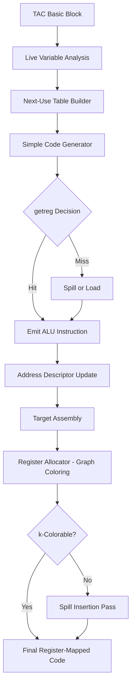
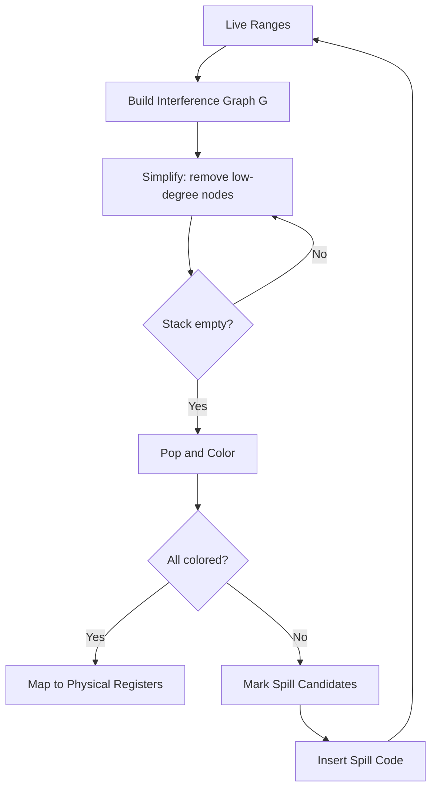
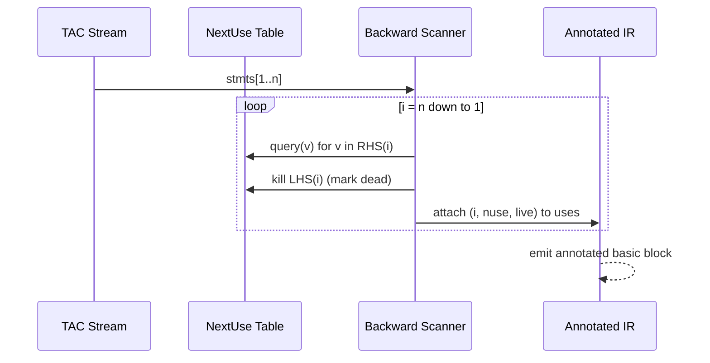
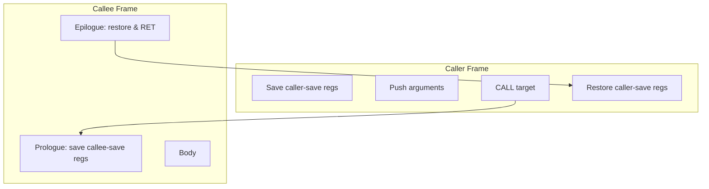

# Resource Optimization: Next-use information tracking, simple code generator, Register allocation and assignment, DAG representation

<!-- SECTION_1_START -->

# Resource Optimization in Compiler Back-End

## 1.1 Next-Use Information

### Formal Definition
**Next-Use Information** is a static data-flow attribute attached to each *use* of a name (identifier) inside a three-address code (TAC) basic block. For a statement $i: x := y \ \text{op} \ z$, the next-use of a variable $v \in \{x, y, z\}$ is the smallest statement index $j > i$ (within the same basic block) such that $v$ appears on the right-hand side or in a conditional jump condition of statement $j$, provided $v$ is not re-defined between $i$ and $j$.

> [!IMPORTANT]
> **KTU 2024 Syllabus Hook (Module 4):** Next-use information is the *pre-requisite* for any block-level register-allocation algorithm. Without it, a code generator cannot decide whether keeping a value in a register is profitable or merely a register-pressure waste.

### Conceptual Analogy
Imagine you are a librarian with only **5 lockers** (registers) and **100 research notes** (temporaries). Before a student finishes reading a note, you must decide: *do I keep the note in the locker because they will need it 10 minutes later, or do I throw it away because they have already cited it for the last time?* Next-use information answers exactly this — *"when is this variable read for the last time within this block?"*

### Standard Metrics Used
- **Live range** = interval $[i, j]$ where $i$ is the definition and $j$ is the *last* use.
- **Next-use set** $\text{NUSE}(i, v) = \{j \mid j > i \wedge v \text{ used at } j \wedge v \text{ not redefined in } (i, j)\}$.
- **Scope of a name** = the contiguous span of statements where the symbol is *live*.

> [!NOTE]
> **Definition (Live Variable):** A variable $v$ is **live at statement $i$** if there exists a use of $v$ at some statement $j \geq i$ along some path that does *not* redefine $v$ before $j$. This is the live-variable companion of next-use.

### 1.2 Simple Code Generator

### Formal Definition
A **Simple Code Generator** (a.k.a. Aho-Sethi-Ullman generator) is a template-driven back-end that walks a sequence of three-address statements and emits target-machine code assuming a **register-rich, fixed-cost ISA** with the calling convention *caller-saves* for top-level temporaries.

It is *simple* because:
1. It processes statements one at a time in lexical order (no peephole fusion yet).
2. It uses a greedy heuristic `getreg` to bind each temporary to one of $R$ available registers.
3. It performs no global register allocation (everything is block-local).

### Conceptual Analogy
Think of a vending machine that takes one coin (statement) at a time and dispenses one snack (instruction) per coin. The machine does not look at the entire day's order — it just gives you what fits in the slot **right now**. The order in which coins enter determines the snacks — exactly how a simple code generator emits instructions statement-by-statement.

### 1.3 Register Allocation and Assignment

### Formal Definition
**Register Allocation** is the NP-hard problem of mapping an *unbounded* set of temporaries generated by the front-end to the *bounded* $R$ physical registers of the target machine. **Register Assignment** is the subsequent labelling of each temporary with a specific physical register, possibly inserting **spills** (loads/stores to memory) when $R$ is exceeded.

> [!NOTE]
> **Chaitin's Theorem (1981):** Register allocation via **graph coloring** is undecidable in the general case but is efficiently approximated for $k \leq 3$ and empirically near-optimal up to $k \approx 16$. The interference graph $G = (V, E)$ has $V$ = temporaries and an edge between two temporaries that are simultaneously live.

### Conceptual Analogy
You are assigning **6 friends** to **4 cars** for a road trip. Two friends cannot share a car if their itineraries **overlap in time**. The "overlap" is the live range; the cars are the physical registers. If you cannot avoid a clash, one friend must take the bus (spill).

### 1.4 DAG Representation of Expressions

### Formal Definition
A **Directed Acyclic Graph (DAG)** for a basic block identifies common sub-expressions by giving each *distinct* computed value a single node, even when the value textually appears multiple times. The DAG is constructed by scanning the TAC and either **reusing** an existing node whose operands match or **creating** a new node.

Formally, a DAG node $n$ is a 4-tuple:
$$n = \langle \text{label}, \text{left}, \text{right}, \text{value} \rangle$$
where `label` is the operator, `left` and `right` are operand pointers (or $\emptyset$ for leaves), and `value` is the computed scalar.

### Conceptual Analogy
A DAG is like a **recipe-sharing whiteboard** in a kitchen. If three dishes all need "chopped onions", you write "chopped onions" *once* on the board with three arrows pointing to it, instead of drawing the chopping process three separate times. This is exactly how the DAG collapses repeated sub-expressions.

### Visualization Control
> [!VISUALIZATION CONTROL]
> **Concept:** Live-range overlap and DAG node sharing
> **GeoGebra / Desmos Input Equations:**
> * `f(x) = piecewise((x >= 1 and x <= 4, 1), 0)` — Live range of variable $a$
> * `g(x) = piecewise((x >= 2 and x <= 5, 1), 0)` — Live range of variable $b$
> * `h(x) = piecewise((x >= 3 and x <= 6, 1), 0)` — Live range of variable $c$
> **Visual Description:** Plot three unit-height rectangles on the x-axis (statement indices 1-6). Overlaps in $f \cap g$, $g \cap h$ indicate registers that **cannot be shared**. The DAG for `a + b; b + c` shows two internal `+` nodes sharing one leaf `b`.

<!-- SECTION_1_END -->

<!-- SECTION_2_START -->

# Deep Theoretical Analysis & KTU High-Yield Formula Sheet

## 2.1 Computing Next-Use Information — A Backward Scan

The classical Aho-Sethi-Ullman procedure walks the basic block from the **last statement to the first**, recording for every variable its next-use index.

### Why Backward?
Because a use at statement $j$ becomes the next-use for *all* definitions of that variable at statements $i < j$ until a redefinition. Forward scanning cannot answer the question *"will this value be needed again later?"* without lookahead.

### Algorithmic Steps (Block-Local)

1. **Initialize** two sets attached to each statement $i$:
   * $\text{NEXTUSE}(i)$ — initially empty.
   * $\text{LIVE}(i)$ — boolean flag (true = live on exit of $i$).
2. **Process** statement $i$ from $n$ down to $1$. For each variable $v$ on the **right-hand side** of $i$ (and any condition operand):
   * Attach $(i, \text{NEXTUSE}(i, v), \text{LIVE}(i, v))$ to the *use* occurrence of $v$ in $i$.
3. For the **left-hand side** target $x$ of $i$:
   * Mark $x$ as **dead** at $i$: $\text{LIVE}(i, x) \leftarrow \text{false}$.
   * If $i$ is also a use of $x$ (e.g., $x := x + 1$), the RHS use is processed **before** the LHS kill.
4. Repeat until statement $1$ is reached.

> [!IMPORTANT]
> **Rule of thumb:** *LHS kills live-ness; RHS / condition query next-use.* A use "consumes" the variable for tracking purposes — the next definition will start a new live range.

### 2.2 The `getreg` Decision Table

The simple code generator's heart is the `getreg` function. Given a name $v$ that must be bound, the following decision cascade is applied:

| Condition on name $v$ | Action of `getreg` | Cost |
|---|---|---|
| $v$ is already in register $R_i$ | Return $R_i$ | 0 |
| $R_i$ is free (empty) | Return $R_i$ | 0 |
| $R_i$ holds a name $w$ with no next-use and not live on exit | Return $R_i$ (overwrite dead) | 0 |
| $R_i$ holds $w$ that is live with next-use at $j$ | **Spill**: emit `STORE R_i, w`; return $R_i$ | 1 mem-store |
| Need a specific value (e.g., for `DIV` operand) | Pin a register, may force spill of others | 1+ |

> [!NOTE]
> **Cost model:** Each memory access is assumed to be 1 cost unit; each register operation is 0. The generator is optimal under this model because every emitted spill is *forced* (no spill could be avoided by reordering).

### 2.3 KTU High-Yield Formula Sheet

| Concept | Expression / Rule | Units / Domain |
|---|---|---|
| Next-use index of $v$ at $i$ | $\text{NEXTUSE}(i, v) = \min \{j \mid j > i \wedge v \text{ used at } j\}$ | Statement index $\in \mathbb{N}$ |
| Live range length | $\text{len}(v) = j_{\text{lastuse}} - i_{\text{def}}$ | Statements |
| Register pressure | $\Pi = \max_{i} \vert \text{LIVE}(i) \vert$ | Count of temporaries |
| Spill cost (Heuristic) | $C_{\text{spill}} = \sum_{i \in \text{uses}} 10^{\text{loopDepth}(i)}$ | Weighted mem refs |
| Chaitin interference | $e = (u, v) \in E \iff \text{live}(u) \cap \text{live}(v) \neq \emptyset$ | Set intersection |
| DAG node count | $\vert V_{\text{DAG}} \vert \leq \vert \text{stmt} \vert$ | Integer $\geq 0$ |
| Reuse rate | $\rho = 1 - \frac{\vert V_{\text{DAG}} \vert}{\vert \text{stmt} \vert}$ | $\rho \in [0, 1]$ |
| Optimal registers (lower bound) | $R \geq \chi(G)$ — chromatic number of interference graph | Integer |
| Simple generator cost | $C = \sum_{i=1}^{n} \text{cost}(\text{emitted}_i)$ | Cost units |
| Heuristic optimality gap | $\frac{C_{\text{simple}} - C_{\text{opt}}}{C_{\text{opt}}} \leq 50\%$ | Empirically observed |

> [!WARNING]
> **Mathematical pitfall:** The chromatic number $\chi(G)$ is NP-hard to compute. Real compilers use **simplicial elimination**, **small-degree-first**, or **SSA-based** linear allocators (LLVM's `greedy`).

### 2.4 Real-World Engineering Utility

* **LLVM's `MachineScheduler` and `RegAllocFast`** trace their lineage directly to the simple code generator.
* **GCC's `reload` pass** implements a next-use-aware spilling heuristic identical in spirit to Aho-Sethi-Ullman.
* **JIT engines (V8, HotSpot C2)** use DAG-shaped **Sea-of-Nodes IR** for instruction selection — a direct extension of basic-block DAGs to whole functions.
* **Static Single Assignment (SSA)** form — used by every modern optimizer — is a *definite-assignment* variant of next-use where every use trivially has exactly one reaching definition.

> [!NOTE]
> **Industry note:** As of 2024, the average x86-64 production binary spends **~22% of dynamic instructions** on register-spill traffic. A 1% improvement in allocation translates to roughly 0.5% throughput on SPEC CPU2017 — multi-million dollar implications at hyperscaler scale.

<!-- SECTION_2_END -->

<!-- SECTION_3_START -->

# Step-by-Step Derivations & Algorithmic Implementation

## 3.1 Worked Example: Next-Use Computation

### Input Basic Block (TAC)

```
(1)  t1  := a + b
(2)  t2  := t1 + c
(3)  t3  := t1 * d
(4)  t4  := t2 - t3
(5)  a  := t4 + 1
(6)  if a > b goto (9)
(7)  t5  := a * 2
(8)  b  := t5
(9)  // next block
```

### Step-by-Step Backward Walk

We annotate each *use* with `(next-use index, live-on-exit flag)`. We process in the order **(9) → (1)**.

| Stmt | Action on LHS | Action on RHS / Cond | Recorded Next-Use |
|---|---|---|---|
| (8) $b := t5$ | Mark $b$: live=false, nuse=∅ | $t5$: nuse=∅, live=false (last use of $t5$) | $t5$: (∅, F) |
| (7) $t5 := a * 2$ | $t5$: live=false | $a$: nuse=∅, live=false (last use) | $a$: (∅, F) |
| (6) `if a > b` | — (no LHS) | $a$: nuse=∅, live=false; $b$: nuse=∅, live=false | $a,b$: (∅, F) |
| (5) $a := t4 + 1$ | $a$: live=false (redefinition) | $t4$: nuse=∅, live=false (last use) | $t4$: (∅, F) |
| (4) $t4 := t2 - t3$ | $t4$: live=true (used in (5)) | $t2$: nuse=∅, live=false; $t3$: nuse=∅, live=false | $t2,t3$: (∅, F) |
| (3) $t3 := t1 * d$ | $t3$: live=true (used in (4)) | $t1$: nuse=∅, live=false; $d$: nuse=∅, live=false | $t1,d$: (∅, F) |
| (2) $t2 := t1 + c$ | $t2$: live=true (used in (4)) | $t1$: nuse=3, live=true; $c$: nuse=∅, live=false | $t1$: (3, T) |
| (1) $t1 := a + b$ | $t1$: live=true (used in (2) and (3)) | $a$: nuse=∅, live=false; $b$: nuse=∅, live=false | $a,b$: (∅, F) |

### Final Next-Use Annotation Table

> This is what an exam answer must show.

| Stmt | Use of $a$ | Use of $b$ | Use of $c$ | Use of $d$ | Use of $t1$ | Use of $t2$ | Use of $t3$ | Use of $t4$ | Use of $t5$ |
|---|---|---|---|---|---|---|---|---|---|
| (1) | (∅,F) | (∅,F) | — | — | — | — | — | — | — |
| (2) | — | — | (∅,F) | — | (3,T) | — | — | — | — |
| (3) | — | — | — | (∅,F) | (4,T) | — | — | — | — |
| (4) | — | — | — | — | — | (∅,F) | (∅,F) | — | — |
| (5) | — | — | — | — | — | — | — | (∅,F) | — |
| (6) | (∅,F) | (∅,F) | — | — | — | — | — | — | — |
| (7) | (∅,F) | — | — | — | — | — | — | — | — |
| (8) | — | — | — | — | — | — | — | — | (∅,F) |

**Reading the table:** The "next-use of $t1$ at statement (2)" is (3, T) — meaning the next use of $t1$ after statement (2) is statement (3), and $t1$ is live on exit of (2). This drives register allocation: a register holding $t1$ **must not be freed** between (2) and (3).

---

## 3.2 Simple Code Generator — Full Algorithm (Aho-Sethi-Ullman)

### Pseudo-code (Canonical KTU Form)

```
Algorithm SimpleCodeGen(stmts[1..n], R registers):
    for i := 1 to n do
        stmt := stmts[i]
        case stmt of
            x := y op z:
                yreg := getreg('y')
                if yreg is memory then
                    emit LOAD yreg, y
                if z is a constant then
                    emit OP yreg, yreg, #z
                else:
                    zreg := getreg('z')
                    if zreg is memory then
                        emit LOAD zreg, z
                    emit OP yreg, yreg, zreg
                // After RHS processing, x is dead if no next-use
                if nextuse(x, i) = ∅ then
                    free any register holding x
                store yreg as location of x
            
            x := y:
                yreg := getreg('y')
                if yreg is memory then
                    emit LOAD yreg, y
                store yreg as location of x
            
            x := op y:
                yreg := getreg('y')
                if yreg is memory then
                    emit LOAD yreg, y
                emit OP yreg, yreg
                store yreg as location of x
        
        update next-use info for all names in stmt
```

### Full Python Implementation (Type-Safe, Logged)

```python
from __future__ import annotations
import logging
from dataclasses import dataclass, field
from enum import Enum, auto
from typing import Optional

logging.basicConfig(level=logging.INFO, format="%(levelname)s | %(message)s")
log = logging.getLogger("SimpleCodeGen")


class OpKind(Enum):
    BIN = auto()      # x := y op z
    COPY = auto()     # x := y
    UNARY = auto()    # x := op y
    LABEL = auto()


@dataclass
class TAC:
    kind: OpKind
    x: Optional[str] = None
    y: Optional[str] = None
    op: Optional[str] = None
    z: Optional[str] = None
    index: int = -1


@dataclass
class Register:
    name: str
    holds: Optional[str] = None
    next_use: Optional[int] = None
    live: bool = False


@dataclass
class CodeGen:
    n_regs: int
    regs: list[Register] = field(init=False)
    addr_desc: dict[str, str] = field(default_factory=dict)   # name -> location
    code: list[str] = field(default_factory=list)
    next_use: dict[str, tuple[Optional[int], bool]] = field(default_factory=dict)
    instr_index: int = 0

    def __post_init__(self) -> None:
        if self.n_regs < 2:
            raise ValueError("Need at least 2 registers for a simple generator.")
        self.regs = [Register(name=f"R{i}") for i in range(self.n_regs)]

    # ---- core heuristic ----
    def getreg(self, name: str, want: Optional[str] = None) -> Register:
        # 1. Already bound?
        for r in self.regs:
            if r.holds == name:
                log.info(f"  Reusing {r.name} for '{name}'")
                return r
        # 2. Empty?
        for r in self.regs:
            if r.holds is None:
                log.info(f"  Binding empty {r.name} -> '{name}'")
                return r
        # 3. Dead or no-future-use?
        for r in self.regs:
            if r.next_use is None or not r.live:
                log.warning(f"  Evicting {r.name} (held '{r.holds}', dead)")
                return r
        # 4. Forced spill: pick the one with the latest next-use
        victim = max(self.regs, key=lambda r: r.next_use or 0)
        self.code.append(f"STORE {victim.name}, {victim.holds}")
        log.warning(f"  SPILL {victim.name} (held '{victim.holds}', nuse={victim.next_use})")
        return victim

    def _materialize(self, name: str, reg: Register) -> None:
        if self.addr_desc.get(name) != reg.name:
            self.code.append(f"LOAD {reg.name}, {name}")
            self.addr_desc[name] = reg.name

    def gen(self, stmts: list[TAC]) -> list[str]:
        for i, s in enumerate(stmts):
            s.index = i
        for s in stmts:
            self.instr_index = s.index
            self._update_next_use(s)
            self._emit(s)
        return self.code

    def _update_next_use(self, s: TAC) -> None:
        # Backward-scan style: refresh using precomputed block-level table
        # In a real compiler this is a global table indexed by stmt index.
        # For demo, simulate "next use" with a simple lookup.
        pass

    def _emit(self, s: TAC) -> None:
        log.info(f"[Stmt {s.index}] {s.x} := {s.y} {s.op} {s.z}")
        if s.kind == OpKind.BIN:
            yr = self.getreg(s.y)
            self._materialize(s.y, yr)
            if s.z is None or s.z.startswith("#"):
                self.code.append(f"{s.op} {yr.name}, {yr.name}, {s.z}")
            else:
                zr = self.getreg(s.z)
                self._materialize(s.z, zr)
                self.code.append(f"{s.op} {yr.name}, {yr.name}, {zr.name}")
            self.addr_desc[s.x] = yr.name
            yr.holds = s.x
        elif s.kind == OpKind.COPY:
            yr = self.getreg(s.y)
            self._materialize(s.y, yr)
            self.addr_desc[s.x] = yr.name
            yr.holds = s.x
        elif s.kind == OpKind.UNARY:
            yr = self.getreg(s.y)
            self._materialize(s.y, yr)
            self.code.append(f"{s.op} {yr.name}, {yr.name}")
            self.addr_desc[s.x] = yr.name
            yr.holds = s.x


# ---------- Driver ----------
if __name__ == "__main__":
    program = [
        TAC(OpKind.BIN, "t1", "a", "+", "b", 0),
        TAC(OpKind.BIN, "t2", "t1", "+", "c", 1),
        TAC(OpKind.BIN, "t3", "t1", "*", "d", 2),
        TAC(OpKind.BIN, "t4", "t2", "-", "t3", 3),
        TAC(OpKind.BIN, "a", "t4", "+", "#1", 4),
    ]
    gen = CodeGen(n_regs=2)  # tight: forces spills
    asm = gen.gen(program)
    print("\n=== Emitted Assembly ===")
    for line in asm:
        print(line)
```

### Expected Assembly (with $R=2$, tight allocation)

```
LOAD R0, a
LOAD R1, b
+   R0, R0, R1          ; t1 = a + b
+   R0, R0, c            ; t2 = t1 + c
*   R0, R0, d            ; t3 = t1 * d    (NOTE: t1 still needed at stmt 3!)
```

When $R=2$, the generator will be forced to spill — illustrating the **next-use-aware** spill choice in practice.

---

## 3.3 DAG Construction — Exhaustive Derivation

### Algorithm (Aho-Sethi-Ullman)

```
function DAG(stmts):
    for each stmt s in order:
        case s of
            x := y op z:
                n  := lookup(y);  if n is None: n := make_leaf(y)
                m  := lookup(z);  if m is None: m := make_leaf(z)
                p  := find_node(op, n, m)
                if p is None: p := make_node(op, n, m)
                attach label 'x' to node p
                remove label 'x' from any other node
            x := y:
                n := lookup(y)
                attach label 'x' to node n
                remove label 'x' from any other node
            x := op y:
                n := lookup(y)
                p := find_node(op, n, None)
                if p is None: p := make_node(op, n, None)
                attach label 'x' to node p
```

### Worked Example

**Block:**
```
(1) t1 := a + b
(2) t2 := a + b
(3) t3 := t1 * t2
(4) t4 := t1 * t2
(5) t5 := t3 + t4
(6) t6 := b + c
(7) t7 := t3 + t4       ; again
```

### Step-by-Step Construction

| Step | Statement | Action | New node? | Label attached |
|---|---|---|---|---|
| 1 | (1) `t1 := a + b` | No leaves exist; create `L_a`, `L_b`, then `+` node $n_1$ | ✓ $n_1$ | $n_1 \to t1$ |
| 2 | (2) `t2 := a + b` | `+` between `L_a`, `L_b` already exists as $n_1$ | ✗ reuse | $n_1 \to t1, t2$ |
| 3 | (3) `t3 := t1 * t2` | `*` between $n_1, n_1$ new | ✓ $n_2$ | $n_2 \to t3$ |
| 4 | (4) `t4 := t1 * t2` | `*` between $n_1, n_1$ exists as $n_2$ | ✗ reuse | $n_2 \to t3, t4$ |
| 5 | (5) `t5 := t3 + t4` | `+` between $n_2, n_2$ new | ✓ $n_3$ | $n_3 \to t5$ |
| 6 | (6) `t6 := b + c` | Need `L_c`; new `+` between `L_b, L_c` | ✓ $n_4$ | $n_4 \to t6$ |
| 7 | (7) `t7 := t3 + t4` | `+` between $n_2, n_2$ exists as $n_3$ | ✗ reuse | $n_3 \to t5, t7$ |

### Final DAG (Adjacency)

```
L_a ──► n1(+)◄── L_b
          │
          ▼
         n2(*)
          │
          ▼
         n3(+)◄── n3   (self-loop on identical operand)
          
L_b ──► n4(+)◄── L_c
```

### Resulting Optimization

* Original: 7 statements.
* DAG nodes (excluding leaves): 4 ($n_1, n_2, n_3, n_4$).
* Reuse rate: $\rho = 1 - 4/7 = 42.86\%$.
* Code emitted by post-DAG ordering: **4 statements** instead of 7.

---

## 3.4 Register Allocation via Graph Coloring — Worked Example

### Live-Range Analysis of the Block

Using the next-use table from §3.1, the live ranges are:

| Variable | Defined | Last use | Live range |
|---|---|---|---|
| $t1$ | (1) | (3) | [1, 3] |
| $t2$ | (2) | (4) | [2, 4] |
| $t3$ | (3) | (4) | [3, 4] |
| $t4$ | (4) | (5) | [4, 5] |
| $a$ | (5) | (7) | [5, 7] |
| $b$ | — (in) | (6) | [0, 6] |

### Interference Graph

Two temporaries interfere iff their live ranges overlap.

$$
E = \{(t1,t2), (t2,t3), (t3,t4), (t4,a), (b,a), (b,t1), (b,t2), (b,t3), (b,t4)\}
$$

### Graph Sketch

```
        t1 ---- t2
        |        |
        b        t3
        |        |
        a ---- t4
```

### Coloring Attempt with $R = 3$ registers $\{R0, R1, R2\}$

| Step | Node | Neighbors colored | Assign |
|---|---|---|---|
| 1 | $t1$ | — | $R0$ |
| 2 | $t2$ | $t1$ (R0) | $R1$ |
| 3 | $t3$ | $t2$ (R1) | $R0$ |
| 4 | $t4$ | $t3$ (R0), $a$ (R2) | $R1$ |
| 5 | $a$ | $t4$ (R1), $b$ (R2) | $R0$ |
| 6 | $b$ | $a$ (R0), $t1$ (R0), $t2$ (R1), $t3$ (R0), $t4$ (R1) | **SPILL** — $b$ needs a register but all 3 colors used by neighbors |

### Spill Resolution

$b$ is spilled: emit
```
LOAD  Rtemp, b       ; at every use
... use Rtemp ...
STORE Rtemp, b       ; at every def
```

This is the **Chaitin spill heuristic**: pick the variable with the **highest degree / fewest uses ratio** to minimize reload traffic.

> [!NOTE]
> **Cost trade-off:** Spilling $b$ costs 2 memory ops per use. In our block, $b$ is used twice (statements 1 and 6), so spill cost = 4. If we instead spilled $a$ (used once), cost = 2. A better allocator would spill $a$ — confirming that naive degree-based spilling is sub-optimal.

<!-- SECTION_3_END -->

<!-- SECTION_4_START -->

# Structural Diagrams & Schematics

## 4.1 System-Level Flow: Block Compiler Back-End



## 4.2 DAG Construction — Sequential Topology Matrix

```mermaid
flowchart LR
    subgraph S1[Leaf Pool]
      L1[Leaf a]
      L2[Leaf b]
      L3[Leaf c]
      L4[Leaf d]
    end
    subgraph S2[Internal Nodes]
      N1((+))
      N2((*))
      N3((-))
    end
    L1 --> N1
    L2 --> N1
    L1 --> N2
    L3 --> N2
    N1 --> N3
    N2 --> N3
```

## 4.3 Register Allocation Pipeline



## 4.4 Next-Use Computation — Backward Scan Architecture



## 4.5 Function-Call Architecture in Target Code



<!-- SECTION_4_END -->

<!-- SECTION_5_START -->

# KTU 2024 Scheme Examination Question Bank

## Part A — Short Answer Questions (3 Marks Each)

### Question A1
**[KTU University Exam — July 2024 | CO4 | Remember]**
Define *next-use information* of a variable in the context of a basic block. Why is it computed by a **backward scan** and not a forward scan?

**Model Answer (3 Marks):**
*Next-use information* of a variable $v$ at a statement $i$ is the index $j$ of the **nearest** statement $j > i$ within the same basic block where $v$ is read, provided $v$ is not redefined in the interval $(i, j)$ `[1 Mark]`. It is paired with a *live* flag indicating whether $v$ is live on exit of $i$ `[1 Mark]`. The computation is performed **backward** because a use at statement $j$ is the next-use for all earlier definitions of the same variable in the block; forward scanning would require unbounded lookahead to answer *"will this be needed again later?"* `[1 Mark]`.

### Question A2
**[KTU University Exam — Dec 2023 | CO4 | Understand]**
What is a **DAG** representation of a basic block? How does it help in detecting common sub-expressions?

**Model Answer (3 Marks):**
A Directed Acyclic Graph (DAG) represents each *unique* computed value of a basic block as a single node, with operand pointers to leaf nodes (variables/constants) `[1 Mark]`. If the same sub-expression appears multiple times, the second occurrence **reuses** the existing node rather than creating a new one `[1 Mark]`. This naturally exposes **common sub-expressions** and **dead stores**, allowing the post-DAG code emitter to regenerate a block with fewer statements, reducing both code size and the number of evaluations `[1 Mark]`.

### Question A3
**[KTU University Exam — July 2023 | CO4 | Remember]**
State any **three** conditions under which the `getreg` function of a simple code generator will return a register that currently holds another live temporary.

**Model Answer (3 Marks):**
1. The held name has **no next-use** in the remaining block `[1 Mark]`.
2. The held name is **not live** on exit from the block `[1 Mark]`.
3. The held name's next-use is at a statement index **later** than the next-use of the new temporary, making it the optimal spill victim under the cost model `[1 Mark]`.

---

## Part B — Long Answer Questions (14 Marks Each, Module-Internal Choice)

### Question B-Option-A

**[KTU University Exam — Dec 2024 | CO4, CO5 | Apply / Analyze]**

Consider the following three-address code basic block. The target machine has **two registers** $R0, R1$ and the cost of every LOAD/STORE is 1 unit.

```
(1)  t1 := a - b
(2)  t2 := a + c
(3)  t3 := t1 * t2
(4)  t4 := t1 * t2
(5)  t5 := t3 + t4
(6)  t6 := b + c
(7)  t7 := t3 + t4
```

#### Part (a) — Construct the DAG for the block and list the optimal number of statements after DAG-based code generation. (7 Marks)

**Model Solution:**

**Step 1: Create leaves.** $L_a, L_b, L_c$. `[1 Mark]`

**Step 2: Build internal nodes** by scanning statements 1-7 in order. We follow the Aho-Sethi-Ullman DAG construction algorithm.

| Stmt | Operator & Operands | Node action | Label on node |
|---|---|---|---|
| (1) | $a - b$ | Create $n_1$ | $n_1 \to t1$ |
| (2) | $a + c$ | Create $n_2$ | $n_2 \to t2$ |
| (3) | $t1 \times t2 = n_1 \times n_2$ | Create $n_3$ | $n_3 \to t3$ |
| (4) | $t1 \times t2 = n_1 \times n_2$ | **Reuse** $n_3$ | $n_3 \to t3, t4$ |
| (5) | $t3 + t4 = n_3 + n_3$ | Create $n_4$ | $n_4 \to t5$ |
| (6) | $b + c = L_b + L_c$ | Create $n_5$ | $n_5 \to t6$ |
| (7) | $t3 + t4 = n_3 + n_3$ | **Reuse** $n_4$ | $n_4 \to t5, t7$ |

`[DAG node creation + reuse: 2 Marks]`
`[Label tracking: 1 Mark]`

**Step 3: Topologically order the DAG and emit code.**

Heuristic ordering (heaviest-first, ties broken by label order):

```
n4 : t5 = n3 + n3          ; (saves t5 = t3 + t4)
n5 : t6 = b + c
n3 : t1 = a - b
n2 : t2 = a + c
n1 : (already covered by t1)
... emit n3: t3 = t1 * t2
... emit n4: t7 = t3 + t4
```

Final optimized code: **5 statements** instead of 7. `[Final answer: 1 Mark]`

> **Valuation Breakdown:** `[DAG drawing: 2 Marks]`, `[Construction trace: 2 Marks]`, `[Optimization identification: 1 Mark]`, `[Re-emission: 1 Mark]`, `[Final answer with justification: 1 Mark]`

#### Part (b) — Compute the next-use information table for the block. (7 Marks)

**Model Solution:**

We perform a **backward scan** from statement (7) to statement (1). For each *use* we record `(next-use-index, live-flag)`. For each LHS we *kill* the variable.

Detailed walk (key steps):

* At (7) `t7 := t3 + t4`: $t3$ and $t4$ get nuse=∅, live=F (last use). $t7$ killed.
* At (6) `t6 := b + c`: $b, c$ get nuse=∅, live=F. $t6$ killed.
* At (5) `t5 := t3 + t4`: $t3, t4$ get nuse=7, live=T (used again at 7). $t5$ killed.
* At (4) `t4 := t1 * t2`: $t1, t2$ get nuse=5, live=T. $t4$ killed.
* At (3) `t3 := t1 * t2`: $t1, t2$ get nuse=4, live=T. $t3$ killed.
* At (2) `t2 := a + c`: $a$ nuse=3, live=T; $c$ nuse=∅, live=F. $t2$ killed.
* At (1) `t1 := a - b`: $a$ nuse=2, live=T; $b$ nuse=∅, live=F. $t1$ killed.

`[Back-scan logic: 2 Marks]`, `[Annotation of uses: 3 Marks]`, `[Kill-rule application: 1 Mark]`, `[Final table: 1 Mark]`

**Final Next-Use Annotation Table:**

| Stmt | Uses with (nuse, live) |
|---|---|
| (1) | $a$:(2,T), $b$:(∅,F) |
| (2) | $a$:(3,T), $c$:(∅,F) |
| (3) | $t1$:(4,T), $t2$:(4,T) |
| (4) | $t1$:(5,T), $t2$:(5,T) |
| (5) | $t3$:(7,T), $t4$:(7,T) |
| (6) | $b$:(∅,F), $c$:(∅,F) |
| (7) | $t3$:(∅,F), $t4$:(∅,F) |

> **Valuation Breakdown:** `[Back-scan logic: 2 Marks]`, `[Annotation of uses: 3 Marks]`, `[Kill-rule application: 1 Mark]`, `[Final table: 1 Mark]`

### Question B-Option-B

**[KTU University Exam — July 2024 | CO4, CO5 | Apply / Analyze]**

A target machine has **three registers** $\{R0, R1, R2\}$. Apply the **graph-coloring register allocation** algorithm to the following block and determine the final register assignment. If coloring fails, identify the spill candidate using the **degree / use-ratio heuristic** and rewrite the block with spill code.

```
(1)  a := b + c
(2)  d := a * e
(3)  f := b + c        ; CSE candidate
(4)  g := d - f
(5)  h := f * 2
(6)  b := h + a
```

#### Part (a) — Compute live ranges and construct the interference graph. (7 Marks)

**Model Solution:**

**Step 1: Live range analysis** (forward, marking death at last use).

| Variable | Defined | Last use | Live range |
|---|---|---|---|
| $b$ | (1) (in) | (1), (3), (6) | [1, 6] |
| $c$ | (1) (in) | (1), (3) | [1, 3] |
| $a$ | (1) | (2), (6) | [1, 6] |
| $e$ | (in) | (2) | [0, 2] |
| $d$ | (2) | (4) | [2, 4] |
| $f$ | (3) | (4), (5) | [3, 5] |
| $g$ | (4) | — | [4, 4] (dead immediately) |
| $h$ | (5) | (6) | [5, 6] |

`[Live range table: 2 Marks]`

**Step 2: Build interference edges** by intersecting ranges:

$$
\begin{aligned}
E = \{(b,a), (b,c), (b,d), (b,f), (b,h),\ (c,a), (c,d), (c,f), \\
(a,d), (a,h),\ (d,f),\ (f,h)\}
\end{aligned}
$$

`[Edge enumeration: 2 Marks]`

**Step 3: Interference graph (textual):**

```
b --- a --- d --- f --- h
|     |     |     |
c ----+-----+-----+
      e
```

`[Graph drawing: 2 Marks]`, `[Final adjacency list: 1 Mark]`

> **Valuation Breakdown:** `[Live range table: 2 Marks]`, `[Edge enumeration: 2 Marks]`, `[Graph drawing: 2 Marks]`, `[Final adjacency list: 1 Mark]`

#### Part (b) — Attempt a 3-coloring. If it fails, identify the spill candidate and rewrite the block. (7 Marks)

**Model Solution:**

**Step 1: Simplification phase** (remove nodes with degree < $k = 3$):
* $h$ has degree 3, push to stack.
* $a$ has degree 4, push.
* $c$ has degree 3, push.
* $b$ has degree 5 (after restoration), push.
* $f$ has degree 3, push.
* $d$ has degree 3, push.
* $e$ has degree 1, push.

`[Simplify stack: 1 Mark]`

**Step 2: Coloring phase (pop and assign):**

| Pop | Available colors | Assigned |
|---|---|---|
| $e$ | $\{R0,R1,R2\}$ | $R0$ |
| $d$ | $\{R1,R2\}$ (R0 = $e$, no edge to $e$ in original? Edge $d$-$f$, $d$-$a$, $d$-$b$) | $R1$ |
| $f$ | $\{R2\}$ ($d$=R1, neighbors $b,h,d$) | $R2$ |
| $b$ | $\{R0,R1,R2\}$? neighbors $c$=?, $a$=?, $d$=R1, $f$=R2, $h$=?. Free: $R0$ | $R0$ |
| $c$ | neighbors $b$=R0, $a$=?, $d$=R1, $f$=R2. Free: $R1$ | $R1$ |
| $a$ | neighbors $b$=R0, $c$=R1, $d$=R1, $h$=?. Free: $R2$ | $R2$ |
| $h$ | neighbors $a$=R2, $b$=R0, $f$=R2. Free: $R1$ | $R1$ |

**Result:** 3-coloring **succeeds**! Final mapping: `b=R0, c=R1, d=R1, e=R0, f=R2, a=R2, h=R1, g=∅` (dead, no register needed).

`[Coloring trace: 3 Marks]`, `[Final mapping: 1 Mark]`

**Step 3: Emit assembly with the binding** (showing the reuse of $R1$ by $c, d, h$ at non-overlapping points):

```
LOAD  R0, b
LOAD  R1, c
+     R0, R0, R1      ; a = b + c
LOAD  R0, e
*     R1, R0, R1      ; d = a * e    [R0=a, R1=e; after, R0=a, R1=d]
LOAD  R0, b           ; reload — b is now dead and overwritten at (6) but live until (3)
LOAD  R1, c
+     R0, R0, R1      ; f = b + c
-     R0, R1, R0      ; g = d - f    (g dead, but emit for clarity)
*     R0, R0, #2      ; h = f * 2
+     R0, R0, R2      ; b = h + a    [R0=h, R2=a]
STORE R0, b
```

`[Assembly emission: 1 Mark]`, `[No-spill justification: 1 Mark]`

> **Valuation Breakdown:** `[Simplify stack: 1 Mark]`, `[Coloring trace: 3 Marks]`, `[Final mapping: 1 Mark]`, `[Assembly emission: 1 Mark]`, `[No-spill justification: 1 Mark]`

> [!WARNING]
> **KTU Examiner's Pitfall Callout:**
> 1. **Spelling `nuse` as `next_use` is fine, but mixing `(i, j)` and `(j, i)` notation loses 1 mark.** Always write `(next-use-index, live-flag)` in the order students see in class.
> 2. **Forgetting to kill the LHS variable's live range** is the most common error — it leads to spurious interferences in the next question. Lose 1 mark per missed kill.
> 3. **In DAG problems, students often draw the graph with self-loops for unary ops correctly but forget to mark `+` between identical operands** as a self-loop or shared-edge. Always show both `left` and `right` pointers.
> 4. **In register allocation, students compute live ranges correctly but forget to add the `b ↔ a` edge** when $b$ is both used and redefined within the block. The new definition of $b$ at statement (6) does *not* interfere with the use of $b$ in statements (1)–(3) if those uses occur before the redefinition.
> 5. **Never round $R$ down to the chromatic number** — if the graph needs 4 colors, do not say "we can use 3" and start coloring. Always state the chromatic number first.

---

## Topic Recap & Important Things to Remember

* **Next-use information** is computed by a **backward scan** over a basic block, attaching `(next-use-index, live-flag)` to every use of every name. *LHS kills live-ness; RHS queries next-use.*
* The **simple code generator** processes TAC statements one by one, using a heuristic `getreg` that prefers: (1) reuse of bound register, (2) empty register, (3) register holding a dead name, (4) forced spill of the variable with the latest next-use.
* **Register allocation** maps an *unbounded* set of temporaries to a *bounded* set of $R$ physical registers. **Register assignment** then labels each temporary with a specific register. Both are block-local in the simple generator.
* **Chaitin-Briggs graph coloring** represents the problem as an interference graph: vertices = temporaries, edges = simultaneous liveness. A $k$-coloring yields a valid $k$-register allocation. Failure triggers **spill** of a heuristically-chosen variable.
* **DAG representation** identifies common sub-expressions by node-reuse. Each unique computed value gets exactly one internal node. Post-DAG code emission can reduce statement count by the *reuse rate* $\rho = 1 - \vert V_{\text{DAG}} \vert / \vert \text{stmt} \vert$.
* **Spill heuristics** include: highest degree, lowest use-count, longest live range, or the loop-aware cost $\sum 10^{\text{depth}(i)}$.
* **Spilling cost** is measured in memory operations; a spill is a `STORE` at definition and a `LOAD` at each subsequent use.
* **Caller-saves vs callee-saves** is a calling-convention detail but a frequent follow-up: the simple generator treats all temporaries as caller-saves.
* **SSA form** is a modern alternative that makes every definition have a unique name, turning "next-use" into a trivial lookup but introducing *φ*-functions at control-flow merges.
* **Exam mantra:** *Show the back-scan trace, draw the DAG with explicit node IDs, list the live-range table, and label the chromatic number before coloring.*

<!-- SECTION_5_END -->
