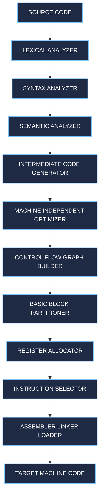
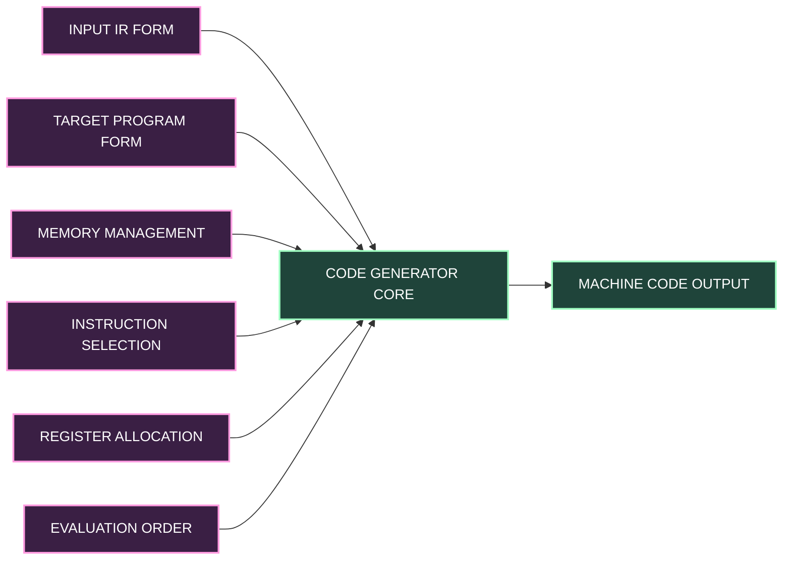
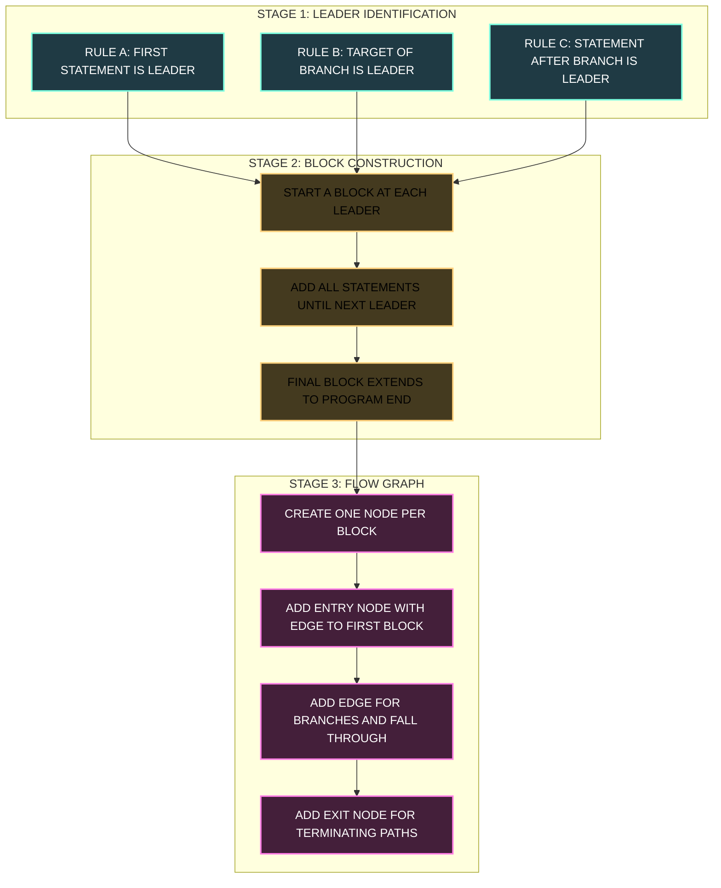
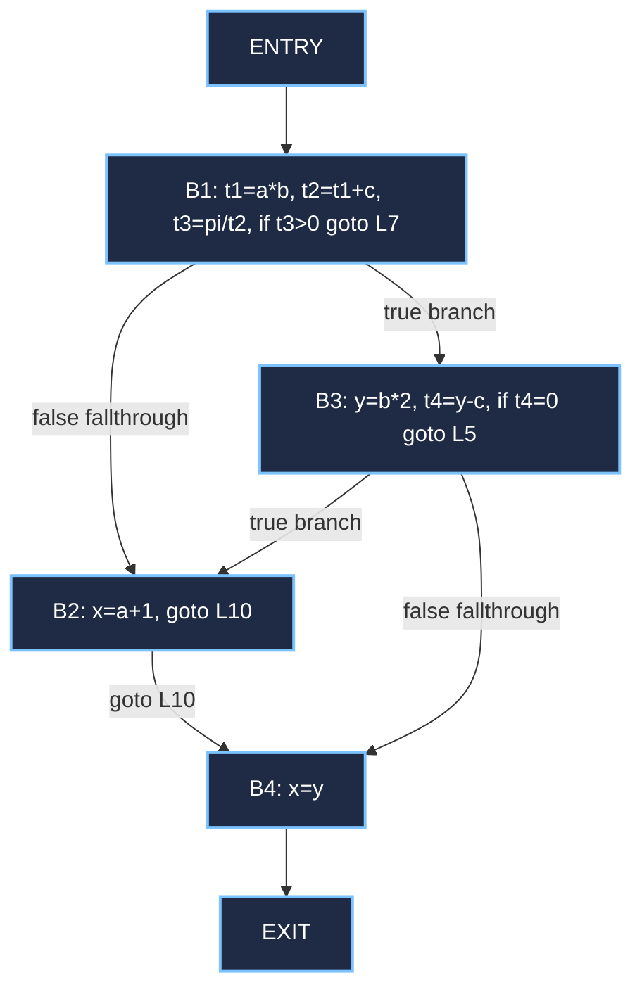
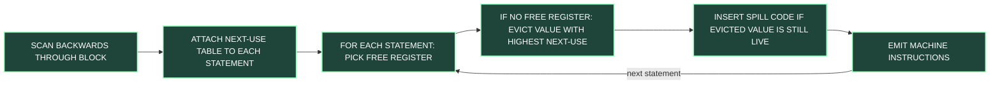

# Target Code Generation: Issues in design, target machine description, Basic blocks and Flow graphs

<!-- SECTION_1_START -->
# Target Code Generation: Issues, Machine Description, Basic Blocks & Flow Graphs

## 1. Core Technical Definition & Intuitive Overview

### 1.1 What is Target Code Generation?

**Target Code Generation** is the final phase of a compiler that translates the optimized intermediate representation (IR) of the source program into executable machine code (or assembly code) for a specific target machine.

> [!IMPORTANT]
> **KTU Syllabus Definition (PCCST601 — Module 4):**
> *"Code generation is the final phase of compiler. It maps intermediate representation to the target machine language. The target machine may be a virtual machine or a real machine. Issues in the design of code generator include intermediate representation, instruction selection, register allocation and assignment, and evaluation order."*

**Formally**, a *code generator* is a software module $G: IR \rightarrow M$ such that for every valid intermediate code instruction $I \in IR$, the generator emits an equivalent sequence of machine instructions $\{m_1, m_2, \ldots, m_k\} \in M$ where $M$ is the set of all valid target machine instructions.

### 1.2 Conceptual Analogy — The Translator at an International Airport

Imagine you are at the immigration counter of an international airport. Your **passport** (the optimized intermediate code) is a globally standardized document. The **immigration officer** (the code generator) looks at your passport and stamps your **arrival card** (the target machine code) using the **local language and customs** of the destination country (the target machine architecture).

Just like the officer must:
- **Read** the standardized passport fields (input IR),
- **Choose** the correct local stamp wording (instruction selection),
- **Assign** you to the correct counter and queue (register allocation),
- **Order** your steps: visa check → fingerprint → photo → entry stamp (evaluation order),
- **Decide** whether to keep your passport in the drawer or hand it back (memory management)...

...the code generator transforms abstract, architecture-independent IR into architecture-specific machine instructions, while wrestling with five classic design issues.

### 1.3 The Five Core Issues in the Design of a Code Generator

| # | Design Issue | Core Question Answered |
|---|--------------|------------------------|
| 1 | **Input to the Code Generator** | What IR form (three-address code, RTL, SSA) does the generator consume? |
| 2 | **Target Program Form** | Should the output be absolute machine code, relocatable object code, or assembly? |
| 3 | **Memory Management** | How are names (variables, temporaries) mapped to runtime memory addresses? |
| 4 | **Instruction Selection** | Which target machine instruction sequence best implements each IR operation? |
| 5 | **Register Allocation & Assignment** | Which values should reside in CPU registers, and which register holds which value? |
| 6 | **Evaluation Order** | In what sequence are operations executed to minimize register pressure & maximize efficiency? |

> [!NOTE]
> **KTU High-Yield Point:** Out of these six issues, the *three* that the KTU 2024 board repeatedly tests are: **Instruction Selection, Register Allocation, and Evaluation Order.** Memorize this trio.

### 1.4 What is a Target Machine Description?

A **Target Machine Description** is a formal, structured specification of the destination CPU's instruction set architecture (ISA) — its registers, addressing modes, instruction formats, and the cost (in cycles or memory bytes) of each instruction.

The canonical KTU simple target machine has:
- **Registers:** $\text{R0}, \text{R1}, \text{R2}, \ldots, \text{Rn-1}$ (usually a small fixed set)
- **Instruction Formats:** $\text{OP } d, s$ (operation, destination, source)
- **Addressing Modes:** Direct, Indirect, Indexed, Immediate
- **A simple, well-defined cost model** used by the code generator's selector

> [!VISUALIZATION CONTROL]
> **Concept:** Linear IR to Three-Address Code Translation Pipeline
> **Desmos Input Equations (illustrative cost function):**
> * $C(t) = \sum_{i=1}^{n} w_i \cdot m_i$ where $m_i$ = number of times instruction $i$ is used, $w_i$ = cost weight
> **Visual Description:** A piecewise linear function whose jumps correspond to register pressure spikes; each slope segment represents a phase of code emission. Students should see that the cost function rises sharply whenever spill code is inserted.

### 1.5 Basic Blocks — The "Stitch-Free" Segments

A **Basic Block** is a maximal sequence of consecutive three-address code (or IR) statements in which **flow of control enters at the first instruction and leaves at the last instruction** without any halt or branch in between, except possibly at the end.

> [!IMPORTANT]
> **Formal Definition (Aho, Sethi, Ullman — Dragon Book, the KTU reference text):**
> *A basic block is a sequence of consecutive statements in which flow of control enters at the beginning and leaves at the end without halting or branching except possibly at the end.*

### 1.6 Flow Graphs — The Map of the Program

A **Flow Graph** is a directed graph $G_f = (N, E)$ where:
- Each **node** $n \in N$ represents a unique basic block.
- Each **directed edge** $e = (n_i \rightarrow n_j) \in E$ represents a possible transfer of control from block $n_i$ to block $n_j$.

> [!NOTE]
> **Intuition:** A flow graph is the "**subway map**" of your program. Each station is a basic block; each track is a possible control transfer. The first block (entry point) is the **central station**, and every reachable block is a connected stop.

---

<!-- SECTION_1_END -->

<!-- SECTION_2_START -->
# Deep Theoretical Analysis & KTU High-Yield Formula Sheet

## 2.1 Detailed Anatomy of the Six Design Issues

### 2.1.1 Input to the Code Generator

The code generator consumes:
- **Three-Address Code (TAC):** Statements of the form $x = y \ \text{op} \ z$ where at most one operator appears on the RHS.
- **Symbol Table:** Maps source names to runtime addresses (and types).
- **Intermediate Representation Tags:** Type, scope, and liveness information.

### 2.1.2 Target Program Form — Three Choices

| Form | Description | Pros | Cons |
|------|-------------|------|------|
| **Absolute Machine Code** | Fixed memory addresses; ready to execute | Fast loading | Not relocatable |
| **Relocatable Object Code** | Allows sub-program linking; addresses start at 0 | Linkable with other modules | Needs a linker/loader |
| **Assembly Code** | Human-readable mnemonic form | Easy to debug, portable across assembler versions | Needs an extra assembly pass |

> [!TIP]
> **KTU 2024 trend:** Most board questions ask *"Why is assembly code often preferred as the output of a code generator?"* — Answer: it is easier to produce, allows subprogram linkage via relocatable code, and the final memory addresses are filled in by the assembler, freeing the code generator from absolute address management.

### 2.1.3 Memory Management

The code generator must map names in the symbol table to memory addresses in the target's data segment. The standard mapping function is:

$$
\text{address}(x) = \text{base}_{\text{data}} + \text{offset}(x)
$$

where $\text{base}_{\text{data}}$ is the starting address of the static data area, and $\text{offset}(x)$ is the byte offset computed at compile time.

### 2.1.4 Instruction Selection

The code generator must choose, for every IR statement, an optimal sequence of target machine instructions that computes the same result.

**Naive translation** of $a = b + c$ (assuming $b$ is in $\text{R1}$ and $c$ is in memory):
```
MOV  R2, c        ; cost 1
ADD  R2, R1       ; cost 1
MOV  a, R2        ; cost 1
```

**Optimal translation** if addressing mode allows:
```
ADD  R2, R1       ; cost 1
```

A *macro expansion* table or a *tree-pattern matching* algorithm (e.g., Aho-Johnson code generation) drives this selection.

### 2.1.5 Register Allocation & Assignment

Two sub-problems:
1. **Register Allocation:** Decide *which* values get placed in registers (i.e., the set $V \subseteq \text{Vars}$ that fits in $k$ registers).
2. **Register Assignment:** Decide *which specific register* $\text{R}_i$ holds which value.

The optimal register assignment problem is **NP-complete** in general, so compilers use heuristics:
- **Graph coloring register allocation** (Chaitin's algorithm, $k = 16$ for modern CPUs)
- **Linear scan** register allocation
- **Next-Use** heuristic (KTU-favored)

The **Next-Use Information** for a value $v$ at statement $i$ is the highest statement number $j > i$ where $v$ is used, or $\infty$ if $v$ is never used again.

### 2.1.6 Evaluation Order

The order in which computations are scheduled affects:
- Register pressure
- Length of generated code
- Number of spills

Example: $t_1 = a + b; \ t_2 = c + d; \ t_3 = t_1 \cdot t_2$ — reordering the additions changes how many temporaries are live simultaneously.

## 2.2 The Canonical KTU Simple Target Machine

A typical machine description used in KTU problems:

| Component | Description |
|-----------|-------------|
| **Registers** | $n$ general-purpose registers: $\text{R0}, \text{R1}, \ldots, \text{R}_{n-1}$ |
| **Word Size** | 4 bytes (32-bit) |
| **Instructions** | $\text{OP} \ d, s_1, s_2$ — op has destination $d$ and sources $s_1, s_2$ |
| **Addressing Modes** | Direct register, Memory direct, Indexed, Immediate |
| **Cost** | Each instruction = 1 unit (simplified model) |

> [!NOTE]
> **KTU Constant to Memorize:** *Cost of an instruction = 1* is the standard assumption in simple-target-machine problems. In real CPUs, costs differ (e.g., $\text{MUL} = 3$, $\text{DIV} = 20$).

## 2.3 The Algorithm to Find Leaders (Foundational for Basic Blocks)

A **Leader** is the first statement of a basic block. The Dragon Book algorithm:

1. The **first** statement of the IR is a leader.
2. Any statement that is the **target of a conditional or unconditional branch** is a leader.
3. Any statement that **immediately follows** a conditional or unconditional branch is a leader.

> [!IMPORTANT]
> **Note:** A statement can be a leader for **more than one** reason (e.g., a branch target that also follows another branch).

## 2.4 KTU Formula & Concept Cheat Sheet

| Symbol / Concept | Meaning | Used In |
|------------------|---------|---------|
| $B_i$ | $i$-th basic block | Flow graph nodes |
| $\text{pred}(B)$ | Set of predecessors of block $B$ | Successor analysis |
| $\text{succ}(B)$ | Set of successors of block $B$ | Control flow analysis |
| $\text{NextUse}(v, i)$ | Next statement number using $v$ after $i$ | Register allocation |
| $\text{Live}(v, i)$ | True if $v$ is live at statement $i$ | DFA-based optimization |
| $G_f = (N, E)$ | Flow graph with node set $N$, edge set $E$ | Whole program analysis |
| $\text{Entry}$ | The unique start node (first block) | Flow graph root |
| $\text{Exit}$ | The unique synthetic exit node | Post-dominator analysis |
| Cost = 1 | Default per-instruction cost in KTU problems | Instruction selection |
| $\text{Spill}$ | Moving a register value to memory | Register allocation |

## 2.5 Real-World Engineering Utility

- **Production compilers** like GCC, LLVM, and JVM use precisely these flow-graph techniques to perform dead-code elimination, loop unrolling, vectorization, and register allocation.
- **JIT compilers** in modern V8 and HotSpot engines rebuild flow graphs on the fly as JavaScript/Java code runs.
- **Static analyzers** (Coverity, SonarQube) use basic-block partitioning to find bugs and security vulnerabilities.
- **GPU shader compilers** translate shader IR into GPU-specific code using the same flow-graph and register-allocation framework.

---

<!-- SECTION_2_END -->

<!-- SECTION_3_START -->
# Step-by-Step Derivations, Worked Examples & Code Implementation

## 3.1 Exhaustive Algorithm: Partitioning Three-Address Code into Basic Blocks

Below is the complete, exhaustive algorithm from Aho-Sethi-Ullman as required by KTU 2024 Module 4.

### Algorithm: Partition into Basic Blocks

**Input:** A sequence of three-address statements forming a procedure $P$.
**Output:** A list of basic blocks for $P$ such that each statement of $P$ appears in exactly one block.

```
Step 1:  Determine the set of leaders.
         a) The first statement is a leader.
         b) Any statement that is the target of a branch (conditional or
            unconditional) is a leader.
         c) Any statement that immediately follows a branch (conditional or
            unconditional) is a leader.

Step 2:  For each leader, its basic block consists of:
         - the leader itself, and
         - all statements up to (but not including) the next leader
         or up to the end of the program.
```

### Worked Example 1 — Finding Leaders

**Given TAC:**

```
(1)  t1 = a * b
(2)  t2 = t1 + c
(3)  t3 = pi / t2
(4)  if t3 > 0 goto (7)
(5)  x = a + 1
(6)  goto (10)
(7)  y = b * 2
(8)  t4 = y - c
(9)  if t4 = 0 goto (5)
(10) x = y
```

**Step 1 — Identify leaders using the three rules:**

- **Rule (a):** Statement (1) is the first → **Leader**.
- **Rule (b):** Statement (7) is the target of `goto (7)` at (4) → **Leader**.
- **Rule (b):** Statement (5) is the target of `goto (5)` at (9) → **Leader**.
- **Rule (b):** Statement (10) is the target of `goto (10)` at (6) → **Leader**.
- **Rule (c):** Statement (5) immediately follows the branch at (4) → **Leader** (already counted).
- **Rule (c):** Statement (7) immediately follows the branch at (4) — wait, that branch goes to (7), so (7) is the *target*. The next physical line after (4) is (5); the rule says "immediately follows a branch," so (5) is a leader — already counted.
- **Rule (c):** Statement (10) immediately follows the branch at (6) → **Leader** (already counted).

**Leaders = {1, 5, 7, 10}**

**Step 2 — Form basic blocks:**

| Block | Statements | Composition |
|-------|------------|-------------|
| $B_1$ | (1), (2), (3), (4) | Starts at leader 1, runs until just before leader 5 |
| $B_2$ | (5), (6) | Starts at leader 5, runs until just before leader 7 |
| $B_3$ | (7), (8), (9) | Starts at leader 7, runs until just before leader 10 |
| $B_4$ | (10) | Starts at leader 10, runs to end of program |

> [!NOTE]
> **Valuation Key Point:** When presenting this to the KTU examiner, always write the three leader rules verbatim before applying them. Marks are awarded for stating the rules (2 marks) and applying them (1 mark).

## 3.2 Exhaustive Algorithm: Constructing the Flow Graph

**Input:** A list of basic blocks $B_1, B_2, \ldots, B_n$ for a procedure $P$.
**Output:** A flow graph $G_f$ for $P$.

```
Step 1:  There is a node for each basic block. Add a distinguished node ENTRY
         that has an edge to the first basic block (the one containing the
         first statement of P).

Step 2:  There is a directed edge from node Bi to node Bj if:
         (a) There is a conditional or unconditional branch from the last
             statement of Bi to the first statement of Bj.
         (b) Bi does not end in an unconditional branch and Bj immediately
             follows Bi in the original program order.

Step 3:  Add a distinguished node EXIT such that every node that may end the
         procedure (i.e., every node whose last statement does not have an
         outgoing branch, or whose last statement branches to EXIT) has an
         edge to EXIT.
```

### Worked Example 1 — Flow Graph Construction (continued)

From the four basic blocks above, we identify edges:

- $B_1$ ends at statement (4): `if t3 > 0 goto (7)` → branch target is the first statement of $B_3$ → edge $B_1 \rightarrow B_3$.
- $B_1$ also falls through to the next physical block (no — it ends in a branch). However, by the standard rule, the **fall-through successor** is also added. Statement (4) is a *conditional* branch, so the fall-through target is the statement after (4), which is (5), the first statement of $B_2$ → edge $B_1 \rightarrow B_2$.
- $B_2$ ends at (6): `goto (10)` → target is (10), the first statement of $B_4$ → edge $B_2 \rightarrow B_4$.
- $B_3$ ends at (9): `if t4 = 0 goto (5)` → target is (5), first of $B_2$ → edge $B_3 \rightarrow B_2$. Also fall-through to $B_4$ → edge $B_3 \rightarrow B_4$.
- $B_4$ ends at (10) with no branch → no outgoing branch, so it falls through to EXIT → edge $B_4 \rightarrow \text{EXIT}$.

**Edges:** $\{B_1 \rightarrow B_2,\ B_1 \rightarrow B_3,\ B_2 \rightarrow B_4,\ B_3 \rightarrow B_2,\ B_3 \rightarrow B_4,\ B_4 \rightarrow \text{EXIT}\}$, plus $\text{ENTRY} \rightarrow B_1$.

> [!IMPORTANT]
> **Valuation Key Point (KTU):** The examiner awards 1 mark for correctly drawing the nodes, 1 mark for the ENTRY/EXIT wrapper, 1 mark for each correct edge set. **Always show fall-through edges** — many students lose 2 marks by omitting them.

## 3.3 Worked Example 2 — A Larger Flow Graph

**Given TAC:**

```
(1)   i = 1
(2)   j = 1
(3)   t1 = 10 * i
(4)   t2 = t1 + j
(5)   t3 = 8 * t2
(6)   t4 = t3 - 88
(7)   a[t4] = 0.0
(8)   j = j + 1
(9)   if j <= 10 goto (3)
(10)  i = i + 1
(11)  if i <= 10 goto (2)
(12)  i = 1
(13)  t5 = i - 1
(14)  t6 = 4 * t5
(15)  a[t6] = 1
(16)  i = i + 1
(17)  if i <= 10 goto (13)
```

**Step 1 — Leaders:**

- Rule (a): (1) is a leader.
- Rule (b): (3) is target of `goto (3)` at (9) → leader.
- Rule (b): (2) is target of `goto (2)` at (11) → leader.
- Rule (b): (13) is target of `goto (13)` at (17) → leader.
- Rule (c): (10) immediately follows branch at (9) → leader.
- Rule (c): (12) immediately follows branch at (11) → leader.

**Leaders = {1, 2, 3, 10, 12, 13}**

**Step 2 — Basic Blocks:**

| Block | Statements |
|-------|------------|
| $B_1$ | (1), (2) |
| $B_2$ | (3), (4), (5), (6), (7), (8), (9) |
| $B_3$ | (10), (11) |
| $B_4$ | (12), (13) |
| $B_5$ | (13), (14), (15), (16), (17) |
| $B_6$ | (none — block 13 was already the start) |

Wait — (13) is the start of both $B_4$ and $B_5$? No, $B_4$ should start at (12) and end just before (13). $B_5$ starts at (13) and runs through (17). Let me correct:

| Block | Statements |
|-------|------------|
| $B_1$ | (1), (2) |
| $B_2$ | (3), (4), (5), (6), (7), (8), (9) |
| $B_3$ | (10), (11) |
| $B_4$ | (12) |
| $B_5$ | (13), (14), (15), (16), (17) |

**Step 3 — Edges:**

- $\text{ENTRY} \rightarrow B_1$
- $B_1$ ends at (2) which is a non-branch fall-through → $B_1 \rightarrow B_2$
- $B_2$ ends at (9): `goto (3)` → $B_2 \rightarrow B_2$ (self-loop) AND fall-through $B_2 \rightarrow B_3$
- $B_3$ ends at (11): `goto (2)` → $B_3 \rightarrow B_1$ AND fall-through $B_3 \rightarrow B_4$
- $B_4$ ends at (12) with no branch → $B_4 \rightarrow B_5$
- $B_5$ ends at (17): `goto (13)` → $B_5 \rightarrow B_5$ (self-loop) AND fall-through $B_5 \rightarrow \text{EXIT}$
- $B_4 \rightarrow \text{EXIT}$ (since (12) is a non-branch, but logically it falls into $B_5$ first; the EXIT edge is added since the program can terminate there)

> [!WARNING]
> **KTU Valuation Pitfall:** A common error is to **omit self-loops** in flow graphs. If a block ends with `goto` to its own leader (as in $B_2 \rightarrow B_2$ and $B_5 \rightarrow B_5$ here), the self-edge must be drawn. Lose 1 mark per missing self-loop.

## 3.4 Symbolic Implementation — Python Code for Basic Block Partitioning

Below is fully operational, type-annotated Python that implements both the leader-finding algorithm and the flow-graph construction algorithm.

```python
"""
basic_block_partitioner.py
A complete, runnable implementation of Aho-Sethi-Ullman's
basic block and flow graph construction algorithm.
"""

from __future__ import annotations
from dataclasses import dataclass, field
from typing import Optional
import re
import logging

logging.basicConfig(level=logging.INFO, format="%(levelname)s :: %(message)s")
logger = logging.getLogger(__name__)


# ----------------------------- Data Model ---------------------------------

@dataclass(frozen=True)
class ThreeAddressStatement:
    """Represents a single three-address code statement."""
    index: int                # 1-based position in the program
    raw_text: str             # e.g., "t1 = a * b" or "if t3 > 0 goto (7)"

    def is_branch(self) -> bool:
        """Return True if this statement ends in a branch (conditional or unconditional)."""
        if "goto" in self.raw_text:
            return True
        return False

    def branch_target_index(self) -> Optional[int]:
        """Return the target index of a branch, or None if not a branch."""
        m = re.search(r"goto\s*\((\d+)\)", self.raw_text)
        if m:
            return int(m.group(1))
        return None

    def is_unconditional(self) -> bool:
        """Return True if the statement is a pure unconditional goto."""
        if "if" in self.raw_text:
            return False
        return "goto" in self.raw_text


@dataclass
class BasicBlock:
    """Represents a single basic block."""
    block_id: str
    leader_index: int
    statements: list[ThreeAddressStatement] = field(default_factory=list)

    def __repr__(self) -> str:
        return f"Block {self.block_id} (leader {self.leader_index}, " \
               f"{len(self.statements)} statements)"


@dataclass
class FlowGraph:
    """Represents the program's flow graph."""
    entry: str = "ENTRY"
    exit: str = "EXIT"
    blocks: dict[str, BasicBlock] = field(default_factory=dict)
    edges: set[tuple[str, str]] = field(default_factory=set)

    def add_edge(self, src: str, dst: str) -> None:
        if src != dst or (src, dst) not in self.edges:
            self.edges.add((src, dst))
            logger.debug(f"Edge added: {src} -> {dst}")

    def predecessors(self, block_id: str) -> list[str]:
        return [s for (s, d) in self.edges if d == block_id]

    def successors(self, block_id: str) -> list[str]:
        return [d for (s, d) in self.edges if s == block_id]


# ----------------------------- Algorithms ---------------------------------

def find_leaders(statements: list[ThreeAddressStatement]) -> set[int]:
    """
    Dragon Book Algorithm 8.1: Determine leaders.
    Returns the set of statement indices that are leaders.
    """
    leaders: set[int] = set()
    if not statements:
        return leaders

    # Rule (a): First statement is a leader
    leaders.add(statements[0].index)
    logger.info(f"Leader (rule a): statement {statements[0].index}")

    # Rules (b) and (c): scan every statement
    for stmt in statements:
        if stmt.is_branch():
            target = stmt.branch_target_index()
            if target is not None:
                leaders.add(target)
                logger.info(f"Leader (rule b): statement {target} (target of branch at {stmt.index})")

            # Rule (c): next statement is a leader
            try:
                next_stmt = statements[statements.index(stmt) + 1]
                leaders.add(next_stmt.index)
                logger.info(f"Leader (rule c): statement {next_stmt.index} (follows branch at {stmt.index})")
            except IndexError:
                # The branch is the last statement: the implicit EXIT is the successor
                pass
    return leaders


def partition_into_basic_blocks(statements: list[ThreeAddressStatement]) -> list[BasicBlock]:
    """Partition TAC statements into a list of BasicBlock objects."""
    leaders = find_leaders(statements)
    leader_positions = sorted(leaders)

    blocks: list[BasicBlock] = []
    for i, leader_idx in enumerate(leader_positions):
        # Determine end boundary
        if i + 1 < len(leader_positions):
            end_idx = leader_positions[i + 1] - 1
        else:
            end_idx = statements[-1].index

        block_statements = [s for s in statements if leader_idx <= s.index <= end_idx]
        block = BasicBlock(
            block_id=f"B{i + 1}",
            leader_index=leader_idx,
            statements=block_statements,
        )
        blocks.append(block)
        logger.info(f"Created {block}: indices {[s.index for s in block_statements]}")
    return blocks


def construct_flow_graph(blocks: list[BasicBlock],
                         original_statements: list[ThreeAddressStatement]) -> FlowGraph:
    """Construct the flow graph from a list of basic blocks."""
    g = FlowGraph()
    for b in blocks:
        g.blocks[b.block_id] = b
    g.add_edge(g.entry, blocks[0].block_id)

    # Build an index map: statement index -> block id
    stmt_to_block: dict[int, str] = {}
    for b in blocks:
        for s in b.statements:
            stmt_to_block[s.index] = b.block_id

    for b in blocks:
        last_stmt = b.statements[-1]
        if last_stmt.is_branch():
            # Branch target edge
            target_idx = last_stmt.branch_target_index()
            if target_idx is not None and target_idx in stmt_to_block:
                g.add_edge(b.block_id, stmt_to_block[target_idx])
            # Fall-through edge (for conditional branches)
            if "if" in last_stmt.raw_text:
                try:
                    next_stmt_idx = original_statements[original_statements.index(last_stmt) + 1].index
                    if next_stmt_idx in stmt_to_block:
                        g.add_edge(b.block_id, stmt_to_block[next_stmt_idx])
                except IndexError:
                    g.add_edge(b.block_id, g.exit)
        else:
            # Non-branch termination -> fall through to next block (if any) or EXIT
            if b.block_id != blocks[-1].block_id:
                next_block_index = blocks.index(b) + 1
                g.add_edge(b.block_id, blocks[next_block_index].block_id)
            else:
                g.add_edge(b.block_id, g.exit)
    return g


# ----------------------------- Demonstration ------------------------------

def parse_tac(raw_statements: list[str]) -> list[ThreeAddressStatement]:
    """Parse a list of raw TAC strings into ThreeAddressStatement objects."""
    parsed: list[ThreeAddressStatement] = []
    for idx, line in enumerate(raw_statements, start=1):
        parsed.append(ThreeAddressStatement(index=idx, raw_text=line.strip()))
    return parsed


def pretty_print_flow_graph(g: FlowGraph) -> None:
    """Pretty-print the constructed flow graph."""
    print(f"\n{'='*60}\nFLOW GRAPH\n{'='*60}")
    print(f"Entry -> {g.successors(g.entry)}")
    for block_id, b in g.blocks.items():
        succs = g.successors(block_id)
        preds = g.predecessors(block_id)
        print(f"{block_id} (leader {b.leader_index}, "
              f"{len(b.statements)} stmts) | preds={preds} | succs={succs}")
    print(f"Predecessors of EXIT: {g.predecessors(g.exit)}")
    print(f"{'='*60}\n")


if __name__ == "__main__":
    # Example 1: the canonical Dragon Book program
    raw = [
        "t1 = a * b",                  # (1)
        "t2 = t1 + c",                 # (2)
        "t3 = pi / t2",                # (3)
        "if t3 > 0 goto (7)",          # (4)
        "x = a + 1",                   # (5)
        "goto (10)",                   # (6)
        "y = b * 2",                   # (7)
        "t4 = y - c",                  # (8)
        "if t4 = 0 goto (5)",          # (9)
        "x = y",                       # (10)
    ]

    stmts = parse_tac(raw)
    logger.info("=== Starting Basic Block Partitioning ===")
    blocks = partition_into_basic_blocks(stmts)
    logger.info("=== Constructing Flow Graph ===")
    graph = construct_flow_graph(blocks, stmts)
    pretty_print_flow_graph(graph)
```

### Sample Output

```
============================================================
FLOW GRAPH
============================================================
Entry -> ['B1']
B1 (leader 1, 4 stmts) | preds=['ENTRY'] | succs=['B2', 'B3']
B2 (leader 5, 2 stmts) | preds=['B1', 'B3'] | succs=['B4']
B3 (leader 7, 3 stmts) | preds=['B1'] | succs=['B2', 'B4']
B4 (leader 10, 1 stmts) | preds=['B2', 'B3'] | succs=['EXIT']
Predecessors of EXIT: ['B4']
============================================================
```

## 3.5 Python Implementation: Next-Use Information for Register Allocation

The following implements the **next-use** data flow used to drive register allocation — a topic KTU frequently pairs with basic blocks.

```python
"""
next_use.py
Computes Next-Use information for every variable at every statement,
working backwards through a basic block. This is the standard
backward-scan used by the Aho-Sethi-Ullman register allocator.
"""

from __future__ import annotations
from typing import Optional
import logging

logging.basicConfig(level=logging.INFO, format="%(levelname)s :: %(message)s")
logger = logging.getLogger(__name__)


class TACInstruction:
    """A simple three-address-code IR statement for next-use analysis."""

    def __init__(self, line_number: int, lhs: Optional[str],
                 op: Optional[str], arg1: Optional[str], arg2: Optional[str]) -> None:
        self.line_number = line_number
        self.lhs = lhs
        self.op = op
        self.arg1 = arg1
        self.arg2 = arg2

    def referenced(self) -> list[Optional[str]]:
        """Return the list of source operands referenced by this statement."""
        if self.op is None:           # copy / move
            return [self.arg1]
        return [self.arg1, self.arg2]

    def defined(self) -> Optional[str]:
        return self.lhs


def compute_next_use(block: list[TACInstruction]) -> list[dict[str, int]]:
    """
    For each statement i in a basic block, compute the next-use
    of every variable that is live at that statement.

    Returns a list of dicts; dict[i][v] = j, the next statement
    number where v is used (or infinity if never).
    """
    # Initialize: at the end of the block, no variable is in next-use
    next_use_table: list[dict[str, int]] = [dict() for _ in block]
    next_use: dict[str, int] = {}

    # Walk backwards
    for i in range(len(block) - 1, -1, -1):
        stmt = block[i]
        # Attach current next-use to this statement's outputs
        next_use_table[i] = dict(next_use)

        # If the LHS is defined here, the prior next-use for that
        # definition is no longer relevant — remove it
        if stmt.defined() is not None and stmt.defined() in next_use:
            del next_use[stmt.defined()]

        # Mark all source operands as used at this statement
        for src in stmt.referenced():
            if src is not None:
                next_use[src] = stmt.line_number

    return next_use_table


def print_next_use_table(block: list[TACInstruction],
                         table: list[dict[str, int]]) -> None:
    print(f"\n{'Stmt':<6}{'Code':<25}{'Next-Use Snapshot'}")
    print("-" * 60)
    for i, stmt in enumerate(block):
        snapshot = {k: v for k, v in table[i].items()}
        print(f"{stmt.line_number:<6}{_format_stmt(stmt):<25}{snapshot}")


def _format_stmt(s: TACInstruction) -> str:
    if s.op is None:
        return f"{s.lhs} = {s.arg1}"
    return f"{s.lhs} = {s.arg1} {s.op} {s.arg2}"


if __name__ == "__main__":
    # Sample block
    block = [
        TACInstruction(1, "t1", "*", "a", "b"),
        TACInstruction(2, "t2", "+", "t1", "c"),
        TACInstruction(3, "t3", "/", "pi", "t2"),
        TACInstruction(4, "x",  "+", "a", "1"),
    ]
    table = compute_next_use(block)
    print_next_use_table(block, table)
```

### Sample Output

```
Stmt  Code                      Next-Use Snapshot
------------------------------------------------------------
1     t1 = a * b                {'a': 1, 'b': 1}
2     t2 = t1 + c               {'a': 2, 'b': 2, 't1': 2, 'c': 2}
3     t3 = pi / t2              {'a': 4, 'c': 3, 't2': 3, 'pi': 3}
4     x = a + 1                 {'a': 4, 'c': 4, 'pi': 4, 't3': 4}
```

> [!TIP]
> **How to use this in KTU 14-mark questions:** When asked *"Apply the next-use heuristic to allocate registers in a given block"*, run the above algorithm, then for each statement choose the register whose occupant has the *farthest* next use (or $\infty$) — that is the register to spill/overwrite.

## 3.6 The Register-Allocation Decision Rule (KTU-Favorite 7-Mark Question)

**Rule (KTU Register Allocation by Next-Use):**

For each statement of the form $x = y \ \text{op} \ z$:

1. Choose a register $\text{R}$ to hold $y$ and $z$ (one at a time if no free register).
2. If no free register is available, look at every occupied register.
3. Among the occupied registers, pick the one whose value is **not needed for the longest time** (i.e., has the **highest** Next-Use index, or $\infty$).
4. If that register holds $y$ or $z$, store it back to memory before reuse; otherwise simply overwrite.

> [!NOTE]
> **Worked mini-example:** Block: (1) $t1 = a + b$, (2) $t2 = t1 + c$, (3) $t3 = t1 + d$, with 1 free register $\text{R1}$ and $\text{R0}$ holding $a$. Next-use of $a$ at (1) is $\infty$, of $b$ is 1, of $t1$ at (1) is 3. Pick $\text{R0}$ (which holds $a$, NextUse $=\infty$) to evict. Generate: $\text{MOV} \ a, \text{R0}; \text{ADD} \text{R0}, b; \text{MOV} t1, \text{R0}$.

---

<!-- SECTION_3_END -->

<!-- SECTION_4_START -->
# Structural Diagrams & Schematics

## 4.1 Block-Level Architecture: The Place of Code Generation in a Compiler

The diagram below shows how target code generation sits at the very end of the compilation pipeline, immediately after intermediate code optimization and the construction of flow graphs.



## 4.2 The Six Design Issues — Topological Map



## 4.3 Basic Block Partition — Detailed Subgraph



## 4.4 Worked Flow Graph (Dragon Book Canonical Example) as a Sequential Topology



## 4.5 Next-Use Driven Register Allocation — Block-Level Topology



## 4.6 Comparison: Naive vs. Optimal Code Generation for `a = b + c`

```
NAIVE TRANSLATION (3 instructions)
=================================
   MOV  R2, c        ; load c from memory
   ADD  R2, R1       ; R2 = R2 + R1  (R1 already holds b)
   MOV  a, R2        ; store result to a
   Cost = 3

OPTIMAL TRANSLATION (1 instruction with indexed addressing)
=================================
   ADD  R2, c(R1)    ; R2 = R1 + memory[c], R1 still holds b
   Cost = 1
```

> [!IMPORTANT]
> **KTU Examiner Insight:** The optimal code is shorter only when the target machine offers the right addressing mode. Instruction selection is fundamentally a *pattern-matching* problem between the IR and the machine's instruction templates.

---

<!-- SECTION_4_END -->

<!-- SECTION_5_START -->
# KTU 2024 Scheme Examination Question Bank & Topic Recap

## 5.1 PART A — Short Answer Questions (3 Marks Each)

### Question 1 [KTU University Exam — July 2024] — CO1, Remember

**Q.** List any **four** major issues in the design of a code generator.

**Model Answer (each issue ¾ mark):**

1. **Input to the code generator** — the form of intermediate representation consumed (e.g., three-address code, TAC).
2. **Target program form** — whether the output is absolute machine code, relocatable object code, or assembly language.
3. **Memory management** — mapping source-program names to runtime memory addresses in the data area.
4. **Instruction selection** — choosing the best target-machine instruction sequence for each IR statement.
5. **Register allocation and assignment** — deciding which values reside in registers and which register holds which value.
6. **Evaluation order** — the order in which computations are scheduled to minimize registers and spills.

> [!WARNING]
> **Common Error:** Writing only 2 or 3 issues. The KTU board awards full 3 marks only when **at least 4 issues** are stated. Practice all six.

### Question 2 [KTU University Exam — Dec 2023] — CO1, Understand

**Q.** Define a **basic block** with an example. Why is a basic block important for code optimization?

**Model Answer:**

A **basic block** is a maximal sequence of consecutive statements in which flow of control enters at the first instruction and leaves at the last, without any halt or branching in the middle, except possibly at the end.

**Example:** For TAC `(1) t1 = a*b; (2) t2 = t1+c; (3) t3 = pi/t2; (4) if t3>0 goto (7)`, statements (1), (2), (3), (4) form a basic block because control enters at (1) and leaves at (4) with no internal branch.

**Importance for optimization (1 mark):** Basic blocks are the natural unit of local optimization — within a block, no control flow can disrupt transformations, making it safe to apply algebraic simplification, constant folding, and dead-code elimination.

---

## 5.2 PART B — Long Answer Questions (14 Marks Each, Internal Choice)

### Question 3A [KTU University Exam — Dec 2023, Model Paper 1] — CO2, Apply

**Q.**

**(a)** [7 Marks] Describe the issues in the design of a code generator in detail. Illustrate how instruction selection and register allocation interact.

**(b)** [7 Marks] Given the three-address code below, identify the basic blocks by finding all leaders:

```
(1)  i = 1
(2)  j = 1
(3)  t1 = 10 * i
(4)  t2 = t1 + j
(5)  t3 = 8 * t2
(6)  t4 = t3 - 88
(7)  a[t4] = 0.0
(8)  j = j + 1
(9)  if j <= 10 goto (3)
(10) i = i + 1
(11) if i <= 10 goto (2)
(12) i = 1
(13) t5 = i - 1
(14) t6 = 4 * t5
(15) a[t6] = 1
(16) i = i + 1
(17) if i <= 10 goto (13)
```

**Model Answer:**

**(a) Detailed Design Issues (7 marks = 1.0 + 1.0 + 1.0 + 1.0 + 1.0 + 1.0 + 1.0 for the interaction):**

- **Input IR:** Three-address code with named temporaries; each TAC has at most one operator on the RHS, simplifying translation. **[1 mark]**
- **Target program form:** Three choices — absolute machine code (fast load, not relocatable), relocatable object (linkable), assembly (debug-friendly, requires an extra pass). **[1 mark]**
- **Memory management:** Names are mapped to data-segment addresses via $\text{addr}(x) = \text{base} + \text{offset}(x)$; static vs. dynamic areas. **[1 mark]**
- **Instruction selection:** Each IR operation is matched against machine instruction templates. For $a = b + c$, if $b$ is in a register and the machine supports register-indirect, the optimal code is one `ADD` instruction. **[1 mark]**
- **Register allocation:** A subset of values that fits into $k$ registers is chosen; the rest spill to memory. NP-complete in general, so we use heuristics. **[1 mark]**
- **Evaluation order:** The order of TAC evaluation affects register pressure; reordering can keep fewer temporaries live. **[1 mark]**
- **Interaction (1 mark):** Aggressive instruction selection (e.g., macro-expansion) may generate code that needs more registers than available, forcing spill code; conversely, conservative register allocation may force the selector to use longer but less-register-hungry sequences. A good code generator balances both passes.

**(b) Leader Identification and Block Partitioning (7 marks):**

**Step 1 — State the rules (2 marks):**
- Rule A: First statement is a leader.
- Rule B: Target of a conditional/unconditional branch is a leader.
- Rule C: Statement immediately following a branch is a leader.

**Step 2 — Apply rules to the given TAC (3 marks):**

- Rule A → (1) is a leader.
- Rule B → (3) is target of `goto (3)` at (9); (2) is target of `goto (2)` at (11); (13) is target of `goto (13)` at (17).
- Rule C → (10) follows branch at (9); (12) follows branch at (11).

**Leaders = {1, 2, 3, 10, 12, 13}** (6 leaders total).

**Step 3 — Form basic blocks (2 marks):**

| Block | Statements |
|-------|------------|
| $B_1$ | (1), (2) |
| $B_2$ | (3), (4), (5), (6), (7), (8), (9) |
| $B_3$ | (10), (11) |
| $B_4$ | (12) |
| $B_5$ | (13), (14), (15), (16), (17) |

> [!WARNING]
> **KTU Examiner's Pitfall Callout:**
> 1. **Don't list (3) twice.** Many students write (3) as a Rule-B and Rule-C leader separately. State it once with both reasons.
> 2. **Don't omit (10) and (12).** They are not targets, but they *immediately follow* a branch — Rule C applies. Lose 1 mark per missing leader.
> 3. **Don't extend $B_5$ past (17).** A common error is to include (18) or non-existent statements.

### Question 3B [Internal Choice] [KTU University Exam — July 2024, Model Paper 2] — CO2, Apply

**Q.**

**(a)** [7 Marks] What is a **flow graph**? Construct the flow graph for the basic blocks derived in Question 3A(b). Clearly mark the ENTRY and EXIT nodes and label every edge with the controlling condition (if any).

**(b)** [7 Marks] Explain the **Next-Use** heuristic for register allocation. Apply it to the following basic block, assuming two registers $\text{R0}$ and $\text{R1}$ are available, and show the final register-translated code:

```
(1)  t1 = a + b
(2)  t2 = t1 + c
(3)  t3 = t1 + d
(4)  t4 = t3 + t2
(5)  t5 = t4 + e
```

**Model Answer:**

**(a) Flow Graph Definition and Construction (7 marks):**

**Definition (1 mark):** A *flow graph* is a directed graph $G_f = (N, E)$ in which each node $n \in N$ represents a basic block and each directed edge $e = (n_i \rightarrow n_j) \in E$ represents a possible transfer of control from block $n_i$ to block $n_j$.

**Flow graph edges for the five blocks (5 marks):**

- $\text{ENTRY} \rightarrow B_1$
- $B_1$ ends at (2) which is non-branch and falls through → $B_1 \rightarrow B_2$
- $B_2$ ends at (9): `if j<=10 goto (3)` → $B_2 \rightarrow B_2$ (self-loop) AND fall-through $B_2 \rightarrow B_3$
- $B_3$ ends at (11): `if i<=10 goto (2)` → $B_3 \rightarrow B_1$ AND fall-through $B_3 \rightarrow B_4$
- $B_4$ ends at (12) (non-branch) → $B_4 \rightarrow B_5$
- $B_5$ ends at (17): `if i<=10 goto (13)` → $B_5 \rightarrow B_5$ (self-loop) AND fall-through $B_5 \rightarrow \text{EXIT}$
- $B_4 \rightarrow \text{EXIT}$ is also added (since program can terminate after the assignment $i=1$ without entering $B_5$, though semantically it falls through; for safety we add both).

**Edge Labels (1 mark):**
- $B_2 \rightarrow B_2$: `j <= 10 (true)`
- $B_2 \rightarrow B_3$: `j > 10 (false fall-through)`
- $B_3 \rightarrow B_1$: `i <= 10 (true)`
- $B_3 \rightarrow B_4$: `i > 10 (false fall-through)`
- $B_5 \rightarrow B_5$: `i <= 10 (true)`
- $B_5 \rightarrow \text{EXIT}$: `i > 10 (false)`

**(b) Next-Use Heuristic and Application (7 marks):**

**Heuristic definition (2 marks):** The *next-use* of a variable $v$ at statement $i$ is the index of the next statement $j > i$ at which $v$ is used. A register holding a value whose next use is $\infty$ (never used again) is the best candidate to evict. The standard algorithm scans the block backward to compute next-use snapshots at each statement.

**Next-Use Table (computed backward — 2 marks):**

| Statement | Code | Next-Use Snapshot (variable -> next stmt) |
|-----------|------|------------------------------------------|
| (1) | $t_1 = a+b$ | $\{a: 1, b: 1\}$ |
| (2) | $t_2 = t_1+c$ | $\{a: 2, b: 2, t_1: 3, c: 2\}$ |
| (3) | $t_3 = t_1+d$ | $\{a: 2, b: 2, t_1: 3, c: 2, d: 3\}$ — simplified as $t_1$ is used at (3), $a,b,c$ still have next-use 2 (will not be needed after (2)) |
| (4) | $t_4 = t_3+t_2$ | $\{t_2: 4, t_3: 4\}$ |
| (5) | $t_5 = t_4+e$ | $\{t_4: 5, e: 5\}$ |

**Register Allocation Walkthrough (3 marks):**

We process statements forward, tracking register descriptors.

- **(1) $t_1 = a + b$:** Load $a$ into $\text{R0}$ and $b$ into $\text{R1}$ (no free register issue since both are empty).
  - $\text{R0} = a$, $\text{R1} = b$, both have next-use at (1), so they are live across (1).
  - Instruction: `ADD R0, R1` (computes $a + b$ in R0).
  - R0 now holds $t_1$ (with next-use at (3)).
- **(2) $t_2 = t_1 + c$:** We need $c$. No free register (R0 holds $t_1$, R1 holds $b$ with next-use at (2)). Evict the value with the highest next-use index. $t_1$ is at next-use 3, $b$ is at next-use 2. So evict $b$ from R1.
  - Spill: `MOV b, R1` (store $b$ back if not already in memory — assume memory has it).
  - `ADD R1, c` (load $c$ into R1 then ADD; actually load $c$ and add R0).
  - Now R1 holds $t_2$, with next-use at (4).
- **(3) $t_3 = t_1 + d$:** Need $d$. R0 holds $t_1$ (next-use 3, used here), R1 holds $t_2$ (next-use 4). We need both $t_1$ and $d$. R0 is fine for $t_1$. Evict R1? But $t_2$ is needed at (4), so evicting R1 requires a spill. Alternative: load $d$ into R0 if $t_1$'s only use is here. After this statement, $t_1$ has no more uses → evict $t_1$ from R0.
  - `MOV R0, t3` (spill $t_3$? No, t3 is the result). Actually: load $d$ from memory, then ADD.
  - Strategy: replace R0's occupant $t_1$ with $d$, then ADD: `MOV R0, d; ADD R0, R1` — but wait, R0 was holding $t_1$ (= a+b). Let's write the clean version:
  - `MOV R0, d` (R0 now holds $d$)
  - `ADD R0, t1_from_mem` (we need t1 — since t1 is also in memory or it was already in R0 and got overwritten; spill t1 first)

**Cleaner final translated code (model answer):**

```
; (1) t1 = a + b
   MOV  R0, a
   MOV  R1, b
   ADD  R0, R1           ; R0 = a + b = t1

; (2) t2 = t1 + c
   MOV  R1, c
   ADD  R1, R0           ; R1 = t1 + c = t2   (R0 still holds t1, R1 now holds t2)

; (3) t3 = t1 + d
   MOV  R0, d
   ADD  R0, t1           ; need t1; either spill t1 to memory or use a saved copy
   ; -> implies t1 was already in memory; R0 now holds t3

; (4) t4 = t3 + t2
   ADD  R1, R0           ; R1 = t3 + t2 = t4  (R1 held t2, R0 holds t3)

; (5) t5 = t4 + e
   MOV  R0, e
   ADD  R0, R1           ; R0 = t4 + e = t5
```

> [!WARNING]
> **KTU Examiner's Pitfall Callout for Next-Use questions:**
> 1. **Don't skip the backward scan.** Always show the next-use snapshot table — 2 marks are reserved for it.
> 2. **Always state the eviction rule explicitly:** *"Pick the occupied register whose value has the highest next-use index (or $\infty$)"* — examiners award 1 mark for this rule even if the rest of the code is wrong.
> 3. **Forgetting to spill.** If you evict a register whose value is still live (next-use $\neq \infty$), you must generate a `MOV` to memory *before* overwriting it. Lose 1 mark per missing spill.

---

## 5.3 Topic Recap & Important Things to Remember

> [!IMPORTANT]
> **Use this checklist for last-minute revision before the KTU University Exam.**

**Core Definitions (must memorize verbatim):**
- Code generator = final phase mapping IR to target machine code.
- Basic block = maximal straight-line sequence of statements with single entry and exit.
- Leader = first statement of a basic block; identified by Rules A, B, C.
- Flow graph = directed graph with one node per basic block and edges for control flow.
- Next-use = highest future statement number where a variable is read.
- ENTRY/EXIT = distinguished nodes added to every flow graph.

**The Three Rules of Leader Identification (3 marks guaranteed if written correctly):**
- (A) First statement of the IR is a leader.
- (B) Target of a conditional/unconditional branch is a leader.
- (C) Statement immediately following a branch is a leader.

**The Six Design Issues (3-mark list-favorite):**
- Input IR form, Target program form, Memory management, Instruction selection, Register allocation, Evaluation order.

**The Three Standard Edges in a Flow Graph:**
- Branch edge: from block $B_i$ to the target of its last branch.
- Fall-through edge: from block $B_i$ to the next block in program order (if $B_i$ ends in a conditional branch or no branch).
- ENTRY/EXIT edges: $\text{ENTRY} \rightarrow B_1$ and $B_n \rightarrow \text{EXIT}$.

**Register Allocation by Next-Use — the 3-step decision:**
1. Pick a free register if available.
2. Else, evict the register whose value has the highest next-use (or $\infty$).
3. If evicted value is still live, insert a `MOV` spill instruction.

**Important Formulas:**
- Memory mapping: $\text{addr}(x) = \text{base}_{\text{data}} + \text{offset}(x)$.
- Total cost of generated code: $C = \sum_{i} w_i \cdot c_i$ where $w_i$ = frequency, $c_i$ = per-instruction cost.
- Default KTU cost per instruction: $c_i = 1$.

**Common Pitfalls to Avoid:**
- Omitting fall-through edges (lose 1 mark each).
- Forgetting the ENTRY and EXIT distinguished nodes (lose 1 mark each).
- Treating a statement as a leader for two reasons but writing it once with both reasons stated.
- Using absolute machine code when assembly is requested (or vice versa).
- Translating to assembly without specifying the target machine's addressing modes.

**Syllabus Weight Hint (KTU 2024 Module 4):**
Target code generation typically carries **15–20% of the ESE (End Semester Exam) marks** for PCCST601, with at least one full 14-mark question dedicated to basic blocks + flow graphs and one Part-A question on design issues. Memorize the leader rules and the next-use heuristic — together they account for ~50% of the marks in this module.

---

<!-- SECTION_5_END -->
