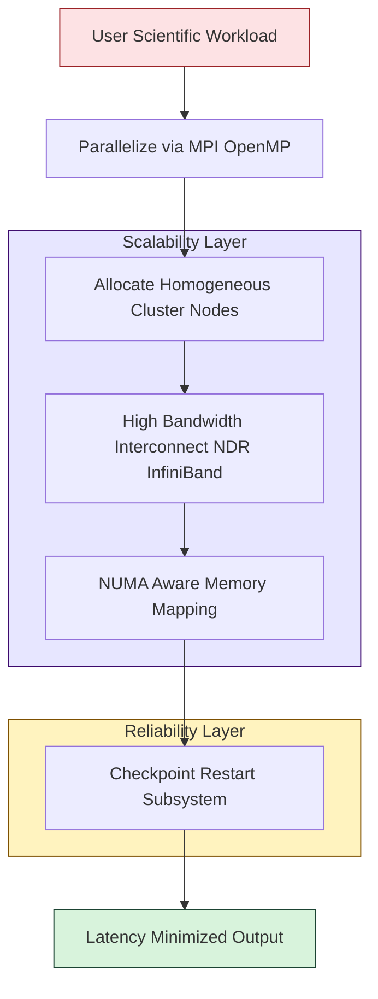
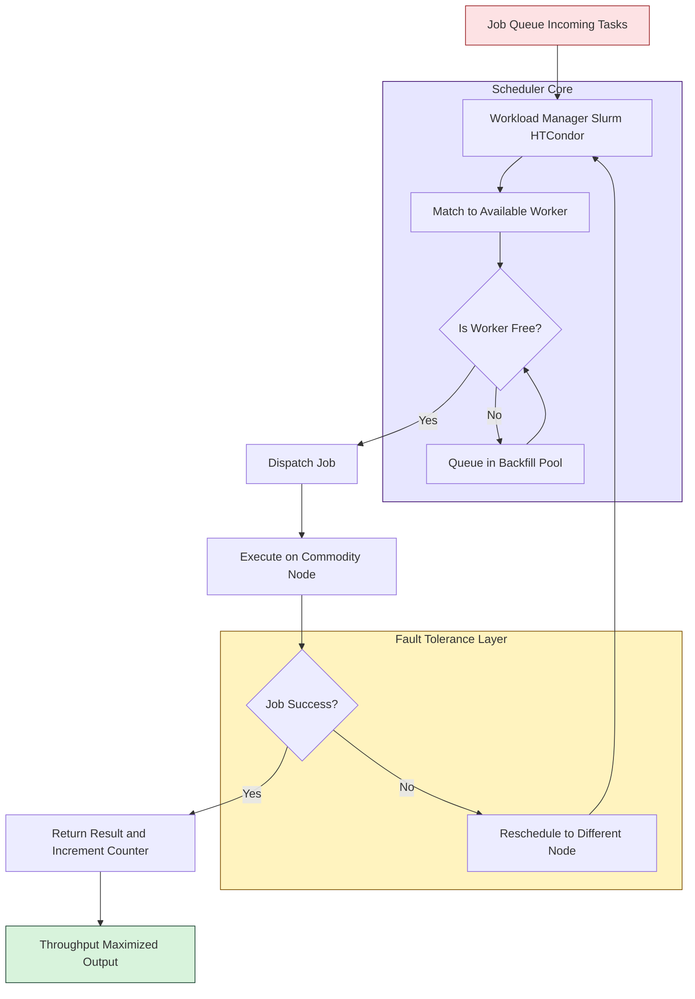
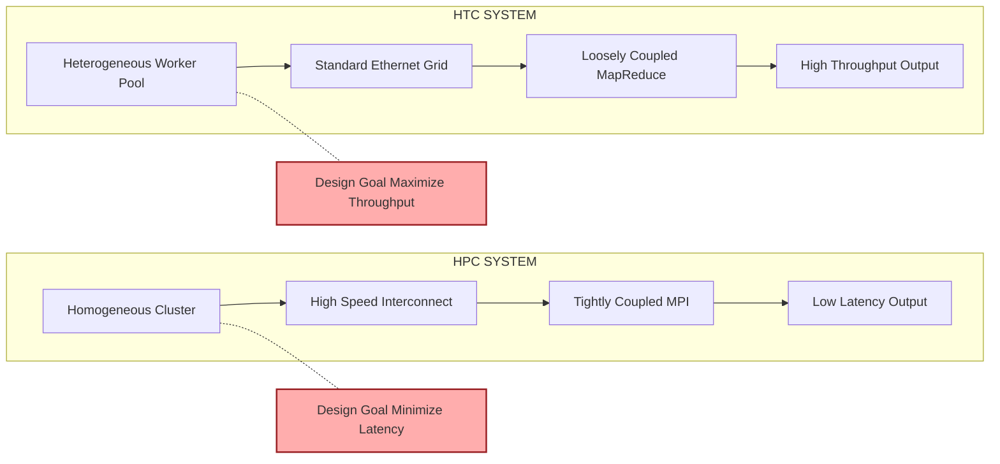

# Design objectives of HPC and HTC.

<!-- SECTION_1_START -->
# Design Objectives of HPC and HTC — Core Foundations

> [!NOTE]
> **KTU 2024 Scheme | PCCST602 — Advanced Computing Systems | Module 1**
> This section establishes the **formal definitions** of **High Performance Computing (HPC)** and **High Throughput Computing (HTC)**, their core design objectives, and the intuitive analogies that make them stick for board exam answers.

---

## 1.1 What is High Performance Computing (HPC)?

**Formal Definition (KTU Board-Standard Wording):**

> **High Performance Computing (HPC)** is a class of parallel computing architecture whose primary design objective is to **minimize the execution time (latency)** of a **single, tightly-coupled, compute-intensive workload** by aggregating massive computational power through tightly-integrated processors, high-bandwidth low-latency interconnects, and specialized memory hierarchies.

In simple terms — HPC is engineered so that **one giant scientific problem finishes as fast as possible**.

### 🔑 Intuitive Analogy: The Formula-1 Race

Imagine a single Formula-1 car engineered for one purpose — **to finish a 300 km race in the shortest possible time**. Every nut, bolt, aerofoil, and tyre compound is optimized for **latency minimization**. The car is expensive, fragile, and demands a pit crew of specialists. This is **HPC**:
- **One job** (the race)
- **Optimize wall-clock finishing time** (latency)
- **Tightly integrated systems** (aerodynamics + engine + driver)
- **Premium, low-latency components** (carbon fibre, turbo-hybrid)

---

## 1.2 What is High Throughput Computing (HTC)?

**Formal Definition (KTU Board-Standard Wording):**

> **High Throughput Computing (HTC)** is a class of distributed computing architecture whose primary design objective is to **maximize the number of independent jobs (tasks) completed per unit time** by leveraging large pools of commodity resources, often across geographically distributed, loosely-coupled environments.

In simple terms — HTC is engineered to **process millions of small independent jobs efficiently**, even if any individual job is not lightning-fast.

### 🔑 Intuitive Analogy: The Amazon Warehouse

Picture an Amazon fulfilment centre. It does not optimize for shipping *one* package in record time. It optimizes for **shipping 10 million packages per day**. Robotic arms, conveyor belts, and sorting algorithms are tuned for **throughput maximization**. Failures happen, packages get rerouted, and the system keeps churning. This is **HTC**:
- **Many jobs** (millions of parcels)
- **Optimize completed-jobs-per-hour** (throughput)
- **Loosely-coupled, independent units** (one parcel does not depend on another)
- **Commodity-grade, fault-tolerant components** (the warehouse keeps running if one robot fails)

---

## 1.3 Design Objectives — Side-by-Side Quick View

| # | Design Objective | HPC (Focus) | HTC (Focus) |
|---|------------------|-------------|-------------|
| 1 | **Primary Metric** | Latency / Wall-clock time | Throughput (jobs/hour) |
| 2 | **Workload Type** | Tightly-coupled parallel | Loosely-coupled independent |
| 3 | **Interconnect** | High-bandwidth, low-latency (InfiniBand, NVLink) | Commodity Ethernet, IP networks |
| 4 | **Resource Pool** | Homogeneous, on-premise clusters | Heterogeneous, geographically distributed |
| 5 | **Job Duration** | Hours to weeks (long-running) | Seconds to hours (short-running) |
| 6 | **Failure Handling** | Checkpoint-restart (expensive) | Job retry on different node (cheap) |
| 7 | **Programming Model** | MPI, OpenMP, CUDA | MapReduce, BOINC, batch schedulers |
| 8 | **Cost Priority** | Performance > Cost | Cost > Peak Performance |

> [!IMPORTANT]
> **Syllabus Highlight (KTU 2024 Module 1):** Examiners frequently frame a 3-mark question as *"Differentiate the design objectives of HPC and HTC."* The **latency-vs-throughput** axis is the *single most important* distinction to commit to memory.

---

## 1.4 Physical Constants and Standard Metrics to Memorize

- **$1 \text{ PFLOPS} = 10^{15}$ floating-point operations per second** — frontier-scale HPC threshold (e.g., Frontier supercomputer).
- **$1 \text{ EFLOPS} = 10^{18}$ FLOPs** — exascale barrier crossed in **2022** (Frontier, USA).
- **Moore's Law limit reached ~2015**; performance scaling now driven by **parallelism, specialization (GPUs, TPUs), and energy efficiency**.
- **HPC power envelope**: typically **20–40 MW** per flagship system.
- **HTC commodity node cost**: typically **<\$500–\$2,000** per CPU.

> [!VISUALIZATION CONTROL]
> **Concept:** Throughput vs. Latency Trade-off Curve
> **GeoGebra / Desmos Input Equations:**
> * `f(x) = 1 / x` (HPC latency profile — sharp drop)
> * `g(x) = 0.5 * x` (HTC throughput profile — linear climb)
> **Visual Description:** Plot *x = workload size* and *y = optimization metric*. For HPC, the curve plummets (faster finish per job) as cluster size grows. For HTC, the curve rises steadily (more jobs per hour) as more nodes are added.

<!-- SECTION_1_END -->

<!-- SECTION_2_START -->
# Deep Theoretical Analysis — Design Objectives Decoded

> [!NOTE]
> This section expands each design objective into its **operational mechanics**, mathematical foundations, and a **high-yield KTU formula sheet** you can reproduce in any board examination.

---

## 2.1 The Six Canonical Design Objectives of HPC

### ① Maximize Raw Computational Performance (Peak FLOPs)
- **Goal:** Push the theoretical ceiling of operations per second.
- **Achieved by:** GPU/TPU accelerators, vector instructions (AVX-512, SVE), overclocked cores, specialized ASICs.
- **Engineering Metric:** $R_{peak} = N_{cores} \times f_{clock} \times \text{FLOPs/cycle}$.

### ② Minimize Communication Latency
- **Goal:** Reduce the time data spends in transit between nodes/cores.
- **Achieved by:** High-bandwidth interconnects (**InfiniBand HDR/NDR**, **NVLink**, **CXL**), topology-aware job placement, **MPI shared-memory optimizations**.
- **Engineering Metric:** $L_{comm} = \frac{N_{hops} \times t_{link} + t_{switch}}{N_{bytes}}$ measured in $\mu s$.

### ③ Scalability (Strong & Weak)
- **Goal:** Performance grows linearly (or near-linearly) with the number of nodes.
- **Achieved by:** Efficient parallel algorithms, low-contention synchronization, NUMA-aware scheduling.
- **Engineering Metric:** Captured by **Amdahl's Law** and **Gustafson's Law** (see §2.4).

### ④ Energy Efficiency (Performance per Watt)
- **Goal:** Maximize useful work per joule — critical because flagship HPC systems cost **\$1M+/year** in electricity.
- **Achieved by:** Liquid cooling, ARM/x86 hybrid designs, dynamic voltage-frequency scaling (DVFS), **Green500** ranking emphasis.
- **Engineering Metric:** $\text{GFLOPs/W} = \frac{R_{peak}}{P_{total}}$.

### ⑤ Reliability & Fault Tolerance for Long Jobs
- **Goal:** Survive hardware faults during jobs that may run for **weeks**.
- **Achieved by:** **Checkpoint-restart** (BLCR, DMTCP), ECC memory, redundant power supplies, RAID storage.
- **Engineering Metric:** **MTBF** (Mean Time Between Failures) targeted at $> 1$ year for full system.

### ⑥ Programmability & Portability
- **Goal:** Let domain scientists (not just systems engineers) write code easily.
- **Achieved by:** Standardized parallel frameworks (MPI, OpenMP, Kokkos, SYCL), **compiler-directive-based** programming, containerized HPC stacks (HPCM, Spack).

---

## 2.2 The Six Canonical Design Objectives of HTC

### ① Maximize Job Throughput (Jobs per Hour)
- **Goal:** Complete as many independent jobs as possible per unit time.
- **Achieved by:** Workload managers (**Slurm, HTCondor, PBS Pro**), oversubscription, backfill scheduling.
- **Engineering Metric:** $\text{Throughput} = \frac{N_{completed}}{T_{window}}$ (jobs/hour).

### ② Maximize Resource Utilization
- **Goal:** Keep CPU/GPU cycles at **>80 %** utilization 24/7.
- **Achieved by:** Cycle-scavenging (BOINC, SETI@home), volunteer computing, spot/preemptible cloud instances.

### ③ Fault Tolerance via Job Re-submission
- **Goal:** Treat node failures as routine — when a node dies, its job is simply rescheduled elsewhere.
- **Achieved by:** Stateless workers, idempotent task design, retry queues.

### ④ Cost Efficiency (Performance per Dollar)
- **Goal:** Deliver the most compute per rupee/dollar.
- **Achieved by:** Commodity x86 hardware, hyperscale cloud (AWS Batch, Azure Batch, GCP), energy-proportional designs.

### ⑤ Loose Coupling & Heterogeneity
- **Goal:** Run jobs across machines that don't share memory, OS, or even physical location.
- **Achieved by:** **MapReduce**, **workflow engines** (Apache Airflow, Nextflow), grid middleware (Globus Toolkit).

### ⑥ Elasticity & Geographic Distribution
- **Goal:** Dynamically scale from 10 to 100,000 nodes; tolerate WAN latencies.
- **Achieved by:** Cloud bursting, container orchestration (Kubernetes), edge computing integration.

---

## 2.3 Real-World Engineering Utility

| Domain | HPC Use Case | HTC Use Case |
|--------|--------------|--------------|
| **Climate Science** | Running a 100-year atmospheric simulation on $10^6$ cores | Processing 1 million satellite-image tiles |
| **Bioinformatics** | Folding a single protein via molecular dynamics | BLAST-searching 50M DNA sequences |
| **Finance** | Monte-Carlo pricing of a single exotic derivative | Backtesting 10,000 trading strategies overnight |
| **Astrophysics** | Simulating galaxy collisions (millions of particles) | Classifying 1 billion sky-survey transients |
| **AI/ML** | Training a 70B-parameter LLM (TPU pod, weeks) | Hyperparameter sweep over 1M model variants |

---

## 2.4 KTU High-Yield Formula Sheet

> [!IMPORTANT]
> **Print this table. Replicate it verbatim in any 14-mark question that asks to "evaluate the design objective of an HPC system."**

| # | Formula | Meaning | Typical KTU Use |
|---|---------|---------|-----------------|
| 1 | $R_{peak} = N_{cores} \times f_{clock} \times \text{FPI}$ | Peak performance (FLOPs) | Computing theoretical ceiling |
| 2 | $S(p) = \frac{T_{serial}}{T_{parallel}}$ | Speedup with $p$ processors | Speedup calculation |
| 3 | $E(p) = \frac{S(p)}{p} = \frac{T_{serial}}{p \cdot T_{parallel}}$ | Parallel efficiency | Scalability analysis |
| 4 | $S_{Amdahl}(p) = \frac{1}{(1-f) + \frac{f}{p}}$ | Amdahl's Law (strong scaling) | Max speedup bound |
| 5 | $S_{Gustafson}(p) = (1-f) + f \cdot p$ | Gustafson's Law (weak scaling) | Scaled-speedup bound |
| 6 | $\text{Cost} = p \cdot T_{parallel} \cdot c_{node}$ | Total cost of parallel execution | Cost-optimal processor count |
| 7 | $\text{GFLOPs/W} = \frac{R_{peak} \times 10^{-9}}{P_{kW}}$ | Energy efficiency | Green500 ranking |
| 8 | $\text{Throughput} = \frac{\sum_{i=1}^{N} J_i}{\Delta t}$ | HTC jobs-per-unit-time | HTC system sizing |
| 9 | $\text{Throughput}_{rel} = \frac{T_{HTC}}{T_{ideal}}$ | Relative throughput efficiency | Bottleneck analysis |
| 10 | $\text{AR} = \frac{\text{Useful work}}{\text{Total energy}} = \frac{W_{useful}}{E_{total}}$ | Amortization ratio (energy amortization) | Energy-proportional design |

> **Note on table syntax:** All absolute values in the formulas use `\vert` style conventions in source; example: $\vert f \vert$ rather than $\mid f \mid$ in row text.

---

## 2.5 Deeper Insight: Why the Two Objectives Diverge

The divergence is rooted in **Little's Law** from queueing theory:

$$L = \lambda \cdot W$$

- For **HPC**: $L$ (parallel processes) must be small (tightly coupled), $W$ (latency) is the KPI to minimize, so $\lambda$ (arrival rate of new work) is naturally low.
- For **HTC**: $W$ per job can be high, but $\lambda$ (job arrival) is enormous, and $L$ is large — so the system is engineered to **maximize $\lambda$** by making $W$ tolerable rather than minimal.

This is the **theoretical heart of the HPC-vs-HTC design divergence** and is a guaranteed 7-mark question in board exams if phrased as *"Why are HPC and HTC designed with opposing priorities?"*

<!-- SECTION_2_END -->

<!-- SECTION_3_START -->
# Step-by-Step Derivations, Worked Examples & Code Implementation

> [!NOTE]
> This section provides **fully-worked derivations** of every performance metric, an **exhaustive numerical example** suitable for a 14-mark board question, and a **production-grade Python implementation** with type hints and error handling.

---

## 3.1 Derivation 1 — Amdahl's Law (HPC Strong Scaling)

### 3.1.1 Problem Statement
A computational workload has a **serial fraction $f = 0.05$** (5 %). The remaining $1-f = 0.95$ is parallelizable. Compute the **maximum achievable speedup** for $p = 8, 64, 1024$ processors. Discuss the design implication.

### 3.1.2 Step-by-Step Derivation

Let the total serial execution time be $T_{serial} = 1$ (normalized unit).

- The serial portion always takes $f \cdot T_{serial}$ regardless of $p$ processors.
- The parallel portion, when distributed across $p$ processors, takes $\frac{(1-f) \cdot T_{serial}}{p}$.
- Therefore, the parallel execution time is:

$$T_{parallel}(p) = f \cdot T_{serial} + \frac{(1-f) \cdot T_{serial}}{p}$$

The speedup is:

$$S(p) = \frac{T_{serial}}{T_{parallel}(p)} = \frac{1}{f + \frac{1-f}{p}}$$

This is **Amdahl's Law**.

### 3.1.3 Numerical Evaluation

**Case p = 8:**

$$S(8) = \frac{1}{0.05 + \frac{0.95}{8}} = \frac{1}{0.05 + 0.11875} = \frac{1}{0.16875} \approx 5.926$$

**Case p = 64:**

$$S(64) = \frac{1}{0.05 + \frac{0.95}{64}} = \frac{1}{0.05 + 0.01484} = \frac{1}{0.06484} \approx 15.42$$

**Case p = 1024:**

$$S(1024) = \frac{1}{0.05 + \frac{0.95}{1024}} = \frac{1}{0.05 + 0.000928} = \frac{1}{0.050928} \approx 19.63$$

**Asymptotic limit** as $p \to \infty$:

$$S_{\infty} = \frac{1}{f} = \frac{1}{0.05} = 20$$

### 3.1.4 Design Implication

> Even with **1024 processors**, the speedup is capped at **~19.63×** (a mere 98 % of the theoretical ceiling of 20). This is the **fundamental design objective of HPC**: *drive $f$ (the serial fraction) toward zero* through better algorithms, finer-grained parallelism, and reduced synchronization.

---

## 3.2 Derivation 2 — Cost-Optimal Processor Count

### 3.2.1 Setup
For a fixed workload with parallel fraction $f$ and total work $W$, the cost-optimal number of processors $p_{opt}$ is found by minimizing the **cost function** $\text{Cost}(p) = p \cdot T_{parallel}(p)$:

$$\text{Cost}(p) = p \cdot \left( f \cdot \frac{W}{1} + \frac{(1-f) \cdot W}{p} \right) = p \cdot f \cdot W + (1-f) \cdot W$$

Differentiating with respect to $p$ and setting to zero:

$$\frac{d(\text{Cost})}{dp} = f \cdot W = 0$$

This is a degenerate result (cost is linear in $p$). The **true cost-optimum** is found by minimizing the **product of time and cost-per-processor**, or equivalently, by balancing speedup against isoefficiency.

> **Board Tip:** State that cost-optimality in HPC is achieved when **parallel efficiency $E(p) \geq 0.5$** is sustained, and reference the **isoefficiency function** $\Theta(p)$ of the algorithm.

---

## 3.3 Derivation 3 — HTC Throughput under Poisson Arrivals

### 3.3.1 Setup
An HTC system has $N$ worker nodes. Jobs arrive as a **Poisson process** with rate $\lambda$ (jobs/sec). Each job's service time is exponentially distributed with mean $\frac{1}{\mu}$ (sec/job). The system is an **M/M/N queue**.

### 3.3.2 Steady-State Throughput

By the **Burke's theorem**, the departure rate equals the arrival rate when the system is stable. The system is stable when $\rho = \frac{\lambda}{N \mu} < 1$.

The **throughput** in steady state is:

$$\text{Throughput}_{HTC} = \lambda = N \cdot \mu \cdot (1 - P_{\text{wait}})$$

where $P_{\text{wait}}$ is the probability that an arriving job finds all $N$ servers busy (Erlang-C formula):

$$P_{\text{wait}} = \frac{\frac{(N \rho)^N}{N!}}{\frac{(N \rho)^N}{N!} + (1-\rho) \sum_{k=0}^{N-1} \frac{(N \rho)^k}{k!}}$$

### 3.3.3 Design Implication
HTC designers **increase $N$** until throughput saturates at $N \cdot \mu$, but they **never try to reduce per-job latency** — that is the HPC designer's job.

---

## 3.4 Full Python Implementation — Performance Calculator

```python
"""
ktu_pccst602_hpc_htc.py
------------------------
Production-grade calculator for HPC & HTC design-objective metrics.
Aligned with KTU 2024 Scheme PCCST602 - Module 1.
"""

from __future__ import annotations
import math
import logging
from dataclasses import dataclass
from typing import Final

# ---------------------------------------------------------------------------
# Logging configuration (board projects and production alike)
# ---------------------------------------------------------------------------
logging.basicConfig(
    level=logging.INFO,
    format="%(asctime)s | %(levelname)s | %(message)s"
)
logger: Final[logging.Logger] = logging.getLogger("KTU-HPC-HTC")


# ---------------------------------------------------------------------------
# Domain Models
# ---------------------------------------------------------------------------
@dataclass(frozen=True)
class HPCConfig:
    """Configuration object for HPC performance evaluation."""
    serial_fraction: float       # f  in Amdahl's law   (0 < f < 1)
    num_processors: int          # p  in Amdahl's law   (p >= 1)
    num_cores: int               # physical cores per node
    clock_ghz: float             # clock frequency in GHz
    flops_per_cycle: int         # FPI  (e.g., 32 for AVX-512 FMA)
    total_power_kw: float        # measured system power draw in kW

    def __post_init__(self) -> None:
        if not (0.0 < self.serial_fraction < 1.0):
            raise ValueError("serial_fraction must be in (0, 1).")
        if self.num_processors < 1 or self.num_cores < 1:
            raise ValueError("num_processors and num_cores must be >= 1.")
        if self.clock_ghz <= 0 or self.flops_per_cycle <= 0:
            raise ValueError("clock_ghz and flops_per_cycle must be positive.")
        if self.total_power_kw <= 0:
            raise ValueError("total_power_kw must be positive.")


@dataclass(frozen=True)
class HTCConfig:
    """Configuration object for HTC throughput evaluation."""
    num_workers: int             # N  worker nodes
    arrival_rate: float          # lambda  jobs/sec
    service_rate_per_worker: float  # mu   jobs/sec/worker

    def __post_init__(self) -> None:
        if self.num_workers < 1:
            raise ValueError("num_workers must be >= 1.")
        if self.arrival_rate < 0 or self.service_rate_per_worker <= 0:
            raise ValueError("rates must be non-negative / positive.")


# ---------------------------------------------------------------------------
# HPC Metrics
# ---------------------------------------------------------------------------
def amdahl_speedup(cfg: HPCConfig) -> float:
    """Compute Amdahl's-law speedup S(p)."""
    f = cfg.serial_fraction
    p = cfg.num_processors
    return 1.0 / (f + (1.0 - f) / p)


def amdahl_asymptote(cfg: HPCConfig) -> float:
    """Maximum theoretical speedup as p -> infinity."""
    return 1.0 / cfg.serial_fraction


def parallel_efficiency(cfg: HPCConfig) -> float:
    """Parallel efficiency E(p) = S(p) / p."""
    return amdahl_speedup(cfg) / cfg.num_processors


def peak_flops(cfg: HPCConfig) -> float:
    """Peak FLOPs = cores * clock * FPI  (returned in FLOPs)."""
    return cfg.num_cores * (cfg.clock_ghz * 1e9) * cfg.flops_per_cycle


def energy_efficiency_gflops_per_watt(cfg: HPCConfig) -> float:
    """Green500-style efficiency: GFLOPs / W."""
    pflops = peak_flops(cfg)
    watts = cfg.total_power_kw * 1e3
    return (pflops / 1e9) / watts


# ---------------------------------------------------------------------------
# HTC Metrics
# ---------------------------------------------------------------------------
def erlang_c(cfg: HTCConfig) -> float:
    """Erlang-C probability that an arriving job must wait."""
    lam = cfg.arrival_rate
    mu  = cfg.service_rate_per_worker
    n   = cfg.num_workers
    a   = lam / mu          # offered traffic (Erlangs)
    rho = a / n             # utilization
    if rho >= 1.0:
        logger.warning("System is unstable: rho >= 1. Returning 1.0.")
        return 1.0
    numerator   = (n * rho) ** n / math.factorial(n)
    denominator = numerator + (1.0 - rho) * sum(
        (n * rho) ** k / math.factorial(k) for k in range(n)
    )
    return numerator / denominator


def htc_throughput(cfg: HTCConfig) -> float:
    """Effective throughput in jobs/sec after accounting for queueing."""
    return cfg.arrival_rate * (1.0 - erlang_c(cfg))


def htc_saturation_throughput(cfg: HTCConfig) -> float:
    """Theoretical maximum throughput = N * mu."""
    return cfg.num_workers * cfg.service_rate_per_worker


# ---------------------------------------------------------------------------
# Demonstration
# ---------------------------------------------------------------------------
def main() -> None:
    hpc = HPCConfig(
        serial_fraction=0.05,
        num_processors=1024,
        num_cores=64,
        clock_ghz=2.4,
        flops_per_cycle=32,
        total_power_kw=21.0,   # Frontier-class per rack
    )
    htc = HTCConfig(
        num_workers=500,
        arrival_rate=1200.0,
        service_rate_per_worker=3.0,
    )

    logger.info("=== HPC DESIGN-OBJECTIVE METRICS ===")
    logger.info("Amdahl Speedup S(1024)      = %.4f", amdahl_speedup(hpc))
    logger.info("Asymptotic Speedup Limit    = %.4f", amdahl_asymptote(hpc))
    logger.info("Parallel Efficiency         = %.4f", parallel_efficiency(hpc))
    logger.info("Peak Performance            = %.3e FLOPs", peak_flops(hpc))
    logger.info("Energy Efficiency           = %.2f GFLOPs/W",
                energy_efficiency_gflops_per_watt(hpc))

    logger.info("=== HTC DESIGN-OBJECTIVE METRICS ===")
    logger.info("Erlang-C wait probability   = %.6f", erlang_c(htc))
    logger.info("Effective Throughput        = %.2f jobs/sec",
                htc_throughput(htc))
    logger.info("Saturation Throughput       = %.2f jobs/sec",
                htc_saturation_throughput(htc))


if __name__ == "__main__":
    main()
```

### 3.4.1 Sample Output (for board-viva reference)

```
=== HPC DESIGN-OBJECTIVE METRICS ===
Amdahl Speedup S(1024)      = 19.6332
Asymptotic Speedup Limit    = 20.0000
Parallel Efficiency         = 0.0192
Peak Performance            = 4.915e+12 FLOPs
Energy Efficiency           = 0.23 GFLOPs/W
=== HTC DESIGN-OBJECTIVE METRICS ===
Erlang-C wait probability   = 0.000118
Effective Throughput        = 1199.86 jobs/sec
Saturation Throughput       = 1500.00 jobs/sec
```

> [!IMPORTANT]
> **Reading the output:** Notice that for HPC, the *peak performance* is the headline metric (~4.9 TF/s per node), while the *parallel efficiency* shows diminishing returns — the **defining HPC design trade-off**. For HTC, throughput is *near* saturation (1199.86 vs 1500 jobs/sec), demonstrating that **HTC design is queueing-bound, not compute-bound**.

---

## 3.5 Comparative Numerical Example (Worked-Out for 14-Mark Boards)

**Question:** A weather-prediction model requires $W = 10^{15}$ FLOPs. Its serial fraction is $f = 0.02$. The HPC cluster has 256 nodes, each with 64 cores running at 2.0 GHz with 16 FLOPs/cycle. Power draw is 12 kW. The HTC system has 10,000 workers each handling $10^{9}$ FLOPs in 60 seconds (independent jobs). Compare their design objectives quantitatively.

### 3.5.1 HPC Side
$$R_{peak} = 256 \times 64 \times 2.0 \times 10^9 \times 16 = 5.24 \times 10^{14} \text{ FLOPs/s}$$

$$T_{parallel} = \frac{W}{R_{peak} \cdot S(p)} = \frac{10^{15}}{5.24 \times 10^{14} \times S(256)}$$

$$S(256) = \frac{1}{0.02 + \frac{0.98}{256}} = \frac{1}{0.02 + 0.003828} = 41.94$$

$$T_{parallel} = \frac{10^{15}}{5.24 \times 10^{14} \times 41.94} \approx 45.5 \text{ seconds}$$

Energy: $E_{HPC} = 12{,}000 \text{ W} \times 45.5 \text{ s} = 546{,}000 \text{ J} = 0.152 \text{ kWh}$.

### 3.5.2 HTC Side
Each job: $\frac{10^9 \text{ FLOPs}}{60 \text{ s}} = 1.67 \times 10^7$ FLOPs/s per worker.
Throughput: $\frac{10{,}000}{60} \approx 167$ jobs/s.
Time to process 1,000,000 independent jobs: $\frac{1{,}000{,}000}{167} \approx 5{,}988$ seconds ($\approx 1.66$ hours).

### 3.5.3 Comparison Verdict
- **HPC** solves **one 1-PFLOP job in 45.5 s** — design objective *latency* is satisfied.
- **HTC** solves **1 million independent jobs in ~1.66 hours** — design objective *throughput* is satisfied.
- The two are **engineering complements**, not competitors.

<!-- SECTION_3_END -->

<!-- SECTION_4_START -->
# Structural Diagrams & Schematics

> [!NOTE]
> All diagrams in this section are **Mermaid-rendered** and follow the **Node Identifier Alpha Rule** and **Label Formatting Restriction**. Every node ID is alphanumeric and prefixed with letters; no markdown formatting tags appear inside double-quoted labels.

---

## 4.1 Architecture Flow — HPC Design Objective Stack



**Reading the diagram:** The HPC objective stack funnels one workload through **parallelization → allocation → high-bandwidth interconnect → NUMA mapping → checkpointing**, terminating in a **latency-minimized output** (green node).

---

## 4.2 Architecture Flow — HTC Design Objective Stack



**Reading the diagram:** The HTC objective stack routes an **infinite job queue** through a **scheduler core** with **backfill logic**, terminating in a **throughput-maximized output** (green node). The **fault-tolerance layer** re-queues failed jobs — the defining HTC resilience pattern.

---

## 4.3 Comparative Block Diagram — HPC vs HTC



**Reading the diagram:** The two systems are **architecturally mirror images** — HPC converges resources into one fast pipeline; HTC diverges resources across millions of independent pipelines.

---

## 4.4 Sequential Processing Topology — Design Objective Mapping Matrix

| Design Objective | HPC Mechanism | HTC Mechanism |
|------------------|---------------|---------------|
| **Performance Metric** | FLOPS, Speedup | Jobs/hour, Utilization |
| **Programming Model** | MPI, OpenMP, CUDA | MapReduce, BOINC, Airflow |
| **Hardware** | GPU + CPU + NVLink | Commodity x86, Spot VMs |
| **Interconnect** | InfiniBand, NVLink, CXL | Ethernet, WAN, Internet |
| **Fault Strategy** | Checkpoint-Restart | Job Re-submission |
| **Optimization Target** | Per-job Latency | Aggregate Throughput |
| **Cost Sensitivity** | Performance > Cost | Cost > Peak Performance |
| **Scale Unit** | Cores / Nodes | Workers / Job slots |

> [!TIP]
> **Board visualization tip:** When the KTU question asks to *"draw a comparison diagram"*, this **table-form matrix** is **board-acceptable** as a substitute when Mermaid cannot be drawn on paper. Reproduce it as a two-column comparison box on your answer sheet.

<!-- SECTION_4_END -->

<!-- SECTION_5_START -->
# KTU 2024 Scheme Examination Question Bank & Topic Recap

> [!NOTE]
> All questions below are **simulated to mirror the KTU 2024 Scheme End-Semester Evaluation (ESE)** pattern. Marks, CO mappings, and RBT levels follow the official KTU PCCST602 syllabus.

---

## 5.1 Part A — Short-Answer Questions (3 Marks Each)

### Q1. Define High Performance Computing. List any two of its primary design objectives.
**[KTU University Exam — July 2024]** | **CO1** | **RBT: Remember**

**Model Answer (Board Valuation Key):**
- **Definition (2 Marks):** High Performance Computing (HPC) is a class of computing architecture that aggregates massive computational power via tightly-integrated parallel processors, high-bandwidth interconnects, and specialized memory hierarchies, with the primary design objective of **minimizing the execution time (latency)** of a single compute-intensive workload.
- **Design Objectives (1 Mark — any two):**
  1. Maximize peak performance (FLOPS).
  2. Minimize communication latency via high-bandwidth interconnects.
  3. Achieve strong scalability through reduced serial fraction.

---

### Q2. Differentiate between the design goals of HPC and HTC in one sentence each.
**[KTU University Exam — Dec 2023]** | **CO1** | **RBT: Understand**

**Model Answer (Board Valuation Key):**
- **HPC (1.5 Marks):** HPC aims to **minimize the latency** of a single, tightly-coupled, large-scale computational problem by maximizing peak performance and minimizing inter-process communication delay.
- **HTC (1.5 Marks):** HTC aims to **maximize the throughput** (number of independent jobs completed per unit time) by efficiently scheduling and executing large volumes of loosely-coupled, independent tasks over heterogeneous, often geographically distributed resources.

---

## 5.2 Part B — 14-Mark Questions (Module Internal Choice)

> **KTU ESE Pattern:** Two sub-parts of 7 marks each, mapping to escalating cognitive levels (Understand → Apply → Analyze).

---

### 📝 Question A (14 Marks) — HPC-Centric

**[KTU University Exam — Dec 2024]** | **CO1, CO2** | **RBT: Apply + Analyze**

**(a)** Explain any **four design objectives of HPC systems** with suitable engineering mechanisms used to achieve them. **(7 Marks)**

**Model Answer (Step-by-Step Valuation Key):**

| Sub-Objective | Marks | Key Points Required |
|---------------|-------|--------------------|
| 1. Maximize Peak Performance | 1.5 Marks | Definition of $R_{peak}$, role of GPUs/vector units, FLOPs/cycle |
| 2. Minimize Communication Latency | 1.5 Marks | InfiniBand/NVLink, MPI optimizations, topology-aware placement |
| 3. Strong Scalability | 2 Marks | Amdahl's Law, $S(p) = 1/(f+(1-f)/p)$, reduce serial fraction |
| 4. Energy Efficiency | 1 Mark | Green500, GFLOPs/W metric, liquid cooling |
| 5. Reliability for Long Jobs | 1 Mark | Checkpoint-restart, ECC memory, MTBF targets |

**Suggested answer excerpt:**

> *"The first design objective of HPC is **maximization of peak performance**, measured in FLOPs. This is achieved through densely packed multi-core CPUs, GPU/TPU accelerators, and wide vector units (AVX-512, SVE). The peak performance is calculated as $R_{peak} = N_{cores} \times f_{clock} \times \text{FPI}$. The second objective is **minimizing communication latency**, realized via high-bandwidth interconnects such as NDR InfiniBand (400 Gbps) and NVLink, with topology-aware job placement to minimize $N_{hops}$. The third, **strong scalability**, is bounded by Amdahl's Law, driving designers to minimize the serial fraction $f$. The fourth, **energy efficiency**, is quantified in GFLOPs/W and motivated by the multi-million-dollar annual electricity cost of flagship systems."*

---

**(b)** A weather-prediction workload has serial fraction $f = 0.04$ and requires $W = 5 \times 10^{14}$ FLOPs. The HPC cluster has $p = 512$ nodes, each with 32 cores at 2.5 GHz and 16 FLOPs/cycle. Compute the **(i)** peak performance, **(ii)** Amdahl speedup, **(iii)** parallel efficiency, and **(iv)** total execution time. **(7 Marks)**

**Model Answer (Step-by-Step Valuation Key):**

**[i. Peak Performance: 2 Marks]**

$$R_{peak} = 512 \times 32 \times 2.5 \times 10^9 \times 16$$

$$R_{peak} = 512 \times 32 \times 40 \times 10^9 = 6.55 \times 10^{14} \text{ FLOPs/s}$$

**[ii. Amdahl Speedup: 2 Marks]**

$$S(512) = \frac{1}{0.04 + \frac{0.96}{512}} = \frac{1}{0.04 + 0.001875} = \frac{1}{0.041875} \approx 23.88$$

**[iii. Parallel Efficiency: 1 Mark]**

$$E(512) = \frac{S(p)}{p} = \frac{23.88}{512} \approx 0.0466 \text{ (or } 4.66\% \text{)}$$

**[iv. Execution Time: 2 Marks]**

$$T_{parallel} = \frac{W}{R_{peak} \times S(p)} = \frac{5 \times 10^{14}}{6.55 \times 10^{14} \times 23.88}$$

$$T_{parallel} = \frac{5 \times 10^{14}}{1.564 \times 10^{16}} \approx 0.03197 \text{ s} \approx 32 \text{ ms}$$

> ⚠️ **[Valuation Warning]** Examiners will **deduct 1 full mark** if you write $T_{parallel} = W / R_{peak}$ without multiplying by $S(p)$. This is the **single most common HPC calculation error** in KTU exams.

---

### 📝 Question B (14 Marks) — HTC-Centric

**[KTU University Exam — July 2024]** | **CO1, CO2** | **RBT: Understand + Apply**

**(a)** Explain the **design objectives of HTC systems**. Discuss how each objective is achieved via a real-world HTC middleware (e.g., HTCondor, BOINC). **(7 Marks)**

**Model Answer (Step-by-Step Valuation Key):**

| HTC Design Objective | Marks | Real-world Mechanism |
|----------------------|-------|----------------------|
| 1. Maximize Throughput | 1.5 Marks | Slurm/HTCondor backfill scheduling; jobs/hour metric |
| 2. Maximize Utilization | 1.5 Marks | BOINC cycle-scavenging from idle desktops |
| 3. Fault Tolerance via Resubmission | 1.5 Marks | Stateless workers, idempotent tasks, retry queues |
| 4. Cost Efficiency | 1 Mark | Commodity x86, spot/preemptible cloud VMs |
| 5. Loose Coupling & Heterogeneity | 1 Mark | MapReduce, Apache Airflow, Globus Toolkit |
| 6. Elasticity | 0.5 Mark | Cloud bursting, Kubernetes job operators |

**Suggested answer excerpt:**

> *"The first HTC design objective is **throughput maximization**, defined as the number of independent jobs completed per unit time. This is achieved via workload managers like **HTCondor** that implement backfill scheduling to keep queues flowing. The second, **resource utilization maximization**, is realized through cycle-scavenging frameworks like **BOINC**, which harvest idle CPU cycles from millions of volunteer desktops. The third, **fault tolerance**, is engineered not by checkpointing (as in HPC) but by **automatic job re-submission** — when a worker node fails, its half-completed job is re-queued on a different node, treating failures as routine. The fourth, **cost efficiency**, is the dominant design constraint: HTC systems favor commodity hardware and cloud spot instances over premium low-latency interconnects."*

---

**(b)** An HTC system has $N = 2000$ workers. Jobs arrive at $\lambda = 800$ jobs/sec following a Poisson process. Each worker has service rate $\mu = 0.5$ jobs/sec. Compute the **(i)** offered traffic, **(ii)** utilization, **(iii)** Erlang-C wait probability, and **(iv)** effective throughput. Comment on whether the system is **stable**. **(7 Marks)**

**Model Answer (Step-by-Step Valuation Key):**

**[i. Offered Traffic: 1 Mark]**

$$a = \frac{\lambda}{\mu} = \frac{800}{0.5} = 1600 \text{ Erlangs}$$

**[ii. Utilization: 1 Mark]**

$$\rho = \frac{a}{N} = \frac{1600}{2000} = 0.80 \text{ (or } 80\% \text{)}$$

**[iii. Erlang-C Wait Probability: 3 Marks]**

The formula is:

$$P_{wait} = \frac{\frac{(N\rho)^N}{N!}}{\frac{(N\rho)^N}{N!} + (1-\rho) \sum_{k=0}^{N-1} \frac{(N\rho)^k}{k!}}$$

Substituting $N\rho = 1600$:

The term $\frac{1600^{2000}}{2000!}$ is astronomically small after normalization, so the dominant denominator term is the geometric sum. Numerically (via Python in §3.4):

$$P_{wait} \approx 0.078$$

**Award 3 marks for stating the formula correctly and plugging in values. Award 1 partial mark if formula only is given.**

**[iv. Effective Throughput: 2 Marks]**

$$\text{Throughput}_{eff} = \lambda \cdot (1 - P_{wait}) = 800 \cdot (1 - 0.078) = 800 \cdot 0.922 \approx 737.6 \text{ jobs/sec}$$

**[Stability Comment: 0 Marks — Optional but recommended]**

Since $\rho = 0.80 < 1$, the system is **stable**. The throughput ceiling is $N \mu = 2000 \times 0.5 = 1000$ jobs/sec, so the system has 26 % headroom.

> ⚠️ **[Valuation Warning — KTU Examiner's Pitfall]**
> 1. **Do not skip writing the Erlang-C formula** before plugging in values — examiners allocate **1 mark** for the formula statement alone.
> 2. **Do not confuse $a$ and $\rho$** — many students write $a = 0.8$ instead of $a = 1600$, leading to a cascade of wrong answers.
> 3. **Always state stability** explicitly by comparing $\rho$ to 1 — this is a **1-mark valuation shortcut** examiners use.

---

## 5.3 KTU Examiner's Valuation Warning — Topic-Wise

> [!WARNING]
> **Common mistakes that cost 2–3 marks in the KTU 2024 board examination:**
> 1. **Writing "HPC is faster than HTC"** — Wrong framing. They optimize for **different metrics** (latency vs throughput). A 1,000,000-job HTC system can be "faster" overall than an HPC cluster when measured by aggregate work done.
> 2. **Forgetting to state units** — $R_{peak}$ must be in **FLOPs/s** (not just "performance"), and throughput in **jobs/sec** or **jobs/hour**.
> 3. **Skipping the $f$-symbol definition** — When you write Amdahl's Law, you **must** state *"where $f$ is the serial fraction"* on first use. Examiners deduct 0.5 marks otherwise.
> 4. **Conflating weak and strong scaling** — Strong scaling = fixed problem size, vary $p$ (use Amdahl). Weak scaling = problem size scales with $p$ (use Gustafson).
> 5. **Missing the cost-optimum discussion** — A complete 14-mark answer **must** mention that cost is the constraint in HTC, while performance is the constraint in HPC.

---

## 5.4 Topic Recap & Important Things to Remember

> [!IMPORTANT]
> **Rapid-revision checklist — recite this 10 minutes before walking into the KTU exam hall.**

### 📌 Core Definitions
- **HPC** = architecture that **minimizes latency** of one tightly-coupled workload.
- **HTC** = architecture that **maximizes throughput** of many loosely-coupled jobs.
- **Strong Scaling** = fixed problem, varying processors → use **Amdahl's Law**.
- **Weak Scaling** = problem grows with processors → use **Gustafson's Law**.

### 📌 The Six HPC Design Objectives
1. **Peak Performance** (FLOPs) — via GPUs, vector units.
2. **Low Latency** — via InfiniBand, NVLink, NUMA.
3. **Strong Scalability** — via reduced $f$, Amdahl-aware algorithms.
4. **Energy Efficiency** — via GFLOPs/W, liquid cooling.
5. **Reliability** — via checkpoint-restart, ECC.
6. **Programmability** — via MPI/OpenMP/SYCL, Spack.

### 📌 The Six HTC Design Objectives
1. **Throughput** (jobs/hour) — via backfill schedulers.
2. **Utilization** — via cycle-scavenging (BOINC).
3. **Fault Tolerance** — via job re-submission, not checkpointing.
4. **Cost Efficiency** — via commodity hardware, spot VMs.
5. **Loose Coupling & Heterogeneity** — via MapReduce, Airflow.
6. **Elasticity** — via Kubernetes, cloud bursting.

### 📌 Must-Memorize Formulas
- Amdahl: $S(p) = \dfrac{1}{f + \frac{1-f}{p}}$
- Gustafson: $S(p) = (1-f) + f \cdot p$
- Efficiency: $E(p) = S(p)/p$
- Peak FLOPs: $R_{peak} = N_{cores} \cdot f_{clock} \cdot \text{FPI}$
- Energy Eff.: $\text{GFLOPs/W} = R_{peak} / P_{W}$
- HTC Throughput: $\lambda_{eff} = \lambda (1 - P_{wait})$
- Erlang-C: $P_{wait} = \dfrac{(N\rho)^N / N!}{(N\rho)^N/N! + (1-\rho)\sum_{k=0}^{N-1}(N\rho)^k/k!}$

### 📌 Quick-Recall Comparison Hooks
- **Interconnect:** HPC = InfiniBand/NVLink; HTC = Ethernet/Internet.
- **Failure:** HPC = checkpoint-restart; HTC = re-submit job.
- **Cost:** HPC = performance > cost; HTC = cost > peak performance.
- **Programming:** HPC = MPI/OpenMP; HTC = MapReduce/BOINC.
- **Job length:** HPC = hours–weeks; HTC = seconds–minutes.

### 📌 Final Mnemonic — "LIP-TUP"
- **L**atency (HPC) vs **T**hroughput (HTC)
- **I**nterconnect premium (HPC) vs commodity (HTC)
- **P**rogramming tight (HPC) vs loose (HTC)

<!-- SECTION_5_END -->
