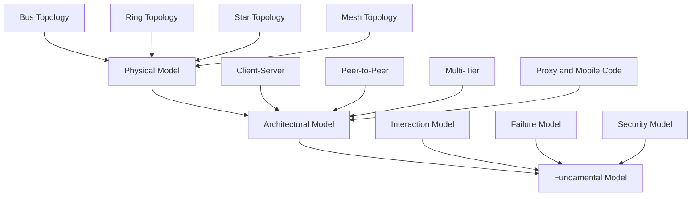
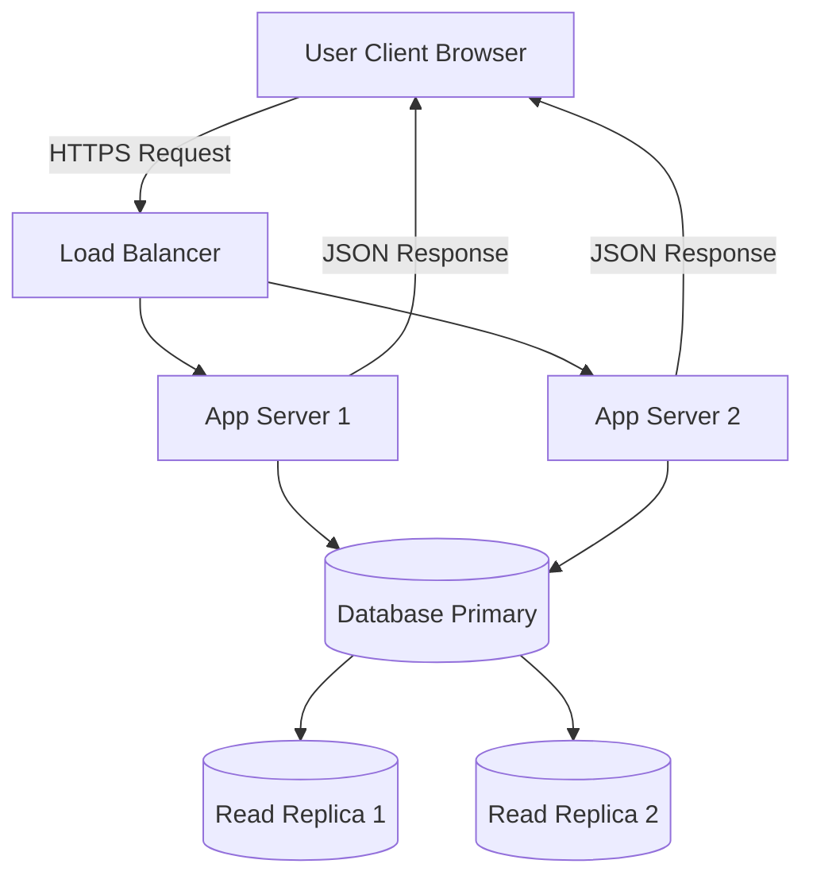
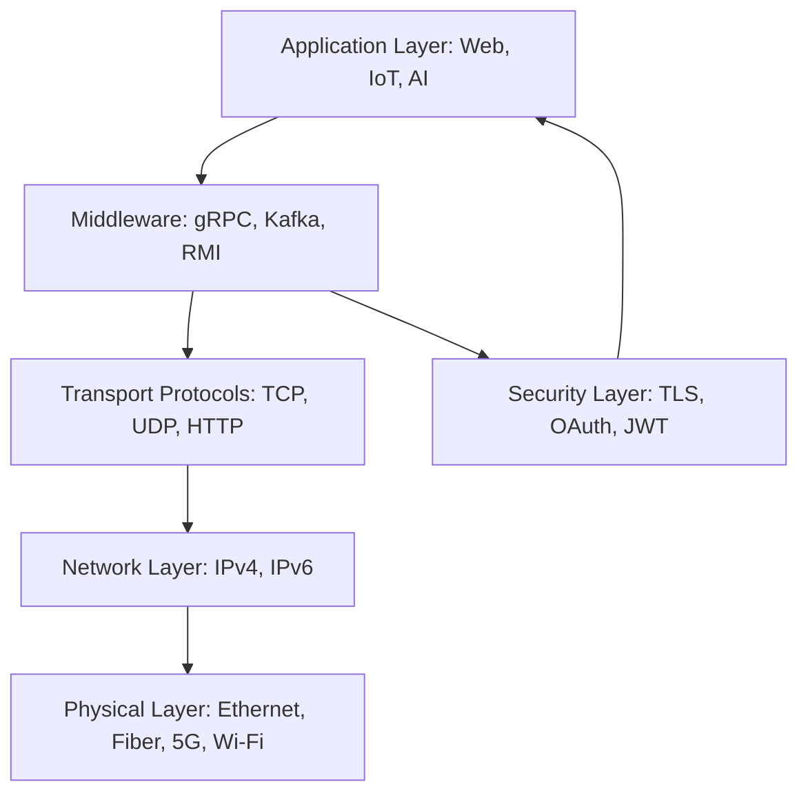
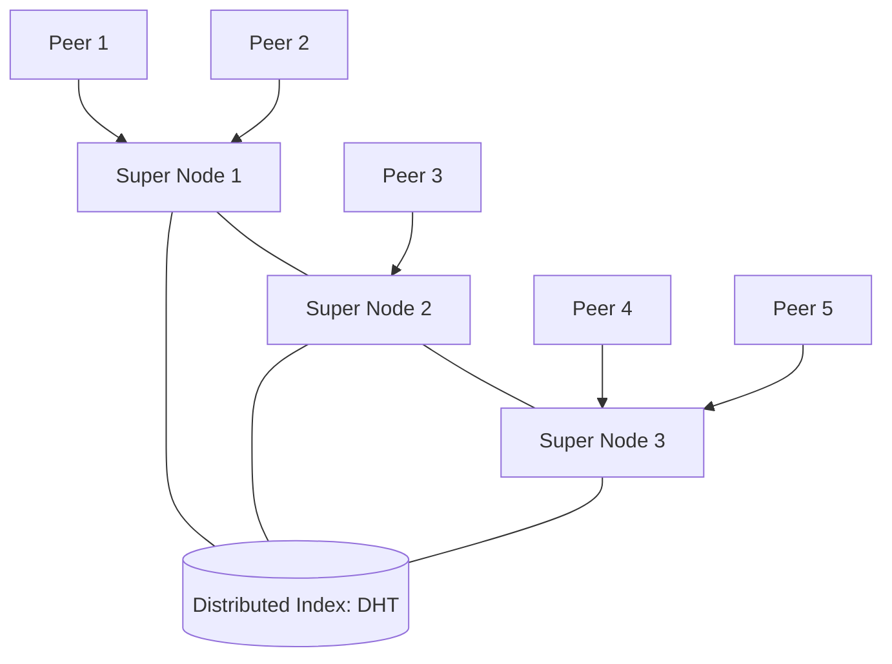
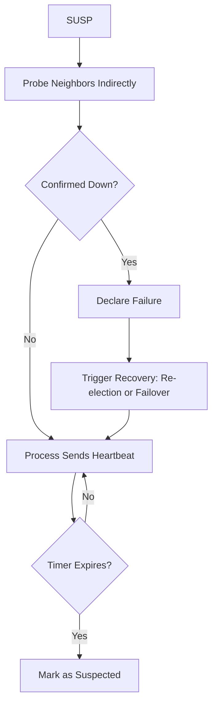
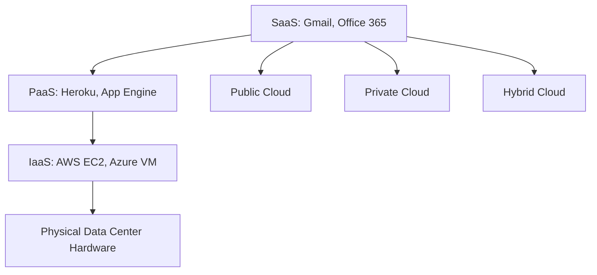

# Distributed System Models and Enabling Technologies:-

<!-- SECTION_1_START -->
# Distributed System Models and Enabling Technologies

## 1.1 What is a Distributed System?

> [!IMPORTANT]
> **Formal Definition (Silberschatz / Tanenbaum / KTU Syllabus Standard):**
> A **Distributed System** is a collection of independent computers that appears to its users as a single coherent system. The components are networked, communicate solely by passing messages, and share a common goal while being loosely coupled.

The two primary characteristics that fundamentally distinguish distributed systems are:
1. **Concurrency** — Multiple components execute computations simultaneously.
2. **No Global Clock** — Coordination is achieved purely through message passing and logical timestamps; there is no single, shared, perfect clock across the system.

### Real-World Analogy: The Modern Bank

> [!NOTE]
> **Intuition:** Imagine a national bank (e.g., SBI) with thousands of branches across India. When you withdraw cash in Kerala, the transaction instantly updates the central ledger maintained in Mumbai. You do not interact with the central server; the entire system *appears* to be a single logical bank. Behind the scenes, however, thousands of independent ATM machines, regional servers, and databases collaborate via a network to give you that unified experience. This is the essence of a distributed system — **independent components behaving as a single coherent whole**.

## 1.2 Why Build Distributed Systems?

Distributed systems are engineered to deliver four principal benefits:

| Benefit | Description | Metric |
| :--- | :--- | :--- |
| **Resource Sharing** | Sharing of hardware (printers), software (files), and data (databases) | Connectivity & Access |
| **Openness** | Services are exposed through well-defined, documented interfaces (e.g., REST, gRPC) | Standardization |
| **Concurrency** | Multiple users/processes interact with the system simultaneously | Throughput, Concurrency |
| **Scalability** | Ability to handle increased load by adding resources gracefully | Linear/Near-Linear Growth |
| **Fault Tolerance** | System continues functioning despite partial component failures | **MTTF (Mean Time To Failure)** $\uparrow$, **MTTR (Mean Time To Repair)** $\downarrow$ |
| **Transparency** | Hides the complexity of distribution from users and programmers | 8 Forms of Transparency |

## 1.3 The Eight Forms of Transparency (KTU High-Yield)

According to the ISO Reference Model and KTU syllabus, a transparent distributed system hides the following:

1. **Access Transparency** — Hide differences in data representation and resource access.
2. **Location Transparency** — Hide the actual physical location of a resource.
3. **Migration Transparency** — Allow resources to move without affecting users.
4. **Relocation Transparency** — Allow resources to be relocated during execution.
5. **Replication Transparency** — Hide that multiple copies of a resource exist.
6. **Concurrency Transparency** — Hide that a resource is shared by competing users.
7. **Failure Transparency** — Mask the failure and recovery of resources.
8. **Persistence Transparency** — Hide whether a resource is in memory or on disk.

## 1.4 The Scalability Challenges (KTU Board Favorite)

Scalability problems typically appear as three classical dimensions:

- **Size Scalability** — Number of users/resources grows.
- **Geographical Scalability** — Distance between nodes causes communication latency.
- **Administrative Scalability** — Multiple administrative domains need autonomous management.

> [!IMPORTANT]
> **The Scalability Bottleneck — Centralized Components:**
> Examples include a single email server, a centralized router table, or a single DNS root server. KTU examiners frequently test the identification of such centralization points.

## 1.5 Distributed System Models — Three Layered Views

The KTU syllabus categorizes models into three essential layers:

### A. Physical Models
Describes the **hardware composition** — the actual machines, network topology, and physical connectivity. Examples: Bus, Ring, Star, Mesh, Fully Connected.

### B. Architectural Models
Describes the **logical organization** of components into tiers, layers, and processes. Examples: Client-Server, Peer-to-Peer, Multi-tier, Proxy servers, Mobile code.

### C. Fundamental Models
Describes the **abstract properties** essential to the developer:

- **Interaction Model** — Deals with performance, communication channels, and timing (synchronous vs. asynchronous).
- **Failure Model** — Classifies failures (crash, omission, timing, Byzantine).
- **Security Model** — Deals with threats, security mechanisms, and channels (secure/insecure).

> [!VISUALIZATION CONTROL]
> **Concept:** Three-Layered View of Distributed System Models
> **Visualization Inputs:** A pyramid/hierarchy with three distinct tiers
> **Visual Description:** A bottom-up pyramid — the broadest foundation is the **Physical Model** (the actual hardware topology), the middle is the **Architectural Model** (the layered software/role organization), and the apex is the **Fundamental Model** (the abstract properties governing interactions, failures, and security).
<!-- SECTION_1_END -->

<!-- SECTION_2_START -->
# Deep Theoretical Analysis & KTU High-Yield Formula Sheet

## 2.1 Physical Models — Network Topologies and Their Trade-offs

| Topology | Description | Pros | Cons | KTU Exam Tip |
| :--- | :--- | :--- | :--- | :--- |
| **Bus** | Single shared communication line | Simple, low cost | Single point of failure, collisions | Rarely used in modern DS |
| **Ring** | Each node connected to two neighbours | Ordered token passing, no collisions | Failure of one node breaks ring | Use in token-ring LANs |
| **Star** | All nodes connect to central hub | Easy to expand, central monitoring | Hub failure $\Rightarrow$ total failure | Common in Ethernet |
| **Mesh (Partial / Full)** | Multiple redundant paths | Highly fault-tolerant | Costly cabling, complex routing | Used in data center fabrics |
| **Hybrid (Tree/Cloud)** | Combined topology | Scalable & flexible | Complex management | Used in enterprise networks |

## 2.2 Architectural Models — The KTU Core Focus

### 1. Client-Server Model (Tiered Architectures)
The dominant and most-tested model. It splits responsibilities:
- **Server** — Provides services (file, print, database, web).
- **Client** — Issues requests and consumes services.

**Sub-Variants:**
- **Two-tier** — Client directly communicates with server.
- **Three-tier / Multi-tier** — Client $\rightarrow$ Application Server $\rightarrow$ Database Server.
- **Thin vs. Thick Client** — Distribution of logic between client and server.

### 2. Peer-to-Peer (P2P) Model
All nodes are **equal (peers)**; they can act as both client and server. Excellent for content distribution (BitTorrent, Blockchain).

### 3. Hybrid Architectures
Modern systems blend both — e.g., BitTorrent trackers (client-server) coordinate swarms (P2P). Skype uses a **Super-Node** hybrid (P2P + centralized directory).

## 2.3 Fundamental Models — The Formal Heart

### Interaction Model

The interaction model is governed by two fundamental aspects: **communication channels** and **timing**.

**Communication Channel Performance Metrics:**

| Metric | Definition | Formula / Unit |
| :--- | :--- | :--- |
| **Latency** | Delay between sending and receiving a message | $L = T_{send} - T_{receive}$ (seconds) |
| **Bandwidth** | Amount of data transmitted per unit time | $BW = \frac{Data}{Time}$ (bits/sec) |
| **Jitter** | Variation in latency over time | $J = L_{max} - L_{min}$ |

**Two Timing Models:**
- **Synchronous DS** — Known upper bounds on latency and clock drift rates. Easier to reason about but rarely realistic.
- **Asynchronous DS** — No bounds on latency, clock drift, or process speed. Realistic but harder to design.

**Event Ordering (Lamport's Logical Clocks):**

For any two events $a$ and $b$, the logical timestamp rule is:

$$C(a) < C(b) \quad \text{if} \ a \rightarrow b \ (\text{causally related})$$

- **Happens-Before Relation ($\rightarrow$):**
  1. If $a$ and $b$ are events in the same process, $a \rightarrow b$ if $a$ occurs before $b$.
  2. If $a$ is the send and $b$ is the corresponding receive, $a \rightarrow b$.
  3. Transitivity: If $a \rightarrow b$ and $b \rightarrow c$, then $a \rightarrow c$.

**Logical Clock Update Rule:**

$$C_{new} = \max(C_{local}, C_{received}) + 1$$

### Failure Model (KTU Board Examiner's Hot Spot)

| Failure Class | Description | Example |
| :--- | :--- | :--- |
| **Crash Failure** | Process halts and stops responding | Server power loss |
| **Omission Failure** | Process fails to send/recv a message | Dropped packet |
| **Timing Failure** | Response outside the specified time limit | Network congestion |
| **Byzantine Failure** | Arbitrary/malicious behavior, may send conflicting data | Compromised node, software bug |
| **Network Failure** | Link partitioning, message loss | Disconnected cable |

**Failure Masking Techniques (KTU Important):**

| Technique | Purpose |
| :--- | :--- |
| **Retransmission** | Recover from omission failures (TCP ACK) |
| **Redundancy (Replicas)** | Survive crash failures (3-2-1 backup rule) |
| **Voting / Consensus** | Tolerate Byzantine failures (Raft, Paxos) |
| **Timeouts & Retries** | Detect and recover from timing failures |

### Security Model

The security model classifies components into:
- **Process** — The active component (client/server).
- **Channel** — The communication medium.
- **Security Threats** — Interception, Interruption, Modification, Fabrication.

**Core Security Mechanisms:**

- **Encryption** — Confidentiality via symmetric (AES) or asymmetric (RSA) algorithms.
- **Authentication** — Verifying identity (e.g., digital signatures).
- **Authorization** — Defining access rights.
- **Secure Channels** — Built on top of insecure channels using cryptographic protocols (e.g., TLS, HTTPS).

## 2.4 Enabling Technologies

> [!IMPORTANT]
> **KTU Definition:** Enabling technologies are the underlying hardware and software infrastructure that make distributed computing practical and performant. Without them, distributed systems cannot scale or survive failures.

### A. Network Communication Technologies

| Layer | Technology | Role |
| :--- | :--- | :--- |
| Physical | Ethernet, Fiber, 5G, Wi-Fi | Bit transmission |
| Data Link | MAC protocols (CSMA/CD) | Local frame delivery |
| Network | IPv4, IPv6 | Global addressing & routing |
| Transport | TCP (reliable), UDP (fast) | End-to-end channels |
| Application | HTTP, FTP, SMTP, MQTT | Service-specific protocols |

### B. Inter-Process Communication (IPC)

**Three communication paradigms:**

1. **Message Passing (Sockets)** — Lowest level. Uses TCP/UDP primitives.
2. **Remote Procedure Call (RPC)** — Synchronous call-return abstraction (e.g., gRPC).
3. **Message-Oriented Middleware (MOM)** — Asynchronous queues (e.g., Kafka, RabbitMQ).

### C. Middleware — The Hidden Backbone

Middleware is a **software layer** between the OS and the application that provides:
- Heterogeneity (different hardware/OS).
- Transparency (location, failure, access).
- Common services (security, transactions, naming).

**Examples:** CORBA, RMI (Java), DCOM, gRPC, Apache Kafka, RabbitMQ.

### D. Web Services & Service-Oriented Architecture (SOA)

| Style | Data Format | Transport | Use Case |
| :--- | :--- | :--- | :--- |
| **SOAP** | XML | HTTP/SMTP | Enterprise, strict contracts |
| **REST** | JSON / XML | HTTP | Web & mobile APIs |
| **gRPC** | Protocol Buffers | HTTP/2 | Microservices, low latency |
| **GraphQL** | Custom query | HTTP | Flexible client-driven queries |

### E. Peer-to-Peer (P2P) Systems

- **Structured P2P** — Uses Distributed Hash Tables (DHT) like Chord, Pastry, Kademlia. Each peer is responsible for a specific hash range.
- **Unstructured P2P** — No overlay structure; uses flooding (Gnutella).
- **Hybrid P2P** — Combines centralized lookup (Napster) with P2P transfer.

### F. Mobile & Ubiquitous Computing

- **Mobile Computing** — Users move with devices; supports spontaneous, intermittent connectivity.
- **Ubiquitous Computing (Pervasive Computing)** — Computation is embedded invisibly into everyday objects.
- **Key Challenges:** Disconnection, low bandwidth, limited battery, security.

### G. Cloud Computing & Edge Computing

**Service Models:**

| Model | Provider Manages | User Manages | Example |
| :--- | :--- | :--- | :--- |
| **IaaS** | Hardware, Storage, Network | OS, Middleware, App | AWS EC2, Azure VM |
| **PaaS** | All except App | Application code | Google App Engine, Heroku |
| **SaaS** | Everything | User data only | Gmail, Office 365 |

**Deployment Models:** Public, Private, Hybrid, Community.

**Edge Computing** — Pushes computation to the *edge* of the network (closer to data source) to reduce latency, suitable for IoT and 5G.

### H. Internet of Things (IoT) and Embedded Systems

Smart sensors, RFID, and embedded boards (Arduino, Raspberry Pi) generate massive data. They typically use lightweight protocols like **MQTT** and **CoAP**.
<!-- SECTION_2_END -->

<!-- SECTION_3_START -->
# Step-by-Step Derivations, Models, and Code Implementation

## 3.1 Lamport's Logical Clocks — A Complete Worked Derivation

**Scenario Setup:**
Three processes P1, P2, and P3. Each process executes internal events and sends/receives messages.

**Initial Condition:**

$$C_1(P1) = 0, \quad C_2(P2) = 0, \quad C_3(P3) = 0$$

**Event Trace Table:**

| Event # | Process | Type | Local Counter Before | Update Rule | New Counter | Rule Applied |
| :---: | :---: | :--- | :---: | :--- | :---: | :--- |
| 1 | P1 | Send m1 to P2 | 0 | $C+1$ | 1 | Local send |
| 2 | P2 | Recv m1 | 0 | $\max(0,1)+1$ | 2 | Recv with $C_{recv}=1$ |
| 3 | P2 | Send m2 to P3 | 2 | $C+1$ | 3 | Local send |
| 4 | P3 | Recv m2 | 0 | $\max(0,3)+1$ | 4 | Recv with $C_{recv}=3$ |
| 5 | P3 | Send m3 to P1 | 4 | $C+1$ | 5 | Local send |
| 6 | P1 | Recv m3 | 1 | $\max(1,5)+1$ | 6 | Recv with $C_{recv}=5$ |
| 7 | P1 | Internal | 6 | $C+1$ | 7 | Local internal |

**Causality Verification:**
- Event 1 (P1) $\rightarrow$ Event 2 (P2) : $C(1) = 1 < 2 = C(2)$ ✔
- Event 3 (P2) $\rightarrow$ Event 4 (P3) : $C(3) = 3 < 4 = C(4)$ ✔
- Event 5 (P3) $\rightarrow$ Event 6 (P1) : $C(5) = 5 < 6 = C(6)$ ✔
- Event 2 and Event 7 are **concurrent** (no causal link) — same clock value is acceptable.

## 3.2 Lamport Clock Implementation in Python (Code Module)

```python
"""
Lamport's Logical Clock Implementation
Demonstrates causal event ordering across simulated distributed processes.
"""

from dataclasses import dataclass, field
from typing import List, Tuple
import logging

logging.basicConfig(level=logging.INFO, format="%(asctime)s | %(message)s")


@dataclass
class LamportProcess:
    """A simulated distributed process maintaining a logical clock."""

    pid: str
    clock: int = 0
    history: List[Tuple[str, int]] = field(default_factory=list)

    def _log(self, event_type: str) -> None:
        self.history.append((event_type, self.clock))
        logging.info(f"Process {self.pid} -> {event_type} | Clock = {self.clock}")

    def internal_event(self) -> None:
        """Execute a local computation step."""
        self.clock += 1
        self._log("INTERNAL")

    def send_event(self) -> int:
        """Send a message; return the timestamp to be attached."""
        self.clock += 1
        self._log("SEND")
        return self.clock

    def recv_event(self, received_timestamp: int) -> None:
        """Receive a message and update the clock causally."""
        if received_timestamp < 0:
            raise ValueError("Received timestamp cannot be negative")
        self.clock = max(self.clock, received_timestamp) + 1
        self._log(f"RECV (ts={received_timestamp})")


def run_simulation() -> None:
    p1 = LamportProcess("P1")
    p2 = LamportProcess("P2")
    p3 = LamportProcess("P3")

    # 1. P1 sends to P2
    ts = p1.send_event()
    p2.recv_event(ts)

    # 2. P2 sends to P3
    ts = p2.send_event()
    p3.recv_event(ts)

    # 3. P3 sends to P1
    ts = p3.send_event()
    p1.recv_event(ts)

    # 4. P1 internal
    p1.internal_event()


if __name__ == "__main__":
    run_simulation()
```

**Expected Output Trace:**

```
Process P1 -> SEND      | Clock = 1
Process P2 -> RECV (ts=1) | Clock = 2
Process P2 -> SEND      | Clock = 3
Process P3 -> RECV (ts=3) | Clock = 4
Process P3 -> SEND      | Clock = 5
Process P1 -> RECV (ts=5) | Clock = 6
Process P1 -> INTERNAL  | Clock = 7
```

## 3.3 TCP Client-Server Socket Implementation (Code Module)

```python
"""
Minimal TCP client-server pair demonstrating IPC in distributed systems.
Run server first: python tcp_server.py
Then client:       python tcp_client.py
"""

import socket
import threading

HOST = "127.0.0.1"
PORT = 65432


def start_server() -> None:
    """Multi-threaded TCP server for distributed request handling."""
    with socket.socket(socket.AF_INET, socket.SOCK_STREAM) as server:
        server.setsockopt(socket.SOL_SOCKET, socket.SO_REUSEADDR, 1)
        server.bind((HOST, PORT))
        server.listen()
        print(f"[SERVER] Listening on {HOST}:{PORT}")

        def handle_client(conn: socket.socket, addr: tuple) -> None:
            with conn:
                data = conn.recv(1024)
                if not data:
                    return
                print(f"[SERVER] Received from {addr}: {data.decode()!r}")
                conn.sendall(b"ACK: Message processed by server.")

        while True:
            try:
                conn, addr = server.accept()
                thread = threading.Thread(
                    target=handle_client, args=(conn, addr), daemon=True
                )
                thread.start()
            except KeyboardInterrupt:
                print("[SERVER] Shutting down.")
                break


def start_client() -> None:
    """Simple TCP client that requests a service from the server."""
    with socket.socket(socket.AF_INET, socket.SOCK_STREAM) as client:
        client.connect((HOST, PORT))
        client.sendall(b"GET /resource/42")
        data = client.recv(1024)
        print(f"[CLIENT] Response: {data.decode()!r}")


if __name__ == "__main__":
    import sys
    if len(sys.argv) > 1 and sys.argv[1] == "server":
        start_server()
    else:
        start_client()
```

## 3.4 Failure Model — Tolerance Derivation (Quorum Example)

A common KTU question: "How many replicas are needed to survive $f$ failures while still being able to respond?"

**Quorum Rule for R/W Systems:**

For $N$ replicas, the read quorum $R$ and write quorum $W$ must satisfy:

$$R + W > N$$

**Worked Example (Byzantine-tolerance inspired):**

For $N = 3$ replicas, choose $R = 2, W = 2$. Then:

$$R + W = 2 + 2 = 4 > 3 = N \quad \checkmark$$

This means a client can tolerate **1 node failure** and still obtain a consistent response from the majority.

> [!NOTE]
> **Examiner Insight:** KTU expects students to plug numbers and verify the inequality. Common mistake: writing $R + W \geq N$ — the *strict* inequality is what guarantees overlap.

## 3.5 Analytical Comparison: Client-Server vs. Peer-to-Peer

| Parameter | Client-Server | Peer-to-Peer |
| :--- | :--- | :--- |
| Central authority | Yes (server) | No |
| Scalability | Limited by server | Naturally scalable |
| Single point of failure | Yes | No (fully distributed) |
| Administration | Centralized | Self-organizing |
| Examples | HTTP web, FTP | BitTorrent, Bitcoin |
| Security control | Easier | Harder (trust must be distributed) |
| Resource discovery | Directory service | DHT / Flooding |
| Network utilization | Server bottleneck | Balanced across peers |

## 3.6 Three-Tier Architecture — Step-by-Step Component Wiring

| Tier | Role | Technology Examples |
| :--- | :--- | :--- |
| **Presentation Tier** | User interface | HTML, CSS, React, Angular |
| **Logic/Application Tier** | Business rules | Node.js, Django, Spring Boot |
| **Data Tier** | Persistence | PostgreSQL, MongoDB, Redis |

**Request Flow:**

1. User clicks "Place Order" on the browser.
2. Browser sends HTTPS request to the **Application Tier** (load balancer).
3. Application tier validates business rules and queries the **Data Tier**.
4. Data tier returns result; logic tier formats the response.
5. Application tier returns JSON to the browser; UI renders confirmation.

## 3.7 Scalability — Amdahl's Law Derived

**Definition:** Amdahl's Law gives the theoretical speedup of a task when only a portion $P$ of it can be parallelized, using $N$ processors.

$$S(N) = \frac{1}{(1 - P) + \frac{P}{N}}$$

**Worked Example:**
A distributed database spends **80%** of its time in parallel query execution and **20%** in serial I/O overhead. With **$N = 10$** nodes:

$$S(10) = \frac{1}{(1 - 0.8) + \frac{0.8}{10}} = \frac{1}{0.2 + 0.08} = \frac{1}{0.28} \approx 3.57$$

**Interpretation:** Even with 10 nodes, the theoretical speedup is only $\approx 3.57\times$ because the serial 20% becomes the bottleneck. This is the **KTU's classic motivation for identifying serial bottlenecks** in distributed design.

**Maximum theoretical speedup** (as $N \to \infty$):

$$S_{max} = \frac{1}{1 - P}$$

For $P = 0.8$:

$$S_{max} = \frac{1}{0.2} = 5\times$$
<!-- SECTION_3_END -->

<!-- SECTION_4_START -->
# Structural Diagrams & Schematics

## 4.1 Mermaid Block Diagram — Three-Layered Model Architecture



## 4.2 Mermaid Block Diagram — Client-Server Three-Tier Flow



## 4.3 Mermaid Block Diagram — Enabling Technologies Stack



## 4.4 Mermaid Block Diagram — P2P Hybrid (Super-Node) Architecture



## 4.5 Mermaid Block Diagram — Failure Detection and Recovery Pipeline



## 4.6 Mermaid Block Diagram — Cloud Computing Service Stack


<!-- SECTION_4_END -->

<!-- SECTION_5_START -->
# KTU 2024 Scheme Examination Question Bank & Topic Recap

## Part A — 3-Mark Short Answer Questions

### Question 1
**[KTU University Exam - July 2023]** List any **four forms of transparency** in a distributed system. **[CO1, Remember]**

**Model Answer:**

| # | Transparency | One-Line Meaning |
| :---: | :--- | :--- |
| 1 | Location | User cannot tell *where* the resource is located. |
| 2 | Access | Hides differences in data representation. |
| 3 | Failure | Masks component crashes from the user. |
| 4 | Replication | Hides existence of multiple resource copies. |

**[Valuation Key: 3 × 1 = 3 Marks — one mark per correctly stated transparency with a clear meaning.]**

---

### Question 2
**[KTU University Exam - Dec 2023]** Differentiate between **synchronous** and **asynchronous** distributed systems. **[CO1, Understand]**

**Model Answer:**

| Parameter | Synchronous | Asynchronous |
| :--- | :--- | :--- |
| Latency bound | Known upper bound | No upper bound |
| Clock drift | Bounded | Unbounded |
| Process speed | Bounded | No bound |
| Realism | Theoretical | Practical/Real-world |
| Difficulty of design | Easier | Harder |

**[Valuation Key: 2 Marks for the comparison; 1 Mark for a real-world example, e.g., Internet = asynchronous.]**

---

## Part B — 14-Mark Long Answer Questions (Internal Choice Pattern)

### Question A (14 Marks)

**(a)** **[7 Marks]** Explain the **client-server architectural model** with a neat diagram. Discuss its advantages and limitations. **[CO2, Understand]**

**Model Answer Outline:**

- **Definition (1 Mark):** Server provides services; client requests services.
- **Diagram (2 Marks):** A simple labeled block diagram showing client $\rightarrow$ server $\rightarrow$ DB.
- **Variants (2 Marks):** Two-tier, three-tier, thin/thick client.
- **Advantages (1 Mark):** Centralized management, security, easy backup.
- **Limitations (1 Mark):** Single point of failure, scalability bottleneck, server cost.

**[Valuation Key: [Definition: 1 Mark] [Diagram: 2 Marks] [Variants + Examples: 2 Marks] [Pros/Cons: 2 Marks]]**

---

**(b)** **[7 Marks]** Apply **Lamport's logical clock algorithm** to the following event sequence. Show all clock values. **[CO3, Apply]**

**Event Sequence:**

- P1: e1 (send to P2)
- P2: e2 (recv from P1)
- P2: e3 (send to P3)
- P3: e4 (recv from P2)
- P3: e5 (send to P1)
- P1: e6 (recv from P3)

**Step-by-Step Solution:**

| Step | Process | Event | Rule | New Clock |
| :---: | :---: | :--- | :--- | :---: |
| 1 | P1 | e1: send to P2 | $C_{P1} = 0 + 1$ | $C_{P1} = 1$ |
| 2 | P2 | e2: recv from P1 | $\max(0,1)+1$ | $C_{P2} = 2$ |
| 3 | P2 | e3: send to P3 | $C_{P2} = 2 + 1$ | $C_{P2} = 3$ |
| 4 | P3 | e4: recv from P2 | $\max(0,3)+1$ | $C_{P3} = 4$ |
| 5 | P3 | e5: send to P1 | $C_{P3} = 4 + 1$ | $C_{P3} = 5$ |
| 6 | P1 | e6: recv from P3 | $\max(1,5)+1$ | $C_{P1} = 6$ |

**Final Clock Vector:**

$$C_{P1} = 6, \quad C_{P2} = 3, \quad C_{P3} = 5$$

**Causality Check:** $C(e1)=1 < 2=C(e2)$ and $C(e3)=3 < 4=C(e4)$ and $C(e5)=5 < 6=C(e6)$.

**[Valuation Key: [Setting initial clocks: 1 Mark] [Each correct update step: 1 Mark × 5 = 5 Marks] [Causality verification: 1 Mark]]**

---

### Question B (14 Marks) — Alternative Choice

**(a)** **[7 Marks]** Compare and contrast **structured and unstructured Peer-to-Peer systems**. Use examples. **[CO2, Understand]**

**Model Answer:**

| Parameter | Structured P2P | Unstructured P2P |
| :--- | :--- | :--- |
| Overlay organization | Deterministic (ring/grid) | No specific structure |
| Lookup | O(log N) via DHT (Chord) | Flooding / random walk |
| Resilience to churn | Lower (structure breaks) | Higher |
| Examples | Chord, Pastry, Kademlia | Gnutella, Napster (partial) |
| Suitability | Exact-match queries | Keyword search, content discovery |

**[Valuation Key: [Definitions: 2 Marks] [Comparison table: 3 Marks] [Examples + Conclusion: 2 Marks]]**

---

**(b)** **[7 Marks]** Explain the **fundamental failure model** of a distributed system. Classify failures and describe two **failure masking techniques**. **[CO3, Apply]**

**Model Answer:**

1. **Definition (1 Mark):** The failure model classifies types of failures processes and channels may exhibit.
2. **Failure Classification (3 Marks):**
   - Crash, Omission, Timing, Byzantine, Network Partition.
3. **Masking Techniques (2 Marks):**
   - **Retransmission** — Handles omission/timing failures (e.g., TCP retransmit on timeout).
   - **Replication + Voting** — Handles crash/Byzantine failures (e.g., Paxos quorum).
4. **Quorum Calculation Example (1 Mark):** With $N=5$, choose $R=W=3$; $R+W=6 > 5=N$ ✔.

**[Valuation Key: [Definition: 1 Mark] [Classification with one example each: 3 Marks] [Two masking techniques with working: 2 Marks] [Quorum calculation: 1 Mark]]**

---

> [!WARNING]
> **KTU Examiner's Valuation Warning — Common Pitfalls:**
> 1. **Transparency Definitions:** Do *not* paraphrase vaguely. Use the exact ISO terminology (Access, Location, Replication, etc.) — examiners award marks for keyword recall.
> 2. **Logical Clocks:** Always **state the initial value** of every process clock. A common mistake is to start at 1 instead of 0, which cascades into wrong final values.
> 3. **Amdahl's Law:** Do not forget the **serial fraction $(1-P)$** term in the denominator; otherwise, the answer becomes $\frac{N}{P}$ which is wrong.
> 4. **Quorum Rule:** The strict inequality is $R + W > N$ — students frequently write $\geq$, losing 1 mark.
> 5. **Architectural Models:** When asked for a *diagram*, draw a **block diagram with labeled arrows** (request/response). Plain text descriptions without a figure lose 2 marks in the 7-mark sub-parts.

---

## Topic Recap & Important Things to Remember

- **Distributed System** = independent computers + message passing + single-system appearance.
- **Two key characteristics:** Concurrency and No Global Clock.
- **Four primary benefits:** Resource sharing, openness, concurrency, scalability.
- **Eight forms of transparency** must be memorized verbatim (Access, Location, Migration, Relocation, Replication, Concurrency, Failure, Persistence).
- **Three scalability dimensions:** Size, Geographical, Administrative.
- **Three layered models:** Physical (hardware) $\rightarrow$ Architectural (role layout) $\rightarrow$ Fundamental (abstract properties).
- **Fundamental models** consist of **Interaction, Failure, and Security** sub-models — a guaranteed KTU Module 1 question.
- **Lamport's Logical Clock Update:** $C_{new} = \max(C_{local}, C_{received}) + 1$ on receive; $C_{local} + 1$ on send/internal.
- **Failure Types:** Crash, Omission, Timing, Byzantine, Network — recognize each with one example.
- **Quorum Rule:** $R + W > N$ for consistent read/write overlap in replicated systems.
- **Amdahl's Law:** $S(N) = \frac{1}{(1-P) + \frac{P}{N}}$; max speedup = $\frac{1}{1-P}$.
- **Enabling Technologies** to recall: Network protocols (TCP/UDP/IP), IPC (Sockets, RPC, MOM), Middleware (CORBA, Kafka), Web Services (REST, SOAP, gRPC), P2P (Chord, BitTorrent), Mobile/Ubiquitous, Cloud (IaaS/PaaS/SaaS), IoT.
- **P2P Types:** Structured (DHT-based), Unstructured (flooding), Hybrid (super-nodes).
- **Middleware = OS-to-Application layer** providing transparency, heterogeneity, and common services.
- **Cloud Service Models:** IaaS (user manages OS+app), PaaS (user manages app only), SaaS (user uses everything).
- **Key Edge vs. Cloud:** Edge computing minimizes latency by processing data close to its source — essential for IoT/5G.
- **Heartbeat-based failure detection** is the standard practical approach to handling process crashes.
<!-- SECTION_5_END -->
