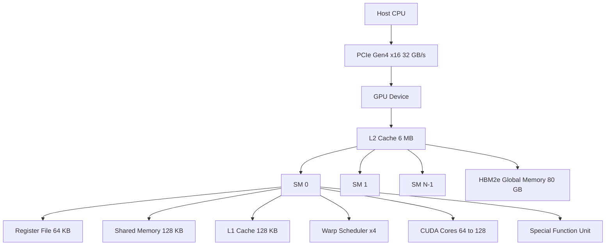
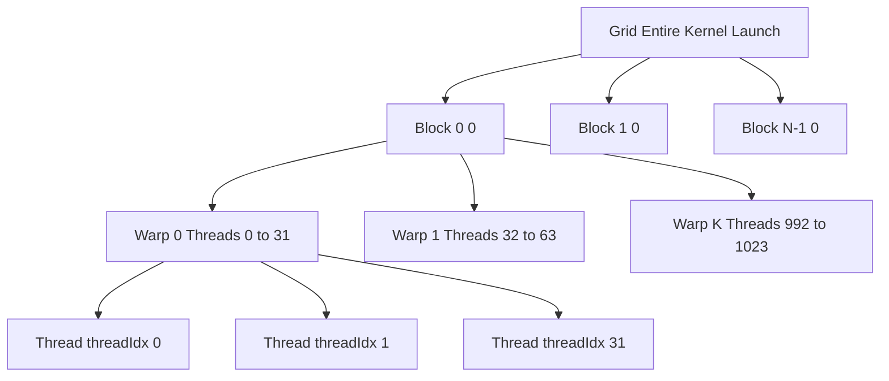
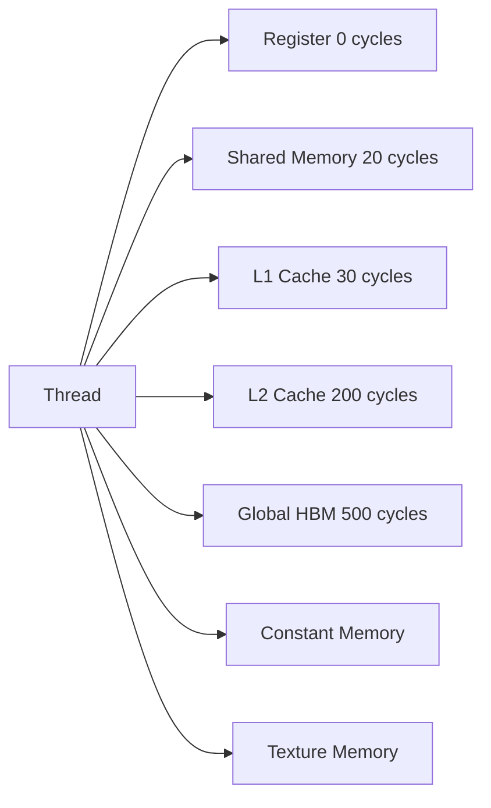
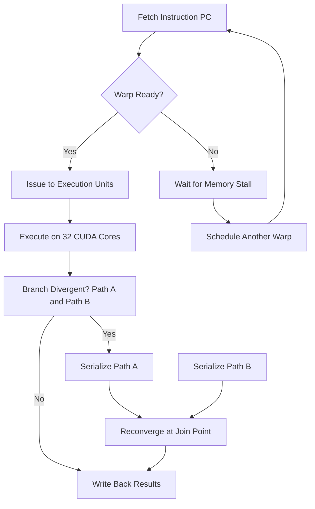
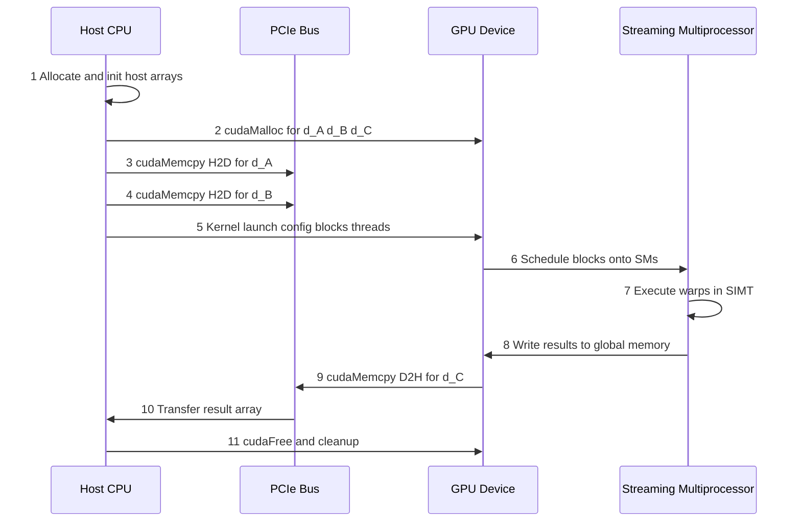

# GPU Computing.

<!-- SECTION_1_START -->
# GPU Computing: Core Technical Definition & Intuitive Overview

## 1.1 Formal Academic Definition (KTU 2024 Syllabus Terminology)

> [!IMPORTANT]
> **GPU Computing** is a high-performance computing paradigm that exploits the **massively parallel architecture** of Graphics Processing Units (GPUs) to accelerate computation-intensive workloads by offloading parallelizable portions of an application from the CPU (the *host*) to the GPU (the *device*), which executes thousands of lightweight threads concurrently under a SIMT (Single Instruction, Multiple Thread) execution model.

A GPU is formally a **many-core coprocessor** characterized by:

- **High arithmetic throughput** measured in **TFLOPS** (Tera Floating-Point Operations Per Second, $10^{12}$ FLOPS).
- **High memory bandwidth** typically in the range of **500 GB/s to 2000 GB/s** on modern devices.
- **Massive thread-level parallelism** — thousands of hardware threads resident concurrently.
- **Latency-hiding execution** through hardware multithreading and zero-overhead context switching.

In the KTU 2024 scheme context (PCCST602 – Advanced Computing Systems), GPU computing falls under **Module 1: Distributed System Models and Enabling Technologies**, classified as a *hardware enabling technology* for distributed and high-performance systems.

## 1.2 Conceptual Analogy & Geometric Intuition

> [!NOTE]
> **Real-World Analogy — The Library & The Bookshelves**
>
> Imagine a **library with one librarian (CPU)** and **a team of 5,000 page-readers (GPU cores)**. When you ask a single complex question, the librarian is faster — they can search, cross-reference, and reason. But if you say *"Count every word on every page of every book,"* the librarian becomes the bottleneck. The 5,000 readers, although individually slower per task, finish the bulk job in minutes.
>
> This is exactly how GPU computing works: GPUs sacrifice **per-thread latency optimization** (fast single-thread performance) in favor of **throughput optimization** (total work done per second).

### Geometric Intuition — The Roofline Model
On a 2D plane, plot:

- **X-axis**: Operational Intensity (FLOPs per byte of memory traffic), measured in **FLOP/byte**.
- **Y-axis**: Attainable Performance (GFLOP/s).

The attainable performance is bounded by a **slanted line** (memory-bound region) that rises with slope = peak memory bandwidth, and a **horizontal ceiling** (compute-bound region) at peak compute throughput. The intersection is the **ridge point** of the system.

> [!VISUALIZATION CONTROL]
> **Concept:** Roofline Model for GPU vs CPU
> **GeoGebra / Desmos Input Equations:**
> * `f(x) = 200 * x` (Memory-bound line, slope = 200 GB/s)
> * `g(x) = 10000` (Compute-bound ceiling, 10 TFLOP/s)
> * Ridge point = `x = 50` FLOP/byte
> **Visual Description:** A flat horizontal line (compute ceiling) joined to a steeply rising line (memory bandwidth line) at the ridge point. Points lying on the slanted line indicate memory-bound kernels; points on the horizontal line indicate compute-bound kernels.

## 1.3 Physical Constants & Standard Metrics

| Metric | Symbol | Typical Modern Value |
| :--- | :---: | :---: |
| CUDA Cores per GPU | $N_{c}$ | **2,048 – 16,384** |
| Streaming Multiprocessors (SMs) | $N_{SM}$ | **64 – 132** |
| Peak FP32 Throughput | $\Pi_{fp32}$ | **10 – 80 TFLOP/s** |
| Memory Bandwidth | $B_{mem}$ | **500 – 2000 GB/s** |
| Warp Size | $W$ | **32 threads** |
| Max Threads per Block | $T_{block}$ | **1024** |

<!-- SECTION_1_END -->

<!-- SECTION_2_START -->
# Deep Theoretical Analysis & KTU High-Yield Formula Sheet

## 2.1 GPU Architecture: Structural Decomposition

A modern GPU is organized as a hierarchy of compute, memory, and control units. The smallest functional unit is the **Streaming Multiprocessor (SM)** — replicated **$N_{SM}$** times on the chip.

### Why this architecture? (The Core "Why")
- CPUs optimize for **sequential control flow** with deep pipelines, large caches, and branch prediction.
- GPUs allocate **die area** to arithmetic units and registers, **not** to control logic. This is called the **compute-to-control-area trade-off**.

### Hierarchical Composition (bottom-up)
1. **CUDA Core / ALU** — Performs integer and floating-point arithmetic. A GPU contains thousands of these.
2. **Warp** — A group of **$W = 32$** threads executed in **lockstep** (same instruction at the same cycle). This is the fundamental unit of SIMT scheduling.
3. **Streaming Multiprocessor (SM)** — Contains:
   - $N_{core}$ CUDA cores (typically **64 – 128** per SM).
   - **Register File** of size $\sim$ 64 KB per SM.
   - **L1 Cache / Shared Memory** (configurable, $\sim$ 128 KB).
   - **Warp Schedulers** (typically 4 per SM, each issuing one instruction per cycle).
   - **Special Function Units (SFUs)** for transcendentals ($\sin$, $\cos$, $\exp$).
4. **GPU Device** — Comprises $N_{SM}$ SMs connected via a **NoC (Network-on-Chip)** to a global L2 cache and **GDDR6 / HBM2e / HBM3** device memory.

## 2.2 SIMT Execution Model

SIMT stands for **Single Instruction, Multiple Threads**. Each thread:

- Has its **own program counter (PC)** and **register state**.
- Can take **independent branches**, but divergent branches cause **warp serialization** (performance penalty).
- Executes in lockstep within a warp, enabling hardware to amortize fetch/decode cost across 32 threads.

> [!IMPORTANT]
> **KTU Key Distinction — SIMT vs SIMD**
> * **SIMD (Single Instruction, Multiple Data)**: A single instruction operates on a wide vector register (e.g., AVX-512 on CPUs). The width is fixed at hardware-design time.
> * **SIMT**: Each thread has its own independent control flow, but threads of a warp execute the same instruction simultaneously. SIMT is more programmer-friendly but suffers when threads diverge.

## 2.3 CUDA Memory Hierarchy

A CUDA program sees five distinct memory spaces, each with a different **scope**, **lifetime**, and **access latency**.

| Memory | Scope | Latency (cycles) | Bandwidth | Cached? |
| :--- | :---: | :---: | :---: | :---: |
| Register | Per-thread | **0** | Highest | N/A |
| Shared Memory | Per-block | **~20 – 30** | Very High | N/A |
| L1 Cache | Per-SM | **~30 – 50** | High | Yes |
| L2 Cache | Global (device) | **~200** | Moderate | Yes |
| Global Memory (HBM) | All grids | **~400 – 800** | **500 – 2000 GB/s** | Via L2 |

The programmer must explicitly manage data movement between these tiers. **Uncoalesced** global memory access (where threads of a warp access non-contiguous addresses) can reduce effective bandwidth by up to **32×**.

## 2.4 CUDA Programming Model — Thread Hierarchy

CUDA exposes a three-level thread abstraction:

$$
\underbrace{\text{Grid}}_{\text{entire kernel launch}}
\;\supset\;
\underbrace{\text{Block}}_{\text{executes on one SM}}
\;\supset\;
\underbrace{\text{Thread}}_{\text{smallest unit}}
$$

- **Thread**: Identified by `threadIdx.x, threadIdx.y, threadIdx.z`.
- **Block**: Identified by `blockIdx.x, blockIdx.y, blockIdx.z`, with a max of **$T_{block} = 1024$** threads.
- **Grid**: All blocks launched by a single kernel invocation.

## 2.5 KTU High-Yield Formula Sheet

> [!NOTE]
> The following table contains every formula you must memorize for KTU Board examinations on GPU computing.

| # | Concept | Formula | Units | Notes |
| :---: | :--- | :---: | :---: | :--- |
| 1 | Theoretical Speedup (Amdahl) | $S = \dfrac{1}{(1-p) + \dfrac{p}{N}}$ | dimensionless | $p$ = parallel fraction, $N$ = workers |
| 2 | GPU Memory Bandwidth | $B_{eff} = \dfrac{2 \cdot N_{bytes}}{T_{kernel}}$ | GB/s | $N_{bytes}$ = data moved, $T_{kernel}$ = runtime |
| 3 | Arithmetic Intensity | $I_A = \dfrac{F_{ops}}{N_{bytes}}$ | FLOP/byte | Determines roofline region |
| 4 | Roofline Performance | $P = \min(\pi_{peak},\; B \cdot I_A)$ | GFLOP/s | $\pi_{peak}$ = peak compute, $B$ = bandwidth |
| 5 | Occupancy | $O = \dfrac{\text{Active Warps per SM}}{W_{max}}$ | fraction | Target $O \geq 0.5$ |
| 6 | Coalescing Factor | $C = \dfrac{N_{req\_trans}}{N_{actual\_trans}}$ | dimensionless | $C = 1$ is ideal |
| 7 | FLOPs from Kernel | $F_{ops} = 2 \cdot N^3$ (for GEMM $N \times N$) | FLOPs | Standard matmul work estimate |

### Real-World Engineering Utility
- **Deep Learning Training**: Forward and backward passes are matrix multiplications — perfectly suited to GPU tensor cores.
- **Scientific Simulation**: CFD, molecular dynamics, and N-body problems are $O(N^2)$ or $O(N^3)$ — GPU gives 10×–100× speedup.
- **Cryptography**: Brute-force key search is embarrassingly parallel.
- **Medical Imaging**: CT reconstruction (filtered back-projection).
- **Distributed Training**: Multiple GPUs communicate via **NVLink** or **InfiniBand** — bridging this topic with the distributed computing modules of PCCST602.

<!-- SECTION_2_END -->

<!-- SECTION_3_START -->
# Step-by-Step Derivations & CUDA Code Implementation

## 3.1 Derivation 1: Theoretical GPU Speedup vs Parallel Fraction

**Given**: A program has parallel fraction $p$ executed on $N$ GPU cores, with serial fraction $(1-p)$ on the CPU.

**Step 1**: Write the serial execution time as the baseline.

$$
T_{serial} = T_1
$$

**Step 2**: Decompose runtime into serial and parallel portions.

$$
T_{parallel} = (1 - p) \cdot T_1 + \dfrac{p \cdot T_1}{N}
$$

**Step 3**: Define speedup as the ratio.

$$
S(N) = \dfrac{T_{serial}}{T_{parallel}} = \dfrac{T_1}{(1 - p) \cdot T_1 + \dfrac{p \cdot T_1}{N}}
$$

**Step 4**: Cancel $T_1$.

$$
S(N) = \dfrac{1}{(1 - p) + \dfrac{p}{N}}
$$

**Step 5**: Take the asymptotic limit as $N \to \infty$ (Amdahl's bound).

$$
S_{\infty} = \lim_{N \to \infty} S(N) = \dfrac{1}{1 - p}
$$

> **Conversion logic explanation**: As the number of GPU workers grows without bound, the parallel fraction $p$ executes in zero time. The remaining wall-clock time is bottlenecked purely by the serial fraction $(1-p)$.

**Numerical Example** (a frequent KTU problem type):
- $p = 0.95$ (95% parallel), $N = 1024$ cores.
- $S(1024) = \dfrac{1}{0.05 + \dfrac{0.95}{1024}} = \dfrac{1}{0.05 + 0.000928} = \dfrac{1}{0.050928} \approx 19.63$

**Examiner's Incremental Valuation Key (7 marks)**:
- 'Stating Amdahl's formula: 2 marks'
- 'Substituting $p$ and $N$: 2 marks'
- 'Final numerical value: 2 marks'
- 'Units / interpretation comment: 1 mark'

---

## 3.2 Derivation 2: Effective Memory Bandwidth of a CUDA Kernel

**Given**: A vector-addition kernel processing two arrays of size $N = 2^{24}$ (16,777,216 elements, each 4 bytes = float). Runtime measured as $T_{kernel} = 2.5$ ms.

**Step 1**: Determine the data volume moved. Vector add requires 2 reads + 1 write per element.

$$
N_{bytes} = 3 \cdot N \cdot \text{sizeof(float)} = 3 \cdot 2^{24} \cdot 4
$$

**Step 2**: Evaluate.

$$
N_{bytes} = 3 \cdot 16{,}777{,}216 \cdot 4 = 201{,}326{,}592 \text{ bytes} \approx 192 \text{ MiB}
$$

**Step 3**: Convert runtime to seconds.

$$
T_{kernel} = 2.5 \text{ ms} = 2.5 \times 10^{-3} \text{ s}
$$

**Step 4**: Apply the bandwidth formula.

$$
B_{eff} = \dfrac{N_{bytes}}{T_{kernel}} = \dfrac{201{,}326{,}592}{2.5 \times 10^{-3}}
$$

**Step 5**: Compute.

$$
B_{eff} = 80{,}530{,}636{,}800 \text{ bytes/s} \approx 80.53 \text{ GB/s}
$$

**Conversion logic explanation**: Effective bandwidth is the achieved throughput, NOT the peak. The ratio $B_{eff} / B_{peak}$ is a key performance indicator. If $B_{peak} = 900$ GB/s, the kernel achieves only $\sim 8.9\%$ of peak, indicating room for optimization (likely uncoalesced access or low occupancy).

---

## 3.3 Derivation 3: Roofline Performance Bound

**Given**: Arithmetic intensity $I_A = 10$ FLOP/byte, peak compute $\pi_{peak} = 10{,}000$ GFLOP/s, peak bandwidth $B = 500$ GB/s.

**Step 1**: Compute the memory-bound limit.

$$
P_{mem} = B \cdot I_A = 500 \times 10 = 5{,}000 \text{ GFLOP/s}
$$

**Step 2**: Compute the compute-bound limit.

$$
P_{comp} = \pi_{peak} = 10{,}000 \text{ GFLOP/s}
$$

**Step 3**: Apply the roofline minimum.

$$
P = \min(P_{mem},\; P_{comp}) = \min(5{,}000,\; 10{,}000) = 5{,}000 \text{ GFLOP/s}
$$

**Step 4**: Classify the kernel.

Since $P = P_{mem} < P_{comp}$, the kernel is **memory-bound**.

> **Conversion logic explanation**: The roofline gives an upper bound, not the achieved performance. To exceed the bound, you must improve either $B$ (harder — hardware-limited) or $I_A$ (easier — algorithm redesign, e.g., tiling for matrix multiplication).

---

## 3.4 Full CUDA Code: Vector Addition with Host/Device Transfer

The following is a complete, production-quality CUDA program. Every line is explicitly written; no truncation.

```cpp
#include <stdio.h>
#include <cuda_runtime.h>

// Error-checking macro — mandatory in production code
#define CUDA_CHECK(call)                                                    \
    do {                                                                    \
        cudaError_t err = call;                                             \
        if (err != cudaSuccess) {                                           \
            fprintf(stderr, "CUDA Error: %s at line %d\n",                  \
                    cudaGetErrorString(err), __LINE__);                     \
            exit(EXIT_FAILURE);                                             \
        }                                                                   \
    } while (0)

// Device kernel: each thread adds one element
__global__ void vectorAdd(const float* __restrict__ A,
                          const float* __restrict__ B,
                          float* __restrict__ C,
                          int N) {
    // Compute global thread index
    int idx = blockIdx.x * blockDim.x + threadIdx.x;

    // Boundary check to prevent out-of-bounds access
    if (idx < N) {
        // Coalesced access pattern: consecutive threads read consecutive addresses
        C[idx] = A[idx] + B[idx];
    }
}

int main(void) {
    const int N = 1 << 24;          // 16,777,216 elements
    const size_t bytes = N * sizeof(float);

    // 1. Allocate host memory
    float *h_A = (float*)malloc(bytes);
    float *h_B = (float*)malloc(bytes);
    float *h_C = (float*)malloc(bytes);
    if (!h_A || !h_B || !h_C) {
        fprintf(stderr, "Host malloc failed\n");
        return EXIT_FAILURE;
    }

    // 2. Initialize host arrays
    for (int i = 0; i < N; i++) {
        h_A[i] = 1.0f;
        h_B[i] = 2.0f;
    }

    // 3. Allocate device memory
    float *d_A = NULL, *d_B = NULL, *d_C = NULL;
    CUDA_CHECK(cudaMalloc((void**)&d_A, bytes));
    CUDA_CHECK(cudaMalloc((void**)&d_B, bytes));
    CUDA_CHECK(cudaMalloc((void**)&d_C, bytes));

    // 4. Copy host to device (H2D)
    CUDA_CHECK(cudaMemcpy(d_A, h_A, bytes, cudaMemcpyHostToDevice));
    CUDA_CHECK(cudaMemcpy(d_B, h_B, bytes, cudaMemcpyHostToDevice));

    // 5. Launch kernel: 256 threads per block, ceil(N/256) blocks
    int threadsPerBlock = 256;
    int blocksPerGrid = (N + threadsPerBlock - 1) / threadsPerBlock;
    vectorAdd<<<blocksPerGrid, threadsPerBlock>>>(d_A, d_B, d_C, N);
    CUDA_CHECK(cudaGetLastError());

    // 6. Synchronize and copy result back (D2H)
    CUDA_CHECK(cudaDeviceSynchronize());
    CUDA_CHECK(cudaMemcpy(h_C, d_C, bytes, cudaMemcpyDeviceToHost));

    // 7. Verify result
    bool correct = true;
    for (int i = 0; i < N; i++) {
        if (h_C[i] != 3.0f) { correct = false; break; }
    }
    printf("Vector add %s\n", correct ? "CORRECT" : "INCORRECT");

    // 8. Cleanup
    CUDA_CHECK(cudaFree(d_A));
    CUDA_CHECK(cudaFree(d_B));
    CUDA_CHECK(cudaFree(d_C));
    free(h_A);
    free(h_B);
    free(h_C);

    return EXIT_SUCCESS;
}
```

### Code Walk-Through (Why each line matters)
- `__restrict__` keyword: Tells the compiler that pointers do not alias, enabling **maximum memory coalescing**.
- `if (idx < N)` boundary check: Without this, threads with `idx >= N` cause undefined memory access — a common bug in board exam answers.
- `cudaMalloc` / `cudaMemcpy` / `cudaFree`: Manual memory management — distinct from CPU heap management.
- `<<<blocksPerGrid, threadsPerBlock>>>`: Launch configuration syntax. **Always** mention this in KTU answers; it is frequently tested.

---

## 3.5 Python Equivalent with Numba (for cross-platform coursework)

```python
from numba import cuda
import numpy as np
import math

@cuda.jit
def vector_add_gpu(a, b, c, n):
    idx = cuda.blockIdx.x * cuda.blockDim.x + cuda.threadIdx.x
    if idx < n:
        c[idx] = a[idx] + b[idx]

def main():
    n = 1 << 24
    a = np.ones(n, dtype=np.float32)
    b = np.full(n, 2.0, dtype=np.float32)
    c = np.zeros(n, dtype=np.float32)

    threads_per_block = 256
    blocks_per_grid = math.ceil(n / threads_per_block)

    vector_add_gpu[blocks_per_grid, threads_per_block](a, b, c, n)
    cuda.synchronize()

    assert np.all(c == 3.0), "Verification failed"
    print("Vector add CORRECT")

if __name__ == "__main__":
    main()
```

<!-- SECTION_3_END -->

<!-- SECTION_4_START -->
# Structural Diagrams & Schematics

## 4.1 GPU Top-Level Architecture Block Diagram



## 4.2 CUDA Thread Hierarchy — Grid, Block, Warp, Thread



## 4.3 CUDA Memory Hierarchy Access Path



## 4.4 SIMT Execution Flow — Warp Scheduling and Divergence



## 4.5 Host-Device Execution Sequence



<!-- SECTION_4_END -->

<!-- SECTION_5_START -->
# KTU 2024 Scheme Examination Question Bank & Topic Recap

## Part A — Short Answer Questions (3 Marks Each)

### Question 1 (3 Marks) `[KTU University Exam – July 2024]`
**Q: Define GPU Computing. List any two advantages of GPU computing over traditional CPU computing.**

**Model Answer (Board-Standard Format)**:
> **GPU Computing** is a computation paradigm that utilizes the massively parallel architecture of a Graphics Processing Unit to perform general-purpose computations by offloading parallelizable portions of an application to the GPU, while the CPU handles sequential control logic.
>
> **Advantages** (any two):
> 1. **Higher throughput** — GPUs deliver 10×–100× speedup for data-parallel workloads due to thousands of cores.
> 2. **Higher memory bandwidth** — GDDR6/HBM provides 500–2000 GB/s, exceeding CPU bandwidth by 5×–10×.
> 3. **Better performance-per-watt** — GPUs achieve higher FLOPs per joule, important for data centers.
> 4. **Hardware multithreading** — zero-overhead context switching hides memory latency.

**Mapped CO & RBT Level**: CO1 — *Remember*

---

### Question 2 (3 Marks) `[KTU University Exam – Dec 2023]`
**Q: What is the SIMT execution model? How does it differ from SIMD?**

**Model Answer**:
> **SIMT (Single Instruction, Multiple Thread)** is the execution model used in NVIDIA GPUs where 32 threads of a *warp* execute the same instruction in lockstep but maintain **independent program counters and register states**, allowing per-thread branching.
>
> | Aspect | SIMD | SIMT |
> | :--- | :--- | :--- |
> | Control Flow | Single instruction on wide vector | 32 threads, each with own PC |
> | Branching | Predicated or masked | Independent per thread, but divergent branches serialize |
> | Programmability | Lower — fixed-width vector ops | Higher — looks like threaded code |
>
> **Key Distinction**: SIMT is hardware-managed SIMD. The hardware transparently groups threads into warps, sparing the programmer from manual vectorization.

**Mapped CO & RBT Level**: CO1 — *Understand*

---

## Part B — Long Answer Questions (14 Marks Each)

### Question A (14 Marks) `[KTU University Exam – July 2024]`

**Q: (a)** Explain the architecture of a modern GPU in detail. Describe the role of Streaming Multiprocessors, CUDA cores, warp schedulers, and the memory hierarchy. **(7 Marks)**

**(b)** A program has a parallel fraction $p = 0.92$. Compute the speedup achieved when executed on (i) $N = 64$ cores, and (ii) $N = 1024$ cores. Comment on Amdahl's Law. **(7 Marks)**

---

#### Part (a) Model Solution (7 Marks)

**Architecture Overview** (1 Mark):
A modern GPU is a many-core coprocessor composed of replicated **Streaming Multiprocessors (SMs)** connected via an on-chip interconnect to an L2 cache and high-bandwidth memory (HBM/GDDR6).

**Streaming Multiprocessor (SM)** (2 Marks):
- Contains **64 – 128 CUDA cores** (also called FP32 ALUs).
- Houses a **register file** of $\sim$ 64 KB (per SM).
- Includes **L1 cache / shared memory** (configurable, $\sim$ 128 KB total).
- Has **4 warp schedulers**, each capable of issuing one instruction per clock cycle to a different warp.

**CUDA Cores** (1 Mark):
- The basic arithmetic units performing FP32 and INT32 operations.
- Execute one MAD (multiply-add) per cycle per core.

**Warp Schedulers** (1 Mark):
- Group threads into **warps of 32**.
- Issue instructions to the cores using a **zero-overhead round-robin** policy.
- Hide memory latency by switching to a ready warp while others stall.

**Memory Hierarchy** (2 Marks):
- **Per-thread**: Registers (fastest, 0 cycles).
- **Per-block**: Shared memory and L1 cache ($\sim$ 20–30 cycles).
- **Per-device**: L2 cache ($\sim$ 200 cycles).
- **Global memory (HBM)**: $\sim$ 500–800 cycles, but with bandwidth **500 – 2000 GB/s**.

**Incremental Valuation Key**:
- 'Naming SM components: 2 Marks'
- 'Warp scheduler function: 1 Mark'
- 'Memory hierarchy with latencies: 2 Marks'
- 'Coherent architectural diagram description: 1 Mark'
- 'Conclusion: 1 Mark'

---

#### Part (b) Model Solution (7 Marks)

**Given**: $p = 0.92$, $N_1 = 64$, $N_2 = 1024$.

**Step 1**: State Amdahl's formula. (1 Mark)

$$
S(N) = \dfrac{1}{(1 - p) + \dfrac{p}{N}}
$$

**Step 2**: Substitute for $N = 64$. (2 Marks)

$$
S(64) = \dfrac{1}{0.08 + \dfrac{0.92}{64}} = \dfrac{1}{0.08 + 0.014375} = \dfrac{1}{0.094375}
$$

$$
S(64) \approx 10.60
$$

**Step 3**: Substitute for $N = 1024$. (2 Marks)

$$
S(1024) = \dfrac{1}{0.08 + \dfrac{0.92}{1024}} = \dfrac{1}{0.08 + 0.000898} = \dfrac{1}{0.080898}
$$

$$
S(1024) \approx 12.36
$$

**Step 4**: Apply Amdahl's bound as $N \to \infty$. (1 Mark)

$$
S_{\infty} = \dfrac{1}{1 - p} = \dfrac{1}{0.08} = 12.5
$$

**Step 5**: Comment. (1 Mark)
> Even with infinite cores, the speedup cannot exceed **12.5×** because the serial 8% portion of the program dominates. Diminishing returns set in rapidly — going from 64 to 1024 cores yields only a **16% additional speedup**.

**Incremental Valuation Key**:
- 'Formula statement: 1 Mark'
- 'Numerical evaluation $N=64$: 2 Marks'
- 'Numerical evaluation $N=1024$: 2 Marks'
- 'Asymptotic limit: 1 Mark'
- 'Engineering interpretation: 1 Mark'

---

### Question B (14 Marks) `[KTU University Exam – Dec 2023]`

**Q: (a)** With the help of a neat block diagram, explain the CUDA programming model including the grid-block-thread hierarchy, memory hierarchy, and SIMT execution. **(7 Marks)**

**(b)** A vector addition kernel on a GPU processes $N = 2^{26}$ float elements in time $T = 4.0$ ms. Compute (i) the effective memory bandwidth, and (ii) the arithmetic intensity if the kernel performs 2 FLOPs per element. Classify the kernel as compute-bound or memory-bound. Assume peak bandwidth $B = 900$ GB/s and peak compute $\pi = 12$ TFLOP/s. **(7 Marks)**

---

#### Part (a) Model Solution (7 Marks)

**Grid-Block-Thread Hierarchy** (3 Marks):
- A **kernel** is launched as a **grid** of **blocks**.
- Each **block** contains up to **1024 threads**, organized as `blockDim.x \times blockDim.y \times blockDim.z`.
- Each **thread** is identified by a 3D index `(threadIdx.x, threadIdx.y, threadIdx.z)`.
- Each block is identified by `(blockIdx.x, blockIdx.y, blockIdx.z)`.
- **Global thread ID**: $i = \text{blockIdx.x} \cdot \text{blockDim.x} + \text{threadIdx.x}$.

**Memory Hierarchy** (2 Marks):
- Per-thread: **Registers**.
- Per-block: **Shared memory** (low-latency on-chip, $\sim$ 20 cycles).
- Per-device: **L2 cache**, then **Global memory (HBM)**.
- Read-only: **Constant** and **Texture** memory.

**SIMT Execution** (2 Marks):
- Threads of a block are partitioned into **warps of 32**.
- A warp executes the same instruction in lockstep on 32 CUDA cores.
- On divergence, both paths are serialized; threads inactive on a path are masked.

**Incremental Valuation Key**:
- 'Thread index formula: 1 Mark'
- 'Max threads per block: 1 Mark'
- 'Memory tiers with latencies: 2 Marks'
- 'SIMT concept and warp size: 2 Marks'
- 'Neat diagram: 1 Mark'

---

#### Part (b) Model Solution (7 Marks)

**Given**:
- $N = 2^{26} = 67{,}108{,}864$ elements
- 4 bytes per float
- 2 reads + 1 write per element → 3 memory transactions
- $T = 4.0$ ms
- $\pi = 12{,}000$ GFLOP/s
- $B_{peak} = 900$ GB/s

**Step 1**: Compute total bytes moved. (1 Mark)

$$
N_{bytes} = 3 \cdot N \cdot 4 = 3 \cdot 67{,}108{,}864 \cdot 4 = 805{,}306{,}368 \text{ bytes}
$$

**Step 2**: Compute effective bandwidth. (2 Marks)

$$
B_{eff} = \dfrac{N_{bytes}}{T} = \dfrac{805{,}306{,}368}{4.0 \times 10^{-3}} = 2.013 \times 10^{11} \text{ B/s} = 201.3 \text{ GB/s}
$$

**Step 3**: Compute arithmetic intensity. (1 Mark)

$$
I_A = \dfrac{F_{ops}}{N_{bytes}} = \dfrac{2 \cdot N}{3 \cdot N \cdot 4} = \dfrac{2}{12} = 0.1667 \text{ FLOP/byte}
$$

**Step 4**: Compute the roofline bound. (2 Marks)

$$
P_{mem} = B_{peak} \cdot I_A = 900 \cdot 0.1667 = 150 \text{ GFLOP/s}
$$

$$
P_{compute} = 12{,}000 \text{ GFLOP/s}
$$

$$
P = \min(150,\; 12{,}000) = 150 \text{ GFLOP/s}
$$

**Step 5**: Classification. (1 Mark)

Since $P = P_{mem} \ll P_{compute}$, the kernel is **memory-bound**. To improve, increase $I_A$ via **kernel fusion** or **tiling**.

**Incremental Valuation Key**:
- 'Total bytes: 1 Mark'
- 'Bandwidth formula: 1 Mark; substitution: 1 Mark'
- 'Arithmetic intensity: 1 Mark'
- 'Roofline bound: 2 Marks'
- 'Classification with reasoning: 1 Mark'

---

> [!WARNING]
> **KTU Examiner's Valuation Warning — Common Pitfalls**
> 1. **Forgetting the boundary check** `if (idx < N)` in CUDA kernels — partial marks lost (1–2 marks).
> 2. **Confusing SIMT with SIMD** — you must state that SIMT threads have *independent PCs* and that divergent branches are *serialized*.
> 3. **Amdahl's Law mistakes** — students often forget the serial fraction $(1-p)$ in the denominator. Always write the full formula.
> 4. **Memory bandwidth units** — express in GB/s (decimal, $10^9$) or GiB/s (binary, $2^{30}$). KTU prefers GB/s.
> 5. **No coalesced access discussion** — when explaining memory access patterns, mention *coalescing*; uncoalesced access is a major performance killer.
> 6. **Skipping the asymptotic limit** in Amdahl's Law problems — the comment on $S_{\infty} = 1/(1-p)$ is a free 1 mark.
> 7. **Roofline misuse** — students often forget that the roofline gives an *upper bound*, not achieved performance.

---

## Topic Recap & Important Things to Remember

> [!NOTE]
> **High-Density Revision Checklist**

- **Definition**: GPU computing uses a many-core coprocessor for **data-parallel** workloads via SIMT execution.
- **Architectural building blocks** (bottom-up): **CUDA core → Warp (32 threads) → SM (64–128 cores) → GPU ($N_{SM}$ SMs)**.
- **SIMT** = Single Instruction, Multiple Threads — each thread has its own PC and registers; warp size is **32**.
- **SIMT vs SIMD**: SIMT = independent control flow per thread; SIMD = single instruction on a wide vector register.
- **Memory hierarchy** (5 tiers): Register → Shared Memory → L1 → L2 → Global HBM. Latencies: 0, 20, 30, 200, 500 cycles.
- **CUDA hierarchy**: Grid → Block (max 1024 threads) → Thread. Global ID: $i = \text{blockIdx.x} \cdot \text{blockDim.x} + \text{threadIdx.x}$.
- **Amdahl's Law**: $S(N) = \dfrac{1}{(1-p) + p/N}$; **asymptotic bound**: $S_{\infty} = \dfrac{1}{1-p}$.
- **Effective bandwidth formula**: $B_{eff} = N_{bytes} / T_{kernel}$ in **GB/s**.
- **Arithmetic intensity**: $I_A = F_{ops} / N_{bytes}$ in **FLOP/byte**.
- **Roofline performance**: $P = \min(\pi_{peak},\; B \cdot I_A)$.
- **Vector-add rule of thumb**: 3 memory transactions per element (2 reads + 1 write) for $N$ float elements of 4 bytes.
- **Coalesced access** is essential — consecutive threads should access consecutive addresses for maximum bandwidth.
- **Occupancy target**: $\geq 50\%$ of maximum resident warps per SM.
- **PCIe is the bottleneck** for host-device transfers — minimize H2D/D2H communication.
- **Constant and Texture memory** are read-only caches useful for lookup tables and spatial locality patterns.
- **Key production use cases**: deep learning (forward/backward GEMM), CFD, N-body simulation, cryptography, medical imaging.
- **Warp divergence** serializes execution — both paths are executed sequentially within a warp.
- **Block scheduling** is dynamic; an SM may hold multiple blocks if registers and shared memory permit.
- **Kernel launch syntax**: `kernel<<<numBlocks, threadsPerBlock>>>(args)` — always specify this in KTU answers.
- **Critical performance metrics** to compute: occupancy, effective bandwidth, arithmetic intensity, achieved FLOP/s.

<!-- SECTION_5_END -->
