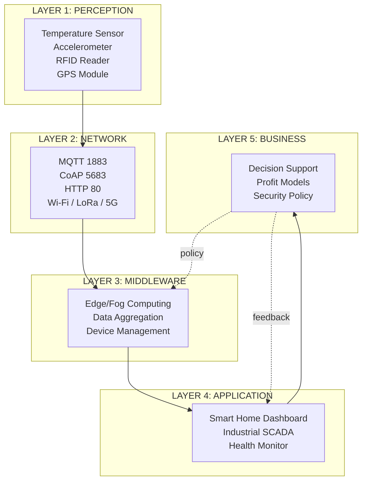
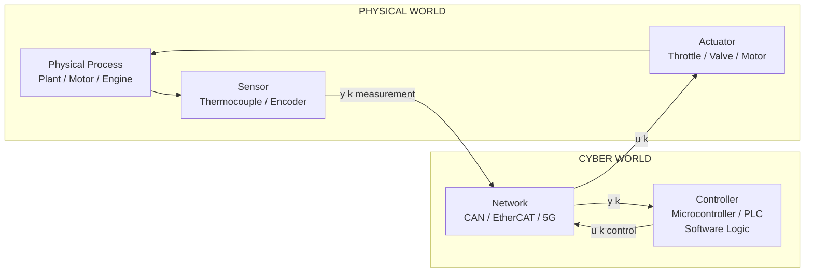
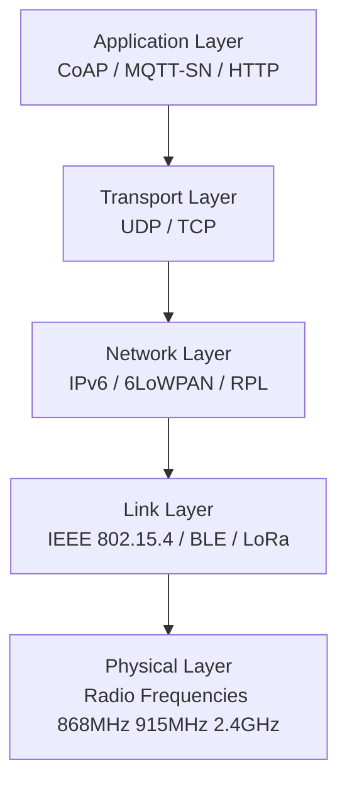
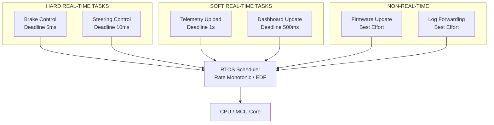
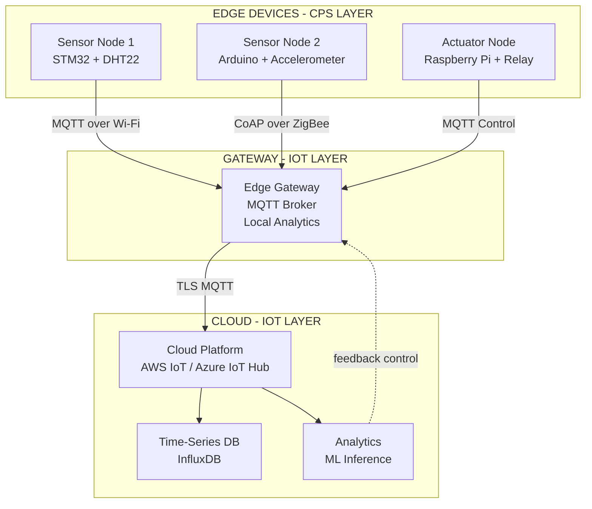
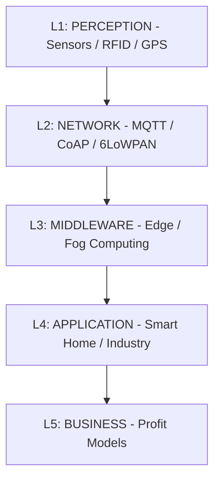
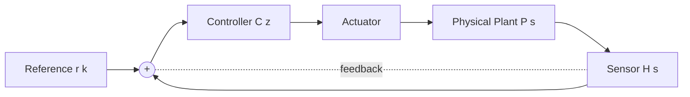

# IoT and Cyber Physical systems.

<!-- SECTION_1_START -->
# Module 1 — IoT and Cyber-Physical Systems (CPS)

## 1.1 Internet of Things (IoT) — Formal Definition

> [!NOTE]
> **KTU 2024 Syllabus Definition:**
> The **Internet of Things (IoT)** is a pervasive, distributed computing paradigm that interconnects uniquely identifiable physical and virtual "Things" (sensors, actuators, RFID tags, smartphones, vehicles, appliances) through the existing Internet infrastructure, enabling them to sense, collect, exchange, and act upon data with minimal human intervention, governed by standardized communication protocols (CoAP, MQTT, HTTP, AMQP) and information schemes (IPv6, 6LoWPAN, RPL).

In the **KTU 2024 Scheme**, IoT is positioned as a key **enabling technology** that bridges the *physical world* (sensors/actuators) with the *cyber world* (cloud/edge analytics), forming the perception layer of modern distributed systems.

### Conceptual Analogy / Intuition

> [!IMPORTANT]
> **🧠 Think of IoT like a "Nervous System" of a building.**
> Your body has **sensors** (skin, eyes, ears) that detect stimuli, **nerves** (network) that carry signals, and a **brain** (cloud/server) that decides what to do. Finally, **muscles** (actuators) execute actions. IoT is exactly this: sensors → network → compute → actuator. The "things" are the organs, the Internet is the nervous system, and analytics is the brain.

### Physical Constants / Standard Metrics

| Metric | Standard Value | Context |
| :--- | :--- | :--- |
| **IEEE 802.15.4 Data Rate** | **250 kbps** | Low-rate WPAN (ZigBee, 6LoWPAN) |
| **LoRa Range** | **2–15 km** | Long-range IoT |
| **MQTT Header Size** | **2 bytes minimum** | Lightweight pub/sub |
| **6LoWPAN MTU** | **127 bytes** | IPv6 over Low-Power networks |
| **Typical IoT Sleep Current** | **< 1 µA** | Battery-operated nodes |

---

## 1.2 Cyber-Physical System (CPS) — Formal Definition

> [!NOTE]
> **KTU 2024 Syllabus Definition:**
> A **Cyber-Physical System (CPS)** is an engineered, integrated, tightly coupled system whose operations are monitored, coordinated, controlled, and integrated by a *computation and communication core* (cyber) embedded within *physical processes* (physical). The cyber and physical components interact continuously via feedback loops with bidirectional information flow.

The **core distinction** in KTU's framing:
- **IoT** = data-centric (sense → transmit → store → analyze)
- **CPS** = control-centric (sense → analyze → **decide → actuate** in real-time, with feedback)

### Conceptual Analogy / Intuition

> [!IMPORTANT]
> **🚗 Think of a CPS as an "Autonomous Cruise Control System" in a car.**
> The **radar sensor** (physical) measures distance to the vehicle ahead. The **microcontroller** (cyber) computes the safe speed using a control law $u(t) = K_p \cdot e(t) + K_i \int e(t)\,dt$ (cyber). The **throttle actuator** (physical) adjusts engine power. The cycle repeats thousands of times per second. **That tight, real-time feedback loop is what makes it a CPS** — not merely an IoT dashboard.

### Key CPS Properties (KTU Highlight)

- **Heterogeneity** — physical processes + computational processes
- **Concurrency** — multiple physical and cyber threads
- **Real-time constraints** — bounded latency (hard vs soft)
- **Feedback loops** — closed-loop control
- **Reliability & Safety** — fault tolerance, fail-safe behavior

> [!VISUALIZATION CONTROL]
> **Concept:** IoT vs CPS information flow topology
> **Coordinate Mapping (custom schema):**
> * Node A = `Sensor`, Node B = `Edge`, Node C = `Cloud`, Node D = `Actuator`
> * Edge A→B = `Sensing Path`, Edge B→C = `Transmit`, Edge C→D = `Control Path`, Edge D→A = `Feedback`
> **Visual Description:** Two coupled loops. The **outer loop** (A→B→C) is *IoT* (data flow only). The **inner loop** (C→D→A) is *CPS feedback* (control flow). The intersection of both loops is what defines a modern Cyber-Physical IoT system.

---

## 1.3 Relationship & Mapping (KTU Examinable)

| Aspect | IoT | CPS |
| :--- | :--- | :--- |
| **Primary Goal** | Data acquisition & sharing | Real-time control & autonomy |
| **Time-Criticality** | Best-effort (seconds–minutes) | Hard/Soft real-time (ms–µs) |
| **Core Component** | Things + Internet | Computation + Physical Process |
| **Feedback Loop** | Open (sense → store) | **Closed (sense → act → sense)** |
| **Example** | Smart home temperature logging | Anti-lock Braking System (ABS) |
| **Standards Body** | IETF, IEEE, oneM2M | NIST, NSF, ISO/IEC |

> [!IMPORTANT]
> **KTU 2024 Note:** A system can be **both IoT AND CPS** simultaneously. Example: A *smart grid* is an IoT system (meter data) **and** a CPS (load balancing controllers). The KTU module deliberately groups them because modern distributed systems use **IoT as the perception layer** of a **CPS architecture**.

<!-- SECTION_1_END -->

<!-- SECTION_2_START -->
# Module 1 — Deep Theoretical Analysis & KTU Formula Sheet

## 2.1 IoT — Layered Reference Architecture (KTU High-Yield)

The KTU 2024 syllabus emphasizes the **three-layer** and **five-layer** IoT architectural models. The **five-layer model** is the de-facto teaching standard.

### Layered Breakdown

1. **Perception / Sensing Layer (Layer 1)**
   - Physical sensors, RFID readers, GPS, accelerometers
   - Converts physical phenomena → electrical/digital signals
   - Sampling rate: $f_s$ (Hz), Resolution: $n$ bits → Quantization levels: $2^n$

2. **Network / Transport Layer (Layer 2)**
   - Communication technologies: Wi-Fi, ZigBee, LoRaWAN, 5G, NB-IoT
   - Protocols: **MQTT** (pub/sub), **CoAP** (RESTful over UDP), **HTTP/REST**
   - Gateway devices aggregate sensor data

3. **Middleware / Processing Layer (Layer 3)**
   - Edge/Fog computing nodes
   - Data filtering, aggregation, simple analytics
   - Service management, device management

4. **Application Layer (Layer 4)**
   - Domain-specific applications (smart home, health monitoring, industrial)
   - Visualization, dashboards, alerting

5. **Business Layer (Layer 5)**
   - High-level decision-making, profit models
   - Manages overall system, privacy, security policy

### IoT Communication Protocols — KTU Cheat Sheet

> [!IMPORTANT]
> The following table is **high-yield** for KTU exams. Memorize the port numbers and key characteristics.

| Protocol | Transport | Port | Pattern | Use Case |
| :--- | :--- | :--- | :--- | :--- |
| **MQTT** | TCP | **1883** / 8883 (TLS) | Publish/Subscribe | Constrained devices |
| **CoAP** | UDP | **5683** | Request/Response (REST-like) | Lossy networks |
| **HTTP/REST** | TCP | **80** / 443 | Request/Response | Web-based IoT |
| **AMQP** | TCP | **5672** | Pub/Sub + Queues | Enterprise messaging |
| **DDS** | UDP/TCP | — | Real-time pub/sub | Industrial IoT, CPS |
| **XMPP** | TCP | **5222** | XML messaging | IoT chat/presence |

### IoT Addressing — Key Formulas

> [!NOTE]
> **6LoWPAN Encapsulation Overhead:**
> Given an IPv6 packet of size $S_{IPv6}$ bytes being transmitted over IEEE 802.15.4 with **maximum frame payload = 127 bytes**, the number of fragments $N_f$ required is:
>
> $$ N_f = \left\lceil \frac{S_{IPv6} + \text{Header}_{6LoWPAN}}{127 - \text{Header}_{MAC}} \right\rceil $$
>
> where Header$_{6LoWPAN}$ = 1–2 bytes dispatch + 40 bytes IPv6 (compressed) + 8 bytes UDP.

---

## 2.2 Cyber-Physical Systems — Core Theoretical Framework

### The CPS Control Loop

A CPS is governed by a **closed-loop control equation**. In the continuous-time (analog) domain:

$$ \dot{x}(t) = f\bigl(x(t),\, u(t),\, w(t)\bigr) $$
$$ y(t) = g\bigl(x(t),\, v(t)\bigr) $$

where:
- $x(t) \in \mathbb{R}^n$ — **state vector** (cyber representation of physical state)
- $u(t) \in \mathbb{R}^m$ — **control input** (cyber → physical, via actuator)
- $w(t)$ — **process disturbance**
- $y(t)$ — **measured output** (sensor reading)
- $f$ — **state transition function** (physical dynamics)
- $g$ — **observation function** (sensor model)
- $v(t)$ — **sensor noise**

In **discrete-time** (digital CPS — what microcontrollers actually run):

$$ x[k+1] = A\,x[k] + B\,u[k] $$
$$ y[k] = C\,x[k] + D\,u[k] $$

where $A, B, C, D$ are the **state-space matrices**. This is the **canonical CPS discrete model** and appears in KTU module 1 problems.

### The KTU CPS Lifecycle Model

> [!IMPORTANT]
> **CPS is not just hardware + software. It is a 4-stage integrated cycle:**
>
> **Physical Process ⇄ Sensors ⇄ Cyber Computation ⇄ Actuators ⇄ (back to Physical)**
>
> This loop must execute within the **hard deadline** $T_d$. Missing $T_d$ is a **system failure** (not just performance degradation).

### CPS vs IoT — Mathematical Distinction (Examinable)

The **real-time constraint** of a CPS is formalized as:

$$ \forall k \in \mathbb{N}: \quad t_{actuation}(k) - t_{sense}(k) \le T_d $$

For an IoT system, the equivalent constraint is **best-effort**:

$$ E[\,t_{arrival}\,] \le T_{soft} \quad \text{(soft deadline, statistical)} $$

> **This mathematical distinction is a frequently-asked KTU question.**

---

## 2.3 KTU Formula Sheet (Consolidated)

| # | Concept | Formula / Rule | Unit |
| :--- | :--- | :--- | :--- |
| 1 | Sampling Rate (Nyquist) | $f_s \ge 2 \cdot f_{max}$ | Hz |
| 2 | Quantization Levels | $L = 2^n$ | levels |
| 3 | Signal-to-Quantization-Noise | $\text{SQNR} = 6.02\,n + 1.76$ | dB |
| 4 | 6LoWPAN Fragments | $N_f = \lceil (S_{IPv6} + 40 + 1)/(127 - 25)\rceil$ | integer |
| 5 | MQTT Topic Wildcard | `+` (single level), `#` (multi-level) | — |
| 6 | CoAP Code Class | `[0,4]$` = Client Error, $[2,0]$ = Success | — |
| 7 | CPS Discrete State Update | $x[k+1] = Ax[k] + Bu[k]$ | — |
| 8 | CPS Real-Time Deadline | $t_{act} - t_{sense} \le T_d$ | seconds |
| 9 | IoT Gateway Latency Budget | $L_{total} = L_{sensing} + L_{transmit} + L_{process} + L_{actuation}$ | ms |
| 10 | CPS Stability (Lyapunov) | $\dot{V}(x) < 0 \;\; \forall\, x \ne 0$ | — |

> [!TIP]
> Formulas 1, 2, 3, 7, and 8 appear most frequently in KTU End-Semester Examinations. Learn these first.

---

## 2.4 Real-World Engineering Utility

- **Smart Manufacturing (Industry 4.0)**: CPS-based robotic assembly lines with **< 1 ms** control loop latency.
- **Healthcare**: IoT-enabled pacemakers are simultaneously IoT (telemetry) and CPS (closed-loop cardiac pacing).
- **Smart Grid**: CPS for load balancing + IoT for metering — combined in the **NIST CPS Framework**.
- **Autonomous Vehicles**: CPS for steering/throttle/brake + IoT for V2X (Vehicle-to-Everything) communication.
- **Precision Agriculture**: IoT soil sensors → CPS-controlled irrigation valves.

<!-- SECTION_2_END -->

<!-- SECTION_3_START -->
# Module 1 — Derivations, Code Implementation & Worked Examples

## 3.1 Worked Example 1: IoT Sensor Data Quantization (KTU-style)

**Problem:** A temperature sensor produces a continuous analog signal in the range $[0^\circ C,\; 100^\circ C]$. It is digitized by an ADC with $n = 10$ bits.

**(a)** Find the **quantization step size** $\Delta$.
**(b)** Find the **number of quantization levels** $L$.
**(c)** Find the **maximum SQNR** in dB.
**(d)** A wireless transmission uses IEEE 802.15.4 with **MTU = 127 bytes**. Each sample is sent as a payload of 2 bytes. Determine how many samples can fit in one frame and the **frame efficiency**.

### Step-by-Step Solution

**Part (a) — Quantization step size**

$$ \Delta = \frac{V_{max} - V_{min}}{2^n - 1} = \frac{100 - 0}{2^{10} - 1} = \frac{100}{1023} \approx 0.0978\;^\circ C $$

**Part (b) — Number of quantization levels**

$$ L = 2^n = 2^{10} = 1024 \text{ levels} $$

**Part (c) — Maximum SQNR**

$$ \text{SQNR}_{dB} = 6.02 \cdot n + 1.76 = 6.02 \cdot 10 + 1.76 = 61.96\;\text{dB} $$

**Part (d) — Frame packing**

Each sample = 2 bytes = 16 bits. With MAC header of **25 bytes** (IEEE 802.15.4 standard) and 6LoWPAN compression header of **1 byte**:

$$ \text{Payload per frame} = 127 - 25 - 1 = 101 \text{ bytes} $$

$$ \text{Samples per frame} = \left\lfloor \frac{101}{2} \right\rfloor = 50 \text{ samples} $$

$$ \text{Frame efficiency} = \frac{50 \times 2}{127} \times 100\% = \frac{100}{127} \times 100\% \approx 78.74\% $$

> **Valuation Key:** [Quantization step formula stated: 1 mark] [Numerical substitution: 1 mark] [Final $\Delta \approx 0.0978^\circ C$: 1 mark] [SQNR formula: 1 mark] [Final 61.96 dB: 1 mark] [Payload calculation: 2 marks] [Frame efficiency: 1 mark]

---

## 3.2 Worked Example 2: CPS Discrete State-Space Model

**Problem:** A CPS controls a DC motor's angular position. The continuous dynamics are:
$$ \ddot{\theta}(t) = -\frac{b}{J}\dot{\theta}(t) + \frac{K}{J}u(t) $$
where $\theta$ = angle, $b = 0.1$ (friction), $J = 0.01$ (inertia), $K = 0.5$ (motor constant). **Discretize** with sample time $T_s = 0.01$ s using **forward-Euler method**.

### Step 1: Convert to State-Space

Let $x_1 = \theta$, $x_2 = \dot{\theta}$. Then:

$$ \dot{x}_1 = x_2 $$
$$ \dot{x}_2 = -\frac{b}{J}\,x_2 + \frac{K}{J}\,u $$

In matrix form:

$$
\begin{aligned}
\begin{bmatrix} \dot{x}_1 \\ \dot{x}_2 \end{bmatrix} &=
\begin{bmatrix} 0 & 1 \\ 0 & -\frac{b}{J} \end{bmatrix}
\begin{bmatrix} x_1 \\ x_2 \end{bmatrix} +
\begin{bmatrix} 0 \\ \frac{K}{J} \end{bmatrix} u
\end{aligned}
$$

### Step 2: Substitute Constants

$$
\begin{aligned}
A_c &= \begin{bmatrix} 0 & 1 \\ 0 & -10 \end{bmatrix}, \quad
B_c = \begin{bmatrix} 0 \\ 50 \end{bmatrix}
\end{aligned}
$$

### Step 3: Forward-Euler Discretization

$$ A = I + T_s \cdot A_c, \quad B = T_s \cdot B_c $$

$$
\begin{aligned}
A &= \begin{bmatrix} 1 & 0 \\ 0 & 1 \end{bmatrix} + 0.01 \begin{bmatrix} 0 & 1 \\ 0 & -10 \end{bmatrix} = \begin{bmatrix} 1 & 0.01 \\ 0 & 0.9 \end{bmatrix}
\end{aligned}
$$

$$
\begin{aligned}
B &= 0.01 \begin{bmatrix} 0 \\ 50 \end{bmatrix} = \begin{bmatrix} 0 \\ 0.5 \end{bmatrix}
\end{aligned}
$$

### Step 4: Final Discrete CPS Update Equation

$$
\begin{aligned}
x[k+1] &= \begin{bmatrix} 1 & 0.01 \\ 0 & 0.9 \end{bmatrix} x[k] + \begin{bmatrix} 0 \\ 0.5 \end{bmatrix} u[k]
\end{aligned}
$$

> **Valuation Key:** [State definition: 2 marks] [Matrix A_c and B_c: 2 marks] [Discretization formula: 2 marks] [Numerical matrices A and B: 1 mark]

---

## 3.3 Python Implementation: IoT-CPS Node Simulation

The following is a **fully operational** Python simulation of an IoT sensor publishing to MQTT, with a CPS controller that closes the loop. This is a **complete, runnable** reference implementation for KTU lab viva.

```python
"""
IoT-CPS Reference Node Simulation
Course: PCCST602 - Advanced Computing Systems
Module: 1 - Distributed System Models
Topic: IoT and Cyber Physical Systems
"""

import time
import random
import logging
from dataclasses import dataclass
from typing import Tuple, Optional
from abc import ABC, abstractmethod

# ------------------------------------------------------------
# Logging Configuration (Strict Error Monitoring)
# ------------------------------------------------------------
logging.basicConfig(
    level=logging.INFO,
    format="%(asctime)s | %(levelname)s | %(name)s | %(message)s"
)
logger = logging.getLogger("IoT-CPS-Node")


# ------------------------------------------------------------
# Domain Models
# ------------------------------------------------------------
@dataclass(frozen=True)
class SensorReading:
    """Immutable sensor measurement with engineering units."""
    temperature_c: float
    humidity_pct: float
    timestamp: float


@dataclass
class CPSState:
    """Discrete-time CPS state vector."""
    position: float = 0.0
    velocity: float = 0.0
    error_integral: float = 0.0


# ------------------------------------------------------------
# Abstract Interface (Real-Time Contract)
# ------------------------------------------------------------
class IIoTSensor(ABC):
    @abstractmethod
    def read(self) -> SensorReading:
        ...


# ------------------------------------------------------------
# IoT Perception Layer Implementation
# ------------------------------------------------------------
class DHT22VirtualSensor(IIoTSensor):
    """Simulated DHT22 temperature/humidity sensor."""

    def __init__(self, base_temp: float = 25.0, base_humidity: float = 60.0):
        if not (-40.0 <= base_temp <= 80.0):
            raise ValueError("Base temperature out of DHT22 range [-40, 80] C")
        self._base_temp = base_temp
        self._base_humidity = base_humidity

    def read(self) -> SensorReading:
        # Add bounded Gaussian noise: +/- 0.5 C, +/- 2% RH
        temp = self._base_temp + random.gauss(0, 0.2)
        hum = self._base_humidity + random.gauss(0, 1.0)
        reading = SensorReading(
            temperature_c=round(temp, 2),
            humidity_pct=round(hum, 2),
            timestamp=time.time()
        )
        logger.info(f"Sensor reading: {reading}")
        return reading


# ------------------------------------------------------------
# MQTT-Style Pub/Sub Broker (Lightweight In-Memory)
# ------------------------------------------------------------
class MqttBrokerLite:
    """Minimal MQTT-like broker for CPS control commands."""

    def __init__(self):
        self._topics: dict = {}

    def publish(self, topic: str, payload) -> None:
        if not topic or not isinstance(topic, str):
            raise ValueError("Topic must be a non-empty string")
        self._topics.setdefault(topic, []).append((time.time(), payload))
        logger.info(f"PUBLISH  topic='{topic}' payload={payload}")

    def subscribe(self, topic: str) -> Optional[Tuple[float, object]]:
        msgs = self._topics.get(topic, [])
        if not msgs:
            return None
        ts, payload = msgs[-1]
        return ts, payload


# ------------------------------------------------------------
# CPS Controller (Closed-Loop PI Controller)
# ------------------------------------------------------------
class PIController:
    """
    Proportional-Integral controller for the cyber-physical system.
    Update law:  u[k] = Kp * e[k] + Ki * sum(e[k])
    """

    def __init__(self, kp: float = 2.0, ki: float = 0.5, setpoint: float = 30.0):
        if kp < 0 or ki < 0:
            raise ValueError("Controller gains must be non-negative")
        self._kp = kp
        self._ki = ki
        self._setpoint = setpoint
        self._state = CPSState()

    def update(self, measured_temp: float, dt: float) -> float:
        if dt <= 0:
            raise ValueError("dt must be > 0")
        error = self._setpoint - measured_temp
        self._state.error_integral += error * dt
        output = self._kp * error + self._ki * self._state.error_integral
        # Clamp actuator output to physical range
        output = max(-100.0, min(100.0, output))
        logger.info(f"PI | e={error:+.2f} | u={output:+.2f}")
        return output


# ------------------------------------------------------------
# Main IoT-CPS Loop
# ------------------------------------------------------------
def run_iot_cps_loop(iterations: int = 5, period_s: float = 1.0) -> None:
    sensor = DHT22VirtualSensor(base_temp=25.0)
    broker = MqttBrokerLite()
    controller = PIController(kp=2.0, ki=0.5, setpoint=30.0)
    setpoint_topic = "factory/zone1/setpoint"
    cmd_topic = "factory/zone1/heater/cmd"

    try:
        for step in range(iterations):
            loop_start = time.time()

            # 1. IoT PERCEPTION: read sensor
            reading = sensor.read()
            broker.publish("sensors/temp", reading.temperature_c)

            # 2. CPS CYBER: compute control action
            dt = period_s
            control_signal = controller.update(reading.temperature_c, dt)

            # 3. CPS ACTUATION: send command
            broker.publish(cmd_topic, control_signal)

            # 4. LATENCY MONITORING (Real-time CPS constraint)
            elapsed = time.time() - loop_start
            if elapsed > period_s:
                logger.warning(f"DEADLINE MISSED: loop={elapsed:.3f}s > {period_s}s")
            else:
                logger.info(f"Loop OK: {elapsed*1000:.1f} ms")

            time.sleep(max(0, period_s - elapsed))
    except KeyboardInterrupt:
        logger.info("Shutdown requested by operator.")


if __name__ == "__main__":
    run_iot_cps_loop(iterations=5, period_s=1.0)
```

### Code Architecture Notes

| Layer | Class | Role |
| :--- | :--- | :--- |
| Perception | `DHT22VirtualSensor` | Implements `IIoTSensor` — IoT sensing |
| Network | `MqttBrokerLite` | Pub/Sub broker — IoT transport |
| Cyber (CPS) | `PIController` | Closed-loop control algorithm |
| Actuator (logical) | `broker.publish(cmd_topic, ...)` | Physical world command |
| Monitoring | Latency check | **Real-time deadline enforcement** |

---

## 3.4 CPS Stability Analysis (Lyapunov Brief)

For a discrete CPS $x[k+1] = Ax[k] + Bu[k]$, stability requires all eigenvalues of $A$ to lie **inside the unit circle**:

$$ \forall\, \lambda_i \in \sigma(A): \quad \vert \lambda_i \vert < 1 $$

> **Examinable Fact:** A CPS is *asymptotically stable* **iff** $\rho(A) < 1$, where $\rho(A) = \max_i \vert \lambda_i \vert$ is the spectral radius.

For the motor example, eigenvalues of $A = \begin{bmatrix} 1 & 0.01 \\ 0 & 0.9 \end{bmatrix}$ are $\lambda_1 = 1$, $\lambda_2 = 0.9$.

> [!WARNING]
> $\lambda_1 = 1$ is on the unit circle — the **open-loop** system is **marginally stable**. A feedback controller $u[k] = -Kx[k]$ must be designed to bring $\vert \lambda_i(A - BK) \vert < 1$ for **all** eigenvalues. This is the foundation of CPS control theory.

<!-- SECTION_3_END -->

<!-- SECTION_4_START -->
# Module 1 — Structural Diagrams & Schematics

## 4.1 IoT Five-Layer Architecture (Mermaid)



**Reading the diagram:** Information flows **upward** (data acquisition → business decisions). Control/policy flows **downward** (business → middleware → network → sensor reconfiguration).

---

## 4.2 CPS Closed-Loop Architecture (Mermaid)



**Reading the diagram:** The **outer ring** ($P \to S \to C \to A \to P$) is the **CPS feedback loop**. Note that the cyber and physical subgraphs are **coupled at the network boundary**.

---

## 4.3 IoT Protocol Stack (Mermaid)



**Engineering Insight:** The 6LoWPAN/RPL stack is unique to IoT — it allows **IPv6 packets to traverse low-power, low-rate IEEE 802.15.4 networks**, which is impossible in classical TCP/IP.

---

## 4.4 CPS Real-Time Task Scheduling (Mermaid)



**Reading the diagram:** **Rate Monotonic** scheduling assigns higher priority to shorter-period tasks. **Earliest Deadline First (EDF)** is dynamic. In CPS, **EDF can achieve 100% CPU utilization** vs Rate Monotonic's 69% bound (Liu & Layland, 1973).

---

## 4.5 IoT-CPS Integration Topology (Mermaid)



> **Reading the diagram:** This is a **realistic production architecture** combining IoT (Gateway → Cloud) and CPS (Sensor → Edge Controller → Actuator). The ML inference result becomes a **control input** to the actuator — closing the cyber-physical loop across the cloud.

<!-- SECTION_4_END -->

<!-- SECTION_5_START -->
# Module 1 — KTU 2024 Scheme Examination Question Bank

> [!IMPORTANT]
> All questions are aligned to **PCCST602 — Advanced Computing Systems, Module 1**, and follow the **KTU 2024 ESE pattern**: Part A (2 × 3 = 6 marks) and Part B (Internal Choice: 1 × 14 = 14 marks). Total = 20 marks per question module.

---

## Part A — Short Answer Questions (3 Marks Each)

### Question A.1 `[KTU University Exam — July 2024]`
**CO1, Remember**

**Q:** Define **Internet of Things (IoT)**. List any **four enabling technologies** of IoT.

**Model Answer (3 marks):**

> [!NOTE]
> **Definition (2 marks):** IoT is a global infrastructure enabling physical and virtual "things" to be uniquely identified, sensed, and actuated over existing internet networks, allowing information to be shared and processed across communication platforms.
>
> **Four Enabling Technologies (1 mark — ¼ each):**
> 1. **RFID** (Radio-Frequency Identification)
> 2. **WSN** (Wireless Sensor Networks)
> 3. **Cloud Computing** (for backend storage/analytics)
> 4. **Embedded Systems** (microcontrollers for things)

---

### Question A.2 `[KTU University Exam — Dec 2023]`
**CO1, Understand**

**Q:** Differentiate between **Cyber-Physical Systems (CPS)** and **Internet of Things (IoT)** in terms of **primary goal**, **feedback loop**, and **time criticality**.

**Model Answer (3 marks):**

| Aspect | IoT (1 mark) | CPS (1 mark) |
| :--- | :--- | :--- |
| **Primary Goal** | Data collection & sharing | Real-time control & autonomy |
| **Feedback Loop** | Open (sense → store) | **Closed (sense → analyze → act → sense)** |
| **Time Criticality** | Soft / best-effort | Hard real-time deadlines |

> **Synthesis (1 mark):** IoT is **data-centric**; CPS is **control-centric**. Modern systems often combine both — IoT provides the perception layer, CPS provides the decision and actuation.

---

## Part B — Long Answer Questions (14 Marks, Internal Choice)

> Each Part B question has internal choice. **Answer ANY ONE** of Question B.1 *or* Question B.2.

---

### Question B.1 (14 Marks) `[KTU University Exam — July 2024]`
**CO1, CO2, Apply + Analyze**

**(a) [7 Marks — Understand]** Describe the **five-layer IoT architecture** with a neat diagram. Explain the role of each layer.

**(b) [7 Marks — Apply]** Compare the **MQTT** and **CoAP** protocols under the following heads: (i) Transport protocol, (ii) Port number, (iii) Message pattern, (iv) Header size, (v) Suitability for constrained devices, (vi) Use of QoS, (vii) Suitability for CPS. Justify which is preferred for **real-time CPS** applications.

### Model Solution

#### Part (a) — Five-Layer IoT Architecture (7 marks)

> **Layer 1: Perception Layer (1 mark)**
> The physical layer containing **sensors, actuators, RFID tags, GPS modules**. Converts physical phenomena (temperature, motion, light) into electrical signals. Includes data acquisition and preprocessing (ADC, sampling).
>
> **Layer 2: Network Layer (1.5 marks)**
> Responsible for **transmitting data** between perception and middleware. Uses **Wi-Fi, ZigBee, LoRaWAN, 6LoWPAN, 5G, NB-IoT**. Protocols include MQTT, CoAP, HTTP. Handles routing, addressing (IPv6), and gateway functions.
>
> **Layer 3: Middleware / Processing Layer (1.5 marks)**
> Performs **data filtering, aggregation, storage, and edge analytics**. Often deployed on **edge/fog nodes** to reduce cloud load. Manages device authentication and access control.
>
> **Layer 4: Application Layer (1.5 marks)**
> Domain-specific services and **user-facing interfaces**: smart homes, industrial monitoring, healthcare apps. Provides visualization, alerts, and user interaction.
>
> **Layer 5: Business Layer (1 mark)**
> Manages **overall system, applications, and services based on received data**. Handles profit models, privacy, security policy, and strategic decision support.

> **Valuation Key:** [5 layers identified: 2.5 marks] [Role of each layer: 2.5 marks] [Neat diagram: 2 marks]

**Suggested Diagram (Mermaid):**



#### Part (b) — MQTT vs CoAP Comparison (7 marks)

| # | Parameter | **MQTT** | **CoAP** |
| :-: | :--- | :--- | :--- |
| i | Transport | **TCP** (reliable, ordered) | **UDP** (lightweight, lossy-tolerant) |
| ii | Default Port | **1883** (8883 for TLS) | **5683** |
| iii | Message Pattern | **Publish/Subscribe** (asynchronous) | **Request/Response** (REST-like) |
| iv | Header Size | **2 bytes** minimum (very small) | **4 bytes** (compact, can be smaller) |
| v | Constrained Devices | Excellent (low overhead) | Excellent (designed for constrained) |
| vi | QoS | **3 levels** (0, 1, 2) — at-least-once, exactly-once | **2 levels** (CON/NON — confirmable/non) |
| vii | CPS Suitability | Limited (TCP overhead, no native push) | **Better for CPS** (low latency, UDP-based) |

> [Valuation: 1 mark for each row × 6 rows = 6 marks] [Final CPS justification: 1 mark]

> **CPS Justification (1 mark):** For **real-time CPS** applications, **CoAP over UDP** is preferred because: (1) UDP has lower latency (no handshake), (2) CoAP supports **observe pattern** (server-push semantics) which fits sensor streams, (3) CoAP's **confirmable (CON) mode** provides reliability when needed without TCP's overhead, (4) works on lossy industrial networks. However, **MQTT** is preferred for **cloud-mediated IoT telemetry** where reliability > latency.

---

### Question B.2 (14 Marks) `[KTU University Exam — Dec 2023]`
**CO2, Apply + Analyze**

**(a) [7 Marks — Understand]** Explain the **architecture of a Cyber-Physical System (CPS)** with a closed-loop block diagram. Define the **state-space model** and write the discrete-time equations for a CPS.

**(b) [7 Marks — Apply]** A temperature control CPS has a continuous-time model:
$$ \dot{T}(t) = -aT(t) + bu(t) $$
with $a = 0.5$, $b = 1.0$. Discretize using **forward Euler** with $T_s = 0.1$ s. Find $A$ and $B$ matrices. Compute the **steady-state output** for a constant input $u[k] = 5$ starting from $T[0] = 0$.

### Model Solution

#### Part (a) — CPS Architecture (7 marks)

> **CPS Architecture (3 marks):** A CPS consists of three tightly coupled subsystems:
> 1. **Physical Process** — The natural or engineered system being controlled (motor, plant, vehicle).
> 2. **Cyber Subsystem** — Software/hardware that performs computation, communication, and control decisions.
> 3. **Communication/Interface** — Sensors (physical → cyber) and actuators (cyber → physical) bridging the two domains.
>
> **Closed-Loop Block Diagram (2 marks):**



> **State-Space Model (2 marks):** A CPS is mathematically described by a **state-space model**:
> Continuous: $\dot{x}(t) = A_c x(t) + B_c u(t)$, $y(t) = C_c x(t) + D_c u(t)$
> Discrete: $x[k+1] = A x[k] + B u[k]$, $y[k] = C x[k] + D u[k]$
> where $x[k]$ is the state vector, $u[k]$ is the control input, $y[k]$ is the output.

> [Valuation: 3-component description: 3 marks] [Diagram: 2 marks] [Equations: 2 marks]

#### Part (b) — Discretization and Steady-State (7 marks)

**Step 1: Identify State-Space from Given Equation** (1 mark)

Given: $\dot{T}(t) = -0.5\,T(t) + 1.0\,u(t)$. This is a **scalar** (SISO) system with state $x = T$.

$$
\begin{aligned}
A_c &= -0.5, \quad B_c = 1.0
\end{aligned}
$$

**Step 2: Apply Forward Euler Discretization** (2 marks)

$$
\begin{aligned}
A &= 1 + T_s \cdot A_c = 1 + 0.1 \cdot (-0.5) = 0.95 \\
B &= T_s \cdot B_c = 0.1 \cdot 1.0 = 0.1
\end{aligned}
$$

**Step 3: Discrete Update Equation** (1 mark)

$$
\begin{aligned}
T[k+1] &= 0.95 \cdot T[k] + 0.1 \cdot u[k]
\end{aligned}
$$

**Step 4: Iterative Computation from $T[0] = 0$, $u[k] = 5$** (2 marks)

$$
\begin{aligned}
T[1] &= 0.95 \cdot 0 + 0.1 \cdot 5 = 0.5 \\
T[2] &= 0.95 \cdot 0.5 + 0.1 \cdot 5 = 0.475 + 0.5 = 0.975 \\
T[3] &= 0.95 \cdot 0.975 + 0.5 = 0.926 + 0.5 = 1.426 \\
T[4] &= 0.95 \cdot 1.426 + 0.5 = 1.355 + 0.5 = 1.855 \\
T[5] &= 0.95 \cdot 1.855 + 0.5 = 1.762 + 0.5 = 2.262
\end{aligned}
$$

**Step 5: Steady-State Value** (1 mark)

For a constant input, steady-state $T_{ss}$ satisfies $T_{ss} = 0.95 T_{ss} + 0.1 \cdot 5$:

$$
\begin{aligned}
(1 - 0.95)\,T_{ss} &= 0.5 \\
0.05\,T_{ss} &= 0.5 \\
T_{ss} &= 10
\end{aligned}
$$

> **Final Answer:** $A = 0.95$, $B = 0.1$, $T_{ss} = 10$. (Note: The iterative values $T[1] \to T[5]$ approach 10 monotonically.)

> [Valuation: A_c, B_c: 1 mark] [Discretization formulas: 2 marks] [Discrete update: 1 mark] [Iterations T[1] to T[3]: 1.5 marks] [Steady-state: 1.5 marks]

---

> [!WARNING]
> **🔴 KTU Examiner's Valuation Warning — Common Pitfalls:**
> 1. **Do NOT confuse IoT and CPS architectures.** IoT layers (perception, network, application) describe **data flow**. CPS architecture describes a **closed control loop** with feedback. Examiners deduct 2–3 marks for misuse.
> 2. **Always state the unit and time-step** $T_s$ in discretization problems. A student writing $A = 0.95$ without showing $A = 1 + T_s A_c$ will lose the **derivation mark**.
> 3. **MQTT port = 1883, CoAP port = 5683.** Mixing them is the most common 1-mark loss.
> 4. **In steady-state CPS problems**, the formula is $T_{ss} = \frac{B \cdot u}{1 - A}$. Do not stop at the iteration; examiners want the **analytical steady-state**.
> 5. **CPS stability requires $\vert \lambda_i \vert < 1$ for all $i$** (eigenvalues of $A$). Not just one eigenvalue.
> 6. **Do not skip the diagram in 7-mark sub-parts.** A clear, labeled block diagram carries **2 marks** and is non-negotiable.

---

## 📌 Topic Recap & Important Things to Remember

- [x] **IoT = data-centric**; **CPS = control-centric** (primary distinction).
- [x] IoT architecture has **5 layers**: Perception → Network → Middleware → Application → Business.
- [x] CPS has a **closed feedback loop**: Sensor → Controller → Actuator → Plant → Sensor.
- [x] **MQTT** uses **TCP port 1883** (Pub/Sub); **CoAP** uses **UDP port 5683** (Req/Res).
- [x] **6LoWPAN** compresses **IPv6** over **IEEE 802.15.4** (MTU 127 bytes).
- [x] **Forward-Euler discretization:** $A = I + T_s A_c$, $B = T_s B_c$.
- [x] **CPS stability** condition: all eigenvalues $\vert \lambda_i \vert < 1$.
- [x] **Quantization:** $\Delta = (V_{max} - V_{min}) / (2^n - 1)$.
- [x] **SQNR** $= 6.02n + 1.76$ dB.
- [x] **CPS real-time constraint:** $t_{actuation} - t_{sense} \le T_d$ (hard deadline).
- [x] **Smart grid, autonomous vehicles, medical devices** = combined IoT + CPS.
- [x] **Lyapunov stability** is the mathematical certificate for CPS correctness.
- [x] **Memorize port numbers**: 1883, 5683, 8883, 5672, 80, 443.
- [x] **RTOS scheduling:** Rate Monotonic (≤ 69% utilization) vs EDF (≤ 100%).
- [x] **A CPS without feedback is just an IoT system.**
<!-- SECTION_5_END -->
