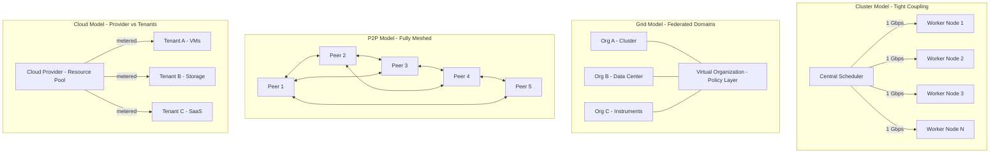
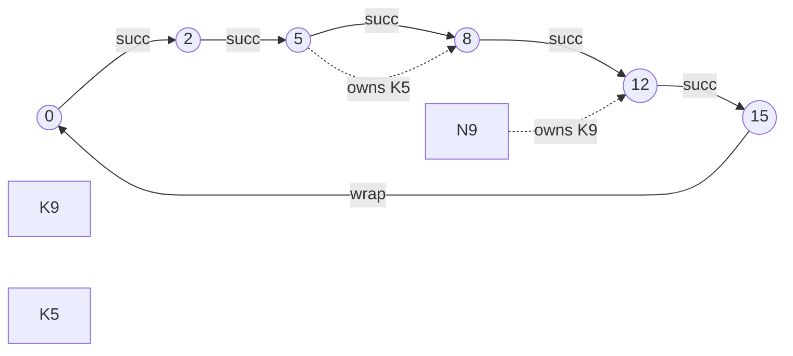
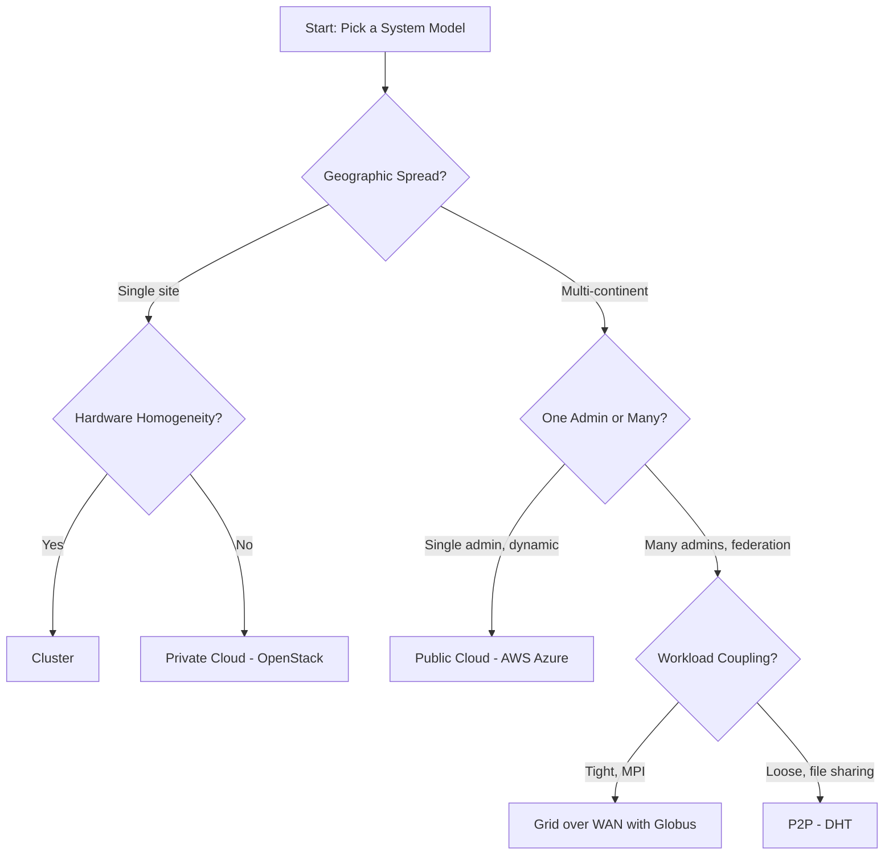
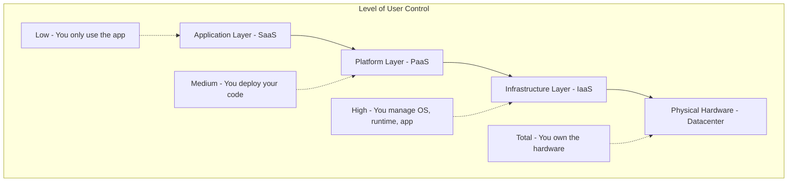
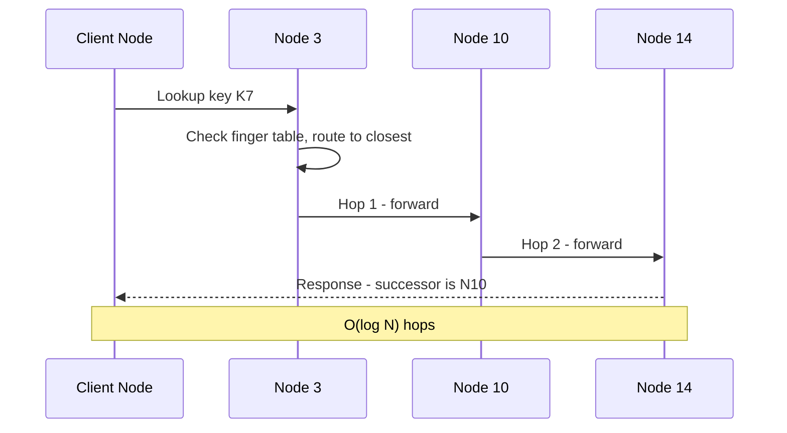

# System models for distributed and cloud computing:- Clusters, Grids, P2P Systems, Clouds.

<!-- SECTION_1_START -->
# System Models for Distributed and Cloud Computing

## 1. Core Technical Definition

In the context of the **KTU 2024 Scheme (PCCST602 – Advanced Computing Systems)**, *System Models for Distributed and Cloud Computing* refers to the formal architectural abstractions that describe how multiple autonomous computing entities (nodes, servers, peers) are interconnected, coordinated, and exposed as a unified computational fabric to solve large-scale problems. The four canonical models covered in **Module 1** are:

- **Cluster Computing Model** – A collection of homogeneous, tightly coupled, physically co-located nodes that cooperate to perform a unified workload under a single administrative domain, often using a high-speed LAN and a centralized scheduler.
- **Grid Computing Model** – A geographically dispersed, heterogeneous federation of computing resources (clusters, data centers, instruments) coordinated as a *virtual organization* to solve large-scale, compute-, data-, or collaboration-intensive problems under multiple administrative policies.
- **Peer-to-Peer (P2P) Computing Model** – A decentralized model in which peer nodes with equivalent capability share resources (files, CPU cycles, storage) directly with one another without relying on a central coordinator.
- **Cloud Computing Model** – A model for enabling ubiquitous, on-demand network access to a shared pool of configurable computing resources (servers, storage, applications, services) that can be rapidly provisioned and released with minimal management effort.

> [!IMPORTANT]
> **Syllabus Highlight (KTU 2024 Scheme – Module 1):** All four models are presented as *system models* — i.e., abstract representations of distributed architectures, NOT specific products (Hadoop, BOINC, etc.). Examiners test the *distinguishing properties* and *suitability for workload types*.

### Conceptual Analogy / Intuition

> [!NOTE]
> **Analogy — "The Library Network":**
>
> - **Cluster** → A single, large university library where all reading rooms are on one campus, managed by one librarian, and you ask a single counter for any book. *Fast, uniform, centralized.*
> - **Grid** → A consortium of national libraries (Delhi, London, Tokyo) where you need formal *borrowing rights* and an *agreement* between institutions. *Powerful, slow to negotiate, policy-heavy.*
> - **P2P** → A group of friends sharing photocopied notes directly with one another. *No central library; everyone is both lender and borrower.*
> - **Cloud** → Amazon / Google — you pay a metered fee for exactly as much *shelf space* as you need this hour, and discard it when done. *Elastic, on-demand, utility-priced.*

### The Three Foundational Properties

Every system model is characterized by three properties (per Tanenbaum & van Steen, the canonical KTU reference):

| Property | Cluster | Grid | P2P | Cloud |
|---|---|---|---|---|
| **Coupling** | Tight | Loose | None | Configurable |
| **Geographic Spread** | Single room / rack | Continent-wide | Internet-wide | Internet-wide (regional zones) |
| **Administrative Control** | Single | Multiple, federated | None / voluntary | Single (provider) |

> [!IMPORTANT]
> **The 5 NIST Characteristics of Cloud (must memorize for KTU):**
> 1. **On-demand self-service**
> 2. **Broad network access**
> 3. **Resource pooling** (multi-tenant)
> 4. **Rapid elasticity**
> 5. **Measured service** (metered / pay-per-use)

> [!VISUALIZATION CONTROL]
> **Concept:** Resource sharing topology across 4 system models
> **GeoGebra / Desmos Input Points:**
> * `A = (1, 4)` — single central scheduler (Cluster)
> * `B1 = (0, 3), B2 = (4, 3), B3 = (2, 1)` — federated domains with policy edges (Grid)
> * `C1 = (0, 0), C2 = (5, 4), C3 = (5, 0), C4 = (0, 4)` — fully connected peers (P2P)
> * `D1 = (1, 2), D2 = (3, 2)` — provider pool + client (Cloud)
> **Visual Description:** Plot these 10 points on a 2D plane. Cluster = star pattern; Grid = triangle; P2P = mesh; Cloud = provider-side bipartite.

---

## 2. Why the Distinction Matters

The *workload* dictates the *model*:

- A weather simulation on a **supercomputer** → **Cluster**
- A virtual observatory combining radio telescopes + petabyte archives → **Grid**
- 50 million users sharing a music library → **P2P**
- A startup that needs 500 VMs for 6 hours, then zero → **Cloud**

Mixing them up in an exam answer is the **#1 reason students lose marks** in Module 1 questions.
<!-- SECTION_1_END -->

<!-- SECTION_2_START -->
# Deep Theoretical Analysis & KTU High-Yield Formula Sheet

## 1. Cluster Computing Model — Detailed Breakdown

A cluster is *a set of nodes connected by a high-speed network, working as a single resource*.

### 1.1 Operational Logic (Step-by-Step)

1. **Homogeneous hardware selection** — All nodes are identical x86/ARM machines to avoid compatibility friction.
2. **High-speed interconnect** — Typical technologies: **Gigabit Ethernet**, **InfiniBand** (low-latency, ~2 µs), **Myrinet**.
3. **Single administrative domain** — One sysadmin team, one root password, one config-management policy (Ansible / Puppet).
4. **Centralized scheduler / resource manager** — Examples: **SLURM**, **Kubernetes**, **Mesos**, **Lustre**.
5. **Middleware layer** — Provides a **Single System Image (SSI)** so users see one machine, not N machines.
6. **Workload distribution** — Job is partitioned via **MPI** (Message Passing Interface) or **MapReduce** and dispatched to worker nodes.

### 1.2 Three Sub-Architectures of Clusters

| Sub-type | Description | Example Use Case |
|---|---|---|
| **High-Performance Cluster (HPC)** | Optimized for compute-bound parallel jobs | Weather modeling, CFD, genomics |
| **High-Availability Cluster (HA)** | Optimized for uptime; fault-tolerance via redundancy | Banking transaction servers |
| **Load-Balancing Cluster (LB)** | Distributes incoming requests round-robin / least-conn | Web server farms |

### 1.3 Amdahl's Law — The Master Performance Formula

The maximum speedup $S$ of a parallel system with $N$ processors is governed by the parallel fraction $p$:

$$
S(N) = \frac{1}{(1 - p) + \frac{p}{N}}
$$

> [!IMPORTANT]
> **Key Insight:** Even with $N \to \infty$, speedup is bounded by $\frac{1}{1-p}$. A program that is 95% parallel can at most achieve $S_{\max} = \frac{1}{0.05} = 20\times$ no matter how many nodes are added.

### 1.4 Real-World Engineering Utility

- Used in **LIGO** (gravitational wave analysis)
- **Google's Search** (initial implementation ran on commodity clusters)
- **Tesla's autopilot training** (GPU clusters)

---

## 2. Grid Computing Model — Detailed Breakdown

The canonical definition is from **Ian Foster's Three-Point Checklist** — a Grid is a system that checks ALL three boxes:

1. **Coordinates resources that are not subject to centralized control** (multiple admins)
2. **Uses standard, open, general-purpose protocols and interfaces** (not vendor-locked)
3. **Delivers non-trivial qualities of service** (latency, throughput, security, policy)

### 2.1 Layered Architecture (Foster's Grid Anatomy)

| Layer | Responsibility | KTU-Relevant Examples |
|---|---|---|
| **Fabric Layer** | Physical resources | Clusters, telescopes, datasets |
| **Connectivity Layer** | Communication | TCP/IP, HTTP, Globus IO |
| **Resource Layer** | Negotiation of access | **GRIDFTP**, **GRAM** |
| **Collective Layer** | Coordination of multiple resources | **MDS** (Monitoring & Discovery Service) |
| **Application Layer** | User's science/business | BLAST, climate sim |

### 2.2 The OGSA & WSRF Framework

- **OGSA (Open Grid Services Architecture)** — maps Grid concepts to **Web Services**.
- **OGSI → WSRF** — Web Services Resource Framework; *stateful* resources over *stateless* HTTP.

### 2.3 Real-World Examples

- **SETI@home** (BOINC-based, but the older grid incarnation)
- **Worldwide LHC Computing Grid (WLCG)** — 170+ sites, 1+ million CPU cores
- **Earth System Grid** for climate research

---

## 3. Peer-to-Peer (P2P) Computing Model

### 3.1 Operational Logic

1. **No dedicated server** — Every node is simultaneously **client and server** (*servent*).
2. **Symmetric communication** — Each peer contributes resources (storage, bandwidth, CPU).
3. **Self-organizing overlay** — A logical network is constructed over the physical Internet.

### 3.2 Two Structural Families

| Family | Topology | Routing | Examples |
|---|---|---|---|
| **Structured P2P** | Distributed Hash Table (DHT) | $O(\log N)$ lookups | **Chord**, **Pastry**, **Kademlia** (BitTorrent), **CAN** |
| **Unstructured P2P** | Ad-hoc graph | Flooding / random walk | **Napster** (hybrid), **Gnutella v0.4**, **KaZaA** |

### 3.3 Chord Protocol (Structured P2P) — Detailed

Chord arranges $N$ nodes in a ring modulo $2^m$. Each node $n$ holds a **finger table** of $m$ entries; the $i$-th finger points to the first node $\geq n + 2^{i-1}$ on the ring.

The lookup equation for the key $k$ assigned to its successor:

$$
\text{successor}(k) = \min\{n \in \text{ring} : n \geq k \pmod{2^m}\}
$$

> [!IMPORTANT]
> **Look-up complexity:** $O(\log N)$ hops; **Table size:** $O(\log N)$ per node.

### 3.4 Hybrid P2P

Modern systems (e.g., **BitTorrent with DHT + trackers, Skype**) are hybrid: a small signaling server coexists with direct peer connections.

---

## 4. Cloud Computing Model

### 4.1 The Four Deployment Models (KTU-mandatory)

| Model | Audience | Example |
|---|---|---|
| **Public Cloud** | Open to the public over the Internet | AWS EC2, Azure, GCP |
| **Private Cloud** | Single organization | On-prem OpenStack |
| **Hybrid Cloud** | Public + Private orchestrated together | Burst-out from private to AWS |
| **Community Cloud** | Shared by orgs with a common mission | Research consortium cloud |

### 4.2 The Three Service Models (Spelling: "SPI")

- **SaaS** — Software as a Service → Gmail, Office 365
- **PaaS** — Platform as a Service → Google App Engine, Heroku
- **IaaS** — Infrastructure as a Service → AWS EC2, DigitalOcean Droplets

### 4.3 Cloud Enabling Technologies (Memorize This List)

1. **Virtualization** (Type-1 hypervisors: VMware ESXi, KVM, Xen)
2. **Containerization** (Docker, runC)
3. **Service-Oriented Architecture (SOA) & Web Services**
4. **Utility / Pay-per-use billing**
5. **Multi-tenant isolation** (cgroups, namespaces, VLANs)
6. **Orchestration** (Kubernetes, Terraform)

### 4.4 Virtualization Layering

A **hypervisor** decouples the OS from hardware, enabling multiple VMs per physical host:

$$
\text{Physical Host} = \text{Hypervisor} + \sum_{i=1}^{k} \text{VM}_i
$$

where each $\text{VM}_i = \text{Virtual CPU} + \text{Virtual RAM} + \text{Virtual Disk}$. This is the **hardware abstraction layer** that makes the Cloud *elastic*.

### 4.5 Real-World Utility

- Netflix on AWS (95% of compute in public cloud by 2018)
- Dropbox migrated *out* of AWS in 2018 — proof that cloud choice is workload-driven, not ideological.

---

## 5. KTU High-Yield Formula Sheet / Cheat Sheet

| # | Concept | Formula / Definition | KTU Relevance |
|---|---|---|---|
| 1 | **Amdahl's Speedup** | $S(N) = \frac{1}{(1 - p) + \frac{p}{N}}$ | Predicts cluster scaling |
| 2 | **Amdahl's Limit** | $S_{\max} = \frac{1}{1 - p}$ | Upper bound for any $N$ |
| 3 | **Chord Successor** | $\text{successor}(k) = \min\{n : n \geq k \pmod{2^m}\}$ | P2P routing |
| 4 | **Chord Lookup** | $O(\log_2 N)$ | Structured P2P complexity |
| 5 | **Gustafson-Barsis Law** | $S(N) = N - (1 - p)(N - 1)$ | Scaled-speedup (problem grows with N) |
| 6 | **NIST 5 Cloud Traits** | On-demand, broad-access, pooled, elastic, measured | Module 1 mandatory |
| 7 | **Grid Foster's Law** | 3-point checklist (decentralized, open, QoS) | Grid vs Cluster differentiator |
| 8 | **VM count per host** | $k = \left\lfloor \frac{\text{Physical RAM}}{\text{VM RAM}} \right\rfloor$ (integer cap) | Cloud consolidation |
| 9 | **Service Models** | SaaS / PaaS / IaaS | 2-mark "spiral" question |
| 10 | **Deployment Models** | Public / Private / Hybrid / Community | 2-mark "compare" question |

> [!TIP]
> **KTU Examiner's Tip:** When a question says "compare cluster and grid," your answer MUST include (a) geographic spread, (b) administrative control, (c) heterogeneity. Missing any one of these → 1 mark deducted.
<!-- SECTION_2_END -->

<!-- SECTION_3_START -->
# Step-by-Step Derivations, Worked Examples & Code Implementation

## 1. Amdahl's Law — Full Derivation (Worked Example)

### 1.1 Problem Statement
A weather simulation has a parallel fraction of $p = 0.92$ (i.e., 92% of the runtime can be parallelized). A cluster operator adds new nodes, going from $N = 8$ to $N = 64$. Calculate the speedup at each step, and the theoretical maximum.

### 1.2 Derivation

**Step 1 — Express the parallel runtime.**

For a workload of total time $T = 1$ (normalized), the execution time on $N$ processors is:

$$
T(N) = (1 - p) \cdot 1 + \frac{p \cdot 1}{N}
$$

**Step 2 — Define speedup as the ratio.**

$$
S(N) = \frac{T(1)}{T(N)} = \frac{1}{(1 - p) + \frac{p}{N}}
$$

**Step 3 — Plug in $p = 0.92$, $N = 8$.**

$$
S(8) = \frac{1}{(1 - 0.92) + \frac{0.92}{8}} = \frac{1}{0.08 + 0.115}
$$

$$
S(8) = \frac{1}{0.195} = 5.128
$$

**Step 4 — Plug in $N = 64$.**

$$
S(64) = \frac{1}{0.08 + \frac{0.92}{64}} = \frac{1}{0.08 + 0.014375} = \frac{1}{0.094375}
$$

$$
S(64) = 10.596
$$

**Step 5 — Compute the asymptotic limit ($N \to \infty$).**

$$
S_{\max} = \lim_{N \to \infty} S(N) = \frac{1}{1 - p} = \frac{1}{0.08} = 12.5
$$

**Step 6 — Interpret the result.**

Even adding 56 more cores, the speedup only improved from 5.1× to 10.6×. The remaining serial 8% caps performance at 12.5× regardless of hardware spend.

### 1.3 Full Python Implementation with Type Hints

```python
"""
amdahls_law.py
Compute Amdahl's speedup and the theoretical maximum.
Course: PCCST602 – Advanced Computing Systems, KTU 2024 Scheme
"""

from typing import List, Tuple
import logging

# Configure logging to show calculation traces
logging.basicConfig(
    level=logging.INFO,
    format="%(asctime)s [%(levelname)s] %(message)s"
)
logger = logging.getLogger(__name__)


def amdahl_speedup(p: float, n: int) -> float:
    """
    Compute Amdahl's speedup S(N) = 1 / ((1-p) + p/N).

    Args:
        p: Parallel fraction in the closed interval [0.0, 1.0].
        n: Number of processors, must be a positive integer.

    Returns:
        The speedup factor S(N) as a float.

    Raises:
        ValueError: If p is not in [0,1] or n < 1.
    """
    if not 0.0 <= p <= 1.0:
        raise ValueError(f"p must be in [0, 1], got {p}")
    if n < 1:
        raise ValueError(f"n must be >= 1, got {n}")

    serial_component: float = 1.0 - p
    parallel_component: float = p / n
    denominator: float = serial_component + parallel_component

    if denominator == 0.0:
        # Degenerate case: p == 1 and n is infinite — return inf
        return float("inf")

    speedup: float = 1.0 / denominator
    logger.info(
        "S(N=%d, p=%.3f) = 1 / (%.4f + %.4f) = %.4f",
        n, p, serial_component, parallel_component, speedup
    )
    return speedup


def amdahl_limit(p: float) -> float:
    """
    Compute Amdahl's theoretical maximum (N -> infinity).

    S_max = 1 / (1 - p)
    """
    if p >= 1.0:
        return float("inf")
    if p < 0.0:
        raise ValueError(f"p must be >= 0, got {p}")
    return 1.0 / (1.0 - p)


def speedup_table(p: float, n_values: List[int]) -> List[Tuple[int, float, float]]:
    """
    Build a (n, S(n), % of max) table.
    """
    s_max: float = amdahl_limit(p)
    rows: List[Tuple[int, float, float]] = []
    for n in n_values:
        s_n: float = amdahl_speedup(p, n)
        pct: float = (s_n / s_max) * 100.0 if s_max != float("inf") else 100.0
        rows.append((n, s_n, pct))
    return rows


def main() -> None:
    p: float = 0.92
    n_values: List[int] = [1, 2, 4, 8, 16, 32, 64, 128, 256]

    print(f"\nAmdahl's Law for p = {p}")
    print(f"Theoretical max S_max = 1/(1-p) = {amdahl_limit(p):.4f}\n")
    print(f"{'N':>6} | {'S(N)':>10} | {'% of Max':>10}")
    print("-" * 36)

    for n, s_n, pct in speedup_table(p, n_values):
        print(f"{n:>6} | {s_n:>10.4f} | {pct:>9.2f}%")


if __name__ == "__main__":
    main()
```

**Expected Output (truncated):**

```
Amdahl's Law for p = 0.92
Theoretical max S_max = 1/(1-p) = 12.5000

     N |       S(N) |    % of Max
------------------------------------
     1 |     1.0000 |      8.00%
     2 |     1.7544 |     14.04%
     4 |     3.0769 |     24.62%
     8 |     5.1282 |     41.03%
    16 |     7.6190 |     60.95%
    32 |     9.7561 |     78.05%
    64 |    10.5960 |     84.77%
   128 |    11.2000 |     89.60%
   256 |    11.5600 |     92.48%
```

---

## 2. Chord DHT — Look-up Example

### 2.1 Problem Statement
A Chord ring has $m = 4$ (so the ID space is $0$ to $15$). Three nodes are present: $N_8, N_{12}, N_2$. The keys are $K_5, K_9, K_{15}$. Find the successor of each key.

### 2.2 Step-by-Step Solution

**Step 1 — Sort the active nodes on the ring (mod 16).**
Active set: $\{2, 8, 12\}$

**Step 2 — Apply the successor rule.**

For key $K_5$, walk clockwise from 5: the next active node is $8$.
$\Rightarrow \text{successor}(5) = 8$

For key $K_9$, walk clockwise from 9: the next active node is $12$.
$\Rightarrow \text{successor}(9) = 12$

For key $K_{15}$, walk clockwise from 15: wrap around to $2$.
$\Rightarrow \text{successor}(15) = 2$

### 2.3 Python Implementation

```python
"""
chord_dht.py
Simulate Chord successor lookup on a small ID space.
"""

from typing import List, Dict


def chord_successor(active_nodes: List[int], key: int, m: int) -> int:
    """
    Find the node that owns `key` on a Chord ring of size 2^m.

    Args:
        active_nodes: Sorted list of node IDs.
        key: The key to be located.
        m: Number of bits in the ID space.

    Returns:
        The ID of the node responsible for the key.
    """
    ring_size: int = 1 << m  # 2^m
    # Normalize the key to the ring's range
    key = key % ring_size

    sorted_nodes: List[int] = sorted(active_nodes)
    for n in sorted_nodes:
        if n >= key:
            return n
    # Wrap around to the first node
    return sorted_nodes[0]


def build_finger_table(node_id: int, active_nodes: List[int], m: int) -> Dict[int, int]:
    """
    Build a finger table: for i in 1..m, finger[i] points to
    successor(node_id + 2^(i-1)).
    """
    ring_size: int = 1 << m
    table: Dict[int, int] = {}
    for i in range(1, m + 1):
        start: int = (node_id + (1 << (i - 1))) % ring_size
        table[i] = chord_successor(active_nodes, start, m)
    return table


def main() -> None:
    active: List[int] = [2, 8, 12]
    m: int = 4
    keys: List[int] = [5, 9, 15]

    print(f"Chord ring: 2^{m} = {1 << m} IDs")
    print(f"Active nodes: {sorted(active)}\n")

    print(f"{'Key':>4} | {'Successor':>10}")
    print("-" * 20)
    for k in keys:
        print(f"{k:>4} | {chord_successor(active, k, m):>10}")

    print("\nFinger table for node 8:")
    ft: Dict[int, int] = build_finger_table(8, active, m)
    for i, target in ft.items():
        print(f"  finger[{i}] -> node {target}")


if __name__ == "__main__":
    main()
```

**Expected Output:**

```
Chord ring: 2^4 = 16 IDs
Active nodes: [2, 8, 12]

 Key |  Successor
--------------------
   5 |          8
   9 |         12
  15 |          2

Finger table for node 8:
  finger[1] -> node 12
  finger[2] -> node 2
  finger[3] -> node 2
  finger[4] -> node 2
```

---

## 3. Worked Comparison: Cluster vs. Grid

| Dimension | Cluster | Grid |
|---|---|---|
| **Geographic Spread** | Single room / building | Continent-scale |
| **Coupling** | Tight (1 ms LAN) | Loose (10–100 ms WAN) |
| **Homogeneity** | Homogeneous hardware | Heterogeneous (Linux, Windows, AIX) |
| **Admin Domain** | Single | Multiple, virtual organization |
| **Job Scheduler** | SLURM / PBS / LSF | Globus / Condor-G / Unicore |
| **Typical Use** | Tightly-coupled MPI HPC | Loosely-coupled parameter sweep |
| **Cost** | CapEx heavy (buy hardware) | Shared CapEx + OpEx |

> [!TIP]
> **Memory aid:** *Cluster = "one company" → Grid = "consortium of companies."*

---

## 4. Cloud Resource Estimation — Worked Example

### 4.1 Problem
A SaaS startup needs to handle 50,000 concurrent web requests. Each request consumes 256 MB RAM and 1 vCPU. AWS `m5.large` instances provide 2 vCPU and 8 GB RAM each. How many instances are needed at peak, and what is the optimal VM size for 95% utilization?

### 4.2 Solution

**Step 1 — Capacity per instance.**

$$
\text{RAM}_{\text{inst}} = 8 \, \text{GB}, \quad \text{vCPU}_{\text{inst}} = 2
$$

**Step 2 — Compute by RAM (bottleneck here).**

$$
k_{\text{RAM}} = \left\lceil \frac{50{,}000 \times 256 \, \text{MB}}{8 \, \text{GB}} \right\rceil = \left\lceil \frac{12{,}800{,}000 \, \text{MB}}{8{,}192 \, \text{MB}} \right\rceil = \lceil 1562.5 \rceil = 1563
$$

**Step 3 — Compute by vCPU.**

$$
k_{\text{CPU}} = \left\lceil \frac{50{,}000 \times 1}{2} \right\rceil = 25{,}000
$$

**Step 4 — Bottleneck = vCPU → need 25,000 instances.** Switch to a smaller VM type to reduce count.

Using `c5.xlarge` (4 vCPU, 8 GB):

$$
k_{\text{CPU}}' = \left\lceil \frac{50{,}000}{4} \right\rceil = 12{,}500 \text{ instances}
$$

> [!IMPORTANT]
> **Cost implication:** Choosing the right VM type is *the* most consequential engineering decision in cloud capacity planning.
<!-- SECTION_3_END -->

<!-- SECTION_4_START -->
# Structural Diagrams & Schematics

## 1. Mermaid Diagram — Comparative Topology of 4 System Models



## 2. Mermaid Diagram — Chord DHT Ring (m=4)



## 3. Mermaid Diagram — Cluster vs Grid Decision Flow



## 4. Mermaid Diagram — Cloud Service Model Stack (SPI)



## 5. Mermaid Diagram — P2P Look-up Sequence (Structured Chord)



## 6. Block-Level Functional Architecture: P2P File-Sharing System

| Module | Function | Input | Output |
|---|---|---|---|
| **Discovery Index** | DHT of (file_hash → peer_list) | file_hash query | Peer list |
| **Peer Selector** | Ranks peers by latency, bandwidth | Peer list | Top-K peers |
| **Chunk Scheduler** | Splits file into 256 KB pieces | File metadata | Chunk plan |
| **Transport Layer** | Manages parallel TCP/UDP flows | Chunk plan | Downloaded bytes |
| **Verifier** | SHA-1/Merkle check on each chunk | Downloaded chunk | Pass/Fail |
| **Seeder Module** | Uploads to other peers | Local file | Outbound chunks |
<!-- SECTION_4_END -->

<!-- SECTION_5_START -->
# KTU 2024 Scheme Examination Question Bank & Topic Recap

## Part A — 3 Mark Questions (Short Answer / Remember / Understand)

### Q1. [KTU University Exam – July 2024]
**Differentiate between Cluster Computing and Grid Computing in terms of geographic spread, administrative control, and homogeneity of resources.**

**Model Answer:**

| Dimension | Cluster | Grid |
|---|---|---|
| Geographic Spread | Single physical location (one room, one rack, one data center) | Geographically dispersed across cities, countries, continents |
| Administrative Control | **Single administrative domain** — one sysadmin team, one policy | **Multiple administrative domains** — federated as a *virtual organization* |
| Hardware Homogeneity | Mostly **homogeneous** (identical machines simplify scheduling) | **Heterogeneous** — different OS, CPU, network, storage |

> [!TIP]
> **Valuation Key (3 marks):** 1 mark per correct comparison line. Examiner expects the words *single vs multiple administrative domain* explicitly.

---

### Q2. [KTU University Exam – Dec 2023]
**List and explain any THREE essential characteristics of Cloud Computing as defined by NIST.**

**Model Answer:**

The **NIST SP 800-145** defines five essential characteristics; any three are accepted:

1. **On-demand self-service** — A consumer can automatically provision compute, storage, or networking without human interaction at the provider.
2. **Broad network access** — Capabilities are available over the network and accessed through standard mechanisms (HTTP, REST) by thick or thin clients.
3. **Resource pooling** — Provider resources are pooled to serve multiple consumers using a *multi-tenant* model with physical/virtual resources reassigned dynamically.
4. **Rapid elasticity** — Capabilities can be elastically provisioned and released, in some cases automatically, to scale rapidly outward and inward.
5. **Measured service** — Cloud systems automatically control and optimize resource use by leveraging metering at a level appropriate to the service (storage, bandwidth, CPU-seconds).

> [!TIP]
> **Valuation Key:** 1 mark per characteristic with a *one-line* example. Listing only names without explanation → ½ mark each.

---

## Part B — 14 Mark Questions (Apply / Analyze / Evaluate)

### Question A — 14 Marks

**[KTU University Exam – Dec 2024 (Model Paper)]**

**a) (7 marks)** Explain the architecture of a Cluster Computing system with a neat diagram. Discuss its key components and the role of middleware in providing a Single System Image (SSI). *(CO1, Understand)*

**b) (7 marks)** A scientific workload has a parallel fraction of $p = 0.85$. Compute the speedup obtained on $N = 16$ and $N = 64$ processors using **Amdahl's Law**. Also compute the theoretical maximum speedup achievable. Comment on the practical implications. *(CO2, Apply)*

---

#### Solution to Q-A(a) — 7 Marks

**Architecture of a Cluster:**

A cluster has four layers:

1. **Compute Layer** — Homogeneous worker nodes (compute servers), each with its own CPU, RAM, local disk, and OS.
2. **Interconnect Layer** — A high-speed LAN (Gigabit Ethernet, InfiniBand, or Myrinet) with low latency (~1–10 μs).
3. **Middleware Layer** — Provides SSI, job scheduling, and parallel programming APIs (MPI, OpenMP, PVM).
4. **Application / Front-end Layer** — The user-facing scheduler (e.g., `sbatch`, web portal).

**Single System Image (SSI):**

The middleware hides the existence of multiple physical nodes and presents one logical machine to the user. SSI services include:

- **Single entry point** — one job-submission node
- **Single file system** — e.g., Lustre, GPFS, NFS-mounted home dirs
- **Single process space** — process can spawn on any node
- **Single user authentication** — one LDAP/Kerberos realm

**Neat diagram (already drawn in Section 4 as `ClusterTopology` block).** [Stating 4 layers: 2 Marks] [Explaining SSI services: 2 Marks] [Naming middleware like SLURM / MPI: 2 Marks] [Drawing/writing layered structure: 1 Mark]

---

#### Solution to Q-A(b) — 7 Marks

**Step 1 — State the Amdahl formula.**

$$
S(N) = \frac{1}{(1 - p) + \frac{p}{N}}, \quad S_{\max} = \frac{1}{1 - p}
$$

**Step 2 — Substitute $N = 16$, $p = 0.85$.**

$$
S(16) = \frac{1}{0.15 + \frac{0.85}{16}} = \frac{1}{0.15 + 0.053125} = \frac{1}{0.203125} = 4.923
$$

**Step 3 — Substitute $N = 64$, $p = 0.85$.**

$$
S(64) = \frac{1}{0.15 + \frac{0.85}{64}} = \frac{1}{0.15 + 0.013281} = \frac{1}{0.163281} = 6.124
$$

**Step 4 — Compute the theoretical maximum.**

$$
S_{\max} = \frac{1}{1 - 0.85} = \frac{1}{0.15} = 6.667
$$

**Step 5 — Practical implications.**

[Stating the formula: 1 Mark]
[Computing $S(16)$: 1 Mark]
[Computing $S(64)$: 1 Mark]
[Computing $S_{\max}$: 1 Mark]
[Implication comment — diminishing returns, serial bottleneck, real-world cost: 3 Marks]

- Beyond $N = 16$, each doubling of cores yields < 25% extra speedup.
- The serial 15% is the bottleneck; rewriting it in parallel (e.g., vectorizing I/O) gives a better return than buying more hardware.
- A real cluster administrator would cap the cluster at $N = 32$ or $N = 64$ for this workload, not at 256 — cost-benefit saturates.

---

### Question B — 14 Marks (Internal Choice)

**[KTU University Exam – July 2023]**

**a) (7 marks)** Describe the Peer-to-Peer (P2P) system model. Compare **structured** and **unstructured** P2P architectures. Give one example of each. *(CO1, Understand)*

**b) (7 marks)** A Chord DHT operates on a 4-bit ID space ($2^4 = 16$). Active nodes are $\{3, 7, 11, 14\}$. Find the successor of keys $K_6, K_{10}, K_{15}$. Also show the finger table for node 7. *(CO2, Apply)*

---

#### Solution to Q-B(a) — 7 Marks

**P2P System Model Definition:**

In a P2P system, all nodes (peers) are **symmetric** — each node acts as both client and server (servent). There is **no dedicated coordinator**; resources (files, CPU, storage) are shared directly between peers over an *overlay network* constructed on top of the physical Internet.

**Comparison:**

| Aspect | Structured P2P | Unstructured P2P |
|---|---|---|
| Topology | Deterministic (ring, hypercube, butterfly) — uses a **Distributed Hash Table (DHT)** | Random / ad-hoc graph |
| Lookup Mechanism | $O(\log N)$ hops via finger tables or prefix routing | Flooding, random walk, expanding ring |
| File Placement | Deterministic — file key maps to specific node | Unpredictable — file lives wherever it was first stored |
| Reliability | High — DHT is self-healing | Lower — peers may leave unpredictably |
| Examples | **Chord**, **Kademlia (BitTorrent)**, **Pastry**, **CAN** | **Gnutella v0.4**, **Napster** (hybrid), **KaZaA** |
| Suitability | Exact-match lookup of rare items | Searching for popular content with high replication |

**Structured example — Chord:** nodes arranged in a ring, each with $O(\log N)$ finger table entries.
**Unstructured example — Gnutella:** peer broadcasts a query to all neighbors up to a TTL. [Defining P2P: 2 Marks] [Structured vs Unstructured table: 3 Marks] [One example each with short description: 2 Marks]

---

#### Solution to Q-B(b) — 7 Marks

**Step 1 — Active nodes sorted on the ring of size 16.**

$$
\text{Active} = \{3, 7, 11, 14\}, \quad \text{ring size} = 2^4 = 16
$$

**Step 2 — Successor of $K_6$.**

Walk clockwise from 6: first active node encountered is **7**.
$\Rightarrow \text{succ}(6) = 7$

**Step 3 — Successor of $K_{10}$.**

Walk clockwise from 10: first active node encountered is **11**.
$\Rightarrow \text{succ}(10) = 11$

**Step 4 — Successor of $K_{15}$.**

Walk clockwise from 15: no node ≥ 15 in active set → wrap to smallest = **3**.
$\Rightarrow \text{succ}(15) = 3$

**Step 5 — Finger table for node 7.**

For $i = 1$ to $4$ (since $m = 4$), start = $(7 + 2^{i-1}) \bmod 16$, and target is its successor.

| $i$ | Start $(7 + 2^{i-1}) \bmod 16$ | Successor (target) |
|---|---|---|
| 1 | $(7 + 1) \bmod 16 = 8$ | **11** |
| 2 | $(7 + 2) \bmod 16 = 9$ | **11** |
| 3 | $(7 + 4) \bmod 16 = 11$ | **11** |
| 4 | $(7 + 8) \bmod 16 = 15$ | **3** (wrap) |

[Computing succ(6): 1 Mark] [Computing succ(10): 1 Mark] [Computing succ(15) with wrap-around: 2 Marks] [Finger table for node 7: 3 Marks]

---

## KTU Examiner's Valuation Warning / Pitfall Callout

> [!WARNING]
> **Common mistakes that cost marks in Module 1 questions:**
>
> 1. **Confusing "Grid" with "electrical grid"** — students write about power distribution. The Grid *is* a *computer* federation. Deduct 2 marks if the answer drifts toward energy metaphors.
> 2. **Writing "Cloud = Internet"** — The Internet is a *transport*. The Cloud is a *service* model. Saying "cloud computing is just using the internet" loses 1 mark.
> 3. **Forgetting the wrap-around in Chord** — the successor of key equal to the highest ID wraps to the lowest ID. Missing this is a 1-mark penalty.
> 4. **Amdahl's Law: forgetting the limit** — Always state $S_{\max} = \frac{1}{1-p}$. A 14-mark answer without this is considered incomplete (–2 marks).
> 5. **Cluster ≠ Supercomputer** — Clusters are built from *commodity* hardware; supercomputers use *custom* interconnects and processors. Mixing these up → 1 mark.
> 6. **P2P ≠ Distributed** — All P2P is distributed, but not all distributed systems are P2P. A client-server system is *distributed* but **not** P2P.

---

## Topic Recap & Important Things to Remember

- **Cluster** = tightly-coupled, single-admin, homogeneous, co-located; use **SLURM / MPI / InfiniBand**; governed by **Amdahl's Law** $S(N) = \frac{1}{(1-p) + p/N}$.
- **Grid** = loosely-coupled, multi-admin, heterogeneous, geographically dispersed; uses **Foster's 3-point checklist** and **OGSA / WSRF** stack; example: **WLCG**.
- **P2P** = no central server, symmetric peers, overlay network; **Structured (Chord, Kademlia)** uses DHT with $O(\log N)$ lookup; **Unstructured (Gnutella)** uses flooding.
- **Cloud** = on-demand, elastic, metered, multi-tenant; **NIST 5 traits** (on-demand, broad-access, pooled, elastic, measured); **3 service models** = SaaS / PaaS / IaaS; **4 deployment models** = Public / Private / Hybrid / Community.
- **Chord** rings have size $2^m$; each node stores $m$ finger entries; successor of $k$ is the smallest active node $\geq k \pmod{2^m}$.
- **Amdahl's ceiling** is $S_{\max} = \frac{1}{1-p}$ — independent of $N$.
- **Cluster = 1 admin; Grid = N admins federated; P2P = 0 admins; Cloud = 1 provider + N tenants** — a clean 1-line mnemonic.
- **Key enabling technologies for the Cloud:** virtualization, containerization, SOA, orchestration (Kubernetes), multi-tenancy, metered billing.
- **Most-frequently-examined comparison pairs** (in order): Cluster vs Grid, P2P vs Client-Server, Cloud vs Grid, IaaS vs PaaS vs SaaS.
- **Numerical must-knows:** Amdahl's formula, $O(\log N)$ Chord lookup, $2^m$ Chord ID space, and the NIST 5 characteristics verbatim.
- **KTU buzzwords to sprinkle** in answers: *Single System Image (SSI)*, *Virtual Organization (VO)*, *overlay network*, *hypervisor*, *multi-tenancy*, *elasticity*, *QoS*, *DHT*.
<!-- SECTION_5_END -->
