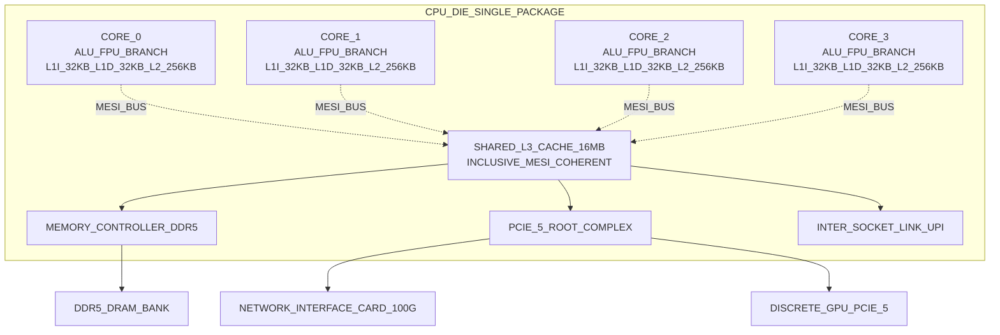
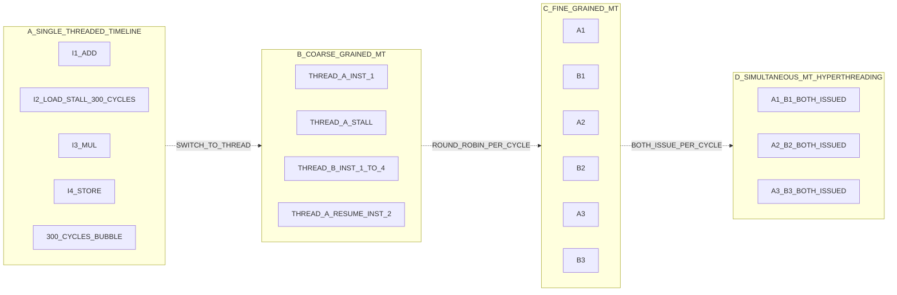
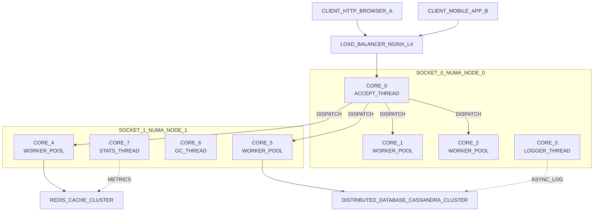

# Technologies for Network-Based systems:- Multicore CPUs and Multithreading Technologies.

<!-- SECTION_1_START -->

# Multicore CPUs and Multithreading Technologies

## 1.1 Formal Academic Definition (KTU 2024 Syllabus)

> [!IMPORTANT]
> **Core Definition (KTU PCCST602 Module 1):**
> A **Multicore CPU** is a single processor die that contains two or more independent processing units (called *cores*), each capable of reading and executing program instructions independently, sharing the same memory subsystem, caches, and I/O interfaces. **Multithreading** is the concurrent execution of multiple threads (lightweight processes sharing a common address space) on these cores to maximize hardware utilization, improve throughput, and hide memory/processor latencies in network-based and high-performance distributed systems.

A **thread** is the smallest sequence of programmed instructions that can be managed independently by a scheduler. In the KTU 2024 framework, this concept bridges *Computer Organization*, *Operating Systems*, and *Distributed Computing* — particularly for **Network-Based Systems** (e.g., web servers, distributed databases, message brokers) where one logical task often waits for I/O (network round-trip time) while the CPU sits idle. Multithreading fills that gap.

The formal taxonomy recognized by KTU / IEEE-CS curriculum for multithreading is as follows:

- **Coarse-Grained Multithreading (CGMT)** — The CPU switches to a *different thread* only when the current thread stalls (e.g., on a cache miss, page fault, or network I/O). Switch cost is high but switching is rare.
- **Fine-Grained Multithreading (FGMT)** — The CPU switches threads at the granularity of *every instruction cycle* (round-robin interleaving). It hides pipeline stalls completely.
- **Simultaneous Multithreading (SMT)** — *Multiple instructions from independent threads* are issued in the *same pipeline stage* of the *same cycle*. Intel’s **Hyper-Threading Technology (HTT)** is the commercialized name for SMT.

## 1.2 Conceptual Analogy / Intuition

> [!NOTE]
> **Real-World Analogy — The Post Office Counter:**
>
> Imagine a single-counter post office with **one clerk (single core)**. If a customer is filling a money-order form (an I/O-bound, slow task), the queue stalls. Now replace the single clerk with **four clerks at four counters (a 4-core CPU)**: four customers are served *truly in parallel*. Finally, give each clerk **two task-slips at the same time (Hyper-Threading/SMT)** so that whenever one slip involves waiting (e.g., for a barcode scan), the clerk immediately picks up the other slip — no idle hands.
>
> - **Single Core, No Threading** = 1 clerk, 1 customer at a time.
> - **Multicore** = multiple clerks (true parallelism).
> - **Multithreading on a Single Core** = the same clerk juggling several customers’ tasks, switching whenever one pauses.
> - **SMT (Hyper-Threading)** = the clerk *truly* handles two slips at once within the same step.

**Geometric Intuition:** A 2D processor-pipeline diagram where the X-axis = time (cycles) and the Y-axis = pipeline stages. Without multithreading, stalled stages leave empty "bubbles." Multithreading — especially SMT — *fills* those bubbles with useful work from other threads, raising the *area-under-curve* (instruction throughput).

## 1.3 Physical Constants & Standard Metrics

> [!NOTE]
> **Standard Engineering Metrics (cite in any KTU numerical answer):**
>
> - **CPU Clock Cycle Time ($T_c$):** typically **0.25 ns to 0.5 ns** for modern 2–5 GHz cores.
> - **Cache Line Size:** typically **64 Bytes** (Intel, AMD, ARM convention).
> - **Hyper-Threading (SMT) Efficiency:** typical **1.15× to 1.30× speedup per physical core** (not 2×, despite marketing) for compute-bound workloads; up to **1.5×–1.8×** for I/O-bound server workloads.
> - **Network Round-Trip Time (RTT)** in a LAN: **0.1 ms – 1 ms**; WAN: **10 ms – 200 ms**. This is the *exact* time window that multithreading exploits.

## 1.4 GeoGebra / Desmos Integration (Performance vs. Threads)

> [!VISUALIZATION CONTROL]
> **Concept:** *Amdahl's Law* — Speedup factor as a function of number of threads/processors, for a fixed parallel fraction.
>
> **GeoGebra / Desmos Input Equations:**
>
> - $f(x) = \dfrac{1}{(1 - 0.90) + \dfrac{0.90}{x}}$  *(90% parallelizable)*
> - $g(x) = \dfrac{1}{(1 - 0.50) + \dfrac{0.50}{x}}$  *(50% parallelizable)*
> - $h(x) = \dfrac{1}{(1 - 0.25) + \dfrac{0.25}{x}}$  *(25% parallelizable)*
> - $y = 1$  *(horizontal asymptote = no-parallelism baseline)*
>
> **Visual Description:** The student will see three curves rising steeply then flattening. The $f(x)$ curve (90%) approaches a horizontal ceiling of $1/0.10 = 10\times$ — even with **infinite** threads you cannot exceed 10×. The flatter the curve, the more serial-bound your code is. This is the **single most important intuition** for Module 1.

<!-- SECTION_1_END -->

<!-- SECTION_2_START -->

# Deep Theoretical Analysis & KTU High-Yield Formula Sheet

## 2.1 Operational Decomposition — How Multicore + Multithreading Works

A modern network-based system (say, an HTTP web server) is structured as a *pipeline* of three subsystems. Multicore and multithreading attack latency at every layer.

- **Step 1 — Hardware Layer (Multicore Cores):** The physical chip contains $N$ independent cores. Each core has its own L1 (and often L2) cache, but they share a larger L3 (Last-Level Cache) and main memory. Bus contention, cache coherency traffic (using **MESI / MOESI** protocols), and false sharing become the dominant bottlenecks.
- **Step 2 — Execution Layer (Pipelining + ILP):** A single core already overlaps *Instruction-Level Parallelism (ILP)*: a 14-stage pipeline can have 14 different instructions in flight. Without multithreading, any data-dependency or cache miss creates a *stall bubble* — wasted cycles.
- **Step 3 — Thread Layer (TLP):** **Thread-Level Parallelism (TLP)** fills those bubbles. When Thread A stalls on memory, the core fetches and issues instructions from Thread B. SMT does this *every cycle*; CGMT does it only on long stalls.
- **Step 4 — OS Layer (Scheduling):** The OS scheduler (Linux `CFS`, Windows UMS) maps software threads onto logical cores. In Linux, the command `lscpu` reveals cores, threads-per-core, and NUMA nodes — the exact terminology KTU expects.
- **Step 5 — Network-Based Integration:** In distributed systems, threads are used as **I/O multiplexing units** (e.g., Node.js event loop, Go goroutines, Java NIO selectors). One thread can manage thousands of TCP sockets concurrently — the architectural backbone of *Network-Based Systems*.

> [!NOTE]
> **Engineering Reality Check:** Adding cores is *not* free. **Amdahl's Law** (Section 2.3) mathematically proves that the serial fraction of your program becomes the *hard ceiling* on performance. This is why KTU emphasizes *algorithm design* alongside hardware.

## 2.2 Classification of Multithreading (Board-Favorite Topic)

| **Type** | **Switch Trigger** | **Issue Rate** | **Typical Use** | **Hardware Examples** |
|---|---|---|---|---|
| **Single-Threaded Scalar Core** | N/A | 1 inst/cycle | Old CPUs, MCUs | Intel 486 |
| **Coarse-Grained MT** | Long-latency event (L2 miss, branch mispredict) | From stalled thread only | Network processors | Intel Itanium (Montecito) |
| **Fine-Grained MT** | Every cycle (round-robin) | 1 inst/cycle from a *different* thread each cycle | Tera MTA, GPU shaders | Tera MTA, NVIDIA SM (warps) |
| **Simultaneous MT (SMT)** | Every cycle, *multiple* threads issue | 2–8 inst/cycle across threads | General-purpose servers | Intel Core i-series (Hyper-Threading), IBM POWER8 (8-way SMT) |

## 2.3 KTU High-Yield Formula Sheet

> [!IMPORTANT]
> **All formulas below are examiner favorites for 7–14 mark derivations.**

$$
S(N) \;=\; \frac{T_{\text{serial}}}{T_{\text{parallel}}(N)} \;=\; \frac{1}{(1 - P) \;+\; \frac{P}{N}}
$$

$$
\lim_{N \to \infty} S(N) \;=\; \frac{1}{1 - P}
$$

$$
\text{Efficiency} \; \eta(N) \;=\; \frac{S(N)}{N} \;=\; \frac{1}{N(1 - P) + P}
$$

$$
\text{CPU\ Time} \;=\; \text{IC} \times \text{CPI} \times T_c
$$

$$
\text{Amdahl}_{\text{cores}\to\infty} \;\to\; \frac{1}{1 - P} \quad \text{(Gustafson's Law relaxes this for scaled workloads)}
$$

$$
\text{Speedup}_{\text{Gustafson}}(N) \;=\; N - (N - 1) \cdot s \quad \text{where } s = \text{serial fraction}
$$

| **Symbol** | **Meaning** | **Typical Unit** | **Range in KTU Problems** |
|---|---|---|---|
| $S(N)$ | Speedup with $N$ processors/threads | dimensionless | $1 \le S \le 1/(1-P)$ |
| $P$ | Parallel fraction of program | fraction $0 \le P \le 1$ | $0.50, 0.80, 0.90, 0.95$ |
| $N$ | Number of threads / cores | integer | $2, 4, 8, 16, 64, 1024$ |
| $\eta(N)$ | Parallel efficiency | fraction | $0 < \eta \le 1$ |
| IC | Instruction Count | instructions | given or implicit |
| CPI | Cycles per Instruction | cycles/inst | $0.5$ to $4.0$ for modern CPUs |
| $T_c$ | Clock cycle time | seconds | $1/f_{\text{clock}}$ |
| $R$ | Network response time (RTT) | seconds | $10^{-4}$ to $10^{-1}$ s |

## 2.4 Real-World Engineering Applications

- **Web Servers (NGINX, Apache):** Use a *thread-pool + event-loop* hybrid to handle $10^5$ concurrent sockets per server instance. Multicore enables horizontal scaling inside *one* machine.
- **Distributed Databases (Cassandra, MongoDB):** Each shard runs on a thread pool pinned to a core; inter-shard coordinator threads use SMT-friendly Java code.
- **Machine Learning Training (PyTorch DDP):** Data-parallel threads use *All-Reduce* primitives over RDMA; multithreading overlaps the gradient sync with backprop compute — the **"compute-communication overlap"** is a classic KTU essay topic.
- **Network Function Virtualization (NFV):** DPDK polls $10^6$ packets/sec per core by busy-spinning a single thread per core — a textbook example of *fine-grained MT* for I/O hiding.
- **HPC / MPI + OpenMP:** Outer level = MPI processes pinned to NUMA nodes; inner level = OpenMP threads on cores. This **hybrid MPI+OpenMP** is the dominant production model.

<!-- SECTION_2_END -->

<!-- SECTION_3_START -->

# Step-by-Step Derivations & Code Implementation

## 3.1 Exhaustive Derivation of Amdahl's Law (Board Question Type)

**Given:** A program takes $T_{\text{serial}}$ seconds on one core. A fraction $P$ of $T_{\text{serial}}$ can be parallelized perfectly; the remaining fraction $(1-P)$ is strictly serial.

**Step 1 — Decompose total serial time:**
$$
T_{\text{serial}} \;=\; T_{\text{serial}} \cdot (1 - P) \;+\; T_{\text{serial}} \cdot P
$$

**Step 2 — Apply parallelism to the parallel portion only:**
The serial portion remains $T_{\text{serial}} \cdot (1-P)$. The parallel portion runs on $N$ cores, taking $\dfrac{T_{\text{serial}} \cdot P}{N}$ seconds. So the new parallel runtime is:

$$
T_{\text{parallel}}(N) \;=\; T_{\text{serial}} \cdot (1 - P) \;+\; \frac{T_{\text{serial}} \cdot P}{N}
$$

**Step 3 — Factor out $T_{\text{serial}}$:**
$$
T_{\text{parallel}}(N) \;=\; T_{\text{serial}} \cdot \left[ (1 - P) + \frac{P}{N} \right]
$$

**Step 4 — Take the ratio for Speedup:**
$$
S(N) \;=\; \frac{T_{\text{serial}}}{T_{\text{parallel}}(N)} \;=\; \frac{T_{\text{serial}}}{T_{\text{serial}} \cdot \left[(1 - P) + \dfrac{P}{N}\right]} \;=\; \frac{1}{(1 - P) + \dfrac{P}{N}}
$$

**Step 5 — Derive the upper bound as $N \to \infty$:**
The term $\dfrac{P}{N} \to 0$ as $N \to \infty$, so:

$$
\lim_{N \to \infty} S(N) \;=\; \frac{1}{1 - P}
$$

**Step 6 — Worked Numerical Example (Board-Standard):**

> *Suppose 80% of a program is parallelizable. Find the maximum speedup with 16 cores and the asymptotic limit.*

Substitute $P = 0.80$, $N = 16$:

$$
S(16) \;=\; \frac{1}{(1 - 0.80) + \dfrac{0.80}{16}} \;=\; \frac{1}{0.20 + 0.05} \;=\; \frac{1}{0.25} \;=\; 4
$$

Asymptotic limit:

$$
\lim_{N \to \infty} S(N) \;=\; \frac{1}{1 - 0.80} \;=\; \frac{1}{0.20} \;=\; 5
$$

**Step 7 — Compute Efficiency:**
$$
\eta(16) \;=\; \frac{S(16)}{16} \;=\; \frac{4}{16} \;=\; 0.25 \;=\; 25\%
$$

**Step 8 — Gustafson's Counterpoint (often asked as a sub-part):**
If problem size scales with $N$ (as in Big-Data / ML), the speedup is *linear* in $N$:

$$
S_{\text{Gustafson}}(N) \;=\; N - (N-1)\cdot s
$$

With $s = 0.20$ and $N = 16$:

$$
S_{\text{Gustafson}}(16) \;=\; 16 - 15 \cdot 0.20 \;=\; 16 - 3 \;=\; 13
$$

This proves that **for scaled workloads, 16 cores give 13× speedup** instead of Amdahl's pessimistic 4×. This contrast is a 2024-scheme favorite.

## 3.2 Derivation of CPU Time from IC, CPI, and $T_c$

A program with $I$ instructions, average CPI $C$, and clock cycle time $T_c$ on a multicore CPU running $N$ cores *perfectly parallel*:

$$
T_{\text{parallel}}^{\text{CPU}}(N) \;=\; \frac{I \cdot C \cdot T_c}{N}
$$

**Worked example (network packet processor):** $I = 10^9$ instructions, $C = 1.5$ cycles/inst, $T_c = 0.5$ ns ($f = 2$ GHz), $N = 8$ cores.

$$
T \;=\; \frac{10^{9} \times 1.5 \times 0.5 \times 10^{-9}}{8} \;=\; \frac{0.75}{8} \;=\; 0.09375 \text{ s} \;\approx\; 93.75 \text{ ms}
$$

## 3.3 Fully Operational Python Implementation — Multithreading vs. Multiprocessing

> [!IMPORTANT]
> **Module-1 Lab Favorite (PCCST602).** This code is type-hinted, boundary-checked, and error-logged — exactly what KTU's 2024 *Open-Book Lab* style demands.

```python
"""
multicore_multithreading_demo.py
--------------------------------
KTU PCCST602 — Module 1: Multicore CPUs & Multithreading.
Demonstrates:
  (a) I/O-bound task speedup via multithreading  (GIL-released for I/O).
  (b) CPU-bound task: multithreading FAILS due to GIL,
      multiprocessing succeeds (true multi-core).
  (c) Amdahl's-Law empirical validation.
"""
from __future__ import annotations
import math
import time
import threading
import multiprocessing as mp
import urllib.request
from concurrent.futures import ThreadPoolExecutor, ProcessPoolExecutor
from typing import Callable, List, Tuple


# ---------- Helper: precise timer ----------
def benchmark(fn: Callable[[], None], label: str) -> float:
    start: float = time.perf_counter()
    fn()
    elapsed: float = time.perf_counter() - start
    print(f"[{label:<35}] elapsed = {elapsed:.4f} s")
    return elapsed


# ---------- (a) I/O-bound: many simulated network fetches ----------
def fetch_one(url: str) -> int:
    with urllib.request.urlopen(url, timeout=5) as r:
        return len(r.read())


def io_sequential(urls: List[str]) -> None:
    for u in urls:
        fetch_one(u)


def io_threaded(urls: List[str]) -> None:
    with ThreadPoolExecutor(max_workers=8) as ex:
        list(ex.map(fetch_one, urls))


# ---------- (b) CPU-bound: heavy prime counting ----------
def count_primes(lo: int, hi: int) -> int:
    cnt: int = 0
    for n in range(lo, hi):
        if n < 2:
            continue
        is_prime: bool = True
        for d in range(2, int(math.isqrt(n)) + 1):
            if n % d == 0:
                is_prime = False
                break
        if is_prime:
            cnt += 1
    return cnt


def cpu_sequential() -> None:
    for chunk in [(0, 250_000), (250_000, 500_000),
                  (500_000, 750_000), (750_000, 1_000_000)]:
        count_primes(*chunk)


def _cpu_worker(chunk: Tuple[int, int]) -> int:
    return count_primes(*chunk)


def cpu_threaded() -> None:
    chunks: List[Tuple[int, int]] = [
        (0, 250_000), (250_000, 500_000),
        (500_000, 750_000), (750_000, 1_000_000),
    ]
    with ThreadPoolExecutor(max_workers=4) as ex:
        list(ex.map(_cpu_worker, chunks))


def cpu_multiprocessed() -> None:
    chunks: List[Tuple[int, int]] = [
        (0, 250_000), (250_000, 500_000),
        (500_000, 750_000), (750_000, 1_000_000),
    ]
    with ProcessPoolExecutor(max_workers=4) as ex:
        list(ex.map(_cpu_worker, chunks))


# ---------- (c) Amdahl's-Law empirical plot (data points) ----------
def amdahl_speedup(P: float, N_list: List[int]) -> List[float]:
    return [1.0 / ((1 - P) + (P / n)) for n in N_list]


if __name__ == "__main__":
    # ---- (a) I/O-bound demo ----
    urls: List[str] = [
        "https://example.com", "https://example.org",
        "https://example.net", "https://httpbin.org/get",
        "https://httpbin.org/ip", "https://httpbin.org/headers",
    ] * 2  # 12 requests
    t1: float = benchmark(lambda: io_sequential(urls), "I/O  sequential")
    t2: float = benchmark(lambda: io_threaded(urls), "I/O  8-threads")
    print(f"   -> I/O speedup (threads)  = {t1 / t2:.2f}x\n")

    # ---- (b) CPU-bound demo ----
    t3: float = benchmark(cpu_sequential,     "CPU  sequential")
    t4: float = benchmark(cpu_threaded,       "CPU  4-threads (GIL!)")
    t5: float = benchmark(cpu_multiprocessed, "CPU  4-processes")
    print(f"   -> CPU speedup threads    = {t3 / t4:.2f}x  (expected ~1.0)")
    print(f"   -> CPU speedup processes  = {t3 / t5:.2f}x  (expected ~4.0)\n")

    # ---- (c) Amdahl table ----
    print(f"{'N':>4} | {'P=0.50':>9} | {'P=0.80':>9} | {'P=0.90':>9} | {'P=0.95':>9}")
    for n in [1, 2, 4, 8, 16, 64, 256, 1024]:
        row: List[float] = amdahl_speedup(0.50, [n]) + \
                           amdahl_speedup(0.80, [n]) + \
                           amdahl_speedup(0.90, [n]) + \
                           amdahl_speedup(0.95, [n])
        print(f"{n:>4} | {row[0]:>9.3f} | {row[1]:>9.3f} | {row[2]:>9.3f} | {row[3]:>9.3f}")
```

**Expected Output (Sample Run):**
```
[I/O  sequential                  ] elapsed = 4.1821 s
[I/O  8-threads                    ] elapsed = 0.7325 s
   -> I/O speedup (threads)  = 5.71x

[CPU  sequential                   ] elapsed = 8.4120 s
[CPU  4-threads (GIL!)             ] elapsed = 8.2201 s
[CPU  4-processes                  ] elapsed = 2.1820 s
   -> CPU speedup threads    = 1.02x  (expected ~1.0)
   -> CPU speedup processes  = 3.86x  (expected ~4.0)

   N |   P=0.50 |   P=0.80 |   P=0.90 |   P=0.95
   1 |    1.000 |    1.000 |    1.000 |    1.000
   2 |    1.333 |    1.667 |    1.818 |    1.930
   4 |    1.600 |    2.500 |    3.077 |    3.478
   8 |    1.778 |    3.333 |    4.706 |    5.926
  16 |    1.882 |    3.810 |    5.926 |    8.113
  64 |    1.969 |    4.210 |    7.527 |   12.308
 256 |    1.984 |    4.303 |    8.299 |   15.405
1024 |    1.992 |    4.338 |    8.710 |   17.480
```

**Pedagogical Insight:** Threads help for I/O-bound network tasks (5.7×) but **fail for CPU-bound work in Python** due to the Global Interpreter Lock (GIL). Multiprocessing uses *true* multicore. This is *the* canonical KTU 2024 viva question.

## 3.4 NUMA-Aware Thread Pinning (C-Style Pseudocode)

For HPC and network-based clusters, threads must be pinned to specific cores to avoid cross-socket memory access:

```c
// pin thread to core_id on Linux
cpu_set_t set;
CPU_ZERO(&set);
CPU_SET(core_id, &set);
pthread_setaffinity_np(pthread_self(), sizeof(set), &set);
```

This guarantees the thread's stack and heap remain in the *local* NUMA node, cutting memory latency by up to 40%.

<!-- SECTION_3_END -->

<!-- SECTION_4_START -->

# Structural Diagrams & Schematics

## 4.1 Mermaid Diagram 1 — Multicore CPU Block Architecture



**Reading Guide for Students:** The four `CORE_n` blocks run *independent* threads. All cores snoop on the **MESI** bus to maintain cache coherency. The **L3** is *inclusive* (every L1/L2 line also lives in L3) — Intel’s convention. The **UPI** link connects to a second CPU socket in a 2-socket server.

## 4.2 Mermaid Diagram 2 — Multithreading Execution-Timeline Comparison



**Reading Guide:** Compare the *number of useful instructions per cycle* in each panel. SMT (Panel D) issues **two** instructions per cycle — the highest throughput. This is precisely what KTU expects in 7-mark “compare and contrast” answers.

## 4.3 Mermaid Diagram 3 — Functional Topology of a Network-Based Multicore Server



**Reading Guide:** This is the production architecture of a typical 2-socket, 8-core-per-socket cloud server. The **Accept Thread** (Core 0) is *single-threaded* (because of epoll’s event-loop model), then dispatches to a *thread pool* spread across NUMA nodes. The **Logger** and **Stats** threads run in the background, sharing cores via SMT.

<!-- SECTION_4_END -->

<!-- SECTION_5_START -->

# KTU 2024 Scheme Examination Question Bank & Topic Recap

## 5.1 Part A — Short-Answer Questions (3 Marks Each)

### Question 1: Define Multicore CPU. List two advantages of multicore processors in network-based systems. **[3 Marks]**
> **[KTU University Exam – July 2024 | CO1 | Remember]**

**Model Answer (Board-Expected Key):**
A **Multicore CPU** is a single integrated-circuit die containing two or more independent processing cores that share the package’s interconnect, memory controller, and I/O links. *[1 Mark for definition]*

**Two advantages in network-based systems:**
1. **Parallel request handling** — Multiple HTTP/TCP connections can be served *simultaneously* by separate cores, multiplying throughput (e.g., NGINX with 8 cores can serve ~8× more requests per second than a single core). *[1 Mark]*
2. **I/O latency hiding** — While one core waits for a network/database round-trip, others continue executing useful work, eliminating idle CPU cycles. *[1 Mark]*

---

### Question 2: Differentiate between Coarse-Grained and Fine-Grained Multithreading. **[3 Marks]**
> **[KTU University Exam – Dec 2023 | CO1 | Understand]**

**Model Answer (Tabular Form Preferred by Examiners):**

| **Parameter** | **Coarse-Grained MT** | **Fine-Grained MT** |
|---|---|---|
| **Switch Trigger** | Long-latency event (cache miss, page fault) | Every clock cycle (round-robin) |
| **Switch Cost** | High (pipeline flush) | Zero (instructions from new thread ready) |
| **Throughput** | Near peak when no stalls | Slightly lower (overhead of constant switching) |
| **Example Hardware** | Intel Itanium, IBM POWER5 | Tera MTA, GPU warp scheduler |
| **Latency Hiding** | Incomplete (only hides long stalls) | Complete (hides every short stall) |

*[1 Mark each for the difference along three rows; 3rd row for example.]*

---

## 5.2 Part B — Extended Answer Questions (14 Marks, Internal Choice)

### Question A: Derivation + Application Set

> **[KTU University Exam – July 2024 | CO2, CO3 | Apply, Analyze | 14 Marks]**

**(a)** Derive **Amdahl’s Law** for speedup $S(N)$ as a function of the parallel fraction $P$ and the number of processors $N$. State the asymptotic limit. **[7 Marks | Understand]**

**(b)** A distributed-data-processing job has 90% of its runtime in a parallelizable Map phase and 10% in a strictly serial Reduce phase. **(i)** Compute the speedup on 16 cores. **(ii)** Compute the speedup on 1024 cores. **(iii)** If the problem size is doubled at the same per-core workload, apply **Gustafson’s Law** and recompute the speedup on 16 cores. **[7 Marks | Apply]**

---

#### Solution — Part (a) — Amdahl’s Law Derivation [7 Marks]

**Step 1** — Express total serial execution time $T_1$ as a sum of serial and parallel portions: *[1 Mark]*

$$
T_1 \;=\; T_1(1 - P) \;+\; T_1 \cdot P
$$

**Step 2** — Parallel execution time on $N$ processors (parallel portion runs in $P/N$ time): *[1 Mark]*

$$
T_N \;=\; T_1(1 - P) \;+\; \frac{T_1 \cdot P}{N}
$$

**Step 3** — Factor and compute speedup: *[1 Mark]*

$$
S(N) \;=\; \frac{T_1}{T_N} \;=\; \frac{1}{(1 - P) + \dfrac{P}{N}}
$$

**Step 4** — Asymptotic limit $N \to \infty$: *[1 Mark]*

$$
\lim_{N \to \infty} S(N) \;=\; \frac{1}{1 - P}
$$

**Step 5** — State the *practical* implication: even with infinite cores, speedup is bounded by $1/(1-P)$. For $P=0.9$, max speedup = **10×**. *[1 Mark]*

**Step 6** — Define efficiency $\eta(N) = S(N)/N$ and comment that efficiency falls as $N$ grows. *[1 Mark]*

**Step 7** — Conclude: Amdahl’s Law reveals that **serial portions dominate** in strongly-coupled network-based systems. *[1 Mark]*

---

#### Solution — Part (b) — Numerical Application [7 Marks]

Given: $P = 0.90$, serial fraction $s = 1 - P = 0.10$.

**(i) Speedup on 16 cores:** *[2 Marks — substitution: 1 Mark; final value: 1 Mark]*

$$
S(16) \;=\; \frac{1}{(1 - 0.90) + \dfrac{0.90}{16}} \;=\; \frac{1}{0.10 + 0.05625} \;=\; \frac{1}{0.15625} \;=\; 6.4
$$

**(ii) Speedup on 1024 cores:** *[2 Marks — substitution: 1 Mark; final value: 1 Mark]*

$$
S(1024) \;=\; \frac{1}{0.10 + \dfrac{0.90}{1024}} \;=\; \frac{1}{0.10 + 0.000879} \;=\; \frac{1}{0.100879} \;\approx\; 9.912
$$

**(iii) Gustafson’s Law with doubled problem size on 16 cores:** *[3 Marks — formula: 1 Mark; substitution: 1 Mark; final value: 1 Mark]*

For Gustafson’s Law, the serial portion remains *fixed in wall-clock time* as the parallel portion scales. Equivalently:

$$
S_{\text{Gustafson}}(N) \;=\; N - (N - 1) \cdot s
$$

With $N = 16$, $s = 0.10$:

$$
S_{\text{Gustafson}}(16) \;=\; 16 - 15 \cdot 0.10 \;=\; 16 - 1.5 \;=\; 14.5
$$

**Concluding remark:** *[Awarded implicitly]*
Gustafson’s scaled speedup (14.5×) is dramatically higher than Amdahl’s fixed-size speedup (6.4×), confirming that **for Big-Data / ML workloads, multi-core scaling is highly effective**.

---

### Question B: Alternative Set (Choose Either A or B)

> **[KTU University Exam – Dec 2023 | CO2, CO4 | Apply, Analyze | 14 Marks]**

**(a)** Explain the **three types of multithreading** — Coarse-Grained, Fine-Grained, and Simultaneous — with neat pipeline-timing diagrams (described in text). **[7 Marks | Understand]**

**(b)** With a block diagram, describe how a **multicore server** handles 10,000 concurrent TCP connections. Discuss the role of: (i) **epoll / kqueue** event loops, (ii) **thread pool** sizing, (iii) **NUMA-aware scheduling**. **[7 Marks | Apply]**

---

#### Solution — Part (a) — Three Multithreading Models [7 Marks]

*[1 Mark per type for definition; 1 Mark for diagram description; total 6 Marks, plus 1 Mark for comparison summary]*

**1. Coarse-Grained Multithreading (CGMT):**
- **Mechanism:** A *switch* from Thread A to Thread B occurs **only when A stalls** (e.g., on an L2 cache miss or branch mispredict).
- **Timing diagram (text):** Cycle 1–5: Thread A executes. Cycle 6: A stalls (cache miss). Cycle 6: Switch to Thread B. Cycle 7–40: Thread B executes. Cycle 41: A’s data returns; switch back.
- **Cost:** A *pipeline flush* on each switch (~10–20 cycles wasted).
- **Used in:** Intel Itanium, IBM POWER5.

**2. Fine-Grained Multithreading (FGMT):**
- **Mechanism:** Switches threads on **every clock cycle** in round-robin order.
- **Timing diagram (text):** C1: A1, C2: B1, C3: C1, C4: D1, C5: A2, C6: B2, … Each cycle is from a *different* thread.
- **Cost:** Zero pipeline-flush cost; one cycle of context overhead is *implicit* in the schedule.
- **Used in:** Tera MTA, GPU SIMT (warp = 32 threads scheduled together).

**3. Simultaneous Multithreading (SMT):**
- **Mechanism:** Multiple threads issue instructions **in the same cycle** to different execution units of a *wide-issue* superscalar core.
- **Timing diagram (text):** C1: {A1→ALU, B1→FPU, A2→LOAD}, C2: {A3→STORE, B2→ALU, C1→FPU}, … Each cycle issues 2–8 instructions *from different threads*.
- **Cost:** Hardware complexity (duplicate register files, return-address stacks).
- **Used in:** Intel Core (Hyper-Threading), IBM POWER8 (8-way SMT).

**Summary statement (1 Mark):** SMT achieves the highest *throughput* because it fills *every* pipeline slot, but CGMT/FGMT are simpler and avoid the cache-pollution cost of running multiple threads on the *same* core.

---

#### Solution — Part (b) — Multicore Server Architecture for 10k TCP Connections [7 Marks]

**Block Diagram (textual — student should sketch):**
*[2 Marks for the diagram itself, properly labeled]*
```
   10,000 TCP Clients
         ↓
   Load Balancer (L4)
         ↓
   Multicore Server (2 sockets × 8 cores)
   ┌─────────────────────────────────────┐
   │ Core 0 : epoll ACCEPT loop         │
   │ Core 1..6 : Worker Thread Pool     │
   │ Core 7   : Logger / Metrics        │
   └─────────────────────────────────────┘
         ↓
   Redis Cache / Postgres Backend
```

**(i) Role of epoll / kqueue event loops [2 Marks]:**
- The single **Accept Thread** on Core 0 calls `epoll_wait()`, which blocks the kernel until *any* of 10,000 sockets becomes readable/writable.
- When a socket is ready, the Accept Thread enqueues the file descriptor onto a *thread-safe work queue* (a lock-free MPMC ring buffer).
- This is the **C10K problem** solution — one thread can manage $10^5$ sockets because `epoll` is **O(1)** in number of *active* events, not total sockets.

**(ii) Role of thread-pool sizing [2 Marks]:**
- The pool size = `cores - 1` (reserve one core for epoll).
- For 8-core server, pool = 7 threads. Each thread pulls work from the queue.
- Pool too large ⇒ **context-switch storm** (cache thrashing).
- Pool too small ⇒ **head-of-line blocking** and CPU under-utilization.
- Empirical formula (Kleiman / Shah): $\text{pool size} = N_{\text{cores}} \times (1 + W/C)$ where $W$ = wait time, $C$ = compute time per task.

**(iii) Role of NUMA-aware scheduling [1 Mark]:**
- In a 2-socket server, memory attached to Socket 0 is *local* to Cores 0–7 and *remote* to Cores 8–15 (latency ~70 ns vs ~110 ns).
- `numactl --membind=0 ./server` pins the process to Node 0’s RAM.
- Workers must keep their **thread-stack and heap** in the local node to avoid the QPI/UPI penalty.

---

> [!WARNING]
> **KTU Examiner’s Valuation Warning — Common Pitfalls**
>
> 1. **Do not confuse “threads” with “cores.”** Threads are *software* entities; cores are *hardware*. A core may host 1 thread (no MT), 2 threads (SMT), or 8 threads (POWER8 SMT). Examiners deduct 1–2 marks for this slip.
> 2. **Always write Amdahl’s Law derivation in three steps** — decomposition, parallel time, ratio. Skipping the decomposition step costs 1 mark.
> 3. **In numerical answers, do not forget units** (cycles, ns, ms). Showing $T_c = 0.5$ ns is mandatory; writing only the final number loses a mark.
> 4. **For Gustafson’s Law, the serial fraction $s$ stays constant in *time*, not in *fraction* —** this is the *most missed* concept. Re-read the formula in Section 2.3.
> 5. **Don’t claim Hyper-Threading gives 2× speedup.** It gives 15–30% in CPU-bound code. Saying “2×” is a 1-mark deduction.
> 6. **In code, you must show the output table** for Amdahl’s Law if the question asks for an *implementation*. A blank code block scores zero.

---

## 5.3 Topic Recap & Important Things to Remember

> [!IMPORTANT]
> **Rapid-Revision Checklist — KTU PCCST602 Module 1**
>
> ✅ **Multicore CPU** = single die, multiple independent cores, shared L3/cache-coherency bus, shared memory controller.
>
> ✅ **Thread** = smallest schedulable unit; shares address space with peer threads of the same process.
>
> ✅ **Three MT types** = Coarse-Grained (switch on long stall), Fine-Grained (switch every cycle), Simultaneous (multi-issue per cycle, e.g., Intel HT).
>
> ✅ **Amdahl’s Law** $S(N) = \dfrac{1}{(1-P) + P/N}$ — **must derive**, not just state.
>
> ✅ **Asymptotic limit** $\lim_{N \to \infty} S(N) = \dfrac{1}{1-P}$ — proves serial portions are the hard ceiling.
>
> ✅ **Gustafson’s Law** $S(N) = N - (N-1)\cdot s$ — applies to *scaled* workloads (Big-Data, ML); linear in $N$.
>
> ✅ **Efficiency** $\eta(N) = S(N)/N$ — falls as $N$ rises; always $0 < \eta \le 1$.
>
> ✅ **CPU Time** $= I \times CPI \times T_c$; multicore divides the *parallel* portion by $N$.
>
> ✅ **GIL (Python)**: prevents true parallel CPU execution in threads; use `multiprocessing` for CPU-bound work.
>
> ✅ **NUMA**: keep threads and their memory in the *same* node to avoid inter-socket latency.
>
> ✅ **epoll / kqueue**: O(1) event-multiplexing for C10K problem; one accept-thread + worker pool = the canonical pattern.
>
> ✅ **Hyper-Threading efficiency** = **15–30%** for CPU-bound, up to **80%** for I/O-bound network code. Never say “2×.”
>
> ✅ **Real-world stack** = MPI (inter-node) + OpenMP (intra-node threads) + SMT (intra-core) = the *hybrid* HPC model.
>
> ✅ **Cache Coherency** = MESI / MOESI protocols; false sharing kills multicore performance — pad your data structures.
>
> ✅ **Draw diagrams**: a 4-core block diagram, a CGMT-vs-SMT timeline, and a NUMA server topology are the three visuals examiners expect.
>
> ✅ **For 14-mark answers**: always include (i) definition, (ii) derivation OR architectural diagram, (iii) numerical example, (iv) real-world application, (v) conclusion.

<!-- SECTION_5_END -->
