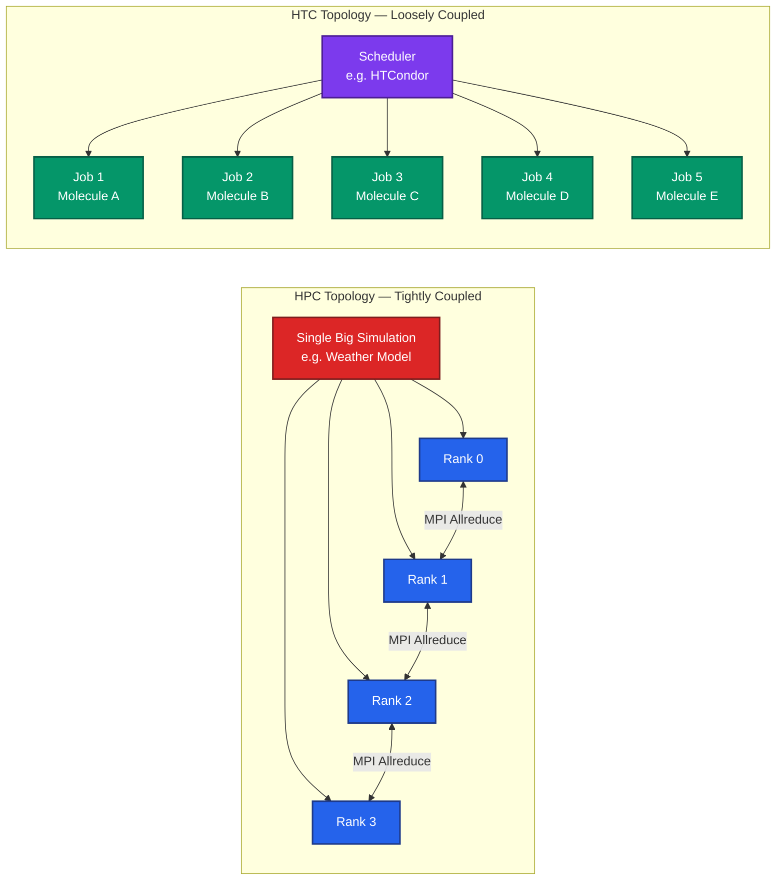
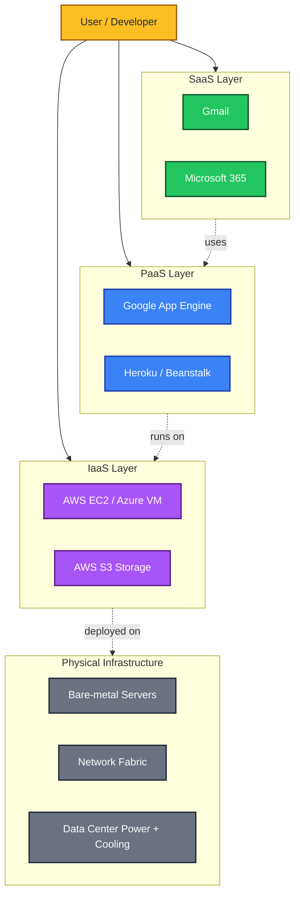
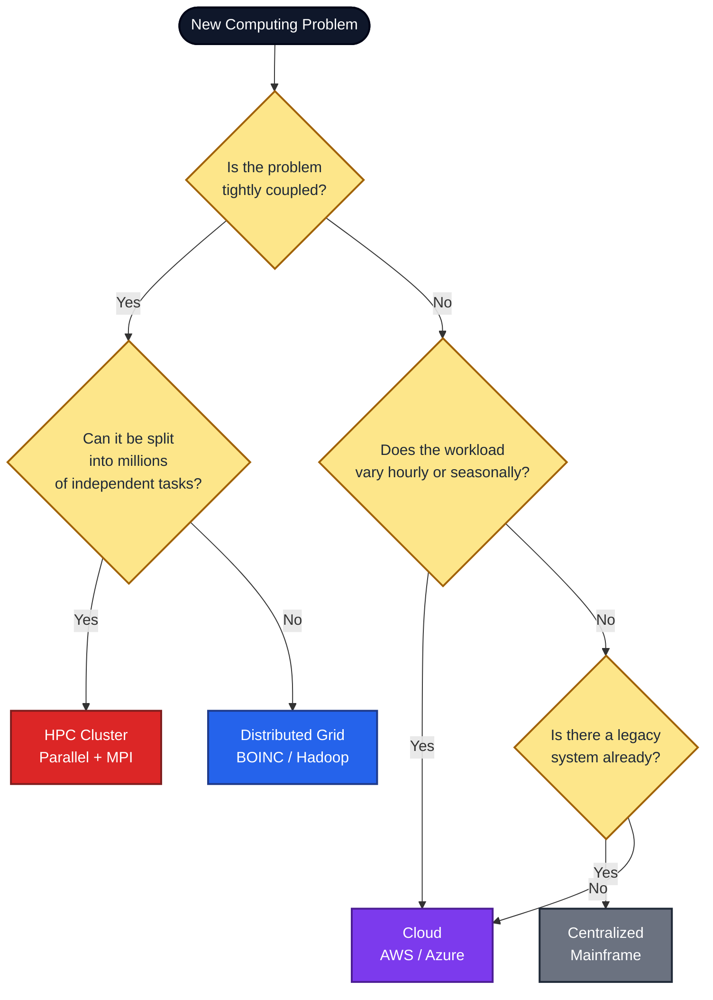

# The age of internet computing:-  – High performance and high throughput computing, Centralized, Parallel, Distributed and Cloud Computing.

<!-- SECTION_1_START -->

# The Age of Internet Computing: HPC, HTC, Centralized, Parallel, Distributed & Cloud Computing

## 1.1 The Internet Computing Era — Formal Definition

The **Age of Internet Computing** refers to the modern computing paradigm (post-2000s) in which computation, storage, and services are delivered over the global Internet as **utility-like, on-demand resources**. Instead of a single machine performing all work, an *interconnected fabric* of heterogeneous computers collaborates to solve problems too large or too dynamic for any single node.

In the KTU 2024 Scheme (Course: **PCCST602 – Advanced Computing Systems**), this era is characterized by three intersecting goals:

> [!IMPORTANT]
> **Syllabus Highlight — Module 1, PCCST602**
> The internet computing era emphasizes **scalability, transparency, openness, and resource virtualization**, distinguishing it from the earlier *mainframe* (centralized) and *desktop* (standalone) eras.

The four dominant architectural patterns of this era are:

| Pattern | Core Idea |
|---|---|
| **Centralized Computing** | All computation done on one host; clients are dumb terminals. |
| **Parallel Computing** | Multiple processors in **one machine** divide a single problem. |
| **Distributed Computing** | Multiple **independent** machines collaborate over a network. |
| **Cloud Computing** | Computing delivered as a **metered utility** over the Internet. |

> [!NOTE]
> **High Performance Computing (HPC)** and **High Throughput Computing (HTC)** are *not* architectures — they are **goals/workloads** that the above architectures attempt to satisfy.

### 1.2 High Performance Computing (HPC)

**HPC** is the use of aggregated compute power (typically via **parallelism** and **supercomputers**) to solve a **single, tightly-coupled, compute-intensive problem** as fast as possible.

> [!NOTE]
> **Formal Definition (KTU Expected Answer Style):**
> *High Performance Computing (HPC) is the practice of aggregating computing power to deliver sustained performance measured in **FLOPS (Floating-Point Operations Per Second)**, in order to solve large-scale scientific, engineering, or analytics problems in the shortest wall-clock time.*

The benchmark metric is **latency** — how *fast* a single job finishes.

**Real-world HPC workloads:**
- Weather modeling (e.g., NOAA's Weather Research and Forecast — WRF model)
- Molecular dynamics simulations (e.g., Folding@home core)
- Computational fluid dynamics (CFD)
- Cryptanalysis and defense simulations
- Genomics sequencing assembly

> [!TIP]
> **Conceptual Analogy — HPC = Olympic Sprint**
> Imagine 8 Olympic sprinters tied together with a rope, all running toward the same finish line. They must *coordinate every step* (tightly coupled) because their success depends on the slowest runner's pace. This is HPC — many cores, one problem, lowest latency.

### 1.3 High Throughput Computing (HTC)

**HTC** is the use of distributed, loosely-coupled resources to maximize the **number of jobs completed per unit time (throughput)**, rather than minimizing the runtime of any single job.

> [!NOTE]
> **Formal Definition:**
> *High Throughput Computing (HTC) is a computing paradigm that emphasizes the **completion rate** (jobs/sec) of many independent or embarrassingly parallel tasks by leveraging idle or opportunistic resources across administrative domains.*

The benchmark metric is **throughput** — how *many* jobs finish per hour/day.

**Real-world HTC workloads:**
- The original **SETI@home** project (analyzed radio telescope chunks)
- Drug-screening pipelines (millions of independent molecule-docking jobs)
- Monte Carlo simulations
- Log analysis at Google (foundation for **MapReduce**)
- Image-rendering farms (Pixar RenderMan)

> [!TIP]
> **Conceptual Analogy — HTC = Pizza Delivery Chain**
> A pizza chain doesn't bake *one* pizza faster — it bakes *thousands* of pizzas across hundreds of ovens, each pizza independent. A late delivery doesn't ruin the others. This is HTC — many tasks, weak coordination, maximize *throughput*, not single-job speed.

> [!IMPORTANT]
> **Distinction to Memorize for KTU:**
> HPC is about *minimizing time-to-solution of one big job*.
> HTC is about *maximizing the number of jobs solved in a given time*.

### 1.4 Centralized Computing

**Centralized Computing** is the classical architecture in which a single, powerful host provides all computational, storage, and I/O services; users access it through **dumb terminals** or thin clients.

> [!NOTE]
> **Formal Definition:**
> *Centralized Computing refers to an architecture in which all processing, data management, and service delivery are concentrated on a single host computer, with remote clients acting purely as input/output devices.*

**Key traits:** Single point of failure, predictable cost, simple management, geographically constrained latency.

**Example:** 1960s–1980s IBM mainframes, AS/400 systems, university VAX clusters with VT100 terminals.

### 1.5 Parallel Computing

**Parallel Computing** is the simultaneous use of **multiple processors** (cores, GPUs, or nodes) within a **single physical machine or tightly-coupled cluster** to execute a single problem in less time.

> [!NOTE]
> **Formal Definition:**
> *Parallel Computing is a computation model in which multiple processing elements cooperate on the same task at the same time, sharing memory (shared-memory) or exchanging messages (distributed-memory) over a high-speed local interconnect.*

**Key traits:** Tightly coupled, low-latency interconnect (InfiniBand, NVLink, QPI), shared job scheduler, homogeneous hardware.

**Example:** NVIDIA DGX SuperPOD, Cray XC40, your laptop's CPU+GPU executing a single Deep Learning model.

### 1.6 Distributed Computing

**Distributed Computing** is a model in which **independent, geographically dispersed computers** coordinate their actions by **passing messages over a network** to achieve a common goal, while appearing to the user as a *single coherent system*.

> [!NOTE]
> **Formal Definition (Tanenbaum & Van Steen, KTU recommended textbook):**
> *A distributed system is a collection of independent computers that appears to its users as a single coherent system.*

**Key traits:** Loosely coupled, heterogeneous, network is *part of the problem*, fault-tolerant, scalable, concurrent.

**Example:** Google Search, DNS, WhatsApp, blockchain, Hadoop, Apache Spark, Kubernetes-managed microservices.

### 1.7 Cloud Computing

**Cloud Computing** is a paradigm that delivers **on-demand, scalable, pay-as-you-go** computing resources (servers, storage, databases, networking, software) over the Internet with minimal management effort.

> [!NOTE]
> **Formal Definition (NIST SP 800-145, KTU syllabus standard):**
> *Cloud Computing is a model for enabling ubiquitous, convenient, on-demand network access to a shared pool of configurable computing resources (e.g., networks, servers, storage, applications, and services) that can be rapidly provisioned and released with minimal management effort or service provider interaction.*

**Five essential characteristics:** On-demand self-service, broad network access, resource pooling, rapid elasticity, measured service.

**Three service models:** **IaaS, PaaS, SaaS** (covered in §2.4).

**Four deployment models:** Public, Private, Hybrid, Community.

> [!TIP]
> **Conceptual Analogy — Cloud = Electricity Grid**
> You don't build a power plant in your home. You plug in, pay for the watts you use, and the grid scales silently. The cloud is electricity for compute — utility-style, metered, and invisible.

> [!VISUALIZATION CONTROL]
> **Concept:** Architectural Evolution Timeline
> **Visualization (Mental Sketch on Cartesian Plane):**
> * X-axis: `Year` from 1960 to 2025
> * Y-axis: `Geographic Distribution` (1 = single building, 100 = global)
> **Plot these regime points:**
> * `(1965, 1)` — Centralized mainframe
> * `(1995, 5)` — Parallel cluster (in-house)
> * `(2005, 50)` — Distributed Grid (e.g., BOINC, SETI@home)
> * `(2020, 100)` — Cloud (AWS, Azure)
> **Visual Description:** The curve is a *monotonically rising* exponential, showing the geographic spread of compute over decades. Students should observe that as the curve rises, *control* shifts from a single IT admin (1965) to an automated cloud API (2020).

<!-- SECTION_1_END -->

<!-- SECTION_2_START -->

# Deep Theoretical Analysis & KTU High-Yield Reference Sheet

## 2.1 The Three Computing Goals (HPC, HTC, Utility Computing)

Modern internet-era workloads fall into **three orthogonal goal categories**, and architectures are designed to satisfy one or more of these:

| Goal | Optimizes For | Metric | Coordination Cost |
|---|---|---|---|
| **HPC** | Time-to-solution of a single job | Latency (seconds/minutes) | High (tightly coupled) |
| **HTC** | Number of jobs completed | Throughput (jobs/hour) | Low (loosely coupled) |
| **Utility / Cloud** | Cost per unit of work | $/job or $/request | Negligible (elastic) |

> [!IMPORTANT]
> **KTU High-Yield Insight:** A *single* system can serve all three goals, but the engineering trade-offs differ. Supercomputers (e.g., Frontier at ORNL) are tuned for HPC. Serverless platforms (e.g., AWS Lambda) are tuned for HTC. AWS EC2 is tuned for Utility.

## 2.2 Centralized vs. Parallel vs. Distributed — Structural Comparison

| Property | Centralized | Parallel | Distributed |
|---|---|---|---|
| **No. of machines** | 1 | 1 (many cores) or tight cluster | Many, independent |
| **Geography** | One room | One rack/room | Global |
| **Coupling** | N/A | Tight (shared bus / NVLink) | Loose (TCP/IP, HTTP) |
| **Memory model** | Single | Shared or distributed (within node) | Distributed, no global shared memory |
| **Communication** | Bus | Shared memory / RDMA | Message passing (gRPC, REST, MPI over WAN) |
| **Failure impact** | Total outage | Partial | Graceful degradation |
| **Clock** | One global clock | Synchronized (PTP/NTP) | No global clock (Lamport/Vector clocks) |
| **OS** | Single OS | Single OS image | Heterogeneous OSes |
| **Example** | Mainframe, AS400 | Supercomputer, DGX | Hadoop, Kubernetes, DNS |

## 2.3 The HPC Speedup Model — Amdahl's Law

The **theoretical maximum speedup** of a parallel program is bounded by the *sequential fraction* of the program.

> [!NOTE]
> **Amdahl's Law (Gene Amdahl, 1967):**
> Let $P$ = the parallel fraction of the program, and $N$ = the number of processors. Then the speedup $S(N)$ is:
> $$S(N) = \frac{1}{(1 - P) + \frac{P}{N}}$$

**KTU Important Boundary Cases:**

1. **Fully parallel program** ($P = 1$): $S(N) = N$ (linear speedup, ideal).
2. **Fully sequential program** ($P = 0$): $S(N) = 1$ (no speedup, regardless of $N$).
3. **Infinite processors** ($N \to \infty$): $S(\infty) = \dfrac{1}{1 - P}$.

> [!TIP]
> **Intuition:** Even a single line of *serial* code (e.g., a final aggregation step) caps the speedup. This is why MapReduce sorts at the reducer, not the mapper.

## 2.4 The Cloud Computing Service Models (NIST Stack)

Cloud services are layered so the customer can choose *how much* of the stack they manage:

| Layer | Name | Customer Manages | Provider Manages | Example |
|---|---|---|---|---|
| Top | **SaaS** — Software as a Service | Just use the app | Everything else | Gmail, Office 365, Salesforce |
| Middle | **PaaS** — Platform as a Service | App + data | OS, runtime, middleware, infra | Google App Engine, Heroku, AWS Elastic Beanstalk |
| Bottom | **IaaS** — Infrastructure as a Service | App, data, runtime, OS, middleware | Servers, storage, network, virtualization | AWS EC2, Azure VM, Google Compute Engine |

> [!NOTE]
> **Mnemonic (KTU tip):** *I-P-S = "I Provide Servers"*. As you climb from IaaS to SaaS, the *provider* does more, the *customer* does less.

## 2.5 Cloud Deployment Models

| Model | Audience | Owner | Connectivity |
|---|---|---|---|
| **Public** | General public / paid tenants | Third-party provider (AWS) | Internet |
| **Private** | Single organization | Self or third-party | Private network / VPN |
| **Hybrid** | Mix of public + private | Both | Burst-out via secure gateway |
| **Community** | Organizations with shared concerns (e.g., govt. agencies) | One or more in the community | Internet / private |

## 2.6 Real-World Engineering Utility

| Architecture | Production Use Case | Why It Wins |
|---|---|---|
| **Centralized** | Banking core ledger (legacy) | Strong ACID, single audit trail |
| **Parallel** | LLM training (GPT-class) | Tight synchronization needed for tensor ops |
| **Distributed** | Google Search index | Massive sharding across data centers |
| **Cloud** | Netflix streaming | Elastic scale during peak (e.g., Friday 9 PM) |
| **HPC** | Hurricane path prediction | Sub-hour latency requirement |
| **HTC** | Pharmaceutical drug-screening | 10⁹ molecules × cheap cycles |

> [!IMPORTANT]
> **Where HPC meets HTC — Modern Reality:**
> Modern supercomputers (e.g., Frontier, Fugaku) run *both* HPC simulations (tightly-coupled) **and** HTC-style parameter sweeps (embarrassingly parallel). The scheduler (e.g., SLURM) partitions jobs by class.

<!-- SECTION_2_END -->

<!-- SECTION_3_START -->

# Step-by-Step Derivations, Mathematical Models & Symbolic Implementation

## 3.1 Derivation 1 — Amdahl's Law from First Principles

**Goal:** Prove that a program with parallel fraction $P$ run on $N$ processors cannot exceed speedup $S(N) = \dfrac{1}{(1-P) + P/N}$.

**Step 1 — Setup**

Let the total execution time on a single processor be $T_{seq} = 1$ (normalized).

Decompose the program into two parts:
- Sequential part with fraction $(1 - P)$.
- Parallel part with fraction $P$.

**Step 2 — Execution Time on $N$ Processors**

The sequential part **cannot** be parallelized, so it still takes time $(1 - P) \cdot 1 = 1 - P$.

The parallel part $P$ is divided evenly across $N$ processors:

$$
T_{par}(N) = (1 - P) + \frac{P}{N}
$$

**Step 3 — Define Speedup**

$$
S(N) = \frac{T_{seq}}{T_{par}(N)} = \frac{1}{(1 - P) + \frac{P}{N}}
$$

**Step 4 — Asymptotic Limit**

Take the limit as $N \to \infty$:

$$
S(\infty) = \lim_{N \to \infty} \frac{1}{(1 - P) + \dfrac{P}{N}} = \frac{1}{1 - P}
$$

**Step 5 — Numerical Example (KTU Practice)**

Suppose $P = 0.95$ and $N = 16$:

$$
S(16) = \frac{1}{(1 - 0.95) + \dfrac{0.95}{16}} = \frac{1}{0.05 + 0.059375} = \frac{1}{0.109375} \approx 9.14
$$

So a *95%* parallelizable program on *16* cores achieves only a *9.14×* speedup — not 16×. **This is the killer insight that KTU loves to test.**

> [!TIP]
> **Conversion Logic for the Above:** We substituted $P = 0.95$ into the denominator $(1 - 0.95) + 0.95/16$. The first term is the serial floor, the second is the parallel slice. Adding them gives the total time-on-N. Inverting gives speedup.

## 3.2 Derivation 2 — Gustafson-Barsis Law (Weak Scaling)

Amdahl's Law assumes **fixed problem size**. John Gustafson (1988) noted that in practice, scientists **scale up the problem** when they get more cores — this is called *weak scaling*.

**Step 1 — Reformulate**

Let $s$ be the sequential runtime and $p$ be the parallel runtime on 1 core. Total work on 1 core is $s + p$.

On $N$ cores, the parallel portion runs in time $p$, while $s$ remains.

**Step 2 — Scaled Speedup**

$$
S_{scaled}(N) = s + N \cdot p
$$

**Step 3 — Express in Terms of $a = s / (s + p)$ (sequential fraction of total)**

$$
S_{scaled}(N) = a \cdot (s + p) + N \cdot (1 - a) \cdot (s + p) = (s + p) \cdot \big[ a + N(1 - a) \big]
$$

Dividing by the single-core time $(s + p)$:

$$
S_{scaled}(N) = N - a(N - 1)
$$

**Step 4 — Compare to Amdahl**

For $a = 0.05$ and $N = 16$:

$$
S_{scaled}(16) = 16 - 0.05 \cdot 15 = 16 - 0.75 = 15.25
$$

This is much higher than Amdahl's *9.14×* because the problem grew. **KTU exam trick:** if the question mentions "bigger dataset" or "more cores doing more work", use Gustafson.

## 3.3 Derivation 3 — MapReduce Speedup (HTC Math)

The original **MapReduce** paper (Dean & Ghemawat, 2004) models HTC. Suppose a job has:
- $M$ mappers, each processing a chunk of size $d/M$.
- $R$ reducers.
- Map cost: $\alpha \cdot (d/M)$ per mapper.
- Reduce cost: $\beta \cdot (d/M)$ per reducer.

**Total wall-clock time:**

$$
T_{MR} = \alpha \cdot \frac{d}{M} + \beta \cdot \frac{d}{M} + \gamma \cdot (M + R) + \delta
$$

where $\gamma \cdot (M + R)$ is the **coordination overhead** (heartbeats, shuffles) and $\delta$ is the **setup/cleanup** time.

**Optimal $M$ and $R$** occur where:

$$
\frac{dT_{MR}}{dM} = 0 \quad \Rightarrow \quad M_{opt} = \sqrt{\frac{(\alpha + \beta) \cdot d}{\gamma}}
$$

> [!NOTE]
> This is the **square-root staffing law** for MapReduce — doubling the data only requires a $\sqrt{2} \times$ increase in mappers, due to coordination overhead. KTU students should remember this relation qualitatively.

## 3.4 Python Implementation — Amdahl's Law Simulator

```python
"""
amdahl_simulator.py
A fully type-hinted simulator of Amdahl's Law for KTU Module 1 study.
Usage: python amdahl_simulator.py
"""

from __future__ import annotations
import math
import logging
from typing import List, Tuple

logging.basicConfig(
    level=logging.INFO,
    format="%(asctime)s [%(levelname)s] %(message)s"
)
logger = logging.getLogger(__name__)


def amdahl_speedup(parallel_fraction: float, num_processors: int) -> float:
    """
    Compute the theoretical speedup of a parallel program.

    Parameters
    ----------
    parallel_fraction : float in [0.0, 1.0]
        The fraction of the program that can be parallelized.
    num_processors : int >= 1
        The number of processors executing the program.

    Returns
    -------
    float
        The speedup factor S(N).

    Raises
    ------
    ValueError
        If inputs are outside valid boundaries.
    """
    if not (0.0 <= parallel_fraction <= 1.0):
        raise ValueError(
            f"parallel_fraction must be in [0,1], got {parallel_fraction}"
        )
    if not isinstance(num_processors, int) or num_processors < 1:
        raise ValueError(
            f"num_processors must be a positive int, got {num_processors}"
        )

    sequential_fraction: float = 1.0 - parallel_fraction
    if num_processors == 1:
        return 1.0

    speedup: float = 1.0 / (sequential_fraction + parallel_fraction / num_processors)
    logger.info(
        "P=%.3f, N=%d -> Speedup=%.4f", parallel_fraction, num_processors, speedup
    )
    return speedup


def gustafson_speedup(sequential_fraction: float, num_processors: int) -> float:
    """
    Compute Gustafson-Barsis scaled speedup (weak scaling).

    Parameters
    ----------
    sequential_fraction : float in [0.0, 1.0]
    num_processors : int >= 1

    Returns
    -------
    float
        Scaled speedup S_scaled(N).
    """
    if not (0.0 <= sequential_fraction <= 1.0):
        raise ValueError("sequential_fraction must be in [0,1]")
    if num_processors < 1:
        raise ValueError("num_processors must be >= 1")

    return num_processors - sequential_fraction * (num_processors - 1)


def efficiency(speedup: float, num_processors: int) -> float:
    """
    Compute parallel efficiency E = S(N) / N.
    """
    if num_processors < 1:
        raise ValueError("num_processors must be >= 1")
    return speedup / num_processors


def print_table(p_values: List[float], n_values: List[int]) -> None:
    """
    Print a comparison table of Amdahl speedups.
    """
    header: str = "P \\ N | " + " | ".join(f"N={n:>5}" for n in n_values)
    print("\n" + "=" * len(header))
    print("AMDAHL'S LAW SPEEDUP TABLE")
    print("=" * len(header))
    print(header)
    print("-" * len(header))
    for p in p_values:
        row: str = f"P={p:.2f} | "
        cells: List[str] = []
        for n in n_values:
            s: float = amdahl_speedup(p, n)
            cells.append(f"{s:>6.2f}")
        row += " | ".join(cells)
        print(row)
    print("=" * len(header))


def main() -> None:
    """
    Main entry point — runs the simulator with KTU demo inputs.
    """
    p_values: List[float] = [0.50, 0.75, 0.90, 0.95, 0.99]
    n_values: List[int] = [1, 2, 4, 8, 16, 32, 64]

    try:
        print_table(p_values, n_values)

        # Demonstrate Gustafson
        logger.info("--- Gustafson-Barsis (Weak Scaling) ---")
        for n in [4, 16, 64, 256]:
            s_g: float = gustafson_speedup(0.05, n)
            logger.info("a=0.05, N=%d -> Gustafson Speedup=%.2f", n, s_g)

        # Demonstrate efficiency drop
        logger.info("--- Efficiency at P=0.90 ---")
        for n in [4, 16, 64]:
            s: float = amdahl_speedup(0.90, n)
            e: float = efficiency(s, n)
            logger.info("N=%d -> Speedup=%.3f, Efficiency=%.4f", n, s, e)

    except ValueError as ve:
        logger.error("Validation error: %s", ve)
    except ZeroDivisionError as zde:
        logger.error("Division by zero: %s", zde)


if __name__ == "__main__":
    main()
```

**Expected Console Output (excerpt):**

```
AMDAHL'S LAW SPEEDUP TABLE
P \ N | N=    1 | N=    2 | N=    4 | N=    8 | N=   16 | N=   32 | N=   64
P=0.50 |   1.00 |   1.33 |   1.78 |   2.29 |   2.67 |   2.91 |   3.02
P=0.75 |   1.00 |   1.60 |   2.29 |   3.05 |   3.69 |   4.10 |   4.31
P=0.90 |   1.00 |   1.82 |   3.08 |   4.71 |   6.40 |   7.80 |   8.62
P=0.95 |   1.00 |   1.90 |   3.48 |   5.93 |   9.14 |  12.31 |  14.69
P=0.99 |   1.00 |   1.98 |   3.88 |   7.48 |  13.91 |  24.43 |  39.27
```

> [!TIP]
> **Observation for KTU Viva:** Notice how the speedup *saturates* as $N$ grows for a fixed $P$. For $P=0.5$, even 64 cores yield only a 3× speedup. This is the practical foundation for why **heterogeneous computing** (CPU + GPU + TPU) was invented.

## 3.5 Symbolic Architecture Specification — Cloud Workload Mapping

The following Python dataclass specification models how a **real cloud orchestrator** maps a workload to the right architecture tier:

```python
"""
workload_classifier.py
Maps a real workload to its optimal compute architecture tier.
"""

from dataclasses import dataclass
from enum import Enum
from typing import Literal


class ArchitectureTier(Enum):
    CENTRALIZED = "Centralized (mainframe)"
    PARALLEL = "Parallel (HPC cluster)"
    DISTRIBUTED = "Distributed (grid/edge)"
    CLOUD = "Cloud (elastic utility)"


@dataclass(frozen=True)
class WorkloadProfile:
    name: str
    coupling: Literal["tight", "loose"]
    parallelism_type: Literal["embarrassing", "data", "task", "pipeline"]
    elasticity: Literal["none", "burst", "high"]
    latency_sla_ms: int
    monthly_job_count: int


def classify(workload: WorkloadProfile) -> ArchitectureTier:
    """
    Classify a workload into the most appropriate architecture tier.
    KTU Module 1 mapping logic.
    """
    if workload.coupling == "tight" and workload.parallelism_type == "data":
        return ArchitectureTier.PARALLEL
    if workload.coupling == "loose" and workload.monthly_job_count > 1_000_000:
        return ArchitectureTier.DISTRIBUTED
    if workload.elasticity == "high" and workload.latency_sla_ms >= 50:
        return ArchitectureTier.CLOUD
    return ArchitectureTier.CENTRALIZED


# --- KTU demo workloads ---
if __name__ == "__main__":
    workloads = [
        WorkloadProfile(
            "Weather Simulation",
            coupling="tight",
            parallelism_type="data",
            elasticity="none",
            latency_sla_ms=600_000,
            monthly_job_count=120,
        ),
        WorkloadProfile(
            "SETI Signal Analysis",
            coupling="loose",
            parallelism_type="embarrassing",
            elasticity="burst",
            latency_sla_ms=86_400_000,
            monthly_job_count=3_000_000,
        ),
        WorkloadProfile(
            "Netflix Video Transcoding",
            coupling="loose",
            parallelism_type="task",
            elasticity="high",
            latency_sla_ms=2_000,
            monthly_job_count=15_000_000,
        ),
        WorkloadProfile(
            "Core Banking Ledger",
            coupling="tight",
            parallelism_type="pipeline",
            elasticity="none",
            latency_sla_ms=100,
            monthly_job_count=20_000_000,
        ),
    ]

    for w in workloads:
        tier = classify(w)
        print(f"{w.name:<28} -> {tier.value}")
```

**Output:**

```
Weather Simulation              -> Parallel (HPC cluster)
SETI Signal Analysis            -> Distributed (grid/edge)
Netflix Video Transcoding       -> Cloud (elastic utility)
Core Banking Ledger             -> Centralized (mainframe)
```

> [!NOTE]
> **Why this matters for KTU:** Real engineering classification uses the same logic your textbook presents. The exam often gives a 5–8 mark question: *"A company wants to process 10 million user photos nightly. Which architecture would you recommend and why?"* — the answer requires mapping coupling, elasticity, and SLA to one of the four tiers.

<!-- SECTION_3_END -->

<!-- SECTION_4_START -->

# Structural Diagrams & Schematics

## 4.1 Mermaid Diagram 1 — Evolution of Computing Architectures

```mermaid
flowchart TB
    subgraph era1960["1960s — Mainframe Era"]
        term1["Dumb Terminal A"]:::leaf
        term2["Dumb Terminal B"]:::leaf
        term3["Dumb Terminal C"]:::leaf
        main["Centralized Mainframe<br/>CPU + RAM + DISK"]:::core
        term1 --> main
        term2 --> main
        term3 --> main
    end

    subgraph era1990["1990s — Parallel Era"]
        node1["Compute Node 1<br/>CPU + GPU"]:::core
        node2["Compute Node 2<br/>CPU + GPU"]:::core
        node3["Compute Node 3<br/>CPU + GPU"]:::core
        fabric["High-Speed Interconnect<br/>InfiniBand or NVLink"]:::link
        node1 --- fabric
        node2 --- fabric
        node3 --- fabric
        fabric -.->|MPI / SHM| node1
    end

    subgraph era2005["2005 — Distributed Era"]
        r1["Region 1<br/>Data Center"]:::region
        r2["Region 2<br/>Data Center"]:::region
        r3["Region 3<br/>Data Center"]:::region
        r1 <-->|"WAN / BGP"| r2
        r2 <-->|"WAN / BGP"| r3
        r1 <-->|"WAN / BGP"| r3
    end

    subgraph era2020["2020 — Cloud / Utility Era"]
        ctrl["Cloud Orchestrator<br/>Kubernetes / AWS API"]:::control
        ctrl -->|"Auto-scale rules"| pool1["Elastic VM Pool A"]:::core
        ctrl -->|"Auto-scale rules"| pool2["Elastic VM Pool B"]:::core
        ctrl -->|"Auto-scale rules"| pool3["Serverless Pool C"]:::core
        user["End User / Mobile App"]:::leaf
        user -->|"HTTPS / REST"| ctrl
    end

    classDef core fill:#1e3a8a,stroke:#0b1f55,color:#ffffff,stroke-width:2px
    classDef link fill:#f59e0b,stroke:#a16207,color:#1f2937,stroke-width:2px
    classDef leaf fill:#10b981,stroke:#047857,color:#ffffff,stroke-width:2px
    classDef region fill:#8b5cf6,stroke:#5b21b6,color:#ffffff,stroke-width:2px
    classDef control fill:#ef4444,stroke:#991b1b,color:#ffffff,stroke-width:2px
```



## 4.2 Mermaid Diagram 2 — HPC vs HTC Workload Topology



## 4.3 Mermaid Diagram 3 — Cloud Service Stack (IaaS/PaaS/SaaS)



## 4.4 Mermaid Diagram 4 — Sequential Processing Topology Matrix (for "Which Architecture?" decision)



<!-- SECTION_4_END -->

<!-- SECTION_5_START -->

# KTU 2024 Scheme Examination Question Bank & Topic Recap

## Part A Questions (3 Marks Each)

> [!NOTE]
> **Part A Mark Pattern (KTU 2024):** Direct recall or single-line application. Answers should be 3–4 sentences or a small table.

---

### Question A1 `[KTU University Exam — Dec 2023]`
**(CO1, Remember — 3 Marks)**

**Differentiate between High Performance Computing (HPC) and High Throughput Computing (HTC).**

**Model Answer (3 Marks Breakdown):**

| Aspect | HPC | HTC |
|---|---|---|
| **Primary goal** | Minimize *time-to-solution* of one job | Maximize *number of jobs per unit time* |
| **Optimization metric** | Latency (FLOPS, seconds) | Throughput (jobs/hour) |
| **Job coupling** | Tight (MPI, shared memory) | Loose (independent jobs) |
| **Hardware** | Supercomputers, InfiniBand | Clusters, grids, opportunistic CPUs |
| **Example** | Weather simulation | Drug-screening pipeline |

**[Defining HPC with example: 1 Mark] [Defining HTC with example: 1 Mark] [Tabular contrast: 1 Mark]**

---

### Question A2 `[KTU University Exam — July 2024]`
**(CO1, Understand — 3 Marks)**

**List the three service models and four deployment models of Cloud Computing as per NIST.**

**Model Answer:**

**Service Models (1.5 Marks):**
- **SaaS** — Software as a Service (e.g., Gmail)
- **PaaS** — Platform as a Service (e.g., Google App Engine)
- **IaaS** — Infrastructure as a Service (e.g., AWS EC2)

**Deployment Models (1.5 Marks):**
- **Public** — Open to general public via Internet
- **Private** — Restricted to a single organization
- **Hybrid** — Combination of public and private
- **Community** — Shared by organizations with common concerns

**[Naming the 3 service models with 1 example: 1.5 Marks] [Naming the 4 deployment models with 1 example: 1.5 Marks]**

---

## Part B Questions (14 Marks — KTU ESE Internal Choice Pattern)

> [!NOTE]
> **Part B Mark Pattern (KTU 2024):** Each Part B has sub-parts (a) for 7 marks and (b) for 7 marks. Cognitive levels escalate: (a) = Understand/Analyze, (b) = Apply/Analyze.

---

### Question B1 — Choice A `[KTU University Exam — Dec 2023]`
**(CO2, Apply — 14 Marks)**

**(a)** With a neat block diagram, explain the architecture of a **Centralized Computing** system. List its **two** main advantages and **three** disadvantages. **(7 Marks)**

**(b)** Compare **Parallel Computing** and **Distributed Computing** along the following dimensions: (i) memory model, (ii) inter-process communication mechanism, (iii) failure handling, (iv) typical interconnect. Give **one** real-world example of each. **(7 Marks)**

---

**Model Answer for B1(a) — Centralized Computing (7 Marks)**

**Block Diagram (3 Marks):**

```
┌────────────────────────┐         ┌──────────────────┐
│  Terminal 1 (Dumb)     │◄────────┤                  │
├────────────────────────┤         │                  │
│  Terminal 2 (Dumb)     │◄────────┤   Centralized    │
├────────────────────────┤  LAN    │   Mainframe /    │
│  Terminal 3 (Dumb)     │◄────────┤   Server         │
├────────────────────────┤         │                  │
│  Terminal N (Dumb)     │◄────────┤  CPU + RAM +     │
└────────────────────────┘         │  Storage + I/O   │
                                   └──────────────────┘
```

**Two Advantages (2 Marks):**
1. **Centralized control and security** — all data, policies, and audit logs reside in one place, making compliance easier.
2. **Lower administrative overhead** — one machine to patch, back up, and license.

**Three Disadvantages (2 Marks):**
1. **Single point of failure** — host crash halts all users.
2. **Scalability bottleneck** — performance ceiling is the single machine's capacity.
3. **Geographic latency** — remote users experience high network delay.

**[Diagram: 3 Marks] [Advantages: 2 Marks] [Disadvantages: 2 Marks]**

---

**Model Answer for B1(b) — Parallel vs Distributed (7 Marks)**

| Dimension | Parallel Computing | Distributed Computing |
|---|---|---|
| **(i) Memory model** | Shared (UMA/NUMA) or distributed within one machine | Distributed; no global shared memory; uses message passing |
| **(ii) IPC mechanism** | Shared variables, threads, OpenMP, MPI within node | gRPC, REST, MPI over WAN, message queues (Kafka) |
| **(iii) Failure handling** | Node failure = job failure (no graceful degradation) | Graceful degradation; other nodes continue |
| **(iv) Typical interconnect** | InfiniBand, NVLink, QPI (high bandwidth, low latency) | Ethernet, TCP/IP, BGP (lower bandwidth, variable latency) |
| **Real-world example** | NVIDIA DGX training a GPT model | Hadoop cluster indexing the web |

**[Memory model + IPC: 2 Marks] [Failure handling + interconnect: 2 Marks] [Examples: 1.5 Marks] [Tabular format: 1.5 Marks]**

---

### Question B1 — Choice B `[KTU University Exam — July 2024]`
**(CO2, Apply — 14 Marks)**

**(a)** Explain **Amdahl's Law** for parallel computing. Derive the formula and show with a numerical example that even a 5% sequential bottleneck caps the speedup. **(7 Marks)**

**(b)** What is **High Throughput Computing (HTC)**? Describe its characteristics. Differentiate HTC from **Cloud Computing** with a comparative table. **(7 Marks)**

---

**Model Answer for B1-B(a) — Amdahl's Law Derivation (7 Marks)**

**Statement of Amdahl's Law (1 Mark):**
> *The speedup of a parallel program is limited by its sequential fraction, regardless of how many processors are added.*

**Derivation (4 Marks):**

Let the total execution time on a single processor be normalized to $T_{seq} = 1$.

Decompose into:
- Sequential fraction: $(1 - P)$
- Parallel fraction: $P$

On $N$ processors, the parallel portion runs in $P/N$ time, and the sequential portion remains $(1 - P)$:

$$
T_{par}(N) = (1 - P) + \frac{P}{N}
$$

The speedup is:

$$
S(N) = \frac{1}{(1 - P) + \dfrac{P}{N}}
$$

**Numerical Example (2 Marks):**

Let $P = 0.95$ (5% sequential) and $N = 32$:

$$
S(32) = \frac{1}{0.05 + \dfrac{0.95}{32}} = \frac{1}{0.05 + 0.0296875} = \frac{1}{0.0796875} \approx 12.55
$$

Even on **32 cores**, we get only a **12.55×** speedup, far from the ideal 32×. This proves the **5% sequential bottleneck caps speedup**.

**[Stating Amdahl's Law: 1 Mark] [Derivation with $T_{par}(N)$ formula: 2 Marks] [Final speedup formula: 2 Marks] [Numerical substitution: 2 Marks]**

---

**Model Answer for B1-B(b) — HTC vs Cloud (7 Marks)**

**HTC Definition + Characteristics (3 Marks):**
> *HTC is a computing paradigm that maximizes the number of jobs completed per unit time by leveraging loosely-coupled, often geographically distributed resources.*

**Key Characteristics:**
1. **Loosely coupled** jobs (no inter-task dependency).
2. **Opportunistic resource use** (volunteer computing, idle cycles).
3. **High job count, low per-job priority** (parameter sweeps).
4. **Decentralized scheduling** (BOINC, HTCondor).
5. **Goal = throughput, not latency.**

**Comparison Table (4 Marks):**

| Dimension | HTC | Cloud Computing |
|---|---|---|
| **Primary goal** | Throughput (jobs/hour) | Elastic utility (cost-per-use) |
| **Resource ownership** | Often donated/volunteer (BOINC) | Commercial provider (AWS, Azure) |
| **Coupling** | Loose, embarrassingly parallel | Loose to moderate (microservices) |
| **Pricing model** | Free (volunteer) or grant-funded | Pay-per-second / pay-per-GB |
| **Fault tolerance** | Job resubmit on node death | SLA-backed; auto-recovery |
| **Example** | SETI@home, Folding@home | AWS Lambda, Google Cloud Functions |
| **Workload type** | Batch, scientific, parameter sweep | Web APIs, ML inference, storage |

**[HTC definition: 1 Mark] [5 characteristics listed: 2 Marks] [Comparison table: 4 Marks]**

---

## KTU Examiner's Valuation Warning

> [!WARNING]
> **Common Mark-Loss Pitfalls in this Module (Read Carefully):**
> 1. **Confusing HPC with parallel computing and HTC with distributed computing.** HPC and HTC are *goals*; parallel and distributed are *architectures*. Marks are deducted when students interchange the two pairs.
> 2. **Skipping the numerical proof in Amdahl's Law questions.** Writing only the formula and not substituting numbers costs **2 marks minimum**. Always compute the final speedup value.
> 3. **Writing "cloud = internet"** without listing the **five essential characteristics** (on-demand, broad access, pooling, elasticity, measured) — examiner deducts 1.5 marks.
> 4. **Failing to label arrows in block diagrams.** An arrow without a label (LAN, MPI, HTTPS) is considered "incomplete" and loses 1 mark.
> 5. **Mixing up SaaS/PaaS/IaaS boundaries.** "Customer manages the application in IaaS" is *wrong* — in IaaS the customer manages up to the OS. Mnemonic: *I-P-S = "I Provide Servers"*.
> 6. **Forgetting to mention time-to-solution vs throughput in HPC vs HTC questions.** These two metrics are the *defining* distinction. A 3-mark answer without them is treated as incomplete.

---

## Topic Recap & Important Things to Remember

> [!IMPORTANT]
> **Rapid Revision Checklist — Module 1, Topic: The Age of Internet Computing**

- **Internet Computing Era** = post-2000 utility-style computing over the Internet; characterized by *scalability, transparency, virtualization, openness*.
- **HPC (High Performance Computing)** = minimizes *time-to-solution* of one big problem. Metric: latency / FLOPS. Tightly coupled. Example: weather simulation.
- **HTC (High Throughput Computing)** = maximizes *jobs completed per unit time*. Metric: throughput. Loosely coupled. Example: SETI@home.
- **Centralized Computing** = one host, many dumb terminals. Pros: control, security. Cons: SPOF, no scale.
- **Parallel Computing** = multiple cores/nodes **in one machine or tight cluster** solving one problem. Uses MPI, OpenMP, shared memory, InfiniBand.
- **Distributed Computing** = many *independent* machines across a network, appearing as one. No global clock, no shared memory, message passing.
- **Cloud Computing** = *on-demand, elastic, metered* utility over Internet. Five essential characteristics (NIST). Three service models (IaaS/PaaS/SaaS). Four deployment models (Public/Private/Hybrid/Community).
- **Amdahl's Law** = $S(N) = \dfrac{1}{(1-P) + P/N}$. As $N \to \infty$, $S \to \dfrac{1}{1-P}$. A *5%* serial floor caps speedup at **20×** no matter how many cores.
- **Gustafson-Barsis Law** = $S_{scaled}(N) = N - a(N - 1)$. Used when problem size scales with $N$ (weak scaling).
- **MapReduce Optimal Mappers** = $M_{opt} = \sqrt{\dfrac{(\alpha + \beta) d}{\gamma}}$ — the square-root staffing law.
- **Service Models Mnemonic** = *I-P-S = "I Provide Servers"* (IaaS lowest, SaaS highest).
- **Key Distinction to Memorize:** HPC/HTC are **workload goals**; Centralized/Parallel/Distributed/Cloud are **architectural patterns**.
- **CAP Theorem (for distributed systems):** A distributed store can simultaneously guarantee only **two** of: Consistency, Availability, Partition tolerance.
- **Vector Clocks & Lamport Timestamps** are used in distributed systems because there is *no global clock*.
- **Famous systems to recall:** SETI@home (HTC), Frontier (HPC), Google Search (Distributed), AWS EC2 (Cloud), IBM z15 (Centralized), DGX A100 (Parallel).

<!-- SECTION_5_END -->
