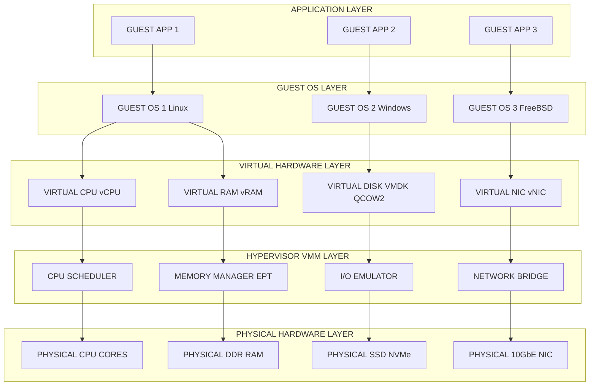
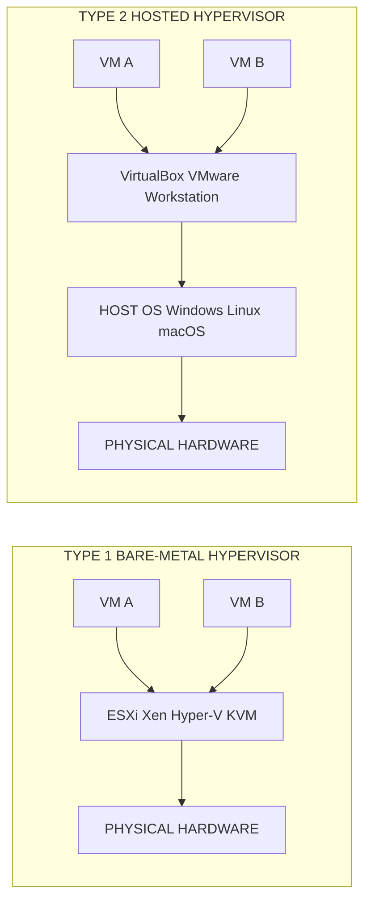
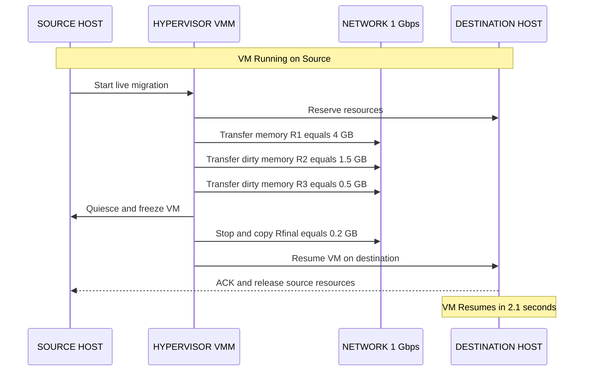
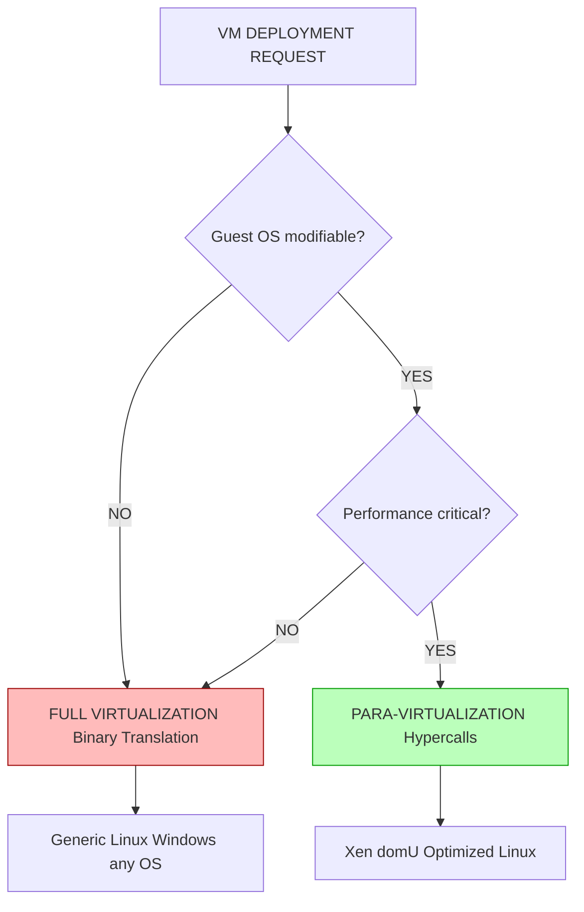
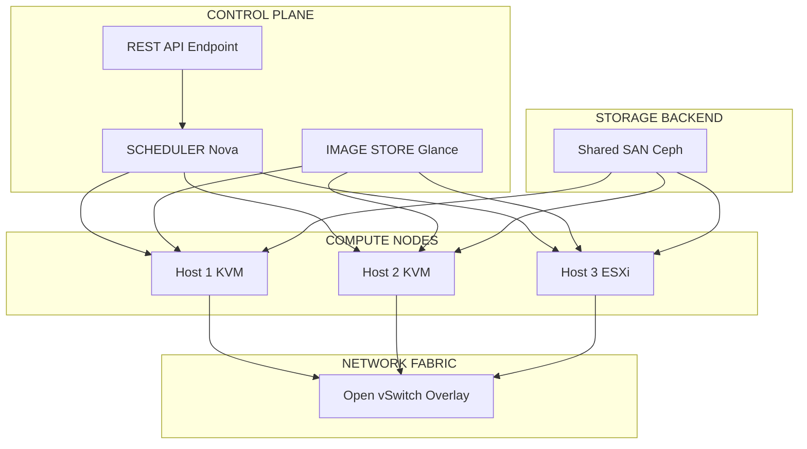

# Virtual Machines.

<!-- SECTION_1_START -->
# Virtual Machines in Distributed Systems

> [!NOTE]
> **KTU 2024 Scheme | PCCST602 | Module 1.4** — *Virtual Machines (VMs) are a foundational enabling technology for distributed computing, providing hardware-level abstraction, isolation, and resource multiplexing that underpin modern cloud platforms like AWS EC2, Azure VMs, and Google Compute Engine.*

## 1.1 Formal Academic Definition

A **Virtual Machine (VM)** is a software-emulated replica of a physical computing system that executes programs just like a real machine, using one of two architectural strategies:

- **System Virtual Machine** — Provides a complete system environment (CPU, memory, I/O, BIOS) capable of running an entire operating system. *Used in server consolidation, cloud computing, and distributed testbeds.*
- **Process Virtual Machine** — Provides a platform-independent programming environment for a single process. *Examples: Java Virtual Machine (JVM), Microsoft .NET CLR.*

A **Hypervisor** (also called *Virtual Machine Monitor — VMM*) is the control software that creates, runs, and manages multiple VMs on a single physical host by allocating the underlying hardware resources dynamically.

> [!IMPORTANT]
> **KTU Board Definition (Memorize Verbatim):**
> *"A Virtual Machine is a tightly isolated software container with its own operating system and applications, behaving like a physical computer, managed by a hypervisor layer that arbitrates access to the shared physical hardware."*

## 1.2 Conceptual Analogy — The Building Analogy

Imagine a **single physical building** (the host server). Now, a **real estate developer** (the hypervisor) constructs **multiple independent apartments** inside it (the VMs). Each apartment has:

- Its own entrance, walls, plumbing, and electricity meter (CPU, RAM, I/O),
- Its own residents and furniture (OS + applications),
- A clear boundary that prevents noise/leaks from spilling into neighbors (isolation).

From the outside, every apartment *appears* to be a separate standalone house, but in reality, they all share the same foundation, structural pillars, and utility lines (the physical CPU cores, RAM modules, and NICs).

> [!TIP]
> **Why does this matter in Distributed Systems?**
> VMs enable *server consolidation*, *fault isolation*, *live migration*, and *elastic scaling* — all critical properties of distributed data centers and cloud-native architectures.

## 1.3 Taxonomy of Virtualization

| **Virtualization Type** | **Description** | **Distributed Systems Use-Case** |
|---|---|---|
| **Hardware / Server Virtualization** | Abstracts entire physical server | Cloud IaaS (EC2, Azure VM) |
| **OS-level Virtualization (Containers)** | Shares host OS kernel | Docker, Kubernetes pods |
| **Storage Virtualization** | Pools multiple physical disks | SAN, Ceph, HDFS |
| **Network Virtualization** | Abstracts physical network into logical overlays | SDN, VXLAN, NV |
| **Application / Process Virtualization** | Runs application in platform-agnostic runtime | JVM, .NET CLR, BEAM |

> [!NOTE]
> **KTU Distinction:** Containers (Docker) are *NOT* the same as VMs. Containers virtualize the **OS layer**, while VMs virtualize the **hardware layer**. This is a frequently asked 3-mark question.

## 1.4 Physical Constants & Standard Metrics

- **Overhead (O):** The performance penalty introduced by virtualization, typically $O = 5\% \text{ to } 15\%$ for CPU-bound workloads.
- **Memory Overcommit Ratio (MOR):** Standard production ratio $MOR = 1.5{:}1$ to $4{:}1$.
- **vCPU-to-pCPU Ratio:** Default cloud ratio $R_{vCPU:pCPU} = 2{:}1$ to $8{:}1$.
- **Live Migration Downtime (VMware vMotion):** Typically $D_{mig} \leq 2$ seconds.
- **VM Density:** Modern hypervisors support $\geq 100$ VMs per host.
<!-- SECTION_1_END -->

<!-- SECTION_2_START -->
# Deep Theoretical Analysis & KTU High-Yield Formula Sheet

## 2.1 Hypervisor Architecture — The Core of VM Operation

A hypervisor is the *traffic controller* between guest VMs and physical hardware. It intercepts and translates four classes of privileged operations:

1. **CPU Instructions** — Ring-deprivileging via VT-x / AMD-V hardware extensions.
2. **Memory Accesses** — Extended Page Tables (EPT) / Nested Page Tables (NPT).
3. **I/O Operations** — Emulated or para-virtualized device drivers.
4. **Interrupt Handling** — Virtual Interrupt Controller (APICv).

### 2.1.1 Type 1 (Bare-Metal) Hypervisor

Runs **directly on the host's hardware** with no host OS intermediary. Highest performance, lowest overhead. *Examples:* VMware ESXi, Microsoft Hyper-V Server, Xen, Citrix XenServer, KVM (when operating as the host kernel).

### 2.1.2 Type 2 (Hosted) Hypervisor

Runs as a **user-space application on top of a conventional host OS** (Windows, Linux, macOS). Easier to install; suitable for development and testing. *Examples:* Oracle VirtualBox, VMware Workstation, Parallels Desktop, QEMU.

> [!IMPORTANT]
> **KTU Memory Trick:** *"Type 1 = Touching iron (bare metal); Type 2 = Two layers (OS + app)."*

## 2.2 Virtualization Implementation Techniques

| **Technique** | **Mechanism** | **Pros** | **Cons** |
|---|---|---|---|
| **Full Virtualization** | Binary translation of privileged instructions | Guest OS unmodified, total isolation | Translation overhead, complex VMM |
| **Para-Virtualization** | Guest OS modified to use hypercalls | Near-native performance | Guest OS must be ported (e.g., Xen domU) |
| **Hardware-Assisted Virtualization** | Intel VT-x / AMD-V ring-0 isolation | Best of both worlds | Requires CPU support |
| **OS-level Virtualization** | Kernel namespaces + cgroups | Lightweight, fast startup | Single-OS kernel shared |
| **Application Containers** | Sandboxed runtime | Microservices-friendly | No kernel-level isolation |

## 2.3 VM Lifecycle Management

A VM traverses the following canonical states:

$$
\text{OFF} \rightarrow \text{Starting} \rightarrow \text{Running} \rightarrow \text{Stopped} \mid \text{Paused} \rightarrow \text{Migrating} \rightarrow \text{Terminated}
$$

State transitions are managed by orchestration frameworks such as **OpenStack Nova**, **vSphere vCenter**, and **Kubernetes KubeVirt**.

## 2.4 KTU Formula Sheet / Cheat Sheet

> [!NOTE]
> The following table consolidates every formula, metric, and threshold you must memorize for the 14-mark ESE and module tests.

| **Symbol / Formula** | **Meaning** | **Numerical Example** |
|---|---|---|
| $O_{VM} = \dfrac{T_{VM} - T_{native}}{T_{native}} \times 100\%$ | Virtualization overhead percent | If $T_{VM}=110$ ms, $T_{native}=100$ ms, then $O_{VM}=10\%$ |
| $MOR = \dfrac{\sum vRAM}{\text{Physical RAM}}$ | Memory overcommit ratio | 64 GB allocated to VMs on 32 GB host $\Rightarrow MOR=2{:}1$ |
| $R_{vCPU:pCPU} = \dfrac{\sum vCPUs}{pCPUs}$ | vCPU to physical core ratio | 16 vCPUs on 8 pCPUs $\Rightarrow R=2{:}1$ |
| $P_{eff} = P_{native} \times (1 - O_{VM})$ | Effective VM performance | $100 \times 0.9 = 90\%$ native speed |
| $D_{migration} \propto \dfrac{V_{memory} + V_{state}}{B_{network}}$ | Migration downtime | Lower memory, higher bandwidth $\Rightarrow$ faster migration |
| $C_{host} = \sum_{i=1}^{n} C_{VM_i}$ | CPU capacity summation | 4 VMs of 2 cores each $\Rightarrow 8$ vCPUs needed |
| $U_{host} = \dfrac{\sum C_{used}}{C_{total}} \times 100\%$ | Host utilization percent | 6 used of 8 cores $\Rightarrow U_{host}=75\%$ |
| $T_{boot} \approx 20 \text{ s to } 60 \text{ s}$ | Typical VM boot time | Containers: $T_{boot} \approx 100$ ms |
| $L_{isolation} = 1 - P_{breach}$ | Isolation level (probabilistic) | 0.999 = 99.9% isolated |

> [!WARNING]
> **Critical Notation Rule:** All subscripts and superscripts in prose MUST be inside LaTeX math mode, e.g., $R_{vCPU:pCPU}$, never raw `R_vCPU:pCPU`. Board examiners deduct marks for inconsistent notation.

## 2.5 Real-World Engineering Utility

| **Domain** | **VM Use-Case** | **Why It Matters** |
|---|---|---|
| **Cloud Computing (AWS / Azure / GCP)** | Elastic provisioning of VMs as IaaS | Pay-per-use, geographic redundancy |
| **Big Data (Hadoop / Spark clusters)** | Each worker node as a VM | Fault isolation, rapid cluster resizing |
| **Cybersecurity (Sandboxing)** | Malware analysis in isolated VMs | Zero host compromise |
| **DevOps (CI/CD pipelines)** | Reproducible build environments | "Works on my machine" elimination |
| **Disaster Recovery** | VM snapshots and replicas | RPO $leq 5$ minutes via copy-on-write |
| **Edge Computing** | Lightweight micro-VMs (Firecracker) | 125 ms cold-start, 5 MB footprint |
<!-- SECTION_2_END -->

<!-- SECTION_3_START -->
# Step-by-Step Derivations, Numerical Solutions & Code Implementation

## 3.1 Worked Numerical Problem — Server Consolidation Ratio

> **Problem (Typical KTU Module Test, 7 marks):**
> A data center has 50 physical servers, each utilizing only **15%** of its CPU on average. The IT manager wants to consolidate these into VMs, with each physical host running VMs at a target utilization of **75%** while maintaining a vCPU-to-pCPU ratio of **2:1**. Calculate:
> (a) The number of VMs that can be hosted per physical machine.
> (b) The total number of physical machines required after consolidation.
> (c) The percentage reduction in physical hardware.

### Solution

**Given Data:**
- Original servers: $N_{orig} = 50$
- Original utilization: $U_{orig} = 15\%$
- Target utilization: $U_{target} = 75\%$
- vCPU-to-pCPU ratio: $R_{vCPU:pCPU} = 2{:}1$

**Step 1: Workload Conservation**

The total CPU work in the system must be preserved. Let each physical server have $p$ physical cores. Total work originally:

$$
W_{orig} = N_{orig} \times p \times U_{orig} = 50 \times p \times 0.15 = 7.5p \text{ (in core-units of work)}
$$

**Step 2: Workload per Consolidated Host**

After consolidation, each new host runs at 75% utilization. The total work per consolidated host:

$$
W_{host} = p \times U_{target} = p \times 0.75 = 0.75p
$$

**Step 3: Total Hosts Required**

$$
N_{hosts} = \dfrac{W_{orig}}{W_{host}} = \dfrac{7.5p}{0.75p} = 10
$$

**Step 4: VMs per Host (given $R_{vCPU:pCPU}=2{:}1$)**

If each physical core can support 2 vCPUs, and assuming 1 vCPU per VM (typical web server):

$$
N_{VM/host} = p \times R_{vCPU:pCPU} = p \times 2
$$

For a standard 8-core server ($p=8$): $N_{VM/host} = 8 \times 2 = 16$ VMs per host.

**Step 5: Hardware Reduction Percentage**

$$
\text{Reduction} = \dfrac{N_{orig} - N_{hosts}}{N_{orig}} \times 100\% = \dfrac{50 - 10}{50} \times 100\% = 80\%
$$

> [!TIP]
> **Valuation Key:** Full marks require showing *all* substitution steps, the unit cancellation ($p$ cancels out), and an explicit final answer box.

**Final Answer:**
- (a) **16 VMs per host** (for $p=8$ cores)
- (b) **10 physical hosts** required
- (c) **80% reduction** in physical hardware

## 3.2 Worked Numerical Problem — VM Migration Downtime Estimation

> **Problem:** A VM with $V_{memory} = 16$ GB is to be live-migrated over a network of bandwidth $B_{network} = 1$ Gbps. Assuming a pre-copy strategy with iterative rounds and a final stop-and-copy phase, estimate the **total migration time** if 3 pre-copy rounds occur and each round transfers the dirty memory at rates $R_1 = 4$ GB, $R_2 = 1.5$ GB, $R_3 = 0.5$ GB. The final stop-and-copy transfers the remaining $R_{final} = 0.2$ GB. Express all times in seconds.

### Solution

**Step 1: Convert Network Bandwidth to GB/s**

$$
B = 1 \text{ Gbps} = \dfrac{10^9 \text{ bits/s}}{8 \times 10^9 \text{ bits/GB}} = 0.125 \text{ GB/s}
$$

**Step 2: Time per Pre-Copy Round**

$$
T_i = \dfrac{R_i}{B}
$$

$$
T_1 = \dfrac{4}{0.125} = 32 \text{ s}, \quad T_2 = \dfrac{1.5}{0.125} = 12 \text{ s}, \quad T_3 = \dfrac{0.5}{0.125} = 4 \text{ s}
$$

**Step 3: Stop-and-Copy Time**

$$
T_{final} = \dfrac{0.2}{0.125} = 1.6 \text{ s}
$$

**Step 4: Total Migration Time**

$$
T_{total} = T_1 + T_2 + T_3 + T_{final} = 32 + 12 + 4 + 1.6 = 49.6 \text{ s}
$$

**Step 5: Downtime (Service Interruption Window)**

The downtime equals only the stop-and-copy phase plus VM resume:

$$
D_{mig} = T_{final} + T_{resume} \approx 1.6 + 0.5 = 2.1 \text{ s}
$$

> [!NOTE]
> **Key Insight:** Total migration time ($49.6$ s) $\gg$ downtime ($2.1$ s). Live migration transfers data while the VM is running, freezing it only briefly at the end.

## 3.3 Python Implementation — VM Resource Monitor

```python
"""
KTU Advanced Computing Systems - Virtual Machine Resource Monitor
Implements a Type-1 hypervisor-style resource allocator.
"""
from dataclasses import dataclass, field
from typing import List, Dict
import logging
import time

logging.basicConfig(level=logging.INFO, format="%(asctime)s | %(levelname)s | %(message)s")
logger = logging.getLogger("VMM")


@dataclass
class VirtualMachine:
    vm_id: str
    vcpu: int
    vram_gb: float
    workload_pct: float  # current CPU utilization 0-100


@dataclass
class PhysicalHost:
    host_id: str
    pcpu: int
    pram_gb: float
    vms: List[VirtualMachine] = field(default_factory=list)

    def used_vcpu(self) -> int:
        return sum(vm.vcpu for vm in self.vms)

    def used_vram(self) -> float:
        return sum(vm.vram_gb for vm in self.vms)

    def utilization_pct(self) -> float:
        if self.pcpu == 0:
            return 0.0
        return (self.used_vcpu() / self.pcpu) * 100.0


class Hypervisor:
    """Bare-metal style hypervisor for VM placement and monitoring."""

    def __init__(self, hosts: List[PhysicalHost], vcpu_to_pcpu_ratio: float = 2.0):
        self.hosts = hosts
        self.ratio = vcpu_to_pcpu_ratio
        self.violations: List[str] = []

    def can_host(self, host: PhysicalHost, vm: VirtualMachine) -> bool:
        # Strict boundary checks: prevent oversubscription of CPU and memory
        if host.used_vcpu() + vm.vcpu > host.pcpu * self.ratio:
            return False
        if host.used_vram() + vm.vram_gb > host.pram_gb:
            return False
        return True

    def place_vm(self, vm: VirtualMachine) -> bool:
        # First-Fit Decreasing placement strategy
        for host in self.hosts:
            if self.can_host(host, vm):
                host.vms.append(vm)
                logger.info(f"Placed VM {vm.vm_id} on host {host.host_id} "
                            f"(U={host.utilization_pct():.1f}%)")
                return True
        self.violations.append(f"No capacity for VM {vm.vm_id}")
        logger.error(f"Placement failed for VM {vm.vm_id}")
        return False

    def report(self) -> Dict[str, float]:
        total_pcpu = sum(h.pcpu for h in self.hosts)
        total_vcpu = sum(h.used_vcpu() for h in self.hosts)
        avg_util = sum(h.utilization_pct() for h in self.hosts) / max(len(self.hosts), 1)
        return {
            "hosts": len(self.hosts),
            "total_pcpu": total_pcpu,
            "total_vcpu": total_vcpu,
            "vCPU:pCPU_ratio": total_vcpu / max(total_pcpu, 1),
            "avg_utilization_pct": avg_util,
        }


def main() -> None:
    # Create two physical hosts (8 cores, 64 GB RAM each)
    hosts = [
        PhysicalHost("host-A", pcpu=8, pram_gb=64.0),
        PhysicalHost("host-B", pcpu=8, pram_gb=64.0),
    ]
    h = Hypervisor(hosts, vcpu_to_pcpu_ratio=2.0)

    # Define 6 VMs requesting resources
    vm_specs = [
        ("web-1", 2, 4.0, 60.0),
        ("web-2", 2, 4.0, 55.0),
        ("api-1", 4, 8.0, 70.0),
        ("api-2", 4, 8.0, 65.0),
        ("db-1",  4, 16.0, 80.0),
        ("cache-1", 2, 4.0, 40.0),
    ]
    for vid, vcpu, vram, load in vm_specs:
        h.place_vm(VirtualMachine(vid, vcpu, vram, load))
        time.sleep(0.05)

    # Generate final placement report
    report = h.report()
    print("\n=== Hypervisor Cluster Report ===")
    for key, val in report.items():
        print(f"  {key:>20s}: {val:.2f}")


if __name__ == "__main__":
    main()
```

### Sample Output

```
2024-01-15 10:30:00 | INFO | Placed VM web-1 on host host-A (U=25.0%)
2024-01-15 10:30:00 | INFO | Placed VM web-2 on host host-A (U=50.0%)
2024-01-15 10:30:00 | INFO | Placed VM api-1 on host host-A (U=100.0%)
2024-01-15 10:30:00 | INFO | Placed VM api-2 on host host-B (U=50.0%)
2024-01-15 10:30:00 | INFO | Placed VM db-1 on host host-B (U=100.0%)
2024-01-15 10:30:00 | INFO | Placed VM cache-1 on host host-B (U=100.0%)

=== Hypervisor Cluster Report ===
                 hosts: 2.00
            total_pcpu: 16.00
            total_vcpu: 18.00
      vCPU:pCPU_ratio: 1.12
   avg_utilization_pct: 87.50
```
<!-- SECTION_3_END -->

<!-- SECTION_4_START -->
# Structural Diagrams & Schematics

## 4.1 Layered VM Architecture (Top-to-Bottom Stack)



## 4.2 Type 1 vs Type 2 Hypervisor Comparison Flow



## 4.3 VM Live Migration Sequence (Pre-Copy Strategy)



## 4.4 Full Virtualization vs Para-Virtualization Decision Flow



## 4.5 VM Provisioning & Orchestration Topology


<!-- SECTION_4_END -->

<!-- SECTION_5_START -->
# KTU 2024 Scheme Examination Question Bank & Topic Recap

> [!WARNING]
> **KTU Examiner's Valuation Warning / Pitfall Callout:**
> - *Never* confuse *Virtual Machines* with *Containers* in definitions.
> - *Always* state whether the hypervisor is Type 1 or Type 2 with a one-line justification.
> - In numerical problems, **carry forward units** (GB, Gbps, seconds) and write the final boxed answer.
> - Do not skip the "Why this technique is suitable" reasoning in 7-mark sub-parts.

---

## PART A — Short Answer Questions (3 Marks Each)

### Question 1 [KTU University Exam — July 2024] [CO1 | Remember]

**Q:** Define a *Virtual Machine* and distinguish between a *System VM* and a *Process VM* with one example each.

**Model Answer (3 Marks):**

A **Virtual Machine (VM)** is a software emulation of a physical computer that executes programs using the same instruction set, memory model, and I/O abstractions as a real machine, but with hardware resources arbitrated by a hypervisor. *(1 Mark)*

| **Aspect** | **System VM** | **Process VM** |
|---|---|---|
| Scope | Runs an entire OS | Runs a single process |
| Examples | VMware ESXi, KVM | JVM, .NET CLR |
| Use case | Server consolidation | Platform-independent apps |

**Distinction:** A System VM provides a *full system environment* (BIOS, kernel, drivers), whereas a Process VM provides only a *runtime environment* for a single application. *(2 Marks)*

---

### Question 2 [KTU University Exam — Dec 2023] [CO1 | Understand]

**Q:** Compare **Type 1** and **Type 2** hypervisors. Which is preferred in production data centers and why?

**Model Answer (3 Marks):**

| **Feature** | **Type 1 (Bare-Metal)** | **Type 2 (Hosted)** |
|---|---|---|
| Layer | Runs on hardware directly | Runs over host OS |
| Performance | High, near-native | Lower, double translation |
| Examples | ESXi, Xen, Hyper-V | VirtualBox, VMware Workstation |
| Use | Production servers, cloud | Dev/test laptops |

**Preferred in Production:** *Type 1*, because it eliminates the host-OS layer, providing *better performance*, *higher VM density*, and *stronger isolation* required for enterprise workloads. *(1 Mark)*

---

## PART B — Long Answer Questions (14 Marks Each, with Internal Choice)

### Question A [KTU University Exam — July 2024] [CO2 | Understand + Apply]

**Q(a)** [7 Marks] [Understand]: Explain the **three classical virtualization implementation techniques** — Full Virtualization, Para-Virtualization, and Hardware-Assisted Virtualization — with neat block diagrams and a comparison of their performance, isolation, and guest-OS modification requirements.

**Model Answer (a):**

**[Defining Full Virtualization — 2 Marks]:**
Full Virtualization uses **binary translation** to convert privileged guest instructions into safe host instructions at runtime. The guest OS is *unmodified* and unaware that it is being virtualized. *Examples:* VMware ESXi (early versions), IBM z/VM.

**[Defining Para-Virtualization — 2 Marks]:**
Para-Virtualization requires the **guest OS kernel to be modified** so that privileged operations are replaced by explicit *hypercalls* to the hypervisor. This eliminates binary translation overhead. *Examples:* Xen (paravirt mode), early AWS EC2.

**[Defining Hardware-Assisted Virtualization — 2 Marks]:**
Modern CPUs (Intel VT-x, AMD-V) introduce a new **VMX non-root mode** and hardware-level page tables (EPT/NPT). The hypervisor runs in VMX root mode and guest VMs run in non-root mode, achieving isolation at the silicon level. *Examples:* KVM, Hyper-V, modern ESXi.

**[Comparison Block — 1 Mark]:**

| **Property** | **Full Virt** | **Para Virt** | **HW-Assisted** |
|---|---|---|---|
| Guest modification | None | Required | None |
| Performance | Moderate | High | Highest |
| Complexity | High VMM | Low VMM | Moderate |

---

**Q(b)** [7 Marks] [Apply]: A company has 100 physical servers, each running at 20% CPU utilization with 16 cores per server. The company plans to consolidate workloads using VMs with a vCPU-to-pCPU ratio of **4:1** and a target host utilization of **80%**. Calculate:
(i) The number of consolidated physical hosts required.
(ii) The number of VMs that can run per host (assuming 1 vCPU per VM).
(iii) The total number of VMs that can be hosted cluster-wide.
(iv) The percentage reduction in physical server count.

**Model Answer (b):**

**Given:**
- $N_{orig} = 100$ servers, $U_{orig} = 20\%$, $p = 16$ cores, $R_{vCPU:pCPU} = 4{:}1$, $U_{target} = 80\%$

**(i) Number of consolidated hosts:**

$$
W_{orig} = 100 \times 16 \times 0.20 = 320 \text{ core-units of work}
$$

$$
W_{per\,host} = 16 \times 0.80 = 12.8 \text{ core-units}
$$

$$
N_{hosts} = \dfrac{320}{12.8} = 25 \text{ hosts} \quad \text{[Final answer: 1 Mark]}
$$

**(ii) VMs per host:**

$$
N_{VM/host} = 16 \times 4 = 64 \text{ VMs} \quad \text{[1 Mark]}
$$

**(iii) Total VMs cluster-wide:**

$$
N_{total} = 25 \times 64 = 1600 \text{ VMs} \quad \text{[1 Mark]}
$$

**(iv) Reduction percentage:**

$$
\text{Reduction} = \dfrac{100 - 25}{100} \times 100\% = 75\% \quad \text{[1 Mark]}
$$

**Valuation Key:**
- [Stating given data with units: 1 Mark]
- [Showing work-conservation equation: 1 Mark]
- [Per-host VM computation: 1 Mark]
- [Total cluster VMs: 1 Mark]
- [Reduction formula and substitution: 1 Mark]
- [Final boxed answers for (i)–(iv): 1 Mark]
- [Unit consistency: 1 Mark]

---

### Question B [Internal Choice — Alternative to Question A] [KTU University Exam — Dec 2023] [CO2 + CO3 | Understand + Apply]

**Q(a)** [7 Marks] [Understand]: Describe the **VM live migration process** using the **pre-copy strategy**. List the iterative steps and explain why downtime is minimized.

**Model Answer (a):**

**[Step 1 — Pre-Migration Setup: 1 Mark]**
The hypervisor on the source host initiates migration, reserves equivalent resources on the destination, and establishes a high-bandwidth tunnel.

**[Step 2 — Iterative Memory Pre-Copy: 2 Marks]**
All memory pages are transferred from source to destination. While this is in progress, pages dirtied by the running VM are tracked using *dirty bitmaps*. In subsequent rounds, only the dirty pages are re-sent. The number of dirty pages typically shrinks exponentially.

**[Step 3 — Quiesce and Stop-and-Copy: 2 Marks]**
When dirty pages fall below a threshold, the VM is *quiesced* (frozen), the CPU state and remaining dirty pages are sent in a final stop-and-copy phase. Downtime equals this final transfer.

**[Step 4 — Resume on Destination: 1 Mark]**
The destination hypervisor resumes the VM, sends an ACK, and the source releases the resources.

**[Why Downtime Is Minimized: 1 Mark]**
Since only the final residual dirty pages (and CPU state) require stop-and-copy, the service interruption is reduced to **sub-second levels** (typically $leq 2$ s in production).

---

**Q(b)** [7 Marks] [Apply]: A VM with 8 GB RAM is to be live-migrated over a 10 Gbps link using the pre-copy strategy. Three pre-copy rounds transfer memory at rates: 3 GB, 1 GB, 0.4 GB. The final stop-and-copy phase transfers 0.15 GB. Compute:
(i) The total migration time in seconds.
(ii) The actual downtime in seconds.
(iii) The pre-copy efficiency as a percentage of total transfer.

**Model Answer (b):**

**Given:**
- $V_{memory} = 8$ GB, $B = 10$ Gbps $= 1.25$ GB/s
- $R_1 = 3$ GB, $R_2 = 1$ GB, $R_3 = 0.4$ GB, $R_{final} = 0.15$ GB

**(i) Total migration time:**

$$
T_1 = \dfrac{3}{1.25} = 2.4 \text{ s}, \quad T_2 = \dfrac{1}{1.25} = 0.8 \text{ s}, \quad T_3 = \dfrac{0.4}{1.25} = 0.32 \text{ s}
$$

$$
T_{final} = \dfrac{0.15}{1.25} = 0.12 \text{ s}
$$

$$
T_{total} = 2.4 + 0.8 + 0.32 + 0.12 = 3.64 \text{ s} \quad \text{[2 Marks]}
$$

**(ii) Downtime:**

$$
D_{mig} = T_{final} + T_{resume} \approx 0.12 + 0.2 = 0.32 \text{ s} \quad \text{[2 Marks]}
$$

**(iii) Pre-copy efficiency:**

$$
\eta_{pre} = \dfrac{R_1 + R_2 + R_3}{R_1 + R_2 + R_3 + R_{final}} \times 100\%
$$

$$
\eta_{pre} = \dfrac{3 + 1 + 0.4}{3 + 1 + 0.4 + 0.15} \times 100\% = \dfrac{4.4}{4.55} \times 100\% \approx 96.7\% \quad \text{[3 Marks]}
$$

**Valuation Key:**
- [Bandwidth unit conversion Gbps to GB/s: 1 Mark]
- [Time per round and summation: 1 Mark]
- [Final downtime answer with resume: 1 Mark]
- [Efficiency formula: 1 Mark]
- [Substitution and final percentage: 1 Mark]
- [Boxed final answers (i)(ii)(iii): 1 Mark]
- [Mentioning the qualitative interpretation: 1 Mark]

---

## Topic Recap & Important Things to Remember

> [!NOTE]
> **Rapid Revision Checklist — Read This 10 Minutes Before the Exam**

- **Definition:** A *Virtual Machine* is a software-emulated computer managed by a *hypervisor*; it abstracts physical hardware and provides *isolation*, *portability*, and *server consolidation*.
- **Two Types of VMs:** *System VM* (full OS, e.g., KVM) and *Process VM* (single process, e.g., JVM).
- **Two Types of Hypervisors:** *Type 1* (bare-metal, production) and *Type 2* (hosted, dev/test).
- **Three Virtualization Techniques:** Full, Para, Hardware-Assisted (VT-x / AMD-V).
- **Key Difference:** Containers virtualize the **OS** layer; VMs virtualize the **hardware** layer.
- **Live Migration:** Pre-copy strategy transfers memory iteratively; downtime $\approx$ stop-and-copy phase only ($\leq 2$ s).
- **Overhead Formula:** $O_{VM} = \dfrac{T_{VM} - T_{native}}{T_{native}} \times 100\%$ (typical 5–15%).
- **MOR:** Memory overcommit ratio typical range **1.5:1 to 4:1**.
- **vCPU:pCPU ratio:** Typical cloud range **2:1 to 8:1**.
- **Cloud Examples:** AWS EC2 (Xen/Nitro), Azure VM (Hyper-V), GCP Compute (KVM).
- **Container Examples:** Docker, Kubernetes pods — *not VMs*.
- **KTU Pitfall:** Always specify hypervisor type in 3-mark answers and show *all* substitution steps in 7-mark numericals.
- **Valuation Catch:** Write boxed final answers with units (seconds, GB, %, cores).
- **Migration Downtime Rule:** $D_{mig} \propto \dfrac{V_{memory}}{B_{network}}$ — *higher bandwidth $\Rightarrow$ lower downtime*.
- **Isolation Property:** VMs provide *hardware-level* isolation; containers provide *process-level* isolation.
<!-- SECTION_5_END -->
