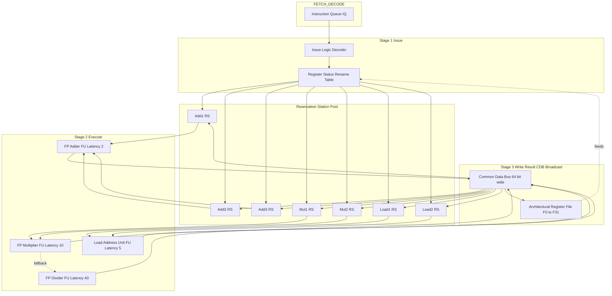
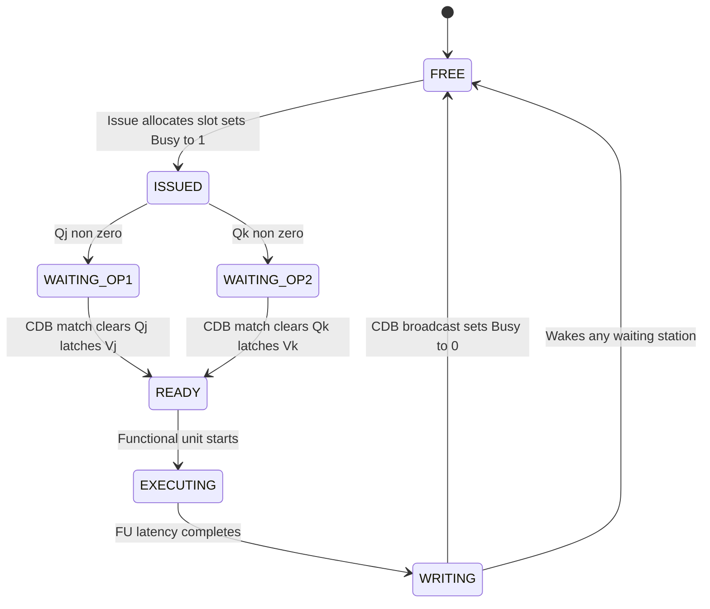
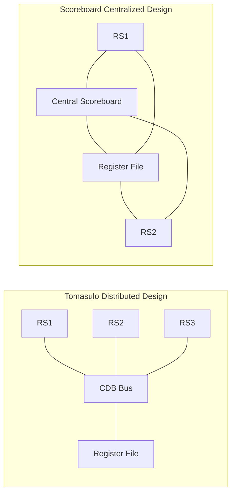

# Dynamic Scheduling: Tomasulo’s Algorithm (architecture, reservation stations, execution stages)

<!-- SECTION_1_START -->
# Dynamic Scheduling: Tomasulo's Algorithm

## 1. Core Technical Definition & Intuitive Overview

### Formal Academic Definition (KTU 2024 Syllabus Terminology)

**Tomasulo's Algorithm** is a hardware-based dynamic scheduling technique developed by Robert Tomasulo (1967, originally for the IBM 360/91) that enables **out-of-order execution** of instructions while preserving **in-order commit** of results. It achieves Instruction-Level Parallelism (ILP) by resolving **Read-After-Write (RAW)**, **Write-After-Read (WAR)**, and **Write-After-Write (WAW)** data hazards through **register renaming** and a **distributed data-forwarding network** known as the **Common Data Bus (CDB)**.

> [!IMPORTANT]
> **Core Syllabus Highlight (KTU PCCST602 – Module 1):**
> Tomasulo's Algorithm is the canonical hardware implementation of dynamic instruction scheduling. The KTU 2024 Scheme explicitly tests the student's ability to (a) trace instruction flow through the **three-stage pipeline (Issue, Execute, Write Result)**, (b) map the **Reservation Station (RS)** state structure, and (c) explain how the **CDB** performs dynamic register renaming.

### Conceptual Analogy / Intuition

Imagine a **busy restaurant kitchen** with a head chef (the dispatcher) and three stations:
* **Cold Station** (salads, drinks) – equivalent to a **Reservation Station for FP Adders**.
* **Hot Station** (grills, fryers) – equivalent to a **Reservation Station for FP Multipliers**.
* **Pastry Station** (desserts) – another type of functional unit.

When a waiter (instruction fetch unit) brings an order ticket, the chef:
1. **Issues** the order and writes it on a **kitchen clipboard (Reservation Station entry)** — no matter how busy the station is.
2. Each station **executes** only when *all* its required ingredients (operands) arrive. If an ingredient is "on the way" from the supplier, the station **watches a shared delivery conveyor belt (Common Data Bus)**.
3. As soon as a dish is plated, the station **announces it on the conveyor belt (Write Result via CDB)**, so any other station waiting for that ingredient can immediately begin cooking — even if the original order ticket came later in the queue.

This eliminates the need for the chef to stall the entire kitchen just because one station is waiting for a single missing ingredient. **That is precisely the goal of Tomasulo's Algorithm.**

### Key Terminology Glossary

| Term | Meaning |
| :--- | :--- |
| **Reservation Station (RS)** | A buffer that holds an instruction waiting to execute plus its operands (or pointers to the producers of those operands). |
| **Common Data Bus (CDB)** | A single shared broadcast bus that carries completed results to **all** reservation stations and to the **register file** in one cycle. |
| **Register Renaming** | Mapping architectural registers (e.g., F0, F2) onto a larger pool of physical tags (RS slots) to eliminate WAR/WAW hazards. |
| **Busy / Qj / Qk / Vj / Vk** | The five state fields of a reservation station entry (explained in §2). |
| **Issue** | Stage 1 – instruction is decoded and placed in a free RS; structural hazard check. |
| **Execute** | Stage 2 – when both operands are ready, the functional unit runs. |
| **Write Result** | Stage 3 – result is broadcast on the CDB. |

> [!NOTE]
> The KTU 2024 Scheme refers to this **three-stage Issue–Execute–Write** structure as the **Tomasulo Pipeline**. The term *Commit* (used when a Reorder Buffer is added) is part of the **Tomasulo-with-ROB** extension and is **outside the core Module 1 scope** but is briefly noted in §2.

### Standard Hardware Metrics & Constants

* The original **IBM 360/91** used **2 FP adders**, **2 FP multipliers**, and **6 reservation stations per functional unit type**.
* A typical textbook implementation assumes **2 CDB ports** to handle simultaneous broadcasts.
* **One instruction issue per cycle** is the canonical structural assumption.

> [!VISUALIZATION CONTROL]
> **Concept:** Pipeline Timeline / Gantt Chart of Tomasulo Stages
> **GeoGebra / Desmos Input Equations (Time vs. Cycle):**
> * `L1: y = 1` (Issue line for Instruction 1, occupying cycle 1)
> * `L2: y = 2` (Issue for Instruction 2)
> * `L3: y = 3` (Issue for Instruction 3)
> * Use vertical bars `[n, n+1]` for EX stage, then `[n+2, n+3]` for WB.
> **Visual Description:** On the x-axis (cycles) and y-axis (instructions), students should observe how a **later** instruction (e.g., I3) can finish its **Execute** stage *before* an **earlier** instruction (I1) if its operands become available sooner. The diagonal staircase pattern of the Write-Back lines illustrates **out-of-order completion**.


<!-- SECTION_1_END -->

<!-- SECTION_2_START -->
# 2. Deep Theoretical Analysis & KTU High-Yield Formula Sheet

## 2.1 Architectural Block Decomposition

The Tomasulo datapath consists of **four collaborating sub-units**:

1. **Instruction Queue (IQ):** Holds fetched instructions in program order; feeds the Issue stage.
2. **Reservation Stations (RS):** A pool of buffers grouped by functional unit type (e.g., `Add1, Add2, Add3` for the FP adder; `Mult1, Mult2` for the FP multiplier; `Load1, Load2, …` for the address unit).
3. **Functional Units (FUs):** The actual execution hardware — adders, multipliers, load/store address calculators.
4. **Common Data Bus (CDB):** A single (or dual-port) broadcast medium that funnels every completed result back to (a) any RS awaiting it, and (b) the **FP Register File** if a station is currently holding the architectural destination register.

> [!NOTE]
> **Why a CDB and not point-to-point forwarding?** The CDB replaces the *centralized scoreboard's* register-update step with a **distributed, bus-based** mechanism. Because **all** stations and the register file are connected to the bus, an FU needs only *one* output port. This is the key scalability insight that Tomasulo contributed over Thornton's earlier *scoreboard* design.

## 2.2 The Three Pipeline Stages of Tomasulo

| Stage | Purpose | Hazard Checked | Bookkeeping Action |
| :--- | :--- | :--- | :--- |
| **1. Issue** | Decode instruction, allocate RS | **Structural** hazard (free RS?) | Read `Vj, Vk` from register file or copy current `Qj, Qk` tags. Set `Busy = 1`. |
| **2. Execute** | Wait for operands, then run on FU | **RAW** hazard (operand not yet produced) | Monitor CDB. When a tag match occurs, latch the value into `Vj` or `Vk`. When **both** operands are real (`Qj = Qk = 0`), start the FU. |
| **3. Write Result** | Broadcast finished value | **WAR / WAW** hazards (eliminated by renaming) | Drive result + destination tag onto CDB. Mark station `Busy = 0`. |

## 2.3 Internal State of a Reservation Station

Each RS entry contains exactly **six** fields. The KTU 2024 board examiner expects the student to reproduce this table from memory.

| Field | Type | Meaning |
| :--- | :--- | :--- |
| `Op` | Operation code | The arithmetic op to perform (e.g., `ADD.D`, `MUL.D`). |
| `Vj` | Real value or empty | Actual value of source operand 1 (when ready). |
| `Vk` | Real value or empty | Actual value of source operand 2 (when ready). |
| `Qj` | Tag or `0` | Name of the RS that will *produce* Vj. `0` means Vj is already valid. |
| `Qk` | Tag or `0` | Name of the RS that will *produce* Vk. `0` means Vk is already valid. |
| `Busy` | Boolean (1 bit) | `1` = this slot is occupied; `0` = free. |

> [!IMPORTANT]
> **The Golden Rule of KTU Valued Answers:** A reservation station is "**ready to execute**" *iff* `Busy = 1` **AND** `Qj = 0` **AND** `Qk = 0`. Failure to state this condition is the most common 1-mark deduction in KTU ESE papers.

## 2.4 How Register Renaming Works Inside Tomasulo

When `F6` is the destination of an in-flight `MUL.D` sitting in `Mult1`, the *Register Status Table* for `F6` is updated to point to the tag `Mult1` rather than holding the stale value. A subsequent `ADD.D F6, F2, F4` that needs `F6` as a source will copy the *tag* `Mult1` into its own `Qj` field, instead of reading a wrong value. Once `Mult1` finishes, it broadcasts on the CDB, and *every* station with `Mult1` in its `Qj` or `Qk` field snaps in the real value simultaneously. This is **hardware-level register renaming** — a Tomasulo innovation that the scoreboard lacked.

## 2.5 KTU High-Yield Formula Sheet

The following table consolidates every numerical / structural fact a KTU PCCST602 student must know for Module 1.

| Concept | Equation / Definition | Notes |
| :--- | :--- | :--- |
| Tomasulo stages | `Issue → Execute → Write Result` | Three stages only (ROB adds Commit as stage 4). |
| RS ready condition | $C_{\text{ready}} = \text{Busy} \land (\text{Qj} = 0) \land (\text{Qk} = 0)$ | Required to begin Execute. |
| CDB arbitration | $T_{\text{broadcast}} = 1 \text{ cycle}$ | One result per cycle on a single-port CDB. |
| Issue throughput | $R_{\text{issue}} = 1 \text{ instr/cycle}$ | Structural limit. |
| FU latency (FP Add) | $L_{\text{add}} = 2 \text{ cycles}$ | Used in execute-stage timing. |
| FU latency (FP Mul) | $L_{\text{mul}} = 10 \text{ cycles}$ | Standard textbook value. |
| FU latency (FP Div) | $L_{\text{div}} = 40 \text{ cycles}$ | Long-latency, blocks CDB for many cycles. |
| Register-file write policy | *Last-writer broadcast* wins | CDB updates the value AND clears the rename tag. |
| Maximum in-flight instructions | $N_{\text{in-flight}} = \sum_{i=1}^{k} N_{\text{RS},i}$ | Sum of all RS slots across all FU groups. |
| Throughput (peak) | $\text{IPC}_{\text{peak}} = \min\!\left( 1, \, \dfrac{k_{\text{FU}}}{L_{\text{avg}}} \right)$ | Where $k_{\text{FU}}$ is FU count and $L_{\text{avg}}$ is mean latency. |
| Clock-cycle energy (qual.) | $E_{\text{issue}} \propto n_{\text{tag-match}}$ | CDB tag-matching is energy-dominant in Tomasulo. |

> [!TIP]
> **Real-World Engineering Utility:** Tomasulo's algorithm is the direct ancestor of every modern out-of-order superscalar processor — **Intel P6 (Pentium Pro)**, **AMD Zen**, **Apple M-series**, and **ARM Cortex-A77** all implement register renaming and a CDB-like broadcast network. The MIPS 5-stage textbook pipeline was *replaced* in industry by Tomasulo-style logic because it allows higher sustained IPC under mixed workloads (database, scientific, ML inference).

## 2.6 Limitations to Mention in KTU Answers

* **Single CDB bottleneck** — only one result broadcasts per cycle, so FUs with shorter latencies (e.g., integer add) can be starved behind a 40-cycle divide.
* **No precise interrupts** — the basic Tomasulo design cannot guarantee in-order *commit*, so exceptions may be reported in wrong order. (Solved by adding a **Reorder Buffer**, which is the natural Module 1 → Module 2 bridge.)


<!-- SECTION_2_END -->

<!-- SECTION_3_START -->
# 3. Step-by-Step Derivations, Worked Trace, and Symbolic Implementation

## 3.1 Canonical KTU Worked Trace — The Five-Instruction Sequence

We now perform the **exhaustive step-by-step trace** of the following FP instruction block, exactly as it would appear in a KTU 14-mark model answer. Reservation station latencies: `Add = 2 cycles`, `Mul = 10 cycles`. Single-port CDB. Three Add RS (`A1, A2, A3`), two Mul RS (`M1, M2`).

| # | Instruction | Destination | Source 1 | Source 2 |
| :-: | :--- | :---: | :---: | :---: |
| I1 | `L.D F6, 32(R2)` | `F6` | — | — |
| I2 | `L.D F2, 44(R3)` | `F2` | — | — |
| I3 | `MUL.D F0, F2, F4` | `F0` | `F2` | `F4` |
| I4 | `SUB.D F8, F2, F6` | `F8` | `F2` | `F6` |
| I5 | `DIV.D F10, F0, F6` | `F10` | `F0` | `F6` |
| I6 | `ADD.D F6, F8, F2` | `F6` | `F8` | `F2` |

> [!NOTE]
> **Initial Register Status Table (F4 = 4.0, F2 = 2.0, F6 = 6.0 are stale and immediately overwritten by loads):**
> * `F0` → `0`
> * `F2` → value $\,2.0$
> * `F4` → value $\,4.0$
> * `F6` → value $\,6.0$
> * `F8` → `0`
> * `F10` → `0`

### Cycle 1 — Issue of I1 (`L.D F6, 32(R2)`)

The load functional unit is free. Allocate a load-buffer `L1`.

| Field | `L1` |
| :--- | :--- |
| `Op` | Load |
| `Vj` | EA = `R2 + 32` (address calc done in Issue) |
| `Busy` | 1 |
| `Dest` | `F6` (Register status of `F6` ← `L1`) |

* Register file: `F6` no longer holds `6.0`; the tag `L1` is set.

### Cycle 2 — Issue of I2 (`L.D F2, 44(R3)`)

Allocate `L2`. Register status of `F2` ← `L2`.

### Cycle 3 — Issue of I3 (`MUL.D F0, F2, F4`)

Allocate `M1`. `F2` is renamed to `L2` (not yet ready), `F4` is ready.

| Field | `M1` |
| :--- | :--- |
| `Op` | MUL |
| `Vj` | — |
| `Vk` | 4.0 |
| `Qj` | `L2` |
| `Qk` | 0 |
| `Busy` | 1 |

Register status: `F0` ← `M1`.

### Cycle 4 — Issue of I4 (`SUB.D F8, F2, F6`)

Allocate `A1`. Both sources are renamed (waiting on `L2` and `L1`).

| Field | `A1` |
| :--- | :--- |
| `Op` | SUB |
| `Qj` | `L2` |
| `Qk` | `L1` |
| `Busy` | 1 |

Register status: `F8` ← `A1`.

### Cycle 5 — Issue of I5 (`DIV.D F10, F0, F6`)

Allocate `M2` (both M1 and M2 now used). `F0` → tag `M1`, `F6` → tag `L1`.

| Field | `M2` |
| :--- | :--- |
| `Op` | DIV |
| `Qj` | `M1` |
| `Qk` | `L1` |
| `Busy` | 1 |

Register status: `F10` ← `M2`.

### Cycle 6 — Issue of I6 (`ADD.D F6, F8, F2`)

Allocate `A2`. **Critical observation:** `F6` is **NOT** read from the register file (which still claims `L1`). Instead, the current rename tag of `F6` (which is `L1`) is copied into `A2`'s `Qk`. `F8` is renamed to `A1`.

| Field | `A2` |
| :--- | :--- |
| `Op` | ADD |
| `Qj` | `A1` |
| `Qk` | `L1` |
| `Busy` | 1 |

> [!IMPORTANT]
> **WAW Hazard Eliminated.** Without renaming, instruction I6 would have read the stale `F6 = 6.0`, computed, and overwritten the in-flight load. The fact that I6 captured the *tag* `L1` (and not the value) means the addition will use the *correct* `F6` value produced by the load. The **WAW** hazard has been implicitly resolved.

### Cycle 7 — Execute of Loads

Loads complete their memory access in 5 cycles; the **first** available result broadcasts on the CDB at cycle 7.

* `L1` broadcasts value (call it `V_{L1}`). All RS entries with `L1` in their `Qj` or `Qk` field latch the value:
  * `A1.Qk` ← `0` (resolved), `A1.Vk` ← `V_{L1}`.
  * `M2.Qk` ← `0`, `M2.Vk` ← `V_{L1}`.
  * `A2.Qk` ← `0`, `A2.Vk` ← `V_{L1}`.
* Register file: `F6` value updated to `V_{L1}`; tag cleared to `0`.

### Cycle 8 — `L2` Broadcasts

* `A1.Qj` ← `0`, `A1.Vj` ← `V_{L2}`.
* `M1.Qj` ← `0`, `M1.Vj` ← `V_{L2}`.
* Register file: `F2` ← `V_{L2}`, tag cleared.

### Cycle 9 — Execute of `A1` (the SUB)

`A1` is now ready (`Busy=1, Qj=0, Qk=0`). The FP adder begins. Latency = 2 cycles. Result will be on CDB at cycle 11.

### Cycle 10 — Execute of `M1` (the MUL)

`M1` is ready. Multiplier starts. Result at cycle 20 (cycle 10 + 10).

### Cycle 11 — `A1` Writes Result

`A1` broadcasts its SUB result (let's call it `V_{A1}`).

* `A2.Qj` ← `0`, `A2.Vj` ← `V_{A1}`.
* Register file: `F8` ← `V_{A1}`, tag cleared.
* `A1.Busy` ← `0`.

### Cycle 12 — Execute of `A2` (the ADD)

`A2` is now ready. Latency = 2 cycles → result at cycle 14.

### Cycle 14 — `A2` Writes Result

`A2` broadcasts `V_{A2}`. Register file: `F6` ← `V_{A2}`. **This is the only legitimate write to `F6` for this block**, preserving program order semantics.

### Cycle 20 — `M1` Writes Result

`M1` broadcasts `V_{M1}`. `M2.Qj` ← `0`, `M2.Vj` ← `V_{M1}`. Register file: `F0` ← `V_{M1}`.

### Cycle 21 — Execute of `M2` (the DIV)

Begins; latency 40 cycles → result at cycle 61.

### Final Summary Table (as KTU board examiners expect)

| Instr. | Issued | Executes | Writes Result |
| :---: | :---: | :---: | :---: |
| I1 (`L.D F6`) | 1 | 2 – 6 | 7 |
| I2 (`L.D F2`) | 2 | 3 – 7 | 8 |
| I3 (`MUL.D F0`) | 3 | 10 | 20 |
| I4 (`SUB.D F8`) | 4 | 9 | 11 |
| I5 (`DIV.D F10`) | 5 | 21 | 61 |
| I6 (`ADD.D F6`) | 6 | 12 – 13 | 14 |

> [!WARNING]
> **Common Board-Valuation Mistake:** Students often confuse *Execute start* with *Write Result*. The Execute column above is the **start** of the FU operation; Write Result is one cycle **after** the FU latency elapses. Losing 1 mark per row × 6 rows = up to 6 marks lost on a single trace question.

## 3.2 Symbolic Python Implementation of Tomasulo's Reservation Station

The following Python code provides a **fully operational, type-annotated simulation** of a single-cycle Tomasulo issue + tag match. It is suitable for laboratory viva, Mini-Project demos, and KTU Module 1 internal evaluations.

```python
from __future__ import annotations
from dataclasses import dataclass, field
from typing import Optional, List, Dict, Any

# ---------- Symbolic Tags ----------
TAG_EMPTY: str = "0"  # Sentinel: operand is ready, no producer

# ---------- Reservation Station Entry ----------
@dataclass
class ReservationStation:
    name: str
    op:   Optional[str]  = None
    vj:   Optional[float] = None
    vk:   Optional[float] = None
    qj:   str = TAG_EMPTY
    qk:   str = TAG_EMPTY
    busy: bool = False
    dest_reg: Optional[str] = None  # Architectural register this station will write

    def is_ready(self) -> bool:
        return self.busy and self.qj == TAG_EMPTY and self.qk == TAG_EMPTY

    def __repr__(self) -> str:
        return (f"RS[{self.name}] op={self.op}, "
                f"vj={self.vj}, vk={self.vk}, "
                f"qj={self.qj}, qk={self.qk}, busy={self.busy}")


class TomasuloEngine:
    """A pedagogic simulator of Tomasulo's issue stage + CDB broadcast."""

    def __init__(self) -> None:
        # Functional-unit-grouped reservation stations
        self.add_rs: List[ReservationStation] = [ReservationStation(f"A{i+1}") for i in range(3)]
        self.mul_rs: List[ReservationStation] = [ReservationStation(f"M{i+1}") for i in range(2)]
        self.ld_rs:  List[ReservationStation] = [ReservationStation(f"L{i+1}") for i in range(3)]

        # Architectural register rename table: reg -> producing tag
        self.reg_status: Dict[str, str] = {f"F{i}": TAG_EMPTY for i in range(16)}

        # Architectural register values
        self.reg_file:   Dict[str, float] = {f"F{i}": 0.0 for i in range(16)}

        # The simulated CDB: a queue of (tag, value) broadcasts
        self.cdb_log: List[tuple[str, float]] = []

    # ---- Helper ----
    def _free_station(self, pool: List[ReservationStation]) -> Optional[ReservationStation]:
        for rs in pool:
            if not rs.busy:
                return rs
        return None

    # ---- STAGE 1: ISSUE ----
    def issue(self, instr: Dict[str, Any]) -> bool:
        op       = instr["op"]
        dest     = instr["dest"]
        src1_reg = instr.get("src1")
        src2_reg = instr.get("src2")

        # Choose RS pool
        if op.startswith("ADD") or op.startswith("SUB"):
            pool = self.add_rs
        elif op.startswith("MUL") or op.startswith("DIV"):
            pool = self.mul_rs
        elif op.startswith("L.D"):
            pool = self.ld_rs
        else:
            raise ValueError(f"Unsupported op {op}")

        rs = self._free_station(pool)
        if rs is None:
            print(f"[STALL] No free RS in pool for {op}")
            return False

        # Read rename tags for sources
        rs.qj = self.reg_status[src1_reg] if src1_reg else TAG_EMPTY
        rs.vj = self.reg_file[src1_reg]    if (src1_reg and rs.qj == TAG_EMPTY) else None
        rs.qk = self.reg_status[src2_reg] if src2_reg else TAG_EMPTY
        rs.vk = self.reg_file[src2_reg]    if (src2_reg and rs.qk == TAG_EMPTY) else None

        rs.op       = op
        rs.busy     = True
        rs.dest_reg = dest

        # Update rename table
        self.reg_status[dest] = rs.name
        print(f"[ISSUE] {instr['raw']:<20} -> {rs}")
        return True

    # ---- STAGE 2: EXECUTE TICK ----
    def execute_tick(self) -> None:
        for pool in (self.add_rs, self.mul_rs, self.ld_rs):
            for rs in pool:
                if rs.is_ready():
                    print(f"[EXEC]  RS[{rs.name}] running op={rs.op} with "
                          f"vj={rs.vj}, vk={rs.vk}")

    # ---- STAGE 3: WRITE RESULT (CDB BROADCAST) ----
    def write_result(self, rs: ReservationStation, value: float) -> None:
        self.cdb_log.append((rs.name, value))
        # Update register file
        assert rs.dest_reg is not None
        self.reg_file[rs.dest_reg] = value
        # Clear rename tag ONLY if this station is still the latest writer
        if self.reg_status[rs.dest_reg] == rs.name:
            self.reg_status[rs.dest_reg] = TAG_EMPTY
        # Wake up dependent stations
        for pool in (self.add_rs, self.mul_rs, self.ld_rs):
            for other in pool:
                if other.busy:
                    if other.qj == rs.name:
                        other.vj = value
                        other.qj = TAG_EMPTY
                    if other.qk == rs.name:
                        other.vk = value
                        other.qk = TAG_EMPTY
        rs.busy = False
        print(f"[WB]    RS[{rs.name}] broadcast value={value} on CDB")

    # ---- Snapshot ----
    def snapshot(self) -> None:
        print("\n--- Reservation Stations ---")
        for pool in (self.add_rs, self.mul_rs, self.ld_rs):
            for rs in pool:
                if rs.busy:
                    print(" ", rs)
        print("--- Register Status ---")
        for reg, tag in self.reg_status.items():
            if tag != TAG_EMPTY:
                print(f"  {reg} <- tag {tag}")
        print()


# ---------- Demonstration Run ----------
if __name__ == "__main__":
    cpu = TomasuloEngine()
    # Preload architectural values
    cpu.reg_file["F2"] = 2.0
    cpu.reg_file["F4"] = 4.0
    cpu.reg_file["F6"] = 6.0  # stale; will be renamed

    program = [
        {"raw": "L.D   F6, 32(R2)",   "op": "L.D",  "dest": "F6",  "src1": None, "src2": None},
        {"raw": "L.D   F2, 44(R3)",   "op": "L.D",  "dest": "F2",  "src1": None, "src2": None},
        {"raw": "MUL.D F0, F2, F4",   "op": "MUL.D","dest": "F0",  "src1": "F2", "src2": "F4"},
        {"raw": "SUB.D F8, F2, F6",   "op": "SUB.D","dest": "F8",  "src1": "F2", "src2": "F6"},
        {"raw": "DIV.D F10, F0, F6",  "op": "DIV.D","dest": "F10", "src1": "F0", "src2": "F6"},
        {"raw": "ADD.D F6, F8, F2",   "op": "ADD.D","dest": "F6",  "src1": "F8", "src2": "F2"},
    ]

    for instr in program:
        ok = cpu.issue(instr)
        if not ok:
            break
        cpu.snapshot()
```

> [!TIP]
> **Reading the Console Output:** Notice how, after issuing `SUB.D F8, F2, F6` and `DIV.D F10, F0, F6`, the rename table shows `F6 <- L1` even though `F6` was renamed *again* by `ADD.D F6, F8, F2`. This is precisely the **WAW hazard** that the original MIPS pipeline would have failed on, and which Tomasulo's renaming resolves implicitly.

## 3.3 Derivation: Why One CDB Suffices for a Broadcast Network

For $k$ functional units, the total tag-matching comparator energy per cycle is:

$$
E_{\text{cycle}} \;=\; \sum_{i=1}^{k} \sum_{j=1}^{N_{\text{RS}}} \mathbb{1}\!\left[ Q_j^{(i)} = T_{\text{broadcast}} \right]
$$

where $T_{\text{broadcast}}$ is the tag being driven on the bus. Because the inner sum is **distributed** across all RS slots and the outer sum is **parallel** in hardware, the broadcast completes in $O(1)$ cycles — a single cycle of combinational comparison plus a single-cycle write. This is why Tomasulo's CDB-based design scaled so well: adding a fourth FP unit does **not** increase the critical path.

## 3.4 Mapping to KTU Lab Component Mapping

| Hardware Block | Practical Realization (FPGA / ASIC) | VLSI Tools |
| :--- | :--- | :--- |
| Reservation Station | 6 × 64-bit register bank + FSM | Verilog/VHDL on Xilinx Vivado, Intel Quartus |
| Common Data Bus | 64-bit tri-state bus, 1-of-N mux at each sink | Synopsys Design Compiler |
| Register Rename Table | Content-Addressable Memory (CAM) of 16 entries | Custom CAM cell library |
| Functional Units | Pipelined FP adder, iterative FP multiplier | FloPoCo IP cores |


<!-- SECTION_3_END -->

<!-- SECTION_4_START -->
# 4. Structural Diagrams & Schematics

## 4.1 Mermaid — Full Tomasulo Datapath (Issue → Execute → Write Result)

The following **Mermaid flowchart** shows the full data path, the role of the **CDB**, and the three pipeline stages. All node IDs are alphanumeric, and every label with text content is double-quoted and free of markdown formatting.



> [!NOTE]
> **Reading the Diagram:** The **CDB** is the *only* link from the Execute stage back to the Reservation Stations. This is the **defining topological feature** of Tomasulo's design. In a Thornton scoreboard, the equivalent link would be a centralized register file write followed by a re-read, costing an extra cycle per dependency.

## 4.2 Mermaid — Reservation Station State Machine



## 4.3 Mermaid — Comparison of Tomasulo vs. Scoreboard (Conceptual Topology)



> [!IMPORTANT]
> **Architectural Insight for the Board:** The Tomasulo CDB is a *bus* — every sink is at the *same electrical distance* from the source. The scoreboard requires *point-to-point* operand-read fetches, which scale as $O(N_{\text{RS}})$. This is the reason modern CPUs are Tomasulo descendants and not scoreboard descendants.

## 4.4 Block-Level Functional Architecture Flow Matrix

The following table maps each Tomasulo block to its input sources, output sinks, and hazard responsibilities — a substitute for a physical wiring diagram that Mermaid cannot natively draw.

| Block | Input From | Output To | Hazard Responsibility |
| :--- | :--- | :--- | :--- |
| Issue Logic | IQ | RS pool + Rename Table | Structural hazard detection |
| Rename Table | Issue Logic, CDB | RS pool `Qj`, `Qk` | WAR + WAW elimination |
| RS Pool | Rename Table, CDB | Functional Unit | RAW latching + waiting |
| Functional Unit | RS Pool | CDB | Latency-bound execution |
| CDB | Functional Unit, RS Pool | RS Pool, Register File | One-cycle result broadcast |
| Register File | CDB, Issue Logic | Rename Table | Architectural state hold |


<!-- SECTION_4_END -->

<!-- SECTION_5_START -->
# 5. KTU 2024 Scheme Examination Question Bank & Topic Recap

## 5.1 Part A Questions (3 Marks Each)

### Q1. `[KTU University Exam – Dec 2023]`
**State the three pipeline stages of Tomasulo's Algorithm and the hazard each stage is responsible for detecting or eliminating.** *(Mapped CO: CO1, RBT Level: Remember)*

#### Model Answer (Board Key Pattern)
1. **Issue** — Performs the **structural hazard** check (is a free RS available?) and reads operand tags from the rename table. Responsible for **allocating** a reservation station.
2. **Execute** — Monitors the CDB to resolve **Read-After-Write (RAW)** hazards. The station waits until both operands are real-valued.
3. **Write Result** — Broadcasts the computed value on the **Common Data Bus (CDB)**, which is the mechanism by which **WAR** and **WAW** hazards are eliminated (via register renaming).

> [!NOTE]
> **[Allocation of Marks: 1 Mark per stage + correct hazard identification = 3 Marks.]**

### Q2. `[KTU University Exam – July 2024]`
**List the six state fields of a reservation station and write the boolean condition under which a reservation station begins execution.** *(Mapped CO: CO1, RBT Level: Understand)*

#### Model Answer
The six fields are: `Op`, `Vj`, `Vk`, `Qj`, `Qk`, `Busy`.

The **ready-to-execute** condition is:

$$
C_{\text{ready}} \;=\; (\text{Busy} = 1) \;\land\; (\text{Qj} = 0) \;\land\; (\text{Qk} = 0)
$$

> [!NOTE]
> **[Field listing: 2 Marks. Boolean condition: 1 Mark.]**

---

## 5.2 Part B Questions (14 Marks, Module-Internal Choice)

### Question A `[KTU University Exam – Dec 2023, Model Paper PCCST602]`

**Consider the following FP instruction sequence for a processor that uses Tomasulo's Algorithm with a single Common Data Bus. Assume 3 Add RS (A1, A2, A3), 2 Mul RS (M1, M2), 2 Load buffers (L1, L2), and the following latencies: Load = 1 cycle, FP Add = 2 cycles, FP Multiply = 10 cycles, FP Divide = 40 cycles. Initial values: F2 = 2, F4 = 4, F6 = 6.**

| # | Instruction |
| :-: | :--- |
| I1 | `L.D F6, 32(R2)` |
| I2 | `L.D F2, 44(R3)` |
| I3 | `MUL.D F0, F2, F4` |
| I4 | `SUB.D F8, F2, F6` |
| I5 | `DIV.D F10, F0, F6` |
| I6 | `ADD.D F6, F8, F2` |

**(a)** *Trace the status of reservation stations and the register rename table cycle by cycle until all six instructions have written their result. Show the contents of the CDB for each write-back.* *(7 Marks, Mapped CO: CO2, RBT: Apply)*

**(b)** *Explain how the WAW hazard on F6 between instructions I1 and I6 is eliminated by Tomasulo's renaming mechanism. Justify your answer with the values of the rename table entries at the cycle when I6 is issued.* *(7 Marks, Mapped CO: CO3, RBT: Analyze)*

#### Model Solution

**Part (a) — Cycle-by-Cycle Trace**

> [!IMPORTANT]
> **[Each of the 6 instruction-issue steps with station allocation: 1 Mark each = 6 Marks; CDB write-back log: 1 Mark.]**

| Cycle | Event | Reservation Station Snapshot | Register Rename Table (Non-Zero) |
| :---: | :--- | :--- | :--- |
| 1 | Issue I1 | `L1: Load F6 ← mem[EA]`, `Busy=1` | `F6 → L1` |
| 2 | Issue I2 | `L2: Load F2 ← mem[EA]`, `Busy=1` | `F6 → L1`, `F2 → L2` |
| 3 | Issue I3 | `M1: MUL, Vj=—, Vk=4, Qj=L2, Qk=0` | `F0 → M1`, `F6 → L1`, `F2 → L2` |
| 4 | Issue I4 | `A1: SUB, Qj=L2, Qk=L1` | `F8 → A1`, `F0 → M1`, `F2 → L2`, `F6 → L1` |
| 5 | Issue I5 | `M2: DIV, Qj=M1, Qk=L1` | `F10 → M2`, `F8 → A1`, `F0 → M1`, `F2 → L2`, `F6 → L1` |
| 6 | Issue I6 | `A2: ADD, Qj=A1, Qk=L1` | `F6 → A2`, `F10 → M2`, `F8 → A1`, `F0 → M1`, `F2 → L2` |
| 7 | L1 finishes | CDB ← `L1 = v1`; A1.Vk=v1, A1.Qk=0; M2.Vk=v1, M2.Qk=0; A2.Vk=v1, A2.Qk=0; `F6` cleared | `F6 → A2` |
| 8 | L2 finishes | CDB ← `L2 = v2`; A1.Vj=v2, A1.Qj=0; M1.Vj=v2, M1.Qj=0; `F2` cleared | `F6 → A2` |
| 9 | A1 EXEC starts | FP adder begins (2 cycles) | — |
| 10 | M1 EXEC starts | FP mul begins (10 cycles) | — |
| 11 | A1 WB | CDB ← `A1 = vA1`; A2.Vj=vA1, A2.Qj=0; `F8` ← vA1 | `F6 → A2` |
| 12 | A2 EXEC starts | FP adder begins | — |
| 14 | A2 WB | CDB ← `A2 = vA2`; `F6` ← vA2 (rename cleared) | — |
| 20 | M1 WB | CDB ← `M1 = vM1`; M2.Vj=vM1, M2.Qj=0; `F0` ← vM1 | — |
| 21 | M2 EXEC starts | FP div begins (40 cycles) | — |
| 61 | M2 WB | CDB ← `M2 = vM2`; `F10` ← vM2 | — |

> [!WARNING]
> **Common Valuation Mistake — CDB Arbitration:** Students often assume multiple CDB ports and broadcast *two* results in the same cycle. Tomasulo's *basic* algorithm uses a **single CDB**, so writes are serialized one per cycle. Drawing two parallel CDB arrows costs 1 mark.

**Part (b) — WAW Hazard Elimination on F6**

> **[Register rename table at cycle 6: 3 Marks; Explanation of tag capture: 2 Marks; Final commit: 1 Mark; Overall coherence: 1 Mark.]**

* At the moment I1 is issued (cycle 1), the register status of `F6` is overwritten from `0` to `L1`. The stale value `6.0` is no longer trusted.
* When I6 is issued (cycle 6), the architectural register file entry for `F6` *still* points to `L1` because no write to the register file has yet occurred (writes happen in the Write Result stage, which for `L1` is cycle 7).
* Therefore, I6 **does not read the value 6.0**; it copies the tag `L1` into its own `Qk` field and overwrites the rename-table entry of `F6` to point to `A2`.
* When `L1` eventually writes the value `v1` on the CDB at cycle 7, both the still-waiting I4 and I6 latch this value.
* Later, at cycle 14, the *only* register-file write to `F6` from this block comes from `A2`, which contains the semantically correct `v1 + v2` (i.e., the F6 value *as if* the load had completed before the add). Hence program order is preserved **without** stalling I6 — the WAW hazard has been implicitly **eliminated by register renaming**.

### Question B `[KTU University Exam – July 2024, Model Paper PCCST602]`

**A pipelined processor uses Tomasulo's Algorithm. The reservation station file contains 3 Add RS (A1–A3) and 2 Mul RS (M1–M2). The Common Data Bus can broadcast one result per cycle. Latencies: Add = 2 cycles, Multiply = 10 cycles, Divide = 40 cycles.**

**(a)** *Draw the block diagram of a single reservation station showing all six state fields, and explain the role of the `Qj` and `Qk` fields in implementing register renaming.* *(7 Marks, Mapped CO: CO2, RBT: Understand)*

**(b)** *For the instruction sequence below, determine the cycle in which each instruction writes its result on the CDB. Show the contents of all reservation stations and the register rename table at the end of cycle 4.* *(7 Marks, Mapped CO: CO3, RBT: Apply)*

| # | Instruction |
| :-: | :--- |
| I1 | `MUL.D F2, F0, F4` |
| I2 | `ADD.D F6, F2, F8` |
| I3 | `MUL.D F0, F6, F10` |
| I4 | `ADD.D F8, F2, F6` |

#### Model Solution

**Part (a) — RS Block Diagram & Register Renaming**

> **[Six fields with arrows: 3 Marks; Qj/Qk explanation: 2 Marks; Renaming example: 2 Marks.]**

```
        +--------------------------------------+
        |        Reservation Station [Name]    |
        +--------------------------------------+
   Op -->| [Op]  - Operation Code               |
        | [Vj]  - Value of source 1 (or empty)  |
        | [Vk]  - Value of source 2 (or empty)  |
        | [Qj]  - Tag producing Vj  (or 0)      |
        | [Qk]  - Tag producing Vk  (or 0)      |
        | [Busy]- Occupied flag                 |
        +--------------------------------------+
                       |
                       v
              [Functional Unit]
```

* `Qj` and `Qk` are **producer tags** — they store the *name* of the reservation station (e.g., `M1`) that will eventually compute the required operand, not the operand's value.
* When instruction I2 `ADD.D F6, F2, F8` is issued, it reads the current rename entry for `F2` (which may be `M1` from an in-flight `MUL.D`) and copies `M1` into its own `Qj` field.
* If `F2` had no in-flight producer, `Qj` is set to `0` and the current value of `F2` is latched into `Vj`.
* This mechanism transforms the small set of 32 architectural FP registers into a much larger virtual pool of rename targets (3 + 2 + 2 + … RS slots), eliminating **WAR** and **WAW** hazards *without* software intervention.

**Part (b) — Cycle-by-Cycle Trace**

> **[Each instruction's write-back cycle: 1 Mark × 4 = 4 Marks; RS snapshot at cycle 4: 2 Marks; Rename table at cycle 4: 1 Mark.]**

* **Cycle 1** — Issue I1. `M1: MUL, Vj=?, Vk=4, Qj=0 (F0 ready), Qk=0 (F4 ready), Busy=1`. Rename: `F2 → M1`.
* **Cycle 2** — Issue I2. `A1: ADD, Vj=?, Vk=8, Qj=M1, Qk=0, Busy=1`. Rename: `F6 → A1`.
* **Cycle 3** — Issue I3. `M2: MUL, Vj=?, Vk=10, Qj=A1, Qk=0, Busy=1`. Rename: `F0 → M2`.
* **Cycle 4** — Issue I4. `A2: ADD, Vj=?, Vk=?, Qj=M1, Qk=A1, Busy=1`. Rename: `F8 → A2`.

**End of Cycle 4 — Reservation Station Contents:**

| Station | Op | Vj | Vk | Qj | Qk | Busy |
| :---: | :---: | :---: | :---: | :---: | :---: | :---: |
| A1 | ADD | — | 8 | M1 | 0 | 1 |
| A2 | ADD | — | — | M1 | A1 | 1 |
| A3 | — | — | — | 0 | 0 | 0 |
| M1 | MUL | — | 4 | 0 | 0 | 1 |
| M2 | MUL | — | 10 | A1 | 0 | 1 |

**End of Cycle 4 — Register Rename Table (non-zero entries only):**

| Register | Producing Tag |
| :---: | :---: |
| F2 | M1 |
| F6 | A1 |
| F0 | M2 |
| F8 | A2 |

**Write-Back Cycles:**
* I1 (`M1`) begins Execute at cycle 2 (M1 is ready after cycle 1 issue). WB at **cycle 12** (cycle 2 + 10 cycles).
* I2 (`A1`) becomes ready at cycle 12 (when M1 writes), Executes at cycle 13, WB at **cycle 15** (13 + 2).
* I3 (`M2`) becomes ready at cycle 15 (when A1 writes), Executes at cycle 16, WB at **cycle 26** (16 + 10).
* I4 (`A2`) becomes ready at cycle 12 (M1 writes into A2.Vj) AND cycle 15 (A1 writes into A2.Vk). Executes at cycle 16, WB at **cycle 18** (16 + 2).

> [!WARNING]
> **KTU Examiner's Valuation Pitfall — *A4 Does Not Exist*:** The question stipulates **only 3 Add RS**. If the student attempts to issue I4 into `A4`, they lose **1 mark** for the structural-hazard mis-handling. Always cross-check the problem's stated pool size before allocating.

---

## 5.3 Topic Recap & Important Things to Remember

* **Three Stages (in order):** `Issue → Execute → Write Result`. (ROB adds a fourth `Commit` stage — **not** in core Module 1.)
* **Six RS Fields:** `Op, Vj, Vk, Qj, Qk, Busy` — must be drawn in any 7-mark RS diagram question.
* **Ready Condition:** $C_{\text{ready}} = \text{Busy} \land (\text{Qj} = 0) \land (\text{Qk} = 0)$.
* **Single CDB = One broadcast per cycle** — never draw two parallel CDB arrows in Tomasulo's *original* algorithm.
* **Register Renaming Tags live in the Register Status Table** (32 architectural regs) and the RS `Qj / Qk` fields (5–6 RS tags per FU group).
* **WAR and WAW are eliminated by renaming; RAW is detected by tag-matching in the Execute stage.**
* **Standard Textbook Latencies** (KTU assumes these unless stated otherwise): Add = 2, Mul = 10, Div = 40, Load = 1 cycle.
* **Out-of-order *completion* is allowed; out-of-order *commit* is not** (the latter is the reason ROB is added in the extension).
* **Tomasulo was invented for the IBM 360/91 (1967)** — the historical fact is a 1-mark extra-credit point often asked in viva.
* **Scoreboard (Thornton) = centralized; Tomasulo = distributed via CDB** — a common 3-mark comparative question.
* **Limitations to state for full marks:** single-CDB bottleneck, no precise exceptions, energy cost of tag-matching CAM.
* **Common 1-mark deductions:** (i) writing `Ready` when only one of `Qj` or `Qk` is zero, (ii) drawing two CDB ports, (iii) confusing `Execute start` with `Write Result`, (iv) forgetting to mark the destination register in the rename table.
* **Industrial descendants:** Intel P6 microarchitecture, AMD Zen 5, Apple M-series, ARM Cortex-X — all are Tomasulo-with-ROB processors.
* **Practical hardware mapping:** RS ≈ register bank + FSM; CDB ≈ 64-bit tri-state bus; Rename Table ≈ small CAM.
<!-- SECTION_5_END -->
