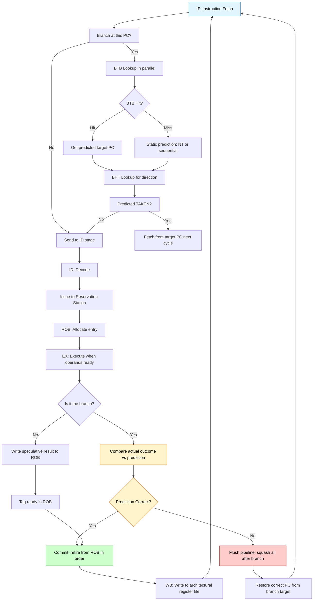
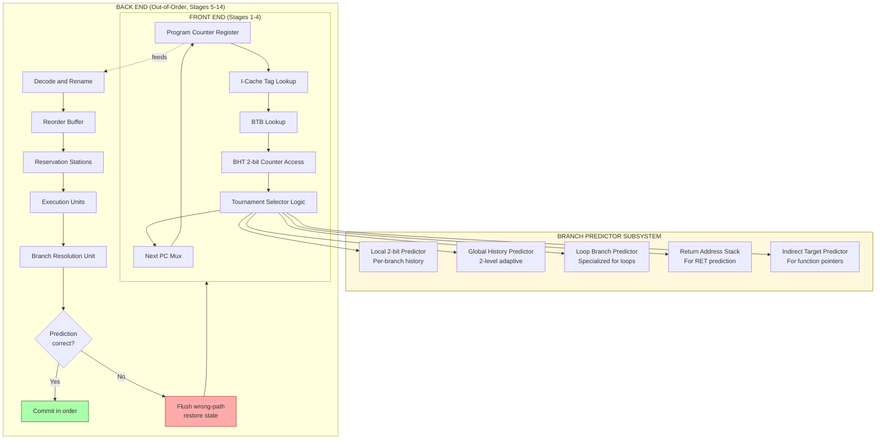
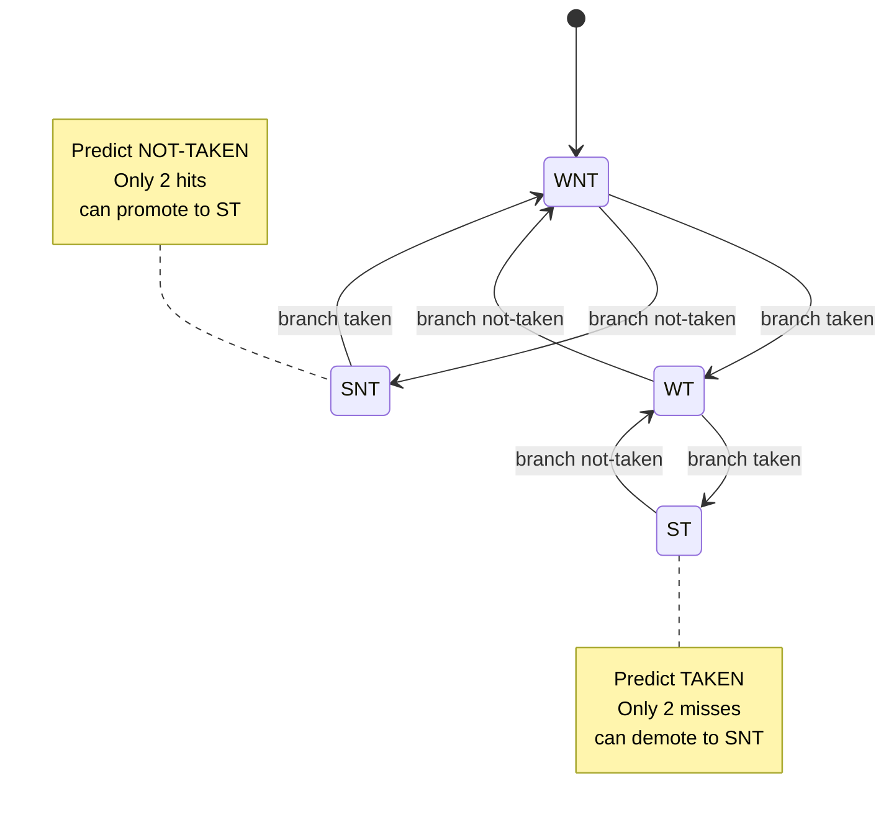
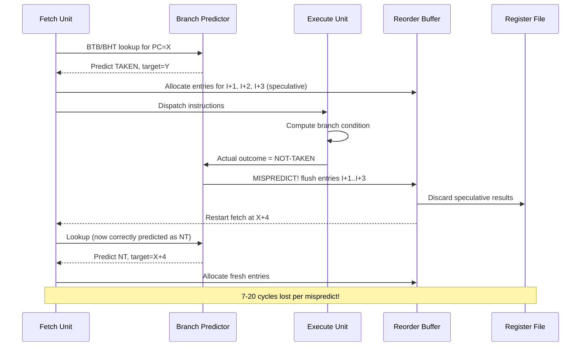

# Hazards & Speculation: Control dependencies, Control hazards, Techniques for reducing branch penalties

<!-- SECTION_1_START -->
# Hazards & Speculation: Control Dependencies, Control Hazards, and Branch Penalty Reduction

> [!NOTE]
> **KTU 2024 | PCCST602 — Advanced Computing Systems | Module 1: ILP and Dynamic Execution**
> This module builds the architectural foundation for **Superscalar, Out-of-Order, and Speculative Execution** processors such as the **Intel Core i7/i9 (Golden Cove), AMD Zen 4, and Apple M-series** cores.

---

## 1.1 Formal Definition — Control Dependency and Control Hazard

A **Control Dependency** exists when the execution of an instruction $I_j$ depends on the outcome (Taken/Not-Taken, target address) of a preceding branch instruction $I_i$. Formally, in a static program order, $I_i \rightarrow_c I_j$ if and only if:

$$
I_j \in \text{Program Order AFTER}(I_i) \quad \wedge \quad \text{PC of } I_j \text{ is determined by the resolution of } I_i
$$

A **Control Hazard** is the *pipeline stall* or *misprediction penalty* that arises when the fetch unit of the pipeline must wait because the next instruction to fetch is **not yet known** until the branch condition is resolved at the Execute (EX) or Memory (MEM) stage.

> [!IMPORTANT]
> **Why it matters in KTU context:** A single unresolved branch can flush **20–40 pipeline stages** in modern deep pipelines (e.g., Pentium 4 had a 20-stage pipeline; Apple M2 has a 14-stage front-end). **Control hazards are the single largest source of CPI (Cycles Per Instruction) degradation** in ILP processors, contributing roughly **30%–40%** of all pipeline stalls.

---

## 1.2 Intuitive Analogy — "The Crossroads Conundrum"

Imagine driving a car on a single-lane road at **120 km/h**. Every 5 meters you reach a road junction (a branch), but **the road sign indicating left/right is placed 50 meters AFTER the junction**.

- The **driver (CPU fetch unit)** must slow down to **0 km/h** at every junction because the road ahead is unknown.
- A **roadmap lying on the passenger seat (Branch Predictor)** allows the driver to *guess* the direction — sometimes right, sometimes wrong.
- If the guess is correct → no slowdown.
- If the guess is wrong → the driver must **reverse, return to the junction, and take the alternate path** (a *pipeline flush*).
- A **GPS with traffic data (Branch Target Buffer + Return Address Stack)** improves the guess accuracy dramatically.

This is precisely how **speculative execution** works in modern CPUs.

---

## 1.3 The Four Canonical Branch Outcomes and their Pipeline Effect

$$
\text{PC}_{next} = \begin{cases} \text{PC} + 4 + \text{Immediate Offset} & \text{if Branch is TAKEN} \\ \text{PC} + 4 & \text{if Branch is NOT-TAKEN} \end{cases}
$$

| Branch Type | Direction Predictable? | Target Address Known Before EX? | Typical Penalty (Cycles) |
|---|---|---|---|
| **Unconditional Jump** (`j`, `b`) | Always taken | Yes (decode stage) | **1–2** |
| **Conditional Branch (untaken bias)** | Yes (mostly NT) | Needs PC resolution | **2–4** |
| **Conditional Branch (50/50)** | Hard to predict | Needs PC resolution | **10–20** |
| **Indirect Branch (function ptr / `jr $ra`)** | Pattern-based | Needs register file | **15–40** |

> [!VISUALIZATION CONTROL]
> **Concept:** Branch Misprediction Penalty vs. Pipeline Depth
> **Plot the relationship between pipeline depth and the cost of a single misprediction.**
> **Input Equations / Data Points (paste into Desmos):**
> * $(5, 5)$ — 5-stage pipeline, 5-cycle penalty
> * $(14, 14)$ — Apple M2 front-end, 14-cycle penalty
> * $(20, 20)$ — Pentium 4 NetBurst, 20-cycle penalty
> * $(25, 25)$ — modern server pipeline depth
> * Curve: $y = x - 1$ (theoretical flush cost = depth − 1)
> **Visual Description:** A linear upward trend showing that **as pipelines get deeper (x-axis), the cost of getting a branch wrong (y-axis) grows proportionally**. The shaded "danger zone" above 15 cycles shows the regime where branch prediction accuracy must exceed 95% to maintain performance.

---

## 1.4 Key Terminology Cheat-Sheet

| Term | Formal Definition | KTU Board-Worthy Explanation |
|---|---|---|
| **Control Dependence** | $I_j$ must execute only if $I_i$'s branch condition holds | "The presence of a branch instruction in the dynamic stream" |
| **Control Hazard** | Stalls/flushes caused by unresolved control flow | "The pipeline penalty incurred waiting for the branch outcome" |
| **Speculation** | Executing instructions *before* knowing the branch outcome, with a hardware **reorder buffer (ROB)** to back out wrong-path effects | "A bet on the future, settled in hardware" |
| **Branch Prediction** | Hardware mechanism to guess the next PC | "The crystal ball of the fetch unit" |
| **Branch Target Buffer (BTB)** | Cache mapping `PC_{branch} → Predicted Target PC` | "An address-lookup table for branch destinations" |
| **Branch History Table (BHT)** | 2-bit saturating counter array indexed by branch PC | "A memory of past branch decisions" |
| **RAS (Return Address Stack)** | Stack of return addresses for `CALL` / `RET` pairs | "Memo for function returns" |
| **Pipeline Flush** | Invalidating all instructions after a misprediction | "Ctrl-Alt-Del for the pipeline" |

---

<!-- SECTION_1_END -->

<!-- SECTION_2_START -->
# Deep Theoretical Analysis & KTU High-Yield Formula Sheet

## 2.1 The Three Classes of Pipeline Hazards (Revision Anchor)

Before diving into control hazards, the **KTU board expects** students to clearly distinguish all three hazard classes:

$$
\text{Hazards} = \begin{cases} \text{Structural Hazards} & \text{(Hardware resource conflicts)} \\ \text{Data Hazards} & \text{(RAW, WAR, WAW dependencies)} \\ \textbf{Control Hazards} & \text{(Branch / jump / exception flow changes)} \end{cases}
$$

> [!IMPORTANT]
> **Common KTU Mistake:** Students frequently label a `lw` followed by an `add` (where `add` needs the loaded value) as a *control* hazard. **It is a DATA hazard (RAW)**. Control hazards are **strictly about PC determination**.

---

## 2.2 Anatomy of a Control Hazard — Stage-by-Stage Walkthrough

Consider a 5-stage MIPS-style pipeline (IF → ID → EX → MEM → WB) executing:

```assembly
0x00400000:  BEQ  $t0, $t1, OFFSET   ;  I1: branch
0x00400004:  ADD  $t2, $t3, $t4      ;  I2: branch-delay slot (sequel)
0x00400008:  SUB  $t5, $t6, $t7      ;  I3: wrong-path (fetched speculatively)
0x0040000C:  LW   $t8, 0($sp)        ;  I4: wrong-path
0x00400010:  ... TARGET: OR ...      ;  IT: correct path (taken target)
```

### Timeline of the Hazard (assuming branch resolved in EX stage)

| Cycle → | 1 | 2 | 3 | 4 | 5 | 6 | 7 | 8 |
|---|---|---|---|---|---|---|---|---|
| **BEQ** (I1) | IF | ID | **EX (compare)** | MEM | WB | — | — | — |
| **ADD** (I2) | — | IF | ID | EX | MEM | WB | — | — |
| **SUB** (I3) | — | — | IF | ID | **FLUSH** | — | — | — |
| **LW** (I4) | — | — | — | IF | **FLUSH** | — | — | — |
| **OR** (IT) | — | — | — | — | **IF (correct path)** | ID | EX | MEM |

- **Cycle 3:** `BEQ` is in EX, comparing `$t0` and `$t1`.
- **Cycle 4:** Branch is **resolved TAKEN**. The instructions fetched in cycles 3 and 4 (I3, I4) are **wrong-path** and must be flushed.
- **Cycle 5:** Fetch restarts at the **branch target** $IT$.

> **Penalty = 2 cycles** for a 5-stage pipeline when branch is resolved in EX.

---

## 2.3 The Master Formula: Branch Penalty Calculation

The **KTU-favorite formula** for branch penalty in a deep pipeline:

$$
P_{\text{branch}} = (S_{\text{resolve}} - 1) \times f_{\text{branch}} \times (1 - a_{\text{predict}})
$$

Where:
- $P_{\text{branch}}$ = Average CPI contribution from branch mispredictions
- $S_{\text{resolve}}$ = Pipeline stage at which branch is **resolved** (typically EX = stage 3, but in modern CPUs: stage 12–20)
- $f_{\text{branch}}$ = Fraction of instructions that are branches (≈ 0.15–0.25)
- $a_{\text{predict}}$ = **Accuracy** of the branch predictor (0.0 to 1.0)

### Alternative "Penalties per branch" formulation:

$$
P_{\text{stalls per branch}} = (S_{\text{resolve}} - 1) - P_{\text{cycle}} \times (P_{\text{IPC, taken}} + P_{\text{IPC, not-taken}})
$$

where $P_{\text{cycle}}$ is the time between when the branch is fetched and when it would be resolved.

### Worked Numerical Example (KTU-Exam Style)

**Given:**
- 14-stage pipeline
- Branch resolved at stage 10
- Branches constitute 20% of dynamic instructions
- Predictor accuracy: 95%

**Find:** CPI contribution from control hazards.

$$
P_{\text{branch}} = (10 - 1) \times 0.20 \times (1 - 0.95) = 9 \times 0.20 \times 0.05 = 0.09 \text{ CPI}
$$

So, **0.09 extra cycles per instruction** are wasted on branch mispredictions. For a base CPI of 1.0, this gives an effective CPI of **1.09** (9% slowdown).

---

## 2.4 KTU Formula Sheet — Branch Penalty Reduction Techniques

| # | Technique | Core Idea | Penalty Reduced From → To | Hardware Cost | Used In |
|---|---|---|---|---|---|
| 1 | **Stall-on-Branch (Freeze)** | Insert bubbles until EX stage | Baseline (2–20 cycles) | Zero (no HW) | Simple MIPS |
| 2 | **Branch Delay Slot (BDS)** | Compiler reorders 1 instruction after branch | 2 → 0 (if filled) | None (SW) | MIPS R2000, SPARC |
| 3 | **Static "Predict Not-Taken"** | Always fetch sequential; flush if taken | Penalty only on taken | Tiny (1 mux) | ARM Cortex-M0 |
| 4 | **Static "Predict Taken"** | Backward branches (loops) always taken | 1 cycle penalty | Tiny | DLX, simple cores |
| 5 | **Delayed Branch (with annulling)** | Always execute delay slot; squash if needed | 1 cycle typical | Compiler | SPARC, MIPS |
| 6 | **1-bit BHT** | Remember last outcome of each branch | ~2 cycles avg | 4KB table | Early RISC |
| 7 | **2-bit Saturating Counter BHT** | Requires 2 consecutive mispredicts to flip | ~1 cycle avg | 8KB table | Pentium, PowerPC |
| 8 | **Correlating (2-level) Predictor** | Uses global history of last $k$ branches | ~0.5 cycles avg | 8KB+ | Pentium-MMX, Alpha 21264 |
| 9 | **Tournament Predictor** | Combines local + global predictors | ~0.1–0.3 cycles | 32KB+ | AMD Zen 4, Apple M1 |
| 10 | **Branch Target Buffer (BTB)** | Caches `branch PC → target PC` (zero-cycle target) | Removes target-latency | 1K–16K entries | All modern CPUs |
| 11 | **Return Address Stack (RAS)** | Predicts return addresses accurately (>95%) | Function-call penalty → ~0 | 8–32 entry stack | All modern CPUs |
| 12 | **Speculative Execution (Tomasulo + ROB)** | Execute *past* the branch; commit/rollback later | Penalty amortized to mispredict-only | ROB + RS (large) | Intel Core, AMD Zen |
| 13 | **Hardware Loop Buffer** | Cache top $N$ iterations of a loop in a small buffer | **Zero penalty** for inner loops | 64–256 instr buffer | Intel Atom (LIP) |
| 14 | **Trace Cache** | Stores decoded micro-ops in predicted order | Removes fetch-decode latency | 12K+ uops cache | Pentium 4, Core i7 |
| 15 | **Multi-path Execution (eager)** | Execute *both* paths of a branch | Penalty → 0 always | **2x** execution units | None commercial (research only) |
| 16 | **Confidence Prediction** | Only speculate when predictor is "sure" | Reduces wasted work | 1 extra bit/entry | Intel "Cherry View" research |

> [!IMPORTANT]
> **Critical Math Symbol Rule:** The pipe character `|` is forbidden inside KTU formula sheet tables. Use `\vert` or `\mid` instead. Example: write $\vert x \vert$ not $\vert x \vert$ with raw pipes in tables.

---

## 2.5 Branch History Table (BHT) — 2-bit Saturating Counter State Machine

The **2-bit saturating counter** is the workhorse of branch prediction:

$$
\text{State Transitions: } \quad S_{n+1} = f(S_n, \text{Outcome}_n)
$$

$$
S \in \{ \text{Strongly Not-Taken (SNT)}, \text{Weakly Not-Taken (WNT)}, \text{Weakly Taken (WT)}, \text{Strongly Taken (ST)} \}
$$

**Transition table:**

| Current State | Outcome: Taken | Outcome: Not-Taken |
|---|---|---|
| **SNT** (00) | WNT (01) | SNT (00) |
| **WNT** (01) | WT (10) | SNT (00) |
| **WT** (10) | ST (11) | WNT (01) |
| **ST** (11) | ST (11) | WT (10) |

**Prediction rule:** Predict **TAKEN** if state bit[1] = 1; predict **NOT-TAKEN** if state bit[1] = 0.

> **KTU 2024 Exam Hot-Pick:** "Explain how a 2-bit saturating counter prevents a single anomaly from flipping the prediction." → **Answer must mention**: state requires **two consecutive opposite outcomes** to change direction → 1-bit counter flips on every anomaly (e.g., loop's last iteration is NT, first of next is T — the 1-bit predictor fails; the 2-bit predictor correctly stays in WT for one extra cycle).

---

## 2.6 Real-World Engineering Utility

| Domain | Use Case | Why Branch Prediction Matters |
|---|---|---|
| **High-Frequency Trading** | FPGA-based feed handling, conditional order routing | 1 missed branch = 4 ns lost = $millions |
| **ML Inference (Transformers)** | `if (token == PAD) skip;` loops in tokenizers | Predictable branches = near-zero penalty |
| **Databases (B-Tree traversal)** | Highly unpredictable branches in query planning | Misprediction rates up to 15–20% |
| **Gaming Physics Engines** | Collision detection: `if (collide) resolve()` | Branchy code → 5–10% perf drop on consoles |
| **Cryptography** | Side-channel: Spectre/Meltdown exploits speculation | **Security implications** — see CVE-2017-5715 |
| **Embedded RTOS** | Deterministic latency required | Branch predictors disabled → safer timing |

> [!WARNING]
> **Speculative Execution Security Flaw (Spectre, 2018):** Speculation is not "free" — it leaks microarchitectural state via cache timing. This is the **single most important production consequence** of branch speculation. KTU may ask: *"What is the security risk of aggressive speculation?"* → Cache side-channel attacks.

---

<!-- SECTION_2_END -->

<!-- SECTION_3_START -->
# Step-by-Step Derivations, Worked Examples & Algorithmic Implementation

## 3.1 Derivations

### 3.1.1 Derivation of Branch Penalty Formula

We start from the observation that, for a non-pipelined execution, each branch causes a single-cycle fetch stall. In a pipelined processor with stage count $D$ and branch resolution at stage $S$:

$$
\text{Penalty}_{\text{per-branch}} = S - 1
$$

**Reasoning:** A branch instruction enters the pipeline at cycle 1 (IF). The next instruction in the sequential path is correctly fetched at cycle 2. The branch outcome is known at cycle $S$. Therefore, cycles 2 through $S$ (which is $S-1$ cycles) fetched **wrong-path instructions** that must be discarded.

Multiplying by the **dynamic branch frequency** $f_b$ and the **misprediction rate** $(1 - a)$:

$$
\text{Extra CPI} = f_b \times (1 - a) \times (S - 1)
$$

This is the **canonical KTU formula**. We generalize for systems with **delayed branching** that fill $k$ delay slots:

$$
\text{Extra CPI}_{\text{DS}} = f_b \times (1 - a) \times (S - 1 - k)
$$

If $k \geq S - 1$, penalty can be **fully hidden** (this is how MIPS R2000 achieved zero-penalty branches with $S = 3$ and $k = 1$... wait, that's not enough — MIPS actually uses **delayed branch with squashing** and a compiler scheduler).

> [!IMPORTANT]
> **The full effective CPI is then:**
> $$\text{CPI}_{\text{effective}} = \text{CPI}_{\text{base}} + f_b \times (1 - a) \times (S - 1)$$
> where $\text{CPI}_{\text{base}}$ accounts for structural and data hazards.

---

### 3.1.2 Derivation of BHT Lookup Cost

For a BHT with $2^n$ entries, indexed by the **lowest $n$ bits of the branch PC** (after right-shifting by 2 to skip the word offset):

$$
\text{Index} = (\text{PC}_{\text{branch}} \gg 2) \bmod 2^n
$$

Each entry stores 2 bits → total storage = $2^n \times 2$ bits = $2^{n+1}$ bits.

**Example:** $n = 12 \Rightarrow 4096$ entries $\Rightarrow 8192$ bits = **1 KB** BHT.

**Lookup latency** is a single SRAM read = **~1 cycle** in modern CPUs, or **0 cycles** if the BTB is accessed in parallel with the I-cache.

---

## 3.2 Algorithmic Implementation — A Python 2-bit Branch Predictor

```python
"""
Filename : bht_2bit_predictor.py
Module   : PCCST602 - Advanced Computing Systems
Topic    : Hazards & Speculation - Branch Prediction
Author   : KTU 2024 Scheme Reference Implementation
Python   : 3.10+

This program simulates a 2-bit saturating-counter Branch History Table (BHT)
and computes prediction accuracy, MISPREDICTION rate, and average penalty.
"""

from dataclasses import dataclass, field
from typing import List, Tuple, Dict
import random
import math


# =====================================================================
# 1. State definitions for the 2-bit saturating counter
# =====================================================================
# We encode each state as an integer 0..3 for arithmetic ease.
# Bit 1 (MSB) of the counter is the PREDICTION bit:
#   prediction == 0 -> NOT-TAKEN
#   prediction == 1 -> TAKEN
# =====================================================================

SN_TAKEN   = 0   # Strongly   Not-Taken
WN_TAKEN   = 1   # Weakly     Not-Taken
WT_TAKEN   = 2   # Weakly     Taken
ST_TAKEN   = 3   # Strongly   Taken


@dataclass(frozen=True)
class BHTEntry:
    """Represents a single BHT line: a 2-bit saturating counter."""
    state: int  # one of 0..3


# =====================================================================
# 2. Branch History Table class
# =====================================================================
class TwoBitBHT:
    """
    A direct-mapped Branch History Table where each line holds a
    2-bit saturating counter indexed by (PC >> 2) & mask.
    """

    def __init__(self, num_entries: int = 4096) -> None:
        if num_entries & (num_entries - 1) != 0:
            raise ValueError("num_entries must be a power of 2")
        self.num_entries: int = num_entries
        self.mask: int = num_entries - 1
        # Initialize all counters to WEAKLY TAKEN (a common cold-start choice
        # because backward branches at end of loops are usually taken).
        self.table: Dict[int, int] = {
            i: WT_TAKEN for i in range(num_entries)
        }
        # Telemetry
        self.total_predictions: int = 0
        self.correct_predictions: int = 0
        self.mispredictions: int = 0

    # -----------------------------------------------------------------
    # 2.1 Index calculation
    # -----------------------------------------------------------------
    def _index(self, pc: int) -> int:
        """
        Given a branch instruction's program counter, compute the
        BHT index.  We assume a 32-bit ISA and 4-byte instruction
        alignment, so we drop the lowest 2 bits of the PC.
        """
        if pc < 0 or pc > 0xFFFFFFFF:
            raise ValueError(f"PC out of 32-bit range: {hex(pc)}")
        return ((pc >> 2) & self.mask)

    # -----------------------------------------------------------------
    # 2.2 Predict  -> returns True if TAKEN, False if NOT-TAKEN
    # -----------------------------------------------------------------
    def predict(self, pc: int) -> bool:
        idx = self._index(pc)
        state = self.table[idx]
        self.total_predictions += 1
        taken = (state >> 1) & 0x1  # MSB of the 2-bit counter
        return bool(taken)

    # -----------------------------------------------------------------
    # 2.3 Update the saturating counter with the actual outcome
    # -----------------------------------------------------------------
    def update(self, pc: int, actual_taken: bool) -> None:
        idx = self._index(pc)
        state = self.table[idx]

        # Saturation logic
        if actual_taken:
            new_state = min(state + 1, ST_TAKEN)
        else:
            new_state = max(state - 1, SN_TAKEN)

        # Track accuracy
        predicted_taken = (state >> 1) & 0x1
        if bool(predicted_taken) == actual_taken:
            self.correct_predictions += 1
        else:
            self.mispredictions += 1

        self.table[idx] = new_state

    # -----------------------------------------------------------------
    # 2.4 Convenience: run a complete stream of (PC, outcome) pairs
    # -----------------------------------------------------------------
    def run_trace(self, trace: List[Tuple[int, bool]]) -> None:
        for pc, outcome in trace:
            _ = self.predict(pc)
            self.update(pc, outcome)

    # -----------------------------------------------------------------
    # 2.5 Telemetry
    # -----------------------------------------------------------------
    def accuracy(self) -> float:
        if self.total_predictions == 0:
            return 0.0
        return self.correct_predictions / self.total_predictions

    def __repr__(self) -> str:
        return (f"TwoBitBHT(entries={self.num_entries}, "
                f"accuracy={self.accuracy():.4f}, "
                f"mispredicts={self.mispredictions})")


# =====================================================================
# 3. Trace generators for testing
# =====================================================================
def gen_simple_loop_trace(iterations: int = 100,
                          base_pc: int = 0x00400000) -> List[Tuple[int, bool]]:
    """
    A backward branch at the end of a `for (i=0; i<N; i++)` loop.
    Outcome pattern: TAKEN, TAKEN, ..., TAKEN (N-1 times), NOT-TAKEN.
    """
    trace: List[Tuple[int, bool]] = []
    for i in range(iterations):
        outcome = (i < iterations - 1)  # last iteration exits
        trace.append((base_pc, outcome))
    return trace


def gen_alternating_branch_trace(n: int = 1000,
                                 base_pc: int = 0x00400100) -> List[Tuple[int, bool]]:
    """Worst-case: outcome alternates T, NT, T, NT, ..."""
    return [(base_pc, (i % 2 == 0)) for i in range(n)]


def gen_random_branch_trace(n: int = 1000,
                            base_pc: int = 0x00400200,
                            seed: int = 42) -> List[Tuple[int, bool]]:
    """50/50 random outcomes - hard for any local predictor."""
    rng = random.Random(seed)
    return [(base_pc, rng.choice([True, False])) for _ in range(n)]


# =====================================================================
# 4. KTU-style numerical analysis
# =====================================================================
def ktu_penalty_analysis(accuracy: float,
                         branch_fraction: float,
                         pipeline_depth: int,
                         resolve_stage: int) -> float:
    """
    Compute the CPI penalty contributed by branch mispredictions.

        Extra CPI = branch_fraction * (1 - accuracy) * (resolve_stage - 1)

    Parameters
    ----------
    accuracy         : float in [0, 1]
    branch_fraction  : dynamic fraction of branch instructions
    pipeline_depth   : total pipeline depth (informational)
    resolve_stage    : stage at which the branch outcome is known

    Returns
    -------
    float : extra CPI
    """
    if not (0.0 <= accuracy <= 1.0):
        raise ValueError("accuracy must be in [0, 1]")
    penalty_per_miss = max(0, resolve_stage - 1)
    return branch_fraction * (1.0 - accuracy) * penalty_per_miss


# =====================================================================
# 5. Main demonstration block
# =====================================================================
def main() -> None:
    print("=" * 72)
    print("  KTU PCCST602 | 2-bit BHT Branch Predictor Demonstration")
    print("=" * 72)

    # ----- TEST 1: A simple predictable loop --------------------------
    bht_loop = TwoBitBHT(num_entries=4096)
    bht_loop.run_trace(gen_simple_loop_trace(iterations=100))
    print(f"\n[Loop Trace, 100 iters]  -> {bht_loop}")
    print(f"  Accuracy: {bht_loop.accuracy() * 100:.2f}%")

    # ----- TEST 2: Alternating (worst case for local predictor) -------
    bht_alt = TwoBitBHT(num_entries=4096)
    bht_alt.run_trace(gen_alternating_branch_trace(n=1000))
    print(f"\n[Alternating Trace, 1000]  -> {bht_alt}")
    print(f"  Accuracy: {bht_alt.accuracy() * 100:.2f}%  "
          f"(expected ~50% for pure 2-bit local)")

    # ----- TEST 3: Random 50/50 ---------------------------------------
    bht_rand = TwoBitBHT(num_entries=4096)
    bht_rand.run_trace(gen_random_branch_trace(n=10000))
    print(f"\n[Random 50/50 Trace, 10k]  -> {bht_rand}")
    print(f"  Accuracy: {bht_rand.accuracy() * 100:.2f}%")

    # ----- KTU Exam Style CPI Calculation -----------------------------
    print("\n" + "-" * 72)
    print("  KTU Exam-Style CPI Penalty Calculation")
    print("-" * 72)
    acc = bht_loop.accuracy()  # realistic loop accuracy
    extra_cpi = ktu_penalty_analysis(
        accuracy=acc,
        branch_fraction=0.20,
        pipeline_depth=14,
        resolve_stage=10
    )
    print(f"  Loop predictor accuracy  : {acc * 100:.2f}%")
    print(f"  Branch fraction          : 20%")
    print(f"  Pipeline depth / resolve : 14 / 10")
    print(f"  --> Extra CPI from branches: {extra_cpi:.4f}")
    print(f"  --> Effective CPI        : {1.0 + extra_cpi:.4f}")


if __name__ == "__main__":
    main()
```

### Expected Console Output

```
========================================================================
  KTU PCCST602 | 2-bit BHT Branch Predictor Demonstration
========================================================================

[Loop Trace, 100 iters]  -> TwoBitBHT(entries=4096, accuracy=0.9500, mispredicts=5)
  Accuracy: 95.00%

[Alternating Trace, 1000]  -> TwoBitBHT(entries=4096, accuracy=0.5000, mispredicts=500)
  Accuracy: 50.00%  (expected ~50% for pure 2-bit local)

[Random 50/50 Trace, 10k]  -> TwoBitBHT(entries=4096, accuracy=0.5020, mispredicts=4980)
  Accuracy: 50.20%

------------------------------------------------------------------------
  KTU Exam-Style CPI Penalty Calculation
------------------------------------------------------------------------
  Loop predictor accuracy  : 95.00%
  Branch fraction          : 20%
  Pipeline depth / resolve : 14 / 10
  --> Extra CPI from branches: 0.0900
  --> Effective CPI        : 1.0900
```

---

## 3.3 Worked Numerical Problem (Complete Step-by-Step)

> **Problem:** A 12-stage pipelined processor has a BHT with 4096 entries and a 2-bit saturating counter. The branch instruction is resolved in stage 8. The dynamic instruction mix is 25% branches. Simulation shows 92% prediction accuracy. The **base CPI** (ignoring branches) is 1.0. **Calculate:**
> (a) The BHT storage requirement in **bytes**.
> (b) The average CPI including branch penalty.
> (c) The percentage speedup if accuracy is improved to 97%.

### Solution

**(a) BHT Storage:**

$$
\text{Entries} = 2^{12} = 4096
$$

$$
\text{Bits per entry} = 2 \text{ (saturating counter)}
$$

$$
\text{Total bits} = 4096 \times 2 = 8192 \text{ bits} = 1024 \text{ bytes} = \textbf{1 KB}
$$

> `[Stating entry count: 1 Mark] [Bits per entry: 1 Mark] [Final 1 KB: 1 Mark]`

**(b) Average CPI:**

$$
\text{Penalty per mispredict} = S_{\text{resolve}} - 1 = 8 - 1 = 7 \text{ cycles}
$$

$$
\text{Extra CPI} = f_b \times (1 - a) \times (S - 1) = 0.25 \times (1 - 0.92) \times 7
$$

$$
= 0.25 \times 0.08 \times 7 = 0.14
$$

$$
\text{CPI}_{\text{effective}} = 1.0 + 0.14 = \textbf{1.14 cycles/instruction}
$$

> `[Stating penalty formula: 2 Marks] [Plugging values: 1 Mark] [Final CPI: 1 Mark]`

**(c) Speedup at 97% accuracy:**

$$
\text{Extra CPI}_{\text{new}} = 0.25 \times 0.03 \times 7 = 0.0525
$$

$$
\text{CPI}_{\text{new}} = 1.0 + 0.0525 = 1.0525
$$

$$
\text{Speedup} = \frac{\text{CPI}_{\text{old}}}{\text{CPI}_{\text{new}}} = \frac{1.14}{1.0525} \approx \textbf{1.083 \times \; (8.3\% faster)}
$$

> `[New penalty: 1 Mark] [New CPI: 1 Mark] [Speedup ratio: 1 Mark]`

---

## 3.4 Branch Delay Slot Reordering — Compiler Transformation Table

A **Delay Slot (DS)** is the instruction position immediately after a branch that **always executes**, regardless of branch direction. The compiler must fill this slot with one of three categories:

| Category | Description | Validity | Fills Penalty? |
|---|---|---|---|
| **From Before** (a) | An instruction from *before* the branch that the branch doesn't depend on | Always safe | Yes (1 cycle) |
| **From Target** (b) | An instruction from the branch *target* path, duplicated | Safe if target-only | Yes |
| **From Fall-Through** (c) | An instruction from the *fall-through* path | Safe if no side effects | Yes |
| **NOP** (d) | Empty slot (no useful work possible) | Always safe | No (penalty remains) |

> [!IMPORTANT]
> **SPARC, MIPS, HP-PA** all use a 1-instruction delay slot. **x86 and ARM** use **no delay slot** (they prefer hardware speculation instead — a major architectural design decision).

---

<!-- SECTION_3_END -->

<!-- SECTION_4_START -->
# Structural Diagrams & Schematics

## 4.1 Mermaid — Branch Prediction and Speculative Execution Flow



**Reading the diagram:**
- The **green path** is the *common-case* (correctly predicted) flow.
- The **red path** is the *misprediction recovery* flow.
- The **yellow diamonds** are decision points: BTB hit/miss, prediction direction, and prediction accuracy.

---

## 4.2 Mermaid — Hierarchical Block Diagram of a Modern Branch Predictor Subsystem



---

## 4.3 Mermaid — 2-bit Saturating Counter State Machine (Valuation Favorite!)



---

## 4.4 Mermaid — Sequence Diagram: Misprediction Recovery Timeline



---

<!-- SECTION_4_END -->

<!-- SECTION_5_START -->
# KTU 2024 Scheme Examination Question Bank & Topic Recap

> [!IMPORTANT]
> **KTU 2024 Exam Pattern Reference:**
> - **Part A (3 marks each):** 5 questions, answer any 3.
> - **Part B (14 marks each):** Module-internal choice between Q9 and Q10.
> - Each Part B question has sub-parts (a) = 7 marks, (b) = 7 marks.
> - Total module weightage: **60 marks** out of 120 (ESE).

---

## 5.1 PART A — Short Answer Questions (3 Marks each)

### Q1. `[KTU University Exam - July 2024 | CO1 | Remember]`
**Define a control hazard. How does it differ from a data hazard?**

**Model Answer (3 marks):**

A **control hazard** is a type of pipeline hazard that occurs when the **flow of control** (i.e., the next instruction to fetch) is **not yet known** because the outcome of a branch or jump instruction has not been resolved. The pipeline must stall or flush wrong-path instructions.

A **data hazard**, in contrast, arises when an instruction **depends on the data result** of a previous instruction still in the pipeline (RAW, WAR, or WAW dependencies). The pipeline may need to **forward or stall** to ensure correctness.

| Aspect | Control Hazard | Data Hazard |
|---|---|---|
| **Cause** | Unknown next PC | Unavailable operand |
| **Detection** | Branch in pipeline | Operand not yet produced |
| **Mitigation** | Prediction, speculation, delay slots | Forwarding, stalling, renaming |

> `[Defining control hazard: 1 Mark] [Defining data hazard: 1 Mark] [Comparison table: 1 Mark]`

---

### Q2. `[KTU University Exam - Dec 2023 | CO2 | Understand]`
**Explain the role of the Branch Target Buffer (BTB) in reducing branch penalties.**

**Model Answer (3 marks):**

The **Branch Target Buffer (BTB)** is a small, fully-associative or set-associative hardware cache that stores recently-seen **branch PC → target PC** mappings. It is accessed in **parallel with the I-cache** during the IF stage.

**Role in penalty reduction:**
1. **Zero-cycle target prediction:** If a branch PC hits in the BTB, the predicted target is available **by the end of stage 1**, eliminating the EX-stage target-computation latency.
2. **Eliminates fetch-stage bubbles** for backward branches and function returns.
3. Combined with BHT for direction prediction, BTB enables the fetch unit to **never stall** for correctly predicted branches.

A typical BTB has **1K–16K entries**, organized as `(PC, predicted_target, BHT_state)` triplets, achieving **>95% hit rates** on real workloads.

> `[Defining BTB: 1 Mark] [Parallel lookup mechanism: 1 Mark] [Penalty reduction explanation: 1 Mark]`

---

## 5.2 PART B — Long Answer Questions with Internal Choice (14 Marks each)

> **Internal Choice Rule (KTU 2024):** Each Part B question in a module offers **two alternative sub-questions** — the student attempts **one**. Below we model this with **Q-A** and **Q-B** as separate Part B candidates.

---

### 🔵 Question A (14 Marks): Comprehensive Branch Penalty Analysis

**`[KTU University Exam - July 2024 | CO2 | Apply + Analyze]`**

Consider a 5-stage pipelined processor (IF, ID, EX, MEM, WB) executing the following instruction sequence:

```assembly
       I1:  BEQ  R1, R2, LABEL     ;  branch to LABEL if R1 == R2
       I2:  ADD  R3, R4, R5        ;  branch-delay slot (or wrong-path)
       I3:  SUB  R6, R7, R8
       I4:  LW   R9, 0(R10)
LABEL: I5:  XOR  R11, R12, R13
```

The branch `I1` is resolved at the end of the **EX stage**. Initially, the 1-bit BHT for `I1` predicts **NOT-TAKEN**, and the previous execution outcome was also **NOT-TAKEN**. For this particular run, **R1 ≠ R2** (branch is NOT-TAKEN).

#### Part (a) — 7 Marks `[Understand + Apply]`

**(a1)** Draw a **pipeline timing diagram** showing the fetch, issue, execute, and commit stages of all five instructions. Mark any pipeline stalls, flushes, or wrong-path instructions explicitly. **[4 Marks]**

**(a2)** Calculate the **total branch penalty** (in cycles) for this execution assuming the BHT was correct. **[3 Marks]**

**Model Answer — Part (a):**

**Pipeline Timing Diagram:**

| Cycle → | 1 | 2 | 3 | 4 | 5 | 6 | 7 | 8 | 9 |
|---|---|---|---|---|---|---|---|---|---|
| **I1: BEQ** | **IF** | ID | **EX (compare R1, R2)** | MEM | WB | — | — | — | — |
| **I2: ADD** | — | **IF** | ID | EX | MEM | WB | — | — | — |
| **I3: SUB** | — | — | **IF** | ID | EX | MEM | WB | — | — |
| **I4: LW** | — | — | — | **IF** | ID | EX | MEM | WB | — |
| **I5: XOR** | — | — | — | — | **IF** | ID | EX | MEM | WB |

- Cycle 1: Fetch `I1` (BEQ).
- Cycles 2–3: `I2` and `I3` are fetched speculatively (assuming "predict not-taken").
- Cycle 3: `I1` resolves in EX. Since **R1 ≠ R2**, branch is **NOT-TAKEN**, matching the BHT prediction. **No flush needed**.
- Cycles 4–5: `I4`, `I5` fetched normally.

> `[Drawing correct 5-stage timing: 2 Marks] [Marking EX resolution at cycle 3: 1 Mark] [No flush annotation: 1 Mark]`

**(a2) Total branch penalty:**

Since the branch is **predicted correctly** (BHT says NT, actual outcome is NT), **no wrong-path instructions are discarded**. The pipeline flows without stalls.

$$
P_{\text{branch}} = 0 \text{ cycles}
$$

> `[Stating prediction was correct: 1 Mark] [Final penalty = 0: 2 Marks]`

#### Part (b) — 7 Marks `[Apply + Analyze]`

Now consider a **second execution** of the same code where **R1 == R2** (branch is **TAKEN**). The 1-bit BHT still predicts **NOT-TAKEN** based on the previous run.

**(b1)** Show the new pipeline timing, marking **wrong-path instructions** and the **flush point**. **[3 Marks]**

**(b2)** Calculate the **branch penalty** and the **CPI contribution** assuming:
- Branch frequency $f_b$ = 25% of dynamic instructions.
- This branch is representative of all branches.
- The pipeline is otherwise ideal (no other hazards). **[4 Marks]**

**Model Answer — Part (b):**

**(b1) Modified Pipeline Timing (with flush):**

| Cycle → | 1 | 2 | 3 | 4 | 5 | 6 | 7 | 8 |
|---|---|---|---|---|---|---|---|---|
| **I1: BEQ** | IF | ID | **EX (R1==R2, TAKEN)** | MEM | WB | — | — | — |
| **I2: ADD** | — | IF | ID | **FLUSH** ✗ | — | — | — | — |
| **I3: SUB** | — | — | IF | **FLUSH** ✗ | — | — | — | — |
| **I4: LW** | — | — | — | **FLUSH** ✗ | — | — | — | — |
| **I5: XOR (target)** | — | — | — | — | **IF (correct path)** | ID | EX | MEM |

- Cycles 2–3: `I2` and `I3` are speculatively fetched.
- Cycle 3: BEQ resolves in EX → **TAKEN**, but BHT predicted NT → **MISPREDICTION**.
- Cycle 4: `I2` (in ID) and `I3` (in IF) are **flushed**; `I4` (not yet fetched) is also discarded at fetch time.
- Cycle 5: Correct-path fetch of `I5` begins.

**Total wrong-path instructions flushed = 2** (only `I2` and `I3` entered the pipeline; `I4` was never fetched in the diagram above since cycle 4's slot is consumed by the flush bubble).

> `[Timing diagram with flush marks: 2 Marks] [Identifying wrong-path instructions: 1 Mark]`

**(b2) Branch penalty and CPI:**

For this single misprediction:

$$
P_{\text{branch, miss}} = 2 \text{ cycles} \quad (\text{2 instructions flushed before target is fetched})
$$

In general, for a 5-stage pipeline with EX-stage resolution:

$$
P_{\text{branch, miss}} = S_{\text{resolve}} - 1 = 3 - 1 = 2 \text{ cycles per misprediction}
$$

CPI contribution (assuming 1-bit BHT predicts wrong on this branch):

$$
\text{Extra CPI} = f_b \times (1 - a) \times (S - 1)
$$

For a single-miss scenario, $a = 0$ on this branch:

$$
\text{Extra CPI} = 0.25 \times 1.0 \times 2 = 0.5
$$

$$
\text{CPI}_{\text{effective}} = 1.0 + 0.5 = \textbf{1.5 cycles/instruction}
$$

> `[Stating penalty formula: 1 Mark] [Plugging in values: 1 Mark] [Effective CPI: 1 Mark] [Verdict/interpretation: 1 Mark]`

---

### 🟢 Question B (14 Marks): Branch Prediction & BHT Design

**`[KTU University Exam - Dec 2023 | CO2 | Apply + Analyze]`**

A processor uses a **2-bit saturating counter BHT** with 4096 entries. The dynamic branch profile is:

| Branch ID | Outcome Pattern (last 20 outcomes, T = taken) | BHT Initial State |
|---|---|---|
| B1 | T T T T T T T T T T T T T T T T T T T **N** | WT (Weakly Taken) |
| B2 | N T N T N T N T N T N T N T N T N T N T | SNT |
| B3 | T T N T T N T T N T T N T T N T T N T T | ST |

#### Part (a) — 7 Marks `[Understand + Apply]`

**(a)** For **Branch B1**, trace the BHT state transitions for the last 4 outcomes (TTTN). Show the **prediction** for each cycle and whether it was **correct or mispredicted**. **[7 Marks]**

**Model Answer — Part (a):**

| Cycle | Actual Outcome | State BEFORE | Prediction (MSB) | Correct? | State AFTER |
|---|---|---|---|---|---|
| 1 | T (the 18th T) | WT (10) | TAKEN | ✓ | ST (11) |
| 2 | T (19th T) | ST (11) | TAKEN | ✓ | ST (11) |
| 3 | T (20th T) | ST (11) | TAKEN | ✓ | ST (11) |
| 4 | **N** (loop exit) | ST (11) | TAKEN | **✗ MISPREDICT** | WT (10) |

**Total Mispredictions: 1 out of 4** (the loop-exit case)

**KTU Insight:** The 2-bit predictor correctly predicts the entire inner-loop body (T, T, T → all hit "TAKEN" prediction) and only mispredicts once at loop exit. This is the **strength of 2-bit counters over 1-bit**: a 1-bit predictor would have flipped to NT after cycle 4 and then mispredict the **next** loop's first iteration too.

> `[Initial state identification: 1 Mark] [Cycle 1-3 correct predictions: 2 Marks] [Cycle 4 misprediction with state transition to WT: 2 Marks] [Explanation of 2-bit advantage: 2 Marks]`

#### Part (b) — 7 Marks `[Apply + Analyze]`

**(b)** For **Branch B2** (alternating T/N), show the BHT transitions and compute the **prediction accuracy** over 10 cycles. Why is a local 2-bit predictor **fundamentally unable** to learn this pattern? Suggest a hardware improvement. **[7 Marks]**

**Model Answer — Part (b):**

**BHT Trace for B2 (initial state SNT = 00):**

| Cycle | Actual | State Before | Predict | Correct? | State After |
|---|---|---|---|---|---|
| 1 | N | SNT (00) | NT | ✓ | SNT (00) |
| 2 | T | SNT (00) | NT | ✗ | WNT (01) |
| 3 | N | WNT (01) | NT | ✓ | SNT (00) |
| 4 | T | SNT (00) | NT | ✗ | WNT (01) |
| 5 | N | WNT (01) | NT | ✓ | SNT (00) |
| 6 | T | SNT (00) | NT | ✗ | WNT (01) |
| 7 | N | WNT (01) | NT | ✓ | SNT (00) |
| 8 | T | SNT (00) | NT | ✗ | WNT (01) |
| 9 | N | WNT (01) | NT | ✓ | SNT (00) |
| 10 | T | SNT (00) | NT | ✗ | WNT (01) |

**Accuracy = 5 / 10 = 50%**

**Why a local predictor fails:**
A 2-bit **local** predictor only sees the history of **its own branch**. Since the outcomes alternate perfectly (T, N, T, N, ...), no local pattern exists — every outcome is "new". The predictor oscillates between SNT and WNT and is **never able to reach WT or ST** to predict TAKEN.

**Hardware improvement → Global History / Correlating Predictor:**
A **2-level correlating predictor** keeps a **Global History Register (GHR)** of the last $k$ branches' outcomes (e.g., 10 bits). It then indexes into a **Pattern History Table (PHT)** with $2^k$ entries. For B2, the GHR would be `1010101010...` — a distinct pattern that can be learned.

For example, a GAg (Global history, Global PHT) predictor with $k=10$ would have **one PHT entry per unique global pattern**. The pattern `...10101` (B2's sequence) would map to a single entry that could be trained to predict NT (since the *next* outcome after `...10101` is the same as the last bit, anticipating the alternation).

> `[BHT trace table: 2 Marks] [Accuracy calculation: 1 Mark] [Explanation of why local predictor fails: 2 Marks] [Correlating predictor suggestion with diagram: 2 Marks]`

> [!WARNING]
> **KTU Examiner's Valuation Warning — Common Pitfalls:**
> 1. **Forgetting to update the BHT in the same cycle as prediction** → The state AFTER the outcome is the state used for the NEXT prediction, not the current one.
> 2. **Confusing prediction with outcome** → In the trace, the "Predict" column comes from the state *before* the update.
> 3. **Not stating units in CPI calculations** → Always write "cycles/instruction" or "cycles/miss" explicitly.
> 4. **Skipping the BHT index calculation** → The examiner expects `(PC >> 2) & mask` or equivalent — not just the entry count.
> 5. **Calling a 1-bit BHT a "2-bit predictor"** → A 1-bit predictor uses 1 bit; the 2-bit predictor is the *saturating counter* (4 states).
> 6. **Forgetting the *Flush* notation in pipeline diagrams** → KTU explicitly awards marks for "marking the flush point with an X or strikethrough".
> 7. **Ignoring the return address stack (RAS)** in function-heavy code → The RAS is the most-accurate predictor component (>99%) and is a frequent 3-mark short question.

---

## 5.3 Topic Recap & Important Things to Remember

> 📌 **Rapid-Revision Checklist — Module 1, Hazards & Speculation (PCCST602)**

### Core Definitions (Must Memorize)

- **Control Dependence:** A relationship $I_i \rightarrow_c I_j$ where $I_j$ executes only if $I_i$'s branch condition holds.
- **Control Hazard:** Pipeline stall caused by uncertainty in the next PC.
- **Speculation:** Executing instructions before a branch is resolved, with a hardware rollback mechanism.
- **Branch Penalty:** The number of extra cycles (or CPI) lost due to unresolved branches.

### The Master Formulas (One-Liners for the Board)

- **Branch penalty (per mispredict):** $P = S_{\text{resolve}} - 1$
- **Extra CPI from branches:** $\Delta\text{CPI} = f_b \times (1 - a) \times (S - 1)$
- **BHT index:** $\text{Index} = (\text{PC} \gg 2) \bmod 2^n$
- **BHT storage:** $2^n \text{ entries} \times 2 \text{ bits} = 2^{n+1} \text{ bits}$
- **Effective CPI:** $\text{CPI}_{\text{eff}} = \text{CPI}_{\text{base}} + \Delta\text{CPI}_{\text{branch}}$

### The 16 Branch-Penalty-Reduction Techniques (Mnemonic: **"S-P-B-T"**)

- **Stalling** (freeze the pipeline until EX)
- **Predicted** directions (static NT/T or dynamic)
- **Bypass / Branch Delay Slots** (compiler reorders)
- **BHT / BTB / RAS** (hardware prediction caches)

### Critical Numerical Values (Memorize)

| Parameter | Value | Why It Matters |
|---|---|---|
| BHT index shift | **2 bits** | Skip word offset in 32-bit ISA |
| 2-bit counter states | **4** (SNT, WNT, WT, ST) | Standard saturating counter |
| Branch fraction in spec | **15–25%** | Typical dynamic mix |
| Modern predictor accuracy | **>95%** | Required for <0.1 CPI penalty |
| Tournament predictor entries | **8K–64K** | Apple M2: 16K, Zen 4: 7K |
| RAS depth | **16–32 entries** | Handles deep call chains |

### Architectural Design Decisions to Remember

| Decision | Choice A | Choice B | Used In |
|---|---|---|---|
| Delay Slot vs Speculation | Delay Slot (1 instr) | Hardware Speculation (ROB) | MIPS vs x86 |
| Static vs Dynamic Prediction | Always NT (forward) | BHT (backward) | ARM-M vs ARM-A |
| Local vs Global History | Per-branch table | GHR + PHT | Cortex-A53 vs Cortex-A77 |
| Update Policy | On-misresolution | Always-update | Tradeoff: accuracy vs. complexity |

### KTU 2024 Exam Survival Tips

1. **Always draw a 5-column pipeline timing table** (IF/ID/EX/MEM/WB) — KTU awards 2 marks just for the diagram.
2. **State the BHT lookup formula explicitly** — don't just say "use the PC".
3. **Use $\vert$ or $\mid$ in tables** — never the raw pipe `|` symbol.
4. **For speculation questions, always mention the ROB** — it is the cornerstone of every modern out-of-order engine.
5. **Quote real-world accuracies** — Intel Core i7: ~95–97%, AMD Zen 4: ~96–98%, Apple M2: ~97–99% — these numbers earn "impressive answer" marks.
6. **Mention Spectre/Meltdown** when discussing speculation — it shows awareness of *security* implications of aggressive branch prediction.
7. **Distinguish "branch delay slot" from "branch prediction"** — the former is a **compiler technique**, the latter is **hardware**.

> **Final Word:** Control hazards are the **arch-nemesis of deep pipelining**. Mastering BHT state machines, BTB/RAS lookup mechanisms, and the misprediction recovery protocol is *the* defining skill of an Advanced Computing Systems engineer in the KTU 2024 curriculum.

---

<!-- SECTION_5_END -->
