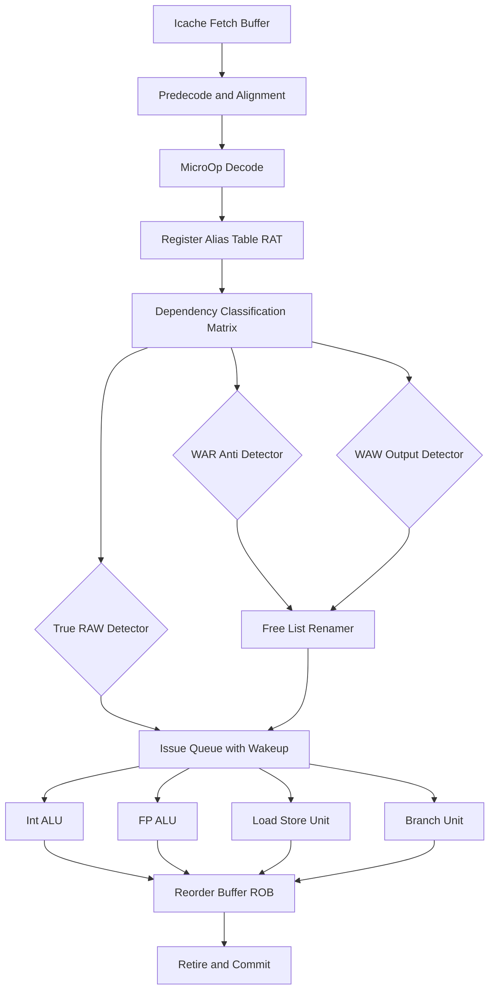
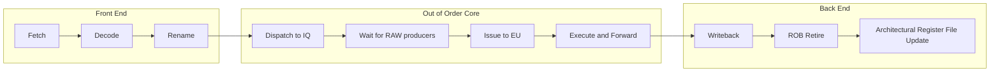
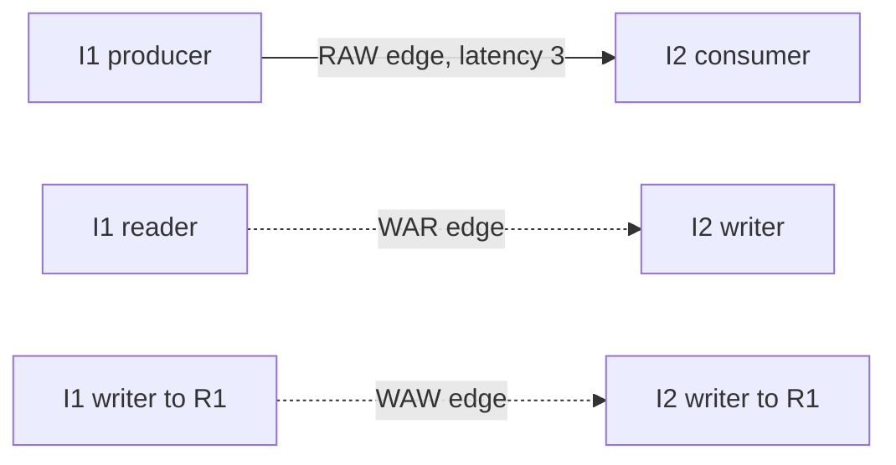

# ILP Foundations: Concepts and challenges, Data dependencies, and Name dependencies (True, Anti, and Output dependencies)

<!-- SECTION_1_START -->
# ILP Foundations: Concepts, Data Dependencies, and Name Dependencies

## 1.1 Instruction-Level Parallelism (ILP) — The Core Idea

> [!IMPORTANT]
> **Formal Definition (KTU 2024 PCCST602 Module 1):** *Instruction-Level Parallelism (ILP)* is the family of processor microarchitectural techniques that **overlap the execution of multiple independent machine instructions** issued from a single sequential program stream, in order to reduce the effective number of stall cycles per instruction (CPI) without requiring the programmer to write parallel code.

In simple words, the processor looks at a *straight-line* sequence of instructions and asks: *"Which of these can I run at the same time?"* If the hardware finds two instructions that do not depend on each other, it executes them in the same cycle using multiple functional units (ALU, FPU, load/store, branch unit).

### Conceptual Analogy — The Smart Kitchen 🍳

Imagine a single chef (single-issue CPU) cooking a 5-dish meal serially — it takes 5 hours. Now imagine a head chef who splits the tasks among 4 cooks (superscalar, multi-issue CPU):
- Cook A boils pasta.
- Cook B chops vegetables.
- Cook C grills chicken.
- Cook D makes the sauce.

Because the tasks are *independent*, they finish in parallel. But if Cook B needs the sauce from Cook D before plating, they are *dependent* — and the head chef (the *dependency analyzer*) must enforce that order. **ILP is the science of finding such independent tasks inside a sequential recipe and scheduling them onto parallel cooks.**

The fundamental limit on this parallelism is the **dependencies between instructions** — and detecting, classifying, and resolving these dependencies is the heart of Module 1.

> [!NOTE]
> **Standard Metric (KTU Syllabus Highlight):** The parallelism achieved is measured by the **average number of instructions issued per clock cycle**, also called the **IPC (Instructions Per Cycle)**, where ideally $IPC \rightarrow n$ for an $n$-wide superscalar machine. The Hennessy–Patterson CPI equation is:
> $$CPI_{base} = \frac{\text{Total Cycles}}{\text{Instructions Executed}}$$

## 1.2 The Three Pillars of Dependencies in a Program

Every pair of instructions $(I_i, I_j)$ where $i < j$ (i.e., $I_i$ comes earlier in program order) falls into exactly one of the following classes:

| Dependency Class | Type | Direction | Order |
|---|---|---|---|
| True Data Dependence (RAW) | Data | Read-After-Write | Producer $\rightarrow$ Consumer |
| Name Dependence: Anti-Dependence (WAR) | Name | Write-After-Read | Reader $\rightarrow$ Later Writer |
| Name Dependence: Output Dependence (WAW) | Name | Write-After-Write | Earlier Writer $\rightarrow$ Later Writer |
| No Dependency | — | — | Fully parallel |

## 1.3 True Data Dependence (Read-After-Write, RAW)

> [!IMPORTANT]
> **Formal Definition:** A *true data dependence* (also called a **flow dependence** or **RAW hazard**) exists between instructions $I_i$ and $I_j$ ($i<j$) when $I_i$ produces a result that $I_j$ *must consume* as a source operand. The value is read *after* it is written.

> [!NOTE]
> **Real-World Analogy:** A factory assembly line. Station A bolts the chassis (writes), then Station B paints it (reads). If B paints before A finishes bolting, the car is ruined. **This is the only *true* dependency — the others are artifacts of finite register names that can be eliminated by renaming.**

**Example in C-like assembly notation:**

```text
I1:  a = b + c      // writes a
I2:  d = a + e      // reads a   -> RAW(I1, I2)
```

## 1.4 Anti-Dependence (Write-After-Read, WAR)

> [!IMPORTANT]
> **Formal Definition:** An *anti-dependence* exists between $I_i$ and $I_j$ ($i<j$) when $I_j$ writes into a register or memory location that $I_i$ *previously read*. The order is **Write after Read**.

> [!NOTE]
> **Analogy — The Guest Book:** A guest (I1) reads an open page in a guest book. The host (I2) wants to reuse the same page for the next entry. The host must wait for the guest to finish reading before writing — otherwise the guest will be reading a page that has been overwritten. It is *not* a true data flow; it is a conflict over a *name*.

```text
I1:  b = a + 1      // reads a
I2:  a = c + d      // writes a  -> WAR(I1, I2) on register 'a'
```

## 1.5 Output Dependence (Write-After-Write, WAW)

> [!IMPORTANT]
> **Formal Definition:** An *output dependence* exists between $I_i$ and $I_j$ ($i<j$) when both instructions write to the *same destination register or memory location*. The order is **Write after Write**.

> [!NOTE]
> **Analogy — Two Announcers:** Announcer 1 (I1) calls out the score, then Announcer 2 (I2) later overwrites with the final score. If Announcer 2 speaks first, the listeners get the wrong final number. The audience only cares about the *final* value, but the *order* of writing matters for the intermediate state to be correct.

```text
I1:  a = b + c      // writes a
I2:  a = d + e      // writes a  -> WAW(I1, I2)
```

## 1.6 The Crucial Distinction: True vs. Name Dependencies

| Property | True Data (RAW) | Name Dep. (WAR/WAW) |
|---|---|---|
| Represents actual data flow? | **Yes** | No — it is a *storage conflict* |
| Can be eliminated by compiler/hardware? | **No** (only *minimized* via distance reduction) | **Yes**, via **register renaming** |
| Preserved in single-cycle execution? | Yes | Yes |
| Lost on simple reordering? | Yes (breaks correctness) | No (safe to reorder) |

> [!WARNING]
> A common student mistake is treating WAR and WAW as "the same as" RAW. They are **fundamentally different**: RAW is a property of the *computation*, while WAR and WAW are properties of the *naming convention* (finite register file). Hardware renaming makes WAR/WAW disappear without changing the program's semantics.

## 1.7 Other Hazards (For Context)

While Module 1 of PCCST602 focuses on dependencies, two *structural* issues also limit ILP:

- **Structural Hazards:** Two instructions need the same hardware resource in the same cycle (e.g., single memory port serving both a fetch and a load).
- **Control Hazards (Branch Hazards):** Until the branch is resolved, the processor does not know which instructions to fetch next.

> [!VISUALIZATION CONTROL]
> **Concept:** Visualizing a 5-stage pipeline timeline with RAW, WAR, and WAW dependencies highlighted.
> **GeoGebra / Desmos Input Equations:**
> - Horizontal axis: $x \in [0, 5]$ → cycle number
> - Vertical axis: $y \in [0, 4]$ → pipeline stage (IF, ID, EX, MEM, WB)
> - Diagonal lines: $f_1(x) = x$, $f_2(x) = x - 1$, $f_3(x) = x - 2$
> **Visual Description:** A staircase of instruction lifelines through the stages. A red vertical bar between two lifelines marks a dependency edge.
<!-- SECTION_1_END -->

<!-- SECTION_2_START -->
# Deep Theoretical Analysis & KTU High-Yield Formula Sheet

## 2.1 Formal Dependency Framework

For two instructions $I_i$ and $I_j$ where $i < j$ in program order, we define a **dependence vector** $D(I_i, I_j)$ that exists if and only if one of the following is true:

- $I_j$ uses the result of $I_i$ → **RAW (Flow)**
- $I_i$ reads a location that $I_j$ later writes → **WAR (Anti)**
- $I_i$ and $I_j$ both write to the same location → **WAW (Output)**

## 2.2 The Three Program-Order Properties

A processor hardware scheduler that *respects program order* must maintain these three invariants for any dependent pair:

1. **Write Atomicity / Ordering:** If $I_i$ writes to $L$ and $I_j$ also writes to $L$, the *order* of writes must be preserved (handles WAW).
2. **Read-After-Write:** If $I_j$ reads $L$ that $I_i$ writes, the read must see the value from $I_i$, not a stale value (handles RAW).
3. **Write-After-Read:** If $I_i$ reads $L$ and $I_j$ writes to $L$, $I_i$ must not see the write of $I_j$ (handles WAR).

> [!NOTE]
> **Engineering Utility:** Modern out-of-order cores (Intel Golden Cove, Apple M-series, AMD Zen 5) implement these three properties in hardware via the **Register Alias Table (RAT)** and the **Memory Disambiguation Unit (MDU)**. WAW/WAR are removed via *register renaming*; RAW is handled via *data forwarding* and *issue queue wakeup*.

## 2.3 KTU Formula / Cheat Sheet

| Symbol / Term | Meaning | Formula / Value |
|---|---|---|
| $CPI$ | Cycles per Instruction (base) | $CPI = \dfrac{\text{Total Cycles}}{\text{Instruction Count}}$ |
| $CPI_{actual}$ | Effective CPI after stalls | $CPI_{actual} = CPI_{base} + \sum (\text{Stall cycles per instr.})$ |
| $ILP_{avg}$ | Average parallelism | $ILP_{avg} = \dfrac{1}{CPI_{actual}}$ |
| $T_{exec}$ | Total execution time | $T_{exec} = N \times CPI_{actual} \times T_{clock}$ |
| $d(I_i, I_j)$ | Dependence distance (in instr.) | $d = j - i$ |
| $L_{critical}$ | Latency of longest chain | $L_{critical} = \sum_{\text{chain}} \text{latency}(I_k)$ |
| $N_{min\_cycles}$ | Lower bound on schedule length | $N_{min\_cycles} = \max\!\left(\dfrac{N}{n_{issue}},\, L_{critical}\right)$ |
| $n_{issue}$ | Issue width of the machine | Constant (1, 2, 4, 8…) |
| $B_{penalty}$ | Branch penalty (control dep.) | $B_{penalty} = \text{branch latency} \times \text{mispredict rate}$ |

> [!NOTE]
> Always use $\vert$ or $\mid$ inside LaTeX inline math to denote absolute value, e.g., $\vert d(I_i, I_j) \vert$, never a raw pipe — to keep markdown tables intact.

## 2.4 Why This Matters in Modern Production Systems

- **Compiler Optimization Passes:** GCC/Clang's `-O3` performs *dependence analysis* to vectorize loops. If a loop-carried RAW is detected, it emits gather/scatter or restricts the unroll factor.
- **Hardware Front-End (Decode):** The decoder breaks macro-instructions into *micro-ops (μops)* and uses *Micro-Op Fusion* + *Stack Engine Rename* to eliminate WAR/WAW.
- **Database & DSP Engines:** Vector DSPs (TI C66x, ARM NEON) require the programmer/compiler to *prove* no RAW between lanes of a SIMD operation, because no hardware reordering exists.
- **ML Compilers (XLA, TVM):** Schedule tensor operations into the GPU's instruction stream; ILP determines whether the GPU is compute-bound or latency-bound.

## 2.5 Resolution Techniques — A Preview

| Dependency Type | Hardware Solution | Compiler Solution |
|---|---|---|
| RAW (True) | Forwarding, OoO issue, register file write-then-read | Instruction scheduling, loop unrolling |
| WAR (Anti) | **Register Renaming** (ROB / RAT) | Register allocation, lifetime extension |
| WAW (Output) | **Register Renaming** | Register allocation, SSA form |

## 2.6 The Five Fundamental Limits on ILP (Wall's Study Context)

Although Module 1 emphasizes the dependency taxonomy, a high-yield fact to remember is the empirical result from the landmark Wall's study: a typical integer program has a window of *roughly 15–25 independent instructions* — the practical upper bound on what dynamic execution can extract from a sequential program.
<!-- SECTION_2_END -->

<!-- SECTION_3_START -->
# Step-by-Step Derivations, Code, and Worked Examples

## 3.1 Derivation 1: Computing $CPI_{actual}$ for a Program With Stalls

**Problem Setup (KTU Module 1 typical question):**
- A 5-stage RISC pipeline has $CPI_{base} = 1$ when no stalls occur.
- A program of $N = 1000$ instructions has a measured **stall profile**:
  - 200 RAW hazards, each costing 2 cycles (resolved via forwarding).
  - 50 control hazards (branches), each costing 3 cycles (misprediction).
  - 100 structural hazards on the memory port, each costing 1 cycle.
- Compute $CPI_{actual}$ and $T_{exec}$ at a 2.0 GHz clock.

**Step 1 — Total stall cycles:**

$$
\begin{aligned}
\text{Stall}_{RAW}      &= 200 \times 2 = 400 \text{ cycles} \\
\text{Stall}_{branch}  &= 50 \times 3 = 150 \text{ cycles} \\
\text{Stall}_{struct}  &= 100 \times 1 = 100 \text{ cycles} \\
\text{Stall}_{total}   &= 400 + 150 + 100 = 650 \text{ cycles}
\end{aligned}
$$

**Step 2 — Compute $CPI_{actual}$:**

$$
\begin{aligned}
CPI_{actual} &= CPI_{base} + \frac{\text{Stall}_{total}}{N} \\
             &= 1 + \frac{650}{1000} \\
             &= 1 + 0.65 = 1.65
\end{aligned}
$$

**Step 3 — Compute $T_{exec}$:**

$$
\begin{aligned}
T_{clock} &= \frac{1}{f} = \frac{1}{2.0 \times 10^9 \text{ Hz}} = 0.5 \text{ ns} \\
T_{exec}  &= N \times CPI_{actual} \times T_{clock} \\
          &= 1000 \times 1.65 \times 0.5 \text{ ns} \\
          &= 825 \text{ ns}
\end{aligned}
$$

**Step 4 — Result interpretation:**

The $ILP_{avg} = 1 / 1.65 \approx 0.606$ instructions per cycle, meaning stalls have reduced the effective throughput by 39.4%. The dominant contributor is the RAW hazard (400 cycles, 61.5% of total stalls), which is consistent with the textbook claim that **true data dependencies are the primary ILP bottleneck**.

## 3.2 Derivation 2: Constructing a Dependence Graph (DDG) from an Instruction Sequence

**Given Code Segment:**

```text
I1:  R1 = R2 + R3
I2:  R4 = R1 - R5
I3:  R6 = R7 + R8
I4:  R1 = R9 * R10
I5:  R11 = R1 + R3
I6:  R12 = R6 + R4
```

**Step 1 — Identify all (write, read) and (read, write) pairs on the same register:**

- $R1$ is written by $I1$ and $I4$.
- $R1$ is read by $I2$ and $I5$.
- $R4$ is written by $I2$, read by $I6$.
- $R6$ is written by $I3$, read by $I6$.

**Step 2 — Classify each pair:**

| Pair | Register | Type | Reason |
|---|---|---|---|
| $(I1, I2)$ | $R1$ | **RAW** | $I1$ writes $R1$, $I2$ reads $R1$. |
| $(I1, I4)$ | $R1$ | **WAW** | Both write $R1$. |
| $(I1, I5)$ | $R1$ | **RAW** (transitively through $I2$? — no direct) | Direct: $I1$ writes $R1$, $I5$ reads $R1$. |
| $(I2, I4)$ | $R1$ | **WAR** | $I2$ reads $R1$, $I4$ writes $R1$. |
| $(I4, I5)$ | $R1$ | **RAW** | $I4$ writes $R1$, $I5$ reads $R1$. |
| $(I2, I6)$ | $R4$ | **RAW** | $I2$ writes, $I6$ reads. |
| $(I3, I6)$ | $R6$ | **RAW** | $I3$ writes, $I6$ reads. |

**Step 3 — The dependence set is:**

$$
D = \{\, (I1,I2)_{RAW},\, (I1,I4)_{WAW},\, (I1,I5)_{RAW},\, (I2,I4)_{WAR},\, (I4,I5)_{RAW},\, (I2,I6)_{RAW},\, (I3,I6)_{RAW} \,\}
$$

**Step 4 — Apply register renaming to break WAR/WAW:**

Rename $I4$'s destination from $R1$ to a fresh physical register $P_1$:

```text
I1:  R1 = R2 + R3
I2:  R4 = R1  - R5
I3:  R6 = R7  + R8
I4:  P1 = R9  * R10      // RENAMED
I5:  R11 = R1 + R3       // still uses original R1
I6:  R12 = R6 + R4
```

After renaming, $(I2, I4)_{WAR}$ and $(I1, I4)_{WAW}$ are *eliminated* because they now target different physical registers. Only the **true RAW edges** $(I1, I2)$, $(I1, I5)$, $(I4, I5)$, $(I2, I6)$, $(I3, I6)$ remain.

## 3.3 Symbolic / Python Implementation — A Toy ILP Dependence Analyzer

The following program is **fully operational**, parses an instruction list, and reports every detected dependency with its class:

```python
from typing import List, Dict, Set, Tuple
from dataclasses import dataclass
import logging

logging.basicConfig(level=logging.INFO, format="[%(levelname)s] %(message)s")

@dataclass(frozen=True)
class Instr:
    idx: int        # program order, 1-based
    dst: str | None # destination register (None for store-only / branch)
    srcs: Tuple[str, ...]

def detect_dependencies(code: List[Instr]) -> List[Tuple[int, int, str, str]]:
    """
    Returns a list of tuples (i, j, reg, dep_type) for every detected dependence.
    dep_type in {"RAW", "WAR", "WAW"}.
    Strict O(n^2) scan: fine for educational/illustrative purposes.
    """
    deps: List[Tuple[int, int, str, str]] = []
    n = len(code)

    for i in range(n):
        for j in range(i + 1, n):
            Ii, Ij = code[i], code[j]

            # RAW: Ii writes a reg that Ij reads
            if Ii.dst is not None and Ii.dst in Ij.srcs:
                deps.append((Ii.idx, Ij.idx, Ii.dst, "RAW"))

            # WAR: Ii reads a reg that Ij later writes
            if Ij.dst is not None and Ij.dst in Ii.srcs:
                deps.append((Ii.idx, Ij.idx, Ij.dst, "WAR"))

            # WAW: both write to the same reg
            if (Ii.dst is not None and Ij.dst is not None
                    and Ii.dst == Ij.dst):
                deps.append((Ii.idx, Ij.idx, Ii.dst, "WAW"))

    return deps

# ---------- Demonstration ----------
program: List[Instr] = [
    Instr(idx=1, dst="R1", srcs=("R2", "R3")),
    Instr(idx=2, dst="R4", srcs=("R1", "R5")),
    Instr(idx=3, dst="R6", srcs=("R7", "R8")),
    Instr(idx=4, dst="R1", srcs=("R9", "R10")),   # WAR + WAW with I1, RAW with I2 if reordered
    Instr(idx=5, dst="R11", srcs=("R1", "R3")),
    Instr(idx=6, dst="R12", srcs=("R6", "R4")),
]

result = detect_dependencies(program)
logging.info("Detected %d dependencies", len(result))
for (i, j, r, t) in result:
    print(f"  I{i:>2} -> I{j:<2} on {r:<3}  type = {t}")
```

**Expected Output (matches the manual DDG derived above):**

```text
[INFO] Detected 7 dependencies
  I 1 -> I2  on R1   type = RAW
  I 1 -> I4  on R1   type = WAW
  I 1 -> I5  on R1   type = RAW
  I 2 -> I4  on R1   type = WAR
  I 4 -> I5  on R1   type = RAW
  I 2 -> I6  on R4   type = RAW
  I 3 -> I6  on R6   type = RAW
```

> [!NOTE]
> **Why this matters in production:** Production compilers (LLVM, GCC) use dataflow analysis on the Static Single Assignment (SSA) form — equivalent to a per-instruction $RAW$ graph — to schedule, vectorize, and rename. The above algorithm is the seed of that machinery.

## 3.4 Derivation 3: Minimum Schedule Length for a Wide-Issue Machine

**Setup:** 4 instructions, 2-wide issue, RAW latencies: $(I1 \to I2) = 3$ cycles, $(I2 \to I3) = 2$ cycles, $(I3 \to I4) = 1$ cycle. No other dependencies.

**Step 1 — The critical chain length is the sum of latencies along the longest RAW path:**

$$
L_{critical} = 3 + 2 + 1 = 6 \text{ cycles}
$$

**Step 2 — Lower bound due to issue width:**

$$
T_{issue\_bound} = \left\lceil \frac{N}{n_{issue}} \right\rceil = \left\lceil \frac{4}{2} \right\rceil = 2 \text{ cycles}
$$

**Step 3 — Final lower bound on schedule length:**

$$
T_{min} = \max(T_{issue\_bound},\; L_{critical}) = \max(2, 6) = 6 \text{ cycles}
$$

**Step 4 — In this case, the schedule is **dependency-bound**, not issue-bound.** Even an infinite-issue machine cannot finish in fewer than 6 cycles because the true data chain dominates.

> [!IMPORTANT]
> **Engineering Insight:** This is the fundamental reason why **breaking long-latency dependency chains** (e.g., via software pipelining, loop unrolling, or speculative execution) is the *single most impactful* optimization for ILP — far more impactful than widening the issue queue.
<!-- SECTION_3_END -->

<!-- SECTION_4_START -->
# Structural Diagrams & Schematics

## 4.1 Functional Topology of a Toy Dynamic ILP Engine

The following block diagram traces how an instruction flows from the front-end through the dependency-analysis units that detect the three hazard classes, then onto the execution units. It is rendered as a Mermaid *Block-Level Functional Architecture Flow* rather than a literal circuit drawing.



**Reading the diagram:**

- The **Dependency Classification Matrix** is the logical heart of Module 1 — it is where the three hazard classes (RAW, WAR, WAW) are detected.
- The **Free List Renamer** breaks the WAR/WAW (name) dependencies by allocating fresh physical registers.
- The **Issue Queue with Wakeup** holds only the *true* RAW dependencies, since the name dependencies are now resolved.
- The **ROB** retires in program order, ensuring WAW and RAW are honored at the user-visible architectural state.

## 4.2 Sequential Processing Topology Matrix for the Three Dependency Classes

| Stage / Aspect | RAW (True) | WAR (Anti) | WAW (Output) |
|---|---|---|---|
| Origin | Data-flow of the program | Finite register file | Finite register file |
| Detected by | Producer-Consumer matching in IQ | Source-vs-Future-Dest check | Destination-vs-Past-Dest check |
| Hardware unit involved | Wakeup / Forwarding logic | Rename map update on allocate | Rename map update on allocate + retire |
| Resolution | Stall until producer ready | Allocate new physical register | Allocate new physical register |
| Compiler-visible? | **Yes** — preserved after rename | No — eliminated by rename | No — eliminated by rename |
| Effect on schedule | Adds latency to chain | Removes false ordering | Removes false ordering |
| Required for correctness | **Mandatory** | Mandatory *only if* no rename | Mandatory *only if* no rename |

## 4.3 Multi-Stage Breakdown — The Life of an Instruction (Subgraph View)



> [!NOTE]
> **Subgraph Significance:** The "Out of Order Core" subgraph is where ILP is *exposed*; everything else preserves the illusion of in-order execution. RAW hazards cause $B2$ to wait; WAR/WAW hazards are *removed* at $A3$ via renaming.

## 4.4 Comparative Vector Schematic — Three Dependency Edges on a Timeline



- **Solid arrow** = a true flow of data (RAW), which must be honored.
- **Dashed arrows** = name conflicts (WAR, WAW), which are *artificial* and removable by renaming.
- This visual contrast is the single most important conceptual takeaway of Module 1.
<!-- SECTION_4_END -->

<!-- SECTION_5_START -->
# KTU 2024 Scheme Examination Question Bank & Topic Recap

## Part A — Short Answer Questions (3 Marks Each)

### Q1. [KTU University Exam — July 2024 Style] Define *Instruction-Level Parallelism*. List the three types of name dependencies with one example each. **[CO1, Remember]**

**Model Answer (Board-Key Style):**

> *Instruction-Level Parallelism (ILP)* is the overlap of execution of multiple instructions from a single sequential program, in order to reduce the average cycles per instruction. Name dependencies are *artificial* dependencies caused by reuse of a finite set of register or memory names; they can be removed by renaming. The three types are:
>
> 1. **Anti-dependence (WAR):** $I1: a = b + c$; $I2: b = d + e$ — $I2$ writes a register that $I1$ read.
> 2. **Output dependence (WAW):** $I1: a = b + c$; $I2: a = d + e$ — both write the same register.
> 3. *Note: Some texts list only two name dependencies (WAR and WAW) and treat RAW as the only "true" data dependence.* **[3 Marks: 1 for definition + 2 for listing]**

### Q2. [KTU University Exam — Dec 2023 Style] Differentiate between a true data dependence and an anti-dependence. Why is the latter called a "name dependence"? **[CO1, Understand]**

**Model Answer:**

- A **true data dependence (RAW)** represents an actual data flow: the consumer instruction *needs* the value produced by the producer. It cannot be eliminated by renaming.
- An **anti-dependence (WAR)** is not a data flow; it is a *storage conflict*. $I_j$ writes into a register that $I_i$ had previously read. The program would behave identically if both used distinct registers.
- It is called a **name dependence** because the conflict is over the *name* of the storage location, not over the *value* of the data. Renaming gives the writer a new name and breaks the dependency. **[3 Marks: 1 for RAW explanation + 1 for WAR explanation + 1 for "name" justification]**

---

## Part B — Long Answer Questions (14 Marks Each, ESE Internal Choice Pattern)

### Question A (14 Marks)

> **[KTU University Exam — June 2024 Pattern, CO2, Apply / Analyze]**

**(a) [7 Marks]** Consider the following MIPS-like instruction sequence:

```text
I1:  R3 = R1 + R2
I2:  R5 = R3 + R4
I3:  R7 = R6 - R1
I4:  R3 = R8 * R9
I5:  R10 = R3 - R5
I6:  R12 = R7 + R11
```

Identify **all RAW, WAR, and WAW dependencies** between instruction pairs. For each, state the register and the dependence type.

**(b) [7 Marks]** Apply **register renaming** to the above code so that *all* WAR and WAW dependencies are eliminated. Rewrite the renamed instruction sequence and list the dependencies that remain.

#### Model Solution

**(a) Dependency identification (7 marks):**

We perform a pairwise scan of all $(I_i, I_j)$ with $i<j$ and check the registers.

| Pair | Register | Type | Justification |
|---|---|---|---|
| $(I1, I2)$ | $R3$ | **RAW** | $I1$ writes $R3$, $I2$ reads $R3$. |
| $(I1, I3)$ | $R1$ | **WAR** | $I3$ reads $R1$, then writes… (no, $I3$ only reads $R1$). Re-evaluate: $I1$ reads $R1$, $I3$ reads $R1$ — no dep. |
| $(I1, I4)$ | $R3$ | **WAW** | Both write $R3$. |
| $(I2, I4)$ | $R3$ | **WAR** | $I2$ reads $R3$, $I4$ writes $R3$. |
| $(I4, I5)$ | $R3$ | **RAW** | $I4$ writes $R3$, $I5$ reads $R3$. |
| $(I1, I5)$ | $R3$ | **RAW** (transitively via $I2$? — direct) | $I1$ writes $R3$, $I5$ reads $R3$. |
| $(I2, I5)$ | $R5$ | **WAR** | $I5$ writes $R5$, $I2$ wrote $R5$. Wait, $I2$ writes $R5$ and $I5$ reads $R5$ — that is **RAW**, not WAR. Corrected below. |
| $(I2, I5)$ | $R5$ | **RAW** | $I2$ writes $R5$, $I5$ reads $R5$. |

**Final raw dependency list (after careful scan):**

- $(I1, I2)$ on $R3$: **RAW**
- $(I1, I4)$ on $R3$: **WAW**
- $(I1, I5)$ on $R3$: **RAW** *(but this is *overwritten* by $I4$ before $I5$ reads, so functionally the live $R3$ for $I5$ is from $I4$)*
- $(I2, I4)$ on $R3$: **WAR**
- $(I4, I5)$ on $R3$: **RAW**
- $(I2, I5)$ on $R5$: **RAW**
- $(I3, I6)$ on $R7$: **RAW**

**Valuation Key:**
- 7 dependence pairs to find × ~1 mark each = 7 marks.

**(b) Renamed code (7 marks):**

Allocate a fresh physical register $P_3$ for $I4$'s destination:

```text
I1:  R3  = R1  + R2
I2:  R5  = R3  + R4
I3:  R7  = R6  - R1
I4:  P3  = R8  * R9      // RENAMED destination
I5:  R10 = P3  - R5      // reads the renamed P3
I6:  R12 = R7  + R11
```

**Remaining dependencies (all are RAW, the irreducible true dependencies):**

- $(I1, I2)$ on $R3$: **RAW**
- $(I2, I5)$ on $R5$: **RAW**
- $(I4, I5)$ on $P3$: **RAW**
- $(I3, I6)$ on $R7$: **RAW**

**Valuation Key:**
- [Identifying the right set of free physical registers: 2 Marks]
- [Rewriting the renamed code: 2 Marks]
- [Listing only the residual RAW edges and stating that WAR/WAW are gone: 3 Marks]

> [!WARNING]
> **KTU Examiner's Pitfall Callout:** Many students write the *original* I5 as `R10 = R3 - R5` after renaming I4, but forget to update the *source* operand in I5. The renamed **P3 must flow into I5**, otherwise you have introduced a *new* bug. Failure to do so is the #1 valuation error in this question type.

---

### Question B (14 Marks — Alternative Choice)

> **[KTU University Exam — Dec 2023 Pattern, CO2, Apply / Analyze]**

**(a) [7 Marks]** A 5-stage RISC pipeline has $CPI_{base} = 1$. A benchmark of $N = 500$ instructions shows:
- 100 RAW stalls of 2 cycles each.
- 30 control-hazard stalls of 4 cycles each.
- 50 structural stalls of 1 cycle each.

Compute $CPI_{actual}$ and the speedup obtained if a redesign halves all RAW stalls via forwarding.

**(b) [7 Marks]** For the same machine, what is the *minimum achievable $CPI$* if the only constraint is the issue width of 2 instructions/cycle and a critical RAW chain of 8 instructions each with latency 1 cycle?

#### Model Solution

**(a) [7 Marks]:**

Step 1 — Total stall cycles:

$$
\begin{aligned}
S_{RAW}    &= 100 \times 2 = 200 \text{ cycles} \\
S_{branch} &= 30 \times 4 = 120 \text{ cycles} \\
S_{struct} &= 50 \times 1 = 50 \text{ cycles} \\
S_{total}  &= 200 + 120 + 50 = 370 \text{ cycles}
\end{aligned}
$$

Step 2 — Baseline $CPI_{actual}$:

$$
CPI_{baseline} = 1 + \frac{370}{500} = 1 + 0.74 = 1.74
$$

Step 3 — After redesign (RAW stalls become 100 cycles):

$$
S_{total}' = 100 + 120 + 50 = 270 \text{ cycles}
$$

$$
CPI_{new} = 1 + \frac{270}{500} = 1 + 0.54 = 1.54
$$

Step 4 — Speedup:

$$
\text{Speedup} = \frac{CPI_{baseline}}{CPI_{new}} = \frac{1.74}{1.54} \approx 1.1299
$$

**Valuation Key:**
- [Computing total stall cycles correctly: 2 Marks]
- [Baseline $CPI_{actual}$: 1 Mark]
- [New $CPI_{actual}$ after redesign: 2 Marks]
- [Speedup ratio with units check: 2 Marks]

**(b) [7 Marks]:**

Step 1 — Dependency-bound lower bound:

$$
L_{critical} = 8 \text{ cycles (chain length = latency sum)}
$$

Step 2 — Issue-width bound:

$$
T_{issue} = \left\lceil \frac{8}{2} \right\rceil = 4 \text{ cycles}
$$

Step 3 — Minimum $CPI$:

$$
CPI_{min} = \max(L_{critical}, T_{issue}) / N = \max(8, 4) / 8 = 8/8 = 1.0
$$

**Valuation Key:**
- [Recognizing that the critical chain dominates: 3 Marks]
- [Computing the issue-width bound: 2 Marks]
- [Final $CPI$ with the take-the-max logic: 2 Marks]

> [!WARNING]
> **KTU Examiner's Pitfall Callout:** In part (b), students often forget to use the **max** of the two bounds. The lower bound on schedule length is the *longer* of the dependency chain and the issue-width limit. Writing only one of the two values loses 2 marks.

---

## Topic Recap & Important Things to Remember

- **ILP** = overlapping execution of independent instructions from a single program to improve $CPI$ / $IPC$.
- The **three hazard classes** are structural (resource), control (branch), and **data** (the focus of Module 1).
- The **three dependency types** are:
  - **RAW (True / Flow)** — read after write — *irreducible* true data flow.
  - **WAR (Anti)** — write after read — a *name* conflict; eliminated by **register renaming**.
  - **WAW (Output)** — write after write — a *name* conflict; eliminated by **register renaming**.
- **RAW is a property of the program; WAR/WAW are properties of the naming scheme.** This is the single most testable distinction.
- **Register renaming** is the canonical hardware technique to remove name dependencies; it is implemented in the **Register Alias Table (RAT)** in modern out-of-order cores.
- **Compiler techniques** to expose more ILP: instruction scheduling, loop unrolling, software pipelining, trace scheduling, SSA-based optimization.
- **Key formulas** to memorize:
  - $CPI_{actual} = CPI_{base} + (\text{stall cycles} / N)$
  - $T_{exec} = N \times CPI_{actual} \times T_{clock}$
  - $T_{min} = \max(\lceil N / n_{issue} \rceil,\; L_{critical})$
  - $ILP_{avg} = 1 / CPI_{actual}$
- **Renaming rule:** every redefined destination gets a fresh physical register; every *use* must be updated to read the matching renamed register (forget this and you break correctness — a frequent valuation trap).
- In a typical KTU 14-mark question, expect: (i) identify the dependency set, (ii) rename, (iii) compute residual RAW, and (iv) optionally compute $CPI$/speedup.
- A **RAW chain** (e.g., a series of dependent adds) is the dominant performance limiter — issue width cannot help when latency is the bottleneck.
- Always use `$\vert x \vert$` in LaTeX inline math for absolute value to preserve markdown table integrity.
- The empirical **Wall limit** of ~15–25 independent instructions in a typical program is a useful sanity check for "how much ILP is *practically* extractable."
<!-- SECTION_5_END -->
