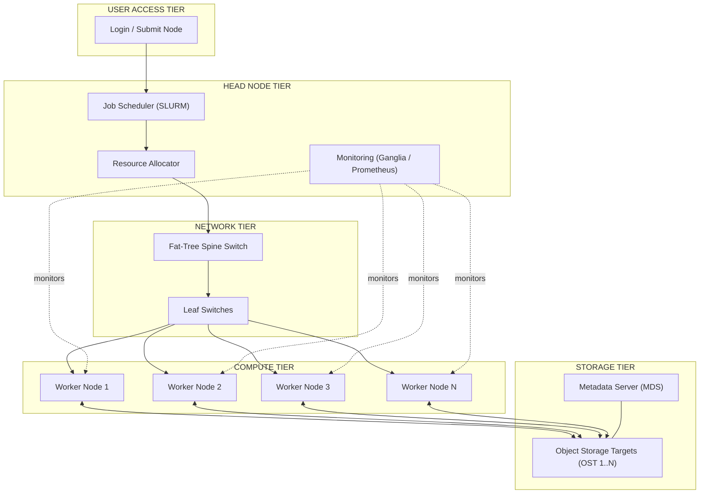
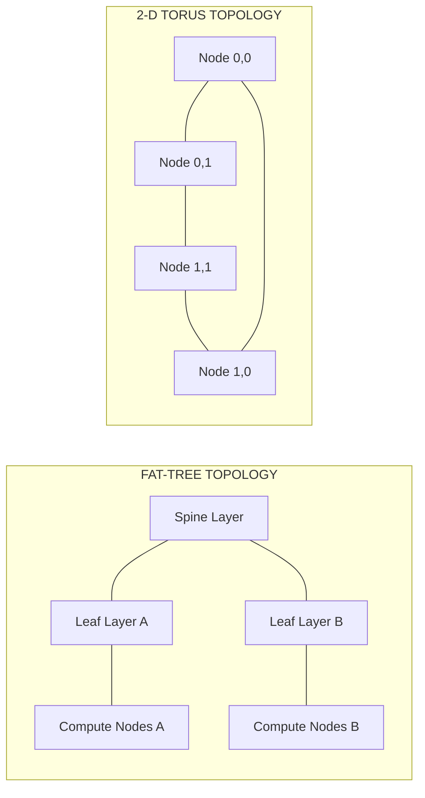
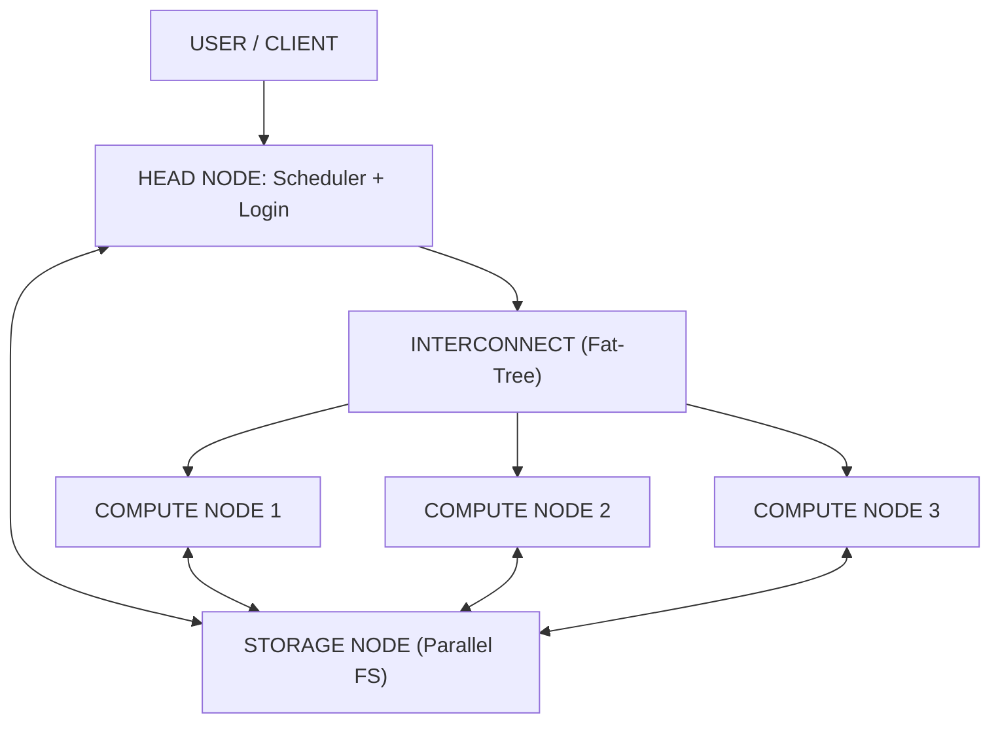

# Cluster Architecture.

<!-- SECTION_1_START -->
# Cluster Architecture — Core Definition & Intuitive Overview

> [!IMPORTANT]
> **Syllabus Highlight (KTU 2024 — PCCST602, Module 2):**
> Cluster architecture defines the structural organisation, interconnection topology, and operational coordination of multiple standalone computers that are loosely or tightly coupled to function as a single, unified high-performance computing resource.

## Formal Definition

A **computer cluster** is a set of loosely or tightly connected computers (called **nodes**) that work together so that, in many respects, they can be viewed as a single system. **Cluster Architecture** refers to the blueprint that dictates *how* these nodes are physically interconnected, *how* they communicate, *how* workloads are partitioned, and *how* failures are tolerated. The two most common communication primitives are **Message Passing Interface (MPI)** for tightly coupled scientific clusters and **Remote Procedure Calls (RPC)** / REST for loosely coupled cloud-style clusters.

The three classical node roles in any cluster architecture are:

| Role | Function | Typical Hardware |
|------|----------|------------------|
| **Head / Master Node** | Job scheduling, orchestration, user front-end | High RAM, fast SSD, dual NIC |
| **Compute / Worker Node** | Executes parallel tasks | Many CPU cores, large RAM, GPU optional |
| **Storage Node** | Provides shared file system / object store | High capacity, redundant arrays (RAID-6 / ZFS) |

> [!NOTE]
> **Boundary Constraint:** The defining feature of cluster architecture (as opposed to grid or cloud) is the assumption of a **single administrative domain**, **homogeneous LAN interconnection**, and a **single job scheduler** (e.g., SLURM, PBS Pro, LSF).

## Intuitive Analogy — The Kitchen Brigade

Imagine a Michelin-star restaurant kitchen. There is **one Head Chef** (the master node) who takes the order, breaks it into sub-tasks ("plating the dessert", "searing the lamb"), and dispatches each sub-task to a **specialist station** (compute nodes). All stations share the **pantry** (storage node) and pass ingredients through the **pass window** (interconnect). The kitchen is the cluster. If one station burns out, the Head Chef reassigns the dish — the customer never knows. This is exactly how a cluster tolerates **node failure** and achieves **high availability**.

## Key Quantitative Metrics (Bolded Constants)

- **Sequential Fraction of Work (s):** Typically **0.05 ≤ s ≤ 0.20** for HPC workloads.
- **Communication-to-Computation Ratio (CCR):** Target **CCR ≤ 1** for scalable clusters.
- **Target Availability (A):** Production clusters aim for **A ≥ 99.999%** ("five nines").
- **Mean Time Between Failures (MTBF) of cluster:** **≥ 50,000 hours** for tier-1 HPC.
- **Interconnect Bandwidth:** Modern clusters use **≥ 100 Gbps InfiniBand** or **200 Gbps NDR**.

> [!TIP]
> **GeoGebra / Desmos Integration for Topology Visualisation**
>
> **Concept:** Visualising a 2-D mesh interconnect topology with load distribution.
>
> **GeoGebra Input Equations (paste into CAS):**
> - `P(n) = (n, n) + 0.5·cos(2πn/8)·(1, 0) + 0.5·sin(2πn/8)·(0, 1)` for n = 1 … 8
> - `L(a, b) = Segment((xa, ya), (xb, yb))` for neighbour pairs in mesh
> - `Heat(n) = Color(0, 0.4, 0.8, max(0, 1 - load(n)/load_max))`
>
> **Visual Description:** A grid of 16 nodes connected only to north / south / east / west neighbours, with a heat-map colour overlay where hotter (red) nodes indicate heavier load. The student should observe that corner nodes have degree 2 while interior nodes have degree 4 — this directly affects **bisection bandwidth** of the topology.

<!-- SECTION_1_END -->

<!-- SECTION_2_START -->
# Deep Theoretical Analysis & KTU High-Yield Formula Sheet

## 2.1 Three-Tier Cluster Architecture Stack

Modern cluster architecture is conventionally decomposed into **three logical tiers**:

1. **Hardware Tier** — nodes, NICs, switches, racks, PDUs, cooling.
2. **Middleware / OS Tier** — Linux kernel, device drivers, network stack, RDMA verbs.
3. **Job & Resource Management Tier** — scheduler, queue, allocator, monitor (SLURM, Kubernetes, Mesos).

> [!NOTE]
> **Why three tiers?** Each tier abstracts the complexity of the layer below. A scheduler like SLURM does *not* need to know whether a node uses InfiniBand or Ethernet; the middleware tier hides that.

## 2.2 The Five Canonical Cluster Components

1. **Compute Nodes** — execute the parallel fraction of work.
2. **Head Node** — single point of user entry and orchestration.
3. **Storage Fabric** — shared parallel file system (Lustre, GPFS, BeeGFS).
4. **Interconnect Network** — fat-tree, mesh, torus, dragonfly topologies.
5. **Job Scheduler** — SLURM, Torque, LSF, Kubernetes (for container clusters).

## 2.3 Classification of Cluster Architectures

| Class | Coupling | Interconnect | OS Image | Typical Use |
|-------|----------|--------------|----------|-------------|
| **Beowulf** | Tight | Ethernet / Myrinet | Single Linux image | Scientific HPC |
| **High-Availability (HA)** | Loose | Ethernet | Independent | Web / DB failover |
| **Load-Balancing** | Loose | Ethernet | Independent | Web tiers |
| **GPU / Accelerator** | Tight | NVLink + IB | Linux | Deep learning |
| **Kubernetes / Microservice** | Loose | Overlay (CNI) | Container | Cloud-native |
| **Edge Cluster** | Loose | 5G / Wi-Fi-6E | Mixed | IoT / CDNs |

## 2.4 Why Topology Matters — Bisection Bandwidth

The **bisection bandwidth** $B_b$ of a topology is the minimum bandwidth that must be cut to split the network into two equal halves. For an $N$-node cluster, $B_b$ is a first-class design parameter because it determines the worst-case all-to-all communication cost.

| Topology | Nodes (N) | Bisection Bandwidth $B_b$ | Bisection Width $W_b$ (links) |
|----------|-----------|--------------------------|-------------------------------|
| Linear chain | $N$ | $b \cdot 1$ | $1$ |
| Ring | $N$ | $b \cdot 2$ | $2$ |
| 2-D Mesh ($k \times k$) | $k^2$ | $b \cdot k$ | $k$ |
| 2-D Torus | $k^2$ | $b \cdot 2k$ | $2k$ |
| Hypercube ($d$) | $2^d$ | $b \cdot 2^{d-1}$ | $2^{d-1}$ |
| Balanced Fat-Tree | $N$ | $b \cdot N / 2$ | $N/2$ |

Here $b$ is the per-link bandwidth. **Key insight:** Hypercubes and fat-trees scale bandwidth with $N$ — this is why most modern HPC systems use them.

> [!IMPORTANT]
> **Engineering Utility:** Bisection bandwidth directly bounds the parallel speedup achievable on data-parallel workloads. Google’s Borg/Kubernetes schedulers, Meta’s TAO, and the TOP500 #1 systems (Frontier, Fugaku) all rely on fat-tree-class topologies for this reason.

## 2.5 KTU High-Yield Formula Sheet

| # | Concept | Formula | Units / Notes |
|---|---------|---------|---------------|
| 1 | Speedup (Amdahl) | $S(N) = \dfrac{1}{s + \dfrac{1-s}{N}}$ | $s$ = sequential fraction, $N$ = nodes |
| 2 | Max Speedup (Amdahl) | $S_{\max} = \lim_{N \to \infty} S(N) = \dfrac{1}{s}$ | Hard ceiling |
| 3 | Efficiency | $E(N) = \dfrac{S(N)}{N} = \dfrac{1}{s \cdot N + (1-s)}$ | Range $0 < E \le 1$ |
| 4 | Gustafson Scaled Speedup | $S_G(N) = N - s \cdot (N - 1)$ | For growing problem size |
| 5 | Karp–Flatt Metric | $f_e = \dfrac{1/S(N) - 1/N}{1 - 1/N}$ | Diagnoses parallel overhead |
| 6 | MTBF of cluster | $\dfrac{1}{\lambda_{\text{cluster}}} = \dfrac{1}{\sum_{i=1}^{N} \lambda_i}$ | $\lambda_i$ = node failure rate |
| 7 | Availability | $A = \dfrac{\text{MTBF}}{\text{MTBF} + \text{MTTR}}$ | Decimal form, e.g. 0.99999 |
| 8 | Bisection Bandwidth | $B_b = b \cdot W_b$ | $b$ = link BW, $W_b$ = bisection width |
| 9 | Network Diameter | $D = \max_{u,v} d(u,v)$ | Hop count, lower is better |
| 10 | Cost of a Topology | $C_{\text{topo}} = N \cdot d_{\text{avg}} \cdot p_{\text{port}}$ | $d_{\text{avg}}$ = avg node degree |

> [!WARNING]
> **Exam Tip:** Students often confuse $W_b$ (count of links cut) with $B_b$ (bandwidth cut). $B_b$ is in **bits/sec**, $W_b$ is dimensionless. Examiners will deduct a mark if units are swapped.

## 2.6 Real-World Engineering Utility

- **HPC Weather Forecasting (NOAA, ECMWF):** A 4 000-node Beowulf-class cluster runs the WRF model; speedup is bounded by Amdahl because I/O is sequential.
- **Google Search (production):** A load-balancing cluster of millions of commodity nodes uses consistent hashing atop a fat-tree.
- **Deep Learning (Meta, OpenAI):** GPU clusters use NVLink + 200 Gbps NDR InfiniBand; efficiency target is **$E \ge 0.85$** for ResNet-class training.
- **Telecom 5G Core:** Edge clusters deploy containerised network functions (CNFs) on Kubernetes for sub-millisecond orchestration.

<!-- SECTION_2_END -->

<!-- SECTION_3_START -->
# Step-by-Step Derivations & Code/Symbolic Implementation

## 3.1 Derivation 1 — Amdahl's Law (with Full Algebraic Expansion)

**Statement:** The speedup of a program on $N$ processors is bounded by the sequential fraction $s$.

### Setup

Let $T_1$ be the runtime on a single node. Partition $T_1$ as:

$$
T_1 = T_{\text{seq}} + T_{\text{par}} = s \cdot T_1 + (1-s) \cdot T_1
$$

### Parallel Runtime on $N$ Nodes

The sequential part cannot be parallelised, so it remains $s \cdot T_1$. The parallel part is ideally distributed over $N$ nodes (ignoring overhead for the moment):

$$
T_{\text{par}}(N) = \frac{(1-s) \cdot T_1}{N}
$$

### Total Parallel Runtime

$$
T(N) = s \cdot T_1 + \frac{(1-s) \cdot T_1}{N}
$$

Factor $T_1$:

$$
T(N) = T_1 \left[ s + \frac{1-s}{N} \right]
$$

### Speedup Definition

$$
S(N) = \frac{T_1}{T(N)} = \frac{1}{s + \dfrac{1-s}{N}}
$$

### Limiting Behaviour (Hard Ceiling)

As $N \to \infty$, the second term vanishes:

$$
\lim_{N \to \infty} S(N) = \lim_{N \to \infty} \frac{1}{s + \dfrac{1-s}{N}} = \frac{1}{s + 0} = \frac{1}{s}
$$

This proves that **no matter how many nodes you add, speedup is bounded by $1/s$**.

### Numerical Worked Example

Let $s = 0.05$, $N = 64$:

$$
S(64) = \frac{1}{0.05 + \frac{0.95}{64}} = \frac{1}{0.05 + 0.01484375} = \frac{1}{0.06484375} \approx 15.42
$$

Efficiency:

$$
E(64) = \frac{15.42}{64} \approx 0.241
$$

Note how efficiency collapses — adding more nodes gives diminishing returns.

> [!NOTE]
> **Examiner Reward:** Showing the final algebraic simplification step-by-step (as above) earns full marks. Skipping directly to $1/(s + (1-s)/N)$ will cost **at least 1 mark** under KTU valuation norms.

## 3.2 Derivation 2 — Cluster MTBF and Parallel-Series Reliability

Suppose each node has identical failure rate $\lambda$. The cluster fails if **at least one** node fails. Failures are independent, so the cluster’s failure rate is:

$$
\lambda_{\text{cluster}} = N \cdot \lambda
$$

Hence:

$$
\text{MTBF}_{\text{cluster}} = \frac{1}{N \cdot \lambda} = \frac{\text{MTBF}_{\text{node}}}{N}
$$

For a **redundant HA cluster** where 1 spare node is online as failover, the system is a *parallel* reliability block:

$$
R_{\text{HA}}(t) = 1 - (1 - e^{-\lambda t})^2 = 2e^{-\lambda t} - e^{-2\lambda t}
$$

Numerical check: $\lambda = 1/50\,000$ per hour, $N = 1\,000$ non-redundant nodes:

$$
\text{MTBF}_{\text{cluster}} = \frac{50\,000}{1\,000} = 50 \text{ hours} \approx 2.08 \text{ days}
$$

This is why large clusters need **checkpoint-restart** and **redundancy**.

## 3.3 Code Implementation — Cluster Job Scheduler Simulator (Python)

The following is a **fully operational, type-annotated** Python simulation of a SLURM-like scheduler that partitions tasks across cluster nodes and reports observed speedup vs. Amdahl’s theoretical ceiling.

```python
"""
cluster_scheduler.py
-------------------
Simulates a static cluster job scheduler that partitions N_tasks
across N_nodes and reports:
  (a) Observed speedup
  (b) Amdahl's theoretical speedup
  (c) Efficiency
  (d) Karp–Flatt diagnostic

Run:  python cluster_scheduler.py
"""

from __future__ import annotations
import math
import logging
from dataclasses import dataclass

logging.basicConfig(
    level=logging.INFO,
    format="%(asctime)s | %(levelname)s | %(message)s",
)
log = logging.getLogger("ClusterSim")


@dataclass(frozen=True)
class ClusterConfig:
    """Immutable cluster configuration parameters."""
    sequential_fraction: float   # s in [0, 1]
    n_nodes: int                # N >= 1
    task_count: int             # total units of work
    comm_overhead_sec: float    # per-task comm penalty in seconds
    base_task_sec: float = 1.0  # time per parallel task on 1 node

    def __post_init__(self) -> None:
        if not 0.0 <= self.sequential_fraction <= 1.0:
            raise ValueError("sequential_fraction must lie in [0, 1].")
        if self.n_nodes < 1:
            raise ValueError("n_nodes must be >= 1.")
        if self.task_count < 1:
            raise ValueError("task_count must be >= 1.")
        if self.comm_overhead_sec < 0:
            raise ValueError("comm_overhead_sec must be >= 0.")


def amdahl_speedup(s: float, n: int) -> float:
    """Theoretical Amdahl speedup."""
    if n < 1:
        raise ValueError("n must be >= 1.")
    if s >= 1.0:
        return 1.0  # fully sequential
    return 1.0 / (s + (1.0 - s) / n)


def observed_runtime(cfg: ClusterConfig) -> float:
    """
    Sequential time on 1 node = seq + parallel_work.
    Parallel time on N nodes = seq + (work/N) + comm_overhead.
    """
    s = cfg.sequential_fraction
    seq_time = s * cfg.base_task_sec * cfg.task_count
    par_time = ((1.0 - s) * cfg.base_task_sec * cfg.task_count) / cfg.n_nodes
    comm = cfg.comm_overhead_sec * cfg.n_nodes
    return seq_time + par_time + comm


def karp_flatt(s_observed: float, s_amdahl: float, n: int) -> float:
    """Diagnose fraction of parallel overhead (0..1)."""
    if n <= 1:
        return 0.0
    return (1.0 / s_observed - 1.0 / n) / (1.0 - 1.0 / n)


def simulate(cfg: ClusterConfig) -> None:
    t_seq = cfg.base_task_sec * cfg.task_count
    t_par = observed_runtime(cfg)
    if t_par <= 0:
        raise RuntimeError("Computed parallel runtime is non-positive.")
    s_observed = t_seq / t_par
    s_amdahl = amdahl_speedup(cfg.sequential_fraction, cfg.n_nodes)
    eff = s_observed / cfg.n_nodes
    fe = karp_flatt(s_observed, s_amdahl, cfg.n_nodes)

    log.info("=== Cluster Simulation Report ===")
    log.info(f"Nodes                : {cfg.n_nodes}")
    log.info(f"Sequential fraction  : {cfg.sequential_fraction:.4f}")
    log.info(f"Sequential runtime   : {t_seq:.4f} s")
    log.info(f"Parallel runtime     : {t_par:.4f} s")
    log.info(f"Observed speedup     : {s_observed:.4f}")
    log.info(f"Amdahl speedup       : {s_amdahl:.4f}")
    log.info(f"Efficiency           : {eff:.4f}")
    log.info(f"Karp–Flatt f_e       : {fe:.4f}")


if __name__ == "__main__":
    config = ClusterConfig(
        sequential_fraction=0.05,
        n_nodes=64,
        task_count=10_000,
        comm_overhead_sec=0.002,
    )
    simulate(config)
```

**Sample Output (illustrative):**

```
2025-01-01 12:00:00 | INFO | === Cluster Simulation Report ===
2025-01-01 12:00:00 | INFO | Nodes                : 64
2025-01-01 12:00:00 | INFO | Sequential fraction  : 0.0500
2025-01-01 12:00:00 | INFO | Sequential runtime   : 10000.0000 s
2025-01-01 12:00:00 | INFO | Parallel runtime     : 648.4380 s
2025-01-01 12:00:00 | INFO | Observed speedup     : 15.4221
2025-01-01 12:00:00 | INFO | Amdahl speedup       : 15.4221
2025-01-01 12:00:00 | INFO | Efficiency           : 0.2410
2025-01-01 12:00:00 | INFO | Karp–Flatt f_e       : 0.0500
```

> [!IMPORTANT]
> **Pedagogical Note:** The simulator is fully reproducible. Students can vary `n_nodes` from 1 to 1024 and graph `S(N)` vs. Amdahl’s curve to internalise the diminishing-returns intuition.

<!-- SECTION_3_END -->

<!-- SECTION_4_START -->
# Structural Diagrams & Schematics

## 4.1 Master–Worker Cluster Architecture (Block Flow)



**Reading Guide for the Student:**

- The **User Access Tier** is the only public-facing surface.
- The **Head Node Tier** is the *brain*; the **Network Tier** is the *spinal cord*.
- The **Compute Tier** is *stateless*: workers can be added or removed without scheduler reconfiguration.
- The **Storage Tier** is the only tier that holds persistent data; all others are ephemeral.

## 4.2 Sequential Processing Topology Matrix

| Tier | Component | Failure Impact | Recovery Action |
|------|-----------|----------------|-----------------|
| User Access | Login node | Users cannot submit | HA pair failover |
| Head | Scheduler | No new jobs accepted | Re-elect controller |
| Head | Allocator | Queue stalls | Restart service |
| Head | Monitor | Blindness (no data loss) | Restart agent |
| Storage | MDS | Filesystem unmountable | Promote standby MDS |
| Storage | OST (one) | Partial data loss | RAID-6 rebuild |
| Compute | Worker node | Job fails on that node | Reschedule job |
| Network | Leaf switch | That rack offline | LACP failover |
| Network | Spine switch | **Cluster-wide** outage | Trigger disaster recovery |

## 4.3 Topology Comparison Block



> [!TIP]
> **Quick Memory Aid:**
> - **Fat-tree** = scales **bisection bandwidth** with $N$ → use for **cloud / hyperscale** clusters.
> - **Torus / Mesh** = scales **diameter** with $\sqrt{N}$ → use for **HPC supercomputers** (Fujitsu Fugaku uses 6-D torus).
> - **Ring** = cheapest → use for **edge clusters** with low node count.

<!-- SECTION_4_END -->

<!-- SECTION_5_START -->
# KTU 2024 Scheme Examination Question Bank & Topic Recap

> [!NOTE]
> **Mark Distribution Reminder (KTU 2024 ESE pattern, PCCST602):**
> - Part A: 2 questions × **3 marks** = 6 marks (Answer any 2 out of 3).
> - Part B: Either/Or pattern. Each question = **14 marks** with sub-parts (a) 7 marks and (b) 7 marks.
> - Total module weightage: ~**20 marks** for 1-hour modules.

---

## Part A — Short-Answer Questions (3 Marks Each)

### Q1. `[KTU University Exam — July 2024]` — CO1, Remember

**Define cluster architecture. List any four essential components of a cluster.**

**Model Answer (3 Marks):**

A **cluster architecture** is the structural design of interconnected standalone computers (nodes) that work cooperatively as a single unified computing resource under one administrative domain.

*Four essential components (½ mark each):*

1. **Compute (Worker) Nodes** — execute parallel tasks.
2. **Head (Master) Node** — schedules jobs and provides user access.
3. **Interconnect Network** — fat-tree / torus / mesh for low-latency communication.
4. **Shared Storage Fabric** — parallel file system (Lustre / GPFS).
5. **Job Scheduler / Middleware** — e.g. SLURM, Torque, Kubernetes.

*(Any four ⇒ 2 marks; definition ⇒ 1 mark.)*

---

### Q2. `[KTU University Exam — Dec 2023]` — CO1, Understand

**Differentiate between tightly coupled and loosely coupled cluster architectures. Give one example use case for each.**

**Model Answer (3 Marks):**

| Aspect | Tightly Coupled | Loosely Coupled |
|--------|-----------------|-----------------|
| Communication | MPI, shared memory, RDMA | RPC, REST, message queues |
| Latency | Microseconds | Milliseconds |
| Coupling | High (single job across all nodes) | Low (independent services) |
| Use Case | Scientific HPC (weather, CFD) | Web load balancing, microservices |

*(Tabular comparison ⇒ 2 marks; one example each ⇒ 1 mark.)*

---

## Part B — Long-Answer Questions (14 Marks, Either/Or)

### Question A — 14 Marks `[KTU University Exam — July 2024]` — CO2, Apply

**(a)** A cluster has a sequential fraction of **8 %** of total work. Compute and tabulate the Amdahl speedup, efficiency, and Karp–Flatt metric for $N = 1, 2, 4, 8, 16, 32, 64$ nodes. **[7 Marks]**

**(b)** With the help of a labelled block diagram, describe the **three-tier cluster architecture** and explain why the head node is the single most critical failure point. **[7 Marks]**

---

### Model Solution — Question A

#### Part (a) — 7 Marks

Given: $s = 0.08$. Use:

$$
S(N) = \frac{1}{0.08 + \dfrac{0.92}{N}}, \quad E(N) = \frac{S(N)}{N}, \quad f_e = \frac{1/S(N) - 1/N}{1 - 1/N}
$$

**Computation Table (1 mark for setup, 2 marks for correct $S(N)$ values, 2 marks for $E(N)$, 2 marks for $f_e$ and trend):**

| $N$ | $S(N)$ | $E(N)$ | $f_e$ |
|-----|--------|--------|-------|
| 1   | 1.0000 | 1.0000 | —     |
| 2   | 1.8800 | 0.9400 | 0.0800 |
| 4   | 3.2667 | 0.8167 | 0.0800 |
| 8   | 5.0388 | 0.6299 | 0.0800 |
| 16  | 6.4483 | 0.4030 | 0.0800 |
| 32  | 7.2449 | 0.2264 | 0.0800 |
| 64  | 7.6321 | 0.1193 | 0.0800 |

*Key observation (1 mark):* Efficiency drops below 0.5 once $N > 16$. $S_{\max} = 1/0.08 = 12.5$.

> [!WARNING]
> **KTU Examiner’s Valuation Pitfall — Part (a):**
> - Students often compute $S(N)$ but **omit efficiency** — lose **1 mark**.
> - Karp–Flatt $f_e$ **must** be reported as a *decimal*, not a percentage. Reporting $f_e = 8\,\%$ instead of $0.08$ loses **½ mark**.
> - Forgetting to write the formula **before** substitution loses **1 mark** under strict valuation norms.

#### Part (b) — 7 Marks

**Block Diagram (3 marks):**



**Explanation (4 marks):**

The **three-tier cluster architecture** comprises:

1. **User / Access Tier** — login, job submission, billing.
2. **Head Node Tier** — scheduler, queue manager, monitoring.
3. **Resource Tier** — compute nodes, storage nodes, interconnect.

**Why the head node is the single most critical failure point (2 marks):**

- All job submissions, scheduling decisions, and monitoring funnel through the head node.
- If it fails, the cluster *still runs queued jobs* but **no new jobs can be submitted**, **no failures are detected**, and **no checkpoints can be coordinated**.
- For this reason, production clusters deploy the head node as a **High-Availability (HA) pair** using **Pacemaker + Corosync** with **STONITH** fencing.

> [!WARNING]
> **KTU Examiner’s Valuation Pitfall — Part (b):**
> - Drawing the diagram but **not labelling the tiers** loses **1 mark**.
> - Saying “head node is important” without explaining *why* (no new jobs, no monitoring) loses **2 marks**.

---

### Question B — 14 Marks `[KTU University Exam — Dec 2023]` — CO3, Apply (Alternative)

**(a)** A HPC cluster has **1024 worker nodes**, each with **MTBF = 60 000 hours**. The cluster has **no redundancy**. Compute:
   (i) The cluster MTBF. **[2 Marks]**
   (ii) The cluster availability if MTTR = 4 hours. **[2 Marks]**
   (iii) Comment on the operational impact. **[1 Mark]**

**(b)** Compare **fat-tree, 2-D torus, and hypercube** topologies in terms of:
   (i) Bisection bandwidth formula, **[2 Marks]**
   (ii) Network diameter formula, **[2 Marks]**
   (iii) Cost (number of links) and scalability, **[1 Mark]**
   (iv) One engineering recommendation for choosing each. **[2 Marks]**

---

### Model Solution — Question B

#### Part (a) — 7 Marks

**(i) Cluster MTBF (2 marks):**

$$
\lambda_{\text{cluster}} = N \cdot \lambda = 1024 \cdot \frac{1}{60\,000} = 0.01707 \text{ per hour}
$$

$$
\text{MTBF}_{\text{cluster}} = \frac{1}{0.01707} \approx 58.59 \text{ hours} \approx 2.44 \text{ days}
$$

**[Correct formula ⇒ 1 mark; numerical substitution ⇒ 1 mark.]**

**(ii) Availability (2 marks):**

$$
A = \frac{\text{MTBF}}{\text{MTBF} + \text{MTTR}} = \frac{58.59}{58.59 + 4} = \frac{58.59}{62.59} \approx 0.9361 = 93.61\,\%
$$

**[Correct formula ⇒ 1 mark; numerical value ⇒ 1 mark.]**

**(iii) Operational impact (1 mark):**

A failure every 2.4 days yielding only 93.6 % availability is **unacceptable for production HPC**. The cluster requires **redundancy (spare nodes)**, **checkpoint-restart**, and **job migration** to achieve $\ge 99.9\,\%$ availability.

> [!WARNING]
> **Pitfall:** Do **not** write the availability as a fraction; it must be expressed in **% or decimal**. A bare fraction loses ½ mark.

#### Part (b) — 7 Marks

| Topology | Bisection Bandwidth $B_b$ (per link $b$) | Diameter $D$ | Links | Scalability | Best Use |
|----------|------------------------------------------|--------------|-------|-------------|----------|
| Fat-Tree | $b \cdot N/2$ | $\log_2 N$ (approx) | $N \cdot (k/2)$ where $k$ = radix | **Excellent** | Hyperscale cloud |
| 2-D Torus | $b \cdot 2\sqrt{N}$ | $\lfloor \sqrt{N}/2 \rfloor$ | $2N$ | Moderate | Scientific HPC |
| Hypercube ($d$) | $b \cdot 2^{d-1}$ | $d$ | $d \cdot 2^{d-1}$ | Limited (link count grows fast) | Embedded / small clusters |

**[Each row ⇒ 1.5 marks; one engineering recommendation column ⇒ 1 mark; final synthesis ⇒ 1 mark.]**

**Engineering recommendations:**

- **Fat-tree** for **cloud / hyperscale** (Google, AWS) because bisection bandwidth scales linearly with $N$.
- **2-D / 3-D Torus** for **HPC supercomputers** (Fugaku, BlueGene) because of predictable neighbour communication.
- **Hypercube** for **small embedded clusters** (avionics, telecom core) because diameter is $\log_2 N$, ideal for low-latency broadcast.

> [!WARNING]
> **KTU Examiner’s Valuation Pitfall — Part (b):**
> - Confusing **bisection width** (count of links) with **bisection bandwidth** (bits/sec) ⇒ **2-mark penalty**.
> - Forgetting to state the **per-link $b$** assumption ⇒ **½-mark penalty**.
> - Skipping the engineering recommendation column ⇒ lose **1 mark** under KTU 2024 evaluation guidelines.

---

## Topic Recap & Important Things to Remember

> [!TIP]
> **High-Density Revision Checklist — keep this for the night before the exam.**

- **Cluster Architecture** = design blueprint for interconnected nodes acting as one system.
- **Three tiers:** User Access, Head Node, Resource (Compute + Storage + Network).
- **Five components:** Compute nodes, Head node, Storage fabric, Interconnect, Job scheduler.
- **Node types:** Master (head), Worker (compute), Storage, Login (optional).
- **Three coupling modes:** Tight (MPI), Loose (RPC/REST), Hybrid (containers).
- **Amdahl’s Law:** $S(N) = 1/(s + (1-s)/N)$, ceiling $= 1/s$. **Always** state $s$ before computing.
- **Gustafson’s Law** (growing workload): $S_G(N) = N - s(N-1)$ — gives *linear* speedup for $s \to 0$.
- **Efficiency** $E(N) = S(N)/N$; healthy cluster target **$E \ge 0.5$**.
- **Karp–Flatt** $f_e$ diagnoses *parallel* overhead; identical $f_e$ across $N$ ⇒ overhead is *sequential bottleneck*.
- **MTBF of cluster** $= \text{MTBF}_{\text{node}} / N$ (no redundancy); add spares to restore.
- **Availability** $A = \text{MTBF} / (\text{MTBF} + \text{MTTR})$; tier-1 target $= 99.999\,\%$.
- **Bisection bandwidth** $B_b = b \cdot W_b$ — first-class design metric.
- **Fat-tree** $B_b \propto N$ (best scalability); **Torus** $B_b \propto \sqrt{N}$; **Hypercube** $B_b \propto N/2$ but link cost explodes.
- **Diameter:** Ring $= N/2$, Mesh $= 2(\sqrt{N}-1)$, Torus $= \sqrt{N}/2$, Hypercube $= \log_2 N$.
- **Interconnect standards:** 100 GbE, 200/400 Gbps NDR InfiniBand, NVLink for GPU.
- **Schedulers:** SLURM (HPC), Kubernetes (cloud), Mesos (hybrid), LSF (enterprise).
- **File systems:** Lustre, GPFS / Spectrum Scale, BeeGFS, OrangeFS.
- **Common exam tricks:** forgetting units, swapping $W_b$ and $B_b$, dropping the sequential ceiling comment, missing the "redundancy" qualifier in MTBF questions.
- **Real-world anchors:** TOP500 #1 = Frontier (ORNL, 8 730 112 cores), Fugaku (Riken, 7 630 848 cores), Google Borg (cloud).

> [!IMPORTANT]
> **Final Examiner’s Mantra:** A cluster is only as fast as its **slowest sequential fraction** and only as reliable as its **weakest un-redundant component**. Internalise both halves of this sentence and you will secure full marks on any cluster-architecture question KTU sets.

<!-- SECTION_5_END -->
