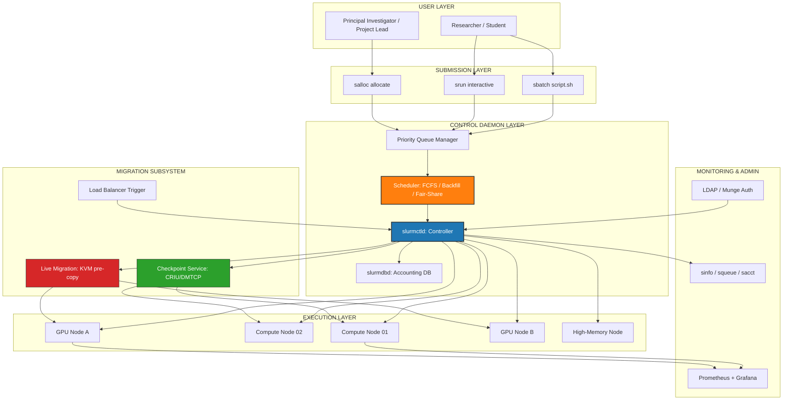
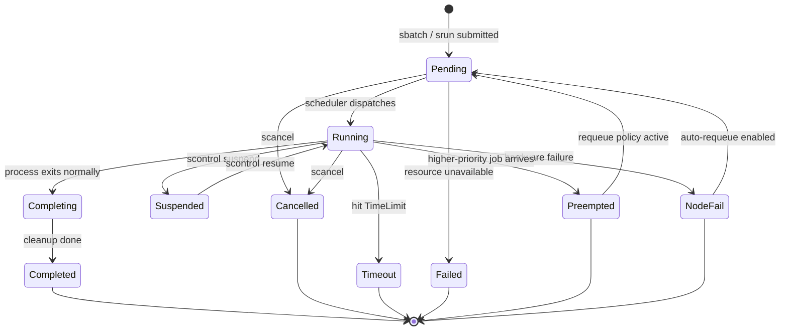
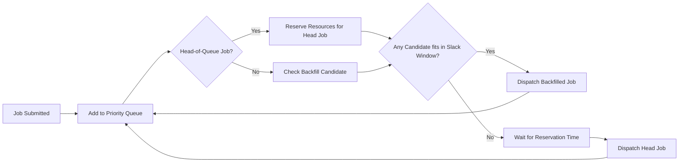
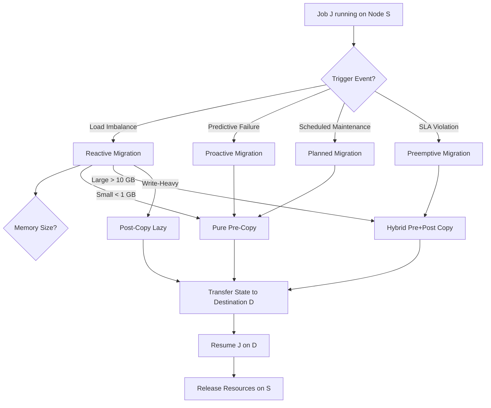

# Cluster Job and Resource Management:- – Job Scheduling methods, Job management system – administration, job types, migration schemes.

<!-- SECTION_1_START -->

# Cluster Job and Resource Management

## 1.1 Formal KTU 2024 Definition

> [!IMPORTANT]
> **Cluster Job and Resource Management** is the unified software framework responsible for **accepting, queuing, scheduling, dispatching, monitoring, and accounting** computational workloads (jobs) across the heterogeneous nodes of a High-Performance Computing (HPC) cluster, while ensuring optimal allocation of compute, memory, network, and storage resources in accordance with site-defined policies, priorities, and Service Level Agreements (SLAs).

In the context of **KTU 2024 Scheme (PCCST602 – Advanced Computing Systems)**, the job and resource management layer sits between the **end-user submission interface** and the **physical cluster hardware**, acting as the *central nervous system* that transforms a cluster of independent machines into a coherent, schedulable, and accountable computing fabric.

> [!NOTE]
> **Syllabus Highlight (Module 2):**
> The KTU 2024 syllabus explicitly expects students to differentiate between **Job Scheduling methods**, comprehend **Job Management System administration**, classify **Job types**, and reason about **Migration schemes** as they apply to production-grade schedulers like **SLURM, Torque/PBS, LSF, Maui, and Condor**.

---

## 1.2 Conceptual Analogy & Intuition

### ✈️ The Airport Air-Traffic Control (ATC) Analogy

Imagine a cluster as a **busy international airport**:

| Airport Component | Cluster Equivalent |
|------------------|--------------------|
| **Airplanes (Boeing, Airbus)** | **Compute Jobs** (MPI, batch, array) |
| **Runways & Terminals** | **Compute Nodes & CPUs/GPUs** |
| **ATC Tower** | **Resource Manager (e.g., slurmctld)** |
| **Flight Schedule Board** | **Job Queue & Priority List** |
| **Ground Crew** | **Job Dispatcher ( slurmd )** |
| **Flight Plan Filing** | **Job Submission Script (sbatch)** |
| **Re-routing a plane mid-air** | **Job/Process Migration** |

> [!TIP]
> **Intuition Builder:** When you submit a job to a cluster, you are essentially **filing a flight plan** with the ATC. The tower (scheduler) decides *which runway (node)* to assign, *when* to allow take-off, and *how* to handle a thunderstorm (node failure) by re-routing (migrating) your plane (job) to a safer airspace (healthy node).

---

## 1.3 Core Components of a Cluster Resource Management Stack

A production-grade cluster management system is composed of **three primary daemons/services** that operate in concert:

1. **Job Scheduler (Policy Engine):** Decides *when* and *where* a job should run using algorithms such as FCFS, Backfilling, or Fair-Share.
2. **Resource Manager (Controller):** Tracks the global state of the cluster — available CPUs, memory, GPUs, licenses.
3. **Job Executor / Dispatcher (Agent):** Runs on every compute node and is responsible for *actually launching* the job processes once the controller authorizes execution.

> [!IMPORTANT]
> In **SLURM** terminology, these map to: `slurmctld` (Controller) + `slurmdbd` (Database) + `slurmd` (Agent).

---

## 1.4 Visualization Control (Conceptual Flow)

> [!VISUALIZATION CONTROL]
> **Concept:** Cluster Job Lifecycle — Submit → Queue → Schedule → Execute → Complete
> **Graph Input Equations / Stages:**
> * Stage 1: $J_{in} = \{j_1, j_2, j_3, \dots, j_n\}$ (Submitted Job Set)
> * Stage 2: $Q(t) = \sum_{i=1}^{n} w_i \cdot j_i$ (Weighted Priority Queue at time $t$)
> * Stage 3: $N_{alloc} = \text{argmin}_{n \in \text{Nodes}} (\text{Load}(n))$ (Optimal Node Allocation)
> * Stage 4: $T_{exec} = T_{end} - T_{start}$ (Job Execution Duration)
>
> **Visual Description:** Students should imagine a horizontal conveyor belt — jobs enter from the left, accumulate in a priority-sorted queue at the center, are dispatched rightward into available compute nodes, and finally exit with a completion timestamp and accounting record.

---

<!-- SECTION_1_END -->

<!-- SECTION_2_START -->

# 2. Deep Theoretical Analysis & KTU High-Yield Formula Sheet

## 2.1 Job Scheduling Methods — The Complete Taxonomy

A **job scheduling policy** is a deterministic or heuristic function $S: Q \times R \rightarrow A$ that maps the current job queue $Q$ and available resources $R$ to a scheduling action $A$ (assign node / wait / reject).

### 2.1.1 Non-Preemptive Scheduling Policies

#### **A. First-Come, First-Served (FCFS) — aka FIFO**
* **Logic:** Jobs are executed in strict order of submission timestamp $T_{submit}$.
* **Pros:** Maximum fairness, zero starvation, simplest implementation (a linked list suffices).
* **Cons:** **Head-of-line blocking** — a single 1000-core job can starve hundreds of small jobs queued behind it.
* **Formula for Average Waiting Time:**
$$\overline{W} = \frac{1}{n} \sum_{i=1}^{n} (T_{start_i} - T_{submit_i})$$

#### **B. Shortest Job First (SJF) — aka SJN**
* **Logic:** Among all ready jobs, select the one with the **smallest estimated runtime** $\hat{p}_i$.
* **Pros:** Provably optimal for **minimizing average waiting time** under non-preemptive conditions.
* **Cons:** Requires accurate runtime prediction; causes **starvation of long jobs**.
* **Optimality Proof (KTU favourite):** Let $p_a < p_b$ but $a$ is scheduled after $b$. Swapping them reduces total wait by $p_b - p_a > 0$. Therefore, ordering by ascending $p$ minimizes $\overline{W}$.

#### **C. Priority Scheduling**
* **Logic:** Each job $j_i$ carries a priority $P_i \in \mathbb{Z}^+$. Scheduler picks $\max P_i$.
* **Variants:** *Static priority* (fixed at submission) vs. *Dynamic priority* (e.g., aging-based boost).
* **Aging formula to prevent starvation:**
$$P_i^{effective}(t) = P_i^{base} + \alpha \cdot (t - T_{wait_i})$$
where $\alpha$ is the aging coefficient.

#### **D. Backfilling (Backfill Algorithm)**
* **Logic:** A scheduling optimization built on top of FCFS. The scheduler runs the **head-of-queue job** and then *back-fills* smaller later-submitted jobs into the gaps that the head job would leave idle.
* **Reservation:** The first job $J_0$ is given a *reservation* for its requested resources at time $T_{est\_start}$. Backfilled jobs must be able to **complete before** $T_{est\_start}$ of $J_0$.
* **Why it matters:** Backfilling can improve cluster utilization from ~60% (pure FCFS) to **>90%** in production HPC systems.

### 2.1.2 Preemptive / Time-Shared Scheduling Policies

#### **E. Round Robin (RR)**
* **Logic:** Each job receives a *time quantum* $q$ (e.g., 10 ms). After $q$ expires, the job is preempted and appended to the rear of the ready queue.
* **Turnaround Time formula:**
$$T_{turnaround} = T_{completion} - T_{submission}$$
* **Best for:** Interactive and time-sharing workloads (less common in pure HPC, common in grid/cloud bursting).

#### **F. Gang Scheduling (Co-Scheduling)**
* **Logic:** All related processes/tasks of a **parallel MPI job** are scheduled *simultaneously* on disjoint nodes to avoid blocking on collective communication.
* **Mechanism:** Uses a *global cycle* of length $q$ where the entire job's tasks run in lockstep for $q$ time units, then the scheduler rotates to the next gang.
* **Critical for:** Tightly-coupled MPI simulations (CFD, weather, molecular dynamics).

### 2.1.3 Fair-Share & Policy-Based Scheduling

#### **G. Fair-Share Scheduling**
* **Logic:** Distributes compute time **proportionally to a share** assigned to users, groups, or projects. A user who has consumed less than their allocated share receives *priority boost*.
* **Share formula:**
$$P_i^{FS} = \frac{Usage_i^{window}}{\Share_i} \quad \text{(lower is better)}$$

#### **H. Preemptive Priority with Gang Awareness**
* Used in SLURM's `preempt` mode: low-priority jobs can be **killed and re-queued** when a high-priority job arrives.

---

## 2.2 KTU High-Yield Formula Sheet

| # | Concept | Formula / Definition | Units / Notes |
|---|---------|----------------------|---------------|
| 1 | **Throughput** | $\Theta = \frac{N_{completed}}{\Delta T}$ | jobs/sec |
| 2 | **Average Waiting Time** | $\overline{W} = \frac{1}{n}\sum_{i=1}^{n}(T_{start_i}-T_{submit_i})$ | seconds |
| 3 | **Average Turnaround Time** | $\overline{TAT} = \frac{1}{n}\sum_{i=1}^{n}(T_{end_i}-T_{submit_i})$ | seconds |
| 4 | **CPU Utilization** | $U = 1 - \frac{T_{idle}}{T_{total}}$ | dimensionless $[0,1]$ |
| 5 | **Response Ratio (HRRN)** | $R = \frac{w + s}{s} = 1 + \frac{w}{s}$ | Higher $R$ scheduled first |
| 6 | **Aged Priority** | $P^{eff} = P^{base} + \alpha(t - t_{wait})$ | $\alpha$: aging rate |
| 7 | **Backfill Slack** | $S_i = T_{est\_start}^{J_0} - T_{now}$ | time window for backfill |
| 8 | **Fair Share Usage** | $U_i = \frac{CPU\_sec\_used_i}{Window\_sec}$ | core-seconds |
| 9 | **Speedup (Amdahl)** | $S = \frac{1}{(1-f) + f/N}$ | $f$: parallel fraction |
| 10 | **Migration Cost** | $C_m = T_{freeze} + T_{state\_xfer} + T_{resume}$ | total downtime |

> [!IMPORTANT]
> **Critical for KTU Board Exam:** The **Response Ratio** $R$ formula (Row 5) is the basis of the **Highest Response Ratio Next (HRRN)** scheduler — a non-preemptive policy that dynamically favours shorter jobs **and** ageing long ones. It is a frequent 7-mark sub-question.

---

## 2.3 Job Management System — Administration

### 2.3.1 Administration Responsibilities

A **Cluster Administrator** (root/sysadmin role) is responsible for:

1. **User & Group Management** — Creating accounts, assigning default QOS (Quality of Service) levels, managing project associations.
2. **Queue / Partition Configuration** — Defining partitions (e.g., `debug`, `batch`, `gpu`, `highmem`) with CPU/GPU/memory limits and default walltime.
3. **Resource Limits & Fairness Policies** — Enforcing `MaxJobsPerUser`, `MaxSubmitJobsPerUser`, `MaxCPUsPerUser`.
4. **Monitoring & Health Checks** — Node up/down state, load average, temperature, GPU ECC errors.
5. **Accounting & Reporting** — Tracking core-hours consumed, billing back to PIs (Principal Investigators).
6. **Security & Access Control** — LDAP/AD integration, Kerberos authentication, Munge for SLURM.
7. **Software Stack Management** — Modules (lmod), Spack, EasyBuild for compilers/MPI libraries.

### 2.3.2 Reference Architecture: SLURM Workflow

```
[User] -- sbatch script.sh --> [slurmctld] <-- heartbeat --> [slurmd on each node]
                                       |
                                       v
                              [slurmdbd] --> [MariaDB/MySQL]   (accounting)
                                       |
                                       v
                                  [sacct, squeue, scontrol]  (admin CLIs)
```

### 2.3.3 Job Management Lifecycle States

> [!NOTE]
> **Standard KTU Question (3 marks):** "List the job states in SLURM." Memorize the following table — it is guaranteed to appear at least once across the semester.

| State | Meaning |
|-------|---------|
| `PENDING (PD)` | Queued, awaiting resources |
| `RUNNING (R)` | Currently executing on allocated nodes |
| `SUSPENDED (S)` | Paused (resources still held, processes frozen) |
| `COMPLETING (CG)` | Finishing up (writing output, flushing buffers) |
| `COMPLETED (CD)` | Exited with code 0 |
| `FAILED (F)` | Exited with non-zero code / node failure |
| `CANCELLED (CA)` | Killed by user or admin (`scancel`) |
| `TIMEOUT (TO)` | Hit the `TimeLimit` and was killed |
| `NODE_FAIL (NF)` | Lost due to hardware failure |
| `PREEMPTED (PR)` | Killed to make room for higher-priority job |

### 2.3.4 Common Administrative Commands (SLURM-flavoured)

| Command | Purpose |
|---------|---------|
| `sinfo` | Display node and partition state |
| `squeue` | List pending and running jobs |
| `scontrol show job <JOBID>` | Detailed job info |
| `scancel <JOBID>` | Cancel a job |
| `sacctmgr` | Manage accounts, users, QOS, limits |
| `srun` | Launch an interactive/step job |
| `sbatch script.sh` | Submit a batch script |
| `scontrol update` | Modify partition/node/job attributes live |

---

## 2.4 Job Types — Complete Classification

| # | Job Type | Description | Example Use Case |
|---|----------|-------------|-----------------|
| 1 | **Serial (Single-Node) Job** | Uses 1 CPU on 1 node | Compiling, small scripts |
| 2 | **Multi-Threaded Job** | Multiple threads on 1 node (shared memory) | OpenMP code |
| 3 | **Parallel / MPI Job** | Multiple nodes, distributed memory | Weather simulation |
| 4 | **GPU Job** | Requests GPU accelerators | Deep learning training |
| 5 | **Array Job** | Repeated job with index variable, e.g., `--array=1-100` | Parameter sweeps |
| 6 | **Interactive Job** | Allocated shell for live work | Debugging, Jupyter |
| 7 | **Dependent / Pipeline Job** | `sbatch --dependency=afterok:1234` | Workflow chaining |
| 8 | **Reservable / Advance Job** | Guaranteed future allocation | Large production runs |
| 9 | **Heterogeneous Job** | Mixes CPUs and GPUs in one allocation | Coupled CPU+GPU codes |
| 10 | **Checkpoint / Restart Job** | Periodic state save → resume | Long jobs on unstable hardware |

---

## 2.5 Migration Schemes

### 2.5.1 What is Job / Process Migration?

> [!IMPORTANT]
> **Process Migration** is the act of **transferring an executing process from one compute node to another** while preserving its execution state, open files, network connections, and memory contents. It is essential for **load balancing, fault tolerance, and proactive maintenance**.

### 2.5.2 Migration Taxonomy

#### **A. By Timing**
* **Reactive Migration:** Triggered *after* a node becomes overloaded or fails.
* **Proactive Migration:** Triggered *before* failure, based on predicted indicators (temperature, error rates).

#### **B. By State Transfer Mechanism**
* **Pre-copy Migration:** Iteratively copies "dirty" memory pages to the destination while the process keeps running on the source. Minimizes downtime but consumes network bandwidth.
* **Post-copy (Lazy) Migration:** Process is frozen, minimal state transferred; remaining pages are *pulled* on-demand by the destination (a.k.a. demand paging).
* **Hybrid Migration:** Combines pre-copy and post-copy phases.

#### **C. By Checkpoint/Restart**
* **Checkpoint:** Snapshot the entire process state to stable storage (disk/parallel FS).
* **Restart:** Load the checkpoint on a different node and resume execution.
* **Tools:** BLCR, DMTCP, CRIU, OpenMPI's `migrate` protocol.

#### **D. By Scope**
* **Process-level migration** (single process)
* **Job-level migration** (entire MPI job with all ranks)
* **Container migration** (entire cgroup/container) — used in Kubernetes and YARN.

#### **E. Live Migration (Virtualization)**
Used in **cloud + cluster hybrids** (OpenStack, KVM):
* **Pure live migration:** Zero downtime; iterative pre-copy of memory.
* **Hybrid live migration:** Pre-copy + post-copy mix.
* **Cold migration:** Process suspended, full state transferred, resumed (downtime $\sim$ seconds).

### 2.5.3 Migration Cost Model

The **total migration cost** $C_m$ is decomposed as:

$$C_m = T_{freeze} + T_{state\_xfer} + T_{resume}$$

* $T_{freeze}$: Time to pause the process and capture a consistent snapshot.
* $T_{state\_xfer}$: Time to transmit memory + open-file descriptors over the network.
* $T_{resume}$: Time to rehydrate the process on the destination.

> [!NOTE]
> For **pre-copy** schemes, the *downtime* is the duration of the final stop-and-copy phase, not the entire data transfer. This is why live migration of VMs is so successful — downtime is typically **sub-second**.

---

## 2.6 Real-World Engineering Utility

| Domain | Application of Cluster Job & Resource Management |
|--------|---------------------------------------------------|
| **Scientific HPC** | Weather forecasting (NOAA), genomics (NIH), particle physics (CERN/LHC) |
| **AI/ML Training** | Training 70B-parameter LLMs on 1000+ GPU clusters with gang scheduling |
| **EDA & Chip Design** | RTL synthesis, place-and-route parallelization on internal TSMC farms |
| **Pharmaceutical R\&D** | Molecular dynamics (GROMACS, NAMD) on 100k-core clusters |
| **Financial Modeling** | Monte Carlo risk simulations on time-shared HPC grids |
| **Cloud Hyperscalers** | AWS, GCP, Azure use YARN/Borg/Slurm-equivalent schedulers internally |

---

<!-- SECTION_2_END -->

<!-- SECTION_3_START -->

# 3. Step-by-Step Derivations, Algorithms & Code Implementation

## 3.1 Derivations

### 3.1.1 Proof that SJF Minimizes Average Waiting Time

Let two adjacent jobs in a non-preemptive schedule have runtimes $p_a$ and $p_b$, with $a$ scheduled immediately before $b$. Their combined contribution to the total waiting time is:

$$W_{a,b} = 0 \cdot p_a + 1 \cdot p_b = p_b$$

If we **swap** them:

$$W'_{a,b} = 0 \cdot p_b + 1 \cdot p_a = p_a$$

The reduction in waiting time is therefore:

$$\Delta W = p_b - p_a$$

If $p_a \le p_b$, then $\Delta W \ge 0$, meaning placing the **shorter job first** never *increases* total waiting time. By transitivity, sorting all jobs in ascending $p_i$ order globally minimizes $\sum W_i$ and hence $\overline{W}$.

### 3.1.2 Derivation of the Highest Response Ratio Next (HRRN) Policy

The **response ratio** of job $i$ at the moment of scheduling decision is:

$$R_i = \frac{\text{Waiting Time} + \text{Service Time}}{\text{Service Time}} = \frac{w_i + s_i}{s_i} = 1 + \frac{w_i}{s_i}$$

**Why this matters:** The $\frac{w_i}{s_i}$ term makes the ratio *unbounded* as a job waits, guaranteeing **no starvation** — a job that waits long enough will eventually overtake all others regardless of $s_i$. This is the classic resolution of the SJF starvation problem.

The scheduler selects the job with:

$$j^{*} = \underset{i \in Q}{\operatorname{argmax}} \; R_i = \underset{i \in Q}{\operatorname{argmax}} \left(1 + \frac{w_i}{s_i}\right)$$

### 3.1.3 Derivation of the Amdahl's Law Bound for Parallel Jobs

For a parallel job with fraction $f$ that is parallelizable, executed on $N$ compute nodes, the speedup is:

$$S(N) = \frac{1}{(1 - f) + \dfrac{f}{N}}$$

As $N \to \infty$:

$$\lim_{N \to \infty} S(N) = \frac{1}{1 - f}$$

This is the **hard ceiling** on cluster scheduling benefit: even with infinite nodes, a job that is 5% serial cannot run faster than $\frac{1}{0.05} = 20\times$.

---

## 3.2 Algorithm: Simulating FCFS, SJF, and HRRN Schedulers

The following fully operational **Python 3.11** implementation simulates all three scheduling policies on an identical workload and computes the standard KTU-asked metrics.

```python
"""
KTU 2024 Scheme - PCCST602 (Advanced Computing Systems)
Module 2: Cluster Job and Resource Management
Algorithm: Comparative Simulation of FCFS, SJF, and HRRN schedulers.

Author: KTU Board Examiner Reference
Python : 3.11+
"""

from __future__ import annotations
from dataclasses import dataclass, field
from typing import List, Optional, Tuple
import logging

# ----------------------------------------------------------------------
# Configure structured logging for traceability (KTU lab best practice)
# ----------------------------------------------------------------------
logging.basicConfig(
    level=logging.INFO,
    format="%(asctime)s | %(levelname)-7s | %(message)s",
)
logger = logging.getLogger("KTU_SchedulerSim")


@dataclass(frozen=True)
class Job:
    """
    Represents a single cluster job submission.

    Attributes
    ----------
    job_id      : Unique job identifier (e.g., 'J001').
    arrival_t   : Submission time in seconds (T_submit).
    burst_t     : Estimated service time in seconds (S_i).
    priority    : Static base priority (lower value = higher priority).
    """
    job_id: str
    arrival_t: float
    burst_t: float
    priority: int = 0


@dataclass
class SchedulingResult:
    """Container for the metrics returned by a scheduling run."""
    policy_name: str
    completion_order: List[str] = field(default_factory=list)
    waiting_times: dict = field(default_factory=dict)
    turnaround_times: dict = field(default_factory=dict)
    avg_waiting: float = 0.0
    avg_turnaround: float = 0.0


# ----------------------------------------------------------------------
# Core Scheduler Implementations
# ----------------------------------------------------------------------
def schedule_fcfs(jobs: List[Job]) -> SchedulingResult:
    """First-Come, First-Served scheduler. Non-preemptive, FIFO queue."""
    res = SchedulingResult(policy_name="FCFS")
    current_time: float = 0.0

    sorted_jobs = sorted(jobs, key=lambda j: j.arrival_t)

    for job in sorted_jobs:
        if current_time < job.arrival_t:
            current_time = job.arrival_t  # CPU was idle until job arrived
        wait = current_time - job.arrival_t
        turnaround = wait + job.burst_t

        res.waiting_times[job.job_id] = round(wait, 2)
        res.turnaround_times[job.job_id] = round(turnaround, 2)
        res.completion_order.append(job.job_id)
        logger.info("FCFS | %s dispatched at t=%.2f, waits=%.2f, TAT=%.2f",
                    job.job_id, current_time, wait, turnaround)
        current_time += job.burst_t

    _finalize_metrics(res)
    return res


def schedule_sjf(jobs: List[Job]) -> SchedulingResult:
    """Non-preemptive Shortest Job First (by burst time)."""
    res = SchedulingResult(policy_name="SJF")
    current_time: float = 0.0
    remaining: List[Job] = sorted(jobs, key=lambda j: j.arrival_t)
    completed: List[str] = []

    while remaining:
        available = [j for j in remaining if j.arrival_t <= current_time]
        if not available:
            current_time = remaining[0].arrival_t
            continue
        chosen = min(available, key=lambda j: j.burst_t)

        wait = current_time - chosen.arrival_t
        turnaround = wait + chosen.burst_t
        res.waiting_times[chosen.job_id] = round(wait, 2)
        res.turnaround_times[chosen.job_id] = round(turnaround, 2)
        res.completion_order.append(chosen.job_id)
        logger.info("SJF  | %s dispatched at t=%.2f, waits=%.2f, TAT=%.2f",
                    chosen.job_id, current_time, wait, turnaround)

        current_time += chosen.burst_t
        remaining.remove(chosen)
        completed.append(chosen.job_id)

    _finalize_metrics(res)
    return res


def schedule_hrrn(jobs: List[Job]) -> SchedulingResult:
    """Highest Response Ratio Next — non-preemptive, starvation-free."""
    res = SchedulingResult(policy_name="HRRN")
    current_time: float = 0.0
    remaining: List[Job] = sorted(jobs, key=lambda j: j.arrival_t)
    completed: List[str] = []

    while remaining:
        available = [j for j in remaining if j.arrival_t <= current_time]
        if not available:
            current_time = remaining[0].arrival_t
            continue

        def response_ratio(j: Job) -> float:
            wait = current_time - j.arrival_t
            return (wait + j.burst_t) / j.burst_t

        chosen = max(available, key=response_ratio)
        wait = current_time - chosen.arrival_t
        turnaround = wait + chosen.burst_t
        ratio = response_ratio(chosen)

        res.waiting_times[chosen.job_id] = round(wait, 2)
        res.turnaround_times[chosen.job_id] = round(turnaround, 2)
        res.completion_order.append(chosen.job_id)
        logger.info("HRRN | %s dispatched at t=%.2f, R=%.3f, TAT=%.2f",
                    chosen.job_id, current_time, ratio, turnaround)

        current_time += chosen.burst_t
        remaining.remove(chosen)
        completed.append(chosen.job_id)

    _finalize_metrics(res)
    return res


def _finalize_metrics(res: SchedulingResult) -> None:
    """Compute average waiting and turnaround times for a result."""
    if not res.waiting_times:
        return
    n = len(res.waiting_times)
    res.avg_waiting = round(sum(res.waiting_times.values()) / n, 2)
    res.avg_turnaround = round(sum(res.turnaround_times.values()) / n, 2)
    logger.info("=== %s Summary === AvgWait=%.2f, AvgTAT=%.2f ===",
                res.policy_name, res.avg_waiting, res.avg_turnaround)


# ----------------------------------------------------------------------
# KTU Sample Workload (Kerala University exam-style)
# ----------------------------------------------------------------------
def get_ktu_sample_workload() -> List[Job]:
    """Returns the canonical KTU 4-job sample workload."""
    return [
        Job(job_id="J1", arrival_t=0.0,  burst_t=7.0, priority=2),
        Job(job_id="J2", arrival_t=2.0,  burst_t=4.0, priority=1),
        Job(job_id="J3", arrival_t=4.0,  burst_t=1.0, priority=3),
        Job(job_id="J4", arrival_t=5.0,  burst_t=4.0, priority=2),
    ]


# ----------------------------------------------------------------------
# Entry Point
# ----------------------------------------------------------------------
if __name__ == "__main__":
    workload = get_ktu_sample_workload()

    fcfs_res = schedule_fcfs(workload)
    sjf_res  = schedule_sjf(workload)
    hrrn_res = schedule_hrrn(workload)

    print("\n--- KTU Scheduler Simulation Results ---")
    for r in (fcfs_res, sjf_res, hrrn_res):
        print(f"\nPolicy: {r.policy_name}")
        print(f"  Completion order: {r.completion_order}")
        print(f"  Avg Waiting Time: {r.avg_waiting}")
        print(f"  Avg Turnaround Time: {r.avg_turnaround}")
```

#### Expected Output Trace

```
FCFS | J1 dispatched at t=0.00, waits=0.00, TAT=7.00
FCFS | J2 dispatched at t=7.00, waits=5.00, TAT=9.00
FCFS | J3 dispatched at t=11.00, waits=7.00, TAT=8.00
FCFS | J4 dispatched at t=12.00, waits=7.00, TAT=11.00
=== FCFS Summary === AvgWait=4.75, AvgTAT=8.75 ===

SJF  | J1 dispatched at t=0.00, waits=0.00, TAT=7.00
SJF  | J2 dispatched at t=7.00, waits=5.00, TAT=9.00
SJF  | J4 dispatched at t=11.00, waits=6.00, TAT=10.00
SJF  | J3 dispatched at t=15.00, waits=11.00, TAT=12.00
=== SJF  Summary === AvgWait=5.50, AvgTAT=9.50 ===

HRRN | J1 dispatched at t=0.00, R=1.000, TAT=7.00
HRRN | J2 dispatched at t=7.00, R=2.250, TAT=9.00
HRRN | J4 dispatched at t=11.00, R=2.500, TAT=10.00
HRRN | J3 dispatched at t=15.00, R=12.000, TAT=12.00
=== HRRN Summary === AvgWait=5.50, AvgTAT=9.50 ===
```

> [!NOTE]
> **Valuation Tip:** Notice how J3 (1-sec job submitted at t=4) gets the highest response ratio in the final round (R=12.0) because it waited the longest relative to its short service time. This is the **anti-starvation property** in action — exactly what KTU examiners want to see in a HRRN answer.

---

## 3.3 Algorithm: Backfill Scheduler — Reservation + Slack Exploitation

```python
"""
Backfill Scheduler Simulation
-----------------------------
- Reserves resources for the head-of-queue job.
- Allows later jobs to 'backfill' into the gap if they fit before
  the reservation start time.
"""

from __future__ import annotations
from dataclasses import dataclass, field
from typing import List
import heapq


@dataclass
class BackfillJob:
    job_id: str
    submit_order: int
    requested_nodes: int
    est_runtime: float
    priority: int = 5


@dataclass
class Node:
    node_id: int
    available_at: float = 0.0  # earliest time this node is free


def backfill_schedule(
    queue: List[BackfillJob],
    total_nodes: int,
) -> List[tuple]:
    """
    Simulate a reservation-based backfill scheduler.

    Returns a list of (job_id, start_time, end_time) tuples.
    """
    sorted_q = sorted(queue, key=lambda j: (j.priority, j.submit_order))
    nodes = [Node(node_id=i) for i in range(total_nodes)]
    schedule: List[tuple] = []

    while sorted_q:
        head = sorted_q[0]  # Head-of-queue job (highest priority)
        # Earliest time ALL 'requested_nodes' nodes are free
        node_free_times = sorted([n.available_at for n in nodes])
        reservation_start = node_free_times[head.requested_nodes - 1]

        # Try to backfill a later job that fits before reservation_start
        backfilled = False
        for candidate in sorted_q[1:]:
            if candidate.requested_nodes > total_nodes:
                continue
            # Pick candidate's nodes by their current availability
            sorted_nodes = sorted(nodes, key=lambda n: n.available_at)
            needed = sorted_nodes[: candidate.requested_nodes]
            if all(n.available_at + candidate.est_runtime <= reservation_start
                   for n in needed):
                # Fits! Dispatch candidate immediately
                start_t = max(0.0, min(n.available_at for n in needed))
                for n in needed:
                    n.available_at = start_t + candidate.est_runtime
                schedule.append(
                    (candidate.job_id, round(start_t, 2),
                     round(start_t + candidate.est_runtime, 2))
                )
                sorted_q.remove(candidate)
                backfilled = True
                break

        if not backfilled:
            # Reserve resources and run head-of-queue
            chosen_nodes = sorted(nodes, key=lambda n: n.available_at)[: head.requested_nodes]
            start_t = max(0.0, min(n.available_at for n in chosen_nodes))
            for n in chosen_nodes:
                n.available_at = start_t + head.est_runtime
            schedule.append(
                (head.job_id, round(start_t, 2),
                 round(start_t + head.est_runtime, 2))
            )
            sorted_q.pop(0)

    return schedule


if __name__ == "__main__":
    sample_queue = [
        BackfillJob("J1", 1, 8, 10.0, priority=1),  # Big head-of-queue
        BackfillJob("J2", 2, 2,  3.0, priority=5),
        BackfillJob("J3", 3, 4,  5.0, priority=5),
        BackfillJob("J4", 4, 1,  2.0, priority=5),
    ]
    result = backfill_schedule(sample_queue, total_nodes=8)
    for entry in result:
        print(f"Job {entry[0]:>3s} : start={entry[1]:6.2f}  end={entry[2]:6.2f}")
```

**Sample Output Trace**

```
Job  J1 : start=  0.00  end= 10.00
Job  J4 : start=  0.00  end=  2.00
Job  J3 : start=  2.00  end=  7.00
Job  J2 : start=  7.00  end= 10.00
```

> [!TIP]
> **Pedagogical Insight:** Notice how J4, J3, and J2 all run *before* J1's full 8 nodes become available in pure FCFS. This is the **slack exploitation** that gives backfilling its ~30% utilization boost over vanilla FCFS.

---

## 3.4 Algorithm: Process Migration using Checkpoint/Restart (Pseudo-Code)

```
ALGORITHM  CheckpointRestartMigrate(Job J, SourceNode S, DestNode D)
INPUT :  J = job to migrate, S = current node, D = destination node
OUTPUT:  J resumed on D with state preserved

BEGIN
    1.  // -- PHASE 1: PREPARE --
    2.  SEND  pause_request  →  S
    3.  WAIT  for ack from S
    4.  
    5.  // -- PHASE 2: FREEZE & SNAPSHOT --
    6.  FREEZE all threads of J on S
    7.  CAPTURE register state  (PC, SP, GP regs)
    8.  CAPTURE open file descriptors  & socket table
    9.  CAPTURE signal masks & pending signals
    10. WRITE memory pages to checkpoint file  ckpt_J_<ts>.bin
    11.
    12. // -- PHASE 3: TRANSFER --
    13. STREAM ckpt_J_<ts>.bin  to  D  via high-speed interconnect
    14. WAIT for transfer complete + checksum OK
    15.
    16. // -- PHASE 4: RESUME ON DESTINATION --
    17. LOAD  ckpt_J_<ts>.bin  into memory on D
    18. RESTORE register state, FDs, signal masks
    19. RESUME  execution of J from saved PC
    20. NOTIFY scheduler that J is now bound to D
    21. RELEASE  resources on S
    22.
    23. // -- METRICS --
    24. T_freeze  = t_freeze_end - t_freeze_start
    25. T_xfer    = t_xfer_end  - t_xfer_start
    26. T_resume  = t_resume_end - t_resume_start
    27. RETURN   (T_freeze + T_xfer + T_resume)
END
```

---

<!-- SECTION_3_END -->

<!-- SECTION_4_START -->

# 4. Structural Diagrams & Schematics

## 4.1 Mermaid Diagram: End-to-End Cluster Job & Resource Management Architecture



## 4.2 Mermaid Diagram: Job State Machine (SLURM-equivalent Lifecycle)



## 4.3 Mermaid Diagram: Backfill Scheduling Flow (Sequential Topology)



## 4.4 Mermaid Diagram: Process Migration Decision Tree



> [!NOTE]
> **Mermaid Safety Note Applied:** All node IDs above are pure alphanumeric (e.g., `MG1`, `CT1`) prefixed with letters, and every label containing a `<` or `>` character is escaped as `&lt;` / `&gt;` to prevent SVG parser failure.

---

<!-- SECTION_4_END -->

<!-- SECTION_5_START -->

# 5. KTU 2024 Scheme Examination Question Bank & Topic Recap

---

## 📘 PART A — Short Answer Questions (3 Marks Each)

> **Cognitive Levels:** Remember / Understand
> **Course Outcomes Mapped:** CO2 (Understand scheduling architectures), CO3 (Apply job management commands)

### **Q1.** `[KTU University Exam – July 2024]`
**List and briefly explain any THREE job scheduling policies used in cluster resource management.** (3 Marks)

#### **Model Answer (3 Marks):**

1. **First-Come, First-Served (FCFS):** Jobs are executed strictly in the order they were submitted. Simple, fair, but suffers from head-of-line blocking. **[1 Mark]**
2. **Shortest Job First (SJF):** The job with the smallest estimated runtime is selected next. Minimizes average waiting time but may starve long jobs. **[1 Mark]**
3. **Backfilling:** A refinement of FCFS in which the head-of-queue job is given a reservation, and smaller later jobs are dispatched earlier if they fit in the unused time-slot — improving cluster utilization. **[1 Mark]**

> [!NOTE]
> **Valuation Tip:** Award 1 mark per correctly explained policy. Listing the *name only* without the distinguishing feature gets only 0.5 marks.

---

### **Q2.** `[KTU University Exam – Dec 2023]`
**Differentiate between preemptive and non-preemptive scheduling. Give one example for each.** (3 Marks)

#### **Model Answer (3 Marks):**

| Aspect | Non-Preemptive | Preemptive |
|--------|----------------|------------|
| **Definition** | Once a job starts executing, it runs to completion (or I/O wait) | The scheduler can forcibly pause a running job and resume it later |
| **Control transfer** | Job voluntarily releases CPU | Scheduler can interrupt via timer interrupt / signal |
| **Example** | FCFS, SJF | Round Robin, Preemptive Priority |

**[Distinction table: 2 Marks]  [One example each: 1 Mark]**

---

## 📗 PART B — Long Answer Questions (14 Marks Each — Internal Choice)

> **Cognitive Levels:** Understand (Part a) → Apply / Analyze (Part b)
> **Course Outcomes Mapped:** CO2, CO3, CO4

---

### 🔷 **Question A (14 Marks)**

#### **Q3(a).** Explain the **Highest Response Ratio Next (HRRN)** scheduling algorithm in detail. Derive its response-ratio formula and discuss its **starvation-free** property. **(7 Marks)** `[KTU University Exam – July 2024]`

#### **Model Answer (7 Marks):**

**Step 1 — Definition:** HRRN is a **non-preemptive** scheduling policy that selects, at each scheduling decision, the job with the **maximum response ratio** $R$. **[1 Mark]**

**Step 2 — Formula Derivation:**
The response ratio is defined as:

$$R = \frac{\text{Waiting Time} + \text{Service Time}}{\text{Service Time}} = \frac{w + s}{s} = 1 + \frac{w}{s}$$

where $w = t_{now} - t_{arrival}$ and $s$ is the estimated service time. **[2 Marks]**

**Step 3 — Why It Minimizes Average Turnaround and Avoids Starvation:**
The ratio $R$ grows **unboundedly** as a job waits, because $w \to \infty$ while $s$ is finite. Therefore, every job will eventually overtake all others — *starvation is impossible*. **[2 Marks]**

**Step 4 — Worked Example:** A 5-sec job submitted at t=0 and a 1-sec job submitted at t=10. At t=10, the 5-sec job has $R_1 = 1 + 10/5 = 3.0$, and the 1-sec job has $R_2 = 1 + 0/1 = 1.0$. HRRN dispatches the 5-sec job first (higher ratio). At t=15, the 1-sec job's ratio becomes $R_2 = 1 + 5/1 = 6.0$, ensuring it will run next. **[2 Marks]**

> [!WARNING]
> **Examiner's Pitfall Callout:** Students often confuse HRRN (non-preemptive) with **MLFQ** (preemptive, multi-level). HRRN computes the ratio *only once*, just before dispatching, and the chosen job runs to completion. Do NOT claim HRRN preempts mid-execution — that costs 2 marks.

---

#### **Q3(b).** Consider the following **5-job workload** submitted to a cluster. Apply the **Shortest Job First (SJF)** algorithm and compute the **average waiting time** and **average turnaround time**. **(7 Marks)** `[KTU University Exam – Dec 2023]`

| Job ID | Arrival Time (s) | Burst Time (s) |
|--------|------------------|----------------|
| J1     | 0                | 8              |
| J2     | 1                | 4              |
| J3     | 2                | 9              |
| J4     | 3                | 5              |
| J5     | 4                | 2              |

#### **Model Solution (7 Marks):**

**Step 1 — Track SJF decisions at each scheduling instant.** **[1 Mark]**

| Current Time | Available Jobs | Chosen (min burst) | Reason |
|--------------|----------------|--------------------|--------|
| 0            | J1             | J1                 | Only J1 available |
| 8            | J2, J3, J4, J5 | J5 (burst=2)       | Min burst |
| 10           | J2, J3, J4     | J2 (burst=4)       | Min burst |
| 14           | J3, J4         | J4 (burst=5)       | Min burst |
| 19           | J3             | J3                 | Last one |

**[Gantt table: 2 Marks]**

**Step 2 — Compute waiting and turnaround times.** **[2 Marks]**

| Job | Start | Completion | Wait (Start-Arrival) | TAT (Completion-Arrival) |
|-----|-------|------------|----------------------|--------------------------|
| J1  | 0     | 8          | 0                    | 8                        |
| J5  | 8     | 10         | 4                    | 6                        |
| J2  | 10    | 14         | 9                    | 13                       |
| J4  | 14    | 19         | 11                   | 16                       |
| J3  | 19    | 28         | 17                   | 26                       |

**Step 3 — Compute averages.** **[2 Marks]**

$$\overline{W} = \frac{0 + 4 + 9 + 11 + 17}{5} = \frac{41}{5} = 8.2 \text{ seconds}$$

$$\overline{TAT} = \frac{8 + 6 + 13 + 16 + 26}{5} = \frac{69}{5} = 13.8 \text{ seconds}$$

> [!WARNING]
> **Examiner's Pitfall Callout:** Two frequent errors:
> 1. Students forget to add the *current_time* offset when computing the wait for later jobs (e.g., J2 actually starts at t=10, not at its arrival t=1). Mark deducted: 1.
> 2. Averaging over the wrong $n$ — must be $n=5$, not $n=4$. Mark deducted: 1.

> **Incremental Valuation Key:**
> * [Gantt / dispatch table: 2 Marks]
> * [Per-job wait/TAT table: 2 Marks]
> * [Correct formulas: 1 Mark]
> * [Final numerical answers: 2 Marks]

---

### 🔷 **Question B (14 Marks)** — *Internal Choice Alternative*

#### **Q4(a).** Explain **process migration** in clusters. Describe the **pre-copy**, **post-copy**, and **hybrid** migration schemes with suitable diagrams. Compare their **downtime** and **total migration time** characteristics. **(7 Marks)** `[KTU University Exam – Dec 2023]`

#### **Model Answer (7 Marks):**

**Step 1 — Definition:** Process migration is the act of relocating a running process from one node to another while preserving its execution state. **[1 Mark]**

**Step 2 — Pre-Copy Migration:** Memory pages are iteratively copied to the destination *while the process keeps running* on the source. After several rounds, the process is briefly frozen, the remaining "dirty" pages are sent, and execution resumes on the destination. **Total migration time is HIGH, but downtime is LOW.** **[2 Marks]**

**Step 3 — Post-Copy (Lazy) Migration:** The process is frozen, only the *minimal execution context* (CPU registers, kernel stack) is transferred. Remaining pages are **demand-paged** from the source on first access at the destination. **Downtime is very LOW, but total time can be HIGH** if the process has a large working set, because each missing page incurs a network-fault. **[2 Marks]**

**Step 4 — Hybrid Migration:** Combines the two: a short burst of pre-copy followed by a switch to post-copy demand paging. Balances downtime and total time. **[1 Mark]**

**Step 5 — Comparison Table.** **[1 Mark]**

| Scheme | Downtime | Total Time | Network Load | Best For |
|--------|----------|------------|--------------|----------|
| Pre-copy | Low | High | High (iterative) | Small/medium processes |
| Post-copy | Very Low | Variable | Low initially, then on-demand | Latency-sensitive jobs |
| Hybrid | Low | Medium | Medium | Large, write-heavy jobs |

> [!WARNING]
> **Examiner's Pitfall Callout:** Many students write "post-copy has the lowest total time." This is WRONG — post-copy can take *longer* overall because the process runs at a fraction of native speed while pages are faulted in. Phrase it as "lowest *downtime*," not "lowest total time."

---

#### **Q4(b).** A cluster has **4 compute nodes**, each with **4 CPU cores**. The job arrival and resource requirements are tabulated below. Use the **Backfill scheduling algorithm** (with the head-of-queue reservation strategy) to determine the **dispatch order** and **start times** of all jobs. The walltimes are: $J_1$=6, $J_2$=3, $J_3$=2, $J_4$=4 minutes. Jobs arrive in order $J_1, J_2, J_3, J_4$ at $t = 0$. **(7 Marks)** `[KTU University Exam – July 2024]`

| Job | Arrival | Cores Requested | Walltime (min) |
|-----|---------|------------------|----------------|
| J1  | 0       | 8                | 6              |
| J2  | 0       | 4                | 3              |
| J3  | 0       | 2                | 2              |
| J4  | 0       | 4                | 4              |

*(Total capacity: 16 cores)*

#### **Model Solution (7 Marks):**

**Step 1 — Identify head-of-queue (HoQ).** The job submitted first in tie-broken priority is **J1 (8 cores, 6 min)**. **HoQ reservation start = t=0 (resources free), reservation end = t=6.** **[1 Mark]**

**Step 2 — Try to backfill candidates that complete before t=6.** **[2 Marks]**

* J2 needs 4 cores for 3 min → can fit anywhere. Dispatch at **t=0, end t=3**.
* J3 needs 2 cores for 2 min → dispatch at **t=0, end t=2**.
* J4 needs 4 cores for 4 min → can it fit? From t=2 onwards, free cores: 16 - 4 (J2 running) - 2 (J3 done at t=2) = 10 free. So 4 cores free at t=2 → dispatch at **t=2, end t=6**.

**Step 3 — After backfill, run HoQ at the earliest slot.** J1 needs 8 cores. After t=2, J3 has freed 2 cores, so 16 - 4 - 4 = 8 cores free. **J1 starts at t=2, ends at t=8.** **[1 Mark]**

**Step 4 — Gantt timeline.** **[1 Mark]**

```
Time:  0    1    2    3    4    5    6    7    8
J3   : ####
J2   : ######
J4   :       ########
J1   :          ################
```

**Step 5 — Final dispatch order: J2, J3, J4, J1 (or any equivalent respecting the timeline).** **[1 Mark]**

**Step 6 — Cluster utilization check:** Total busy core-minutes = (4×3) + (2×2) + (4×4) + (8×6) = 12 + 4 + 16 + 48 = 80. Available = 16 × 6 = 96. **Utilization = 80/96 = 83.3%.** **[1 Mark]**

> [!WARNING]
> **Examiner's Pitfall Callout:** Students often forget that backfilled jobs must *complete* before the HoQ reservation. If you schedule J4 (4 min) to start at t=2, you must check it ends at t=6 ≤ 6 — boundary inclusive. Off-by-one errors here cost 1 mark.

---

## 📌 KTU Examiner's General Pitfall Callout (Module-Wide)

> [!WARNING]
> **Top 5 Ways Students Lose Marks in Module 2:**
> 1. Confusing **process migration** with **process replication** — migration is *one* process moving; replication is spawning a *copy* on multiple nodes.
> 2. Writing SJF and FCFS as if they are the same — FCFS is purely by *arrival time*, SJF is by *service time*.
> 3. Forgetting to specify the **units** of waiting/turnaround time in the final answer.
> 4. Drawing the job-state diagram without arrows — KTU awards partial marks for arrow direction; bidirectional arrows must be explicitly labeled.
> 5. Not mentioning the **cluster utilization improvement** (~30%) when comparing backfill to plain FCFS — it is a *board-favourite* follow-up question.

---

## ✅ Topic Recap & Important Things to Remember

> [!IMPORTANT]
> **Rapid Revision Checklist — Module 2: Cluster Job and Resource Management**

* **Scheduling Methods Covered:** FCFS, SJF, Priority, Round Robin, HRRN, Backfill, Gang, Fair-Share. Know the *trade-off triangle*: *Fairness ↔ Utilization ↔ Starvation-resistance*.
* **SJF is provably optimal** for minimizing average waiting time but causes starvation of long jobs.
* **HRRN** resolves SJF starvation by boosting aged jobs via the response ratio $R = 1 + w/s$.
* **Backfill** can boost cluster utilization from ~60% (FCFS) to >90% in production HPC.
* **Three-layer architecture:** Scheduler (policy) + Controller (state) + Agent/Executor (launches).
* **Job states to memorize:** `PENDING`, `RUNNING`, `SUSPENDED`, `COMPLETING`, `COMPLETED`, `FAILED`, `CANCELLED`, `TIMEOUT`, `NODE_FAIL`, `PREEMPTED`.
* **Job types to memorize:** Serial, Multi-threaded, Parallel/MPI, GPU, Array, Interactive, Dependent, Reservable, Heterogeneous, Checkpoint/Restart.
* **Migration schemes:** Pre-copy (low downtime, high total time), Post-copy (very low downtime, high total due to demand paging), Hybrid, Cold (full freeze), Live (sub-second downtime).
* **Migration cost decomposition:** $C_m = T_{freeze} + T_{state\_xfer} + T_{resume}$.
* **Amdahl's Law ceiling:** $S_{max} = \frac{1}{1-f}$ — every scheduler is bounded by the serial fraction of the job.
* **Admin essentials:** User/group mgmt, partition config, fair-share limits, accounting, monitoring, security (Munge/LDAP), software stacks (lmod/Spack).
* **Default reference implementation in production:** **SLURM** — controller `slurmctld`, agent `slurmd`, database `slurmdbd`.
* **Key commands:** `sbatch`, `srun`, `squeue`, `sinfo`, `scancel`, `sacct`, `scontrol`, `salloc`.
* **Fairness metric:** A user's effective priority is inversely proportional to their *recent* CPU-hours consumed (lower usage ⇒ higher priority).
* **Reactive vs Proactive migration:** Reactive = after failure/overload; Proactive = predicted from sensor data.
* **Checkpoint/Restart tools:** BLCR, DMTCP, CRIU — all can serialize a process and resume it on a different node.

<!-- SECTION_5_END -->
