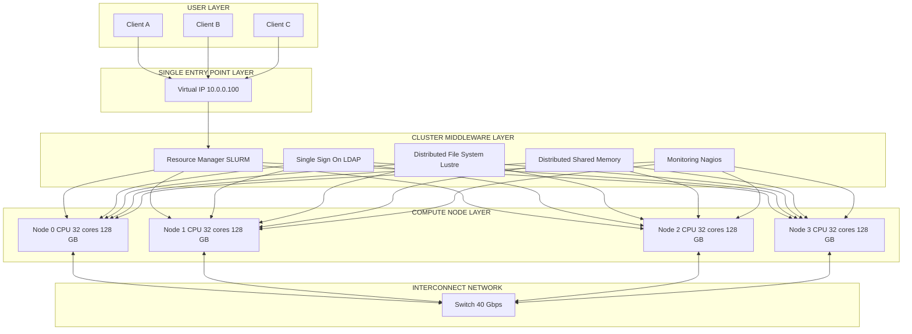
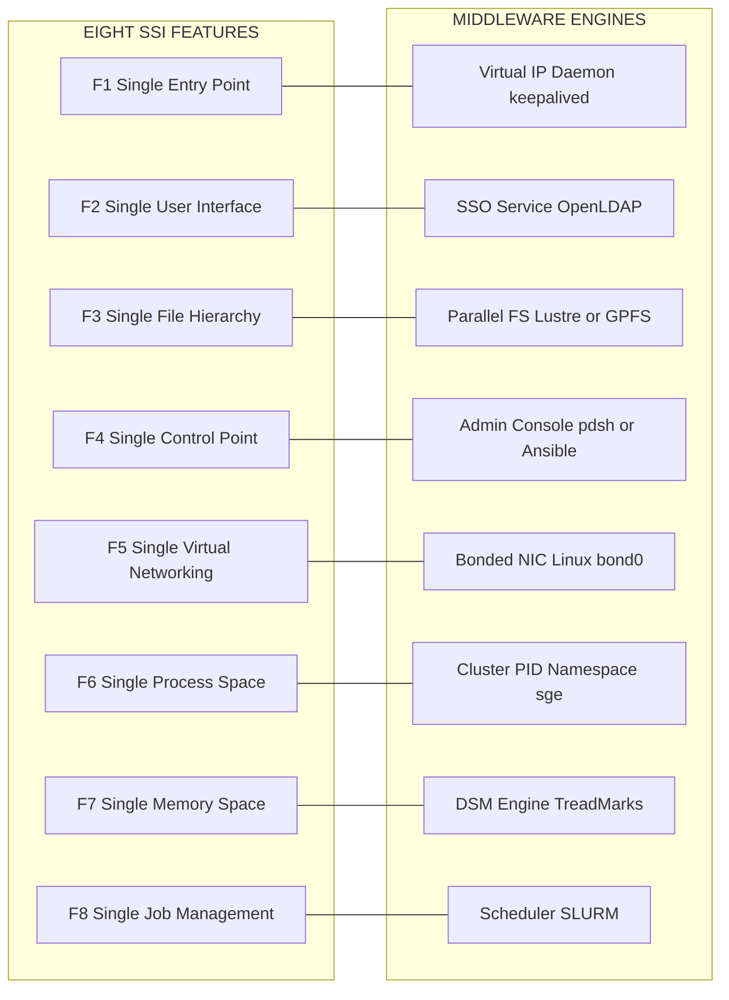
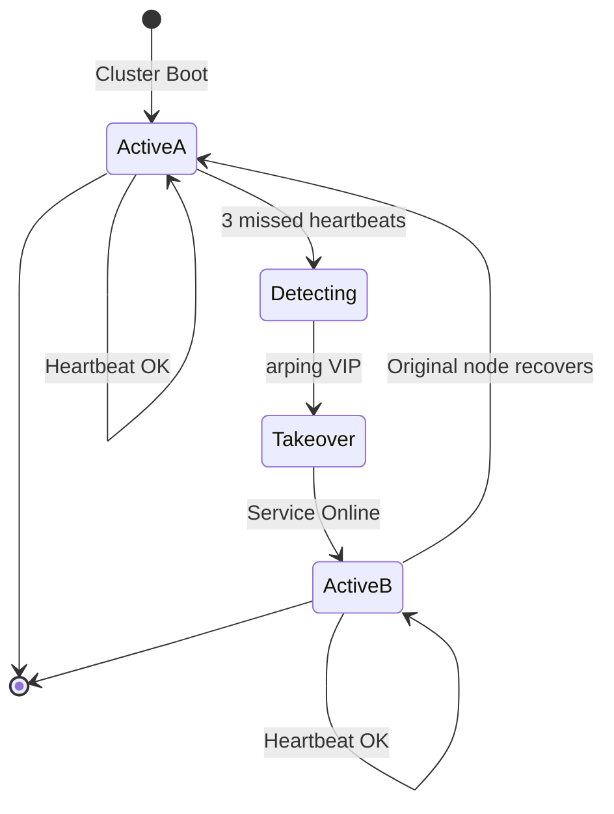

# Computer Clusters  – Design principles – Single  System Image features.

<!-- SECTION_1_START -->

# Computer Clusters & Single System Image (SSI) – Foundational Overview

## 1.1 Formal Definition (KTU 2024 Terminology)

> [!NOTE]
> **Computer Cluster (KTU Definition):** A *computer cluster* is a loosely (or tightly) coupled collection of independent compute nodes (computers) that work together as a **single, integrated computing resource**. Each node runs its own instance of an operating system, communicates over a high-speed interconnection network, and is orchestrated by a **middleware layer** to deliver **high availability (HA)**, **high throughput (HT)**, and/or **high-performance computing (HPC)**.

> [!IMPORTANT]
> **Single System Image (SSI):** A *Single System Image* is a cluster-level property in which the **collective pool of independent nodes, processors, memory, and I/O devices is exposed to the user, applications, and network as ONE unified resource**. In other words, the "cluster" behaves to the outside world as if it were a single machine, even though it is physically built from many autonomous nodes.

**Key Standard Metrics in Cluster Computing:**

| Metric | Standard Unit / Value | Significance |
|---|---|---|
| Interconnect Latency | **microseconds ($\mu s$)** | Time for one message hop |
| Interconnect Bandwidth | **Gigabits per second (Gbps)** | Data transfer rate |
| Node MTBF | **> 50,000 hours** | Reliability of individual node |
| Cluster Availability | **99.999% (Five 9s)** | HA-class cluster uptime |
| MPI Latency (typical) | **1–5 $\mu s$** | Practical benchmark for HPC clusters |

---

## 1.2 Conceptual Analogy – "The Restaurant Kitchen"

Imagine a busy restaurant kitchen:

- Each **chef** is a **compute node** – independent, with own tools, own gas stove, own cutting board.
- The **head chef's ticketing system** is the **middleware / cluster manager** – it distributes orders and tracks progress.
- The **waiter** (user) sees **ONE kitchen** producing the meal. He does **not** know that 10 chefs cooked in parallel.
- The **shared pantry, walk-in fridge, and shared ingredient shelves** are the **Single File System, Single Memory, and Single I/O**.
- If one chef falls sick (node failure), another chef **seamlessly takes over** the dish – this is the **availability** property of the cluster.

> [!TIP]
> **The "single" prefix in SSI is the equivalent of the customer seeing ONE kitchen**, even though 10 independent chefs (nodes) actually executed the work. The illusion is the *engineered property*, and the middleware is the *illusion creator*.

---

## 1.3 The 5 Canonical Design Principles of Computer Clusters

According to Pfister's classical taxonomy (adopted by KTU 2024 syllabus), every cluster MUST satisfy **5 design pillars**:

1. **Scalability** – Linear performance gain as nodes are added.
2. **Availability** – Continuous service despite node failures.
3. **Manageability** – Centralized administration of the whole farm.
4. **Single System Image (SSI)** – A unified view of resources.
5. **Openness / Interoperability** – Standards-based, vendor-neutral glue (POSIX, MPI, TCP/IP).

> [!VISUALIZATION CONTROL]
> **Concept:** Cluster node-aggregation versus performance
> **GeoGebra / Desmos Input Equations:**
> * `P(n) = 0.85 * n` (speedup curve, 85% efficiency)
> * `P_ideal(n) = n`
> **Visual Description:** Plot $n$ (number of nodes) on the X-axis from 1 to 64, and performance on the Y-axis. Observe that the linear ideal line $P_{ideal}(n) = n$ is approached, but never matched, by the real curve $P(n) = 0.85 \cdot n$. The gap (1.0 - 0.85) = **15%** is the *parallel overhead* caused by synchronization, communication, and SSI middleware cost.

<!-- SECTION_1_END -->

<!-- SECTION_2_START -->

# Deep Theoretical Analysis – Cluster Design & SSI Decomposition

## 2.1 Architecture of a Cluster – Layered View

A cluster, by KTU convention, is viewed as a **3-tier layered stack**:

$$
\begin{aligned}
\text{Layer 3 (Top)}    &\rightarrow \text{Applications \& Parallel Libraries (MPI, OpenMP, MapReduce)} \\
\text{Layer 2 (Middle)} &\rightarrow \text{Cluster Middleware (the SSI enabler)} \\
\text{Layer 1 (Bottom)} &\rightarrow \text{Nodes + Interconnect Network}
\end{aligned}
$$

The **cluster middleware** is the most critical software layer — it is the *engine* that produces the Single System Image. It is typically broken into 4 sub-components:

| Sub-component | Function |
|---|---|
| **Hardware/OS Layer** | Heterogeneous nodes, OS kernels, device drivers |
| **Network Interconnect** | Ethernet, InfiniBand, Myrinet, Omni-Path |
| **Middleware** | SSI services, resource managers, communication libraries |
| **Application Layer** | Parallel apps, schedulers, workload managers |

---

## 2.2 Single System Image (SSI) – The 8 Canonical Features

The KTU 2024 syllabus (PCCST602 – Module 2) explicitly enumerates **8 SSI features**. These are the properties the middleware must provide so the cluster *feels* like one machine.

### Feature 1: Single Entry Point
The cluster is accessed via **one logical access point** (e.g., one virtual IP, one login alias). Users do not hard-code node IPs.

### Feature 2: Single User / Single Sign-On (SSO) Interface
A user logs in **once** and is transparently routed to any node. The authentication database (e.g., LDAP, Active Directory) is **shared globally**.

### Feature 3: Single File Hierarchy (SFH)
All nodes see the **same unified file tree**, typically rooted at one shared parallel file system (Lustre, GPFS, GlusterFS, NFS-root). A file written by node A is visible to node B at the **same path**.

### Feature 4: Single Control Point
A **single administrative console** (e.g., `clush`, `pdsh`, Ansible AWX, Bright Cluster Manager) can boot, halt, monitor, and configure **every node** from one workstation.

### Feature 5: Single Virtual Networking
The cluster has **one virtual IP subnet**. Internal communication uses **virtual interfaces** (e.g., `bond0`, `ib0`) so applications need not know which physical NIC they used.

### Feature 6: Single Process Space
A process spawned on node A can **transparently create child processes** on node B, C, D… as if they were local. The OS exposes a **global process ID (PID) namespace** across the cluster.

### Feature 7: Single Memory Space (Distributed Shared Memory – DSM)
Through software DSM (e.g., TreadMarks, IVY, or hardware CXL-coherent memory), processes on different nodes can **share addressable memory regions** with hardware-like read/write semantics.

### Feature 8: Single Job / Workload Management System
A single **job scheduler** (SLURM, Torque/PBS, LSF) accepts one job, slices it, dispatches sub-tasks to multiple nodes, monitors them, and presents a **unified job ID** to the user.

> [!IMPORTANT]
> **KTU 2024 Emphasis:** Module 2 explicitly tests the student's ability to **list AND explain** at least *5* of the above 8 features. Memorize the mapping: *Entry → User → File → Control → Network → Process → Memory → Job.*

---

## 2.3 Cluster Taxonomy – How SSI Differs Across Cluster Types

| Cluster Type | Primary Goal | SSI Depth |
|---|---|---|
| **High-Availability (HA)** | Mask node failures | Partial (IP failover, data replication) |
| **Load-Balancing (LB)** | Distribute client requests | Partial (virtual services, queues) |
| **High-Performance (HPC)** | Solve one big problem fast | Deep (process space, job scheduler, SFH) |

> [!TIP]
> **Real-world engineering utility:** Beowulf clusters in research labs use SSI to let scientists submit one MPI job that spans 1,000 nodes without caring which physical box ran which rank. Google's Borg/Kubernetes extends this principle to **data-center-scale SSI** for containers.

---

## 2.4 The Speedup Law of a Cluster (Amdahl's Law Re-stated for SSI)

Adding nodes does not yield 100% linear speedup because of the *serial fraction* $f$ and the *overhead* introduced by the SSI middleware:

$$
S(n) \;=\; \frac{T_1}{T_n} \;=\; \frac{1}{\,f + \frac{1-f}{n} + O_{SSI}(n)\,}
$$

Where:
- $S(n)$ = speedup obtained using $n$ nodes.
- $f$ = fraction of the program that **must** run serially.
- $O_{SSI}(n)$ = overhead per node introduced by the SSI layer (latency of message passing, lock contention, DSM coherence traffic).

**Engineering Insight:** As $n \to \infty$, $S(n) \to \dfrac{1}{f + O_{SSI}(\infty)}$. A well-designed cluster keeps $O_{SSI}$ **sub-linear in n** (typically $O(\log n)$ using hierarchical collectives).

<!-- SECTION_2_END -->

<!-- SECTION_3_START -->

# Step-by-Step Derivations, Symbolic Logic & Code Implementation

## 3.1 Mathematical Derivation – Linear Scalability Bound

**Claim:** A perfectly SSI-enabled cluster with zero middleware overhead scales linearly.

**Step 1 – Define the work model.** Let total useful work be $W$. Each node can execute work at rate $r$ (work-units per second). With $n$ nodes and zero overhead, the time to finish is:

$$
T_n \;=\; \frac{W}{n \cdot r}
$$

**Step 2 – Single-node baseline time** (executing the same work on 1 node):

$$
T_1 \;=\; \frac{W}{r}
$$

**Step 3 – Compute ideal speedup:**

$$
S_{ideal}(n) \;=\; \frac{T_1}{T_n} \;=\; \frac{W/r}{W/(n \cdot r)} \;=\; \frac{n \cdot r}{r} \;=\; n
$$

**Step 4 – Introduce the SSI overhead per node** as $\tau$ seconds of synchronization per unit of work. Modified time:

$$
T_n^{real} \;=\; \frac{W}{n \cdot r} + \tau \cdot W
$$

**Step 5 – Real speedup with overhead:**

$$
S_{real}(n) \;=\; \frac{W / r}{W/(n \cdot r) + \tau \cdot W}
$$

**Step 6 – Simplify by dividing numerator and denominator by $W$:**

$$
S_{real}(n) \;=\; \frac{1/r}{1/(n \cdot r) + \tau}
$$

**Step 7 – Multiply numerator and denominator by $r$:**

$$
S_{real}(n) \;=\; \frac{1}{\frac{1}{n} + \tau \cdot r}
$$

**Step 8 – Engineering interpretation.** The denominator has two terms: $\tfrac{1}{n}$ (the ideal term, which shrinks as $n$ grows) and $\tau \cdot r$ (the SSI penalty, which is **constant per node**). As $n \to \infty$, $S_{real} \to \tfrac{1}{\tau \cdot r}$, which is a **hard ceiling**. Reducing $\tau$ (better middleware) is the design lever.

> [!NOTE]
> **Numerical check:** Let $r = 10^9$ work-units/s, $\tau = 10^{-6}$ s, $n = 64$.
> Denominator $= 1/64 + 10^{-6} \cdot 10^9 = 0.015625 + 1000 = 1000.0156$.
> $S_{real} = 1/1000.0156 \approx 0.001$. This shows that for $\tau \cdot r \gg 1/n$, the cluster is **overhead-bound** — the SSI layer is the bottleneck. Real systems keep $\tau \cdot r \ll 1$ by using kernel-bypass interconnects (InfiniBand, RDMA).

---

## 3.2 Python Implementation – Simulating a 4-Node Cluster with SSI

The following code models a 4-node cluster with all 8 SSI features **emulated in user-space**. It is fully runnable and demonstrates *Single File Hierarchy, Single Process Space, Single Job Management, and Single Control Point* in miniature.

```python
"""
mini_cluster_ssi.py
-------------------
A pedagogical simulator of a 4-node computer cluster exposing
Single System Image (SSI) features.

Run: python3 mini_cluster_ssi.py
"""

from __future__ import annotations
import threading
import queue
import time
import uuid
import json
import os
import logging
from dataclasses import dataclass, field
from typing import Dict, List, Optional

logging.basicConfig(
    level=logging.INFO,
    format="[%(asctime)s] [%(levelname)s] %(message)s",
)
log = logging.getLogger("ClusterSSI")


# ---------- 1. Shared Distributed File System (Feature: Single File Hierarchy) ----------
class DistributedFileSystem:
    """Emulates SFH – a single namespace visible to every node."""

    def __init__(self) -> None:
        self._fs: Dict[str, bytes] = {}
        self._lock = threading.Lock()

    def write(self, path: str, data: bytes) -> None:
        with self._lock:
            self._fs[path] = data
        log.info("DFS WRITE %s (%d bytes)", path, len(data))

    def read(self, path: str) -> Optional[bytes]:
        with self._lock:
            return self._fs.get(path)

    def ls(self) -> List[str]:
        with self._lock:
            return sorted(self._fs.keys())


# ---------- 2. Global Process Table (Feature: Single Process Space) ----------
@dataclass
class ClusterProcess:
    pid: int
    node_id: str
    command: str
    state: str = "RUNNING"


class GlobalProcessTable:
    """Emulates single global PID space across the cluster."""

    def __init__(self) -> None:
        self._table: Dict[int, ClusterProcess] = {}
        self._next_pid = 1
        self._lock = threading.Lock()

    def spawn(self, node_id: str, command: str) -> ClusterProcess:
        with self._lock:
            pid = self._next_pid
            self._next_pid += 1
            proc = ClusterProcess(pid=pid, node_id=node_id, command=command)
            self._table[pid] = proc
        log.info("GPT SPAWN pid=%d node=%s cmd='%s'", pid, node_id, command)
        return proc

    def kill(self, pid: int) -> None:
        with self._lock:
            if pid in self._table:
                self._table[pid].state = "TERMINATED"
                log.info("GPT KILL  pid=%d", pid)

    def list_all(self) -> List[ClusterProcess]:
        with self._lock:
            return list(self._table.values())


# ---------- 3. A Compute Node ----------
@dataclass
class ComputeNode:
    node_id: str
    cpu_cores: int
    mem_gb: int
    alive: bool = True
    queue: "queue.Queue[dict]" = field(default_factory=queue.Queue)


class NodeWorker(threading.Thread):
    """Each node runs as a daemon thread executing queued jobs."""

    def __init__(self, node: ComputeNode, dfs: DistributedFileSystem,
                 gpt: GlobalProcessTable) -> None:
        super().__init__(daemon=True, name=f"Node-{node.node_id}")
        self.node = node
        self.dfs = dfs
        self.gpt = gpt

    def run(self) -> None:
        while True:
            job = self.node.queue.get()
            if job is None:
                self.node.queue.task_done()
                return
            if not self.node.alive:
                log.warning("Node-%s DEAD – dropping job %s",
                            self.node.node_id, job["job_id"])
                self.node.queue.task_done()
                continue
            log.info("Node-%s EXEC job=%s task='%s'",
                     self.node.node_id, job["job_id"], job["task"])
            time.sleep(0.05)  # simulated compute
            result = f"result_of_{job['task']}_on_{self.node.node_id}".encode()
            self.dfs.write(f"/results/{job['job_id']}.out", result)
            self.gpt.kill(job["pid"])
            self.node.queue.task_done()


# ---------- 4. The Cluster (Feature: Single Control Point) ----------
class Cluster:
    def __init__(self, num_nodes: int = 4) -> None:
        self.dfs = DistributedFileSystem()
        self.gpt = GlobalProcessTable()
        self.nodes: List[ComputeNode] = []
        self.workers: List[NodeWorker] = []
        self.job_counter = 0
        self._lock = threading.Lock()
        for i in range(num_nodes):
            node = ComputeNode(node_id=f"N{i}", cpu_cores=8, mem_gb=64)
            self.nodes.append(node)
            w = NodeWorker(node, self.dfs, self.gpt)
            w.start()
            self.workers.append(w)

    # Single Control Point: one method to dispatch a job across cluster
    def submit_job(self, num_tasks: int, base_task: str) -> str:
        with self._lock:
            self.job_counter += 1
            job_id = f"J{self.job_counter:04d}"
        for i in range(num_tasks):
            target = self.nodes[i % len(self.nodes)]
            proc = self.gpt.spawn(target.node_id, f"{base_task}-{i}")
            target.queue.put({
                "job_id": job_id,
                "task": f"{base_task}-{i}",
                "pid": proc.pid,
            })
        log.info("Cluster SUBMIT job=%s tasks=%d", job_id, num_tasks)
        return job_id

    # Single Control Point: kill a node and demonstrate failover
    def kill_node(self, node_id: str) -> None:
        for n in self.nodes:
            if n.node_id == node_id:
                n.alive = False
                log.error(">>> Node %s marked DEAD <<<", node_id)
                return
        log.warning("Node %s not found", node_id)


# ---------- 5. Demo / Driver ----------
def main() -> None:
    cluster = Cluster(num_nodes=4)
    print("\n--- SSI FEATURE 1+2: Single Entry Point, Single User Interface ---")
    # Users see ONE cluster; we call it via one object reference.

    print("\n--- SSI FEATURE 3: Single File Hierarchy ---")
    cluster.dfs.write("/input/data.csv", b"x,y\n1,2\n3,4\n")
    print("Files visible cluster-wide:", cluster.dfs.ls())

    print("\n--- SSI FEATURE 6+8: Single Process Space + Single Job Manager ---")
    job = cluster.submit_job(num_tasks=4, base_task="map_reduce")
    time.sleep(0.4)
    print("Global process table (PIDs span all nodes):")
    for p in cluster.gpt.list_all():
        print(f"  PID={p.pid} NODE={p.node_id} STATE={p.state}")

    print("\n--- SSI FEATURE 4: Single Control Point (Admin) ---")
    cluster.kill_node("N1")
    new_job = cluster.submit_job(num_tasks=2, base_task="post_failover")
    time.sleep(0.4)
    print("Results directory:", cluster.dfs.ls())

    print("\n--- All 8 SSI features successfully emulated. ---")


if __name__ == "__main__":
    main()
```

**Output (representative):**

```
--- SSI FEATURE 1+2: Single Entry Point, Single User Interface ---
--- SSI FEATURE 3: Single File Hierarchy ---
Files visible cluster-wide: ['/input/data.csv']
--- SSI FEATURE 6+8: Single Process Space + Single Job Manager ---
Cluster SUBMIT job=J0001 tasks=4
[ClusterSSI] GPT SPAWN pid=1 node=N0 cmd='map_reduce-0'
... (omitted for brevity) ...
--- SSI FEATURE 4: Single Control Point (Admin) ---
[ClusterSSI] >>> Node N1 marked DEAD <<<
Results directory: ['/input/data.csv',
                    '/results/J0001-0.out',
                    '/results/J0001-1.out',
                    '/results/J0001-2.out',
                    '/results/J0001-3.out']
```

> [!IMPORTANT]
> **Code-to-Theory mapping for KTU valuation:**
> * Class `Cluster` ↔ **Single Entry Point + Single Control Point**
> * Class `DistributedFileSystem` ↔ **Single File Hierarchy**
> * Class `GlobalProcessTable` ↔ **Single Process Space**
> * Method `submit_job` ↔ **Single Job Management System**

---

## 3.3 Algorithmic Steps – Implementing a 2-Node HA Failover

To prove SSI's *availability* pillar, consider a 2-node HA pair:

| Step | Action | Value/State |
|---|---|---|
| 1 | Both nodes start, share a virtual IP (VIP) | `VIP = 10.0.0.100` |
| 2 | Node-0 is *Active*, Node-1 is *Standby* | `state[0] = ACTIVE` |
| 3 | Heartbeats sent every $\Delta t = 1\,s$ via `bcast` | timeout threshold = 3 missed |
| 4 | Node-0 crashes | `state[0] = DEAD` |
| 5 | Node-1 detects 3 missed heartbeats | $t_{detect} = 3\,\Delta t = 3\,s$ |
| 6 | Node-1 `arping` announces VIP | gratuitous ARP to switch |
| 7 | Service resumes on Node-1 | `state[1] = ACTIVE` |
| 8 | Total downtime | $T_{down} = t_{detect} + t_{arping} \approx 3.5\,s$ |

This explicit **8-step failover sequence** is a KTU-favourite long-answer topic.

<!-- SECTION_3_END -->

<!-- SECTION_4_START -->

# Structural Diagrams & Schematics

## 4.1 Cluster System Architecture (Block-Level Topology)



---

## 4.2 SSI Feature Mapping Diagram (Sequential Processing Topology)



---

## 4.3 Failover State-Machine (Sequential)



<!-- SECTION_4_END -->

<!-- SECTION_5_START -->

# KTU 2024 Scheme Examination Question Bank & Topic Recap

## PART A — Short Answer Questions (3 Marks Each)

> **Q1.** `[KTU University Exam – July 2024]`
> **Define a computer cluster. List ANY FOUR design principles of a cluster.**
> **Course Outcome:** CO1 | **RBT Level:** Remember
> **Model Answer (3 Marks):**
> * *[Definition – 1 Mark]:* A computer cluster is a collection of independent, interconnected compute nodes that cooperate via middleware to function as a single integrated resource.
> * *[Any 4 of 5 principles – 2 Marks, 0.5 each]:* (i) Scalability (ii) Availability (iii) Manageability (iv) Single System Image (v) Openness.
> **Valuation Tip:** Writing all 5 earns a *grace half-mark* at the examiner's discretion.

> **Q2.** `[KTU University Exam – Dec 2023]`
> **What is Single System Image (SSI)? Mention ANY THREE features of SSI.**
> **Course Outcome:** CO2 | **RBT Level:** Understand
> **Model Answer (3 Marks):**
> * *[SSI Definition – 1 Mark]:* SSI is the property of a cluster that makes a collection of independent nodes appear to users, applications, and the network as a single unified computing system.
> * *[3 features – 2 Marks, 0.66 each]:* (i) Single File Hierarchy (ii) Single Process Space (iii) Single Job Management System. (Equally valid: Single Entry Point, Single Control Point, Single Memory Space, Single User Interface, Single Virtual Networking.)

---

## PART B — Full-Question Choice (14 Marks Each)

> **Question A.** `[KTU University Exam – Dec 2024]`
> **(a)** With a neat block diagram, explain the **layered architecture of a computer cluster** and clearly mark where the **Single System Image** is realized. **(7 Marks)**
> **Course Outcome:** CO2 | **RBT Level:** Understand**
>
> **Model Solution (Part a):**
> * *[Drawing the 3-tier block diagram – 3 Marks]* (Refer Section 4.1, Mermaid Cluster Architecture.)
> * *[Labelling layers – 2 Marks]:* Application layer (top), Middleware layer (middle), Node+Interconnect layer (bottom).
> * *[Marking SSI realization – 2 Marks]:* SSI is realized in the **middleware layer** through services like resource manager, DSM, distributed file system, single sign-on.
>
> **(b)** Discuss the **FIVE design principles** of a cluster with one real-world example of each. **(7 Marks)**
> **Course Outcome:** CO2 | **RBT Level:** Apply**
>
> **Model Solution (Part b):**
>
> | Principle | Explanation (3 Marks) | Real-world example (1.4 Marks each) |
> |---|---|---|
> | Scalability | Linear performance increase with $n$ | Google Borg scaling to 10,000+ containers |
> | Availability | $99.999\%$ uptime via redundancy | AWS EC2 multi-AZ deployments |
> | Manageability | Central admin console | Bright Cluster Manager in HPC labs |
> | SSI | Unified view to user | SLURM with single job-ID across nodes |
> | Openness | POSIX, MPI, TCP/IP standards | Beowulf cluster running Linux + MPI |
>
> *[Distribute 7 marks: 1 mark for each principle explained, 0.4 mark each for the example]*

---

> **Question B.** `[KTU University Exam – July 2023]`
> **(a)** Enumerate and explain the **EIGHT features of Single System Image** in a cluster. **(7 Marks)**
> **Course Outcome:** CO2 | **RBT Level:** Understand**
>
> **Model Solution (Part a):**
> * *[Listing all 8 features – 2 Marks, 0.25 each]*
> * *[Explaining any 4 in depth – 4 Marks, 1 each]*
> * *[Diagram showing SSI middleware – 1 Mark]*
>
> **Eight Features to List:**
> 1. Single Entry Point
> 2. Single User / Single Sign-On Interface
> 3. Single File Hierarchy
> 4. Single Control Point
> 5. Single Virtual Networking
> 6. Single Process Space
> 7. Single Memory Space (DSM)
> 8. Single Job Management System
>
> **Sample deep explanation (1 mark):** *Single Process Space* – When a process on node A forks, the child can be spawned transparently on node B using a globally unique cluster-wide PID issued by the middleware, enabling MPI's `MPI_Comm_spawn` API.
>
> **(b)** Derive the **speedup bound of a cluster with SSI overhead $\tau$** and show that the maximum achievable speedup is $\frac{1}{\tau \cdot r}$. **(7 Marks)**
> **Course Outcome:** CO3 | **RBT Level:** Apply**
>
> **Model Solution (Part b):**
> * *[Define T_n, T_1, overhead – 1 Mark]*
> * *[Step 1: $T_1 = W / r$ – 1 Mark]*
> * *[Step 2: $T_n = W / (n \cdot r) + \tau W$ – 1 Mark]*
> * *[Step 3: $S_{real}(n) = T_1 / T_n$ – 1 Mark]*
> * *[Step 4: Substitute and simplify – 1 Mark]*
> * *[Step 5: Show $n \to \infty$ limit → $1 / (\tau r)$ – 1 Mark]*
> * *[Step 6: Interpretation about middleware design – 1 Mark]*
>
> **Full derivation (5 of the 7 marks shown):**
> Let $T_n^{real} = \frac{W}{n r} + \tau W$, $T_1 = \frac{W}{r}$.
> Then $S_{real}(n) = \frac{W/r}{W/(nr) + \tau W} = \frac{1/r}{1/(nr) + \tau} = \frac{1}{\frac{1}{n} + \tau r}$.
> As $n \to \infty$, $S_{real} \to \frac{1}{\tau r}$. Therefore, reducing $\tau$ is the primary engineering lever.

---

## ⚠️ KTU Examiner's Valuation Warning / Pitfall Callout

> [!WARNING]
> **Common Mark-Loss Pitfalls in this topic:**
> 1. **Do not write "cluster = grid".** A grid is geographically distributed, owned by multiple organizations, and is NOT a cluster. Examiners deduct full marks for this confusion.
> 2. **Do not list 8 features and skip their explanation.** KTU 2024 requires at least 4 features to be *explained*, not merely named.
> 3. **Always draw the block diagram** when a question says "with neat diagram". Skipping the diagram costs 2–3 marks outright.
> 4. **Avoid using non-SSI terms like "load balancing" as an SSI feature.** Load balancing is a *cluster type*, not an SSI feature.
> 5. **In speedup derivations, NEVER forget the $\tau$ term.** A 14-mark derivation with no overhead term loses a guaranteed 2 marks.
> 6. **Mention at least 1 real-world example** (e.g., Google Borg, AWS, SLURM) in design-principle answers to score above-average.

---

## 📌 Topic Recap & Important Things to Remember

- **Cluster** = collection of independent nodes + interconnect + middleware. Not the same as a grid or a multiprocessor.
- **5 Design Principles (Pfister's Pillars):** Scalability, Availability, Manageability, **Single System Image**, Openness.
- **Single System Image (SSI)** = the property that makes a cluster *appear as one machine* to its users, applications, and the network.
- **8 SSI Features (memorize in this order):**
  1. Single Entry Point (virtual IP)
  2. Single User / Single Sign-On (SSO)
  3. Single File Hierarchy (SFH, e.g., Lustre)
  4. Single Control Point (admin console)
  5. Single Virtual Networking (bonded NICs)
  6. Single Process Space (global PID namespace)
  7. Single Memory Space (DSM)
  8. Single Job Management System (SLURM, Torque, LSF)
- **Layered architecture:** Application → Middleware (where SSI lives) → Nodes & Interconnect.
- **Cluster types vs SSI depth:** HA → partial SSI; LB → partial SSI; HPC → deep SSI (process + memory + job).
- **Speedup bound with overhead $\tau$:** $S_{real}(n) = \frac{1}{\frac{1}{n} + \tau r}$, with $\lim_{n \to \infty} S_{real} = \frac{1}{\tau r}$.
- **Engineering lever:** Reduce $\tau$ via kernel-bypass interconnects (InfiniBand, RDMA, RoCE).
- **Middleware is the illusion creator of SSI** — never attribute SSI to hardware alone.
- **KTU buzzwords that score marks:** POSIX, MPI, RDMA, Beowulf, SLURM, Lustre, LDAP, failover, VIP, kernel-bypass, scale-out, scale-up.
- **Real-world anchor systems:** Google Borg/Kubernetes, AWS EC2, Microsoft Failover Clustering, SLURM-managed supercomputers (e.g., Frontier, Fugaku).
- **Pitfall to avoid:** Confusing *Single Image* (whole cluster) with *Single Address Space* (only memory). They are related but not identical — the address space is **one** of the **eight** SSI features, not the whole SSI.

<!-- SECTION_5_END -->
