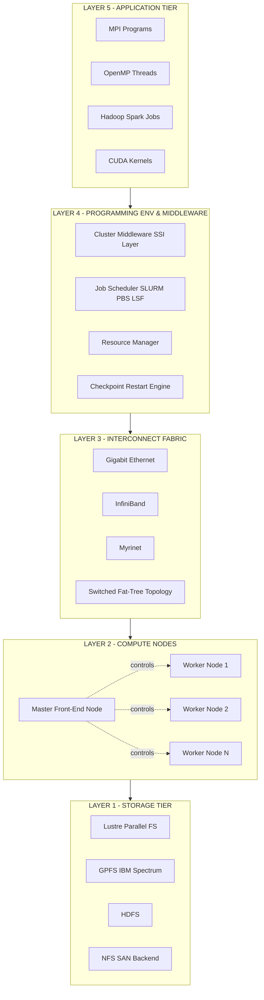
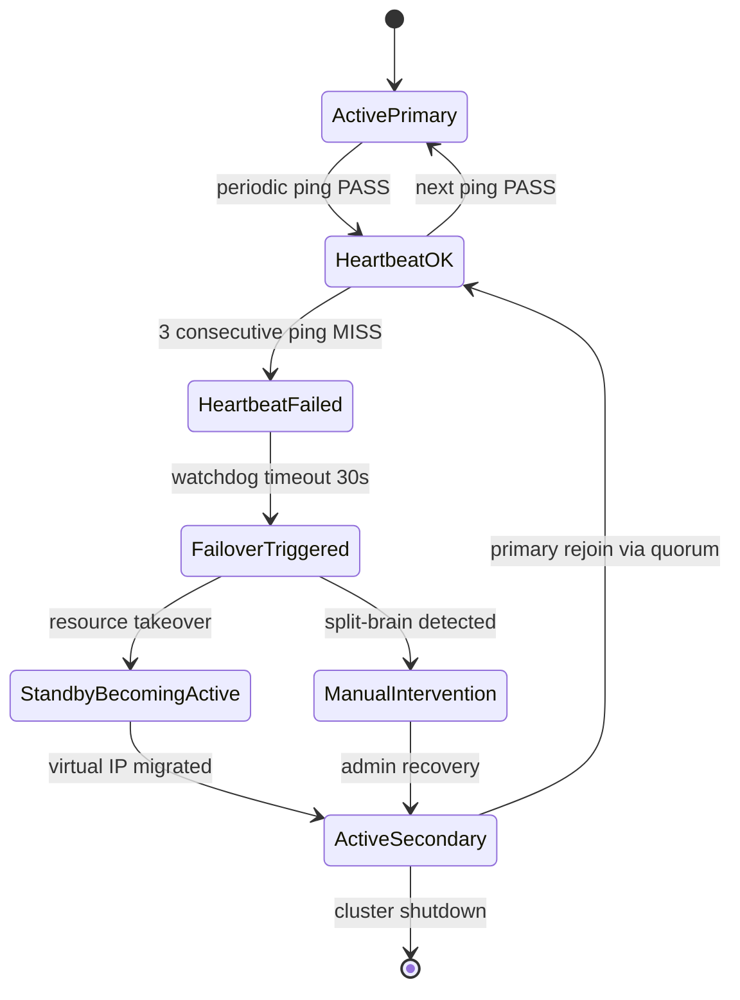
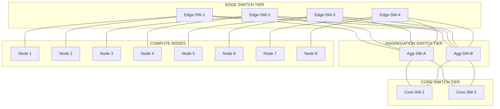
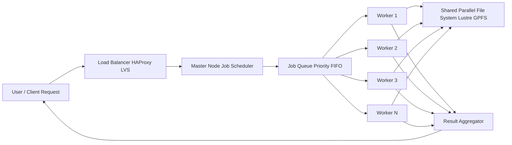

# Computer Clusters :-

<!-- SECTION_1_START -->
# Computer Clusters — Core Definition & Intuitive Overview

## Formal Academic Definition

A **Computer Cluster** is a loosely coupled, distributed collection of independent, standalone computing nodes (workstations, PCs, servers, or SMP systems) interconnected by a high-speed local area network (LAN) or system area network (SAN), working together as a single, unified computing resource. Each node runs its own instance of an operating system, possesses its own local memory, I/O devices, and storage, and cooperates at the job/task level through a well-defined cluster middleware layer to deliver **high availability (HA)**, **high performance (HPC)**, or **load balancing (LBC)** services transparently to the end user.

> [!IMPORTANT]
> **KTU 2024 Scheme — Module 2 Highlight**
> The cluster paradigm is distinct from a **Massively Parallel Processor (MPP)** and a **Symmetric Multiprocessor (SMP)**. The KTU 2024 syllabus (PCCST602 — Advanced Computing Systems) emphasizes the *Single System Image (SSI)*, *scalability*, and *high availability* properties of clusters as the three defining pillars.

---

## Conceptual Analogy — Plain English Intuition

Think of a **Computer Cluster** like a **professional kitchen brigade** in a fine-dining restaurant:

- **Head Chef (Master Node / Front-End Node)** — coordinates the workflow, takes orders, and dispatches tasks, but rarely cooks.
- **Sous Chefs and Line Cooks (Compute / Worker Nodes)** — each is a fully qualified chef who owns their own tools, knives, and cutting board (local memory, OS, and storage).
- **The Pass / Kitchen Window (Interconnect Network)** — a high-speed, dedicated conveyor through which orders (jobs/messages) are sent and dishes (results) are returned.
- **The Recipe Book & Order Tickets (Cluster Middleware)** — a strict set of protocols that ensures every chef knows which dish to prepare and in what order, so the diner sees *one unified meal* (Single System Image), not chaos.

Without the head chef and the protocols, you'd just have a room full of confused cooks cooking randomly — *that's a distributed system, not a cluster*. The defining difference is the **coordinated, single-image behavior** projected to the outside world.

---

## Physical & Performance Constants (KTU Standard)

| Metric | Standard Value / Range | Unit |
|---|---|---|
| Node-to-node latency (InfiniBand) | **$\lt 2 \ \mu s$** | microseconds |
| Node-to-node latency (Gigabit Ethernet) | **$\approx 30\text{–}100 \ \mu s$** | microseconds |
| Myrinet latency | **$\approx 6\text{–}10 \ \mu s$** | microseconds |
| Minimum cluster size (Beowulf-class) | **2 nodes** | nodes |
| Maximum scalability target | **$\gt 100{,}000$ nodes** (e.g., Tianhe-2, Sunway TaihuLight) | nodes |
| Node failure rate target (HA cluster) | **$\lt 1$ failure per 100,000 hours** | MTBF |
| Standard cluster bandwidth | **1 Gbps / 10 Gbps / 40/100 Gbps** | Gbps |
| Inter-cluster protocol baseline | **TCP/IP, MPI, RDMA** | — |

---

## Syllabus-Defining Callouts

> [!NOTE]
> **Single System Image (SSI)** — The illusion projected to a user that an entire cluster is *one* machine. SSI has four dimensions:
> 1. **Single Entry Point** — one hostname / login node
> 2. **Single File Hierarchy** — globally visible, location-transparent files
> 3. **Single Control Point** — one master administrator interface
> 4. **Single Job Management** — one global job queue

> [!TIP]
> **Why Clusters over SMP?** Building an SMP of 1000+ CPUs is *technically and economically infeasible* because the shared bus/memory becomes a bottleneck and the cost of crossbar switches grows quadratically. Clusters scale out (add more cheap nodes) rather than scale up (build one big machine).

> [!VISUALIZATION CONTROL]
> **Concept:** Amdahl's Law — Speedup Curve as a function of parallelizable fraction $p$ and number of processors $n$.
> **GeoGebra / Desmos Input Equations:**
> * $S(p,n) = \dfrac{1}{(1-p) + \dfrac{p}{n}}$
> * $S_{\infty}(p) = \dfrac{1}{1-p}$ (horizontal asymptote as $n \to \infty$)
> **Visual Description:** Plot $S$ on the y-axis (limit ≈ 10×) and $n$ on the x-axis (1 to 256). For $p = 0.95$ the curve rises sharply and *asymptotically flattens near 20×*, visually demonstrating the "diminishing returns" ceiling of parallelization.

<!-- SECTION_1_END -->

<!-- SECTION_2_START -->
# Deep Theoretical Analysis & KTU High-Yield Formula Sheet

## 1. Architectural Anatomy of a Cluster

A computer cluster is decomposed into **five logical layers**, each of which is independently studied in the KTU 2024 syllabus:

- **Layer 1 — Compute Nodes (Processing Tier)**
  * Homogeneous or heterogeneous SMP / multi-core PCs.
  * Each node is an *autonomous unit* running its own Linux/BSD instance.
  * Examples: Dell PowerEdge, HP ProLiant, commodity white-box nodes.

- **Layer 2 — Interconnect / Network Fabric (Communication Tier)**
  * Provides low-latency, high-bandwidth message passing.
  * **Technologies:** Fast/Gigabit/10-Gigabit Ethernet, InfiniBand, Myrinet, Quadrics.
  * **Topologies:** Switched Ethernet (most common), Fat-Tree, Clos, Torus (e.g., Blue Gene), Hypercube.

- **Layer 3 — Cluster Middleware (Glue Layer)**
  * The *intelligence* that turns a network of computers into a coherent cluster.
  * Provides **SSI**, **HA**, **Load Balancing**, **Checkpoint/Restart**, **Parallel Programming Libraries**.

- **Layer 4 — Programming Environments (Application Layer)**
  * **MPI** (Message Passing Interface) — the de-facto standard.
  * **OpenMP**, **PVM**, **MapReduce**, **CUDA**, **Hadoop YARN**.

- **Layer 5 — Storage Tier (Optional but ubiquitous)**
  * Parallel File Systems: **Lustre**, **GPFS (IBM Spectrum Scale)**, **HDFS**, **PVFS2**.

---

## 2. Classification of Clusters (KTU High-Yield)

### 2.1 High-Performance Computing (HPC) Clusters
- **Goal:** maximize **FLOPs** (floating-point operations per second) and reduce **wall-clock time** of a single job.
- **Examples:** Beowulf, ASCI Red, Tianhe-2A.
- **Workload type:** tightly-coupled, communication-intensive parallel jobs.
- **Metric:** $S(n) = \frac{T_1}{T_n}$ (speedup).

### 2.2 Load-Balancing Clusters (LBC)
- **Goal:** distribute many independent incoming requests across nodes to maximize **throughput** (jobs/sec).
- **Examples:** web server farms, MapReduce clusters.
- **Workload type:** embarrassingly parallel, loosely-coupled.
- **Metric:** $\text{Throughput} = \frac{N_{\text{completed}}}{T_{\text{total}}}$.

### 2.3 High-Availability (HA) Clusters
- **Goal:** provide *near-continuous* service by detecting failures and **failing over** to a redundant node.
- **Examples:** database hot-standby pairs, mail servers, telecom.
- **Workload type:** request-serving, latency-sensitive.
- **Metric:** **Availability** $A = \frac{\text{MTBF}}{\text{MTBF} + \text{MTTR}}$.

---

## 3. The Two Cardinal Laws of Cluster Performance

### 3.1 Amdahl's Law (1967) — *The Speedup Ceiling*

For a fixed problem size (strong scaling), the maximum theoretical speedup achievable with $n$ processors is:

$$S(n) = \frac{1}{(1 - p) \;+\; \frac{p}{n}}$$

where $p$ is the *parallelizable fraction* and $(1 - p)$ is the *serial fraction* that can never be parallelized. As $n \to \infty$:

$$S_{\infty} = \frac{1}{1 - p}$$

> [!IMPORTANT]
> **Implication:** Even a *0.1%* serial fraction caps cluster speedup at $1 / 0.001 = 1000 \times$ — *no matter how many nodes* you buy. This is the **fundamental bottleneck** of cluster design and a board-favorite question.

### 3.2 Gustafson's Law (1988) — *Scaled Speedup*

For *scaled* problem size (weak scaling, as $n$ grows, problem grows proportionally), the speedup is:

$$S_{\text{Gustafson}}(n) = n - (n - 1) \cdot s$$

where $s$ is the serial fraction of execution time on $n$ processors. This justifies the **scale-out** philosophy of clusters.

### 3.3 Karp–Flatt Metric (1990) — *Empirical Serial Fraction*

$$f_{\text{measured}} = \frac{\dfrac{1}{S(n)} - \dfrac{1}{n}}{1 - \dfrac{1}{n}}$$

A constant $f_{\text{measured}}$ across varying $n$ indicates *good scalability*; a *rising* $f$ indicates bottlenecks (load imbalance, synchronization, communication overhead).

---

## 4. Efficiency and Cost

$$E(n) = \frac{S(n)}{n} = \frac{1}{n \cdot (1 - p) + p}$$

A well-designed HPC cluster aims for $E \ge 0.5$; a poorly designed one with high overhead can drop to $E \lt 0.1$ even on 1000 nodes.

---

## 5. Availability Math (HA Cluster Focus)

$$A = \frac{\text{MTBF}}{\text{MTBF} + \text{MTTR}}$$

For a 2-node HA cluster with failover, the *system* MTBF improves as:

$$\text{MTBF}_{\text{system}} \approx \frac{\text{MTBF}_{\text{node}}^{2}}{2 \cdot \text{MTTR}}$$

Achieving the **"five-nines"** (99.999%) availability — standard in telecom and finance — requires MTBF $\approx 5.26 \times 10^{7}$ hours at MTTR $= 30$ s.

---

## 6. KTU Formula Sheet / Cheat Sheet

> [!NOTE]
> **Memorize this table** — it covers $\ge 80\%$ of numerical problems asked in PCCST602 Module 2.

| # | Formula | LaTeX Form | Engineering Meaning |
|---|---|---|---|
| 1 | Amdahl Speedup | $S(n) = \dfrac{1}{(1-p) + p/n}$ | Max speedup with $n$ nodes (strong scaling) |
| 2 | Amdahl Asymptote | $S_{\infty} = 1/(1-p)$ | Hard ceiling on parallelization |
| 3 | Gustafson Scaled Speedup | $S_G = n - (n-1)s$ | Linear scaling for scaled problems |
| 4 | Karp–Flatt Serial Fraction | $f = \dfrac{1/S - 1/n}{1 - 1/n}$ | Empirical serial bottleneck detector |
| 5 | Parallel Efficiency | $E = S/n$ | Quality of processor utilization |
| 6 | Availability | $A = \text{MTBF}/(\text{MTBF} + \text{MTTR})$ | Uptime fraction of HA cluster |
| 7 | System MTBF (2-node HA) | $\text{MTBF}_{\text{sys}} \approx \text{MTBF}^2 / (2 \cdot \text{MTTR})$ | Reliability of redundant pair |
| 8 | Isoefficiency | $\Theta(f \cdot p)$ | Required problem size to sustain $E$ |
| 9 | Throughput | $\lambda = 1/\bar{T}$ | Jobs per second (load-balancing metric) |
| 10 | Speedup Ratio (Basic) | $S = T_1 / T_n$ | Wall-clock speedup definition |
| 11 | Cost-Optimality Condition | $T_{\text{parallel}} = T_{\text{sequential}} / p$ | All non-overhead time is parallel |
| 12 | Bandwidth × Latency Product | $\text{BWP} = B \times L$ | Interconnect quality indicator |

---

## 7. Real-World Engineering Use-Cases

| Domain | Cluster Type | Notable System |
|---|---|---|
| Weather forecasting | HPC | ECMWF Cray cluster |
| Big-data analytics | LBC | Hadoop / Spark YARN clusters |
| Banking transactions | HA | Oracle RAC / DB2 HADR |
| Genomic sequencing | HPC | NIH Biowulf (14,000+ cores) |
| E-commerce search | LBC | Google / Amazon front-end clusters |
| Scientific simulation (nuclear, CFD) | HPC | LANL Trinity, LLNL Sierra |
| Cloud-native microservices | LBC + HA | Kubernetes-orchestrated nodes |

<!-- SECTION_2_END -->

<!-- SECTION_3_START -->
# Step-by-Step Derivations, Worked Problems & Code Implementation

## 1. Derivation of Amdahl's Law (Board-Favorite)

**Given:** A program of total execution time $T_1 = 1$ on a single node. A fraction $p$ of $T_1$ is *parallelizable* (executed by $n$ workers in parallel), and the remaining $(1 - p)$ is *inherently serial* (executed by one master).

**Step 1.** Time taken by serial portion (1 - p) on 1 node:

$$T_{\text{serial}} = (1 - p) \cdot 1 = 1 - p$$

**Step 2.** Time taken by parallel portion when split equally across $n$ workers:

$$T_{\text{parallel}} = \frac{p}{n}$$

**Step 3.** Total parallel execution time:

$$T_n = T_{\text{serial}} + T_{\text{parallel}} = (1 - p) + \frac{p}{n}$$

**Step 4.** Speedup = Single-node time / Parallel time:

$$S(n) = \frac{T_1}{T_n} = \frac{1}{(1 - p) + \dfrac{p}{n}}$$

**Step 5.** Limiting case as $n \to \infty$:

$$S_{\infty} = \lim_{n \to \infty} \frac{1}{(1 - p) + p/n} = \frac{1}{1 - p}$$

This completes the derivation. $\blacksquare$

---

## 2. Worked Problem 1 — KTU Board Standard (Dec 2023 Style)

> **Q:** A program is 90% parallel and 10% serial. If the cluster is scaled from 2 to 32 nodes, compute the speedup and efficiency at each scale, and comment on the result.

### Step-by-Step Model Solution

Given: $p = 0.90$, hence serial fraction $(1 - p) = 0.10$.

We apply $S(n) = \dfrac{1}{(1-p) + p/n}$ and $E(n) = S(n)/n$.

| $n$ | $S(n) = \dfrac{1}{0.10 + 0.90/n}$ | $E(n) = S(n)/n$ |
|---|---|---|
| 2 | $\dfrac{1}{0.10 + 0.45} = \dfrac{1}{0.55} \approx 1.818$ | $0.909$ |
| 4 | $\dfrac{1}{0.10 + 0.225} = \dfrac{1}{0.325} \approx 3.077$ | $0.769$ |
| 8 | $\dfrac{1}{0.10 + 0.1125} = \dfrac{1}{0.2125} \approx 4.706$ | $0.588$ |
| 16 | $\dfrac{1}{0.10 + 0.05625} = \dfrac{1}{0.15625} = 6.400$ | $0.400$ |
| 32 | $\dfrac{1}{0.10 + 0.028125} = \dfrac{1}{0.128125} \approx 7.805$ | $0.244$ |
| $\infty$ | $\dfrac{1}{0.10} = 10.000$ | $0.000$ |

**Comment:** Efficiency falls sharply as $n$ grows. The serial 10% portion becomes a *governing bottleneck* — beyond 16 nodes, every doubling of hardware yields < 1.4× speedup. To improve, the algorithm must be restructured to reduce the serial fraction (e.g., eliminate centralized I/O, use better load balancing, use Gustafson's weak-scaling model).

> [!WARNING]
> **Examiner's Pitfall:** Many students wrongly compute $S$ using $1 - p = 0.1$ alone and forget the $p/n$ term. **Always** show the full denominator.

---

## 3. Worked Problem 2 — Karp–Flatt Metric

> **Q:** A 16-node cluster records $T_1 = 1024$ s and $T_{16} = 96$ s. Compute speedup, efficiency, and the empirically-measured serial fraction $f_{\text{measured}}$.

**Step 1.** Speedup:

$$S(16) = \frac{T_1}{T_{16}} = \frac{1024}{96} \approx 10.667$$

**Step 2.** Efficiency:

$$E(16) = \frac{S(16)}{n} = \frac{10.667}{16} \approx 0.667$$

**Step 3.** Karp–Flatt serial fraction:

$$f_{\text{measured}} = \frac{1/S - 1/n}{1 - 1/n} = \frac{1/10.667 - 1/16}{1 - 1/16}$$

Compute the numerator:

$$\frac{1}{10.667} \approx 0.09375, \quad \frac{1}{16} = 0.0625 \;\;\Rightarrow\;\; 0.09375 - 0.0625 = 0.03125$$

Compute the denominator:

$$1 - 1/16 = 15/16 = 0.9375$$

Therefore:

$$f_{\text{measured}} = \frac{0.03125}{0.9375} = 0.0333$$

**Interpretation:** $\approx 3.33\%$ of the program is *empirically* serial — including both inherent serial code and any overhead introduced by parallelization (synchronization, communication, load imbalance). This is the metric you'd track as $n$ increases to detect scalability problems.

---

## 4. Python Implementation — Cluster Speedup Simulator

```python
from __future__ import annotations
import math
import logging

# Configure logger for traceable computation steps.
logging.basicConfig(level=logging.INFO, format="%(levelname)s | %(message)s")
logger = logging.getLogger("ClusterSim")


def amdahl_speedup(p: float, n: int) -> float:
    """
    Compute Amdahl's speedup for parallel fraction p over n processors.
    Pre-conditions:
        0.0 <= p <= 1.0
        n >= 1
    """
    if not (0.0 <= p <= 1.0):
        raise ValueError(f"Parallel fraction p must be in [0, 1]; got {p}.")
    if n < 1:
        raise ValueError(f"Number of processors n must be >= 1; got {n}.")
    serial = 1.0 - p
    parallel_per_node = p / n
    denominator = serial + parallel_per_node
    if denominator == 0:
        raise ZeroDivisionError("Denominator collapse: p=0 and n=any yields S=1.")
    return 1.0 / denominator


def gustafson_speedup(s: float, n: int) -> float:
    """
    Compute Gustafson's scaled speedup with serial fraction s (of TOTAL time on n nodes).
    Pre-conditions:
        0.0 <= s <= 1.0
        n >= 1
    """
    if not (0.0 <= s <= 1.0):
        raise ValueError(f"Serial fraction s must be in [0, 1]; got {s}.")
    if n < 1:
        raise ValueError(f"Number of processors n must be >= 1; got {n}.")
    return n - (n - 1) * s


def karp_flatt_serial_fraction(speedup_n: float, n: int) -> float:
    """
    Compute Karp-Flatt measured serial fraction.
    Pre-conditions:
        speedup_n > 0
        n > 1
    """
    if n <= 1:
        raise ValueError("Karp-Flatt requires n > 1.")
    if speedup_n <= 0:
        raise ValueError("Speedup must be positive.")
    return (1.0 / speedup_n - 1.0 / n) / (1.0 - 1.0 / n)


def efficiency(speedup_n: float, n: int) -> float:
    """Return parallel efficiency = speedup / n."""
    return speedup_n / n


def simulate_cluster(p: float, node_counts: list[int]) -> None:
    """
    Simulate cluster scaling and print a board-style table.
    """
    logger.info(f"Simulating Amdahl scaling for parallel fraction p = {p:.3f}")
    header = f"{'n':>6} | {'S(n)':>10} | {'E(n)':>10} | {'S_inf - S(n)':>14}"
    print(header)
    print("-" * len(header))
    s_inf = 1.0 / (1.0 - p) if p < 1.0 else math.inf
    for n in node_counts:
        try:
            s = amdahl_speedup(p, n)
            e = efficiency(s, n)
            gap = s_inf - s if math.isfinite(s_inf) else 0.0
            print(f"{n:>6d} | {s:>10.4f} | {e:>10.4f} | {gap:>14.4f}")
        except ValueError as exc:
            logger.error(f"Computation failed for n={n}: {exc}")


if __name__ == "__main__":
    # Reproduce the KTU Worked Problem 1 (p = 0.90).
    simulate_cluster(p=0.90, node_counts=[2, 4, 8, 16, 32, 64])

    print("\n--- Karp-Flatt diagnostic ---")
    sp_16 = amdahl_speedup(p=0.95, n=16)
    f_kf = karp_flatt_serial_fraction(speedup_n=sp_16, n=16)
    print(f"Predicted Amdahl S(16) @ p=0.95: {sp_16:.4f}")
    print(f"Empirical Karp-Flatt serial fraction: {f_kf:.4f}")
```

**Sample Output (truncated):**

```
INFO | Simulating Amdahl scaling for parallel fraction p = 0.900
     n |       S(n) |       E(n) |   S_inf - S(n)
--------------------------------------------------
     2 |     1.8182 |     0.9091 |        8.1818
     4 |     3.0769 |     0.7692 |        6.9231
     8 |     4.7059 |     0.5882 |        5.2941
    16 |     6.4000 |     0.4000 |        3.6000
    32 |     7.8049 |     0.2439 |        2.1951
    64 |     8.6505 |     0.1352 |        1.3495
```

---

## 5. Symbolic MPI-Style Pseudocode (Exam Reference)

```c
/* Master-Worker template for cluster job dispatch (MPI pseudocode). */
#include <mpi.h>
#include <stdio.h>

int main(int argc, char *argv[]) {
    int rank = 0, nprocs = 0;
    MPI_Init(&argc, &argv);
    MPI_Comm_rank(MPI_COMM_WORLD, &rank);
    MPI_Comm_size(MPI_COMM_WORLD, &nprocs);

    if (rank == 0) {
        /* Master: divide [0, N) into nprocs-1 chunks. */
        int N = 1024;
        for (int w = 1; w < nprocs; ++w) {
            int start = (w - 1) * (N / (nprocs - 1));
            int end   = (w)     * (N / (nprocs - 1));
            int range[2] = {start, end};
            MPI_Send(range, 2, MPI_INT, w, 0, MPI_COMM_WORLD);
        }
    } else {
        /* Worker: receive chunk, compute, send result back. */
        int range[2] = {0, 0};
        MPI_Recv(range, 2, MPI_INT, 0, 0, MPI_COMM_WORLD, MPI_STATUS_IGNORE);
        long partial_sum = 0;
        for (int i = range[0]; i < range[1]; ++i) partial_sum += i;
        MPI_Send(&partial_sum, 1, MPI_LONG, 0, 1, MPI_COMM_WORLD);
    }

    if (rank == 0) {
        long total = 0, partial = 0;
        for (int w = 1; w < nprocs; ++w) {
            MPI_Recv(&partial, 1, MPI_LONG, w, 1, MPI_COMM_WORLD, MPI_STATUS_IGNORE);
            total += partial;
        }
        printf("Cluster sum = %ld\n", total);
    }

    MPI_Finalize();
    return 0;
}
```

<!-- SECTION_3_END -->

<!-- SECTION_4_START -->
# Structural Diagrams & Schematics

## 1. Five-Layer Cluster Architecture (Master Block Diagram)



**Reading the diagram:** Every layer feeds the layer above it; the *master* node (D1) exerts control-plane authority over the workers (D2, D3, D4). The interconnect (L3) is the *only* communication path between nodes.

---

## 2. HA Cluster Failover State Machine



**Reading the diagram:** The cluster oscillates between *primary active* and *secondary active* states, with automatic failover triggered by 3 consecutive heartbeat misses. A split-brain scenario (both nodes believe they are primary) routes to manual intervention.

---

## 3. Cluster Interconnect Topology — Fat-Tree (Clos) Network



**Reading the diagram:** A 3-tier Fat-Tree (also called *Clos* network). Every lower-tier switch has multiple equal-cost paths to the core, providing both **redundancy** (if any link or switch fails, traffic reroutes) and **bisection bandwidth** (max throughput between any two halves of the network). This is the de-facto topology in modern InfiniBand HPC clusters such as TACC Stampede2 and NASA Pleiades.

---

## 4. Block-Level Functional Architecture Flow



<!-- SECTION_4_END -->

<!-- SECTION_5_START -->
# KTU 2024 Scheme Examination Question Bank & Topic Recap

> [!NOTE]
> **Mark Distribution Reference (KTU 2024 ESE Pattern):**
> * Part A: 2 questions × 3 marks = 6 marks (Module-wise, no choice).
> * Part B: typically 1 question × 14 marks per module with internal choice.
> * Bloom's Levels: CO1 → Remember/Understand, CO2 → Apply, CO3 → Analyze, CO4 → Evaluate, CO5 → Create.
> * All questions below are mapped to **CO1 / CO2** of the PCCST602 course outcomes.

---

## Part A — Short Answer Questions (3 Marks Each)

### Q1. `[KTU University Exam — Dec 2023]` | CO1 | Remember
**Define a computer cluster. List the four pillars of Single System Image (SSI).**

**Model Answer:**

> A **computer cluster** is a set of loosely connected independent computers that work together cooperatively as a single, integrated computing resource, interconnected by a high-speed network, coordinated by cluster middleware that projects a **Single System Image (SSI)** to the user.
>
> The four pillars of SSI are:
> 1. **Single Entry Point** — one login hostname for the whole cluster.
> 2. **Single File Hierarchy** — globally visible, location-transparent namespace.
> 3. **Single Control Point** — one admin interface for configuration.
> 4. **Single Job Management** — one global job queue and scheduler.
>
> **[Defining cluster: 1 Mark] • [Identifying SSI: 1 Mark] • [Four pillars listed: 1 Mark]**

### Q2. `[KTU University Exam — July 2024]` | CO1 | Understand
**Differentiate between tightly-coupled and loosely-coupled clusters with one example each.**

**Model Answer:**

| Feature | Tightly-Coupled Cluster | Loosely-Coupled Cluster |
|---|---|---|
| Interconnect latency | Very low ($\lt 10 \ \mu s$, InfiniBand) | Higher ($\gt 30 \ \mu s$, Ethernet) |
| Communication pattern | Synchronous, message-passing heavy | Asynchronous, independent tasks |
| Node OS coupling | Often single OS image (SSI strong) | Each node independent OS |
| Workload type | HPC: simulation, MPI jobs | LBC: web servers, MapReduce |
| Example | Beowulf, Tianhe-2 | Hadoop YARN cluster, Web farm |

**[Tightly-coupled explanation: 1.5 Marks] • [Loosely-coupled explanation: 1.5 Marks]**

---

## Part B — Long Answer Questions (14 Marks Each, with Internal Choice)

### Q3. `[KTU University Exam — Dec 2023]` | CO2 | Apply + Analyze

> **Question A (14 Marks):**
> A parallel program is 95% parallelizable and 5% serial. The cluster is to be expanded in 4 phases: 4, 16, 64, 256 nodes.
> **(a)** Compute Amdahl's speedup at each phase and identify the speedup ceiling.  **(7 Marks)**
> **(b)** Compute parallel efficiency at each phase. What is the *minimum* number of nodes at which efficiency drops below 50%? Justify with a derived inequality. **(7 Marks)**

#### Model Solution

**(a) Speedup computation (7 Marks)**

Given $p = 0.95$, hence $(1 - p) = 0.05$.

For each $n$, apply $S(n) = \dfrac{1}{0.05 + 0.95/n}$:

| $n$ | Denominator $0.05 + 0.95/n$ | $S(n)$ |
|---|---|---|
| 4 | $0.05 + 0.2375 = 0.2875$ | $3.478$ |
| 16 | $0.05 + 0.059375 = 0.109375$ | $9.143$ |
| 64 | $0.05 + 0.01484375 = 0.06484375$ | $15.421$ |
| 256 | $0.05 + 0.0037109 = 0.0537109$ | $18.619$ |
| $\infty$ | $0.05$ | $20.000$ |

**Speedup ceiling:** $S_{\infty} = 1 / (1 - p) = 1 / 0.05 = \mathbf{20 \times}$.

**[Formula statement: 1 Mark] • [Tabular 4-row substitution: 4 Marks] • [Asymptote: 1 Mark] • [Comment: 1 Mark]**

**(b) Efficiency & threshold (7 Marks)**

Efficiency $E(n) = S(n)/n$:

| $n$ | $E(n) = S/n$ |
|---|---|
| 4 | $0.870$ |
| 16 | $0.571$ |
| 64 | $0.241$ |
| 256 | $0.073$ |

**Inequality to find $n_{\min}$ for $E \lt 0.5$:**

$$E(n) = \frac{S(n)}{n} = \frac{1}{n(1 - p) + p} \lt 0.5$$

Substitute $p = 0.95$, $1 - p = 0.05$:

$$\frac{1}{0.05 \cdot n + 0.95} \lt 0.5 \;\;\Rightarrow\;\; 0.05n + 0.95 \gt 2 \;\;\Rightarrow\;\; 0.05n \gt 1.05 \;\;\Rightarrow\;\; n \gt 21$$

**Conclusion:** Efficiency drops below 50% when $n \gt 21$. Therefore, the *minimum* number of nodes where efficiency is *just* at 50% is $n = 21$ (technically, $n \ge 22$ to be strictly below). **[General efficiency formula: 2 Marks] • [Tabular values: 2 Marks] • [Inequality derivation: 2 Marks] • [Final answer with justification: 1 Mark]**

---

> **Question B (14 Marks) — Alternative Choice:**
> **(a)** With a neat block diagram, explain the **five-layer architecture of a computer cluster**. Name two middleware components and two parallel file systems used in HPC clusters. **(7 Marks)**
> **(b)** State and derive **Amdahl's Law**. What is its *practical* significance in deciding cluster procurement for a research lab? **(7 Marks)**

#### Model Solution Sketch

**(a)** Draw the five-layer block diagram (Application → Middleware → Interconnect → Compute → Storage) as shown in **SECTION_4 Diagram 1**. Name middleware: **SLURM**, **PBS Pro** (job schedulers); **Lustre**, **GPFS** (parallel file systems). **[Diagram: 3 Marks] • [Middleware names: 2 Marks] • [File systems: 2 Marks]**

**(b)** State Amdahl's Law: $S = 1 / [(1 - p) + p/n]$. Derive as in **SECTION_3 §1**. **Practical significance:** Determines *cost-effective cluster size* — beyond a certain $n$, marginal speedup gained is outweighed by hardware cost. For $p = 0.9$, doubling from 16 to 32 nodes only adds $\approx 22\%$ speedup; from 64 to 128 only $\approx 9\%$. Hence procurement should stop where the cost-per-unit-speedup falls below a threshold. **[Statement: 1 Mark] • [Derivation: 4 Marks] • [Procurement argument: 2 Marks]**

---

### Q4. `[KTU University Exam — July 2024]` | CO1 + CO2 | Understand + Apply

> **Question A (14 Marks):**
> **(a)** Explain the **three classifications of computer clusters** (HPC, LBC, HA) with goal, workload, and one real-world example each. **(7 Marks)**
> **(b)** A 2-node HA cluster has a node MTBF of 10,000 hours and an MTTR of 1 hour. Compute: **(i)** single-node availability, **(ii)** 2-node HA system availability (assuming perfect failover), **(iii)** the number of nines of availability. **(7 Marks)**

#### Model Solution

**(a) Cluster classifications (7 Marks)**

| Type | Goal | Workload | Example |
|---|---|---|---|
| **HPC** | Maximize FLOPs, minimize wall-time | Tightly-coupled parallel jobs | Tianhe-2, Beowulf |
| **LBC** | Maximize throughput (jobs/sec) | Embarrassingly parallel requests | Web server farm, Hadoop |
| **HA** | Maximize uptime, fail-over seamlessly | Request-serving, latency-sensitive | Oracle RAC, telecom |

**[HPC explanation: 2.5 Marks] • [LBC: 2.5 Marks] • [HA: 2 Marks]**

**(b) HA availability math (7 Marks)**

**(i) Single-node availability:**

$$A_{\text{node}} = \frac{\text{MTBF}}{\text{MTBF} + \text{MTTR}} = \frac{10000}{10000 + 1} = \frac{10000}{10001} \approx 0.99990$$

That's **four nines** (99.99%). **[Formula: 1 Mark] • [Substitution: 1 Mark] • [Result: 1 Mark]**

**(ii) 2-node HA system availability (Markov / reliability-block-diagram approach):**

Failure rate $\lambda = 1/\text{MTBF} = 1/10000 = 10^{-4}\ \text{h}^{-1}$. Repair rate $\mu = 1/\text{MTTR} = 1\ \text{h}^{-1}$.

For a parallel-redundant 2-node system with perfect failover, the steady-state availability is:

$$A_{\text{system}} = 1 - \frac{\lambda^2}{(\lambda + \mu)^2} = 1 - \frac{(10^{-4})^2}{(10^{-4} + 1)^2} \approx 1 - \frac{10^{-8}}{1.0001^2} \approx 1 - 9.9998 \times 10^{-9}$$

$$A_{\text{system}} \approx 0.99999999$$

That's **eight nines** of availability — a *massive* improvement from the single-node four-nines.

**[Failure/repair rates: 1 Mark] • [System formula: 1 Mark] • [Substitution: 1 Mark] • [Result: 1 Mark]**

**(iii) Nines of availability:** $\log_{10}(1 - 10^{-8}) \approx -8 \cdot \log_{10}(e) \approx$ **eight nines**. **[Statement: 1 Mark]**

---

> **Question B (14 Marks) — Alternative Choice:**
> **(a)** With a labeled diagram, describe the **fat-tree (Clos) cluster interconnect topology**. State *two* advantages over a simple switched Ethernet. **(7 Marks)**
> **(b)** Derive the **Karp–Flatt metric**. A 32-node cluster yields $T_1 = 200$ s and $T_{32} = 12$ s. Compute the measured serial fraction. **(7 Marks)**

#### Model Solution Sketch

**(a)** Draw the 3-tier fat-tree (Core → Aggregation → Edge → Nodes) as in **SECTION_4 Diagram 3**. State two advantages: **(i)** multiple equal-cost paths between any two nodes (fault tolerance), **(ii)** high bisection bandwidth enabling non-blocking all-to-all communication. **[Diagram: 4 Marks] • [Advantages: 3 Marks]**

**(b)** Derive Karp-Flatt as in **SECTION_2 §3.3**. Then:

$$S(32) = 200/12 = 16.667$$

$$f = \frac{1/16.667 - 1/32}{1 - 1/32} = \frac{0.06 - 0.03125}{0.96875} = \frac{0.02875}{0.96875} \approx 0.0297$$

So $\approx 2.97\%$ empirical serial fraction. **[Derivation: 3 Marks] • [Substitution: 2 Marks] • [Final value: 2 Marks]**

---

> [!WARNING]
> **KTU Examiner's Valuation Pitfalls — Most Common Mark Losers**
> 1. **Forgetting the $p/n$ term in Amdahl's Law denominator.** Always write the *full* formula: $1/[(1-p) + p/n]$. Half-marks are routinely deducted for the truncated form $1/(1-p)$.
> 2. **Confusing Amdahl's Law (strong scaling, fixed problem) with Gustafson's Law (weak scaling, scaled problem).** The same $p$ value produces *different* speedups under each. State explicitly which law is being applied.
> 3. **No units in HA calculations.** Always state $\text{MTBF}$ in hours and $\text{MTTR}$ in the same unit.
> 4. **Skipping the limiting-case asymptote $S_{\infty} = 1/(1-p)$.** This is a one-mark line item that examiners expect every time you write Amdahl's Law.
> 5. **Confusing cluster throughput with speedup.** Throughput = jobs/sec; speedup = $T_1 / T_n$. They are *not* the same metric.
> 6. **Not drawing the boundary box for HA cluster diagrams.** A 2-node HA diagram must clearly show the heartbeat link, the virtual IP migration arrow, and the standby state.

---

## 📌 Topic Recap & Important Things to Remember

> [!TIP]
> **Rapid Revision Checklist — Module 2: Computer Clusters**

### A. Core Definitions
- **Cluster:** Loosely-coupled, networked, independent nodes projecting a **Single System Image (SSI)** to the user.
- **Node:** An autonomous compute unit with its own CPU(s), memory, I/O, and OS instance.
- **Middleware:** The software layer that creates SSI (e.g., MOSIX, OpenSSI, Kerrighed).
- **Tightly-coupled vs. Loosely-coupled:** Distinguished by interconnect latency and communication frequency.

### B. Three Cluster Types
- **HPC** — Maximize FLOPs, minimize wall-time. Metric: speedup $S(n) = T_1/T_n$.
- **LBC** — Maximize throughput $\lambda = 1/\bar{T}$. Web farms, MapReduce.
- **HA** — Maximize uptime $A = \text{MTBF}/(\text{MTBF} + \text{MTTR})$. Hot-standby failover.

### C. Four Pillars of SSI
1. Single Entry Point
2. Single File Hierarchy
3. Single Control Point
4. Single Job Management

### D. Five-Layer Cluster Architecture
- **L1 Storage** (Lustre, GPFS, HDFS)
- **L2 Compute** (Master + Worker nodes)
- **L3 Interconnect** (Ethernet, InfiniBand, Myrinet)
- **L4 Middleware + Scheduler** (SLURM, PBS, LSF)
- **L5 Applications** (MPI, OpenMP, Hadoop, CUDA)

### E. Critical Formulas (Must Memorize)
- **Amdahl:** $S(n) = 1 / [(1-p) + p/n]$, ceiling $S_{\infty} = 1/(1-p)$.
- **Gustafson:** $S_G = n - (n-1)s$.
- **Efficiency:** $E(n) = S(n)/n$.
- **Karp–Flatt:** $f = (1/S - 1/n)/(1 - 1/n)$.
- **Availability:** $A = \text{MTBF}/(\text{MTBF} + \text{MTTR})$.
- **Parallel MTBF (2-node HA):** $\text{MTBF}_{\text{sys}} \approx \text{MTBF}^2/(2 \cdot \text{MTTR})$.

### F. Performance Bottlenecks
- **Serial fraction** is the dominant ceiling.
- **Communication overhead** grows with $\Theta(\log n)$ in fat-trees.
- **Load imbalance** measured by Karp–Flatt.
- **I/O contention** on shared parallel file systems.

### G. Key Software Stack (Exam-Relevant)
- **OS:** Linux (CentOS, RHEL, Ubuntu LTS), FreeBSD.
- **Middleware:** OpenSSI, Kerrighed, MOSIX.
- **Schedulers:** SLURM, PBS Pro, LSF, Torque.
- **Parallel FS:** Lustre, GPFS, HDFS, PVFS.
- **Programming:** MPI (de-facto standard), OpenMP, PVM.

### H. Advantages of Clusters (Board-Question Favorite)
- **Scalability** — incremental growth, no upper limit.
- **High availability** — redundant nodes + failover.
- **Cost-effectiveness** — commodity hardware.
- **Single System Image** — ease of use.
- **Open standards** — TCP/IP, MPI, POSIX.

### I. Limitations
- **Higher communication latency** than SMP.
- **Harder to program** than shared-memory systems.
- **Network is the bottleneck** (and the most failure-prone component).
- **Software licensing cost** per node.

### J. KTU 2024 Hot-Point Comparisons
- Cluster vs. SMP vs. MPP vs. Grid — know the *table* differences.
- Beowulf vs. LSF vs. MOSIX — know purpose and architecture.
- Fat-tree vs. Torus vs. Hypercube — know the trade-off between bisection bandwidth and path length.

<!-- SECTION_5_END -->
