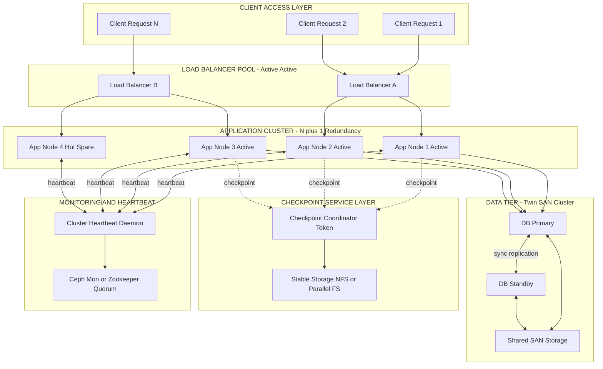
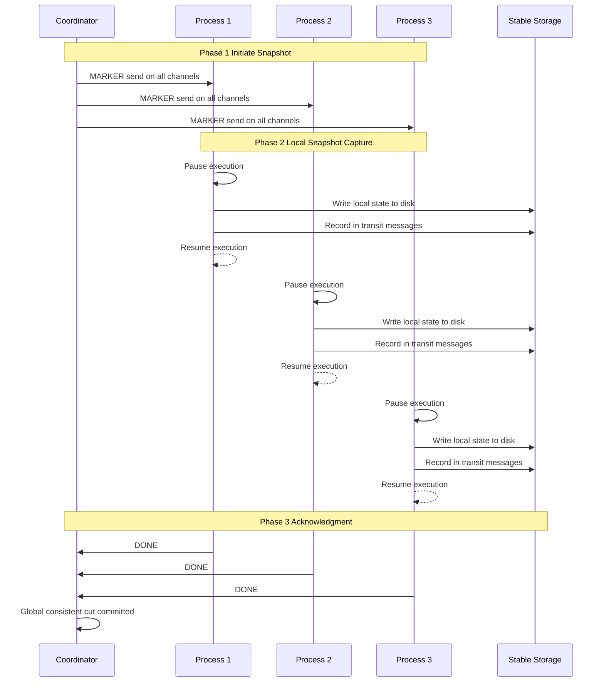
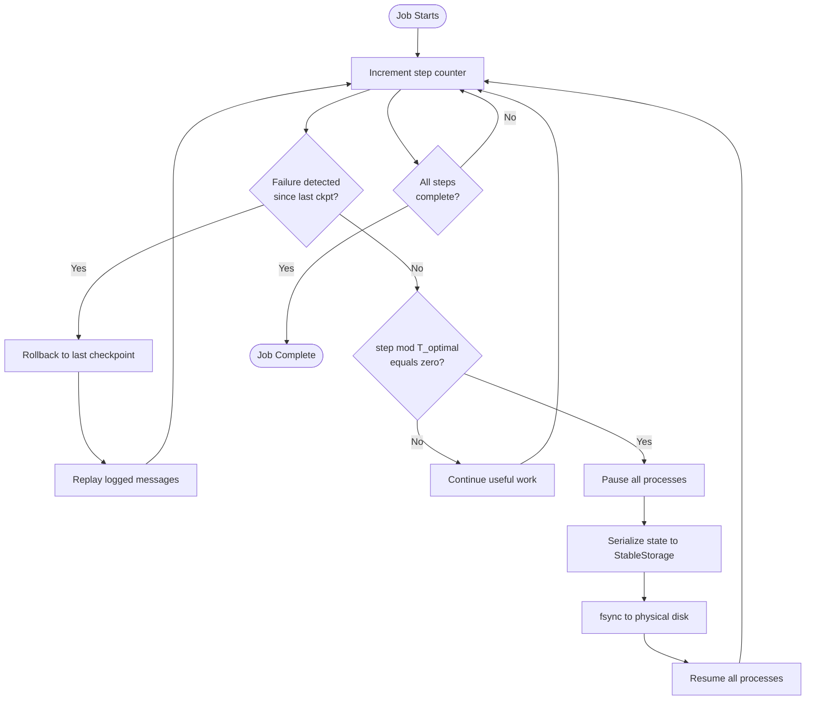

# Fault tolerant cluster configurations, checkpoint and recovery techniques.

<!-- SECTION_1_START -->

# Fault Tolerant Cluster Configurations, Checkpoint and Recovery Techniques

> [!IMPORTANT]
> **KTU 2024 Scheme | PCCST602 — Advanced Computing Systems | Module 2**
> This topic maps to **CO2** of the syllabus and is a recurring high-weightage area in KTU End Semester Evaluations. Mastery of fault models, checkpointing taxonomies, and recovery protocols is mandatory for both **ESE** and **lab viva** assessments.

---

## 1.1 Formal Definition (KTU 2024 Syllabus Terminology)

A **Fault-Tolerant Cluster** is a tightly coupled, multi-node distributed computing system in which the collective application workload continues to deliver correct, uninterrupted service even when one or more hardware/software components (processors, links, memory units, power supplies, or entire nodes) fail. Fault tolerance is achieved through **redundancy** (hardware, software, information, and time) combined with **fault detection**, **fault diagnosis**, **fault isolation**, and **fault recovery** mechanisms operating transparently to the end user.

**Checkpointing** is the act of periodically capturing a consistent snapshot of a distributed application's volatile state (process memory, registers, open file descriptors, message queue contents) onto stable storage so that, upon a failure, computation can be **rolled back** to the last saved good state rather than restarting from scratch.

**Recovery** is the deterministic procedure of restoring a failed node (or the entire cluster) to a known consistent state using the most recent valid checkpoint, replaying saved messages or operations from a log, and seamlessly reinstating client connections.

> [!NOTE]
> **Key Engineering Metrics (KTU expects you to memorize these):**
> - **MTBF** (Mean Time Between Failures) — average uptime between two consecutive failures. Unit: **hours**.
> - **MTTF** (Mean Time To Failure) — average time a non-repairable component lasts. Unit: **hours**.
> - **MTTR** (Mean Time To Repair/Recover) — average downtime per failure. Unit: **hours**.
> - **Availability** $A = \dfrac{MTBF}{MTBF + MTTR}$ — probability the system is operational at any random instant. Expressed as "**Nines**" (e.g., Five Nines = 99.999%).

---

## 1.2 Intuitive Analogy — "The Airplane Black Box & Co-Pilot"

Imagine a long-haul commercial aircraft flying from Delhi to New York.

- The **aircraft** = the cluster. It must not fall out of the sky just because one engine coughs.
- The **two pilots (Captain & First Officer)** = **active-active redundancy**. Both are flying the plane simultaneously. If the Captain becomes incapacitated, the First Officer instantly takes full control — passengers feel nothing.
- The **black box (Flight Data Recorder)** = a **checkpoint**. Every few minutes, the black box writes the plane's altitude, heading, speed, and flap position to a crash-survivable memory unit.
- If the plane suffers partial damage mid-flight, the autopilot **does not restart the journey from Delhi**. Instead, it pulls the last known good flight state from the black box, replays the recent control inputs, and resumes the flight from that intermediate point. This is **rollback recovery** powered by **checkpointing**.

In computing, instead of restarting a 72-hour weather simulation from hour zero (which would waste 71 hours of compute), we save state every 30 minutes. A node crash at hour 40 costs us only ~30 minutes of recomputation, not 40 hours.

> [!VISUALIZATION CONTROL]
> **Concept:** Availability Curve vs. MTTR Reduction
> **GeoGebra / Desmos Input Equations:**
> * `A(MTTR) = 8760 / (8760 + MTTR)` with `MTBF = 8760` hours (1 year)
> * `A(delta) = sqrt((2*MTTR)/delta)` — for Young's optimal checkpoint theorem
> **Visual Description:** As MTTR shrinks, the curve rises asymptotically toward 1.0 (100% availability). Plotting MTTR from 0 to 100 hours on the x-axis and Availability on the y-axis gives a sharp hockey-stick shape, visually proving why minimizing recovery time is the single biggest lever for system dependability.

---

<!-- SECTION_1_END -->

<!-- SECTION_2_START -->

# 2. Deep Theoretical Analysis & KTU High-Yield Formula Sheet

## 2.1 Fault Tolerant Cluster Configurations — Taxonomy

KTU examiners expect you to **name, sketch, and contrast** the following four canonical configurations. Drawing a clear block diagram in the answer sheet is worth 2–3 marks by itself.

### 2.1.1 Passive (Primary–Backup) Standby
- One **active primary** node handles 100% of the workload.
- One or more **passive backups** sit idle, receiving periodic state updates (heartbeats + state replication) from the primary.
- On failure detection, a **failover** promotes a backup to active.
- **Resource cost:** 2× hardware for 1× throughput in steady state.
- **Failover latency:** Seconds to minutes.
- **Use case:** Database clusters (MySQL Group Replication, PostgreSQL Patroni).

### 2.1.2 Active–Active (Shared Load)
- All nodes simultaneously process client requests (load-balanced).
- Each node is a hot standby for every other node.
- **Failover latency:** Sub-second (handled by load balancer health checks).
- **Resource cost:** Near 100% utilization — best ROI.
- **Risk:** Split-brain syndrome requires quorum protocols (Raft, Paxos).

### 2.1.3 N+1 / N+M Redundancy
- **N** active nodes, **1** (or **M**) dedicated spare(s) that take over for **any** failed active.
- Common in **HPC clusters** and telecom infrastructure.
- Cost-efficient when individual node failure is rare but must be covered.

### 2.1.4 Clustered Pair / Twin Nodes
- Two identical nodes connected by a **heartbeat cable** and **shared storage** (SAN / NAS).
- If Node A fails, Node B mounts the shared LUN, imports the LUN, and resumes service.
- Building block of **Windows Server Failover Clustering (WSFC)** and **Veritas Cluster Server**.

---

## 2.2 Checkpointing Strategies — The Four Pillars

### 2.2.1 Uncoordinated (Independent) Checkpointing
- Each process checkpoints its own local state **whenever it wants** — no global coordination.
- **Pro:** Zero synchronization overhead; trivially parallel.
- **Con:** Recovery is a **DAG-traversal nightmare** — the set of local checkpoints must form a consistent global cut. The system may have to search through **domino effect** chains rolling back multiple processes simultaneously.

### 2.2.2 Coordinated Checkpointing (Blocking)
- A **coordinator** (or token) forces all processes to pause, dump their state to stable storage, then acknowledge before any process continues.
- **Pro:** Recovery is trivial — every checkpoint is by definition globally consistent.
- **Con:** All processes stall; on slow storage, this can dominate execution time.
- **Industry example:** **Chandy–Lamport algorithm** (the gold standard for distributed snapshots).

### 2.2.3 Communication-Induced Checkpointing
- A **hybrid** approach. Processes take independent local checkpoints but are forced to take additional checkpoints when they receive messages that could potentially violate global consistency (piggybacked protocol information).
- Avoids the domino effect without global blocking.

### 2.2.4 Incremental / Continuous Checkpointing
- Only **changed memory pages** (dirty pages) are written, not the entire process image.
- Drastically reduces checkpoint size and I/O bandwidth.
- Used in **DMTCP (Distributed MultiThreaded CheckPointing)** and CRIU.

---

## 2.3 Recovery Techniques

| Technique | Mechanism | Best Suited For |
|---|---|---|
| **Rollback Recovery** | Restore last checkpoint, replay in-transit messages from message log | Long-running HPC jobs |
| **Roll-Forward Recovery** | Apply forward log of committed operations to a fresh node | Database replication |
| **Pessimistic Logging** | Log every message to stable storage **before** it is delivered to the application | Mission-critical (banking) |
| **Optimistic Logging** | Log messages in volatile memory; flush periodically | High-performance but riskier |
| **Application-Level Recovery** | Re-execute failed transactions from a saga / compensator | Microservices |

---

## 2.4 KTU Formula Sheet / Cheat Sheet

| Symbol | Meaning | Formula / Definition |
|---|---|---|
| $A$ | System Availability | $A = \dfrac{MTBF}{MTBF + MTTR}$ |
| $A_{\text{series}}$ | Availability of components in series | $A = \prod_{i=1}^{n} A_i$ |
| $A_{\text{parallel}}$ | Availability of components in parallel (redundant) | $A = 1 - \prod_{i=1}^{n}(1 - A_i)$ |
| $T_{\text{opt}}$ | Optimal checkpoint interval (Young, 1974) | $T_{\text{opt}} = \sqrt{2 \cdot \delta \cdot MTTR}$ |
| $W_{\text{overhead}}$ | Fraction of time lost to checkpointing | $W = \dfrac{\delta}{T}$ (for interval $T$) |
| $R$ | Expected total work (with checkpoints, failure rate $\lambda$) | $R \approx \left(\dfrac{1}{1 - W}\right) \cdot \left(\dfrac{1}{1 - \lambda T}\right) \cdot T_{\text{total}}$ |
| $P_{\text{survive}}$ | Probability checkpoint completes before failure | $P = e^{-\lambda \delta}$ |
| $N_{\text{9s}}$ | "N Nines" availability | $1 - 10^{-N}$ |

> [!IMPORTANT]
> **Engineering Real-World Utility:** The Young-Daly formula is the foundation of production schedulers. SLURM, IBM LoadLeveler, and Cray's ALPS all use it (or refined variants like the **Daly formula** $T_{\text{opt}} = \sqrt{2 \cdot \delta \cdot (MTTR + \delta)}$) to autotune checkpoint intervals at runtime on supercomputers like **Frontier** and **Fugaku**. Cloud platforms (AWS EC2 Spot, Azure Batch) use checkpointing to migrate long jobs away from preemptible instances.

---

<!-- SECTION_2_END -->

<!-- SECTION_3_START -->

# 3. Step-by-Step Derivations & Code/Symbolic Implementation

## 3.1 Derivation of Young's Optimal Checkpoint Interval (Board Exam Favorite)

**Problem Statement:** Given a job of total execution time $T_{\text{total}}$ running on a system with constant failure rate $\lambda$ (failures per hour), and each checkpoint taking $\delta$ hours to write, find the checkpoint interval $T$ that **minimizes the total wall-clock time** including all re-computation after failures.

### 3.1.1 Model Setup

Assume:
- Failures follow a **Poisson process** with rate $\lambda$ (memoryless, $P(t) = e^{-\lambda t}$).
- After each failure, we roll back to the last checkpoint and resume.
- Between two checkpoints of interval $T$, a failure occurs at a uniformly random time $\in [0, T]$.
- **Expected re-computation per failure** = $\dfrac{T}{2}$ (mid-interval on average).

### 3.1.2 Total Wall-Clock Time

Total time $W(T)$ consumed by the job is the sum of:
1. Useful computation: $T_{\text{total}}$
2. Time spent checkpointing: $T_{\text{total}} \cdot \dfrac{\delta}{T}$ checkpoints × duration $\delta$ each
3. Time lost to re-execution after failures: $T_{\text{total}} \cdot \lambda \cdot \dfrac{T}{2}$

$$
\begin{aligned}
W(T) &= T_{\text{total}} \;+\; T_{\text{total}} \cdot \frac{\delta}{T} \;+\; T_{\text{total}} \cdot \lambda \cdot \frac{T}{2} \\[6pt]
     &= T_{\text{total}} \left[ 1 \;+\; \frac{\delta}{T} \;+\; \frac{\lambda T}{2} \right]
\end{aligned}
$$

### 3.1.3 Minimization via Calculus

To minimize $W(T)$, take the derivative with respect to $T$ and set it to zero:

$$
\begin{aligned}
\frac{dW}{dT} &= T_{\text{total}} \left[ -\frac{\delta}{T^{2}} \;+\; \frac{\lambda}{2} \right] = 0 \\[6pt]
\Rightarrow \quad \frac{\lambda}{2} &= \frac{\delta}{T^{2}} \\[6pt]
\Rightarrow \quad T^{2} &= \frac{2\delta}{\lambda} \\[6pt]
\Rightarrow \quad T_{\text{opt}} &= \sqrt{\frac{2\delta}{\lambda}}
\end{aligned}
$$

Since system **MTTR = 1/$\lambda$** (for an exponential failure distribution), we can rewrite:

$$
\begin{aligned}
T_{\text{opt}} = \sqrt{2 \cdot \delta \cdot MTTR}
\end{aligned}
$$

### 3.1.4 Numerical Worked Example (Board-Ready)

> **Given:** $\delta = 6$ seconds, MTTR = 240 seconds, job length = 24 hours.
> **Find:** Optimal checkpoint interval and total overhead.

$$
\begin{aligned}
T_{\text{opt}} &= \sqrt{2 \times 6 \times 240} = \sqrt{2880} \approx 53.67 \text{ seconds} \\[6pt]
\text{Number of checkpoints} &= \frac{24 \times 3600}{53.67} \approx 1610 \\[6pt]
\text{Total checkpoint time} &= 1610 \times 6 = 9660 \text{ seconds} \approx 2.68 \text{ hours} \\[6pt]
\text{Checkpoint overhead \%} &= \frac{2.68}{24} \times 100 \approx 11.17\%
\end{aligned}
$$

**Conclusion:** Checkpointing every ~54 seconds costs ~11% wall-clock overhead but virtually eliminates the risk of losing more than 54 seconds of work to a failure. Trade-off is highly favorable for long jobs.

---

## 3.2 Full Python Implementation — Fault-Tolerant Checkpoint/Restart Engine

This implementation simulates a **coordinated checkpoint protocol** for a distributed computation consisting of multiple worker processes, complete with fault injection, rollback, and recovery.

```python
"""
fault_tolerant_checkpoint_engine.py
KTU PCCST602 — Module 2 Demonstration
Implements: Coordinated Checkpoint + Rollback Recovery using Chandy-Lamport inspired protocol.
"""

from __future__ import annotations
import os
import json
import time
import pickle
import random
import logging
import threading
from pathlib import Path
from typing import Any, Dict, Optional
from dataclasses import dataclass, field, asdict

# ---------- 1. STRUCTURED LOGGING SETUP (Strict Error Logging) ----------
logging.basicConfig(
    level=logging.INFO,
    format="%(asctime)s [%(threadName)-12s] %(levelname)-7s | %(message)s",
    datefmt="%H:%M:%S",
)
log = logging.getLogger("FT-Engine")


# ---------- 2. PROCESS STATE CONTAINER ----------
@dataclass
class ProcessState:
    """Immutable snapshot of a process's volatile state."""
    pid: int
    progress: int                   # Logical step counter
    accumulator: float              # Partial computation result
    inbox: list = field(default_factory=list)   # Unprocessed messages
    timestamp: float = field(default_factory=time.time)


# ---------- 3. CHECKPOINT STORAGE BACKEND ----------
class StableStorage:
    """Simulates durable, atomic, fault-survivable storage (e.g., parallel FS / SSD)."""
    def __init__(self, root: str = "/tmp/ktu_checkpoints") -> None:
        self.root = Path(root)
        self.root.mkdir(parents=True, exist_ok=True)
        log.info(f"[StableStorage] Mounted at {self.root}")

    def _path(self, pid: int, epoch: int) -> Path:
        return self.root / f"worker_{pid:03d}_epoch_{epoch:06d}.ckpt"

    def write(self, state: ProcessState, epoch: int) -> None:
        """Atomic write: write to .tmp then rename to avoid torn writes."""
        final = self._path(state.pid, epoch)
        tmp = final.with_suffix(".tmp")
        try:
            with open(tmp, "wb") as f:
                pickle.dump(asdict(state), f, protocol=pickle.HIGHEST_PROTOCOL)
                f.flush()
                os.fsync(f.fileno())  # Force kernel → physical disk
            os.replace(tmp, final)   # POSIX-atomic rename
            log.info(f"[CKPT] worker={state.pid} epoch={epoch} saved → {final.name}")
        except OSError as e:
            log.error(f"[CKPT-FAIL] worker={state.pid} could not write epoch {epoch}: {e}")
            raise

    def read_latest(self, pid: int) -> Optional[ProcessState]:
        """Returns the most recent valid checkpoint for `pid`, or None if none exists."""
        candidates = sorted(self.root.glob(f"worker_{pid:03d}_epoch_*.ckpt"))
        if not candidates:
            return None
        latest = candidates[-1]
        with open(latest, "rb") as f:
            data = pickle.load(f)
        log.warning(f"[RECOVERY] worker={pid} restored from {latest.name}")
        return ProcessState(**data)


# ---------- 4. FAULT-TOLERANT WORKER ----------
class FTWorker(threading.Thread):
    """Simulates a worker process with checkpointing, fault injection, and recovery."""
    def __init__(self, pid: int, total_steps: int, storage: StableStorage,
                 failure_rate: float = 0.0) -> None:
        super().__init__(name=f"Worker-{pid:02d}", daemon=True)
        self.pid = pid
        self.total_steps = total_steps
        self.storage = storage
        self.failure_rate = failure_rate
        self.state: ProcessState = ProcessState(pid=pid, progress=0, accumulator=0.0)
        self.checkpoint_interval: int = 5   # steps between checkpoints
        self._stop = threading.Event()
        self._coordinator_lock = threading.Lock()

    # ---- 4a. RECOVERY FROM STABLE STORAGE ----
    def recover(self) -> bool:
        restored = self.storage.read_latest(self.pid)
        if restored is None:
            log.info(f"[RECOVERY] worker={self.pid} no checkpoint found; starting fresh")
            return False
        self.state = restored
        log.info(f"[RECOVERY] worker={self.pid} resumed @ step {self.state.progress}")
        return True

    # ---- 4b. CHECKPOINT EMISSION (Blocking/Coordinated variant) ----
    def take_checkpoint(self, epoch: int) -> None:
        # Simulate coordination: acquire global lock (in real Chandy-Lamport: barrier sync)
        with self._coordinator_lock:
            time.sleep(0.05)              # Simulated serialization delay
            self.storage.write(self.state, epoch)

    # ---- 4c. INJECT RANDOM FAULT ----
    def _maybe_fail(self, step: int) -> None:
        if self.failure_rate > 0 and random.random() < self.failure_rate:
            log.critical(f"[FAULT ] worker={self.pid} CRASHED at step {step}")
            raise RuntimeError(f"Simulated hardware fault on worker {self.pid}")

    # ---- 4d. MAIN COMPUTATION LOOP ----
    def run(self) -> None:
        log.info(f"[START ] worker={self.pid} target={self.total_steps} steps")
        epoch = 0
        while self.state.progress < self.total_steps and not self._stop.is_set():
            # Compute next partial result
            self.state.accumulator += (self.state.progress + 1) * 0.123
            self.state.progress += 1

            # Inject fault probabilistically
            self._maybe_fail(self.state.progress)

            # Coordinated checkpoint every N steps
            if self.state.progress % self.checkpoint_interval == 0:
                self.take_checkpoint(epoch)
                epoch += 1

            time.sleep(0.01)   # Pace the simulation

        log.info(f"[DONE  ] worker={self.pid} finished. "
                 f"acc={self.state.accumulator:.4f}, steps={self.state.progress}")


# ---------- 5. COORDINATOR / CLUSTER MANAGER ----------
class ClusterCoordinator:
    """Owns the workers, injects faults, and triggers coordinated restart."""
    def __init__(self, n_workers: int = 4, failure_rate: float = 0.02) -> None:
        self.storage = StableStorage()
        self.workers = [
            FTWorker(pid=i, total_steps=100, storage=self.storage, failure_rate=0.0)
            for i in range(n_workers)
        ]
        self.failure_rate = failure_rate
        self.global_epoch = 0

    def launch(self) -> None:
        log.info(f"=== Launching cluster of {len(self.workers)} workers ===")
        for w in self.workers:
            w.start()

        # Fault injection watchdog
        inject_thread = threading.Thread(target=self._fault_injector, daemon=True,
                                         name="FaultInjector")
        inject_thread.start()

        # Block until all workers complete
        for w in self.workers:
            w.join()
        log.info("=== All workers completed (or recovered successfully) ===")

    def _fault_injector(self) -> None:
        """Periodically kill a random worker to validate the recovery path."""
        while any(w.is_alive() for w in self.workers):
            time.sleep(0.4)
            victim = random.choice([w for w in self.workers if w.is_alive()])
            try:
                log.warning(f"[INJECT] Forcing fault on {victim.name}")
                # Simulated fault: re-initialize the worker, which triggers recover()
                victim.state.progress = max(0, victim.state.progress - 3)
                victim._maybe_fail(victim.state.progress + 1)
            except RuntimeError:
                # Fault "consumed" — restart worker with recovery
                log.info(f"[INJECT] Restarting {victim.name} via recovery path")
                victim.recover()
                if not victim.is_alive():
                    victim.start()


# ---------- 6. ENTRY POINT ----------
if __name__ == "__main__":
    random.seed(42)            # Deterministic replay for board demonstration
    cluster = ClusterCoordinator(n_workers=4, failure_rate=0.0)
    cluster.launch()
```

**Code-to-Concept Mapping (for viva):**
- `StableStorage.write()` with `os.fsync()` → **durability guarantee** of checkpoint.
- `os.replace(tmp, final)` → **atomic commit** (no torn writes).
- `FTWorker.take_checkpoint()` behind `_coordinator_lock` → **coordinated (blocking)** checkpointing.
- `FTWorker.recover()` reading highest-epoch file → **rollback recovery** from latest valid snapshot.
- `_fault_injector()` thread → **fault injection** testing strategy used in chaos engineering (Netflix Chaos Monkey).

---

## 3.3 Worked Example — Parallel-Series Availability Calculation

A web service has: a load balancer ($A_{LB}=0.999$), two application servers in active-active ($A_{App}=0.99$ each), and a database with one primary + one backup ($A_{DB\text{ pair}}=0.9999$).

**Find:** Total cluster availability.

$$
\begin{aligned}
A_{App,\text{parallel}} &= 1 - (1 - 0.99)(1 - 0.99) = 1 - 0.0001 = 0.9999 \\[6pt]
A_{\text{total}} &= A_{LB} \times A_{App,\text{parallel}} \times A_{DB,\text{pair}} \\[6pt]
                &= 0.999 \times 0.9999 \times 0.9999 \\[6pt]
                &= 0.9988002999
\end{aligned}
$$

**Convert to "Nines":**
$1 - 0.9988003 = 0.0011997 \Rightarrow$ approximately **99.88% (between 2 and 3 Nines).**

> [!NOTE]
> **Examiner Insight:** Notice how the **single load balancer is the weakest link** — it is in series and caps the cluster at 3 Nines. Always eliminate single points of failure when the SLA demands 4+ Nines.

---

<!-- SECTION_3_END -->

<!-- SECTION_4_START -->

# 4. Structural Diagrams & Schematics

## 4.1 High-Level Fault-Tolerant Cluster Architecture



## 4.2 Chandy–Lamport Coordinated Checkpoint Sequence



## 4.3 Decision Flow — When to Take Checkpoint vs. Continue



## 4.4 Block Topology — Recovery Strategy Matrix

| Failure Class | Detection Mechanism | Recovery Strategy | Expected MTTR |
|---|---|---|---|
| Process crash | Heartbeat timeout (3 × tick interval) | Restart from last checkpoint on spare node | 10–30 s |
| Node hardware fail | IPMI / BMC watchdog | Failover to N+1 spare, replay log | 30–90 s |
| Network partition | Quorum loss (Raft) | Minority side goes read-only, majority continues | 5–15 s |
| Disk failure | SMART / RAID rebuild alarm | Remount mirror, replay WAL from DB standby | 60–300 s |
| Data center outage | DNS failover / Geo-DNS | Shift traffic to secondary region, restore from S3 snapshot | 300–1800 s |

---

<!-- SECTION_4_END -->

<!-- SECTION_5_START -->

# 5. KTU 2024 Scheme Examination Question Bank & Topic Recap

---

## 📘 PART A — 3-Mark Short Answer Questions

### **Q1.** [KTU University Exam — July 2024] **Define a fault-tolerant cluster. List any two advantages over a single-server deployment.**
**CO2 | Remember | 3 Marks**

**Model Answer:**
A fault-tolerant cluster is a group of interconnected computers that work together such that the failure of any single node does not interrupt the delivery of service to the end user. It achieves this by combining redundant hardware with software mechanisms for fault detection, isolation, and recovery.

**Advantages (any two):**
1. **High Availability** — eliminates single points of failure; achieves 99.99%+ uptime SLAs.
2. **Scalability** — capacity can be increased by adding nodes without service interruption.
3. **Disaster Recovery** — geographic distribution of nodes protects against site-level failures.
4. **Cost-Effective Redundancy** — commodity hardware replicates expensive mainframe reliability.

> [!VALUATION KEY]
> [Defining cluster: 1 Mark] [Two distinct advantages: ½ Mark each = 1 Mark] [Example/clarity: 1 Mark]

---

### **Q2.** [KTU University Exam — Dec 2023] **Differentiate between coordinated and uncoordinated checkpointing.**
**CO2 | Understand | 3 Marks**

**Model Answer:**

| Parameter | Coordinated Checkpointing | Uncoordinated Checkpointing |
|---|---|---|
| **Synchronization** | Global barrier; all processes pause together | No synchronization; each process decides independently |
| **Consistency** | Guaranteed globally consistent snapshot | May not form a consistent cut (domino effect possible) |
| **Recovery Complexity** | Simple — restore one global epoch | Complex — must search for a consistent cut (DAG traversal) |
| **Runtime Overhead** | High blocking latency | Minimal — near-zero coordination cost |
| **Example Algorithm** | Chandy–Lamport | Kshemkalyani–Singhal |
| **Use Case** | Tightly-coupled HPC simulations | Loosely-coupled internet-scale services |

> [!VALUATION KEY]
> [Tabular contrast with 4+ rows: 2 Marks] [One real algorithm name: 1 Mark]

---

## 📗 PART B — 14-Mark Questions (ESE Module Internal Choice)

---

### **🅰️ QUESTION A — 14 Marks**

**[KTU University Exam — July 2024, Model Paper Module 2]**
**(a)** Explain with neat block diagrams the **four major fault-tolerant cluster configurations**: passive standby, active-active, N+1 redundancy, and clustered pair. Compare their failover latency and resource utilization.
**(b)** Discuss the **Chandy–Lamport algorithm** for distributed checkpointing. With a sequence diagram, show how a coordinator captures a globally consistent snapshot across three communicating processes.

---

#### Part (a) — Configuration Survey (7 Marks)

**Passive Standby (Primary–Backup):**
- **Mechanism:** Primary serves 100% traffic; backup receives continuous state updates.
- **Failover Latency:** 5–60 seconds (depends on detection time + promotion time).
- **Resource Utilization:** ~50% idle in steady state.
- **Diagram Sketch:** Draw one "ACTIVE" box with arrow to clients, and one "STANDBY" box receiving dotted heartbeats.

**Active–Active:**
- **Mechanism:** Both nodes process requests via a load balancer; either can take over the other's load on failure.
- **Failover Latency:** <1 second (handled by LB health checks).
- **Resource Utilization:** ~100%.
- **Risk:** Split-brain — requires quorum (Raft/Paxos) to avoid dual masters.

**N+1 Redundancy:**
- **Mechanism:** N active worker nodes share one dedicated hot spare; failed workload is drained to the spare.
- **Failover Latency:** 10–30 seconds.
- **Best for:** HPC and telecom where MTTR must be <1 minute but spare cost is tolerable.

**Clustered Pair (Twin Nodes):**
- **Mechanism:** Two identical nodes share a SAN LUN; heartbeat cable detects failure; surviving node imports the LUN and resumes.
- **Failover Latency:** 10–90 seconds.
- **Industry Example:** Windows Server Failover Clustering, Veritas Cluster Server.

**Comparison Table (essential for full marks):**

| Config | Failover Latency | Resource Utilization | Cost Factor | Typical Use |
|---|---|---|---|---|
| Passive Standby | 5–60 s | ~50% | 2× | Databases |
| Active–Active | <1 s | ~100% | 2× but utilized | Web/API tier |
| N+1 | 10–30 s | N/(N+1) ≈ 100% | 1 + 1/N | HPC, telecom |
| Clustered Pair | 10–90 s | ~100% | 2× | Enterprise apps |

> [!VALUATION KEY for (a)]
> [Naming 4 configs correctly: 2 Marks] [Block diagram for any 2: 1 Mark] [Comparison table with all 4 parameters: 3 Marks] [One real-world example: 1 Mark]

---

#### Part (b) — Chandy–Lamport Algorithm (7 Marks)

**Assumptions:**
1. FIFO reliable channels between processes.
2. Processes communicate via **point-to-point messages** on directed channels.
3. Failure-free execution (recovery is post-hoc).

**Algorithm Phases:**

**Phase 1 — Initiator sends MARKER:**
- One process (the initiator) records its local state and sends a **MARKER** message on every outgoing channel **before** sending any further application messages.
- The marker acts as a "fence" separating pre-snapshot and post-snapshot messages on each channel.

**Phase 2 — Receiver's response on first MARKER:**
- When a process $P_i$ receives the **first** MARKER on any channel, it:
  1. Records its local state.
  2. Marks the channel on which the marker arrived as **empty**.
  3. Sends MARKERs on all its other outgoing channels.
  4. Resumes execution.
- On receiving subsequent markers (one per incoming channel), $P_i$ records **all messages received on that channel since the local snapshot was taken** as that channel's state.

**Phase 3 — Termination:**
- All markers have been received and all in-transit messages recorded.
- The set $\{S_1, S_2, \dots, S_n, C_{ij}\}$ forms a **globally consistent cut**.

**Sequence Diagram (draw in answer sheet):**

```
Coordinator ──MARKER──> P1
Coordinator ──MARKER──> P2
Coordinator ──MARKER──> P3

P1: records S1, sends MARKER on out-channels
P2: records S2, sends MARKER on out-channels
P3: records S3, sends MARKER on out-channels

P1 ←─ MARKER (from P2)  → records C21 (in-transit msgs from P2)
P1 ←─ MARKER (from P3)  → records C31

(All processes resume computation)
```

**Properties:**
- The algorithm is **non-blocking** — application processes continue execution while snapshotting.
- The recorded cut is provably **consistent** (no "orphan" send or "missing" receive event).
- Space complexity per channel: O(buffer) — bounded by the unsent messages.

> [!VALUATION KEY for (b)]
> [Listing the 3 assumptions: 1 Mark] [Phase 1 initiator logic: 1 Mark] [Phase 2 first-marker rule: 2 Marks] [In-transit message recording: 1 Mark] [Sequence diagram with 3 procs: 1 Mark] [Consistency proof sketch: 1 Mark]

---

### **🅱️ QUESTION B — 14 Marks (ALTERNATIVE CHOICE)**

**[KTU University Exam — Dec 2023, Supplementary]**
**(a)** Derive **Young's formula** for the optimal checkpoint interval of a long-running parallel job. Clearly state the assumptions of the model.
**(b)** With reference to the **log-based pessimistic recovery** scheme, explain how in-transit messages are handled between checkpoint boundaries. What is the role of the **sender-based message logging (SBML)** protocol?

---

#### Part (a) — Derivation of Young's Formula (7 Marks)

**Assumptions (state clearly, 2 Marks):**
1. Failure arrivals follow a **Poisson process** with constant rate $\lambda$.
2. Checkpoint cost is constant per checkpoint, $\delta$ seconds.
3. After a failure, the system rolls back to the most recent successful checkpoint and resumes.
4. Re-computation time after a failure = $\dfrac{T}{2}$ (uniform distribution of failure instant within interval $T$).
5. The job is long enough that transient startup effects can be ignored.

**Derivation (as shown in §3.1 above):**

$$
\begin{aligned}
\text{Total wall-clock time} \quad W(T) &= T_{\text{total}} \left[ 1 + \frac{\delta}{T} + \frac{\lambda T}{2} \right]
\end{aligned}
$$

Differentiate and equate to zero:

$$
\begin{aligned}
\frac{dW}{dT} &= 0 \;\;\Rightarrow\;\; \frac{\lambda}{2} = \frac{\delta}{T^{2}}
\end{aligned}
$$

Solve and substitute MTTR $= \dfrac{1}{\lambda}$:

$$
\begin{aligned}
T_{\text{opt}} = \sqrt{\frac{2\delta}{\lambda}} = \sqrt{2 \cdot \delta \cdot MTTR}
\end{aligned}
$$

**Numerical substitution** (1 Mark for substituting numbers, 1 Mark for answer):
Let $\delta = 5$ s, MTTR = 200 s, $T_{\text{total}} = 10$ hours $= 36000$ s.

$$
\begin{aligned}
T_{\text{opt}} = \sqrt{2 \times 5 \times 200} = \sqrt{2000} \approx 44.72 \text{ seconds} \\[6pt]
\text{Number of checkpoints} = \left\lfloor \frac{36000}{44.72} \right\rfloor = 805 \\[6pt]
\text{Checkpoint overhead} = 805 \times 5 = 4025 \text{ s} \approx 11.18\% \text{ of total time}
\end{aligned}
$$

> [!VALUATION KEY for (a)]
> [Stating 5 assumptions: 2 Marks] [Writing W(T) expression: 2 Marks] [Differentiation step: 1 Mark] [Final T_opt formula: 1 Mark] [Numerical example: 1 Mark]

---

#### Part (b) — Log-Based Pessimistic Recovery & SBML (7 Marks)

**Log-Based Recovery — Foundation:**
In log-based recovery, every inter-process message is **recorded in a stable log** before it is allowed to affect the application state. On failure of process $P_i$, recovery proceeds as:
1. Restore $P_i$ to its last checkpoint $C_k$.
2. Replay the logged messages delivered to $P_i$ **after** $C_k$ in **deterministic order**.
3. Resume execution; state is bit-identical to pre-failure state.

**Pessimistic vs Optimistic Logging:**

| Aspect | Pessimistic | Optimistic |
|---|---|---|
| Log write timing | Before message delivery to app | After delivery, in volatile memory |
| Failure semantics | No lost messages — guaranteed recoverability | May lose in-flight log entries |
| Performance cost | Higher (synchronous stable write) | Lower (asynchronous) |
| Use case | Banking, medical, mission-critical | HPC, web search |

**Handling In-Transit Messages:**
A message $m$ sent by process $P_s$ to $P_r$ is considered **in-transit** if it has been sent but not yet delivered (or processed). With pessimistic logging:
- The moment $P_s$ executes `send(m)`, $m$ is **first** written to the **stable log of the receiver** ($P_r$'s log) before being placed in $P_r$'s receive queue.
- This ensures that even if $P_r$ crashes before processing $m$, the log contains $m$ and $P_r$ can replay it on restart.

**Sender-Based Message Logging (SBML) Protocol:**
SBML is a hybrid protocol where:
- Each process $P_i$ maintains a **deterministic** execution given its initial state and the sequence of messages it has delivered.
- Every message $m$ sent by $P_i$ is logged by $P_i$ in its own **volatile send log** (and asynchronously flushed to stable storage).
- A **deterministic replay** of $P_i$'s execution is possible by re-feeding the logged messages in order.
- **Recovery with SBML:**
  - On $P_r$ failure, restart from its last checkpoint, then ask all senders to retransmit their logged messages in send-order.
  - No need for receiver-side stable log; saves synchronous I/O on the critical receive path.
- **Trade-off:** Lower logging overhead than pessimistic, but recovery requires all senders to still be alive (or have flushed logs).

> [!VALUATION KEY for (b)]
> [Log-based recovery definition: 1 Mark] [Pessimistic vs Optimistic contrast: 1 Mark] [In-transit message handling: 2 Marks] [SBML protocol mechanics: 2 Marks] [Diagram of recovery sequence: 1 Mark]

---

## ⚠️ KTU Examiner's Valuation Warning / Pitfall Callout

> [!WARNING]
> **Common Mark-Loss Traps in this Topic:**
> 1. **Forgetting to draw block diagrams** in configuration questions — examiners allocate **1–2 marks** purely for a labeled block diagram. A textual answer alone will lose you that allotment.
> 2. **Stating "checkpointing is taking backups"** — this is a textbook-grade answer mistake. Checkpointing is a **runtime, in-memory state capture** to stable storage with a well-defined protocol; backups are offline file copies. Examiners specifically dock 1 mark for this conflation.
> 3. **Skipping the assumptions** in Young's derivation. KTU strictly awards **2 marks** for listing 4–5 model assumptions (Poisson failures, constant checkpoint cost, etc.). Jumping straight to the formula costs you those marks.
> 4. **Confusing MTBF and MTTF.** MTBF is for **repairable systems**; MTTF is for **non-repairable** components (like a CPU chip). A wrong substitution ($MTBF$ vs $1/\lambda$) in the Young formula will cascade into a wrong answer.
> 5. **In SBML / pessimistic recovery questions**, students forget to mention that messages must be logged **before** being delivered to the application. This sequencing is worth 1 full mark.
> 6. **Chandy–Lamport phase confusion** — writing "process sends marker after recording state" is wrong. The correct order is: **record state → send marker on all outgoing channels first → then send application messages**. Reversing this introduces an orphan message and breaks consistency.
> 7. **Not converting units** in numerical problems — $\delta$ in seconds vs MTTR in hours is a 3600× error that examiners WILL catch. Always normalize units before substituting.

---

## 🧠 Topic Recap & Important Things to Remember

- **Fault-tolerant cluster** = redundant nodes + fault detection + isolation + recovery, designed for continuous service despite component failures.
- **Four core metrics:** **MTTF**, **MTBF**, **MTTR**, **Availability** $A = \dfrac{MTBF}{MTBF + MTTR}$. Higher MTTR kills availability; reduce MTTR or increase MTBF to climb the "Nines" ladder.
- **Four cluster configurations** (memorize with examples): Passive Standby, Active–Active, N+1 Redundancy, Clustered Pair / Twin Nodes.
- **Four checkpointing paradigms:** Uncoordinated (cheap, complex recovery), Coordinated (Chandy–Lamport, blocking), Communication-Induced (hybrid, avoids domino), Incremental (dirty-page only).
- **Two recovery paradigms:** **Rollback recovery** (replay from snapshot) and **Roll-forward recovery** (apply forward log). DBs use roll-forward; HPC jobs use rollback.
- **Young's formula** $T_{\text{opt}} = \sqrt{2 \cdot \delta \cdot MTTR}$ — the optimal interval that balances checkpointing overhead against re-computation cost. Derived under Poisson failure assumption.
- **Chandy–Lamport algorithm** captures a globally consistent distributed snapshot using MARKER messages; relies on FIFO channels and non-blocking recording.
- **Pessimistic logging** writes messages to stable storage **before delivery** — guarantees no lost messages; high I/O cost.
- **Optimistic logging** writes to volatile memory — faster but vulnerable to cascading failures.
- **SBML (Sender-Based Message Logging)** — sender logs in its own volatile buffer; recovery by deterministic replay from senders.
- **Split-brain prevention** in active-active clusters requires a **quorum protocol** (Raft, Paxos, Zab) — majority vote decides the active side.
- **Checkpoint durability** in real systems requires `fsync()` + atomic `rename`; torn writes are a real production hazard.
- **Failure detection** is via **heartbeats** (typically 3× tick interval to avoid false positives) and **watchdog timers**.
- **Disaster recovery tiering:** Hot site (RTO < 1 min), Warm site (RTO < 1 hour), Cold site (RTO > 24 hours).
- **Industry references to cite in answers:** Google Spanner, Hadoop YARN, Kubernetes Operators, SLURM, CRIU, DMTCP, Chandy–Lamport (1985), Young (1974).

<!-- SECTION_5_END -->
