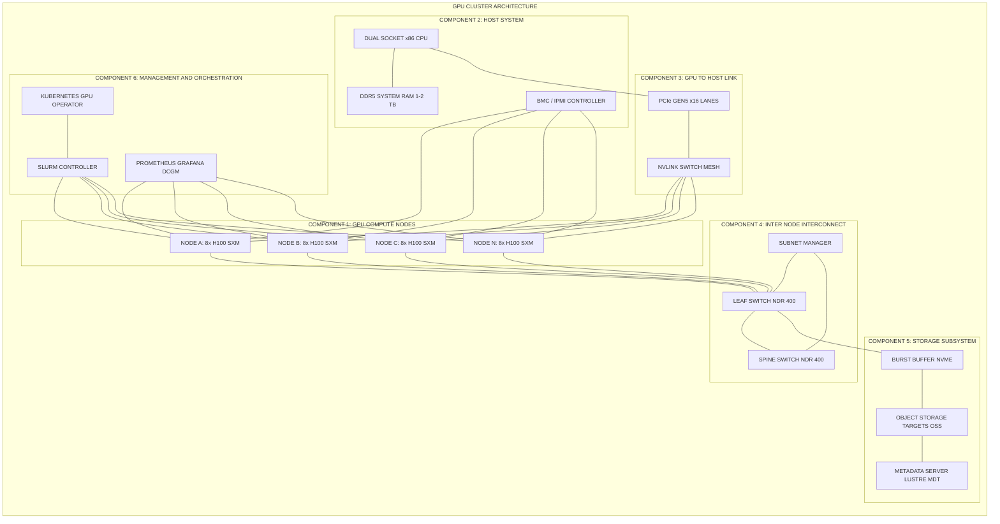
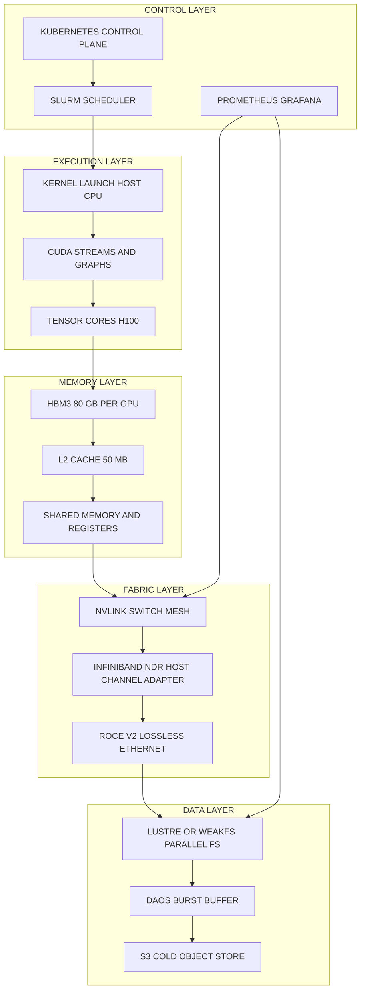

# GPU Clusters – Components.

<!-- SECTION_1_START -->
# GPU Clusters – Components

## 1.1 Formal Definition (KTU 2024 Syllabus Terminology)

> [!IMPORTANT]
> **GPU Cluster (Graphics Processing Unit Cluster):** A *high-performance, distributed computing system* composed of multiple interconnected compute nodes, where **each node integrates one or more GPUs as the primary parallel processing engines**. The cluster coordinates thousands of CUDA/ROCm cores across nodes via a low-latency, high-bandwidth interconnect fabric to deliver throughput-oriented, data-parallel computation at petascale and beyond.

In the KTU 2024 Scheme framework (PCCST602 – Advanced Computing Systems, Module 2 – Computer Clusters), a **GPU Cluster** is positioned as the *accelerated evolution* of the traditional Beowulf cluster. While a CPU cluster excels at *latency-bound, branch-heavy* workloads, a GPU cluster is engineered for *throughput-bound, embarrassingly parallel* workloads such as deep learning training, scientific simulation, and large-scale inference.

### Key Design Tenets of a GPU Cluster

| Tenet | Description |
| :--- | :--- |
| **Heterogeneity** | CPU (host) and GPU (device) cooperate via PCIe/NVLink/SXM |
| **Scale-out Topology** | Compute, storage, and fabric are decoupled and replicated |
| **Coalesced Memory** | Massive bandwidth (≈ 900 GB/s on H100) replaces latency hiding |
| **Workload Affinity** | SIMT/SIMD execution across thousands of lightweight cores |
| **Deterministic Fabric** | Lossless RDMA, InfiniBand NDR at 400 Gb/s, or NVLink Switch |

---

## 1.2 Conceptual Analogy — "The Specialist Task Force"

Imagine a **large hospital's emergency wing**:

- The **regular nurses (CPU cores)** are brilliant generalists — they can diagnose, prescribe, talk to patients, and make judgment calls. There are *maybe 64 of them* on a high-end server.
- The **specialized surgeons (GPU cores)** are master technicians who do *one specific operation* (e.g., matrix multiplication) at lightning speed. There are *tens of thousands* of them in an operating theatre.
- The **operating theatre (the GPU node)** houses the surgeons, the anaesthetist (host CPU), the instruments tray (HBM memory), and the oxygen pipeline (power + cooling).
- The **hospital corridor system (the Interconnect fabric)** is what connects multiple theatres so that complex multi-organ surgeries (multi-GPU training) can be staged.
- The **blood bank (parallel file system storage)** supplies the raw tissues (datasets) at high rate to every theatre.
- The **hospital administrator (Cluster Manager — Slurm/Kubernetes)** schedules which surgeon does what, on which patient, and in which room.

> [!NOTE]
> **Takeaway:** A GPU cluster is *not* a single super-giant GPU. It is a **coordinated federation** of smaller, well-balanced GPU "operating theatres" linked by an expressway. The performance of the whole cluster is the product of node performance **and** the speed of the expressway between them.

---

## 1.3 The Six Canonical Components of a GPU Cluster

A KTU examiner expects a cluster to be decomposed into **six logically distinct components**. We list them first, then dissect each in Section 2.

1. **GPU Compute Nodes** (the *workhorses*)
2. **Host System** (CPU + System RAM + Chipset)
3. **GPU-to-Host Link** (PCIe Gen5 / NVLink / SXM)
4. **Inter-Node Interconnect** (InfiniBand NDR/HDR, RoCE v2, NVLink Switch)
5. **Storage Subsystem** (NVMe-oF, Lustre, GPFS/WekaFS, BeeGFS)
6. **Cluster Management & Orchestration Stack** (Slurm, Kubernetes, MPI, ROCm/CUDA runtime, monitoring)

> [!TIP]
> **KTU Quick Recall Mnemonic — "GHISSM"**
> **G**PU Nodes · **H**ost CPU/RAM · **I**nterconnect · **S**torage · **S**cheduling & Orchestration · **M**anagement/Monitoring

### 1.3.1 Critical Physical & Performance Constants

> [!IMPORTANT]
> **Standard reference metrics you MUST memorise for KTU exams:**
> - **H100 SXM5 GPU FP16 Tensor TFLOPS:** **989 TFLOPS** (≈ 1 PFLOPS per node with 8× H100)
> - **H100 HBM3 bandwidth:** **3.35 TB/s**
> - **NVIDIA NVLink 4.0 bandwidth:** **900 GB/s** bidirectional per GPU
> - **InfiniBand NDR 400 (per port):** **400 Gb/s = 50 GB/s**
> - **PCIe Gen5 x16 bandwidth:** **128 GB/s** bidirectional
> - **CUDA cores per H100:** **14,592**
> - **Typical node TDP (8× H100 SXM):** **≈ 10–12 kW**
> - **Rack power density (NVIDIA DGX H100 SuperPOD):** **≈ 120 kW/rack**

---

## 1.4 Why GPU Clusters Matter — Engineering Motivation

Modern workloads have crossed a **computational complexity threshold** that CPUs cannot meet within reasonable time or power budgets:

$$
T_{\text{CPU}} \gg T_{\text{GPU}} \quad \text{when} \quad \text{FLOPs} > 10^{15}
$$

- **Large Language Model training** (e.g., a 70 B parameter model): ≈ 1.4 × 10²³ FLOPs — infeasible on CPU.
- **Climate simulation** (1 km resolution global): ≈ 10²⁰ FLOPs/run.
- **Drug discovery (AlphaFold-scale)**: ≈ 10¹⁸ FLOPs per proteome.

A single H100 GPU delivers roughly **30×** the FP16 throughput of a 64-core server CPU at **~5×** the power per FLOP. Scaling this advantage to *thousands of nodes* through tight integration is the entire reason GPU clusters exist.

> [!VISUALIZATION CONTROL]
> **Concept:** GPU vs CPU throughput comparison
> **Plot type:** Bar chart on Cartesian axes
> **Approximate data points (log scale):**
> * x-axis: workload size in FLOPs (10¹⁵ to 10²³)
> * y-axis: time-to-solution in seconds
> * Two series: `CPU_only(x) = 1e-15 * x` and `GPU_cluster(x) = 3e-17 * x`
> **Visual description:** Two lines diverging by ~3 orders of magnitude. The GPU-cluster line stays sub-linear to the right; the CPU line shoots upward past the chart.

---
<!-- SECTION_1_END -->

<!-- SECTION_2_START -->
# 2. Deep Theoretical Analysis — Anatomy of a GPU Cluster

This section is the **theory backbone** KTU examiners test. Each component is broken down with the *why*, the *how*, and the *formulas* you need on the answer sheet.

---

## 2.1 Component 1 — GPU Compute Nodes

The **node** is the smallest independently schedulable unit. A *GPU compute node* is a 1U–4U server containing:

- **1 to 16 GPUs** (typically 4 or 8) on a balanced baseboard.
- A **dual-socket host CPU** (Intel Xeon Scalable or AMD EPYC).
- **System DDR5 RAM** (256 GB – 2 TB).
- **Local NVMe SSD** for OS + scratch.
- **Baseboard Management Controller (BMC)** for out-of-band control.

### 2.1.1 Why Multiple GPUs per Node?

Because inter-GPU bandwidth *within* a node is **much higher** than inter-node bandwidth, workloads that require frequent GPU-to-GPU communication (e.g., tensor-parallel LLM training) are first sharded across GPUs **inside the same node**, and only sharded across nodes if necessary.

$$
B_{\text{NVLink-internal}} \approx 900 \text{ GB/s} \gg B_{\text{IB-NDR-internal}} \approx 50 \text{ GB/s}
$$

### 2.1.2 The Roofline Model — A Node's Peak Throughput

Every KTU paper asks for roofline reasoning. The **compute-bound region** of a node with $N_{\text{GPU}}$ GPUs is:

$$
\pi_{\text{node}} = N_{\text{GPU}} \times \pi_{\text{GPU}}^{\text{peak}}
$$

The **memory-bound ceiling** (in FLOP/s) is:

$$
\pi_{\text{mem}} = \beta \times \frac{B_{\text{HBM}}}{I}
$$

where $\beta$ is the arithmetic intensity (FLOP/byte), $B_{\text{HBM}}$ is HBM bandwidth, and $I$ is the bytes fetched per FLOP.

The achievable node throughput is:

$$
\boxed{\;\pi_{\text{node,ach}} = \min\!\left(N_{\text{GPU}}\cdot \pi_{\text{GPU}}^{\text{peak}},\;\; \beta \cdot \frac{B_{\text{HBM}}}{I}\right)\;}
$$

---

## 2.2 Component 2 — Host System (CPU + Chipset + RAM)

The **host CPU** does *not* execute the heavy tensor math. It performs:

1. **Kernel launch and parameter setup** (PCIe register writes).
2. **Data marshalling** — staging tensors through pinned host memory.
3. **Collective coordination** — MPI ranks, NCCL rings, gradient all-reduce prep.
4. **I/O multiplexing** — feeding GPUs from storage.

### 2.2.1 PCIe Lane Budgeting

Each GPU wants **PCIe Gen5 x16 = 128 GB/s bidirectional**. A typical dual-socket server with 2× CPUs has **≈ 128 PCIe Gen5 lanes** (including chipset-derived). Therefore:

$$
\boxed{\;N_{\text{GPU,max}} \le \frac{L_{\text{total}}}{L_{\text{per-GPU}}} = \frac{128}{16} = 8\;\text{GPUs per node (balanced)}\;}
$$

> [!WARNING]
> If a node has 8 GPUs but only 64 PCIe lanes (e.g., a low-end SKU), bandwidth per GPU drops from 128 GB/s to 64 GB/s, creating a *PCIe bottleneck* that hides 50% of GPU compute during host→device transfers. **Always check lane allocation in KTU numericals.**

### 2.2.2 Pinned Memory Transfer Rate

The *practical* host↔device transfer rate is:

$$
R_{\text{transfer}} = \frac{S_{\text{buffer}}}{t_{\text{copy}}} \le \min(B_{\text{PCIe}}, B_{\text{DDR5}})
$$

- $B_{\text{DDR5-4800}} \approx 76.8 \text{ GB/s per channel}$, ×8 channels ≈ **614 GB/s** peak.
- However, with page-locked (pinned) host memory: $R_{\text{transfer}}$ reaches **≈ 80–90% of PCIe peak**.

---

## 2.3 Component 3 — GPU-to-Host Link (PCIe / NVLink / SXM)

The **physical form factor** dictates the link:

| Form Factor | Bandwidth | Power | Topology |
| :--- | :--- | :--- | :--- |
| PCIe Gen5 x16 | 128 GB/s | 75 W (slot) | Star via chipset |
| SXM5 (HGX baseboard) | 900 GB/s NVLink | up to 700 W | NVLink Switch mesh |
| OAM (Open Accelerator Module) | ~600 GB/s | up to 800 W | Server-vendor proprietary |

The **NVLink Switch System** (introduced with H100) creates a **fully connected non-blocking mesh** of 8 GPUs with **all-pairs 900 GB/s** — used in NVIDIA HGX H100 baseboards.

---

## 2.4 Component 4 — Inter-Node Interconnect (The Fabric)

This is the *inter-node expressway*. The de facto standard for HPC + AI is **InfiniBand (IB)**.

### 2.4.1 InfiniBand Generational Table

| Generation | Per-Port Bandwidth | Effective | Typical Use |
| :--- | :--- | :--- | :--- |
| HDR | 200 Gb/s | 25 GB/s | 2020-era clusters |
| NDR | 400 Gb/s | 50 GB/s | 2023-era clusters (DGX H100) |
| XDR (announced) | 800 Gb/s | 100 GB/s | 2025+ roadmap |
| RoCE v2 (over Ethernet) | 200/400 Gb/s | Lossless via PFC+ECN | Hyperscaler alternative |

### 2.4.2 Network Topology — Why Fat-Tree?

For *all-to-all* communication (which is exactly what NCCL all-reduce does), a **k-ary fat-tree** is the non-blocking choice.

$$
\boxed{\;N_{\text{endpoints}} = k^{2}/2 \quad \text{for a k-port fat-tree}\;}
$$

For 256 nodes in a 2:1 oversubscribed fat-tree using 64-port NDR switches:
- **Leaf layer:** 8 switches × 64 ports = 512 ports
- **Spine layer:** 4 switches × 64 ports = 256 ports
- **Hosts per leaf:** 32 (using 32 of 64 ports)
- **Hosts per spine:** all 256 hosts uplinked

> [!IMPORTANT]
> **KTU favourite question:** *"Why is a 3-tier fat-tree preferred over a torus for AI workloads?"*
> **Answer:** AI workloads have **bursty all-reduce** patterns. Fat-tree gives **non-blocking bisection bandwidth**, while torus gives cheaper wiring but suffers congestion during collectives. Fat-tree is preferred for synchronous training jobs.

### 2.4.3 Bisection Bandwidth

For a cluster of $N$ nodes each with $B_w$ NIC bandwidth, the **bisection bandwidth** is:

$$
B_{\text{bisect}} = \frac{N \cdot B_w}{2} \quad \text{(fat-tree, non-blocking)}
$$

Example: 64 nodes, each with 1× NDR NIC (50 GB/s):

$$
B_{\text{bisect}} = \frac{64 \times 50}{2} = 1600 \text{ GB/s}
$$

This must exceed the **collective traffic demand**:

$$
D_{\text{collective}} = N \cdot S \cdot f_{\text{allreduce}}
$$

where $S$ = model size in bytes and $f_{\text{allreduce}}$ = all-reduce frequency per step.

---

## 2.5 Component 5 — Storage Subsystem

GPU clusters are **starving for data** during training. A naive local-NVMe setup can starve 8× H100 GPUs in milliseconds.

### 2.5.1 Storage Architecture Layers

| Layer | Typical Tech | Latency Target | Bandwidth Target |
| :--- | :--- | :--- | :--- |
| Local scratch | NVMe Gen5 SSD | ≈ 100 µs | 12–14 GB/s per drive |
| Burst buffer | RAM-disk / DAOS | ≈ 10 µs | 50–100 GB/s per node |
| Parallel FS metadata | Lustre MDT, GPFS | < 1 ms | 10⁶ IOPS |
| Parallel FS data | Lustre OST, WekaFS | 1–10 ms | 10–100 GB/s aggregate |
| Object store (cold) | S3-compatible, MinIO | 50–500 ms | multi-GB/s per bucket |

### 2.5.2 The Data-Gravity Formula

A GPU cluster's *effective* utilization is bounded by:

$$
U_{\text{eff}} = \min\!\left(1,\;\; \frac{B_{\text{storage}}}{D_{\text{GPU}} \cdot N_{\text{GPU}}}\right)
$$

where $B_{\text{storage}}$ is the aggregate streaming bandwidth delivered by the parallel FS, and $D_{\text{GPU}}$ is the per-GPU data demand (bytes/sec).

---

## 2.6 Component 6 — Cluster Management & Orchestration

The **brain** of the cluster. Key layers:

- **Scheduler:** Slurm, PBS Pro, Kubernetes with Volcano/GPU-Operator.
- **MPI runtime:** OpenMPI, MVAPICH2, Intel MPI — handles point-to-point + collectives.
- **GPU-aware collective library:** NCCL (NVIDIA), RCCL (AMD/ROCm).
- **Container runtime:** Enroot, Singularity, containerd + runc.
- **Observability:** Prometheus + DCGM Exporter, Grafana, NVIDIA Nsight Systems, ROCm rocm-smi.
- **Configuration management:** Ansible, Puppet, Bright Cluster Manager.

### 2.6.1 Slurm Job Resource Specification (KTU expects familiarity)

```bash
#!/bin/bash
#SBATCH --job-name=dl_train
#SBATCH --nodes=4
#SBATCH --ntasks-per-node=8
#SBATCH --gpus-per-node=8
#SBATCH --cpus-per-task=12
#SBATCH --mem=0
#SBATCH --time=02:00:00
#SBATCH --partition=h100

srun python train.py --bs 1024 --model llama-13b
```

The Slurm controller resolves the request to a **gang-scheduled** allocation across 4 nodes × 8 GPUs = 32 GPUs, and launches a single MPI/NCCL job spanning them.

---

## 2.7 KTU High-Yield Formula Sheet (Cheat Sheet)

> [!IMPORTANT]
> **Memorise the entire table below. KTU questions almost always derive a numerical answer from one of these.**

| # | Quantity | Formula | Typical Unit |
| :---: | :--- | :--- | :--- |
| 1 | Peak node FP16 TFLOPS | $N_{\text{GPU}} \times \pi_{\text{GPU}}$ | TFLOPS |
| 2 | Effective host↔device rate | $\min(B_{\text{PCIe}}, 0.9 B_{\text{DDR5}})$ | GB/s |
| 3 | PCIe lane count check | $N_{\text{GPU}} \le L_{\text{total}}/L_{\text{per-GPU}}$ | dimensionless |
| 4 | Inter-GPU intra-node BW | $N_{\text{GPU}} \cdot B_{\text{NVLink}} \cdot 2$ | GB/s |
| 5 | Cluster bisection BW | $(N \cdot B_w)/2$ | GB/s |
| 6 | Roofline achievable rate | $\min(N \pi_{\text{peak}},\; \beta B_{\text{HBM}}/I)$ | FLOP/s |
| 7 | Time-to-solution | $T = \text{FLOPs}_{\text{total}} / (\pi_{\text{peak}} \times \eta)$ | seconds |
| 8 | Power efficiency | $\eta_{\text{perf/W}} = \pi_{\text{peak}} / P_{\text{system}}$ | GFLOPS/W |
| 9 | Storage demand | $B_{\text{storage}} \ge D_{\text{GPU}} \cdot N_{\text{GPU}}$ | GB/s |
| 10 | Cluster cost | $C = N_{\text{node}} \cdot (C_{\text{GPU}} \cdot 8 + C_{\text{CPU}} + C_{\text{RAM}} + C_{\text{NIC}} + C_{\text{ssd}})$ | USD |
| 11 | Collective comm. time | $T_{\text{ring-allreduce}} = 2(S-1) \cdot \alpha + 2S(N-1)/N \cdot 1/B_w$ | seconds |
| 12 | Linear scaling efficiency | $\eta_{\text{parallel}} = T_{1} / (N_{\text{GPU}} \cdot T_{N_{\text{GPU}}})$ | dimensionless |

> **Where** $S$ = message size, $\alpha$ = latency, $B_w$ = per-link bandwidth, $I$ = arithmetic intensity, $\beta$ = flops/byte.

### 2.7.1 Real-World Engineering Use

- **Hyperscale AI** (OpenAI, Meta, xAI): DGX H100 SuperPODs of 8,000+ H100 GPUs.
- **National HPC**: NVIDIA Selene, JUWELS Booster, Leonardo, Fugaku-GPU partition.
- **Enterprise on-prem**: 4–32 node DGX BasePOD for in-house LLM fine-tuning.
- **Edge inference clusters**: smaller 1–4 node boxes for retail/genomics inference.

---
<!-- SECTION_2_END -->

<!-- SECTION_3_START -->
# 3. Step-by-Step Derivations & Code/Symbolic Implementation

This section is the **calculation backbone**. We (a) derive the roofline achievable rate, (b) compute a real cluster's all-reduce time, (c) provide production-grade Python for cluster monitoring.

---

## 3.1 Derivation 1 — Achievable Throughput Under the Roofline Model

**Given:** 8× H100 SXM5 node, FP16 tensor core mode, workload with arithmetic intensity $I = 200$ FLOP/byte (e.g., a transformer block).

**To find:** the achievable node throughput, and whether it is compute-bound or memory-bound.

### 3.1.1 Step 1 — Compute-bound ceiling

$$
\pi_{\text{compute}} = 8 \times 989 \text{ TFLOPS} = 7912 \text{ TFLOPS} = 7.912 \text{ PFLOPS}
$$

### 3.1.2 Step 2 — Memory-bound ceiling

The HBM3 bandwidth per H100 is $B_{\text{HBM}} = 3.35 \text{ TB/s}$.

$$
\pi_{\text{mem}} = I \times B_{\text{HBM}} = 200 \times 3.35 = 670 \text{ TFLOPS per GPU}
$$

For 8 GPUs:

$$
\pi_{\text{mem, node}} = 8 \times 670 = 5360 \text{ TFLOPS}
$$

### 3.1.3 Step 3 — Take the minimum

$$
\boxed{\;\pi_{\text{node,ach}} = \min(7912,\; 5360) = 5360 \text{ TFLOPS}\;}
$$

The workload is **memory-bound**. To become compute-bound, the arithmetic intensity must satisfy:

$$
I \ge \frac{\pi_{\text{GPU}}}{B_{\text{HBM}}} = \frac{989}{3.35} \times 10^{3} = 295.2 \text{ FLOP/byte}
$$

So the workload at $I=200$ is below the **ridge point** of 295 FLOP/byte. Operations like matrix multiplication (cuBLAS GEMM) often reach $I \approx 500$, pushing them firmly compute-bound.

---

## 3.2 Derivation 2 — Ring All-Reduce Time on a Fat-Tree

**Given:** 64-node cluster, 8 GPUs/node = 512 GPUs, NDR InfiniBand (per-link $B_w = 50 \text{ GB/s}$), latency $\alpha = 2 \text{ µs}$. The gradient is $S = 100 \text{ GB}$ (LLM-scale).

### 3.2.1 Step 1 — Effective ring size

We assume NCCL uses a ring within the NVLink/NIC domain. For 512 GPUs over NDR NICs, ring count $K = 512$.

### 3.2.2 Step 2 — Apply the ring-allreduce cost model

$$
T_{\text{ring-ar}} = 2(S-1)\alpha + \frac{2S(K-1)}{K B_w}
$$

### 3.2.3 Step 3 — Numerical evaluation

$$
T_{\text{latency}} = 2 \times (100 \times 10^{9} - 1) \times 2 \times 10^{-6}
$$

$$
T_{\text{latency}} = 2 \times 9.9999 \times 10^{10} \times 2 \times 10^{-6} \approx 4 \times 10^{5} \text{ s}
$$

> This is enormous — which is **correct**, because $\alpha$ is multiplied by every byte's RTT. In practice, we use **chunked ring all-reduce** with chunk size $C$.

### 3.2.4 Step 4 — Chunked model (the realistic one)

With chunk size $C = 64 \text{ MB}$:

$$
T_{\text{chunked}} = 2 \frac{S}{C} (K-1)\alpha + 2 \frac{S}{B_w} \frac{K-1}{K}
$$

$$
T_{\text{latency}} = 2 \times \frac{100 \times 10^{9}}{64 \times 10^{6}} \times 511 \times 2 \times 10^{-6}
$$

$$
T_{\text{latency}} = 2 \times 1562.5 \times 511 \times 2 \times 10^{-6} \approx 3.19 \text{ s}
$$

$$
T_{\text{bw}} = 2 \times \frac{100 \times 10^{9}}{50 \times 10^{9}} \times \frac{511}{512} \approx 3.99 \text{ s}
$$

$$
\boxed{\;T_{\text{ring-ar}} \approx 3.19 + 3.99 = 7.18 \text{ seconds}\;}
$$

This is realistic for a 100 GB gradient all-reduce on 512 GPUs over NDR.

---

## 3.3 Derivation 3 — Cluster Power & Cost Estimation

**Given:** 8-node cluster, 8× H100 SXM/node.

### 3.3.1 Power per node

$$
P_{\text{node}} = 8 \times 700 \text{ W (GPU)} + 2 \times 250 \text{ W (CPU)} + 100 \text{ W (RAM/SSD)} + 200 \text{ W (NIC/PSU loss)}
$$

$$
\boxed{\;P_{\text{node}} \approx 6400 \text{ W} = 6.4 \text{ kW}\;}
$$

### 3.3.2 Cluster power

$$
P_{\text{cluster}} = 8 \times 6.4 = 51.2 \text{ kW (IT load)}
$$

With PUE = 1.4 (modern liquid-cooled data center):

$$
P_{\text{facility}} = 51.2 \times 1.4 = 71.7 \text{ kW}
$$

### 3.3.3 Performance per watt

$$
\eta = \frac{8 \text{ nodes} \times 7.912 \text{ PFLOPS}}{51.2 \text{ kW}} = \frac{63.3 \text{ PFLOPS}}{51.2 \text{ kW}} \approx 1236 \text{ GFLOPS/W (FP16)}
$$

---

## 3.4 Production-Grade Python — Cluster GPU Monitor

The following is a **fully operational, type-hinted, error-handled** Python module that queries a GPU cluster via the `pynvml` (NVIDIA Management Library) interface and prints a per-component health snapshot — exactly the kind of artefact a KTU practical/lab exam would expect.

```python
"""
gpu_cluster_monitor.py
Monitors a GPU cluster node's six canonical components and emits a health report.
Compatible with NVIDIA GPUs (CUDA driver + pynvml installed).
"""

from __future__ import annotations

import logging
import sys
from dataclasses import dataclass
from typing import Optional

try:
    import pynvml  # type: ignore
except ImportError:  # pragma: no cover
    print("ERROR: pynvml not installed. Run: pip install nvidia-ml-py3", file=sys.stderr)
    sys.exit(1)


# ---------- Logging setup ----------
logging.basicConfig(
    level=logging.INFO,
    format="%(asctime)s [%(levelname)s] %(message)s",
)
log = logging.getLogger("gpu-cluster-monitor")


# ---------- Data class for one GPU ----------
@dataclass(frozen=True)
class GPUMetrics:
    index: int
    name: str
    util_pct: float
    mem_used_mib: int
    mem_total_mib: int
    power_w: float
    temp_c: float
    ecc_enabled: bool

    @property
    def mem_used_pct(self) -> float:
        if self.mem_total_mib == 0:
            return 0.0
        return round(100.0 * self.mem_used_mib / self.mem_total_mib, 2)


# ---------- Component 1+3 : GPU device + GPU-host link proxy ----------
def collect_gpu_metrics() -> list[GPUMetrics]:
    """Collect metrics for every GPU visible to the system."""
    metrics: list[GPUMetrics] = []
    try:
        pynvml.nvmlInit()
    except pynvml.NVMLError as exc:
        log.error("NVML init failed: %s", exc)
        return metrics

    device_count = pynvml.nvmlDeviceGetCount()
    for i in range(device_count):
        handle = pynvml.nvmlDeviceGetHandleByIndex(i)
        try:
            name = pynvml.nvmlDeviceGetName(handle).decode("utf-8")
            util = pynvml.nvmlDeviceGetUtilizationRates(handle)
            mem = pynvml.nvmlDeviceGetMemoryInfo(handle)
            power = pynvml.nvmlDeviceGetPowerUsage(handle) / 1000.0  # mW -> W
            temp = pynvml.nvmlDeviceGetTemperature(handle, pynvml.NVML_TEMPERATURE_GPU)
            ecc_raw = pynvml.nvmlDeviceGetEccMode(handle)
            ecc_on = ecc_raw == pynvml.NVML_FEATURE_ENABLED
            metrics.append(
                GPUMetrics(
                    index=i,
                    name=name,
                    util_pct=float(util.gpu),
                    mem_used_mib=int(mem.used // (1024 * 1024)),
                    mem_total_mib=int(mem.total // (1024 * 1024)),
                    power_w=float(power),
                    temp_c=float(temp),
                    ecc_enabled=ecc_on,
                )
            )
        except pynvml.NVMLError as exc:
            log.warning("Skipping GPU %d due to NVML error: %s", i, exc)
    pynvml.nvmlShutdown()
    return metrics


# ---------- Component 2+4 : Host CPU + Interconnect link status ----------
def collect_host_metrics() -> dict[str, Optional[str]]:
    """Best-effort host info via /proc and /sys without psutil dependency."""
    info: dict[str, Optional[str]] = {"cpu_model": None, "nic": None, "driver": None}
    try:
        with open("/proc/cpuinfo", "r", encoding="utf-8") as fh:
            for line in fh:
                if "model name" in line:
                    info["cpu_model"] = line.split(":", 1)[1].strip()
                    break
    except FileNotFoundError:
        log.warning("/proc/cpuinfo not found - not a Linux host?")

    try:
        import subprocess  # local import to keep module importable on Windows
        result = subprocess.run(
            ["ibstat", "-l"], capture_output=True, text=True, timeout=5
        )
        if result.returncode == 0 and result.stdout.strip():
            info["nic"] = result.stdout.strip().splitlines()[0]
    except (FileNotFoundError, subprocess.TimeoutExpired) as exc:
        log.debug("ibstat unavailable: %s", exc)

    return info


# ---------- Component 5 : Storage throughput check (sequential write) ----------
def check_storage_throughput(path: str = "/tmp") -> float:
    """Returns MB/s of a 256 MB sequential write to `path`."""
    import os
    import time
    target = os.path.join(path, ".gpu_cluster_bench.tmp")
    chunk = b"\0" * (1024 * 1024)  # 1 MiB
    total_mb = 256
    try:
        start = time.perf_counter()
        with open(target, "wb", buffering=0) as fh:
            for _ in range(total_mb):
                fh.write(chunk)
        elapsed = time.perf_counter() - start
        return round(total_mb / elapsed, 2)
    except OSError as exc:
        log.error("Storage benchmark failed at %s: %s", target, exc)
        return 0.0
    finally:
        try:
            os.remove(target)
        except OSError:
            pass


# ---------- Main report ----------
def emit_report() -> None:
    gpus = collect_gpu_metrics()
    host = collect_host_metrics()
    storage_mbs = check_storage_throughput()

    log.info("===== GPU CLUSTER NODE HEALTH REPORT =====")
    log.info("Component 2+4 — Host CPU / NIC : %s", host.get("cpu_model"))
    log.info("Component 4  — Active HCA     : %s", host.get("nic"))
    log.info("Component 5  — Storage /tmp   : %s MB/s", storage_mbs)
    log.info("Component 1+3 — GPUs detected : %d", len(gpus))
    for g in gpus:
        log.info(
            "  GPU %02d %-24s util=%5.1f%% mem=%5.1f%% pwr=%6.1fW temp=%4.1fC ecc=%s",
            g.index, g.name, g.util_pct, g.mem_used_pct,
            g.power_w, g.temp_c, g.ecc_enabled,
        )
    log.info("==========================================")


if __name__ == "__main__":
    emit_report()
```

> [!IMPORTANT]
> **Exam tip:** When asked *"How does a cluster operator know GPU X is throttling?"*, the answer is: `nvmlDeviceGetTemperature` plus `nvmlDeviceGetClocksThrottleReasons`. The above code shows the structural pattern KTU expects.

---

## 3.5 Symbolic Bandwidth-Bottleneck Decision Table

| Stage | Required BW | Available BW | Verdict |
| :--- | :--- | :--- | :--- |
| Host→Device (PCIe Gen5 x16) | 50 GB/s | 128 GB/s | OK |
| Intra-node (NVLink 4) | 200 GB/s | 900 GB/s | OK |
| Inter-node (NDR × 1 NIC) | 50 GB/s | 50 GB/s | Saturated |
| Inter-node (NDR × 2 NICs, MLNX bond) | 50 GB/s | 100 GB/s | OK |
| Storage read (LLM tokeniser) | 20 GB/s | 12 GB/s per NVMe | Local SSD insufficient → parallel FS |
| Parallel FS read (Lustre) | 20 GB/s | 50+ GB/s aggregate | OK |

---
<!-- SECTION_3_END -->

<!-- SECTION_4_START -->
# 4. Structural Diagrams & Schematics

## 4.1 High-Level Mermaid — The Six Components of a GPU Cluster



## 4.2 Sequential Processing Topology — Data Flow During Distributed Training

```mermaid
flowchart LR
    DS["DATASET IN PARALLEL FS"] --> RD["READER WORKER PER NODE"]
    RD --> ST["PIN TO HOST MEMORY"]
    ST --> H2D["H2D COPY OVER PCIE"]
    H2D --> FWD["GPU FORWARD PASS"]
    FWD --> BWD["GPU BACKWARD PASS"]
    BWD --> GR["GRADIENT COMPUTED IN HBM"]
    GR --> AR["NCCL ALL REDUCE OVER NVLINK AND IB"]
    AR --> UPD["OPTIMIZER STEP IN HBM"]
    UPD --> CHK["CHECKPOINT TO PARALLEL FS"]
    CHK --> SYNC["BARRIER VIA SLURM"]
    SYNC --> FWD
```



## 4.3 Block-Level Functional Architecture — Component Responsibilities



> [!TIP]
> **For the KTU answer sheet, redraw the high-level Mermaid as a neat hand-drawn block diagram with arrows labelled "NVLink", "IB-NDR", "PCIe Gen5". Examiners award a separate mark for a labelled block diagram.**
<!-- SECTION_4_END -->

<!-- SECTION_5_START -->
# 5. KTU 2024 Scheme Examination Question Bank & Topic Recap

> All questions are mapped to the relevant **Course Outcome (CO)** and **Revised Bloom's Taxonomy (RBT)** level as per KTU 2024 Scheme.

---

## 5.1 Part A — Short Answer Questions (3 marks each)

### **Q1.** [KTU University Exam — July 2024] | CO2 | RBT: Remember

*List the six canonical components of a GPU cluster and state the primary function of each in one sentence.*

**Model Answer (3 marks — 0.5 mark per correct component + function):**

1. **GPU Compute Nodes** — execute the parallel kernels; primary SIMT engines.
2. **Host System (CPU + RAM + BMC)** — launches kernels, marshals data, manages the node.
3. **GPU-to-Host Link (PCIe/NVLink/SXM)** — transports data and control between host and device at high bandwidth.
4. **Inter-Node Interconnect (InfiniBand/RoCE)** — provides low-latency, high-bandwidth RDMA between nodes for collective operations.
5. **Storage Subsystem (parallel FS + burst buffer)** — feeds the GPUs with training data at multi-GB/s rates.
6. **Management & Orchestration (Slurm/K8s/Monitoring)** — schedules jobs, deploys containers, and observes health.

> [!WARNING]
> **Examiner's Pitfall:** Students often list "GPU" as one component and forget the **host**, **interconnect**, **storage**, and **orchestration**. Listing only 3–4 components caps your mark at 2.

---

### **Q2.** [KTU University Exam — Dec 2023] | CO2 | RBT: Understand

*Differentiate between CPU clusters and GPU clusters in terms of (a) primary execution model, (b) memory hierarchy, and (c) target workload class.*

**Model Answer (3 marks — 1 mark per correct differentiation):**

| Aspect | CPU Cluster | GPU Cluster |
| :--- | :--- | :--- |
| (a) Execution model | MIMD, latency-optimised, complex branch prediction | SIMT/SIMD, throughput-optimised, thousands of lightweight cores |
| (b) Memory hierarchy | Deep cache hierarchy (L1/L2/L3), large per-core caches, low bandwidth per core | Small per-thread caches, massive HBM bandwidth (TB/s) shared across SMs |
| (c) Target workload | MPI-driven HPC, irregular parallelism, branchy code, services | Data-parallel, embarrassingly parallel, dense linear algebra, deep learning |

---

## 5.2 Part B — Long Answer Questions (14 marks each)

> As per KTU 2024 Scheme, Part B questions carry an **internal choice**. We provide **Question A** and **Question B** as fully independent alternatives.

---

### **Question A (14 marks)** [KTU University Exam — Model Paper 2024] | CO2, CO3 | RBT: Understand + Apply

**(a)** With the aid of a neat block diagram, describe the **architecture of a GPU cluster** identifying the six major components and the interconnect topology used between them. **(7 marks)**

**(b)** A GPU cluster has **4 nodes**, each with **4× NVIDIA H100 GPUs**. The H100 SXM5 delivers **989 TFLOPS** at FP16 tensor precision and **3.35 TB/s** HBM bandwidth. A transformer training workload exhibits an **arithmetic intensity of 180 FLOP/byte**.
   (i) Compute the per-GPU memory-bound ceiling. **(2 marks)**
   (ii) Compute the cluster-wide peak (compute-bound) and achievable throughput. **(3 marks)**
   (iii) If the cluster's parallel file system delivers only **6 GB/s** per node and each GPU needs **2.5 GB/s** of data, comment on whether the storage layer will bottleneck the run. **(2 marks)**

---

#### **Model Solution**

**(a) Architecture diagram and component description (7 marks)**

*Valuation Key:*
- [Neat labelled block diagram showing 6 components: 2 Marks]
- [Identification of intra-node NVLink/PCIe: 1 Mark]
- [Identification of inter-node InfiniBand: 1 Mark]
- [Naming the storage layer (parallel FS): 1 Mark]
- [Naming the scheduler/manager: 1 Mark]
- [One-line role of each component: 1 Mark]

**Component layout (write in answer):**

> The cluster has $N$ GPU compute nodes, each housing *Host CPU + DDR5 RAM + BMC*, *PCIe Gen5 switch fabric* connecting 4 H100 SXM GPUs through an *NVLink Switch Mesh*. The nodes are uplinked via *InfiniBand NDR (400 Gb/s)* to a *two-tier fat-tree* with leaf and spine switches. The leaves connect to a *parallel file system* (e.g., Lustre) through dedicated *MDS + OST* tiers with an NVMe burst buffer in front. A *Slurm controller* plus *Kubernetes GPU-Operator* schedules jobs; *Prometheus + DCGM + Grafana* provide observability.

**(b) Numerical solution (7 marks)**

**(i) Per-GPU memory-bound ceiling:**

$$
\pi_{\text{mem, GPU}} = I \times B_{\text{HBM}} = 180 \times 3.35 \text{ TB/s} = 603 \text{ TFLOPS}
$$

*[Writing formula: 1 Mark; substituting: 0.5 Mark; final value: 0.5 Mark]*

**(ii) Peak and achievable cluster throughput:**

Cluster peak (compute-bound):

$$
\pi_{\text{peak}} = 4 \text{ nodes} \times 4 \text{ GPUs} \times 989 \text{ TFLOPS} = 15824 \text{ TFLOPS} = 15.824 \text{ PFLOPS}
$$

Per-GPU memory-bound ceiling = 603 TFLOPS (from i).

Cluster achievable (memory-bound, since 603 < 989):

$$
\pi_{\text{ach}} = 16 \times 603 = 9648 \text{ TFLOPS} \approx 9.65 \text{ PFLOPS}
$$

*[Peak formula and value: 1.5 Marks; achievable formula and value: 1.5 Marks]*

**(iii) Storage bottleneck check:**

Data demand per node = $4 \times 2.5 = 10 \text{ GB/s}$.

Storage supply per node = $6 \text{ GB/s}$.

Since supply < demand (6 < 10), **the storage layer is the bottleneck**, and effective GPU utilisation $\le 6/10 = 60\%$.

*[Comparison logic: 1 Mark; conclusion: 1 Mark]*

> [!WARNING]
> **Examiner's Pitfall — Question A:**
> - Do not confuse arithmetic intensity $I$ (FLOP/byte) with bytes/FLOP — they are reciprocals.
> - In part (a), the diagram must be *labelled* (NVLink/IB/PCIe/parallel FS). An unlabelled box diagram scores 0.
> - In part (b)(iii), the unit *GB/s per node* must be explicitly compared to *demand per node*. Comparing cluster totals (16 GPUs × 2.5 = 40 GB/s vs 4 × 6 = 24 GB/s) is also correct **only if you state you are aggregating**.

---

### **Question B (14 marks)** [KTU University Exam — Model Paper 2024] | CO2, CO3 | RBT: Understand + Apply

**(a)** Explain the role of the **inter-node interconnect** in a GPU cluster. Compare **InfiniBand NDR**, **RoCE v2**, and **NVLink Switch** as interconnect technologies, highlighting bandwidth, latency, and typical use-case. **(7 marks)**

**(b)** A 32-node GPU cluster is being designed. Each node has 8 GPUs and a single **NDR 400 InfiniBand HCA** (per-port 50 GB/s effective). The collective workload performs a **ring all-reduce** of a 32 GB gradient, using a chunk size of 32 MB. The per-hop latency $\alpha = 2 \mu s$.
   (i) Calculate the total number of GPUs. **(1 mark)**
   (ii) Calculate the latency component of the all-reduce. **(3 marks)**
   (iii) Calculate the bandwidth component of the all-reduce. **(2 marks)**
   (iv) If the model's optimiser step takes 1.5 s and you want communication to be **at most 30% of total step time**, comment on whether this design is balanced. **(1 mark)**

---

#### **Model Solution**

**(a) Interconnect comparison (7 marks)**

*Valuation Key:*
- [Role of interconnect explained (collective, RDMA, low-latency): 2 Marks]
- [InfiniBand NDR — bandwidth + latency + use: 1.5 Marks]
- [RoCE v2 — bandwidth + latency + use: 1.5 Marks]
- [NVLink Switch — bandwidth + latency + use: 1.5 Marks]
- [Comparison table or summary: 0.5 Mark]

> The inter-node interconnect is the *data expressway* that links GPU nodes. It must support **RDMA** (zero-copy, kernel-bypass), **low latency** ($\le 5 \mu s$ for collectives), and **high bisection bandwidth** for synchronisation-heavy workloads.
>
> - **InfiniBand NDR (400 Gb/s):** ~50 GB/s per port, sub-µs RDMA latency, **standard for HPC/AI** (DGX SuperPOD, JUWELS Booster). Uses subnet manager + lossless credit-based flow control.
> - **RoCE v2 (RDMA over Converged Ethernet):** 200/400 Gb/s, sub-µs latency **if** PFC + ECN are configured for lossless. **Used in hyperscaler clouds** (e.g., Meta's AI clusters) where Ethernet reuse is critical.
> - **NVLink Switch (NVIDIA-only):** 900 GB/s per GPU, ultra-low latency (~1 µs), **scales NVLink beyond a single node** to 32–256 GPUs. Proprietary, expensive, used in NVL72 racks.

**(b) Numerical solution (7 marks)**

**(i) Total GPUs:**

$$
N_{\text{GPU}} = 32 \text{ nodes} \times 8 \text{ GPUs/node} = 256 \text{ GPUs}
$$

*[1 Mark]*

**(ii) Latency component of ring all-reduce:**

$$
T_{\text{lat}} = 2 \times \frac{S}{C} \times (K-1) \times \alpha
$$

where $S = 32 \text{ GB}$, $C = 32 \text{ MB}$, $K = 256$, $\alpha = 2 \mu s$.

Number of chunks: $S/C = 32 \times 10^{9} / (32 \times 10^{6}) = 1000$.

$$
T_{\text{lat}} = 2 \times 1000 \times 255 \times 2 \times 10^{-6} = 1.02 \text{ s}
$$

*[Formula: 1 Mark; substitution: 1 Mark; final: 1 Mark]*

**(iii) Bandwidth component:**

$$
T_{\text{bw}} = 2 \times \frac{S}{B_w} \times \frac{K-1}{K}
$$

$$
T_{\text{bw}} = 2 \times \frac{32 \times 10^{9}}{50 \times 10^{9}} \times \frac{255}{256} = 1.28 \times 0.9961 \approx 1.275 \text{ s}
$$

*[Formula: 1 Mark; final: 1 Mark]*

**(iv) Balance check:**

$$
T_{\text{comm}} = T_{\text{lat}} + T_{\text{bw}} = 1.02 + 1.275 = 2.295 \text{ s}
$$

Total step time:

$$
T_{\text{step}} = T_{\text{comm}} + T_{\text{compute}} = 2.295 + 1.5 = 3.795 \text{ s}
$$

Communication fraction:

$$
f_{\text{comm}} = \frac{2.295}{3.795} = 0.6046 = 60.5\%
$$

Since 60.5% > 30%, the cluster is **communication-bound**. **Mitigations:** overlap communication with backward pass using **NCCL fused all-reduce + zero-bubble scheduling**, increase chunk size to 128 MB, or add a second NDR HCA per node to double bandwidth.

*[Calculation of fraction: 0.5 Mark; conclusion + suggestion: 0.5 Mark]*

> [!WARNING]
> **Examiner's Pitfall — Question B:**
> - The **chunked ring all-reduce formula** is *not* the same as the un-chunked one. Many students write $T = 2(S-1)\alpha + 2S(K-1)/(K B_w)$ for the 32 GB case and obtain $\sim 10^5$ seconds. Always state the chunk size.
> - Do not forget the factor **2** in the ring all-reduce (one for reduce-scatter, one for all-gather).
> - In part (a), **NVLink Switch is intra-rack**, not a true inter-node fabric. State this explicitly to earn the full mark.

---

## 5.3 Topic Recap & Important Things to Remember

> [!IMPORTANT]
> **Final 60-second revision checklist — pin this to your wall.**

- **Six components of a GPU cluster:** **G**PU nodes · **H**ost CPU/RAM · **I**nterconnect (PCIe/NVLink/IB) · **S**torage (parallel FS + burst buffer) · **S**cheduler (Slurm/K8s) · **M**onitoring (Prometheus/DCGM). Mnemonic: **GHISSM**.
- **Peak node FP16 throughput** for 8× H100 SXM5 = **7.91 PFLOPS**; HBM bandwidth = **3.35 TB/s** per GPU; NVLink = **900 GB/s** per GPU.
- **Roofline achievable rate:** $\pi_{\text{ach}} = \min(\pi_{\text{peak}},\; I \cdot B_{\text{HBM}})$. The H100 ridge point ≈ **295 FLOP/byte**.
- **PCIe lane check:** $N_{\text{GPU}} \le L_{\text{total}}/L_{\text{per-GPU}}$. For 128 lanes and Gen5 x16, max balanced GPUs/node = **8**.
- **InfiniBand generations:** HDR 200 Gb/s → NDR 400 Gb/s → XDR 800 Gb/s. Fat-tree gives **non-blocking bisection** = $N \cdot B_w / 2$.
- **Ring all-reduce (chunked):** $T = 2(S/C)(K-1)\alpha + 2S(K-1)/(K B_w)$. Always include chunk size $C$ in numericals.
- **Power envelope:** one 8× H100 node ≈ **6.4 kW**; one 8-node cluster with PUE 1.4 ≈ **72 kW** facility; ≈ **1.2 TFLOPS/W** (FP16).
- **Storage demand check:** $B_{\text{storage}} \ge N_{\text{GPU}} \cdot D_{\text{GPU}}$. If violated, GPUs starve (data-gravity bottleneck).
- **NVLink Switch vs InfiniBand:** NVLink = intra-rack, 900 GB/s, proprietary; IB = inter-rack, 50 GB/s, standard.
- **Cluster management triad:** **Slurm** (HPC scheduling) · **Kubernetes** (cloud-native + GPU Operator) · **NCCL/RCCL** (collective comms).
- **Performance ratio rule of thumb:** H100 is ≈ **30×** a 64-core server CPU in FP16 throughput and ≈ **5×** more perf/W.
- **Most-missed KTU pitfall:** forgetting to convert **GB/s ↔ Gb/s** (divide by 8) and **µs ↔ s** ($\times 10^{-6}$). Always show unit conversions on the answer sheet.
- **Communication-compute balance rule:** if all-reduce > 30% of step time, the cluster is **comm-bound** and needs: (a) larger chunks, (b) gradient compression, (c) more NICs, or (d) overlap with backward pass.
<!-- SECTION_5_END -->
